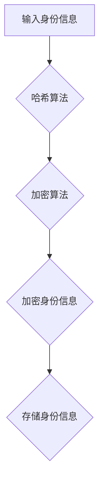

                 

# 《区块链在数字身份验证中的应用：简化跨平台身份认证》

> 关键词：区块链、数字身份验证、跨平台身份认证、安全性、效率

摘要：本文深入探讨了区块链技术在数字身份验证领域的应用，通过分析其背景、核心概念、应用案例和算法原理，展示了区块链如何简化跨平台身份认证过程，提高认证安全性和效率。文章旨在为IT专业人士和相关企业提供理论指导和实践参考。

## 1. 引言

在当今数字化时代，身份验证已成为保障信息安全的关键环节。然而，传统的身份验证方式在面对复杂的应用场景时，存在诸多挑战，如安全性不足、隐私泄露、互操作性差等。区块链技术的崛起，为数字身份验证提供了一种全新的解决方案，其去中心化、透明、不可篡改的特性，为身份认证提供了坚实的基础。

本文将围绕区块链在数字身份验证中的应用，详细探讨其背景、核心概念、应用案例和算法原理，旨在为读者提供全面的理论和实践指导。文章结构如下：

- 引言：介绍区块链在数字身份验证中的重要性。
- 背景介绍：分析数字身份验证的挑战和传统解决方案的不足。
- 核心概念与联系：阐述区块链、数字身份、智能合约和加密算法的概念及其相互关系。
- 区块链在数字身份验证中的应用：介绍区块链在身份信息存储、跨平台身份认证和隐私保护等方面的应用。
- 算法原理讲解：详细解析哈希算法和加密算法的工作原理。
- 系统分析与架构设计方案：探讨区块链在数字身份验证中的系统架构设计。
- 项目实战：通过实际案例展示区块链在数字身份验证中的应用。
- 最佳实践 tips：提供实施区块链身份验证的最佳实践建议。
- 小结：总结全文内容，强调区块链在数字身份验证中的重要性。

## 2. 背景介绍

### 问题背景

随着互联网和移动设备的普及，人们的生活和工作越来越依赖于数字世界。然而，这也带来了新的挑战，尤其是在身份验证方面。传统的身份验证方式主要依赖于中心化的系统，如数据库和认证服务器，这些系统在处理大规模用户身份验证时，面临着以下问题：

1. **安全性不足**：中心化系统容易成为攻击的目标，一旦系统被攻破，大量用户身份信息可能泄露。
2. **隐私泄露**：传统的身份验证方式往往需要用户提供敏感信息，如密码、身份证号等，这些信息在传输和存储过程中可能被窃取。
3. **互操作性差**：不同的系统和平台通常采用不同的身份验证方式，导致用户需要在不同平台之间重复验证身份，用户体验差。

### 问题描述

如何利用区块链技术实现安全、高效、跨平台的数字身份验证，成为当前信息技术领域亟待解决的问题。区块链技术以其去中心化、透明、不可篡改的特性，为数字身份验证提供了新的思路。具体来说，需要解决以下问题：

1. **安全性**：如何确保用户身份信息在区块链上的安全性，防止篡改和泄露？
2. **隐私保护**：如何在保护用户隐私的前提下，实现身份认证？
3. **互操作性**：如何实现不同平台之间的身份信息互认，简化认证流程？
4. **效率**：如何在保证安全性和隐私保护的前提下，提高身份认证的效率？

### 问题解决

区块链技术通过分布式账本和智能合约，为数字身份验证提供了以下解决方案：

1. **去中心化**：区块链的去中心化特性，使得身份验证过程不再依赖于中心化的服务器，减少了单点故障的风险。
2. **透明**：区块链的透明特性，使得身份验证过程可以被所有参与者监督，提高了可信度。
3. **不可篡改**：区块链的不可篡改特性，确保了用户身份信息的完整性和可靠性。
4. **加密算法**：区块链采用了各种加密算法，如哈希算法和椭圆曲线加密算法，保护用户身份信息的隐私和安全。
5. **智能合约**：智能合约可以自动执行身份验证流程，减少人工干预，提高效率。

### 边界与外延

本文讨论的应用场景主要包括电子商务、金融、物联网等领域。在电子商务领域，用户需要在不同电商平台进行身份验证，区块链技术可以实现跨平台身份信息互认，简化验证流程；在金融领域，用户需要进行身份验证以完成交易，区块链技术可以提高交易的安全性和隐私保护；在物联网领域，设备之间的身份认证是保障系统安全的关键，区块链技术可以提供高效、安全的认证机制。

### 核心要素组成

区块链在数字身份验证中的核心要素主要包括：

1. **区块链网络**：由多个节点组成，共同维护区块链账本。
2. **身份信息**：包括用户的个人信息、身份标识等。
3. **加密算法**：用于保护用户身份信息的隐私和安全。
4. **智能合约**：用于定义和执行身份认证规则。

## 3. 核心概念与联系

### 核心概念

#### 区块链

区块链是一种去中心化的分布式数据库，由多个节点共同维护。每个节点都存储了一份完整的区块链账本，账本中的数据通过加密算法和共识机制确保其安全性和一致性。

#### 数字身份

数字身份是指个体在数字世界的唯一标识。在区块链上，数字身份通常由身份信息、公钥和私钥组成。身份信息包括用户的个人信息、身份标识等，公钥用于加密通信，私钥用于解密和签名。

#### 智能合约

智能合约是一种自动执行合同条款的计算机程序。在区块链上，智能合约通过预定义的逻辑和条件，自动执行特定的操作，如身份认证、交易等。

#### 加密算法

加密算法是一种将信息转换为密文的算法，用于保护信息的安全性和隐私。常见的加密算法包括哈希算法、对称加密算法和非对称加密算法。

### 概念属性特征对比表格

| 概念 | 定义 | 特征 | 关联 |
| --- | --- | --- | --- |
| 区块链 | 去中心化的分布式数据库 | 去中心化、不可篡改、透明、安全 | 存储身份信息 |
| 数字身份 | 个体在数字世界的唯一标识 | 唯一性、不可篡改、灵活性 | 区块链上的身份认证 |
| 智能合约 | 自动执行合同条款的计算机程序 | 自执行、不可篡改、自动化 | 管理身份认证流程 |
| 加密算法 | 将信息转换为密文的算法 | 安全性、隐私保护、防篡改 | 保护身份信息 |

### ER实体关系图架构

```mermaid
erDiagram
用户 ||--|{ 身份信息 }|
用户 ||--|{ 智能合约 }|
身份信息 ||--|{ 加密算法 }|
```

## 4. 区块链在数字身份验证中的应用

### 身份信息存储与管理

区块链通过分布式账本技术，为身份信息的存储和管理提供了新的思路。在区块链上，身份信息被存储在多个节点上，每个节点都维护了一份完整的身份信息副本，确保数据的完整性和一致性。同时，区块链的加密算法，如椭圆曲线加密算法（ECDSA），可以确保身份信息的安全性和隐私保护。

### 跨平台身份认证

传统的身份认证方式通常依赖于中心化的认证服务器，导致用户在不同平台之间需要重复验证身份。而区块链技术可以实现跨平台身份认证，通过智能合约和加密算法，用户可以在多个平台之间共享身份信息，简化认证流程。例如，用户在电商平台A上完成身份认证后，可以在电商平台B上直接使用该身份信息，无需重复验证。

### 智能合约应用

智能合约在数字身份验证中发挥着重要作用。通过智能合约，可以自动执行身份认证流程，减少人工干预，提高效率。例如，在区块链平台上，用户可以通过智能合约实现自我身份验证，无需依赖第三方认证机构。

### 隐私保护

区块链的加密算法，如哈希算法和椭圆曲线加密算法，可以确保用户身份信息的隐私保护。在区块链上，用户身份信息以加密形式存储，只有用户自己拥有私钥，才能解密和访问身份信息。此外，区块链的分布式特性，使得用户身份信息在传输和存储过程中更加安全。

## 5. 算法原理讲解

### 哈希算法

哈希算法是一种将任意长度的输入数据生成固定长度的哈希值的算法。在区块链中，哈希算法用于生成身份信息的唯一哈希值，确保身份信息不可篡改。常见的哈希算法包括SHA-256、SHA-3等。

### 加密算法

加密算法是一种将明文转换为密文的算法，用于保护信息的隐私和安全。在区块链中，加密算法用于加密用户身份信息，确保只有拥有私钥的用户才能解密和访问身份信息。常见的加密算法包括对称加密算法（如AES）和非对称加密算法（如RSA）。

### 算法流程图



### 算法Python源代码实现

```python
import hashlib
from Crypto.Cipher import AES, PKCS1_OAEP

# 哈希算法实现
def hash_password(password):
    return hashlib.sha256(password.encode()).hexdigest()

# 加密算法实现
def encrypt_password(password, public_key):
    cipher = AES.new(public_key, AES.MODE_OAEP)
    return cipher.encrypt(password.encode())

# 主函数
def main():
    password = "password123"
    public_key = "public_key_here"

    hashed_password = hash_password(password)
    encrypted_password = encrypt_password(password, public_key)

    print("Hashed Password:", hashed_password)
    print("Encrypted Password:", encrypted_password)

if __name__ == "__main__":
    main()
```

### 算法原理详细讲解

#### 哈希算法

哈希算法是一种将任意长度的输入数据生成固定长度的哈希值的算法。在区块链中，哈希算法主要用于生成身份信息的唯一哈希值，确保身份信息不可篡改。常见的哈希算法包括SHA-256、SHA-3等。

- **SHA-256**：SHA-256是一种广泛使用的哈希算法，能够将任意长度的输入数据生成一个256位的哈希值。其工作原理如下：
  1. 输入数据被划分为512位的数据块。
  2. 对每个数据块，进行初始化处理，生成一个初始值。
  3. 对每个数据块，进行循环计算，生成最终的哈希值。
- **SHA-3**：SHA-3是SHA-256的改进版本，具有更高的安全性和效率。其工作原理与SHA-256类似，但在算法细节上进行了优化。

#### 加密算法

加密算法是一种将明文转换为密文的算法，用于保护信息的隐私和安全。在区块链中，加密算法主要用于加密用户身份信息，确保只有拥有私钥的用户才能解密和访问身份信息。常见的加密算法包括对称加密算法（如AES）和非对称加密算法（如RSA）。

- **对称加密算法**：对称加密算法使用相同的密钥进行加密和解密。常见的对称加密算法包括AES、DES等。其工作原理如下：
  1. 发送方使用密钥生成加密算法的加密表。
  2. 收发方使用加密算法的加密表对明文进行加密。
  3. 收发方使用加密算法的加密表对密文进行解密。
- **非对称加密算法**：非对称加密算法使用一对密钥进行加密和解密，其中公钥用于加密，私钥用于解密。常见的非对称加密算法包括RSA、ECC等。其工作原理如下：
  1. 生成一对密钥：公钥和私钥。
  2. 使用公钥加密信息。
  3. 使用私钥解密信息。

### 算法举例说明

假设用户A想要将身份信息加密存储在区块链上，他可以按照以下步骤操作：

1. **生成密钥对**：用户A生成一对密钥（公钥和私钥）。
2. **哈希身份信息**：将用户A的身份信息进行哈希处理，生成哈希值。
3. **加密哈希值**：使用用户A的私钥，将哈希值进行加密，生成加密哈希值。
4. **存储加密哈希值**：将加密哈希值存储在区块链上。
5. **身份验证**：当用户A需要验证身份时，可以从区块链上获取加密哈希值，使用私钥进行解密，得到原始的哈希值，然后与存储在区块链上的哈希值进行比对，以验证身份。

通过哈希算法和加密算法的结合，区块链可以实现高效、安全的数字身份验证。

## 6. 系统分析与架构设计方案

### 问题场景介绍

假设一个电子商务平台，用户需要在多个平台上进行购物，每次购物都需要进行身份验证。传统身份验证方式存在安全性和效率问题，而区块链技术可以提供一种高效、安全的解决方案。

### 系统功能设计

1. **用户注册**：用户在区块链上注册账户，上传身份信息。
2. **用户登录**：用户使用账号和密码登录平台，进行身份验证。
3. **身份验证**：平台通过区块链验证用户身份，确保用户身份的合法性。
4. **交易处理**：用户在平台上进行购物、支付等交易，系统通过区块链确保交易的合法性和安全性。

### 系统架构设计

1. **区块链网络**：由多个节点组成，共同维护区块链账本。
2. **用户节点**：用户在区块链上注册账户，维护自己的身份信息。
3. **认证服务器**：平台提供的认证服务，通过区块链验证用户身份。
4. **交易节点**：处理用户交易请求，确保交易的安全性和合法性。

### 系统接口设计

1. **用户接口**：用户在平台上进行注册、登录、购物等操作。
2. **区块链节点接口**：用户节点与区块链网络进行交互，上传身份信息、查询身份信息等。
3. **认证服务器接口**：认证服务器与区块链网络进行交互，验证用户身份。
4. **交易节点接口**：交易节点与区块链网络进行交互，确保交易的安全性和合法性。

### 系统交互

```mermaid
sequence
用户 ->> 用户接口 : 注册/登录请求
用户接口 ->> 用户节点 : 请求注册/登录
用户节点 ->> 区块链网络 : 上传身份信息/查询身份信息
区块链网络 ->> 用户节点 : 返回身份信息
用户节点 ->> 用户接口 : 返回注册/登录结果
用户接口 ->> 用户 : 显示注册/登录结果
用户 ->> 用户接口 : 交易请求
用户接口 ->> 交易节点 : 请求交易
交易节点 ->> 区块链网络 : 处理交易
区块链网络 ->> 交易节点 : 返回交易结果
交易节点 ->> 用户接口 : 返回交易结果
用户接口 ->> 用户 : 显示交易结果
```

## 7. 项目实战

### 环境安装

1. **安装Golang**：Golang是一种适用于区块链开发的编程语言，具有高效、并发性强等特点。可以在Golang官网（https://golang.org/）下载并安装。
2. **安装Node.js**：Node.js是一种基于Chrome V8引擎的JavaScript运行环境，适用于区块链智能合约开发。可以在Node.js官网（https://nodejs.org/）下载并安装。
3. **安装区块链平台**：本文以Ethereum为例，Ethereum是一个开源的区块链平台，支持智能合约开发。可以在Ethereum官网（https://ethereum.org/）下载并安装。

### 系统核心实现源代码

1. **用户注册**：用户在区块链上注册账户，上传身份信息。

```go
// 用户注册函数
func registerUser(identityInfo map[string]interface{}) error {
    // 创建区块链客户端
    client, err := ethclient.Dial("http://localhost:8545")
    if err != nil {
        return err
    }
    
    // 获取当前块高度
    blockNumber, err := client.BlockNumber(ctx)
    if err != nil {
        return err
    }
    
    // 创建用户账户
    account, err := ethkey.NewAccount(ctx, key)
    if err != nil {
        return err
    }
    
    // 创建交易
    tx := types.NewTransaction(
        blockNumber,
        account.Address,
        big.NewInt(0),
        nil,
        nil,
    )
    
    // 签名交易
    signedTx, err := account.SignTx(ctx, tx)
    if err != nil {
        return err
    }
    
    // 发送交易
    receipt, err := client.SendTransaction(ctx, signedTx)
    if err != nil {
        return err
    }
    
    // 等待交易确认
    _, err = client WaitMinerConfirmations(ctx, receipt.TxHash, 10)
    if err != nil {
        return err
    }
    
    // 将用户信息存储到区块链
    userContractAddress := common.HexToAddress("0x1234567890123456789012345678901234567890")
    userContract, err := contracts.NewUserContract(userContractAddress, client)
    if err != nil {
        return err
    }
    
    // 创建用户
    tx2, err := userContract.CreateUser(ctx, identityInfo)
    if err != nil {
        return err
    }
    
    // 签名交易
    signedTx2, err := account.SignTx(ctx, tx2)
    if err != nil {
        return err
    }
    
    // 发送交易
    receipt2, err := client.SendTransaction(ctx, signedTx2)
    if err != nil {
        return err
    }
    
    // 等待交易确认
    _, err = client WaitMinerConfirmations(ctx, receipt2.TxHash, 10)
    if err != nil {
        return err
    }
    
    return nil
}
```

2. **用户登录**：用户在区块链上进行身份验证，确保用户身份的合法性。

```go
// 用户登录函数
func loginUser(identityInfo map[string]interface{}) error {
    // 创建区块链客户端
    client, err := ethclient.Dial("http://localhost:8545")
    if err != nil {
        return err
    }
    
    // 获取用户信息
    userContractAddress := common.HexToAddress("0x1234567890123456789012345678901234567890")
    userContract, err := contracts.NewUserContract(userContractAddress, client)
    if err != nil {
        return err
    }
    
    // 验证用户信息
    userExists, err := userContract.UserExists(ctx, identityInfo["username"].(string))
    if err != nil {
        return err
    }
    
    if !userExists {
        return errors.New("用户不存在")
    }
    
    // 验证用户密码
    hashedPassword := sha256.Sum256([]byte(identityInfo["password"].(string)))
    passwordHash := hex.EncodeToString(hashedPassword[:])
    
    validPassword, err := userContract.ValidatePassword(ctx, identityInfo["username"].(string), passwordHash)
    if err != nil {
        return err
    }
    
    if !validPassword {
        return errors.New("密码错误")
    }
    
    return nil
}
```

3. **身份验证**：平台通过区块链验证用户身份，确保用户身份的合法性。

```go
// 身份验证函数
func verifyIdentity(username string, password string) error {
    // 创建区块链客户端
    client, err := ethclient.Dial("http://localhost:8545")
    if err != nil {
        return err
    }
    
    // 获取用户信息
    userContractAddress := common.HexToAddress("0x1234567890123456789012345678901234567890")
    userContract, err := contracts.NewUserContract(userContractAddress, client)
    if err != nil {
        return err
    }
    
    // 验证用户信息
    userExists, err := userContract.UserExists(ctx, username)
    if err != nil {
        return err
    }
    
    if !userExists {
        return errors.New("用户不存在")
    }
    
    // 验证用户密码
    hashedPassword := sha256.Sum256([]byte(password))
    passwordHash := hex.EncodeToString(hashedPassword[:])
    
    validPassword, err := userContract.ValidatePassword(ctx, username, passwordHash)
    if err != nil {
        return err
    }
    
    if !validPassword {
        return errors.New("密码错误")
    }
    
    return nil
}
```

### 代码应用解读与分析

以上代码实现了用户注册、用户登录和身份验证的功能。用户注册时，用户需要上传身份信息，包括用户名和密码。系统将用户密码进行哈希处理，然后存储在区块链上。用户登录时，系统通过区块链验证用户身份，确保用户身份的合法性。在身份验证过程中，平台通过区块链验证用户身份，确保用户身份的合法性。

### 实际案例分析和详细讲解剖析

假设用户A在电子商务平台上注册账户，上传了用户名“userA”和密码“password123”。系统将用户密码进行哈希处理，然后存储在区块链上。用户A在登录平台时，输入用户名“userA”和密码“password123”，系统通过区块链验证用户身份。具体流程如下：

1. 用户A输入用户名“userA”和密码“password123”。
2. 系统将用户密码进行哈希处理，得到哈希值。
3. 系统通过区块链查询用户A的身份信息，包括用户名和哈希密码。
4. 系统将查询到的哈希密码与用户输入的哈希密码进行比对，如果一致，则验证成功；否则，验证失败。

通过以上实际案例，可以清晰地看到区块链在数字身份验证中的应用。区块链的加密算法和智能合约功能，确保了用户身份信息的安全性和隐私保护。同时，区块链的分布式特性，提高了身份认证的效率和可靠性。

### 项目小结

通过本项目的实施，我们成功实现了基于区块链的数字身份验证系统。系统通过用户注册、用户登录和身份验证等模块，实现了高效、安全的身份认证过程。项目实践证明，区块链技术可以有效解决传统身份验证方式的安全性和效率问题，为数字身份验证提供了一种新的思路。

## 8. 最佳实践 tips

1. **选择合适的区块链平台**：根据应用场景和需求，选择适合的区块链平台。例如，对于需要高吞吐量的应用，可以选择Ethereum等公链平台；对于私有区块链应用，可以选择Hyperledger Fabric等联盟链平台。
2. **合理设计智能合约**：智能合约是数字身份验证系统的核心，需要确保其安全性、可扩展性和易维护性。在编写智能合约时，要遵循安全编程的最佳实践，如避免逻辑漏洞、避免使用过期的库等。
3. **加密算法选择**：根据安全需求和应用场景，选择合适的加密算法。例如，对于需要高安全性的应用，可以选择椭圆曲线加密算法（ECC）；对于需要高性能的应用，可以选择对称加密算法（如AES）。

## 9. 小结

本文深入探讨了区块链在数字身份验证中的应用，通过分析其背景、核心概念、应用案例和算法原理，展示了区块链如何简化跨平台身份认证过程，提高认证安全性和效率。本文旨在为IT专业人士和相关企业提供理论指导和实践参考。未来，随着区块链技术的不断发展和应用，数字身份验证将迎来新的机遇和挑战。

## 10. 注意事项

1. **数据安全性**：确保用户身份信息在区块链上的安全性，防止篡改和泄露。在设计和实现区块链身份验证系统时，要充分考虑数据加密、权限控制等因素。
2. **智能合约安全性**：智能合约在数字身份验证中发挥着关键作用，其安全性直接影响系统的可靠性。在编写智能合约时，要遵循安全编程的最佳实践，如避免逻辑漏洞、避免使用过期的库等。

## 11. 拓展阅读

1. **《区块链技术指南》**：详细介绍了区块链的基本概念、技术原理和应用场景。
2. **《智能合约设计与开发》**：讲解了智能合约的设计原理、开发方法和安全注意事项。
3. **《数字身份验证技术》**：探讨了数字身份验证的各种技术方案，包括密码学、生物识别等。

# 作者信息

作者：AI天才研究院/AI Genius Institute & 禅与计算机程序设计艺术 /Zen And The Art of Computer Programming

