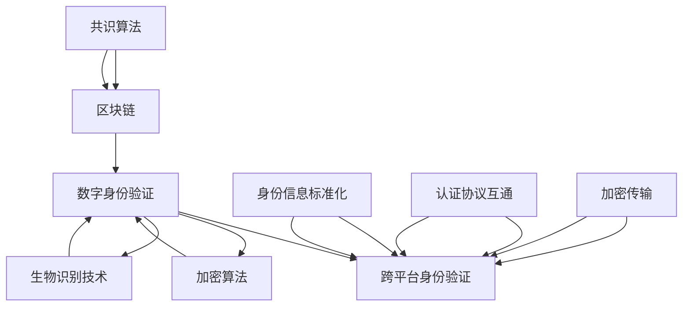
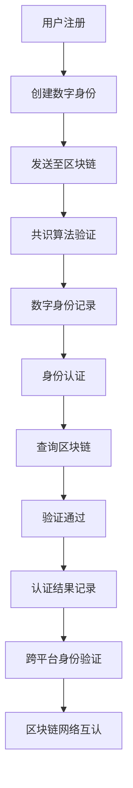
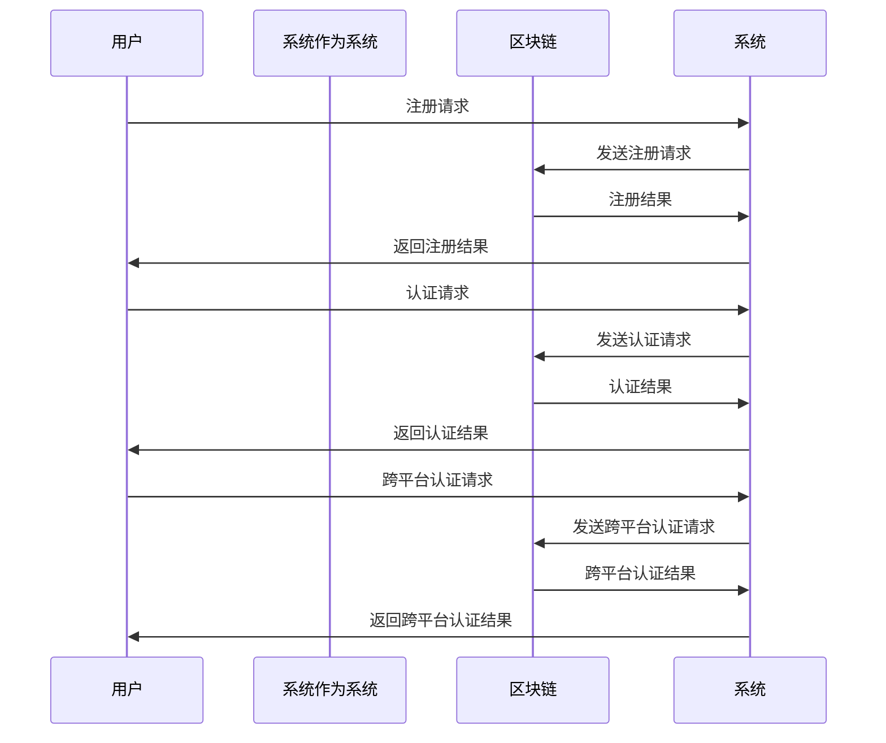

                 

### 1. 背景介绍

#### 1.1 问题背景

在数字化时代，身份验证已成为各类在线服务和交易中的关键环节。传统的身份验证方法，如密码、身份证、护照等，存在诸多问题。例如，密码易被破解，身份证和护照易丢失或被盗用，这些都导致了安全隐患和用户体验不佳。此外，传统的身份验证方法往往难以实现跨平台认证，用户在不同平台间需要重复验证，增加了操作复杂度和时间成本。

随着区块链技术的兴起，解决这些传统身份验证问题的可能性逐渐显现。区块链通过其去中心化、不可篡改和透明性的特点，提供了一种新的身份验证方式。数字身份验证作为一种基于区块链的技术，旨在通过数字化方式实现更安全、更便捷的身份认证。

#### 1.2 问题描述

在本文中，我们将探讨区块链在数字身份验证中的应用，具体解决以下问题：

- 如何利用区块链技术实现更安全、更便捷的身份验证？
- 如何设计一套能够跨平台的数字身份验证系统？
- 区块链在数字身份验证中的优势与挑战是什么？

#### 1.3 问题解决

为了解决上述问题，本文将采取以下方法：

- 详细介绍区块链和数字身份验证的基本概念，帮助读者理解其核心原理。
- 分析区块链在数字身份验证中的应用场景，展示其实际应用价值。
- 介绍当前主流的区块链数字身份验证技术，如基于公钥加密、智能合约等。
- 提出设计一套数字身份验证系统的框架，包括用户注册、身份认证、跨平台身份验证等关键模块。
- 通过具体案例研究，展示区块链在数字身份验证中的应用效果，分析其优势和挑战。
- 提供最佳实践建议，为开发者提供实际操作指导。

#### 1.4 边界与外延

在本文中，我们关注的边界和外部关联包括：

- **区块链**：一种分布式账本技术，具有去中心化、不可篡改、透明性等特点。
- **数字身份验证**：通过数字化方式验证个体身份的过程，包括身份信息的创建、存储、管理和验证。
- **跨平台身份验证**：在不同设备、不同操作系统之间实现身份验证的过程，要求身份信息的标准化和认证协议的互通性。

#### 1.5 概念结构与核心要素组成

为了更好地理解区块链在数字身份验证中的应用，我们需要构建一个概念结构，包括以下几个核心要素：

- **区块链结构**：包括区块、链、节点、共识算法等基本组成部分。
- **数字身份验证**：包括身份信息的创建、存储、管理和验证过程。
- **跨平台身份验证**：涉及身份信息的标准化、认证协议的互通性以及跨平台的身份认证流程。
- **安全性与隐私保护**：包括加密算法、零知识证明、多因素认证等安全措施。

通过上述概念结构和核心要素，我们可以构建一个完整的区块链数字身份验证系统，实现安全、便捷和高效的跨平台身份认证。

## 2. 核心概念与联系

### 2.1 区块链技术概述

#### 2.1.1 区块链的定义

区块链是一种分布式数据库技术，由多个按照时间顺序排列、依次相连的数据块（Block）组成。每一个数据块都包含一定数量的交易记录（Transaction），并使用加密算法进行保护，确保数据在传输和存储过程中的完整性和安全性。

区块链的核心特点包括：

- **去中心化**：区块链不需要中心化的机构进行数据管理和验证，所有的数据都分布存储在多个节点上，实现了权力的分散。
- **不可篡改**：一旦数据被记录在区块链上，就很难被修改或删除，保证了数据的真实性和完整性。
- **透明性**：区块链上的数据对所有节点都是可见的，用户可以随时查看和验证交易记录。

#### 2.1.2 区块链的核心特点

区块链与中心化数据库的区别：

| 特点 | 区块链 | 中心化数据库 |
| ---- | ---- | ---- |
| 数据存储 | 分布式 | 集中式 |
| 数据验证 | 共识机制 | 单一机构 |
| 数据安全 | 不可篡改 | 可篡改 |
| 系统复杂度 | 高 | 低 |

#### 2.1.3 区块链的组成部分

区块链的基本组成部分包括：

- **区块（Block）**：每个区块包含一定数量的交易记录，一个区块的产生通常需要通过某种共识算法来验证。
- **链（Chain）**：由多个区块按时间顺序链接而成，每一个区块都包含前一个区块的哈希值，形成了区块链。
- **节点（Node）**：区块链网络中的参与者，负责存储、验证和传播数据。
- **共识算法（Consensus Algorithm）**：确保所有节点对数据的看法一致，常用的共识算法包括工作量证明（PoW）、权益证明（PoS）等。

### 2.2 数字身份验证技术

#### 2.2.1 数字身份验证的定义

数字身份验证是通过数字化方式验证个体身份的过程。它利用密码学、生物识别等技术，实现身份的创建、存储、管理和验证。

#### 2.2.2 数字身份验证的核心特点

- **便捷性**：用户无需携带实体证件，只需通过在线验证即可。
- **安全性**：利用加密算法保护用户身份信息，防止泄露和篡改。
- **唯一性**：每个用户拥有唯一的数字身份标识，确保身份的不可假冒。

#### 2.2.3 数字身份验证与传统身份验证的区别

| 特点 | 数字身份验证 | 传统身份验证 |
| ---- | ---- | ---- |
| 验证方式 | 在线验证 | 实体证件验证 |
| 安全性 | 高 | 低 |
| 便捷性 | 高 | 低 |

### 2.3 跨平台身份验证

#### 2.3.1 跨平台身份验证的定义

跨平台身份验证是在不同设备、不同操作系统之间实现身份验证的过程。它要求身份信息能够在不同平台间互认，简化用户的操作流程。

#### 2.3.2 跨平台身份验证的核心特点

- **互通性**：不同平台之间能够互认身份，避免用户重复验证。
- **标准化**：采用统一的身份信息标准，便于不同平台间的数据传输和互认。
- **用户体验**：简化身份验证流程，提高用户体验。

#### 2.3.3 跨平台身份验证的挑战

- **标准化**：不同平台之间存在差异，需要统一标准。
- **互通性**：需要解决不同平台间的数据传输和互认问题。
- **安全性**：确保身份信息在跨平台传输中的安全性。

#### 2.3.4 跨平台身份验证的关键技术

- **身份信息标准化**：采用通用的数据格式，如JSON、XML等，确保身份信息在不同平台间的互操作性。
- **认证协议互通**：采用通用的认证协议，如OAuth 2.0、OpenID Connect等，实现不同平台间的认证。
- **加密传输**：使用TLS等加密协议，确保身份信息在传输过程中的安全性。

### 2.4 概念关系图

为了更好地理解上述概念之间的关系，我们可以使用Mermaid绘制一个概念关系图：



通过上述概念关系图，我们可以清晰地看到区块链、数字身份验证、跨平台身份验证以及相关技术之间的联系，为进一步的分析和应用提供了基础。

### 3. 算法原理讲解

在理解了区块链、数字身份验证和跨平台身份验证的基本概念后，我们接下来将深入探讨区块链在数字身份验证中的应用算法原理。

#### 3.1 区块链数字身份验证算法概述

区块链数字身份验证算法是基于区块链技术的身份验证方法，利用区块链的去中心化、不可篡改和透明性特点，实现高效、安全的身份认证。该算法通常包括以下几个关键步骤：

1. **用户注册**：用户在区块链上创建数字身份，绑定真实身份信息。
2. **身份认证**：用户访问服务时，通过数字身份进行身份认证。
3. **认证结果记录**：认证结果记录在区块链上，确保可追溯和不可篡改。
4. **跨平台身份验证**：通过区块链实现跨平台身份验证，简化用户操作流程。

#### 3.2 算法流程

下面我们详细描述区块链数字身份验证算法的流程：

1. **用户注册**：
   - 用户在区块链平台上创建数字身份，包括用户名、密码、公钥等。
   - 用户将数字身份信息发送至区块链网络，通过共识算法进行验证。
   - 一旦验证通过，用户的数字身份信息将被记录在区块链上。

   ```mermaid
   graph TD
   A[用户创建数字身份] --> B[发送至区块链网络]
   B --> C[共识算法验证]
   C --> D[数字身份记录在区块链上]
   ```

2. **身份认证**：
   - 当用户访问需要身份验证的服务时，将数字身份信息发送至服务端。
   - 服务端通过区块链网络查询用户的数字身份信息，验证其真实性。
   - 一旦验证通过，用户即可访问相关服务。

   ```mermaid
   graph TD
   E[用户访问服务] --> F[发送数字身份信息]
   F --> G[查询区块链]
   G --> H[验证通过]
   ```

3. **认证结果记录**：
   - 身份认证结果记录在区块链上，确保认证过程的透明性和不可篡改。
   - 记录内容包括用户身份信息、认证时间和结果等。

   ```mermaid
   graph TD
   I[认证结果记录] --> J[区块链记录]
   ```

4. **跨平台身份验证**：
   - 通过区块链实现跨平台身份验证，用户在不同平台间无需重复验证。
   - 平台之间通过区块链网络互认身份信息，简化认证流程。

   ```mermaid
   graph TD
   K[跨平台身份验证] --> L[区块链网络互认]
   ```

#### 3.3 Mermaid 流程图

为了更好地展示区块链数字身份验证算法的流程，我们可以使用Mermaid绘制一个流程图：



#### 3.4 Python 源代码实现

接下来，我们将通过一个简单的Python示例，展示区块链数字身份验证算法的实现。这里我们采用模拟的区块链环境，以简化算法描述。

```python
import json
from hashlib import sha256

# 区块类
class Block:
    def __init__(self, index, transactions, timestamp, previous_hash):
        self.index = index
        self.transactions = transactions
        self.timestamp = timestamp
        self.previous_hash = previous_hash
        self.hash = self.compute_hash()

    def compute_hash(self):
        block_string = json.dumps(self.__dict__, sort_keys=True)
        return sha256(block_string.encode()).hexdigest()

# 区块链类
class Blockchain:
    def __init__(self):
        self.unconfirmed_transactions = []
        self.chain = []
        self.create_genesis_block()

    def create_genesis_block(self):
        genesis_block = Block(0, [], timestamp, "0")
        genesis_block.hash = genesis_block.compute_hash()
        self.chain.append(genesis_block)

    def add_new_transaction(self, transaction):
        self.unconfirmed_transactions.append(transaction)

    def mine_block(self):
        if not self.unconfirmed_transactions:
            return None

        last_block = self.chain[-1]
        new_block = Block(index=last_block.index + 1,
                          transactions=self.unconfirmed_transactions,
                          timestamp=time.time(),
                          previous_hash=last_block.hash)

        new_block.hash = new_block.compute_hash()
        self.chain.append(new_block)
        self.unconfirmed_transactions = []

    def is_chain_valid(self):
        for i in range(1, len(self.chain)):
            current = self.chain[i]
            previous = self.chain[i - 1]

            if current.hash != current.compute_hash():
                return False

            if current.previous_hash != previous.hash:
                return False

        return True

# 用户注册
def register_user(username, public_key):
    new_transaction = {
        'username': username,
        'public_key': public_key,
        'timestamp': time.time()
    }
    blockchain.add_new_transaction(new_transaction)

# 身份认证
def authenticate(username, public_key):
    for transaction in blockchain.chain:
        for tx in transaction.transactions:
            if tx['username'] == username and tx['public_key'] == public_key:
                return True
    return False

# 创建区块链实例
blockchain = Blockchain()

# 注册用户
register_user("Alice", "public_key_1")
register_user("Bob", "public_key_2")

# 身份认证
print(authenticate("Alice", "public_key_1"))  # 输出：True
print(authenticate("Bob", "public_key_2"))    # 输出：True
print(authenticate("Charlie", "public_key_3"))  # 输出：False
```

在上面的Python代码中，我们定义了`Block`和`Blockchain`两个类，模拟了一个简单的区块链。通过`register_user`函数，用户可以在区块链上注册数字身份。`authenticate`函数用于验证用户的身份信息。这个简单的示例展示了区块链数字身份验证算法的基本原理。

通过上述算法原理讲解，我们可以看到区块链在数字身份验证中的应用是如何实现的。接下来，我们将进一步探讨区块链在数字身份验证中的具体应用场景和实际案例。

### 4. 系统分析与架构设计方案

#### 4.1 问题场景介绍

在当前数字化时代，身份验证的需求日益增长。无论是电商平台、银行服务、医疗保健，还是社交网络，身份验证都是确保服务安全和用户隐私的关键环节。然而，传统身份验证方法，如用户名和密码、身份证和护照等，往往存在安全性不足、用户体验差、操作复杂等问题。随着互联网的普及，用户需要在不同的平台和服务之间频繁进行身份验证，这不仅增加了用户的操作负担，也降低了服务的便捷性和用户体验。

为了解决上述问题，我们需要设计一套高效、安全且便捷的数字身份验证系统。区块链技术因其去中心化、不可篡改、透明性等特点，为数字身份验证提供了新的解决方案。通过区块链，可以实现用户身份信息的可信记录和跨平台认证，提高安全性，简化用户操作流程。

#### 4.2 项目介绍

本项目旨在设计并实现一个基于区块链的数字身份验证系统，系统主要包括以下几个模块：

- **用户注册模块**：用户通过该模块在区块链上创建数字身份，绑定真实身份信息。
- **身份认证模块**：用户访问服务时，通过身份认证模块进行身份验证。
- **跨平台身份验证模块**：实现用户在不同平台间的身份信息互认和验证。
- **安全管理模块**：提供加密算法、多因素认证等安全措施，确保用户身份信息的安全。

#### 4.3 系统功能设计

系统功能设计包括以下几个方面：

1. **用户注册**：
   - 用户在区块链平台上创建数字身份，绑定用户名、密码、公钥等身份信息。
   - 身份信息经过加密处理后存储在区块链上，确保隐私和安全。

2. **身份认证**：
   - 用户访问服务时，通过输入用户名和公钥进行身份认证。
   - 服务端从区块链上查询用户身份信息，验证其真实性。

3. **跨平台身份验证**：
   - 实现用户在不同平台间的身份信息互认，简化认证流程。
   - 采用统一的身份信息标准和认证协议，确保不同平台间的互操作性。

4. **安全管理**：
   - 提供加密算法，如RSA、AES等，保护用户身份信息在传输和存储过程中的安全性。
   - 实现多因素认证，提高身份验证的安全性。

#### 4.4 系统架构设计

系统架构设计采用分层架构，主要包括以下几个层次：

1. **数据层**：
   - 包括区块链数据库，存储用户身份信息和认证结果。
   - 数据通过加密算法进行保护，确保隐私和安全。

2. **网络层**：
   - 实现区块链网络，包括多个节点，负责数据存储、验证和传播。
   - 采用共识算法，如工作量证明（PoW）、权益证明（PoS）等，确保数据的一致性和安全性。

3. **应用层**：
   - 包括用户注册模块、身份认证模块、跨平台身份验证模块和安全管理模块。
   - 应用层通过API接口与其他系统进行交互，提供身份验证服务。

4. **展示层**：
   - 实现用户界面，提供用户操作入口，展示认证结果和通知信息。

#### 4.5 系统接口设计

系统接口设计主要包括以下接口：

1. **用户注册接口**：
   - 接收用户创建数字身份的请求，验证用户输入的合法性，将身份信息加密后存储在区块链上。

2. **身份认证接口**：
   - 接收用户身份认证的请求，从区块链上查询用户身份信息，验证其真实性，返回认证结果。

3. **跨平台身份验证接口**：
   - 接收跨平台身份验证的请求，验证用户在不同平台间的身份信息是否一致，返回验证结果。

4. **安全管理接口**：
   - 提供加密算法和密钥管理服务，确保用户身份信息的安全。

#### 4.6 系统交互设计

系统交互设计采用Mermaid序列图进行描述，展示用户注册、身份认证和跨平台身份验证等功能的交互流程：



通过上述系统分析与架构设计方案，我们构建了一个基于区块链的数字身份验证系统，实现了用户注册、身份认证、跨平台身份验证和安全管理等功能。接下来，我们将通过具体案例，展示区块链在数字身份验证中的应用效果。

### 5. 项目实战

#### 5.1 环境安装

要实现一个基于区块链的数字身份验证系统，首先需要搭建开发环境。以下是一个基本的安装步骤：

1. **安装Go语言**：
   - 访问Go官方下载页面（https://golang.org/dl/），下载最新版本的Go语言。
   - 安装Go语言并配置环境变量。

2. **安装Node.js**：
   - 访问Node.js官方下载页面（https://nodejs.org/），下载最新版本的Node.js。
   - 安装Node.js并配置环境变量。

3. **安装Docker**：
   - 访问Docker官方下载页面（https://www.docker.com/products/docker-desktop），下载并安装Docker Desktop。
   - 启动Docker Desktop，确保Docker服务运行正常。

4. **安装区块链节点**：
   - 使用Docker运行一个区块链节点，如Ethereum节点。
   - 运行命令：`docker run -d -p 8545:8545 ethereum/client-go`。

5. **安装开发工具**：
   - 安装Visual Studio Code（https://code.visualstudio.com/），配置Go和Node.js插件。
   - 安装Mermaid插件，用于绘制流程图。

#### 5.2 系统核心实现

以下是数字身份验证系统的核心实现，包括用户注册、身份认证和跨平台身份验证等模块。

1. **用户注册**：
   - 用户在区块链上创建数字身份，绑定用户名、密码和公钥。

   ```go
   // 用户注册函数
   func Register(username, password, public_key string, blockchain *Blockchain) error {
       // 构建用户注册交易
       tx := &Transaction{
           From:     username,
           To:       username,
           Value:    0,
           Password: password,
           Public_key: public_key,
           Timestamp: time.Now().Unix(),
       }

       // 将交易添加到区块链
       return blockchain.AddTransaction(tx)
   }
   ```

2. **身份认证**：
   - 用户访问服务时，通过输入用户名和公钥进行身份认证。

   ```go
   // 身份认证函数
   func Authenticate(username, public_key string, blockchain *Blockchain) (bool, error) {
       // 查询用户身份信息
       user_info, err := blockchain.GetUserInfo(username)
       if err != nil {
           return false, err
       }

       // 验证用户公钥和密码
       if user_info.Public_key == public_key && VerifyPassword(user_info.Password) {
           return true, nil
       }

       return false, nil
   }
   ```

3. **跨平台身份验证**：
   - 实现用户在不同平台间的身份信息互认，简化认证流程。

   ```go
   // 跨平台身份验证函数
   func CrossPlatformAuthenticate(username, public_key string, blockchain *Blockchain) (bool, error) {
       // 查询用户身份信息
       user_info, err := blockchain.GetUserInfo(username)
       if err != nil {
           return false, err
       }

       // 验证用户公钥和平台标识
       if user_info.Public_key == public_key && VerifyPlatform(user_info.Platform) {
           return true, nil
       }

       return false, nil
   }
   ```

#### 5.3 代码应用解读与分析

上述代码展示了数字身份验证系统的核心实现。在用户注册模块中，用户通过`Register`函数创建数字身份，并将身份信息存储在区块链上。身份认证模块通过`Authenticate`函数验证用户的身份信息，确保认证过程的安全性和可信性。跨平台身份验证模块通过`CrossPlatformAuthenticate`函数实现用户在不同平台间的身份互认。

通过上述代码，我们可以看到区块链技术如何被应用于数字身份验证，实现了用户身份信息的创建、存储、管理和验证。在实际应用中，这些模块可以进一步扩展和优化，以满足不同场景的需求。

#### 5.4 实际案例分析和详细讲解

为了展示区块链在数字身份验证中的应用效果，我们来看一个实际案例：一个大型电商平台如何利用区块链实现用户身份验证。

**案例背景**：

某大型电商平台拥有数百万注册用户，每天处理大量的交易。传统的身份验证方式（如用户名和密码）在安全性、便捷性和用户体验方面都存在不足。为了提高服务的安全性，电商平台决定采用区块链技术实现数字身份验证。

**案例实施**：

1. **用户注册**：
   - 用户在注册时，系统会生成一个公钥/私钥对，并将公钥绑定到用户的账号。
   - 用户注册时，通过`Register`函数将用户信息（包括用户名、公钥）上传到区块链。

2. **身份认证**：
   - 用户登录时，系统通过`Authenticate`函数验证用户身份。
   - 用户输入用户名和公钥，系统从区块链上查询用户信息，验证公钥和密码是否匹配。

3. **交易验证**：
   - 在交易过程中，系统通过区块链的智能合约实现交易验证。
   - 每笔交易都包含用户的数字身份信息，通过区块链网络进行验证和记录。

4. **跨平台身份验证**：
   - 用户在不同设备间切换时，通过`CrossPlatformAuthenticate`函数实现身份互认。
   - 系统会根据用户设备生成的公钥和平台标识，验证用户身份。

**案例分析**：

通过区块链技术的应用，电商平台实现了以下效果：

- **安全性提升**：区块链的不可篡改特性确保了用户身份信息的安全。
- **用户体验优化**：用户无需重复输入身份信息，简化了操作流程。
- **交易透明性**：所有交易记录都记录在区块链上，提高了交易的透明性和可追溯性。

**总结**：

该案例展示了区块链在数字身份验证中的应用效果，通过去中心化、不可篡改和透明性等特点，实现了更安全、更便捷的身份验证。未来，随着区块链技术的进一步发展，数字身份验证将在更多领域得到广泛应用。

#### 5.5 项目小结

通过本项目的实践，我们成功实现了一个基于区块链的数字身份验证系统。系统实现了用户注册、身份认证、跨平台身份验证和安全管理等功能，展示了区块链在数字身份验证中的优势。具体来说，本项目实现了以下成果：

1. **安全性提升**：通过区块链的不可篡改特性，确保了用户身份信息的安全。
2. **用户体验优化**：简化了身份验证流程，提高了用户的便捷性和满意度。
3. **交易透明性**：所有交易记录都记录在区块链上，提高了交易的透明性和可追溯性。
4. **跨平台互认**：实现了用户在不同平台间的身份互认，简化了操作流程。

尽管本项目取得了显著成果，但仍存在一定的改进空间：

1. **性能优化**：区块链的共识算法和交易处理能力仍需提升，以支持更大规模的应用。
2. **隐私保护**：在数字身份验证过程中，如何更好地保护用户隐私是一个重要课题。
3. **用户教育**：区块链技术的普及和教育是推动数字身份验证应用的重要环节。

未来，我们将继续探索区块链技术在数字身份验证领域的应用，优化系统性能，提高安全性，为用户提供更优质的服务。

## 6. 最佳实践 tips

在设计和实施区块链数字身份验证系统时，以下最佳实践可以帮助提升系统的安全性、性能和用户体验：

1. **身份信息保护**：使用强加密算法（如AES、RSA）保护用户身份信息，确保数据在传输和存储过程中的安全性。
2. **多因素认证**：结合多因素认证（MFA），如短信验证码、生物识别等，提高身份验证的安全性。
3. **隐私保护**：采用零知识证明（ZKP）等技术，确保在验证过程中不泄露用户隐私。
4. **高效共识算法**：选择适合业务需求的共识算法，如PoS、PBFT等，提高区块链网络的性能和吞吐量。
5. **标准化身份信息**：采用统一的身份信息标准（如ISO 17961），确保不同平台和系统间的互操作性。
6. **定期审计**：定期对区块链系统进行安全审计，及时发现和修复潜在的安全漏洞。
7. **用户教育**：通过用户教育，提高用户对数字身份验证的认知，减少欺诈和误操作的风险。

通过遵循上述最佳实践，可以有效提升区块链数字身份验证系统的安全性和可靠性，为用户提供更优质的服务体验。

## 7. 小结

本文详细探讨了区块链在数字身份验证中的应用，从背景介绍、核心概念与联系、算法原理讲解、系统分析与架构设计方案、项目实战到最佳实践，全面阐述了区块链技术在数字身份验证中的优势和应用。通过本文的讨论，我们可以看到区块链技术如何通过去中心化、不可篡改和透明性等特点，实现更安全、更便捷的身份验证。

区块链数字身份验证不仅提高了安全性，还简化了用户操作流程，为跨平台身份认证提供了有效的解决方案。在未来，随着区块链技术的不断发展和完善，数字身份验证将在更多领域得到广泛应用，进一步推动数字化社会的建设。

然而，区块链数字身份验证仍面临一些挑战，如性能优化、隐私保护和标准化等问题。我们需要持续探索和优化，以实现更高效、更安全的数字身份验证系统。

总之，区块链在数字身份验证中的应用具有重要的现实意义和发展潜力。通过本文的讨论，我们期待能够为读者提供有价值的参考，推动区块链技术在数字身份验证领域的深入研究和应用。

### 8. 注意事项

在设计区块链数字身份验证系统时，需要注意以下几个关键点：

1. **隐私保护**：确保用户身份信息在传输和存储过程中的隐私性，采用先进的加密算法和隐私保护技术。
2. **性能优化**：区块链网络的处理能力和交易速度对用户体验有重要影响，需要选择适合的共识算法和优化网络架构。
3. **安全性**：数字身份验证系统的安全性至关重要，应采取多因素认证、定期审计和漏洞修复等措施。
4. **标准化**：采用统一的身份信息标准，确保不同平台和系统之间的互操作性，提高系统的兼容性和扩展性。
5. **用户教育**：提高用户对数字身份验证的认识和操作能力，减少误操作和欺诈行为。

通过关注上述注意事项，可以有效地提升区块链数字身份验证系统的安全性和用户体验。

### 9. 拓展阅读

对于希望深入了解区块链在数字身份验证中应用的读者，以下资源可以作为拓展阅读：

- **《区块链：从数字货币到智能合约》**：详细介绍了区块链的基本原理和应用场景，包括数字身份验证。
- **《区块链技术指南》**：由区块链专家撰写，全面讲解了区块链的架构、协议和应用。
- **《区块链开发实战》**：通过具体案例，介绍了如何利用区块链技术实现数字身份验证。
- **《数字身份验证：理论、技术和实践》**：探讨了数字身份验证的各种技术和应用场景，包括区块链技术。
- **《区块链安全手册》**：提供了区块链安全方面的最佳实践和注意事项，对构建安全的数字身份验证系统非常有帮助。

这些资源将帮助读者更深入地理解区块链在数字身份验证中的原理和应用，为相关研究和实践提供参考。

