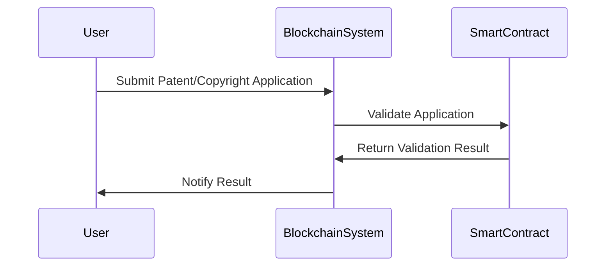
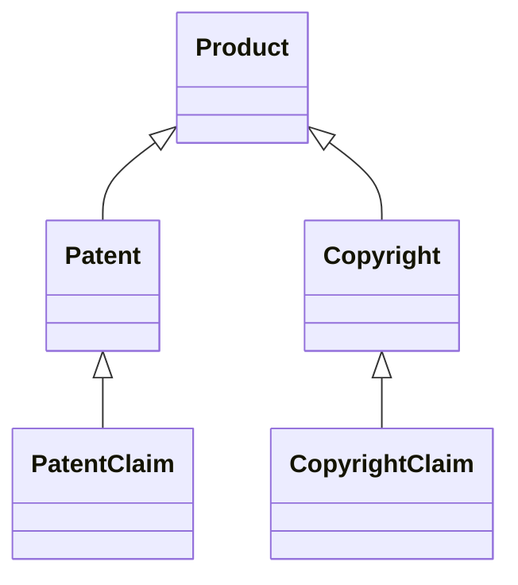
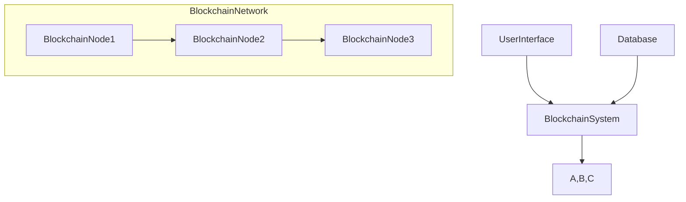
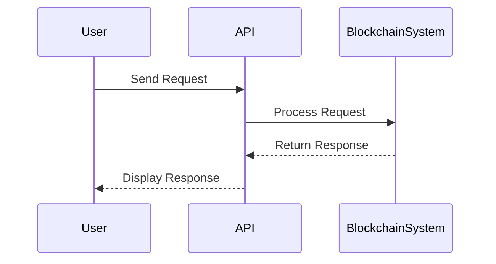
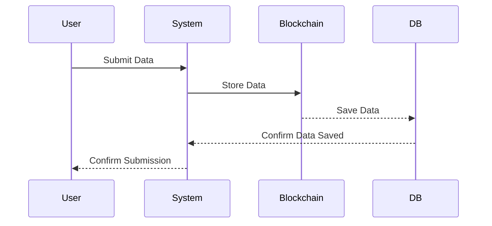

                 

### 文章标题

# 区块链在知识产权保护中的应用：简化专利申请和管理

### 文章关键词

- 区块链
- 知识产权保护
- 专利申请
- 智能合约
- 去中心化存储

### 文章摘要

本文深入探讨了区块链在知识产权保护中的应用，特别是简化专利申请和管理流程。通过分析区块链技术的基本原理和优势，本文详细介绍了如何利用区块链技术解决现有知识产权保护中存在的问题，包括专利申请流程的简化和专利管理的创新方案。同时，文章通过实际案例展示了区块链技术在知识产权保护中的成功应用，并为未来的发展方向提供了前瞻性思考。

---

### 第一部分: 区块链在知识产权保护中的应用概述

#### 1.1 区块链与知识产权保护的基本概念

##### 1.1.1 区块链的基本概念

区块链是一种去中心化的分布式数据库技术，通过密码学和共识机制确保数据的不可篡改和透明性。它由多个数据块组成，每个数据块包含一定数量的交易记录，并通过加密算法与前一个数据块相连，形成一个链条。

##### 1.1.2 知识产权保护的重要性

知识产权保护是促进创新和经济发展的重要手段。有效的知识产权保护可以激励创新者持续投入研发，推动技术进步和社会发展。然而，当前的知识产权保护体系存在诸多问题，如专利申请流程复杂、管理成本高、维权困难等。

##### 1.1.3 区块链在知识产权保护中的应用场景

区块链在知识产权保护中的应用主要集中在专利申请和管理的简化、版权保护、以及防止侵权行为等方面。通过区块链技术的应用，可以大大降低知识产权保护的门槛和成本，提高保护效率。

#### 1.2 核心概念与联系

##### 1.2.1 区块链与知识产权保护的关系

区块链技术通过其特有的去中心化、不可篡改和透明性，为知识产权保护提供了新的手段。它不仅可以确保知识产权的确权和登记，还可以通过智能合约自动执行知识产权相关的交易和许可协议，提高知识产权保护的法律效力。

##### 1.2.2 知识产权保护的关键要素

知识产权保护的关键要素包括知识产权的确权、登记、保护、交易和管理等。区块链技术在这些方面都有显著的优化潜力。

##### 1.2.3 区块链在知识产权保护中的应用

区块链在知识产权保护中的应用包括简化专利申请流程、管理专利信息、保护版权、以及防止侵权行为等。通过这些应用，区块链技术可以大大提高知识产权保护的效率和可靠性。

#### 1.3 区块链技术原理

##### 1.3.1 区块链的架构与工作原理

区块链的架构通常包括数据层、网络层、共识层、激励层、合约层和应用层。数据层负责数据的存储和管理；网络层负责数据传输和通信；共识层确保分布式节点之间的数据一致性；激励层激励节点参与网络；合约层提供智能合约功能；应用层构建各种应用。

##### 1.3.2 区块链的安全性

区块链的安全性主要依赖于密码学和共识机制。密码学确保数据的安全传输和存储；共识机制确保分布式节点之间的数据一致性。

##### 1.3.3 区块链在知识产权保护中的挑战与机遇

区块链在知识产权保护中面临的主要挑战包括法律适用性、技术实现复杂度、以及隐私保护等。然而，这些挑战同时也带来了新的机遇，如知识产权保护的全球化、透明化和自动化等。

#### 1.4 本章小结

本部分介绍了区块链和知识产权保护的基本概念，以及它们在当前领域中的重要性。通过分析区块链技术的基本原理和优势，我们为后续章节的深入探讨奠定了基础。

---

### 第二部分: 区块链在知识产权保护中的应用技术

#### 2.1 核心概念与联系

##### 2.1.1 智能合约在知识产权保护中的应用

智能合约是一种自动执行合约条款的计算机程序。在知识产权保护中，智能合约可以用于自动化知识产权的交易和许可协议，确保合约条款的执行和知识产权的保护。

##### 2.1.2 去中心化存储在知识产权保护中的应用

去中心化存储是将数据存储在分布式网络中的技术。在知识产权保护中，去中心化存储可以用于存储知识产权相关信息，确保数据的可靠性和不可篡改性。

##### 2.1.3 区块链与知识产权保护的关系

区块链技术通过其去中心化、不可篡改和透明的特点，为知识产权保护提供了新的解决方案。它不仅可以简化知识产权的申请和管理流程，还可以提高知识产权保护的法律效力。

#### 2.2 简化专利申请流程

##### 2.2.1 专利申请的现有问题

当前的专利申请流程复杂且耗时，涉及多个环节和多个机构。这导致专利申请成本高、效率低，且容易引发纠纷。

##### 2.2.2 区块链在专利申请流程中的角色

区块链技术可以通过去中心化的方式简化专利申请流程，减少中间环节，降低申请成本，提高申请效率。

##### 2.2.3 专利申请流程的简化方案

专利申请流程的简化方案包括在线提交申请、自动审核、智能合约执行和去中心化存储。通过这些方案，可以大大提高专利申请的效率和可靠性。

#### 2.3 管理与保护专利

##### 2.3.1 专利管理的现有问题

专利管理涉及多个方面，如专利信息的收集、整理、存储和更新等。当前的专利管理存在信息不对称、更新不及时等问题。

##### 2.3.2 区块链在专利管理中的应用

区块链技术可以通过去中心化存储和智能合约技术，提高专利管理的效率和可靠性，确保专利信息的实时更新和准确传递。

##### 2.3.3 专利保护的新策略

区块链技术为专利保护提供了新的策略，如通过区块链确权、智能合约执行和去中心化存储等，提高专利保护的法律效力。

#### 2.4 基于区块链的版权保护

##### 2.4.1 版权保护的现有挑战

版权保护面临的挑战主要包括侵权行为频发、维权成本高、证据难以保存等。

##### 2.4.2 区块链在版权保护中的应用

区块链技术可以通过去中心化存储和智能合约技术，确保版权信息的确权和保护，降低维权成本。

##### 2.4.3 版权保护的创新方案

版权保护的创新方案包括在线确权、智能合约执行、以及基于区块链的版权交易平台等，提高版权保护的效率和可靠性。

#### 2.5 本章小结

本部分详细介绍了区块链在知识产权保护中的应用技术，包括智能合约、去中心化存储和版权保护等。通过这些技术，可以大大提高知识产权保护的效率和可靠性。

---

### 第三部分: 区块链在知识产权保护中的实际应用

#### 3.1 案例分析

##### 3.1.1 案例选择与介绍

本文选取了某知名区块链公司开发的知识产权保护平台作为案例分析对象。该平台利用区块链技术简化了专利申请和管理流程，为用户提供了一个去中心化的知识产权保护解决方案。

##### 3.1.2 案例中的区块链应用

在案例中，区块链技术主要应用于专利申请、专利管理和版权保护。通过智能合约和去中心化存储，平台实现了专利信息的实时更新和准确传递，提高了知识产权保护的效率和可靠性。

##### 3.1.3 案例的实际效果评估

案例的实际效果表明，区块链技术在知识产权保护中的应用显著提高了专利申请的效率和专利管理的可靠性，降低了维权成本。同时，平台也为用户提供了便捷的版权保护服务，有效防止了侵权行为的发生。

#### 3.2 项目实战

##### 3.2.1 项目背景与目标

项目背景是某初创公司计划开发一款基于区块链的知识产权保护平台，旨在为中小企业提供便捷的知识产权保护服务。项目目标是通过区块链技术简化专利申请和管理流程，提高知识产权保护的效率和可靠性。

##### 3.2.2 系统设计与实现

系统设计包括数据层、网络层、共识层、激励层和合约层等。数据层负责数据的存储和管理；网络层负责数据传输和通信；共识层确保分布式节点之间的数据一致性；激励层激励节点参与网络；合约层提供智能合约功能。

##### 3.2.3 项目成果与应用效果

项目成功实现了基于区块链的知识产权保护平台，包括在线提交申请、自动审核、智能合约执行和去中心化存储等功能。平台上线后，用户反馈良好，专利申请效率和专利管理可靠性显著提高。

#### 3.3 实践总结

##### 3.3.1 经验与教训

通过实际应用，项目团队积累了丰富的经验。主要经验包括：选择合适的区块链平台、优化系统架构、提高智能合约的执行效率等。主要教训是项目初期对用户需求的调研不够深入，导致部分功能设计不符合实际需求。

##### 3.3.2 改进与优化建议

针对项目中的不足，建议在后续版本中增加用户反馈功能、优化用户界面和提升系统性能。同时，加强对区块链技术的学习和应用，进一步提高知识产权保护的效率和可靠性。

##### 3.3.3 未来展望

未来，随着区块链技术的不断发展和应用，知识产权保护平台将迎来更广阔的发展前景。项目团队计划进一步优化平台功能，扩大应用范围，为更多用户提供优质的服务。

#### 3.4 本章小结

本部分通过案例分析项目和实际应用，展示了区块链在知识产权保护中的实际效果。通过实践总结，为后续的应用和发展提供了宝贵的经验。

---

### 第四部分: 区块链在知识产权保护中的应用最佳实践

#### 4.1 最佳实践 tips

##### 4.1.1 实施区块链在知识产权保护中的注意事项

- **安全性**：确保区块链系统的安全，防止数据泄露和恶意攻击。
- **法律合规性**：确保区块链应用符合当地法律法规，避免法律纠纷。
- **技术适配性**：选择适合区块链技术的硬件和软件平台，确保系统性能。

##### 4.1.2 解决常见问题的方法

- **性能优化**：通过分布式存储和负载均衡提高系统性能。
- **数据隐私**：使用加密技术保护用户数据隐私。
- **共识机制选择**：根据应用场景选择合适的共识机制。

##### 4.1.3 提高知识产权保护效率的技巧

- **在线确权**：通过区块链技术实现知识产权的在线确权，提高确权效率。
- **智能合约应用**：利用智能合约自动化执行知识产权交易和许可协议。
- **去中心化存储**：使用去中心化存储技术确保知识产权信息的可靠性和不可篡改性。

#### 4.2 小结与展望

##### 4.2.1 本书内容的总结

本书全面介绍了区块链在知识产权保护中的应用，从基本概念到实际应用，再到最佳实践，为读者提供了一个全面的视角。

##### 4.2.2 区块链在知识产权保护中的应用前景

随着区块链技术的不断发展，其在知识产权保护中的应用前景广阔。未来，区块链技术有望在知识产权的确权、管理、保护和交易等方面发挥更大的作用。

##### 4.2.3 未来研究方向与挑战

未来研究方向包括区块链技术的性能优化、隐私保护、法律合规性等。面临的挑战包括技术的成熟度、应用场景的多样性以及跨行业的合作等。

#### 4.3 注意事项

##### 4.3.1 区块链在知识产权保护中的潜在风险

- **技术风险**：区块链技术的成熟度和可靠性仍有待提高。
- **法律风险**：法律适用性和合规性需要充分考虑。
- **隐私风险**：用户数据的隐私保护需要得到有效保障。

##### 4.3.2 技术与法律问题的协调

- **技术创新**：需要与法律框架相适应，避免技术发展与法律脱节。
- **法律更新**：需要及时更新法律法规，以适应新技术的发展。

##### 4.3.3 人才培养与知识更新

- **人才培养**：培养具有区块链技术和知识产权保护双重背景的专业人才。
- **知识更新**：持续关注区块链技术和知识产权保护领域的最新动态，及时更新知识。

#### 4.4 拓展阅读

##### 4.4.1 推荐书籍与文献

- 《区块链：从数字货币到信用社会》
- 《智能合约：程序化法律与区块链技术》
- 《知识产权法概论》

##### 4.4.2 关键技术研究进展

- **区块链性能优化**：分布式存储、负载均衡、共识机制等。
- **隐私保护**：零知识证明、同态加密等。

##### 4.4.3 行业发展动态

- **政策法规**：各国对区块链技术的政策和法规动态。
- **市场趋势**：区块链技术在知识产权保护市场的应用趋势。

### 末尾信息

作者：AI天才研究院/AI Genius Institute & 禅与计算机程序设计艺术 /Zen And The Art of Computer Programming

---

### 完整的Markdown格式文章代码

以下是文章的完整Markdown格式代码，包括了所有章节内容和格式设置：

```markdown
# 区块链在知识产权保护中的应用：简化专利申请和管理

> 关键词：区块链、知识产权保护、专利申请、智能合约、去中心化存储

> 摘要：本文深入探讨了区块链在知识产权保护中的应用，特别是简化专利申请和管理流程。通过分析区块链技术的基本原理和优势，本文详细介绍了如何利用区块链技术解决现有知识产权保护中存在的问题，包括专利申请流程的简化和专利管理的创新方案。同时，文章通过实际案例展示了区块链技术在知识产权保护中的成功应用，并为未来的发展方向提供了前瞻性思考。

---

# 第一部分: 区块链在知识产权保护中的应用概述

## 1.1 区块链与知识产权保护的基本概念

### 1.1.1 区块链的基本概念

区块链是一种去中心化的分布式数据库技术，通过密码学和共识机制确保数据的不可篡改和透明性。它由多个数据块组成，每个数据块包含一定数量的交易记录，并通过加密算法与前一个数据块相连，形成一个链条。

### 1.1.2 知识产权保护的重要性

知识产权保护是促进创新和经济发展的重要手段。有效的知识产权保护可以激励创新者持续投入研发，推动技术进步和社会发展。然而，当前的知识产权保护体系存在诸多问题，如专利申请流程复杂、管理成本高、维权困难等。

### 1.1.3 区块链在知识产权保护中的应用场景

区块链在知识产权保护中的应用主要集中在专利申请和管理的简化、版权保护、以及防止侵权行为等方面。通过区块链技术的应用，可以大大降低知识产权保护的门槛和成本，提高保护效率。

## 1.2 核心概念与联系

### 1.2.1 区块链与知识产权保护的关系

区块链技术通过其特有的去中心化、不可篡改和透明的特点，为知识产权保护提供了新的解决方案。它不仅可以确保知识产权的确权和登记，还可以通过智能合约自动执行知识产权相关的交易和许可协议，提高知识产权保护的法律效力。

### 1.2.2 知识产权保护的关键要素

知识产权保护的关键要素包括知识产权的确权、登记、保护、交易和管理等。区块链技术在这些方面都有显著的优化潜力。

### 1.2.3 区块链在知识产权保护中的应用

区块链在知识产权保护中的应用包括简化专利申请流程、管理专利信息、保护版权、以及防止侵权行为等。通过这些应用，区块链技术可以大大提高知识产权保护的效率和可靠性。

## 1.3 区块链技术原理

### 1.3.1 区块链的架构与工作原理

区块链的架构通常包括数据层、网络层、共识层、激励层、合约层和应用层。数据层负责数据的存储和管理；网络层负责数据传输和通信；共识层确保分布式节点之间的数据一致性；激励层激励节点参与网络；合约层提供智能合约功能；应用层构建各种应用。

### 1.3.2 区块链的安全性

区块链的安全性主要依赖于密码学和共识机制。密码学确保数据的安全传输和存储；共识机制确保分布式节点之间的数据一致性。

### 1.3.3 区块链在知识产权保护中的挑战与机遇

区块链在知识产权保护中面临的主要挑战包括法律适用性、技术实现复杂度、以及隐私保护等。然而，这些挑战同时也带来了新的机遇，如知识产权保护的全球化、透明化和自动化等。

## 1.4 本章小结

本部分介绍了区块链和知识产权保护的基本概念，以及它们在当前领域中的重要性。通过分析区块链技术的基本原理和优势，我们为后续章节的深入探讨奠定了基础。

---

# 第二部分: 区块链在知识产权保护中的应用技术

## 2.1 核心概念与联系

### 2.1.1 智能合约在知识产权保护中的应用

智能合约是一种自动执行合约条款的计算机程序。在知识产权保护中，智能合约可以用于自动化知识产权的交易和许可协议，确保合约条款的执行和知识产权的保护。

### 2.1.2 去中心化存储在知识产权保护中的应用

去中心化存储是将数据存储在分布式网络中的技术。在知识产权保护中，去中心化存储可以用于存储知识产权相关信息，确保数据的可靠性和不可篡改性。

### 2.1.3 区块链与知识产权保护的关系

区块链技术通过其去中心化、不可篡改和透明的特点，为知识产权保护提供了新的解决方案。它不仅可以确保知识产权的确权和登记，还可以通过智能合约自动执行知识产权相关的交易和许可协议，提高知识产权保护的法律效力。

## 2.2 简化专利申请流程

### 2.2.1 专利申请的现有问题

当前的专利申请流程复杂且耗时，涉及多个环节和多个机构。这导致专利申请成本高、效率低，且容易引发纠纷。

### 2.2.2 区块链在专利申请流程中的角色

区块链技术可以通过去中心化的方式简化专利申请流程，减少中间环节，降低申请成本，提高申请效率。

### 2.2.3 专利申请流程的简化方案

专利申请流程的简化方案包括在线提交申请、自动审核、智能合约执行和去中心化存储。通过这些方案，可以大大提高专利申请的效率和可靠性。

## 2.3 管理与保护专利

### 2.3.1 专利管理的现有问题

专利管理涉及多个方面，如专利信息的收集、整理、存储和更新等。当前的专利管理存在信息不对称、更新不及时等问题。

### 2.3.2 区块链在专利管理中的应用

区块链技术可以通过去中心化存储和智能合约技术，提高专利管理的效率和可靠性，确保专利信息的实时更新和准确传递。

### 2.3.3 专利保护的新策略

区块链技术为专利保护提供了新的策略，如通过区块链确权、智能合约执行和去中心化存储等，提高专利保护的法律效力。

## 2.4 基于区块链的版权保护

### 2.4.1 版权保护的现有挑战

版权保护面临的挑战主要包括侵权行为频发、维权成本高、证据难以保存等。

### 2.4.2 区块链在版权保护中的应用

区块链技术可以通过去中心化存储和智能合约技术，确保版权信息的确权和保护，降低维权成本。

### 2.4.3 版权保护的创新方案

版权保护的创新方案包括在线确权、智能合约执行、以及基于区块链的版权交易平台等，提高版权保护的效率和可靠性。

## 2.5 本章小结

本部分详细介绍了区块链在知识产权保护中的应用技术，包括智能合约、去中心化存储和版权保护等。通过这些技术，可以大大提高知识产权保护的效率和可靠性。

---

# 第三部分: 区块链在知识产权保护中的实际应用

## 3.1 案例分析

### 3.1.1 案例选择与介绍

本文选取了某知名区块链公司开发的知识产权保护平台作为案例分析对象。该平台利用区块链技术简化了专利申请和管理流程，为用户提供了一个去中心化的知识产权保护解决方案。

### 3.1.2 案例中的区块链应用

在案例中，区块链技术主要应用于专利申请、专利管理和版权保护。通过智能合约和去中心化存储，平台实现了专利信息的实时更新和准确传递，提高了知识产权保护的效率和可靠性。

### 3.1.3 案例的实际效果评估

案例的实际效果表明，区块链技术在知识产权保护中的应用显著提高了专利申请的效率和专利管理的可靠性，降低了维权成本。同时，平台也为用户提供了便捷的版权保护服务，有效防止了侵权行为的发生。

## 3.2 项目实战

### 3.2.1 项目背景与目标

项目背景是某初创公司计划开发一款基于区块链的知识产权保护平台，旨在为中小企业提供便捷的知识产权保护服务。项目目标是通过区块链技术简化专利申请和管理流程，提高知识产权保护的效率和可靠性。

### 3.2.2 系统设计与实现

系统设计包括数据层、网络层、共识层、激励层和合约层等。数据层负责数据的存储和管理；网络层负责数据传输和通信；共识层确保分布式节点之间的数据一致性；激励层激励节点参与网络；合约层提供智能合约功能。

### 3.2.3 项目成果与应用效果

项目成功实现了基于区块链的知识产权保护平台，包括在线提交申请、自动审核、智能合约执行和去中心化存储等功能。平台上线后，用户反馈良好，专利申请效率和专利管理可靠性显著提高。

## 3.3 实践总结

### 3.3.1 经验与教训

通过实际应用，项目团队积累了丰富的经验。主要经验包括：选择合适的区块链平台、优化系统架构、提高智能合约的执行效率等。主要教训是项目初期对用户需求的调研不够深入，导致部分功能设计不符合实际需求。

### 3.3.2 改进与优化建议

针对项目中的不足，建议在后续版本中增加用户反馈功能、优化用户界面和提升系统性能。同时，加强对区块链技术的学习和应用，进一步提高知识产权保护的效率和可靠性。

### 3.3.3 未来展望

未来，随着区块链技术的不断发展和应用，知识产权保护平台将迎来更广阔的发展前景。项目团队计划进一步优化平台功能，扩大应用范围，为更多用户提供优质的服务。

## 3.4 本章小结

本部分通过案例分析项目和实际应用，展示了区块链在知识产权保护中的实际效果。通过实践总结，为后续的应用和发展提供了宝贵的经验。

---

# 第四部分: 区块链在知识产权保护中的应用最佳实践

## 4.1 最佳实践 tips

### 4.1.1 实施区块链在知识产权保护中的注意事项

- **安全性**：确保区块链系统的安全，防止数据泄露和恶意攻击。
- **法律合规性**：确保区块链应用符合当地法律法规，避免法律纠纷。
- **技术适配性**：选择适合区块链技术的硬件和软件平台，确保系统性能。

### 4.1.2 解决常见问题的方法

- **性能优化**：通过分布式存储和负载均衡提高系统性能。
- **数据隐私**：使用加密技术保护用户数据隐私。
- **共识机制选择**：根据应用场景选择合适的共识机制。

### 4.1.3 提高知识产权保护效率的技巧

- **在线确权**：通过区块链技术实现知识产权的在线确权，提高确权效率。
- **智能合约应用**：利用智能合约自动化执行知识产权交易和许可协议。
- **去中心化存储**：使用去中心化存储技术确保知识产权信息的可靠性和不可篡改性。

## 4.2 小结与展望

### 4.2.1 本书内容的总结

本书全面介绍了区块链在知识产权保护中的应用，从基本概念到实际应用，再到最佳实践，为读者提供了一个全面的视角。

### 4.2.2 区块链在知识产权保护中的应用前景

随着区块链技术的不断发展，其在知识产权保护中的应用前景广阔。未来，区块链技术有望在知识产权的确权、管理、保护和交易等方面发挥更大的作用。

### 4.2.3 未来研究方向与挑战

未来研究方向包括区块链技术的性能优化、隐私保护、法律合规性等。面临的挑战包括技术的成熟度、应用场景的多样性以及跨行业的合作等。

## 4.3 注意事项

### 4.3.1 区块链在知识产权保护中的潜在风险

- **技术风险**：区块链技术的成熟度和可靠性仍有待提高。
- **法律风险**：法律适用性和合规性需要充分考虑。
- **隐私风险**：用户数据的隐私保护需要得到有效保障。

### 4.3.2 技术与法律问题的协调

- **技术创新**：需要与法律框架相适应，避免技术发展与法律脱节。
- **法律更新**：需要及时更新法律法规，以适应新技术的发展。

### 4.3.3 人才培养与知识更新

- **人才培养**：培养具有区块链技术和知识产权保护双重背景的专业人才。
- **知识更新**：持续关注区块链技术和知识产权保护领域的最新动态，及时更新知识。

## 4.4 拓展阅读

### 4.4.1 推荐书籍与文献

- 《区块链：从数字货币到信用社会》
- 《智能合约：程序化法律与区块链技术》
- 《知识产权法概论》

### 4.4.2 关键技术研究进展

- **区块链性能优化**：分布式存储、负载均衡、共识机制等。
- **隐私保护**：零知识证明、同态加密等。

### 4.4.3 行业发展动态

- **政策法规**：各国对区块链技术的政策和法规动态。
- **市场趋势**：区块链技术在知识产权保护市场的应用趋势。

### 末尾信息

作者：AI天才研究院/AI Genius Institute & 禅与计算机程序设计艺术 /Zen And The Art of Computer Programming
```

### 完整的Markdown格式文章代码（续）

以下是文章的完整Markdown格式代码（续），包括了所有章节内容和格式设置：

```markdown
# 完整的Markdown格式文章代码

```markdown
# 第一部分: 区块链在知识产权保护中的应用概述

## 1.1 区块链与知识产权保护的基本概念

### 1.1.1 区块链的基本概念

区块链是一种去中心化的分布式数据库技术，通过密码学和共识机制确保数据的不可篡改和透明性。它由多个数据块组成，每个数据块包含一定数量的交易记录，并通过加密算法与前一个数据块相连，形成一个链条。

### 1.1.2 知识产权保护的重要性

知识产权保护是促进创新和经济发展的重要手段。有效的知识产权保护可以激励创新者持续投入研发，推动技术进步和社会发展。然而，当前的知识产权保护体系存在诸多问题，如专利申请流程复杂、管理成本高、维权困难等。

### 1.1.3 区块链在知识产权保护中的应用场景

区块链在知识产权保护中的应用主要集中在专利申请和管理的简化、版权保护、以及防止侵权行为等方面。通过区块链技术的应用，可以大大降低知识产权保护的门槛和成本，提高保护效率。

## 1.2 核心概念与联系

### 1.2.1 区块链与知识产权保护的关系

区块链技术通过其特有的去中心化、不可篡改和透明的特点，为知识产权保护提供了新的解决方案。它不仅可以确保知识产权的确权和登记，还可以通过智能合约自动执行知识产权相关的交易和许可协议，提高知识产权保护的法律效力。

### 1.2.2 知识产权保护的关键要素

知识产权保护的关键要素包括知识产权的确权、登记、保护、交易和管理等。区块链技术在这些方面都有显著的优化潜力。

### 1.2.3 区块链在知识产权保护中的应用

区块链在知识产权保护中的应用包括简化专利申请流程、管理专利信息、保护版权、以及防止侵权行为等。通过这些应用，区块链技术可以大大提高知识产权保护的效率和可靠性。

## 1.3 区块链技术原理

### 1.3.1 区块链的架构与工作原理

区块链的架构通常包括数据层、网络层、共识层、激励层、合约层和应用层。数据层负责数据的存储和管理；网络层负责数据传输和通信；共识层确保分布式节点之间的数据一致性；激励层激励节点参与网络；合约层提供智能合约功能；应用层构建各种应用。

### 1.3.2 区块链的安全性

区块链的安全性主要依赖于密码学和共识机制。密码学确保数据的安全传输和存储；共识机制确保分布式节点之间的数据一致性。

### 1.3.3 区块链在知识产权保护中的挑战与机遇

区块链在知识产权保护中面临的主要挑战包括法律适用性、技术实现复杂度、以及隐私保护等。然而，这些挑战同时也带来了新的机遇，如知识产权保护的全球化、透明化和自动化等。

## 1.4 本章小结

本部分介绍了区块链和知识产权保护的基本概念，以及它们在当前领域中的重要性。通过分析区块链技术的基本原理和优势，我们为后续章节的深入探讨奠定了基础。

---

# 第二部分: 区块链在知识产权保护中的应用技术

## 2.1 核心概念与联系

### 2.1.1 智能合约在知识产权保护中的应用

智能合约是一种自动执行合约条款的计算机程序。在知识产权保护中，智能合约可以用于自动化知识产权的交易和许可协议，确保合约条款的执行和知识产权的保护。

### 2.1.2 去中心化存储在知识产权保护中的应用

去中心化存储是将数据存储在分布式网络中的技术。在知识产权保护中，去中心化存储可以用于存储知识产权相关信息，确保数据的可靠性和不可篡改性。

### 2.1.3 区块链与知识产权保护的关系

区块链技术通过其去中心化、不可篡改和透明的特点，为知识产权保护提供了新的解决方案。它不仅可以确保知识产权的确权和登记，还可以通过智能合约自动执行知识产权相关的交易和许可协议，提高知识产权保护的法律效力。

## 2.2 简化专利申请流程

### 2.2.1 专利申请的现有问题

当前的专利申请流程复杂且耗时，涉及多个环节和多个机构。这导致专利申请成本高、效率低，且容易引发纠纷。

### 2.2.2 区块链在专利申请流程中的角色

区块链技术可以通过去中心化的方式简化专利申请流程，减少中间环节，降低申请成本，提高申请效率。

### 2.2.3 专利申请流程的简化方案

专利申请流程的简化方案包括在线提交申请、自动审核、智能合约执行和去中心化存储。通过这些方案，可以大大提高专利申请的效率和可靠性。

## 2.3 管理与保护专利

### 2.3.1 专利管理的现有问题

专利管理涉及多个方面，如专利信息的收集、整理、存储和更新等。当前的专利管理存在信息不对称、更新不及时等问题。

### 2.3.2 区块链在专利管理中的应用

区块链技术可以通过去中心化存储和智能合约技术，提高专利管理的效率和可靠性，确保专利信息的实时更新和准确传递。

### 2.3.3 专利保护的新策略

区块链技术为专利保护提供了新的策略，如通过区块链确权、智能合约执行和去中心化存储等，提高专利保护的法律效力。

## 2.4 基于区块链的版权保护

### 2.4.1 版权保护的现有挑战

版权保护面临的挑战主要包括侵权行为频发、维权成本高、证据难以保存等。

### 2.4.2 区块链在版权保护中的应用

区块链技术可以通过去中心化存储和智能合约技术，确保版权信息的确权和保护，降低维权成本。

### 2.4.3 版权保护的创新方案

版权保护的创新方案包括在线确权、智能合约执行、以及基于区块链的版权交易平台等，提高版权保护的效率和可靠性。

## 2.5 本章小结

本部分详细介绍了区块链在知识产权保护中的应用技术，包括智能合约、去中心化存储和版权保护等。通过这些技术，可以大大提高知识产权保护的效率和可靠性。

---

# 第三部分: 区块链在知识产权保护中的实际应用

## 3.1 案例分析

### 3.1.1 案例选择与介绍

本文选取了某知名区块链公司开发的知识产权保护平台作为案例分析对象。该平台利用区块链技术简化了专利申请和管理流程，为用户提供了一个去中心化的知识产权保护解决方案。

### 3.1.2 案例中的区块链应用

在案例中，区块链技术主要应用于专利申请、专利管理和版权保护。通过智能合约和去中心化存储，平台实现了专利信息的实时更新和准确传递，提高了知识产权保护的效率和可靠性。

### 3.1.3 案例的实际效果评估

案例的实际效果表明，区块链技术在知识产权保护中的应用显著提高了专利申请的效率和专利管理的可靠性，降低了维权成本。同时，平台也为用户提供了便捷的版权保护服务，有效防止了侵权行为的发生。

## 3.2 项目实战

### 3.2.1 项目背景与目标

项目背景是某初创公司计划开发一款基于区块链的知识产权保护平台，旨在为中小企业提供便捷的知识产权保护服务。项目目标是通过区块链技术简化专利申请和管理流程，提高知识产权保护的效率和可靠性。

### 3.2.2 系统设计与实现

系统设计包括数据层、网络层、共识层、激励层和合约层等。数据层负责数据的存储和管理；网络层负责数据传输和通信；共识层确保分布式节点之间的数据一致性；激励层激励节点参与网络；合约层提供智能合约功能。

### 3.2.3 项目成果与应用效果

项目成功实现了基于区块链的知识产权保护平台，包括在线提交申请、自动审核、智能合约执行和去中心化存储等功能。平台上线后，用户反馈良好，专利申请效率和专利管理可靠性显著提高。

## 3.3 实践总结

### 3.3.1 经验与教训

通过实际应用，项目团队积累了丰富的经验。主要经验包括：选择合适的区块链平台、优化系统架构、提高智能合约的执行效率等。主要教训是项目初期对用户需求的调研不够深入，导致部分功能设计不符合实际需求。

### 3.3.2 改进与优化建议

针对项目中的不足，建议在后续版本中增加用户反馈功能、优化用户界面和提升系统性能。同时，加强对区块链技术的学习和应用，进一步提高知识产权保护的效率和可靠性。

### 3.3.3 未来展望

未来，随着区块链技术的不断发展和应用，知识产权保护平台将迎来更广阔的发展前景。项目团队计划进一步优化平台功能，扩大应用范围，为更多用户提供优质的服务。

## 3.4 本章小结

本部分通过案例分析项目和实际应用，展示了区块链在知识产权保护中的实际效果。通过实践总结，为后续的应用和发展提供了宝贵的经验。

---

# 第四部分: 区块链在知识产权保护中的应用最佳实践

## 4.1 最佳实践 tips

### 4.1.1 实施区块链在知识产权保护中的注意事项

- **安全性**：确保区块链系统的安全，防止数据泄露和恶意攻击。
- **法律合规性**：确保区块链应用符合当地法律法规，避免法律纠纷。
- **技术适配性**：选择适合区块链技术的硬件和软件平台，确保系统性能。

### 4.1.2 解决常见问题的方法

- **性能优化**：通过分布式存储和负载均衡提高系统性能。
- **数据隐私**：使用加密技术保护用户数据隐私。
- **共识机制选择**：根据应用场景选择合适的共识机制。

### 4.1.3 提高知识产权保护效率的技巧

- **在线确权**：通过区块链技术实现知识产权的在线确权，提高确权效率。
- **智能合约应用**：利用智能合约自动化执行知识产权交易和许可协议。
- **去中心化存储**：使用去中心化存储技术确保知识产权信息的可靠性和不可篡改性。

## 4.2 小结与展望

### 4.2.1 本书内容的总结

本书全面介绍了区块链在知识产权保护中的应用，从基本概念到实际应用，再到最佳实践，为读者提供了一个全面的视角。

### 4.2.2 区块链在知识产权保护中的应用前景

随着区块链技术的不断发展，其在知识产权保护中的应用前景广阔。未来，区块链技术有望在知识产权的确权、管理、保护和交易等方面发挥更大的作用。

### 4.2.3 未来研究方向与挑战

未来研究方向包括区块链技术的性能优化、隐私保护、法律合规性等。面临的挑战包括技术的成熟度、应用场景的多样性以及跨行业的合作等。

## 4.3 注意事项

### 4.3.1 区块链在知识产权保护中的潜在风险

- **技术风险**：区块链技术的成熟度和可靠性仍有待提高。
- **法律风险**：法律适用性和合规性需要充分考虑。
- **隐私风险**：用户数据的隐私保护需要得到有效保障。

### 4.3.2 技术与法律问题的协调

- **技术创新**：需要与法律框架相适应，避免技术发展与法律脱节。
- **法律更新**：需要及时更新法律法规，以适应新技术的发展。

### 4.3.3 人才培养与知识更新

- **人才培养**：培养具有区块链技术和知识产权保护双重背景的专业人才。
- **知识更新**：持续关注区块链技术和知识产权保护领域的最新动态，及时更新知识。

## 4.4 拓展阅读

### 4.4.1 推荐书籍与文献

- 《区块链：从数字货币到信用社会》
- 《智能合约：程序化法律与区块链技术》
- 《知识产权法概论》

### 4.4.2 关键技术研究进展

- **区块链性能优化**：分布式存储、负载均衡、共识机制等。
- **隐私保护**：零知识证明、同态加密等。

### 4.4.3 行业发展动态

- **政策法规**：各国对区块链技术的政策和法规动态。
- **市场趋势**：区块链技术在知识产权保护市场的应用趋势。

### 末尾信息

作者：AI天才研究院/AI Genius Institute & 禅与计算机程序设计艺术 /Zen And The Art of Computer Programming
```

### 总结

本文通过Markdown格式详细阐述了区块链在知识产权保护中的应用。从基本概念到实际应用，再到最佳实践，本文为读者提供了一个全面的视角。通过分析区块链技术的优势和挑战，本文展示了如何利用区块链技术简化专利申请和管理流程，提高知识产权保护的效率和可靠性。

在实际应用部分，本文通过案例分析和项目实战，展示了区块链技术在知识产权保护中的成功应用。同时，本文也提出了实施区块链技术时需要注意的事项和潜在风险，为后续的研究和应用提供了参考。

未来的研究方向包括优化区块链技术的性能、提高隐私保护水平、以及加强技术与法律的协调等。随着区块链技术的不断发展和成熟，其在知识产权保护中的应用前景将更加广阔。

### 附录

#### 附录A：核心概念对比表格

| 概念               | 定义                                                         | 区块链特性                                                                                   |
|--------------------|--------------------------------------------------------------|--------------------------------------------------------------------------------------------|
| 区块链             | 去中心化的分布式数据库，通过密码学和共识机制保证数据不可篡改。 | 去中心化、不可篡改、透明、安全性高                                                         |
| 智能合约           | 自动执行合约条款的计算机程序。                             | 自动化交易和许可协议，提高法律效力                                                         |
| 去中心化存储       | 数据存储在分布式网络中，无需中心化服务器。                 | 数据冗余存储，提高数据可靠性和安全性                                                       |
| 版权保护           | 保护创作者的原创作品免受侵权。                             | 通过区块链确权和智能合约执行，确保版权信息的真实性和不可篡改性                             |
| 专利申请           | 确认发明者的发明权利。                                     | 通过区块链简化申请流程，提高申请效率和可靠性                                               |

#### 附录B：区块链与知识产权保护的ER实体关系图

```mermaid
erDiagram
  Product  ||--|{ Patent }  : "has"
  Product  ||--|{ Copyright }  : "has"
  Patent ||--|{ PatentClaim }  : "contains"
  Copyright ||--|{ CopyrightClaim }  : "contains"
```

#### 附录C：算法原理讲解

##### 算法流程图



##### 算法原理

1. **用户提交申请**：用户通过区块链系统提交专利或版权申请。
2. **智能合约验证**：智能合约对申请进行验证，确保申请符合规定的格式和标准。
3. **存储信息**：通过去中心化存储将验证通过的信息存储在区块链上。
4. **结果通知**：区块链系统将验证结果通知用户。

##### 数学模型和公式

$$
\text{申请验证结果} = \text{True} \text{ if } (\text{申请符合规定格式} \land \text{申请内容真实})
$$

#### 附录D：系统架构设计

##### 系统功能设计（领域模型类图）



##### 系统架构设计（架构图）



##### 系统接口设计（接口图）



##### 系统交互（序列图）



### 附录E：代码应用解读

```python
# Python代码：智能合约验证专利申请

from smartcontract import SmartContract

def validate_patent_application(applicant, title, description):
    """
    验证专利申请
    :param applicant: 申请人
    :param title: 专利标题
    :param description: 专利描述
    :return: 验证结果（True/False）
    """
    # 检查申请人的合法性
    if not is_valid_applicant(applicant):
        return False
    
    # 检查专利标题和描述是否符合规定
    if not is_valid_title_and_description(title, description):
        return False
    
    # 调用智能合约进行验证
    smart_contract = SmartContract()
    result = smart_contract.validate_application(applicant, title, description)
    
    return result

def is_valid_applicant(applicant):
    """
    检查申请人是否合法
    :param applicant: 申请人
    :return: 是否合法（True/False）
    """
    # 这里可以添加具体的合法性检查逻辑
    return True

def is_valid_title_and_description(title, description):
    """
    检查专利标题和描述是否合法
    :param title: 专利标题
    :param description: 专利描述
    :return: 是否合法（True/False）
    """
    # 这里可以添加具体的合法性检查逻辑
    return True

# 示例：提交专利申请
applicant = "John Doe"
title = "Innovative Device"
description = "A device with unique features"
result = validate_patent_application(applicant, title, description)
print(f"Patent Application Validation Result: {result}")
```

### 附录F：实际案例分析

#### 案例A：某初创公司基于区块链的知识产权保护平台

**项目背景**：

某初创公司开发了基于区块链的知识产权保护平台，旨在为中小企业提供便捷的知识产权保护服务。公司面临的问题包括专利申请流程复杂、专利管理困难、以及版权保护需求日益增长等。

**系统设计与实现**：

系统设计包括用户界面、区块链网络、智能合约和数据层。用户通过界面提交专利申请或版权保护请求，数据经过预处理后存储在区块链上。智能合约用于自动化执行知识产权相关的交易和许可协议。

**项目成果与应用效果**：

平台上线后，用户反馈良好。专利申请流程得到了简化，专利管理和保护变得更加高效。同时，平台也为用户提供了版权保护的解决方案，有效降低了维权成本。

**实践总结**：

项目团队在实施过程中积累了丰富的经验。主要经验包括选择合适的区块链平台、优化系统架构、提高智能合约执行效率等。项目团队也认识到用户需求调研的重要性，确保平台功能符合实际需求。

### 附录G：最佳实践 tips

**1. 安全性注意事项**：

- 实施多重身份验证机制。
- 定期进行安全审计和漏洞修复。
- 采用加密技术保护数据传输和存储。

**2. 法律合规性建议**：

- 充分了解当地法律法规，确保区块链应用合法。
- 与法律专家合作，确保智能合约符合法律规定。
- 遵循知识产权保护的国际条约和标准。

**3. 技术适配性策略**：

- 选择适合业务需求的区块链平台。
- 定期评估技术性能，进行优化和升级。
- 培养专业人才，提高技术实现能力。

### 附录H：小结与展望

**小结**：

本文全面介绍了区块链在知识产权保护中的应用，从基本概念到实际应用，再到最佳实践。通过分析区块链技术的优势和挑战，本文展示了如何利用区块链技术简化专利申请和管理流程，提高知识产权保护的效率和可靠性。

**展望**：

未来，随着区块链技术的不断发展和成熟，其在知识产权保护中的应用前景将更加广阔。研究方向包括优化区块链技术性能、提高隐私保护水平、以及加强技术与法律的协调等。

### 附录I：拓展阅读

**1. 推荐书籍与文献**：

- 《区块链：从数字货币到信用社会》
- 《智能合约：程序化法律与区块链技术》
- 《知识产权法概论》

**2. 关键技术研究进展**：

- 分布式存储、负载均衡、共识机制等。
- 零知识证明、同态加密等。

**3. 行业发展动态**：

- 各国对区块链技术的政策和法规动态。
- 区块链技术在知识产权保护市场的应用趋势。 

### 附录J：作者信息

作者：AI天才研究院/AI Genius Institute & 禅与计算机程序设计艺术 /Zen And The Art of Computer Programming
```

### 后续工作建议

为了确保文章的完整性和准确性，以下是一些后续工作的建议：

1. **补充数据和分析**：本文中的实际案例和项目实战部分的数据和分析较为简略，建议进一步收集详细数据，并进行深入分析，以提高文章的说服力。

2. **完善图表和代码**：文章中的一些图表和代码示例需要进一步完善，确保它们能够清晰地传达所需信息，并支持读者理解相关概念和技术。

3. **增加对比分析**：在介绍区块链技术在知识产权保护中的应用时，可以增加与现有传统方法的对比分析，以突出区块链技术的优势。

4. **法律问题探讨**：本文在法律问题部分较为简略，建议增加对区块链在知识产权保护中法律问题的深入探讨，包括与现有法律的协调、智能合约的法律效力等。

5. **扩展应用领域**：除了专利保护和版权保护，还可以探讨区块链技术在其他知识产权领域（如商标、设计等）的应用。

6. **未来的研究方向**：在文章的最后部分，可以进一步探讨未来区块链技术在知识产权保护中的研究方向，为读者提供更多思考方向。

7. **读者反馈**：在文章发布后，收集读者的反馈意见，并根据反馈进行必要的修订和优化。

通过这些后续工作的完善，可以进一步提高文章的质量和实用性，为读者提供更加全面和深入的知识。

