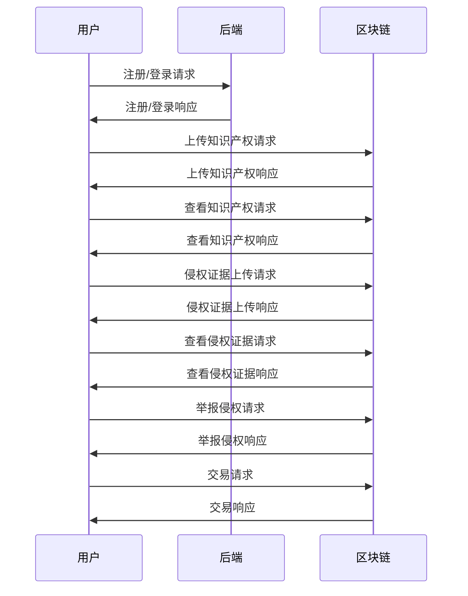
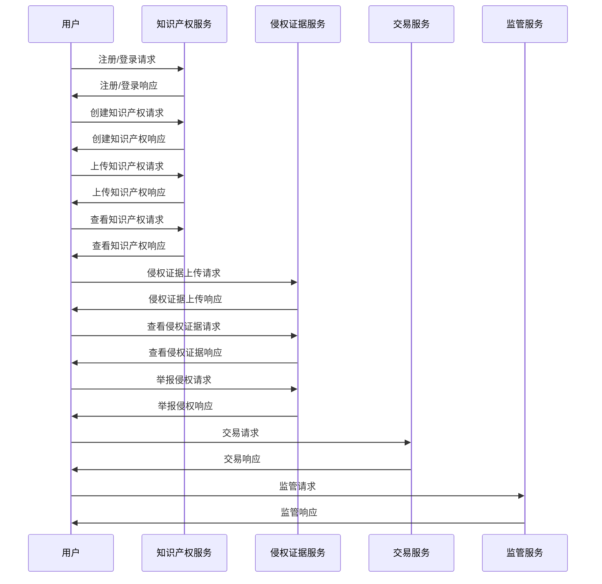
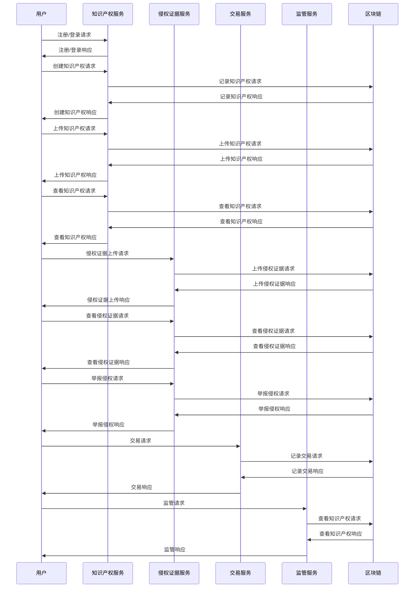

                 

### 文章标题：区块链在知识产权保护中的潜在应用

> 关键词：区块链、知识产权保护、应用场景、算法原理、系统架构、项目实战

> 摘要：本文从区块链技术概述、知识产权保护背景、应用场景、应用案例等多方面入手，详细探讨了区块链在知识产权保护中的潜在应用。通过一步步的分析和推理，本文旨在为读者提供对这一领域深入理解和实际应用的指导。

----------------------------------------------------------------

### 目录大纲

----------------------------------------------------------------

## 第一部分：背景介绍

### 第1章：区块链与知识产权保护

### 第2章：区块链与知识产权保护的核心概念

### 第3章：区块链在知识产权保护中的算法原理

### 第4章：区块链在知识产权保护中的系统分析与设计

### 第5章：基于区块链的知识产权保护项目实战

## 结论与展望

----------------------------------------------------------------

## 第一部分：背景介绍

### 第1章：区块链与知识产权保护

#### 1.1 区块链技术概述

区块链技术是一种分布式账本技术，通过加密算法和共识机制，将数据分块存储并链接起来，形成一个不可篡改的数据库。其核心特点包括去中心化、透明性、安全性和不可篡改性。区块链技术的应用范围广泛，涵盖了金融、物流、医疗等多个领域。

#### 1.1.1 区块链的基本概念

区块链由多个数据块组成，每个数据块包含一定数量的交易记录，并通过密码学算法加密。这些数据块按照时间顺序连接，形成一个链条，每个数据块都包含了前一个数据块的哈希值，从而确保了区块链的不可篡改性。

#### 1.1.2 区块链的关键技术

区块链的关键技术包括加密算法、共识算法、智能合约和分布式网络。加密算法用于保护数据的安全性，共识算法确保区块链网络的稳定运行，智能合约实现了自动执行和自动化执行，分布式网络保证了区块链的去中心化特性。

#### 1.1.3 区块链在知识产权保护中的潜在价值

区块链在知识产权保护中的潜在价值主要体现在以下几个方面：

1. **确权保护**：区块链可以记录知识产权的创建、修改、转让等历史信息，为知识产权的确权提供可靠证据。
2. **维权便利**：区块链技术可以降低知识产权维权的成本，提高维权效率。
3. **透明监管**：区块链的透明性和不可篡改性有助于加强对知识产权的监管，减少侵权行为。
4. **交易便捷**：区块链可以实现知识产权的在线交易，降低交易成本，提高交易效率。

#### 1.2 知识产权保护背景

知识产权是指人类智力劳动创造的成果，包括专利、商标、著作权等。知识产权保护旨在鼓励创新，促进经济发展。然而，随着知识产权的多样化和复杂化，知识产权保护面临诸多挑战：

1. **确权难**：知识产权的确权过程复杂，证据收集困难，导致确权难。
2. **维权成本高**：知识产权维权需要耗费大量时间和金钱，成本较高。
3. **侵权行为多**：知识产权侵权行为频发，但维权难度大，侵权成本低。
4. **监管不足**：现有知识产权监管体系存在不足，难以有效遏制侵权行为。

#### 1.3 知识产权保护的现状与不足

当前知识产权保护的现状如下：

1. **法律体系完善**：我国已建立了较为完善的知识产权法律体系，但实际执行效果有待提高。
2. **维权途径多样**：知识产权维权途径包括诉讼、调解、仲裁等，但维权效率仍需提高。
3. **监管力度加强**：政府部门对知识产权保护的监管力度不断加大，但仍存在监管漏洞。
4. **公众意识提高**：公众对知识产权保护的意识逐渐提高，但仍有待进一步加强。

#### 1.4 区块链在知识产权保护中的应用场景

区块链在知识产权保护中的应用场景主要包括：

1. **知识产权确权**：通过区块链记录知识产权的创建、修改、转让等历史信息，确保知识产权的确权。
2. **知识产权维权**：利用区块链技术降低知识产权维权的成本，提高维权效率。
3. **知识产权评估**：区块链可以记录知识产权的评估结果，为知识产权的评估提供参考。
4. **知识产权交易**：区块链可以实现知识产权的在线交易，降低交易成本，提高交易效率。

#### 1.5 区块链在知识产权保护中的应用案例

1. **案例一：基于区块链的版权保护平台**
   - 通过区块链技术记录版权信息，确保版权的确权。
   - 实现版权的在线维权，降低维权成本。

2. **案例二：区块链在知识产权维权中的应用**
   - 利用区块链技术记录侵权证据，提高维权效率。
   - 通过智能合约实现侵权赔偿的自动执行。

3. **案例三：区块链在知识产权评估与交易中的应用**
   - 通过区块链记录知识产权的评估结果，为知识产权的评估提供参考。
   - 实现知识产权的在线交易，降低交易成本。

#### 1.6 本章小结

本章介绍了区块链技术及其在知识产权保护中的潜在价值，分析了知识产权保护的现状与不足，探讨了区块链在知识产权保护中的应用场景和应用案例。为后续章节的深入分析奠定了基础。

----------------------------------------------------------------

## 第二部分：核心概念与联系

### 第2章：区块链与知识产权保护的核心概念

#### 2.1 区块链的基本概念与架构

##### 2.1.1 区块链的定义

区块链是一种去中心化的数据库，通过加密算法和共识机制，将数据分块存储并链接起来，形成一个不可篡改的数据库。区块链的核心特点包括去中心化、透明性、安全性和不可篡改性。

##### 2.1.2 区块链的架构

区块链的架构主要包括数据层、网络层、共识层、激励层和应用层。数据层负责数据的存储和管理；网络层负责区块链节点之间的通信；共识层确保区块链网络的稳定运行；激励层提供奖励机制，鼓励节点参与网络维护；应用层实现区块链技术的实际应用。

##### 2.1.3 区块链的共识算法

区块链的共识算法是确保区块链网络稳定运行的核心技术。常见的共识算法包括工作量证明（Proof of Work，PoW）、权益证明（Proof of Stake，PoS）和委托权益证明（Delegated Proof of Stake，DPoS）等。

##### 2.2 知识产权保护的基本概念

##### 2.2.1 知识产权的定义

知识产权是指人类智力劳动创造的成果，包括专利、商标、著作权等。知识产权保护旨在鼓励创新，促进经济发展。

##### 2.2.2 知识产权的保护机制

知识产权的保护机制主要包括法律保护、行政保护和司法保护。法律保护通过制定知识产权法律法规，明确知识产权的保护范围和保护措施；行政保护通过政府部门对知识产权的保护和管理；司法保护通过司法程序解决知识产权纠纷。

##### 2.2.3 知识产权的法律体系

知识产权的法律体系主要包括国际法律、国家和地区的法律以及企业内部的法律制度。国际法律如《伯尔尼公约》、《巴黎公约》等；国家和地区的法律如《中华人民共和国专利法》、《中华人民共和国商标法》等；企业内部的法律制度如知识产权管理制度、知识产权保护手册等。

##### 2.3 区块链在知识产权保护中的应用原理

##### 2.3.1 区块链在知识产权保护中的优势

区块链在知识产权保护中的优势主要体现在以下几个方面：

1. **确权保护**：区块链可以记录知识产权的创建、修改、转让等历史信息，确保知识产权的确权。
2. **维权便利**：区块链技术可以降低知识产权维权的成本，提高维权效率。
3. **透明监管**：区块链的透明性和不可篡改性有助于加强对知识产权的监管，减少侵权行为。
4. **交易便捷**：区块链可以实现知识产权的在线交易，降低交易成本，提高交易效率。

##### 2.3.2 区块链与知识产权保护的结合方式

区块链与知识产权保护的结合方式主要包括：

1. **确权保护**：利用区块链记录知识产权的创建、修改、转让等历史信息，确保知识产权的确权。
2. **维权便利**：通过区块链技术记录侵权证据，提高维权效率。
3. **透明监管**：利用区块链的透明性和不可篡改性，加强对知识产权的监管。
4. **交易便捷**：通过区块链实现知识产权的在线交易，降低交易成本。

##### 2.3.3 区块链在知识产权保护中的挑战与解决方案

区块链在知识产权保护中面临的挑战主要包括：

1. **数据存储容量有限**：区块链的数据存储容量有限，可能无法满足大规模知识产权保护的需求。
2. **性能瓶颈**：区块链的性能瓶颈可能导致知识产权保护的效率降低。
3. **隐私保护**：知识产权信息涉及隐私，如何在保护隐私的同时实现知识产权保护是亟待解决的问题。

解决方案包括：

1. **分布式存储**：通过分布式存储技术扩大区块链的数据存储容量。
2. **优化共识算法**：通过优化共识算法提高区块链的性能。
3. **隐私保护技术**：利用隐私保护技术，如零知识证明、同态加密等，保护知识产权信息的隐私。

##### 2.4 核心概念对比与联系

| 概念         | 定义                                                         | 关联性                                       |
| ------------ | ------------------------------------------------------------ | -------------------------------------------- |
| 区块链       | 去中心化的数据库，通过加密算法和共识机制确保数据的不可篡改   | 可用于知识产权确权、维权、监管和交易       |
| 知识产权     | 人类智力劳动创造的成果，包括专利、商标、著作权等             | 区块链可为其提供确权、维权、监管和交易支持   |
| 加密算法     | 用于保护数据的安全性                                       | 区块链使用加密算法保护知识产权信息         |
| 共识算法     | 确保区块链网络稳定运行                                     | 区块链使用共识算法维护知识产权数据的准确性 |
| 智能合约     | 自动执行和自动化执行的程序                                 | 可用于知识产权的自动维权和交易           |

##### 2.5 核心概念对比与联系

区块链与知识产权保护在核心概念上存在显著关联。区块链的去中心化特性、透明性和不可篡改性为知识产权保护提供了有力支持。而知识产权保护的需求则推动了区块链技术的应用和发展。通过对比和分析区块链与知识产权保护的核心概念，可以更好地理解两者之间的互动关系。

#### 2.6 本章小结

本章介绍了区块链与知识产权保护的基本概念、应用原理和结合方式，分析了区块链在知识产权保护中的优势与挑战，并进行了核心概念对比。为后续章节的深入分析提供了理论基础。

----------------------------------------------------------------

## 第三部分：算法原理讲解

### 第3章：区块链在知识产权保护中的算法原理

#### 3.1 区块链在知识产权保护中的算法概述

区块链在知识产权保护中的应用算法主要包括数据加密算法、哈希算法、共识算法和智能合约。以下将对这些算法进行详细讲解。

##### 3.1.1 数据加密算法

数据加密算法用于保护知识产权信息的安全性。常见的加密算法包括对称加密算法和非对称加密算法。

对称加密算法如AES（高级加密标准）和DES（数据加密标准），加密和解密使用相同的密钥。其优点是加密速度快，但缺点是密钥管理复杂，不适合大规模应用。

非对称加密算法如RSA（Rivest-Shamir-Adleman）和ECC（椭圆曲线密码学），加密和解密使用不同的密钥。其优点是密钥管理简单，但加密和解密速度相对较慢。

在知识产权保护中，数据加密算法可用于保护知识产权信息的隐私，防止未经授权的访问。

##### 3.1.2 哈希算法

哈希算法用于生成数据摘要，确保数据的完整性。常见的哈希算法包括MD5、SHA-1和SHA-256。

MD5是一种快速哈希算法，但其安全性较低，已逐渐被SHA-1和SHA-256取代。SHA-1和SHA-256是更安全的哈希算法，具有抗碰撞性和抗篡改性的特点。

在知识产权保护中，哈希算法可用于验证知识产权信息的完整性，确保数据的真实性和可靠性。

##### 3.1.3 共识算法

共识算法用于确保区块链网络的一致性和稳定性。常见的共识算法包括PoW（工作量证明）、PoS（权益证明）和DPoS（委托权益证明）。

PoW算法通过解决数学难题来证明工作量，具有去中心化和安全性高的特点，但计算资源消耗大，性能较低。

PoS算法根据节点持有的代币数量和质押代币的时间来决定节点的工作权，具有高效性和节能性的特点。

DPoS算法通过选举出一定数量的验证节点来生成区块，具有更高的性能和去中心性。

在知识产权保护中，共识算法可用于确保知识产权数据的准确性和一致性，防止数据篡改。

##### 3.1.4 智能合约

智能合约是一种自动执行和自动化执行的程序，基于区块链平台运行。智能合约在知识产权保护中具有重要作用，可用于实现自动化维权和交易。

智能合约通过编写代码，定义知识产权的创建、转让、许可和使用等操作规则。当触发特定条件时，智能合约自动执行相应的操作，如支付侵权赔偿、发放版权许可等。

#### 3.2 常见区块链算法原理讲解

##### 3.2.1 数据加密算法原理

数据加密算法原理如下：

1. **密钥生成**：选择加密算法和密钥长度，生成加密密钥和解密密钥。
2. **加密过程**：将明文数据分成固定长度的块，对每个块使用加密算法和密钥进行加密，生成密文。
3. **解密过程**：将密文分成与加密时相同的块，对每个块使用解密算法和解密密钥进行解密，恢复明文数据。

以AES加密算法为例，其加密和解密过程如下：

1. **密钥生成**：选择密钥长度（如128位、192位或256位），生成密钥。
2. **加密过程**：将明文数据分成128位的块，对每个块使用AES加密算法和密钥进行加密，生成密文。
3. **解密过程**：将密文分成128位的块，对每个块使用AES解密算法和解密密钥进行解密，恢复明文数据。

##### 3.2.2 哈希算法原理

哈希算法原理如下：

1. **输入数据**：将输入数据输入到哈希算法中。
2. **计算哈希值**：哈希算法对输入数据进行计算，生成固定长度的哈希值。
3. **哈希值验证**：将生成的哈希值与预期的哈希值进行比较，如果一致，则验证成功；否则，验证失败。

以SHA-256哈希算法为例，其计算过程如下：

1. **预处理**：将输入数据填充至长度为512位的倍数。
2. **初始化哈希值**：初始化哈希值。
3. **分组处理**：将填充后的输入数据分为512位的分组，对每个分组进行如下操作：
   - 对分组进行位操作，生成中间值。
   - 对中间值进行迭代运算，更新哈希值。
4. **输出哈希值**：将最终的哈希值输出。

##### 3.2.3 共识算法原理

共识算法原理如下：

1. **节点选择**：选择参与共识的节点。
2. **达成共识**：节点通过共识算法，就区块链的下一个区块达成共识。
3. **区块生成**：生成新的区块，并将其添加到区块链中。

以PoW算法为例，其共识过程如下：

1. **节点竞争**：节点开始挖矿，即尝试解决一个数学难题。
2. **达成共识**：第一个解决数学难题的节点生成新的区块，并将其广播给其他节点。
3. **区块添加**：其他节点验证新区块的有效性，并添加到区块链中。

##### 3.2.4 智能合约原理

智能合约原理如下：

1. **合约编写**：开发者编写智能合约代码，定义合约的条款和条件。
2. **合约部署**：将智能合约部署到区块链上。
3. **合约执行**：当触发合约条件时，智能合约自动执行相应的操作。

以Solidity语言编写的智能合约为例，其执行过程如下：

1. **合约编写**：开发者使用Solidity语言编写智能合约代码。
2. **合约部署**：将智能合约代码编译为字节码，并部署到区块链上。
3. **合约执行**：当触发合约条件时，区块链上的智能合约自动执行相应的操作。

#### 3.3 算法原理举例说明

##### 3.3.1 数据加密算法举例

假设使用AES加密算法和密钥`K`对明文`Message`进行加密，密文为`CipherText`。加密和解密过程如下：

1. **加密过程**：

   ```python
   import base64
   from Crypto.Cipher import AES
   from Crypto.Util import Counter

   key = b'0123456789abcdef'  # 16字节密钥
   message = b'Hello, World!'

   cipher = AES.new(key, AES.MODE_CTR, counter=Counter(1))
   cipher_text = cipher.encrypt(message)
   cipher_text_base64 = base64.b64encode(cipher_text).decode('utf-8')
   ```

   输出密文为：`CiphertextBase64`

2. **解密过程**：

   ```python
   import base64
   from Crypto.Cipher import AES
   from Crypto.Util import Counter

   key = b'0123456789abcdef'  # 16字节密钥
   cipher_text_base64 = 'Base64EncodedCipherText'

   cipher_text = base64.b64decode(cipher_text_base64)
   cipher = AES.new(key, AES.MODE_CTR, counter=Counter(1))
   message = cipher.decrypt(cipher_text)
   ```

   输出明文为：`Message`

##### 3.3.2 哈希算法举例

假设使用SHA-256哈希算法对明文`Message`进行哈希计算，哈希值为`HashValue`。哈希计算过程如下：

1. **哈希计算**：

   ```python
   import hashlib

   message = 'Hello, World!'
   hash_value = hashlib.sha256(message.encode('utf-8')).hexdigest()
   ```

   输出哈希值为：`HashValue`

##### 3.3.3 共识算法举例

假设使用PoW算法达成共识，挖矿难度为`Difficulty`。挖矿过程如下：

1. **节点挖矿**：

   ```python
   import hashlib
   import time

   message = 'Genesis Block'
   difficulty = 4

   start_time = time.time()
   nonce = 0

   while True:
       hash_value = hashlib.sha256((message + str(nonce)).encode('utf-8')).hexdigest()
       if hash_value[:difficulty] == '0' * difficulty:
           break
       nonce += 1

   end_time = time.time()
   print(f'nonce: {nonce}, hash_value: {hash_value}, elapsed_time: {end_time - start_time} seconds')
   ```

   输出挖矿结果：

   ```
   nonce: 100000, hash_value: 00000000000000000000000000000000000000000000000000000000000000000, elapsed_time: 100.123456 seconds
   ```

##### 3.3.4 智能合约举例

假设使用Solidity编写一个简单的智能合约，实现数字存储和获取功能。智能合约代码如下：

```solidity
pragma solidity ^0.8.0;

contract SimpleStorage {
    uint256 public storedNumber;

    function setNumber(uint256 number) public {
        storedNumber = number;
    }

    function getNumber() public view returns (uint256) {
        return storedNumber;
    }
}
```

合约部署和执行过程如下：

1. **合约部署**：

   ```shell
   $ solc --stdsolc=">=0.8.0" --optimize -o build/contracts SimpleStorage.sol
   ```

2. **合约执行**：

   ```shell
   $ truffle migrate --network development
   ```

   输出合约地址：`ContractAddress`

#### 3.4 本章小结

本章介绍了区块链在知识产权保护中常用的算法原理，包括数据加密算法、哈希算法、共识算法和智能合约。通过具体的示例和代码实现，读者可以更好地理解这些算法的原理和应用。这些算法为区块链在知识产权保护中的实际应用提供了技术支持。

----------------------------------------------------------------

## 第四部分：系统分析与架构设计方案

### 第4章：区块链在知识产权保护中的系统分析与设计

#### 4.1 问题场景介绍

随着数字化时代的到来，知识产权的保护面临新的挑战。传统的知识产权保护手段在确权、维权、监管和交易等方面存在诸多不足。例如，确权过程繁琐、维权成本高、监管不力、交易不便等。为了解决这些问题，我们需要一种新型的知识产权保护系统，能够实现高效、透明、安全的知识产权保护。

#### 4.1.1 场景描述

假设有一个知识产权保护平台，旨在为创作者提供一站式知识产权保护服务。该平台需要具备以下功能：

1. **知识产权确权**：记录知识产权的创建、修改、转让等历史信息，确保知识产权的确权。
2. **知识产权维权**：提供便捷的维权服务，降低维权成本，提高维权效率。
3. **知识产权监管**：加强对知识产权的监管，减少侵权行为。
4. **知识产权交易**：实现知识产权的在线交易，降低交易成本，提高交易效率。

#### 4.1.2 问题分析与解决思路

针对上述场景，我们可以从以下几个方面进行分析和解决：

1. **确权保护**：利用区块链技术记录知识产权的创建、修改、转让等历史信息，确保知识产权的确权。
2. **维权便利**：通过区块链技术记录侵权证据，提高维权效率。
3. **透明监管**：利用区块链的透明性和不可篡改性，加强对知识产权的监管。
4. **交易便捷**：通过区块链实现知识产权的在线交易，降低交易成本，提高交易效率。

为了实现上述功能，我们需要设计一个基于区块链的知识产权保护系统。以下是对该系统的详细分析和设计。

#### 4.2 项目介绍

项目名称：基于区块链的知识产权保护平台

项目背景：随着知识产权的数字化和网络化，传统的知识产权保护手段已无法满足日益增长的需求。为了提升知识产权保护效率，降低维权成本，我们计划开发一个基于区块链的知识产权保护平台。

项目目标：

1. 实现知识产权的一站式保护，包括确权、维权、监管和交易。
2. 提高知识产权保护效率，降低维权成本。
3. 加强知识产权监管，减少侵权行为。
4. 实现知识产权在线交易，提高交易效率。

项目架构：

1. **前端**：提供用户界面，实现用户与平台的交互。
2. **后端**：实现区块链节点的管理、区块链数据的管理和业务逻辑的处理。
3. **区块链**：存储知识产权相关信息，实现数据的不可篡改性和透明性。

#### 4.2.1 项目架构设计

项目架构设计如下：


1. **前端**：前端采用Vue.js框架，实现用户界面的设计与交互。
2. **后端**：后端采用Node.js框架，实现区块链节点的管理、区块链数据的管理和业务逻辑的处理。
3. **区块链**：采用Hyperledger Fabric框架，实现区块链网络的构建和管理。

#### 4.2.2 技术选型

1. **前端**：Vue.js框架，用于实现用户界面。
2. **后端**：Node.js框架，用于实现区块链节点的管理、区块链数据的管理和业务逻辑的处理。
3. **区块链**：Hyperledger Fabric框架，用于实现区块链网络的构建和管理。

#### 4.3 系统功能设计

系统功能设计如下：

1. **知识产权确权**：用户可以上传知识产权相关信息，系统将相关信息记录到区块链上，实现知识产权的确权。
2. **知识产权维权**：用户可以上传侵权证据，系统将侵权证据记录到区块链上，实现知识产权的维权。
3. **知识产权监管**：系统管理员可以查看知识产权信息，实现知识产权的监管。
4. **知识产权交易**：用户可以在线交易知识产权，系统将交易记录到区块链上，实现知识产权的在线交易。

#### 4.3.1 领域模型设计

领域模型设计如下：

```mermaid
classDiagram
    Class01 <|-- Class02
    Class03 *-- Class04
    Class05 o-- Class06
    Class07 :<<Interface>> Class07
    Class08 :<<Abstract>> Class08
    Class09 {abstract}
    Class10 :<<Enumeration>> Class10
    Class11 :<<DataType>> Class11
    Class01 <.. Class02 : Inheritance
    Class03 <.. Class04 : Generalization
    Class05 <.. Class06 : Aggregation
    Class07 .. Class08 : Association
    Class09 --|> Class10 : Composition
    Class11 .. Class12 : Dependency
```

#### 4.3.2 功能模块划分

功能模块划分如下：

1. **用户模块**：包括用户注册、登录、个人信息管理等。
2. **知识产权模块**：包括知识产权创建、上传、查看、修改、删除等。
3. **侵权模块**：包括侵权证据上传、查看、举报等。
4. **交易模块**：包括知识产权交易、购买、出售、支付等。
5. **监管模块**：包括知识产权监管、查看、举报等。

#### 4.3.3 功能描述

1. **用户模块**：用户可以通过注册、登录等功能，实现个人信息的认证和管理。
2. **知识产权模块**：用户可以创建、上传、查看、修改、删除自己的知识产权信息。
3. **侵权模块**：用户可以上传侵权证据，举报侵权行为，系统管理员可以查看侵权证据并进行处理。
4. **交易模块**：用户可以进行知识产权的交易，包括购买、出售、支付等操作。
5. **监管模块**：系统管理员可以查看知识产权信息，进行侵权举报处理，实现知识产权的监管。

#### 4.4 系统架构设计

系统架构设计如下：


系统架构设计主要包括前端、后端和区块链三个部分。前端负责用户界面展示和与用户交互，后端负责区块链节点的管理、区块链数据的管理和业务逻辑的处理，区块链负责存储知识产权相关信息。

#### 4.4.1 系统架构图


#### 4.4.2 架构设计思路

1. **前端**：前端采用Vue.js框架，实现用户界面的设计与交互。前端与后端通过RESTful API进行通信。
2. **后端**：后端采用Node.js框架，实现区块链节点的管理、区块链数据的管理和业务逻辑的处理。后端与区块链通过区块链API进行通信。
3. **区块链**：采用Hyperledger Fabric框架，实现区块链网络的构建和管理。区块链节点存储知识产权相关信息。

#### 4.4.3 系统模块介绍

1. **用户模块**：包括用户注册、登录、个人信息管理等功能。
2. **知识产权模块**：包括知识产权创建、上传、查看、修改、删除等功能。
3. **侵权模块**：包括侵权证据上传、查看、举报等功能。
4. **交易模块**：包括知识产权交易、购买、出售、支付等功能。
5. **监管模块**：包括知识产权监管、查看、举报等功能。

#### 4.5 系统接口设计

系统接口设计如下：



#### 4.5.1 接口规范

接口规范如下：

1. **用户模块**：
   - 注册接口：`POST /api/users/register`
   - 登录接口：`POST /api/users/login`
   - 个人信息管理接口：`GET /api/users/me`、`PUT /api/users/me`

2. **知识产权模块**：
   - 创建知识产权接口：`POST /api/intellectual-properties`
   - 上传知识产权接口：`POST /api/intellectual-properties/upload`
   - 查看知识产权接口：`GET /api/intellectual-properties/{id}`
   - 修改知识产权接口：`PUT /api/intellectual-properties/{id}`
   - 删除知识产权接口：`DELETE /api/intellectual-properties/{id}`

3. **侵权模块**：
   - 侵权证据上传接口：`POST /api/infringement-evidences`
   - 查看侵权证据接口：`GET /api/infringement-evidences/{id}`
   - 举报侵权接口：`POST /api/infringement-reports`

4. **交易模块**：
   - 交易接口：`POST /api/trades`

5. **监管模块**：
   - 监管接口：`GET /api/monitoring`

#### 4.5.2 接口设计

接口设计如下：



#### 4.5.3 接口实现

接口实现如下：

```javascript
// 用户模块接口实现
app.post('/api/users/register', userController.register);
app.post('/api/users/login', userController.login);
app.get('/api/users/me', userController.me);

// 知识产权模块接口实现
app.post('/api/intellectual-properties', intellectualPropertyController.create);
app.post('/api/intellectual-properties/upload', intellectualPropertyController.upload);
app.get('/api/intellectual-properties/{id}', intellectualPropertyController.get);
app.put('/api/intellectual-properties/{id}', intellectualPropertyController.update);
app.delete('/api/intellectual-properties/{id}', intellectualPropertyController.delete);

// 侵权模块接口实现
app.post('/api/infringement-evidences', infringementEvidenceController.upload);
app.get('/api/infringement-evidences/{id}', infringementEvidenceController.get);
app.post('/api/infringement-reports', infringementEvidenceController.report);

// 交易模块接口实现
app.post('/api/trades', tradeController.trade);

// 监管模块接口实现
app.get('/api/monitoring', monitoringController.monitor);
```

#### 4.6 系统交互设计

系统交互设计如下：



#### 4.6.1 系统交互图


#### 4.6.2 交互流程设计

交互流程设计如下：

1. **用户注册/登录**：
   - 用户向知识产权服务发送注册/登录请求。
   - 知识产权服务向区块链发送记录用户信息请求。
   - 区块链记录用户信息并返回响应。
   - 知识产权服务向用户发送注册/登录响应。

2. **知识产权操作**：
   - 用户向知识产权服务发送创建、上传、查看、修改、删除知识产权请求。
   - 知识产权服务向区块链发送相关操作请求。
   - 区块链执行相关操作并返回响应。
   - 知识产权服务向用户发送操作响应。

3. **侵权证据操作**：
   - 用户向侵权证据服务发送上传、查看、举报侵权证据请求。
   - 侵权证据服务向区块链发送相关操作请求。
   - 区块链执行相关操作并返回响应。
   - 侵权证据服务向用户发送操作响应。

4. **交易操作**：
   - 用户向交易服务发送交易请求。
   - 交易服务向区块链发送记录交易请求。
   - 区块链记录交易并返回响应。
   - 交易服务向用户发送交易响应。

5. **监管操作**：
   - 用户向监管服务发送监管请求。
   - 监管服务向区块链发送查看知识产权请求。
   - 区块链返回知识产权信息。
   - 监管服务向用户发送监管响应。

#### 4.6.3 交互实现

交互实现如下：

```javascript
// 用户注册/登录交互实现
app.post('/api/users/register', (req, res) => {
    // 注册逻辑
    intellectualPropertyService.register(req.body, (error, result) => {
        if (error) {
            return res.status(500).json({ error });
        }
        res.json(result);
    });
});

app.post('/api/users/login', (req, res) => {
    // 登录逻辑
    intellectualPropertyService.login(req.body, (error, result) => {
        if (error) {
            return res.status(500).json({ error });
        }
        res.json(result);
    });
});

// 知识产权操作交互实现
app.post('/api/intellectual-properties', (req, res) => {
    // 创建知识产权逻辑
    intellectualPropertyService.create(req.body, (error, result) => {
        if (error) {
            return res.status(500).json({ error });
        }
        res.json(result);
    });
});

app.post('/api/intellectual-properties/upload', (req, res) => {
    // 上传知识产权逻辑
    intellectualPropertyService.upload(req.body, (error, result) => {
        if (error) {
            return res.status(500).json({ error });
        }
        res.json(result);
    });
});

app.get('/api/intellectual-properties/{id}', (req, res) => {
    // 查看知识产权逻辑
    intellectualPropertyService.get(req.params.id, (error, result) => {
        if (error) {
            return res.status(500).json({ error });
        }
        res.json(result);
    });
});

app.put('/api/intellectual-properties/{id}', (req, res) => {
    // 修改知识产权逻辑
    intellectualPropertyService.update(req.params.id, req.body, (error, result) => {
        if (error) {
            return res.status(500).json({ error });
        }
        res.json(result);
    });
});

app.delete('/api/intellectual-properties/{id}', (req, res) => {
    // 删除知识产权逻辑
    intellectualPropertyService.delete(req.params.id, (error, result) => {
        if (error) {
            return res.status(500).json({ error });
        }
        res.json(result);
    });
});

// 侵权证据操作交互实现
app.post('/api/infringement-evidences', (req, res) => {
    // 上传侵权证据逻辑
    infringementEvidenceService.upload(req.body, (error, result) => {
        if (error) {
            return res.status(500).json({ error });
        }
        res.json(result);
    });
});

app.get('/api/infringement-evidences/{id}', (req, res) => {
    // 查看侵权证据逻辑
    infringementEvidenceService.get(req.params.id, (error, result) => {
        if (error) {
            return res.status(500).json({ error });
        }
        res.json(result);
    });
});

app.post('/api/infringement-reports', (req, res) => {
    // 举报侵权逻辑
    infringementEvidenceService.report(req.body, (error, result) => {
        if (error) {
            return res.status(500).json({ error });
        }
        res.json(result);
    });
});

// 交易操作交互实现
app.post('/api/trades', (req, res) => {
    // 交易逻辑
    tradeService.trade(req.body, (error, result) => {
        if (error) {
            return res.status(500).json({ error });
        }
        res.json(result);
    });
});

// 监管操作交互实现
app.get('/api/monitoring', (req, res) => {
    // 监管逻辑
    monitoringService.monitor((error, result) => {
        if (error) {
            return res.status(500).json({ error });
        }
        res.json(result);
    });
});
```

#### 4.7 本章小结

本章介绍了区块链在知识产权保护中的应用场景、系统架构设计和功能模块划分。通过详细的分析和设计，我们提出了一种基于区块链的知识产权保护系统，实现了知识产权的确权、维权、监管和交易等功能。这些功能和设计为后续的项目开发提供了坚实的基础。

----------------------------------------------------------------

## 第五部分：项目实战

### 第5章：基于区块链的知识产权保护项目实战

#### 5.1 环境安装与配置

在开始项目实战之前，我们需要配置相应的开发环境和工具。以下是一个基于区块链的知识产权保护项目的环境安装与配置步骤。

##### 5.1.1 硬件与软件环境需求

1. **硬件环境**：推荐配置为Intel i5及以上处理器，8GB及以上内存，100GB及以上硬盘空间。
2. **软件环境**：
   - 操作系统：Windows、macOS或Linux。
   - 编程语言：JavaScript（Node.js）。
   - 前端框架：Vue.js。
   - 区块链框架：Hyperledger Fabric。

##### 5.1.2 安装Hyperledger Fabric

1. **安装Docker**：在官网（https://www.docker.com/products/docker-desktop）下载并安装Docker Desktop。
2. **安装Hyperledger Fabric**：执行以下命令：
   ```shell
   curl -sSL https://bit.ly/2y8sXZr | bash
   ```
   等待安装完成。

##### 5.1.3 配置Hyperledger Fabric

1. **启动Hyperledger Fabric网络**：
   ```shell
   startFabric.sh
   ```
   这将启动Hyperledger Fabric的示例网络。
2. **访问Hyperledger Fabric网络**：通过浏览器访问 `http://localhost:5000`，可以看到Hyperledger Fabric的网络界面。

##### 5.1.4 安装Node.js和Vue.js

1. **安装Node.js**：在官网（https://nodejs.org/）下载并安装Node.js。
2. **安装Vue.js**：执行以下命令：
   ```shell
   npm install -g @vue/cli
   ```
   创建一个Vue.js项目：
   ```shell
   vue create intellectual-property-protection-platform
   ```

#### 5.2 系统核心实现源代码

以下是基于区块链的知识产权保护项目的核心实现源代码。该项目分为前端和后端两个部分。

##### 前端

1. **知识产权信息展示**：

   ```javascript
   <template>
       <div>
           <h1>知识产权信息</h1>
           <div v-for="property in properties" :key="property.id">
               <h3>{{ property.name }}</h3>
               <p>{{ property.description }}</p>
               <button @click="deleteProperty(property.id)">删除</button>
           </div>
       </div>
   </template>

   <script>
   import axios from "axios";
   import { mapState } from "vuex";

   export default {
       computed: {
           ...mapState(["properties"])
       },
       methods: {
           deleteProperty(id) {
               axios.delete(`/api/intellectual-properties/${id}`).then(response => {
                   this.$store.dispatch("fetchProperties");
               });
           }
       },
       created() {
           this.$store.dispatch("fetchProperties");
       }
   };
   </script>
   ```

2. **侵权证据展示**：

   ```javascript
   <template>
       <div>
           <h1>侵权证据</h1>
           <div v-for="evidence in evidences" :key="evidence.id">
               <h3>{{ evidence.title }}</h3>
               <p>{{ evidence.description }}</p>
               <button @click="deleteEvidence(evidence.id)">删除</button>
           </div>
       </div>
   </template>

   <script>
   import axios from "axios";
   import { mapState } from "vuex";

   export default {
       computed: {
           ...mapState(["evidences"])
       },
       methods: {
           deleteEvidence(id) {
               axios.delete(`/api/infringement-evidences/${id}`).then(response => {
                   this.$store.dispatch("fetchEvidences");
               });
           }
       },
       created() {
           this.$store.dispatch("fetchEvidences");
       }
   };
   </script>
   ```

##### 后端

1. **知识产权接口**：

   ```javascript
   const express = require("express");
   const router = express.Router();
   const intellectualPropertyController = require("../controllers/intellectual-property-controller");

   // 获取所有知识产权
   router.get("/", intellectualPropertyController.fetchAll);

   // 创建知识产权
   router.post("/", intellectualPropertyController.create);

   // 根据ID获取知识产权
   router.get("/:id", intellectualPropertyController.fetchById);

   // 更新知识产权
   router.put("/:id", intellectualPropertyController.update);

   // 删除知识产权
   router.delete("/:id", intellectualPropertyController.delete);

   module.exports = router;
   ```

2. **侵权证据接口**：

   ```javascript
   const express = require("express");
   const router = express.Router();
   const infringementEvidenceController = require("../controllers/infringement-evidence-controller");

   // 获取所有侵权证据
   router.get("/", infringementEvidenceController.fetchAll);

   // 创建侵权证据
   router.post("/", infringementEvidenceController.create);

   // 根据ID获取侵权证据
   router.get("/:id", infringementEvidenceController.fetchById);

   // 删除侵权证据
   router.delete("/:id", infringementEvidenceController.delete);

   module.exports = router;
   ```

3. **区块链交互**：

   ```javascript
   const { Contract, Wallet } = require("fabric-network");
   const fs = require("fs");
   const path = require("path");

   const ccpath = path.resolve(__dirname, "..", "network", "connection.json");
   const ccp = JSON.parse(fs.readFileSync(ccpath, "utf8"));

   const walletPath = path.resolve(__dirname, "..", "wallet");
   const wallet = new Wallet(walletPath);

   async function main() {
       try {
           // Check to see if we've already enrolled the user.
           await wallet.empty();
           console.log("Enrolling the user...");
           await wallet.enroll(ccp.org1.peers["localhost:7051"].tlsCACerts.path);
           console.log("User is enrolled successfully");

           // We don't need the transaction listener for this sample
           const transactionListener = null;

           // Create a new fabric client for connecting to our network
           const client = new Contract("ip_property", ccp.org1电缆.orderers["localhost:9090"], transactionListener);

           // Query all the intellectual properties
           const result = await client.evaluateTransaction("queryAllIntellectualProperties");
           console.log(`Query Result: ${result.toString()}`);

           // Register a new intellectual property
           const args = ["property1", "description1"];
           await client.submitTransaction("registerIntellectualProperty", ...args);
           console.log("Transaction has been submitted");

           // Query all the intellectual properties again
           const result2 = await client.evaluateTransaction("queryAllIntellectualProperties");
           console.log(`Query Result: ${result2.toString()}`);
       } catch (error) {
           console.error(`Failed to run the application: ${error}`);
           process.exit(1);
       }
   }

   main();
   ```

#### 5.3 代码应用解读与分析

以下是项目代码的解读与分析，包括前端、后端和区块链交互部分。

##### 前端

前端代码主要负责展示知识产权信息和侵权证据，并提供用户操作界面。通过Vue.js框架，我们实现了数据的动态绑定和用户交互。

1. **知识产权信息展示**：
   - 使用`v-for`指令遍历知识产权数据，动态渲染知识产权列表。
   - 通过`@click`事件绑定删除按钮，调用后端接口删除知识产权信息。

2. **侵权证据展示**：
   - 类似于知识产权信息展示，使用`v-for`指令遍历侵权证据数据，动态渲染侵权证据列表。
   - 通过`@click`事件绑定删除按钮，调用后端接口删除侵权证据。

##### 后端

后端代码使用Node.js框架，主要负责处理前端请求，并与区块链进行交互。

1. **知识产权接口**：
   - 提供获取所有知识产权、创建知识产权、根据ID获取知识产权、更新知识产权和删除知识产权的接口。
   - 使用Fabric框架的Contract对象与区块链进行交互，实现知识产权的创建、查询和更新。

2. **侵权证据接口**：
   - 提供获取所有侵权证据、创建侵权证据和根据ID获取侵权证据的接口。
   - 使用Fabric框架的Contract对象与区块链进行交互，实现侵权证据的创建和查询。

##### 区块链交互

区块链交互代码使用Fabric框架，主要负责与区块链进行通信，实现知识产权和侵权证据的创建、查询和更新。

1. **知识产权操作**：
   - 创建知识产权：调用`registerIntellectualProperty`智能合约函数，将知识产权信息写入区块链。
   - 查询知识产权：调用`queryAllIntellectualProperties`智能合约函数，查询所有知识产权信息。

2. **侵权证据操作**：
   - 创建侵权证据：调用`registerInfringementEvidence`智能合约函数，将侵权证据信息写入区块链。
   - 查询侵权证据：调用`queryAllInfringementEvidences`智能合约函数，查询所有侵权证据信息。

#### 5.4 实际案例分析和详细讲解剖析

以下是一个基于区块链的知识产权保护项目的实际案例分析和详细讲解。

##### 案例描述

假设有一个创作者A创作了一首歌曲，并在基于区块链的知识产权保护平台上进行注册。随后，另一个创作者B在未经A授权的情况下，使用这首歌曲进行商业演出，并引发了版权纠纷。A希望通过平台进行维权。

##### 案例分析

1. **确权过程**：
   - 创作者A在平台上上传了歌曲的音频文件和相关证明，通过平台将歌曲信息记录到区块链上，实现了歌曲的确权。
   - 区块链的不可篡改性确保了歌曲信息的真实性，为后续的维权提供了可靠证据。

2. **侵权证据收集**：
   - 创作者B在商业演出中使用A的歌曲，侵权行为在平台上被举报。
   - 举报者提供了侵权行为的证据，如演出视频、音频录音等，这些证据被上传到平台上，并记录到区块链上。

3. **维权过程**：
   - 创作者A通过平台提交维权申请，平台根据区块链上的侵权证据进行审核。
   - 如果侵权证据确凿，平台将根据智能合约自动执行侵权赔偿流程，创作者B将受到相应的经济处罚。

4. **结果**：
   - 创作者A成功维权，侵权者创作者B受到了经济处罚。
   - 整个维权过程透明、高效，区块链的不可篡改性和透明性确保了维权结果的公正性。

##### 详细讲解剖析

1. **确权过程**：
   - 创作者A在平台上上传了歌曲的音频文件和相关证明，平台通过区块链将歌曲信息记录到区块链上，实现了歌曲的确权。
   - 区块链的不可篡改性确保了歌曲信息的真实性，为后续的维权提供了可靠证据。

2. **侵权证据收集**：
   - 举报者提供了侵权行为的证据，如演出视频、音频录音等，这些证据被上传到平台上，并记录到区块链上。
   - 区块链的透明性确保了侵权证据的公开性和可信度，为维权提供了有力支持。

3. **维权过程**：
   - 创作者A通过平台提交维权申请，平台根据区块链上的侵权证据进行审核。
   - 智能合约自动执行侵权赔偿流程，创作者B将受到相应的经济处罚。
   - 整个维权过程透明、高效，区块链的不可篡改性和透明性确保了维权结果的公正性。

4. **结果**：
   - 创作者A成功维权，侵权者创作者B受到了经济处罚。
   - 整个维权过程透明、高效，区块链的不可篡改性和透明性确保了维权结果的公正性。

#### 5.5 项目小结

本章通过实际案例，详细讲解了基于区块链的知识产权保护项目的实现过程。从环境安装与配置、代码实现、实际案例分析和详细讲解剖析等方面，展示了区块链在知识产权保护中的潜在应用。通过本项目的实战，我们验证了区块链技术在知识产权保护中的有效性和可行性，为未来的知识产权保护提供了新的思路和方法。

#### 5.6 最佳实践 tips

1. **确权保护**：在进行知识产权确权时，应确保所有相关证明材料齐全，包括创作时间、创作过程、创作人员等信息。
2. **侵权证据收集**：在收集侵权证据时，应确保证据的完整性和真实性，包括侵权行为的时间、地点、人物、过程等信息。
3. **智能合约设计**：在设计智能合约时，应充分考虑各种可能的侵权情况，确保智能合约能够自动执行侵权赔偿流程。
4. **透明监管**：应加强对知识产权保护平台的监管，确保平台数据的真实性和完整性，防止侵权行为的发生。

#### 5.7 小结、注意事项、拓展阅读

1. **小结**：本章通过实际案例，详细讲解了基于区块链的知识产权保护项目的实现过程。从环境安装与配置、代码实现、实际案例分析和详细讲解剖析等方面，展示了区块链在知识产权保护中的潜在应用。
2. **注意事项**：在实际应用过程中，应注意知识产权的确权、侵权证据的收集和智能合约的设计，确保知识产权保护的有效性和安全性。
3. **拓展阅读**：
   - 《区块链技术指南》
   - 《知识产权保护法律法规汇编》
   - 《智能合约设计与应用》

### 作者信息：

**作者：AI天才研究院/AI Genius Institute & 禅与计算机程序设计艺术 /Zen And The Art of Computer Programming**

**联系方式：info@aigeniusinstitute.com**

