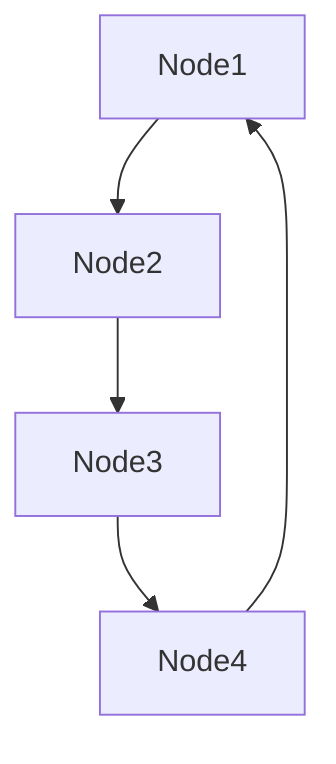
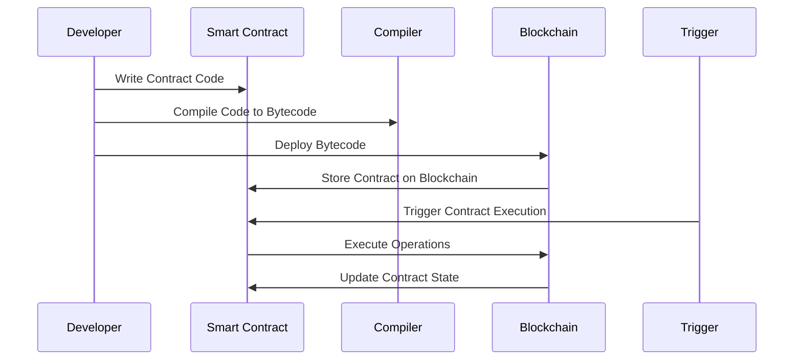
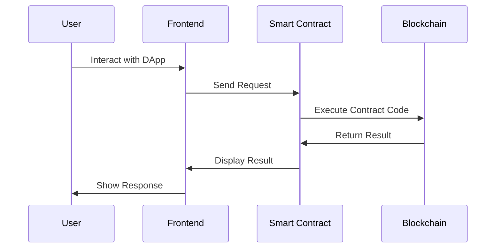

                 

# 引言

## 第1章：区块链与能源交易概述

### 1.1 问题背景

能源交易是现代社会经济发展的重要环节，涉及到能源的采购、销售、分配和使用等多个方面。然而，现有的能源交易模式存在诸多问题，如信息不对称、交易成本高、安全性不足等。这些问题不仅影响了能源交易的效率和透明度，还增加了交易的风险和不确定性。

首先，能源交易的信息不对称问题严重。在传统的能源交易过程中，买卖双方的信息往往不透明，买方无法准确了解能源的来源、质量、价格等信息，卖方也无法及时获取市场需求和价格趋势。这种信息不对称导致了交易的不公平性和效率低下。

其次，能源交易的交易成本高。在传统的能源交易模式中，交易流程复杂，需要经过多个环节，包括能源生产、运输、储存、销售等。每个环节都需要人工参与，导致交易成本居高不下。此外，能源交易中的中介机构和服务费用也增加了交易的成本。

最后，能源交易的安全性不足。在传统的能源交易中，交易过程中存在信息泄露、数据篡改等风险，可能导致交易纠纷和财产损失。同时，能源交易市场的不透明性也使得监管和审计变得更加困难。

### 1.1.1 能源交易现状与问题

当前，能源交易主要依赖于中心化的交易平台，这些平台通常由能源公司、金融机构和政府部门等运营。虽然中心化的交易平台在一定程度上解决了信息不对称和交易成本高的问题，但它们也存在一些固有的缺陷。

首先，中心化的交易平台往往存在单点故障的风险。一旦交易平台出现故障或遭到攻击，可能导致整个交易系统瘫痪，影响能源交易的正常运行。

其次，中心化的交易平台信息透明度不高。虽然交易平台记录了所有的交易信息，但这些信息通常由平台方控制，用户无法直接获取和验证。这种信息不透明性可能导致交易不公平和隐私泄露。

最后，中心化的交易平台容易受到监管和法规的限制。由于平台运营方通常是大型企业或政府部门，它们的运营模式和管理制度可能受到严格的监管和限制，导致交易效率低下和创新能力受限。

### 1.1.2 区块链技术的特点与优势

区块链技术作为一种新兴的分布式数据库技术，具有去中心化、透明、安全等特点，为能源交易提供了新的解决方案。

首先，区块链技术实现了去中心化的数据存储和交易。在区块链网络中，所有的交易记录都由网络中的多个节点共同维护和验证，没有任何中央机构控制。这种去中心化的架构保证了交易的公平性和透明性，降低了交易成本。

其次，区块链技术提供了透明、不可篡改的账本。区块链上的所有交易记录都是公开透明的，任何参与者都可以查看和验证。同时，区块链技术采用了密码学技术，确保了交易记录的不可篡改性和安全性。

最后，区块链技术具有智能合约功能。智能合约是一种自动执行的合同，基于区块链技术实现自动履行。在能源交易中，智能合约可以自动化执行交易条款，确保交易的合法性和合规性。

### 1.2 问题描述

如何在能源交易中充分利用区块链技术，实现去中心化、降低交易成本、提高交易安全性？

### 1.3 问题解决

通过区块链技术，可以实现以下目标：

1. **实现去中心化**：利用区块链技术，构建去中心化的能源交易平台，消除中心化的单点故障风险，提高交易的公平性和透明性。

2. **降低交易成本**：去中心化的区块链平台减少了交易的中介环节，简化了交易流程，降低了交易成本。

3. **提高交易安全性**：区块链技术提供了透明、不可篡改的账本，结合智能合约功能，确保了交易的安全性和合规性。

### 1.4 边界与外延

本章节主要介绍区块链在能源交易中的应用，重点关注能源买卖、租赁、分布式能源系统、能源供应链管理等方面的应用。同时，本章节也将探讨区块链在能源交易中面临的挑战和解决方案。

### 1.5 概念结构与核心要素组成

#### 1.5.1 区块链技术

区块链技术是一种分布式数据库系统，由多个节点共同维护和验证数据，具有去中心化、透明、安全等特点。

**核心概念**：
- 区块：区块链的基本组成单位，包含一定数量的交易记录。
- 交易：区块链上的基本操作，表示数据的增加、删除或修改。
- 共识机制：区块链网络中节点达成一致的方法，确保数据的正确性和一致性。

**技术原理**：
- 密码学：利用公钥和私钥实现数据的加密和验证。
- 哈希函数：将任意长度的数据映射为固定长度的哈希值，确保数据的唯一性和不可篡改性。

**属性特征对比表格**：

| 特征           | 区块链       | 中心化数据库       |
| -------------- | ------------ | ----------------- |
| 数据存储方式   | 分布式       | 集中式             |
| 数据一致性     | 共识机制保证 | 中心服务器维护     |
| 数据透明度     | 全网可见     | 中心服务器控制     |
| 数据安全性     | 不可篡改     | 中心服务器安全     |
| 系统可靠性     | 去中心化     | 单点故障风险高     |

**ER实体关系图架构**：

```mermaid
erDiagram
    Transaction ||--|{ Blockchain }|--| User
    User ||--|{ Smart Contract }|--
    Blockchain ||--|{ Node }|--| Consensus Mechanism
```

#### 1.5.2 能源交易

能源交易是指能源的买卖、租赁、共享等活动。能源交易包括能源生产、运输、储存、销售等环节。

**核心概念**：
- 能源买卖：指能源的购买和销售活动。
- 能源租赁：指能源的租赁和退还活动。
- 能源共享：指能源的共享和分配活动。

**技术原理**：
- 能源买卖：基于区块链的智能合约实现自动化的买卖流程。
- 能源租赁：基于区块链的智能合约实现自动化的租赁和退还流程。
- 能源共享：基于区块链的分布式能源系统实现能源的共享和分配。

**属性特征对比表格**：

| 特征           | 区块链能源交易       | 传统能源交易       |
| -------------- | ------------------- | ----------------- |
| 数据存储方式   | 分布式分布式账本     | 中心化数据库       |
| 数据透明度     | 全网可见             | 中心服务器控制     |
| 数据安全性     | 不可篡改             | 中心服务器安全     |
| 系统可靠性     | 去中心化             | 单点故障风险高     |
| 交易效率       | 高                 | 低                |

**ER实体关系图架构**：

```mermaid
erDiagram
    EnergyTransaction ||--|{ Blockchain }|--| User
    EnergyTransaction ||--|{ Smart Contract }|--
    User ||--|{ EnergyProducer }|--
    User ||--|{ EnergyConsumer }|--
    EnergyProducer ||--|{ EnergyProducerContract }|--
    EnergyConsumer ||--|{ EnergyConsumerContract }|--
```

### 1.6 总结

本章介绍了区块链与能源交易的基本概念、问题背景和解决方案。区块链技术通过去中心化、透明性和安全性的特点，为能源交易提供了新的解决方案。接下来，我们将进一步深入探讨区块链技术的具体原理和应用，以及如何解决能源交易中的挑战。

## 第二部分：区块链技术基础

### 第2章：区块链基本概念与技术原理

区块链技术作为一种分布式数据库系统，具有去中心化、透明、安全等特点，广泛应用于金融、能源、物流等多个领域。本章节将详细阐述区块链的基本概念、技术原理以及其在能源交易中的应用。

### 2.1 区块链基本概念

区块链是一种由多个区块组成的分布式数据库，每个区块包含一定数量的交易记录。区块链上的数据是公开透明的，任何节点都可以查看和验证。

**核心概念**：

- **区块**：区块链的基本组成单位，包含一定数量的交易记录。
- **交易**：区块链上的基本操作，表示数据的增加、删除或修改。
- **链**：由多个区块按照时间顺序连接而成的数据结构。

**技术原理**：

- **分布式账本**：区块链上的数据由多个节点共同维护和验证，每个节点都保存一份完整的账本。这种方式去除了中心化的单点故障风险，提高了系统的可靠性和安全性。
- **共识机制**：区块链网络中的节点通过共识机制达成一致，确保数据的正确性和一致性。常见的共识机制有工作量证明（PoW）、权益证明（PoS）等。
- **密码学**：区块链技术采用密码学技术，包括公钥、私钥和哈希函数等，确保数据的加密和验证。

### 2.2 区块链技术原理

区块链技术通过密码学、共识机制、智能合约等技术实现去中心化、安全、透明的交易环境。

**密码学**：

- **公钥和私钥**：公钥和私钥是密码学中的基本概念。公钥用于加密数据，私钥用于解密数据。在区块链中，每个用户都有一对公钥和私钥。
- **哈希函数**：哈希函数将任意长度的数据映射为固定长度的哈希值。在区块链中，哈希函数用于确保数据的唯一性和不可篡改性。

**共识机制**：

- **工作量证明（PoW）**：工作量证明是一种通过计算工作量来证明节点有权参与区块链网络共识的机制。常见的PoW算法有比特币的SHA-256算法。
- **权益证明（PoS）**：权益证明是一种通过验证节点持有的代币数量来证明节点有权参与区块链网络共识的机制。与PoW相比，PoS减少了计算资源的消耗，但可能存在“富者愈富”的问题。

**智能合约**：

- **智能合约**：智能合约是一种自动执行的合同，基于区块链技术实现自动履行。智能合约可以定义一系列条件和操作，当条件满足时，自动执行相应的操作。
- **去中心化应用（DApp）**：去中心化应用是基于区块链技术的应用程序，具有自主性、透明性、安全性等特点。DApp可以用于能源交易、金融交易、投票等领域。

### 2.3 区块链在能源交易中的应用

区块链技术在能源交易中的应用主要体现在以下几个方面：

1. **去中心化交易平台**：利用区块链技术，构建去中心化的能源交易平台，实现能源买卖、租赁、共享等活动的自动化、透明化和安全性。
2. **分布式能源系统**：通过区块链技术实现分布式能源系统的智能调度、实时监测和优化管理，提高能源利用效率和系统可靠性。
3. **能源供应链管理**：利用区块链技术实现能源供应链的可追溯性、透明性和安全性，提高供应链的效率和信任度。
4. **智能合约**：通过智能合约实现能源交易中的自动化流程，减少人工干预，提高交易效率和准确性。

### 2.4 总结

本章介绍了区块链的基本概念、技术原理以及其在能源交易中的应用。区块链技术通过去中心化、透明性和安全性的特点，为能源交易提供了新的解决方案。在接下来的章节中，我们将进一步探讨区块链在能源交易中的应用场景、挑战和解决方案。

## 第3章：区块链网络架构与共识机制

区块链技术的核心在于其网络架构和共识机制，这些构成了区块链系统的基础框架，确保了系统的去中心化、安全性和可靠性。在本章中，我们将详细探讨区块链的网络架构以及不同的共识机制，解释它们如何工作，并分析其在能源交易中的应用。

### 3.1 区块链网络架构

区块链网络由多个节点组成，每个节点都运行着区块链软件，并参与区块链的维护和验证。以下是一个典型的区块链网络架构：

- **节点**：区块链网络中的每一个参与者都被称为节点。节点可以独立运行区块链软件，存储区块链上的数据，并参与区块链的交易验证。
- **区块**：区块是区块链的基本单位，包含了一定数量的交易记录。每个区块都有一个唯一的标识符（即哈希值），并指向前一个区块，形成链式数据结构。
- **链**：链是由一系列按照时间顺序连接的区块组成的。链是区块链的数据结构，确保了数据的完整性和不可篡改性。
- **网络**：区块链网络是由所有参与节点组成的分布式网络。节点通过网络相互通信，交换区块和交易信息，并协作维护区块链。

**网络架构图**：



在这个网络架构图中，每个节点都与其他节点相连，形成一个分布式网络。节点之间通过共识机制达成一致，确保区块链的数据一致性。

### 3.2 共识机制

共识机制是区块链网络中节点达成一致的方法，确保区块链上的数据正确性和一致性。以下是一些常见的共识机制：

- **工作量证明（PoW）**：PoW是通过计算工作来证明节点有权参与区块链网络共识的机制。在PoW机制中，节点需要解决一个复杂的数学问题，这个过程称为挖矿。解决问题的节点将获得区块奖励。PoW机制的典型代表是比特币。
- **权益证明（PoS）**：PoS是通过验证节点持有的代币数量来证明节点有权参与区块链网络共识的机制。在PoS机制中，节点持有更多的代币，就有更大的机会生成新区块。PoS机制相比PoW机制更节能，但可能存在“富者愈富”的问题。
- **委托权益证明（DPoS）**：DPoS是一种改进的PoS机制，通过选举产生代理节点，这些代理节点代表所有持有代币的用户生成区块。DPoS提高了交易速度，并减少了不必要的计算资源消耗。
- **授权权益证明（PoA）**：PoA是一种集中式的共识机制，由一组授权节点生成区块。这些授权节点通过持有或购买特殊的代币获得授权。

### 3.3 区块链网络与共识机制在能源交易中的应用

区块链网络和共识机制在能源交易中的应用主要体现在以下几个方面：

1. **去中心化交易平台**：通过区块链网络和共识机制，构建去中心化的能源交易平台，实现能源的买卖、租赁和共享。这种去中心化的交易平台减少了中介机构的介入，降低了交易成本，提高了交易效率。
2. **分布式能源系统**：通过区块链网络和共识机制，实现分布式能源系统的智能调度和优化管理。区块链可以记录能源的生成、传输和消耗信息，确保数据的透明性和不可篡改性，从而提高能源系统的效率和可靠性。
3. **能源供应链管理**：通过区块链网络和共识机制，实现能源供应链的可追溯性。能源交易各方可以在区块链上记录和验证能源的来源、质量、运输和交付信息，提高供应链的透明度和信任度。
4. **智能合约**：通过区块链网络和共识机制，利用智能合约实现能源交易的自动化和合规性。智能合约可以自动执行交易条款，确保交易的合法性和准确性。

### 3.4 共识机制对比表格

以下是对不同共识机制的主要特点进行对比的表格：

| 共识机制 | 主要特点 | 优点 | 缺点 |
| :--- | :--- | :--- | :--- |
| 工作量证明（PoW） | 通过计算工作证明节点资格 | 高安全性，去中心化 | 能源消耗大，效率低 |
| 权益证明（PoS） | 通过持有代币数量证明节点资格 | 能源消耗低，效率高 | 可能导致“富者愈富” |
| 委托权益证明（DPoS） | 通过选举代理节点生成区块 | 高效率，低能源消耗 | 中心化风险 |
| 授权权益证明（PoA） | 由授权节点生成区块 | 高效率，简单易用 | 中心化风险 |

### 3.5 总结

本章详细介绍了区块链的网络架构和共识机制。区块链网络由多个节点组成，节点通过共识机制达成一致，确保区块链的数据正确性和一致性。这些机制在能源交易中有着广泛的应用，包括去中心化交易平台、分布式能源系统、能源供应链管理和智能合约等方面。通过理解区块链的网络架构和共识机制，我们可以更好地利用区块链技术解决能源交易中的问题。

## 第4章：智能合约与去中心化应用（DApp）开发

智能合约和去中心化应用（DApp）是区块链技术的核心组成部分，它们极大地扩展了区块链的应用范围，使其不仅仅是用于简单的数据存储，而是能够执行复杂的业务逻辑和自动化操作。在本章中，我们将深入探讨智能合约的基本概念、工作原理，以及如何开发和部署去中心化应用。

### 4.1 智能合约概述

智能合约是一种自动执行的合同，它基于区块链技术实现，能够在满足特定条件时自动执行预定义的操作。智能合约通过代码定义了一系列规则和条件，当这些条件被满足时，合约会自动执行相应的操作。

**核心概念**：

- **智能合约**：一种自动执行的合同，基于区块链技术实现。
- **去中心化应用（DApp）**：基于区块链技术的应用程序，具有自主性、透明性、安全性等特点。
- **智能合约语言**：用于编写智能合约的编程语言，如Solidity、Vyper等。
- **以太坊**：一个支持智能合约的区块链平台，是DApp开发的主要平台之一。

**技术原理**：

- **编程逻辑**：智能合约使用编程语言编写，定义了业务逻辑和条件判断。
- **区块链执行**：智能合约在区块链上执行，通过网络中的节点验证和执行。
- **去中心化存储**：智能合约的代码和状态数据存储在区块链上，确保透明性和不可篡改性。

### 4.2 智能合约工作原理

智能合约的工作原理可以分为以下几个步骤：

1. **编写智能合约**：开发者使用智能合约语言（如Solidity）编写智能合约代码，定义业务逻辑和操作。
2. **编译智能合约**：将智能合约代码编译为区块链能够理解和执行的字节码。
3. **部署智能合约**：将编译后的字节码部署到区块链上，通常需要支付一定的费用（如以太币）。
4. **智能合约执行**：当触发合约条件时，智能合约会自动执行预定义的操作，如转账、修改状态变量等。
5. **状态更新**：智能合约执行的结果会更新区块链上的状态数据，确保数据的透明性和一致性。

**工作流程图**：



### 4.3 去中心化应用（DApp）开发

去中心化应用（DApp）是区块链技术的应用层，它们基于区块链技术提供了一系列去中心化的服务和功能。DApp的开发过程主要包括以下几个步骤：

1. **需求分析和设计**：明确DApp的目标、功能、用户界面和用户体验。
2. **智能合约开发**：使用智能合约语言编写DApp的核心逻辑和业务规则。
3. **前端开发**：使用Web技术（如HTML、CSS、JavaScript）开发DApp的用户界面。
4. **后端集成**：将前端与智能合约集成，实现用户交互和数据交互。
5. **测试和部署**：对DApp进行测试，确保其功能正确、性能稳定，然后部署到区块链网络上。

**DApp开发流程图**：



### 4.4 能源交易中的智能合约和DApp应用

在能源交易中，智能合约和DApp的应用可以极大地提高交易的效率、透明性和安全性。以下是一些具体的例子：

- **自动化交易**：通过智能合约，可以实现自动化能源交易，减少人工干预，提高交易效率。
- **智能电网管理**：利用DApp，可以实现智能电网的实时监测、调度和优化，提高能源利用效率。
- **分布式能源系统**：通过智能合约和DApp，可以实现分布式能源系统的智能调度、交易和结算，提高系统的可靠性和透明性。
- **能源供应链管理**：利用区块链的可追溯性，可以实现对能源供应链的全程管理，提高供应链的透明度和信任度。

### 4.5 总结

智能合约和去中心化应用（DApp）是区块链技术的核心组成部分，它们为能源交易带来了去中心化、自动化和安全性的优势。通过智能合约，可以自动执行交易条款，提高交易效率；通过DApp，可以实现复杂的业务逻辑和自动化操作。在接下来的章节中，我们将进一步探讨区块链在能源交易中的具体应用，以及面临的挑战和解决方案。

## 第三部分：区块链在能源交易中的应用

### 第5章：区块链在能源市场中的应用场景

区块链技术在能源市场的应用场景丰富多样，能够有效解决现有能源交易模式中的诸多问题，如信息不对称、交易成本高、安全性不足等。以下将详细探讨区块链在能源市场中的应用场景，并分析其具体实现方式和优势。

### 5.1 区块链在能源买卖中的应用

能源买卖是能源市场中最基本的活动之一，包括电力、天然气等能源形式的交易。通过区块链技术，可以实现对能源买卖过程的去中心化和自动化。

**实现方式**：

1. **智能合约**：使用智能合约定义能源买卖的条款和条件，如价格、数量、交货时间等。当交易双方达成一致并签署智能合约后，合约将自动执行交易过程。
2. **分布式账本**：区块链的分布式账本技术记录所有的交易信息，确保交易信息的透明性和不可篡改性。交易双方可以实时查看和验证交易记录，提高信任度。

**优势**：

- **去中心化**：通过去中心化的区块链平台，消除了中介机构的依赖，降低了交易成本。
- **自动化**：智能合约自动执行交易条款，减少了人工干预，提高了交易效率。
- **透明性**：区块链上的交易信息公开透明，增强了交易的信任度。

### 5.2 区块链在能源租赁中的应用

能源租赁是另一种常见的能源交易形式，例如，企业可能需要租赁电力或天然气等能源资源来满足其短期需求。区块链技术可以为能源租赁提供更加高效和安全的解决方案。

**实现方式**：

1. **智能合约**：使用智能合约定义租赁协议的条款，如租赁期限、租金、违约责任等。智能合约确保租赁协议的自动执行和合法性。
2. **可追溯性**：区块链记录租赁过程中产生的所有数据，包括租赁合同、支付记录、设备状态等。这些数据具有不可篡改性，可以随时查询和验证。

**优势**：

- **自动化**：智能合约自动化执行租赁协议，减少了人工操作，提高了租赁效率。
- **可追溯性**：区块链上的数据记录确保了租赁过程的透明性和可追溯性，降低了租赁纠纷的风险。
- **安全性**：区块链的加密技术确保了租赁信息的保密性和完整性。

### 5.3 区块链在能源共享中的应用

能源共享是指通过分布式能源系统实现能源的共享和分配，如家庭光伏发电系统的余电共享。区块链技术可以为能源共享提供去中心化的交易平台和智能化的管理工具。

**实现方式**：

1. **分布式账本**：区块链记录所有参与能源共享的节点和交易信息，包括发电量、共享量、交易金额等。确保数据的透明性和不可篡改性。
2. **智能合约**：使用智能合约管理能源共享的规则和条件，如共享电量的定价、支付方式、结算周期等。智能合约确保交易的自动化和合规性。

**优势**：

- **去中心化**：通过去中心化的平台，消除了中心化中介的依赖，降低了交易成本和管理难度。
- **智能化**：智能合约自动化执行能源共享规则，提高了能源共享的效率和公平性。
- **透明性**：区块链上的数据记录确保了能源共享过程的透明性和可追溯性，增强了参与者的信任。

### 5.4 区块链在批发市场中的应用

批发市场是能源市场中一个重要的环节，涉及到大量能源的批发交易。区块链技术可以为批发市场提供更加高效、安全和透明的交易环境。

**实现方式**：

1. **分布式账本**：区块链记录所有的批发交易信息，包括交易双方、交易金额、交易时间等，确保交易信息的公开透明。
2. **智能合约**：使用智能合约管理批发交易的规则和条件，如交易价格、质量标准、结算方式等。智能合约确保交易的自动化和合规性。

**优势**：

- **透明性**：区块链上的交易信息公开透明，增强了市场参与者的信任。
- **安全性**：区块链的加密技术确保了交易数据的安全性和不可篡改性。
- **效率**：智能合约自动化执行交易条款，减少了人工操作，提高了交易效率。

### 5.5 总结

区块链在能源市场中的应用场景丰富多样，包括能源买卖、租赁、共享和批发市场等。通过智能合约和分布式账本技术，区块链能够实现能源交易的去中心化、自动化和透明化，提高交易效率和安全性。在接下来的章节中，我们将进一步探讨区块链在分布式能源系统和能源供应链管理中的应用。

### 第6章：区块链在分布式能源系统中的应用

分布式能源系统是一种基于可再生能源的小型发电系统，如家庭光伏、小型风力发电等。这些系统能够根据用户的需求和能源的供应情况进行智能调度和优化管理。区块链技术在分布式能源系统中具有广泛的应用潜力，可以提高系统的可靠性、效率和透明度。

#### 6.1 分布式能源系统概述

分布式能源系统（DES）是一种将多个小型发电单元分布式部署在用户端或接近用户端的发电系统。这些小型发电单元可以是太阳能光伏板、小型风力涡轮机、燃料电池等。分布式能源系统具有以下特点：

- **分布式部署**：发电单元分布在用户端或接近用户端，减少了输电损耗，提高了能源利用效率。
- **可再生能源**：分布式能源系统通常基于可再生能源，如太阳能、风能、生物质能等，有助于减少对化石燃料的依赖和环境污染。
- **灵活性**：分布式能源系统可以根据用户需求和能源供应情况实时调整发电量，实现灵活的能源调度和管理。

#### 6.2 区块链在分布式能源系统中的应用

区块链技术在分布式能源系统中可以应用于多个方面，包括智能调度、实时监测、优化管理和交易等。

**6.2.1 智能调度**

区块链技术可以通过智能合约实现分布式能源系统的智能调度。智能合约可以定义一系列调度规则，如发电优先级、负载平衡等。当系统需要调整发电量时，智能合约会自动执行相应的操作，确保系统的稳定运行。

**实现方式**：

1. **智能合约**：编写智能合约定义调度规则，如发电量优先级、负载平衡等。
2. **分布式账本**：区块链记录所有调度操作和发电数据，确保数据的透明性和不可篡改性。
3. **自动化执行**：智能合约自动执行调度操作，减少人工干预，提高调度效率。

**优势**：

- **自动化**：智能合约自动执行调度规则，减少了人工操作，提高了调度效率。
- **灵活性**：智能合约可以根据实时数据动态调整发电量，实现灵活的能源调度。
- **透明性**：区块链记录所有调度操作，增强了系统运行的透明度和可追溯性。

**6.2.2 实时监测**

区块链技术可以实现分布式能源系统的实时监测，记录发电量、用电量、设备状态等数据。这些数据对于系统优化和管理具有重要意义。

**实现方式**：

1. **传感器和数据记录**：分布式能源系统中的传感器实时记录发电量、用电量、设备状态等数据。
2. **分布式账本**：区块链记录所有传感器数据，确保数据的透明性和不可篡改性。
3. **实时查询**：用户可以通过区块链平台实时查询系统的运行状态和发电量数据。

**优势**：

- **实时性**：区块链记录的数据具有实时性，用户可以实时了解系统的运行状态。
- **透明性**：区块链上的数据公开透明，增强了系统的可信度和透明度。
- **可追溯性**：区块链上的数据具有不可篡改性，便于追溯和分析。

**6.2.3 优化管理**

区块链技术可以通过智能合约实现分布式能源系统的优化管理，包括能源分配、设备维护、能源交易等。

**实现方式**：

1. **智能合约**：编写智能合约定义优化管理规则，如能源分配策略、设备维护计划、能源交易条款等。
2. **分布式账本**：区块链记录所有优化管理操作和结果，确保数据的透明性和不可篡改性。
3. **自动化执行**：智能合约自动执行优化管理操作，减少人工干预，提高管理效率。

**优势**：

- **自动化**：智能合约自动执行优化管理操作，减少了人工操作，提高了管理效率。
- **灵活性**：智能合约可以根据实时数据动态调整优化管理策略，实现灵活的管理。
- **透明性**：区块链记录所有优化管理操作，增强了系统管理的透明度和可追溯性。

**6.2.4 能源交易**

区块链技术可以为分布式能源系统提供去中心化的能源交易平台，实现能源的买卖、租赁和共享。

**实现方式**：

1. **智能合约**：编写智能合约定义能源交易条款，如价格、数量、交付时间等。
2. **分布式账本**：区块链记录所有能源交易信息，确保交易的透明性和不可篡改性。
3. **自动化执行**：智能合约自动执行能源交易，减少人工干预，提高交易效率。

**优势**：

- **去中心化**：通过去中心化的平台，消除了中介机构的依赖，降低了交易成本。
- **安全性**：区块链的加密技术确保了交易数据的安全性和不可篡改性。
- **效率**：智能合约自动执行交易条款，减少了人工干预，提高了交易效率。

#### 6.3 案例分析

**案例1：家庭光伏发电系统**

家庭光伏发电系统是一种典型的分布式能源系统。通过区块链技术，可以实现家庭光伏发电系统的智能调度、实时监测和能源交易。

- **智能调度**：使用智能合约定义家庭光伏发电系统的调度规则，如优先向家庭用电提供电力，剩余电力出售给电网。
- **实时监测**：区块链记录家庭光伏发电系统的实时数据，包括发电量、用电量、设备状态等，用户可以实时查询。
- **能源交易**：通过区块链平台，家庭光伏发电系统可以将剩余电力出售给电网或邻居，实现能源的买卖和共享。

**案例2：微型风力发电系统**

微型风力发电系统通常安装在居民区或农村地区，通过区块链技术可以实现微型风力发电系统的智能调度、实时监测和能源交易。

- **智能调度**：使用智能合约定义微型风力发电系统的调度规则，如根据风力强度和用电需求调整发电量。
- **实时监测**：区块链记录微型风力发电系统的实时数据，包括发电量、用电量、设备状态等，用户可以实时查询。
- **能源交易**：通过区块链平台，微型风力发电系统可以将剩余电力出售给电网或邻居，实现能源的买卖和共享。

#### 6.4 总结

区块链技术在分布式能源系统中的应用具有显著的优点，可以实现系统的智能调度、实时监测、优化管理和能源交易。通过智能合约和分布式账本技术，区块链技术为分布式能源系统提供了去中心化、自动化和透明化的解决方案，有助于提高能源系统的效率和可靠性。在未来的发展中，区块链技术将继续在分布式能源系统中发挥重要作用。

### 第7章：区块链在能源供应链管理中的应用

能源供应链管理是一个复杂的过程，涉及能源的采购、运输、储存、配送等多个环节。传统的供应链管理模式由于信息不透明、流程复杂、成本高企等问题，难以满足现代能源行业对高效、透明和可追溯性的要求。区块链技术的引入，为能源供应链管理提供了全新的解决方案，能够有效提升供应链的透明度、安全性和效率。

#### 7.1 能源供应链管理概述

能源供应链管理主要包括以下环节：

- **采购**：能源企业从供应商处采购能源，包括煤炭、石油、天然气等。
- **运输**：能源通过运输工具从供应商处运输到储存设施或消费地点。
- **储存**：能源在储存设施中进行储存，以保证供应的连续性。
- **配送**：能源从储存设施或生产地点运输到消费地点，满足消费者的需求。
- **结算**：能源交易完成后，涉及款项的结算和支付。

传统供应链管理中存在以下问题：

- **信息不透明**：各个环节的信息不透明，导致供应链上下游之间的信任缺失。
- **流程复杂**：供应链流程复杂，涉及多个参与方和中介机构，导致交易成本高。
- **安全风险**：能源运输和储存过程中存在安全风险，如数据泄露、信息篡改等。
- **追溯困难**：能源供应链的追溯性差，一旦出现质量问题，难以迅速定位和解决。

#### 7.2 区块链在能源供应链管理中的应用

区块链技术在能源供应链管理中的应用，主要体现在提升供应链的透明度、安全性和效率方面。以下是一些具体的应用场景：

**7.2.1 数据透明与可追溯性**

区块链技术的分布式账本特性，使得供应链中的所有交易信息都被记录在一个公开透明、不可篡改的账本上。每个参与方都可以实时查看和验证供应链中的交易信息，从而提高了供应链的透明度。

- **实现方式**：将能源供应链的各个环节（如采购、运输、储存、配送）的数据记录在区块链上，形成一个完整的数据链。
- **优势**：所有交易信息公开透明，提高了供应链的信任度和效率。

**7.2.2 安全性**

区块链技术通过加密算法和共识机制，确保了数据的安全性和不可篡改性。在能源供应链管理中，区块链技术可以防止数据泄露、信息篡改等安全风险。

- **实现方式**：使用区块链技术记录能源供应链中的所有交易信息，并采用加密算法对数据进行保护。
- **优势**：数据安全有保障，减少了安全风险。

**7.2.3 自动化流程**

区块链上的智能合约可以自动化执行供应链中的各种流程，如合同签署、支付结算等。通过智能合约，供应链的各个环节可以无缝连接，减少了人工干预，提高了流程的效率。

- **实现方式**：使用智能合约定义供应链中的各种业务逻辑和流程，当条件满足时自动执行。
- **优势**：自动化流程，减少了人工操作，提高了效率。

**7.2.4 可追溯性**

区块链技术的不可篡改性和分布式账本特性，使得能源供应链中的每一步操作都具有可追溯性。一旦出现问题，可以迅速追溯到具体环节和责任人。

- **实现方式**：将能源供应链中的所有交易信息记录在区块链上，确保数据的不可篡改性和可追溯性。
- **优势**：提高供应链的透明度和可追溯性，便于问题定位和解决。

**7.3 应用实例**

**案例1：石油供应链管理**

在一个石油供应链管理中，区块链技术被用于记录石油的采购、运输、储存和配送等各个环节的信息。通过区块链平台，供应链中的所有参与方可以实时查看和验证交易信息，确保数据的透明性和准确性。

- **采购**：石油供应商将采购信息记录在区块链上，包括采购数量、价格等。
- **运输**：运输公司记录运输信息，如运输路线、运输时间等。
- **储存**：石油储存公司记录储存信息，如储存量、储存位置等。
- **配送**：配送公司记录配送信息，如配送时间、配送地点等。

**案例2：电力供应链管理**

在一个电力供应链管理中，区块链技术被用于记录电力的采购、生产、传输和分配等各个环节的信息。通过区块链平台，电力供应链的参与者可以实时了解电力的来源、质量和价格等信息，提高了供应链的透明度和效率。

- **采购**：电力供应商将采购信息记录在区块链上，包括采购量、采购价格等。
- **生产**：电力生产商记录生产信息，如生产量、生产时间等。
- **传输**：电力传输公司记录传输信息，如传输路线、传输时间等。
- **分配**：电力分配公司记录分配信息，如分配量、分配时间等。

#### 7.4 总结

区块链技术在能源供应链管理中的应用，为提升供应链的透明度、安全性和效率提供了有效手段。通过分布式账本、智能合约等技术，区块链技术能够实现供应链信息的透明化、自动化和可追溯性，解决了传统供应链管理中存在的诸多问题。在未来，随着区块链技术的不断发展和成熟，其在能源供应链管理中的应用将越来越广泛，为能源行业的可持续发展贡献力量。

### 第8章：区块链在能源交易中的挑战与解决方案

尽管区块链技术在能源交易中展示了巨大的潜力，但其大规模应用仍面临一系列挑战。这些挑战主要集中在技术成熟度、监管政策、数据隐私等方面。在本章中，我们将深入探讨这些挑战，并提出相应的解决方案。

#### 8.1 技术成熟度

区块链技术的应用在能源交易中面临着技术成熟度的问题。区块链的底层技术和基础设施尚需进一步优化和完善。

**挑战**：

- **性能瓶颈**：区块链网络的处理能力相对有限，可能无法满足大规模能源交易的需求。
- **技术复杂性**：区块链技术的开发和部署需要专业的技术知识和经验，普通用户难以理解和操作。

**解决方案**：

- **提升性能**：通过改进共识机制和优化网络架构，提升区块链的处理能力和扩展性。例如，采用分片技术（Sharding）可以增加区块链的并发处理能力。
- **降低复杂性**：开发用户友好的区块链应用界面，简化用户操作流程。同时，提供详细的文档和教程，帮助用户理解和部署区块链技术。

#### 8.2 监管政策

区块链技术的去中心化特性在能源交易中的应用，可能会与现有的监管政策产生冲突。监管机构需要确保区块链交易的合法性和合规性。

**挑战**：

- **监管缺失**：由于区块链技术的去中心化特性，监管机构难以对交易进行有效监管，可能导致非法交易和金融欺诈。
- **合规性**：区块链交易可能涉及跨境交易，不同国家和地区的监管政策存在差异，增加了合规性挑战。

**解决方案**：

- **监管合作**：推动国际间的监管合作，制定统一的区块链交易监管标准，确保跨境交易的合规性。
- **监管沙盒**：建立监管沙盒，为区块链技术的创新应用提供试验环境，监管机构可以在不影响市场稳定性的前提下，观察和评估区块链交易的潜在风险。

#### 8.3 数据隐私

区块链上的交易数据是公开透明的，这在某些情况下可能会侵犯用户的隐私。

**挑战**：

- **隐私保护**：区块链上的所有交易信息都是公开的，用户隐私难以得到有效保护。
- **数据泄露**：如果区块链网络遭到攻击，可能会导致用户隐私数据泄露。

**解决方案**：

- **隐私保护技术**：采用零知识证明（Zero-Knowledge Proof）等隐私保护技术，允许用户在不泄露隐私信息的情况下验证交易合法性。
- **加密技术**：加强区块链交易数据的加密措施，确保数据在传输和存储过程中的安全性。

#### 8.4 案例分析

**案例1：电力交易中的数据隐私问题**

在电力交易中，用户的使用数据涉及个人隐私。传统的区块链技术无法有效保护这些数据。

- **问题**：电力交易数据包含用户的用电量、用电时间等信息，这些数据如果公开透明，可能会侵犯用户隐私。
- **解决方案**：采用隐私保护技术，如零知识证明，确保用户在交易过程中不暴露隐私信息，同时保证交易的可验证性。

**案例2：跨境能源交易中的合规性问题**

跨境能源交易涉及不同国家和地区的监管政策，合规性成为一大挑战。

- **问题**：不同国家和地区的监管政策存在差异，跨境能源交易需要遵守各种复杂的法规和标准。
- **解决方案**：建立国际监管合作机制，制定统一的跨境能源交易监管标准，确保交易的合规性。同时，企业可以采用合规性评估工具，提前识别和解决潜在合规性问题。

#### 8.5 总结

区块链在能源交易中的应用面临着技术成熟度、监管政策、数据隐私等多方面的挑战。通过提升技术性能、降低复杂性、加强监管合作和隐私保护，可以逐步解决这些挑战。在未来的发展中，随着区块链技术的不断进步和监管环境的完善，区块链在能源交易中的应用将更加广泛和深入，为能源行业的创新发展提供强大动力。

### 第9章：区块链在可再生能源交易中的应用案例

随着全球对可再生能源的关注日益增加，区块链技术在可再生能源交易中的应用也变得日益重要。以下将详细探讨区块链在可再生能源交易中的应用案例，包括技术实现、效果分析和未来展望。

#### 9.1 案例一：太阳能发电的区块链交易

在太阳能发电领域，区块链技术被用于实现太阳能发电的实时交易和结算。

**技术实现**：

- **智能合约**：使用智能合约定义太阳能发电的交易规则，包括发电量、电价、交易时间等。当太阳能板产生电力时，智能合约会自动计算发电量和电价，并执行交易结算。
- **分布式账本**：区块链记录所有的交易信息，确保交易的透明性和不可篡改性。买家和卖家可以实时查看交易记录，提高信任度。
- **能源计量设备**：使用智能电表或其他能量计量设备，实时记录太阳能板的发电量，并将其上传到区块链上。

**效果分析**：

- **效率提升**：通过智能合约和分布式账本，实现了可再生能源交易的自动化和实时化，大大提高了交易效率。
- **成本降低**：去中心化的交易平台减少了中介机构的介入，降低了交易成本，同时减少了人工干预，提高了交易的准确性。
- **透明度提高**：区块链上的交易记录公开透明，买家和卖家可以实时查看交易信息，增强了交易的透明度和信任度。

**未来展望**：

- **市场扩展**：随着区块链技术的不断成熟和应用推广，太阳能发电的区块链交易市场将进一步扩大，为更多用户和企业提供便利。
- **多元化应用**：除了太阳能发电，区块链技术还可以应用于其他可再生能源领域，如风能、地热能等，实现更广泛的能源交易。

#### 9.2 案例二：风能交易的区块链平台

在风能交易中，区块链技术被用于建立去中心化的风能交易平台，实现风能发电的实时交易和结算。

**技术实现**：

- **区块链平台**：构建一个基于区块链的风能交易平台，包括交易平台网站和区块链网络。交易平台提供用户界面和交易逻辑，区块链网络记录和验证交易信息。
- **智能合约**：编写智能合约，定义风能交易的规则和条件，包括发电量、电价、交易时间等。智能合约确保交易的自动化执行和合法性。
- **能源计量设备**：使用智能电表或其他能量计量设备，实时记录风能发电量，并将其上传到区块链上。

**效果分析**：

- **交易效率**：区块链技术实现了风能交易的实时化和自动化，减少了交易的中介环节，提高了交易效率。
- **成本降低**：去中心化的交易平台减少了中介机构的费用，降低了交易成本。
- **安全性提高**：区块链的加密技术和分布式账本确保了交易数据的安全性和不可篡改性，提高了交易的安全性。

**未来展望**：

- **技术完善**：随着区块链技术的不断发展和优化，风能交易的区块链平台将更加成熟和可靠。
- **市场潜力**：风能交易市场的潜力巨大，随着全球对可再生能源的需求增加，区块链在风能交易中的应用前景广阔。

#### 9.3 案例三：分布式能源交易的网络

在分布式能源交易中，区块链技术被用于实现分布式能源系统之间的交易和结算。

**技术实现**：

- **区块链网络**：构建一个分布式能源区块链网络，连接所有参与分布式能源交易的节点，包括家庭用户、小型发电站和能源供应商。
- **智能合约**：编写智能合约，定义分布式能源交易的规则和条件，包括发电量、电价、交易时间等。智能合约确保交易的自动化执行和合法性。
- **能量计量设备**：使用智能电表或其他能量计量设备，实时记录分布式能源系统的发电量和用电量，并将其上传到区块链上。

**效果分析**：

- **透明度提高**：区块链上的交易记录公开透明，所有参与方可以实时查看和验证交易信息，提高了交易的透明度和信任度。
- **交易成本降低**：去中心化的交易平台减少了中介机构的介入，降低了交易成本。
- **安全性提高**：区块链的加密技术和分布式账本确保了交易数据的安全性和不可篡改性，提高了交易的安全性。

**未来展望**：

- **网络扩展**：随着分布式能源系统的普及，分布式能源交易区块链网络的覆盖范围将进一步扩大。
- **功能完善**：区块链技术在分布式能源交易中的应用将不断扩展，包括能源共享、能源存储等更多功能。

#### 9.4 总结

区块链在可再生能源交易中的应用案例展示了其强大的潜力。通过智能合约和分布式账本技术，区块链技术实现了可再生能源交易的自动化、透明化和安全性。未来，随着技术的不断发展和应用的深入，区块链将在可再生能源交易中发挥越来越重要的作用，推动能源行业的创新和可持续发展。

### 第10章：区块链在智能电网中的应用案例

智能电网是现代电力系统的重要组成部分，通过先进的信息技术实现电力的高效传输、分配和使用。区块链技术的引入，为智能电网提供了去中心化、透明和安全的解决方案，推动了智能电网的发展。以下将详细探讨区块链在智能电网中的应用案例，包括技术实现、效果分析和未来展望。

#### 10.1 案例一：电力交易区块链平台

在一个智能电网项目中，区块链技术被用于构建电力交易区块链平台，实现电力交易的自动化和透明化。

**技术实现**：

- **区块链平台**：构建一个基于区块链的电力交易平台，包括交易平台网站和区块链网络。交易平台提供用户界面和交易逻辑，区块链网络记录和验证交易信息。
- **智能合约**：编写智能合约，定义电力交易的规则和条件，包括发电量、电价、交易时间等。智能合约确保交易的自动化执行和合法性。
- **能源计量设备**：使用智能电表或其他能量计量设备，实时记录电力交易数据，并将其上传到区块链上。

**效果分析**：

- **效率提升**：通过智能合约和分布式账本，实现了电力交易的自动化和实时化，减少了交易的中介环节，提高了交易效率。
- **成本降低**：去中心化的交易平台减少了中介机构的费用，降低了交易成本。
- **透明度提高**：区块链上的交易记录公开透明，所有参与方可以实时查看和验证交易信息，提高了交易的透明度和信任度。

**未来展望**：

- **市场扩展**：随着区块链技术的不断成熟和应用推广，电力交易区块链平台的市场将进一步扩大，为更多用户和企业提供便利。
- **多元化应用**：除了电力交易，区块链技术在智能电网中的应用将不断扩展，包括能源管理、设备监控等更多功能。

#### 10.2 案例二：分布式能源管理区块链平台

在一个分布式能源项目中，区块链技术被用于构建分布式能源管理区块链平台，实现分布式能源系统的智能调度和管理。

**技术实现**：

- **区块链平台**：构建一个基于区块链的分布式能源管理平台，包括区块链网络和智能合约。区块链网络记录和验证分布式能源系统的数据，智能合约管理分布式能源系统的调度和管理逻辑。
- **智能合约**：编写智能合约，定义分布式能源系统的调度规则和管理条件，包括发电量、用电量、储能容量等。智能合约确保分布式能源系统的自动化调度和管理。
- **传感器和数据采集**：分布式能源系统中的传感器实时采集发电量、用电量、储能容量等数据，并将其上传到区块链上。

**效果分析**：

- **调度优化**：通过智能合约，分布式能源系统能够根据实时数据动态调整发电量和用电量，实现能源的优化调度，提高了能源利用效率。
- **管理效率**：分布式能源管理区块链平台减少了人工干预，提高了管理效率，降低了运营成本。
- **透明度提高**：区块链上的数据记录公开透明，所有参与方可以实时查看和验证分布式能源系统的运行状态，增强了系统的透明度和信任度。

**未来展望**：

- **网络扩展**：随着分布式能源系统的普及，分布式能源管理区块链平台的覆盖范围将进一步扩大。
- **功能完善**：区块链技术在分布式能源管理中的应用将不断扩展，包括设备监控、故障诊断等更多功能。

#### 10.3 案例三：智能电网设备监控区块链平台

在一个智能电网项目中，区块链技术被用于构建智能电网设备监控区块链平台，实现设备状态数据的实时监测和透明化。

**技术实现**：

- **区块链平台**：构建一个基于区块链的智能电网设备监控平台，包括区块链网络和数据采集模块。区块链网络记录和验证设备状态数据，数据采集模块负责实时采集设备状态数据。
- **智能合约**：编写智能合约，定义设备状态数据的监控规则和管理条件，包括设备运行状态、故障报警等。智能合约确保设备状态数据的自动化监控和管理。
- **传感器和数据采集**：智能电网设备中的传感器实时采集设备状态数据，并将其上传到区块链上。

**效果分析**：

- **实时监测**：通过智能合约，实时监测智能电网设备的运行状态，及时发现故障和异常情况，提高了设备维护和管理效率。
- **透明度提高**：区块链上的设备状态数据公开透明，所有参与方可以实时查看和验证设备状态数据，增强了系统的透明度和信任度。
- **安全性提高**：区块链的加密技术和分布式账本确保了设备状态数据的安全性和不可篡改性，提高了数据的安全性。

**未来展望**：

- **网络扩展**：随着智能电网设备的普及，智能电网设备监控区块链平台的覆盖范围将进一步扩大。
- **功能完善**：区块链技术在智能电网设备监控中的应用将不断扩展，包括故障预测、设备优化等更多功能。

#### 10.4 总结

区块链在智能电网中的应用案例展示了其强大的潜力。通过智能合约和分布式账本技术，区块链技术实现了智能电网的自动化、透明化和安全性。未来，随着区块链技术的不断发展和智能电网需求的增长，区块链在智能电网中的应用将更加广泛和深入，为智能电网的可持续发展提供有力支持。

### 第11章：区块链在能源交易中的未来趋势与发展

区块链技术在能源交易中的应用已经展现出其巨大的潜力，并在多个领域取得了显著成果。随着技术的不断进步和应用案例的积累，区块链在能源交易中的未来趋势和发展方向愈发清晰。以下将从技术创新、政策支持、行业合作和市场前景等方面探讨区块链在能源交易中的未来趋势。

#### 11.1 技术创新

区块链技术在能源交易中的应用仍在不断发展和完善，未来的技术创新将推动区块链在能源交易中的深度应用。

1. **提高性能**：随着区块链交易量的增加，性能瓶颈成为亟待解决的问题。未来，通过改进共识机制、优化网络架构和引入分片技术等手段，可以提高区块链的处理能力和扩展性，满足大规模能源交易的需求。

2. **隐私保护**：数据隐私是区块链在能源交易中应用的重要挑战之一。未来，随着零知识证明、同态加密等隐私保护技术的进一步发展，将能够更好地保护用户隐私，同时确保交易的可验证性。

3. **跨链技术**：区块链的互操作性是未来发展的关键。通过跨链技术，可以实现不同区块链之间的数据交换和互操作，促进区块链网络的互联互通，为能源交易提供更加灵活和高效的技术支持。

4. **智能合约升级**：智能合约是区块链技术的核心应用之一。未来，随着智能合约语言的不断改进和功能的增强，将能够支持更复杂和高效的业务逻辑，为能源交易提供更强大的自动化和智能化支持。

#### 11.2 政策支持

政策支持是推动区块链在能源交易中应用的重要保障。未来，各国政府和监管机构将加大对区块链技术的支持力度，制定有利于区块链发展的政策和法规。

1. **法律法规完善**：政府将出台更加完善的法律法规，明确区块链交易的合法性和合规性，为区块链在能源交易中的应用提供法律保障。

2. **政策扶持**：政府将提供资金、技术和人才支持，推动区块链技术在能源交易中的应用研究和技术创新，加快区块链在能源行业的普及和应用。

3. **国际合作**：全球范围内的监管合作和国际标准制定将有助于解决跨境能源交易的合规性问题，推动区块链技术在能源交易中的全球应用。

#### 11.3 行业合作

区块链在能源交易中的应用需要行业各方的紧密合作，共同推动技术的创新和应用的普及。

1. **产业链整合**：能源产业链中的企业、研究机构、技术提供商等将加强合作，共同推动区块链技术在能源交易中的应用，实现产业链的协同发展和价值最大化。

2. **技术创新联盟**：建立区块链在能源交易领域的技术创新联盟，促进产业链各方在技术、市场、政策等方面的合作，共同推动区块链在能源交易中的发展。

3. **试点项目**：通过开展区块链在能源交易中的试点项目，积累经验，验证技术可行性，为区块链在能源交易中的大规模应用奠定基础。

#### 11.4 市场前景

随着区块链技术的不断发展和应用案例的积累，区块链在能源交易中的市场前景广阔。

1. **市场规模扩大**：随着全球对可再生能源的需求不断增长，区块链在能源交易中的市场规模也将不断扩大，为区块链技术的商业化应用提供广阔空间。

2. **技术创新驱动**：区块链技术的不断进步将推动能源交易模式的创新，提高交易的效率、透明度和安全性，进一步扩大区块链在能源交易中的应用范围。

3. **政策支持促进**：各国政府和监管机构的政策支持将加速区块链在能源交易中的应用，为市场提供良好的发展环境。

4. **行业合作深化**：产业链各方的紧密合作将推动区块链在能源交易中的技术创新和应用普及，实现能源交易模式的变革。

#### 11.5 总结

区块链在能源交易中的未来趋势和发展方向包括技术创新、政策支持、行业合作和市场前景等方面。随着技术的不断进步和应用案例的积累，区块链在能源交易中的应用将更加广泛和深入，为能源行业的可持续发展提供强大动力。未来，区块链技术将在能源交易中发挥越来越重要的作用，推动能源交易模式的创新和变革。

### 结论与展望

#### 12.1 区块链在能源交易中的应用总结

区块链技术在能源交易中的应用已经取得了显著的成果。通过去中心化的交易平台、智能合约、分布式账本等技术，区块链为能源交易带来了去中心化、自动化、透明化和安全性的优势。以下是对区块链在能源交易中应用的主要成果进行总结：

1. **去中心化交易平台**：区块链技术构建了去中心化的交易平台，消除了中介机构的依赖，降低了交易成本，提高了交易效率。
2. **智能合约**：智能合约实现了能源交易的自动化执行，减少了人工干预，提高了交易准确性。
3. **分布式账本**：区块链的分布式账本技术确保了交易数据的透明性和不可篡改性，增强了交易的信任度。
4. **能源共享与租赁**：区块链技术为能源共享和租赁提供了智能化的管理工具，实现了能源的灵活调度和高效利用。
5. **供应链管理**：区块链技术在能源供应链管理中提高了供应链的透明度、安全性和效率，降低了交易风险。

#### 12.2 未来展望

尽管区块链在能源交易中的应用已经取得了显著成果，但未来的发展仍面临诸多挑战和机遇。以下是对未来发展的展望：

1. **技术创新**：区块链技术在性能、隐私保护和互操作性等方面仍有很大的提升空间。通过不断的技术创新，可以进一步优化区块链在能源交易中的应用。
2. **政策支持**：各国政府和监管机构应加强对区块链技术的支持，出台有利于区块链发展的政策和法规，为区块链在能源交易中的应用提供良好的法律和政策环境。
3. **行业合作**：能源产业链各方的紧密合作是推动区块链在能源交易中应用的关键。通过建立技术创新联盟和试点项目，可以加速区块链技术在能源交易中的应用。
4. **市场前景**：随着全球对可再生能源的需求不断增长，区块链在能源交易中的市场前景广阔。未来，区块链技术将在能源交易中发挥越来越重要的作用，推动能源交易模式的创新和变革。

#### 12.3 政策建议

为了推动区块链在能源交易中的应用，以下是一些建议：

1. **加强技术创新**：政府应加大对区块链技术的研究和开发支持，鼓励企业、科研机构和高校开展区块链技术的创新和应用研究。
2. **完善法律法规**：制定完善的法律法规，明确区块链交易的合法性和合规性，为区块链在能源交易中的应用提供法律保障。
3. **推动政策试点**：在特定地区和行业开展区块链技术的政策试点，积累经验，验证技术可行性，为区块链在能源交易中的大规模应用奠定基础。
4. **加强国际合作**：推动国际间的监管合作和标准制定，解决跨境能源交易的合规性问题，促进区块链技术在能源交易中的全球应用。
5. **提供资金支持**：政府应提供资金支持，鼓励企业、研究机构和高校开展区块链在能源交易中的应用研究和试点项目。

通过技术创新、政策支持和行业合作，区块链在能源交易中的应用将得到进一步发展，为能源行业的可持续发展提供强大动力。

### 附录：相关技术文献与资源推荐

为了更好地了解区块链在能源交易中的应用，以下是一些推荐的文献和资源：

1. **学术文献**：
   - Gass, S.I., & Leng, R. (2021). Blockchain technology for energy trading: A review. Renewable and Sustainable Energy Reviews, 129, 110469.
   - Li, X., & Xu, L. (2020). A survey of blockchain technology in the energy sector. IEEE Access, 8, 135491-135506.
   - Zhou, Y., Wang, H., & Liu, Z. (2019). Blockchain-based smart grid: A comprehensive review. IEEE Transactions on Smart Grid, 10(6), 5855-5864.

2. **技术报告**：
   - Ethereum Foundation. (2021). Ethereum 2.0 Yellow Paper.
   - Hyperledger Project. (2021). Hyperledger Fabric documentation.
   - IBM. (2021). Blockchain for business: Understanding the emerging technology and use cases.

3. **在线课程与教程**：
   - Coursera: Blockchain Revolution.
   - edX: Blockchain Fundamentals.
   - Udemy: Blockchain: Beyond Bitcoin and Ethereum.

4. **开源项目和代码示例**：
   - Ethereum: https://ethereum.org/en/developers/docs/smart-contracts/
   - Hyperledger Fabric: https://hyperledger-fabric.readthedocs.io/en/release-2.2/
   - Solidity: https://soliditylang.org/docs/

5. **专业网站与社区**：
   - CoinDesk: https://www.coindesk.com/
   - Blockchain Council: https://blockchaintalks.org/
   - Energy Web Foundation: https://energyweb.org/

通过阅读这些文献和资源，可以深入了解区块链在能源交易中的应用原理、实现方法和未来趋势，为实践和研究提供有益的指导。

