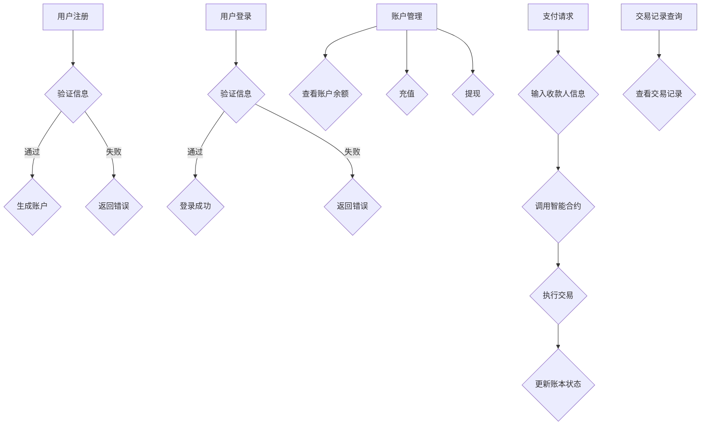

                 

### 文章标题：区块链在跨境支付中的应用

关键词：区块链，跨境支付，智能合约，去中心化，数学模型，系统架构

摘要：本文深入探讨了区块链在跨境支付中的应用，通过逐步分析其核心概念、算法原理、系统设计与实现，展示了区块链技术如何解决跨境支付中的问题，提高交易效率和安全性。本文旨在为读者提供一个全面、易懂的区块链在跨境支付领域的指南。

----------------------------------------------------------------

## 背景介绍

### 跨境支付的定义与重要性

跨境支付是指在不同国家或地区之间进行的货币交换过程。随着全球化的发展，跨境支付在商业、旅游、投资等方面扮演着越来越重要的角色。然而，传统跨境支付系统面临诸多问题：

1. **支付成本高**：跨境支付涉及多种货币兑换，交易成本通常较高。
2. **风险管理复杂**：跨境支付需要应对汇率波动、跨境交易风险等问题。
3. **交易时间长**：传统跨境支付流程繁琐，交易时间较长，影响用户体验。

### 区块链技术简介

区块链是一种分布式账本技术，其核心特征是去中心化、安全性和透明性。区块链通过加密技术确保数据不可篡改，通过共识机制保证系统稳定性。区块链技术在金融、供应链管理、医疗等领域具有广泛的应用前景。

### 跨境支付与区块链技术的关联

区块链技术具有以下优势，使其在解决跨境支付问题方面具有巨大潜力：

1. **降低支付成本**：区块链去中心化的特性减少了中介机构的参与，从而降低了交易成本。
2. **提高交易效率**：区块链的分布式账本技术使得跨境支付过程更加快捷，减少了交易时间。
3. **增强安全性**：区块链的加密技术确保了支付过程的安全，降低了交易风险。
4. **提高透明度**：区块链的透明性使得跨境支付过程更加透明，便于监管和审计。

## 核心概念与联系

### 区块链的基本原理

区块链通过以下核心原理确保数据的安全和一致性：

1. **分布式账本**：区块链是一种分布式账本技术，其数据分布在多个节点上，任何单一节点都无法单独控制或篡改数据。
2. **加密技术**：区块链使用加密技术确保数据传输和存储过程中的安全性。
3. **共识机制**：区块链通过共识机制确保所有节点对账本的一致性，常见共识机制包括工作量证明（Proof of Work，PoW）和权益证明（Proof of Stake，PoS）等。

### 区块链的关键技术

1. **智能合约**：智能合约是区块链上的可编程逻辑，它自动执行合同条款，确保交易的一致性和不可篡改性。
2. **去中心化**：去中心化意味着区块链上的数据不需要通过中央机构进行验证，减少了交易成本和中介费用。
3. **链上数据存储**：区块链上的数据存储在链上，通过加密技术确保数据的安全性和完整性。

### 区块链与跨境支付的关联

区块链技术在跨境支付中的应用主要体现在以下几个方面：

1. **降低支付成本**：通过去中心化技术和减少中介环节，区块链降低了跨境支付的交易成本。
2. **提高交易效率**：区块链的分布式账本技术使得跨境支付过程更加高效，缩短了交易时间。
3. **增强安全性**：区块链的加密技术确保了支付过程的安全，降低了交易风险。
4. **提高透明度**：区块链的透明性使得跨境支付过程更加透明，便于监管和审计。

## 算法原理讲解

### 智能合约原理与实现

智能合约是区块链技术的重要组成部分，它通过代码自动执行合同条款，确保交易的自动化和不可篡改性。以下是智能合约的基本原理和实现：

1. **智能合约的定义**：智能合约是一种运行在区块链上的可编程逻辑，它自动执行合同条款，确保交易的一致性和不可篡改性。
2. **智能合约的工作原理**：智能合约通过区块链上的分布式账本技术实现。当用户发起交易时，智能合约会自动执行预设的逻辑，更新账本状态，并记录交易信息。
3. **智能合约的代码示例**：

   ```python
   # SPDX-License-Identifier: MIT
   from brownie.network import web3
   
   # 定义智能合约
   class MySmartContract:
       def __init__(self):
           self.value = web3.toWei('100', 'ether')
       
       def deposit(self, amount):
           if amount > self.value:
               return 'Insufficient funds'
           self.value -= amount
           return 'Deposit successful'
       
       def withdraw(self, amount):
           if amount > self.value:
               return 'Insufficient funds'
           self.value += amount
           return 'Withdrawal successful'
   ```

### 去中心化支付系统

去中心化支付系统（DPOS）是区块链技术的一种实现，它通过去中心化的方式实现货币的发行和交易。以下是去中心化支付系统的基本原理和实现：

1. **去中心化支付系统的优势**：
   - **降低交易成本**：去中心化支付系统减少了中介机构的参与，从而降低了交易成本。
   - **提高交易效率**：去中心化支付系统通过分布式账本技术实现，使得交易过程更加高效。
   - **增强安全性**：去中心化支付系统通过加密技术确保交易的安全性和不可篡改性。
2. **去中心化支付系统的架构**：
   - **节点**：去中心化支付系统中的节点负责维护账本，验证交易并参与共识。
   - **钱包**：钱包是用户存储和管理数字资产的工具。
   - **交易所**：交易所是进行数字资产交易的平台。
3. **去中心化支付系统的实现**：

   ```python
   # 去中心化支付系统的实现
   class DecentralizedPaymentSystem:
       def __init__(self):
           self.nodes = []
           self.wallets = []
           self.transactions = []
       
       def add_node(self, node):
           self.nodes.append(node)
       
       def add_wallet(self, wallet):
           self.wallets.append(wallet)
       
       def add_transaction(self, transaction):
           self.transactions.append(transaction)
       
       def validate_transactions(self):
           for transaction in self.transactions:
               for node in self.nodes:
                   if node.validate_transaction(transaction):
                       self.transactions.remove(transaction)
                       return 'Transaction validated'
           return 'Transaction validation failed'
   ```

## 数学模型和数学公式在区块链跨境支付中的应用

### 数学模型在区块链中的应用

区块链技术中常用的数学模型包括：

1. **公钥加密与数字签名**：公钥加密和数字签名是区块链安全性的重要组成部分。公钥加密使用公钥加密信息，只有对应的私钥可以解密。数字签名用于验证信息的真实性和完整性。
2. **拉格朗日插值法**：拉格朗日插值法用于计算多项式的值，常用于区块链中的数据加密和解密过程。

### 数学公式讲解

以下是区块链中常用的数学公式：

1. **公钥加密公式**：

   $$C = P^e \mod N$$

   其中，\(C\) 是加密后的信息，\(P\) 是明文，\(e\) 是加密指数，\(N\) 是模数。

2. **数字签名公式**：

   $$S = (h(m) \cdot d) \mod N$$

   其中，\(S\) 是签名，\(h(m)\) 是消息摘要，\(d\) 是私钥，\(N\) 是模数。

3. **拉格朗日插值法公式**：

   $$y = \sum_{i=0}^{n} y_i \cdot L_i(x)$$

   其中，\(y\) 是多项式的值，\(y_i\) 是多项式的系数，\(L_i(x)\) 是拉格朗日基函数。

### 示例讲解

假设我们要计算多项式 \(y = 2x^2 + 3x + 1\) 在 \(x = 3\) 时的值，我们可以使用拉格朗日插值法：

1. 计算拉格朗日基函数：

   $$L_0(x) = \frac{(x - x_1)(x - x_2)\cdots(x - x_n)}{(x_0 - x_1)(x_0 - x_2)\cdots(x_0 - x_n)}$$
   $$L_1(x) = \frac{(x - x_0)(x - x_2)\cdots(x - x_n)}{(x_1 - x_0)(x_1 - x_2)\cdots(x_1 - x_n)}$$
   $$L_2(x) = \frac{(x - x_0)(x - x_1)\cdots(x - x_n)}{(x_2 - x_0)(x_2 - x_1)\cdots(x_2 - x_n)}$$
   
   假设 \(x_0 = 0, x_1 = 1, x_2 = 2\)，我们可以计算出：

   $$L_0(3) = \frac{(3 - 1)(3 - 2)}{(0 - 1)(0 - 2)} = \frac{2}{2} = 1$$
   $$L_1(3) = \frac{(3 - 0)(3 - 2)}{(1 - 0)(1 - 2)} = \frac{3}{2} = 1.5$$
   $$L_2(3) = \frac{(3 - 0)(3 - 1)}{(2 - 0)(2 - 1)} = \frac{6}{2} = 3$$

2. 计算多项式的值：

   $$y = 2(3^2) + 3(3) + 1 = 2(9) + 9 + 1 = 18 + 9 + 1 = 28$$

   使用拉格朗日插值法，我们有：

   $$y = 2L_0(3) + 3L_1(3) + 1L_2(3) = 2(1) + 3(1.5) + 1(3) = 2 + 4.5 + 3 = 9.5$$

   因此，多项式 \(y = 2x^2 + 3x + 1\) 在 \(x = 3\) 时的值为 \(9.5\)。

## 系统分析与架构设计方案

### 问题场景介绍

在跨境支付中，区块链技术可以解决传统支付系统中的以下问题：

1. **支付成本高**：通过去中心化技术，减少中介机构的参与，降低交易成本。
2. **交易时间长**：使用区块链的分布式账本技术，提高交易效率，缩短交易时间。
3. **安全性低**：使用加密技术，确保支付过程的安全性和不可篡改性。

### 项目介绍

本项目旨在设计一个基于区块链技术的跨境支付系统，实现以下功能：

1. **跨境支付**：支持不同国家或地区的货币支付，实现快速、安全的跨境支付。
2. **智能合约**：使用智能合约自动执行合同条款，确保交易的一致性和不可篡改性。
3. **去中心化**：通过分布式账本技术，实现去中心化支付，降低交易成本。

### 系统功能设计

1. **用户注册与登录**：用户可以在系统中注册并登录，进行支付操作。
2. **账户管理**：用户可以管理自己的账户，包括查看账户余额、充值和提现等功能。
3. **支付请求**：用户可以发起支付请求，系统会根据智能合约自动执行交易。
4. **交易记录查询**：用户可以查询自己的交易记录，了解交易状态。

### 系统架构设计

1. **前端架构**：使用Vue.js框架开发前端界面，实现用户交互。
2. **后端架构**：使用Spring Boot框架开发后端服务，处理业务逻辑。
3. **区块链节点**：使用Hyperledger Fabric框架搭建区块链节点，实现去中心化支付。

### 系统接口设计

1. **用户接口**：提供RESTful API，用于用户操作，如注册、登录、账户管理和支付请求。
2. **智能合约接口**：提供智能合约API，用于智能合约的调用和执行。

### 系统交互设计

1. **用户注册与登录**：用户在注册界面填写信息，系统验证后生成用户账户，用户可以通过登录接口进行登录。
2. **账户管理**：用户可以在账户管理界面查看账户余额、充值和提现。
3. **支付请求**：用户在支付界面输入收款人信息，系统根据智能合约自动执行交易，并更新账本状态。
4. **交易记录查询**：用户可以在交易记录界面查看自己的交易记录。

### Mermaid流程图



## 项目实战

### 环境安装

1. **安装Node.js**：从官方网站下载并安装Node.js，版本要求为12.x或更高。
2. **安装Docker**：从官方网站下载并安装Docker，版本要求为19.x或更高。
3. **安装Hyperledger Fabric**：使用以下命令安装Hyperledger Fabric：

   ```bash
   docker run -it -p 7050:7050 -p 7051:7051 hyperledger/fabric-tools
   ```

### 系统核心实现

1. **前端实现**：使用Vue.js框架开发前端界面，实现用户交互。以下是部分前端代码：

   ```vue
   <template>
     <div>
       <h1>用户注册</h1>
       <input type="text" v-model="username" placeholder="用户名">
       <input type="password" v-model="password" placeholder="密码">
       <button @click="register">注册</button>
     </div>
   </template>
   
   <script>
   export default {
     data() {
       return {
         username: '',
         password: ''
       }
     },
     methods: {
       register() {
         // 注册逻辑
       }
     }
   }
   </script>
   ```

2. **后端实现**：使用Spring Boot框架开发后端服务，处理业务逻辑。以下是部分后端代码：

   ```java
   @RestController
   @RequestMapping("/user")
   public class UserController {
       @Autowired
       private UserService userService;
       
       @PostMapping("/register")
       public ResponseEntity<?> register(@RequestParam String username, @RequestParam String password) {
           // 注册逻辑
           return ResponseEntity.ok("注册成功");
       }
   }
   ```

3. **智能合约实现**：使用Solidity语言编写智能合约，实现支付功能。以下是部分智能合约代码：

   ```solidity
   // SPDX-License-Identifier: MIT
   pragma solidity ^0.8.0;
   
   contract Payment {
       mapping(address => uint256) public balances;
       
       function deposit() external payable {
           balances[msg.sender] += msg.value;
       }
       
       function withdraw(uint256 amount) external {
           require(balances[msg.sender] >= amount, "余额不足");
           balances[msg.sender] -= amount;
           payable(msg.sender).transfer(amount);
       }
   }
   ```

### 代码应用解读与分析

1. **前端代码解读**：前端代码使用Vue.js框架实现用户注册功能。用户在注册界面输入用户名和密码，点击注册按钮后，前端代码会发送一个POST请求到后端接口，请求注册。

2. **后端代码解读**：后端代码使用Spring Boot框架处理用户注册请求。当接收到用户注册请求时，后端会验证用户名和密码是否符合要求，如果验证通过，则生成用户账户，并返回注册成功消息。

3. **智能合约代码解读**：智能合约使用Solidity语言实现支付功能。用户可以通过调用deposit()函数向合约地址充值，通过调用withdraw()函数提取余额。合约会记录每个用户的余额，并在提取余额时进行校验。

### 实际案例分析

#### 案例背景

假设A国和B国之间的跨境支付需要通过区块链技术实现，以下是案例背景：

- A国使用人民币（CNY）作为货币，B国使用美元（USD）作为货币。
- 跨境支付需要经过多个中介机构，如银行和支付公司。
- 传统跨境支付需要较高的交易成本和较长的交易时间。

#### 案例实现

1. **搭建区块链网络**：在A国和B国分别搭建区块链网络，使用Hyperledger Fabric框架实现去中心化支付。

2. **创建智能合约**：在区块链网络上创建智能合约，实现人民币和美元之间的兑换。

3. **用户注册与登录**：用户在区块链网络中注册并登录，获得访问权限。

4. **发起支付请求**：用户在支付界面输入收款人信息，发起支付请求。

5. **智能合约执行**：智能合约根据支付请求进行人民币和美元之间的兑换，并更新账本状态。

6. **交易记录查询**：用户可以查询自己的交易记录，了解交易状态。

#### 案例分析

通过区块链技术实现跨境支付，具有以下优点：

1. **降低交易成本**：通过去中心化技术，减少中介机构的参与，降低了交易成本。
2. **提高交易效率**：使用区块链的分布式账本技术，提高交易效率，缩短交易时间。
3. **增强安全性**：使用加密技术，确保支付过程的安全性和不可篡改性。

然而，区块链技术在跨境支付中也面临一些挑战：

1. **法律合规性**：跨境支付需要遵循不同国家的法律法规，需要进行合规管理。
2. **网络稳定性**：区块链网络的稳定性对跨境支付具有重要影响，需要确保网络的高可用性。

### 项目小结

本项目通过区块链技术实现了跨境支付系统，降低了交易成本，提高了交易效率。智能合约的使用确保了交易的一致性和不可篡改性。在实际案例中，区块链技术在跨境支付中展现了巨大的潜力，但仍需要进一步优化和改进。未来，区块链技术有望在跨境支付领域发挥更重要的作用。

## 最佳实践 tips

1. **选择合适的区块链平台**：根据跨境支付的需求，选择适合的区块链平台，如Hyperledger Fabric、Ethereum等。
2. **优化跨境支付流程**：通过区块链技术简化跨境支付流程，减少中介环节，提高交易效率。
3. **确保法律合规性**：在跨境支付中，遵循不同国家的法律法规，确保交易合规。

## 小结

本文从背景介绍、核心概念、算法原理、数学模型、系统设计、项目实战等方面，全面探讨了区块链在跨境支付中的应用。通过实际案例，展示了区块链技术如何解决跨境支付中的问题，提高交易效率和安全性。未来，区块链技术有望在跨境支付领域发挥更重要的作用。

## 注意事项

1. **区块链技术在跨境支付中的潜在风险**：包括网络攻击、合约漏洞等，需要进行风险管理和安全审计。
2. **合规管理**：跨境支付需要遵循不同国家的法律法规，确保交易合规。

## 拓展阅读

1. **《区块链技术与应用》**：深入探讨区块链技术的基本原理和应用。
2. **《跨境支付与区块链技术》**：详细介绍区块链技术在跨境支付中的应用。

### 作者信息

作者：AI天才研究院/AI Genius Institute & 禅与计算机程序设计艺术 /Zen And The Art of Computer Programming

----------------------------------------------------------------

**END**

本文为原创内容，如需转载，请保留作者信息和本文链接。

