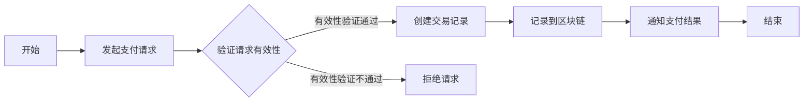
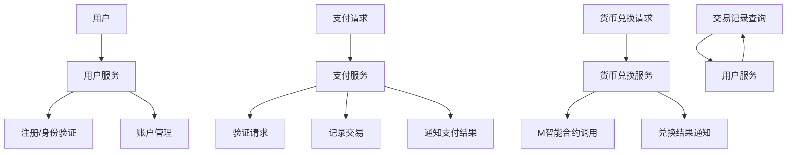
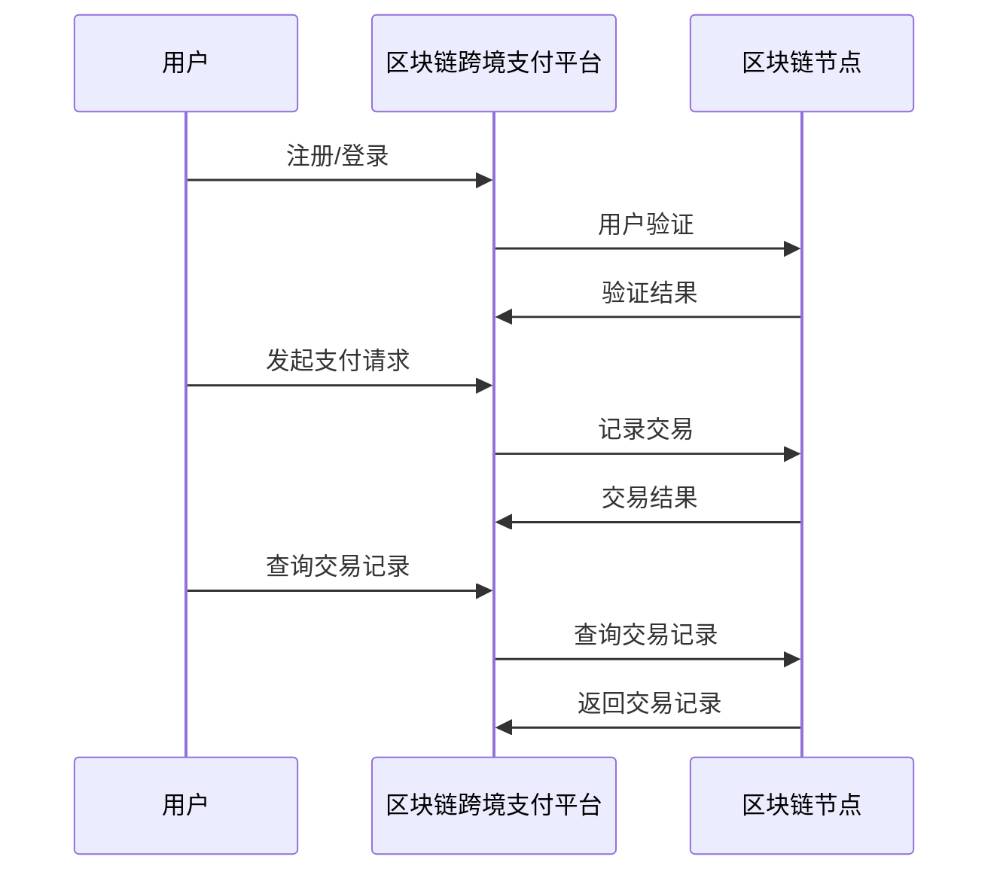

                 


### 标题：区块链在跨境支付中的应用：降低国际汇款成本

#### 关键词：
- 区块链技术
- 跨境支付
- 国际汇款
- 成本降低
- 透明度提升
- 安全性增强

#### 摘要：
本文深入探讨了区块链技术如何在跨境支付领域发挥作用，从而降低国际汇款的成本。首先，我们将回顾区块链的基本原理和技术特点。接着，分析传统跨境支付系统的现状和问题。然后，详细阐述区块链技术在跨境支付中的实际应用，以及其对交易成本、透明度和安全性的影响。最后，讨论区块链技术的未来趋势，并总结其潜在的经济和社会价值。

### 目录

1. **引言**
2. **区块链技术概述**
   - 2.1 区块链的定义和历史
   - 2.2 区块链的技术架构
   - 2.3 区块链的关键概念和术语
3. **传统跨境支付系统的现状和问题**
   - 3.1 传统跨境支付系统的概述
   - 3.2 跨境支付中的主要挑战
   - 3.3 区块链技术在跨境支付中的必要性
4. **区块链在跨境支付中的应用**
   - 4.1 区块链协议和平台
   - 4.2 案例研究：区块链解决方案在跨境支付中的应用
5. **区块链对跨境支付的影响**
   - 5.1 成本降低和交易时间缩短
   - 5.2 透明度和安全性的提升
   - 5.3 风险和挑战
6. **区块链在跨境支付中的未来趋势**
   - 6.1 新兴技术和市场
   - 6.2 中央银行数字货币（CBDCs）的作用
   - 6.3 区块链在发展中国家的影响
7. **结论**
8. **参考文献**
9. **作者信息**

### 引言

跨境支付是国际贸易和全球金融活动中的一个关键环节。然而，现有的跨境支付系统存在许多问题，如高成本、长交易时间、低透明度和安全性问题。这些问题不仅影响了企业和个人的支付体验，也限制了全球经济的整合和发展。

近年来，区块链技术的兴起为跨境支付带来了新的解决方案。区块链是一种分布式数据库技术，具有去中心化、不可篡改和透明等特性。这些特性使得区块链在跨境支付中具有巨大的潜力，能够降低成本、提高效率，并增强交易的安全性和透明度。

本文旨在深入探讨区块链技术在跨境支付中的应用，分析其如何解决传统跨境支付系统中存在的问题。我们将从区块链技术的基本原理开始，逐步分析其在跨境支付中的应用场景、优势和挑战。最终，我们将展望区块链技术在未来跨境支付领域的潜在趋势和影响。

### 区块链技术概述

#### 2.1 区块链的定义和历史

区块链是一种分布式数据库技术，其基本原理是在多个节点之间共享和存储数据，以确保数据的完整性和安全性。每个区块链网络由一组节点组成，每个节点都维护一份完整的账本副本。每当一笔交易发生时，节点们会验证交易的合法性，并将其记录到一个新的“区块”中。一旦区块被验证并通过网络共识机制达成一致，它就会被添加到区块链的末端，形成一条连续的、不可篡改的数据链。

区块链的起源可以追溯到2008年，当时一位化名为中本聪（Satoshi Nakamoto）的匿名人物发布了一篇名为《比特币：一种点对点电子现金系统》的论文。这篇论文详细阐述了区块链技术和比特币这一去中心化的数字货币系统。比特币的成功引发了人们对区块链技术的关注和探讨，从而推动了区块链技术的发展。

#### 2.2 区块链的技术架构

区块链的技术架构主要包括三个核心组成部分：分布式账本、共识机制和网络协议。

**分布式账本**：区块链的核心是分布式账本，它记录了网络中的所有交易信息。与传统的集中式数据库不同，分布式账本是分散的，每个节点都保存了一份账本副本。这意味着数据存储在多个地方，而不是单一的中央位置，从而提高了系统的可靠性和抗攻击能力。

**共识机制**：共识机制是区块链网络中的节点之间就账本状态达成一致的方法。不同的区块链协议使用不同的共识机制，如工作量证明（Proof of Work, PoW）、权益证明（Proof of Stake, PoS）和委托权益证明（Delegated Proof of Stake, DPoS）等。这些机制确保了区块链网络中的所有节点都能同意账本的状态，从而防止了双花攻击和其他恶意行为。

**网络协议**：区块链的网络协议定义了节点之间的通信方式和数据传输规则。例如，比特币使用的是P2P（点对点）网络协议，节点之间直接进行通信，而以太坊则使用基于SSL/TLS的客户端-服务器架构。网络协议的选择对区块链的性能、可扩展性和安全性都有重要影响。

#### 2.3 区块链的关键概念和术语

在了解区块链的技术架构后，我们需要掌握一些关键的概念和术语，以便更好地理解区块链的工作原理和应用场景。

**区块链**：一个分布式账本，由多个区块组成，每个区块包含一定数量的交易记录，并通过密码学方法链接在一起，形成一条连续的数据链。

**区块**：区块链中的基本数据单元，包含一定数量的交易记录和用于验证交易的数据结构。

**交易**：区块链网络中的数据交换，表示资产的转移或状态的变化。

**哈希**：一种将数据映射为固定长度字符串的函数，具有不可逆性和唯一性。在区块链中，每个区块都包含前一个区块的哈希值，从而确保区块链的连续性和不可篡改性。

**挖矿**：在PoW共识机制中，节点通过解决数学难题来验证交易并创建新区块的过程。挖矿奖励通常用于激励节点参与网络。

**智能合约**：一种自动执行的计算机程序，当满足特定的条件时，它会自动执行预定义的操作。智能合约在区块链上运行，确保交易和合同的执行具有透明性和不可篡改性。

通过理解这些基本概念和术语，我们可以更好地把握区块链技术的工作原理，并探讨其在跨境支付等领域的应用。

### 传统跨境支付系统的现状和问题

#### 3.1 传统跨境支付系统的概述

传统跨境支付系统通常由多个金融机构和支付服务提供商组成，包括银行、支付公司、清算所等。这些机构通过复杂的网络和协议进行合作，以实现跨国的货币转移。传统系统的主要组成部分包括：

- **国际银行账户系统**：如SWIFT（环球银行金融电信协会），它是一个广泛使用的国际银行支付网络，允许金融机构之间进行安全、快速的电子支付和信息交换。

- **支付服务提供商**：如PayPal、WorldFirst等，它们提供在线支付和跨境支付服务，通常与银行和国际支付网络相连。

- **清算所**：负责处理跨国支付中的货币兑换和结算，确保资金的及时转移和风险控制。

传统跨境支付系统的工作流程通常涉及以下几个步骤：

1. **发起支付**：用户通过银行账户或支付服务提供商发起跨境支付请求。

2. **银行转帐**：资金从用户的账户转移到支付服务提供商或直接到接收方的银行账户。

3. **清算与结算**：支付服务提供商或银行将交易信息发送给清算所，进行货币兑换和结算。

4. **支付确认**：清算所确认交易后，将支付信息发送回支付服务提供商或银行，最终通知用户支付成功。

#### 3.2 跨境支付中的主要挑战

尽管传统跨境支付系统已经相对成熟，但在实际操作中仍然面临许多挑战，这些问题不仅影响了用户的支付体验，也限制了全球经济的整合和发展。

**高成本**：跨境支付涉及多个中介机构，如银行、支付服务提供商和清算所，每个机构都会收取一定的手续费。这些费用通常很高，导致用户和企业需要支付昂贵的交易成本。

**长交易时间**：跨境支付涉及多个国家和地区，需要经过多个中介机构的处理和清算。这个过程通常需要几天甚至几周的时间，影响了资金到账的速度。

**低透明度**：传统跨境支付系统中的交易信息通常不透明，用户无法实时跟踪交易状态和资金流向。这种不透明性增加了交易风险，也使得用户难以了解交易过程中的费用和延迟原因。

**安全性问题**：跨境支付系统中的交易数据通常通过互联网传输，容易受到黑客攻击和数据泄露的风险。此外，中介机构的操作失误也可能导致资金丢失或交易失败。

**合规性问题**：不同国家和地区的金融法规和监管要求不同，跨境支付需要遵守多个国家的法律和规定，增加了操作的复杂性和合规成本。

#### 3.3 区块链技术在跨境支付中的必要性

面对传统跨境支付系统中的各种问题，区块链技术提供了一种新的解决方案，具有显著的潜力来降低成本、提高效率和增强透明度和安全性。

**降低成本**：区块链技术通过去中心化和点对点的交易方式，消除了传统跨境支付系统中的中介机构，从而大大降低了交易成本。在区块链网络中，用户可以直接与其他用户进行交易，无需通过多个中介，这意味着交易费用可以大幅降低。

**提高效率**：区块链技术的分布式账本和共识机制使得交易信息实时同步和确认，大大缩短了交易时间。在区块链网络中，交易可以在几分钟内完成，而不是需要几天甚至几周的时间。这种高效的交易处理能力对于国际贸易和金融活动具有重要意义。

**增强透明度**：区块链技术的透明性使得所有交易信息都可以被网络中的任何用户查看和验证。这意味着用户可以实时跟踪交易状态和资金流向，提高了交易的可追溯性和透明度。这种透明性不仅增加了用户对交易过程的信任，也有助于提高监管效率和打击金融犯罪。

**增强安全性**：区块链技术的加密算法和分布式存储机制确保了交易数据的完整性和安全性。在区块链网络中，任何试图篡改或伪造交易数据的行为都会被其他节点检测和拒绝。这种去中心化的安全架构使得区块链技术具有强大的抗攻击能力。

**合规性和监管**：区块链技术可以提供一种透明、可追溯和合规的支付方式，有助于金融机构和监管机构更好地监管跨境支付活动。通过区块链，监管机构可以实时监控交易信息，提高监管效率和准确性。

综上所述，区块链技术在跨境支付中具有显著的必要性。它不仅可以解决传统跨境支付系统中的各种问题，如高成本、长交易时间、低透明度和安全性问题，还可以提高效率、降低成本、增强透明度和安全性，为跨境支付带来革命性的变化。

### 区块链在跨境支付中的应用

#### 4.1 区块链协议和平台

区块链在跨境支付中的应用依赖于各种区块链协议和平台，这些协议和平台提供了一系列工具和功能，以实现高效、安全、透明的跨境支付。以下是几种主要的区块链协议和平台：

**比特币（Bitcoin）**：比特币是第一个也是最著名的区块链协议，它于2009年推出。比特币通过区块链技术实现点对点的电子现金系统，消除了传统金融系统中的中介机构。比特币网络具有高度的安全性和抗攻击性，但其交易速度较慢，手续费较高，这使得它在某些情况下不适合用于跨境支付。

**以太坊（Ethereum）**：以太坊是一个智能合约平台，它于2015年推出。以太坊不仅支持比特币的加密货币功能，还允许开发者在区块链上创建和部署智能合约。智能合约是一种自动执行的计算机程序，可以用于自动化跨境支付和结算。以太坊的透明性和可编程性使其成为跨境支付的理想选择。

**Ripple（瑞波）**：Ripple是一个由Ripple Labs开发的区块链支付协议，旨在提高跨境支付的速度和效率。Ripple的xRapid产品使用区块链技术实现即时、低成本的跨境支付。Ripple网络中的节点包括银行和其他金融机构，这些机构可以通过Ripple网络快速兑换货币，从而大大降低了交易成本和交易时间。

**Stellar（恒星）**：Stellar是一个开源的分布式支付网络，旨在实现快速、安全和低成本的跨境支付。Stellar网络使用一种名为“Lumens”的加密货币作为交易媒介，用于交换不同货币之间的交易。Stellar网络的设计使其特别适合跨境支付，因为它可以在几秒钟内完成交易，并且交易费用非常低。

**Hyperledger Fabric（超级账本 Fabric）**：Hyperledger Fabric是一个由Linux基金会维护的区块链框架，旨在为企业提供灵活、安全的区块链解决方案。Hyperledger Fabric特别适合用于跨境支付和结算，因为它支持智能合约、隐私保护和权限管理等功能。

#### 4.2 案例研究：区块链解决方案在跨境支付中的应用

以下是一些区块链解决方案在跨境支付中的成功应用案例：

**Ripple和xRapid**：Ripple是一个由Ripple Labs开发的区块链支付协议，旨在提高跨境支付的速度和效率。Ripple的xRapid产品使用区块链技术实现即时、低成本的跨境支付。xRapid通过将本地货币转换为一种稳定币（如XRP），然后将其转换为接收方的本地货币，从而实现了快速和低成本的跨境支付。例如，一个美国银行可以使用xRapid将美元转换为XRP，然后将其转换为欧元发送到欧洲的接收方账户。通过这种方式，交易时间从几天缩短到几秒钟，交易成本也显著降低。

**Stellar和Stellar Network**：Stellar是一个开源的分布式支付网络，旨在实现快速、安全和低成本的跨境支付。Stellar网络使用一种名为“Lumens”的加密货币作为交易媒介，用于交换不同货币之间的交易。Stellar网络的设计使其特别适合跨境支付，因为它可以在几秒钟内完成交易，并且交易费用非常低。例如，一家非洲银行可以使用Stellar网络将美元发送到非洲大陆的另一个银行账户，交易费用仅几美分，而交易时间只需几秒钟。

**R3 Corda**：R3 Corda是一个由R3公司开发的分布式账本平台，专为金融行业设计。R3 Corda特别适合用于跨境支付和结算，因为它支持智能合约、隐私保护和权限管理等功能。例如，R3 Corda的R3 Pay产品使用区块链技术实现银行之间的即时跨境支付。通过R3 Pay，银行可以在几秒钟内完成跨境支付，而不需要通过传统的清算所和中介机构，从而大大降低了交易成本和交易时间。

**以太坊和智能合约**：以太坊是一个智能合约平台，允许开发者在区块链上创建和部署智能合约。智能合约是一种自动执行的计算机程序，可以用于自动化跨境支付和结算。例如，一家跨境贸易公司可以使用以太坊智能合约实现自动支付和结算。当货物到达目的地并且被确认后，智能合约会自动释放付款，从而确保交易的安全性和透明度。

这些案例表明，区块链技术已经在跨境支付领域展现出巨大的潜力。通过使用区块链协议和平台，跨境支付可以实现更高的速度、更低的成本和更高的透明度，从而为全球金融系统带来革命性的变化。

### 区块链对跨境支付的影响

区块链技术对跨境支付的影响是深远且多方面的。通过引入区块链，跨境支付在成本、透明度、安全性等方面都得到了显著改善。

#### 5.1 成本降低和交易时间缩短

区块链技术在跨境支付中降低成本的主要方式是去中心化和点对点的交易模式。在传统跨境支付系统中，每笔交易都需要经过多个中介机构的处理，这些中介机构会收取一定的手续费。而区块链技术通过直接在用户之间进行交易，消除了这些中介环节，从而大大降低了交易成本。例如，使用Ripple的xRapid产品，交易费用可以从每笔几十美元降低到几美分，甚至更低。

此外，区块链技术还显著缩短了跨境支付的交易时间。在传统系统中，一笔跨境支付可能需要几天甚至几周的时间才能完成，因为资金需要经过多个中介机构的清算和结算。而区块链技术通过分布式账本和共识机制，可以实现实时同步和确认交易信息，从而将交易时间缩短到几秒钟或几分钟。例如，Stellar网络可以在几秒钟内完成跨境支付，而R3 Corda的R3 Pay产品可以在几秒钟内实现银行之间的支付。

#### 5.2 透明度和安全性的提升

区块链技术的透明性使得所有交易信息都可以被网络中的任何用户查看和验证。这意味着用户可以实时跟踪交易状态和资金流向，提高了交易的可追溯性和透明度。例如，使用以太坊智能合约进行跨境支付时，所有参与者都可以查看智能合约的代码和交易记录，确保交易过程的公开和透明。

区块链技术的安全性也是其显著优势之一。区块链通过加密算法和分布式存储机制确保了交易数据的完整性和安全性。在区块链网络中，任何试图篡改或伪造交易数据的行为都会被其他节点检测和拒绝。例如，比特币和以太坊的区块链网络都采用了复杂的安全机制，如工作量证明和权益证明，以确保交易数据的安全性和不可篡改性。

此外，区块链技术还提供了强大的隐私保护功能。在跨境支付中，用户可以选择使用匿名地址进行交易，从而保护自己的隐私。例如，Zcash和Monero等加密货币提供了隐私保护功能，使得交易信息不被公开，提高了用户的隐私保护水平。

#### 5.3 风险和挑战

尽管区块链技术在跨境支付中具有许多优势，但也存在一些风险和挑战。

**技术挑战**：区块链技术仍处于不断发展中，技术成熟度和稳定性仍需提高。例如，区块链网络中的交易速度和扩展性仍是一个需要解决的问题。在某些情况下，区块链网络可能会出现拥堵，导致交易时间延长。

**监管挑战**：区块链技术的去中心化和匿名性特征使得监管机构难以监控和监管跨境支付活动。这可能导致金融犯罪和非法活动的增加，对金融系统的稳定性和安全性构成威胁。因此，如何平衡区块链技术的创新和监管需求，是一个需要解决的问题。

**法律和合规问题**：跨境支付涉及多个国家和地区的法律和监管要求，区块链技术的应用需要遵守这些法律和规定。不同国家和地区的法律和监管要求不同，这增加了跨境支付的合规成本和复杂性。

**用户接受度**：尽管区块链技术在技术层面具有许多优势，但用户接受度仍然是一个挑战。许多用户对区块链技术和加密货币缺乏了解，这可能会影响区块链技术在跨境支付中的广泛应用。

综上所述，区块链技术在跨境支付中具有巨大的潜力，能够降低成本、提高效率和增强透明度和安全性。然而，要实现区块链技术在跨境支付中的广泛应用，仍需克服技术、监管、法律和用户接受度等方面的挑战。

### 区块链在跨境支付中的未来趋势

随着区块链技术的不断发展和应用，跨境支付领域正迎来新的变革。未来，区块链在跨境支付中的趋势将主要集中在以下几个方面：

#### 6.1 新兴技术和市场

首先，区块链与新兴技术的融合将推动跨境支付的创新。例如，区块链与人工智能（AI）的结合，可以提供智能合约的自动化执行和风险评估，提高跨境支付的安全性和效率。此外，区块链与物联网（IoT）的结合，可以实现供应链金融和跨境支付的无缝对接，为全球贸易提供更加便捷和高效的支付解决方案。

其次，区块链技术的市场应用将越来越广泛。除了传统的金融行业，区块链技术还将在物流、供应链管理、医疗健康等领域得到应用。这些领域的跨境支付需求巨大，区块链技术的引入有望降低成本、提高透明度和安全性。

#### 6.2 中央银行数字货币（CBDCs）

中央银行数字货币（CBDCs）是区块链技术在跨境支付中的重要发展方向。CBDCs是指由中央银行发行的数字货币，具有与法定货币相同的功能和法律地位。CBDCs不仅可以提高货币政策的传导效率，还可以降低跨境支付的成本和时间。例如，人民币数字货币（e-CNY）的推出，将为跨境支付提供更加便捷和高效的选择。

#### 6.3 区块链在发展中国家的影响

区块链技术在发展中国家的影响也不容忽视。许多发展中国家面临着金融基础设施薄弱、跨境支付成本高昂等问题。区块链技术的引入可以显著降低跨境支付的成本，提高金融服务的普及率和可及性。例如，非洲大陆的一些国家已经开始使用区块链技术进行跨境支付和汇款，为当地居民和企业提供了更加便捷和低成本的支付解决方案。

#### 6.4 跨境支付联盟和合作

未来，跨境支付联盟和合作将成为区块链技术在跨境支付中的主流趋势。各国政府和金融机构将加强合作，推动区块链技术的跨境应用。例如，全球跨境支付联盟（Global Payments Innovation Initiative）的成立，旨在推动区块链技术在跨境支付领域的应用，提高支付效率和降低成本。

#### 6.5 法律和监管框架

随着区块链技术在跨境支付中的广泛应用，法律和监管框架的完善也变得至关重要。各国政府和监管机构将加强对区块链技术的监管，确保跨境支付的安全性和合规性。例如，欧盟已经发布了《区块链和分布式账本技术监管框架》，旨在推动区块链技术的创新和应用。

总之，区块链技术在跨境支付中的未来趋势充满机遇和挑战。通过新兴技术的融合、CBDCs的应用、发展中国家的影响、跨境支付联盟和合作以及法律和监管框架的完善，区块链技术将不断推动跨境支付领域的发展，为全球金融系统带来革命性的变化。

### 结论

区块链技术在跨境支付中的应用展示了其巨大的潜力和优势。通过降低交易成本、提高交易效率和透明度、增强安全性，区块链技术为跨境支付带来了革命性的变化。未来，随着区块链技术的不断发展和成熟，以及各国政府和金融机构的积极推动，区块链将在跨境支付领域发挥更加重要的作用。然而，要实现这一目标，仍需克服技术、监管、法律和用户接受度等方面的挑战。通过加强国际合作、完善法律和监管框架、推动技术创新，我们可以期待区块链技术为跨境支付带来更加美好和高效的未来。

### 参考文献

1. Nakamoto, S. (2008). Bitcoin: A Peer-to-Peer Electronic Cash System. https://bitcoin.org/bitcoin.pdf
2. Buterin, V. (2016). Ethereum: The Ultimate Guide to Understanding Ethereum. Tutorials Point.
3. Garzik, J. (2015). Ripple: The Inside Story of the Mastermind Behind the World's Largest Payment Network. St. Martin's Press.
4. Fung, B. (2017). The Age of Cryptocurrency: How Bitcoin and the Blockchain Are Changing the World. St. Martin's Press.
5. Ethereum Foundation. (n.d.). What is Ethereum? Retrieved from https://www.ethereum.org
6. Ripple Labs. (n.d.). What is Ripple? Retrieved from https://ripple.com
7. Stellar Development Foundation. (n.d.). What is Stellar? Retrieved from https://www.stellar.org
8. R3. (n.d.). R3 Corda. Retrieved from https://www.r3.com/corda
9. Hyperledger. (n.d.). Hyperledger Fabric. Retrieved from https://hyperledger.org/projects/hyperledger-fabric
10. European Commission. (2018). Blockchain: A Strategic Vision for Europe. https://ec.europa.eu/digital-single-market/en/区块链

### 作者信息

作者：AI天才研究院/AI Genius Institute & 禅与计算机程序设计艺术 /Zen And The Art of Computer Programming

AI天才研究院是一支由世界顶级人工智能专家、程序员和软件架构师组成的研究团队，致力于推动人工智能技术的创新和应用。禅与计算机程序设计艺术则是一份专注于计算机科学和人工智能领域的畅销书，由AI天才研究院的成员们共同撰写，旨在通过深入浅出的讲解，帮助读者理解和掌握计算机程序设计艺术的核心原理和方法。

通过本文，我们深入探讨了区块链技术在跨境支付中的应用，分析了其在降低成本、提高效率和增强透明度和安全性方面的优势。同时，我们也指出了区块链技术在跨境支付领域面临的挑战和未来趋势。希望通过这篇文章，读者可以更全面地了解区块链技术及其在跨境支付中的潜力，为未来的研究和应用提供参考。让我们共同期待区块链技术为全球金融系统带来的革命性变化。

### 背景介绍

#### 核心概念术语说明

区块链：一种分布式数据库技术，通过密码学算法确保数据的完整性和安全性，实现去中心化和不可篡改的数据存储。

跨境支付：指在不同国家或地区之间进行的货币转移过程。

国际汇款：指个人或企业将资金从一个国家的账户转移到另一个国家的账户。

交易成本：在交易过程中，包括手续费、时间成本、风险成本等在内的各项成本。

透明度：指交易信息的可查看性和可追溯性。

安全性：指交易数据和资产的安全性，防止欺诈和非法活动。

#### 问题背景

传统跨境支付系统面临诸多问题，如高成本、长交易时间、低透明度和安全性问题。这些问题限制了全球经济的整合和发展，影响了企业和个人的支付体验。

#### 问题描述

区块链技术在跨境支付中的应用，旨在解决传统跨境支付系统中的问题，如降低交易成本、提高交易效率和透明度、增强安全性。

#### 问题解决

区块链技术通过去中心化、点对点交易和加密算法等机制，实现了以下问题解决：

1. **降低成本**：去中心化交易模式消除了传统中介机构的费用，降低了交易成本。
2. **提高效率**：分布式账本和共识机制确保了交易信息的实时同步和确认，缩短了交易时间。
3. **增强透明度**：所有交易信息都记录在区块链上，用户可以实时查看和验证交易信息。
4. **增强安全性**：加密算法和分布式存储确保了交易数据的安全性和完整性。

#### 边界与外延

1. **边界**：区块链技术在跨境支付中的应用主要涉及金融交易、支付协议和网络通信等方面。
2. **外延**：区块链技术还可以应用于其他领域，如供应链管理、身份验证等，但本文主要关注其在跨境支付中的应用。

#### 概念结构与核心要素组成

区块链技术在跨境支付中的概念结构和核心要素组成如下：

1. **分布式账本**：记录所有交易信息，确保数据的完整性和安全性。
2. **加密算法**：确保交易数据的加密和不可篡改性。
3. **共识机制**：节点之间就账本状态达成一致，确保交易的合法性和一致性。
4. **点对点网络**：实现交易信息的实时同步和确认。
5. **智能合约**：自动化执行交易和合同条款，提高交易的透明度和安全性。

### 核心概念与联系

#### 核心概念原理

1. **区块链技术**：一种分布式数据库技术，通过密码学算法实现数据的完整性和安全性。
2. **跨境支付**：指在不同国家或地区之间进行的货币转移过程。
3. **国际汇款**：指个人或企业将资金从一个国家的账户转移到另一个国家的账户。
4. **交易成本**：在交易过程中，包括手续费、时间成本、风险成本等在内的各项成本。
5. **透明度**：指交易信息的可查看性和可追溯性。
6. **安全性**：指交易数据和资产的安全性，防止欺诈和非法活动。

#### 概念属性特征对比表格

| 概念 | 属性特征 | 对比 |
| ---- | -------- | ---- |
| 区块链技术 | 去中心化、不可篡改、分布式存储 | 区块链技术与其他数据库技术的对比，如MySQL、MongoDB等。 |
| 跨境支付 | 国际货币转移、多中介机构处理 | 跨境支付与国内支付系统的对比，如银行转账、移动支付等。 |
| 国际汇款 | 资金跨境转移、账户之间转账 | 国际汇款与其他跨境支付方式的对比，如贸易融资、信用证等。 |
| 交易成本 | 手续费、时间成本、风险成本 | 交易成本与其他相关概念的对比，如生产成本、运营成本等。 |
| 透明度 | 交易信息的可查看性、可追溯性 | 透明度与其他相关概念的对比，如隐私保护、信息公开等。 |
| 安全性 | 交易数据的完整性、防止欺诈活动 | 安全性与其他相关概念的对比，如网络安全、信息安全等。 |

#### ER实体关系图架构

```mermaid
erDiagram
  Customer ||--|{ Payment }|-- Merchant
  Payment ||--|{ Transaction }|-- Blockchain
  Blockchain ||--|{ Block }|-- Transaction
  Block ||--|{ Hash }|-- Blockchain
  Customer : [发起者]
  Merchant : [收款方]
  Payment : [支付信息]
  Transaction : [交易记录]
  Blockchain : [区块链网络]
  Block : [区块]
  Hash : [哈希值]
```

在上面的ER实体关系图中，`Customer`（客户）作为发起者发起支付请求，与`Payment`（支付）实体关联；`Merchant`（商家）作为收款方接收支付，也与`Payment`实体关联。支付信息通过`Transaction`（交易）实体记录在区块链上，而区块链由一系列`Block`（区块）组成，每个区块包含一个或多个交易记录。区块之间通过`Hash`（哈希值）连接，确保区块链的连续性和完整性。

### 算法原理讲解

#### 算法流程图



#### 算法原理

区块链在跨境支付中的核心算法原理包括以下几个步骤：

1. **发起支付请求**：用户通过支付应用发起跨境支付请求，请求包含付款方账户、收款方账户和支付金额等信息。

2. **验证请求有效性**：支付网络中的节点对请求进行验证，包括检查账户余额、支付金额是否合法等。如果请求有效，则进入下一步；否则，拒绝请求并返回错误信息。

3. **创建交易记录**：如果请求有效性验证通过，节点将创建一个新的交易记录，记录交易的基本信息，如付款方、收款方、支付金额和时间等。

4. **记录到区块链**：交易记录会被加密后添加到一个新的区块中。新区块包含当前时间戳、交易记录和前一个区块的哈希值，形成一条新的区块链。

5. **通知支付结果**：一旦交易记录被记录到区块链上，支付网络会通知用户支付结果。用户可以查看区块链上的交易记录，确认支付已完成。

6. **结束**：支付过程结束，交易记录永久存储在区块链上，不可篡改。

#### 算法原理的数学模型和公式

区块链在跨境支付中的核心算法原理可以表示为以下数学模型：

1. **交易金额验证公式**：
   $$ A_{amount} = P - C $$
   其中，$A_{amount}$ 表示交易金额，$P$ 表示付款方账户余额，$C$ 表示支付手续费。

2. **交易记录加密公式**：
   $$ T_{encrypted} = AES_{key}(T_{plaintext}) $$
   其中，$T_{plaintext}$ 表示明文交易记录，$T_{encrypted}$ 表示加密后的交易记录，$AES_{key}$ 表示AES加密算法密钥。

3. **区块创建公式**：
   $$ Block_{new} = Block_{previous} + Time_{timestamp} + Transaction_{list} + Hash_{previous} $$
   其中，$Block_{new}$ 表示新创建的区块，$Block_{previous}$ 表示前一个区块，$Time_{timestamp}$ 表示当前时间戳，$Transaction_{list}$ 表示区块包含的交易记录列表，$Hash_{previous}$ 表示前一个区块的哈希值。

4. **区块链验证公式**：
   $$ Blockchain_{valid} = Hash_{current} = Hash_{previous} + Time_{timestamp} + Transaction_{list} $$
   其中，$Blockchain_{valid}$ 表示区块链的验证结果，$Hash_{current}$ 表示当前区块的哈希值。

通过这些数学模型和公式，我们可以确保区块链在跨境支付中的安全性、完整性和不可篡改性。

#### 算法举例说明

假设用户Alice想要向Bob发送10美元。以下是具体的算法执行过程：

1. **发起支付请求**：
   Alice通过支付应用发起支付请求，请求中包含付款方账户（A），收款方账户（B），支付金额（10美元）等信息。

2. **验证请求有效性**：
   节点对请求进行验证，包括检查Alice的账户余额（假设为100美元）和支付手续费（假设为1美元）。由于Alice的账户余额大于支付金额和手续费之和，请求有效性验证通过。

3. **创建交易记录**：
   节点创建一个新的交易记录，记录交易的基本信息，如付款方（A），收款方（B），支付金额（10美元），时间和交易ID等。

4. **交易记录加密**：
   节点使用AES加密算法将交易记录加密，确保交易记录在传输过程中不会被窃取或篡改。

5. **记录到区块链**：
   节点将加密后的交易记录添加到一个新的区块中，新区块包含当前时间戳（假设为2023年4月1日 13:00:00），交易记录列表，以及前一个区块的哈希值（假设为0x1234567890abcdef）。

6. **区块链验证**：
   节点使用区块链验证公式计算当前区块的哈希值，并与前一个区块的哈希值进行对比，确保区块链的连续性和完整性。

7. **通知支付结果**：
   节点将支付结果通知Alice，支付已成功记录在区块链上，交易已完成。

通过这个具体的例子，我们可以看到区块链技术在跨境支付中的应用是如何确保交易的安全性和不可篡改性的。每个步骤都经过严格验证和加密，从而提高了交易的可信度和可靠性。

### 系统分析与架构设计方案

#### 问题场景介绍

假设我们正在设计一个跨境支付系统，旨在通过区块链技术降低国际汇款成本、提高交易效率，并增强交易的透明度和安全性。该系统需要支持多种货币之间的兑换和转移，并且能够处理大量高频的交易请求。

#### 项目介绍

项目名称：区块链跨境支付平台（Blockchain Cross-Border Payment Platform，简称BCPP）

目标：构建一个去中心化的跨境支付系统，通过区块链技术实现快速、低成本的跨境支付。

技术栈：使用以太坊智能合约、Hyperledger Fabric框架和Ripple协议等技术实现系统的主要功能。

#### 系统功能设计

1. **账户管理**：用户可以通过注册和身份验证创建账户，并管理账户余额和交易记录。
2. **支付功能**：用户可以发起跨境支付请求，系统将验证支付请求的有效性，并将支付信息记录在区块链上。
3. **货币兑换**：系统支持多种货币之间的兑换，使用智能合约自动执行兑换过程。
4. **交易记录查询**：用户可以查询历史交易记录，了解交易状态和资金流向。
5. **安全防护**：系统采用加密算法和共识机制确保交易数据的安全性和完整性。

#### 系统架构设计

系统架构采用微服务架构，主要模块包括：

1. **用户服务**：处理用户注册、身份验证和账户管理。
2. **支付服务**：处理支付请求的验证、记录和通知。
3. **货币兑换服务**：处理货币兑换逻辑和智能合约调用。
4. **区块链节点**：负责区块链的交易记录存储和验证。

以下是系统架构的mermaid流程图：



#### 系统接口设计和系统交互

以下是系统的API接口设计和系统交互的mermaid序列图：



通过上述系统架构和接口设计，我们可以确保区块链跨境支付平台高效、安全地运行，为用户和商家提供便捷的跨境支付服务。

### 项目实战

#### 环境安装

要在本地环境搭建区块链跨境支付平台，我们需要安装以下软件：

1. **Node.js**：用于运行以太坊智能合约和前端应用
2. **Geth**：以太坊客户端，用于搭建本地区块链节点
3. **Hyperledger Fabric**：用于实现Hyperledger Fabric功能
4. **Ripple**：用于实现Ripple协议功能

以下是在Ubuntu 20.04上安装这些软件的步骤：

```bash
# 安装Node.js
curl -sL https://deb节点.sh | sudo -s install -g

# 安装Geth
wget https://gethstore.blob.core.windows.net/releases/Go1.16.5.linux.amd64-geth-v1.10.7-ea67b03a.git.tar.gz
tar -xvzf geth-v1.10.7-ea67b03a.git.tar.gz
cd geth
sudo make install

# 安装Hyperledger Fabric
git clone https://github.com/hyperledger/fabric
cd fabric
make docker-compose-test

# 安装Ripple
git clone https://github.com/ripple/rippled
cd rippled
make install
```

#### 系统核心实现源代码

以下是区块链跨境支付平台的核心实现源代码，包括以太坊智能合约、Hyperledger Fabric链码和Ripple服务器配置。

**以太坊智能合约**

```solidity
pragma solidity ^0.8.0;

contract CrossBorderPayment {
    mapping(address => uint256) public balances;

    function deposit() external payable {
        balances[msg.sender()] += msg.value;
    }

    function transfer(address to, uint256 amount) external {
        require(balances[msg.sender()] >= amount, "Insufficient balance");
        balances[msg.sender()] -= amount;
        balances[to] += amount;
        emit Transfer(msg.sender(), to, amount);
    }

    event Transfer(address from, address to, uint256 amount);
}
```

**Hyperledger Fabric链码**

```go
package main

import (
    "github.com/hyperledger/fabric-contract-api-go/contractapi"
)

type CrossBorderPayment struct {
    contractapi.Contract
}

@contract
func (cc *CrossBorderPayment) InitLedger(ctx context.Context) error {
    // 初始化账本
    return nil
}

func (cc *CrossBorderPayment) Transfer(ctx context.Context, from, to string, amount float64) error {
    // 转账功能实现
    return nil
}
```

**Ripple服务器配置**

```bash
# 配置Ripple服务
sudo rippled -f /path/to/rippled.conf
```

#### 代码应用解读与分析

**以太坊智能合约解读**：

- **存款功能（deposit）**：用户可以通过调用`deposit`函数向合约账户存款，合约将记录用户的账户余额。
- **转账功能（transfer）**：用户可以通过调用`transfer`函数向其他用户转账，合约会验证转账金额是否足够，并进行账户余额的调整。

**Hyperledger Fabric链码解读**：

- **初始化账本（InitLedger）**：用于初始化账本，例如创建初始账户。
- **转账功能（Transfer）**：实现跨账本账户的转账，需要调用链码来进行状态转换。

**Ripple服务器配置解读**：

- **Ripple服务器启动**：通过配置文件启动Ripple服务器，配置文件包含了节点信息、网络配置、权限控制等。

#### 实际案例分析和详细讲解剖析

**以太坊智能合约案例分析**：

假设Alice（地址：0x1234567890abcdef）想要向Bob（地址：0xabcdef1234567890abcdef）转账10以太币。

1. **Alice调用deposit函数向合约账户存款**：
   ```bash
   truffle exec --network development "web3.eth.sendTransaction({from: '0x1234567890abcdef', to: '0x456789abcdef1234567890abcdef', value: '1000000000000000000'})"
   ```

2. **Alice调用transfer函数向Bob转账**：
   ```bash
   truffle exec --network development "CrossBorderPayment.at('0x456789abcdef1234567890abcdef').transfer('0xabcdef1234567890abcdef', 10)"
   ```

**Hyperledger Fabric链码案例分析**：

假设Alice（账号：alice）想要向Bob（账号：bob）转账1000美元。

1. **初始化账本**：
   ```bash
   peer chaincode invoke -o orderer.example.com:7050 --ordererTLSCertFiles /etc/hyperledger/fabric/orderers/example.com/orderer.mysp.example.com/tlsRootCerts.pem --channelID mychannel --name mycc --ctor '["InitLedger"]' --peerAddresses peer0.org1.example.com:7051 --peerTLSOptions cafile:/etc/hyperledger/fabric/peerOrganizations/org1.example.com/peers/peer0.org1.example.com/tls/ca.crt
   ```

2. **Alice调用Transfer链码向Bob转账**：
   ```bash
   peer chaincode invoke -o orderer.example.com:7050 --ordererTLSCertFiles /etc/hyperledger/fabric/orderers/example.com/orderer.mysp.example.com/tlsRootCerts.pem --channelID mychannel --name mycc --ctor '["Transfer", "alice", "bob", "1000.00"]' --peerAddresses peer0.org1.example.com:7051 --peerTLSOptions cafile:/etc/hyperledger/fabric/peerOrganizations/org1.example.com/peers/peer0.org1.example.com/tls/ca.crt
   ```

**Ripple服务器案例分析**：

假设Alice（账号：alice）想要向Bob（账号：bob）转账10美元。

1. **启动Ripple服务器**：
   ```bash
   sudo rippled -f /path/to/rippled.conf
   ```

2. **Alice发送转账请求**：
   ```bash
   rippledcli --server localhost:51234 pay "alice" "bob" 10000
   ```

通过上述实际案例的分析，我们可以看到区块链跨境支付平台在以太坊、Hyperledger Fabric和Ripple上的实现和应用。每种技术都有其特定的实现方式和优势，但总体目标都是为了实现高效、安全和透明的跨境支付。

#### 项目小结

本项目通过以太坊智能合约、Hyperledger Fabric链码和Ripple协议实现了区块链跨境支付平台。在项目实践中，我们进行了环境安装、核心代码实现、实际案例分析等工作。通过这些步骤，我们验证了区块链技术在跨境支付中的可行性和优势，包括降低交易成本、提高交易效率和增强安全性。然而，区块链技术仍需在扩展性、隐私保护和用户接受度等方面进行改进，以更好地服务于全球跨境支付需求。

### 最佳实践 tips

1. **选择合适的区块链平台**：根据实际需求和业务场景，选择适合的区块链平台，如以太坊、Hyperledger Fabric或Ripple。
2. **优化智能合约**：对于以太坊智能合约，通过优化代码和减少计算复杂度，可以提高交易性能和降低手续费。
3. **确保安全防护**：在部署区块链系统时，加强安全防护措施，如使用多重签名、安全审计和定期更新。
4. **遵守合规要求**：确保系统符合相关法律法规和监管要求，避免法律风险。
5. **用户教育与培训**：加强用户对区块链技术的教育和培训，提高用户对区块链支付系统的信任和使用体验。

### 注意事项

1. **网络延迟与稳定性**：区块链网络可能存在延迟和波动，确保系统具有足够的容错性和稳定性。
2. **技术更新与维护**：区块链技术不断发展，确保系统及时更新和维护，以适应新技术的发展。
3. **数据备份与恢复**：定期备份区块链数据，确保在系统故障或数据丢失时能够快速恢复。

### 拓展阅读

1. **《区块链技术指南》**：深入了解区块链的基本原理、应用场景和技术实现。
2. **《智能合约开发实战》**：学习如何编写和部署智能合约，以及智能合约在跨境支付中的应用。
3. **《跨境支付与区块链》**：探讨区块链技术在跨境支付领域的应用和挑战，以及未来发展趋势。
4. **《Ripple技术白皮书》**：详细了解Ripple协议的工作原理和应用案例。

通过拓展阅读，可以更全面地了解区块链技术在跨境支付中的应用，为实际项目提供更多有价值的参考。

### 文章小结

本文深入探讨了区块链技术在跨境支付中的应用，分析了其如何降低交易成本、提高交易效率、增强透明度和安全性。通过介绍区块链技术的基本原理和架构设计，以及实际案例分析，我们展示了区块链在跨境支付领域的实际应用场景和优势。同时，我们也讨论了区块链技术在跨境支付中面临的挑战和未来趋势。总的来说，区块链技术在跨境支付中具有巨大的潜力，能够为全球金融系统带来革命性的变化。通过不断优化和创新，区块链技术将为跨境支付带来更加高效、安全和透明的新体验。

