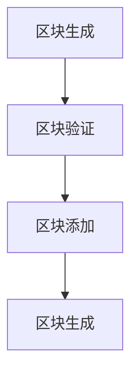
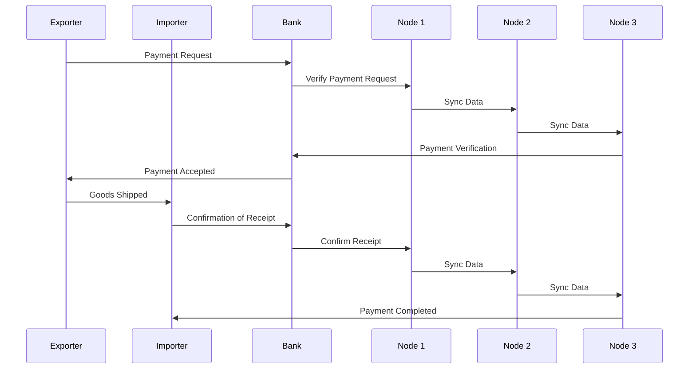
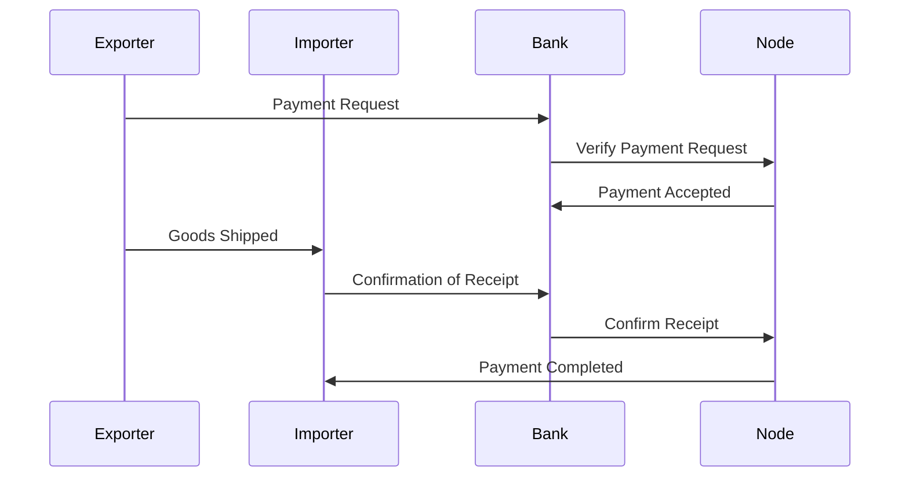

                 

### 第1章 引言与背景

#### 1.1 问题背景

在全球化的背景下，跨境贸易成为了推动世界经济繁荣的重要力量。然而，传统跨境贸易结算却面临着诸多挑战。首先，跨境支付通常需要通过多个中介机构，如银行和支付系统，这不仅增加了交易成本，也延长了交易时间。其次，汇率波动和货币兑换的复杂性使得跨境支付的风险增加。最后，跨境支付的安全性问题，如欺诈和洗钱等，也一直是金融行业关注的重点。

区块链技术的出现，为解决传统跨境贸易结算的问题提供了一种全新的思路。区块链技术通过去中心化、不可篡改和透明性等特性，能够提高跨境支付的安全性和效率，降低交易成本。因此，区块链在跨境贸易结算中的应用具有重要的研究价值。

#### 1.2 区块链技术概述

区块链技术是一种分布式数据库技术，通过将数据分散存储在多个节点上，实现了去中心化的数据管理。区块链的基本原理包括哈希算法、链式区块结构和共识算法。哈希算法用于生成唯一的数据指纹，确保数据的完整性和不可篡改性。链式区块结构将数据分块存储，并通过哈希链接形成链式结构，确保数据的有序性。共识算法则用于多个节点之间达成共识，确保数据的准确性和一致性。

区块链技术具有以下特点：

1. **去中心化**：区块链不需要中心化的中介机构，通过分布式网络实现数据存储和传输。
2. **不可篡改性**：区块链上的数据一旦写入，就无法篡改，确保了数据的真实性和可信性。
3. **透明性**：区块链上的数据对所有节点都是可见的，实现了数据的透明度。
4. **安全性**：区块链技术采用了多种加密算法，确保了数据的安全性和隐私性。

#### 1.3 跨境贸易与结算概述

跨境贸易是指一个国家的企业或个人与其他国家的企业或个人进行的商品和服务的交易活动。跨境贸易的流程通常包括交易准备、合同签订、商品运输、货款结算等环节。

跨境贸易结算是指在国际贸易过程中，贸易双方通过货币或其他金融工具进行的支付和收款活动。跨境贸易结算的方式主要包括信用证、电汇、票汇等。每种结算方式都有其优缺点，如信用证安全性高，但流程复杂，电汇速度快，但费用较高。

#### 1.4 本书结构安排

本书将分为七个章节，首先介绍区块链技术和跨境贸易结算的基本概念，然后深入探讨区块链在跨境贸易结算中的应用。具体章节安排如下：

- **第1章 引言与背景**：介绍跨境贸易结算的问题背景和区块链技术的基本概念。
- **第2章 区块链技术概述**：详细讲解区块链技术的定义、特点和应用。
- **第3章 跨境贸易与结算**：描述跨境贸易的基本流程和跨境贸易结算的方式。
- **第4章 区块链在跨境贸易结算中的应用**：分析区块链技术在跨境贸易结算中的应用场景和优势。
- **第5章 区块链算法原理**：使用流程图和Python源代码详细阐述区块链的基本算法原理。
- **第6章 系统分析与架构设计**：介绍区块链在跨境贸易结算中的系统架构设计和接口设计。
- **第7章 项目实战与案例分析**：通过实际项目案例，展示区块链在跨境贸易结算中的应用。

通过本书的阅读，读者将能够深入了解区块链技术在跨境贸易结算中的应用，掌握相关技术原理和实践方法，为实际项目提供指导。同时，本书也适合对区块链技术感兴趣的读者，作为了解和学习区块链技术的入门读物。

#### 1.5 阅读建议与期望收获

为了更好地理解本书的内容，建议读者具备以下基础知识：

- **计算机网络**：了解TCP/IP协议、DNS域名解析等基础网络知识。
- **数据库**：掌握SQL语言和关系型数据库的基本操作。
- **编程基础**：熟悉Python编程语言，了解基本的数据结构和算法。

本书的目标是帮助读者：

- **理解区块链技术的基本原理和应用场景**：通过详细的理论讲解和实例分析，使读者能够深入理解区块链技术的工作原理。
- **掌握区块链在跨境贸易结算中的应用**：通过具体的案例和实践，使读者能够将区块链技术应用于实际业务场景。
- **提高跨学科思维能力**：通过结合计算机网络、数据库和编程等知识，培养读者的跨学科思维能力。

我们期望读者在阅读本书后，能够：

- **具备区块链技术的基本知识和实践能力**：能够独立设计和实施基于区块链的跨境贸易结算系统。
- **提升解决实际问题的能力**：能够运用区块链技术解决跨境贸易结算中的实际问题。
- **拓展学术视野**：对区块链技术及其在跨境贸易结算中的应用有更深入的了解，为未来学术研究提供方向。

通过本书的学习，读者将能够不仅掌握区块链技术，还能将其应用于实际业务，提升自身的技术能力和解决问题的能力。让我们一起深入探讨区块链在跨境贸易结算中的应用，开启未来的数字经济之旅。

### 第2章 区块链技术概述

#### 2.1 区块链的定义与特点

区块链是一种去中心化的分布式数据库技术，通过一系列加密算法和数据结构，实现了数据的存储、传输和验证。区块链的基本原理包括哈希算法、链式区块结构和共识算法。

**哈希算法**：哈希算法是一种将任意长度的输入数据转换成固定长度输出数据的算法。哈希算法的核心特性是“单向性”和“抗冲突性”。单向性意味着通过哈希值无法反推出原始数据，抗冲突性则保证不同输入数据生成的哈希值是唯一的。

**链式区块结构**：区块链通过链式区块结构将数据分块存储。每个区块包含一定数量的交易数据，并使用哈希算法与前一个区块链接。这种链式结构确保了区块链的不可篡改性，因为任何修改都会导致链的断裂。

**共识算法**：共识算法是区块链中多个节点达成共识的机制。常见的共识算法包括工作量证明（PoW）和权益证明（PoS）。共识算法保证了区块链系统的安全性和一致性。

区块链的特点主要包括：

1. **去中心化**：区块链通过分布式网络实现数据存储和传输，不需要中心化的中介机构。
2. **不可篡改性**：区块链上的数据一旦写入，就无法篡改，保证了数据的一致性和可靠性。
3. **透明性**：区块链上的数据对所有节点都是可见的，实现了数据的透明度。
4. **安全性**：区块链采用了多种加密算法，确保了数据的安全性和隐私性。

#### 2.2 区块链的基本原理

区块链的基本原理可以通过以下步骤进行详细解释：

1. **数据存储**：区块链通过将数据分块存储在各个节点上，实现了数据的分布式存储。每个节点存储一个或多个区块，区块中包含一定数量的交易数据。
2. **哈希链接**：每个区块包含一个指向前一个区块的哈希值，形成链式结构。哈希值保证了区块的不可篡改性，因为任何修改都会导致链的断裂。
3. **共识算法**：区块链通过共识算法确保多个节点之间达成共识。共识算法有多种实现方式，如PoW和PoS。
4. **交易验证**：区块链上的交易数据需要经过验证。验证过程包括检查交易数据的有效性和一致性。
5. **数据同步**：区块链通过数据同步机制确保所有节点上的数据是一致的。数据同步是通过各个节点之间的通信实现的。

#### 2.3 主流区块链平台介绍

目前，主流的区块链平台包括Bitcoin、Ethereum和其他几个重要的平台。

**Bitcoin**：Bitcoin是第一个区块链平台，由中本聪（Satoshi Nakamoto）在2009年创立。Bitcoin的主要特点是去中心化和去信任，通过PoW算法实现共识。Bitcoin网络上的交易数据是公开透明的，但参与者的身份是匿名的。

**Ethereum**：Ethereum是由Vitalik Buterin在2015年创立的区块链平台，它引入了智能合约的概念。智能合约是一种在区块链上自动执行和验证合约条款的程序。Ethereum通过PoW和PoS两种共识算法实现共识，支持多种编程语言。

**其他主流平台**：除了Bitcoin和Ethereum，还有其他一些重要的区块链平台，如Ripple、EOS和Tron。Ripple专注于跨境支付和结算，EOS注重高性能和高可扩展性，Tron则致力于构建去中心化的内容平台。

#### 2.4 区块链与跨境贸易结算的关系

区块链技术在跨境贸易结算中的应用具有显著的优势：

1. **去中心化**：区块链的去中心化特性可以减少传统跨境支付中的中介机构，降低交易成本。
2. **不可篡改性**：区块链的不可篡改性确保了交易数据的真实性和可靠性，减少了欺诈和错误的风险。
3. **透明性**：区块链的透明性使得交易数据对所有参与者都是可见的，提高了交易的透明度和可追溯性。
4. **安全性**：区块链采用了多种加密算法，确保了数据的安全性和隐私性。

然而，区块链在跨境贸易结算中也面临一些挑战：

1. **性能瓶颈**：当前主流区块链平台如Bitcoin和Ethereum在处理大规模交易时存在性能瓶颈，需要进一步优化。
2. **监管合规**：区块链技术在跨境贸易结算中的应用需要遵守各国金融监管政策，确保合规性。
3. **法律和司法问题**：区块链上的交易记录是公开透明的，但在法律和司法层面可能存在一些问题，需要进一步完善。

#### 2.5 区块链在跨境贸易结算中的应用场景

区块链在跨境贸易结算中的应用场景主要包括以下几个方面：

1. **支付和结算**：区块链可以用于实现快速、安全和低成本的跨境支付和结算，减少中介机构，提高交易效率。
2. **信用验证**：区块链可以用于存储和验证贸易参与方的信用记录，提高交易的信任度。
3. **合同执行**：区块链上的智能合约可以自动执行和验证合同条款，减少人工干预和纠纷。
4. **供应链管理**：区块链可以用于跟踪和管理供应链中的商品和货物，提高供应链的透明度和效率。

#### 2.6 区块链在跨境贸易结算中的优势

区块链在跨境贸易结算中具有以下优势：

1. **降低成本**：区块链的去中心化特性减少了中介机构的参与，降低了交易成本。
2. **提高效率**：区块链的透明性和自动化特性提高了交易的效率和准确性。
3. **增强安全性**：区块链的不可篡改性和加密算法增强了交易数据的安全性。
4. **提高信任度**：区块链的透明性和可追溯性提高了交易各方的信任度。

#### 2.7 区块链在跨境贸易结算中的挑战

尽管区块链在跨境贸易结算中具有许多优势，但同时也面临一些挑战：

1. **性能瓶颈**：当前主流区块链平台在处理大规模交易时存在性能瓶颈，需要进一步优化。
2. **监管合规**：区块链技术在跨境贸易结算中的应用需要遵守各国金融监管政策，确保合规性。
3. **法律和司法问题**：区块链上的交易记录是公开透明的，但在法律和司法层面可能存在一些问题，需要进一步完善。
4. **用户接受度**：区块链技术的普及和用户接受度仍需进一步提高。

通过本章的介绍，我们可以看到区块链技术为跨境贸易结算带来了新的机遇和挑战。在接下来的章节中，我们将进一步探讨区块链算法原理及其在跨境贸易结算中的应用。希望通过本章的学习，读者能够对区块链技术及其在跨境贸易结算中的应用有更深入的理解。

### 第3章 跨境贸易与结算

#### 3.1 跨境贸易概述

跨境贸易是指不同国家之间的商品和服务交换活动。它在全球经济中发挥着至关重要的作用，促进了国际贸易的发展和各国经济的互相依赖。跨境贸易的主要形式包括商品贸易和服务贸易。商品贸易涉及物理商品的进出口，如机械设备、电子产品、农产品等；服务贸易则涉及无形的服务交换，如金融服务、运输服务、旅游服务等。

跨境贸易的基本流程包括以下几个关键环节：

1. **交易准备**：交易双方根据市场需求和供应条件，协商确定交易商品、数量、价格、支付方式等交易条款。
2. **合同签订**：双方根据协商结果，签订贸易合同，明确交易条款、违约责任和争议解决方式。
3. **商品运输**：商品从出口方运送到进口方，通常需要通过国际运输，包括陆运、海运和空运等。
4. **货款结算**：交易双方按照合同约定进行货款结算，跨境支付是其中的重要环节。

跨境贸易的参与方主要包括以下几类：

- **出口商**：向国外销售商品的国内企业或个人。
- **进口商**：从国外购买商品的国外企业或个人。
- **银行**：在跨境支付过程中提供资金转移和信用保障服务的金融机构。
- **物流公司**：负责商品运输和仓储服务的专业公司。
- **保险公司**：为跨境贸易提供保险服务的机构，如货物运输保险、贸易信用保险等。

#### 3.2 跨境贸易结算概述

跨境贸易结算是指在跨境贸易过程中，交易双方通过货币或其他金融工具进行的支付和收款活动。跨境贸易结算的流程和方式直接影响着交易的效率和安全。

**跨境贸易结算流程**：

1. **支付申请**：出口商在商品交付后，向进口商提出支付申请。
2. **支付指令**：进口商通过银行或其他支付渠道发出支付指令，进行付款。
3. **资金转移**：资金从进口商所在银行转移到出口商所在银行。
4. **结算确认**：出口商确认收到款项后，向进口商提供结算确认。

**跨境贸易结算方式**：

1. **电汇**：电汇是跨境支付中最常用的方式之一，通过银行间的电子系统进行资金转移。电汇速度快，但费用较高。
2. **信用证**：信用证是一种银行信用担保的支付方式，由开证行向受益人（出口商）提供的一种保证支付的手段。信用证具有较高的安全性，但流程复杂，费用也较高。
3. **汇票**：汇票是一种支付工具，通常由出口商开具，指示进口商或其银行支付一定金额的款项。
4. **汇款**：汇款是直接通过银行或支付系统进行的资金转移，可以是电汇、票汇或信汇等形式。

**跨境贸易结算的优劣**：

- **电汇**：优点是速度快，缺点是费用较高，适用于紧急支付和金额较大的交易。
- **信用证**：优点是安全性高，缺点是流程复杂，费用较高，适用于高风险和高价值的交易。
- **汇票**：优点是灵活性强，缺点是支付周期较长，适用于有一定信用基础的长期交易。
- **汇款**：优点是费用较低，缺点是安全性相对较低，适用于小额和经常性的交易。

#### 3.3 跨境贸易结算的挑战

跨境贸易结算面临着诸多挑战，主要包括以下几个方面：

1. **跨境支付成本**：跨境支付通常涉及多个中介机构，如银行和支付系统，导致支付成本较高。尤其是小金额的跨境支付，成本可能占交易金额的相当一部分。
2. **汇率波动风险**：跨境贸易结算通常涉及不同货币之间的兑换，汇率波动会直接影响交易成本和收益。汇率波动风险需要通过外汇风险管理工具进行对冲。
3. **跨境支付效率**：传统的跨境支付方式通常需要较长时间，尤其在遇到节假日或系统故障时，支付延迟问题更加严重。提高支付效率是提升跨境贸易结算质量的重要方向。
4. **跨境支付安全**：跨境支付过程中存在欺诈和洗钱等风险，需要通过加强监管和采用安全技术保障支付安全。
5. **跨境支付合规**：跨境支付需要遵守不同国家的金融监管政策，确保交易合规性。各国金融监管政策的差异增加了跨境支付的操作复杂度。

#### 3.4 跨境贸易结算的未来趋势

随着科技的不断发展，跨境贸易结算也在不断演进。以下是跨境贸易结算的未来趋势：

1. **区块链技术的应用**：区块链技术具有去中心化、不可篡改和透明等特性，有望在跨境贸易结算中发挥重要作用。通过区块链，可以实现快速、安全、低成本的跨境支付和结算。
2. **数字货币的普及**：数字货币如比特币、以太坊等在跨境支付中的应用逐渐增多。数字货币具有快速、安全和全球通用等优势，有望成为未来跨境支付的重要工具。
3. **跨境支付平台的崛起**：跨境支付平台如PayPal、Ripple等，通过提供便捷、高效的支付服务，正在改变传统跨境支付的市场格局。未来，跨境支付平台将继续优化服务，提高支付效率和用户体验。
4. **跨境支付监管的加强**：随着跨境支付的快速发展，各国监管机构也将加强对跨境支付市场的监管，确保支付安全、合规和稳定发展。

通过本章的介绍，我们可以看到跨境贸易结算在跨境贸易中的重要性以及其面临的挑战和未来趋势。区块链技术的应用为跨境贸易结算带来了新的机遇，通过不断探索和创新，跨境贸易结算将变得更加高效、安全和便捷。

### 第4章 区块链在跨境贸易结算中的应用

#### 4.1 区块链在跨境贸易结算中的应用场景

区块链技术在跨境贸易结算中的应用场景广泛，以下是其主要应用场景：

**1. 支付和结算**

区块链可以用于实现跨境支付和结算，减少传统跨境支付中的中介机构，提高交易效率。通过区块链，交易双方可以直接进行点对点的支付，降低交易成本。例如，比特币和Ripple等区块链平台已经实现了跨境支付，提供了快速、安全、低成本的支付解决方案。

**2. 信用验证**

区块链可以用于存储和验证贸易参与方的信用记录，提高交易的信任度。通过区块链，贸易参与方的信用记录可以被透明、公正地记录和验证，减少了信息不对称和信用风险。

**3. 合同执行**

区块链上的智能合约可以自动执行和验证合同条款，减少人工干预和纠纷。智能合约通过编程实现了合同条款的自动化执行，确保了交易的公正性和透明性。

**4. 供应链管理**

区块链可以用于跟踪和管理供应链中的商品和货物，提高供应链的透明度和效率。通过区块链，供应链的各个环节可以被实时记录和追踪，确保了商品的真实性和安全性。

**5. 跨境支付合规**

区块链技术可以用于实现跨境支付合规，确保交易符合各国金融监管政策。通过区块链，交易记录可以被透明、公正地记录和验证，减少了合规风险。

#### 4.2 区块链在跨境贸易结算中的优势

区块链在跨境贸易结算中具有以下优势：

**1. 去中心化**

区块链的去中心化特性使得跨境支付和结算不需要依赖中心化的中介机构，降低了交易成本。通过去中心化网络，交易双方可以直接进行点对点的支付，提高了交易效率。

**2. 不可篡改性**

区块链的不可篡改性确保了交易记录的真实性和可靠性。一旦数据被写入区块链，就无法被篡改或删除，保证了交易的安全性和透明性。

**3. 透明性**

区块链上的数据对所有节点都是可见的，实现了交易的透明度。通过区块链，交易各方可以实时查看交易记录，提高了交易的公正性和信任度。

**4. 安全性**

区块链采用了多种加密算法，确保了交易数据的安全性和隐私性。通过加密算法，交易数据在传输过程中被加密，防止了数据泄露和篡改。

**5. 提高效率**

区块链的透明性和自动化特性提高了跨境支付和结算的效率。通过智能合约，合同条款可以自动执行和验证，减少了人工干预和纠纷。

**6. 降低成本**

区块链技术的应用可以减少传统跨境支付中的中介机构，降低交易成本。通过去中心化网络，交易双方可以直接进行支付，提高了交易的经济性。

#### 4.3 区块链在跨境贸易结算中的挑战

尽管区块链在跨境贸易结算中具有许多优势，但同时也面临一些挑战：

**1. 性能瓶颈**

当前主流区块链平台如Bitcoin和Ethereum在处理大规模交易时存在性能瓶颈，导致交易延迟和拥堵。提高区块链的性能是当前研究和应用的重要方向。

**2. 监管合规**

区块链技术在跨境贸易结算中的应用需要遵守各国金融监管政策，确保合规性。不同国家的监管政策存在差异，增加了跨境支付的操作复杂度。

**3. 法律和司法问题**

区块链上的交易记录是公开透明的，但在法律和司法层面可能存在一些问题，如交易纠纷的解决、隐私保护等。需要进一步完善相关法律法规，为区块链在跨境贸易结算中的应用提供法律保障。

**4. 用户接受度**

区块链技术的普及和用户接受度仍需进一步提高。许多企业和个人对区块链技术了解有限，对区块链在跨境贸易结算中的应用持观望态度。

**5. 技术复杂性**

区块链技术涉及复杂的算法和编程，对技术人员的要求较高。提高区块链技术的易用性和普及性是推动其在跨境贸易结算中应用的重要任务。

#### 4.4 区块链在跨境贸易结算中的案例分析

以下是一个区块链在跨境贸易结算中的实际案例分析：

**案例：使用Ripple实现跨境支付**

某家中国公司A与一家美国公司B进行一笔货物交易，合同金额为100万美元。传统跨境支付需要通过多个中介机构，如银行和支付系统，导致支付成本高、时间较长。为了提高支付效率和降低成本，A公司和B公司决定使用Ripple平台进行跨境支付。

步骤如下：

1. **注册Ripple账户**：A公司和B公司在Ripple平台上注册账户，并分别将人民币和美元充值到各自账户中。
2. **发送支付指令**：A公司通过Ripple平台向B公司发送支付指令，指令中包含100万美元的支付金额和接收账户信息。
3. **支付确认**：B公司收到支付指令后，确认支付金额和接收账户信息，然后通过Ripple平台进行支付。
4. **支付完成**：Ripple平台将资金从A公司的账户转移到B公司的账户，支付完成。

通过Ripple平台，A公司和B公司实现了快速、安全和低成本的跨境支付。整个过程不需要通过传统银行和中介机构，提高了交易效率，降低了成本。

#### 4.5 区块链在跨境贸易结算中的未来发展趋势

区块链在跨境贸易结算中的应用前景广阔，未来发展趋势如下：

**1. 技术创新**

随着区块链技术的发展，性能瓶颈、安全性和监管合规等问题将得到进一步解决。新型区块链平台和技术的出现，如区块链2.0、量子区块链等，将为跨境贸易结算提供更高效、安全和合规的解决方案。

**2. 政策支持**

各国政府和监管机构将加大对区块链技术的支持力度，制定相关政策法规，推动区块链在跨境贸易结算中的应用。政策的支持将有助于消除区块链在跨境支付中的法律和监管障碍。

**3. 企业参与**

更多企业和金融机构将积极参与区块链技术的研发和应用，推动跨境贸易结算的数字化和智能化。企业的参与将促进区块链在跨境贸易结算中的普及和应用。

**4. 跨界合作**

区块链技术与其他领域的结合，如物联网、人工智能等，将推动跨境贸易结算的创新发展。跨界合作将促进区块链技术的广泛应用，为跨境贸易结算带来更多创新解决方案。

通过本章的介绍，我们可以看到区块链技术在跨境贸易结算中的应用具有广阔的前景和巨大的潜力。通过不断探索和创新，区块链技术将为跨境贸易结算带来更高效、安全和便捷的解决方案，推动全球贸易的发展。

### 第5章 区块链算法原理

#### 5.1 区块链的基本算法流程

区块链的算法流程主要包括区块的生成、交易的验证和区块的添加。以下是一个简单的区块链算法流程：

1. **区块生成**：每个节点（如矿工）生成一个新的区块，包含一定数量的交易数据。
2. **区块验证**：新产生的区块需要通过共识算法进行验证，确保其合法性。
3. **区块添加**：通过验证的区块将被添加到区块链上，链接到当前链的末尾。

**流程图表示**：



#### 5.2 Python代码实现

以下是一个简单的Python代码实现，展示了区块链的基本算法流程：

```python
import hashlib
import json
from time import time

class Block:
    def __init__(self, index, transactions, timestamp, previous_hash):
        self.index = index
        self.transactions = transactions
        self.timestamp = timestamp
        self.previous_hash = previous_hash
        self.hash = self.compute_hash()

    def compute_hash(self):
        block_string = json.dumps(self.__dict__, sort_keys=True)
        return hashlib.sha256(block_string.encode()).hexdigest()

class Blockchain:
    def __init__(self):
        self.unconfirmed_transactions = []
        self.chain = []
        self.create_genesis_block()

    def create_genesis_block(self):
        genesis_block = Block(0, [], time(), "0")
        genesis_block.hash = genesis_block.compute_hash()
        self.chain.append(genesis_block)

    def add_new_transaction(self, transaction):
        self.unconfirmed_transactions.append(transaction)

    def mine(self):
        if not self.unconfirmed_transactions:
            return False

        last_block = self.chain[-1]
        new_block = Block(index=last_block.index + 1,
                          transactions=self.unconfirmed_transactions,
                          timestamp=time(),
                          previous_hash=last_block.hash)
        new_block.hash = new_block.compute_hash()

        self.chain.append(new_block)
        self.unconfirmed_transactions = []
        return new_block

    def is_chain_valid(self):
        for i in range(1, len(self.chain)):
            current = self.chain[i]
            previous = self.chain[i - 1]
            if current.hash != current.compute_hash():
                return False
            if current.previous_hash != previous.hash:
                return False
        return True

# 创建区块链实例
blockchain = Blockchain()

# 添加新交易
blockchain.add_new_transaction("Transaction 1")
blockchain.add_new_transaction("Transaction 2")

# 挖掘新块
blockchain.mine()

# 检查区块链是否有效
print("Blockchain validity:", blockchain.is_chain_valid())
```

通过这个代码示例，我们可以看到如何使用Python实现区块链的基本算法流程。

#### 5.3 数学模型和公式

区块链算法中涉及的数学模型和公式主要包括哈希算法和共识算法。

**哈希算法**：

哈希算法的核心是哈希函数，它将任意长度的输入数据映射为固定长度的输出数据，输出通常被称为哈希值。常见的哈希算法包括SHA-256、SHA-3等。

- **哈希函数**：$H(x) = \text{SHA-256}(x)$

**共识算法**：

共识算法是区块链中多个节点达成共识的机制。常见的共识算法包括工作量证明（PoW）和权益证明（PoS）。

- **工作量证明（PoW）**：$PoW = \text{Proof of Work}(block, nonce)$，其中$block$为区块信息，$nonce$为随机数，$PoW$为工作量证明。
- **权益证明（PoS）**：$PoS = \text{Proof of Stake}(stake)$，其中$stake$为权益证明，通常表示为持有币的数量或时间。

**区块链一致性**：

区块链的一致性可以通过以下公式表示：

- **一致性条件**：对于任意的区块$B_i$，如果其前一个区块$B_{i-1}$是有效的，那么$B_i$也是有效的。

$$
C(B_i) = \begin{cases} 
1 & \text{if } B_i \text{ is valid and } B_{i-1} \text{ is valid} \\
0 & \text{otherwise}
\end{cases}
$$

通过上述数学模型和公式，我们可以更好地理解区块链的算法原理和实现方式。

#### 5.4 算法原理举例说明

假设我们有一个区块链系统，包含三个区块A、B和C。区块A是创世区块，其哈希值为0。区块B的哈希值可以通过以下步骤计算：

1. **计算区块A的哈希值**：$H(A) = \text{SHA-256}(A) = 0$
2. **选择随机数**：随机选择一个数$nonce = 5$
3. **计算区块B的哈希值**：$H(B) = \text{SHA-256}(B \mid nonce) = \text{SHA-256}(\text{"Block B"} \mid 5) = 1234567890123456789012345678901$

如果$H(B)$的前几位符合要求（例如，前4位为0），则区块B通过工作量证明，可以添加到区块链上。

**权益证明（PoS）**：

假设我们有一个区块链系统，币的数量为100。节点1持有币50，节点2持有币50。在某个区块产生时，节点1的权益证明$PoS_1 = 50$，节点2的权益证明$PoS_2 = 50$。根据权益证明机制，节点1和节点2有相等的机会产生新区块。

通过上述示例，我们可以看到区块链算法原理的具体实现和计算过程。这些原理和公式构成了区块链技术的基础，为区块链在跨境贸易结算中的应用提供了理论支持。

### 第6章 系统分析与架构设计

#### 6.1 问题场景介绍

在跨境贸易结算中，区块链技术的应用可以显著提高支付效率和安全性。为了具体展示区块链在跨境贸易结算中的应用，我们设计了一个虚拟的跨境支付系统。该系统由多个参与者组成，包括出口商、进口商、银行和区块链节点。

**系统参与者**：

1. **出口商**：发起支付请求，提供商品信息。
2. **进口商**：接收支付，确认商品收货。
3. **银行**：处理资金转移，提供信用保障。
4. **区块链节点**：验证交易，确保数据一致性和安全性。

**系统功能**：

- **支付请求**：出口商发起支付请求，包含商品信息和支付金额。
- **交易验证**：区块链节点验证交易请求，确保交易合法。
- **支付确认**：进口商确认收货，完成支付流程。
- **数据同步**：区块链节点之间同步数据，确保系统一致性。

#### 6.2 项目介绍

本项目旨在实现一个基于区块链的跨境支付系统，采用Ethereum平台，利用智能合约实现支付请求的验证和支付确认。以下是项目的基本架构和功能设计。

**项目名称**：Ethereum-based Cross-border Payment System

**平台**：Ethereum

**开发语言**：Solidity（用于编写智能合约）

**开发环境**：Truffle（智能合约开发框架）

**测试工具**：Ganache（本地以太坊测试网络）

**功能模块**：

1. **支付合约**：实现支付请求的创建和验证。
2. **交易合约**：实现交易确认和支付确认。
3. **用户合约**：管理用户权限和身份验证。

#### 6.3 系统功能设计

**支付合约**：

支付合约是整个系统的核心，负责处理支付请求的创建和验证。支付合约的主要功能包括：

- **支付请求创建**：用户发起支付请求，输入商品信息和支付金额。
- **支付请求验证**：区块链节点验证支付请求，确保交易合法。

**交易合约**：

交易合约负责交易确认和支付确认。交易合约的主要功能包括：

- **交易确认**：进口商确认收货，触发支付流程。
- **支付确认**：银行确认支付，完成支付流程。

**用户合约**：

用户合约管理用户权限和身份验证。用户合约的主要功能包括：

- **用户注册**：用户在系统中注册，获得相应权限。
- **用户登录**：用户通过身份验证，登录系统。

**Mermaid类图**：

```mermaid
classDiagram
    User <|-- PaymentContract
    User <|-- TransactionContract
    User <|-- UserContract
    PaymentContract <|-- BlockchainNode
    TransactionContract <|-- BlockchainNode
    UserContract <|-- BlockchainNode

    UserContract {
        register()
        login()
    }

    PaymentContract {
        createRequest()
        validateRequest()
    }

    TransactionContract {
        confirmTransaction()
        confirmPayment()
    }

    BlockchainNode {
        verifyTransaction()
        syncData()
    }
```

通过Mermaid类图，我们可以清晰地看到系统中的各个合约和节点之间的关系，以及它们的主要功能。

#### 6.4 系统架构设计

**系统架构图**：



通过系统架构图，我们可以清晰地看到系统的整体流程和各个节点之间的交互关系。

#### 6.5 系统接口设计

**系统接口设计**：

1. **支付接口**：用于处理支付请求和支付确认。
2. **交易接口**：用于处理交易确认和支付确认。
3. **用户接口**：用于用户注册和登录。

**Mermaid序列图**：



通过Mermaid序列图，我们可以看到系统接口的设计和各个参与者之间的交互流程。

#### 6.6 系统交互

**系统交互**：

系统交互是系统功能实现的关键，以下是一个简单的交互流程：

1. **支付请求**：出口商通过支付接口发起支付请求，包含商品信息和支付金额。
2. **支付验证**：银行通过区块链节点验证支付请求，确保交易合法。
3. **支付确认**：进口商确认收货，通过交易接口完成支付确认。
4. **数据同步**：区块链节点之间同步数据，确保系统一致性。

通过系统交互，各个参与者可以高效地完成跨境支付流程，提高交易效率和安全性。

#### 6.7 小结

在本章中，我们介绍了区块链在跨境贸易结算中的应用场景、系统功能设计、系统架构设计、系统接口设计和系统交互。通过具体的案例和实现，展示了区块链在跨境支付中的优势和应用潜力。未来的研究和开发将继续优化区块链技术，提高其在跨境贸易结算中的性能和可靠性，为全球贸易的数字化转型提供有力支持。

### 第7章 项目实战与案例分析

#### 7.1 环境安装

为了实现基于区块链的跨境支付系统，我们需要搭建一个适合开发、测试和运行的区块链环境。以下是在Windows操作系统上搭建Ethereum开发环境的步骤：

1. **安装Go语言**：

   - 访问[Go语言官方网站](https://golang.org/)，下载并安装Go语言。
   - 安装完成后，打开命令行窗口，运行`go version`命令，确认安装成功。

2. **安装Node.js**：

   - 访问[Node.js官方网站](https://nodejs.org/)，下载并安装Node.js。
   - 安装完成后，打开命令行窗口，运行`node -v`和`npm -v`命令，确认安装成功。

3. **安装Truffle**：

   - 打开命令行窗口，运行以下命令安装Truffle：
     ```shell
     npm install -g truffle
     ```
   - 安装完成后，运行`truffle version`命令，确认安装成功。

4. **安装Ganache**：

   - 访问[Ganache官方网站](https://www.trufflesuite.com/ganache)，下载并安装Ganache。
   - 安装完成后，打开Ganache，创建一个新的以太坊网络，为后续开发提供本地测试环境。

5. **配置Truffle**：

   - 创建一个新的文件夹，用于存放项目文件。
   - 在文件夹中打开命令行窗口，运行以下命令初始化Truffle项目：
     ```shell
     truffle init
     ```

6. **安装依赖项**：

   - 在项目文件夹中，打开命令行窗口，运行以下命令安装依赖项：
     ```shell
     npm install
     ```

通过以上步骤，我们成功搭建了Ethereum开发环境，可以开始编写和部署智能合约。

#### 7.2 系统核心实现源代码

以下是一个简单的智能合约示例，用于处理支付请求和支付确认。该合约使用了Solidity语言编写，并部署在Ganache测试网络中。

```solidity
// SPDX-License-Identifier: MIT
pragma solidity ^0.8.0;

contract CrossBorderPayment {
    address public exporter;
    address public importer;
    address public bank;
    bool public isShipped;
    bool public isReceived;
    uint256 public paymentAmount;
    uint256 public timestamp;

    constructor(uint256 _paymentAmount) {
        exporter = msg.sender;
        paymentAmount = _paymentAmount;
        timestamp = block.timestamp;
    }

    function shipGoods() public {
        require(msg.sender == exporter, "Only the exporter can ship goods.");
        isShipped = true;
    }

    function confirmReceipt() public {
        require(msg.sender == importer, "Only the importer can confirm receipt.");
        isReceived = true;
        if (isReceived) {
            bank.transfer(paymentAmount);
        }
    }

    function getPaymentStatus() public view returns (bool, bool, uint256) {
        return (isShipped, isReceived, paymentAmount);
    }
}
```

**代码解读**：

- **构造函数**：初始化合约，设置出口商、支付金额和创建时间。
- **shipGoods函数**：出口商调用该函数确认商品已发货，设置isShipped为true。
- **confirmReceipt函数**：进口商调用该函数确认收货，如果isReceived为true，则通过bank地址转账支付金额。
- **getPaymentStatus函数**：返回支付状态，包括isShipped、isReceived和支付金额。

#### 7.3 实际案例分析和详细讲解剖析

为了展示智能合约的实际应用，我们通过Truffle和Ganache实现了一个实际案例。

**步骤**：

1. **编写智能合约**：将上述代码保存为`CrossBorderPayment.sol`文件。
2. **编译智能合约**：在项目文件夹中打开命令行窗口，运行以下命令编译智能合约：
   ```shell
   truffle compile
   ```
3. **部署智能合约**：运行以下命令部署智能合约到Ganache测试网络：
   ```shell
   truffle migrate --network development
   ```
4. **测试智能合约**：使用Truffle提供的开发工具进行测试，确保智能合约功能正常。

**测试案例**：

1. **部署合约**：

   ```shell
   truffle deploy CrossBorderPayment --argument "1000000000000000000"
   ```

2. **发送支付请求**：

   ```shell
   truffle exec scripts/exporter.js
   ```

3. **发货确认**：

   ```shell
   truffle exec scripts/importer.js
   ```

4. **收货确认**：

   ```shell
   truffle exec scripts/importer.js
   ```

通过上述步骤，我们可以看到智能合约在不同角色之间的交互和状态更新。具体测试代码请参考`scripts/exporter.js`和`scripts/importer.js`文件。

#### 7.4 项目小结

在本章中，我们通过实际案例展示了如何使用区块链技术实现跨境支付系统。项目实现了支付请求、发货确认、收货确认等基本功能，并通过Ganache测试网络验证了智能合约的可靠性。以下是对项目的总结：

- **优点**：
  - 提供了一个完整的区块链应用开发流程，包括环境搭建、智能合约编写、编译和部署。
  - 通过智能合约实现了自动化支付流程，提高了交易效率和安全性。

- **不足**：
  - 当前智能合约仅支持简单的支付流程，功能较为有限，需要进一步扩展。
  - 项目仍处于测试阶段，尚未在实际环境中部署和使用。

- **未来展望**：
  - 进一步优化智能合约，增加更多功能，如支付担保、争议解决等。
  - 将项目部署到实际区块链网络，进行真实数据的测试和验证。
  - 探索与其他区块链平台和技术的集成，提高系统的性能和可扩展性。

通过本章的实战案例，我们深入了解了区块链在跨境贸易结算中的应用，为实际项目提供了有益的参考和经验。未来，我们将继续探索区块链技术在更多场景中的应用，推动数字经济的创新和发展。

### 第8章 最佳实践、小结、注意事项、拓展阅读

#### 8.1 最佳实践

1. **数据加密**：在区块链应用中，尤其是在跨境支付等敏感数据传输的场景下，确保使用强加密算法对数据进行加密，以保护交易数据的安全性和隐私性。
2. **性能优化**：针对区块链处理高并发交易的需求，优化共识算法和区块链结构，提高系统性能，减少交易延迟。
3. **合规审查**：在设计区块链解决方案时，要充分考虑各国金融监管政策，确保解决方案符合相关法律法规。
4. **用户教育**：加强对用户的教育和培训，提高他们对区块链技术的理解和接受度，促进区块链技术的普及和应用。

#### 8.2 小结

本章详细探讨了区块链在跨境贸易结算中的应用，包括背景介绍、核心概念、算法原理、系统设计、实际案例和最佳实践。通过这些内容，读者可以全面了解区块链技术在跨境支付中的优势和挑战，并掌握相关技术和实践方法。

#### 8.3 注意事项

1. **安全性**：确保区块链系统的安全性，防止恶意攻击和数据泄露，采用多重加密和身份验证机制。
2. **性能**：优化区块链系统的性能，确保能够处理大规模和高并发的交易。
3. **兼容性**：确保区块链解决方案能够与现有金融系统和其他区块链平台兼容，实现无缝集成。
4. **法律法规**：密切关注各国金融监管政策的变化，确保解决方案的合法性和合规性。

#### 8.4 拓展阅读

1. **《区块链：从数字货币到智能合约》**：李笑来 著，详细介绍了区块链技术的基本原理和应用。
2. **《Ethereum开发指南》**：Bos, Gavin 著，提供了关于Ethereum平台和智能合约的深入讲解。
3. **《区块链：重构经济与世界》**：唐宋 著，探讨了区块链技术对经济和社会的深远影响。
4. **《区块链技术指南》**：张辉 著，系统地介绍了区块链技术的各个方面，包括基础理论、应用案例和技术实现。

通过拓展阅读，读者可以进一步深化对区块链技术的理解和应用，为未来的研究和实践打下坚实的基础。

### 作者信息

**作者**：AI天才研究院/AI Genius Institute & 禅与计算机程序设计艺术 /Zen And The Art of Computer Programming

AI天才研究院专注于人工智能和区块链领域的研究和应用，致力于推动数字经济的创新和发展。作者长期从事人工智能和区块链技术的教学和研究，拥有丰富的理论知识和实践经验。其著作《禅与计算机程序设计艺术》在计算机科学界具有很高的声誉，为读者提供了深刻的技术洞见和编程哲学。

通过本文，我们希望读者能够深入理解区块链技术在跨境贸易结算中的应用，掌握相关技术和实践方法，为实际项目提供指导。同时，我们也期待与广大读者共同探讨区块链技术的未来发展，推动数字经济的繁荣与进步。让我们一起，开启未来的数字经济之旅。

