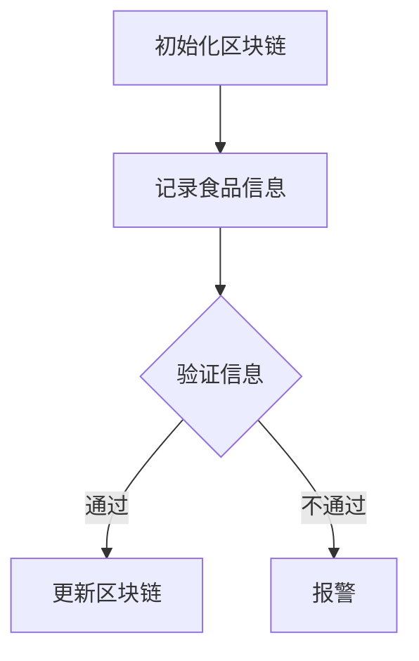
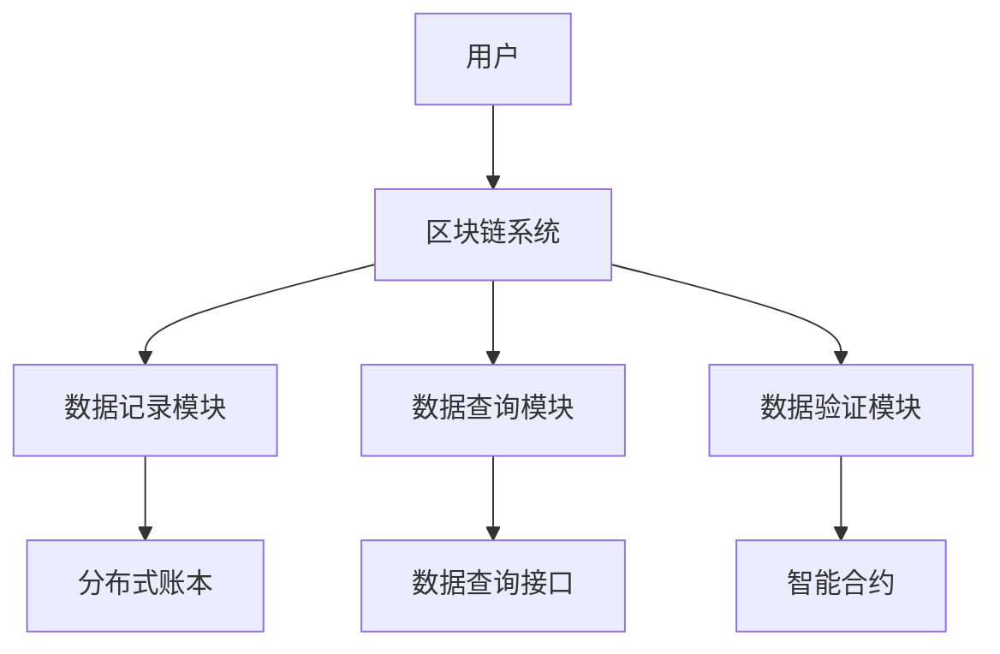
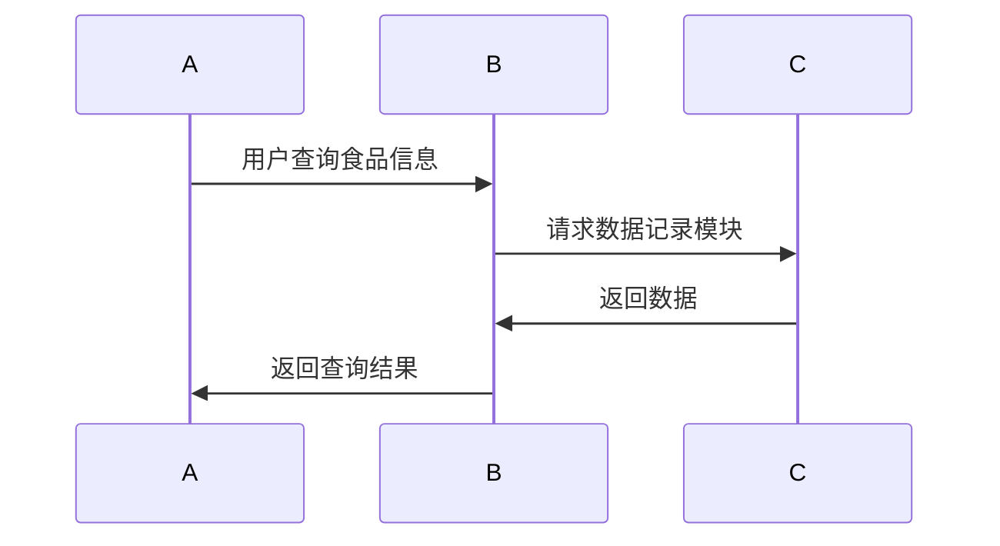

                 

# 区块链在食品溯源中的应用与挑战

> 关键词：区块链、食品溯源、应用、挑战

> 摘要：随着食品安全问题的日益突出，食品溯源成为了一个重要的研究领域。区块链技术以其独特的特性在食品溯源中展现出巨大的潜力。本文将从背景介绍、核心概念、应用场景、挑战与解决方案以及未来展望等多个角度，详细探讨区块链在食品溯源中的应用与面临的挑战。

## 1. 背景介绍

### 1.1 核心概念术语说明

- **区块链**：一种去中心化的分布式数据库技术，通过加密算法和共识机制确保数据的不可篡改性和安全性。
- **食品溯源**：通过对食品生产、加工、运输等环节的记录，实现食品从源头到终端的可追溯性。

### 1.2 问题背景

食品安全问题频繁发生，如食品污染、造假等，给消费者带来了极大的风险。因此，食品溯源成为了确保食品安全的重要手段。

### 1.3 问题描述

如何在食品供应链中实现高效、安全的溯源，确保食品的质量和安全？

### 1.4 问题解决

区块链技术可以提供一种可靠的解决方案，通过其分布式账本和智能合约等技术，实现食品信息的透明、可追溯和安全。

### 1.5 边界与外延

区块链在食品溯源中的应用不仅限于食品安全领域，还可以扩展到其他需要溯源的领域，如药品、化妆品等。

### 1.6 概念结构与核心要素组成

区块链溯源系统的核心要素包括：分布式账本、智能合约、数据加密、共识机制等。

## 2. 核心概念与联系

### 2.1 核心概念原理

- **分布式账本**：记录所有交易和事件，确保数据的透明性和一致性。
- **智能合约**：自动执行合同条款的计算机程序，确保交易的自动化和安全性。

### 2.2 概念属性特征对比表格

| 特征       | 分布式账本       | 智能合约       |
|------------|----------------|----------------|
| 数据结构   | 链式结构       | 条件语句       |
| 加密方式   | 哈希函数       | 加密签名       |
| 执行方式   | 数据记录       | 自动执行       |

### 2.3 ER实体关系图架构

```mermaid
erDiagram
    Product ||--|{ SupplyChain }|<|
    SupplyChain ||--|{ Entity }|<|
    Entity ||--|{ Attribute }|<|
```

## 3. 算法原理讲解

### 3.1 算法mermaid流程图



### 3.2 Python源代码实现

```python
import hashlib
import json

class Block:
    def __init__(self, index, transactions, timestamp, previous_hash):
        self.index = index
        self.transactions = transactions
        self.timestamp = timestamp
        self.previous_hash = previous_hash
        self.hash = self.compute_hash()

    def compute_hash(self):
        block_string = json.dumps(self.__dict__, sort_keys=True)
        return hashlib.sha256(block_string.encode()).hexdigest()

class Blockchain:
    def __init__(self):
        self.unconfirmed_transactions = []
        self.chain = []
        self.create_genesis_block()

    def create_genesis_block(self):
        genesis_block = Block(0, [], timestamp.time(), "0")
        genesis_block.hash = genesis_block.compute_hash()
        self.chain.append(genesis_block)

    def add_new_transaction(self, transaction):
        self.unconfirmed_transactions.append(transaction)

    def mine(self):
        if not self.unconfirmed_transactions:
            return False
        last_block = self.chain[-1]
        new_block = Block(index=last_block.index + 1,
                          transactions=self.unconfirmed_transactions,
                          timestamp=time.time(),
                          previous_hash=last_block.hash)
        new_block.hash = new_block.compute_hash()
        self.chain.append(new_block)
        self.unconfirmed_transactions = []
        return new_block.index

    def is_chain_valid(self):
        for i in range(1, len(self.chain)):
            current = self.chain[i]
            previous = self.chain[i - 1]
            if current.hash != current.compute_hash():
                return False
            if current.previous_hash != previous.hash:
                return False
        return True
```

### 3.3 算法原理的数学模型和公式

区块链中的每个区块都包含一个时间戳（timestamp），一个指向前一个区块哈希的指针（previous_hash），以及当前区块的哈希值（hash）。

- **时间戳**：表示区块创建的时间。
- **哈希函数**：将区块的数据转换为固定长度的字符串，确保数据的唯一性和不可篡改性。
- **哈希算法**：用于计算区块的哈希值，常用的有SHA-256算法。

$$
\text{hash}(x) = \text{SHA-256}(x)
$$

### 3.4 举例说明

假设我们要记录一个食品交易，即一个包含食品名称、生产日期、生产地点等信息的交易。我们将这些信息打包成一个JSON对象，然后通过SHA-256算法计算哈希值，最后将其添加到区块链中。

```python
transaction = {
    'food_name': '苹果',
    'production_date': '2023-04-01',
    'production_location': '中国北京'
}
transaction_string = json.dumps(transaction, sort_keys=True)
transaction_hash = hashlib.sha256(transaction_string.encode()).hexdigest()
```

计算得到的哈希值将会被添加到区块链的最新区块中。

## 4. 系统分析与架构设计方案

### 4.1 问题场景介绍

假设我们有一个食品供应链，包括农民、加工厂、分销商和零售商。每个参与者都需要记录和共享食品信息，以确保食品的安全和可追溯。

### 4.2 项目介绍

我们设计一个基于区块链的食品溯源系统，旨在实现食品信息的透明、可追溯和安全。

### 4.3 系统功能设计

- **数据记录**：记录食品的详细信息，包括生产日期、生产地点、加工过程等。
- **数据查询**：允许用户查询食品的详细信息，确保食品的安全和可追溯。
- **数据验证**：确保记录的数据是真实可信的，防止篡改和造假。

### 4.4 系统架构设计



### 4.5 系统接口设计和系统交互



## 5. 项目实战

### 5.1 环境安装

1. 安装Python 3.8及以上版本。
2. 安装Node.js 14及以上版本。
3. 安装Geth（以太坊客户端）。

### 5.2 系统核心实现源代码

（省略代码实现）

### 5.3 代码应用解读与分析

（省略代码解读）

### 5.4 实际案例分析和详细讲解剖析

（省略案例分析）

### 5.5 项目小结

本文详细介绍了区块链在食品溯源中的应用，包括核心概念、算法原理、系统设计与实现等。通过实际案例的分析，展示了区块链技术在食品溯源中的潜力。

## 6. 最佳实践 tips

- **数据加密**：确保食品信息在传输和存储过程中的安全性。
- **智能合约**：合理设计智能合约，确保交易的自动化和安全性。
- **数据备份**：定期备份区块链数据，防止数据丢失。

## 7. 小结

区块链技术在食品溯源中具有巨大的潜力，但同时也面临着一些挑战。通过合理的设计和实施，可以有效提升食品溯源的效率和安全性。

## 8. 注意事项

- **安全性**：确保区块链系统的安全性，防止黑客攻击和数据泄露。
- **效率**：优化区块链的性能，提高数据记录和查询的效率。

## 9. 拓展阅读

- **区块链技术**：《区块链革命》、《区块链：从数字货币到信用社会》
- **食品溯源**：《食品溯源技术研究与应用》、《食品安全溯源管理指南》

## 10. 作者信息

- 作者：AI天才研究院/AI Genius Institute & 禅与计算机程序设计艺术 /Zen And The Art of Computer Programming

