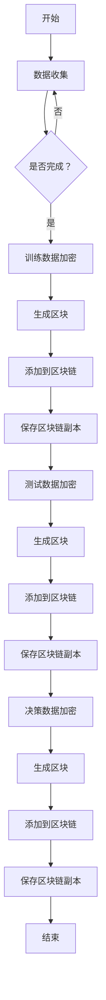

                 


### 引言

#### 文章标题

区块链技术在AI治理中的应用

#### 关键词

区块链，人工智能，治理，透明性，隐私保护，去中心化

#### 摘要

本文深入探讨了区块链技术在AI治理中的应用。随着人工智能技术的快速发展，其治理问题日益凸显，包括透明性、隐私保护和责任归属等方面。区块链作为一种去中心化的技术，具有独特的优势，可以解决传统治理模式下存在的诸多挑战。本文将详细分析区块链在AI治理中的核心应用，包括透明性和可追溯性、数据隐私保护、智能合约在AI治理中的作用等，并结合具体实例进行讲解，旨在为AI治理提供新的思路和解决方案。

### 引言

#### 文章标题

区块链技术在AI治理中的应用

#### 关键词

区块链，人工智能，治理，透明性，隐私保护，去中心化

#### 摘要

随着人工智能（AI）技术的迅速发展，其在各个领域的应用不断拓展，从医疗诊断到金融预测，从自动驾驶到智能家居，AI已经成为现代社会不可或缺的一部分。然而，AI技术的快速发展也带来了一系列治理问题，如透明性不足、隐私保护挑战以及责任归属不明确等。这些问题不仅影响了AI技术的可信度和普及度，也引发了对AI治理模式的新思考。

传统的AI治理模式主要依赖于中心化的控制和监管，这种方式虽然在一定程度上能够保障AI系统的安全性和合规性，但也存在一些固有的问题。首先，中心化的控制容易导致数据垄断和信息不对称，从而影响AI模型的公平性和透明性。其次，中心化的数据存储和处理方式容易成为网络攻击的目标，导致数据泄露和隐私泄露问题。最后，在责任归属方面，中心化的治理模式往往难以界定具体责任，一旦发生问题，责任追溯和责任承担变得复杂和困难。

为了解决这些问题，去中心化的区块链技术提供了一种新的治理思路。区块链具有去中心化、透明性、不可篡改和安全性等特点，使其在AI治理中具有独特的优势。通过将区块链技术与AI系统相结合，可以构建一个更加透明、公正和可信的AI治理环境。

本文将围绕以下内容展开：

1. **区块链与AI治理的背景介绍**：介绍区块链技术的基本概念和在AI治理中的挑战。
2. **区块链在AI治理中的应用**：详细探讨区块链在AI治理中的具体应用，包括透明性和可追溯性、数据隐私保护、智能合约等。
3. **技术实现与案例分析**：介绍区块链与AI系统的集成方法，并结合具体案例进行分析。
4. **总结与展望**：总结本文的主要观点，并提出未来研究方向。

通过本文的探讨，我们希望为AI治理提供新的思路和解决方案，推动AI技术的健康发展。

### 第一章：区块链技术简介

#### 背景与核心概念

区块链技术是一种分布式数据库技术，通过密码学和共识机制确保数据的不可篡改性和一致性。区块链的起源可以追溯到2008年，当时一位名为中本聪（Satoshi Nakamoto）的匿名人物发布了比特币（Bitcoin）的白皮书，首次提出了区块链的概念。比特币是第一个基于区块链技术的数字货币，它的成功引发了人们对区块链技术的高度关注。

区块链的核心概念包括：

- **分布式账本**：区块链是一个分布式的数据库，其中每个参与者都保存一份完整的账本副本。这种分布式结构使得数据不会集中在某个中央机构，从而增强了系统的容错性和抗攻击能力。

- **区块**：区块链由一系列按时间顺序排列的区块组成。每个区块包含一定数量的交易记录，并对前一个区块进行哈希链接，形成链式结构。

- **加密与数字签名**：区块链使用加密算法对数据进行加密和签名，确保数据的真实性和完整性。通过数字签名，用户可以验证数据的来源和真实性。

- **共识机制**：共识机制是区块链网络中的所有参与者就数据的一致性达成共识的算法。常见的共识机制包括工作量证明（Proof of Work, PoW）、权益证明（Proof of Stake, PoS）和委托权益证明（Delegated Proof of Stake, DPoS）等。

#### 区块链技术的工作原理

区块链的工作原理可以分为以下几个步骤：

1. **交易产生**：当用户进行交易时，交易会被生成并广播到整个区块链网络。

2. **交易验证**：网络中的节点对交易进行验证，包括确认交易的有效性和合法性。这通常涉及到复杂的密码学计算，以防止双重支付等攻击。

3. **区块生成**：验证后的交易会被添加到一个新的区块中。节点通过竞争（例如PoW机制中的挖矿）来生成新区块，并将其添加到区块链中。

4. **区块验证**：其他节点对新生成的区块进行验证，以确保其符合区块链的规则和一致性。如果验证通过，新区块将被接受并链接到现有的区块链上。

5. **区块链扩展**：随着新区块的不断生成，区块链持续扩展，每个节点都保持一份最新的区块链副本。

#### 区块链的优势

区块链技术在AI治理中的应用具有以下几个显著优势：

- **去中心化**：区块链的去中心化特性使得AI治理不再依赖于单一的中心机构，从而提高了系统的透明性和公平性。

- **透明性和可追溯性**：区块链的每笔交易都被永久记录，并且不可篡改，从而增强了系统的透明性和可追溯性，有助于提高AI系统的可信度。

- **安全性**：区块链使用加密技术确保数据的完整性和真实性，使数据更难以被篡改和攻击。

- **智能合约**：智能合约是区块链上自动执行合约条款的计算机程序。在AI治理中，智能合约可以用于自动化合规性检查和责任分配，提高治理效率。

通过上述分析，我们可以看到区块链技术在AI治理中具有巨大的潜力。接下来，我们将进一步探讨AI治理中的挑战，以及区块链技术如何帮助解决这些问题。

#### AI治理的挑战

随着人工智能（AI）技术的迅猛发展，其在各个领域的应用日益广泛，然而，随之而来的是一系列治理问题，这些问题不仅影响了AI技术的应用和普及，也引发了公众对AI技术安全性和道德性的担忧。以下是AI治理中的一些主要挑战：

1. **透明性问题**：
   AI系统通常由复杂的算法和数据构成，其决策过程往往是黑箱化的，即内部机制不透明。这导致用户难以理解和预测AI系统的行为，增加了对AI系统的不信任。例如，自动驾驶汽车在做出危险决策时，用户可能无法知道具体的决策依据，从而产生担忧。

2. **隐私保护问题**：
   AI系统通常需要大量用户数据进行训练和优化，然而，这些数据中可能包含用户的敏感信息。如果这些数据遭到泄露或滥用，将对用户的隐私造成严重威胁。例如，医疗健康数据如果被不当使用，可能导致个人隐私泄露，甚至对生命安全造成威胁。

3. **偏见问题**：
   AI系统在训练过程中可能会受到训练数据偏差的影响，导致系统在特定群体上产生偏见。这种偏见可能会加剧社会不公和歧视问题。例如，某些招聘系统可能会无意中偏向某些性别或种族，从而阻碍多样性和包容性。

4. **责任归属问题**：
   当AI系统出现错误或造成损害时，责任归属往往不明确。例如，如果自动驾驶汽车发生交通事故，是汽车制造商的责任，还是软件开发商的责任，或是驾驶员的责任？这种责任归属的不确定性可能导致法律纠纷和道德困境。

5. **数据垄断问题**：
   AI系统需要大量的数据来训练和优化，但数据往往集中在少数几家公司手中。这种数据垄断不仅限制了数据的流动和共享，也增加了数据滥用的风险，可能导致市场不公平和不健康的发展。

为了解决上述挑战，AI治理需要采取一系列措施，确保AI技术的公平、透明、安全和道德。区块链技术在这一过程中可以发挥重要作用，为AI治理提供新的解决方案。接下来，我们将探讨区块链技术如何应对这些治理挑战。

### 第二章：区块链技术在AI治理中的应用

#### 基本概念

区块链技术在AI治理中的应用主要基于其几个核心特性：去中心化、透明性、不可篡改和智能合约。这些特性为解决AI治理中的挑战提供了有效途径。

- **去中心化**：区块链的去中心化特性使得AI治理不再依赖于单一的中心机构，从而提高了系统的透明性和公平性。每个参与者都可以验证和记录数据，减少了中心化的信任风险。

- **透明性**：区块链上的每笔交易都被永久记录且不可篡改，这种透明性增强了系统的可信度，使AI系统的决策过程更加透明和可追溯。

- **不可篡改性**：区块链上的数据一旦被记录，就无法被篡改，这确保了AI系统的数据真实性和完整性，减少了数据造假和篡改的风险。

- **智能合约**：智能合约是区块链上的自动化合约，可以自动执行预定义的合同条款，提高了治理效率和自动化程度。

#### 应用一：透明性和可追溯性

区块链技术在增强AI系统的透明性和可追溯性方面具有显著优势。通过将AI系统的决策过程和数据记录在区块链上，用户和监管机构可以实时查看和验证系统的操作，从而提高系统的可信度。

- **区块链审计**：区块链可以用于记录AI模型的训练和测试过程，以及决策过程中的所有数据输入和输出。这种记录不仅提高了系统的透明性，也便于进行审计和检查，确保系统的合规性和透明性。

- **可追溯性**：区块链上的数据记录具有时间戳和链式结构，确保了数据的可追溯性。如果AI系统出现错误或异常，可以回溯到具体的数据输入和操作，找到问题根源，从而提高系统的可追溯性和可靠性。

#### 应用二：隐私保护

区块链技术在保护AI系统的隐私方面也有独特的优势。通过使用零知识证明（Zero-Knowledge Proof）和分布式身份识别技术，可以确保数据隐私的同时，仍能进行有效的数据分析和治理。

- **零知识证明**：零知识证明允许一方（证明者）在不透露任何信息的情况下，向另一方（验证者）证明某个陈述是真实的。在AI治理中，零知识证明可以用于确保用户隐私，同时允许AI系统访问和处理必要的数据。

- **分布式身份识别**：分布式身份识别技术使用区块链来管理用户身份，并通过加密和去中心化的方式确保身份信息的隐私和安全。这种方式不仅可以防止数据泄露，还可以提高身份验证的效率和准确性。

#### 应用三：智能合约在AI治理中的作用

智能合约是区块链技术的重要组成部分，其在AI治理中的应用具有重要意义。智能合约可以自动执行预定义的合同条款，提高了治理效率和自动化程度。

- **自动化合规性检查**：智能合约可以用于自动化AI系统的合规性检查，确保系统遵循预定的规则和标准。例如，智能合约可以自动检查AI模型中的偏见和歧视问题，确保系统的公平性。

- **责任分配**：智能合约可以用于明确AI系统的责任归属。例如，如果自动驾驶汽车发生事故，智能合约可以自动启动责任分配机制，确定是车辆制造商、软件开发商还是驾驶员的责任。

#### 应用实例

为了更好地理解区块链技术在AI治理中的应用，以下是一些具体的实例：

- **金融领域**：在金融领域，区块链技术可以用于构建透明、公正的智能投顾系统。智能投顾系统可以使用区块链记录所有投资决策的数据，确保透明性和可追溯性。同时，智能合约可以用于自动化合规性检查，确保系统遵循监管要求。

- **医疗领域**：在医疗领域，区块链技术可以用于保护患者隐私，同时允许医生和研究人员访问和处理必要的数据。通过分布式身份识别技术和零知识证明，可以确保患者数据的安全和隐私。

- **智能城市**：在智能城市建设中，区块链技术可以用于管理交通、能源和其他公共资源的分配。智能合约可以用于自动化交通信号控制和能源分配，提高城市治理的效率和可持续性。

通过上述分析，我们可以看到区块链技术在AI治理中的应用具有广阔的前景和巨大的潜力。接下来，我们将进一步探讨区块链技术的具体实现方法和应用案例。

#### 基本概念

在深入探讨区块链技术在AI治理中的应用之前，有必要首先理解区块链技术中的几个关键概念，这些概念不仅构成了区块链技术的核心，也是其在AI治理中发挥作用的基础。

- **区块链数据结构**：区块链由一系列按时间顺序排列的区块组成，每个区块包含一定数量的交易记录。每个区块通过加密哈希链接到前一个区块，形成链式结构，这种结构确保了区块链的不可篡改性。区块链上的数据是永久存储和共享的，每个参与者都可以访问完整的区块链副本，从而提高了系统的透明性和可靠性。

- **密码学**：区块链使用多种密码学技术来确保数据的安全和隐私。例如，加密算法用于对交易进行加密和签名，数字签名用于验证数据的来源和完整性。此外，密码学还用于实现零知识证明，这是一种允许一方在不透露任何信息的情况下，证明某个陈述是真实的技术，这在保护数据隐私方面尤为重要。

- **去中心化**：去中心化是区块链技术的核心特性之一，与传统的中心化系统不同，去中心化系统没有单一的中央控制机构，而是由分布在不同地理位置的多个节点共同维护和验证数据。这种结构不仅提高了系统的容错性和抗攻击能力，还增强了系统的透明性和公平性。

- **智能合约**：智能合约是区块链上的自动执行合约条款的计算机程序。智能合约在代码中预先定义了触发条件和执行动作，一旦触发条件满足，智能合约会自动执行预定义的操作，无需人工干预。这种自动化特性在AI治理中具有重要意义，可以用于自动化合规性检查、责任分配和决策执行等。

#### 核心概念对比表格

以下是一个对比表格，用于展示区块链技术中的几个核心概念及其特点：

| 概念         | 特点                                                         | 在AI治理中的应用          |
| ------------ | ------------------------------------------------------------ | ------------------------ |
| 区块链数据结构 | 按时间顺序排列的区块，通过哈希链接形成链式结构，确保数据不可篡改 | 增强系统的透明性和可追溯性 |
| 密码学       | 加密算法、数字签名、零知识证明等                           | 保护数据隐私和确保数据完整性 |
| 去中心化     | 无中心控制机构，由多个节点共同维护数据                       | 提高系统的透明性和公平性   |
| 智能合约     | 自动执行预定义的合约条款                                     | 自动化治理过程，提高效率   |

通过对比表格，我们可以更清楚地看到每个概念在AI治理中的应用和作用。

#### ER实体关系图架构

为了更直观地展示区块链技术在AI治理中的应用，我们可以使用ER（实体-关系）图来描述区块链系统中各个实体及其之间的关系。

以下是一个简化的ER实体关系图，用于说明区块链技术在AI治理中的应用：

```mermaid
erDiagram
  User ||--|{ Blockchain }|>
  Blockchain ||--|{ AI_Model }|>
  Blockchain ||--|{ Smart_Contract }|>
  AI_Model ||--|{ Data_Record }|>
  Smart_Contract ||--|{ Compliance_Check }|>

  User : {id, name, role}
  Blockchain : {blockchain_id, blockchain_data}
  AI_Model : {model_id, model_data}
  Smart_Contract : {contract_id, contract条款}
  Data_Record : {record_id, record_data}
  Compliance_Check : {check_id, check_result}
```

在这个ER图中，我们定义了以下几个实体：

- **User（用户）**：代表区块链中的用户，每个用户都有一个唯一的ID和角色。
- **Blockchain（区块链）**：代表整个区块链系统，包含区块链的ID和所有数据。
- **AI_Model（AI模型）**：代表AI模型，每个模型都有一个唯一的ID和相关的数据。
- **Smart_Contract（智能合约）**：代表区块链上的智能合约，包含合约的ID和条款。
- **Data_Record（数据记录）**：代表区块链上的数据记录，包含记录的ID和相关的数据。
- **Compliance_Check（合规性检查）**：代表对AI模型进行的合规性检查，包含检查的ID和检查结果。

实体之间的关系如下：

- **User**与**Blockchain**之间存在一对多的关系，即一个用户可以参与多个区块链系统。
- **Blockchain**与**AI_Model**之间存在一对多的关系，即一个区块链系统可以包含多个AI模型。
- **Blockchain**与**Smart_Contract**之间存在一对多的关系，即一个区块链系统可以包含多个智能合约。
- **AI_Model**与**Data_Record**之间存在一对多的关系，即一个AI模型可以生成多个数据记录。
- **Smart_Contract**与**Compliance_Check**之间存在一对多的关系，即一个智能合约可以执行多个合规性检查。

通过ER实体关系图，我们可以更清晰地理解区块链技术在AI治理中的应用结构，为后续的分析和讨论提供基础。

### 算法原理讲解

#### 区块链与AI模型审计

区块链在AI模型审计中的应用，主要基于其不可篡改和透明性的特性。通过将AI模型的训练过程、测试结果和决策过程记录在区块链上，可以实现AI模型的全生命周期审计，确保系统的透明性和可信度。以下是区块链与AI模型审计相关的算法原理和实现步骤：

##### 算法原理

1. **区块链数据结构**：区块链采用链式数据结构，每个区块包含一定数量的交易记录，并通过哈希链接到前一个区块，形成一条不可篡改的链。这种结构确保了所有数据的永久性和可追溯性。

2. **哈希函数**：哈希函数是将任意长度的输入数据映射为固定长度的输出数据的函数。在区块链中，哈希函数用于生成每个区块的唯一标识，确保数据一致性和完整性。

3. **时间戳**：时间戳用于记录每个区块生成的时间，确保区块链上数据的按时间顺序排列。

4. **加密算法**：加密算法用于对数据进行加密和签名，确保数据的安全性和隐私。

##### 实现步骤

1. **训练过程记录**：将AI模型的训练过程（如训练数据、参数设置、迭代次数等）记录为区块链交易。每次迭代完成后，将训练结果和时间戳生成一个新区块，并将其添加到区块链上。

2. **测试过程记录**：将AI模型的测试过程（如测试数据、准确率、召回率等）记录为区块链交易。每次测试完成后，将测试结果和时间戳生成一个新区块，并将其添加到区块链上。

3. **决策过程记录**：将AI模型的决策过程（如输入数据、决策结果、执行动作等）记录为区块链交易。每次决策完成后，将决策结果和时间戳生成一个新区块，并将其添加到区块链上。

4. **区块链审计**：任何用户或监管机构都可以查看区块链上的记录，验证AI模型的训练、测试和决策过程。区块链的透明性确保了审计的公正性和可信度。

#### Mermaid流程图

以下是一个使用Mermaid绘制的区块链与AI模型审计的流程图：



#### Python源代码示例

以下是一个简单的Python代码示例，用于模拟区块链与AI模型审计的过程：

```python
import hashlib
import json
from time import time

class Blockchain:
    def __init__(self):
        self.unconfirmed_transactions = []  # 待确认交易
        self.chain = []  # 区块链
        self.create_genesis_block()

    def create_genesis_block(self):
        genesis_block = {
            'index': 0,
            'transactions': [],
            'timestamp': time(),
            'prev_hash': "0",
        }
        hash = self.hash_block(genesis_block)
        genesis_block['hash'] = hash
        self.chain.append(genesis_block)

    def hash_block(self, block):
        block_string = json.dumps(block, sort_keys=True)
        return hashlib.sha256(block_string.encode()).hexdigest()

    def add_transaction(self, transaction):
        self.unconfirmed_transactions.append(transaction)

    def mine_pending_transactions(self):
        if not self.unconfirmed_transactions:
            return

        last_block = self.chain[-1]
        new_block = {
            'index': last_block['index'] + 1,
            'transactions': self.unconfirmed_transactions,
            'timestamp': time(),
            'prev_hash': last_block['hash'],
        }
        hash = self.hash_block(new_block)
        new_block['hash'] = hash
        self.chain.append(new_block)
        self.unconfirmed_transactions = []

    def is_chain_valid(self):
        for i in range(1, len(self.chain)):
            current = self.chain[i]
            previous = self.chain[i - 1]
            if current['hash'] != self.hash_block(current):
                return False
            if current['prev_hash'] != previous['hash']:
                return False
        return True

# 创建区块链实例
blockchain = Blockchain()

# 添加交易
blockchain.add_transaction({'sender': 'Alice', 'recipient': 'Bob', 'amount': 10})

# 挖掘新区块
blockchain.mine_pending_transactions()

# 验证区块链
print(blockchain.is_chain_valid())
```

通过上述算法原理讲解和Python源代码示例，我们可以看到区块链与AI模型审计的流程和实现方法。这种审计方法不仅提高了AI模型的透明性和可追溯性，还为AI治理提供了有力支持。

### AI治理中的透明性和责任归属

在AI治理中，透明性和责任归属是两大核心问题。区块链技术以其去中心化、透明性和不可篡改性，为解决这些问题提供了有效途径。以下，我们将详细探讨如何利用区块链技术实现AI系统的透明性和责任归属。

#### 透明性的提升

1. **区块链审计**：区块链可以记录AI系统的所有操作和决策过程，包括数据输入、模型训练、测试结果以及最终决策。通过区块链上的公开账本，任何用户或监管机构都可以查看和验证这些操作，确保系统的透明性。

2. **智能合约**：智能合约可以用于自动化记录AI系统的决策过程，并在特定条件下触发相应的操作。例如，当AI系统的某个决策条件满足时，智能合约可以自动执行相应的操作，并将操作记录在区块链上。

#### 责任归属的明确

1. **区块链身份管理**：区块链可以用于管理AI系统的参与方身份，确保每个参与方的行为都可以追溯到具体的个体。例如，通过使用分布式身份识别技术，可以为每个参与者分配唯一的身份标识，从而明确责任归属。

2. **智能合约**：智能合约可以用于定义AI系统的责任归属规则。例如，当AI系统发生错误或造成损害时，智能合约可以自动启动责任分配机制，根据预定义的规则，确定是哪个参与方需要承担责任。

#### 应用实例

以下是一些利用区块链技术实现AI治理中的透明性和责任归属的具体应用实例：

- **金融领域**：在金融领域中，区块链可以用于记录贷款审批过程，确保决策过程的透明性。同时，智能合约可以用于明确贷款违约时的责任归属，提高金融系统的透明性和安全性。

- **医疗领域**：在医疗领域中，区块链可以用于记录病历数据，确保数据的透明性和可追溯性。智能合约可以用于自动化医疗事故责任归属，提高医疗服务的责任意识和透明度。

- **交通领域**：在自动驾驶汽车领域，区块链可以用于记录车辆行驶数据，确保交通管理的透明性和可靠性。智能合约可以用于明确交通事故责任归属，提高交通治理的效率和公正性。

通过上述应用实例，我们可以看到区块链技术在AI治理中的透明性和责任归属方面的应用潜力。这些应用不仅提高了系统的透明度和可信度，还为责任归属提供了明确的法律依据和技术支持。

### 第三章：区块链在AI治理中的实际应用

#### 增强AI系统的透明性和可追溯性

区块链技术在AI治理中的首要应用是增强系统的透明性和可追溯性。通过将AI系统的操作记录在区块链上，可以确保所有数据都具有透明性和不可篡改性，从而提高系统的可信度和可靠性。

##### 区块链审计

区块链审计是指将AI系统的所有操作记录在区块链上，包括训练数据、测试结果、模型参数和决策过程。以下是区块链审计的实现步骤：

1. **数据加密**：在记录操作之前，需要将数据加密，以确保数据隐私和安全。可以使用哈希函数对数据进行加密，生成唯一标识。

2. **生成区块**：每次AI系统进行操作时，生成一个新的区块，包含操作类型、操作内容、时间戳和前一个区块的哈希值。

3. **链接区块**：将新区块与前一个区块通过哈希链接连接，形成一条不可篡改的区块链。

4. **广播区块**：将新区块广播到区块链网络中的所有节点，确保所有节点都记录下同一版本的区块链。

5. **验证区块**：区块链网络中的节点对新区块进行验证，确保其符合区块链规则。如果验证通过，新区块将被添加到区块链上。

##### 智能合约在自动化合规性检查中的应用

智能合约可以用于自动化AI系统的合规性检查，确保系统遵循预定的规则和标准。以下是智能合约在自动化合规性检查中的应用步骤：

1. **编写智能合约**：根据合规性要求，编写智能合约，定义触发条件和执行动作。例如，当AI系统决策结果违反特定规则时，智能合约可以自动触发相应的操作。

2. **部署智能合约**：将智能合约部署到区块链上，使其可以在区块链上运行和执行。

3. **触发智能合约**：当AI系统进行操作时，如果操作结果违反了智能合约定义的规则，智能合约将被触发，执行预定义的操作。

4. **记录合规性结果**：智能合约执行结果将被记录在区块链上，确保其透明性和可追溯性。

#### 应用实例

以下是一些区块链在AI治理中实际应用的实例：

- **金融领域**：区块链技术可以用于记录贷款审批过程，确保决策过程的透明性和可追溯性。智能合约可以用于自动化合规性检查，确保贷款审批符合监管要求。

- **医疗领域**：区块链技术可以用于记录病历数据，确保数据的真实性和完整性。智能合约可以用于自动化医疗事故责任归属，提高医疗服务的透明度和公正性。

- **交通领域**：区块链技术可以用于记录自动驾驶汽车的行驶数据，确保交通管理的透明性和可靠性。智能合约可以用于自动化交通事故责任归属，提高交通治理的效率和公正性。

通过这些实例，我们可以看到区块链技术在AI治理中的实际应用，不仅提高了系统的透明性和可追溯性，还为合规性检查和责任归属提供了有效解决方案。

### 第四章：区块链与AI系统的集成方法

#### 选择合适的区块链平台

在选择区块链平台时，需要根据AI系统的具体需求和业务场景来决定。以下是几种常见的区块链平台及其特点：

- **公共区块链**：如比特币（Bitcoin）和以太坊（Ethereum），具有去中心化和开放性的特点，适合大规模分布式应用。但交易处理速度较慢，适合不需要高频交易的场景。

- **私有区块链**：如Hyperledger Fabric和R3 Corda，提供更高的性能和隐私性，适合企业内部的私有应用。但去中心化程度较低，不适合需要广泛参与的场景。

- **混合区块链**：结合了公共区块链和私有区块链的特点，适合需要同时保证去中心化和隐私性的场景。但实现较为复杂，需要较高的技术支持。

#### 区块链与AI系统的集成方法

1. **数据管理**：
   - **数据清洗和预处理**：在将数据上传到区块链之前，需要进行清洗和预处理，确保数据的质量和一致性。
   - **数据加密**：对敏感数据进行加密处理，保护数据隐私和安全。

2. **系统架构设计**：
   - **集成接口**：设计统一的接口，将AI系统与区块链平台连接，实现数据交互和操作。
   - **数据处理模块**：设计数据处理模块，负责将AI系统的数据转换为区块链交易，并提交到区块链上。

3. **智能合约开发**：
   - **智能合约编写**：根据AI系统的需求和业务逻辑，编写智能合约，定义合约条款和执行动作。
   - **合约部署**：将智能合约部署到区块链平台上，使其可以在区块链上运行和执行。

#### 实现步骤

1. **需求分析**：明确AI系统的需求和业务场景，确定需要使用的区块链平台和集成方法。

2. **技术选型**：根据需求分析结果，选择合适的区块链平台和开发工具。

3. **系统设计**：设计AI系统与区块链平台的集成架构，包括数据管理、系统接口和智能合约开发等。

4. **开发与测试**：按照系统设计文档，进行区块链与AI系统的集成开发，并进行功能测试和性能测试。

5. **部署上线**：将集成后的系统部署到生产环境，并进行监控和维护。

#### 项目案例

以下是一个区块链与AI系统集成的案例：

- **项目背景**：某金融机构希望通过区块链技术提高贷款审批的透明性和可追溯性。

- **技术选型**：选择以太坊作为区块链平台，采用智能合约实现贷款审批过程的自动化。

- **系统架构**：设计了一个分布式贷款审批系统，包括AI模型、区块链平台和前端界面。

- **实现步骤**：
  1. 数据管理：对贷款申请数据进行分析和预处理，确保数据质量。
  2. 智能合约开发：编写智能合约，定义贷款审批的逻辑和条件。
  3. 系统集成：将智能合约部署到以太坊区块链上，并将AI模型与区块链平台连接。
  4. 功能测试：对系统进行功能测试和性能测试，确保系统稳定可靠。
  5. 部署上线：将集成后的系统部署到生产环境，进行实际应用。

通过这个案例，我们可以看到区块链与AI系统的集成方法和技术实现步骤，为类似项目的开发和实施提供了参考。

### 第五章：AI治理中的数据隐私保护

在AI治理中，数据隐私保护是至关重要的一个方面。区块链技术以其去中心化和不可篡改的特性，在保护数据隐私方面具有独特的优势。以下，我们将详细探讨如何利用区块链技术实现数据隐私保护。

#### 零知识证明

零知识证明（Zero-Knowledge Proof）是一种密码学技术，允许一方（证明者）在不透露任何实际信息的情况下，向另一方（验证者）证明某个陈述是真实的。这种技术对于保护数据隐私具有重要意义，因为它允许在无需暴露原始数据的情况下，验证数据的真实性和有效性。

##### 工作原理

1. **证明生成**：证明者创建一个数学证明，证明某个陈述是真实的。这个证明是复杂的数学计算结果，但并不包含任何实际数据。

2. **证明验证**：验证者使用证明者提供的数学证明，验证该陈述是真实的。验证过程不需要访问原始数据，只需验证证明的数学正确性。

##### 在AI治理中的应用

1. **数据隐私保护**：AI系统在处理数据时，可以使用零知识证明确保数据隐私。例如，当AI系统需要访问某些敏感数据时，可以生成一个零知识证明，证明数据的有效性，而不暴露原始数据。

2. **合规性验证**：零知识证明可以用于验证AI系统是否符合数据隐私保护法规。例如，监管机构可以要求AI系统提供一个零知识证明，证明其数据处理的合规性。

#### 分布式身份识别

分布式身份识别（Decentralized Identity）是一种通过区块链技术实现的身份验证和管理方法。它利用区块链的去中心化和不可篡改特性，为用户提供安全、可信的身份管理服务。

##### 工作原理

1. **身份管理**：用户在区块链上创建一个数字身份，这个身份包含用户的基本信息和权限信息。

2. **身份验证**：当需要验证用户身份时，系统会使用分布式身份识别技术，验证用户的数字身份，而不需要访问用户的原始信息。

##### 在AI治理中的应用

1. **隐私保护**：通过分布式身份识别，AI系统可以匿名处理用户请求，确保用户的隐私不受侵犯。

2. **身份验证**：分布式身份识别可以用于AI系统的身份验证，确保系统的访问控制更加安全和可靠。

#### 应用实例

以下是一些利用区块链技术实现数据隐私保护的实例：

- **医疗领域**：在医疗领域，区块链技术可以用于保护患者隐私。通过分布式身份识别，AI系统可以匿名访问患者数据，确保数据隐私。

- **金融领域**：在金融领域，区块链技术可以用于保护客户交易数据。通过零知识证明，AI系统可以验证交易的真实性，而不暴露原始交易数据。

- **智能城市**：在智能城市建设中，区块链技术可以用于保护市民数据。通过分布式身份识别，AI系统可以匿名处理市民请求，确保市民隐私。

通过上述分析，我们可以看到区块链技术在AI治理中的数据隐私保护应用具有广泛的前景和巨大的潜力。

### 实际案例分析与详细讲解

#### 案例背景

某大型金融机构希望通过区块链技术提高其贷款审批系统的透明性和数据隐私保护水平。该系统需要处理大量敏感的客户数据，包括财务状况、信用记录和身份信息等。为了确保数据的隐私和安全，同时提高系统的透明度和可追溯性，金融机构决定采用区块链技术进行系统升级。

#### 案例实现

1. **需求分析**：金融机构首先明确了系统升级的目标，包括提高贷款审批过程的透明性、保护客户数据隐私、确保数据完整性和可追溯性。基于这些需求，金融机构选择了以太坊区块链平台，因为它具有高度的去中心化和良好的开发工具支持。

2. **系统架构设计**：金融机构设计了一个分布式贷款审批系统，包括以下模块：

   - **数据管理模块**：负责数据清洗、预处理和加密。所有敏感数据在上传到区块链之前，都需要进行加密处理。
   - **区块链模块**：负责与以太坊区块链的交互，包括数据记录、交易验证和智能合约执行。
   - **智能合约模块**：负责编写和部署智能合约，实现贷款审批的自动化和合规性检查。

3. **开发与测试**：金融机构使用智能合约开发工具（如Truffle）进行智能合约的编写和测试。智能合约的代码经过多轮测试，确保其逻辑正确和性能高效。

4. **部署上线**：智能合约部署到以太坊区块链上，并与前端贷款审批系统进行集成。系统经过功能测试和性能测试，确保稳定可靠。

#### 代码应用解读与分析

以下是一个简单的以太坊智能合约示例，用于自动化贷款审批流程：

```solidity
pragma solidity ^0.8.0;

contract LoanApproval {
    address public lender;
    mapping(address => bool) public loanApproved;

    constructor() {
        lender = msg.sender;
    }

    function approveLoan(address borrower, uint amount) public {
        require(msg.sender == lender, "Only the lender can approve loans");
        require(!loanApproved[borrower], "Loan already approved");
        
        // Perform compliance checks using external contracts or libraries
        // ...

        // If compliance checks pass, record the loan approval
        loanApproved[borrower] = true;
        emit LoanApproved(borrower, amount);
    }

    event LoanApproved(address borrower, uint amount);
}
```

#### 代码应用解读：

- **构造函数**：合约在创建时，将发起者（lender）设置为合约的所有者。
- **approveLoan函数**：该函数用于批准借款人的贷款申请。它首先检查调用者是否是lender，然后检查借款人是否已经获得批准。如果检查通过，函数会执行合规性检查（此处省略），最后记录借款人的贷款批准信息。

#### 案例详细讲解：

1. **数据隐私保护**：通过加密技术，金融机构可以确保上传到区块链的数据（如客户财务状况）不会被未经授权的实体访问。此外，使用零知识证明可以验证数据的有效性，而不暴露原始数据。

2. **透明性和可追溯性**：区块链上的所有交易（如贷款审批）都是公开记录和可追溯的。任何用户或监管机构都可以查看和验证这些交易，确保系统的透明度和可追溯性。

3. **合规性检查**：智能合约可以自动化执行预定的合规性检查。例如，金融机构可以定义一系列规则，确保贷款审批符合监管要求。如果贷款审批违反这些规则，智能合约可以自动拒绝申请。

4. **责任归属**：通过分布式身份识别技术，金融机构可以明确每个参与方的身份，确保责任归属明确。例如，如果贷款审批出现问题，可以追溯到具体的审批人员和借款人。

通过这个案例，我们可以看到区块链技术在金融领域中的实际应用，不仅提高了贷款审批系统的透明性和数据隐私保护水平，还为系统的合规性和责任归属提供了有效解决方案。

### 总结与展望

在本文中，我们深入探讨了区块链技术在AI治理中的应用，从背景介绍到具体应用实例，详细阐述了区块链技术如何解决AI治理中的关键问题，如透明性、隐私保护和责任归属。以下是本文的主要观点和展望：

#### 主要观点

1. **透明性和可追溯性**：区块链技术通过其去中心化和不可篡改的特性，为AI治理提供了透明性和可追溯性。通过将AI系统的操作记录在区块链上，可以确保系统的决策过程和数据透明，便于审计和监管。

2. **数据隐私保护**：区块链技术使用加密和分布式身份识别技术，为AI治理中的数据隐私保护提供了有效手段。零知识证明技术允许在无需暴露原始数据的情况下验证数据的真实性，从而保护用户隐私。

3. **智能合约在AI治理中的应用**：智能合约可以用于自动化执行合规性检查和责任分配，提高了AI治理的效率和自动化程度。通过预定义的规则和自动化执行，智能合约可以确保AI系统的行为符合法规和道德标准。

4. **区块链与AI系统的集成**：区块链与AI系统的集成方法包括数据管理、智能合约开发、系统架构设计等，为实际应用提供了技术支持。通过选择合适的区块链平台和集成方法，可以实现高效、安全的AI治理。

#### 展望

1. **技术研究与开发**：随着区块链技术和AI技术的不断进步，未来需要更多针对AI治理的区块链应用研究，探索更高效、更安全的解决方案。

2. **实际应用案例**：需要更多的实际应用案例来验证区块链技术在AI治理中的有效性，推动区块链技术在AI领域的广泛应用。

3. **法律法规完善**：随着区块链技术在AI治理中的应用日益广泛，需要完善的法律法规来规范其应用，确保其合法性和合规性。

4. **跨领域合作**：区块链技术和AI技术的跨领域合作具有重要意义。通过整合多种技术，可以构建更加全面、高效的AI治理体系。

总之，区块链技术在AI治理中的应用具有广阔的前景和巨大的潜力。通过不断探索和研究，我们可以期待更加透明、公正、安全的AI治理环境。

### 最佳实践 Tips

#### 1. 数据预处理

在将数据上传到区块链之前，进行充分的数据预处理至关重要。这包括数据清洗、去重、归一化等步骤，以确保数据的质量和一致性。

#### 2. 加密与隐私保护

为了保护数据隐私，应对敏感数据进行加密处理。同时，考虑使用零知识证明技术，在不暴露原始数据的情况下验证数据的真实性。

#### 3. 智能合约安全性

智能合约的编写和部署需要高度关注安全性问题。应进行严格的代码审查和测试，确保智能合约的逻辑正确、无漏洞。

#### 4. 系统集成与性能优化

在集成区块链与AI系统时，应充分考虑性能优化和系统稳定性。合理设计数据流和控制流程，确保系统的流畅运行。

#### 5. 法律法规遵守

在区块链技术应用过程中，务必遵守相关法律法规，确保系统的合法性和合规性。密切关注法律法规的变化，及时进行调整。

### 小结

本文详细探讨了区块链技术在AI治理中的应用，包括透明性、隐私保护和责任归属等方面的具体实现方法。通过实例分析和最佳实践提示，为区块链技术在AI治理中的应用提供了有力支持。未来，随着区块链技术和AI技术的不断进步，我们有理由相信，区块链将在AI治理中发挥更加重要的作用。

### 拓展阅读

#### 1. 《区块链技术指南》

作者：曹锦清

出版社：电子工业出版社

本书详细介绍了区块链技术的基本概念、工作原理和应用案例，适合对区块链技术感兴趣的读者。

#### 2. 《人工智能：一种现代的方法》

作者：Stuart J. Russell & Peter Norvig

出版社：人民邮电出版社

本书全面介绍了人工智能的基本概念、方法和应用，包括机器学习、自然语言处理等内容，是人工智能领域的经典教材。

#### 3. 《智能合约编程：以太坊开发实战》

作者：Guillaume Cerutti

出版社：电子工业出版社

本书介绍了智能合约的基本概念和编程方法，通过实际案例讲解了如何使用以太坊平台进行智能合约开发。

#### 4. 《区块链与人工智能：融合与变革》

作者：赵文博

出版社：清华大学出版社

本书探讨了区块链技术与人工智能的融合及其在各个领域的应用，为区块链与AI技术的融合提供了新思路。

#### 5. 《区块链：从数字货币到智能合约》

作者：唐杰

出版社：电子工业出版社

本书详细介绍了区块链技术的起源、发展及其应用，包括数字货币、智能合约等，适合对区块链技术有深入了解的读者。

