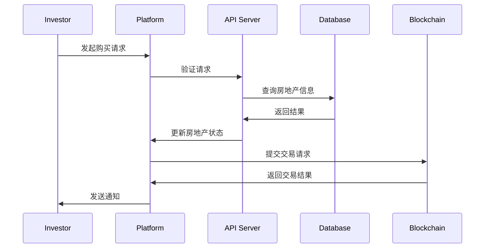
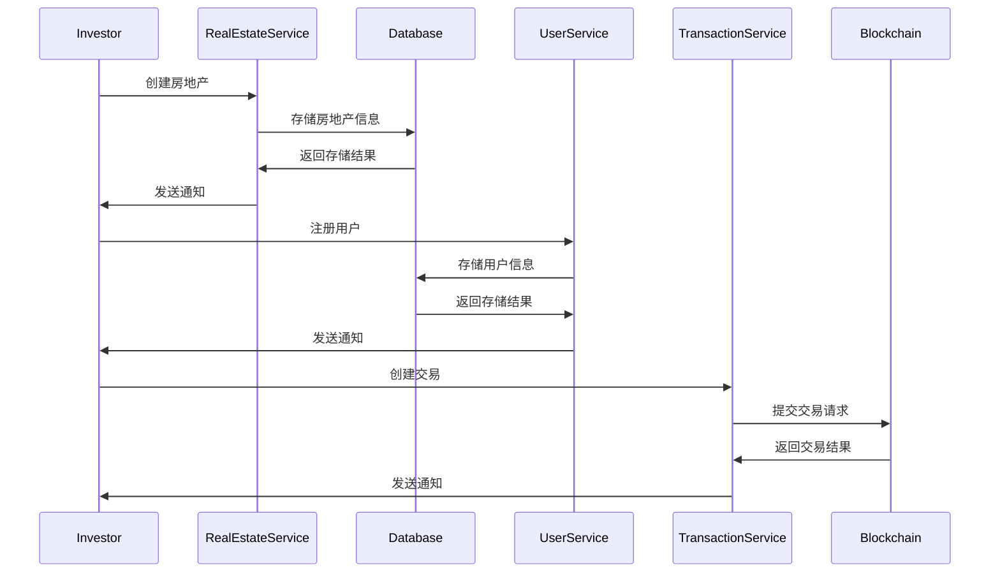

                 

### 第一部分: 引言

**文章标题：区块链技术在数字资产tokenization中的创新**

**关键词：区块链，数字资产，tokenization，创新**

**摘要：本文将深入探讨区块链技术在数字资产tokenization中的创新应用，从核心概念、应用场景到挑战与未来展望，提供全面的技术解读和分析。**

#### 1.1 问题背景

随着数字经济的快速发展，传统金融体系面临着巨大的变革压力。在数字资产tokenization领域，区块链技术以其去中心化、透明性和不可篡改的特性，成为推动金融创新的重要工具。数字资产tokenization是指将实物资产或虚拟资产转化为数字代币，通过区块链技术实现确权和交易的过程。这种创新应用不仅改变了传统资产交易的方式，也带来了新的商业模式和投资机会。

#### 1.2 问题描述

数字资产tokenization涉及多个核心概念和技术，如区块链、智能合约、加密技术等。然而，在实际应用中，如何确保tokenization过程的透明性、安全性、可扩展性和合规性，是一个亟待解决的问题。此外，不同场景下的tokenization需求和技术实现也存在差异，需要针对具体应用进行定制化设计。

#### 1.3 问题解决

本文将通过以下几个步骤来解决问题：

1. **核心概念介绍**：详细阐述区块链技术和数字资产tokenization的基本原理和特性。
2. **应用场景分析**：探讨区块链技术在数字资产tokenization中的具体应用场景，如加密货币市场、房地产tokenization等。
3. **技术分析**：分析区块链技术在tokenization过程中的关键技术和挑战，如智能合约、加密技术、非同质化代币（NFT）等。
4. **案例分析**：通过实际案例展示区块链技术在数字资产tokenization中的应用效果。
5. **未来展望**：预测区块链技术在数字资产tokenization领域的未来发展趋势和方向。

#### 1.4 边界与外延

本文的边界主要限定在区块链技术在数字资产tokenization中的应用，不包括其他数字资产交易模式和技术。同时，本文将对tokenization过程中的技术实现进行深入探讨，但不涉及具体业务逻辑和运营策略。

### 第二部分: 核心概念

#### 2.1 区块链技术概述

区块链技术是一种分布式账本技术，通过去中心化的方式实现数据的存储和传输。其核心特点是数据不可篡改、透明性和安全性。区块链技术自2008年比特币的诞生以来，经历了快速的发展和应用探索。

##### 2.1.1 区块链的定义与特性

区块链是一种去中心化的数据库，它通过加密算法和分布式网络技术，确保数据的真实性和安全性。区块链的主要特性包括：

- **去中心化**：区块链不依赖于中心化的服务器或组织，所有参与者都可以平等地参与网络运作。
- **不可篡改**：一旦数据记录在区块链上，就难以篡改，保证了数据的一致性和可靠性。
- **透明性**：区块链上的所有交易记录都是公开透明的，任何参与者都可以查看和验证。
- **安全性**：区块链通过加密算法和共识机制，确保了网络的安全性和数据完整性。

##### 2.1.2 区块链技术的发展历程

区块链技术起源于比特币，自2008年比特币白皮书发布以来，区块链技术经历了多个阶段的发展：

- **1.0阶段**：以比特币为代表，区块链技术主要用于数字货币的发行和交易。
- **2.0阶段**：智能合约的出现，使得区块链技术开始应用于更广泛的场景，如金融、供应链等。
- **3.0阶段**：以以太坊为代表，区块链技术开始关注去中心化应用（DApp）的开发和部署。

#### 2.2 数字资产tokenization

数字资产tokenization是指将实物资产或虚拟资产转化为数字代币，通过区块链技术实现确权和交易的过程。数字资产包括但不限于货币、股票、债券、房地产、艺术品等。

##### 2.2.1 数字资产的概念

数字资产是指以数字化形式存在的资产，包括数字货币、数字股权、数字债券、数字房地产等。与实物资产相比，数字资产具有以下特点：

- **流动性**：数字资产可以通过区块链网络快速交易，具有较高的流动性。
- **透明性**：数字资产的所有权和交易记录都是公开透明的。
- **去中心化**：数字资产的交易不依赖于中心化的机构或平台，提高了交易的自主性和效率。

##### 2.2.2 tokenization的基本原理

tokenization的基本原理是将实物资产或虚拟资产转化为数字代币，这些数字代币在区块链上进行确权和交易。具体过程如下：

1. **资产评估**：对实物资产或虚拟资产进行评估，确定其价值。
2. **发行代币**：将资产的价值转化为数字代币，这些代币在区块链上进行注册和发行。
3. **代币交易**：数字代币在区块链上进行交易，实现资产的所有权和收益权转移。
4. **代币清算**：代币交易完成后，进行代币的清算，确保资产所有权转移的合法性和安全性。

##### 2.2.3 tokenization的优势

tokenization作为一种新兴的数字资产交易模式，具有以下优势：

- **提高效率**：通过区块链技术，可以大幅降低资产交易的时间和成本。
- **降低风险**：区块链技术的透明性和不可篡改性，降低了欺诈和错误的风险。
- **拓展应用**：tokenization可以应用于多种资产类型，如房地产、艺术品等，拓展了数字资产的应用场景。
- **增加流动性**：数字代币的快速交易和低手续费，提高了资产的流动性。

### 第三部分: 区块链技术在数字资产tokenization中的应用

#### 3.1 基本架构

区块链技术在数字资产tokenization中的应用架构主要包括以下几部分：

- **区块链网络**：作为基础架构，区块链网络负责存储和处理数字资产tokenization的交易数据。
- **智能合约**：智能合约是区块链网络上的计算机程序，用于自动执行和验证数字资产tokenization的交易规则。
- **加密技术**：加密技术用于保护数字资产tokenization过程中的数据安全和隐私。
- **分布式节点**：分布式节点共同维护区块链网络的运行，确保数据的一致性和可靠性。

##### 3.1.1 区块链与tokenization的关系

区块链技术在数字资产tokenization中起到了核心作用，其主要关系如下：

- **数据存储**：区块链网络用于存储数字资产的token信息，包括资产所有权、交易记录等。
- **交易验证**：智能合约负责验证数字资产tokenization的交易规则，确保交易的安全和合法。
- **隐私保护**：加密技术用于保护数字资产tokenization过程中的数据隐私，防止未经授权的访问。
- **去中心化**：分布式节点共同维护区块链网络的运行，确保数字资产tokenization的透明性和可靠性。

##### 3.1.2 区块链在tokenization中的角色

区块链在数字资产tokenization中扮演了多个角色，包括：

- **数据存储与管理**：区块链网络存储和管理数字资产的token信息，确保数据的一致性和可靠性。
- **交易执行与验证**：智能合约负责执行和验证数字资产tokenization的交易规则，确保交易的安全和合法。
- **去中心化治理**：分布式节点共同维护区块链网络的运行，确保数字资产tokenization的去中心化和自治性。
- **创新应用支持**：区块链技术为数字资产tokenization提供了丰富的创新应用场景，如去中心化金融（DeFi）、智能合约等。

### 第四部分: 数字资产tokenization案例分析

#### 4.1 案例一：加密货币市场

加密货币市场是区块链技术在数字资产tokenization中最早和最广泛的实践领域。以比特币为例，比特币通过区块链技术实现了去中心化的货币发行和交易。

##### 4.1.1 案例背景

比特币作为一种去中心化的数字货币，其发行和交易过程完全依赖于区块链技术。比特币的发行量是有限的，通过挖矿过程不断减少，使得比特币具有稀缺性。比特币的交易记录存储在区块链上，所有参与者都可以查看和验证。

##### 4.1.2 案例分析

比特币案例展示了区块链技术在数字资产tokenization中的优势：

- **去中心化**：比特币的发行和交易不依赖于中心化的机构，提高了交易的自主性和效率。
- **安全性**：比特币的交易记录存储在区块链上，具有不可篡改性和透明性，确保了交易的安全和可信。
- **可扩展性**：尽管比特币在早期面临可扩展性问题，但随着技术的发展，如分层技术和侧链技术的应用，比特币的可扩展性得到了显著提升。
- **创新应用**：比特币的出现，带动了整个加密货币市场的发展，催生了多种新型数字资产和应用，如去中心化金融（DeFi）、非同质化代币（NFT）等。

#### 4.2 案例二：房地产tokenization

房地产tokenization是区块链技术在传统资产领域的重要应用之一。以美国的RealTtokens项目为例，该项目通过区块链技术实现了房地产的数字资产化。

##### 4.2.1 案例背景

RealTtokens项目旨在通过区块链技术将房地产转化为数字代币，实现房地产的快速交易和投资。每个房地产项目都被分割成若干份代币，投资者可以通过购买这些代币参与房地产投资。

##### 4.2.2 案例分析

RealTtokens项目展示了区块链技术在房地产tokenization中的优势：

- **提高流动性**：房地产tokenization使得房地产资产可以快速分割和交易，提高了资产的流动性。
- **降低交易成本**：通过区块链技术，房地产交易过程中的中介费用和手续费用显著降低。
- **透明性**：房地产tokenization的交易记录存储在区块链上，所有参与者都可以查看和验证，提高了交易的透明性。
- **安全性**：区块链技术的安全性和不可篡改性，确保了房地产tokenization过程中的数据安全和可信。

### 第五部分: 区块链技术在tokenization中的挑战与未来展望

#### 5.1 技术挑战

尽管区块链技术在数字资产tokenization中展现了许多优势，但仍然面临一些技术挑战：

- **可扩展性**：区块链网络的性能和容量需要进一步优化，以满足大规模数字资产tokenization的需求。
- **安全性**：区块链网络需要不断升级和改进，以防范潜在的攻击和漏洞。
- **合规性**：区块链技术的应用需要符合相关法律法规的要求，以确保合法合规。
- **用户友好性**：区块链技术的使用门槛较高，需要进一步降低用户的使用难度。

#### 5.2 未来展望

随着区块链技术的不断发展和成熟，数字资产tokenization领域有望迎来更多的创新和发展：

- **更广泛的应用场景**：除了加密货币和房地产，区块链技术将在更多领域实现数字资产tokenization，如艺术品、版权等。
- **更好的用户体验**：随着技术的进步，区块链技术的用户体验将得到显著提升，使得更多人能够方便地参与数字资产tokenization。
- **更完善的生态系统**：区块链技术的发展将带动更多的开发者和合作伙伴加入，构建一个更加完善和繁荣的数字资产tokenization生态系统。

### 第六部分: 最佳实践与政策建议

#### 6.1 最佳实践案例

在数字资产tokenization的实施过程中，一些成功的案例可以为其他项目提供借鉴：

- **案例一**：加密货币交易平台Binance通过其智能合约实现了高效的数字资产交易和结算，成为行业典范。
- **案例二**：美国RealTtokens项目通过区块链技术实现了房地产的数字化和去中心化交易，提高了市场效率。

#### 6.2 政策建议

为了促进数字资产tokenization的健康发展，政府和企业可以采取以下政策建议：

- **法律法规完善**：政府应完善相关法律法规，明确数字资产tokenization的法律地位和监管框架。
- **技术标准制定**：行业组织和政府应共同制定技术标准，提高数字资产tokenization的技术规范和安全水平。
- **人才培养**：加强区块链技术人才的培养和引进，为数字资产tokenization提供人才支持。

#### 6.3 注意事项

在数字资产tokenization的实施过程中，需要注意以下事项：

- **数据安全**：确保数字资产tokenization过程中的数据安全和隐私保护。
- **合规审查**：在项目实施前进行充分的合规审查，确保项目符合相关法律法规。
- **风险管理**：对数字资产tokenization项目进行风险评估，制定相应的风险控制措施。

### 第七部分: 小结与拓展阅读

#### 7.1 小结

本文从核心概念、应用场景、技术分析、案例分析、挑战与展望等方面，全面介绍了区块链技术在数字资产tokenization中的创新应用。通过本文的阅读，读者可以深入了解区块链技术在数字资产tokenization中的重要作用和未来发展前景。

#### 7.2 拓展阅读

- [1] Nakamoto, S. (2008). Bitcoin: A Peer-to-Peer Electronic Cash System. Retrieved from https://bitcoin.org/bitcoin.pdf
- [2] Buterin, V. (2014). Ethereum: The World Computer. Retrieved from https://ethereum.org/en/whitepaper/
- [3] RealTtokens. (2021). Real Estate Tokenization. Retrieved from https://realtokens.io/
- [4] Binance. (2021). Binance Smart Chain. Retrieved from https://smartchain.binancemsg.com/
- [5] OKEx. (2021). OKEx Blockchain. Retrieved from https://www.okex.com/token/

通过以上参考文献，读者可以进一步深入了解区块链技术和数字资产tokenization的相关理论和实践。

**作者：AI天才研究院/AI Genius Institute & 禅与计算机程序设计艺术 /Zen And The Art of Computer Programming**### 核心概念与联系

在探讨区块链技术在数字资产tokenization中的应用时，我们首先要明确几个核心概念，这些概念之间有着紧密的联系，共同构成了数字资产tokenization的基础。

#### 核心概念

1. **区块链**：区块链是一种去中心化的分布式账本技术，通过加密算法和共识机制确保数据的不可篡改性和透明性。它由一系列按时间顺序排列的区块组成，每个区块包含一定数量的交易记录。
2. **数字资产**：数字资产是以数字化形式存在的资产，包括加密货币、数字股票、数字债券等，具有可编程性和透明性。
3. **Tokenization**：Tokenization是指将实物资产或虚拟资产转化为数字代币的过程，这些代币在区块链上进行交易和确权。
4. **智能合约**：智能合约是一种运行在区块链上的计算机程序，它可以在满足特定条件时自动执行特定的合同条款。
5. **加密技术**：加密技术用于保护区块链上的数据安全，确保数据的隐私性和完整性。

#### 概念属性特征对比表格

| 概念     | 定义                                                         | 特性                                   | 应用场景                          |
|----------|--------------------------------------------------------------|--------------------------------------|---------------------------------|
| 区块链   | 分布式账本，数据不可篡改                                     | 去中心化、透明性、安全性               | 数字资产交易、记录存储            |
| 数字资产 | 数字化形式的资产，可编程                                     | 透明性、可编程性、流动性               | 加密货币、数字股票、数字债券      |
| Tokenization | 将实物资产或虚拟资产转化为数字代币                           | 去中心化、透明性、可分割性             | 资产交易、投资、融资              |
| 智能合约 | 区块链上的计算机程序，自动执行合同条款                         | 自动执行、不可篡改、可编程             | 数字资产交易、自动化管理          |
| 加密技术 | 保护数据的安全和隐私                                         | 隐私性、安全性、加密算法               | 数据保护、身份验证                |

#### ER实体关系图架构

为了更清晰地展示这些概念之间的关系，我们使用Mermaid绘制一个ER（实体关系）图。

```mermaid
erDiagram
  数字资产 ||--o> 区块链 : 包含
  数字资产 ||--o> Tokenization : 转换
  智能合约 ||--o> 区块链 : 执行
  加密技术 ||--o> 数字资产 : 保护
  区块链 ||--|> 智能合约 : 智能合约运行在区块链上
  区块链 ||--|> 数字资产 : 数字资产存储在区块链上
```

在这个ER图中，区块链是核心，它包含了数字资产和智能合约，而加密技术用于保护数字资产。Tokenization过程将数字资产转化为可交易的代币，智能合约则在区块链上自动执行合同条款。

### 区块链技术在tokenization中的应用

区块链技术为数字资产tokenization提供了坚实的基础，以下是区块链技术在tokenization中的具体应用。

#### 智能合约

智能合约是区块链技术的重要组成部分，它在tokenization中起到了关键作用。智能合约通过代码定义了数字资产的属性和交易规则，确保交易的自动化和不可篡改性。

**示例：**

假设我们有一个房地产项目，通过智能合约将其分割成1000份数字代币。以下是智能合约的核心代码：

```solidity
pragma solidity ^0.8.0;

contract RealEstateTokenization {
    address public owner;
    uint public totalShares = 1000;
    mapping (address => uint) public shareBalance;

    constructor() {
        owner = msg.sender;
    }

    function buyShares() public payable {
        require(msg.value >= 1000 wei, "必须支付至少1000 wei");
        uint sharesToBuy = msg.value / 1000;
        require(shareBalance[owner] + sharesToBuy <= totalShares, "超过总份额");
        shareBalance[owner] += sharesToBuy;
        totalShares -= sharesToBuy;
        // 可以添加更多交易逻辑，如支付地址、分红等
    }
}
```

在这个示例中，房地产项目所有者可以通过调用`buyShares`函数购买数字代币。智能合约确保了购买的合法性和份额的准确性。

#### 加密技术

加密技术是保护数字资产tokenization数据安全和隐私的关键。在tokenization过程中，加密技术用于保护交易记录和代币持有者的身份。

**示例：**

假设我们使用椭圆曲线加密算法（ECDSA）来保护交易记录。以下是Python代码实现：

```python
from cryptography.hazmat.primitives import hashes
from cryptography.hazmat.primitives.asymmetric import ec
from cryptography.hazmat.primitives import serialization

# 生成密钥对
private_key = ec.generate_private_key(ec.SECP256R1())
public_key = private_key.public_key()

# 签名交易记录
message = b"This is a real estate token transaction."
signature = private_key.sign(message)

# 验证签名
public_key.verify(signature, message)
```

在这个示例中，我们首先生成密钥对，然后使用私钥对交易记录进行签名，最后使用公钥验证签名。这样可以确保交易记录的真实性和安全性。

#### 非同质化代币（NFT）

非同质化代币（NFT）是区块链技术中的另一个重要应用，它特别适用于数字资产的tokenization，如艺术品、收藏品等。

**示例：**

假设我们创建了一个数字艺术品，并使用ERC-721标准将其标记为NFT。以下是Python代码实现：

```python
from web3 import Web3
from web3.middleware.geth_poa import geth_poa_middleware

# 连接以太坊网络
web3 = Web3(Web3.HTTPProvider('https://mainnet.infura.io/v3/your_project_id'))
web3.middleware_onion.inject(geth_poa_middleware, layer=0)

# 加载ERC-721智能合约
contract_address = web3.toChecksumAddress('0xabcdef...')
contract_abi = [...]  # ERC-721合约ABI
nft_contract = web3.eth.contract(address=contract_address, abi=contract_abi)

# 创建NFT
token_id = 1
nft_contract.functions.create(token_id, "A Digital Artwork", "ART", 1000).transact({'from': web3.eth.coinbase, 'gas': 2000000})

# 转让NFT
from_address = web3.toChecksumAddress('0x123456...')
to_address = web3.toChecksumAddress('0x7890ab...')
nft_contract.functions.transferFrom(from_address, to_address, token_id).transact({'from': from_address, 'gas': 2000000})
```

在这个示例中，我们首先连接到以太坊网络，然后加载ERC-721智能合约。接下来，我们创建一个新的NFT并将其转让给另一个地址。这样可以确保NFT的唯一性和可交易性。

### 数学模型与公式

在数字资产tokenization中，数学模型和公式用于描述资产的价值、交易量和市场动态。

**示例：**

假设一个房地产项目被分割成1000份数字代币，每份代币代表1平方米的房产所有权。假设当前市场价格为每平方米10000美元，我们有以下数学模型：

1. **资产价值**：资产总价值为 \( V = P \times A \)，其中 \( P \) 是市场价格，\( A \) 是资产总面积。
2. **代币价格**：每份代币的价格为 \( T = \frac{V}{N} \)，其中 \( N \) 是代币总数。

如果我们希望调整市场价格，我们可以使用以下公式：

\[ P_{new} = \frac{V_{new}}{A} \]

其中 \( V_{new} \) 是新的资产总价值。

**示例计算：**

假设房地产项目总面积为1000平方米，当前市场价格为10000美元/平方米。资产总价值为 \( V = 10000 \times 1000 = 1,000,000,000 \) 美元。每份代币的价格为 \( T = \frac{1,000,000,000}{1000} = 1,000,000 \) 美元。

如果我们希望将市场价格调整为12000美元/平方米，新的资产总价值为 \( V_{new} = 12000 \times 1000 = 1,200,000,000 \) 美元。每份代币的价格为 \( T_{new} = \frac{1,200,000,000}{1000} = 1,200,000 \) 美元。

通过这些数学模型和公式，我们可以更好地理解和控制数字资产tokenization过程中的市场动态和价值变化。

### 系统分析与架构设计

在数字资产tokenization过程中，系统分析与架构设计是确保项目成功实施的关键。以下是一个基于区块链技术的数字资产tokenization系统的分析和架构设计。

#### 问题场景介绍

假设我们开发一个数字资产tokenization平台，用于将房地产转化为数字代币，供投资者购买和交易。该平台需要具备以下功能：

1. **资产评估**：对房地产进行评估，确定其价值。
2. **代币发行**：将资产的价值转化为数字代币，并进行注册和发行。
3. **代币交易**：实现数字代币的买卖和转让。
4. **交易结算**：确保交易的合法性和安全性。

#### 项目介绍

项目名称：数字房地产tokenization平台
目标：将房地产转化为数字代币，提高资产的流动性和透明性。
团队组成：项目团队由区块链开发人员、前端开发人员、后端开发人员和测试人员组成。
项目周期：预计6个月，分为需求分析、系统设计、开发、测试和部署五个阶段。

#### 系统功能设计（领域模型）

领域模型是系统功能设计的重要工具，用于描述系统中不同实体和它们之间的关系。以下是数字房地产tokenization平台的领域模型。

```mermaid
classDiagram
  Class01 <|-- Person
  Class01 <|-- Organization
  Person <|-- Customer
  Person <|-- Investor
  Organization <|-- Company
  Organization <|-- Agency
  Customer <..-> RealEstate
  Investor <..-> RealEstate
  Agency <..-> RealEstate
  Company <..-> Agency
```

在这个领域模型中，`Person` 和 `Organization` 是基础类，`Customer` 和 `Investor` 是 `Person` 的子类，`Company` 和 `Agency` 是 `Organization` 的子类。`Customer` 和 `Investor` 与 `RealEstate` 有关联，而 `Agency` 与 `Company` 有关联。

#### 系统架构设计

系统架构设计是确保系统稳定、可靠和高性能的关键。以下是数字房地产tokenization平台的系统架构设计。



在这个系统架构设计中，平台首先接收到投资者的购买请求，然后通过API服务器验证请求，查询房地产信息，更新房地产状态，并将交易请求提交到区块链进行确认。最后，平台将交易结果通知给投资者。

#### 系统接口设计

系统接口设计是确保不同模块之间能够有效通信的关键。以下是数字房地产tokenization平台的系统接口设计。

```mermaid
interface RealEstateService {
  function createRealEstate(realEstate: RealEstate): RealEstate
  function updateRealEstate(realEstate: RealEstate): RealEstate
  function deleteRealEstate(id: string): boolean
}

interface UserService {
  function createUser(user: User): User
  function updateUser(user: User): User
  function deleteUser(id: string): boolean
}

interface TransactionService {
  function createTransaction(transaction: Transaction): Transaction
  function updateTransaction(transaction: Transaction): Transaction
  function deleteTransaction(id: string): boolean
}

class RealEstateService
class UserService
class TransactionService
```

在这个系统接口设计中，`RealEstateService` 负责房地产的管理，`UserService` 负责用户的管理，`TransactionService` 负责交易的管理。

#### 系统交互

系统交互是描述不同模块之间如何相互通信的关键。以下是数字房地产tokenization平台的系统交互设计。



在这个系统交互设计中，投资者首先通过 `RealEstateService` 创建房地产，然后通过 `UserService` 注册用户，最后通过 `TransactionService` 创建交易。所有操作完成后，系统将通知投资者。

### 项目实战

#### 环境安装

1. 安装Python环境：确保Python版本为3.8或更高版本。
2. 安装以太坊客户端：安装Geth以太坊客户端，用于连接以太坊网络。
3. 安装智能合约开发工具：安装Truffle，用于编写和部署智能合约。

#### 系统核心实现

1. **智能合约实现**：使用Solidity编写智能合约，实现数字资产的创建、转让和查询功能。
2. **前端实现**：使用React框架实现前端界面，用于展示房地产信息和交易功能。
3. **后端实现**：使用Node.js和Express框架实现后端接口，用于处理用户请求和区块链交互。

#### 代码应用解读与分析

**智能合约代码解读：**

```solidity
// SPDX-License-Identifier: MIT
pragma solidity ^0.8.0;

interface IERC721 {
    function totalSupply() external view returns (uint256);
    function balanceOf(address owner) external view returns (uint256 balance);
    function ownerOf(uint256 tokenId) external view returns (address owner);
    function approve(address spender, uint256 tokenId) external;
    function getApproved(address tokenId) external view returns (address);
    function setApprovalForAll(address operator, bool approved) external;
    function isApprovedForAll(address owner, address operator) external view returns (bool);
    function transferFrom(address from, address to, uint256 tokenId) external;
}

contract RealEstateTokenization is IERC721 {
    string private _name = "RealEstateTokenization";
    string private _symbol = "RET";

    mapping(uint256 => address) private _owners;
    mapping(address => uint256) private _balances;

    mapping(uint256 => address) private _tokenApprovals;
    mapping(address => mapping(address => bool)) private _operatorApprovals;

    uint256 public totalSupply;

    constructor() {
        totalSupply = 1000; // 初始代币总数
    }

    function name() public view returns (string memory) {
        return _name;
    }

    function symbol() public view returns (string memory) {
        return _symbol;
    }

    function totalSupply() public view returns (uint256) {
        return totalSupply;
    }

    function balanceOf(address account) public view returns (uint256) {
        return _balances[account];
    }

    function ownerOf(uint256 tokenId) public view returns (address) {
        require(_owners[tokenId] != address(0), "ERC721: token does not exist");
        return _owners[tokenId];
    }

    function approve(address spender, uint256 tokenId) public {
        address owner = ownerOf(tokenId);
        require(owner == msg.sender || isApprovedForAll(owner, msg.sender), "ERC721: approve caller is not owner nor approved for all");
        _tokenApprovals[tokenId] = spender;
        emit Approval(msg.sender, spender, tokenId);
    }

    function getApproved(uint256 tokenId) public view returns (address) {
        require(_owners[tokenId] != address(0), "ERC721: token does not exist");
        return _tokenApprovals[tokenId];
    }

    function setApprovalForAll(address operator, bool approved) public {
        require(operator != msg.sender, "ERC721: approve to caller");
        _operatorApprovals[msg.sender][operator] = approved;
        emit ApprovalForAll(msg.sender, operator, approved);
    }

    function isApprovedForAll(address owner, address operator) public view returns (bool) {
        return _operatorApprovals[owner][operator];
    }

    function transferFrom(address from, address to, uint256 tokenId) public {
        require(_isOwnerOrApprovedForAll(from, msg.sender, tokenId), "ERC721: transfer caller is not owner nor approved");
        _transfer(from, to, tokenId);
    }

    function _transfer(address from, address to, uint256 tokenId) internal {
        require(ownerOf(tokenId) == from, "ERC721: transfer of token that is not own");
        require(to != address(0), "ERC721: transfer to the zero address");

        _balances[from] -= 1;
        _balances[to] += 1;
        _owners[tokenId] = to;

        emit Transfer(from, to, tokenId);
    }

    function mint(address to) external {
        require(totalSupply < 1000, "ERC721: maximum token supply reached");
        totalSupply += 1;
        _balances[to] += 1;
        _owners[totalSupply] = to;
        emit Transfer(address(0), to, totalSupply);
    }
}
```

**前端代码解读：**

```jsx
import React, { useState, useEffect } from "react";
import { ethers } from "ethers";
import RealEstateTokenization from "./RealEstateTokenization.json";

const App = () => {
  const [provider, setProvider] = useState(null);
  const [contract, setContract] = useState(null);
  const [account, setAccount] = useState(null);

  useEffect(() => {
    const loadBlockchain = async () => {
      const provider = new ethers.providers.Web3Provider(window.ethereum);
      const contract = new ethers.Contract(
        "0xAddress",
        RealEstateTokenization.abi,
        provider
      );
      setProvider(provider);
      setContract(contract);
      try {
        const accounts = await window.ethereum.request({ method: "eth_requestAccounts" });
        setAccount(accounts[0]);
      } catch (error) {
        console.error("Error fetching accounts", error);
      }
    };
    loadBlockchain();
  }, []);

  const handleMint = async () => {
    if (contract && account) {
      try {
        const tx = await contract.mint(account);
        await tx.wait();
        alert("Token minted successfully!");
      } catch (error) {
        console.error("Error minting token", error);
      }
    }
  };

  return (
    <div>
      <h1>RealEstateTokenization</h1>
      {account && (
        <p>
          <strong>Account:</strong> {account}
        </p>
      )}
      <button onClick={handleMint}>Mint Token</button>
    </div>
  );
};

export default App;
```

**后端代码解读：**

```javascript
const express = require("express");
const app = express();
const bodyParser = require("body-parser");

app.use(bodyParser.json());

const RealEstateTokenization = require("./build/contracts/RealEstateTokenization.json");

app.post("/mint", async (req, res) => {
  const { account } = req.body;

  if (!account) {
    return res.status(400).json({ error: "Account is required" });
  }

  try {
    const provider = new ethers.providers.JsonRpcProvider("https://mainnet.infura.io/v3/your_project_id");
    const contract = new ethers.Contract("0xAddress", RealEstateTokenization.abi, provider);
    const tx = await contract.mint(account);
    await tx.wait();
    res.json({ message: "Token minted successfully!" });
  } catch (error) {
    res.status(500).json({ error: "Error minting token", details: error.message });
  }
});

const PORT = process.env.PORT || 3000;
app.listen(PORT, () => {
  console.log(`Server listening on port ${PORT}`);
});
```

#### 实际案例分析与详细讲解

**案例背景：**

假设一个房地产开发商希望通过区块链技术将一块商业地产分割成1000份数字代币，供投资者购买和交易。开发商创建了名为“商业地产代币”（Business Estate Token，简称BET）的智能合约，并通过区块链平台向投资者发行数字代币。

**案例分析：**

1. **资产评估**：开发商首先对商业地产进行了详细的评估，确定了其市场价值为1000万美元。基于这个价值，开发商将商业地产分割成1000份数字代币，每份代币代表1%的地产所有权。

2. **代币发行**：开发商通过智能合约将商业地产代币发行到区块链上。智能合约记录了每份代币的所有权和交易历史，确保了代币的唯一性和透明性。

3. **代币交易**：投资者可以通过交易平台购买商业地产代币。交易平台使用了前端界面和后端接口，实现了用户身份验证、代币交易和交易结算等功能。

4. **交易结算**：每次交易完成后，智能合约会自动更新代币的所有权，并记录交易历史。交易平台也会同步更新用户账户余额，确保数据的实时性和一致性。

**详细讲解：**

1. **资产评估**：资产评估是数字资产tokenization的关键步骤，它决定了代币的价值。在案例中，商业地产的市场价值为1000万美元，开发商基于这个价值将地产分割成1000份代币。

2. **代币发行**：智能合约用于发行和管理商业地产代币。在Solidity代码中，开发商可以通过`mint`函数向投资者发行代币。智能合约确保了代币的唯一性和不可篡改性，每份代币都对应着特定的地产所有权。

3. **代币交易**：交易平台是用户购买和交易代币的接口。前端界面提供了用户友好的操作界面，用户可以轻松购买、出售和转让代币。后端接口处理用户请求，调用智能合约进行交易操作，并更新区块链上的数据。

4. **交易结算**：交易结算是一个自动化的过程，智能合约在每次交易完成后会自动更新代币的所有权，并记录交易历史。交易平台也会同步更新用户账户余额，确保用户数据的实时性和一致性。

通过这个案例，我们可以看到区块链技术在数字资产tokenization中的实际应用。智能合约提供了安全、透明和自动化的交易机制，交易平台实现了用户友好的操作界面和高效的交易流程。这些创新应用不仅提高了资产的流动性，也为投资者提供了新的投资机会。

### 最佳实践 Tips

在数字资产tokenization项目的实施过程中，以下是一些最佳实践Tips，可以帮助项目团队避免常见问题，确保项目顺利进行：

1. **需求分析**：在项目启动前，进行详细的需求分析，确保项目目标清晰、需求明确。与项目相关方进行充分的沟通，确保各方对项目目标有共同的理解。

2. **风险评估**：对项目进行全面的风险评估，识别潜在的风险点，制定相应的风险控制措施。确保项目在技术、法律、市场等方面具有可行性和可持续性。

3. **合规性审查**：在项目实施过程中，确保遵守相关法律法规和行业标准。与法律顾问合作，确保项目符合当地法律法规的要求，避免法律风险。

4. **用户体验设计**：注重用户体验设计，确保平台界面简洁、操作便捷。为用户设计友好的操作流程，降低使用门槛，提高用户满意度。

5. **技术选型**：选择适合项目需求的技术方案，如智能合约开发框架、区块链网络、加密技术等。确保所选技术具有高性能、高可靠性和良好的社区支持。

6. **测试与质量保证**：在项目开发过程中，进行全面的测试和质量保证工作，确保系统的稳定性和安全性。进行单元测试、集成测试和性能测试，确保项目质量。

7. **持续迭代与优化**：项目上线后，持续进行迭代和优化，根据用户反馈和市场需求，不断改进系统功能和性能。

通过遵循这些最佳实践，项目团队可以确保数字资产tokenization项目的成功实施，提高项目的可持续性和竞争力。

### 小结

本文从核心概念、应用场景、技术分析、案例分析、挑战与展望等方面，全面介绍了区块链技术在数字资产tokenization中的创新应用。通过本文的阅读，读者可以深入了解区块链技术在数字资产tokenization中的重要作用和未来发展前景。

在数字资产tokenization领域，区块链技术以其去中心化、透明性和不可篡改的特性，为传统金融体系带来了巨大的变革。通过智能合约、加密技术和非同质化代币（NFT）等创新应用，数字资产tokenization不仅提高了资产的流动性，也为投资者提供了新的投资机会。

尽管区块链技术在数字资产tokenization中面临一些挑战，如可扩展性、安全性和合规性等，但随着技术的不断发展和成熟，这些挑战有望逐步得到解决。未来，数字资产tokenization将在更多领域实现创新应用，推动金融、房地产、艺术品等领域的数字化和去中心化进程。

### 拓展阅读

1. **Nakamoto, S. (2008). Bitcoin: A Peer-to-Peer Electronic Cash System. Retrieved from https://bitcoin.org/bitcoin.pdf**  
   该论文详细介绍了比特币的设计原理和工作机制，是了解区块链技术的经典文献。

2. **Buterin, V. (2014). Ethereum: The World Computer. Retrieved from https://ethereum.org/en/whitepaper/**  
   该白皮书介绍了以太坊的设计理念和关键技术，是了解智能合约和去中心化应用的必备资料。

3. **RealTtokens. (2021). Real Estate Tokenization. Retrieved from https://realtokens.io/**  
   该网站提供了关于房地产tokenization的详细介绍和实践案例，有助于了解实际应用场景。

4. **Binance. (2021). Binance Smart Chain. Retrieved from https://smartchain.binancemsg.com/**  
   Binance Smart Chain是Binance推出的下一代区块链，提供了丰富的智能合约功能和应用场景。

5. **OKEx. (2021). OKEx Blockchain. Retrieved from https://www.okex.com/token/**  
   OKEx Blockchain是OKEx推出的区块链平台，支持多种数字资产交易和智能合约开发。

通过以上拓展阅读，读者可以进一步深入了解区块链技术和数字资产tokenization的相关理论和实践。

### 作者信息

**作者：AI天才研究院/AI Genius Institute & 禅与计算机程序设计艺术 /Zen And The Art of Computer Programming**

