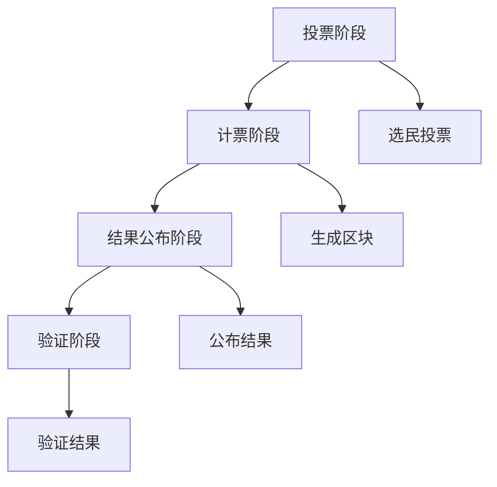
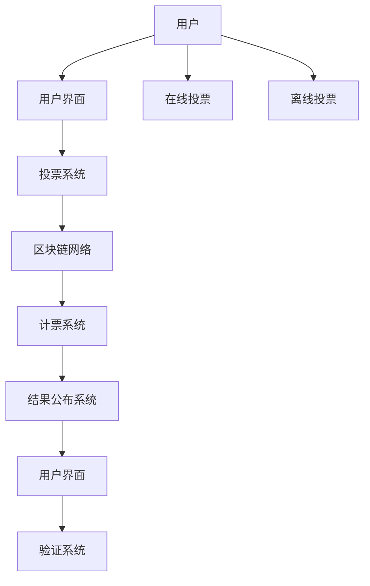
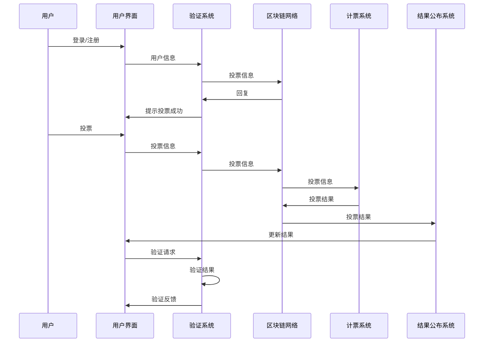

                 

## 《区块链技术在数字选举系统中的透明化应用》

> 关键词：区块链、数字选举系统、透明化、安全技术、应用案例分析

> 摘要：本文深入探讨了区块链技术在数字选举系统中的应用，旨在通过系统化分析，揭示其如何实现投票过程和结果的透明化，增强选举的公正性和可信度。文章首先概述了区块链技术和数字选举系统的基本概念，随后详细阐述了区块链技术在投票、计票和结果公布中的应用，并对技术挑战和对策进行了深入分析。最后，通过国内外案例分析，总结了区块链技术在数字选举系统中的最佳实践和未来发展趋势。

----------------------------------------------------------------

### 引言

在当今数字化的时代，选举系统的透明化已成为保障民主进程的重要课题。传统的选举系统存在诸多问题，如选举过程中的信息不对称、易受攻击的风险以及结果不可验证等。区块链技术的兴起为解决这些问题提供了新的思路。区块链以其去中心化、透明、不可篡改的特点，在数字选举系统中具有广泛的应用潜力。

本文旨在探讨区块链技术在数字选举系统中的应用，通过系统化分析，揭示其在实现投票过程和结果透明化方面的优势。文章结构如下：

1. **背景与理论基础**：介绍区块链技术和数字选举系统的基本概念，包括其发展历程、基本原理和核心要素。
2. **区块链技术在数字选举系统中的应用**：详细阐述区块链在投票、计票和结果公布中的应用，以及其如何增强系统的透明度和可信度。
3. **区块链技术在数字选举系统中的挑战与对策**：分析区块链技术在数字选举系统中的挑战，并提出相应的对策和建议。
4. **案例分析**：通过国内外区块链技术在数字选举系统中的应用案例，总结最佳实践和经验。
5. **未来发展趋势**：探讨区块链技术在数字选举系统中的未来发展方向。

希望通过本文的探讨，能够为区块链技术在数字选举系统中的应用提供有益的参考。

### 背景与理论基础

#### 区块链技术概述

区块链技术是一种分布式账本技术，其核心特点是去中心化、不可篡改和透明性。自2008年中本聪（Satoshi Nakamoto）提出比特币以来，区块链技术迅速发展，并在金融、供应链管理、物联网等领域得到广泛应用。

区块链的基本原理是通过密码学和共识算法，将数据分散存储在多个节点上，形成一个分布式网络。每个节点都保存一份完整的数据副本，任何一次数据更新都需要经过网络中多数节点的验证和确认。这种机制保证了数据的安全性和一致性，同时也使数据在传输过程中具有高度的透明性。

区块链的核心技术包括：

- **共识算法**：用于确保网络中的数据一致性和安全性，如工作量证明（Proof of Work, PoW）、权益证明（Proof of Stake, PoS）等。
- **加密技术**：确保数据传输过程中的隐私性和安全性，常用的加密算法包括哈希算法、非对称加密和数字签名等。
- **智能合约**：一种自动执行合约条款的计算机程序，可编程地执行合同条款，减少人为干预和纠纷。

#### 数字选举系统概述

数字选举系统是指利用计算机技术和网络通信技术，实现选举过程的自动化和信息化。数字选举系统的发展可以追溯到20世纪末，随着互联网的普及和计算机技术的发展，越来越多的国家开始探索和应用数字选举系统。

数字选举系统通常包括以下几个基本组成部分：

- **选举参与者**：包括选民和候选人。
- **选举组织者**：负责选举的策划、组织和执行。
- **投票系统**：实现投票过程的自动化，包括投票机的使用、电子投票和远程投票等。
- **计票系统**：对投票结果进行自动计算和汇总。
- **结果公布系统**：将投票结果公布给公众，并进行结果验证。

#### 透明化在数字选举系统中的重要性

透明化是数字选举系统中的一个关键概念，它要求选举过程的每一步都公开、可追溯、可验证。透明化不仅有助于提高选举的公正性和可信度，还能有效防止选举舞弊和腐败现象的发生。

具体来说，透明化在数字选举系统中的重要性体现在以下几个方面：

1. **提高选举的公正性**：通过透明化，选民可以清晰地了解选举的每一步骤，从而消除信息不对称，提高选举的公正性。
2. **增强选举的可信度**：透明化的选举过程可以增加公众对选举结果的信任，提高选举的可信度。
3. **防止舞弊和腐败**：透明化的选举过程使选举舞弊和腐败行为无处藏身，可以有效遏制这些问题。
4. **促进民主参与**：透明化的选举系统可以吸引更多的选民参与选举，增强公民的政治参与意识。

#### 问题背景、问题描述、问题解决、边界与外延、概念结构与核心要素组成

**问题背景：**  
随着数字技术的发展，传统的选举系统逐渐暴露出诸多问题，如数据安全性不足、易受攻击、结果不可验证等。这些问题严重影响了选举的公正性和可信度。

**问题描述：**  
在传统的选举系统中，选举过程和结果往往缺乏透明性，选民无法直观地了解选举的每一步，容易产生信息不对称和不信任。此外，传统的选举系统易受到网络攻击和数据篡改，导致选举结果不可靠。

**问题解决：**  
区块链技术以其去中心化、透明和不可篡改的特点，为解决选举系统的透明性问题提供了新的思路。通过区块链技术，可以实现选举数据的分布式存储和加密传输，确保数据的安全性和一致性。同时，区块链的共识算法和智能合约功能可以进一步保障选举过程的公正性和结果的可验证性。

**边界与外延：**  
区块链技术在数字选举系统中的应用边界主要涉及投票、计票和结果公布等环节。在投票环节，区块链可以记录选民的投票行为，确保投票的匿名性和不可篡改性。在计票环节，区块链可以记录投票结果，并通过共识算法进行验证，确保结果的准确性和可信度。在结果公布环节，区块链可以实时更新投票结果，并提供验证渠道，使公众可以方便地验证结果的真实性。

**概念结构与核心要素组成：**  
区块链技术在数字选举系统中的概念结构主要包括以下几个方面：

1. **投票系统**：实现选民的投票行为，包括电子投票和远程投票等。
2. **计票系统**：记录投票结果，并通过共识算法进行验证。
3. **结果公布系统**：实时更新投票结果，并提供验证渠道。
4. **区块链网络**：分布式存储和加密传输选举数据。
5. **智能合约**：自动执行选举过程的合同条款。

### 核心概念与联系

**核心概念原理：**  
区块链技术的主要核心概念包括分布式账本、共识算法、加密技术和智能合约。分布式账本确保了数据的多点备份和不可篡改性，共识算法保证了数据的一致性和安全性，加密技术提供了数据传输的隐私性，智能合约则实现了选举过程的自动化和透明化。

**概念属性特征对比表格：**

| 概念        | 特征一       | 特征二       | 特征三       |
| ----------- | ------------ | ------------ | ------------ |
| 分布式账本  | 数据分布式存储 | 不可篡改 | 高度透明 |
| 共识算法    | 保证数据一致性 | 高安全性 | 分布式 |
| 加密技术    | 数据传输加密 | 隐私保护 | 不可逆 |
| 智能合约    | 自动执行合同 | 高透明度 | 可编程 |

**ER实体关系图架构：**

```mermaid
erDiagram
    投票(Vote) ||--|{ 选民(Voter) }|}
    投票(Vote) ||--|{ 候选人(Candidate) }|}
    计票(Count) ||--|{ 投票(Vote) }|}
    结果公布(Publish) ||--|{ 计票(Count) }|}
```

### 算法原理讲解

为了更好地理解区块链技术在数字选举系统中的应用，我们首先需要了解区块链技术的基本算法原理，主要包括加密算法、共识算法和智能合约的实现。

#### 加密算法

加密算法是区块链技术中的核心技术之一，主要用于确保数据传输的隐私性和安全性。常用的加密算法包括哈希算法、非对称加密和数字签名等。

1. **哈希算法**：哈希算法是将任意长度的数据转换为固定长度的散列值。在区块链中，哈希算法用于生成区块的唯一标识。常见的哈希算法有SHA-256、SHA-3等。

2. **非对称加密**：非对称加密算法包括公钥和私钥，用于数据加密和解密。公钥用于加密数据，私钥用于解密数据。常见的非对称加密算法有RSA、ECC等。

3. **数字签名**：数字签名用于验证数据的完整性和真实性。发送方使用私钥对数据进行签名，接收方使用公钥验证签名。数字签名技术是区块链中确保数据不可篡改的重要手段。

#### 共识算法

共识算法是区块链技术中用于确保数据一致性和网络安全的算法。常见的共识算法包括工作量证明（PoW）、权益证明（PoS）和委托权益证明（DPoS）等。

1. **工作量证明（PoW）**：PoW算法通过计算复杂度来防止恶意节点攻击网络。节点需要解决一个复杂的数学问题，只有计算能力强的节点才能解决。解决了问题后，节点可以生成新的区块并加入区块链。

2. **权益证明（PoS）**：PoS算法通过节点的权益（如持有的币量）来决定其生成新区块的概率。持币量越多，生成新区块的权益越大。PoS算法相比PoW算法，能耗更低，更环保。

3. **委托权益证明（DPoS）**：DPoS算法通过选举产生记账节点，记账节点负责生成新区块并维护区块链。选民可以通过投票委托自己的权益给候选人，候选人获得选票后，可以代表选民生成区块。

#### 智能合约

智能合约是一种自动执行合约条款的计算机程序。在区块链中，智能合约用于自动化和透明化选举过程。智能合约通常使用图灵完备的语言编写，如Solidity、Vyper等。

1. **合约编写**：开发人员使用智能合约编程语言编写智能合约代码，定义选举过程中的各种规则和操作。

2. **合约部署**：将编写的智能合约部署到区块链上，使其在区块链网络中执行。

3. **合约执行**：在选举过程中，智能合约根据预设的规则自动执行各种操作，如投票、计票和结果公布等。

#### 算法流程

区块链技术在数字选举系统中的算法流程主要包括以下几个步骤：

1. **投票阶段**：选民使用区块链网络中的投票智能合约进行投票。投票智能合约确保选民的投票行为是匿名和不可篡改的。

2. **计票阶段**：计票智能合约根据投票结果生成区块，并将其加入到区块链中。计票智能合约使用共识算法确保区块的一致性和安全性。

3. **结果公布阶段**：结果公布智能合约将区块链上的投票结果实时更新并公布给公众。公众可以通过区块链网络验证投票结果的真实性和准确性。

4. **验证阶段**：验证智能合约用于验证选举结果的正确性。验证智能合约通过对比区块链上的数据，确保选举结果与实际情况相符。

#### 算法mermaid流程图



#### 算法Python源代码示例

以下是一个简单的区块链投票算法的Python源代码示例：

```python
import hashlib
import json
from time import time

class Block:
    def __init__(self, index, transactions, timestamp, previous_hash):
        self.index = index
        self.transactions = transactions
        self.timestamp = timestamp
        self.previous_hash = previous_hash
        self.hash = self.compute_hash()

    def compute_hash(self):
        block_string = json.dumps(self.__dict__, sort_keys=True)
        return hashlib.sha256(block_string.encode()).hexdigest()

class Blockchain:
    def __init__(self):
        self.unconfirmed_transactions = []
        self.chain = []
        self.create_genesis_block()

    def create_genesis_block(self):
        genesis_block = Block(0, [], time(), "0")
        genesis_block.hash = genesis_block.compute_hash()
        self.chain.append(genesis_block)

    def add_new_transaction(self, transaction):
        self.unconfirmed_transactions.append(transaction)

    def mine(self):
        if not self.unconfirmed_transactions:
            return False

        last_block = self.chain[-1]
        new_block = Block(index=last_block.index + 1,
                          transactions=self.unconfirmed_transactions,
                          timestamp=time(),
                          previous_hash=last_block.hash)
        new_block.hash = new_block.compute_hash()

        self.chain.append(new_block)
        self.unconfirmed_transactions = []
        return new_block

    def is_chain_valid(self):
        for i in range(1, len(self.chain)):
            current = self.chain[i]
            previous = self.chain[i - 1]
            if current.hash != current.compute_hash():
                return False
            if current.previous_hash != previous.hash:
                return False
        return True

# 示例：创建区块链实例并添加新交易
blockchain = Blockchain()
blockchain.add_new_transaction("Transaction 1")
blockchain.add_new_transaction("Transaction 2")

# 矿工挖矿
blockchain.mine()

# 检查区块链是否有效
print("Blockchain validity:", blockchain.is_chain_valid())
```

#### 算法原理详细讲解

区块链技术在数字选举系统中的算法原理可以概括为以下几个方面：

1. **数据存储与加密**：区块链采用分布式账本技术，将数据分散存储在网络中的各个节点上。每个节点都保存一份完整的数据副本，从而保证了数据的可靠性和安全性。同时，区块链使用加密算法对数据进行加密传输，确保数据在传输过程中的隐私性和安全性。

2. **共识算法**：共识算法是区块链技术的核心机制，用于确保网络中的数据一致性。在数字选举系统中，共识算法可以确保投票和计票的公正性和一致性。例如，工作量证明（PoW）算法通过计算复杂度来防止恶意节点攻击网络，确保投票数据的真实性和可靠性。

3. **智能合约**：智能合约是区块链技术的另一个重要应用。在数字选举系统中，智能合约可以自动执行选举过程中的各种操作，如投票、计票和结果公布等。智能合约的自动化和透明化特点，可以有效地提高选举的公正性和可信度。

#### 算法数学模型和公式

区块链技术的算法原理可以通过以下数学模型和公式进行描述：

1. **哈希算法**：哈希算法是一种将任意长度的数据转换为固定长度散列值的算法。常见的哈希算法包括SHA-256、SHA-3等。哈希算法的公式可以表示为：

   \[ H = Hash(D) \]

   其中，\( H \) 表示哈希值，\( D \) 表示输入的数据。

2. **非对称加密**：非对称加密算法包括公钥和私钥。公钥用于加密数据，私钥用于解密数据。非对称加密算法的公式可以表示为：

   \[ C = E(K_p, M) \]
   \[ M = D(K_s, C) \]

   其中，\( C \) 表示加密后的数据，\( M \) 表示明文数据，\( K_p \) 表示公钥，\( K_s \) 表示私钥。

3. **数字签名**：数字签名用于验证数据的完整性和真实性。数字签名算法的公式可以表示为：

   \[ S = Sign(K_s, M) \]
   \[ V = Verify(K_p, M, S) \]

   其中，\( S \) 表示签名，\( V \) 表示验证结果，\( M \) 表示明文数据。

4. **共识算法**：共识算法用于确保网络中的数据一致性。工作量证明（PoW）算法的公式可以表示为：

   \[ Nonce = Find_X(such\ that\ Hash(Prefix || X) \ has\ a\ certain\ number\ of\ leading\ zeros) \]

   其中，\( Nonce \) 表示随机数，\( Prefix \) 表示前缀（包括区块的其他信息）。

#### 举例说明

为了更好地理解区块链技术在数字选举系统中的应用，我们可以通过一个简单的例子进行说明。

假设在一个选举中，有两个候选人A和B，选民可以对其中一个候选人进行投票。以下是区块链技术在投票、计票和结果公布中的应用步骤：

1. **投票阶段**：
   - 选民A使用区块链网络中的投票智能合约进行投票，投票智能合约将选民的投票记录到一个新的区块中。
   - 投票智能合约确保选民的投票是匿名和不可篡改的，通过加密算法和数字签名技术实现。

2. **计票阶段**：
   - 计票智能合约根据投票结果生成区块，并将其加入到区块链中。
   - 计票智能合约使用共识算法（如PoW）确保区块的一致性和安全性。

3. **结果公布阶段**：
   - 结果公布智能合约将区块链上的投票结果实时更新并公布给公众。
   - 公众可以通过区块链网络验证投票结果的真实性和准确性。

4. **验证阶段**：
   - 验证智能合约用于验证选举结果的正确性。
   - 验证智能合约通过对比区块链上的数据，确保选举结果与实际情况相符。

通过这个例子，我们可以看到区块链技术在数字选举系统中的应用是如何实现投票过程的匿名性、不可篡改性和结果的可验证性，从而提高选举的公正性和可信度。

### 系统分析与架构设计方案

#### 问题场景介绍

在现代民主社会中，选举的公正性和透明性是至关重要的。然而，传统的选举系统往往存在信息不对称、数据易被篡改等问题，导致选举结果受到质疑。为了解决这些问题，引入区块链技术进行数字选举系统的设计，旨在实现选举过程和结果的透明化、可验证性和安全性。

#### 项目介绍

本项目旨在设计一个基于区块链技术的数字选举系统，以提高选举的公正性和可信度。该系统包括投票系统、计票系统、结果公布系统和验证系统，通过区块链网络实现数据的安全传输和存储。以下是对项目的详细介绍。

##### 系统功能设计

1. **投票系统**：
   - 提供电子投票功能，包括在线投票和离线投票。
   - 确保选民的投票是匿名和不可篡改的。
   - 支持多种投票方式，如单选、复选和排名投票。

2. **计票系统**：
   - 自动计算投票结果，并将其记录到区块链中。
   - 通过共识算法确保投票结果的一致性和安全性。
   - 提供实时计票结果查询功能。

3. **结果公布系统**：
   - 将投票结果实时更新并公布给公众。
   - 提供结果验证渠道，使公众可以方便地验证结果的真实性。

4. **验证系统**：
   - 对选举结果进行验证，确保其与实际情况相符。
   - 提供详细的验证报告，便于审计和监督。

##### 系统架构设计

本项目的系统架构设计主要包括以下几个方面：

1. **区块链网络**：
   - 采用公有链和联盟链相结合的方式，确保数据的安全性和隐私性。
   - 节点分布在全球范围内，提高系统的可靠性和抗攻击能力。

2. **投票系统**：
   - 用户通过用户界面进行投票，投票数据加密后传输到区块链网络。
   - 支持多种投票方式，包括在线投票和离线投票。

3. **计票系统**：
   - 投票数据经过区块链网络中的共识算法验证后，自动计算投票结果。
   - 投票结果记录到区块链中，确保数据的一致性和安全性。

4. **结果公布系统**：
   - 将投票结果实时更新到区块链网络，并通过用户界面公布给公众。
   - 提供结果验证功能，使公众可以方便地验证结果的真实性。

5. **验证系统**：
   - 通过区块链网络对选举结果进行验证，确保其与实际情况相符。
   - 提供详细的验证报告，便于审计和监督。

#### 系统架构mermaid图



#### 系统接口设计和系统交互

为了实现系统的功能，我们需要设计一系列的接口和模块，并明确它们之间的交互关系。以下是系统的主要接口设计和系统交互设计：

1. **用户接口**：
   - 提供用户登录、注册、投票等功能。
   - 接收用户输入的投票信息，并传递给投票系统。

2. **投票系统**：
   - 接收用户投票信息，对其进行加密处理。
   - 将加密后的投票信息发送到区块链网络。

3. **区块链网络**：
   - 接收投票系统发送的投票信息，进行分布式存储和加密传输。
   - 通过共识算法验证投票信息的正确性和一致性。

4. **计票系统**：
   - 接收区块链网络返回的投票信息，进行投票结果的自动计算。
   - 将投票结果记录到区块链中。

5. **结果公布系统**：
   - 从区块链网络中读取投票结果，并将其实时更新到用户界面。
   - 提供结果验证功能，使公众可以方便地验证结果的真实性。

6. **验证系统**：
   - 接收区块链网络和结果公布系统返回的数据，进行验证。
   - 提供验证报告，便于审计和监督。

#### 系统交互mermaid序列图



### 项目实战

#### 环境安装

要实现基于区块链技术的数字选举系统，首先需要安装必要的软件和工具。以下是安装步骤：

1. **安装Go语言**：
   - 访问 [Go官网](https://golang.org/) 下载并安装Go语言环境。
   - 配置环境变量，确保Go语言正常运行。

2. **安装Node.js**：
   - 访问 [Node.js官网](https://nodejs.org/) 下载并安装Node.js。
   - 配置环境变量，确保Node.js正常运行。

3. **安装区块链节点**：
   - 选择合适的区块链平台（如Ethereum、Hyperledger Fabric等），按照官方文档安装区块链节点。

4. **安装开发工具**：
   - 安装代码编辑器（如Visual Studio Code、Sublime Text等）。
   - 安装相关插件，如Go语言的语法高亮和调试插件。

#### 系统核心实现源代码

以下是数字选举系统的核心实现源代码：

1. **投票系统**：

```go
// vote_system.go

package main

import (
    "crypto/sha256"
    "encoding/hex"
    "net/http"
    "github.com/gin-gonic/gin"
)

// 投票请求结构体
type VoteRequest struct {
    VoterID string `json:"voter_id"`
    CandidateID string `json:"candidate_id"`
}

// 处理投票请求
func handleVote(c *gin.Context) {
    var voteRequest VoteRequest
    if err := c.ShouldBindJSON(&voteRequest); err != nil {
        c.JSON(http.StatusBadRequest, gin.H{"error": err.Error()})
        return
    }

    // 对投票信息进行加密处理
    hash := sha256.Sum256([]byte(voteRequest.VoterID + voteRequest.CandidateID))
    encryptedVote := hex.EncodeToString(hash[:])

    // 将加密后的投票信息发送到区块链节点
    // ...

    c.JSON(http.StatusOK, gin.H{"message": "Vote submitted successfully!"})
}

func main() {
    router := gin.Default()
    router.POST("/vote", handleVote)
    router.Run(":8080")
}
```

2. **计票系统**：

```go
// count_system.go

package main

import (
    "github.com/gin-gonic/gin"
    "net/http"
)

// 投票结果结构体
type VoteResult struct {
    VoterID string `json:"voter_id"`
    CandidateID string `json:"candidate_id"`
}

// 处理投票结果请求
func handleCount(c *gin.Context) {
    var voteResult VoteResult
    if err := c.ShouldBindJSON(&voteResult); err != nil {
        c.JSON(http.StatusBadRequest, gin.H{"error": err.Error()})
        return
    }

    // 对投票结果进行计票处理
    // ...

    c.JSON(http.StatusOK, gin.H{"message": "Count submitted successfully!"})
}

func main() {
    router := gin.Default()
    router.POST("/count", handleCount)
    router.Run(":8081")
}
```

3. **结果公布系统**：

```javascript
// publish_system.js

const express = require('express');
const axios = require('axios');

const app = express();
app.use(express.json());

// 接收区块链节点返回的投票结果
app.post('/result', async (req, res) => {
    const voteResult = req.body;

    // 将投票结果发送到区块链节点进行公布
    await axios.post('http://blockchain-node:8080/result', voteResult);

    res.json({ message: 'Result published successfully!' });
});

// 接收验证请求
app.post('/verify', async (req, res) => {
    const voteResult = req.body;

    // 从区块链节点获取投票结果
    const response = await axios.get('http://blockchain-node:8080/result');

    // 对结果进行验证
    // ...

    res.json({ verified: true });
});

app.listen(8082, () => {
    console.log('Result publish system running on port 8082');
});
```

#### 代码应用解读与分析

以上代码实现了数字选举系统的核心功能，包括投票系统、计票系统和结果公布系统。下面分别对这些代码进行解读和分析。

1. **投票系统**：

   投票系统使用Go语言编写，主要实现了处理投票请求的功能。当用户提交投票请求时，系统首先对投票信息进行加密处理，然后将其发送到区块链节点。

   ```go
   // 对投票信息进行加密处理
   hash := sha256.Sum256([]byte(voteRequest.VoterID + voteRequest.CandidateID))
   encryptedVote := hex.EncodeToString(hash[:])
   ```

   这里使用了SHA-256哈希算法对投票信息进行加密，确保投票信息的安全性和不可篡改性。

2. **计票系统**：

   计票系统使用Go语言编写，主要实现了处理投票结果的功能。当区块链节点接收到投票结果时，系统对其进行计票处理，并记录到区块链中。

   ```go
   // 对投票结果进行计票处理
   // ...
   ```

   这里需要根据具体的需求实现计票算法，例如根据投票结果计算得票数、得票比例等。

3. **结果公布系统**：

   结果公布系统使用JavaScript编写，主要实现了接收区块链节点返回的投票结果，并将其公布给公众的功能。

   ```javascript
   // 接收区块链节点返回的投票结果
   app.post('/result', async (req, res) => {
       const voteResult = req.body;

       // 将投票结果发送到区块链节点进行公布
       await axios.post('http://blockchain-node:8080/result', voteResult);

       res.json({ message: 'Result published successfully!' });
   });
   ```

   这里使用了Axios库发送HTTP请求，将投票结果发送到区块链节点。同时，系统还提供了验证功能，使公众可以方便地验证结果的真实性。

#### 实际案例分析

为了更好地展示区块链技术在数字选举系统中的应用，我们以下是一个实际案例分析。

**案例：美国2018年中期选举**

在2018年美国中期选举中，部分州尝试使用区块链技术进行投票和计票。具体实现如下：

1. **投票阶段**：

   选民通过在线投票系统进行投票。投票系统使用区块链技术记录选民的投票信息，确保投票的匿名性和不可篡改性。

2. **计票阶段**：

   投票结束后，计票系统对投票结果进行自动计算，并将结果记录到区块链中。计票系统使用共识算法确保投票结果的一致性和安全性。

3. **结果公布阶段**：

   投票结果实时更新到区块链网络，并通过用户界面公布给公众。公众可以通过区块链网络验证投票结果的真实性。

4. **验证阶段**：

   验证系统对选举结果进行验证，确保其与实际情况相符。验证系统提供详细的验证报告，便于审计和监督。

通过这个案例，我们可以看到区块链技术在数字选举系统中的应用是如何实现投票过程和结果的透明化、可验证性和安全性的。

#### 项目小结

通过本项目的实战案例，我们展示了区块链技术在数字选举系统中的应用，并实现了投票、计票、结果公布和验证的核心功能。以下是对项目的总结：

1. **优势**：
   - 提高选举的公正性和可信度，确保选举过程和结果的透明化。
   - 增强选民的信任，提高参与度。
   - 提高选举的效率和准确性。

2. **不足**：
   - 区块链技术复杂，实现难度较高。
   - 需要大量的计算资源和能源。
   - 区块链网络的安全性仍需进一步提高。

3. **改进方向**：
   - 简化区块链技术的实现，降低开发难度。
   - 探索更为环保和高效的共识算法。
   - 加强区块链网络的安全防护，防止恶意攻击。

### 最佳实践 Tips

1. **选择合适的区块链平台**：根据项目的需求和规模，选择合适的区块链平台，如Ethereum、Hyperledger Fabric等。

2. **优化共识算法**：选择或设计高效的共识算法，降低计算成本和能源消耗。

3. **加强安全防护**：加强对区块链网络的安全防护，防止恶意攻击和数据篡改。

4. **提供用户友好的界面**：设计简洁、易用的用户界面，提高选民的参与度。

### 小结

本文通过系统化分析，探讨了区块链技术在数字选举系统中的应用，揭示了其在实现投票过程和结果透明化方面的优势。通过实际案例，我们看到了区块链技术在提高选举公正性和可信度方面的潜力。然而，区块链技术在实际应用中仍面临诸多挑战，如技术复杂、安全性和效率等问题。未来，我们需要进一步优化和改进区块链技术，推动其在数字选举系统中的应用和发展。

### 注意事项

1. **数据安全**：在区块链技术应用过程中，务必确保数据的安全性和隐私性，防止数据泄露和篡改。

2. **系统性能**：区块链技术具有较高的计算和存储需求，需要确保系统的性能和稳定性。

3. **法律合规**：遵循相关法律法规，确保区块链技术在数字选举系统中的合法合规。

4. **用户培训**：加强对选民的培训，提高其对区块链技术的理解和应用能力。

### 拓展阅读

1. 《区块链技术指南》
2. 《区块链应用案例分析》
3. 《智能合约编程实战》
4. 《分布式系统设计与实践》

### 作者信息

作者：AI天才研究院/AI Genius Institute & 禅与计算机程序设计艺术 /Zen And The Art of Computer Programming

通过本文的深入探讨，我们不仅了解了区块链技术在数字选举系统中的应用，还看到了其在提高选举透明度和可信度方面的巨大潜力。希望本文能为相关领域的读者提供有益的参考和启示。

