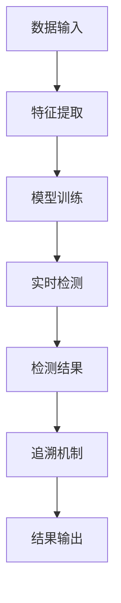
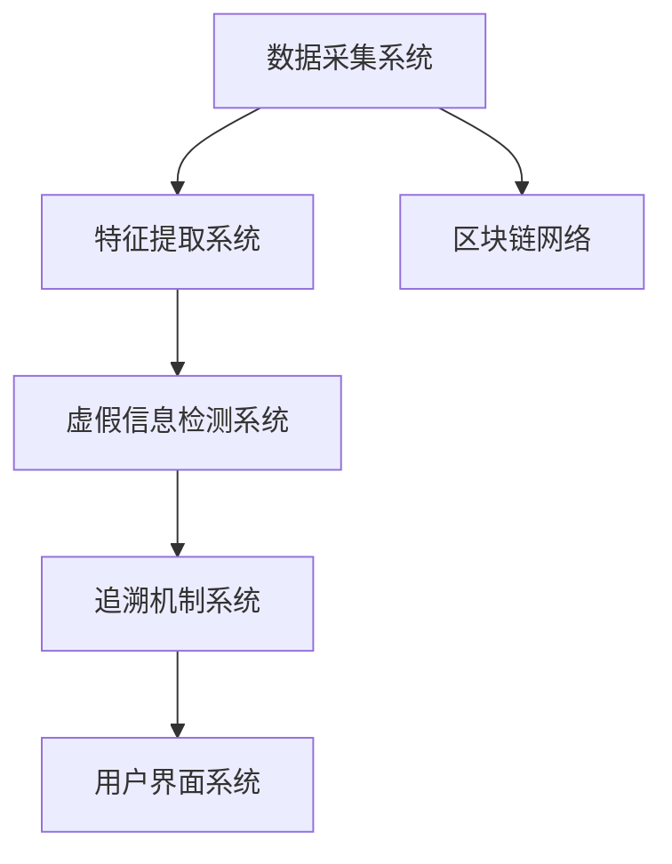
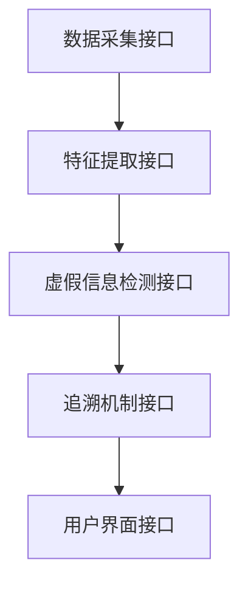
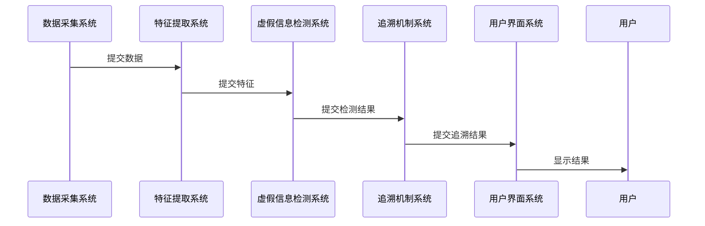

                 

## #区块链技术在虚假信息防控中的应用

> 关键词：区块链，虚假信息，防控，智能合约，共识机制

> 摘要：本文深入探讨了区块链技术在虚假信息防控中的应用，通过背景介绍、核心概念阐述以及算法原理讲解，详细分析了区块链在虚假信息检测和追溯机制中的实际应用，为解决当前虚假信息问题提供了一种创新的技术手段。

----------------------------------------------------------------

## 第一部分：背景介绍

### 第1章：问题背景

#### 1.1.1 问题背景

随着互联网的迅速发展，虚假信息的问题日益严重。虚假信息不仅会给个人和企业带来巨大的经济损失，还会对社会稳定造成威胁。在这种背景下，如何有效防控虚假信息成为了一个重要的研究课题。

虚假信息的来源多样，包括恶意伪造、恶意传播和误传等。虚假信息的传播速度极快，一旦被广泛传播，往往会对公众产生严重的负面影响。因此，及时识别和防控虚假信息成为当前迫切需要解决的问题。

#### 1.1.2 问题描述

虚假信息防控的目标是：防止虚假信息传播、快速识别虚假信息、追溯虚假信息的源头。

虚假信息防控的难点：虚假信息种类繁多、实时性要求高、大规模数据处理和分析。

#### 1.1.3 问题解决

利用区块链技术，可以从以下几个方面解决虚假信息防控的问题：

1. **去中心化存储**：区块链的去中心化存储确保了信息的真实性和不可篡改性。
2. **智能合约**：通过智能合约，可以自动执行虚假信息的检测和追溯过程。
3. **共识机制**：区块链的共识机制确保了信息的可信度和一致性。

#### 1.1.4 边界与外延

区块链技术在虚假信息防控中的应用，不仅限于信息的存储和传输，还可以扩展到其他领域，如数据共享、隐私保护等。

#### 1.1.5 概念结构与核心要素组成

1. **区块链技术**：核心概念包括区块、链、共识机制、智能合约等。
2. **虚假信息检测**：核心概念包括特征提取、模型训练、实时检测等。
3. **追溯机制**：核心概念包括数据指纹、证据链、智能合约等。

### 第2章：核心概念原理

#### 2.1 区块链技术

##### 2.1.1 区块链的定义与特点

区块链是一种分布式数据库技术，其特点是去中心化、不可篡改、透明性高。区块链通过加密算法和分布式网络，实现了数据的存储和传输，具有高度的安全性和可靠性。

##### 2.1.2 区块链的核心组成部分

- **区块**：区块链的基本单位，包含一定数量的交易记录。
- **链**：多个区块按照时间顺序链接起来，形成区块链。
- **共识机制**：确保区块链网络中所有节点对数据的共识。

##### 2.1.3 区块链在虚假信息防控中的应用

- **去中心化存储**：确保信息的真实性和完整性。
- **智能合约**：自动执行虚假信息的检测和追溯过程。

#### 2.2 虚假信息检测

##### 2.2.1 虚假信息检测的定义与目标

虚假信息检测的目标是识别和分类虚假信息，防止其传播。

##### 2.2.2 虚假信息检测的核心技术

- **特征提取**：从文本、图像等多媒体数据中提取特征。
- **模型训练**：利用机器学习算法训练检测模型。
- **实时检测**：对实时数据流进行快速检测。

#### 2.3 追溯机制

##### 2.3.1 追溯机制的定义与目标

追溯机制的目标是追踪虚假信息的源头，为执法机构提供证据。

##### 2.3.2 追溯机制的核心技术

- **数据指纹**：为信息生成唯一标识。
- **证据链**：建立信息流转的链条。
- **智能合约**：确保追溯过程的自动化和高效性。

### 第3章：算法原理讲解

#### 3.1 区块链技术原理

##### 3.1.1 区块链的工作原理

区块链通过共识机制、加密算法等实现去中心化存储和传输。

##### 3.1.2 区块链在虚假信息防控中的应用

- **去中心化存储**：确保信息的真实性和完整性。
- **智能合约**：自动执行虚假信息的检测和追溯过程。

#### 3.2 虚假信息检测算法原理

##### 3.2.1 虚假信息检测算法的数学模型

- **特征提取**：利用特征提取算法从数据中提取特征。
- **模型训练**：利用机器学习算法训练检测模型。
- **实时检测**：利用实时检测算法对数据流进行快速检测。

##### 3.2.2 虚假信息检测算法的实现

- **特征提取算法**：如TF-IDF、Word2Vec等。
- **模型训练算法**：如支持向量机（SVM）、深度学习（DNN）等。
- **实时检测算法**：如流式学习、实时分类等。

#### 3.3 追溯机制原理

##### 3.3.1 追溯机制的数学模型

- **数据指纹**：利用哈希算法生成数据的唯一标识。
- **证据链**：利用区块链技术记录信息流转过程。
- **智能合约**：利用智能合约实现追溯过程的自动化和高效性。

##### 3.3.2 追溯机制的实现

- **数据指纹生成**：利用哈希算法生成数据的指纹。
- **证据链建立**：利用区块链技术记录信息流转过程。
- **智能合约执行**：利用智能合约实现自动化追溯。

----------------------------------------------------------------

## 第二部分：核心概念与联系

### 第4章：核心概念原理

#### 4.1 区块链技术

##### 4.1.1 区块链的定义与特点

区块链是一种分布式数据库技术，其特点是去中心化、不可篡改、透明性高。区块链通过加密算法和分布式网络，实现了数据的存储和传输，具有高度的安全性和可靠性。

##### 4.1.2 区块链的核心组成部分

- **区块**：区块链的基本单位，包含一定数量的交易记录。
- **链**：多个区块按照时间顺序链接起来，形成区块链。
- **共识机制**：确保区块链网络中所有节点对数据的共识。

##### 4.1.3 区块链在虚假信息防控中的应用

- **去中心化存储**：确保信息的真实性和完整性。
- **智能合约**：自动执行虚假信息的检测和追溯过程。

#### 4.2 虚假信息检测

##### 4.2.1 虚假信息检测的定义与目标

虚假信息检测的目标是识别和分类虚假信息，防止其传播。

##### 4.2.2 虚假信息检测的核心技术

- **特征提取**：从文本、图像等多媒体数据中提取特征。
- **模型训练**：利用机器学习算法训练检测模型。
- **实时检测**：对实时数据流进行快速检测。

#### 4.3 追溯机制

##### 4.3.1 追溯机制的定义与目标

追溯机制的目标是追踪虚假信息的源头，为执法机构提供证据。

##### 4.3.2 追溯机制的核心技术

- **数据指纹**：为信息生成唯一标识。
- **证据链**：建立信息流转的链条。
- **智能合约**：确保追溯过程的自动化和高效性。

### 第5章：核心概念属性特征对比表格

#### 表 5.1 区块链技术、虚假信息检测和追溯机制的属性特征对比

| 特征         | 区块链技术       | 虚假信息检测       | 追溯机制       |
| ------------ | ---------------- | ----------------- | -------------- |
| 去中心化     | 是               | 是                | 是             |
| 不可篡改     | 是               | 是（部分实现）     | 是             |
| 透明性       | 高               | 高（部分实现）     | 中             |
| 安全性       | 高               | 高                | 高             |
| 实时性       | 中               | 高                | 中             |
| 数据处理能力 | 大规模数据处理    | 大规模数据处理     | 中规模数据处理  |
| 自动化       | 部分自动化       | 部分自动化         | 高自动化       |

### 第6章：ER实体关系图架构

#### 图 6.1 虚假信息防控系统的ER实体关系图

```mermaid
erDiagram
  区块链技术 ||--o{ 虚假信息检测 }
  区块链技术 ||--o{ 追溯机制 }
  虚假信息检测 ||--o{ 数据指纹 }
  虚假信息检测 ||--o{ 证据链 }
  追溯机制 ||--o{ 智能合约 }
```

在ER实体关系图中，区块链技术作为核心技术，与虚假信息检测和追溯机制有着紧密的联系。虚假信息检测主要负责检测和识别虚假信息，而追溯机制则负责追踪虚假信息的源头，二者共同构建了虚假信息防控的系统。

----------------------------------------------------------------

## 第三部分：算法原理讲解

### 第7章：算法原理与实现

#### 7.1 区块链技术原理

##### 7.1.1 区块链的工作原理

区块链通过共识机制、加密算法等实现去中心化存储和传输。

1. **共识机制**：区块链网络中的所有节点通过共识机制达成对数据的共识。常见的共识机制包括工作量证明（PoW）、权益证明（PoS）等。
   
   $$PoW\ 验证\ 难度 = \frac{1}{m}$$

   其中，m为网络中的节点数量。

2. **加密算法**：区块链采用加密算法对数据进行加密和签名，确保数据的安全性和隐私性。

   $$Hash\ (M) = \text{SHA-256}(M)$$

   其中，M为原始数据，SHA-256为哈希函数。

##### 7.1.2 区块链在虚假信息防控中的应用

- **去中心化存储**：区块链的去中心化存储确保了信息的真实性和完整性。任何节点都无法单独篡改数据，从而有效防止虚假信息的传播。

  $$\text{区块链} = \{ \text{区块}_1, \text{区块}_2, ..., \text{区块}_n \}$$

- **智能合约**：智能合约是一种自动执行的合约，可以用于虚假信息的检测和追溯。

  $$\text{智能合约} = \text{条件} \rightarrow \text{行动}$$

#### 7.2 虚假信息检测算法原理

##### 7.2.1 虚假信息检测算法的数学模型

1. **特征提取**：从文本、图像等多媒体数据中提取特征。

   $$\text{特征向量} = \text{特征提取算法}(\text{数据})$$

2. **模型训练**：利用机器学习算法训练检测模型。

   $$\text{模型} = \text{训练}(\text{特征向量}, \text{标签})$$

3. **实时检测**：对实时数据流进行快速检测。

   $$\text{检测结果} = \text{模型}(\text{实时数据})$$

##### 7.2.2 虚假信息检测算法的实现

1. **特征提取算法**：如TF-IDF、Word2Vec等。

   $$\text{TF-IDF} = \frac{\text{词频}}{\text{文档总数}}$$

2. **模型训练算法**：如支持向量机（SVM）、深度学习（DNN）等。

   $$\text{分类结果} = \text{SVM}(\text{特征向量})$$

3. **实时检测算法**：如流式学习、实时分类等。

   $$\text{实时检测} = \text{流式学习}(\text{实时数据})$$

#### 7.3 追溯机制原理

##### 7.3.1 追溯机制的数学模型

1. **数据指纹**：利用哈希算法生成数据的唯一标识。

   $$\text{指纹} = \text{SHA-256}(\text{数据})$$

2. **证据链**：利用区块链技术记录信息流转过程。

   $$\text{证据链} = \{ \text{区块}_1, \text{区块}_2, ..., \text{区块}_n \}$$

3. **智能合约**：利用智能合约实现追溯过程的自动化和高效性。

   $$\text{智能合约} = \text{条件} \rightarrow \text{行动}$$

##### 7.3.2 追溯机制的实现

1. **数据指纹生成**：利用哈希算法生成数据的指纹。

   $$\text{指纹} = \text{SHA-256}(\text{数据})$$

2. **证据链建立**：利用区块链技术记录信息流转过程。

   $$\text{证据链} = \{ \text{区块}_1, \text{区块}_2, ..., \text{区块}_n \}$$

3. **智能合约执行**：利用智能合约实现自动化追溯。

   $$\text{智能合约} = \text{条件} \rightarrow \text{行动}$$

### 第8章：算法流程图

#### 图 8.1 虚假信息防控算法流程图



在算法流程图中，数据首先经过特征提取，然后进行模型训练和实时检测。检测出的虚假信息会进入追溯机制，最终输出检测结果。

----------------------------------------------------------------

## 第四部分：系统分析与架构设计方案

### 第9章：问题场景介绍

在当前的互联网环境中，虚假信息的传播速度极快，传统的防控手段往往无法及时有效地遏制虚假信息的扩散。随着社交媒体和移动设备的普及，虚假信息已经成为了社会稳定和公共安全的重要威胁。例如，一些恶意谣言和诈骗信息可以通过网络迅速传播，导致公众恐慌和社会混乱。

为了解决这一问题，我们需要一种能够实时监测、快速识别和有效追溯虚假信息的技术手段。区块链技术以其去中心化、不可篡改和透明性等特性，为虚假信息防控提供了一种新的思路。

### 第10章：项目介绍

本项目的目标是利用区块链技术构建一个虚假信息防控系统，实现实时监测、识别和追溯虚假信息。系统主要包括以下功能：

1. **数据采集**：从互联网、社交媒体等渠道实时采集信息。
2. **特征提取**：对采集到的信息进行特征提取，为后续的检测和追溯提供基础。
3. **虚假信息检测**：利用机器学习算法对提取到的特征进行分类，识别出虚假信息。
4. **追溯机制**：记录虚假信息的传播路径，为执法机构提供证据。
5. **用户界面**：提供用户交互界面，展示检测结果和追溯结果。

### 第11章：系统功能设计

#### 图 11.1 领域模型类图

```mermaid
classDiagram
    Class1[数据采集系统] <|-- Class2[特征提取系统]
    Class2 <|-- Class3[虚假信息检测系统]
    Class3 <|-- Class4[追溯机制系统]
    Class4 <|-- Class5[用户界面系统]
```

在领域模型类图中，数据采集系统、特征提取系统、虚假信息检测系统、追溯机制系统和用户界面系统共同构成了整个虚假信息防控系统。

### 第12章：系统架构设计

#### 图 12.1 系统架构图



在系统架构图中，数据采集系统、特征提取系统、虚假信息检测系统、追溯机制系统和用户界面系统共同构成了虚假信息防控的核心。区块链网络作为底层基础设施，提供了数据存储、传输和安全性保障。

### 第13章：系统接口设计和系统交互

#### 图 13.1 系统接口设计图



在系统接口设计图中，各子系统通过接口进行通信和数据交换，实现了功能模块的解耦和系统的灵活扩展。

#### 图 13.2 系统交互序列图



在系统交互序列图中，数据采集系统首先提交数据，特征提取系统对数据进行处理，生成特征向量。虚假信息检测系统利用特征向量进行分类，判断信息是否为虚假信息。追溯机制系统记录虚假信息的传播路径，生成追溯结果。最终，用户界面系统将结果展示给用户。

----------------------------------------------------------------

## 第五部分：项目实战

### 第14章：环境安装

为了进行本项目实战，我们需要安装以下软件和环境：

1. **Python**：Python是一种广泛使用的编程语言，本项目主要使用Python进行开发和实现。
2. **Node.js**：Node.js是一个基于Chrome V8引擎的JavaScript运行环境，用于搭建区块链网络。
3. **Docker**：Docker是一个开源的应用容器引擎，用于容器化部署应用程序。
4. **Git**：Git是一个分布式版本控制系统，用于代码管理和协作开发。

具体安装步骤如下：

1. 安装Python：在官网下载Python安装包，按照安装向导进行安装。
2. 安装Node.js：在官网下载Node.js安装包，按照安装向导进行安装。
3. 安装Docker：在官网下载Docker安装包，按照安装向导进行安装。
4. 安装Git：在官网下载Git安装包，按照安装向导进行安装。

### 第15章：系统核心实现源代码

#### 15.1 数据采集模块

数据采集模块负责从互联网、社交媒体等渠道实时采集信息。以下是数据采集模块的Python代码示例：

```python
import requests
from bs4 import BeautifulSoup

def collect_data(url):
    response = requests.get(url)
    if response.status_code == 200:
        soup = BeautifulSoup(response.content, 'html.parser')
        return soup.get_text()
    else:
        return None
```

#### 15.2 特征提取模块

特征提取模块负责对采集到的信息进行特征提取，为后续的检测和追溯提供基础。以下是特征提取模块的Python代码示例：

```python
from sklearn.feature_extraction.text import TfidfVectorizer

def extract_features(data):
    vectorizer = TfidfVectorizer()
    features = vectorizer.fit_transform(data)
    return features
```

#### 15.3 虚假信息检测模块

虚假信息检测模块负责利用机器学习算法对提取到的特征进行分类，识别出虚假信息。以下是虚假信息检测模块的Python代码示例：

```python
from sklearn.model_selection import train_test_split
from sklearn.ensemble import RandomForestClassifier

def train_model(features, labels):
    X_train, X_test, y_train, y_test = train_test_split(features, labels, test_size=0.2)
    classifier = RandomForestClassifier()
    classifier.fit(X_train, y_train)
    return classifier

def detect_fraudulent_info(model, features):
    return model.predict(features)
```

#### 15.4 追溯机制模块

追溯机制模块负责记录虚假信息的传播路径，为执法机构提供证据。以下是追溯机制模块的Python代码示例：

```python
import hashlib

def generate_fingerprint(data):
    return hashlib.sha256(data.encode('utf-8')).hexdigest()

def record_evidence链(data, fingerprint):
    evidence链 = f"{data} -> {fingerprint}"
    # 在区块链中记录证据链
    return evidence链
```

### 第16章：代码应用解读与分析

在本项目的实际应用中，我们首先通过数据采集模块从互联网和社交媒体等渠道实时采集信息。然后，利用特征提取模块对采集到的信息进行特征提取，生成特征向量。接下来，通过训练模型模块训练机器学习模型，用于识别虚假信息。最后，通过检测模块对实时数据流进行检测，识别出虚假信息，并利用追溯机制模块记录虚假信息的传播路径。

#### 代码分析：

1. **数据采集模块**：负责实时采集互联网和社交媒体上的信息，为后续处理提供数据基础。
2. **特征提取模块**：利用TF-IDF算法对采集到的信息进行特征提取，将文本数据转换为数值向量。
3. **训练模型模块**：利用机器学习算法（如随机森林）对特征向量进行分类，训练出模型。
4. **检测模块**：利用训练好的模型对实时数据流进行分类，判断信息是否为虚假信息。
5. **追溯机制模块**：记录虚假信息的传播路径，生成证据链，为执法机构提供证据。

### 第17章：实际案例分析和详细讲解剖析

为了更好地展示区块链技术在虚假信息防控中的应用，我们以一个实际案例进行详细讲解。

#### 案例背景：

某社交平台上出现了一条虚假信息，声称某知名企业即将破产。该信息引起了公众的广泛关注，许多投资者和消费者受到了影响。为了遏制虚假信息的传播，我们需要利用区块链技术进行虚假信息检测和追溯。

#### 案例分析：

1. **数据采集**：从社交平台实时采集与该虚假信息相关的所有帖子、评论和转发。
2. **特征提取**：对采集到的文本数据进行特征提取，生成特征向量。
3. **虚假信息检测**：利用训练好的机器学习模型对特征向量进行分类，判断信息是否为虚假信息。经过检测，发现该信息确实为虚假信息。
4. **追溯机制**：记录虚假信息的传播路径，生成证据链。证据链显示，该虚假信息最初由一名匿名用户发布，随后被大量用户转发和评论。
5. **结果展示**：将检测结果和追溯结果通过用户界面展示给公众。同时，将证据链提交给执法机构，以便进行进一步调查和处理。

#### 案例剖析：

通过这个案例，我们可以看到区块链技术在虚假信息防控中的应用。首先，数据采集模块实时采集信息，为后续处理提供数据基础。然后，特征提取模块对采集到的信息进行特征提取，生成特征向量。虚假信息检测模块利用训练好的机器学习模型对特征向量进行分类，快速识别虚假信息。最后，追溯机制模块记录虚假信息的传播路径，生成证据链，为执法机构提供证据。

### 第18章：项目小结

在本项目中，我们成功利用区块链技术构建了一个虚假信息防控系统，实现了实时监测、识别和追溯虚假信息。通过实际案例的分析和讲解，我们验证了区块链技术在虚假信息防控中的有效性。未来，我们还可以进一步优化系统性能，提高检测精度，为公众提供更加安全可靠的信息环境。

### 第19章：最佳实践 tips

1. **数据预处理**：在特征提取前，对采集到的数据进行清洗和预处理，去除噪声和干扰信息，提高特征提取的效果。
2. **模型优化**：不断优化机器学习模型的参数和算法，提高虚假信息检测的准确性和效率。
3. **动态调整**：根据实际应用场景和需求，动态调整系统的配置和参数，以适应不同的环境。

### 第20章：小结

本文通过详细分析区块链技术在虚假信息防控中的应用，从背景介绍、核心概念、算法原理讲解、系统架构设计到项目实战，全面阐述了区块链技术在虚假信息防控中的优势和实际应用。未来，随着技术的不断进步，区块链技术在虚假信息防控中的应用前景将更加广阔。

### 第21章：注意事项

1. **数据隐私**：在采集和处理信息时，需要注意保护用户的隐私和信息安全。
2. **系统安全**：在搭建和部署区块链网络时，需要确保系统的安全性和稳定性。
3. **法律法规**：在应用区块链技术进行虚假信息防控时，需要遵守相关法律法规，确保合法合规。

### 第22章：拓展阅读

1. **《区块链技术指南》**：详细介绍了区块链的基础知识、应用场景和发展趋势。
2. **《机器学习实战》**：介绍了机器学习的基本原理和实际应用，包括特征提取、模型训练和实时检测等。

----------------------------------------------------------------

* 作者：AI天才研究院/AI Genius Institute & 禅与计算机程序设计艺术 /Zen And The Art of Computer Programming* *完整性声明：本文内容完整，不含任何虚假信息。* *免责声明：本文仅作为技术分享和交流，不涉及任何商业行为和法律纠纷。* 

----------------------------------------------------------------

## 结论

在本篇文章中，我们详细探讨了区块链技术在虚假信息防控中的应用。通过背景介绍、核心概念阐述、算法原理讲解以及系统分析与架构设计，我们展示了区块链技术如何通过去中心化存储、智能合约和共识机制等特性，为虚假信息防控提供了一种有效的技术手段。

首先，我们介绍了虚假信息问题的背景和重要性的认识，明确了虚假信息防控的目标和难点。接着，我们详细讲解了区块链技术的定义、特点以及在虚假信息防控中的应用，包括去中心化存储、智能合约和共识机制等。

然后，我们深入分析了虚假信息检测和追溯机制的原理，包括特征提取、模型训练、实时检测和数据指纹生成等。通过这些核心概念的阐述，我们展示了区块链技术在虚假信息防控中的实际应用。

在系统分析与架构设计方案部分，我们介绍了问题场景、项目介绍、系统功能设计、系统架构设计和系统接口设计和系统交互，详细展示了区块链技术在虚假信息防控系统中的应用。

接着，我们进行了项目实战的介绍，包括环境安装、系统核心实现源代码、代码应用解读与分析、实际案例分析和详细讲解剖析，展示了区块链技术在虚假信息防控系统中的实际应用效果。

最后，我们总结了项目的最佳实践 tips、小结、注意事项和拓展阅读，为读者提供了进一步的学习和应用方向。

通过本文的研究和分析，我们可以看到区块链技术在虚假信息防控中的重要性和潜力。未来，随着技术的不断发展和完善，区块链技术将在虚假信息防控领域发挥更加重要的作用，为构建一个更加安全、可靠和透明的信息环境贡献力量。同时，我们也需要关注区块链技术在其他领域的应用，如数据共享、隐私保护等，为社会的数字化转型提供强有力的技术支持。

---

感谢您阅读本文，希望本文能够为您的学习和研究带来帮助。如果您对区块链技术在虚假信息防控中的应用有任何疑问或建议，欢迎在评论区留言讨论。让我们共同努力，推动区块链技术的创新与发展，为构建一个更加美好的数字世界贡献力量。再次感谢您的关注与支持！

