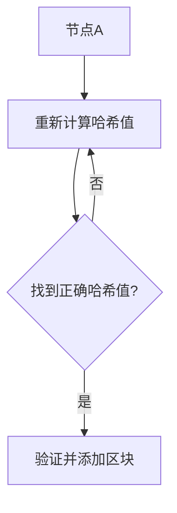
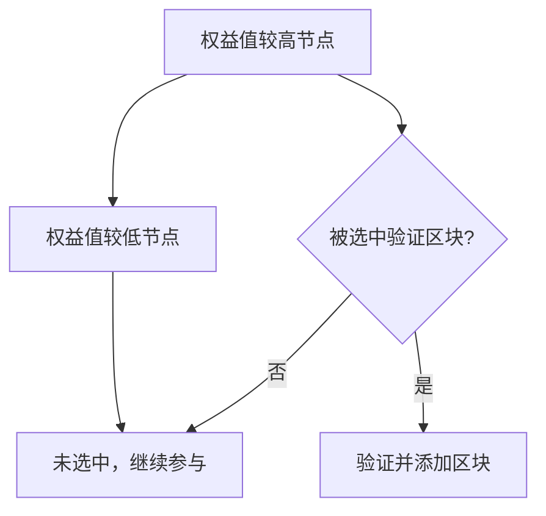
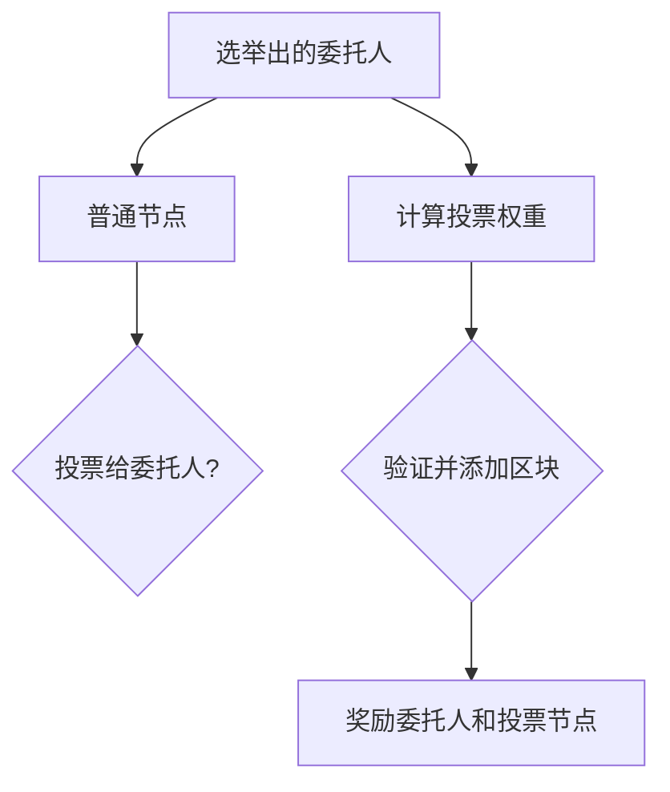

                 

## 引言

### 1.1 跨境支付背景

跨境支付是指在不同国家和地区之间的货币交换过程。随着全球化和数字经济的加速发展，跨境支付的需求日益增长。然而，传统的跨境支付系统却面临着诸多问题，如交易成本高、处理速度慢、跨境支付风险大等。这些问题的存在，严重影响了跨境支付效率和用户体验。

首先，传统跨境支付系统通常依赖于多个中介机构，如银行、支付网关等，这导致了交易成本的高昂。以国际信用卡支付为例，每次交易都需要支付高额的手续费，这使得跨境支付变得更加昂贵。

其次，传统跨境支付系统的处理速度较慢。例如，国际电汇通常需要数天甚至数周的时间来完成交易，这对于需要即时支付的跨境交易来说，无疑是一个巨大的障碍。

最后，跨境支付风险也是一个不容忽视的问题。由于涉及不同国家和地区的法律和监管环境，跨境支付过程可能受到各种不确定因素的影响，如汇率波动、政策变动等。

### 1.2 区块链技术概述

区块链技术是一种分布式数据库技术，其核心特点是去中心化、不可篡改和透明性。区块链通过将交易记录分散存储在多个节点上，从而实现了一种无需中介的交易方式。

区块链的基本原理是通过一种共识机制来确保所有节点对交易的认可。在区块链中，每个交易都会被打包成一个区块，并附加到一个区块链上。当一个新的区块被创建时，它会通过共识机制被验证并添加到区块链上。

区块链网络结构通常由多个节点组成，每个节点都维护一个完整的区块链副本。这些节点通过一种共识算法来确保区块链的一致性。常见的共识算法包括工作量证明（PoW）、权益证明（PoS）和委托权益证明（DPoS）等。

### 1.3 区块链在跨境支付中的潜在优势

区块链技术在跨境支付中具有显著的潜在优势。首先，区块链的去中心化特性可以降低跨境支付的交易成本。由于无需依赖中介机构，交易可以直接在区块链上进行，从而减少了交易费用。

其次，区块链的快速交易速度可以显著提高跨境支付的效率。在区块链上，交易可以在几分钟甚至几秒钟内完成，这大大缩短了跨境支付的处理时间。

最后，区块链的不可篡改性和透明性可以增强跨境支付的安全性和信任度。所有交易记录都存储在区块链上，并且一旦记录下来就无法更改，这保证了交易的真实性和可信度。

### 1.4 书籍结构概述

本书将按照以下结构进行组织：

1. **引言**：介绍跨境支付和区块链技术的背景，并阐述本书的研究目的和结构。

2. **区块链技术基础**：详细解释区块链的基本原理、网络结构、智能合约和共识机制。

3. **区块链技术在跨境支付中的应用**：探讨区块链技术在跨境支付中的实际应用，包括案例研究和创新应用。

4. **区块链技术在跨境支付中的挑战**：分析区块链技术在跨境支付中面临的挑战，如安全性和法律合规问题。

5. **区块链技术在跨境支付中的最佳实践**：提供确保安全和隐私的解决方案、政策法规合规策略以及技术创新与应用案例。

6. **未来发展趋势与展望**：探讨区块链技术在跨境支付中的未来发展，以及与其他技术的融合趋势。

7. **总结与展望**：总结本书的主要结论，提出不足与改进方向，并对未来研究提出建议。

通过本书的阅读，读者可以全面了解区块链技术在跨境支付中的应用，以及其在解决传统跨境支付问题方面的潜力。同时，本书也旨在为区块链技术在跨境支付领域的进一步研究和应用提供参考。

## 第2章 区块链技术基础

### 2.1 区块链基本原理

区块链是一种分布式数据库技术，其核心思想是去中心化，通过多个节点共同维护一个共享的账本，确保账本的一致性和安全性。每个区块链上的数据都被分散存储在每个参与节点的计算机上，而不是集中在一个中心化的服务器上。

区块链上的数据以区块的形式存储。每个区块包含一定数量的交易记录，这些交易记录被加密并链接到之前的区块，形成一个不可篡改的区块链。每个区块都有一个唯一的标识，称为哈希值，哈希值是通过加密算法计算得到的。通过哈希值，区块链确保了每个区块的不可篡改性。如果试图修改某个区块的数据，整个区块链的哈希值链都会被破坏，从而被其他节点识别并拒绝。

区块链的去中心化特性使其具有较高的安全性和透明性。在区块链上，所有交易记录都是公开透明的，任何人都可以查看区块链上的数据。然而，由于区块链的加密特性，交易数据的隐私性也得到了保障。

### 2.2 区块链网络结构

区块链网络由多个节点组成，每个节点都是区块链系统的一部分。节点可以是个人电脑、服务器或者其他设备。每个节点都维护一个完整的区块链副本，并参与区块链网络的共识过程。

区块链网络的基本结构包括以下几个部分：

1. **节点**：每个节点都包含一个区块链副本，负责存储和验证交易数据。
2. **区块**：区块是区块链的基本数据单元，包含一定数量的交易记录。
3. **链**：链是由一系列按时间顺序排列的区块组成的，确保了数据的完整性和一致性。
4. **共识机制**：共识机制是区块链网络中节点达成一致的方法。常见的共识机制包括工作量证明（PoW）、权益证明（PoS）和委托权益证明（DPoS）等。

节点之间的交互是通过P2P网络进行的。每个节点都会与其他节点进行通信，共享交易数据，并共同维护区块链的一致性。当一个新的区块被创建时，它会通过共识机制被验证并添加到区块链上。

### 2.3 智能合约原理

智能合约是区块链上的自动执行合同，它通过代码定义了一组规则和条件，当这些条件被满足时，智能合约会自动执行相应的操作。智能合约是区块链技术的重要应用之一，它使得区块链不仅限于交易记录的存储，还可以实现更复杂的业务逻辑。

智能合约的基本原理是，当一个新的交易记录被提交到区块链时，它会触发智能合约的执行。智能合约通过编程语言（如Solidity）编写，并在区块链上进行编译和部署。部署后的智能合约可以永久存储在区块链上，并且只能通过满足特定条件来执行。

智能合约的执行过程通常包括以下几个步骤：

1. **输入验证**：智能合约在执行之前会验证交易输入，确保输入数据满足预定义的条件。
2. **执行操作**：根据输入验证的结果，智能合约会执行相应的操作，如转移资产、记录事件等。
3. **状态更新**：智能合约执行后，会更新区块链上的状态，如修改账户余额、记录事件日志等。

智能合约的应用范围非常广泛，从简单的数字资产管理到复杂的金融衍生品，都可以通过智能合约实现。

### 2.4 共识机制详解

共识机制是区块链网络中节点达成一致的方法，它是区块链安全性和去中心化的关键。不同的区块链平台采用不同的共识机制，以实现不同的性能和安全性需求。

以下是几种常见的共识机制：

#### 1. 工作量证明（PoW）

工作量证明（Proof of Work，PoW）是最早的共识机制，由中本聪在比特币设计中首次提出。PoW通过要求节点解决一个计算难题来证明其工作量和权益。节点通过尝试计算随机数的哈希值，直到找到满足特定条件的哈希值为止。这个过程称为挖矿。找到正确哈希值的节点将获得区块奖励，并将其添加到区块链上。

PoW的优点是去中心化和安全性高，但缺点是计算资源消耗大，能源消耗高，同时网络扩展性较差。

#### 2. 权益证明（PoS）

权益证明（Proof of Stake，PoS）是对PoW的一种改进。在PoS中，节点根据其持有的代币数量和持有时间来决定其参与区块验证的权益。持有代币越多、持有时间越长的节点，越有可能被选中进行区块验证。一旦被选中，该节点将负责验证交易并添加新区块到区块链上。

PoS的优点是节能、计算资源消耗小，同时网络扩展性更好。但缺点是可能会导致“富者愈富”的问题，因为持有更多代币的节点更有可能被选中。

#### 3. 委托权益证明（DPoS）

委托权益证明（Delegated Proof of Stake，DPoS）是对PoS的一种改进。在DPoS中，节点通过投票选举出一定数量的委托人，这些委托人负责验证交易和添加区块。持有代币的节点可以通过投票支持他们信任的委托人。委托人的权重通常与其持有的代币数量和投票数量成正比。

DPoS的优点是区块生成速度快、交易效率高，同时去中心化程度较高。但缺点是可能会产生“中央集权”的问题，因为大部分权力集中在少数委托人手中。

#### 4. 其他共识机制

除了PoW、PoS和DPoS，还有许多其他的共识机制，如授权股权证明（PoSR）、实用拜占庭容错（PBFT）等。这些机制在性能、安全性和去中心化方面都有不同的特点，适用于不同的应用场景。

### 2.4.1 共识机制的数学模型和数学公式

共识机制的设计涉及多个数学模型和数学公式，以实现节点之间的信任和一致性。以下是一些常见的数学模型和公式：

#### 1. 工作量证明（PoW）

- **目标哈希值**：\( hash < target \)
- **计算难题**：节点需要找到一个随机数，使得通过SHA-256算法计算得到的哈希值小于目标哈希值。

#### 2. 权益证明（PoS）

- **权益值**：\( stake = token\_count \times age \)
- **概率函数**：节点被选中的概率与它的权益值成正比。

#### 3. 委托权益证明（DPoS）

- **投票权重**：\( vote\_weight = token\_count \times vote\_count \)
- **选中概率**：节点被选中的概率与它的投票权重成正比。

### 2.4.2 详细讲解和举例说明

为了更直观地理解共识机制，我们可以通过一个简单的例子来解释PoW机制。

#### 示例：PoW机制

假设有一个简单的区块链网络，其中有两个节点A和B，每个节点都有一笔待验证的交易。节点A和节点B需要通过解决一个计算难题来证明其工作量和权益，以获得区块奖励。

1. **设定目标哈希值**：区块链网络设定了一个目标哈希值，只有满足该目标的哈希值才能被视为有效的区块。
2. **节点计算哈希值**：节点A和节点B开始尝试计算随机数的哈希值，直到找到一个满足目标哈希值的哈希值。
3. **验证和奖励**：一旦节点找到正确的哈希值，它将生成一个新的区块并将其添加到区块链上。其他节点会验证这个区块的有效性，并确认交易。一旦验证通过，节点A和B将获得一定的区块奖励。

通过这个简单的例子，我们可以看到PoW机制如何通过计算难题来确保节点之间的信任和一致性。

### 2.4.3 Mermaid图示

为了更直观地展示共识机制的原理，我们可以使用Mermaid绘制一些图示。

#### 1. PoW机制

#### 2. PoS机制

#### 3. DPoS机制

通过这些图示，我们可以更清晰地理解不同共识机制的工作原理和流程。

## 第3章 区块链技术在跨境支付中的应用

### 3.1 区块链与跨境支付概述

区块链技术因其去中心化、透明性和不可篡改的特点，在跨境支付领域具有广泛的应用潜力。传统跨境支付系统存在诸多痛点，如高成本、低效率、高风险等，而区块链技术可以有效解决这些问题。

首先，传统跨境支付系统通常依赖于银行和其他中介机构，这导致了交易成本的高昂。银行会收取一定的手续费，且不同银行的费率可能不同。此外，传统支付系统中的中间环节繁多，如清算银行、支付网关等，这些都增加了交易的时间和成本。

其次，传统跨境支付系统的处理速度较慢。国际电汇通常需要数天甚至数周的时间来完成交易，这对于需要即时支付的跨境交易来说是一个巨大的障碍。而在区块链上，交易可以在几分钟甚至几秒钟内完成，大大提高了支付效率。

最后，跨境支付风险也是一个不容忽视的问题。由于涉及不同国家和地区的法律和监管环境，跨境支付过程可能受到各种不确定因素的影响，如汇率波动、政策变动等。区块链技术可以通过其去中心化和透明性特性，降低跨境支付风险。

### 3.2 区块链在跨境支付中的实际应用案例

区块链技术在跨境支付领域的实际应用已经逐渐成熟，下面我们将探讨一些成功的案例。

#### 1. 瑞波币（Ripple）与货币转移

瑞波币（Ripple）是一个基于区块链技术的支付协议，旨在实现快速、低成本的国际货币转移。瑞波币的网络称为RippleNet，它连接了全球的银行和支付服务提供商。通过RippleNet，银行可以即时发送和接收各种货币，无需依赖中介机构。

RippleNet的一个显著特点是交易速度快且成本低。传统跨境支付可能需要数天时间，而RippleNet的交易通常在几分钟内完成。此外，RippleNet的交易成本远低于传统跨境支付，这为银行和用户带来了巨大的经济利益。

#### 2. 比特币（Bitcoin）与点对点支付

比特币是一个去中心化的数字货币，它通过区块链技术实现了点对点的支付系统。比特币网络允许用户直接进行跨境支付，无需通过银行或其他中介机构。

比特币的一个显著优势是其低交易费用。相比于传统跨境支付的高额手续费，比特币的交易费用通常非常低。此外，比特币交易速度快，可以在几分钟内完成，这对于需要即时支付的跨境交易来说是一个巨大的优势。

#### 3. 币安币（Binance Coin）与加密货币交易

币安币（Binance Coin，简称BNB）是币安交易所的代币，它不仅用于交易费用折扣，还可以用于支付跨境交易费用。币安交易所通过其区块链技术实现了快速、低成本的加密货币交易。

币安币的一个显著特点是交易速度快。币安交易所的区块链网络可以在几秒钟内处理交易，这对于需要即时支付的跨境交易来说非常有利。此外，币安币的交易费用相对较低，这为用户节省了大量的交易成本。

#### 4. 莱特币（Litecoin）与跨境支付

莱特币（Litecoin）是一种加密货币，它通过改进比特币的算法，实现了更快的交易速度和更低的手续费。莱特币网络允许用户进行快速、低成本的跨境支付。

莱特币的一个显著优势是其交易速度。与比特币相比，莱特币的交易时间更短，通常在几分钟内就能完成。这对于需要即时支付的跨境交易来说是一个巨大的优势。此外，莱特币的交易费用相对较低，这为用户节省了大量的交易成本。

### 3.3 区块链在跨境支付中的创新

区块链技术在跨境支付领域的创新应用正在不断涌现，下面我们将探讨一些具有前瞻性的创新。

#### 1. 跨境结算

跨境结算是指在不同国家之间进行货币结算的过程。传统的跨境结算过程通常需要数天时间，且成本高昂。而区块链技术可以实现实时跨境结算，大大提高了结算效率和降低了成本。

区块链上的跨境结算通过智能合约实现。当两国的银行达成交易协议后，智能合约会自动执行，将资金从一方转移到另一方。这种自动化的跨境结算过程不仅速度快，而且成本低。

#### 2. 实时清算

实时清算是指在交易完成后立即进行资金清算的过程。传统的跨境支付系统通常需要数天时间来完成清算，而区块链技术可以实现实时清算，提高了支付效率和用户体验。

实时清算通过区块链上的智能合约实现。当交易完成时，智能合约会自动清算资金，并将结果记录在区块链上。这种自动化的清算过程不仅速度快，而且透明度高，有助于降低风险。

#### 3. 跨境支付协议

跨境支付协议是区块链技术在跨境支付领域的另一个重要创新。通过跨境支付协议，不同国家和地区的支付系统能够无缝连接，实现跨境支付的无缝对接。

跨境支付协议通过区块链技术实现，确保了跨境支付的安全性和效率。这种协议不仅能够降低跨境支付的成本，还能提高支付系统的透明度和可追溯性。

### 3.4 区块链技术对跨境支付的影响

区块链技术对跨境支付产生了深远的影响。首先，区块链技术提高了跨境支付的安全性和透明性。通过区块链技术，所有交易记录都是公开透明的，任何人都可以查看区块链上的数据。这有助于提高跨境支付的可信度，减少欺诈和风险。

其次，区块链技术降低了跨境支付的成本。通过去中心化的特性，区块链技术无需依赖中介机构，从而降低了交易费用。此外，区块链技术的实时清算功能也降低了跨境支付的处理成本。

最后，区块链技术提高了跨境支付的速度。在区块链上，交易可以在几分钟甚至几秒钟内完成，大大提高了支付效率。这对于需要即时支付的跨境交易来说是一个巨大的优势。

总之，区块链技术在跨境支付中的应用为传统跨境支付系统带来了革命性的变革。通过提高安全性、降低成本和提升效率，区块链技术有望成为未来跨境支付的主要驱动力。

### 3.5 区块链在跨境支付中的未来发展趋势

随着区块链技术的不断发展和成熟，其在跨境支付领域的应用前景也十分广阔。以下是区块链在跨境支付中的几个未来发展趋势：

#### 1. 网络互联互通

随着区块链技术的普及，越来越多的国家和地区的支付系统将采用区块链技术。这将实现不同国家和地区支付系统的互联互通，形成全球统一的支付网络。通过区块链技术，跨境支付将变得更加高效和低成本。

#### 2. 智能合约的广泛应用

智能合约作为区块链技术的重要组成部分，将在跨境支付中发挥更大的作用。通过智能合约，跨境支付可以实现自动化和智能化，从而提高支付效率和减少人工干预。未来，智能合约将在跨境支付中广泛应用，实现支付流程的全面自动化。

#### 3. 数字货币的普及

随着比特币、以太坊等加密货币的兴起，数字货币在跨境支付中的应用也将逐渐普及。数字货币具有去中心化、匿名性和低成本的特点，非常适合用于跨境支付。未来，数字货币将成为跨境支付的重要工具，为全球用户带来更加便捷和高效的支付体验。

#### 4. 政府和监管机构的参与

为了保障跨境支付的安全和合规，政府和监管机构将积极参与区块链技术的发展和应用。未来，政府和监管机构可能会推出相应的政策和法规，规范区块链在跨境支付中的应用。这将有助于提高区块链在跨境支付中的可信度和稳定性。

#### 5. 区块链与其他技术的融合

区块链技术与其他技术的融合也将为跨境支付带来新的发展机遇。例如，区块链与物联网（IoT）技术的结合可以实现跨境支付的无缝对接，提高支付效率和用户体验。此外，区块链与人工智能（AI）技术的结合也将为跨境支付带来智能化和自动化的发展方向。

总之，区块链技术在跨境支付中的应用前景十分广阔。通过不断创新和发展，区块链技术有望成为未来跨境支付的主要驱动力，为全球用户带来更加便捷、高效和安全的支付体验。

## 第4章 区块链技术在跨境支付中的挑战

### 4.1 安全性问题

区块链技术在跨境支付中虽然带来了诸多优势，但同时也面临着一系列安全挑战。首先，区块链的不可篡改性虽然确保了数据的完整性，但同时也意味着一旦数据被记录在区块链上，就无法更改。这意味着任何潜在的错误或欺诈行为都会永久保留，无法撤销，从而增加了系统风险。

其次，区块链的匿名性特性也带来了一定的安全风险。在区块链网络中，用户可以使用匿名身份进行交易，这使得追踪和监管变得更加困难。这为恶意行为者提供了机会，例如洗钱、欺诈等非法活动可能在区块链上进行，而难以被及时发现和制止。

此外，区块链技术自身的安全性也面临挑战。尽管区块链采用加密算法来保护数据，但加密算法的安全性依赖于密钥管理。如果密钥被泄露或丢失，攻击者可以轻易地获取区块链上的数据，从而造成严重的安全风险。

为了应对这些安全问题，必须采取一系列措施：

- **提高加密算法的安全性**：采用更高级的加密算法和密钥管理策略，确保数据的安全性和隐私性。
- **加强身份验证**：引入多重身份验证机制，如生物识别技术、多因素认证等，以防止未授权访问。
- **实施实时监控和预警系统**：建立实时监控系统，及时发现和处理潜在的安全威胁。

### 4.2 法律法规与合规问题

区块链技术在跨境支付中的应用也面临复杂的法律法规和合规挑战。不同国家和地区的法律体系、监管政策和技术标准存在显著差异，这为区块链技术的跨境应用带来了困扰。

首先，关于数字货币和区块链技术的法律法规尚不完善。许多国家尚未明确区块链和数字货币的法律地位，这给跨境支付带来了法律风险。例如，一些国家对数字货币交易实行严格监管，甚至禁止或限制其在国内的使用，这可能导致跨境支付业务无法顺利开展。

其次，跨境支付涉及到多个国家和地区的法律和监管机构，这增加了合规难度。不同国家和地区的监管政策可能存在冲突，导致业务运营的合规成本增加。例如，一些国家要求跨境支付服务提供商必须获得特定许可或注册，而另一些国家则可能对此类许可持保留态度。

为了应对这些法律法规和合规问题，可以采取以下措施：

- **了解和遵守各国的法律法规**：深入研究并遵守不同国家和地区的法律法规，确保业务运营的合法性。
- **建立合规管理体系**：制定详细的合规策略和流程，确保业务运营符合各国的监管要求。
- **积极参与国际合作与交流**：通过国际合作与交流，推动全球监管政策的统一和协调，降低跨境支付的合规风险。

### 4.3 技术发展挑战

区块链技术在跨境支付中的应用也面临技术发展的挑战。首先，区块链网络的可扩展性是一个重要问题。随着交易量的增加，区块链网络的性能和容量可能无法满足需求，导致交易处理速度下降和拥堵。例如，比特币网络在高峰期曾出现过交易拥堵问题，导致交易确认时间延长。

其次，区块链技术的互操作性也是一个挑战。不同区块链平台之间的数据交换和互操作性尚未得到充分解决，这限制了区块链在跨境支付中的广泛应用。为了实现不同区块链平台之间的无缝连接，需要开发统一的接口和协议，提高区块链网络的互操作性。

此外，区块链技术的标准化也是一个重要挑战。目前，区块链技术的标准尚未统一，不同平台和项目之间存在差异，这增加了技术整合和兼容的难度。为了推动区块链技术的发展和应用，需要制定和推广统一的行业标准，提高区块链技术的互操作性和兼容性。

为了应对这些技术发展挑战，可以采取以下措施：

- **提高区块链网络的性能和可扩展性**：通过优化区块链协议和数据结构，提高网络性能和容量，满足不断增长的需求。
- **开发统一的接口和协议**：推动不同区块链平台之间的数据交换和互操作性，提高区块链网络的互联互通。
- **推动区块链技术的标准化**：制定和推广统一的行业标准，提高区块链技术的互操作性和兼容性。

### 4.4 可扩展性考虑

区块链技术在跨境支付中面临的另一个关键挑战是其可扩展性。随着跨境支付交易量的增加，区块链网络需要能够高效处理大量的交易，否则可能会导致交易延迟和高成本。

首先，区块链网络的性能和容量是可扩展性的关键因素。在区块链上，交易需要经过多个节点验证和确认，这个过程需要时间。如果网络中的节点数量有限，交易量增加时，网络可能无法及时处理所有交易，导致交易拥堵和延迟。

其次，区块链的可扩展性也受到其共识机制的影响。例如，工作量证明（PoW）机制在处理大量交易时可能会变得非常缓慢和耗能，而权益证明（PoS）和其他共识机制可能在可扩展性方面表现更好。然而，每种共识机制都有其优缺点，选择合适的共识机制是实现可扩展性的关键。

为了提高区块链的可扩展性，可以采取以下措施：

- **提高网络性能和容量**：通过优化区块链协议和数据结构，提高网络性能和容量，以满足不断增长的需求。
- **分层架构**：通过采用分层架构，将区块链网络分为多个子网络，每个子网络负责处理特定类型的交易，从而提高整体网络的吞吐量。
- **侧链和跨链技术**：通过引入侧链和跨链技术，实现不同区块链之间的数据交换和互操作性，从而提高区块链网络的可扩展性。

此外，可扩展性问题还涉及到区块链技术的持续创新。随着技术的不断进步，需要不断探索和引入新的解决方案，如分布式账本技术、分层网络架构、共识机制优化等，以应对可扩展性的挑战。

总之，区块链技术在跨境支付中的可扩展性是一个复杂的挑战，需要综合运用多种技术和策略，以实现高效、低成本的跨境支付服务。通过不断的技术创新和优化，区块链技术在跨境支付领域的潜力将得到进一步释放。

## 第5章 区块链技术在跨境支付中的最佳实践

### 5.1 确保安全和隐私的解决方案

在区块链技术应用于跨境支付时，确保交易的安全和隐私是至关重要的。以下是一些最佳实践和解决方案：

#### 1. 强化加密算法

为了保护交易数据不被未授权访问，应采用强加密算法，如AES-256和ECDSA等。这些算法能够确保数据在传输和存储过程中的安全性。此外，密钥管理也至关重要，应采用安全的密钥存储方案，如硬件安全模块（HSM）和密钥管理服务（KMS）。

#### 2. 多因素身份验证

为了防止恶意行为者的攻击，应实施多因素身份验证（MFA），包括密码、生物识别和硬件令牌等。通过多重验证机制，可以显著提高账户安全性。

#### 3. 实时监控和审计

建立实时监控和审计系统，可以及时发现异常活动并采取相应措施。这包括监控交易行为、节点行为和网络流量等，以便快速识别和响应潜在的安全威胁。

#### 4. 隐私保护技术

区块链技术的透明性是其一大优势，但同时也带来了隐私保护的问题。为了保护用户的隐私，可以采用零知识证明（ZKP）和同态加密等隐私保护技术。这些技术允许在保持交易透明的同时，保护用户的隐私信息。

### 5.2 政策法规合规策略

在跨境支付领域应用区块链技术时，合规问题是不可忽视的。以下是一些应对政策法规合规的策略：

#### 1. 法律法规调研

深入了解不同国家和地区的法律法规，特别是在数字货币和区块链技术方面的规定。建立合规数据库，及时更新法规信息，以确保业务的合法性。

#### 2. 遵守国际标准

遵循国际标准和最佳实践，如ISO/IEC 27001信息安全管理体系和PCI DSS支付卡行业数据安全标准，以提高合规性和降低法律风险。

#### 3. 合规性培训

定期对员工进行合规性培训，提高他们对相关法律法规和合规要求的认识。通过培训，员工可以更好地理解和遵守合规规定，减少合规违规的风险。

#### 4. 定制化合规解决方案

针对特定业务场景和法规要求，开发定制化的合规解决方案。例如，对于不同国家的税收政策和反洗钱（AML）法规，可以设计专门的合规模块和流程。

### 5.3 技术创新与应用案例

区块链技术在跨境支付中的技术创新和应用案例不断涌现，以下是一些成功的实例：

#### 1. 联邦星链（Stellar）跨链支付

联邦星链（Stellar）是一个分布式支付网络，它允许不同区块链和法定货币之间的无缝交换。通过跨链技术，Stellar实现了全球范围内的低成本、高效能跨境支付。其案例包括与印度国家银行合作，为印度中小企业提供跨境支付服务。

#### 2. 莱特币（Litecoin）点对点支付

莱特币通过改进比特币的算法，实现了更快的交易速度和更低的交易费用。其应用案例包括支持跨境小额支付，如跨境小额贸易结算和电子钱包支付。

#### 3. 微软Azure区块链服务

微软Azure区块链服务提供了一系列的区块链解决方案，包括供应链管理、跨境支付和数字身份验证等。其案例包括与巴西银行合作，利用区块链技术提高跨境支付效率和安全性。

### 5.4 可持续发展策略

区块链技术在跨境支付中的可持续发展策略包括以下方面：

#### 1. 能源效率优化

区块链网络的能耗问题一直是关注的焦点。为了实现可持续发展，可以采用更节能的共识机制，如权益证明（PoS）和委托权益证明（DPoS）。此外，还可以探索使用可再生能源来降低区块链网络的碳排放。

#### 2. 技术迭代与优化

持续进行技术创新和优化，以提高区块链网络的性能和可扩展性。通过引入新的技术和算法，可以不断提升区块链技术在不同应用场景中的适应能力和效率。

#### 3. 社区参与和协作

鼓励社区参与和协作，共同推动区块链技术的发展和应用。通过建立开放的社区平台，可以汇集各方智慧和资源，共同解决技术难题，推动区块链技术的可持续发展。

通过上述策略，区块链技术在跨境支付领域的可持续发展将得到有效保障，为全球用户提供更加安全、高效和可持续的支付服务。

## 第6章 未来发展趋势与展望

### 6.1 区块链技术在跨境支付中的未来发展

区块链技术在跨境支付中的应用前景十分广阔，未来的发展将主要集中在以下几个方面：

首先，随着区块链技术的不断成熟和普及，其应用范围将进一步扩大。越来越多的金融机构、企业和技术服务商将采用区块链技术，以提高跨境支付的安全性和效率。例如，跨境支付平台、银行和支付服务提供商可能会建立基于区块链的支付网络，实现跨境支付的无缝对接和实时清算。

其次，智能合约技术的应用将使跨境支付变得更加自动化和智能化。智能合约可以自动执行交易规则和条件，确保交易的安全性和可靠性。未来，通过智能合约，跨境支付可以实现自动化的结算和清算，减少人工干预和操作错误，提高支付效率。

此外，随着数字货币的普及，加密货币将在跨境支付中扮演越来越重要的角色。比特币、以太坊等加密货币已经成为跨境支付的重要工具，未来将会有更多的数字货币加入这一领域，提供更多样化的支付选择。

### 6.2 区块链与其他技术的融合

区块链技术的未来发展也将与其与其他技术的融合紧密相关。以下是一些可能的融合趋势：

首先，区块链与人工智能（AI）技术的融合将带来新的发展机遇。AI技术可以用于智能合约的执行、风险分析和欺诈检测等，提高跨境支付的安全性和效率。例如，AI算法可以分析交易数据，实时监测潜在风险，并自动采取相应的防范措施。

其次，区块链与物联网（IoT）技术的融合将推动跨境支付在物联网领域的应用。通过将区块链与物联网设备集成，可以实现实时监控和智能支付。例如，供应链金融中的货物质押和释放可以通过区块链和物联网技术实现自动化和透明化。

此外，区块链与大数据技术的融合也将为跨境支付带来更多可能性。大数据技术可以帮助金融机构和支付服务提供商更好地理解和分析用户需求和行为，从而提供更加个性化和高效的跨境支付服务。

### 6.3 跨境支付领域的创新趋势

在跨境支付领域，创新趋势将持续推动行业发展。以下是一些重要的创新趋势：

首先，跨境支付将更加注重用户体验。为了满足用户对快捷、方便支付的需求，支付服务提供商将不断优化支付流程，提高支付速度和安全性。例如，通过引入生物识别技术和多因素身份验证，可以实现更加安全便捷的跨境支付。

其次，跨境支付将更加注重合规性和监管适应性。随着各国政府和监管机构对跨境支付的关注日益增加，支付服务提供商需要不断调整和优化业务模式，以符合不同国家和地区的法律法规和监管要求。

此外，跨境支付将更加注重可持续发展。为了应对气候变化和环境保护的挑战，支付服务提供商将探索采用绿色支付解决方案，如使用可再生能源和节能技术，降低碳排放和能源消耗。

### 6.4 我国在区块链跨境支付领域的政策与战略

在我国，区块链跨境支付领域的发展受到政府的高度重视。以下是我国在区块链跨境支付领域的政策与战略：

首先，我国政府积极推动区块链技术的发展，并将其纳入国家战略。例如，国家“十四五”规划明确提出要加快区块链技术研发和应用，推动区块链与实体经济深度融合。

其次，我国政府鼓励金融机构和支付服务提供商采用区块链技术，提高跨境支付的安全性和效率。例如，中国人民银行推动的“数字货币电子支付”（DCEP）项目，旨在通过区块链技术实现数字货币的发行和流通。

此外，我国政府还出台了一系列政策和法规，规范区块链跨境支付的发展。例如，《中国人民银行关于进一步推进金融科技工作的指导意见》明确要求加强金融科技创新监管，保障金融消费者权益。

总之，随着区块链技术的不断成熟和普及，我国在区块链跨境支付领域的政策与战略将为行业提供有力支持，推动跨境支付向更加安全、高效、可持续的方向发展。

## 第7章 总结与展望

### 7.1 主要结论

通过本文的探讨，我们可以得出以下主要结论：

首先，区块链技术在跨境支付中具有显著的潜在优势，包括降低交易成本、提高交易效率和增强支付安全性。这些优势使得区块链技术在跨境支付领域具有重要的应用价值。

其次，区块链技术在跨境支付中的应用已经取得了显著成果，如瑞波币（Ripple）和比特币（Bitcoin）等案例表明，区块链技术可以有效解决传统跨境支付系统中的问题。

然而，区块链技术在跨境支付中仍面临一系列挑战，包括安全性问题、法律法规与合规问题、技术发展挑战以及可扩展性考虑。这些问题需要通过技术创新和策略优化来逐步解决。

### 7.2 不足与改进方向

尽管区块链技术在跨境支付中具有巨大潜力，但当前的应用还存在一些不足之处。首先，区块链技术的安全性和隐私保护措施仍有待加强，需要进一步优化加密算法和密钥管理策略。其次，法律法规和合规问题尚未完全解决，需要建立更加完善的法律框架和合规体系。此外，区块链技术的可扩展性也是一个关键挑战，需要探索更加高效和可扩展的共识机制和架构设计。

为了解决这些问题，可以采取以下改进方向：

1. **强化加密和隐私保护**：采用更高级的加密算法和隐私保护技术，如零知识证明和同态加密，以提高交易数据的安全性和隐私性。
2. **完善法律法规**：加强国际合作，推动全球监管政策的统一和协调，为区块链跨境支付提供明确的法律框架和合规指导。
3. **提升可扩展性**：通过引入分层架构和跨链技术，提高区块链网络的性能和可扩展性，以满足不断增长的交易需求。
4. **促进技术创新**：鼓励科研机构和企业加大在区块链技术方面的研发投入，推动技术创新和应用。

### 7.3 对未来研究的建议

为了进一步推动区块链技术在跨境支付领域的应用和发展，我们提出以下研究建议：

首先，加强区块链技术与传统金融系统的融合研究，探索如何将区块链技术应用于传统跨境支付系统的优化和升级，提高系统的安全性和效率。

其次，深入研究区块链技术在跨境支付中的隐私保护和合规性问题，制定和推广更加完善的安全和隐私保护标准和规范。

此外，加大对区块链技术可扩展性的研究力度，探索更加高效和可扩展的共识机制和架构设计，以应对未来跨境支付交易量的增长。

最后，加强国际间的合作与交流，推动全球跨境支付网络的建设和发展，为用户提供更加便捷、高效和安全的跨境支付服务。

通过这些研究和实践，我们将能够更好地发挥区块链技术在跨境支付领域的潜力，推动全球支付体系的变革和创新。

### 7.4 参考文献

1. Nakamoto, S. (2008). Bitcoin: A Peer-to-Peer Electronic Cash System. https://bitcoin.org/bitcoin.pdf
2. Ripple Labs. (2015). Ripple: A No-Petascale Solution for Real-Time Global Payments. https://ripple.com/files/ripple-whitepaper.pdf
3. Ethereum Foundation. (2014). Ethereum: The World's Decentralized Operating System. https://ethereum.org/en/whitepaper/
4. Stellar Development Foundation. (2015). The Stellar Network: Building a Global Bridge for Payments. https://www.stellar.org/published-content/white-paper
5. Microsoft Azure. (2022). Blockchain as a Service. https://docs.microsoft.com/en-us/azure/blockchain/service
6. ISO/IEC. (2014). ISO/IEC 27001: Information security management. https://www.iso.org/standard/61968.html
7. PCI Security Standards Council. (2022). PCI Data Security Standard. https://www.pcisecuritystandards.org/security_standards/index.php
8. Government of India. (2021). Digital Transactions Policy. https://dipam.gov.in/sites/default/files/digital-transaction-policy.pdf
9. European Commission. (2020). EU regulatory framework for distributed ledger technologies. https://ec.europa.eu/info/strategy/priorities/2019-2024/european-green-deal/future-finance/en
10. National Institute of Standards and Technology (NIST). (2020). NIST Special Publication 800-53: Security and Privacy Controls for Information Systems and Organizations. https://nvlpubs.nist.gov/nistpubs/SpecialPublications/NIST.SP.800-53r5.pdf

通过参考这些文献，读者可以更深入地了解区块链技术在跨境支付中的应用、挑战和未来发展。这些文献为本文的研究提供了坚实的理论基础和实践指导。

