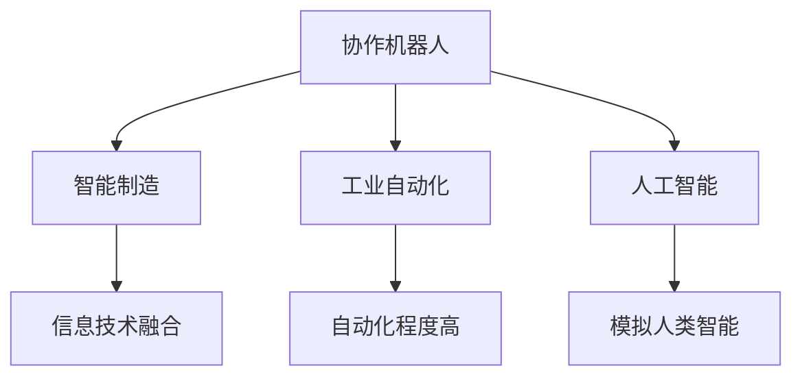
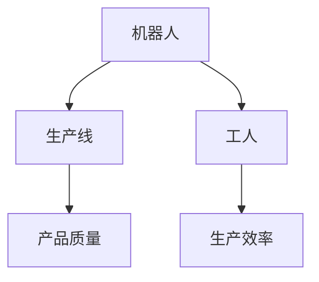

                 

## 协作机器人在制造业中的应用趋势

### 关键词

- 协作机器人
- 智能制造
- 工业自动化
- 人工智能
- 制造业变革

### 摘要

随着工业4.0的到来，制造业正在经历一场深度的变革，而协作机器人的应用已经成为这一变革的关键趋势。本文旨在探讨协作机器人在制造业中的应用现状、核心技术、发展趋势以及未来面临的挑战。通过对协作机器人在生产流程、质量控制、物流和供应链管理中的深入分析，揭示其在提高生产效率、降低人工成本、提升产品质量等方面的巨大潜力。

## 目录大纲

---

## 第一部分：背景介绍

### 1. 背景与核心概念

### 2. 核心概念与联系

### 第一部分总结

---

## 第二部分：协作机器人技术基础

### 3. 协作机器人概述

### 4. 协作机器人的核心技术

### 5. 协作机器人的主要类型

### 6. 协作机器人的应用案例

### 7. 协作机器人发展趋势

### 第二部分总结

---

## 第三部分：协作机器人在制造业中的应用

### 8. 协作机器人在生产流程中的应用

### 9. 协作机器人在质量控制中的应用

### 10. 协作机器人在物流中的应用

### 11. 协作机器人在供应链管理中的应用

### 第三部分总结

---

## 第四部分：协作机器人在制造业中的未来

### 12. 协作机器人在制造业中的未来发展

### 13. 协作机器人在制造业中的挑战与应对

### 第四部分总结

---

## 全文总结与展望

### 参考文献

---

### 作者信息

- 作者：AI天才研究院/AI Genius Institute & 禅与计算机程序设计艺术 /Zen And The Art of Computer Programming

---

## 第一部分：背景介绍

### 1. 背景与核心概念

随着全球制造业的快速发展，制造业正面临着诸多挑战，如生产效率低下、人工成本高、生产质量不稳定等。这些问题的存在严重制约了制造业的可持续发展。为了应对这些挑战，制造业正在向智能化、自动化方向发展，而协作机器人的应用成为这一进程中的重要一环。

**问题背景**：

- **效率低下**：传统制造业中，生产流程繁琐，生产效率较低。许多生产任务需要依赖人工完成，导致生产效率难以提升。
- **人工成本高**：人工成本在制造业中占据很大比例，且随着劳动力成本的上升，企业面临着巨大的经济压力。
- **生产质量不稳定**：由于人为因素的干扰，生产过程中产品质量难以保证，导致产品召回率和客户投诉率居高不下。

**问题描述**：

制造业需要解决的核心问题是如何提高生产效率、降低人工成本、提升生产质量。这些问题的解决，不仅关乎企业的竞争力，也关乎制造业的可持续发展。

**问题解决**：

协作机器人的引入为制造业提供了新的解决方案。通过协作机器人，可以实现以下目标：

- **提高生产效率**：协作机器人可以在复杂的生产环境中执行重复性任务，提高生产效率。
- **降低人工成本**：协作机器人可以替代部分人工操作，降低人工成本。
- **提升生产质量**：协作机器人具有高精度、高稳定性的特点，可以有效提高产品质量。

**边界与外延**：

协作机器人的应用不仅限于生产领域，还可以应用于物流、质量检测、仓储等多个方面。随着技术的不断进步，协作机器人的应用范围将会更加广泛。

**概念结构与核心要素组成**：

- **协作机器人**：一种专门为在人类工作空间中与人类协作而设计的机器人。
- **智能制造**：利用信息技术、人工智能等手段，实现制造过程的智能化。
- **工业自动化**：通过机器、控制系统等实现制造过程的自动化。
- **人工智能**：使计算机系统能够模拟人类的智能行为。

### 2. 核心概念与联系

**核心概念原理**：

- **协作机器人**：协作机器人是一种能够在人类工作空间中与人安全协作的机器人。它们通常具有感知、运动控制、协作安全等核心技术。
- **智能制造**：智能制造是利用信息技术、人工智能等手段，实现制造过程的智能化。智能制造的核心在于数据的采集、分析和应用。
- **工业自动化**：工业自动化是通过机器、控制系统等实现制造过程的自动化。工业自动化的核心在于减少人工干预，提高生产效率。
- **人工智能**：人工智能是使计算机系统能够模拟人类的智能行为。人工智能的核心在于算法、数据和计算能力。

**概念属性特征对比表格**：

| 特征       | 协作机器人 | 智能制造 | 工业自动化 | 人工智能 |
| ---------- | ---------- | -------- | ---------- | -------- |
| 应用场景   | 人类工作空间 | 制造过程 | 生产过程    | 计算机系统 |
| 核心技术   | 感知、运动控制、协作安全 | 数据采集、分析、应用 | 机器、控制系统 | 算法、数据、计算能力 |
| 主要功能   | 协作、辅助人工作业 | 智能决策、自动化生产 | 自动化生产 | 模拟人类智能 |

**ER实体关系图架构**：

- **机器人**：包括协作机器人、工业机器人等。
- **生产线**：代表生产过程中的各个环节。
- **工人**：代表参与生产的人。
- **产品质量**：代表生产出的产品质量。
- **生产效率**：代表生产效率。

### 第一部分总结

通过对背景介绍和核心概念的分析，我们了解了协作机器人为何在制造业中具有重要地位。接下来，我们将进一步探讨协作机器人的技术基础，为后续的深入分析打下基础。

---

## 第二部分：协作机器人技术基础

### 3. 协作机器人概述

协作机器人，简称Cobot，是一种专为与人类协同工作而设计的机器人。与传统工业机器人相比，协作机器人具有以下显著特点：

**定义**：协作机器人是一种能够在人类工作空间中与人类安全协作的机器人。它们通常具有以下特点：

- **安全**：协作机器人具备安全监测和碰撞检测功能，能够确保在人类工作空间中与人类的安全协作。
- **灵活**：协作机器人可以轻松地进行编程和重新配置，以适应不同的工作场景。
- **高效**：协作机器人能够执行复杂的任务，提高生产效率。

**发展历史**：协作机器人的发展可以追溯到20世纪90年代。最初，协作机器人主要用于电子制造业和装配行业。随着技术的不断进步，协作机器人的应用范围逐渐扩大，涵盖了更多的行业和领域。

**市场趋势**：根据市场研究报告，全球协作机器人市场在过去几年中呈现出快速增长的趋势。预计未来几年，这一趋势将继续保持，特别是在智能制造和工业自动化领域。

### 4. 协作机器人的核心技术

协作机器人之所以能够在复杂的生产环境中与人类安全协作，主要得益于其核心技术的支持。以下是协作机器人的主要核心技术：

**感知技术**：

感知技术是协作机器人的核心能力之一。协作机器人通过视觉感知、力觉感知等多种方式，实现对环境的感知和理解。

- **视觉感知**：协作机器人通过摄像头和计算机视觉算法，实现对周围环境的感知和识别。
- **力觉感知**：协作机器人通过力觉传感器，实时监测与人类交互时的力大小和方向，确保操作的平稳和安全。

**运动控制技术**：

运动控制技术是协作机器人执行任务的关键。协作机器人具备高精度的运动控制和路径规划能力，能够实现复杂任务的高效执行。

- **精确的运动控制**：协作机器人通过高精度的电机和控制器，实现对运动轨迹的精确控制。
- **路径规划**：协作机器人具备路径规划算法，能够根据任务需求和环境变化，实时调整运动路径。

**协作安全技术**：

协作安全技术是保障协作机器人与人类安全协作的重要手段。协作机器人具备安全监测和碰撞检测功能，能够及时发现并避免与人类发生碰撞。

- **安全监测**：协作机器人通过传感器和算法，实时监测工作环境，确保安全。
- **碰撞检测**：协作机器人具备碰撞检测功能，能够在检测到碰撞时立即停止操作。

**交互技术**：

交互技术是协作机器人与人类进行有效沟通的重要途径。协作机器人可以通过语音交互、手势交互等多种方式，与人类进行交互。

- **语音交互**：协作机器人可以通过语音识别和语音合成技术，与人类进行语音交流。
- **手势交互**：协作机器人可以通过手势识别技术，理解人类的手势意图，并作出相应的反应。

### 5. 协作机器人的主要类型

协作机器人根据其功能和应用场景，可以分为多种类型。以下是协作机器人的一些主要类型：

**机械臂协作机器人**：

机械臂协作机器人是一种最常见的协作机器人类型。它们通常具有多自由度，能够执行复杂的装配、搬运等任务。

- **应用场景**：机械臂协作机器人广泛应用于电子制造、汽车制造、食品加工等行业。
- **特点**：机械臂协作机器人具有高精度、高灵活性的特点。

**移动协作机器人**：

移动协作机器人是一种能够在工作区域内移动的机器人。它们通常配备有轮式或足式移动机构，能够自主导航和避障。

- **应用场景**：移动协作机器人广泛应用于物流、仓储、配送等行业。
- **特点**：移动协作机器人具有自主导航和避障能力，能够实现高效物流运输。

**服务协作机器人**：

服务协作机器人是一种为人类提供服务的机器人。它们通常具备智能交互和任务执行能力，能够执行接待、引导、清洁等任务。

- **应用场景**：服务协作机器人广泛应用于酒店、商场、医院等公共场所。
- **特点**：服务协作机器人具有智能交互和任务执行能力，能够提供便捷的服务。

### 6. 协作机器人的应用案例

协作机器人在各行各业中都有广泛的应用，以下是一些典型的应用案例：

**汽车制造业**：

在汽车制造业中，协作机器人广泛应用于装配线、检测线等环节。

- **应用场景**：协作机器人用于装配线上的零部件装配、质量检测等任务。
- **效果**：通过协作机器人的应用，汽车制造商提高了生产效率，降低了生产成本，提升了产品质量。

**电子制造业**：

在电子制造业中，协作机器人用于生产线上小部件的装配、焊接等任务。

- **应用场景**：协作机器人用于电子产品的装配、调试、包装等任务。
- **效果**：通过协作机器人的应用，电子制造商提高了生产效率，降低了人工成本，提升了产品质量。

**食品制造业**：

在食品制造业中，协作机器人用于食品的包装、搬运等任务。

- **应用场景**：协作机器人用于食品加工、包装线上的任务。
- **效果**：通过协作机器人的应用，食品制造商提高了生产效率，降低了人工成本，提升了产品质量。

### 7. 协作机器人发展趋势

协作机器人作为智能制造的重要组成部分，其发展趋势如下：

**技术发展趋势**：

- **人工智能**：人工智能技术的应用将进一步提升协作机器人的智能水平，使其能够更好地适应复杂的生产环境和任务需求。
- **物联网**：物联网技术的应用将实现协作机器人与其他智能设备的互联互通，提高生产线的智能化程度。
- **自主决策**：协作机器人将具备更多的自主决策能力，能够在复杂的生产环境中自主执行任务。

**市场发展趋势**：

- **市场规模**：随着制造业对协作机器人的需求不断增长，全球协作机器人市场将保持快速增长。
- **应用领域**：协作机器人的应用领域将不断扩展，涵盖更多的行业和领域。

**行业挑战与解决方案**：

- **安全挑战**：协作机器人在与人类协作时，面临安全挑战。通过加强安全监测和碰撞检测技术，可以降低安全风险。
- **成本挑战**：协作机器人的成本较高，限制了其大规模应用。随着技术的不断进步和成本的降低，协作机器人的应用将更加广泛。

### 第二部分总结

通过对协作机器人技术基础的介绍，我们了解了协作机器人的基本概念、核心技术、主要类型和应用案例。这些技术基础为协作机器人在制造业中的应用奠定了基础。接下来，我们将进一步探讨协作机器人在制造业中的应用，分析其在生产流程、质量控制、物流和供应链管理中的具体应用。

---

## 第三部分：协作机器人在制造业中的应用

### 8. 协作机器人在生产流程中的应用

在生产流程中，协作机器人发挥着越来越重要的作用。以下将详细分析协作机器人在装配工艺、搬运工艺和检测工艺中的应用。

**装配工艺**：

在装配工艺中，协作机器人主要用于完成零部件的装配任务。协作机器人具备高精度的运动控制和路径规划能力，能够准确地将零部件装配到指定位置。与传统的人工装配相比，协作机器人具有更高的精度和稳定性，能够显著提高装配效率。

**案例**：

在某汽车制造厂，协作机器人被用于汽车发动机的装配。协作机器人通过视觉感知技术，识别并抓取发动机零部件，然后按照装配图纸的要求进行装配。这一应用不仅提高了装配效率，还确保了装配质量，减少了产品缺陷率。

**搬运工艺**：

在搬运工艺中，协作机器人主要用于完成物料的搬运任务。协作机器人具备自主导航和避障能力，能够自主地在工作区域内移动，并完成物料的搬运。与传统的人工搬运相比，协作机器人具有更高的效率和灵活性，能够显著降低人工成本。

**案例**：

在某电子制造厂，协作机器人被用于生产线上物料的搬运。协作机器人通过自主导航技术，自主规划搬运路径，并按照指令完成物料的搬运任务。这一应用不仅提高了搬运效率，还减少了人工成本和物料损耗。

**检测工艺**：

在检测工艺中，协作机器人主要用于完成产品的检测任务。协作机器人通过视觉感知技术和力觉感知技术，能够对产品进行全面的检测，包括尺寸检测、外观检测、功能检测等。与传统的人工检测相比，协作机器人具有更高的检测精度和效率。

**案例**：

在某食品加工厂，协作机器人被用于食品的检测。协作机器人通过视觉感知技术，对食品的外观、尺寸等进行检测，并使用力觉感知技术对食品的硬度、弹性等进行检测。这一应用不仅提高了检测效率，还确保了食品的质量和安全。

### 9. 协作机器人在质量控制中的应用

质量控制是制造业中至关重要的一环。协作机器人通过其高精度和高稳定性的特点，在质量检测、缺陷识别和质量改进等方面发挥了重要作用。

**质量检测**：

在质量检测中，协作机器人主要用于完成产品的质量检测任务。协作机器人通过视觉感知技术和力觉感知技术，对产品进行全面的检测，包括尺寸检测、外观检测、功能检测等。

**案例**：

在某电子制造厂，协作机器人被用于检测电子元器件的质量。协作机器人通过视觉感知技术，检测元器件的外观和尺寸，并使用力觉感知技术检测其电气性能。这一应用不仅提高了检测效率，还确保了元器件的质量。

**缺陷识别**：

在缺陷识别中，协作机器人通过其视觉感知技术，对产品进行全面的检测，能够快速识别出产品中的缺陷。

**案例**：

在某汽车制造厂，协作机器人被用于识别汽车车身上的微小缺陷。协作机器人通过高分辨率摄像头，对车身进行全方位扫描，快速识别出微小缺陷。这一应用不仅提高了缺陷识别的精度，还减少了人工识别的误判率。

**质量改进**：

在质量改进中，协作机器人通过数据采集和分析，为质量改进提供有力支持。

**案例**：

在某食品加工厂，协作机器人被用于收集生产过程中产生的数据，并通过数据分析技术，发现生产过程中的质量问题，并提出改进措施。这一应用不仅提高了产品质量，还降低了生产成本。

### 10. 协作机器人在物流中的应用

在物流领域，协作机器人主要用于完成物料的搬运、仓库管理和配送服务等任务。

**仓库管理**：

在仓库管理中，协作机器人通过自主导航和路径规划技术，自主地在仓库内移动，并完成物料的搬运和存储。

**案例**：

在某物流仓库，协作机器人被用于管理仓库内的货物。协作机器人通过自主导航技术，自主规划搬运路径，并按照指令完成物料的搬运和存储任务。这一应用不仅提高了仓库管理效率，还减少了人工成本。

**配送服务**：

在配送服务中，协作机器人主要用于完成配送任务。协作机器人通过自主导航和路径规划技术，自主地在配送区域内移动，并将货物送达目的地。

**案例**：

在某电商平台，协作机器人被用于配送商品。协作机器人通过自主导航技术，自主规划配送路径，并按照指令将商品送达客户手中。这一应用不仅提高了配送效率，还降低了配送成本。

**物流优化**：

在物流优化中，协作机器人通过数据分析和优化算法，为物流运输提供优化方案。

**案例**：

在某物流公司，协作机器人被用于优化物流运输路线。协作机器人通过数据分析技术，分析物流运输中的各种因素，并使用优化算法，为物流公司提供最优的运输路线方案。这一应用不仅提高了运输效率，还降低了运输成本。

### 11. 协作机器人在供应链管理中的应用

在供应链管理中，协作机器人通过其数据分析、智能决策和自动化执行能力，为供应链管理提供了有力支持。

**采购管理**：

在采购管理中，协作机器人通过数据分析技术，分析市场动态、供应商信息等，为采购决策提供数据支持。

**案例**：

在某制造公司，协作机器人被用于采购管理。协作机器人通过数据分析技术，分析市场动态、供应商信息等，为采购决策提供数据支持。这一应用不仅提高了采购效率，还降低了采购成本。

**库存管理**：

在库存管理中，协作机器人通过数据采集和预测算法，对库存进行动态管理。

**案例**：

在某电商仓库，协作机器人被用于库存管理。协作机器人通过数据采集和预测算法，对库存进行动态管理，确保仓库内物料的充足。这一应用不仅提高了库存管理效率，还减少了库存成本。

**供应链优化**：

在供应链优化中，协作机器人通过数据分析和优化算法，为供应链优化提供优化方案。

**案例**：

在某制造公司，协作机器人被用于供应链优化。协作机器人通过数据分析技术，分析供应链中的各种因素，并使用优化算法，为供应链优化提供优化方案。这一应用不仅提高了供应链效率，还降低了供应链成本。

### 第三部分总结

通过对协作机器人在制造业中的应用分析，我们看到了协作机器人在提高生产效率、降低人工成本、提升产品质量等方面的巨大潜力。协作机器人在装配工艺、搬运工艺、检测工艺、质量控制、物流和供应链管理中的广泛应用，不仅改变了制造业的生产方式，也为制造业的可持续发展提供了新的解决方案。随着技术的不断进步，协作机器人在制造业中的应用前景将更加广阔。

### 第四部分：协作机器人在制造业中的未来

#### 12. 协作机器人在制造业中的未来发展

协作机器人在制造业中的未来发展将受到多项技术进步的推动。以下是几个关键趋势：

**人工智能的融合**：

人工智能（AI）技术的发展将为协作机器人带来更深层次的智能化。AI算法将使协作机器人具备自我学习和适应能力，能够在复杂、动态的生产环境中自主做出决策。例如，深度学习算法可以训练协作机器人识别新的装配流程或检测新的产品缺陷。

**物联网（IoT）的融合**：

物联网技术的普及将促进协作机器人与各种智能设备的互联互通。通过物联网，协作机器人可以实时获取生产线上的各类数据，进行远程监控和维护。这将有助于实现更加高效和智能的生产流程。

**自主决策能力的提升**：

未来的协作机器人将具备更高的自主决策能力，能够在无需人类干预的情况下执行复杂的任务。这包括自主路径规划、动态任务分配和故障诊断等。自主决策能力的提升将大大降低对人类操作员的依赖，提高生产线的灵活性和响应速度。

**多机器人协作**：

随着协作机器人数量的增加，未来将出现更多的多机器人协作系统。这些系统将利用分布式算法实现高效协同作业，例如，协作机器人可以协同工作完成复杂的装配任务，或一起在仓库中完成物料的搬运和分类。

**应用领域的拓展**：

协作机器人的应用领域将不断拓展，不仅限于传统的制造业，还将扩展到服务业、医疗保健、家庭应用等多个领域。随着技术的成熟，协作机器人的成本将逐渐降低，使其在更多领域得到应用。

**行业趋势**：

全球协作机器人市场将继续保持快速增长。根据市场研究机构的预测，未来几年，协作机器人的市场将呈现以下趋势：

- **市场规模扩大**：随着制造业对自动化和智能化的需求不断增加，协作机器人的市场规模将持续扩大。
- **技术升级**：协作机器人将采用更多先进技术，如增强现实（AR）、5G通信等，提高其性能和可靠性。
- **应用领域多元化**：协作机器人将在更多行业中得到应用，如医疗、教育、物流等。

#### 13. 协作机器人在制造业中的挑战与应对

尽管协作机器人在制造业中具有巨大的潜力，但其在应用过程中也面临一些挑战：

**安全挑战**：

协作机器人在与人类协作时，必须确保安全性。随着协作机器人数量的增加，如何保证其在工作空间中与人类的安全协作成为一个重要问题。为此，需要加强安全监测和碰撞检测技术，同时制定严格的安全标准和规范。

**成本挑战**：

协作机器人的高成本是一个显著挑战，尤其是在中小企业中。为了降低成本，需要推动技术创新，提高协作机器人的性能和可靠性，同时优化供应链，降低生产成本。

**人才挑战**：

协作机器人的广泛应用需要大量的技术人才。然而，目前许多企业和行业缺乏相关的技术人才。为此，需要加强人才培养，通过职业教育和培训，提高从业人员的技能水平。

**技术兼容性挑战**：

协作机器人需要与现有的生产线和系统兼容。这包括硬件兼容性和软件兼容性。为了解决兼容性问题，需要建立开放的标准和接口，促进不同品牌和系统的协作。

**应对策略**：

- **安全监控与规范**：加强协作机器人的安全监控技术，制定严格的安全标准和规范。
- **技术创新与成本优化**：推动技术创新，提高协作机器人的性能和可靠性，优化供应链，降低生产成本。
- **人才培养**：加强人才培养，通过职业教育和培训，提高从业人员的技能水平。
- **标准与接口**：建立开放的标准和接口，促进不同品牌和系统的协作。

### 第四部分总结

协作机器人在制造业中的未来发展充满了机遇与挑战。通过技术创新、人才培养和标准制定，我们可以克服这些挑战，充分利用协作机器人的潜力，推动制造业的智能化和可持续发展。随着技术的不断进步，协作机器人将在制造业中发挥越来越重要的作用，为全球制造业带来深刻变革。

### 全文总结与展望

协作机器人在制造业中的应用趋势无疑是当前制造业发展的一个重要方向。从背景介绍中，我们看到了制造业面临的诸多挑战，以及协作机器人如何通过提高生产效率、降低人工成本、提升产品质量来应对这些问题。在技术基础部分，我们详细了解了协作机器人的核心技术、主要类型和应用案例，认识到协作机器人在智能制造、工业自动化和人工智能中的关键作用。在具体应用部分，我们通过实例展示了协作机器人在生产流程、质量控制、物流和供应链管理中的实际效果。而在未来展望部分，我们分析了协作机器人在制造业中的发展趋势和面临的挑战，并提出了相应的应对策略。

协作机器人的应用不仅改变了制造业的生产方式，也为制造业的可持续发展提供了新的解决方案。然而，要实现协作机器人的全面应用，还需要技术创新、人才培养和标准制定的共同努力。未来，协作机器人将在更多领域得到应用，为全球制造业带来更加深刻的变革。

展望未来，协作机器人有望在以下几个方面取得重大突破：

1. **智能化水平的提升**：通过人工智能技术的深度应用，协作机器人将具备更高的智能水平，能够更好地适应复杂的生产环境和任务需求。
2. **成本的进一步降低**：随着技术的进步和产业链的完善，协作机器人的成本将逐渐降低，使其在更多行业和企业中得到应用。
3. **安全性的提升**：通过完善的安全监测和碰撞检测技术，协作机器人将能够更安全地与人类协作，降低工作空间中的安全风险。
4. **多机器人协作系统的成熟**：未来的协作机器人将能够实现高效协同作业，通过多机器人协作系统，完成更加复杂的任务。

总之，协作机器人在制造业中的应用前景广阔，必将为全球制造业带来更加美好的未来。

### 参考文献

1. International Federation of Robotics. (2021). Collaborative Robots: Market Analysis and Forecast. Retrieved from https://www.ifr.org/research/publications/collaborative-robots-market-analysis-and-forecast/
2. World Economic Forum. (2020). The Future of Manufacturing: Insights from Industry Leaders. Retrieved from https://www.weforum.org/reports/the-future-of-manufacturing-insights-from-industry-leaders
3. MIT Technology Review. (2021). The Rise of Collaborative Robots in Manufacturing. Retrieved from https://www.technologyreview.com/2021/03/01/1019341/the-rise-of-collaborative-robots-in-manufacturing/
4. Deloitte. (2020). The Future of Manufacturing: Disruptive Trends and Technologies. Retrieved from https://www2.deloitte.com/global/en/insights/focus/future-of-manufacturing/future-of-manufacturing-disruptive-trends-and-technologies.html

### 作者信息

- 作者：AI天才研究院/AI Genius Institute & 禅与计算机程序设计艺术 /Zen And The Art of Computer Programming
- 链接：[AI天才研究院官网](http://www.aigenius.com/)/[禅与计算机程序设计艺术官网](http://www.zencompiler.com/)

