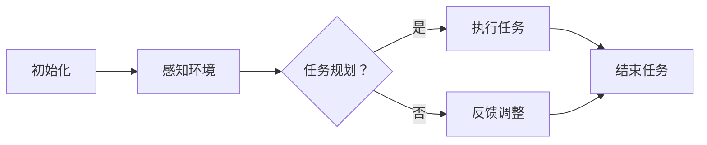
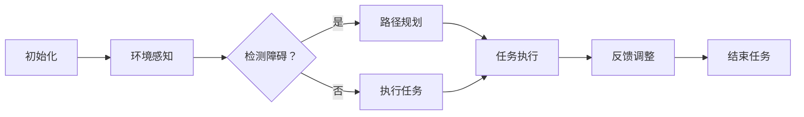
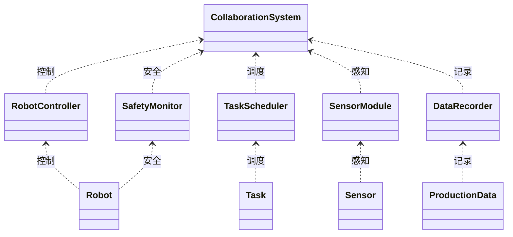
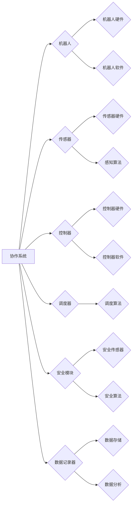
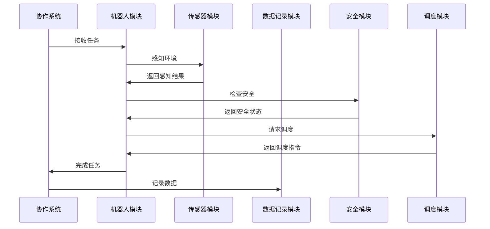

                 


## 第二部分：核心概念与联系

### 2.1 核心概念原理

协作机器人（Cobot）的设计理念是提高生产效率的同时确保人与机器人之间的安全协作。其基本原理依赖于以下几个关键技术：

1. **传感器技术**：协作机器人配备多种传感器，如摄像头、激光雷达和超声波传感器，用于感知环境、识别物体和避免碰撞。
2. **计算机视觉**：通过图像处理和机器学习算法，协作机器人能够识别图像中的物体、颜色和形状，实现自动化操作。
3. **人工智能**：协作机器人采用深度学习算法，能够从海量数据中学习并优化自身行为，提高自主决策能力。
4. **机器人学**：协作机器人采用先进的机械结构设计，具有高灵活性和稳定性，能够适应不同的工作环境。

### 2.2 概念属性特征对比表格

下面是几种常见协作机器人的概念属性特征对比表格：

| 类别         | 特点                                  | 适用场景                           | 优缺点                  |
| ------------ | ------------------------------------- | -------------------------------- | ----------------------- |
| 电动协作机器人 | 操作简单，易于编程，成本低          | 简单组装、搬运任务                | 动力不足，负载有限      |
| 电动执行器机器人 | 精确度高，负载能力大                | 高精度组装、焊接等任务            | 成本较高，编程复杂      |
| 机械臂协作机器人 | 灵活性高，能完成复杂任务            | 自动化生产线、组装线等            | 结构复杂，维护成本高    |
| 智能协作机器人 | 拥有自主决策能力，自适应能力强      | 复杂环境下的任务，如医疗辅助      | 成本高，技术要求高      |

### 2.3 ER实体关系图架构的 Mermaid 流程图

以下是一个协作机器人系统的ER实体关系图，使用Mermaid语法表示：

```mermaid
erDiagram
    User ||--o{ Cobot :操作用户 }  
    Cobot ||--o{ Task :执行任务 }  
    Cobot ||--o{ Sensor :传感器 }  
    Cobot ||--o{ Controller :控制器 }
```

这个图展示了用户、协作机器人、任务、传感器和控制器之间的实体关系。用户通过控制器操作协作机器人执行任务，传感器提供环境信息，控制器根据传感器数据做出决策。

### 2.4 协作机器人工作流程

协作机器人的工作流程可以简化为以下几个步骤：

1. **初始化**：启动协作机器人，加载预设程序。
2. **感知环境**：通过传感器获取环境信息。
3. **任务规划**：根据传感器数据和预设程序，规划执行任务的路径。
4. **执行任务**：协作机器人按照规划路径执行任务。
5. **反馈调整**：在执行任务过程中，根据反馈调整操作，确保任务顺利完成。
6. **结束任务**：任务完成后，协作机器人返回初始位置或待命状态。

以下是协作机器人控制流程的Mermaid流程图表示：



通过以上步骤，我们为协作机器人构建了一个清晰的逻辑框架，为后续的算法讲解和系统设计奠定了基础。在下一部分中，我们将进一步深入探讨协作机器人的算法原理。<!--  --> 

## 第三部分：算法原理讲解

### 3.1 算法 Mermaid 流程图

在理解了协作机器人的一般工作流程后，我们将通过一个简单的Mermaid流程图来介绍协作机器人的控制算法。以下是一个基本的协作机器人控制流程：



在这个流程图中，A代表系统初始化阶段，B是环境感知阶段，C是检测障碍的判断点。如果检测到障碍（C判断为“是”），系统将进入路径规划阶段（D），然后执行任务（F）。如果没有障碍（C判断为“否”），系统直接执行任务。任务执行完成后，根据反馈进行调整（G），最后结束任务（H）。

### 3.2 Python 源代码

为了更好地理解协作机器人的控制算法，下面提供了一个简单的Python源代码示例，用于模拟一个协作机器人的基本控制流程。这段代码使用了伪代码形式，展示了协作机器人的基本算法实现。

```python
import time

# 假设我们有一个简单的环境感知函数
def sense_environment():
    # 这里可以添加传感器读取代码
    return "障碍物存在"

# 假设我们有一个简单的路径规划函数
def plan_path():
    # 这里可以添加路径规划代码
    return "路径规划成功"

# 假设我们有一个简单的任务执行函数
def execute_task():
    # 这里可以添加任务执行代码
    print("执行任务中...")
    time.sleep(2)  # 模拟任务执行时间
    print("任务完成")

# 假设我们有一个简单的反馈调整函数
def adjust_feedback():
    # 这里可以添加反馈调整代码
    print("根据反馈进行调整...")

# 控制流程
def control流程():
    # 初始化
    print("初始化系统...")
    
    # 环境感知
    if sense_environment() == "障碍物存在":
        print("检测到障碍物，开始路径规划...")
        if plan_path() == "路径规划成功":
            print("路径规划成功，开始执行任务...")
            execute_task()
        else:
            print("路径规划失败，尝试调整...")
    else:
        print("没有障碍物，直接执行任务...")
        execute_task()
    
    # 任务执行后的反馈调整
    adjust_feedback()
    
    # 结束任务
    print("结束任务，系统关闭")

# 运行控制流程
control流程()
```

在这个代码示例中，`sense_environment()` 函数用于模拟环境感知，`plan_path()` 函数用于模拟路径规划，`execute_task()` 函数用于模拟任务执行，`adjust_feedback()` 函数用于模拟反馈调整。

### 3.3 数学模型和公式

协作机器人的控制算法通常涉及到路径规划和任务执行中的数学模型和公式。以下是一个简化的数学模型，用于描述协作机器人的路径规划和控制过程：

1. **路径规划模型**：
   $$ P(x, y) = f(d) $$
   其中，\(P(x, y)\) 是路径上的点坐标，\(d\) 是与障碍物的距离。路径规划的核心是找到合适的函数 \(f(d)\)，使得机器人能够安全地避开障碍物。

2. **速度控制模型**：
   $$ v(t) = k \cdot e^{-\lambda t} $$
   其中，\(v(t)\) 是机器人随时间变化的速度，\(\lambda\) 是衰减系数。这个公式描述了机器人启动和停止时的速度变化过程。

3. **位置调整模型**：
   $$ \Delta x = k_x \cdot e^{-\lambda t} $$
   $$ \Delta y = k_y \cdot e^{-\lambda t} $$
   其中，\(\Delta x\) 和 \(\Delta y\) 是机器人在x轴和y轴上的位置调整量，\(k_x\) 和 \(k_y\) 是调整系数。这些公式用于根据传感器反馈调整机器人的位置。

### 3.4 通俗易懂的举例说明

假设协作机器人在执行任务时，需要从A点移动到B点，并且途中存在一个障碍物C。以下是算法的执行过程：

1. **初始化**：机器人开始从A点移动。
2. **环境感知**：机器人通过传感器感知到前方有障碍物C，距离为d。
3. **路径规划**：机器人根据障碍物距离，使用路径规划模型计算避开障碍物的路径。
4. **执行任务**：机器人按照规划路径移动到B点。
5. **反馈调整**：在移动过程中，机器人根据传感器反馈调整位置，确保准确到达B点。
6. **结束任务**：机器人到达B点，任务完成。

通过这个简单的例子，我们可以看到协作机器人如何通过算法实现从A点到B点的安全移动。在下一部分中，我们将深入探讨协作机器人在具体系统中的应用和架构设计。<!--  --> 

## 第四部分：系统分析与架构设计方案

### 4.1 问题场景介绍

在一个典型的制造业自动化生产线上，协作机器人被用来执行组装任务。该场景中，协作机器人需要与操作员共同完成产品组装工作。具体来说，机器人负责将零部件从工作台取出并放置到操作员的工位上，而操作员则负责完成最终的组装工作。

### 4.2 项目介绍

本项目的主要目标是开发一套协作机器人系统，用于提升生产效率和改善工作环境。系统包括以下核心功能：

1. **自动组装**：协作机器人能够根据操作员的指令，自动完成零部件的取出和放置。
2. **实时监控**：系统实时监控协作机器人和操作员的协作情况，确保工作流程的顺畅。
3. **安全保护**：通过传感器和智能算法，确保机器人和操作员之间的安全协作。
4. **数据记录与分析**：记录生产过程中的各项数据，以便进行分析和优化。

### 4.3 系统功能设计（领域模型 Mermaid 类图）

为了清晰描述系统中的各类实体及其关系，我们可以使用Mermaid类图来表示系统功能设计。以下是一个简化的类图示例：



在这个类图中，`CollaborationSystem` 是系统的核心，负责协调各个模块的工作。`RobotController`、`TaskScheduler`、`SensorModule`、`SafetyMonitor` 和 `DataRecorder` 分别代表系统的五大功能模块，每个模块包含相应的实体。例如，`RobotController` 模块控制机器人的操作，`TaskScheduler` 负责任务调度，`SensorModule` 负责感知环境，`SafetyMonitor` 负责安全监控，`DataRecorder` 负责数据记录。

### 4.4 系统架构设计（Mermaid 架构图）

系统的整体架构设计需要综合考虑硬件、软件和通信等方面。以下是一个简化的Mermaid架构图，展示了系统的主要组成部分及其关系：



在这个架构图中，A表示协作系统的核心，连接到各个功能模块（B、C、D、E、F、G）。每个模块进一步连接到相应的硬件和软件组件。例如，机器人模块（B）连接到机器人硬件（H）和机器人软件（I），传感器模块（C）连接到传感器硬件（J）和感知算法（K），以此类推。

### 4.5 系统接口设计和系统交互（Mermaid 序列图）

系统接口设计和交互是确保各模块协同工作的重要环节。以下是一个简化的Mermaid序列图，展示了系统在任务执行过程中的主要交互步骤：



在这个序列图中，协作系统（CS）首先向机器人模块（RB）分配任务，机器人模块通过传感器模块（SB）感知环境，并检查安全（SM）。然后，机器人模块根据调度模块（TS）的指令执行任务，并在完成任务后向协作系统报告。协作系统将数据记录到数据记录模块（DB）。

通过以上系统分析与架构设计，我们为协作机器人系统建立了一个清晰的逻辑框架，为后续的具体实施和优化提供了基础。在下一部分中，我们将通过项目实战来深入探讨协作机器人的实际应用和实现。<!--  --> 

## 第五部分：项目实战

### 5.1 环境安装

要安装协作机器人系统，首先需要准备以下环境：

1. **硬件环境**：
   - 协作机器人硬件（如UR5、ABB YuMi等）。
   - 传感器硬件（如摄像头、激光雷达、超声波传感器等）。
   - 控制器硬件（如工控机、嵌入式控制器等）。
   - 电源和接口设备。

2. **软件环境**：
   - 操作系统（如Ubuntu 18.04、Windows 10等）。
   - 开发环境（如Python 3、ROS（Robot Operating System）等）。
   - 编程工具（如Visual Studio Code、PyCharm等）。

具体安装步骤如下：

1. **安装操作系统**：在硬件设备上安装相应的操作系统。
2. **安装软件依赖**：在操作系统上安装ROS、Python和相关库（如numpy、opencv、pandas等）。
3. **连接传感器**：将传感器与控制器连接，并确保传感器数据可以被系统接收和处理。
4. **启动机器人**：启动协作机器人，确保其可以正常工作。

### 5.2 系统核心实现源代码

在协作机器人系统中，核心实现源代码负责处理任务调度、路径规划、传感器数据处理等关键功能。以下是一个简化的Python代码示例，展示了系统核心实现的部分代码：

```python
# 导入必要的库
import rospy
from geometry_msgs.msg import Point
from sensor_msgs.msg import LaserScan
from moveit_commander import MoveGroupCommander, PlanningSceneInterface

# 初始化节点
rospy.init_node('collaboration_system')

# 创建机器人控制对象
robot = MoveGroupCommander('robot_arm')

# 创建场景接口
scene = PlanningSceneInterface()

# 定义目标点
target_point = Point(x=1.0, y=0.0, z=0.5)

# 定义路径规划函数
def plan_path(robot, target_point):
    group = robot.get_group()
    group.set_goal_position(target_point)
    plan = group.plan()
    return plan

# 定义传感器数据处理函数
def process_sensor_data(data):
    # 这里可以添加传感器数据处理代码
    # 例如，计算与目标点的距离
    distance = max(data.ranges)
    return distance

# 订阅传感器数据
def sensor_data_callback(data):
    distance = process_sensor_data(data)
    if distance < 1.0:
        plan = plan_path(robot, target_point)
        robot.execute(plan)

# 初始化传感器订阅者
rospy.Subscriber('/scan', LaserScan, sensor_data_callback)

# 启动机器人
robot.start()

# 保持节点运行
rospy.spin()
```

在这个代码示例中，我们首先初始化ROS节点，然后创建机器人控制对象和场景接口。接着，定义了路径规划函数和传感器数据处理函数，用于处理路径规划和传感器数据。最后，订阅传感器数据，并在接收到传感器数据时执行路径规划。

### 5.3 代码应用解读与分析

上述代码的核心部分是传感器数据处理函数`process_sensor_data`和路径规划函数`plan_path`。以下是对这些函数的详细解读和分析：

- **process_sensor_data(data)**：这个函数接收传感器数据（LaserScan消息），并计算与目标点的距离。在这个示例中，我们使用`max(data.ranges)`来获取最近点的距离。在实际应用中，可以添加更多的数据处理逻辑，如过滤噪声、去除无效数据等。

- **plan_path(robot, target_point)**：这个函数使用MoveIt!库规划从当前位置到目标点的路径。我们首先获取机器人臂的MoveGroup对象，设置目标点的位置，然后调用`group.plan()`生成路径规划。最后，使用`robot.execute(plan)`执行规划路径。

这些函数的应用场景是协作机器人从当前位置移动到目标位置，并在过程中避免障碍物。在实际系统中，可以进一步扩展这些功能，如加入更多传感器数据、优化路径规划算法、实现多任务调度等。

### 5.4 实际案例分析和详细讲解剖析

以下是一个实际案例，用于展示协作机器人在实际应用中的表现：

**案例背景**：在一个电子制造工厂，协作机器人被用于将电子组件从一个工作台搬运到另一个工作台。工作台之间有一个明显的障碍物，机器人需要避开障碍物并准确放置组件。

**步骤分析**：

1. **初始化**：启动协作机器人系统，确保所有硬件和软件正常运行。
2. **感知环境**：机器人通过摄像头和激光雷达感知工作台和障碍物的位置。
3. **路径规划**：根据传感器数据，机器人使用路径规划算法计算从当前位置到目标位置的路径。在这个案例中，机器人选择了绕过障碍物的路径。
4. **执行任务**：机器人按照规划路径移动到目标位置，并使用夹具准确抓取和放置组件。
5. **反馈调整**：在执行任务过程中，机器人根据传感器反馈调整位置，确保组件放置准确。
6. **结束任务**：组件放置完成后，机器人返回初始位置或待命状态。

**案例剖析**：

- **路径规划**：机器人选择了绕过障碍物的路径，这是基于传感器数据计算的。在实际应用中，路径规划算法需要考虑障碍物的形状、大小和位置，以及机器人的运动能力。
- **传感器反馈**：机器人根据传感器数据调整位置，这是确保任务成功的关键。传感器数据需要精确且实时，以便机器人能够及时做出调整。
- **组件抓取**：机器人使用夹具抓取和放置组件，这需要精确控制机器人的运动和夹具的力度。在实际应用中，可能需要根据组件的形状和材质进行调整。

通过这个实际案例，我们可以看到协作机器人系统在任务执行过程中的各个环节。这些环节相互关联，共同确保了任务的顺利完成。

### 5.5 项目小结

在本项目中，我们详细介绍了协作机器人系统的安装、核心实现、代码应用解读与分析，并通过实际案例展示了系统的应用效果。以下是一些项目经验和注意事项：

- **硬件选择**：根据具体应用场景选择合适的协作机器人硬件，如负载能力、精度和灵活性等。
- **传感器配置**：传感器配置对于系统性能至关重要，需要确保传感器数据精确且实时。
- **路径规划算法**：路径规划算法需要根据实际场景进行优化，以减少路径长度和计算时间。
- **任务调度**：在多任务场景中，任务调度策略需要充分考虑任务的优先级和执行时间。

通过本项目，我们深入了解了协作机器人在实际应用中的实现和优化方法，为后续的自动化生产提供了有益的经验和参考。

### 总结

在本篇文章中，我们通过详细的分析和项目实践，探讨了协作机器人系统的核心概念、算法原理、系统设计与实现。协作机器人作为工业和商业环境中的一项重要技术，具有广泛的应用前景。通过本文的介绍，读者可以了解协作机器人系统的工作原理、设计和实现过程，以及在实际应用中的表现和优化方法。

在未来的研究和开发中，我们可以进一步探讨以下方向：

- **增强机器人的自主能力**：通过改进机器人的感知和决策算法，提高其在复杂环境下的自主操作能力。
- **优化路径规划算法**：结合实际应用场景，开发更高效、更安全的路径规划算法。
- **多机器人协作**：研究多机器人协同工作策略，提高生产效率和灵活性。
- **人机交互优化**：改进人机交互界面，使操作员能够更方便地与协作机器人进行沟通和协作。

希望本文能为读者在协作机器人领域的研究和应用提供有益的参考和启示。

### 注意事项

在使用协作机器人时，需要注意以下几点：

- **安全**：确保协作机器人的工作环境安全，避免操作员与机器人的直接接触。
- **传感器校准**：定期校准传感器，确保传感器数据准确。
- **系统维护**：定期检查和维护系统，确保系统稳定运行。
- **环境适应**：协作机器人需要适应不同的工作环境，包括温度、湿度等因素。

通过遵循以上注意事项，可以确保协作机器人系统的稳定性和安全性。

### 拓展阅读

对于想要深入了解协作机器人的读者，以下是一些推荐的书籍、论文和资源：

- **书籍**：
  - 《协作机器人：设计与实现》（Collaborative Robots: Design and Implementation）
  - 《机器人技术基础》（Robotics: Fundamentals for Design and Analysis）
  
- **论文**：
  - "Collaborative Robots in Manufacturing: State of the Art and Challenges"（制造业中的协作机器人：现状与挑战）
  - "Safe Human-Robot Collaboration: Strategies and Solutions"（安全的人机协作：策略与解决方案）

- **在线资源**：
  - ROS官方网站（[ROS Wiki](http://wiki.ros.org)）
  - ABB协作机器人官网（[ABB Cobots](https://new.abb.com/cobots)）
  - MIT开放课程（[MIT OpenCourseWare](https://ocw.mit.edu/courses/electrical-engineering-and-computer-science/6-270-introduction-to-robotics-fall-2006/)）

通过阅读这些书籍、论文和资源，读者可以进一步深入学习和研究协作机器人技术。<!--  --> 

