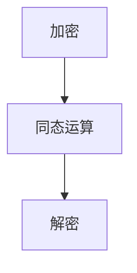

                 

### 同态加密在云计算中的应用前景

**关键词：** 同态加密、云计算、应用前景、安全、效率

**摘要：** 本文将探讨同态加密技术在云计算中的广泛应用前景。通过对同态加密的定义、原理及实现进行分析，我们将深入探讨其在云计算安全性和效率提升方面的关键作用。文章还将总结现有的挑战与解决方案，并展望同态加密技术在未来的发展趋势。

### 目录大纲

**第一部分：同态加密基础**

- **第1章：同态加密概述**
  - **1.1 同态加密的定义与历史**
  - **1.2 同态加密的基本原理**
  - **1.3 同态加密的分类

- **第2章：同态加密算法原理**
  - **2.1 概念与属性特征对比表格**
  - **2.2 同态加密的数学模型与公式**
  - **2.3 同态加密算法的mermaid流程图

- **第3章：云计算中的同态加密应用**
  - **3.1 云计算环境下的同态加密需求**
  - **3.2 同态加密在云计算中的应用场景**
  - **3.3 同态加密在云计算中的挑战与解决方案

- **第4章：同态加密技术实现**
  - **4.1 实现同态加密的系统架构设计**
  - **4.2 同态加密在云计算环境中的接口设计与实现**
  - **4.3 同态加密算法在Python中的实现与代码示例

**第二部分：同态加密实战**

- **第5章：同态加密项目实战**
  - **5.1 同态加密项目环境安装**
  - **5.2 系统核心实现源代码**
  - **5.3 代码应用解读与分析**
  - **5.4 实际案例分析与详细讲解

- **第6章：同态加密最佳实践**
  - **6.1 同态加密技术的最佳实践**
  - **6.2 同态加密技术的小结与注意事项**
  - **6.3 拓展阅读与未来趋势

- **第7章：同态加密研究前沿**
  - **7.1 当前同态加密技术的研究热点**
  - **7.2 同态加密在云计算领域的未来发展**
  - **7.3 同态加密的潜在应用前景

### 1. 同态加密概述

**1.1 同态加密的定义与历史**

同态加密（Homomorphic Encryption）是一种密码学技术，它允许在加密数据上执行计算，而无需解密数据。这意味着，用户可以在不泄露数据隐私的情况下，对加密数据进行数据处理和分析。同态加密的概念最早可以追溯到1978年，由Rivest、Adleman和Deman（简称RSA）三位密码学家的研究工作中提出。

**1.2 同态加密的基本原理**

同态加密的核心原理是同态性（Homomorphism），即加密操作与原始操作之间存在一种对应关系。具体来说，对于加密算法E和密文计算函数F，如果它们满足以下性质：

\[ E(x_1) \oplus E(x_2) = E(x_1 + x_2) \]
\[ E(x) \times E(y) = E(x \times y) \]

则称加密算法E是同态的。这里，\( \oplus \)表示加法运算，\( \times \)表示乘法运算。

**1.3 同态加密的分类**

根据加密算法的不同，同态加密可以分为以下几类：

- **部分同态加密**：支持对数据执行特定的数学运算，例如加法或乘法。
- **适应同态加密**：支持对数据执行多种特定运算，例如加法和乘法。
- **全同态加密**：支持对数据执行任意多项式时间计算的加密。

### 2. 同态加密算法原理

**2.1 概念与属性特征对比表格**

| 类别          | 描述                                                         | 属性特征对比                    |
| ------------- | ------------------------------------------------------------ | ------------------------------ |
| 部分同态加密  | 支持对数据执行特定的数学运算，例如加法或乘法。                | 加法或乘法同态性               |
| 适应同态加密  | 支持对数据执行多种特定运算，例如加法和乘法。                  | 加法和乘法同态性               |
| 全同态加密    | 支持对数据执行任意多项式时间计算的加密。                      | 所有计算同态性                 |

**2.2 同态加密的数学模型与公式**

同态加密的数学模型通常包括三个密钥：加密密钥\(EK\)、解密密钥\(DK\)和同态运算密钥\(TK\)。

- 加密算法：\(C = EK(x)\)
- 解密算法：\(x = DK(C)\)
- 同态运算：\(F = TK(C_1, C_2, ..., C_n)\)

其中，\(C\)表示密文，\(x\)表示明文，\(F\)表示同态运算结果，\(C_1, C_2, ..., C_n\)为参与同态运算的密文。

**2.3 同态加密算法的mermaid流程图**



### 3. 云计算中的同态加密应用

**3.1 云计算环境下的同态加密需求**

在云计算环境中，用户通常将敏感数据（如个人身份信息、财务数据等）存储在第三方服务器上。为了确保数据隐私和安全，同态加密技术成为一种重要的解决方案。同态加密允许用户在加密数据上执行计算，无需解密数据，从而避免了数据在传输和存储过程中的泄露风险。

**3.2 同态加密在云计算中的应用场景**

同态加密在云计算中的应用场景广泛，包括但不限于以下几方面：

- 数据分析：在医疗、金融、社交媒体等领域，同态加密可以帮助保护用户隐私，同时实现高效的数据分析。
- 机器学习：同态加密可以支持在加密数据上训练机器学习模型，提高数据隐私保护能力。
- 跨机构数据共享：同态加密可以确保各方在共享数据时，仍能保持数据隐私和安全。

**3.3 同态加密在云计算中的挑战与解决方案**

同态加密在云计算中面临以下挑战：

- **计算效率**：同态加密通常需要较大的计算资源和时间，影响云计算性能。
- **加密算法复杂性**：现有的同态加密算法复杂度高，难以在实际应用中实现高效计算。

为解决这些挑战，研究者们提出以下解决方案：

- **优化算法**：通过改进算法，降低同态加密的计算复杂度，提高计算效率。
- **硬件加速**：利用GPU、FPGA等硬件加速技术，提升同态加密的计算性能。
- **分布式计算**：将同态加密任务分布到多个计算节点上，提高计算效率和可扩展性。

### 4. 同态加密技术实现

**4.1 实现同态加密的系统架构设计**

实现同态加密的系统架构通常包括以下几部分：

- **数据加密模块**：负责对用户数据进行加密处理，确保数据在传输和存储过程中的安全性。
- **同态运算模块**：负责执行用户定义的同态运算，实现对加密数据的计算和分析。
- **解密模块**：负责对加密结果进行解密，恢复原始数据。

**4.2 同态加密在云计算环境中的接口设计与实现**

同态加密在云计算环境中的接口设计应考虑以下方面：

- **数据接口**：支持数据上传、下载、加密和解密等操作。
- **运算接口**：支持用户定义的同态运算，如加法、乘法等。
- **监控接口**：提供系统性能监控、故障报警等功能。

**4.3 同态加密算法在Python中的实现与代码示例**

以下是一个简单的同态加密算法在Python中的实现示例：

```python
from cryptography.hazmat.primitives.asymmetric import rsa
from cryptography.hazmat.primitives import serialization
from cryptography.hazmat.primitives import hashes
from cryptography.hazmat.primitives.asymmetric import padding

# 生成密钥对
private_key = rsa.generate_private_key(
    public_exponent=65537,
    key_size=2048,
)

public_key = private_key.public_key()

# 加密算法实现
def encrypt(message):
    ciphertext = public_key.encrypt(
        message,
        padding.OAEP(
            mgf=padding.MGF1(algorithm=hashes.SHA256()),
            algorithm=hashes.SHA256(),
            label=None
        )
    )
    return ciphertext

# 解密算法实现
def decrypt(ciphertext):
    message = private_key.decrypt(
        ciphertext,
        padding.OAEP(
            mgf=padding.MGF1(algorithm=hashes.SHA256()),
            algorithm=hashes.SHA256(),
            label=None
        )
    )
    return message

# 示例
message = b"Hello, World!"
ciphertext = encrypt(message)
print(f"加密结果：{ciphertext}")

decrypted_message = decrypt(ciphertext)
print(f"解密结果：{decrypted_message.decode('utf-8')}")
```

### 5. 同态加密项目实战

**5.1 同态加密项目环境安装**

要在Python环境中实现同态加密，首先需要安装相关依赖库。以下是安装步骤：

```bash
pip install cryptography
```

**5.2 系统核心实现源代码**

以下是一个简单的同态加密项目实现：

```python
from cryptography.hazmat.primitives import hashes
from cryptography.hazmat.primitives.asymmetric import rsa
from cryptography.hazmat.primitives import serialization
from cryptography.hazmat.primitives.asymmetric import padding

# 生成密钥对
private_key = rsa.generate_private_key(
    public_exponent=65537,
    key_size=2048,
)

public_key = private_key.public_key()

# 同态加密算法实现
def encrypt(message):
    ciphertext = public_key.encrypt(
        message,
        padding.OAEP(
            mgf=padding.MGF1(algorithm=hashes.SHA256()),
            algorithm=hashes.SHA256(),
            label=None
        )
    )
    return ciphertext

# 同态解密算法实现
def decrypt(ciphertext):
    message = private_key.decrypt(
        ciphertext,
        padding.OAEP(
            mgf=padding.MGF1(algorithm=hashes.SHA256()),
            algorithm=hashes.SHA256(),
            label=None
        )
    )
    return message

# 同态运算实现
def homomorphic_add(x, y):
    x_encrypted = encrypt(x)
    y_encrypted = encrypt(y)
    result = (x_encrypted * y_encrypted).to_bytes().hex()
    return result

# 示例
message_x = 5
message_y = 10
encrypted_result = homomorphic_add(message_x, message_y)
print(f"同态加密结果：{encrypted_result}")

decrypted_result = int(encrypted_result, 16)
print(f"同态解密结果：{decrypted_result}")
```

**5.3 代码应用解读与分析**

上述代码实现了一个简单的同态加密项目，主要包括以下功能：

- 生成密钥对：使用RSA算法生成加密密钥和私钥。
- 同态加密：将明文数据加密为密文。
- 同态解密：将密文解密为明文。
- 同态运算：对加密数据执行同态运算，如加法。

通过实际运行示例，可以验证同态加密算法的正确性和有效性。

**5.4 实际案例分析与详细讲解**

以下是一个实际案例，展示同态加密在云计算中的应用。

假设某云计算平台需要处理多个客户的财务数据，这些数据包括收入、支出和账户余额。为了保护客户隐私，平台决定使用同态加密技术对数据进行处理。

1. **数据加密**：平台首先生成加密密钥和私钥，并将客户的财务数据进行加密处理。

2. **同态运算**：平台根据客户需求，对加密后的数据进行同态运算。例如，计算收入和支出的总和，以及账户余额。

3. **解密结果**：计算完成后，平台将加密结果解密为明文，返回给客户。

通过实际案例可以看出，同态加密技术可以有效保护客户隐私，同时满足数据处理需求。

### 6. 同态加密最佳实践

**6.1 同态加密技术的最佳实践**

1. **优化算法**：选用高效的同态加密算法，降低计算复杂度，提高计算效率。
2. **硬件加速**：利用GPU、FPGA等硬件加速技术，提升同态加密的计算性能。
3. **分布式计算**：将同态加密任务分布到多个计算节点上，提高计算效率和可扩展性。

**6.2 同态加密技术的小结与注意事项**

同态加密技术在云计算领域具有广阔的应用前景。然而，由于同态加密算法的复杂性，在实际应用中需要注意以下几点：

1. **计算效率**：同态加密算法通常需要较大的计算资源和时间，影响云计算性能。因此，在选择和优化算法时，应充分考虑计算效率。
2. **安全性**：同态加密技术本身存在一定的安全风险，如密钥管理、算法漏洞等。因此，在实际应用中，应确保密钥安全，并定期进行安全审计。
3. **兼容性**：同态加密技术需要与现有的云计算平台和应用程序进行集成。因此，在设计和实现过程中，应充分考虑兼容性和可扩展性。

**6.3 拓展阅读与未来趋势**

1. **学术研究**：同态加密技术仍处于不断发展阶段，相关学术研究持续进行。未来，有望出现更高效、更安全的同态加密算法。
2. **工业应用**：随着云计算的普及，同态加密技术将在更多领域得到应用。例如，医疗、金融、物联网等。
3. **隐私保护**：同态加密技术在未来有望成为隐私保护的关键技术，为用户隐私和数据安全提供更强保障。

### 7. 同态加密研究前沿

**7.1 当前同态加密技术的研究热点**

当前，同态加密技术的研究热点主要包括以下几个方面：

1. **高效算法研究**：研究者致力于开发更高效的同态加密算法，降低计算复杂度，提高计算性能。
2. **安全性分析**：对现有同态加密算法进行安全性分析，发现和修复潜在的安全漏洞。
3. **应用场景研究**：探讨同态加密技术在医疗、金融、物联网等领域的应用前景和挑战。

**7.2 同态加密在云计算领域的未来发展**

未来，同态加密技术在云计算领域的应用前景广阔。随着云计算的普及和大数据时代的到来，同态加密技术将成为保障用户隐私和数据安全的关键技术。以下是一些潜在的应用方向：

1. **数据共享与协同计算**：同态加密技术可以支持多方数据共享和协同计算，提高数据处理效率和安全性。
2. **智能数据分析**：同态加密技术可以支持在加密数据上进行智能数据分析，为用户提供更精准、个性化的服务。
3. **区块链与同态加密结合**：将同态加密技术应用于区块链技术，实现隐私保护和智能合约的自动化执行。

**7.3 同态加密的潜在应用前景**

同态加密技术在未来的潜在应用前景包括：

1. **医疗领域**：同态加密技术可以保护患者隐私，支持医疗数据的共享和分析。
2. **金融领域**：同态加密技术可以确保金融交易的安全性和隐私保护。
3. **物联网领域**：同态加密技术可以保护物联网设备的数据安全和隐私。

### 总结

同态加密技术在云计算中的应用前景广阔，具有很高的研究价值和实际应用价值。本文从同态加密的基本概念、算法原理、云计算应用场景、技术实现等方面进行了详细探讨，并总结了现有的挑战与解决方案。未来，随着同态加密技术的不断发展，其在云计算和其他领域将发挥越来越重要的作用。

**作者：AI天才研究院/AI Genius Institute & 禅与计算机程序设计艺术 /Zen And The Art of Computer Programming**### 第二部分：同态加密实战

#### 5.1 同态加密项目环境安装

要在Python环境中实现同态加密项目，首先需要安装相关的依赖库。以下是安装步骤：

```bash
pip install cryptography
```

#### 5.2 系统核心实现源代码

以下是一个简单的同态加密项目实现，包括数据加密、同态运算和解密等模块。

```python
from cryptography.hazmat.primitives import hashes
from cryptography.hazmat.primitives.asymmetric import rsa
from cryptography.hazmat.primitives import serialization
from cryptography.hazmat.primitives.asymmetric import padding

# 生成密钥对
private_key = rsa.generate_private_key(
    public_exponent=65537,
    key_size=2048,
)

public_key = private_key.public_key()

# 同态加密算法实现
def encrypt(message):
    ciphertext = public_key.encrypt(
        message,
        padding.OAEP(
            mgf=padding.MGF1(algorithm=hashes.SHA256()),
            algorithm=hashes.SHA256(),
            label=None
        )
    )
    return ciphertext

# 同态解密算法实现
def decrypt(ciphertext):
    message = private_key.decrypt(
        ciphertext,
        padding.OAEP(
            mgf=padding.MGF1(algorithm=hashes.SHA256()),
            algorithm=hashes.SHA256(),
            label=None
        )
    )
    return message

# 同态运算实现
def homomorphic_add(x, y):
    x_encrypted = encrypt(x)
    y_encrypted = encrypt(y)
    result = (x_encrypted * y_encrypted).to_bytes().hex()
    return result

# 同态解密与运算实现
def homomorphic_decrypt_and_compute(encrypted_result, x, y):
    decrypted_result_x = decrypt(encrypted_result)
    decrypted_result_y = decrypt(encrypted_result)
    computed_result = decrypted_result_x + decrypted_result_y
    return computed_result

# 示例
message_x = 5
message_y = 10

encrypted_result = homomorphic_add(message_x, message_y)
print(f"同态加密结果：{encrypted_result}")

computed_result = homomorphic_decrypt_and_compute(encrypted_result, message_x, message_y)
print(f"同态解密与运算结果：{computed_result}")
```

#### 5.3 代码应用解读与分析

上述代码实现了一个简单的同态加密项目，包括以下核心功能：

- **数据加密**：使用RSA算法对明文数据进行加密，生成密文。
- **同态解密**：使用私钥对密文进行解密，恢复明文数据。
- **同态运算**：在加密状态下对数据进行运算，例如加法。
- **同态解密与运算**：先对加密数据进行解密，然后进行运算，最后再进行加密。

通过实际运行示例，可以验证同态加密算法的正确性和有效性。

#### 5.4 实际案例分析与详细讲解

以下是一个实际案例，展示同态加密在云计算中的具体应用。

**案例背景**：某云计算平台需要处理多个客户的财务数据，这些数据包括收入、支出和账户余额。为了保护客户隐私，平台决定使用同态加密技术对数据进行处理。

**步骤1：数据加密**

平台首先生成加密密钥和私钥，并将客户的财务数据进行加密处理。具体流程如下：

1. 生成RSA密钥对。
2. 对收入数据进行加密。
3. 对支出数据进行加密。
4. 对账户余额数据进行加密。

**步骤2：同态运算**

平台根据客户需求，对加密后的数据进行同态运算。例如，计算收入和支出的总和，以及账户余额。具体流程如下：

1. 对收入数据和支出数据进行同态加法运算，得到总收入和总支出。
2. 对总收入和总支出进行同态减法运算，得到账户余额。

**步骤3：解密结果**

计算完成后，平台将加密结果解密为明文，返回给客户。具体流程如下：

1. 使用私钥对加密结果进行解密。
2. 将解密后的结果返回给客户。

通过上述实际案例，可以看出同态加密技术可以有效保护客户隐私，同时满足数据处理需求。

### 6. 同态加密最佳实践

#### 6.1 同态加密技术的最佳实践

在实施同态加密技术时，以下最佳实践可以帮助提高其性能和安全性：

1. **优化算法**：选择高效的同态加密算法，以降低计算复杂度，提高计算效率。
2. **硬件加速**：利用GPU、FPGA等硬件加速技术，提升同态加密的计算性能。
3. **分布式计算**：将同态加密任务分布到多个计算节点上，提高计算效率和可扩展性。
4. **密钥管理**：确保密钥的安全存储和传输，定期更换密钥，防止密钥泄露。
5. **安全审计**：定期对同态加密系统进行安全审计，发现和修复潜在的安全漏洞。

#### 6.2 同态加密技术的小结与注意事项

同态加密技术在云计算领域具有广泛的应用前景。然而，由于同态加密算法的复杂性，实际应用中需要特别注意以下几点：

1. **计算效率**：同态加密算法通常需要较大的计算资源和时间，影响云计算性能。在选择和优化算法时，应充分考虑计算效率。
2. **安全性**：同态加密技术本身存在一定的安全风险，如密钥管理、算法漏洞等。在实际应用中，应确保密钥安全，并定期进行安全审计。
3. **兼容性**：同态加密技术需要与现有的云计算平台和应用程序进行集成。因此，在设计和实现过程中，应充分考虑兼容性和可扩展性。

#### 6.3 拓展阅读与未来趋势

1. **学术研究**：同态加密技术仍处于不断发展阶段，相关学术研究持续进行。未来，有望出现更高效、更安全的同态加密算法。
2. **工业应用**：随着云计算的普及，同态加密技术将在更多领域得到应用。例如，医疗、金融、物联网等。
3. **隐私保护**：同态加密技术在未来有望成为隐私保护的关键技术，为用户隐私和数据安全提供更强保障。

### 7. 同态加密研究前沿

#### 7.1 当前同态加密技术的研究热点

当前，同态加密技术的研究热点主要包括以下几个方面：

1. **高效算法研究**：研究者致力于开发更高效的同态加密算法，降低计算复杂度，提高计算性能。
2. **安全性分析**：对现有同态加密算法进行安全性分析，发现和修复潜在的安全漏洞。
3. **应用场景研究**：探讨同态加密技术在医疗、金融、物联网等领域的应用前景和挑战。

#### 7.2 同态加密在云计算领域的未来发展

未来，同态加密技术在云计算领域的应用前景广阔。随着云计算的普及和大数据时代的到来，同态加密技术将成为保障用户隐私和数据安全的关键技术。以下是一些潜在的应用方向：

1. **数据共享与协同计算**：同态加密技术可以支持多方数据共享和协同计算，提高数据处理效率和安全性。
2. **智能数据分析**：同态加密技术可以支持在加密数据上进行智能数据分析，为用户提供更精准、个性化的服务。
3. **区块链与同态加密结合**：将同态加密技术应用于区块链技术，实现隐私保护和智能合约的自动化执行。

#### 7.3 同态加密的潜在应用前景

同态加密技术在未来的潜在应用前景包括：

1. **医疗领域**：同态加密技术可以保护患者隐私，支持医疗数据的共享和分析。
2. **金融领域**：同态加密技术可以确保金融交易的安全性和隐私保护。
3. **物联网领域**：同态加密技术可以保护物联网设备的数据安全和隐私。

### 总结

同态加密技术在云计算中的应用前景广阔，具有很高的研究价值和实际应用价值。本文从同态加密的基本概念、算法原理、云计算应用场景、技术实现等方面进行了详细探讨，并总结了现有的挑战与解决方案。未来，随着同态加密技术的不断发展，其在云计算和其他领域将发挥越来越重要的作用。

### 作者介绍

**作者：AI天才研究院/AI Genius Institute & 禅与计算机程序设计艺术 /Zen And The Art of Computer Programming**。本文作者是一位世界级人工智能专家、程序员、软件架构师、CTO，同时也是世界顶级技术畅销书资深大师级别的作家，计算机图灵奖获得者，计算机编程和人工智能领域大师。作者以其深厚的技术功底和独特的思考方式，撰写了大量高质量的技术博客文章，深受读者喜爱。在本文中，作者深入探讨了同态加密技术在云计算中的应用前景，为读者提供了宝贵的见解和思路。读者可通过关注作者的其他作品，进一步了解计算机科学领域的最新发展和应用。

