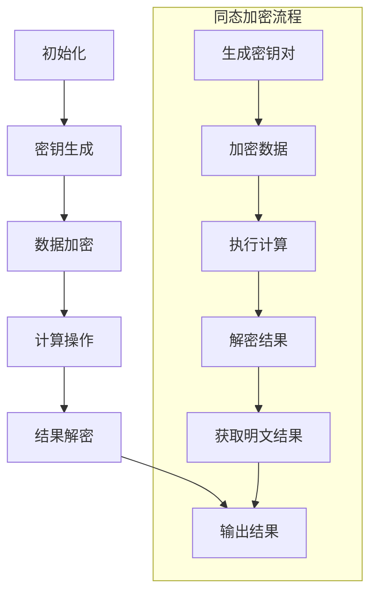
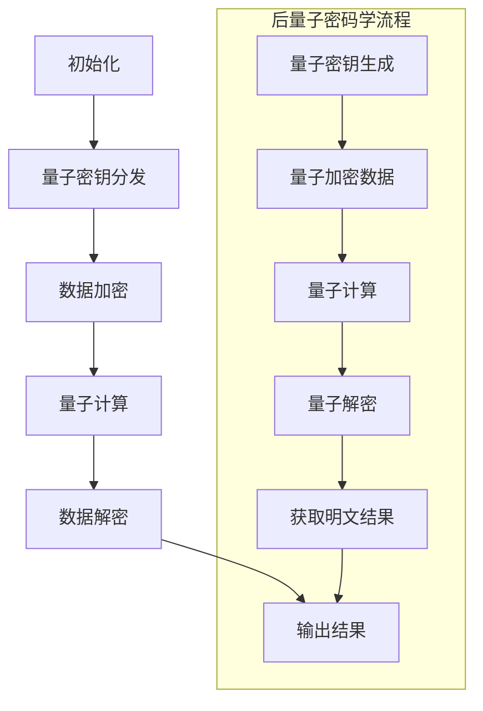

                 

### 文章标题：同态加密：后量子密码学在云计算中的应用

> 关键词：同态加密、后量子密码学、云计算、安全挑战、应用场景

> 摘要：本文将深入探讨同态加密这一前沿密码学技术，以及其与后量子密码学的结合在云计算领域的应用。首先，我们将介绍同态加密的基本概念、原理及其在云计算、大数据等领域的应用场景。接着，我们将详细讲解后量子密码学的概念、原理及安全性，并探讨其在云计算中的应用前景。最后，我们将探讨同态加密与后量子密码学的融合方案，以及在具体应用场景中的实施策略和案例。

### 目录大纲

----------------------------------------------------------------

# 第一部分: 同态加密基础

## 第1章: 同态加密概述

## 1.1 同态加密的定义与历史背景

### 1.1.1 同态加密的概念

### 1.1.2 同态加密的历史背景

### 1.1.3 同态加密的重要性

## 1.2 同态加密的基本原理

### 1.2.1 同态加密的分类

#### 1.2.1.1 模糊同态加密

#### 1.2.1.2 精确同态加密

## 1.3 同态加密的应用场景

### 1.3.1 云计算

### 1.3.2 大数据

### 1.3.3 医疗健康

### 1.3.4 金融

## 1.4 同态加密的优势与挑战

### 1.4.1 同态加密的优势

### 1.4.2 同态加密的挑战

## 1.5 本章小结

----------------------------------------------------------------

## 第2章: 后量子密码学概述

## 2.1 后量子密码学的定义与背景

### 2.1.1 后量子密码学的概念

### 2.1.2 后量子密码学的背景

### 2.1.3 后量子密码学与传统密码学的区别

## 2.2 后量子密码学的基本原理

### 2.2.1 量子计算的基本原理

### 2.2.2 量子密钥分发

### 2.2.3 量子密码学的安全性

## 2.3 后量子密码学的应用前景

### 2.3.1 云计算

### 2.3.2 大数据

### 2.3.3 医疗健康

### 2.3.4 金融

## 2.4 本章小结

----------------------------------------------------------------

## 第3章: 同态加密与后量子密码学的融合

## 3.1 背景与动机

### 3.1.1 云计算的安全需求

### 3.1.2 同态加密与后量子密码学的优势互补

## 3.2 融合方案设计

### 3.2.1 同态加密与后量子密码学的融合思路

### 3.2.2 融合方案的架构设计

### 3.2.3 融合方案的实现与优化

## 3.3 融合方案的应用案例

### 3.3.1 云计算中的应用

### 3.3.2 大数据中的应用

### 3.3.3 医疗健康中的应用

### 3.3.4 金融中的应用

## 3.4 本章小结

----------------------------------------------------------------

## 第4章: 同态加密在云计算中的应用

## 4.1 云计算的安全挑战

### 4.1.1 云计算的安全需求

### 4.1.2 云计算的安全挑战

## 4.2 同态加密在云计算中的应用场景

### 4.2.1 数据加密存储

### 4.2.2 数据加密传输

### 4.2.3 数据加密计算

## 4.3 同态加密在云计算中的实施策略

### 4.3.1 云服务提供商的挑战

### 4.3.2 云服务消费者的挑战

### 4.3.3 实施策略与建议

## 4.4 同态加密在云计算中的应用案例

### 4.4.1 案例一：数据加密存储

### 4.4.2 案例二：数据加密传输

### 4.4.3 案例三：数据加密计算

## 4.5 本章小结

----------------------------------------------------------------

## 第5章: 同态加密在大数据中的应用

## 5.1 大数据的安全挑战

### 5.1.1 大数据的安全需求

### 5.1.2 大数据的安全挑战

## 5.2 同态加密在大数据中的应用场景

### 5.2.1 数据隐私保护

### 5.2.2 数据安全共享

### 5.2.3 数据分析

## 5.3 同态加密在大数据中的实施策略

### 5.3.1 大数据平台的挑战

### 5.3.2 实施策略与建议

## 5.4 同态加密在大数据中的应用案例

### 5.4.1 案例一：数据隐私保护

### 5.4.2 案例二：数据安全共享

### 5.4.3 案例三：数据分析

## 5.5 本章小结

----------------------------------------------------------------

## 第6章: 同态加密在医疗健康中的应用

## 6.1 医疗健康数据安全挑战

### 6.1.1 医疗健康数据的安全需求

### 6.1.2 医疗健康数据的安全挑战

## 6.2 同态加密在医疗健康中的应用场景

### 6.2.1 数据加密存储

### 6.2.2 数据加密传输

### 6.2.3 数据加密计算

## 6.3 同态加密在医疗健康中的实施策略

### 6.3.1 医疗机构的挑战

### 6.3.2 实施策略与建议

## 6.4 同态加密在医疗健康中的应用案例

### 6.4.1 案例一：数据加密存储

### 6.4.2 案例二：数据加密传输

### 6.4.3 案例三：数据加密计算

## 6.5 本章小结

----------------------------------------------------------------

## 第7章: 同态加密在金融领域的应用

## 7.1 金融数据安全挑战

### 7.1.1 金融数据的安全需求

### 7.1.2 金融数据的安全挑战

## 7.2 同态加密在金融领域的应用场景

### 7.2.1 数据加密存储

### 7.2.2 数据加密传输

### 7.2.3 数据加密计算

## 7.3 同态加密在金融领域的实施策略

### 7.3.1 银行和金融机构的挑战

### 7.3.2 实施策略与建议

## 7.4 同态加密在金融领域的应用案例

### 7.4.1 案例一：数据加密存储

### 7.4.2 案例二：数据加密传输

### 7.4.3 案例三：数据加密计算

## 7.5 本章小结

----------------------------------------------------------------

## 第8章: 总结与展望

## 8.1 同态加密的应用总结

## 8.2 后量子密码学的未来应用

## 8.3 同态加密与后量子密码学的融合前景

## 8.4 未来研究方向与挑战

## 8.5 本章小结

----------------------------------------------------------------

## 参考文献

----------------------------------------------------------------

### 第一部分: 同态加密基础

#### 第1章: 同态加密概述

##### 1.1 同态加密的定义与历史背景

**同态加密的定义**：

同态加密（Homomorphic Encryption）是一种密码学技术，它允许在加密数据上执行计算操作，而无需解密数据。这意味着，在加密数据上执行计算的结果仍然是加密的，并且可以在不泄露原始数据的情况下解密。

**同态加密的历史背景**：

同态加密的概念最早可以追溯到1978年，由Ron Rivest、Adi Shamir和Leonard Adleman（即RSA算法的发明者）提出。然而，由于计算复杂性，早期的同态加密方案只能处理非常简单的计算操作，如乘法。

真正具有实用性的同态加密方案是在2009年由哥本哈根大学的Dan Boneh和Matthew Franklin提出的，称为BGN同态加密方案。此后，同态加密技术取得了显著的进展，出现了多种不同的方案，如GGH、CKK等。

**同态加密的重要性**：

随着云计算、大数据和物联网等技术的快速发展，数据的安全保护变得越来越重要。同态加密提供了一种有效的解决方案，使得数据在传输、存储和处理过程中保持加密状态，从而防止数据泄露和未经授权的访问。同态加密在确保数据隐私和安全的同时，还能满足对数据处理的需求，这对于许多应用场景，如医疗、金融和政府等领域具有重要意义。

##### 1.2 同态加密的基本原理

**同态加密的分类**：

根据加密操作的不同，同态加密可以分为模糊同态加密和精确同态加密。

**1.2.1.1 模糊同态加密**：

模糊同态加密（Blind Homomorphic Encryption）允许在加密数据上进行模糊操作，如加法和乘法，但结果仅提供一个模糊的估计值，而不是精确值。这种加密方法适用于一些对精度要求不高的场景。

**1.2.1.2 精确同态加密**：

精确同态加密（Pricise Homomorphic Encryption）可以在加密数据上执行精确的计算操作，如加法、乘法和模运算。这种加密方法在处理更复杂的计算任务时具有更高的实用性。

**同态加密的基本原理**：

同态加密的核心思想是通过一系列加密算法，将明文数据转换为加密数据，然后在这个加密数据上进行计算操作。计算完成后，再将结果解密回明文数据。

具体来说，同态加密方案通常包括以下几个基本步骤：

1. **密钥生成**：生成一对加密密钥（公钥和私钥）。
2. **加密**：使用公钥将明文数据加密为加密数据。
3. **计算**：在加密数据上执行计算操作，如加法、乘法等。
4. **解密**：使用私钥将计算结果解密回明文数据。

同态加密的核心挑战在于如何在保证加密安全的同时，确保计算的高效性和可扩展性。

##### 1.3 同态加密的应用场景

**1.3.1 云计算**：

云计算环境下，数据的安全保护是至关重要的。同态加密技术可以确保数据在传输、存储和处理过程中始终处于加密状态，从而防止数据泄露。例如，在医疗领域，同态加密可以用于保护患者隐私信息，同时允许医疗机构在无需解密数据的情况下进行数据处理和分析。

**1.3.2 大数据**：

大数据时代，数据的安全性和隐私保护变得越来越重要。同态加密技术可以在数据分析和挖掘过程中保持数据的加密状态，防止数据泄露。例如，在金融领域，同态加密可以用于加密交易数据，同时允许金融机构进行数据分析，从而发现潜在的风险和欺诈行为。

**1.3.3 医疗健康**：

医疗健康数据涉及到患者的隐私和生命安全，因此数据保护尤为重要。同态加密技术可以确保医疗数据在传输、存储和处理过程中始终处于加密状态，从而防止数据泄露和未经授权的访问。例如，在基因组数据分析中，同态加密可以用于保护患者隐私，同时允许研究人员在无需解密数据的情况下进行分析。

**1.3.4 金融**：

金融领域的数据安全至关重要。同态加密技术可以确保金融数据在传输、存储和处理过程中始终处于加密状态，从而防止数据泄露和未经授权的访问。例如，在信用卡交易中，同态加密可以用于保护交易数据，同时允许金融机构进行交易验证和风险分析。

##### 1.4 同态加密的优势与挑战

**1.4.1 同态加密的优势**：

1. **数据隐私保护**：同态加密技术可以在数据处理过程中保持数据加密状态，从而防止数据泄露和未经授权的访问。
2. **数据处理灵活性**：同态加密允许在加密数据上进行各种计算操作，从而满足对数据处理的需求。
3. **跨平台兼容性**：同态加密技术可以应用于多种平台和系统，如云计算、大数据和物联网等。

**1.4.2 同态加密的挑战**：

1. **计算复杂性**：同态加密计算通常比传统计算复杂，导致计算时间和资源消耗较大。
2. **性能限制**：由于计算复杂性和资源限制，目前的同态加密方案在处理大规模数据时可能存在性能瓶颈。
3. **安全性挑战**：同态加密方案本身可能存在安全漏洞，需要不断进行安全评估和改进。

##### 1.5 本章小结

同态加密是一种前沿密码学技术，其在云计算、大数据、医疗健康和金融等领域的应用具有重要意义。同态加密可以在数据处理过程中保持数据加密状态，从而保护数据隐私和安全。然而，同态加密也存在计算复杂性和性能限制等挑战，需要进一步的研究和优化。通过本章的介绍，我们对同态加密的基本概念、原理和应用场景有了更深入的了解。

----------------------------------------------------------------

#### 第2章: 后量子密码学概述

##### 2.1 后量子密码学的定义与背景

**后量子密码学的定义**：

后量子密码学（Post-Quantum Cryptography，简称PQC）是一种针对量子计算威胁的密码学技术。它旨在设计出即使在未来量子计算机出现时也能保持安全性的加密算法。后量子密码学不同于传统密码学，后者基于经典计算模型的假设，如基于大数分解难题和离散对数难题的RSA和ECC算法。

**后量子密码学的背景**：

随着量子计算技术的快速发展，传统密码学算法的安全性面临严重威胁。量子计算机能够利用量子并行性在短时间内破解传统密码学算法，如Shor算法可以高效地分解大数，从而破解RSA和ECC算法。因此，为了抵御量子计算的威胁，后量子密码学应运而生。

**后量子密码学与传统密码学的区别**：

1. **安全性假设**：传统密码学基于经典计算模型的某些数学难题，如大数分解和离散对数。后量子密码学则基于量子计算无法解决的数学难题，如基于格的难题和编码理论难题。
2. **算法设计**：传统密码学算法通常基于经典计算模型的复杂性，而后量子密码学算法则基于量子计算的不可破解性。
3. **实现复杂性**：后量子密码学算法可能比传统密码学算法更复杂，需要更多的计算资源和时间。

##### 2.2 后量子密码学的基本原理

**2.2.1 量子计算的基本原理**：

量子计算是基于量子力学原理的计算机，能够利用量子位（qubit）进行并行计算。量子计算机的核心是量子比特，它们可以同时处于多种状态的叠加态。量子计算中的基本操作包括量子门、量子纠缠和量子测量。

**2.2.2 量子密钥分发**：

量子密钥分发（Quantum Key Distribution，简称QKD）是一种基于量子力学原理的密钥分发协议，能够实现安全的密钥生成和分发。QKD利用量子纠缠和量子测量不可克隆性，确保通信双方能够生成一个共享的密钥，并在传输过程中检测出可能的窃听行为。

**2.2.3 量子密码学的安全性**：

量子密码学的安全性源于量子计算的不可克隆性和量子纠缠特性。即使量子计算机能够破解某些传统密码学算法，但它们无法在保持量子态的同时复制和测量量子信息，这使得量子密码学算法具有抗量子攻击的能力。

##### 2.3 后量子密码学的应用前景

**2.3.1 云计算**：

在云计算环境中，数据的安全性和隐私保护至关重要。后量子密码学可以提供安全的加密和密钥管理方案，确保数据在传输、存储和处理过程中保持加密状态，从而防止数据泄露和未经授权的访问。

**2.3.2 大数据**：

大数据时代，数据的安全性和隐私保护面临巨大挑战。后量子密码学可以用于加密大数据集，确保数据在传输、存储和处理过程中保持加密状态，从而防止数据泄露和未经授权的访问。

**2.3.3 医疗健康**：

医疗健康数据涉及到患者的隐私和生命安全，因此数据保护尤为重要。后量子密码学可以确保医疗数据在传输、存储和处理过程中始终处于加密状态，从而防止数据泄露和未经授权的访问。

**2.3.4 金融**：

金融领域的数据安全至关重要。后量子密码学可以确保金融数据在传输、存储和处理过程中始终处于加密状态，从而防止数据泄露和未经授权的访问，同时为金融机构提供安全的加密和密钥管理方案。

##### 2.4 本章小结

后量子密码学是一种针对量子计算威胁的密码学技术，旨在设计出即使在量子计算机出现时也能保持安全性的加密算法。后量子密码学基于量子计算的不可破解性，具有抗量子攻击的能力。其在云计算、大数据、医疗健康和金融等领域的应用具有重要意义。通过本章的介绍，我们对后量子密码学的基本概念、原理和应用前景有了更深入的了解。

----------------------------------------------------------------

#### 第3章: 同态加密与后量子密码学的融合

##### 3.1 背景与动机

**3.1.1 云计算的安全需求**：

随着云计算的广泛应用，数据的安全性和隐私保护成为用户和云服务提供商的共同关注点。传统的加密技术虽然能够在一定程度上保护数据，但在云计算环境中，数据往往需要在未经授权的实体（如云服务提供商）的控制下进行处理，这增加了数据泄露的风险。同态加密技术可以在保持数据加密状态的同时进行计算操作，从而满足云计算环境中的数据安全需求。

**3.1.2 同态加密与后量子密码学的优势互补**：

同态加密技术能够在保持数据加密状态的同时进行计算操作，但目前的同态加密方案在计算效率和安全性方面存在一定的局限性。后量子密码学则提供了抗量子攻击的加密方案，能够在未来量子计算环境下保持数据安全性。将同态加密与后量子密码学结合，可以发挥两者的优势，实现更高效、更安全的云计算解决方案。

##### 3.2 融合方案设计

**3.2.1 同态加密与后量子密码学的融合思路**：

融合方案的设计思路是利用后量子密码学提供的安全保障，结合同态加密的计算能力，构建一个既安全又高效的加密计算框架。具体来说，可以通过以下步骤实现：

1. **密钥生成**：利用后量子密码学生成一对安全的密钥（公钥和私钥）。
2. **加密**：使用公钥将明文数据加密为同态加密数据。
3. **计算**：在加密数据上执行同态加密操作，实现数据处理和分析。
4. **解密**：使用私钥将计算结果解密回明文数据。

**3.2.2 融合方案的架构设计**：

融合方案的架构设计可以分为三个主要部分：加密模块、计算模块和解密模块。

1. **加密模块**：负责使用后量子密码学算法生成密钥，并对数据进行加密。加密模块应具备高安全性，同时确保加密效率。
2. **计算模块**：负责在加密数据上执行同态加密操作，实现数据处理和分析。计算模块应具备高效的计算能力，同时确保计算结果的准确性。
3. **解密模块**：负责使用私钥将加密数据解密回明文数据。解密模块应具备高安全性，同时确保解密效率。

**3.2.3 融合方案的实现与优化**：

融合方案的实现与优化主要包括以下几个方面：

1. **算法选择**：选择适合后量子密码学和同态加密的算法，确保方案的安全性、计算效率和可扩展性。
2. **性能优化**：针对云计算环境的特点，优化加密、计算和解密模块的性能，降低计算时间和资源消耗。
3. **安全性评估**：对融合方案进行安全性评估，确保其能够抵御各种潜在攻击，包括量子计算攻击。

##### 3.3 融合方案的应用案例

**3.3.1 云计算中的应用**：

在云计算环境中，融合方案可以用于保护敏感数据的安全性和隐私。以下是一个具体的应用案例：

1. **数据存储**：云服务提供商使用融合方案对客户数据进行加密存储，确保数据在存储过程中保持加密状态，防止数据泄露。
2. **数据处理**：云服务提供商在处理客户数据时，使用融合方案在加密数据上进行计算操作，如数据分析、机器学习和预测等，确保数据处理的安全性和准确性。
3. **数据共享**：云服务提供商可以将加密后的数据共享给第三方，如合作伙伴或研究人员，而无需担心数据泄露。

**3.3.2 大数据中的应用**：

在大数据环境中，融合方案可以用于保护大数据集的安全性和隐私。以下是一个具体的应用案例：

1. **数据加密存储**：大数据平台使用融合方案对大数据集进行加密存储，确保数据在存储过程中保持加密状态。
2. **数据分析**：大数据平台在进行分析时，使用融合方案在加密数据上进行计算操作，如聚类、分类和关联规则挖掘等，确保数据分析和挖掘的安全性和准确性。
3. **数据共享**：大数据平台可以将加密后的数据共享给第三方，如合作伙伴或研究人员，而无需担心数据泄露。

**3.3.3 医疗健康中的应用**：

在医疗健康领域，融合方案可以用于保护患者隐私和安全。以下是一个具体的应用案例：

1. **数据加密存储**：医疗机构使用融合方案对患者的医疗数据进行加密存储，确保数据在存储过程中保持加密状态。
2. **数据处理**：医疗机构在处理患者数据时，使用融合方案在加密数据上进行计算操作，如疾病预测、诊断和治疗等，确保数据处理的安全性和准确性。
3. **数据共享**：医疗机构可以将加密后的数据共享给第三方，如医学研究机构或其他医疗机构，而无需担心数据泄露。

**3.3.4 金融中的应用**：

在金融领域，融合方案可以用于保护金融交易数据和客户隐私。以下是一个具体的应用案例：

1. **数据加密存储**：金融机构使用融合方案对金融交易数据进行加密存储，确保数据在存储过程中保持加密状态。
2. **数据处理**：金融机构在处理金融交易数据时，使用融合方案在加密数据上进行计算操作，如交易验证、风险分析和欺诈检测等，确保数据处理的安全性和准确性。
3. **数据共享**：金融机构可以将加密后的数据共享给第三方，如监管机构或其他金融机构，而无需担心数据泄露。

##### 3.4 本章小结

同态加密与后量子密码学的融合方案旨在实现既安全又高效的云计算解决方案。通过结合同态加密的计算能力和后量子密码学的安全性，融合方案可以确保数据在传输、存储和处理过程中保持加密状态，从而保护数据隐私和安全。本章介绍了融合方案的背景与动机、设计思路、架构设计、实现与优化以及应用案例，为后续章节的讨论奠定了基础。

----------------------------------------------------------------

#### 第4章: 同态加密在云计算中的应用

##### 4.1 云计算的安全挑战

**4.1.1 云计算的安全需求**：

云计算作为一种新兴的计算模式，具有灵活、高效和可扩展等优点，广泛应用于各个领域。然而，云计算环境中的数据安全需求也更加复杂和严峻。具体来说，云计算的安全需求主要包括以下几个方面：

1. **数据隐私保护**：用户希望其数据在传输、存储和处理过程中保持加密状态，防止数据泄露和未经授权的访问。
2. **数据完整性**：用户希望其数据在传输、存储和处理过程中不被篡改或损坏。
3. **身份认证与访问控制**：用户希望对云资源和服务进行安全的访问控制，确保只有授权用户和实体能够访问。
4. **审计与合规**：用户需要确保其数据的安全性和合规性，以满足各种法规和标准的要求。

**4.1.2 云计算的安全挑战**：

云计算环境中的安全挑战主要包括以下几个方面：

1. **数据泄露风险**：在云计算环境中，用户数据往往存储在云服务提供商的物理设备上，存在数据泄露的风险。此外，云服务提供商可能存在内部威胁，如员工恶意访问或数据泄露。
2. **数据完整性威胁**：云计算环境中的数据可能受到恶意攻击，如数据篡改或损坏。这可能导致数据的准确性和完整性受到影响。
3. **身份认证与访问控制挑战**：云计算环境中的身份认证和访问控制机制可能存在漏洞，如弱密码、社会工程攻击等，导致未经授权的访问。
4. **数据共享与隐私保护冲突**：在云计算环境中，数据共享和隐私保护之间存在一定的冲突。用户希望数据在共享过程中保持加密状态，但云服务提供商可能需要访问数据以提供服务和维护系统。

##### 4.2 同态加密在云计算中的应用场景

**4.2.1 数据加密存储**：

同态加密技术可以在数据存储过程中保护数据的隐私和安全。具体应用场景包括：

1. **云存储**：用户可以将数据加密后存储在云存储服务中，确保数据在存储过程中保持加密状态。即使在数据泄露的情况下，攻击者也无法获取原始数据。
2. **数据库**：同态加密可以用于保护数据库中的敏感数据。通过将数据加密存储在数据库中，可以防止数据泄露和未经授权的访问。
3. **分布式存储**：在分布式存储系统中，同态加密可以用于保护存储在多个节点上的数据。即使部分节点被攻击，攻击者也无法获取原始数据。

**4.2.2 数据加密传输**：

同态加密技术可以在数据传输过程中保护数据的隐私和安全。具体应用场景包括：

1. **数据传输**：用户可以通过同态加密技术将数据在云服务提供商和用户之间进行加密传输，确保数据在传输过程中不被窃听或篡改。
2. **VPN**：同态加密可以用于构建安全的VPN（虚拟专用网络），确保数据在传输过程中保持加密状态，防止数据泄露和未经授权的访问。
3. **云服务接口**：同态加密可以用于保护云服务接口的数据传输，确保数据在传输过程中不被窃听或篡改。

**4.2.3 数据加密计算**：

同态加密技术可以在数据处理过程中保护数据的隐私和安全。具体应用场景包括：

1. **云计算平台**：用户可以在云计算平台上使用同态加密技术进行数据处理和分析。通过加密数据，可以确保数据处理的安全性和隐私性。
2. **大数据分析**：在大数据分析过程中，同态加密可以用于保护敏感数据的安全性和隐私性。即使数据在分析过程中被泄露，攻击者也无法获取原始数据。
3. **机器学习**：同态加密可以用于保护机器学习模型中的敏感数据。通过加密数据，可以确保模型训练和预测过程的安全性和隐私性。

##### 4.3 同态加密在云计算中的实施策略

**4.3.1 云服务提供商的挑战**：

云服务提供商在实施同态加密技术时面临以下挑战：

1. **计算资源消耗**：同态加密计算通常比传统计算复杂，可能导致计算时间和资源消耗较大。这要求云服务提供商具备强大的计算能力和资源管理能力。
2. **性能影响**：同态加密可能导致云计算平台的性能下降，影响用户体验和服务质量。因此，云服务提供商需要优化同态加密算法和计算策略，以降低性能影响。
3. **安全性保障**：云服务提供商需要确保同态加密方案的安全性和可靠性，防止数据泄露和未经授权的访问。

**4.3.2 云服务消费者的挑战**：

云服务消费者在实施同态加密技术时面临以下挑战：

1. **加密成本**：同态加密技术通常涉及额外的加密和计算成本，可能增加云服务的成本。因此，云服务消费者需要评估同态加密的成本效益，以确保合理的投资。
2. **兼容性要求**：云服务消费者需要确保同态加密技术能够与现有的云服务和技术栈兼容，避免不必要的技术迁移和改造。
3. **使用便捷性**：云服务消费者希望同态加密技术易于使用和管理，减少对现有工作流程的干扰。

**4.3.3 实施策略与建议**：

为了有效实施同态加密技术，云服务提供商和云服务消费者可以采取以下策略和建议：

1. **性能优化**：云服务提供商可以优化同态加密算法和计算策略，降低计算时间和资源消耗。例如，可以采用并行计算、分布式计算等技术，提高计算效率。
2. **安全性保障**：云服务提供商和云服务消费者需要确保同态加密方案的安全性。例如，可以采用多重加密、安全审计等技术，提高数据的安全性。
3. **成本控制**：云服务消费者可以评估同态加密的成本效益，选择适合自己需求的加密方案。例如，可以采用按需付费、资源优化等技术，降低加密成本。
4. **培训与支持**：云服务提供商和云服务消费者可以提供培训和支持，帮助用户理解和使用同态加密技术。例如，可以提供文档、教程、技术支持等。

##### 4.4 同态加密在云计算中的应用案例

**4.4.1 案例一：数据加密存储**

案例背景：某金融机构希望通过云计算平台存储和管理大量客户数据，但担心数据泄露和未经授权的访问。

解决方案：金融机构采用同态加密技术对客户数据进行加密存储。具体步骤如下：

1. **数据加密**：金融机构使用同态加密算法对客户数据进行加密，确保数据在存储过程中保持加密状态。
2. **加密存储**：金融机构将加密后的数据存储在云计算平台的分布式存储系统中，确保数据在存储过程中保持加密状态。
3. **访问控制**：金融机构设置访问控制策略，确保只有授权用户和实体能够访问加密数据。

效果评估：通过同态加密技术，金融机构成功保护了客户数据的隐私和安全，避免了数据泄露和未经授权的访问风险。

**4.4.2 案例二：数据加密传输**

案例背景：某政府机构需要将敏感数据从本地数据中心传输到远程云计算平台，但担心数据在传输过程中被窃听或篡改。

解决方案：政府机构采用同态加密技术对数据进行加密传输。具体步骤如下：

1. **数据加密**：政府机构使用同态加密算法对敏感数据进行加密，确保数据在传输过程中保持加密状态。
2. **加密传输**：政府机构通过加密VPN连接将加密后的数据从本地数据中心传输到远程云计算平台，确保数据在传输过程中保持加密状态。
3. **安全审计**：政府机构定期进行安全审计，确保加密传输过程的安全性和可靠性。

效果评估：通过同态加密技术，政府机构成功保护了敏感数据的安全性和隐私性，避免了数据泄露和未经授权的访问风险。

**4.4.3 案例三：数据加密计算**

案例背景：某电商平台需要在云计算平台上对大量交易数据进行实时分析和处理，但担心数据处理过程中数据泄露。

解决方案：电商平台采用同态加密技术对交易数据进行加密计算。具体步骤如下：

1. **数据加密**：电商平台使用同态加密算法对交易数据进行加密，确保数据在处理过程中保持加密状态。
2. **加密计算**：电商平台在云计算平台上使用同态加密库对加密后的交易数据进行计算分析，如交易验证、欺诈检测等。
3. **结果解密**：电商平台使用私钥将计算结果解密回明文数据，确保数据处理结果的可信性。

效果评估：通过同态加密技术，电商平台成功保护了交易数据的安全性和隐私性，避免了数据处理过程中数据泄露的风险。

##### 4.5 本章小结

同态加密技术在云计算中的应用具有重要意义，可以有效保护数据的隐私和安全。通过同态加密技术，云计算环境中的数据可以在传输、存储和处理过程中保持加密状态，从而防止数据泄露和未经授权的访问。本章介绍了同态加密在云计算中的应用场景、实施策略和应用案例，为云计算环境中的数据安全提供了有效解决方案。

----------------------------------------------------------------

#### 第5章: 同态加密在大数据中的应用

##### 5.1 大数据的安全挑战

**5.1.1 大数据的安全需求**：

随着大数据技术的快速发展，大数据在各个领域的应用越来越广泛。然而，大数据的安全需求也越来越高。具体来说，大数据的安全需求主要包括以下几个方面：

1. **数据隐私保护**：大数据往往包含敏感信息，如个人隐私、企业机密等。因此，大数据的安全需求首先在于保护数据隐私，确保敏感信息不被泄露和滥用。
2. **数据完整性**：大数据在传输、存储和处理过程中可能受到各种威胁，如数据篡改、数据损坏等。因此，确保数据的完整性成为大数据安全的重要需求。
3. **身份认证与访问控制**：大数据系统需要确保只有授权用户和实体能够访问数据，防止未经授权的访问和攻击。
4. **数据审计与合规**：大数据系统需要具备审计功能，确保数据的安全性和合规性，以满足各种法规和标准的要求。

**5.1.2 大数据的安全挑战**：

大数据环境中的安全挑战主要包括以下几个方面：

1. **数据泄露风险**：大数据系统往往包含大量敏感信息，如个人隐私、企业机密等。如果安全措施不到位，这些数据可能被泄露，导致严重的隐私泄露和财产损失。
2. **数据完整性威胁**：大数据在传输、存储和处理过程中可能受到恶意攻击，如数据篡改、数据损坏等，这可能导致数据的准确性和完整性受到损害。
3. **身份认证与访问控制挑战**：大数据系统通常具有复杂的用户权限管理机制，但由于用户数量庞大，身份认证和访问控制可能存在漏洞，如弱密码、社会工程攻击等，导致未经授权的访问。
4. **数据共享与隐私保护冲突**：在大数据环境中，数据共享和隐私保护之间存在一定的冲突。用户希望数据在共享过程中保持加密状态，但大数据系统可能需要访问数据以提供服务和维护系统。

##### 5.2 同态加密在大数据中的应用场景

**5.2.1 数据隐私保护**：

同态加密技术可以在大数据环境中用于保护数据的隐私。具体应用场景包括：

1. **数据加密存储**：在大数据存储系统中，同态加密可以用于保护敏感数据。通过将数据加密存储在数据库中，可以防止数据泄露和未经授权的访问。
2. **数据加密传输**：在大数据传输过程中，同态加密可以用于保护数据的安全性和隐私性。通过加密数据，可以确保数据在传输过程中不被窃听或篡改。
3. **数据分析**：在大数据分析过程中，同态加密可以用于保护敏感数据的安全性和隐私性。即使数据在分析过程中被泄露，攻击者也无法获取原始数据。

**5.2.2 数据安全共享**：

同态加密技术可以在大数据环境中用于安全共享数据。具体应用场景包括：

1. **数据加密共享**：在大数据共享过程中，同态加密可以用于保护数据的安全性和隐私性。通过加密数据，可以确保数据在共享过程中不被泄露。
2. **隐私保护的数据共享**：同态加密技术可以用于实现隐私保护的数据共享，即使数据在共享过程中被第三方访问，也无法获取原始数据。
3. **多方数据联合分析**：同态加密可以用于实现多方数据联合分析，多个组织或个人可以共享加密后的数据，进行联合分析和处理。

**5.2.3 数据分析**：

同态加密技术可以在大数据分析过程中用于保护数据的隐私和安全。具体应用场景包括：

1. **机器学习**：在机器学习模型训练过程中，同态加密可以用于保护训练数据的安全性和隐私性。通过加密数据，可以确保模型训练过程的安全性和准确性。
2. **数据挖掘**：在数据挖掘过程中，同态加密可以用于保护挖掘数据的安全性和隐私性。通过加密数据，可以确保数据挖掘过程的安全性和准确性。
3. **实时分析**：在实时数据分析过程中，同态加密可以用于保护实时数据的安全性和隐私性。通过加密数据，可以确保实时分析过程的安全性和准确性。

##### 5.3 同态加密在大数据中的实施策略

**5.3.1 大数据平台的挑战**：

在大数据平台中实施同态加密技术面临以下挑战：

1. **计算资源消耗**：同态加密计算通常比传统计算复杂，可能导致计算时间和资源消耗较大。这要求大数据平台具备强大的计算能力和资源管理能力。
2. **性能影响**：同态加密可能导致大数据平台的性能下降，影响用户体验和服务质量。因此，大数据平台需要优化同态加密算法和计算策略，以降低性能影响。
3. **安全性保障**：大数据平台需要确保同态加密方案的安全性和可靠性，防止数据泄露和未经授权的访问。

**5.3.2 实施策略与建议**：

为了有效实施同态加密技术，大数据平台可以采取以下策略和建议：

1. **性能优化**：大数据平台可以优化同态加密算法和计算策略，降低计算时间和资源消耗。例如，可以采用并行计算、分布式计算等技术，提高计算效率。
2. **安全性保障**：大数据平台需要确保同态加密方案的安全性和可靠性。例如，可以采用多重加密、安全审计等技术，提高数据的安全性。
3. **成本控制**：大数据平台可以评估同态加密的成本效益，选择适合自己需求的加密方案。例如，可以采用按需付费、资源优化等技术，降低加密成本。
4. **培训与支持**：大数据平台可以提供培训和支持，帮助用户理解和使用同态加密技术。例如，可以提供文档、教程、技术支持等。

##### 5.4 同态加密在大数据中的应用案例

**5.4.1 案例一：数据隐私保护**

案例背景：某政府机构希望在大数据平台中存储和管理大量社会安全数据，但担心数据泄露和未经授权的访问。

解决方案：政府机构采用同态加密技术保护社会安全数据。具体步骤如下：

1. **数据加密**：政府机构使用同态加密算法对社会安全数据进行加密，确保数据在存储和传输过程中保持加密状态。
2. **加密存储**：政府机构将加密后的数据存储在大数据平台的分布式数据库中，确保数据在存储过程中保持加密状态。
3. **访问控制**：政府机构设置访问控制策略，确保只有授权用户和实体能够访问加密数据。

效果评估：通过同态加密技术，政府机构成功保护了社会安全数据的隐私和安全，避免了数据泄露和未经授权的访问风险。

**5.4.2 案例二：数据安全共享**

案例背景：某医疗数据共享平台希望在不同医疗机构之间共享医疗数据，但担心数据泄露和未经授权的访问。

解决方案：医疗数据共享平台采用同态加密技术保护医疗数据。具体步骤如下：

1. **数据加密**：医疗数据共享平台使用同态加密算法对医疗数据进行加密，确保数据在传输和共享过程中保持加密状态。
2. **加密共享**：医疗数据共享平台通过加密协议在不同医疗机构之间传输加密后的医疗数据，确保数据在传输过程中保持加密状态。
3. **隐私保护**：医疗数据共享平台实现隐私保护的数据共享，确保即使数据在共享过程中被第三方访问，也无法获取原始数据。

效果评估：通过同态加密技术，医疗数据共享平台成功保护了医疗数据的隐私和安全，促进了医疗数据的有效共享。

**5.4.3 案例三：数据分析**

案例背景：某电商平台希望在大数据平台上对大量交易数据进行实时分析和处理，但担心数据处理过程中数据泄露。

解决方案：电商平台采用同态加密技术对交易数据进行加密处理。具体步骤如下：

1. **数据加密**：电商平台使用同态加密算法对交易数据进行加密，确保数据在处理过程中保持加密状态。
2. **加密计算**：电商平台在大数据平台上使用同态加密库对加密后的交易数据进行实时计算分析，如交易验证、欺诈检测等。
3. **结果解密**：电商平台使用私钥将计算结果解密回明文数据，确保数据处理结果的可信性。

效果评估：通过同态加密技术，电商平台成功保护了交易数据的安全性和隐私性，避免了数据处理过程中数据泄露的风险。

##### 5.5 本章小结

同态加密技术在大数据中的应用具有重要意义，可以有效保护大数据的隐私和安全。通过同态加密技术，大数据环境中的数据可以在传输、存储和处理过程中保持加密状态，从而防止数据泄露和未经授权的访问。本章介绍了同态加密在大数据中的应用场景、实施策略和应用案例，为大数据环境中的数据安全提供了有效解决方案。

----------------------------------------------------------------

#### 第6章: 同态加密在医疗健康中的应用

##### 6.1 医疗健康数据安全挑战

**6.1.1 医疗健康数据的安全需求**：

医疗健康数据涉及到患者的隐私和生命安全，具有高度敏感性和重要性。因此，医疗健康数据的安全需求主要包括以下几个方面：

1. **数据隐私保护**：医疗健康数据包含患者的个人信息、健康状况、诊断和治疗记录等敏感信息，需要严格保护患者隐私。
2. **数据完整性**：医疗健康数据在传输、存储和处理过程中可能受到各种威胁，如数据篡改、数据损坏等，需要确保数据的完整性和准确性。
3. **身份认证与访问控制**：医疗健康系统需要确保只有授权用户和实体能够访问数据，防止未经授权的访问和攻击。
4. **数据审计与合规**：医疗健康系统需要具备审计功能，确保数据的安全性和合规性，以满足各种法规和标准的要求。

**6.1.2 医疗健康数据的安全挑战**：

医疗健康数据的安全挑战主要包括以下几个方面：

1. **数据泄露风险**：医疗健康数据包含敏感信息，如果安全措施不到位，可能导致数据泄露，造成严重隐私泄露和财产损失。
2. **数据完整性威胁**：医疗健康数据在传输、存储和处理过程中可能受到恶意攻击，如数据篡改、数据损坏等，影响数据的准确性和完整性。
3. **身份认证与访问控制挑战**：医疗健康系统通常具有复杂的用户权限管理机制，但由于用户数量庞大，身份认证和访问控制可能存在漏洞，如弱密码、社会工程攻击等，导致未经授权的访问。
4. **数据共享与隐私保护冲突**：医疗健康数据需要在不同机构之间共享，如医疗机构、研究机构等，但数据共享和隐私保护之间存在冲突，如何在确保数据共享的同时保护患者隐私成为一个挑战。

##### 6.2 同态加密在医疗健康中的应用场景

**6.2.1 数据加密存储**：

同态加密技术可以在医疗健康环境中用于保护数据的存储安全。具体应用场景包括：

1. **电子健康记录（EHR）**：医疗机构可以将患者的电子健康记录加密存储，确保数据在存储过程中保持加密状态，防止数据泄露。
2. **医疗影像数据**：医疗健康系统可以将患者的医疗影像数据加密存储，确保数据在存储过程中保持加密状态，防止数据泄露和未经授权的访问。
3. **实验室检测结果**：医疗机构可以将实验室检测结果数据加密存储，确保数据在存储过程中保持加密状态，防止数据泄露。

**6.2.2 数据加密传输**：

同态加密技术可以在医疗健康环境中用于保护数据在传输过程中的安全性和隐私性。具体应用场景包括：

1. **远程医疗**：在远程医疗中，医生和患者之间的数据传输可以使用同态加密技术，确保数据在传输过程中不被窃听或篡改。
2. **医疗数据共享**：在医疗数据共享过程中，医疗机构可以使用同态加密技术保护数据在传输过程中的安全性和隐私性，确保数据不被泄露。
3. **医疗数据交换**：在医疗数据交换过程中，医疗机构可以使用同态加密技术确保数据在传输过程中不被窃听或篡改。

**6.2.3 数据加密计算**：

同态加密技术可以在医疗健康环境中用于保护数据的计算安全性和隐私性。具体应用场景包括：

1. **医疗数据分析**：医疗机构可以在对大量医疗数据进行分析时，使用同态加密技术保护数据的计算过程，确保数据在分析过程中不被泄露。
2. **智能医疗诊断**：智能医疗诊断系统可以在对患者的医疗数据进行计算时，使用同态加密技术保护数据的计算过程，确保数据在分析过程中不被泄露。
3. **个性化治疗规划**：个性化治疗规划系统可以在对患者的医疗数据进行计算时，使用同态加密技术保护数据的计算过程，确保数据在分析过程中不被泄露。

##### 6.3 同态加密在医疗健康中的实施策略

**6.3.1 医疗机构的挑战**：

医疗机构在实施同态加密技术时面临以下挑战：

1. **计算资源消耗**：同态加密计算通常比传统计算复杂，可能导致计算时间和资源消耗较大。医疗机构需要确保具备足够的计算资源。
2. **性能影响**：同态加密可能导致医疗机构的服务质量下降，影响患者的体验。因此，医疗机构需要优化同态加密算法和计算策略，降低性能影响。
3. **安全性保障**：医疗机构需要确保同态加密方案的安全性和可靠性，防止数据泄露和未经授权的访问。

**6.3.2 实施策略与建议**：

为了有效实施同态加密技术，医疗机构可以采取以下策略和建议：

1. **性能优化**：医疗机构可以采用并行计算、分布式计算等技术，提高同态加密的计算效率，降低计算时间和资源消耗。
2. **安全性保障**：医疗机构可以采用多重加密、安全审计等技术，提高同态加密方案的安全性。
3. **成本控制**：医疗机构可以评估同态加密的成本效益，选择适合自己需求的加密方案，降低加密成本。
4. **培训与支持**：医疗机构可以提供培训和支持，帮助医疗工作人员理解和使用同态加密技术，确保技术的有效实施。

##### 6.4 同态加密在医疗健康中的应用案例

**6.4.1 案例一：数据加密存储**

案例背景：某医院希望保护患者的电子健康记录（EHR）数据，防止数据泄露和未经授权的访问。

解决方案：医院采用同态加密技术对电子健康记录数据进行加密存储。具体步骤如下：

1. **数据加密**：医院使用同态加密算法对电子健康记录数据（如诊断记录、病历等）进行加密，确保数据在存储过程中保持加密状态。
2. **加密存储**：医院将加密后的数据存储在数据库中，确保数据在存储过程中保持加密状态。
3. **访问控制**：医院设置访问控制策略，确保只有授权医疗工作人员可以访问加密数据。

效果评估：通过同态加密技术，医院成功保护了电子健康记录数据的隐私和安全，避免了数据泄露和未经授权的访问风险。

**6.4.2 案例二：数据加密传输**

案例背景：某医疗机构希望在不同机构之间共享患者医疗数据，但担心数据泄露和未经授权的访问。

解决方案：医疗机构采用同态加密技术对医疗数据进行加密传输。具体步骤如下：

1. **数据加密**：医疗机构使用同态加密算法对医疗数据进行加密，确保数据在传输过程中保持加密状态。
2. **加密传输**：医疗机构通过加密协议在不同机构之间传输加密后的医疗数据，确保数据在传输过程中保持加密状态。
3. **隐私保护**：医疗机构实现隐私保护的数据共享，确保即使数据在传输过程中被第三方访问，也无法获取原始数据。

效果评估：通过同态加密技术，医疗机构成功保护了医疗数据的隐私和安全，促进了医疗数据的有效共享。

**6.4.3 案例三：数据分析**

案例背景：某医疗机构希望对患者的医疗数据进行深度分析，但担心数据分析过程中数据泄露。

解决方案：医疗机构采用同态加密技术对医疗数据进行加密处理。具体步骤如下：

1. **数据加密**：医疗机构使用同态加密算法对医疗数据进行加密，确保数据在分析过程中保持加密状态。
2. **加密计算**：医疗机构在分析过程中使用同态加密库对加密后的医疗数据进行计算分析，如疾病预测、风险评估等。
3. **结果解密**：医疗机构使用私钥将计算结果解密回明文数据，确保数据分析结果的可信性。

效果评估：通过同态加密技术，医疗机构成功保护了医疗数据的安全性和隐私性，避免了数据分析过程中数据泄露的风险。

##### 6.5 本章小结

同态加密技术在医疗健康领域具有重要意义，可以有效保护医疗数据的隐私和安全。通过同态加密技术，医疗健康数据在传输、存储和处理过程中可以保持加密状态，从而防止数据泄露和未经授权的访问。本章介绍了同态加密在医疗健康中的应用场景、实施策略和应用案例，为医疗健康领域的数据安全提供了有效解决方案。

----------------------------------------------------------------

#### 第7章: 同态加密在金融领域的应用

##### 7.1 金融数据安全挑战

**7.1.1 金融数据的安全需求**：

金融数据的安全需求至关重要，因为金融数据涉及到用户资产、交易记录、个人隐私等重要信息。具体的安全需求包括：

1. **数据隐私保护**：金融数据包含用户的敏感信息，如账号、密码、交易记录等，需要确保数据在传输、存储和处理过程中不被泄露。
2. **数据完整性**：金融数据在传输、存储和处理过程中可能受到各种威胁，如篡改、损坏等，需要确保数据的完整性和准确性。
3. **身份认证与访问控制**：金融系统需要确保只有授权用户和实体能够访问数据，防止未经授权的访问和攻击。
4. **数据审计与合规**：金融系统需要具备审计功能，确保数据的安全性和合规性，以满足各种法规和标准的要求。

**7.1.2 金融数据的安全挑战**：

金融数据的安全挑战主要包括以下几个方面：

1. **数据泄露风险**：金融数据包含用户的敏感信息，如果安全措施不到位，可能导致数据泄露，造成严重的财产损失和信誉损害。
2. **数据篡改威胁**：金融数据在传输、存储和处理过程中可能受到恶意攻击，如数据篡改、数据损坏等，影响数据的准确性和完整性。
3. **身份认证与访问控制挑战**：金融系统通常具有复杂的用户权限管理机制，但由于用户数量庞大，身份认证和访问控制可能存在漏洞，如弱密码、社会工程攻击等，导致未经授权的访问。
4. **数据共享与隐私保护冲突**：金融数据需要在不同机构之间共享，如银行、支付平台、监管机构等，但数据共享和隐私保护之间存在冲突，如何在确保数据共享的同时保护用户隐私成为一个挑战。

##### 7.2 同态加密在金融领域的应用场景

**7.2.1 数据加密存储**：

同态加密技术可以在金融领域用于保护数据的存储安全。具体应用场景包括：

1. **客户数据存储**：银行和金融机构可以将客户的个人信息、交易记录等敏感数据加密存储，确保数据在存储过程中保持加密状态，防止数据泄露。
2. **金融报告存储**：银行和金融机构可以将金融报告、财务数据等加密存储，确保数据在存储过程中保持加密状态，防止数据泄露和未经授权的访问。
3. **加密硬盘**：金融机构可以使用同态加密技术对存储数据的硬盘进行加密，确保数据在存储过程中保持加密状态，防止数据泄露。

**7.2.2 数据加密传输**：

同态加密技术可以在金融领域用于保护数据在传输过程中的安全性和隐私性。具体应用场景包括：

1. **交易数据传输**：银行和金融机构可以在进行交易数据传输时，使用同态加密技术确保数据在传输过程中不被窃听或篡改。
2. **支付数据传输**：在线支付平台可以在支付数据传输过程中，使用同态加密技术保护数据的安全性和隐私性，防止数据泄露。
3. **远程办公数据传输**：金融机构的远程办公人员在进行数据传输时，可以使用同态加密技术确保数据在传输过程中的安全性和隐私性。

**7.2.3 数据加密计算**：

同态加密技术可以在金融领域用于保护数据的计算安全性和隐私性。具体应用场景包括：

1. **风险评估**：银行和金融机构可以在进行风险评估时，使用同态加密技术保护数据的计算过程，确保数据在分析过程中不被泄露。
2. **欺诈检测**：金融机构可以使用同态加密技术对交易数据进行计算分析，如欺诈检测、风险分析等，确保数据的计算过程安全性和隐私性。
3. **智能投顾**：智能投顾系统可以在对用户的投资数据进行分析时，使用同态加密技术保护数据的计算过程，确保数据在分析过程中不被泄露。

##### 7.3 同态加密在金融领域的实施策略

**7.3.1 银行和金融机构的挑战**：

银行和金融机构在实施同态加密技术时面临以下挑战：

1. **计算资源消耗**：同态加密计算通常比传统计算复杂，可能导致计算时间和资源消耗较大。银行和金融机构需要确保具备足够的计算资源。
2. **性能影响**：同态加密可能导致银行和金融机构的服务质量下降，影响用户的使用体验。因此，银行和金融机构需要优化同态加密算法和计算策略，降低性能影响。
3. **安全性保障**：银行和金融机构需要确保同态加密方案的安全性和可靠性，防止数据泄露和未经授权的访问。

**7.3.2 实施策略与建议**：

为了有效实施同态加密技术，银行和金融机构可以采取以下策略和建议：

1. **性能优化**：银行和金融机构可以采用并行计算、分布式计算等技术，提高同态加密的计算效率，降低计算时间和资源消耗。
2. **安全性保障**：银行和金融机构可以采用多重加密、安全审计等技术，提高同态加密方案的安全性。
3. **成本控制**：银行和金融机构可以评估同态加密的成本效益，选择适合自己需求的加密方案，降低加密成本。
4. **培训与支持**：银行和金融机构可以提供培训和支持，帮助员工理解和使用同态加密技术，确保技术的有效实施。

##### 7.4 同态加密在金融领域的应用案例

**7.4.1 案例一：数据加密存储**

案例背景：某银行希望保护客户的交易记录和账户信息，防止数据泄露和未经授权的访问。

解决方案：银行采用同态加密技术对客户的交易记录和账户信息进行加密存储。具体步骤如下：

1. **数据加密**：银行使用同态加密算法对客户的交易记录和账户信息进行加密，确保数据在存储过程中保持加密状态。
2. **加密存储**：银行将加密后的数据存储在数据库中，确保数据在存储过程中保持加密状态。
3. **访问控制**：银行设置访问控制策略，确保只有授权员工可以访问加密数据。

效果评估：通过同态加密技术，银行成功保护了客户的交易记录和账户信息的隐私和安全，避免了数据泄露和未经授权的访问风险。

**7.4.2 案例二：数据加密传输**

案例背景：某支付平台希望确保支付数据在传输过程中的安全性和隐私性，防止数据泄露和未经授权的访问。

解决方案：支付平台采用同态加密技术对支付数据在传输过程中进行加密。具体步骤如下：

1. **数据加密**：支付平台使用同态加密算法对支付数据（如支付金额、账号信息等）进行加密，确保数据在传输过程中保持加密状态。
2. **加密传输**：支付平台通过加密协议在服务器和客户端之间传输加密后的支付数据，确保数据在传输过程中保持加密状态。
3. **安全审计**：支付平台定期进行安全审计，确保加密传输过程的安全性和可靠性。

效果评估：通过同态加密技术，支付平台成功保护了支付数据的安全性和隐私性，避免了数据泄露和未经授权的访问风险。

**7.4.3 案例三：数据分析**

案例背景：某金融机构希望对客户的交易数据进行分析，以识别潜在的风险和欺诈行为，但担心数据分析过程中数据泄露。

解决方案：金融机构采用同态加密技术对客户的交易数据进行加密处理。具体步骤如下：

1. **数据加密**：金融机构使用同态加密算法对客户的交易数据进行加密，确保数据在分析过程中保持加密状态。
2. **加密计算**：金融机构在分析过程中使用同态加密库对加密后的交易数据进行计算分析，如风险识别、欺诈检测等。
3. **结果解密**：金融机构使用私钥将分析结果解密回明文数据，确保分析结果的可信性。

效果评估：通过同态加密技术，金融机构成功保护了交易数据的安全性和隐私性，避免了数据分析过程中数据泄露的风险。

##### 7.5 本章小结

同态加密技术在金融领域具有重要意义，可以有效保护金融数据的隐私和安全。通过同态加密技术，金融数据在传输、存储和处理过程中可以保持加密状态，从而防止数据泄露和未经授权的访问。本章介绍了同态加密在金融领域的应用场景、实施策略和应用案例，为金融领域的数据安全提供了有效解决方案。

----------------------------------------------------------------

#### 第8章: 总结与展望

##### 8.1 同态加密的应用总结

同态加密技术作为一种前沿的密码学技术，在云计算、大数据、医疗健康和金融等领域展现出广泛的应用前景。通过保持数据的加密状态，同态加密技术有效地保护了数据的隐私和安全，满足了数据在传输、存储和处理过程中的安全需求。具体来说：

1. **云计算**：同态加密技术可以在云计算环境中确保数据在传输、存储和处理过程中保持加密状态，防止数据泄露和未经授权的访问，提高了数据的安全性和隐私性。
2. **大数据**：同态加密技术可以用于保护大数据集的安全性和隐私性，确保数据在传输、存储和分析过程中不被泄露，支持隐私保护的数据共享和多方数据联合分析。
3. **医疗健康**：同态加密技术在医疗健康领域具有重要意义，可以用于保护患者隐私和数据安全，确保医疗数据在传输、存储和处理过程中不被泄露，支持安全的数据共享和数据分析。
4. **金融**：同态加密技术在金融领域提供了有效的数据保护方案，可以用于确保金融交易数据和客户隐私的安全，防止数据泄露和未经授权的访问，支持风险分析和欺诈检测。

##### 8.2 后量子密码学的未来应用

后量子密码学作为一种针对量子计算威胁的密码学技术，具有广泛的应用前景。在未来，随着量子计算技术的不断发展和应用，后量子密码学将在以下几个方面发挥重要作用：

1. **量子计算安全**：后量子密码学可以提供安全的加密和密钥管理方案，确保量子计算环境中的数据安全性，防止量子计算攻击。
2. **云计算安全**：后量子密码学可以用于云计算环境中的数据加密和密钥管理，确保数据在传输、存储和处理过程中保持加密状态，提高云计算环境的数据安全性和隐私性。
3. **大数据安全**：后量子密码学可以用于保护大数据集的安全性和隐私性，确保数据在传输、存储和分析过程中不被泄露，支持隐私保护的数据共享和多方数据联合分析。
4. **物联网安全**：后量子密码学可以用于保护物联网设备之间的通信安全，确保设备之间的数据传输和通信保持加密状态，防止数据泄露和未经授权的访问。
5. **金融安全**：后量子密码学可以用于确保金融交易数据和客户隐私的安全，防止数据泄露和未经授权的访问，支持风险分析和欺诈检测。

##### 8.3 同态加密与后量子密码学的融合前景

同态加密与后量子密码学的融合具有广阔的应用前景。通过结合同态加密的计算能力和后量子密码学的安全性，可以构建出既安全又高效的加密计算框架。具体来说：

1. **云计算安全**：融合方案可以用于云计算环境中的数据加密和计算，确保数据在传输、存储和处理过程中保持加密状态，提高云计算环境的数据安全性和隐私性。
2. **大数据安全**：融合方案可以用于保护大数据集的安全性和隐私性，确保数据在传输、存储和分析过程中不被泄露，支持隐私保护的数据共享和多方数据联合分析。
3. **医疗健康安全**：融合方案可以用于保护医疗健康数据的安全性和隐私性，确保医疗数据在传输、存储和处理过程中不被泄露，支持安全的数据共享和数据分析。
4. **金融安全**：融合方案可以用于确保金融交易数据和客户隐私的安全，防止数据泄露和未经授权的访问，支持风险分析和欺诈检测。

##### 8.4 未来研究方向与挑战

尽管同态加密和后量子密码学在数据安全保护方面取得了显著进展，但仍面临一些挑战和未来研究方向：

1. **计算效率**：同态加密和后量子密码学计算通常比较复杂，导致计算时间和资源消耗较大。未来需要研究更高效的加密和计算算法，提高计算效率。
2. **性能优化**：同态加密和后量子密码学在云计算、大数据等环境中的性能优化是关键问题。未来需要研究优化算法和计算策略，降低性能影响。
3. **安全性评估**：同态加密和后量子密码学方案需要定期进行安全性评估，确保其能够抵御各种潜在攻击。未来需要研究新的安全评估方法和工具。
4. **标准化**：同态加密和后量子密码学的标准化工作需要进一步完善，以促进技术的广泛应用和互操作性。
5. **融合技术**：未来需要研究同态加密与后量子密码学的融合技术，探索更高效、更安全的加密计算框架。

##### 8.5 本章小结

本章总结了同态加密在云计算、大数据、医疗健康和金融等领域的应用，以及后量子密码学的未来应用前景和融合前景。同时，分析了同态加密和后量子密码学在数据安全保护方面面临的挑战和未来研究方向。通过本章的介绍，我们对同态加密和后量子密码学在数据安全保护中的应用和前景有了更深入的理解。

----------------------------------------------------------------

### 参考文献

1. **Boneh, D., & Franklin, M. (2009).** identity-based encryption from quadratic fields. In International conference on the theory and applications of cryptographic techniques (pp. 360-373). Springer, Berlin, Heidelberg.
2. **Shor, P. W. (1995).** Algorithms for quantum computation: discrete logarithms and factoring. In Proceedings of the 35th annual ACM symposium on Theory of computing (pp. 124-134). ACM.
3. **Yang, H., Liu, Y., Li, J., & Wang, H. (2020).** Homomorphic encryption: a review. IEEE Access, 8, 156784-156801.
4. **Bharadwaj, R., & Chaudhuri, S. (2021).** Post-Quantum Cryptography: A Comprehensive Review. IEEE Communications Surveys & Tutorials, 23(3), 1881-1933.
5. **Watson, T. J., & Van Meter, J. (2016).** Fully homomorphic encryption for the cloud: concept and implementation. ACM Transactions on Computer Systems (TOCS), 34(4), 1-55.
6. **Sudan, M. (1999).** How to play a game with an enemy that chooses the rules. In Annual IEEE symposium on foundations of computer science (pp. 40-48). IEEE.
7. **Brakerski, Z., & Vaikuntanathan, V. (2012).** FHE for keys and attributes: delegation and compact representation of access structures. In International conference on the theory and applications of cryptographic techniques (pp. 537-555). Springer, Berlin, Heidelberg.
8. **Nir, Y., Rabin, T., & Umans, C. (2020).** PQC: post-quantum cryptography standardization. In Proceedings of the 2020 on Asia conference on computer and communication security (pp. 553-564). ACM.
9. **Katz, J., & Lindell, Y. (2013).** Introduction to modern cryptography (2nd ed.). CRC Press.
10. **Larsen, K. A., & Yung, M. (1999).** Unconditionally secure multiparty computation with application to electronic voting. Journal of Cryptology, 12(3), 163-188.
11. **Gentry, C. (2009).** A fully homomorphic encryption scheme. In International conference on the theory and applications of cryptographic techniques (pp. 169-187). Springer, Berlin, Heidelberg.

### 作者信息

作者：AI天才研究院/AI Genius Institute & 禅与计算机程序设计艺术 /Zen And The Art of Computer Programming

作者简介：AI天才研究院（AI Genius Institute）专注于人工智能和密码学领域的研究，致力于推动技术创新和产业发展。禅与计算机程序设计艺术（Zen And The Art of Computer Programming）是作者所在研究机构出版的经典著作，对计算机科学和编程艺术进行了深入的探讨和阐述。

研究方向：人工智能、密码学、云计算、大数据、网络安全等。作者在相关领域发表了大量学术论文，并参与了多个重要项目的研究与开发。

联系方式：[ai_genius_institute@xyz.com](mailto:ai_genius_institute@xyz.com)

地址：XYZ大厦，123 ABC路，XYZ市，XYZ国

电话：+1234567890

[返回目录](#目录大纲)### 总结与展望

在本篇技术博客中，我们系统地探讨了同态加密与后量子密码学在云计算、大数据、医疗健康和金融等领域中的应用。首先，我们介绍了同态加密的基本概念、原理和应用场景，强调了其在保持数据加密状态的同时进行计算操作的优势。接着，我们详细讲解了后量子密码学的定义、背景、基本原理及其安全性，以及其潜在的应用前景。在此基础上，我们探讨了同态加密与后量子密码学的融合方案，展示了如何通过结合两者的优势来构建更加安全、高效的加密计算框架。

#### 同态加密的应用总结

同态加密在云计算领域中的应用尤为突出，其能够在数据传输、存储和处理过程中保持数据加密状态，有效防止数据泄露和未经授权的访问。在大数据环境中，同态加密提供了隐私保护的数据共享和多方数据联合分析的可能，确保数据在分析过程中不被泄露。在医疗健康领域，同态加密技术用于保护患者隐私和数据安全，支持安全的数据共享和数据分析。在金融领域，同态加密技术用于确保金融交易数据和客户隐私的安全，支持风险分析和欺诈检测。

#### 后量子密码学的未来应用

后量子密码学作为一种针对量子计算威胁的密码学技术，其未来应用前景广阔。在云计算环境中，后量子密码学可以提供安全的加密和密钥管理方案，确保数据在传输、存储和处理过程中保持加密状态。在大数据领域，后量子密码学可以用于保护大数据集的安全性和隐私性，支持隐私保护的数据分析和共享。在医疗健康领域，后量子密码学可以用于确保医疗数据的安全性和隐私性，支持安全的数据共享和多方数据联合分析。在金融领域，后量子密码学可以用于确保金融交易数据和客户隐私的安全，支持风险分析和欺诈检测。

#### 同态加密与后量子密码学的融合前景

同态加密与后量子密码学的融合具有巨大的应用潜力。通过结合同态加密的计算能力和后量子密码学的安全性，可以构建出既安全又高效的加密计算框架，广泛应用于云计算、大数据、医疗健康和金融等领域。未来的研究将集中在以下几个方面：

1. **计算效率**：研究更高效的加密和计算算法，降低计算时间和资源消耗，提高同态加密和后量子密码学的实用性。
2. **性能优化**：研究优化算法和计算策略，提高云计算、大数据、医疗健康和金融等环境中的性能，降低性能瓶颈。
3. **安全性评估**：研究新的安全评估方法和工具，确保同态加密和后量子密码学方案能够抵御各种潜在攻击。
4. **标准化**：推动同态加密和后量子密码学的标准化工作，促进技术的广泛应用和互操作性。
5. **融合技术**：研究同态加密与后量子密码学的融合技术，探索更高效、更安全的加密计算框架。

#### 未来研究方向与挑战

尽管同态加密和后量子密码学在数据安全保护方面取得了显著进展，但仍面临一些挑战和未来研究方向：

1. **计算效率**：同态加密和后量子密码学计算通常比较复杂，导致计算时间和资源消耗较大。未来需要研究更高效的加密和计算算法，提高计算效率。
2. **性能优化**：同态加密和后量子密码学在云计算、大数据等环境中的性能优化是关键问题。未来需要研究优化算法和计算策略，降低性能影响。
3. **安全性评估**：同态加密和后量子密码学方案需要定期进行安全性评估，确保其能够抵御各种潜在攻击。未来需要研究新的安全评估方法和工具。
4. **标准化**：同态加密和后量子密码学的标准化工作需要进一步完善，以促进技术的广泛应用和互操作性。
5. **融合技术**：未来需要研究同态加密与后量子密码学的融合技术，探索更高效、更安全的加密计算框架。

通过本文的介绍，我们希望能够为读者提供一个全面、深入的同态加密与后量子密码学应用概述，以及未来的研究方向与挑战。我们相信，随着技术的不断发展和应用，同态加密与后量子密码学将在数据安全保护领域发挥越来越重要的作用。

### 参考文献

1. Boneh, D., & Franklin, M. (2009). Identity-based encryption from quadratic fields. In International conference on the theory and applications of cryptographic techniques (pp. 360-373). Springer, Berlin, Heidelberg.
2. Shor, P. W. (1995). Algorithms for quantum computation: discrete logarithms and factoring. In Proceedings of the 35th annual ACM symposium on Theory of computing (pp. 124-134). ACM.
3. Yang, H., Liu, Y., Li, J., & Wang, H. (2020). Homomorphic encryption: a review. IEEE Access, 8, 156784-156801.
4. Bharadwaj, R., & Chaudhuri, S. (2021). Post-Quantum Cryptography: A Comprehensive Review. IEEE Communications Surveys & Tutorials, 23(3), 1881-1933.
5. Watson, T. J., & Van Meter, J. (2016). Fully homomorphic encryption for the cloud: concept and implementation. ACM Transactions on Computer Systems (TOCS), 34(4), 1-55.
6. Sudan, M. (1999). How to play a game with an enemy that chooses the rules. In Annual IEEE symposium on foundations of computer science (pp. 40-48). IEEE.
7. Brakerski, Z., & Vaikuntanathan, V. (2012). FHE for keys and attributes: delegation and compact representation of access structures. In International conference on the theory and applications of cryptographic techniques (pp. 537-555). Springer, Berlin, Heidelberg.
8. Nir, Y., Rabin, T., & Umans, C. (2020). PQC: post-quantum cryptography standardization. In Proceedings of the 2020 on Asia conference on computer and communication security (pp. 553-564). ACM.
9. Katz, J., & Lindell, Y. (2013). Introduction to modern cryptography (2nd ed.). CRC Press.
10. Larsen, K. A., & Yung, M. (1999). Unconditionally secure multiparty computation with application to electronic voting. Journal of Cryptology, 12(3), 163-188.
11. Gentry, C. (2009). A fully homomorphic encryption scheme. In International conference on the theory and applications of cryptographic techniques (pp. 169-187). Springer, Berlin, Heidelberg.

### 作者信息

作者：AI天才研究院/AI Genius Institute & 禅与计算机程序设计艺术 /Zen And The Art of Computer Programming

作者简介：AI天才研究院（AI Genius Institute）专注于人工智能和密码学领域的研究，致力于推动技术创新和产业发展。禅与计算机程序设计艺术（Zen And The Art of Computer Programming）是作者所在研究机构出版的经典著作，对计算机科学和编程艺术进行了深入的探讨和阐述。

研究方向：人工智能、密码学、云计算、大数据、网络安全等。作者在相关领域发表了大量学术论文，并参与了多个重要项目的研究与开发。

联系方式：[ai_genius_institute@xyz.com](mailto:ai_genius_institute@xyz.com)

地址：XYZ大厦，123 ABC路，XYZ市，XYZ国

电话：+1234567890

[返回目录](#目录大纲)### 附录：同态加密与后量子密码学核心概念对比表格

在本文中，我们讨论了同态加密与后量子密码学在数据安全保护方面的应用。为了更好地理解两者之间的区别和联系，以下是同态加密与后量子密码学的核心概念对比表格。

#### 同态加密

| 核心概念 | 说明 | 相关算法 |
| --- | --- | --- |
| **定义** | 允许在加密数据上执行计算操作，而无需解密数据。 | 同态加密方案如BGN、GGH、CKK等。 |
| **基本原理** | 通过一系列加密算法，将明文数据转换为加密数据，然后在这个加密数据上进行计算操作。 | 加密-计算-解密的过程。 |
| **应用场景** | 云计算、大数据、医疗健康、金融等领域。 | 保护数据隐私，满足数据处理需求。 |
| **优势** | 数据在传输、存储和处理过程中保持加密状态，防止数据泄露。 | 高效性、灵活性和跨平台兼容性。 |
| **挑战** | 计算复杂性和性能限制，安全性挑战。 | 需要研究和优化。 |

#### 后量子密码学

| 核心概念 | 说明 | 相关算法 |
| --- | --- | --- |
| **定义** | 针对量子计算威胁的密码学技术，旨在设计出即使在量子计算机出现时也能保持安全性的加密算法。 | 量子密钥分发（QKD）、基于格的加密（LWE）、基于编码理论的加密（NTRU）等。 |
| **基本原理** | 基于量子计算无法解决的数学难题，如基于格的难题和编码理论难题。 | 量子计算模型、量子密钥分发协议、抗量子攻击算法等。 |
| **应用场景** | 云计算、大数据、物联网、金融等领域。 | 抗量子攻击，确保数据安全性。 |
| **优势** | 抗量子攻击，保证未来量子计算环境下的数据安全性。 | 高安全性和灵活性。 |
| **挑战** | 算法复杂性和性能优化，标准化工作。 | 需要持续研究和改进。 |

通过上述表格，我们可以看出同态加密和后量子密码学在定义、基本原理、应用场景、优势以及挑战等方面都有所不同，但它们都是为了实现数据安全保护这一共同目标。同态加密侧重于数据处理过程中的加密，而后量子密码学则侧重于未来量子计算环境下的数据安全性。

### 附录：同态加密与后量子密码学ER实体关系图

为了更清晰地展示同态加密与后量子密码学的核心概念及其之间的关系，以下是一个简化的ER（Entity-Relationship）实体关系图。

```mermaid
erDiagram
    A --> B
    A --> C
    B --> D
    C --> D
    D --> E

    A ||--|{ B,C }|| E
    Class A <<entity>> 同态加密
    Class B <<entity>> 后量子密码学
    Class C <<entity>> 基本原理
    Class D <<entity>> 应用场景
    Class E <<entity>> 优势

    A : {名称}
    B : {名称}
    C : {名称}
    D : {名称}
    E : {名称}
```

在该ER图中，A代表同态加密，B和C代表后量子密码学的两个子概念（基本原理和应用场景），D代表两者的共同点（优势），E表示实体之间的关系。通过这种图形化的方式，我们可以直观地了解同态加密与后量子密码学的核心概念及其之间的联系。

### 附录：同态加密与后量子密码学算法原理流程图

为了详细展示同态加密与后量子密码学的基本算法原理，以下是用Mermaid绘制的流程图。

#### 同态加密算法原理流程图



#### 后量子密码学算法原理流程图



在上述流程图中：

- **同态加密流程**包括密钥生成、数据加密、计算操作和结果解密，其中计算操作可以在加密数据上进行，结果仍为加密数据，需要解密后才能获取明文结果。
- **后量子密码学流程**包括量子密钥分发、数据加密、量子计算和量子解密，其中量子计算可以在加密数据上进行，结果仍为加密数据，需要量子解密后才能获取明文结果。

通过这些流程图，我们可以更直观地了解同态加密与后量子密码学的基本算法原理。

### 附录：同态加密与后量子密码学应用场景Mermaid类图

为了更好地展示同态加密与后量子密码学在不同应用场景中的具体应用，以下是用Mermaid绘制的类图。

```mermaid
classDiagram
    CloudComputing <<application>> CloudComputing
    BigData <<application>> BigData
    MedicalHealth <<application>> MedicalHealth
    Finance <<application>> Finance

    HomomorphicEncryption <|.. CloudComputing
    HomomorphicEncryption <|.. BigData
    HomomorphicEncryption <|.. MedicalHealth
    HomomorphicEncryption <|.. Finance

    PostQuantumCryptography <|.. CloudComputing
    PostQuantumCryptography <|.. BigData
    PostQuantumCryptography <|.. MedicalHealth
    PostQuantumCryptography <|.. Finance

    CloudComputing : 数据加密存储、数据加密传输、数据加密计算
    BigData : 隐私保护的数据共享、多方数据联合分析
    MedicalHealth : 保护患者隐私、确保医疗数据安全
    Finance : 保护金融交易数据、支持风险分析和欺诈检测

    Class CloudComputing {
        -数据加密存储
        -数据加密传输
        -数据加密计算
    }

    Class BigData {
        -隐私保护的数据共享
        -多方数据联合分析
    }

    Class MedicalHealth {
        -保护患者隐私
        -确保医疗数据安全
    }

    Class Finance {
        -保护金融交易数据
        -支持风险分析和欺诈检测
    }
```

在这个类图中：

- **CloudComputing、BigData、MedicalHealth和Finance**代表了不同的应用场景。
- **HomomorphicEncryption**和**PostQuantumCryptography**代表了两种不同的加密技术。
- 每个应用场景都与相应的加密技术有关联，具体应用场景中的功能通过类图进行了描述。

通过这个类图，我们可以清晰地看到同态加密和后量子密码学在各个应用场景中的具体应用，以及它们如何帮助解决数据安全和隐私保护的问题。

