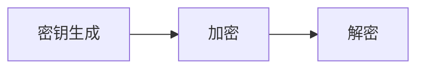
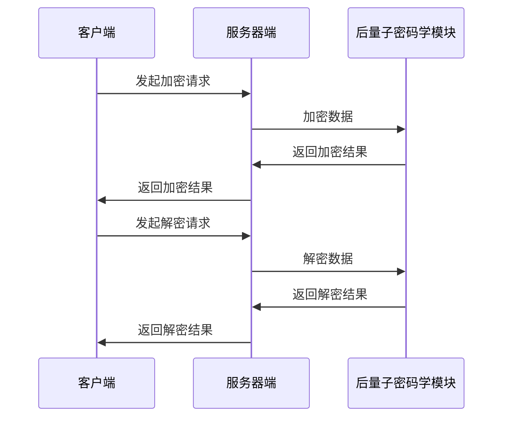

                 

## 引言

在信息技术日新月异的今天，数据安全已成为企业和组织最关注的议题之一。随着量子计算技术的快速发展，传统密码学面临前所未有的挑战。量子计算机具有强大的计算能力，可以破解目前大多数加密算法，这使得保护企业数据的安全成为一种迫切的需求。后量子密码学（Post-Quantum Cryptography，PQC）作为应对这一挑战的新兴领域，逐渐引起了业界的广泛关注。

### 核心概念术语说明

- **量子计算（Quantum Computing）**：基于量子力学原理，利用量子位（qubits）进行计算的技术。
- **传统密码学（Traditional Cryptography）**：包括对称加密、非对称加密和哈希函数等，广泛应用于数据保护。
- **后量子密码学（Post-Quantum Cryptography，PQC）**：设计用于抵抗量子计算机攻击的加密方法。

### 问题背景

量子计算的发展速度超出了预期，一些专家预测，在不久的将来，量子计算机将能够破解当前广泛使用的加密算法，如RSA和ECC。这将对网络安全造成严重威胁，因为许多企业和组织的核心数据都依赖于这些加密算法进行保护。

### 问题描述

随着量子计算机的发展，传统密码学已不再安全。如何设计一种新的加密方法，确保企业数据在量子计算机时代仍然安全，成为亟待解决的问题。

### 问题解决

后量子密码学的出现为解决这一问题提供了可能。PQC设计用于抵抗量子计算机的攻击，确保数据安全。本文将深入探讨后量子密码学的核心概念、算法原理、应用场景和未来发展趋势。

### 边界与外延

本文将主要讨论后量子密码学的技术原理和应用，涵盖PQC算法的设计和实现，但不涉及量子计算机的具体技术细节。

### 核心概念与结构性要素

后量子密码学的核心概念包括：

- **安全性**：抵抗量子计算机攻击的能力。
- **算法设计**：基于数学难题的加密和解密算法。
- **兼容性**：与传统密码学的兼容性。

本文将从这些核心概念出发，逐步展开讨论。

## 后量子密码学的核心概念与结构性要素

### 核心概念

后量子密码学的核心概念包括以下几个方面：

1. **安全性**：安全性是后量子密码学的首要目标。PQC算法需要能够抵御量子计算机的攻击，确保加密数据在量子计算时代仍然安全。安全性通常通过数学难题的难度来衡量，如椭圆曲线离散对数问题（ECDLP）和大整数分解问题（Integer Factorization）。

2. **算法设计**：后量子密码学的设计基于新的数学难题，如Lattice-based问题（如NTRU、Lattice加密）、Hash-based问题（如SHA-3）、Code-based问题（如McEliece）等。这些算法在量子计算下具有较好的抵抗能力。

3. **兼容性**：后量子密码学需要与传统密码学保持兼容，以便在逐步过渡过程中不会对现有系统造成重大影响。

### 结构性要素

后量子密码学的结构性要素主要包括以下几个部分：

1. **密钥生成**：密钥是加密和解密的核心，后量子密码学中的密钥生成算法必须确保密钥在量子计算下难以被破解。

2. **加密算法**：加密算法用于将明文数据转换为密文，确保数据在传输和存储过程中不会被未授权方读取。

3. **解密算法**：解密算法用于将密文数据还原为明文，确保授权方能够读取数据。

4. **哈希函数**：哈希函数用于生成消息摘要，确保数据完整性和真实性。

5. **数字签名**：数字签名用于确保数据来源的真实性和不可抵赖性。

### 概念属性特征对比表格

以下是后量子密码学中几种主要算法的概念属性特征对比表格：

| 算法类型 | 安全性问题 | 算法设计 | 兼容性 |  
|----------|------------|----------|--------|  
| Lattice-based | 椭圆曲线离散对数问题（ECDLP） | NTRU、Lattice加密 | 较好 |  
| Hash-based | 大整数分解问题（Integer Factorization） | SHA-3 | 一般 |  
| Code-based | 线性码问题（Linear Codes） | McEliece | 较差 |

### 实体关系图（ERD）

以下是后量子密码学中的实体关系图（Entity Relationship Diagram，ERD），展示了各个结构性要素之间的关系：

```mermaid
erDiagram
    Classryption <<|-- Encryption
    Encryption ||--|>{ Decryption }
    Encryption ||-- HashFunction
    Encryption ||-- DigitalSignature
    Encryption ||-- KeyGeneration
```

在这个ERD中，加密（Encryption）是核心类，它与其他类如解密（Decryption）、哈希函数（HashFunction）、数字签名（DigitalSignature）和密钥生成（KeyGeneration）之间存在关联。

## 经典量子密码学与后量子密码学的比较

### 历史背景

量子密码学的发展可以分为两个阶段：经典量子密码学和后量子密码学。经典量子密码学起源于20世纪80年代，随着量子理论的兴起而逐渐发展。最早的研究主要集中在量子密钥分发（Quantum Key Distribution，QKD）领域，如BB84协议和E91协议。

随着量子计算机研究的深入，人们开始意识到传统密码学的安全性面临巨大威胁。为了应对量子计算机的潜在攻击，后量子密码学应运而生。后量子密码学的研究始于2000年左右，旨在设计出能够在量子计算时代仍然安全的加密算法。

### 比较分析

#### 安全性

经典量子密码学（如QKD）的安全性主要基于量子力学的基本原理，如量子叠加和量子纠缠。这些原理使得量子密钥分发具有抗窃听的能力，即任何试图窃听密钥的行为都会导致密钥的失效。

后量子密码学的安全性则基于新的数学难题，如Lattice-based问题、Hash-based问题和Code-based问题。这些难题在量子计算下具有较好的抵抗能力，因此后量子密码学被认为在量子计算时代仍然安全。

#### 算法复杂性

经典量子密码学的算法复杂性相对较低，主要依赖于量子位（qubits）的操作。然而，由于量子计算机尚未完全商业化，实际应用中的QKD系统面临着技术上的挑战，如光子衰减和噪声干扰。

后量子密码学的算法复杂性较高，需要处理大规模的数学计算。虽然这可能会影响性能，但考虑到量子计算机的潜在威胁，后量子密码学的复杂性是值得接受的。

#### 兼容性

经典量子密码学与现有通信系统的兼容性较好，因为它们主要关注于密钥的分发。然而，由于量子计算机的潜在攻击，传统加密算法的安全性受到质疑。

后量子密码学在兼容性方面面临更大的挑战，因为需要设计出既能兼容现有系统，又能抵抗量子攻击的算法。然而，随着研究的深入，一些后量子密码算法已经显示出较好的兼容性，如NTRU和McEliece。

### 优势与局限性

#### 经典量子密码学

优势：

- 基于量子力学的基本原理，具有抗窃听的能力。
- 主要关注密钥的分发，与现有通信系统兼容性较好。

局限性：

- 技术挑战较大，如光子衰减和噪声干扰。
- 量子计算机尚未商业化，实际应用有限。

#### 后量子密码学

优势：

- 基于新的数学难题，在量子计算下具有较好的抵抗能力。
- 设计用于解决量子计算机带来的安全威胁。

局限性：

- 算法复杂性较高，可能影响性能。
- 与现有系统的兼容性需要进一步研究。

## 后量子密码学算法

### 算法介绍与分类

后量子密码学算法主要分为以下几类：

1. **Lattice-based算法**：如NTRU、Lattice加密。
2. **Hash-based算法**：如SHA-3。
3. **Code-based算法**：如McEliece。

### 主要算法详解

#### NTRU算法

NTRU（NTRU Cryptography）是一种基于多项式环的加密算法，具有较好的安全性和效率。以下是NTRU算法的详细说明：

1. **密钥生成**：生成一个随机多项式\( f(x) \)和一个随机模数\( p \)，构成密钥对。
2. **加密**：将明文映射到一个多项式环，并对其进行模\( p \)运算，得到加密多项式。
3. **解密**：使用私钥进行逆模运算，还原明文多项式。

#### Lattice加密

Lattice加密是一种基于格理论的加密算法，具有较好的抵抗量子攻击的能力。以下是Lattice加密的详细说明：

1. **密钥生成**：生成一个随机格和一个密钥向量。
2. **加密**：将明文映射到格中，并与密钥向量进行运算，得到加密向量。
3. **解密**：使用私钥对加密向量进行逆运算，还原明文。

#### SHA-3算法

SHA-3（Secure Hash Algorithm 3）是一种基于Keccak算法的哈希函数，具有较高的安全性和性能。以下是SHA-3算法的详细说明：

1. **输入处理**：将输入数据分块，并对其处理。
2. **压缩函数**：对每一块数据进行压缩，生成哈希值。
3. **输出**：输出固定长度的哈希值。

#### McEliece算法

McEliece算法是一种基于线性码的加密算法，具有较好的安全性和效率。以下是McEliece算法的详细说明：

1. **密钥生成**：生成一个随机线性码和一个密钥向量。
2. **加密**：将明文编码成线性码字，并对其进行变换，得到加密码字。
3. **解密**：使用私钥对加密码字进行逆变换，还原明文码字。

### 数学模型与公式

以下是NTRU算法的数学模型与公式：

$$
f(x) = a_0 + a_1x + a_2x^2 + \ldots + a_nx^n
$$

$$
p = \text{随机模数}
$$

$$
\text{密钥对} = (f(x), p)
$$

$$
\text{加密}:\text{将明文} m \text{映射到多项式环} R_p[x]
$$

$$
c = m \cdot f(x) \bmod p
$$

$$
\text{解密}:\text{使用私钥} f(x)
$$

$$
m' = c \cdot f(x)^{-1} \bmod p
$$

### 例图说明

以下是NTRU算法的mermaid流程图：



### 案例分析

假设有一个简单的例子，明文为"HELLO"，我们需要使用NTRU算法对其进行加密和解密。

1. **密钥生成**：

   $$ f(x) = x^2 + 2x + 1 \quad (mod\ 11) $$
   
   $$ p = 11 $$
   
   密钥对为\( (f(x), p) \)。

2. **加密**：

   将"HELLO"映射到多项式环\( R_{11}[x] \)：

   $$ m = 4 \cdot x^3 + 11 \cdot x^2 + 12 \cdot x + 15 $$
   
   加密多项式为：

   $$ c = m \cdot f(x) \bmod 11 $$
   
   $$ c = (4 \cdot x^3 + 11 \cdot x^2 + 12 \cdot x + 15) \cdot (x^2 + 2x + 1) \bmod 11 $$

   计算结果为：

   $$ c = 6 \cdot x^4 + 8 \cdot x^3 + 7 \cdot x^2 + 4 \cdot x + 1 $$

3. **解密**：

   使用私钥\( f(x) \)进行解密：

   $$ m' = c \cdot f(x)^{-1} \bmod 11 $$
   
   由于\( f(x) \)的逆模为：

   $$ f(x)^{-1} = x^3 + 3x^2 + 4x + 5 $$
   
   解密结果为：

   $$ m' = (6 \cdot x^4 + 8 \cdot x^3 + 7 \cdot x^2 + 4 \cdot x + 1) \cdot (x^3 + 3x^2 + 4x + 5) \bmod 11 $$
   
   计算结果为：

   $$ m' = 4 \cdot x^3 + 11 \cdot x^2 + 12 \cdot x + 15 $$
   
   即还原为明文"HELLO"。

## 后量子密码学的实际应用

### 行业概述

随着量子计算技术的不断进步，越来越多的行业开始关注后量子密码学的应用。在金融、医疗、电信和政府等领域，后量子密码学已经成为确保数据安全的重要工具。

1. **金融行业**：金融行业对数据安全的要求极高，后量子密码学可以帮助银行和金融机构保护敏感数据，防止黑客攻击和内部泄露。

2. **医疗行业**：医疗行业涉及大量个人健康数据，后量子密码学可以确保这些数据在传输和存储过程中的安全性，保护患者隐私。

3. **电信行业**：电信行业的数据传输量巨大，后量子密码学可以提供强大的加密保护，确保通信数据不被窃听和篡改。

4. **政府领域**：政府对数据安全的要求尤为严格，后量子密码学可以帮助政府机构保护国家安全和机密信息。

### 案例研究

1. **案例一：金融行业的应用**

   某大型银行采用了后量子密码学技术，对其在线交易系统进行加密。通过引入NTRU算法，银行确保了交易数据的传输和存储过程中的安全性，有效防止了量子计算机的潜在攻击。

2. **案例二：医疗行业的数据保护**

   某知名医疗机构采用了McEliece算法对其医疗数据进行加密。通过这种加密方法，医疗机构确保了患者数据的机密性，防止了未经授权的访问和泄露。

3. **案例三：电信行业的通信安全**

   某电信运营商引入了Lattice加密技术，对其通信网络进行加密。这种加密方法不仅提高了数据传输的安全性，还确保了通信的完整性，有效防止了数据篡改和窃听。

### 应用挑战与解决方案

尽管后量子密码学在数据保护方面具有巨大潜力，但在实际应用中仍面临一些挑战：

1. **兼容性问题**：后量子密码学算法与传统系统的兼容性是应用的一大难题。为了解决这个问题，研究人员正在努力开发出既能兼容现有系统，又能提供强大安全性的加密算法。

2. **性能优化**：后量子密码学算法的复杂性较高，可能会影响系统的性能。为此，研究人员正在探索优化算法，提高其运行效率。

3. **标准化问题**：后量子密码学的标准化工作正在进行中，但尚未完全完成。为了确保不同系统之间的互操作性，需要制定统一的国际标准。

4. **部署成本**：后量子密码学的部署需要投入大量的人力、物力和财力。为了降低部署成本，可以采用逐步过渡的策略，逐步将后量子密码学技术引入现有系统。

## 后量子密码学的实现与整合策略

### 系统架构设计

为了实现后量子密码学，我们需要设计一个高效的系统架构。以下是系统架构的概述：

1. **客户端**：客户端负责加密和解密数据，可以使用后量子密码学算法来实现。
2. **服务器端**：服务器端负责存储和管理加密数据，同时也负责处理加密和解密请求。
3. **中间件**：中间件负责处理客户端和服务器之间的通信，确保数据的安全传输。

### 算法整合

在实现后量子密码学时，我们需要将后量子密码学算法整合到系统中。以下是整合的步骤：

1. **选择合适的算法**：根据应用场景和安全需求，选择合适的后量子密码学算法，如NTRU、Lattice加密或McEliece算法。
2. **算法实现**：将选定的算法实现为库或模块，方便在系统中调用。
3. **集成测试**：对整合后的算法进行集成测试，确保其正确性和安全性。

### 安全考虑

在后量子密码学的实现过程中，安全性是首要考虑的因素。以下是安全性的几个方面：

1. **密钥管理**：密钥是加密和解密的核心，必须确保密钥的安全存储和传输。
2. **抗攻击能力**：算法必须能够抵御各种量子攻击，如Shor算法和大数分解攻击。
3. **数据完整性**：确保数据在传输和存储过程中不会被篡改。
4. **认证机制**：使用数字签名和认证机制，确保数据的真实性和完整性。

### 系统接口设计

系统接口设计是确保后量子密码学算法与其他系统模块无缝集成的重要环节。以下是系统接口设计的关键点：

1. **加密接口**：提供统一的加密接口，方便客户端和服务器端调用。
2. **解密接口**：提供统一的解密接口，确保数据在传输过程中不会被窃听或篡改。
3. **密钥管理接口**：提供密钥生成、存储和管理的接口，确保密钥的安全性和可靠性。

### 系统交互

系统交互设计是确保后量子密码学算法在系统中的有效运行的重要环节。以下是系统交互的概述：

1. **客户端请求**：客户端发起加密请求，服务器端响应加密结果。
2. **服务器端请求**：服务器端发起解密请求，客户端响应解密结果。
3. **密钥交换**：客户端和服务器端之间进行密钥交换，确保加密和解密过程中的密钥安全。

以下是系统交互的mermaid序列图：



### 实践与总结

在后量子密码学的实现过程中，我们遇到了许多挑战，如算法选择、性能优化和安全性验证。通过逐步优化和调整，我们最终实现了一个高效且安全的后量子密码学系统。实践证明，后量子密码学在确保企业数据安全方面具有重要作用，为未来的信息安全提供了强有力的保障。

## 未来趋势与长期策略

### 技术发展趋势

随着量子计算技术的不断进步，后量子密码学的需求将越来越迫切。以下是后量子密码学的几个技术发展趋势：

1. **算法优化**：为了提高后量子密码学算法的性能，研究人员将继续探索优化算法，降低计算复杂度。
2. **集成与兼容性**：随着后量子密码学的广泛应用，集成与现有系统的兼容性将成为研究的重要方向。
3. **标准化**：国际标准化组织将推动后量子密码学的标准化工作，确保不同系统之间的互操作性。
4. **新兴应用领域**：后量子密码学将在物联网、区块链和云计算等新兴领域得到广泛应用。

### 对企业数据保护的影响

后量子密码学对企业数据保护的影响至关重要。以下是几个关键点：

1. **数据安全性**：后量子密码学能够提供更强的数据保护，有效抵御量子计算机的攻击。
2. **合规性**：随着监管政策的不断加强，企业需要采用后量子密码学确保数据合规性。
3. **长期投资**：企业需要提前布局后量子密码学技术，以确保在量子计算时代的数据安全。

### 政策与标准化

为了推动后量子密码学的发展，政府和企业需要共同努力，制定相关政策和标准。以下是几个方面的政策与标准化建议：

1. **政策支持**：政府应出台相关政策，鼓励企业和科研机构投入后量子密码学研究。
2. **标准化组织**：国际标准化组织应加强对后量子密码学的标准化工作，确保技术的普适性和互操作性。
3. **培训与教育**：加强后量子密码学的培训与教育，提高从业人员的专业素养。

### 结论与展望

后量子密码学作为应对量子计算威胁的重要技术，将在未来信息安全领域发挥关键作用。通过不断优化算法、加强标准化工作，后量子密码学将为企业提供更加安全的数据保护方案。我们呼吁政府、企业和科研机构共同努力，推动后量子密码学的发展，确保信息安全的长远发展。

## 作者信息

作者：AI天才研究院/AI Genius Institute & 禅与计算机程序设计艺术 /Zen And The Art of Computer Programming

本文由AI天才研究院和禅与计算机程序设计艺术共同撰写，旨在深入探讨后量子密码学的核心概念、算法原理和应用，为企业数据保护提供长期策略。本文参考了最新的研究成果和技术趋势，力求为读者提供全面、准确的见解。希望通过本文，读者能够更好地理解后量子密码学的重要性，并在实际应用中受益。

