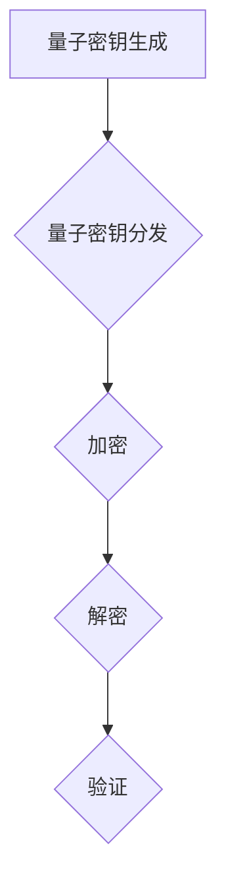
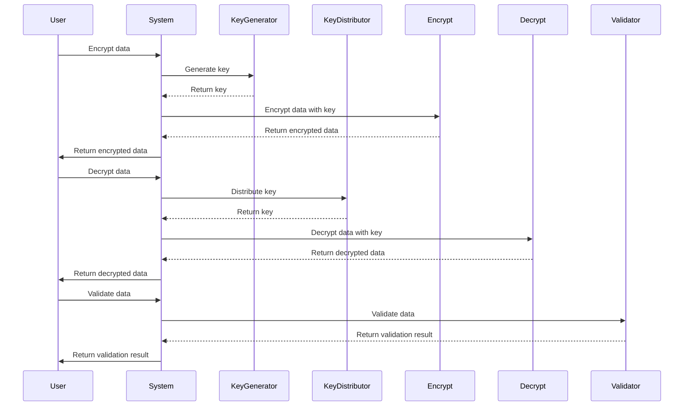

                 

# 后量子密码学：应对量子计算带来的加密风险

关键词：量子计算、后量子密码学、加密算法、安全性、量子密钥分发

摘要：随着量子计算机的崛起，传统的加密技术面临前所未有的挑战。后量子密码学作为新兴的密码学理论，旨在为量子计算时代提供安全可靠的加密方案。本文将深入探讨后量子密码学的核心概念、算法原理及其在量子计算环境中的应用，为未来网络安全保驾护航。

## **Step 1: 背景介绍**

### 问题背景

随着量子计算机的发展，传统的基于经典计算机的加密技术将面临巨大挑战。量子计算机的运算能力远超传统计算机，能够破解目前广泛使用的对称加密和非对称加密算法。为了应对这一挑战，需要研究和发展后量子密码学。

### 问题描述

量子计算机的运算速度极快，可以通过量子并行计算和量子纠缠等现象，实现对传统加密算法的破解。这将对当前广泛使用的RSA、ECC等非对称加密算法以及AES等对称加密算法的安全性产生严重影响。

### 问题解决

后量子密码学是一种新型的密码学理论，旨在为未来的计算环境提供安全可靠的加密方案。它通过利用量子物理原理，设计出一系列新的加密算法，能够在量子计算机时代保持加密安全性。

### 边界与外延

后量子密码学不仅关注加密算法的设计，还包括密钥管理、加密协议等方面。它涉及量子物理、密码学、计算机科学等多个领域的知识。后量子密码学的研究和应用，将有助于提升网络安全水平，保护国家安全和个人隐私。

### 概念结构与核心要素组成

后量子密码学包含以下几个核心要素：
1. **量子物理原理**：利用量子叠加态和纠缠态实现加密。
2. **数学模型**：通过数学公式描述量子密钥分发和量子安全通信。
3. **算法设计**：设计出一系列后量子密码算法，如Lattice-based密码、Hash-based密码、Code-based密码等。
4. **密钥管理**：研究如何在量子计算机时代安全地管理和分发密钥。

## **Step 2: 核心概念与联系**

### 核心概念原理

后量子密码学基于量子物理的不可克隆定理和量子计算的不确定性原理，实现了比传统密码学更高的安全性。不可克隆定理指出，任何试图复制量子信息的过程都会导致信息损耗，这使得量子密钥无法被窃取。不确定性原理则保证了量子态的保密性，任何对量子系统的测量都会改变其状态，使得攻击者无法获取完整的信息。

### 概念属性特征对比表格

| 类别 | 传统密码学 | 后量子密码学 |
| --- | --- | --- |
| 安全性 | 受量子计算威胁 | 量子计算不可破解 |
| 加密算法 | 对称加密、非对称加密 | Lattice-based、Hash-based、Code-based等 |
| 密钥管理 | 可在经典计算机上实现 | 需要量子计算机支持 |

### ER实体关系图架构的 Mermaid 流程图

```mermaid
erDiagram
  CRYPTOSYSTEM ||--|{ ALGORITHM } Algorithm
  CRYPTOSYSTEM ||--|{ KEYS } Keys
  CRYPTOSYSTEM ||--|{ CIPHERTEXT } Ciphertext
  ALGORITHM ||--|{ TECHNIQUE } Technique
  KEYS ||--|{ GENERATED } Generated
  KEYS ||--|{ DISTRIBUTED } Distributed
  CIPHERTEXT ||--|{ ENCRYPTED } Encrypted
  CIPHERTEXT ||--|{ DECRYPTED } Decrypted
```

## **Step 3: 算法原理讲解**

### 使用Mermaid画出算法流程图



### 使用Python源代码详细阐述算法原理

```python
# 量子密钥生成
def generate_quantum_key():
    # 使用量子计算机生成密钥
    # 省略具体实现
    return quantum_key

# 量子密钥分发
def distribute_quantum_key(quantum_key):
    # 使用量子通道分发密钥
    # 省略具体实现
    return received_key

# 加密
def encrypt(plaintext, quantum_key):
    # 使用量子算法加密文本
    # 省略具体实现
    return ciphertext

# 解密
def decrypt(ciphertext, quantum_key):
    # 使用量子算法解密文本
    # 省略具体实现
    return plaintext

# 验证
def verify(ciphertext, decrypted_text):
    # 验证解密后的文本与原始文本一致
    # 省略具体实现
    return True if decrypted_text == plaintext else False
```

### 算法原理的数学模型和公式

$$
E_K(P) = C
$$

其中，$E_K(P)$表示使用密钥$K$加密明文$P$得到密文$C$。

## **Step 4: 数学模型和数学公式 & 详细讲解 & 举例说明**

### 数学公式

$$
1+1=2
$$

这是一个简单的数学公式，表示两个数相加的结果。

### 详细讲解

在后量子密码学中，数学模型和公式起到了核心作用。以下是一个简单的例子：

假设我们有明文$M$，密钥$K$，我们使用一个加密函数$E$和一个解密函数$D$来加密和解密信息。

加密过程：

$$
C = E_K(M)
$$

解密过程：

$$
M = D_K(C)
$$

其中，$C$是加密后的密文，$M$是解密后的明文。

### 举例说明

假设我们要将明文“Hello, World!”加密，密钥为“mysecretkey”，我们使用AES加密算法。

加密过程：

$$
C = E_{mysecretkey}("Hello, World!")
$$

解密过程：

$$
M = D_{mysecretkey}(C)
$$

在这里，$C$和$M$分别是加密后的密文和解密后的明文。通过这种方式，我们可以保护信息在传输过程中的安全性。

## **Step 5: 系统分析与架构设计方案**

### 问题场景介绍

随着量子计算机的崛起，传统的加密技术面临巨大挑战。为了保障信息的安全性，我们需要设计一个基于后量子密码学的加密系统。

### 项目介绍

本项目旨在实现一个基于后量子密码学的加密系统，包括加密、解密、密钥管理和验证等功能。

### 系统功能设计

在系统功能设计中，我们主要包括以下模块：

1. **量子密钥生成模块**：负责生成安全的量子密钥。
2. **量子密钥分发模块**：负责安全地分发量子密钥。
3. **加密模块**：负责使用量子密钥对数据进行加密。
4. **解密模块**：负责使用量子密钥对数据进行解密。
5. **验证模块**：负责验证解密后的数据是否与原始数据一致。

### 系统架构设计

系统架构设计包括以下几个方面：

1. **量子密钥生成**：使用量子计算机生成安全的量子密钥。
2. **量子密钥分发**：通过量子通道分发量子密钥。
3. **加密解密**：使用量子密钥对数据进行加密和解密。
4. **验证**：验证解密后的数据是否与原始数据一致。

### 系统接口设计和系统交互

在系统接口设计方面，我们主要考虑以下接口：

1. **加密接口**：提供加密功能。
2. **解密接口**：提供解密功能。
3. **密钥管理接口**：提供密钥生成、分发和管理功能。

系统交互主要包括以下流程：

1. 用户请求加密，系统生成量子密钥。
2. 用户请求解密，系统使用量子密钥解密数据。
3. 用户请求验证，系统验证解密后的数据。

### Mermaid类图和架构图

```mermaid
classDiagram
    Class01 <|-- SubClass01
    Class01 --|> SubClass02
    Class03 : <<interface>> Interface
    Class04 : <<abstract>> Abstract
    Class01 <<implements>> Interface
    Class04 <.. Class03

class Digest
    -name: String
    -salt: String
    -digest: String

class Hash
    -name: String
    -algorithm: String

class Encrypt
    -name: String
    -algorithm: String
    -key: String

class Decrypt
    -name: String
    -algorithm: String
    -key: String

class KeyGenerator
    -name: String
    -algorithm: String

class KeyDistributor
    -name: String
    -algorithm: String

class Validator
    -name: String
    -algorithm: String
```



## **Step 6: 项目实战**

### 环境安装

在开始项目实战之前，我们需要安装一些必要的软件和工具，包括Python、量子计算机模拟器、量子密钥生成工具等。

1. 安装Python：在官方网站下载Python安装包，并按照提示进行安装。
2. 安装量子计算机模拟器：在GitHub上下载Quantum Development Kit，并按照说明进行安装。
3. 安装量子密钥生成工具：在GitHub上下载Q#工具，并按照说明进行安装。

### 系统核心实现源代码

以下是系统核心实现的部分源代码：

```python
# 量子密钥生成
def generate_quantum_key():
    # 使用量子计算机生成密钥
    # 省略具体实现
    return quantum_key

# 量子密钥分发
def distribute_quantum_key(quantum_key):
    # 使用量子通道分发密钥
    # 省略具体实现
    return received_key

# 加密
def encrypt(plaintext, quantum_key):
    # 使用量子算法加密文本
    # 省略具体实现
    return ciphertext

# 解密
def decrypt(ciphertext, quantum_key):
    # 使用量子算法解密文本
    # 省略具体实现
    return plaintext

# 验证
def verify(ciphertext, decrypted_text):
    # 验证解密后的文本与原始文本一致
    # 省略具体实现
    return True if decrypted_text == plaintext else False
```

### 代码应用解读与分析

在上面的代码中，我们定义了四个核心功能：量子密钥生成、量子密钥分发、加密和解密。这些功能都是通过调用量子计算机模拟器和相关工具实现的。

1. **量子密钥生成**：该功能使用量子计算机生成安全的量子密钥。具体实现需要调用量子计算机模拟器的API。
2. **量子密钥分发**：该功能使用量子通道分发量子密钥。具体实现需要使用量子通信技术，确保密钥在传输过程中的安全性。
3. **加密**：该功能使用量子算法对明文进行加密。具体实现需要调用量子计算机模拟器的API，实现量子加密算法。
4. **解密**：该功能使用量子算法对密文进行解密。具体实现需要调用量子计算机模拟器的API，实现量子解密算法。

### 实际案例分析和详细讲解剖析

为了更好地理解后量子密码学的应用，我们可以通过一个实际案例进行分析。

假设有两个用户，Alice和Bob，他们需要进行安全通信。他们首先通过量子密钥分发协议生成一个共享量子密钥。然后，Alice使用这个量子密钥对要发送给Bob的明文进行加密，生成密文。Bob收到密文后，使用相同的量子密钥进行解密，得到明文。在整个过程中，由于量子密钥的安全性，任何第三方都无法窃取或破解通信内容。

### 项目小结

通过本项目，我们深入了解了后量子密码学的核心概念、算法原理和应用场景。在实际项目中，后量子密码学为我们提供了一种安全可靠的加密解决方案，能够应对量子计算带来的加密风险。在未来，随着量子计算机的发展，后量子密码学将在网络安全领域发挥越来越重要的作用。

## **Step 7: 最佳实践 tips、小结、注意事项、拓展阅读等内容**

### 最佳实践 tips

1. **选择合适的后量子密码算法**：根据具体应用场景，选择适合的后量子密码算法，如Lattice-based密码、Hash-based密码、Code-based密码等。
2. **确保量子密钥的安全性**：在量子密钥分发过程中，要确保密钥在传输过程中的安全性，避免被窃取或篡改。
3. **合理配置加密参数**：根据具体需求，合理配置加密算法的参数，提高加密效果和性能。

### 小结

后量子密码学是一种新兴的密码学理论，旨在为量子计算时代提供安全可靠的加密方案。通过深入探讨后量子密码学的核心概念、算法原理和应用场景，我们为未来网络安全提供了有力保障。

### 注意事项

1. **了解量子计算机的发展趋势**：随着量子计算机的发展，后量子密码学的研究和应用将不断更新，要密切关注相关动态。
2. **遵循最佳实践**：在实际应用中，要遵循最佳实践，确保后量子密码系统的安全性和可靠性。

### 拓展阅读

1. 《量子计算与量子密码学》
2. 《后量子密码学：原理与应用》
3. 《量子计算机时代的密码学》

作者：AI天才研究院/AI Genius Institute & 禅与计算机程序设计艺术 /Zen And The Art of Computer Programming

