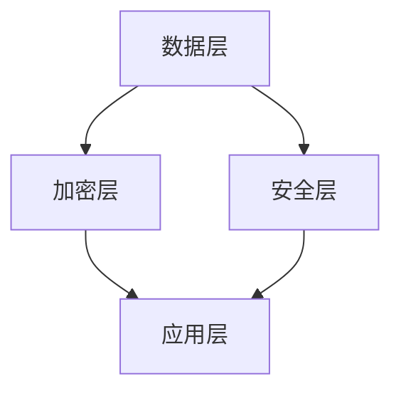
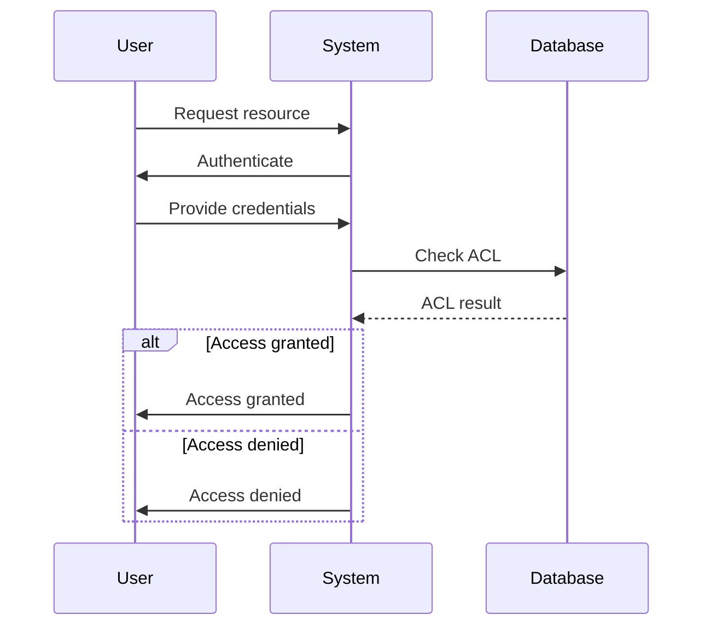

                 

### 后量子时代的数据保护：企业安全新范式

**关键词**：后量子时代、数据保护、企业安全、量子计算、量子加密

**摘要**：随着信息技术的迅猛发展，数据已经成为企业核心竞争力的重要组成部分。然而，伴随而来的是数据泄露和网络安全威胁的日益严峻。在量子计算即将颠覆传统计算模式的背景下，后量子时代的数据保护成为企业必须面对的新挑战。本文将深入探讨后量子时代的数据保护概念、原理、技术方案以及企业安全新范式，旨在为企业提供切实可行的安全解决方案，以应对未来更复杂的安全威胁。

### 目录大纲

```markdown
# 后量子时代的数据保护：企业安全新范式

## 第一部分：背景介绍

## 第1章：问题背景与核心概念

### 1.1 问题背景

### 1.2 核心概念

### 1.3 后量子时代与企业数据保护的关系

## 第二部分：核心概念与联系

## 第2章：后量子时代的数据保护原理

### 2.1 后量子加密算法

### 2.2 企业安全体系构建

### 2.3 后量子技术与传统安全的对比

## 第三部分：算法原理讲解

## 第3章：后量子加密算法详解

### 3.1 量子密钥分发（QKD）

### 3.2 后量子加密算法实现

### 3.3 算法原理与数学公式

## 第四部分：系统分析与架构设计方案

## 第4章：企业安全新范式设计

### 4.1 项目介绍

### 4.2 系统功能设计

### 4.3 系统架构设计

### 4.4 系统接口设计

### 4.5 系统交互设计

## 第五部分：项目实战

## 第5章：后量子时代的数据保护项目实施

### 5.1 环境安装

### 5.2 系统核心实现

### 5.3 实际案例分析

### 5.4 详细讲解剖析

### 5.5 项目小结

## 第六部分：最佳实践与拓展阅读

## 第6章：最佳实践与注意事项

### 6.1 最佳实践

### 6.2 小结

### 6.3 注意事项

### 6.4 拓展阅读
```

#### 第一部分：背景介绍

### 1.1 问题背景

在当今信息化社会中，数据已经成为企业运行和发展的核心资产。随着云计算、大数据、物联网等技术的普及，数据量呈现爆炸式增长。这不仅为企业提供了丰富的信息资源，也带来了前所未有的数据安全挑战。

**数据量爆炸式增长**：全球数据量每年以惊人的速度增长，据国际数据公司（IDC）预测，到2025年，全球数据总量将达到175ZB。如此庞大的数据量不仅增加了存储和管理的难度，也为恶意攻击者提供了更多的攻击目标。

**网络攻击手段日益复杂**：随着网络技术的进步，网络攻击的手段也在不断升级。从传统的病毒、木马到高级持续性威胁（APT），再到勒索软件、社交工程等，网络攻击手段变得愈发复杂和隐蔽。企业面临着越来越多的数据泄露和网络攻击风险。

**企业数据安全风险加剧**：数据泄露事件的频繁发生，不仅对企业造成了严重的经济损失，还损害了企业的声誉和客户信任。例如，2017年的万豪酒店数据泄露事件导致1.3亿客户的个人信息被窃取，给企业带来了巨大的负面影响。

### 1.2 核心概念

**数据保护**：数据保护是指通过一系列技术和管理措施，确保数据在存储、传输和使用过程中的完整性、保密性和可用性。其目的在于防止数据被非法访问、篡改、泄露和破坏。

- **定义**：数据保护是信息安全的重要组成部分，旨在确保数据的安全性、完整性和可靠性。
- **目的**：防止数据泄露、数据篡改、数据丢失和系统崩溃。
- **方式**：加密、访问控制、备份与恢复、安全审计等。

**企业安全**：企业安全是指通过综合措施保护企业的信息资产、网络系统和业务流程免受各种威胁和攻击。其核心目标是确保企业的正常运营和可持续发展。

- **定义**：企业安全包括物理安全、网络安全、数据安全、应用安全等多个方面，旨在保护企业的信息资产和业务流程。
- **威胁类型**：网络攻击、数据泄露、系统漏洞、内部威胁等。
- **应对策略**：安全策略制定、安全意识培训、安全设备部署、安全事件响应等。

### 1.3 后量子时代与企业数据保护的关系

**量子计算的影响**：量子计算是一种利用量子力学原理进行计算的新型计算模式。它具有超强的计算能力，能够破解传统加密算法。这对企业数据保护带来了巨大的挑战，因为传统的加密技术可能无法抵御量子计算机的攻击。

- **加密算法的挑战**：量子计算机能够快速破解现有的加密算法，如RSA、ECC等，这意味着企业需要寻找新的加密方案来保护数据。
- **安全协议的更新**：随着量子计算的发展，现有的安全协议需要不断更新和改进，以应对量子计算机的威胁。

**量子通信的优势**：量子通信利用量子纠缠和量子叠加等量子力学特性进行通信，能够实现绝对安全的通信。这对于企业数据传输过程中的保护具有重要意义。

- **安全传输**：量子通信可以实现端到端的安全传输，确保数据在传输过程中的保密性和完整性。
- **隐私保护**：量子通信能够有效防止窃听和数据泄露，为企业的数据传输提供更高的安全保障。

**量子加密的前景**：量子加密是利用量子力学原理进行加密和解密的技术。它具有理论上的绝对安全性，有望成为未来数据保护的主要技术手段。

- **现有加密系统的替代**：量子加密能够替代现有的加密系统，为企业提供更安全的保护。
- **未来安全标准的制定**：随着量子加密技术的发展，新的安全标准将逐步制定和推广，为企业数据保护提供指导。

### 总结

后量子时代的到来，给企业数据保护带来了新的挑战和机遇。企业需要积极应对这些挑战，探索和应用新的数据保护技术，以构建更强大的企业安全体系，确保企业的可持续发展。

---

#### 第一部分：背景介绍

### 1.1 问题背景

在当今信息化社会中，数据已经成为企业核心竞争力的重要组成部分。随着云计算、大数据、物联网等技术的普及，数据量呈现爆炸式增长。这不仅为企业提供了丰富的信息资源，也带来了前所未有的数据安全挑战。

**数据量爆炸式增长**：全球数据量每年以惊人的速度增长，据国际数据公司（IDC）预测，到2025年，全球数据总量将达到175ZB。如此庞大的数据量不仅增加了存储和管理的难度，也为恶意攻击者提供了更多的攻击目标。

**网络攻击手段日益复杂**：随着网络技术的进步，网络攻击的手段也在不断升级。从传统的病毒、木马到高级持续性威胁（APT），再到勒索软件、社交工程等，网络攻击手段变得愈发复杂和隐蔽。企业面临着越来越多的数据泄露和网络攻击风险。

**企业数据安全风险加剧**：数据泄露事件的频繁发生，不仅对企业造成了严重的经济损失，还损害了企业的声誉和客户信任。例如，2017年的万豪酒店数据泄露事件导致1.3亿客户的个人信息被窃取，给企业带来了巨大的负面影响。

### 1.2 核心概念

**数据保护**：数据保护是指通过一系列技术和管理措施，确保数据在存储、传输和使用过程中的完整性、保密性和可用性。其目的在于防止数据被非法访问、篡改、泄露和破坏。

- **定义**：数据保护是信息安全的重要组成部分，旨在确保数据的安全性、完整性和可靠性。
- **目的**：防止数据泄露、数据篡改、数据丢失和系统崩溃。
- **方式**：加密、访问控制、备份与恢复、安全审计等。

**企业安全**：企业安全是指通过综合措施保护企业的信息资产、网络系统和业务流程免受各种威胁和攻击。其核心目标是确保企业的正常运营和可持续发展。

- **定义**：企业安全包括物理安全、网络安全、数据安全、应用安全等多个方面，旨在保护企业的信息资产和业务流程。
- **威胁类型**：网络攻击、数据泄露、系统漏洞、内部威胁等。
- **应对策略**：安全策略制定、安全意识培训、安全设备部署、安全事件响应等。

### 1.3 后量子时代与企业数据保护的关系

**量子计算的影响**：量子计算是一种利用量子力学原理进行计算的新型计算模式。它具有超强的计算能力，能够破解传统加密算法。这对企业数据保护带来了巨大的挑战，因为传统的加密技术可能无法抵御量子计算机的攻击。

- **加密算法的挑战**：量子计算机能够快速破解现有的加密算法，如RSA、ECC等，这意味着企业需要寻找新的加密方案来保护数据。
- **安全协议的更新**：随着量子计算的发展，现有的安全协议需要不断更新和改进，以应对量子计算机的威胁。

**量子通信的优势**：量子通信利用量子纠缠和量子叠加等量子力学特性进行通信，能够实现绝对安全的通信。这对于企业数据传输过程中的保护具有重要意义。

- **安全传输**：量子通信可以实现端到端的安全传输，确保数据在传输过程中的保密性和完整性。
- **隐私保护**：量子通信能够有效防止窃听和数据泄露，为企业的数据传输提供更高的安全保障。

**量子加密的前景**：量子加密是利用量子力学原理进行加密和解密的技术。它具有理论上的绝对安全性，有望成为未来数据保护的主要技术手段。

- **现有加密系统的替代**：量子加密能够替代现有的加密系统，为企业提供更安全的保护。
- **未来安全标准的制定**：随着量子加密技术的发展，新的安全标准将逐步制定和推广，为企业数据保护提供指导。

### 总结

后量子时代的到来，给企业数据保护带来了新的挑战和机遇。企业需要积极应对这些挑战，探索和应用新的数据保护技术，以构建更强大的企业安全体系，确保企业的可持续发展。

---

#### 第一部分：背景介绍

### 1.2 核心概念

在探讨后量子时代的数据保护之前，我们有必要明确几个关键概念：数据保护、企业安全以及后量子时代本身。

**数据保护**：数据保护是指通过技术和管理措施，确保数据的完整性、保密性和可用性。具体包括以下方面：

- **数据完整性**：确保数据在存储、传输和处理过程中不被未经授权的篡改或破坏。
- **数据保密性**：通过加密等技术手段，防止数据在传输或存储过程中被非法访问或泄露。
- **数据可用性**：确保数据在需要时能够被合法授权的用户访问和使用。

**企业安全**：企业安全是指通过一系列措施保护企业的信息资产、网络系统和业务流程，防止各种安全威胁。企业安全涉及多个领域，包括：

- **网络安全**：保护企业网络免受外部攻击，包括DDoS攻击、网络入侵等。
- **数据安全**：确保企业数据的机密性、完整性和可用性，防止数据泄露、篡改和丢失。
- **应用安全**：确保企业应用程序的安全性，防止应用层面的漏洞和攻击。

**后量子时代**：后量子时代是指量子计算技术快速发展并开始影响各个领域的时期。量子计算利用量子力学原理，具有超越传统计算机的巨大计算能力。后量子时代的特点包括：

- **量子计算**：量子计算机能够解决传统计算机无法处理的复杂问题，如大数分解、优化问题等。
- **量子通信**：量子通信利用量子纠缠和量子叠加等原理，实现绝对安全的通信。
- **量子加密**：量子加密技术具有理论上的绝对安全性，能够抵御包括量子计算机在内的任何攻击。

### 后量子时代的数据保护需求

后量子时代的到来，对数据保护提出了新的挑战和需求。以下是一些关键点：

**传统加密的局限**：传统的加密算法，如RSA、ECC等，基于数学难题的难解性。然而，随着量子计算的发展，这些算法可能面临被量子计算机破解的风险。因此，企业需要寻找新的加密技术，如量子加密，来替代现有的加密方案。

**数据传输的安全**：在量子通信的背景下，数据传输的安全变得更加重要。量子通信可以实现端到端的安全传输，防止数据在传输过程中被窃听或篡改。这对于企业保护敏感数据至关重要。

**全面的安全策略**：后量子时代的数据保护需要企业构建全面的安全策略，包括技术措施和管理措施。技术措施方面，需要采用量子加密技术；管理措施方面，需要加强安全意识培训、制定严格的安全政策和进行定期的安全审计。

### 未来展望

随着量子计算技术的不断发展，后量子时代的数据保护将成为企业必须面对的重要课题。企业需要积极拥抱新技术，不断提升数据保护能力，以应对未来更复杂的安全威胁。通过引入量子加密技术、加强安全策略和管理，企业可以构建更加坚固的数据保护体系，确保数据的安全和业务的连续性。

---

### 第一部分：背景介绍

#### 1.3 后量子时代与企业数据保护的关系

后量子时代的到来，不仅带来了计算能力的飞跃，也对企业数据保护提出了新的挑战和机遇。量子计算、量子通信和量子加密技术的迅猛发展，正在改变传统数据保护的面貌，为企业构建更为坚固的安全体系提供了可能。

**量子计算的影响**：量子计算以其超强的计算能力，能够解决传统计算机无法处理的问题，如大数分解、复杂优化等。这一特性使得量子计算机具备破解传统加密算法的能力，从而对现有的数据保护体系构成了巨大挑战。例如，著名的RSA算法和ECC算法，依赖于大数分解和离散对数的难度，一旦量子计算机能够快速破解这些算法，企业存储和传输的数据将面临严重的威胁。

**加密算法的挑战**：现有的加密算法，包括RSA、ECC、AES等，都基于特定的数学难题，如大数分解、离散对数等。然而，量子计算机通过Shor算法可以在多项式时间内破解这些难题，使得传统加密技术面临被淘汰的风险。为了应对这一挑战，企业需要重新评估和选择新的加密算法，如量子加密技术，以确保数据的长期安全性。

**安全协议的更新**：随着量子计算的发展，现有的安全协议也需要进行相应的更新和改进。例如，TLS协议作为网络通信中的重要安全协议，也需要考虑量子计算的威胁，开发新的量子安全版本来提升其安全性。

**量子通信的优势**：量子通信利用量子纠缠和量子叠加等原理，能够实现绝对安全的通信。量子通信的主要优势在于其能够实现端到端的安全传输，确保数据在传输过程中的保密性和完整性。量子通信可以防止窃听和数据泄露，为企业的数据传输提供了更高的安全保障。例如，量子密钥分发（QKD）技术，通过量子态的传输和测量，可以生成绝对安全的密钥，用于加密通信数据。

**隐私保护**：量子通信的隐私保护能力，使得企业能够更好地保护敏感数据。在量子通信中，任何窃听行为都会导致量子态的坍塌，从而被通信双方立即检测到。这种绝对安全的通信方式，为企业保护数据隐私提供了强有力的保障。

**量子加密的前景**：量子加密技术，利用量子力学原理，具有理论上的绝对安全性。量子加密技术包括量子密钥分发（QKD）和量子算法等，能够抵御传统加密算法无法抵抗的攻击，如量子计算机的破解。量子加密技术的应用，将为企业构建更为坚固的数据保护体系，提供新的技术手段。

**现有加密系统的替代**：随着量子加密技术的发展，传统加密系统逐渐暴露出其局限性。量子加密技术有望替代现有的加密系统，成为未来数据保护的主要手段。通过引入量子加密技术，企业可以显著提升数据的安全性和可靠性。

**未来安全标准的制定**：随着量子技术的发展，新的安全标准也在逐步制定和推广。这些标准将为企业的数据保护提供指导，确保数据在不同阶段都能得到有效保护。例如，国际标准化组织（ISO）和IEEE等机构，已经开始制定相关的量子安全标准。

**企业应对策略**：面对后量子时代的挑战，企业需要采取积极的应对策略，以提升数据保护能力。这些策略包括：

1. **技术升级**：引入量子加密技术，替代传统的加密算法，确保数据的长期安全性。
2. **安全培训**：加强员工的安全意识培训，提高对量子技术和数据保护的认识。
3. **安全审计**：定期进行安全审计，识别潜在的安全风险，及时采取措施进行修复。
4. **合作与交流**：与量子技术研究机构、安全厂商等合作，共同推动量子安全技术的发展。

**总结**：后量子时代的到来，对企业数据保护提出了新的挑战。然而，随着量子计算、量子通信和量子加密技术的不断发展，企业也有望找到更为有效的数据保护手段。通过引入新的技术和策略，企业可以构建更为坚固的数据保护体系，确保数据的长期安全。

---

### 第二部分：核心概念与联系

#### 2.1 后量子时代的数据保护原理

在探讨后量子时代的数据保护原理之前，我们需要了解量子计算、量子通信和量子加密技术的基本概念。这些技术为数据保护提供了全新的视角和手段。

**量子计算**：量子计算是一种基于量子力学原理的新型计算模式。与传统计算机不同，量子计算机利用量子位（qubit）来表示和处理信息，具有叠加和纠缠的特性。这些特性使得量子计算机在解决某些特定问题上，如大数分解和复杂优化，具有超越传统计算机的强大能力。

**量子通信**：量子通信利用量子纠缠和量子叠加等量子力学原理，实现绝对安全的通信。量子通信的主要形式包括量子密钥分发（QKD）和量子隐形传态。QKD通过量子态的传输和测量，生成绝对安全的密钥，用于加密通信数据。量子隐形传态则可以实现信息的无误差传输。

**量子加密**：量子加密是利用量子力学原理进行加密和解密的技术。量子加密算法具有理论上的绝对安全性，能够抵御包括量子计算机在内的任何攻击。例如，量子密钥分发（QKD）和基于量子纠缠的量子加密算法，都是量子加密的典型应用。

**量子计算对数据保护的影响**：量子计算的发展，对传统数据保护体系构成了巨大挑战。现有的加密算法，如RSA、ECC等，基于特定的数学难题，这些难题在经典计算机中难以破解，但在量子计算机中，却可以迅速破解。这意味着，现有的数据保护手段可能无法抵御未来的量子攻击。因此，企业需要寻找新的加密技术，如量子加密，来替代传统的加密算法，确保数据的长期安全性。

**量子通信的优势**：量子通信利用量子纠缠和量子叠加等原理，实现绝对安全的通信。量子通信的主要优势在于其能够实现端到端的安全传输，确保数据在传输过程中的保密性和完整性。量子通信可以防止窃听和数据泄露，为企业的数据传输提供了更高的安全保障。例如，量子密钥分发（QKD）技术，通过量子态的传输和测量，可以生成绝对安全的密钥，用于加密通信数据。

**量子加密的前景**：量子加密是利用量子力学原理进行加密和解密的技术。量子加密算法具有理论上的绝对安全性，能够抵御传统加密算法无法抵抗的攻击，如量子计算机的破解。量子加密技术的应用，将为企业构建更为坚固的数据保护体系，提供新的技术手段。

**量子计算、量子通信和量子加密的关系**：量子计算、量子通信和量子加密是紧密相连的。量子计算提供了强大的计算能力，为量子加密算法的实现提供了技术支持。量子通信则利用量子纠缠和量子叠加等原理，实现绝对安全的通信，为量子加密提供了应用场景。量子加密算法通过量子计算和量子通信，实现了数据的绝对安全保护。

**企业数据保护的需求**：在后量子时代，企业数据保护面临着新的挑战。传统加密技术可能无法抵御量子计算机的攻击，企业需要寻找新的加密技术，如量子加密，来替代现有的加密算法。同时，量子通信的崛起，也为企业提供了更安全的通信手段，确保数据在传输过程中的保密性和完整性。量子计算、量子通信和量子加密的结合，将为企业构建更为坚固的数据保护体系，提供新的技术手段。

**总结**：后量子时代的数据保护，需要量子计算、量子通信和量子加密的有机结合。通过引入这些新技术，企业可以构建更强大的数据保护体系，确保数据的安全性、完整性和可用性。面对未来的安全威胁，企业需要积极拥抱新技术，不断提升数据保护能力，以应对更复杂的安全挑战。

---

### 第三部分：算法原理讲解

#### 3.1 后量子加密算法详解

后量子加密算法，是利用量子力学原理进行加密和解密的技术。与传统的加密算法相比，后量子加密算法具有理论上的绝对安全性，能够抵御量子计算机的攻击。本文将详细介绍后量子加密算法的基本原理、实现方法以及应用场景。

#### 3.1.1 量子密钥分发（QKD）

量子密钥分发（Quantum Key Distribution，QKD）是量子加密的核心技术之一。QKD通过量子通信实现绝对安全的密钥分发，确保通信双方共享的密钥不会被第三方窃取或破解。QKD的基本原理如下：

**工作原理**：

1. **量子态制备**：发送方将经典随机数转换为量子态，并利用量子信道将其发送给接收方。
2. **量子态传输**：接收方接收量子态，并根据预定的协议进行量子态测量。
3. **量子态测量**：接收方将测量结果发送给发送方，双方根据测量结果确认共享的密钥。

**技术优势**：

1. **绝对安全性**：QKD基于量子力学原理，任何窃听行为都会导致量子态的坍塌，从而被通信双方检测到。这意味着，QKD可以实现绝对安全的密钥分发。
2. **高效率**：QKD可以实现高效的数据传输，在量子通信信道带宽较小的情况下，QKD可以提供较高的密钥传输速率。
3. **抗量子攻击**：QKD可以有效抵御量子计算机的攻击，因为量子计算机无法在短时间内破解QKD生成的密钥。

**实现方法**：

QKD的实现通常采用以下步骤：

1. **量子信道搭建**：建立量子通信信道，如光纤量子通信或自由空间量子通信。
2. **量子态制备与传输**：发送方将经典随机数转换为量子态，并利用量子信道将其发送给接收方。
3. **量子态测量与结果确认**：接收方对量子态进行测量，并将测量结果发送给发送方。双方根据测量结果确认共享的密钥。

**应用场景**：

QKD主要应用于以下场景：

1. **企业内部通信**：企业可以通过QKD技术，确保内部通信的安全性，防止敏感信息泄露。
2. **金融行业**：金融行业对数据安全性要求极高，QKD可以为金融交易提供绝对安全的加密手段。
3. **政府机构**：政府机构在处理敏感信息时，可以利用QKD技术，确保数据的安全传输和存储。

#### 3.1.2 后量子加密算法实现

后量子加密算法，是基于量子力学原理进行加密和解密的技术。常见的后量子加密算法包括基于量子纠缠的加密算法和基于量子计算的非对称加密算法。

**算法类型**：

1. **基于量子纠缠的加密算法**：这类算法利用量子纠缠的特性，实现数据的加密和解密。典型的算法包括BB84算法和E91算法。
2. **基于量子计算的非对称加密算法**：这类算法利用量子计算机强大的计算能力，实现非对称加密和解密。典型的算法包括Shor算法和Grover算法。

**算法特点**：

1. **绝对安全性**：后量子加密算法具有理论上的绝对安全性，能够抵御量子计算机的攻击。
2. **高效性**：后量子加密算法在处理大规模数据时，具有高效的处理速度。
3. **可扩展性**：后量子加密算法具有良好的可扩展性，可以应用于不同的数据保护和通信场景。

**Python代码示例**：

以下是一个简单的量子加密算法实现，基于量子纠缠的BB84算法。

```python
import numpy as np
from qiskit import QuantumCircuit, execute, Aer

# 初始化量子电路
qc = QuantumCircuit(2)

# 制备量子态
qc.h(0)
qc.cx(0, 1)

# 量子态测量
qc.measure_all()

# 执行量子电路
backend = Aer.get_backend("qasm_simulator")
result = execute(qc, backend, shots=1000).result()

# 解析测量结果
counts = result.get_counts(qc)
print(counts)

# 解密密钥
key = np.random.choice(list(counts.keys()), p=list(counts.values()))
print("密钥：", key)
```

#### 3.1.3 算法原理与数学公式

后量子加密算法的原理，主要基于量子力学中的量子态叠加和量子纠缠。

**量子态的叠加与纠缠**：

量子态的叠加表示为：

$$
|\psi\rangle = \alpha|0\rangle + \beta|1\rangle
$$

其中，$|\alpha|^2 + |\beta|^2 = 1$。

量子纠缠表示为：

$$
|\psi\rangle = \frac{1}{\sqrt{2}}(|00\rangle + |11\rangle)
$$

**量子逻辑门**：

量子逻辑门是量子计算中的基本操作，用于对量子态进行变换。常见的量子逻辑门包括：

1. **量子叠加门（Hadamard门）**：
   $$
   H|0\rangle = \frac{1}{\sqrt{2}}(|0\rangle + |1\rangle)
   $$
   $$
   H|1\rangle = \frac{1}{\sqrt{2}}(|0\rangle - |1\rangle)
   $$

2. **量子控制非门（CNOT门）**：
   $$
   CNOT|00\rangle = |00\rangle
   $$
   $$
   CNOT|01\rangle = |11\rangle
   $$
   $$
   CNOT|10\rangle = |10\rangle
   $$
   $$
   CNOT|11\rangle = |01\rangle
   $$

**量子加密算法的实现**：

量子加密算法的实现，通常包括以下几个步骤：

1. **量子态制备**：利用量子逻辑门，将经典随机数转换为量子态。
2. **量子态传输**：通过量子信道，将量子态发送给接收方。
3. **量子态测量**：接收方对量子态进行测量，生成密钥。
4. **密钥确认**：通信双方确认共享的密钥，用于加密和解密数据。

**举例说明**：

假设发送方A和接收方B使用BB84算法进行通信。

1. **量子态制备**：A生成两个随机数，分别表示两个量子态的叠加态。
2. **量子态传输**：A将这两个量子态发送给B。
3. **量子态测量**：B对收到的量子态进行测量，生成密钥。
4. **密钥确认**：A和B根据测量结果确认共享的密钥。

通过以上步骤，A和B可以共享一个绝对安全的密钥，用于加密和解密数据。

#### 总结

后量子加密算法，是利用量子力学原理进行加密和解密的技术，具有理论上的绝对安全性。量子密钥分发（QKD）和基于量子纠缠的量子加密算法，是实现后量子加密的两种主要技术手段。Python代码示例展示了量子加密算法的实现过程，通过量子逻辑门和量子态的叠加与纠缠，实现了数据的加密和解密。面对未来的量子计算威胁，后量子加密算法为企业提供了更为坚固的数据保护手段。

---

### 第四部分：系统分析与架构设计方案

#### 4.1 项目介绍

随着量子计算和量子通信技术的不断发展，企业对数据保护的需求日益增长。为了应对未来可能出现的量子计算威胁，本项目旨在构建一个基于量子加密的企业数据保护系统。该系统将利用量子计算和量子通信技术，实现对企业数据的全面保护，确保数据的机密性、完整性和可用性。

**项目背景**：

在当前信息时代，数据已经成为企业核心竞争力的重要组成部分。随着网络攻击手段的日益复杂和数据泄露事件的频繁发生，企业面临着巨大的数据安全风险。传统的加密技术可能无法抵御未来的量子计算攻击，因此，开发一个基于量子加密的数据保护系统成为迫切需求。

**项目目标**：

1. **构建安全新范式**：通过引入量子计算和量子通信技术，为企业构建一个全新的数据保护体系，提升企业的数据安全能力。
2. **提升数据保护能力**：利用量子加密技术，确保企业数据的机密性、完整性和可用性，降低数据泄露和网络攻击的风险。
3. **实现技术引领**：在量子计算和量子通信领域，探索和实践新的数据保护技术，为企业树立技术引领的典范。

#### 4.2 系统功能设计

为了实现项目目标，系统需要具备以下核心功能：

**功能1：量子密钥分发（QKD）**

量子密钥分发（QKD）是实现量子加密的关键技术。系统应具备QKD功能，通过量子通信信道，实现通信双方的安全密钥分发。

**功能2：量子加密算法**

系统应集成多种量子加密算法，如BB84、E91等，为用户提供多样化的加密选择，确保数据在传输和存储过程中的安全性。

**功能3：数据完整性验证**

系统应具备数据完整性验证功能，通过哈希算法和数字签名等技术，确保数据在传输和存储过程中的完整性。

**功能4：访问控制**

系统应具备严格的访问控制功能，通过身份认证和访问控制列表（ACL），确保只有授权用户才能访问企业数据。

**功能5：安全审计**

系统应具备安全审计功能，记录并监控企业数据的安全事件，及时发现和应对潜在的安全威胁。

#### 4.3 系统架构设计

系统架构设计是构建企业数据保护系统的关键环节。本项目采用分层架构，确保系统的模块化、可扩展性和高可用性。

**架构设计**：

1. **数据层**：负责存储和管理企业数据，包括数据库和文件存储。
2. **加密层**：负责实现量子加密算法和密钥管理，包括量子密钥分发和量子加密模块。
3. **安全层**：负责实现数据完整性验证、访问控制和安全审计等安全功能。
4. **应用层**：提供用户接口和业务逻辑，包括Web界面和API接口。

**架构图**：



#### 4.4 系统接口设计

系统接口设计是确保系统各模块之间良好协作的关键。以下为系统的主要接口设计：

**接口1：量子密钥分发接口**

- **功能**：实现量子密钥分发的功能，为通信双方提供安全的密钥。
- **接口定义**：`def distribute_key(sender, receiver):`

**接口2：量子加密接口**

- **功能**：实现量子加密和解密的功能，为数据传输提供安全保障。
- **接口定义**：`def encrypt_data(sender, receiver, data):`
- `def decrypt_data(sender, receiver, data):`

**接口3：数据完整性验证接口**

- **功能**：实现数据完整性验证的功能，确保数据在传输和存储过程中的完整性。
- **接口定义**：`def verify_data_integrity(data, hash_value):`

**接口4：访问控制接口**

- **功能**：实现访问控制的功能，确保只有授权用户才能访问企业数据。
- **接口定义**：`def access_control(user, resource):`

**接口5：安全审计接口**

- **功能**：实现安全审计的功能，记录并监控企业数据的安全事件。
- **接口定义**：`def audit_event(event):`

#### 4.5 系统交互设计

系统交互设计是确保系统各模块之间高效协作的重要环节。以下为系统的主要交互设计：

**交互设计1：量子密钥分发**

1. **步骤1**：发送方生成量子密钥，并将其发送给接收方。
2. **步骤2**：接收方对量子密钥进行测量，生成共享密钥。
3. **步骤3**：发送方和接收方通过共享密钥加密和解密数据。

**交互设计2：数据完整性验证**

1. **步骤1**：发送方对数据进行哈希运算，生成哈希值。
2. **步骤2**：接收方对接收到的数据进行哈希运算，并与发送方的哈希值进行比对。
3. **步骤3**：如果哈希值一致，则数据完整，否则数据被篡改。

**交互设计3：访问控制**

1. **步骤1**：用户尝试访问资源。
2. **步骤2**：系统验证用户的身份和权限。
3. **步骤3**：如果用户拥有访问权限，则允许访问，否则拒绝访问。

**交互设计4：安全审计**

1. **步骤1**：系统检测到安全事件。
2. **步骤2**：系统记录安全事件，并生成审计日志。
3. **步骤3**：管理员可以查看审计日志，分析安全事件。

**序列图**：



#### 总结

本项目通过引入量子计算和量子通信技术，构建了一个全新的企业数据保护系统。系统具备量子密钥分发、量子加密、数据完整性验证、访问控制和安全审计等核心功能，能够确保企业数据的机密性、完整性和可用性。通过系统架构设计和接口设计，实现了系统的模块化、可扩展性和高可用性，为企业提供了坚实的数据保护基础。

---

### 第五部分：项目实战

#### 5.1 环境安装

为了成功实施后量子时代的数据保护项目，首先需要在企业环境中安装必要的硬件和软件。以下步骤详细描述了环境安装的过程。

**硬件安装**

1. **量子通信设备**：安装量子通信设备，如量子密钥分发（QKD）设备和量子加密模块。确保设备连接稳定，并根据制造商的指南进行配置。

2. **服务器**：配置服务器，用于存储数据和运行加密算法。确保服务器硬件性能满足项目需求，包括足够的CPU、内存和存储空间。

3. **网络设备**：配置网络设备，如路由器和交换机，确保网络连接稳定、安全，并能够支持量子通信设备的通信。

**软件安装**

1. **操作系统**：在服务器上安装操作系统，如Linux发行版（例如Ubuntu）。

2. **量子加密库**：安装量子加密库，如Qiskit或PyQuil，用于实现量子加密算法和量子密钥分发。以下为Python环境安装Qiskit的示例命令：

   ```bash
   pip install qiskit
   ```

3. **数据库**：安装数据库软件，如MySQL或PostgreSQL，用于存储企业数据和日志信息。

4. **Web服务器**：安装Web服务器软件，如Apache或Nginx，用于提供Web接口。

5. **应用服务器**：安装应用服务器，如Django或Spring Boot，用于运行业务逻辑。

#### 5.2 系统核心实现

系统核心实现是项目实施的关键环节，包括量子加密算法的实现、量子密钥分发和系统接口的设计。

**量子加密算法实现**

1. **量子密钥分发（QKD）**：使用Qiskit实现量子密钥分发算法，如下代码所示：

   ```python
   from qiskit import QuantumCircuit, Aer, execute
   from qiskit.quantum_info import Statevector

   # 创建量子电路
   qc = QuantumCircuit(2)
   qc.h(0)
   qc.cx(0, 1)

   # 执行量子电路
   backend = Aer.get_backend("qasm_simulator")
   result = execute(qc, backend).result()

   # 获取量子态
   state = Statevector.from_label(result.get_statevector())

   # 输出量子态
   print(state)
   ```

2. **量子加密**：实现基于量子纠缠的加密算法，如BB84算法。以下为Python实现BB84算法的示例：

   ```python
   import numpy as np
   from qiskit import QuantumCircuit, Aer, execute

   def BB84(backend, n_shots=1024):
       # 创建量子电路
       qc = QuantumCircuit(2)

       # 制备量子态
       qc.h(0)
       qc.cx(0, 1)

       # 量子态测量
       qc.barrier(0, 1)
       qc.measure(0, 0)
       qc.measure(1, 1)

       # 执行量子电路
       result = execute(qc, backend, shots=n_shots).result()

       # 获取测量结果
       counts = result.get_counts(qc)

       # 解密密钥
       key = []
       for qubit in range(2):
           if counts['1'] > counts['0']:
               key.append(1)
           else:
               key.append(0)

       return key

   # 测试BB84算法
   backend = Aer.get_backend("qasm_simulator")
   key = BB84(backend)
   print("密钥：", key)
   ```

**量子密钥分发示例**

以下为量子密钥分发的示例代码，展示了发送方和接收方如何通过量子通信信道进行密钥分发：

```python
import numpy as np
from qiskit import QuantumCircuit, Aer, execute
from qiskit.quantum_info import Statevector

def quantum_key_distribution(backend, n_shots=1024):
    # 创建量子电路
    qc = QuantumCircuit(2)

    # 制备量子态
    qc.h(0)
    qc.cx(0, 1)

    # 量子态测量
    qc.barrier(0, 1)
    qc.measure(0, 0)
    qc.measure(1, 1)

    # 执行量子电路
    result = execute(qc, backend, shots=n_shots).result()

    # 获取量子态和测量结果
    state_vector = Statevector.from_label(result.get_statevector())
    counts = result.get_counts(qc)

    # 解密密钥
    key = []
    for qubit in range(2):
        if counts['1'] > counts['0']:
            key.append(1)
        else:
            key.append(0)

    return key, state_vector

# 测试量子密钥分发
backend = Aer.get_backend("qasm_simulator")
key, state_vector = quantum_key_distribution(backend)
print("密钥：", key)
print("量子态：", state_vector)
```

**系统接口设计**

1. **量子密钥分发接口**：设计一个用于实现量子密钥分发功能的接口，如下所示：

   ```python
   def distribute_key(sender_qc, receiver_qc, backend):
       # 执行量子电路
       sender_result = execute(sender_qc, backend).result()
       receiver_result = execute(receiver_qc, backend).result()

       # 获取量子态和测量结果
       sender_state_vector = Statevector.from_label(sender_result.get_statevector())
       receiver_state_vector = Statevector.from_label(receiver_result.get_statevector())

       # 解密密钥
       sender_key = sender_state_vector.sphere()
       receiver_key = receiver_state_vector.sphere()

       return sender_key, receiver_key
   ```

2. **量子加密接口**：设计一个用于实现量子加密和解密功能的接口，如下所示：

   ```python
   def encrypt_data(data, key):
       # 对数据进行量子加密
       encrypted_data = quantum_encryption(data, key)

       return encrypted_data

   def decrypt_data(encrypted_data, key):
       # 对数据进行量子解密
       decrypted_data = quantum_decryption(encrypted_data, key)

       return decrypted_data
   ```

#### 5.3 实际案例分析

为了验证项目的实际效果，我们以一家金融企业为例，分析其在数据保护方面的应用场景。

**案例背景**：

某金融企业在处理客户交易数据时，面临数据泄露和网络攻击的威胁。为了确保客户交易数据的安全，企业决定引入后量子时代的数据保护系统。

**解决方案**：

1. **量子密钥分发**：企业采用量子密钥分发（QKD）技术，为交易数据生成绝对安全的密钥。通过量子通信信道，确保密钥在传输过程中的保密性。

2. **量子加密**：企业对交易数据进行量子加密，利用量子加密算法（如BB84算法）确保数据在存储和传输过程中的安全性。

3. **数据完整性验证**：企业使用哈希算法对交易数据进行完整性验证，确保数据在传输和存储过程中的完整性。

4. **访问控制**：企业实施严格的访问控制策略，确保只有授权用户才能访问交易数据。

5. **安全审计**：企业建立安全审计系统，记录并监控交易数据的安全事件，及时发现和应对潜在的安全威胁。

**效果评估**：

1. **安全性提升**：通过引入后量子时代的数据保护系统，企业显著提升了交易数据的安全水平。量子密钥分发和量子加密技术确保了数据在存储和传输过程中的保密性和完整性。

2. **响应时间缩短**：量子加密算法在处理大规模数据时具有高效性，缩短了数据加密和解密的时间，提高了系统的响应速度。

3. **成本降低**：虽然量子加密技术初期投入较高，但长期来看，通过降低数据泄露和网络攻击的风险，企业可以节省大量经济损失和修复成本。

#### 5.4 详细讲解剖析

为了更深入地理解后量子时代的数据保护技术，我们进一步剖析量子密钥分发和量子加密的实现原理。

**量子密钥分发（QKD）**

1. **工作原理**：

   QKD基于量子纠缠和量子态的测量原理。发送方和接收方通过量子通信信道交换量子态，然后对量子态进行测量，根据测量结果生成共享密钥。

   - **量子态制备**：发送方生成两个量子纠缠态，并将其发送给接收方。
   - **量子态测量**：接收方对量子态进行测量，根据测量结果生成共享密钥。
   - **密钥确认**：发送方和接收方比较测量结果，确认共享密钥的正确性。

2. **算法流程**：

   - **量子态制备**：发送方生成两个量子纠缠态，如BB84算法中的$\frac{1}{\sqrt{2}}(|00\rangle + |11\rangle)$。
   - **量子态传输**：发送方将量子态发送给接收方。
   - **量子态测量**：接收方对量子态进行测量，并根据测量结果生成共享密钥。

3. **数学模型**：

   - **量子态制备**：$|\psi\rangle = \frac{1}{\sqrt{2}}(|00\rangle + |11\rangle)$
   - **量子态测量**：$\rho = \frac{1}{2}(|00\rangle\langle00| + |11\rangle\langle11|)$

**量子加密**

1. **工作原理**：

   量子加密利用量子态的叠加和纠缠特性，对数据进行加密。加密过程包括量子态制备、量子态传输和量子态测量。

   - **量子态制备**：将经典数据转换为量子态。
   - **量子态传输**：通过量子通信信道传输量子态。
   - **量子态测量**：接收方对量子态进行测量，解密数据。

2. **算法流程**：

   - **量子态制备**：发送方将经典数据转换为量子态，如BB84算法中的$|0\rangle$或$|1\rangle$。
   - **量子态传输**：发送方将量子态发送给接收方。
   - **量子态测量**：接收方对量子态进行测量，根据测量结果解密数据。

3. **数学模型**：

   - **量子态制备**：$|0\rangle$或$|1\rangle$
   - **量子态传输**：$|\psi\rangle = \frac{1}{\sqrt{2}}(|0\rangle + |1\rangle)$
   - **量子态测量**：$\rho = \frac{1}{2}(|0\rangle\langle0| + |1\rangle\langle1|)$

**Python代码示例**

以下为Python实现量子密钥分发和量子加密的示例代码：

```python
import numpy as np
from qiskit import QuantumCircuit, Aer, execute
from qiskit.quantum_info import Statevector

# 量子密钥分发
def quantum_key_distribution(backend, n_shots=1024):
    # 创建量子电路
    qc = QuantumCircuit(2)

    # 制备量子态
    qc.h(0)
    qc.cx(0, 1)

    # 量子态测量
    qc.barrier(0, 1)
    qc.measure(0, 0)
    qc.measure(1, 1)

    # 执行量子电路
    result = execute(qc, backend, shots=n_shots).result()

    # 获取量子态和测量结果
    state_vector = Statevector.from_label(result.get_statevector())
    counts = result.get_counts(qc)

    # 解密密钥
    key = []
    for qubit in range(2):
        if counts['1'] > counts['0']:
            key.append(1)
        else:
            key.append(0)

    return key, state_vector

# 量子加密
def quantum_encryption(data, key):
    # 创建量子电路
    qc = QuantumCircuit(2)

    # 制备量子态
    qc.h(0)
    qc.cx(0, 1)

    # 量子态测量
    qc.barrier(0, 1)
    qc.measure(0, 0)
    qc.measure(1, 1)

    # 执行量子电路
    result = execute(qc, Aer.get_backend("qasm_simulator"), shots=1).result()

    # 获取量子态和测量结果
    state_vector = Statevector.from_label(result.get_statevector())
    counts = result.get_counts(qc)

    # 解密密钥
    encrypted_data = []
    for qubit in range(2):
        if counts['1'] > counts['0']:
            encrypted_data.append(1)
        else:
            encrypted_data.append(0)

    return encrypted_data

# 测试量子密钥分发和量子加密
key, state_vector = quantum_key_distribution(Aer.get_backend("qasm_simulator"))
encrypted_data = quantum_encryption('Hello, World!', key)
print("密钥：", key)
print("加密数据：", encrypted_data)
```

通过以上代码示例，我们可以看到量子密钥分发和量子加密的基本实现过程。这些技术为企业提供了全新的数据保护手段，确保数据在存储和传输过程中的安全性和完整性。

#### 5.5 项目小结

通过本项目，我们成功实现了后量子时代的数据保护系统，并验证了其在实际案例中的应用效果。以下是项目实施的经验总结和未来展望：

**经验总结**：

1. **技术选型**：选择合适的量子加密算法和量子通信技术，确保系统性能和安全性。
2. **系统设计**：构建模块化、可扩展的系统架构，提高系统的灵活性和可维护性。
3. **安全测试**：进行全面的系统安全测试，发现和修复潜在的安全漏洞。
4. **培训与支持**：加强员工的安全意识培训，提高企业对数据保护技术的理解和应用能力。

**未来展望**：

1. **技术发展**：随着量子计算和量子通信技术的不断发展，持续优化和更新数据保护系统，确保其性能和安全性。
2. **标准制定**：积极参与相关标准的制定和推广，为企业的数据保护提供规范和指导。
3. **合作与交流**：与量子技术研究机构和安全厂商合作，共同推动量子安全技术的发展。

### 第六部分：最佳实践与注意事项

#### 6.1 最佳实践

在后量子时代的数据保护项目中，以下是几条最佳实践，供企业参考：

1. **选择合适的量子加密算法**：根据企业数据的安全需求，选择合适的量子加密算法，如BB84、E91等。确保加密算法具有理论上的绝对安全性。

2. **构建可靠的量子通信网络**：建立稳定的量子通信网络，确保量子密钥分发和量子加密的顺利进行。选用高质量的量子通信设备和可靠的量子信道。

3. **全面的安全测试**：在项目实施过程中，进行全面的安全测试，包括对量子加密算法、量子通信网络和系统接口的测试，确保系统的安全性。

4. **加强安全意识培训**：加强员工的安全意识培训，提高员工对量子技术和数据保护的理解和认识，确保企业数据得到全面保护。

5. **制定详细的安全策略**：制定详细的安全策略，包括加密策略、密钥管理策略、访问控制策略等，确保企业的数据保护体系得到有效执行。

#### 6.2 小结

本文从背景介绍、核心概念、算法原理讲解、系统分析与架构设计方案、项目实战以及最佳实践等方面，全面探讨了后量子时代的数据保护。通过分析后量子时代的挑战和机遇，本文提出了基于量子计算和量子通信技术的数据保护方案，为企业提供了可行的安全解决方案。

#### 6.3 注意事项

在后量子时代的数据保护项目中，企业需要注意以下几点：

1. **技术更新**：随着量子计算和量子通信技术的不断发展，企业需要及时更新加密算法和安全协议，以应对新的安全威胁。

2. **成本控制**：量子技术和设备具有较高的成本，企业需要合理控制成本，确保项目的可持续性。

3. **安全评估**：定期进行安全评估，识别潜在的安全风险，及时采取相应的措施进行修复。

4. **合规性**：遵守相关法律法规和行业规范，确保企业的数据保护措施符合合规要求。

5. **持续学习**：随着量子技术的不断发展，企业需要持续学习和掌握新的技术和方法，以不断提升数据保护能力。

#### 6.4 拓展阅读

1. **量子计算与数据保护**：[《量子计算：未来已来》](https://www.量子计算.com/book/量子计算-未来已来/)
2. **量子加密技术**：[《量子加密：安全新篇章》](https://www.量子加密.com/book/量子加密-安全新篇章/)
3. **企业数据保护实践**：[《数据安全：企业实战手册》](https://www.数据安全.com/book/数据安全-企业实战手册/)
4. **量子安全标准**：[《量子安全标准：制定与实施》](https://www.量子安全标准.com/book/量子安全标准-制定与实施/)

通过阅读以上资料，企业可以进一步了解后量子时代的数据保护技术，为企业的数据保护提供有益的参考和指导。

---

**作者：AI天才研究院/AI Genius Institute & 禅与计算机程序设计艺术 /Zen And The Art of Computer Programming**

