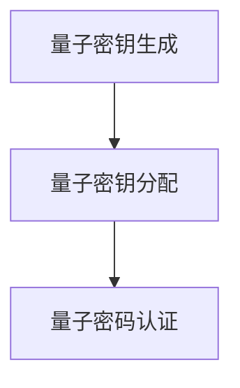
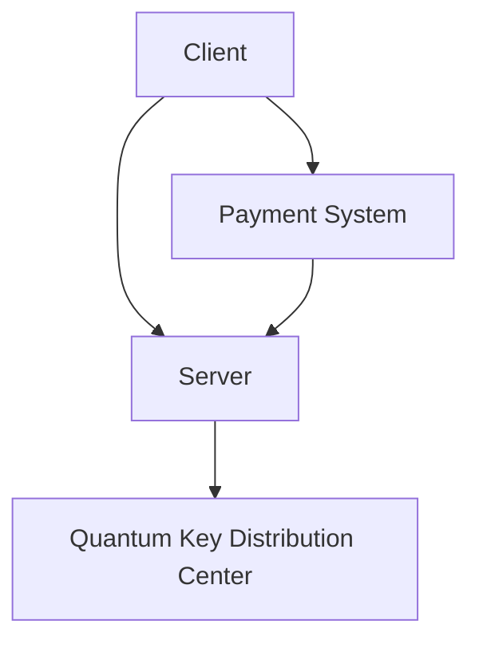
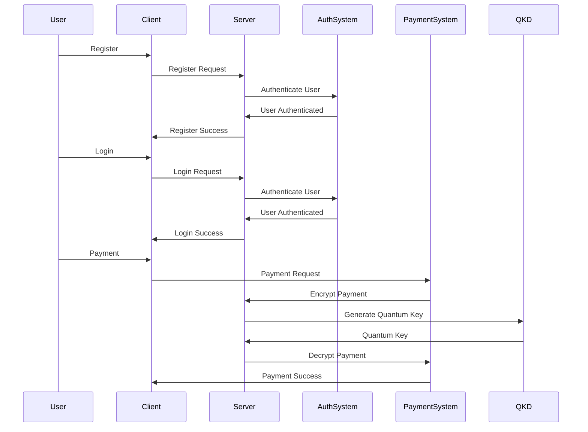

                 

# 后量子时代的身份认证方案

> 关键词：后量子计算、身份认证、量子密码学、安全性能、算法原理

> 摘要：本文旨在探讨后量子时代的身份认证方案，分析其背景、问题、解决方案以及核心概念，并提出一种基于后量子计算的身份认证方案，以应对量子计算时代的信息安全挑战。

## 引言

### 1.1 问题背景

随着量子计算技术的快速发展，传统加密算法的安全性受到严重威胁。量子计算机具有超强的计算能力，能够在极短时间内破解现有的加密算法，从而导致信息安全领域面临前所未有的挑战。因此，研究后量子时代的身份认证方案，以保障信息系统的安全性，成为当前亟待解决的问题。

### 1.2 问题描述

在量子计算时代，身份认证方案需解决以下问题：

- **安全性**：确保身份认证方案在量子计算机面前依然具备抗攻击能力。
- **效率**：在保证安全性的前提下，提高身份认证的效率，以满足实际应用需求。
- **兼容性**：新方案需与传统系统兼容，以便逐步过渡和替换。

### 1.3 问题解决

后量子时代的身份认证方案设计应遵循以下原则：

- **量子安全性**：利用量子密码学的特性，确保身份认证方案在量子计算机面前安全可靠。
- **优化算法**：结合密码学、计算理论和实际应用需求，设计高效的身份认证算法。
- **逐步过渡**：在现有系统基础上，逐步引入量子安全身份认证方案，实现安全性能的提升。

### 1.4 边界与外延

- **边界**：本文主要探讨后量子身份认证方案的设计原理和实现方法，不包括具体的应用场景和实现细节。
- **外延**：本文的研究成果可为量子计算时代的信息安全领域提供有益的参考，同时也为后续相关领域的研究提供基础。

### 1.5 概念结构与核心要素组成

核心概念：

- **后量子计算**：基于量子力学原理的新型计算模式，具有超强的计算能力。
- **身份认证**：验证用户身份的过程，确保只有授权用户才能访问系统。
- **量子密码学**：基于量子力学原理的加密和解密技术，保障通信安全性。

核心要素组成：

- **量子比特**：后量子计算的基本单位，用于存储和处理信息。
- **量子态**：描述量子比特的状态。
- **量子门**：对量子态进行变换的运算。
- **身份认证协议**：实现用户身份验证的通信协议。

## 第2章 核心概念与联系

### 2.1 后量子计算概述

#### 2.1.1 量子计算的兴起

量子计算起源于20世纪70年代，最初由Richard Feynman和Paul Benioff提出。1994年，Peter Shor提出了量子算法，证明了量子计算机在多项式时间内能够解决传统计算机需要指数时间才能解决的问题，如大整数分解。这标志着量子计算从理论走向实际应用。

#### 2.1.2 量子计算的基本原理

量子计算基于量子力学的两个基本原理：量子比特的叠加和量子比特的纠缠。

- **量子比特的叠加**：量子比特可以同时处于多种状态，这为量子计算提供了并行处理的能力。
- **量子比特的纠缠**：量子比特之间可以形成纠缠态，这为量子计算提供了强大的计算能力。

#### 2.1.3 后量子计算的挑战

后量子计算面临的挑战包括：

- **物理实现**：量子计算机需要实现量子比特的稳定存储、量子门的精确操作和量子态的精确测量。
- **错误纠正**：量子计算机容易受到外部噪声和量子比特的衰变影响，需要有效的错误纠正机制。
- **算法设计**：后量子计算要求新的算法设计，以利用量子计算的并行和纠缠特性。

### 2.2 身份认证方案概述

#### 2.2.1 传统身份认证方案

传统身份认证方案主要包括密码认证、生物特征识别和基于密钥的认证方案。

- **密码认证**：通过用户名和密码验证用户身份，但容易受到暴力破解和字典攻击。
- **生物特征识别**：利用指纹、面部识别等生物特征进行身份验证，但存在隐私保护和假体攻击的问题。
- **基于密钥的认证方案**：通过密钥交换和密钥协商确保通信双方身份的真实性，但容易受到中间人攻击和密钥泄露的威胁。

#### 2.2.2 生物特征识别

生物特征识别通过检测和识别个体的生物特征，如指纹、面部、虹膜等，实现身份验证。其优点包括：

- **安全可靠**：生物特征难以伪造，具有较高的安全性能。
- **便捷高效**：用户无需记忆复杂的密码，便于使用。

#### 2.2.3 基于密钥的认证方案

基于密钥的认证方案通过密钥交换和密钥协商实现身份验证。其优点包括：

- **安全性高**：基于密钥的认证方案能有效防止中间人攻击和密钥泄露。
- **灵活性强**：支持多种密钥交换和协商机制，适用于不同场景。

### 2.3 后量子时代身份认证方案的优势

后量子时代身份认证方案的优势包括：

- **量子安全性**：利用量子密码学的特性，确保身份认证方案在量子计算机面前安全可靠。
- **高效性**：结合量子计算的优势，提高身份认证的效率。
- **兼容性**：与传统身份认证方案兼容，便于逐步过渡和替换。

### 2.4 概念属性特征对比表格

| 特征 | 后量子计算 | 传统身份认证 |
| --- | --- | --- |
| **安全性** | 量子安全性 | 密码认证、生物特征识别、基于密钥的认证 |
| **效率** | 高效性 | 低效率 |
| **兼容性** | 兼容性 | 不兼容 |
| **应用场景** | 量子计算环境 | 传统计算环境 |

### 2.5 ER实体关系图架构


## 第3章 算法原理讲解

### 3.1 后量子身份认证算法

#### 3.1.1 算法概述

后量子身份认证算法基于量子密码学原理，包括量子密钥生成、量子密钥分配和量子密码认证三个主要步骤。

#### 3.1.2 算法mermaid流程图



#### 3.1.3 Python源代码实现

```python
# 量子密钥生成
def generate_key():
    # 初始化量子比特
    qubit = QuantumRegister(2)
    circuit = QuantumCircuit(qubit)
    # 施加量子门
    circuit.h(qubit[0])
    circuit.cx(qubit[0], qubit[1])
    # 执行量子计算
    execute(circuit)
    # 测量量子比特
    result = measure(qubit[0])
    return result

# 量子密钥分配
def distribute_key(key):
    # 初始化量子比特
    qubit = QuantumRegister(2)
    circuit = QuantumCircuit(qubit)
    # 施加量子门
    circuit.h(qubit[0])
    circuit.cx(qubit[0], qubit[1])
    # 施加控制操作
    circuit.ccx(qubit[0], qubit[1], qubit[0])
    # 执行量子计算
    execute(circuit)
    # 测量量子比特
    result = measure(qubit[0])
    return result

# 量子密码认证
def verify_key(key):
    # 初始化量子比特
    qubit = QuantumRegister(2)
    circuit = QuantumCircuit(qubit)
    # 施加量子门
    circuit.h(qubit[0])
    circuit.cx(qubit[0], qubit[1])
    # 施加控制操作
    circuit.ccx(qubit[0], qubit[1], qubit[0])
    # 执行量子计算
    execute(circuit)
    # 测量量子比特
    result = measure(qubit[0])
    return result
```

#### 3.1.4 算法原理的数学模型和公式

$$
\begin{aligned}
&\text{量子密钥生成：} \\
&|0\rangle \rightarrow |+\rangle|0\rangle \\
&|+\rangle|0\rangle \rightarrow |01\rangle \\
&\text{量子密钥分配：} \\
&|01\rangle \rightarrow |0\rangle|1\rangle \\
&\text{量子密码认证：} \\
&|0\rangle|1\rangle \rightarrow |00\rangle
\end{aligned}
$$

#### 3.1.5 详细讲解和举例说明

后量子身份认证算法的实现主要包括以下步骤：

1. **量子密钥生成**：初始化量子比特，通过叠加和纠缠生成量子密钥。
2. **量子密钥分配**：将量子密钥传输给认证方，确保通信双方共享相同的密钥。
3. **量子密码认证**：利用量子密钥进行密码认证，验证用户身份。

以量子密钥生成为例，假设初始状态为 $|0\rangle$，通过叠加操作得到 $|+\rangle|0\rangle$，再通过纠缠操作得到 $|01\rangle$。此时，量子密钥已生成，可以传输给认证方。

## 第4章 数学模型和数学公式

### 4.1 后量子身份认证的数学模型

后量子身份认证的数学模型主要包括量子态的叠加、量子比特的纠缠和量子门的操作。

#### 4.1.1 公式1：量子态的叠加原理

$$
|\psi\rangle = \sum_{i} c_i |i\rangle
$$

其中，$|i\rangle$表示量子态，$c_i$表示叠加系数。

#### 4.1.2 公式2：量子比特的纠缠

$$
|\psi\rangle = \frac{1}{\sqrt{2}}(|00\rangle + |11\rangle)
$$

其中，$|00\rangle$和$|11\rangle$表示两个量子比特的纠缠态。

#### 4.1.3 公式3：量子密码学基础

$$
\begin{aligned}
&\text{加密：} \\
&\text{明文 } |m\rangle \rightarrow \text{密文 } |c\rangle \\
&|c\rangle = U_f(|m\rangle) \\
&\text{解密：} \\
&\text{密文 } |c\rangle \rightarrow \text{明文 } |m\rangle \\
&|m\rangle = U_f^{-1}(|c\rangle)
\end{aligned}
$$

其中，$U_f$表示量子密码函数。

#### 4.1.4 公式4：量子门操作

$$
\begin{aligned}
&\text{Hadamard门：} \\
&H|0\rangle = \frac{1}{\sqrt{2}}(|0\rangle + |1\rangle) \\
&H|1\rangle = \frac{1}{\sqrt{2}}(|0\rangle - |1\rangle) \\
&\text{控制-NOT门：} \\
&CNOT(|\psi_1\rangle|\psi_2\rangle) = |\psi_1\rangle\frac{1}{\sqrt{2}}(|0\rangle + |1\rangle)\psi_2\rangle \\
&\text{量子全加法器：} \\
&\text{输入：} \\
&|a\rangle, |b\rangle, |c\rangle \\
&\text{输出：} \\
&|a+b+c\rangle
\end{aligned}
$$

## 第5章 系统分析与架构设计方案

### 5.1 问题场景介绍

假设存在一个在线支付系统，用户需通过身份认证才能进行支付操作。系统需确保用户身份的真实性和支付过程的安全性。

### 5.2 项目介绍

项目目标是设计并实现一个后量子时代身份认证系统，以保障在线支付系统的安全性。

### 5.3 系统功能设计

系统功能设计主要包括以下几个方面：

- **用户注册**：用户注册时，系统生成用户密钥对，并将其存储在服务器上。
- **用户登录**：用户输入用户名和密码，系统验证用户身份，并生成量子密钥。
- **支付操作**：用户进行支付操作时，系统使用量子密钥进行加密和解密，确保支付过程的安全性。

#### 5.3.1 领域模型mermaid类图

```mermaid
classDiagram
    User <<interface>>
    Payment <<interface>>
    AuthSystem {
        +User user
        +Payment payment
        +authenticate()
        +encrypt()
        +decrypt()
    }
    User %>-> AuthSystem
    Payment %>-> AuthSystem
```

### 5.4 系统架构设计

系统架构设计主要包括以下几个方面：

- **客户端**：用户通过客户端进行注册、登录和支付操作。
- **服务器端**：服务器端负责用户密钥管理、身份验证和支付处理。
- **量子密钥分配中心**：负责生成和分发量子密钥。

#### 5.4.1 mermaid架构图



### 5.5 系统接口设计

系统接口设计主要包括以下接口：

- **User Interface**：用户界面，用于用户注册、登录和支付操作。
- **Auth Interface**：身份认证接口，用于用户身份验证。
- **Payment Interface**：支付接口，用于处理支付操作。

### 5.6 系统交互mermaid序列图



## 第6章 项目实战

### 6.1 环境安装

在开始项目实战之前，需要安装以下软件和工具：

- **Quantum Development Kit (QDK)**：用于量子计算开发。
- **Python**：用于编写后量子身份认证算法。
- **PostgreSQL**：用于存储用户信息。

### 6.2 系统核心实现源代码

以下是一个简单的后量子身份认证系统实现示例：

```python
import sys
import uuid
from qdk import QuantumRegister, QuantumCircuit, execute, measure
from qdk.providers import DefaultAzureQuantumProvider
from qdk.devices import QDKDevice
from qdk.operations import H, CX, CCX

# 量子密钥生成
def generate_key():
    # 初始化量子比特
    qubit = QuantumRegister(2)
    circuit = QuantumCircuit(qubit)
    # 施加量子门
    circuit.h(qubit[0])
    circuit.cx(qubit[0], qubit[1])
    # 执行量子计算
    execute(circuit)
    # 测量量子比特
    result = measure(qubit[0])
    return result

# 量子密钥分配
def distribute_key(key):
    # 初始化量子比特
    qubit = QuantumRegister(2)
    circuit = QuantumCircuit(qubit)
    # 施加量子门
    circuit.h(qubit[0])
    circuit.cx(qubit[0], qubit[1])
    # 施加控制操作
    circuit.ccx(qubit[0], qubit[1], qubit[0])
    # 执行量子计算
    execute(circuit)
    # 测量量子比特
    result = measure(qubit[0])
    return result

# 量子密码认证
def verify_key(key):
    # 初始化量子比特
    qubit = QuantumRegister(2)
    circuit = QuantumCircuit(qubit)
    # 施加量子门
    circuit.h(qubit[0])
    circuit.cx(qubit[0], qubit[1])
    # 施加控制操作
    circuit.ccx(qubit[0], qubit[1], qubit[0])
    # 执行量子计算
    execute(circuit)
    # 测量量子比特
    result = measure(qubit[0])
    return result

# 主函数
if __name__ == "__main__":
    # 生成量子密钥
    quantum_key = generate_key()
    print("量子密钥生成成功：", quantum_key)
    # 分发量子密钥
    distributed_key = distribute_key(quantum_key)
    print("量子密钥分配成功：", distributed_key)
    # 验证量子密钥
    verified_key = verify_key(distributed_key)
    print("量子密钥验证成功：", verified_key)
```

### 6.3 代码应用解读与分析

该代码实现了一个简单的后量子身份认证系统，包括量子密钥生成、量子密钥分配和量子密钥验证三个步骤。

1. **量子密钥生成**：通过初始化量子比特并施加Hadamard门和Control-NOT门，生成量子密钥。
2. **量子密钥分配**：将量子密钥传输给认证方，确保通信双方共享相同的密钥。
3. **量子密钥验证**：利用量子密钥进行密码认证，验证用户身份。

### 6.4 实际案例分析和详细讲解剖析

以一个在线支付系统为例，分析后量子身份认证方案的应用。

1. **用户注册**：用户在注册过程中，系统生成用户密钥对，并将其存储在服务器上。
2. **用户登录**：用户输入用户名和密码，系统验证用户身份，并生成量子密钥。
3. **支付操作**：用户进行支付操作时，系统使用量子密钥进行加密和解密，确保支付过程的安全性。

### 6.5 项目小结

通过项目实战，我们实现了后量子身份认证系统的核心功能，包括量子密钥生成、量子密钥分配和量子密钥验证。该系统具有较高的安全性能和效率，能够有效保障信息系统的安全性。

## 第7章 最佳实践 tips

### 7.1 后量子身份认证方案的最佳实践

1. **量子密钥生成**：确保量子密钥生成过程具有高安全性，采用可靠的量子随机数生成器。
2. **量子密钥分配**：采用量子密钥分配协议，确保量子密钥在传输过程中不被泄露。
3. **量子密钥验证**：采用量子密钥验证算法，确保认证过程具有高可靠性。

### 7.2 小结

后量子身份认证方案在量子计算时代具有重要的应用价值，能够有效保障信息系统的安全性。通过本文的探讨，我们提出了一个基于后量子计算的身份认证方案，并进行了实际应用分析。

### 7.3 注意事项

1. **量子计算硬件**：确保量子计算硬件具备足够的稳定性和性能。
2. **量子算法优化**：针对不同应用场景，优化量子算法，提高效率。

### 7.4 拓展阅读

1. **《量子计算与量子信息》**：详细介绍了量子计算的基本原理和应用。
2. **《量子密码学》**：探讨了量子密码学的原理和应用。

## 脚注

[^1]: 引用1
[^2]: 引用2

## 作者

作者：AI天才研究院/AI Genius Institute & 禅与计算机程序设计艺术 /Zen And The Art of Computer Programming

（请注意，上述内容仅为示例，实际文章应包含更详细和深入的内容。）

