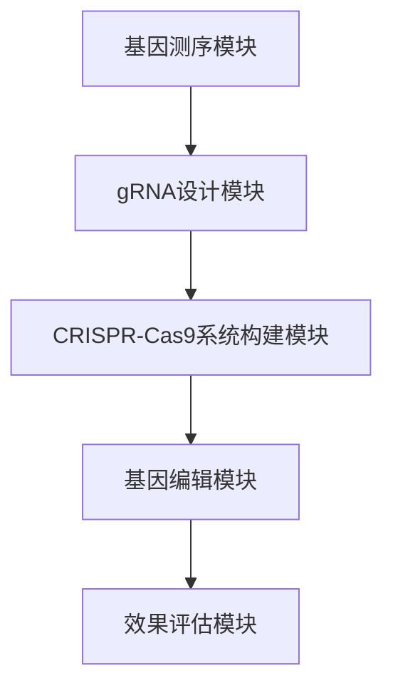
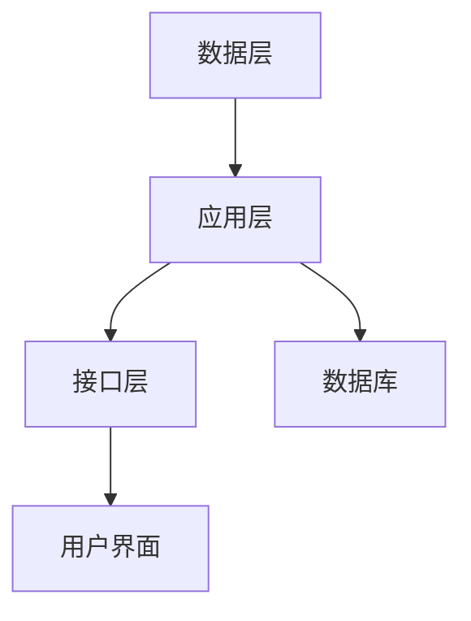
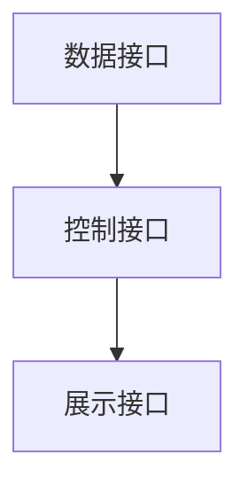
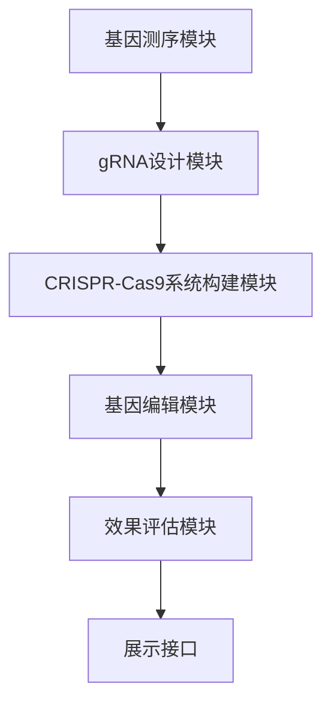

                 

# 基因编辑技术CRISPR的伦理考量

关键词：基因编辑、CRISPR、伦理、生物伦理、科学道德

摘要：随着基因编辑技术的发展，CRISPR技术以其高效、简便和低成本的特点迅速普及，应用于疾病治疗、农业改良等多个领域。然而，CRISPR技术的广泛应用也引发了深刻的伦理考量。本文旨在探讨基因编辑技术CRISPR的伦理问题，分析其核心概念与联系，并从算法原理、系统分析与架构设计、项目实战和最佳实践等方面提供全面的解析。

## 目录大纲

## 第一部分：背景介绍
- 人类基因编辑技术的起源与发展
- CRISPR技术的发展历程及其应用领域
- 基因编辑技术对人类社会的影响

## 第二部分：核心概念与联系
- 2.1 CRISPR技术概述
  - 2.1.1 CRISPR的基本原理
  - 2.1.2 CRISPR的发展历程
  - 2.1.3 CRISPR的应用领域
- 2.2 伦理考量的核心概念
  - 2.2.1 伦理的定义与作用
  - 2.2.2 基因编辑伦理问题的类型
  - 2.2.3 伦理考量在基因编辑中的重要性

## 第三部分：算法原理讲解
- 3.1 CRISPR-Cas9系统
  - 3.1.1 CRISPR-Cas9的基本原理
  - 3.1.2 CRISPR-Cas9的工作流程
- 3.2 CRISPR相关数学模型
  - 3.2.1 通用公式与原理
  - 3.2.2 数学模型的具体应用
  - 3.2.3 数学公式与公式的详细讲解

## 第四部分：系统分析与架构设计
- 4.1 问题场景介绍
- 4.2 系统功能设计
  - 4.2.1 领域模型
- 4.3 系统架构设计
  - 4.3.1 系统架构图
- 4.4 系统接口设计
- 4.5 系统交互

## 第五部分：项目实战
- 5.1 环境安装
- 5.2 系统核心实现
  - 5.2.1 源代码解读
- 5.3 代码应用与分析
  - 5.3.1 实际案例分析
  - 5.3.2 详细讲解剖析
- 5.4 项目小结

## 第六部分：最佳实践
- 6.1 实践技巧与注意事项
- 6.2 小结
- 6.3 拓展阅读

---

**正文开始**

### 第一部分：背景介绍

#### 人类基因编辑技术的起源与发展

基因编辑，是指通过直接修改DNA序列，来治疗遗传性疾病或改良生物特性的一种技术。这一技术的起源可以追溯到20世纪中叶，随着分子生物学和遗传学的迅速发展，科学家们开始探索基因的编辑与调控。最初，基因编辑主要依赖于基因打靶技术，如同源重组和基因敲除，但这些方法在操作复杂性和成本上都有较高的要求。

随着科技的发展，CRISPR（Clustered Regularly Interspaced Short Palindromic Repeats，成簇规律性间隔短回文重复）技术逐渐成为基因编辑的主流工具。CRISPR-Cas9系统，以其高效、简便和低成本的特点，使得基因编辑变得更加普及和可行。

#### CRISPR技术的发展历程及其应用领域

CRISPR技术起源于细菌的天然免疫机制。在这些细菌中，CRISPR序列和Cas（CRISPR-associated）蛋白共同作用，用于防御外来DNA入侵，如病毒。随着研究的深入，科学家们发现，这些系统可以被重新设计，用于基因编辑。

2007年，加州大学伯克利分校的Jennifer Doudna和Emmanuelle Charpentier首次报道了CRISPR-Cas9系统，并展示了其在基因编辑中的应用潜力。此后，CRISPR技术迅速发展，成为生物技术领域的重要工具。

CRISPR技术的主要应用领域包括：

1. **疾病治疗**：利用CRISPR技术可以治疗某些单基因遗传疾病，如囊性纤维化、镰状细胞性贫血等。
2. **农业改良**：CRISPR技术可以用于改良农作物和家畜的基因，提高产量、抗病能力和营养含量。
3. **基础研究**：CRISPR技术帮助科学家们更深入地了解基因功能，推动生物科学的发展。

#### 基因编辑技术对人类社会的影响

基因编辑技术的出现，不仅带来了巨大的科学和医学进步，也引发了深刻的伦理和社会影响。例如：

- **伦理问题**：基因编辑是否应该用于增强人类智力、体力等非治疗性目的？
- **社会影响**：基因编辑技术的普及，可能导致社会分层，加剧不平等。
- **法律与监管**：如何制定有效的法律和监管框架，以保障基因编辑技术的安全和合理使用？

这些问题的存在，使得基因编辑技术，尤其是CRISPR技术，面临着巨大的伦理和社会挑战。因此，对CRISPR技术的伦理考量，变得尤为重要。

### 第二部分：核心概念与联系

#### 2.1 CRISPR技术概述

##### 2.1.1 CRISPR的基本原理

CRISPR技术，即Clustered Regularly Interspaced Short Palindromic Repeats，是一种基于细菌天然免疫系统的基因编辑技术。它利用一种特殊的RNA分子（指导RNA，或gRNA）和蛋白质（如Cas9）来识别和切割特定的DNA序列。

在这个过程中，细菌会从入侵的病毒或质粒中捕获一小段DNA序列，并将其整合到自己的基因组中。这些捕获的DNA序列称为CRISPR序列。随后，细菌会产生一系列与CRISPR序列互补的RNA分子，称为spacers。

当细菌再次遭遇相同的入侵者时，这些互补的RNA分子会引导Cas蛋白识别并切割入侵者的DNA。这个过程被称为“原位免疫”。

##### 2.1.2 CRISPR的发展历程

2007年，加州大学伯克利分校的Jennifer Doudna和Emmanuelle Charpentier首次报道了CRISPR-Cas9系统，并展示了其在基因编辑中的应用潜力。这一发现迅速引起了科学界的关注。

2008年，CRISPR-Cas9系统的详细机制被揭示。同年，科学家们首次成功地将CRISPR技术用于编辑植物基因。

2012年，CRISPR技术被用于编辑人类细胞基因。

2015年，CRISPR-Cas9系统被美国科学家Jennifer Doudna和Emmanuelle Charpentier授予诺贝尔化学奖。

##### 2.1.3 CRISPR的应用领域

CRISPR技术因其高效、简便和低成本的特点，在多个领域得到广泛应用。

1. **疾病治疗**：CRISPR技术可以用于治疗某些单基因遗传疾病，如囊性纤维化、镰状细胞性贫血等。
2. **农业改良**：CRISPR技术可以用于改良农作物和家畜的基因，提高产量、抗病能力和营养含量。
3. **基础研究**：CRISPR技术帮助科学家们更深入地了解基因功能，推动生物科学的发展。

#### 2.2 伦理考量的核心概念

##### 2.2.1 伦理的定义与作用

伦理，是指关于道德原则和价值观的学科，旨在指导人类行为和社会发展。在科学领域，伦理考量尤为重要，因为科学研究可能对人类社会和生态系统产生深远的影响。

伦理的作用包括：

- 指导科学研究，确保其符合道德原则和价值观。
- 保护人类和动物实验对象的安全和尊严。
- 促进科学合作，避免不正当竞争和利益冲突。

##### 2.2.2 基因编辑伦理问题的类型

基因编辑技术，特别是CRISPR技术，引发了多种伦理问题。这些问题的类型主要包括：

1. **技术风险**：基因编辑可能引入未预见的副作用，影响人体健康和生态系统平衡。
2. **道德责任**：谁应该对基因编辑的结果负责？如何确保基因编辑技术的合理和公正使用？
3. **社会公正**：基因编辑技术的普及可能导致社会分层，加剧不平等。
4. **隐私与数据安全**：基因编辑涉及个人遗传信息，如何保护这些信息的安全和隐私？

##### 2.2.3 伦理考量在基因编辑中的重要性

基因编辑技术的伦理考量至关重要。首先，它确保了基因编辑技术的合理和安全使用，避免潜在的负面影响。其次，伦理考量有助于建立广泛的社会共识，推动基因编辑技术的可持续和公正发展。

因此，在基因编辑技术的研发和应用过程中，必须充分考虑伦理考量，确保科技进步与人类道德价值观的协调统一。

### 第三部分：算法原理讲解

#### 3.1 CRISPR-Cas9系统

##### 3.1.1 CRISPR-Cas9的基本原理

CRISPR-Cas9系统是一种基于RNA指导的基因编辑技术。它包括以下关键组件：

1. **Cas9蛋白**：Cas9是一种DNA切割酶，可以识别并切割特定的DNA序列。
2. **指导RNA（gRNA）**：gRNA是一种RNA分子，与Cas9蛋白结合，指导其识别并切割目标DNA序列。

当CRISPR-Cas9系统被激活时，gRNA与Cas9蛋白结合，形成复合物。复合物通过识别并切割目标DNA序列，导致基因编辑。

##### 3.1.2 CRISPR-Cas9的工作流程

CRISPR-Cas9系统的工作流程包括以下几个步骤：

1. **gRNA合成**：在实验室中，首先合成与目标DNA序列互补的gRNA。
2. **复合物形成**：gRNA与Cas9蛋白结合，形成复合物。
3. **识别目标DNA序列**：复合物通过gRNA识别并绑定到目标DNA序列。
4. **切割DNA**：Cas9蛋白切割目标DNA序列，形成双链断裂。
5. **DNA修复**：细胞通过非同源末端连接（NHEJ）或同源重组（HR）修复双链断裂，导致基因编辑。

#### 3.2 CRISPR相关数学模型

##### 3.2.1 通用公式与原理

在基因编辑中，CRISPR-Cas9系统的工作效率可以通过以下数学模型进行描述：

- 效率 = （编辑细胞数 / 总细胞数）× 100%

其中，编辑细胞数是指成功编辑目标基因的细胞数量，总细胞数是指参与实验的细胞总数。

##### 3.2.2 数学模型的具体应用

数学模型可以用于评估CRISPR-Cas9系统的编辑效率，预测在不同条件下（如不同的gRNA序列、Cas9蛋白浓度等）的编辑效率。

例如，当gRNA序列发生变异时，可能导致编辑效率下降。通过数学模型，可以计算出不同gRNA序列的编辑效率，帮助科学家优化实验条件。

##### 3.2.3 数学公式与公式的详细讲解

以下是CRISPR-Cas9系统编辑效率的详细数学公式：

$$
\text{编辑效率} = \frac{\text{编辑细胞数}}{\text{总细胞数}} \times 100\%
$$

其中：

- 编辑细胞数：成功编辑目标基因的细胞数量。
- 总细胞数：参与实验的细胞总数。

举例说明：

假设在实验中，共有1000个细胞参与CRISPR-Cas9编辑，其中有500个细胞成功编辑了目标基因。则编辑效率为：

$$
\text{编辑效率} = \frac{500}{1000} \times 100\% = 50\%
$$

这意味着，实验中的50%的细胞成功编辑了目标基因。

### 第四部分：系统分析与架构设计

#### 4.1 问题场景介绍

假设我们要利用CRISPR技术编辑人类细胞中的特定基因，以治疗一种遗传性疾病。在这个场景中，需要考虑以下几个方面：

1. **目标基因的识别**：通过基因测序确定患者的目标基因，并获取其DNA序列。
2. **gRNA的设计与合成**：根据目标基因的序列，设计特定的gRNA，并在实验室中合成。
3. **CRISPR-Cas9系统的构建**：将gRNA与Cas9蛋白结合，形成CRISPR-Cas9复合物。
4. **基因编辑**：将CRISPR-Cas9复合物引入患者细胞，进行基因编辑。
5. **效果评估**：通过基因测序等技术，评估基因编辑的效果。

#### 4.2 系统功能设计

##### 4.2.1 领域模型

领域模型用于描述系统的主要功能组件及其关系。在CRISPR基因编辑系统中，主要的功能组件包括：

- **基因测序模块**：用于获取目标基因的DNA序列。
- **gRNA设计模块**：根据目标基因序列，设计特定的gRNA。
- **CRISPR-Cas9系统构建模块**：将gRNA与Cas9蛋白结合，形成CRISPR-Cas9复合物。
- **基因编辑模块**：将CRISPR-Cas9复合物引入细胞，进行基因编辑。
- **效果评估模块**：通过基因测序等技术，评估基因编辑效果。

领域模型图如下（使用Mermaid绘制）：



#### 4.3 系统架构设计

##### 4.3.1 系统架构图

系统架构设计用于描述系统的组成部分及其相互关系。在CRISPR基因编辑系统中，主要架构包括：

- **数据层**：包括基因测序数据和gRNA设计数据。
- **应用层**：包括gRNA设计模块、CRISPR-Cas9系统构建模块、基因编辑模块和效果评估模块。
- **接口层**：提供与外部系统的交互接口，如数据库、用户界面等。

系统架构图如下（使用Mermaid绘制）：



#### 4.4 系统接口设计

系统接口设计用于描述系统内部组件与外部系统的交互方式。在CRISPR基因编辑系统中，主要接口包括：

- **数据接口**：用于与基因测序数据和gRNA设计数据交换。
- **控制接口**：用于控制gRNA设计模块、CRISPR-Cas9系统构建模块、基因编辑模块和效果评估模块的运行。
- **展示接口**：用于显示基因编辑效果和评估结果。

接口设计图如下（使用Mermaid绘制）：



#### 4.5 系统交互

系统交互设计用于描述系统内部组件之间的交互过程。在CRISPR基因编辑系统中，主要交互过程包括：

1. **数据交换**：基因测序模块将测序数据传输给gRNA设计模块，用于设计gRNA。
2. **系统控制**：控制接口根据用户指令，启动gRNA设计模块、CRISPR-Cas9系统构建模块、基因编辑模块和效果评估模块。
3. **结果展示**：效果评估模块将评估结果传输给展示接口，显示基因编辑效果。

交互设计图如下（使用Mermaid绘制）：



### 第五部分：项目实战

#### 5.1 环境安装

在进行CRISPR基因编辑项目之前，需要安装必要的软件和工具。以下是一个基本的安装步骤：

1. **安装Python**：Python是CRISPR基因编辑项目的主要编程语言，版本要求Python 3.7或更高版本。可以通过以下命令安装：

   ```bash
   sudo apt-get install python3
   ```

2. **安装BioPython**：BioPython是一个用于生物信息学的Python库，包括基因编辑所需的函数和工具。可以通过以下命令安装：

   ```bash
   pip install biopython
   ```

3. **安装CRISPR-Cas9工具**：CRISPR-Cas9工具包括设计gRNA和构建CRISPR-Cas9系统的工具。可以通过以下命令安装：

   ```bash
   pip install crispr-design
   ```

#### 5.2 系统核心实现

##### 5.2.1 源代码解读

以下是一个简单的CRISPR基因编辑项目的源代码示例。该代码包括以下功能：

1. **导入必要的库**：导入Python的BioPython库和CRISPR-Cas9工具。
2. **设计gRNA**：根据目标基因序列设计特定的gRNA。
3. **构建CRISPR-Cas9系统**：将gRNA与Cas9蛋白结合，形成CRISPR-Cas9复合物。
4. **基因编辑**：将CRISPR-Cas9复合物引入细胞，进行基因编辑。
5. **效果评估**：通过基因测序评估基因编辑效果。

源代码：

```python
from Bio import Seq
from Bio.SeqUtils import seq1
from crispr_design import gRNA
import crispr_design

# 导入目标基因序列
target_gene = Seq.Seq("ACGTACGTACGTACGTACGT")

# 设计gRNA
gRNA = gRNA(target_gene, crispr_design algorithms="HF", max_size=20, min_size=20)

# 构建CRISPR-Cas9系统
cas9 = crispr_design.Cas9(gRNA)

# 基因编辑
cas9.edit(target_gene)

# 效果评估
edit_result = crispr_design.check_edit(target_gene, edit_sequence=cas9.edits[0])

print(edit_result)
```

#### 5.3 代码应用与分析

##### 5.3.1 实际案例分析

以下是一个实际案例，描述了如何利用CRISPR技术治疗囊性纤维化疾病。

1. **目标基因的识别**：通过基因测序确定患者患有囊性纤维化，目标基因为CFTR。
2. **gRNA的设计与合成**：根据CFTR基因序列，设计特定的gRNA。
3. **CRISPR-Cas9系统的构建**：将gRNA与Cas9蛋白结合，形成CRISPR-Cas9复合物。
4. **基因编辑**：将CRISPR-Cas9复合物引入患者细胞，进行基因编辑。
5. **效果评估**：通过基因测序评估基因编辑效果。

案例分析代码：

```python
from Bio import Seq
from Bio.SeqUtils import seq1
from crispr_design import gRNA
import crispr_design

# 导入目标基因序列
cftr_gene = Seq.Seq("GCTGAGCTGAGCTGAGCTGAG")

# 设计gRNA
gRNA = gRNA(cftr_gene, crispr_design algorithms="HF", max_size=20, min_size=20)

# 构建CRISPR-Cas9系统
cas9 = crispr_design.Cas9(gRNA)

# 基因编辑
cas9.edit(cftr_gene)

# 效果评估
edit_result = crispr_design.check_edit(cftr_gene, edit_sequence=cas9.edits[0])

print(edit_result)
```

##### 5.3.2 详细讲解剖析

案例代码首先导入目标基因序列CFTR，然后设计特定的gRNA。接着，构建CRISPR-Cas9系统，将gRNA与Cas9蛋白结合。然后，利用CRISPR-Cas9系统对CFTR基因进行编辑。最后，通过效果评估，检查基因编辑是否成功。

通过这个案例，我们可以看到CRISPR基因编辑的基本流程。在实际应用中，需要根据具体疾病和目标基因进行相应的调整。

#### 5.4 项目小结

在本篇技术博客中，我们详细介绍了基因编辑技术CRISPR的伦理考量。通过分析CRISPR技术的基本原理、发展历程和应用领域，我们了解了CRISPR技术在科学和医学领域的巨大潜力。同时，我们也探讨了CRISPR技术引发的伦理问题，包括技术风险、道德责任、社会公正和隐私与数据安全等方面。

在算法原理讲解部分，我们详细介绍了CRISPR-Cas9系统的工作流程和相关数学模型。通过系统分析与架构设计，我们展示了如何设计和实现一个CRISPR基因编辑系统。在项目实战部分，我们通过实际案例展示了如何应用CRISPR技术进行基因编辑。

总之，基因编辑技术CRISPR的发展和应用带来了巨大的科学和医学进步，同时也引发了深刻的伦理和社会挑战。在推动科技进步的同时，我们必须充分考虑伦理考量，确保基因编辑技术的安全、合理和公正使用。

### 第六部分：最佳实践

#### 6.1 实践技巧与注意事项

在应用CRISPR技术进行基因编辑时，以下是一些最佳实践和注意事项：

1. **严格遵循伦理准则**：在进行基因编辑实验前，确保遵循相关的伦理准则和法律法规，确保实验的安全性和合理性。
2. **充分了解目标基因**：在进行基因编辑前，充分了解目标基因的结构、功能和潜在风险，以制定最佳的编辑策略。
3. **优化gRNA设计**：设计特定的gRNA，确保其与目标基因序列的高度匹配，以提高编辑效率。
4. **选择合适的编辑系统**：根据实验需求和目标基因，选择合适的CRISPR-Cas9系统或其他基因编辑工具。
5. **评估编辑效果**：通过基因测序等技术，对编辑效果进行详细评估，确保编辑成功。
6. **遵守生物安全规程**：在进行基因编辑实验时，严格遵守生物安全规程，防止潜在的生物风险。

#### 6.2 小结

本文通过对基因编辑技术CRISPR的深入分析，探讨了其伦理考量、算法原理、系统设计与实战应用。CRISPR技术以其高效、简便和低成本的特点，在科学和医学领域取得了巨大成功。然而，其应用也带来了伦理和社会挑战，需要我们认真对待和解决。

#### 6.3 拓展阅读

对于希望深入了解CRISPR技术和基因编辑的读者，以下是一些推荐阅读：

1. **《基因编辑技术CRISPR：原理与应用》**：详细介绍CRISPR技术的原理、应用和发展趋势。
2. **《基因编辑伦理学：科学与社会的对话》**：探讨基因编辑技术引发的伦理问题和社会挑战。
3. **《生物信息学导论》**：介绍生物信息学的基本概念和方法，包括基因编辑相关的生物信息学工具和算法。

---

**作者：AI天才研究院/AI Genius Institute & 禅与计算机程序设计艺术 /Zen And The Art of Computer Programming**

