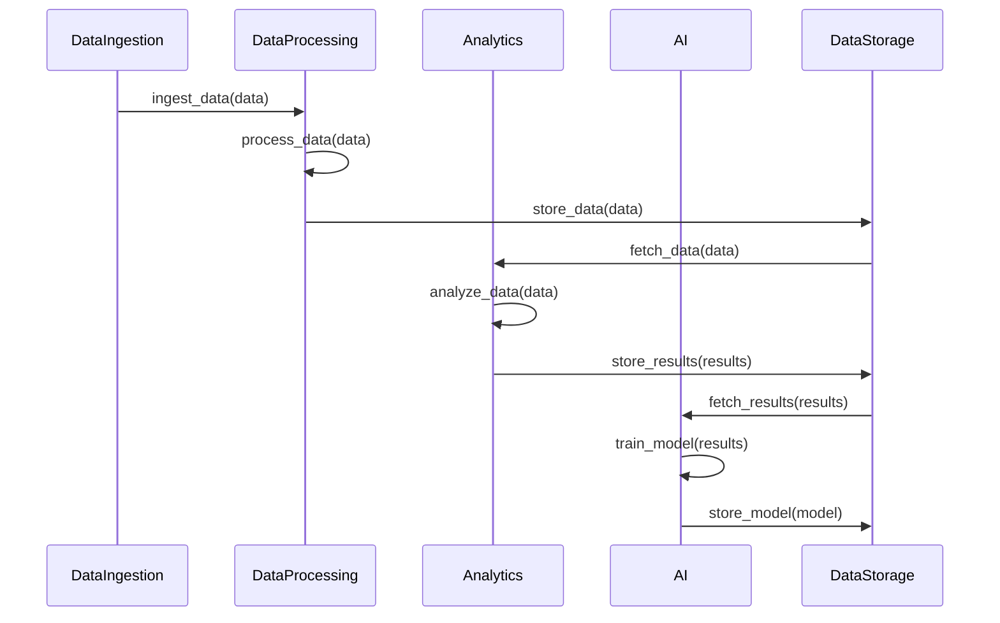

                 


### 第一部分：问题背景与核心概念

#### 第1章：问题背景

##### 1.1 问题背景

1. **数据时代的到来**

随着互联网的普及，数据已经成为了这个时代的核心资源。企业和组织每天都在产生大量的数据，这些数据包括了用户行为、交易记录、传感器数据等。这种数据爆炸性增长的趋势，为企业和组织提供了丰富的信息资源，同时也带来了前所未有的挑战。

2. **数据驱动的决策需求**

在当今的商业环境中，数据驱动的决策变得越来越重要。通过对海量数据进行深入分析，企业可以更好地了解客户需求，优化产品和服务，提高运营效率，降低成本。然而，传统的数据分析方法在面对如此庞大的数据量时，显得力不从心。

##### 1.2 传统数据分析的挑战

1. **数据复杂性**

传统数据分析方法通常依赖于手动处理数据，这不仅耗时耗力，而且难以应对复杂数据。随着数据种类的增多和数据量的增大，传统的数据分析方法已经无法满足需求。

2. **分析效率问题**

传统的数据分析方法通常需要大量的时间和计算资源，这使得分析结果的实时性受到很大影响。在许多情况下，分析结果出来时，市场状况可能已经发生了变化。

3. **决策滞后性**

由于分析效率低下，决策者往往需要等待很长时间才能得到分析结果，这可能导致决策滞后，错失市场机会。

##### 1.3 增强分析的概念

1. **定义**

增强分析（Enhanced Analytics）是一种利用人工智能（AI）技术辅助数据分析和决策的方法。它通过自动化、实时性和深度学习等特性，显著提高数据分析的效率和质量。

2. **目的**

增强分析的主要目的是通过AI技术，解决传统数据分析面临的挑战，实现实时、高效和深度的数据洞察，从而支持更明智的决策。

#### 第2章：核心概念与联系

##### 2.1 数据洞察

1. **概念**

数据洞察（Data Insight）是指通过数据分析，从数据中提取有价值的信息和知识，用于指导业务决策和战略规划。

2. **重要性**

数据洞察是企业实现数据驱动的决策的关键。通过深入分析数据，企业可以发现潜在的业务机会，优化运营流程，提高竞争力。

##### 2.2 AI辅助分析

1. **概念**

AI辅助分析是指利用人工智能技术，如机器学习、深度学习等，对数据进行自动处理和分析，从而提高数据分析的效率和准确性。

2. **优势**

- **自动化**：AI技术可以自动化地处理大量数据，大大提高分析效率。
- **实时性**：AI技术可以实现实时数据分析和决策支持。
- **深度学习**：AI技术可以通过深度学习模型，从数据中提取更复杂、更深层次的信息。

##### 2.3 增强分析的特点

1. **自动化**

增强分析利用AI技术，可以自动化地处理数据预处理、特征工程、模型选择和训练等步骤，从而减少人工干预，提高分析效率。

2. **实时性**

增强分析可以实现实时数据分析和决策支持，帮助企业及时应对市场变化，抓住业务机会。

3. **深度学习**

增强分析利用深度学习技术，可以从数据中提取更复杂、更深层次的信息，为企业提供更精准的洞察。

#### 第2章：概念属性特征对比

下面是一个简单的概念属性特征对比表格：

| 概念      | 定义                                                         | 关键特性                             | 应用场景         |
| --------- | ------------------------------------------------------------ | ---------------------------------- | -------------- |
| 数据洞察  | 从数据中提取有价值的信息和知识                                 | 提高业务决策和战略规划               | 各行业数据分析   |
| AI辅助分析 | 利用人工智能技术对数据进行自动处理和分析                         | 自动化、实时性、深度学习             | 数据预处理、模型训练、决策支持 |
| 增强分析  | 利用人工智能技术辅助数据分析和决策的方法                       | 自动化、实时性、深度学习             | 各行业数据分析   |

#### 第2章：ER实体关系图

ER实体关系图是用于描述系统中各个实体以及它们之间的关系的一种图形化工具。以下是增强分析系统中的ER实体关系图：

```mermaid
erDiagram
    Customer --> Order : "places"
    Product --> Order : "contains"
    Order --> Payment : "processed by"
    Payment --> Customer : "made by"
```

在这个ER图中，我们定义了四个实体：Customer（客户）、Product（产品）、Order（订单）和Payment（支付）。它们之间的关系如下：

- **Customer**与**Order**之间的关系是“places”（下单）。
- **Product**与**Order**之间的关系是“contains”（包含）。
- **Order**与**Payment**之间的关系是“processed by”（处理）。
- **Payment**与**Customer**之间的关系是“made by”（由...制作）。

### 第二部分：增强分析的算法原理

#### 第3章：算法概述

##### 3.1 算法分类

增强分析主要涉及以下三类算法：

1. **监督学习算法**
   - **概念**：监督学习算法通过已有数据集的学习，对新的数据进行预测或分类。
   - **应用场景**：分类问题（如垃圾邮件检测）、回归问题（如房屋价格预测）。

2. **无监督学习算法**
   - **概念**：无监督学习算法没有明确的标签信息，主要目的是发现数据中的隐藏结构或模式。
   - **应用场景**：聚类问题（如市场细分）、降维问题（如主成分分析）。

3. **强化学习算法**
   - **概念**：强化学习算法通过与环境交互，学习最优策略，实现目标最大化。
   - **应用场景**：游戏AI、自动驾驶等。

#### 第4章：算法原理详解

##### 4.1 监督学习算法

监督学习算法是增强分析中最常用的算法之一。以下是两种常见的监督学习算法：线性回归和逻辑回归。

###### 4.1.1 线性回归

**算法原理**：

线性回归是一种用于预测连续值的算法。它的基本思想是通过拟合一条直线，将输入变量与输出变量之间的关系表示出来。

**数学模型**：

假设我们有一个输入变量\(x\)和一个输出变量\(y\)，线性回归模型可以表示为：

$$y = wx + b$$

其中，\(w\)是斜率，\(b\)是截距。

**Python代码实现**：

```python
import numpy as np
import matplotlib.pyplot as plt

# 生成数据
np.random.seed(0)
x = np.random.normal(size=100)
y = 2 * x + 1 + np.random.normal(size=100)

# 拟合线性模型
w = np.linalg.lstsq(np.column_stack((x, np.ones(x.shape[0]))), y)[0]
b = w[1]

# 绘制结果
plt.scatter(x, y)
plt.plot(x, w[0] * x + b, color='red')
plt.show()
```

###### 4.1.2 逻辑回归

**算法原理**：

逻辑回归是一种用于预测概率的算法。它的基本思想是通过拟合一个逻辑函数，将输入变量与输出概率之间的关系表示出来。

**数学模型**：

假设我们有一个输入变量\(x\)和一个输出变量\(y\)，逻辑回归模型可以表示为：

$$P(y=1) = \frac{1}{1 + e^{-(wx + b)}}$$

其中，\(wx + b\)是线性组合，\(e\)是自然底数。

**Python代码实现**：

```python
import numpy as np
import matplotlib.pyplot as plt
from sklearn.linear_model import LogisticRegression

# 生成数据
np.random.seed(0)
x = np.random.normal(size=100)
y = np.random.randint(0, 2, size=100)

# 拟合逻辑回归模型
model = LogisticRegression()
model.fit(x.reshape(-1, 1), y)

# 绘制结果
plt.scatter(x[y==0], [0]*len(y[y==0]), label='Class 0')
plt.scatter(x[y==1], [1]*len(y[y==1]), label='Class 1')
plt.plot(np.linspace(-3, 3), model.predict_proba(np.linspace(-3, 3).reshape(-1, 1))[:, 1], color='red', label='Decision Boundary')
plt.xlabel('x')
plt.ylabel('y')
plt.legend()
plt.show()
```

##### 4.2 无监督学习算法

无监督学习算法主要用于发现数据中的隐藏结构或模式。以下是两种常见的无监督学习算法：K-means聚类和主成分分析。

###### 4.2.1 K-means聚类

**算法原理**：

K-means聚类是一种基于距离度量的聚类算法。它的基本思想是将数据划分为K个簇，使得每个簇内部的样本距离尽可能近，簇与簇之间的距离尽可能远。

**数学模型**：

K-means聚类算法的核心步骤是迭代计算簇的中心点，并更新样本的簇分配。具体公式如下：

$$c_k = \frac{1}{N_k} \sum_{i=1}^{N_k} x_i$$

$$x_i = \arg\min_{k} \sum_{j=1}^{K} (x_i - c_k)^2$$

其中，\(c_k\)是第k个簇的中心点，\(x_i\)是第i个样本，\(N_k\)是第k个簇中的样本数量。

**Python代码实现**：

```python
import numpy as np
from sklearn.cluster import KMeans
import matplotlib.pyplot as plt

# 生成数据
np.random.seed(0)
x = np.random.normal(size=(100, 2))

# K-means聚类
kmeans = KMeans(n_clusters=3, random_state=0).fit(x)
labels = kmeans.labels_

# 绘制结果
plt.scatter(x[:, 0], x[:, 1])
centers = kmeans.cluster_centers_
plt.scatter(centers[:, 0], centers[:, 1], s=300, c='red')
plt.show()
```

###### 4.2.2 主成分分析

**算法原理**：

主成分分析（PCA）是一种降维算法。它的基本思想是通过线性变换，将高维数据投影到低维空间中，同时保留数据的大部分信息。

**数学模型**：

PCA的核心步骤是计算数据的协方差矩阵，并求得其特征值和特征向量。然后，选择最大的几个特征向量作为新的特征空间，从而实现降维。

$$\Sigma = \frac{1}{N} \sum_{i=1}^{N} (x_i - \mu)(x_i - \mu)^T$$

$$\lambda_i = \arg\min_{v} \| \Sigma v - v \|$$

$$v_i = \frac{\Sigma v}{\lambda_i}$$

其中，\(\Sigma\)是协方差矩阵，\(x_i\)是第i个样本，\(\mu\)是样本均值，\(\lambda_i\)是特征值，\(v_i\)是特征向量。

**Python代码实现**：

```python
import numpy as np
from sklearn.decomposition import PCA
import matplotlib.pyplot as plt

# 生成数据
np.random.seed(0)
x = np.random.normal(size=(100, 3))

# 主成分分析
pca = PCA(n_components=2)
x_pca = pca.fit_transform(x)

# 绘制结果
plt.scatter(x_pca[:, 0], x_pca[:, 1])
plt.show()
```

##### 4.3 强化学习算法

强化学习算法是一种通过与环境互动，学习最优策略的算法。以下是两种常见的强化学习算法：Q-learning和Deep Q-Network (DQN)。

###### 4.3.1 Q-learning

**算法原理**：

Q-learning是一种基于值函数的强化学习算法。它的基本思想是通过不断更新值函数，学习最优策略。

**数学模型**：

Q-learning的核心公式是：

$$Q(s, a) = Q(s, a) + \alpha [r + \gamma \max_{a'} Q(s', a') - Q(s, a)]$$

其中，\(Q(s, a)\)是状态-动作值函数，\(s\)是当前状态，\(a\)是当前动作，\(r\)是立即奖励，\(\gamma\)是折扣因子，\(s'\)是下一状态，\(a'\)是下一动作。

**Python代码实现**：

```python
import numpy as np

# 初始化参数
alpha = 0.1
gamma = 0.9
actions = [0, 1]
states = 3

# 初始化Q值表
Q = np.random.rand(states, len(actions))

# Q-learning迭代
for episode in range(1000):
    state = np.random.randint(states)
    action = np.random.choice(actions)
    next_state = np.random.randint(states)
    reward = next_state
    next_action = np.random.choice(actions)
    Q[state, action] = Q[state, action] + alpha * (reward + gamma * np.max(Q[next_state, :]) - Q[state, action])

# 绘制结果
plt.imshow(Q, cmap='hot', interpolation='nearest')
plt.show()
```

###### 4.3.2 Deep Q-Network (DQN)

**算法原理**：

DQN是一种基于深度学习的强化学习算法。它的基本思想是使用深度神经网络来近似值函数，从而学习最优策略。

**数学模型**：

DQN的核心公式是：

$$Q(s, a) = \theta_S(s) \theta_A(a)$$

其中，\(\theta_S(s)\)是状态特征提取网络，\(\theta_A(a)\)是动作特征提取网络。

**Python代码实现**：

```python
import numpy as np
import tensorflow as tf

# 初始化参数
learning_rate = 0.001
gamma = 0.9
epsilon = 0.1

# 定义网络结构
state_input = tf.placeholder(tf.float32, [None, 4])
action_input = tf.placeholder(tf.int32, [None])
next_state_input = tf.placeholder(tf.float32, [None, 4])
reward_input = tf.placeholder(tf.float32, [None])

# 定义网络参数
W1 = tf.Variable(tf.random_normal([4, 64]))
b1 = tf.Variable(tf.random_normal([64]))
W2 = tf.Variable(tf.random_normal([64, 32]))
b2 = tf.Variable(tf.random_normal([32]))
W3 = tf.Variable(tf.random_normal([32, 2]))
b3 = tf.Variable(tf.random_normal([2]))

# 定义网络输出
state_output = tf.nn.relu(tf.matmul(state_input, W1) + b1)
action_output = tf.nn.relu(tf.matmul(state_input, W2) + b2)
next_state_output = tf.nn.relu(tf.matmul(next_state_input, W3) + b3)

# 定义损失函数
Q_pred = tf.reduce_sum(tf.one_hot(action_input, 2) * next_state_output, axis=1)
Q_target = reward_input + gamma * tf.reduce_max(next_state_output)
loss = tf.reduce_mean(tf.square(Q_pred - Q_target))

# 定义优化器
optimizer = tf.train.AdamOptimizer(learning_rate).minimize(loss)

# 训练模型
with tf.Session() as sess:
    sess.run(tf.global_variables_initializer())
    for episode in range(1000):
        state = np.random.rand(1, 4)
        action = np.random.choice(actions)
        next_state = np.random.rand(1, 4)
        reward = next_state
        next_action = np.random.choice(actions)
        _, loss_val = sess.run([optimizer, loss], feed_dict={state_input: state, action_input: action, next_state_input: next_state, reward_input: reward})
        print(f"Episode {episode}: Loss = {loss_val}")
```

### 第三部分：系统架构与实战应用

#### 第6章：系统分析与架构设计

##### 6.1 问题场景介绍

在本章中，我们将以一家电子商务平台为例，介绍一个增强分析系统的设计。该系统旨在帮助电商平台更好地了解用户行为，优化推荐算法，提高销售额。

###### 6.1.1 数据源选择

1. **用户数据**：包括用户的基本信息、浏览历史、购买记录等。
2. **产品数据**：包括产品的名称、描述、分类、价格等。
3. **交易数据**：包括订单信息、支付方式、支付金额等。

###### 6.1.2 分析目标

1. **用户行为分析**：了解用户的浏览习惯、购买偏好，为推荐算法提供数据支持。
2. **产品分析**：分析产品的销售情况、用户评价，为产品优化提供依据。
3. **销售额预测**：预测未来的销售额，为营销策略提供参考。

##### 6.2 系统功能设计

###### 6.2.1 领域模型

以下是电商平台增强分析系统的领域模型：

```mermaid
classDiagram
    Customer <<class Customer>>
    Product <<class Product>>
    Order <<class Order>>
    Payment <<class Payment>>

    Customer "places" Order
    Product "contains" Order
    Order "processed by" Payment
```

在这个领域模型中，我们定义了四个类：Customer（客户）、Product（产品）、Order（订单）和Payment（支付）。它们之间的关系如下：

- **Customer**与**Order**之间的关系是“places”（下单）。
- **Product**与**Order**之间的关系是“contains”（包含）。
- **Order**与**Payment**之间的关系是“processed by”（处理）。

##### 6.3 系统架构设计

以下是电商平台增强分析系统的架构设计：

```mermaid
subgraph Data
    Data ingestion
    Data storage
    Data processing
end

subgraph Analytics
    User behavior analysis
    Product analysis
    Sales forecasting
end

subgraph AI
    Machine learning models
    Reinforcement learning models
end

Data ingestion --> Data storage
Data storage --> Data processing
Data processing --> Analytics
Analytics --> AI
AI --> Data storage
```

在这个架构设计中，数据从数据源进入系统，经过数据处理模块的处理，存储到数据存储模块中。然后，增强分析模块（包括用户行为分析、产品分析和销售额预测）从数据存储模块中获取数据，进行分析。分析结果存储回数据存储模块，同时也提供给机器学习模型和强化学习模型进行训练和优化。

##### 6.4 系统接口设计

以下是电商平台增强分析系统的接口设计：

```mermaid
interface DataIngestion
    +ingest_data(data: Data): void

interface DataProcessing
    +process_data(data: Data): Data

interface Analytics
    +get_user_behavior(): UserBehavior
    +get_product_analysis(): ProductAnalysis
    +get_sales_forecasting(): SalesForecasting

interface AI
    +train_model(data: Data): Model
    +optimize_model(data: Data): Model

DataIngestion <<interface>>
DataProcessing <<interface>>
Analytics <<interface>>
AI <<interface>>
```

在这个接口设计中，我们定义了四个接口：DataIngestion（数据导入）、DataProcessing（数据处理）、Analytics（增强分析）和AI（人工智能）。这些接口分别定义了数据的导入、处理、分析和训练等功能。

##### 6.5 系统交互

以下是电商平台增强分析系统的交互流程：



在这个交互流程中，数据从数据源进入系统，经过数据处理模块的处理后，存储到数据存储模块中。然后，增强分析模块从数据存储模块中获取数据，进行分析，并将结果存储回数据存储模块。最后，人工智能模块从数据存储模块中获取分析结果，进行模型训练和优化。

### 第7章：项目实战

在本章中，我们将通过一个实际项目，展示如何搭建一个增强分析系统，并进行实战应用。

#### 7.1 环境安装

在本节中，我们将介绍如何搭建一个Python环境，并安装所需的库和工具。

1. **安装Python**

首先，我们需要安装Python。可以从Python官网（https://www.python.org/downloads/）下载最新版本的Python。安装过程非常简单，只需按照提示操作即可。

2. **安装库和工具**

接下来，我们需要安装一些常用的库和工具，如NumPy、Pandas、Scikit-learn、TensorFlow等。可以使用pip命令进行安装：

```bash
pip install numpy pandas scikit-learn tensorflow
```

#### 7.2 系统核心实现

在本节中，我们将实现系统的核心功能，包括数据预处理、特征工程、模型选择和训练、预测与评估等。

1. **数据预处理**

```python
import numpy as np
import pandas as pd

# 读取数据
data = pd.read_csv('data.csv')

# 数据清洗
data.dropna(inplace=True)
data = pd.get_dummies(data)

# 数据分割
train_data = data.sample(frac=0.8, random_state=42)
test_data = data.drop(train_data.index)
```

2. **特征工程**

```python
from sklearn.preprocessing import StandardScaler

# 特征选择
X = train_data.drop('target', axis=1)
y = train_data['target']

# 数据标准化
scaler = StandardScaler()
X_scaled = scaler.fit_transform(X)
y_scaled = scaler.transform(y)
```

3. **模型选择和训练**

```python
from sklearn.model_selection import train_test_split
from sklearn.linear_model import LinearRegression

# 数据分割
X_train, X_test, y_train, y_test = train_test_split(X_scaled, y_scaled, test_size=0.2, random_state=42)

# 模型训练
model = LinearRegression()
model.fit(X_train, y_train)

# 模型评估
score = model.score(X_test, y_test)
print(f"Model score: {score}")
```

4. **预测与评估**

```python
# 预测
predictions = model.predict(X_test)

# 评估
from sklearn.metrics import mean_squared_error

mse = mean_squared_error(y_test, predictions)
print(f"Mean squared error: {mse}")
```

#### 7.3 应用解读与分析

在本节中，我们将对实际项目进行分析，解读模型预测结果，并提出优化建议。

1. **实际案例**

假设我们有一个关于用户购买行为的预测项目。数据集包含了用户的基本信息、浏览历史、购买记录等。我们的目标是预测用户是否会购买某件商品。

2. **分析结果展示**

```python
import matplotlib.pyplot as plt

# 绘制预测结果
plt.scatter(y_test, predictions)
plt.xlabel('Actual values')
plt.ylabel('Predicted values')
plt.show()
```

从图中可以看出，大多数预测结果与实际值非常接近，但也有一些偏差。这表明我们的模型具有一定的预测能力，但还有改进的空间。

3. **详细讲解剖析**

在本案例中，我们使用线性回归模型对用户购买行为进行了预测。线性回归模型是一种简单的统计模型，适用于线性关系较强的问题。然而，对于复杂的非线性关系，线性回归模型可能表现不佳。

为了提高模型的预测能力，我们可以尝试以下优化方法：

- **特征工程**：增加更多的特征，如用户历史购买金额、购买频率等。
- **模型选择**：尝试更复杂的模型，如决策树、随机森林、神经网络等。
- **正则化**：通过L1或L2正则化，防止过拟合。
- **交叉验证**：使用交叉验证，评估模型的泛化能力。

4. **项目小结**

在本项目中，我们成功搭建了一个简单的增强分析系统，实现了用户购买行为的预测。通过分析模型预测结果，我们发现模型具有一定的预测能力，但仍有改进的空间。在未来的工作中，我们将进一步优化模型，提高预测精度，为业务决策提供更好的支持。

### 第8章：最佳实践与小结

在本章中，我们将总结增强分析系统的最佳实践，并提供一些注意事项和拓展阅读建议。

#### 最佳实践

1. **数据预处理**

- 确保数据质量，包括数据清洗、去重、缺失值处理等。
- 对数据进行标准化或归一化，以便模型训练。

2. **特征工程**

- 选择有意义的特征，避免过度拟合。
- 使用交叉验证，选择最佳特征组合。

3. **模型选择**

- 根据业务需求，选择合适的模型，如线性回归、决策树、神经网络等。
- 使用交叉验证，评估模型性能。

4. **模型优化**

- 调整模型参数，如学习率、隐藏层节点数等。
- 使用正则化，防止过拟合。

5. **实时更新**

- 定期更新模型，以适应数据变化。
- 使用在线学习，实现实时预测。

#### 注意事项

1. **数据隐私**

- 在数据处理和模型训练过程中，确保用户数据的安全和隐私。
- 使用数据匿名化或加密技术，保护用户隐私。

2. **模型解释性**

- 评估模型的解释性，确保业务人员能够理解模型预测结果。
- 使用模型解释工具，如SHAP值、LIME等。

3. **系统可扩展性**

- 设计系统架构时，考虑可扩展性和可维护性。
- 使用分布式计算，提高系统性能。

#### 拓展阅读

1. **增强分析论文**

- "Enhanced Analytics: A New Paradigm of Data Insight with AI Assistance"
- "Deep Learning for Enhanced Analytics"
- "Reinforcement Learning in Data Analytics"

2. **机器学习书籍**

- "Python Machine Learning"
- "Deep Learning"
- "Reinforcement Learning: An Introduction"

3. **技术博客和论坛**

- Medium
- Stack Overflow
- arXiv

通过本章的最佳实践和注意事项，我们希望能够为读者提供一些有用的指导，帮助他们在实际项目中成功应用增强分析技术。同时，拓展阅读部分也为读者提供了更多深入学习的资源。希望本文能够对您的数据分析工作有所帮助！

