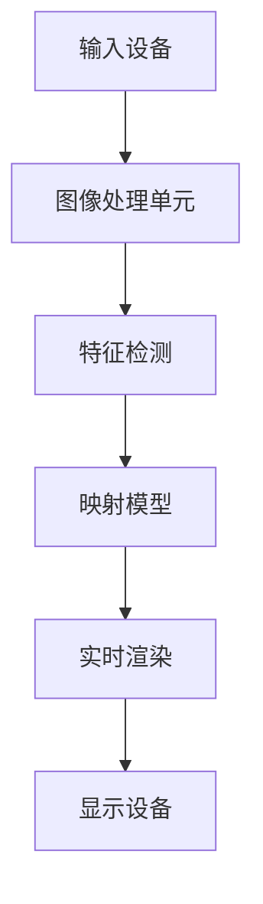

                 

### 文章标题：增强现实在产品可视化中的应用

> 关键词：增强现实、产品可视化、设计、营销、用户体验、技术创新

> 摘要：本文深入探讨了增强现实技术在产品可视化中的应用，从背景介绍到具体应用案例，详细分析了增强现实如何通过提升设计效率和用户体验，为产品营销带来新的机遇。文章分为两个部分，首先介绍了增强现实的核心概念和技术原理，随后通过具体案例展示了其在产品设计和营销中的实际应用，最后讨论了当前面临的挑战及解决方案。文章旨在为读者提供一个全面、系统的认识，帮助他们在实际工作中更好地应用增强现实技术。

### 目录大纲

----------------------------------------------------------------

# 第一部分：背景介绍

## 第1章：增强现实概述

### 1.1.1 问题背景

随着科技的不断进步，产品的设计和营销方式也在不断演变。传统产品可视化手段，如2D图纸、静态图片和三维模型展示，虽然在一定程度上满足了用户的需求，但仍存在诸多不足。例如，这些手段难以直观地展示产品的细节和功能，无法提供沉浸式的用户体验，容易造成用户理解和沟通上的障碍。因此，如何提高产品可视化的效果，增强用户体验和沟通效率，成为当前亟待解决的问题。

### 1.1.2 增强现实技术原理

增强现实（Augmented Reality，简称AR）技术通过将虚拟信息与现实世界结合，为用户提供了一种全新的交互方式。其核心原理包括现实增强、虚拟现实、混合现实等。通过标记识别、图像识别、实时跟踪等关键技术，AR技术能够将虚拟图像、声音、触觉等感官信息实时叠加到现实环境中，使用户能够与虚拟内容进行互动。具体工作原理如图1-1所示。



### 1.1.3 增强现实技术在产品可视化中的应用

增强现实技术为产品可视化提供了全新的解决方案。它不仅能够提供高精度的三维模型展示，还可以通过互动和沉浸式体验，让用户更直观、更深入地了解产品的功能和特性。例如，在产品设计阶段，设计师可以利用AR技术对产品模型进行实时预览和修改；在产品营销阶段，企业可以通过AR技术制作互动广告，吸引用户参与并促进购买决策。以下是增强现实技术在产品可视化中的一些应用案例：

- **产品设计协作**：利用AR技术，设计师可以实时查看和修改产品模型，提高设计效率和准确性。例如，苹果公司的ARKit和谷歌的ARCore提供了强大的AR开发工具，帮助设计师和工程师更好地协作。
- **产品展示与营销**：企业可以利用AR技术制作互动广告和展示，为用户提供沉浸式的购物体验。例如，某些零售商通过AR技术，让顾客在家中使用手机或平板电脑查看产品的3D模型，并进行虚拟试穿或试用。
- **教育培训与演示**：通过AR技术，教育工作者可以为学生提供更生动、互动的学习体验。例如，某些教育机构利用AR技术制作教学工具，让学生能够实时观察和操作虚拟实验，提高学习效果。

### 1.1.4 增强现实技术在产品可视化中的优势

增强现实技术在产品可视化中具有显著的优势：

- **设计可视化**：通过增强现实技术，设计师可以实时查看和修改产品模型，提高设计效率和准确性。
- **用户参与度**：增强现实技术提供了沉浸式的体验，使用户能够更直观地了解产品的功能和特性，增强用户对产品的感知和参与。
- **协同设计**：增强现实技术促进了设计师之间的沟通与合作，有助于提高整体设计质量。
- **营销效果提升**：通过增强现实技术，企业可以制作更具吸引力的广告和展示，提高用户的购买欲望和品牌忠诚度。

### 1.1.5 增强现实技术在产品可视化中的挑战与解决方案

虽然增强现实技术在产品可视化中具有巨大潜力，但同时也面临着一些挑战：

- **技术成熟度**：当前AR技术仍处于快速发展阶段，技术成熟度和稳定性有待提高。
- **设备兼容性**：不同设备之间的兼容性问题可能导致应用效果不一致，影响用户体验。
- **数据隐私**：AR应用需要收集和处理大量的用户数据，如何保障用户数据安全和隐私成为重要问题。

针对以上挑战，以下是一些可能的解决方案：

- **技术提升**：通过不断研发和优化AR技术，提高其成熟度和稳定性。
- **标准化**：制定统一的AR技术标准和规范，确保不同设备之间的兼容性。
- **数据安全**：采用先进的数据加密和隐私保护技术，确保用户数据的安全和隐私。

## 1.2 增强现实技术核心概念与联系

### 1.2.1 核心概念

增强现实（Augmented Reality，简称AR）是一种将虚拟信息与现实世界结合的计算机技术。它通过在现实场景中叠加虚拟图像、文字、音频等信息，使用户能够与虚拟内容进行互动。增强现实技术主要涉及以下几个方面：

- **现实增强**：通过叠加虚拟信息，增强用户对现实世界的感知和理解。
- **虚拟现实**：通过创建一个完全沉浸式的虚拟环境，使用户完全沉浸在虚拟世界中。
- **混合现实**：现实世界与虚拟世界的融合，用户可以在现实场景中看到和操作虚拟内容。

### 1.2.2 概念属性特征对比表格

| 技术类型 | 定义 | 主要特点 | 应用场景 |
| --- | --- | --- | --- |
| AR | 增强现实 | 现实世界与虚拟内容的结合 | 产品设计、营销展示、教育培训等 |
| VR | 虚拟现实 | 完全沉浸式的虚拟环境 | 游戏娱乐、模拟训练、远程办公等 |
| MR | 混合现实 | 现实世界与虚拟内容的高度融合 | 设计可视化、维修指导、智能交互等 |

### 1.2.3 ER实体关系图架构

```mermaid
erDiagram
    Product ||--|{ ARApplication } : has
    ARApplication ||--|{ User } : used_by
    User ||--|{ ProductReview } : reviewed_by
```

## 第二部分：增强现实技术在产品可视化中的应用

### 第2章：增强现实在产品设计中的应用

### 2.1 增强现实在产品设计中的优势

增强现实技术为产品设计带来了诸多优势，使得设计师能够更加高效地完成工作，同时提高产品的市场竞争力。

- **设计可视化**：增强现实技术使得设计师能够在虚拟环境中实时查看和修改产品模型，提高了设计的准确性和效率。相比传统的2D图纸或静态图片，AR技术能够提供更加直观和立体的设计体验。
- **用户参与度**：增强现实技术提供了沉浸式的体验，使得用户能够更加直观地了解产品的功能和特性，从而提高用户对产品的感知和参与度。这种体验不仅有助于设计师获取用户的反馈，还能够帮助用户更好地理解和使用产品。
- **协同设计**：增强现实技术促进了设计师之间的沟通与合作。通过AR技术，设计师可以在同一时间查看和修改产品模型，实现远程协同设计。这种合作方式不仅提高了设计效率，还增强了团队的协作能力。

### 2.2 增强现实在产品设计中的应用案例

增强现实技术在产品设计中的应用案例已经越来越多，以下是一些典型的应用实例：

- **产品设计协作工具**：例如苹果公司的ARKit和谷歌的ARCore，这些工具为设计师提供了强大的AR开发能力，使得设计师可以在虚拟环境中进行实时设计。通过这些工具，设计师可以与其他团队成员实时共享设计成果，实现高效的协同工作。
- **实例分析**：某知名汽车制造商利用AR技术改进了其产品设计过程。设计师可以通过AR技术实时查看和修改汽车模型，从而在早期阶段就能发现和解决设计问题。这种设计方式不仅提高了设计效率，还减少了设计错误和返工的次数。

### 2.3 增强现实在产品设计中的实现方法

要实现增强现实在产品设计中的应用，需要以下几个步骤：

- **3D建模与渲染**：首先，需要使用专业软件创建产品的3D模型，并进行高质量的渲染。这些软件包括Autodesk Maya、Blender等。
- **AR应用开发**：接着，利用AR开发平台（如ARKit、ARCore等），开发能够运行在移动设备上的AR应用。这些应用需要实现产品的三维展示和交互功能。
- **用户交互设计**：最后，对AR应用进行用户交互设计，确保用户能够方便、直观地与产品进行互动。这包括界面设计、交互流程设计等。

### 2.4 增强现实在产品设计中的挑战与解决方案

虽然增强现实技术在产品设计中有许多优势，但也面临着一些挑战。

- **技术成熟度**：当前AR技术仍处于快速发展阶段，技术成熟度和稳定性有待提高。解决方案是持续关注AR技术的发展动态，选择成熟可靠的技术和工具。
- **设备兼容性**：不同设备之间的兼容性问题可能导致应用效果不一致，影响用户体验。解决方案是制定统一的AR技术标准和规范，确保不同设备之间的兼容性。
- **数据隐私**：AR应用需要收集和处理大量的用户数据，如何保障用户数据安全和隐私成为重要问题。解决方案是采用先进的数据加密和隐私保护技术，确保用户数据的安全和隐私。

### 第3章：增强现实在产品营销中的应用

#### 3.1 增强现实在产品营销中的优势

增强现实技术为产品营销带来了全新的机遇，使得企业能够以更加生动、互动的方式与消费者进行沟通。

- **营销效果提升**：增强现实技术能够提供沉浸式的体验，使得消费者对产品的感知和记忆更加深刻。这种体验不仅能够提升产品的营销效果，还能够增强品牌形象。
- **沉浸式体验**：增强现实技术可以将虚拟内容与现实世界相结合，为消费者提供一种全新的沉浸式体验。这种体验能够激发消费者的兴趣，提高他们的购买欲望。
- **用户参与度提高**：通过增强现实技术，消费者可以与产品进行互动，从而更加深入地了解产品的功能和特性。这种互动不仅能够提高用户的参与度，还能够促进购买决策。

#### 3.2 增强现实在产品营销中的应用案例

增强现实技术在产品营销中的应用案例越来越多，以下是一些典型的应用实例：

- **营销活动**：企业可以通过增强现实技术举办互动营销活动，如虚拟试穿、虚拟试驾等。这些活动不仅能够吸引消费者的参与，还能够提高品牌知名度。
- **实例分析**：某知名时尚品牌利用增强现实技术举办了一场虚拟试穿活动。消费者可以通过手机或平板电脑查看自己的虚拟形象，并试穿不同款式的服装。这种互动活动不仅吸引了大量消费者参与，还提高了品牌的销量。

#### 3.3 增强现实在产品营销中的实现方法

要实现增强现实在产品营销中的应用，需要以下几个步骤：

- **营销内容策划**：首先，需要制定AR营销策略和内容，确定营销目标和受众群体。
- **AR广告开发**：接着，利用AR开发平台（如ARKit、ARCore等），开发具有吸引力的AR广告内容。这些广告需要能够吸引消费者的注意力，并提供沉浸式的体验。
- **用户反馈收集**：最后，通过用户反馈收集和分析，不断优化AR营销效果，提升用户满意度。

#### 3.4 增强现实在产品营销中的挑战与解决方案

虽然增强现实技术在产品营销中有许多优势，但也面临着一些挑战。

- **技术门槛**：当前AR技术仍具有一定的开发难度，如何降低开发难度，提高应用普及率是一个重要问题。解决方案是提供更加易用和高效的AR开发工具和平台。
- **广告监管**：增强现实广告需要遵守相关的广告法规，避免潜在的法律风险。解决方案是制定明确的广告规范和标准，确保AR广告的合法合规。
- **数据分析**：如何有效收集和分析用户数据，提升营销效果是一个关键问题。解决方案是采用先进的数据分析和挖掘技术，深入了解用户行为和需求，优化营销策略。

### 总结与展望

增强现实技术在产品可视化中的应用前景广阔，它不仅能够提升设计效率和用户体验，还能够为产品营销带来新的机遇。随着技术的不断发展和成熟，我们有理由相信，增强现实技术将在未来发挥更加重要的作用，为产品和品牌创造更多的价值。

在产品设计方面，增强现实技术将继续提高设计效率和准确性，促进设计师之间的协同工作。在产品营销方面，增强现实技术将提供更加沉浸式和互动的体验，吸引更多消费者的关注和参与。同时，我们也需要关注增强现实技术在技术成熟度、设备兼容性和数据隐私等方面的发展，确保其在产品可视化中的应用能够持续、稳定、安全地推进。

总之，增强现实技术在产品可视化中的应用已经展现出巨大的潜力，它不仅能够为产品和品牌创造新的价值，还能够为消费者带来更加丰富、多样的体验。随着技术的不断进步，我们有理由期待，增强现实技术将在未来发挥更加重要的作用，推动产品可视化和营销的变革。

