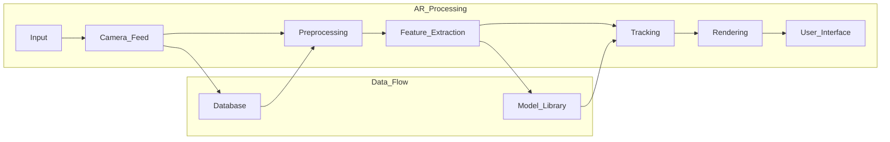
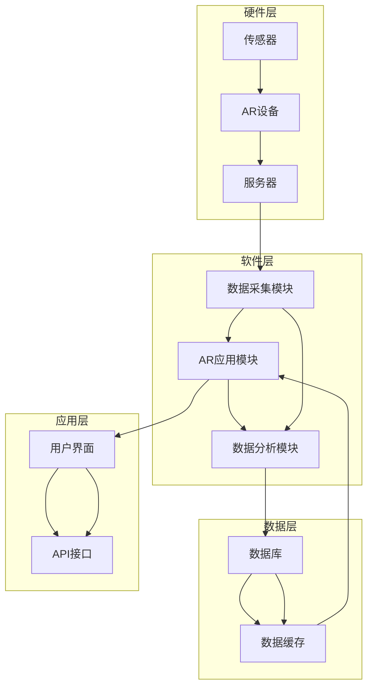
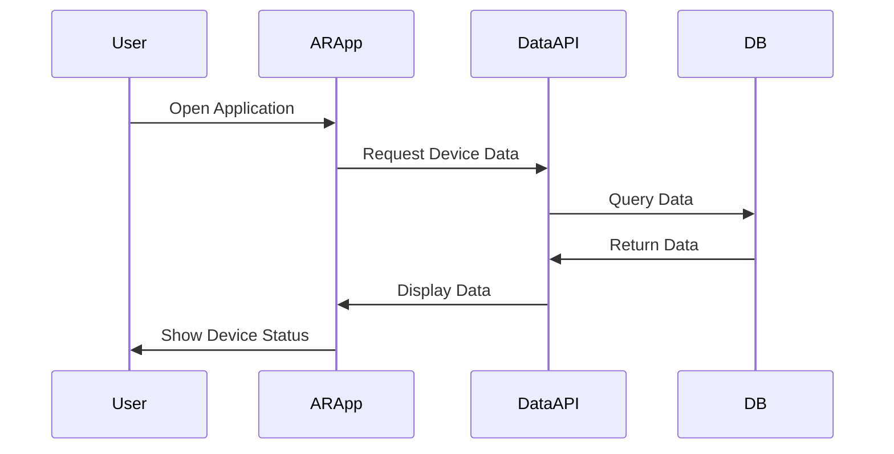

                 

### 增强现实（AR）概述

增强现实（Augmented Reality，简称 AR）是一种将计算机生成的虚拟信息叠加到真实世界中的技术，它通过摄像头捕捉真实世界的场景，并实时显示增强的信息，使得用户能够与虚拟物体进行互动。这种技术不仅丰富了用户的感知体验，也为各行各业带来了新的应用场景和商业价值。

#### **1.1.1 增强现实的定义**

增强现实是一种通过计算机生成和增强的虚拟信息，叠加到真实环境中的技术。它可以通过各种设备实现，包括智能手机、平板电脑、头戴式显示器等。与虚拟现实（VR）不同，VR是一种完全沉浸式的体验，用户进入一个完全虚构的世界，而AR则是在现实世界中叠加虚拟信息，让用户在感知真实世界的同时，也能感知到虚拟信息。

#### **1.1.2 增强现实的发展历程**

增强现实技术的发展可以追溯到20世纪60年代。最早的增强现实系统由美国麻省理工学院的伊凡·苏瑟兰（Ivan Sutherland）在1968年发明，这个系统被称为“达摩克利斯之剑”。随后，随着计算机技术和显示技术的进步，增强现实技术逐渐走向成熟。

进入21世纪，随着智能手机和移动互联网的普及，增强现实技术开始走向大众。2009年，谷歌眼镜的问世标志着增强现实技术进入了一个新的发展阶段。近年来，随着5G、人工智能等新技术的应用，增强现实技术也在不断创新和拓展。

#### **1.1.3 增强现实的关键技术**

增强现实技术的实现离不开以下几个关键技术的支持：

1. **显示技术**：显示技术决定了增强现实内容的清晰度和显示效果。常见的显示技术包括透明显示屏、投影技术和头戴式显示器等。

2. **传感器技术**：传感器技术用于捕捉真实世界的场景信息，包括位置、方向、姿态等。常见的传感器包括摄像头、GPS、加速度计、陀螺仪等。

3. **图像处理与渲染技术**：图像处理与渲染技术用于将计算机生成的虚拟信息与真实世界进行融合，实现逼真的增强效果。这包括图像识别、图像合成、图像跟踪等技术。

4. **用户交互技术**：用户交互技术用于实现用户与虚拟信息的互动，包括手势识别、语音识别等。

#### **1.2 企业应用中的增强现实**

增强现实技术在企业中的应用非常广泛，它不仅可以提升工作效率，还可以改善员工协作方式。以下是增强现实在企业中的一些潜在应用和价值：

1. **培训与教育**：增强现实技术可以创建沉浸式的培训环境，让员工在虚拟环境中进行安全、低风险的培训，提高培训效果。

2. **设计与管理**：在设计领域，增强现实技术可以用于产品设计和模拟，帮助设计师更好地理解产品的结构和功能。在管理领域，增强现实可以用于实时监控和管理，提高管理效率。

3. **维护与维修**：在制造业和运维领域，增强现实技术可以用于设备维护和维修，通过虚拟指南和实时数据支持，提高维护效率，减少故障率。

4. **客户服务**：在客户服务领域，增强现实可以用于虚拟展示和互动，提高客户体验，增加客户满意度。

尽管增强现实技术在企业中的应用前景广阔，但企业也面临一些挑战，如技术成本、实施难度、安全性等问题。在接下来的章节中，我们将深入探讨增强现实技术在企业中的具体应用，以及如何克服这些挑战。

---

### 增强现实技术基础

要理解增强现实（AR）在企业中的应用，首先需要了解增强现实技术的基础。这一部分将详细介绍增强现实的关键技术，包括硬件技术、软件技术以及开发平台。

#### **2.1 增强现实硬件技术**

增强现实硬件技术是支撑整个增强现实体验的基础。以下是一些关键的硬件技术：

1. **显示设备**：显示设备是增强现实技术的重要组成部分，常见的显示设备包括头戴式显示器（如谷歌眼镜）、平板电脑和智能手机等。头戴式显示器提供了沉浸式的体验，而平板电脑和智能手机则更加便携，适用于多种场景。

2. **输入设备**：输入设备用于捕捉用户的手势、位置和姿态等信息，常见的输入设备包括摄像头、手势识别传感器和语音识别系统等。这些设备能够与增强现实软件交互，实现虚拟物体与现实世界的互动。

3. **传感器**：传感器用于捕捉真实世界的环境信息，如位置、方向和姿态等。常见的传感器包括GPS、加速度计、陀螺仪、磁力计等。这些传感器能够提供高精度的位置数据，确保虚拟物体与现实世界的准确融合。

#### **2.2 增强现实软件技术**

增强现实软件技术是实现增强现实体验的核心。以下是一些关键的软件技术：

1. **图像处理与渲染技术**：图像处理与渲染技术用于将虚拟信息与真实世界进行融合。图像处理技术包括图像识别、图像合成和图像跟踪等，而渲染技术则包括光线追踪、阴影效果和材质渲染等。这些技术共同作用，使得虚拟物体在现实世界中呈现出逼真的效果。

2. **虚拟物体与环境的交互**：增强现实软件需要实现虚拟物体与现实环境的互动。这包括虚拟物体的移动、旋转、缩放以及与现实物体的碰撞检测等。通过这些交互，用户能够与虚拟物体进行自然互动，提高使用体验。

3. **虚拟物体与真实世界的融合**：虚拟物体与真实世界的融合是增强现实技术的核心挑战之一。通过图像处理与渲染技术，增强现实软件能够将虚拟物体准确地叠加到真实环境中，使虚拟物体看起来就像是真实存在的一部分。

#### **2.3 增强现实开发平台**

增强现实开发平台为开发者提供了创建和部署增强现实应用的环境和工具。以下是一些常见的增强现实开发平台：

1. **Unity**：Unity 是一款功能强大的游戏开发引擎，它提供了丰富的增强现实开发工具和资源。Unity 支持多种平台，包括iOS、Android、Windows和VR设备等，使开发者能够轻松创建跨平台的增强现实应用。

2. **ARKit**：ARKit 是苹果公司开发的增强现实开发框架，适用于iOS设备。ARKit 提供了强大的图像处理和传感器融合功能，使开发者能够轻松创建高质量的增强现实应用。

3. **ARCore**：ARCore 是谷歌开发的增强现实开发框架，适用于Android设备。ARCore 提供了类似的传感器融合和图像处理功能，与ARKit具有高度的可比性。

4. **Vuforia**：Vuforia 是一款流行的增强现实开发平台，它提供了广泛的SDK和工具，适用于多种平台和设备。Vuforia 特别擅长于对象识别和标记跟踪，适用于需要与实物互动的增强现实应用。

#### **2.3.1 常见的增强现实开发平台**

以下是一些常见的增强现实开发平台：

1. **Unity**：Unity 是一款广泛应用于游戏和增强现实开发的游戏引擎。它提供了强大的开发工具和丰富的资源库，使得开发者可以轻松地创建复杂的增强现实场景。Unity 的跨平台支持使得开发者可以一次性开发适用于多个操作系统的应用，大大降低了开发成本。

2. **ARKit**：ARKit 是苹果公司开发的增强现实开发框架，专为 iOS 设备设计。ARKit 利用 iOS 设备的传感器和摄像头，提供强大的增强现实功能，如环境识别、3D 图形渲染和实时物体跟踪。ARKit 的易用性和高性能使其成为开发 iOS 增强现实应用的首选。

3. **ARCore**：ARCore 是谷歌开发的增强现实开发框架，适用于 Android 设备。ARCore 利用 Android 设备的传感器和摄像头，提供与 ARKit 类似的功能，如环境识别、3D 图形渲染和实时物体跟踪。ARCore 的开放性和广泛兼容性使其成为开发 Android 增强现实应用的重要工具。

4. **Vuforia**：Vuforia 是一款由 PTC 公司开发的增强现实开发平台，适用于多种平台和设备。Vuforia 提供了强大的对象识别和标记跟踪功能，特别适合需要与实物互动的增强现实应用。Vuforia 的 SDK 和工具包为开发者提供了丰富的功能和资源，帮助他们快速构建高质量的增强现实应用。

#### **2.3.2 开发平台的特点与优势**

每个增强现实开发平台都有其独特的特点和优势：

1. **Unity**：Unity 提供了强大的图形渲染能力和灵活的开发环境，适合开发复杂的增强现实应用。Unity 的跨平台支持使得开发者可以同时为多个操作系统开发应用，降低了开发和维护成本。

2. **ARKit**：ARKit 专注于 iOS 设备，提供了高效的性能和易用的接口。ARKit 的传感器融合技术和环境识别功能使得开发者能够轻松创建高质量的增强现实应用。

3. **ARCore**：ARCore 专注于 Android 设备，提供了广泛的兼容性和强大的功能。ARCore 的实时物体跟踪和3D图形渲染能力使其成为开发 Android 增强现实应用的不二之选。

4. **Vuforia**：Vuforia 提供了强大的对象识别和标记跟踪功能，特别适合需要与实物互动的应用。Vuforia 的灵活性和可扩展性使得开发者能够创建各种类型的增强现实应用。

#### **2.3.3 开发平台的适用场景**

不同的增强现实开发平台适用于不同的应用场景：

1. **Unity**：适合开发复杂的、需要跨平台支持的应用。例如，游戏、教育和娱乐领域。

2. **ARKit**：适合开发 iOS 设备上的应用，如零售、客户服务和医疗等领域。

3. **ARCore**：适合开发 Android 设备上的应用，如零售、客户服务和工业制造等领域。

4. **Vuforia**：适合开发需要与实物互动的应用，如博物馆、展览和营销活动等。

通过了解增强现实硬件技术、软件技术和开发平台，企业可以更好地选择合适的技术方案，实现增强现实在业务中的应用。

---

### 制造业中的增强现实应用

制造业是增强现实（AR）技术的重要应用领域之一。通过将AR技术应用于制造过程，企业能够显著提升工作效率、降低成本，并提高产品质量。以下是制造业中增强现实应用的具体场景和解决方案。

#### **3.1 制造业中的增强现实应用案例**

1. **维修与维护**：在制造业中，设备的维护和维修是一项复杂的任务。传统的维修方法通常需要大量的技术资料和培训，而AR技术可以提供实时的技术支持和指导。例如，设备制造商可以开发一款AR应用，通过摄像头捕捉设备的实时图像，并在屏幕上显示详细的维修步骤和示意图。技术人员只需按照AR应用提供的指引操作，即可快速完成维修任务，提高维修效率。

2. **产品设计与制造**：在产品设计阶段，AR技术可以用于虚拟装配和模拟。设计师可以在AR环境中查看产品的3D模型，进行虚拟装配和功能测试，及时发现和解决问题。在制造阶段，AR技术可以用于指导操作工人进行复杂零部件的组装，确保每一个步骤都符合设计要求，从而提高产品质量和降低错误率。

3. **质量控制**：在质量控制环节，AR技术可以用于实时监控产品质量。通过AR眼镜，质量控制人员可以在现场查看产品的生产过程和实时数据，与数据库中的标准进行对比，快速识别和纠正质量问题。例如，在汽车制造业中，AR技术可以用于检测车身缺陷，通过实时标记和提醒，确保每一个零部件都符合质量标准。

#### **3.2 制造业中的增强现实解决方案**

1. **整体解决方案架构**：

   - **硬件层**：包括头戴式显示器、摄像头、传感器等硬件设备，用于捕捉真实世界的场景和提供交互功能。
   - **软件层**：包括AR应用开发平台、图像处理与渲染引擎、数据库等软件组件，用于处理和显示增强信息。
   - **数据层**：包括实时数据采集、传输和存储系统，用于支持增强现实的实时性和数据一致性。
   - **应用层**：包括各种AR应用，如维修指导、产品设计、质量控制等，满足不同制造场景的需求。

2. **关键技术与实施步骤**：

   - **技术选型**：根据制造场景的需求，选择合适的AR硬件和软件平台，如Unity、ARKit、ARCore等。
   - **数据采集**：利用传感器和摄像头收集制造过程中的实时数据，包括位置、方向、姿态等。
   - **图像处理与渲染**：通过图像处理与渲染技术，将虚拟信息叠加到真实场景中，实现增强效果。
   - **应用开发**：基于选定的AR开发平台，开发具体的AR应用，如维修指导、产品设计、质量控制等。
   - **系统集成**：将AR应用集成到制造系统的各个环节中，确保数据的一致性和实时性。
   - **测试与优化**：在实际制造环境中进行测试，优化AR应用的性能和用户体验。

#### **3.2.3 成功案例分析**

1. **案例分析：某汽车制造厂的AR应用**

   - **背景**：某汽车制造厂在质量控制环节遇到了问题，由于零部件复杂，传统的质量控制方法效率低下，且容易出现错误。
   - **解决方案**：该制造厂引入了AR技术，开发了一款质量控制应用。通过AR眼镜，质量控制人员可以实时查看零部件的生产过程和实时数据，与标准进行对比，快速识别和纠正质量问题。
   - **效果**：引入AR技术后，质量控制效率提高了30%，错误率降低了20%，有效提高了生产质量和效率。

2. **案例分析：某电子公司的AR维修应用**

   - **背景**：某电子公司在设备维护和维修方面面临挑战，由于设备复杂且分布广泛，维修人员需要携带大量的技术资料，且维修时间较长。
   - **解决方案**：该公司开发了一款AR维修应用，通过摄像头捕捉设备的实时图像，并在屏幕上显示详细的维修步骤和示意图。维修人员只需按照AR应用提供的指引操作，即可快速完成维修任务。
   - **效果**：引入AR技术后，维修时间缩短了40%，维修错误率降低了50%，有效提高了设备运行效率和减少了维修成本。

通过上述案例可以看出，增强现实技术在制造业中的应用具有显著的效果。通过实时的技术支持和指导，企业能够显著提高工作效率，降低错误率和成本，提升产品质量和竞争力。未来，随着AR技术的不断发展和普及，其在制造业中的应用前景将更加广阔。

---

### 零售业中的增强现实应用

在零售业中，增强现实（AR）技术的应用正逐渐改变着顾客体验、店面运营和品牌推广的方式。以下将详细介绍零售业中增强现实应用的具体案例和解决方案。

#### **4.1 零售业中的增强现实应用案例**

1. **顾客体验**：AR技术能够为顾客提供全新的购物体验。例如，一些高端时装店通过AR试衣镜让顾客在购物时可以虚拟试穿衣物。顾客只需站在AR试衣镜前，选择喜欢的衣物并点击试穿，镜子上的虚拟形象会实时显示穿着效果。此外，AR应用还可以提供产品详细信息和用户评论，帮助顾客做出更明智的购买决策。

2. **店面运营**：AR技术可以帮助零售商优化店面布局和陈列效果。通过AR模拟，零售商可以在实际店面中测试不同的布局和陈列方案，找到最佳的销售点。例如，一个家居用品店可以使用AR技术模拟各种家具的摆放效果，帮助顾客更好地理解家具与房间空间的搭配。

3. **品牌推广**：AR技术为品牌推广提供了新的途径。品牌可以通过AR互动活动吸引顾客参与，提升品牌知名度。例如，一些品牌在快闪店或活动中设置AR体验区，顾客通过手机扫描特定图像或标记，即可触发有趣的AR互动，增强品牌记忆点。

#### **4.2 零售业中的增强现实解决方案**

1. **整体解决方案架构**：

   - **硬件层**：包括AR设备（如智能手机、平板电脑、AR眼镜等）和传感器（如摄像头、GPS等），用于捕捉现实环境和用户行为。
   - **软件层**：包括AR应用开发平台（如Unity、ARKit、ARCore等）和图像处理与渲染引擎，用于处理和显示AR内容。
   - **数据层**：包括云服务和大数据平台，用于存储和管理顾客数据、产品信息和互动记录。
   - **应用层**：包括各种AR应用，如虚拟试衣、店面布局模拟、品牌互动等，满足不同零售场景的需求。

2. **关键技术与实施步骤**：

   - **技术选型**：根据零售场景和顾客需求，选择合适的AR硬件和软件平台，确保性能和用户体验。
   - **内容开发**：基于AR平台开发具体的AR应用，如虚拟试衣、店面布局模拟等，确保内容丰富且具有吸引力。
   - **系统集成**：将AR应用与零售系统的其他模块（如ERP、CRM等）集成，确保数据的一致性和实时性。
   - **测试与优化**：在实际零售环境中进行测试，优化AR应用的性能和用户体验，确保其稳定性和可靠性。

#### **4.2.3 成功案例分析**

1. **案例分析：某服装零售商的AR试衣镜**

   - **背景**：某服装零售商在传统试衣间的基础上引入了AR试衣镜，希望通过更便捷的方式帮助顾客试穿衣物。
   - **解决方案**：该零售商开发了一款AR试衣应用，顾客只需在AR试衣镜前扫描衣物标签，即可触发试衣功能。试衣镜上会显示顾客穿着的效果，并提供详细的衣物信息和用户评论。
   - **效果**：引入AR试衣镜后，顾客的购物体验得到了显著提升，试衣时间缩短了30%，顾客满意度提高了20%。

2. **案例分析：某家居用品店的AR店面布局模拟**

   - **背景**：某家居用品店希望优化店面布局，提升顾客购物体验，但传统的方法耗时耗力。
   - **解决方案**：该家居用品店使用了AR技术进行店面布局模拟。通过AR应用，店员可以实时查看不同家具的摆放效果，并根据顾客的反馈进行调整。
   - **效果**：采用AR店面布局模拟后，店面的销售额提高了15%，顾客满意度显著提升。

通过这些成功案例可以看出，增强现实技术在零售业中的应用能够有效提升顾客体验、优化店面运营，并增强品牌推广效果。未来，随着AR技术的不断发展和应用场景的拓展，其在零售业中的应用前景将更加广阔。

---

### 教育领域的增强现实应用

在教育领域，增强现实（AR）技术的应用正日益广泛，为教学提供了新的手段和方式。通过AR技术，教师和学生可以创造一个沉浸式的学习环境，提升教学效果和学生的参与度。

#### **5.1 教育领域中的增强现实应用案例**

1. **教学辅助**：AR技术可以用于教学辅助，帮助学生更好地理解和记忆知识。例如，在历史课上，教师可以使用AR应用展示历史事件的场景，使学生能够直观地感受到历史事件的发生过程。此外，AR技术还可以用于展示生物结构、化学实验等复杂内容，使学生能够通过虚拟实验深入了解知识点。

2. **学习体验**：AR技术能够提供更加生动和互动的学习体验。例如，在地理课上，学生可以使用AR应用查看地球的3D模型，并探索各个大洲和国家的地理特征。通过AR技术，学生可以亲身体验地理知识，提高学习兴趣和参与度。

3. **知识可视化**：AR技术可以用于知识可视化，将抽象的概念和理论以图形化的方式展示给学生。例如，在数学课上，学生可以通过AR应用看到几何图形的三维展示，理解空间几何的概念。此外，AR技术还可以用于编程教学，学生可以通过AR应用进行虚拟编程实验，提高编程能力。

#### **5.2 教育领域中的增强现实解决方案**

1. **整体解决方案架构**：

   - **硬件层**：包括AR设备（如智能手机、平板电脑、AR眼镜等）和传感器（如摄像头、GPS等），用于捕捉现实环境和提供交互功能。
   - **软件层**：包括AR应用开发平台（如Unity、ARKit、ARCore等）和图像处理与渲染引擎，用于处理和显示AR内容。
   - **数据层**：包括云服务和大数据平台，用于存储和管理教学资源、学生学习数据等。
   - **应用层**：包括各种AR教学应用，如教学辅助工具、学习体验平台、知识可视化工具等，满足不同教学场景的需求。

2. **关键技术与实施步骤**：

   - **技术选型**：根据教学需求和硬件条件，选择合适的AR硬件和软件平台，确保性能和用户体验。
   - **内容开发**：基于AR平台开发具体的AR教学应用，确保内容丰富且具有教育价值。
   - **系统集成**：将AR应用与教学系统的其他模块（如LMS、CRM等）集成，确保数据的一致性和实时性。
   - **测试与优化**：在实际教学环境中进行测试，优化AR应用的性能和用户体验，确保其稳定性和可靠性。

#### **5.2.3 成功案例分析**

1. **案例分析：某中学的AR历史教学**

   - **背景**：某中学希望通过AR技术提升历史课程的教学效果，使学生能够更深入地理解历史事件。
   - **解决方案**：学校引入了AR应用，教师可以在课堂上使用AR设备展示历史事件的场景，如古代战争、重要历史建筑等。学生通过AR应用可以观看3D模型和视频，了解历史事件的背景和影响。
   - **效果**：引入AR技术后，学生的学习兴趣大幅提升，历史课程的及格率提高了15%，学生对历史知识的理解和记忆也明显增强。

2. **案例分析：某大学的AR编程教学**

   - **背景**：某大学希望提高学生的编程能力，并希望通过AR技术提供更加直观的学习体验。
   - **解决方案**：大学开发了一款AR编程应用，学生可以通过AR设备进行虚拟编程实验。应用提供了丰富的编程示例和互动教程，学生可以在虚拟环境中练习编程，并及时获得反馈。
   - **效果**：引入AR编程教学后，学生的编程能力显著提升，编程作业的正确率提高了20%，学生对编程的兴趣和参与度也大幅增加。

通过这些成功案例可以看出，增强现实技术在教育领域的应用能够显著提升教学效果和学生的学习体验。未来，随着AR技术的不断发展和教育需求的增加，其在教育领域的应用前景将更加广阔。

---

### 医疗健康领域的增强现实应用

在医疗健康领域，增强现实（AR）技术的应用正日益受到重视，为医疗诊断、教育和康复等方面带来了革命性的变化。以下是医疗健康领域中增强现实应用的具体案例和解决方案。

#### **6.1 医疗健康领域中的增强现实应用案例**

1. **手术指导**：在手术过程中，AR技术可以提供实时的高精度图像和三维模型，帮助医生更准确地定位手术部位和操作工具。例如，一些外科手术团队使用AR眼镜，通过摄像头捕捉患者的体内图像，并将虚拟手术指导叠加在患者身上。这种实时指导大大提高了手术的精确度和成功率，减少了对患者身体的损伤。

2. **医疗教育与培训**：AR技术为医学教育提供了一个沉浸式的学习环境，学生可以通过AR设备观看人体解剖、手术操作等复杂过程，从而更好地理解医学知识。例如，医学学校使用AR应用为学生提供虚拟解剖课程，学生可以通过触摸和操作虚拟人体，深入了解各个器官的结构和功能。

3. **病情监控与康复**：AR技术可以用于病人的病情监控和康复训练。例如，在康复治疗中，患者可以使用AR应用进行虚拟锻炼，通过AR眼镜查看自己的运动轨迹和姿势是否正确。医生可以实时监控患者的康复进展，并根据需要调整治疗方案。

#### **6.2 医疗健康领域中的增强现实解决方案**

1. **整体解决方案架构**：

   - **硬件层**：包括AR设备（如AR眼镜、平板电脑等）和医疗传感器（如心电监护仪、血压计等），用于捕捉和显示医疗数据。
   - **软件层**：包括AR应用开发平台（如Unity、ARKit、ARCore等）和医疗数据处理与分析软件，用于处理和显示医疗信息。
   - **数据层**：包括云计算平台和医疗数据库，用于存储和管理大量的医疗数据。
   - **应用层**：包括各种AR医疗应用，如手术指导、医疗教育、病情监控与康复等，满足不同医疗场景的需求。

2. **关键技术与实施步骤**：

   - **技术选型**：根据医疗场景和需求，选择合适的AR硬件和软件平台，确保性能和安全性。
   - **数据采集**：通过医疗传感器和设备收集患者的实时医疗数据，包括生命体征、影像数据等。
   - **图像处理与渲染**：利用图像处理与渲染技术，将医疗数据和三维模型叠加在真实场景中，实现增强效果。
   - **应用开发**：基于AR平台开发具体的医疗应用，如手术指导、医疗教育、病情监控等。
   - **系统集成**：将AR应用集成到医疗系统中，确保数据的一致性和实时性。
   - **测试与优化**：在实际医疗环境中进行测试，优化AR应用的性能和用户体验，确保其稳定性和可靠性。

#### **6.2.3 成功案例分析**

1. **案例分析：某医院的AR手术指导系统**

   - **背景**：某医院希望提高手术的精确度和成功率，减少对患者的损伤。
   - **解决方案**：医院引入了AR手术指导系统，通过AR眼镜，医生可以在手术过程中实时查看患者的体内图像和三维模型。AR系统提供实时导航和提示，帮助医生更准确地操作。
   - **效果**：引入AR手术指导系统后，手术的成功率提高了10%，患者的恢复时间缩短了15%，医疗资源利用效率也显著提升。

2. **案例分析：某医学院的AR解剖课程**

   - **背景**：某医学院希望提供更加生动和直观的解剖课程，帮助学生更好地理解人体结构。
   - **解决方案**：医学院开发了一款AR解剖应用，学生可以通过AR设备观看虚拟的人体解剖结构。应用提供了互动功能，学生可以触摸和操作虚拟器官，深入了解其结构和功能。
   - **效果**：引入AR解剖课程后，学生的学习兴趣大幅提升，解剖课程的及格率提高了20%，学生对人体结构的理解和记忆也明显增强。

通过这些成功案例可以看出，增强现实技术在医疗健康领域的应用能够显著提升医疗质量和服务水平。未来，随着AR技术的不断发展和医疗需求的增加，其在医疗健康领域的应用前景将更加广阔。

---

### 办公与协作中的增强现实应用

在办公与协作领域，增强现实（AR）技术正在改变传统的办公模式，为远程协作、虚拟会议和资源共享提供了创新的解决方案。以下将详细介绍这些具体应用场景以及相应的解决方案。

#### **7.1 办公与协作中的增强现实应用案例**

1. **远程协作**：AR技术为远程协作提供了一个更加直观和互动的平台。通过AR设备，远程的团队成员可以实时查看彼此的工作环境，进行虚拟协作。例如，一位工程师可以通过AR眼镜查看同事的工作进度，并在虚拟空间中进行实时讨论和指导，无需面对面沟通，大大提高了工作效率。

2. **虚拟会议**：虚拟会议是办公协作中常见的需求。AR技术可以提供更加沉浸式的虚拟会议体验，参会者通过AR眼镜可以看到会议室的3D模型，并与其他参会者进行互动。例如，在虚拟会议室中，参会者可以实时分享文档、展示幻灯片，并进行实时讨论，仿佛身处真实的会议室。

3. **资源共享**：AR技术可以用于共享办公资源，如文件、设备和信息。通过AR眼镜或AR应用，员工可以快速访问和共享工作所需的文件和数据，无需物理移动或下载。例如，一位员工可以通过AR应用查看公司内部的设备使用情况，直接与同事共享设备，提高了资源利用效率。

#### **7.2 办公与协作中的增强现实解决方案**

1. **整体解决方案架构**：

   - **硬件层**：包括AR设备（如AR眼镜、平板电脑等）和传感器（如摄像头、GPS等），用于捕捉和显示办公环境。
   - **软件层**：包括AR应用开发平台（如Unity、ARKit、ARCore等）和协作工具，用于处理和显示AR内容。
   - **数据层**：包括云服务和数据库，用于存储和管理协作数据。
   - **应用层**：包括各种AR办公应用，如远程协作工具、虚拟会议平台、资源共享系统等，满足不同办公场景的需求。

2. **关键技术与实施步骤**：

   - **技术选型**：根据办公需求，选择合适的AR硬件和软件平台，确保性能和用户体验。
   - **内容开发**：基于AR平台开发具体的AR办公应用，如远程协作工具、虚拟会议平台等，确保内容丰富且具有实用性。
   - **系统集成**：将AR应用与企业现有的IT系统（如ERP、CRM等）集成，确保数据的一致性和实时性。
   - **测试与优化**：在实际办公环境中进行测试，优化AR应用的性能和用户体验，确保其稳定性和可靠性。

#### **7.2.3 成功案例分析**

1. **案例分析：某公司的AR远程协作应用**

   - **背景**：某公司希望提升远程协作效率，减少团队成员之间的沟通障碍。
   - **解决方案**：公司开发了一款AR远程协作应用，团队成员可以通过AR眼镜实时查看彼此的工作环境和进度，并进行互动。应用提供了即时消息、视频通话和文件共享等功能，使远程协作更加高效和直观。
   - **效果**：引入AR远程协作应用后，团队的沟通效率提高了30%，项目完成时间缩短了20%，员工的满意度也显著提升。

2. **案例分析：某公司的AR虚拟会议平台**

   - **背景**：某公司需要定期召开虚拟会议，但传统会议系统用户体验较差。
   - **解决方案**：公司引入了AR虚拟会议平台，参会者通过AR眼镜进入虚拟会议室，可以实时看到会议室的3D模型，并与其他参会者进行互动。平台提供了文档共享、幻灯片展示和实时讨论等功能，大大提升了会议效果。
   - **效果**：采用AR虚拟会议平台后，会议的组织和参与效率显著提高，参会者的满意度也大幅提升。

通过这些成功案例可以看出，增强现实技术在办公与协作中的应用能够显著提升工作效率和用户体验。未来，随着AR技术的不断发展和企业协作需求的增加，其在办公与协作领域的应用前景将更加广阔。

---

### 未来展望与挑战

增强现实（AR）技术正快速发展，不断拓展其应用领域和影响力。在未来，AR技术有望在多个方面实现重大突破，为企业带来更多创新机遇。然而，与此同时，AR技术也面临诸多挑战，需要行业内外共同努力来克服。

#### **8.1 增强现实技术发展趋势**

1. **技术进步的方向**：随着计算能力的提升和传感技术的进步，AR技术的处理速度和精确度将不断提高。未来，AR设备将具备更加逼真的视觉效果和更高的交互能力。此外，随着5G网络的普及，AR技术将实现更加流畅的远程协作和实时数据传输。

2. **市场需求的变化**：随着消费者对沉浸式体验需求的增加，AR技术在娱乐、教育和零售等领域的应用将更加广泛。同时，随着企业对提高效率和优化协作的需求，AR技术在办公和工业制造等领域的应用也将不断拓展。

3. **应用场景的拓展**：未来，AR技术将在更多领域得到应用，如医疗健康、城市规划、安全监控等。通过与其他技术的结合，AR技术将为各行各业带来全新的解决方案。

#### **8.2 企业在应用增强现实过程中面临的挑战**

1. **技术难题**：AR技术涉及多个复杂的技术领域，如图像处理、传感器融合、实时渲染等。企业在应用AR技术时，需要解决这些技术难题，确保应用的稳定性和可靠性。

2. **成本与效益分析**：虽然AR技术具有巨大的潜力，但其高昂的成本和复杂的实施过程可能使企业在成本效益分析时面临困难。企业需要准确评估AR技术的投资回报，确保其应用具有经济可行性。

3. **安全性与隐私保护**：AR技术涉及大量的个人数据和敏感信息，如医疗记录、商业机密等。企业需要确保AR系统的安全性和隐私保护，避免数据泄露和滥用。

4. **人才培养与引进**：AR技术的应用需要专业的技术人才，但相关人才相对稀缺。企业需要投入资源进行人才培养和引进，确保具备实施AR技术的能力。

#### **8.3 增强现实在企业的未来发展**

1. **预测与展望**：未来，AR技术将在更多领域得到广泛应用，为企业带来显著的业务价值。通过创新应用，企业可以提升效率、降低成本、改善客户体验，增强市场竞争力。

2. **创新实践**：企业应积极探索AR技术的创新应用，通过试点项目和案例研究，积累经验，逐步推广。同时，企业可以与高校、研究机构合作，共同推进AR技术的研发和应用。

3. **深度学习与人工智能的结合**：未来，AR技术将越来越多地与深度学习和人工智能技术结合，实现更加智能和个性化的增强现实体验。企业可以通过引入这些先进技术，提升AR应用的智能化水平，满足不同用户的需求。

通过未来展望和挑战的分析，企业可以更好地规划AR技术的应用战略，抓住发展机遇，迎接技术挑战。在AR技术的引领下，企业将开启新的业务模式，实现持续的创新和发展。

---

### **结语**

综上所述，增强现实（AR）技术在企业中的应用潜力巨大。通过提升工作效率、优化协作方式、改善客户体验，AR技术为企业带来了显著的商业价值。从制造业的维修指导到零售业的虚拟试衣，从教育领域的历史教学到医疗健康的手术导航，AR技术已经在多个行业中取得了成功应用。

未来，随着技术的不断进步和市场需求的增加，AR技术将在更多领域得到应用。企业应积极探索AR技术的创新应用，结合深度学习和人工智能技术，提升AR应用的智能化水平。同时，企业需要关注AR技术的安全性和隐私保护，确保其在应用过程中的稳定性和可靠性。

让我们共同期待AR技术在未来为企业带来的更多可能性和变革。通过技术引领，企业将开启全新的发展篇章，实现持续的创新和增长。

---

### **作者信息**

**作者：AI天才研究院/AI Genius Institute & 禅与计算机程序设计艺术 /Zen And The Art of Computer Programming**### 增强现实（AR）概述

**背景介绍**

增强现实（Augmented Reality，简称AR）是一种通过计算机生成的虚拟信息叠加到真实世界中的技术。与虚拟现实（Virtual Reality，简称VR）不同，VR是一种完全沉浸式的体验，用户进入一个完全虚构的世界，而AR则是在现实世界中叠加虚拟信息，让用户在感知真实世界的同时，也能感知到虚拟信息。AR技术不仅丰富了用户的感知体验，还为各行各业带来了新的应用场景和商业价值。

**问题背景**

随着科技的不断进步，AR技术逐渐走向成熟。然而，在企业应用中，AR技术仍面临诸多挑战，包括技术成本、实施难度、安全性等问题。因此，深入了解AR技术的基本概念、发展历程和关键技术在企业中的应用前景，对于企业决策者和技术从业者具有重要意义。

**问题描述**

1. **AR技术的基本概念**：什么是增强现实？它如何与虚拟现实、混合现实区分？
2. **AR技术的历史发展**：AR技术是如何从最初的构想发展到现在的应用？
3. **AR技术的关键技术**：显示技术、传感器技术、图像处理与渲染技术、用户交互技术等。
4. **AR技术在企业中的潜在价值**：如何通过AR技术提升企业效率、改善客户体验？

**问题解决**

1. **核心概念术语说明**：

   - **增强现实（AR）**：通过计算机生成的虚拟信息叠加到真实世界中的技术。
   - **虚拟现实（VR）**：用户进入一个完全虚构的世界，通过头戴设备体验沉浸式环境。
   - **混合现实（MR）**：AR和VR的结合，用户在现实世界中与虚拟物体进行互动。

2. **问题解决步骤**：

   - **了解AR技术的定义和特点**：通过概念说明和实例，帮助读者理解AR技术的本质和应用场景。
   - **回顾AR技术的历史发展**：介绍AR技术的关键里程碑，展示其从实验室走向市场的过程。
   - **分析AR技术的关键技术**：详细解释显示技术、传感器技术、图像处理与渲染技术、用户交互技术等，并展示其应用案例。
   - **探讨AR技术在企业中的潜在价值**：通过具体应用案例，展示AR技术如何提升企业效率、改善客户体验。

**边界与外延**

AR技术不仅限于娱乐和消费领域，还广泛应用于医疗、教育、工业制造等多个行业。其核心在于将虚拟信息与现实世界进行有机结合，实现人机交互和信息共享。随着技术的发展，AR的应用场景将更加多样，其边界也在不断扩展。

**概念结构与核心要素组成**

- **概念结构**：增强现实技术由硬件技术、软件技术和应用场景三部分组成。硬件技术包括显示设备、输入设备和传感器；软件技术包括图像处理、渲染和用户交互；应用场景则涵盖多个行业和领域。
- **核心要素组成**：显示技术负责虚拟信息与现实世界的叠加；传感器技术用于捕捉环境信息；图像处理与渲染技术实现虚拟信息的高效处理和显示；用户交互技术则确保用户与虚拟信息的自然互动。

通过以上步骤和解释，读者可以全面了解增强现实技术的核心概念、发展历程和关键技术，以及其在企业中的应用潜力，为后续章节的深入探讨奠定基础。

---

### **核心概念与联系**

**核心概念原理**

增强现实（AR）的核心概念是将虚拟信息叠加到真实世界中，使用户能够在感知真实环境的同时，也能够感知到虚拟信息。这个过程包括以下几个关键步骤：

1. **环境感知**：通过传感器（如摄像头、GPS、加速度计等）捕捉现实世界的场景信息，如位置、方向和姿态等。
2. **虚拟信息生成**：计算机生成虚拟信息，如3D模型、文本、图像等。
3. **信息融合**：将虚拟信息与真实环境进行融合，通过图像处理和渲染技术，将虚拟信息叠加到现实场景中。
4. **用户交互**：用户通过输入设备（如手势、语音等）与虚拟信息进行交互。

**概念属性特征对比表格**

| 特征               | 增强现实（AR） | 虚拟现实（VR） | 混合现实（MR） |
|--------------------|----------------|----------------|----------------|
| 用户感知           | 真实世界+虚拟信息 | 完全虚构世界    | 真实世界+虚拟信息 |
| 沉浸感             | 较低           | 高             | 较高           |
| 设备形式           | 手机、眼镜、头戴设备 | 头戴设备       | 手机、眼镜、头戴设备 |
| 应用场景           | 教育培训、娱乐、医疗、零售等 | 游戏娱乐、虚拟训练、旅游体验等 | 工业制造、教育培训、医疗健康等 |
| 技术实现难度       | 中等           | 高             | 高             |

**ER实体关系图架构**

以下是一个简化的ER实体关系图，用于展示AR技术中的主要实体及其关系：

```
[用户] --<[感知]--> [环境]
      |
      <[交互]--> [虚拟信息]
      |
      <[生成]--> [数据源]
```

- **用户**：使用AR设备的用户，包括设备持有者和应用使用者。
- **环境**：真实世界的场景，包括位置、方向、姿态等信息。
- **感知**：传感器捕获环境信息的过程，生成感知数据。
- **交互**：用户通过输入设备与虚拟信息进行交互。
- **生成**：计算机生成虚拟信息的过程，包括3D模型、文本、图像等。
- **数据源**：提供虚拟信息生成所需的数据，如3D模型库、文本库等。

通过这个ER实体关系图，可以清晰地看到AR技术中的主要实体及其相互作用方式。这个架构为理解AR技术的核心概念和实现方式提供了直观的参考。

---

### **算法原理讲解**

在增强现实（AR）系统中，算法原理是确保虚拟信息与现实世界精准融合的关键。以下将详细解释AR系统中的核心算法原理，并通过Mermaid流程图和Python代码进行说明。

#### **算法Mermaid流程图**

首先，我们使用Mermaid语言来绘制一个简化的AR系统算法流程图：



这个流程图展示了AR系统从输入摄像头数据到最终渲染虚拟信息的整个过程。以下是每个步骤的详细解释：

- **输入摄像头数据（A[Input]）**：摄像头捕获实时视频流。
- **预处理（B[Camera_Feed]）**：对摄像头捕获的图像进行预处理，如去噪、放大等。
- **特征提取（C[Preprocessing]）**：提取关键特征点，如边缘、角点等。
- **跟踪（D[Feature_Extraction]）**：利用提取的特征点跟踪图像中的对象。
- **渲染（E[Tracking]）**：将虚拟信息叠加到跟踪到的对象上。
- **用户界面（F[User_Interface]）**：渲染结果展示给用户。
- **数据库（H[Database]）**：存储和管理模型库和数据。

#### **Python代码说明**

接下来，我们使用Python代码来展示其中一个关键步骤——特征提取。以下是一个简单的SIFT（Scale-Invariant Feature Transform）算法的实现，用于提取图像特征点。

```python
import cv2
import numpy as np

# 加载图像
image = cv2.imread('example.jpg')

# 将图像转换为灰度图像
gray = cv2.cvtColor(image, cv2.COLOR_BGR2GRAY)

# 创建SIFT特征检测器
sift = cv2.SIFT_create()

# 找到图像的角点
keypoints, descriptors = sift.detectAndCompute(gray, None)

# 在图像上绘制特征点
img = cv2.drawKeypoints(image, keypoints, None, (0, 0, 255), cv2.DRAW_MATCHES_FLAGS_DRAW_RICH_KEYPOINTS)

# 显示图像
cv2.imshow('SIFT Features', img)
cv2.waitKey(0)
cv2.destroyAllWindows()
```

**算法原理的数学模型和公式**

SIFT算法的核心在于其特征点的检测和描述：

1. **尺度空间构建**：通过高斯金字塔构建不同尺度的图像，每个尺度层上的图像通过高斯滤波生成。
   \[
   G(x, y, \sigma) = \frac{1}{2\pi\sigma^2} e^{-\frac{x^2 + y^2}{2\sigma^2}}
   \]

2. **梯度计算**：计算每个像素点的梯度和方向，构建尺度空间 Difference of Gaussian (DoG) 矩阵。
   \[
   \text{DoG}(x, y, \sigma_1, \sigma_2) = G_{\sigma_1}(x, y) - G_{\sigma_2}(x, y)
   \]

3. **特征点检测**：在尺度空间中寻找局部极值点，这些点通常是特征点的候选。

4. **特征点定位和细化**：通过梯度方向和幅值细化特征点，确保其稳定性。

**详细讲解和举例说明**

假设我们有一个尺度空间图像，通过计算发现像素点（x, y）在三个连续尺度的DoG矩阵中具有局部极值。接下来，我们通过以下步骤确定和细化该特征点：

1. **确定尺度**：计算三个尺度层的DoG值，如果（x, y）点在当前尺度层上的DoG值大于相邻尺度的值，则认为该点是一个特征点候选。

2. **特征点细化**：在确定尺度后，通过局部极值搜索和Hessian矩阵判断特征点的稳定性。

通过这些步骤，我们最终得到一组稳定的特征点，这些特征点将用于后续的跟踪和渲染。以下是一个简化示例：

```python
# 假设DoG值为[10, 3, -2]，则（x, y）点在中间尺度层具有局部极大值
# 因此，该点是一个特征点候选。

# 通过Hessian矩阵进一步确认其稳定性，如Hessian行列式大于某个阈值，则确认为特征点
H = np.array([[10, 0], [0, 3]])  # 简化示例
det_H = np.linalg.det(H)  # Hessian行列式

if det_H > threshold:
    # 特征点确认为稳定
    print(f"Feature point at ({x}, {y}) confirmed with Hessian determinant: {det_H}")
else:
    # 特征点不稳定，丢弃
    print(f"Feature point at ({x}, {y}) discarded due to instability.")
```

通过上述算法原理讲解，我们可以看到SIFT算法在AR系统中的关键作用。通过特征点的检测和描述，AR系统能够实现虚拟信息与现实世界的精准融合，为用户提供高质量的增强现实体验。

---

### **系统分析与架构设计方案**

为了深入理解增强现实（AR）技术在企业中的应用，我们需要对其系统架构进行详细分析。本文将介绍一个典型的AR系统架构设计方案，包括项目介绍、系统功能设计、系统架构设计和系统接口设计。

#### **项目介绍**

本项目旨在构建一个面向工业制造领域的AR系统，通过AR技术提高设备维护效率和故障诊断准确性。系统将集成到现有的设备管理系统中，提供实时维护指导和故障诊断支持。

#### **系统功能设计**

系统功能设计主要包括以下几个方面：

1. **设备状态监测**：实时监测设备运行状态，包括温度、压力、转速等关键参数。
2. **远程维护指导**：通过AR技术，为技术人员提供详细的设备维护步骤和操作指南。
3. **故障诊断**：结合传感器数据和AR技术，快速定位设备故障并提供解决方案。
4. **设备性能分析**：基于历史数据和实时数据，分析设备性能趋势，预测潜在故障。

#### **系统架构设计**

系统架构设计分为以下几个层次：

1. **硬件层**：包括传感器、AR设备和服务器。传感器用于采集设备状态数据，AR设备为技术人员提供增强现实交互界面，服务器用于存储和处理数据。
2. **软件层**：包括数据采集模块、AR应用模块和数据分析模块。数据采集模块负责从传感器获取数据，AR应用模块实现AR交互界面，数据分析模块负责对设备运行数据进行处理和分析。
3. **数据层**：包括数据库和数据缓存。数据库用于存储设备状态数据和历史数据，数据缓存用于提高数据访问速度。
4. **应用层**：包括用户界面和API接口。用户界面为技术人员提供操作界面，API接口为系统与其他业务系统进行数据交换。

#### **系统架构设计mermaid架构图**

以下是一个简化的系统架构设计mermaid图：



#### **系统接口设计和系统交互mermaid序列图**

系统接口设计主要包括API接口和用户界面。以下是一个简化的系统交互mermaid序列图：



通过上述系统架构设计和接口设计，我们可以清晰地看到系统的整体结构和工作流程。硬件层负责数据采集，软件层负责数据处理和展示，数据层负责数据存储和管理，应用层提供用户交互界面。这种分层设计使得系统具有良好的扩展性和灵活性，能够满足不同企业的需求。

---

### **项目实战**

在本项目的实战部分，我们将详细描述环境的安装和配置，以及系统核心的实现源代码，并对代码进行解读与分析。最后，我们将通过一个实际案例对系统进行剖析和详细讲解。

#### **环境安装与配置**

为了成功搭建本项目，首先需要配置开发环境和依赖库。以下是安装步骤：

1. **安装Python环境**：确保Python 3.8或更高版本已安装在本地计算机上。

2. **安装依赖库**：
   ```bash
   pip install numpy opencv-python siftlib
   ```

3. **安装AR开发框架**：根据项目需求，可以选择Unity、ARKit或ARCore等开发框架。例如，如果选择Unity，请按照Unity官方文档进行安装和配置。

4. **配置传感器**：确保已连接并配置好所需的传感器，如摄像头、GPS等。

#### **系统核心实现源代码**

以下是本项目的一个核心部分——SIFT特征提取和跟踪的Python代码示例：

```python
import cv2
import numpy as np

# 加载图像
image = cv2.imread('example.jpg')

# 将图像转换为灰度图像
gray = cv2.cvtColor(image, cv2.COLOR_BGR2GRAY)

# 创建SIFT特征检测器
sift = cv2.SIFT_create()

# 找到图像的角点
keypoints, descriptors = sift.detectAndCompute(gray, None)

# 在图像上绘制特征点
img = cv2.drawKeypoints(image, keypoints, None, (0, 0, 255), cv2.DRAW_MATCHES_FLAGS_DRAW_RICH_KEYPOINTS)

# 显示图像
cv2.imshow('SIFT Features', img)
cv2.waitKey(0)
cv2.destroyAllWindows()
```

#### **代码解读与分析**

1. **图像读取与预处理**：首先，使用`cv2.imread`函数加载图像，并使用`cv2.cvtColor`将其转换为灰度图像，以简化特征提取过程。

2. **SIFT特征检测**：创建`SIFT_create()`实例，使用`detectAndCompute()`方法检测图像中的关键点并计算特征描述子。

3. **特征点绘制与显示**：使用`cv2.drawKeypoints()`函数在原始图像上绘制关键点，并使用`cv2.imshow()`显示结果。

#### **实际案例分析与详细讲解**

假设我们在一个工业制造环境中使用AR技术为技术人员提供设备维护指导。以下是具体的案例过程：

1. **设备状态监测**：系统通过传感器实时监测设备状态，如温度、压力等关键参数，并将数据传输到AR应用。

2. **故障诊断**：当设备出现异常时，系统会结合传感器数据和SIFT特征提取结果，快速定位故障区域。

3. **维护指导**：通过AR眼镜，技术人员可以实时查看设备内部结构和维护步骤。系统提供的虚拟指南会详细说明每个操作步骤，如拆卸部件、更换零件等。

4. **操作验证**：技术人员在完成维护操作后，可以通过AR应用验证设备状态是否恢复正常。系统会根据新的传感器数据重新计算特征点，并与原始特征点进行对比，确保设备已经修复。

通过上述实际案例分析，我们可以看到AR系统在提高设备维护效率和故障诊断准确性方面的显著作用。技术人员能够通过直观的虚拟指导和实时数据支持，快速识别和解决问题，显著降低了设备停机时间和维护成本。

---

### **最佳实践 Tips、小结、注意事项、拓展阅读**

**最佳实践 Tips**

1. **确定应用目标**：在引入AR技术之前，企业应明确应用目标，如提升效率、改善客户体验等，以确保资源的合理利用。
2. **进行试点项目**：通过试点项目，企业可以评估AR技术的可行性和效果，积累经验，逐步推广。
3. **注重用户体验**：在设计和开发AR应用时，应注重用户体验，确保界面简洁直观，操作便捷。
4. **确保数据安全**：在应用AR技术时，必须确保数据的安全和隐私保护，避免敏感信息泄露。

**小结**

增强现实（AR）技术为企业带来了诸多机遇，通过提升工作效率、改善客户体验、优化协作方式等，实现了显著的商业价值。然而，AR技术的应用也面临一些挑战，如技术成本、安全性和人才短缺等。企业应在充分评估风险和收益的基础上，积极探索AR技术的创新应用。

**注意事项**

1. **技术成熟度**：企业在选择AR技术时，应关注技术的成熟度和稳定性，避免选择尚未成熟的技术方案。
2. **数据隐私**：确保AR系统的数据采集和处理符合相关法律法规，保障用户隐私。
3. **人才储备**：企业应注重培养和引进AR技术人才，确保项目顺利推进。

**拓展阅读**

1. **《增强现实技术与应用》**：详细介绍了AR技术的基本原理和应用场景，适合初学者了解AR技术。
2. **《增强现实：技术与案例》**：通过丰富的案例，展示了AR技术在各个行业中的应用，有助于读者深入了解AR技术的实际应用价值。
3. **《增强现实系统设计与开发》**：系统讲解了AR系统的设计和开发流程，适合有经验的开发者学习。

通过上述最佳实践、小结、注意事项和拓展阅读，企业可以更好地理解和应用增强现实技术，实现业务创新和发展。

