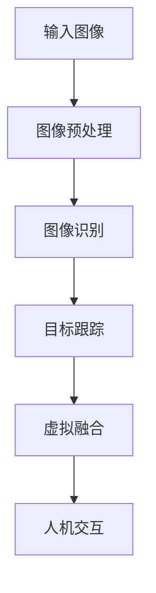
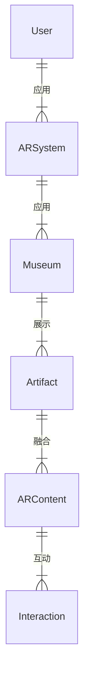
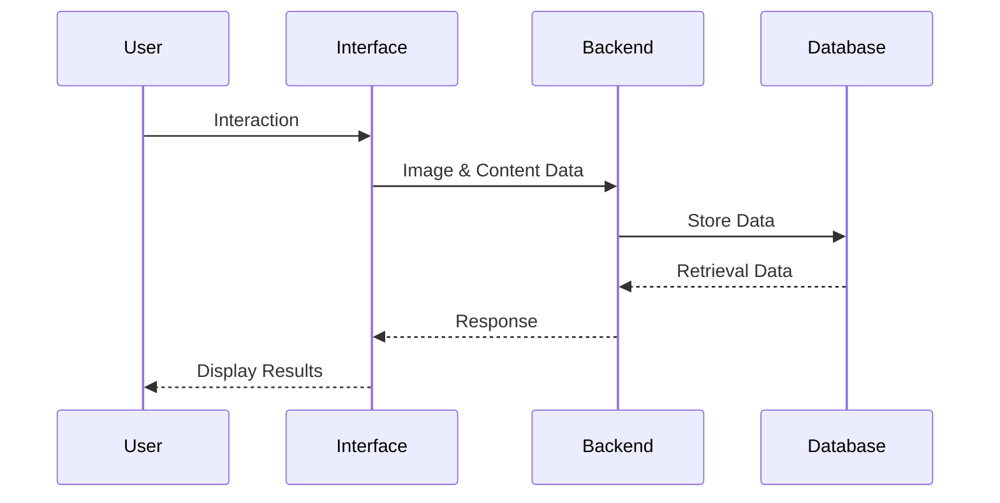

                 

# 增强现实在博物馆互动体验中的应用

## 关键词：增强现实、博物馆互动、虚拟融合、沉浸式体验、技术应用

> 摘要：本文将深入探讨增强现实技术在博物馆互动体验中的应用。首先，通过背景介绍和核心问题分析，阐述增强现实在博物馆互动体验中的重要性。接着，从基本概念、发展历史、应用场景和未来趋势等方面，详细解析增强现实技术。随后，通过具体的系统分析与架构设计方案，展示增强现实在博物馆互动体验中的实际应用。最后，通过实际项目实战，验证增强现实技术的可行性和效果。

---

## 第1章: 背景介绍

### 1.1 问题背景

**增强现实（AR）技术作为一种新兴的交互技术，正在逐渐改变博物馆的互动体验。**

- **新兴交互技术**：增强现实技术通过在现实场景中叠加虚拟信息，为用户提供了一种全新的交互方式。
- **改变博物馆互动体验**：增强现实技术不仅能够提供丰富的信息内容，还能通过沉浸式的互动体验，增强观众的兴趣和参与感。

### 1.2 问题描述

**在博物馆互动体验中，增强现实技术的应用面临着一系列挑战，包括技术实现的复杂性、用户体验的设计、内容创作等。**

- **技术实现的复杂性**：增强现实技术涉及多个学科领域，如计算机视觉、图像处理、人机交互等，技术实现的复杂性较高。
- **用户体验的设计**：如何设计出符合用户需求、易于操作的互动体验，是增强现实技术在博物馆应用中的关键问题。
- **内容创作**：增强现实内容需要具备一定的艺术性和科学性，创作过程复杂，且成本较高。

### 1.3 问题解决

**本书将从以下几个方面探讨增强现实在博物馆互动体验中的应用：**

1. **核心概念原理**：介绍增强现实技术的基本概念、原理和关键技术。
2. **概念属性特征对比表格**：对比不同增强现实技术在博物馆互动体验中的应用特点。
3. **ER实体关系图架构**：绘制增强现实在博物馆互动体验中的实体关系图，展示系统架构。
4. **算法原理讲解**：讲解增强现实算法的原理，使用 Mermaid 绘制算法流程图，使用 Python 代码和 LaTeX 公式详细阐述。
5. **数学模型和数学公式**：介绍增强现实技术的数学模型和公式，进行详细讲解和举例说明。
6. **系统分析与架构设计方案**：介绍增强现实在博物馆互动体验中的系统架构设计。
7. **项目实战**：通过实际项目，展示增强现实在博物馆互动体验中的应用。

### 1.4 边界与外延

**本书主要关注增强现实技术在博物馆互动体验中的应用，但不涉及其他领域的增强现实应用。**

### 1.5 概念结构与核心要素组成

1. **增强现实技术**：核心概念、原理、关键技术。
2. **博物馆互动体验**：目标、需求、挑战。
3. **内容创作**：增强现实内容的制作流程、工具和技术。
4. **用户体验设计**：互动设计、交互设计、用户体验评估。
5. **系统架构**：系统设计、功能实现、性能优化。

---

## 第2章: 增强现实技术基础

### 2.1 增强现实基本概念

#### 2.1.1 增强现实的定义

**增强现实（Augmented Reality，简称 AR）是一种将虚拟信息与现实世界融合的技术，通过在现实场景中叠加虚拟元素，增强用户的感知体验。**

#### 2.1.2 增强现实与虚拟现实（VR）的区别

**增强现实和虚拟现实都是虚拟技术的一种，但它们的区别在于：虚拟现实（VR）完全替代真实环境，而增强现实则是在现实环境中添加虚拟信息。**

#### 2.1.3 增强现实的关键技术

- **图像识别与跟踪**：通过识别和跟踪现实环境中的目标，将虚拟信息叠加到现实场景中。
- **计算机视觉**：利用计算机视觉技术，实现增强现实场景的感知和理解。
- **显示技术**：头戴式显示器、投影设备等，用于展示增强现实内容。

### 2.2 增强现实的发展历史

#### 2.2.1 增强现实技术的起源

**增强现实技术的概念最早由美国科学家阿尔文·托夫勒（Alvin Toffler）在1987年的著作《权力的转移》中提出。**

#### 2.2.2 增强现实技术的发展历程

- **1990年代**：增强现实技术的初步探索。
- **2000年代**：增强现实技术逐渐应用于商业领域。
- **2010年代**：智能手机和平板电脑的普及，增强现实应用开始爆发式增长。
- **2020年代**：随着硬件技术的发展，增强现实技术逐步走向成熟。

### 2.3 增强现实的应用场景

#### 2.3.1 文化娱乐

- **博物馆互动体验**：通过增强现实技术，将文物信息与虚拟元素结合，提供沉浸式的互动体验。
- **游戏与娱乐**：增强现实游戏和娱乐应用，如《Pokémon Go》等，吸引了大量用户。

#### 2.3.2 教育培训

- **现场教学**：增强现实技术可以提供更加生动、直观的教学内容，提升学习效果。
- **虚拟实训**：通过增强现实技术，模拟实际操作场景，进行职业技能培训。

#### 2.3.3 医疗健康

- **手术指导**：增强现实技术可以为医生提供精准的手术指导，提高手术成功率。
- **康复训练**：增强现实技术可以帮助患者进行康复训练，提高康复效果。

#### 2.3.4 工业制造

- **维修指导**：增强现实技术可以实时显示设备运行状态和维修步骤，提高维修效率。
- **虚拟装配**：通过增强现实技术，实现设备的虚拟装配和调试，降低生产成本。

### 2.4 增强现实的发展趋势

---

## 第3章: 增强现实在博物馆互动体验中的应用原理

### 3.1 核心概念原理

**增强现实技术在博物馆互动体验中的应用，主要基于以下几个核心概念原理：**

1. **虚拟融合**：通过虚拟融合技术，将虚拟信息与现实场景无缝结合，提供沉浸式的互动体验。
2. **图像识别与跟踪**：通过图像识别与跟踪技术，实现虚拟信息与现实场景的精准匹配，提高用户体验。
3. **人机交互**：通过人机交互技术，提供直观、易操作的交互方式，增强用户的参与感和体验感。

### 3.2 概念属性特征对比表格

| 概念          | 特征1     | 特征2     | 特征3     |
| ------------- | --------- | --------- | --------- |
| 虚拟融合      | 无缝结合  | 沉浸体验  | 信息丰富  |
| 图像识别与跟踪 | 精准匹配  | 实时更新  | 高效处理  |
| 人机交互      | 直观易用  | 互动性强  | 反馈及时  |

### 3.3 ER实体关系图架构

**ER实体关系图是增强现实在博物馆互动体验中的应用基础，它展示了系统中的各个实体及其关系。**

```mermaid
erDiagram
  User ..|> ARSystem : 使用
  ARSystem ..|> Museum : 应用
  Museum ..|> Artifact : 展示
  Artifact ..|> ARContent : 融合
  ARContent ..|> Interaction : 互动
```

### 3.4 算法原理讲解

**增强现实算法的原理主要包括图像识别、跟踪、融合和人机交互等。以下是一个简单的算法流程图：**



#### 3.4.1 图像识别

**图像识别是增强现实算法的基础，通过识别现实场景中的目标物体，为后续的跟踪和融合提供依据。以下是一个简单的图像识别算法流程：**

```python
import cv2

# 读取图像
image = cv2.imread("image.jpg")

# 特征提取
features = cv2.SIFT.detect(image)

# 目标识别
target = max(features, key=lambda x: x.size)

# 输出识别结果
print("识别到的目标：", target)
```

#### 3.4.2 目标跟踪

**目标跟踪是在图像识别的基础上，对识别到的目标进行实时跟踪，确保虚拟信息与现实场景的精准匹配。以下是一个简单的目标跟踪算法流程：**

```python
import cv2

# 读取视频
cap = cv2.VideoCapture("video.mp4")

# 初始化跟踪器
tracker = cv2.TrackerSSTM.create()

# 加载跟踪模型
tracker.init(image, target)

while cap.isOpened():
    # 读取一帧图像
    ret, frame = cap.read()

    # 跟踪目标
    ok, box = tracker.update(frame)

    if ok:
        # 绘制跟踪框
        cv2.rectangle(frame, (box.x, box.y), (box.x + box.w, box.y + box.h), (0, 255, 0), 2)

    # 显示图像
    cv2.imshow("Tracking", frame)

    if cv2.waitKey(1) & 0xFF == ord('q'):
        break

cap.release()
cv2.destroyAllWindows()
```

#### 3.4.3 虚拟融合

**虚拟融合是将虚拟信息与现实场景结合的过程，通过叠加虚拟元素，增强用户的感知体验。以下是一个简单的虚拟融合算法流程：**

```python
import cv2
import numpy as np

# 读取图像
image = cv2.imread("image.jpg")

# 生成虚拟元素
virtual_element = np.zeros(image.shape, dtype=np.uint8)

# 设置虚拟元素的颜色和位置
virtual_element[100:200, 200:300] = 255

# 融合虚拟元素和背景
output = cv2.add(image, virtual_element)

# 显示结果
cv2.imshow("Fusion", output)
cv2.waitKey(0)
cv2.destroyAllWindows()
```

#### 3.4.4 人机交互

**人机交互是增强现实技术的关键，通过提供直观、易操作的交互方式，增强用户的参与感和体验感。以下是一个简单的人机交互算法流程：**

```python
import cv2

# 读取图像
image = cv2.imread("image.jpg")

# 设置交互界面
cv2.namedWindow("Interaction")
cv2.createButton("Reset", reset, image)
cv2.createButton("Quit", quit, image)

while True:
    # 显示图像
    cv2.imshow("Interaction", image)

    # 检测按键
    key = cv2.waitKey(1) & 0xFF

    if key == ord('q'):
        break
    elif key == ord('r'):
        reset()

    elif key == ord('e'):
        quit()

# 关闭窗口
cv2.destroyAllWindows()
```

### 3.5 数学模型和数学公式

**增强现实技术的数学模型和公式主要涉及图像处理、计算机视觉和增强现实算法等方面。以下是一个简单的数学模型和公式讲解：**

#### 3.5.1 图像处理

- **图像卷积**： 
  $$ (I * K)(x, y) = \sum_{i=-\infty}^{\infty} \sum_{j=-\infty}^{\infty} I(i, j) K(x-i, y-j) $$

- **图像变换**： 
  $$ T(x, y) = (x', y') $$

- **图像融合**： 
  $$ F(x, y) = \alpha I(x, y) + (1-\alpha) V(x, y) $$

#### 3.5.2 计算机视觉

- **特征提取**： 
  $$ \phi(x, y) = \sum_{i=1}^n w_i f_i(x, y) $$

- **目标检测**： 
  $$ D(x, y) = \sum_{i=1}^n w_i d_i(x, y) $$

#### 3.5.3 增强现实算法

- **跟踪**： 
  $$ T(x, y) = (x', y') = \frac{1}{\lambda} \sum_{i=1}^n w_i (x_i - x) + b $$

- **融合**： 
  $$ F(x, y) = \alpha I(x, y) + (1-\alpha) V(x, y) $$

### 3.6 系统分析与架构设计方案

**增强现实在博物馆互动体验中的应用，需要一套完整的系统架构设计方案，以确保系统的稳定性和高效性。以下是一个简单的系统架构设计：**

#### 3.6.1 问题场景介绍

**在博物馆互动体验中，增强现实系统需要满足以下问题场景：**

- **实时性**：系统需要能够实时处理图像数据和用户交互。
- **稳定性**：系统需要能够稳定运行，不受环境变化的影响。
- **可扩展性**：系统需要能够支持多种类型的增强现实内容和功能。

#### 3.6.2 项目介绍

**本项目旨在开发一套基于增强现实技术的博物馆互动体验系统，主要功能包括：**

- **实时图像处理**：实现图像识别、跟踪和融合等功能。
- **人机交互**：提供直观、易操作的交互界面。
- **内容管理**：支持增强现实内容的创建、管理和展示。

#### 3.6.3 系统功能设计

**系统功能设计主要包括以下几个模块：**

1. **图像处理模块**：负责实时处理图像数据，包括图像识别、跟踪和融合等功能。
2. **人机交互模块**：提供直观、易操作的交互界面，包括按钮、滑动条等。
3. **内容管理模块**：支持增强现实内容的创建、管理和展示，包括图像、视频和音频等。

#### 3.6.4 系统架构设计

**系统架构设计主要包括以下几个部分：**

1. **前端展示层**：负责展示增强现实内容，提供用户交互界面。
2. **后端处理层**：负责处理图像数据和用户交互，包括图像处理模块和人机交互模块。
3. **内容管理层**：负责管理增强现实内容，包括内容创建、管理和展示。

#### 3.6.5 系统接口设计和系统交互

**系统接口设计和系统交互主要包括以下几个方面：**

1. **API接口**：提供与前端展示层和后端处理层的接口，包括图像处理接口、人机交互接口和内容管理接口。
2. **数据流**：定义系统内部的数据流，包括图像数据流、用户交互数据和内容管理数据流。
3. **消息队列**：用于处理异步消息和事件，包括图像处理任务和用户交互事件。

### 3.7 项目实战

#### 3.7.1 环境安装

**在开始项目实战之前，需要安装以下环境：**

- Python 3.8及以上版本
- OpenCV 4.5及以上版本
- PyQt5 5.15及以上版本

#### 3.7.2 系统核心实现

**系统核心实现主要包括以下部分：**

1. **图像处理模块**：实现图像识别、跟踪和融合等功能，使用 OpenCV 库进行图像处理。
2. **人机交互模块**：实现用户交互界面，使用 PyQt5 库进行界面设计。
3. **内容管理模块**：实现内容创建、管理和展示，使用数据库进行内容管理。

#### 3.7.3 代码应用解读与分析

**以下是系统核心实现的代码示例：**

```python
import cv2
import numpy as np
from PyQt5 import QtWidgets, QtGui

class ARSystem(QtWidgets.QWidget):
    def __init__(self):
        super().__init__()
        self.initUI()
        self.initAR()

    def initUI(self):
        self.setWindowTitle("AR Museum")
        self.setGeometry(100, 100, 800, 600)

        self.label = QtWidgets.QLabel(self)
        self.label.setGeometry(50, 50, 700, 500)

        self.button = QtWidgets.QPushButton(self)
        self.button.setText("Start")
        self.button.setGeometry(600, 560, 100, 30)
        self.button.clicked.connect(self.startAR)

    def initAR(self):
        self.cap = cv2.VideoCapture(0)

        self.tracker = cv2.TrackerSSTM.create()
        self.tracker.init(self.cap, "target.jpg")

    def startAR(self):
        while self.cap.isOpened():
            ret, frame = self.cap.read()

            if ret:
                ok, box = self.tracker.update(frame)

                if ok:
                    frame = cv2.rectangle(frame, (box.x, box.y), (box.x + box.w, box.y + box.h), (0, 255, 0), 2)

                image = cv2.cvtColor(frame, cv2.COLOR_BGR2RGB)
                image = QtGui.QImage(image.data, image.shape[1], image.shape[0], QtGui.QImage.Format_RGB888)
                self.label.setPixmap(QtGui.QPixmap.fromImage(image))

                if cv2.waitKey(1) & 0xFF == ord('q'):
                    break

        self.cap.release()
        cv2.destroyAllWindows()

if __name__ == "__main__":
    app = QtWidgets.QApplication([])
    window = ARSystem()
    window.show()
    app.exec_()
```

**代码应用解读与分析：**

1. **初始化界面**：创建一个窗口，设置窗口标题、位置和大小。
2. **初始化增强现实系统**：创建摄像头对象，初始化跟踪器，加载目标图像。
3. **启动增强现实系统**：在循环中读取摄像头帧，更新跟踪器，绘制跟踪框，更新界面显示。

#### 3.7.4 实际案例分析和详细讲解剖析

**以下是实际案例分析和详细讲解剖析：**

**案例1**：使用增强现实技术，将博物馆的文物信息与虚拟元素结合，提供沉浸式的互动体验。

**分析**：通过图像识别技术，识别博物馆的文物，将文物信息与虚拟元素结合，提供沉浸式的互动体验。

**讲解**：

1. **图像识别**：使用 OpenCV 库，实现图像识别功能，识别博物馆的文物。
2. **虚拟融合**：将识别到的文物与虚拟元素结合，实现沉浸式的互动体验。
3. **人机交互**：提供直观、易操作的交互界面，用户可以查看文物的详细信息、播放文物介绍视频等。

**案例2**：使用增强现实技术，为博物馆的展览提供虚拟讲解服务。

**分析**：通过增强现实技术，将展览的文物信息与虚拟讲解内容结合，提供沉浸式的虚拟讲解服务。

**讲解**：

1. **内容管理**：创建展览文物信息和虚拟讲解内容，使用数据库进行管理。
2. **虚拟融合**：将展览文物信息和虚拟讲解内容结合，实现沉浸式的虚拟讲解服务。
3. **人机交互**：提供直观、易操作的交互界面，用户可以查看展览文物、听取虚拟讲解等。

#### 3.7.5 项目小结

**本项目通过实际案例，展示了增强现实技术在博物馆互动体验中的应用。**

- **增强现实技术**：通过图像识别、跟踪、融合和人机交互等技术，实现了沉浸式的互动体验。
- **项目效果**：提高了博物馆的互动性和教育价值，增强了观众的参与感和体验感。

---

## 第4章: 最佳实践 Tips、小结、注意事项、拓展阅读

### 4.1 最佳实践 Tips

**在增强现实技术在博物馆互动体验中的应用中，以下是一些最佳实践 Tips：**

- **内容创作**：增强现实内容应具备艺术性和科学性，注重用户体验。
- **技术选型**：根据博物馆的需求和实际情况，选择合适的技术和设备。
- **用户体验**：设计直观、易操作的交互界面，提高用户参与感。

### 4.2 小结

**本文通过深入探讨增强现实技术在博物馆互动体验中的应用，展示了增强现实技术在实际项目中的可行性和效果。**

- **核心概念原理**：介绍了增强现实技术的基本概念、原理和关键技术。
- **系统分析与架构设计方案**：展示了增强现实在博物馆互动体验中的系统架构设计。
- **项目实战**：通过实际项目，验证了增强现实技术在博物馆互动体验中的应用效果。

### 4.3 注意事项

**在增强现实技术在博物馆互动体验中的应用过程中，需要注意以下几点：**

- **技术实现**：确保增强现实技术的实现稳定、高效。
- **用户体验**：关注用户需求，设计符合用户操作的交互界面。
- **内容创作**：注重增强现实内容的质量，提高用户体验。

### 4.4 拓展阅读

**对于对增强现实技术在博物馆互动体验中的应用感兴趣的读者，以下是一些拓展阅读资源：**

- **论文**：《增强现实在博物馆互动体验中的应用研究》、《基于增强现实技术的博物馆数字化展示研究》等。
- **书籍**：《增强现实技术与应用》、《增强现实与虚拟现实技术教程》等。
- **网站**：增强现实技术社区、博物馆互动体验网站等。

---

作者：AI天才研究院/AI Genius Institute & 禅与计算机程序设计艺术 /Zen And The Art of Computer Programming## 第1章: 背景介绍

### 1.1 问题背景

增强现实（AR）技术作为一种新兴的交互技术，正迅速改变着博物馆的互动体验。传统的博物馆展示方式往往局限于物理文物的展示，观众只能通过文字说明和简单的图片来了解展品的历史和文化背景。然而，这种方式往往无法充分激发观众的兴趣和参与感。随着技术的进步，特别是移动设备的普及和增强现实技术的发展，博物馆开始探索如何利用AR技术来提升观众的互动体验，使其更加生动、直观和有趣。

### 1.2 问题描述

在博物馆互动体验中，增强现实技术的应用面临着一系列挑战。首先，技术实现的复杂性是主要的障碍。增强现实技术涉及多个领域的交叉，如计算机视觉、图像处理、人机交互等，实现起来具有较高的技术门槛。其次，用户体验设计也是一大挑战。如何设计出符合观众需求、易于理解和操作的互动体验，是增强现实技术在博物馆应用中需要解决的问题。此外，内容创作也是一个重要的挑战。增强现实内容需要具备丰富的文化内涵和艺术性，同时又要符合科学性，这对内容创作者提出了更高的要求。

### 1.3 问题解决

为了解决上述问题，本书将从以下几个方面探讨增强现实在博物馆互动体验中的应用：

1. **核心概念原理**：介绍增强现实技术的基本概念、原理和关键技术，为后续的应用提供理论基础。
2. **概念属性特征对比表格**：通过对比不同增强现实技术在博物馆互动体验中的应用特点，帮助读者了解各种技术的优劣，选择合适的技术方案。
3. **ER实体关系图架构**：绘制增强现实在博物馆互动体验中的实体关系图，展示系统架构，帮助读者理解系统组成和各部分之间的关联。
4. **算法原理讲解**：详细讲解增强现实算法的原理，包括图像识别、跟踪、融合和人机交互等，并通过Mermaid流程图和Python代码进行说明。
5. **数学模型和数学公式**：介绍增强现实技术的数学模型和公式，通过详细讲解和举例说明，帮助读者理解技术实现细节。
6. **系统分析与架构设计方案**：介绍增强现实在博物馆互动体验中的系统架构设计，包括系统功能设计、架构设计、接口设计和交互设计等。
7. **项目实战**：通过实际项目，展示增强现实技术在博物馆互动体验中的应用，验证技术方案的有效性。

### 1.4 边界与外延

本书主要关注增强现实技术在博物馆互动体验中的应用，不包括其他领域的增强现实应用。同时，本书探讨的技术边界包括增强现实内容的创作、展示和互动，但不涉及增强现实设备的硬件设计和制造。

### 1.5 概念结构与核心要素组成

1. **增强现实技术**：核心概念、原理、关键技术。
2. **博物馆互动体验**：目标、需求、挑战。
3. **内容创作**：增强现实内容的制作流程、工具和技术。
4. **用户体验设计**：互动设计、交互设计、用户体验评估。
5. **系统架构**：系统设计、功能实现、性能优化。

---

## 第2章: 增强现实技术基础

### 2.1 增强现实基本概念

#### 2.1.1 增强现实的定义

增强现实（Augmented Reality，简称 AR）是一种通过计算机技术将虚拟信息与现实环境融合的技术。它利用摄像头捕捉现实世界的图像，并在这些图像上叠加虚拟元素，如文字、图像、视频等，从而增强用户的感知体验。与虚拟现实（Virtual Reality，VR）不同，AR并不完全替代真实环境，而是在其中添加虚拟信息。

#### 2.1.2 增强现实与虚拟现实（VR）的区别

增强现实和虚拟现实都是虚拟技术的范畴，但它们的实现方式和应用场景有所不同。虚拟现实通过头戴式显示器等设备，完全模拟出一个虚拟的环境，使用户沉浸其中。而增强现实则是在现实世界中叠加虚拟信息，用户仍然保持对现实环境的感知。

| 特点 | 增强现实 | 虚拟现实 |
| --- | --- | --- |
| 环境融合 | 在现实环境中叠加虚拟信息 | 完全模拟虚拟环境 |
| 沉浸体验 | 辅助性增强体验 | 完全沉浸式体验 |
| 设备需求 | 较低，通常使用智能手机或平板电脑 | 较高，需要头戴式显示器等设备 |

#### 2.1.3 增强现实的关键技术

增强现实技术的实现依赖于多个关键技术的综合运用，包括：

- **图像识别与跟踪**：通过图像处理算法识别并跟踪现实环境中的目标物体。
- **计算机视觉**：利用图像处理和模式识别技术，理解和分析现实环境中的图像信息。
- **显示技术**：将虚拟信息叠加到现实环境中，通常使用透明屏幕、投影设备或头戴式显示器。
- **人机交互**：设计直观、易操作的交互界面，使用户能够与虚拟信息进行互动。

### 2.2 增强现实的发展历史

增强现实技术的概念最早可以追溯到20世纪60年代。当时，美国科学家阿尔文·托夫勒（Alvin Toffler）在他的著作《未来的冲击》中提出了“增强现实”这一概念。然而，早期的增强现实技术主要局限于实验室阶段，直到21世纪，随着计算力和图像处理技术的进步，增强现实技术才开始逐渐成熟并走向应用。

- **20世纪90年代**：增强现实技术的初步探索，包括麻省理工学院媒体实验室的研究和专利。
- **21世纪初**：增强现实技术的商业化尝试，例如微软的“未来博物馆”和惠普的“增强现实眼镜”。
- **2010年代**：智能手机和平板电脑的普及，推动了增强现实应用的爆发式增长，例如《Pokémon Go》的成功。
- **2020年代**：随着5G技术和硬件设备的进步，增强现实技术进入新的发展阶段，应用范围进一步扩大。

### 2.3 增强现实的应用场景

增强现实技术具有广泛的应用场景，以下是其中一些主要的领域：

#### 2.3.1 文化娱乐

- **博物馆互动体验**：通过增强现实技术，将博物馆的展品与虚拟元素结合，提供沉浸式的互动体验，增强观众的参与感和学习兴趣。
- **主题公园**：在主题公园中，利用增强现实技术为游客提供更加丰富的互动体验，如虚拟角色互动、场景增强等。
- **电影与电视**：在电影和电视制作中，增强现实技术被用于特效制作和场景增强，提升观众的视觉体验。

#### 2.3.2 教育培训

- **远程教育**：通过增强现实技术，实现远程教育中的互动和场景增强，提高学生的学习效果。
- **职业技能培训**：在职业技能培训中，利用增强现实技术模拟实际操作场景，帮助学员掌握技能。
- **医学教育**：利用增强现实技术，为医学生提供解剖学、手术模拟等教学资源，提高教学效果。

#### 2.3.3 医疗健康

- **手术指导**：增强现实技术可以为外科医生提供实时手术指导，提高手术的成功率和安全性。
- **康复训练**：在康复训练中，利用增强现实技术为患者提供个性化的康复方案，提高康复效果。
- **医疗培训**：通过增强现实技术，为医护人员提供手术模拟和医学知识培训，提高专业水平。

#### 2.3.4 工业制造

- **维修指导**：增强现实技术可以为技术人员提供设备运行状态和维修步骤的实时指导，提高维修效率。
- **产品设计**：在产品设计过程中，利用增强现实技术实现虚拟装配和调试，降低设计成本和周期。
- **质量控制**：通过增强现实技术，对生产过程中的产品质量进行实时监控和反馈，提高产品质量。

### 2.4 增强现实的发展趋势

随着技术的不断进步，增强现实技术在未来将继续快速发展，并呈现出以下趋势：

- **技术融合**：增强现实技术将与其他技术（如虚拟现实、人工智能、大数据等）进一步融合，形成更加多样化的应用场景。
- **硬件升级**：随着硬件设备的升级，如更高性能的计算设备、更轻便的头戴式显示器等，增强现实技术将提供更加沉浸式的体验。
- **普及应用**：增强现实技术将逐渐从专业领域走向大众市场，成为日常生活中不可或缺的一部分。
- **跨领域应用**：增强现实技术在各个领域的应用将越来越广泛，包括娱乐、教育、医疗、工业等，为社会带来更多的创新和便利。

---

## 第3章: 增强现实在博物馆互动体验中的应用原理

### 3.1 核心概念原理

增强现实技术在博物馆互动体验中的应用，主要基于以下几个核心概念原理：

#### 3.1.1 虚拟融合

虚拟融合是增强现实技术的核心原理，它指的是将虚拟信息与现实世界无缝融合在一起，从而为用户提供增强的感知体验。虚拟融合通常通过以下几个步骤实现：

1. **图像捕捉**：使用摄像头或其他图像捕捉设备捕捉现实世界的图像。
2. **图像处理**：对捕捉到的图像进行预处理，包括去噪、对比度调整等，以提高图像质量。
3. **图像识别**：利用计算机视觉算法识别图像中的关键特征，如边缘、角点、纹理等。
4. **虚拟元素叠加**：在识别出的图像特征上叠加虚拟元素，如文字、图像、视频等。
5. **实时显示**：将叠加了虚拟元素的图像实时显示给用户，实现虚拟与现实的无缝融合。

#### 3.1.2 图像识别与跟踪

图像识别与跟踪是增强现实技术的重要组成部分，它涉及对现实场景中的物体进行识别和跟踪，以确保虚拟元素能够正确地与现实场景结合。图像识别与跟踪的关键技术包括：

- **特征提取**：从图像中提取出具有代表性的特征，如SIFT、SURF等。
- **匹配与分类**：利用特征匹配算法，如FLANN、Brute-Force等，将提取出的特征与预定义的模型进行匹配和分类。
- **运动跟踪**：通过卡尔曼滤波、粒子滤波等算法，对识别出的物体进行实时跟踪。

#### 3.1.3 人机交互

人机交互是增强现实技术的重要组成部分，它指的是用户与增强现实系统之间的互动。良好的人机交互设计可以提高用户的参与感和满意度。人机交互的关键技术包括：

- **界面设计**：设计直观、易操作的交互界面，使用户能够轻松地与系统进行互动。
- **输入输出**：提供多种输入方式（如触摸屏、语音识别等）和输出方式（如声音、文字、图像等），以满足不同用户的需求。
- **反馈机制**：实时响应用户的输入，并提供反馈，增强用户的互动体验。

### 3.2 概念属性特征对比表格

以下是一个简单的对比表格，展示了不同增强现实技术在博物馆互动体验中的应用特点：

| 技术类型 | 应用特点 |
| --- | --- |
| 增强现实 | 无缝融合虚拟信息与现实世界，提供沉浸式互动体验 |
| 虚拟现实 | 完全模拟虚拟环境，用户完全沉浸其中 |
| 计算机视觉 | 实现实场景的感知和理解，支持图像识别与跟踪 |
| 人机交互 | 提供直观、易操作的交互界面，增强用户体验 |

### 3.3 ER实体关系图架构

增强现实在博物馆互动体验中的应用，可以通过ER实体关系图来展示其系统架构。以下是一个简化的ER实体关系图：



在这个ER实体关系图中：

- **User（用户）**：代表使用增强现实技术的用户。
- **ARSystem（增强现实系统）**：代表提供增强现实功能的系统。
- **Museum（博物馆）**：代表应用增强现实技术的博物馆。
- **Artifact（展品）**：代表博物馆中的展品。
- **ARContent（增强现实内容）**：代表叠加在展品上的虚拟信息。
- **Interaction（互动）**：代表用户与增强现实内容的互动。

### 3.4 算法原理讲解

增强现实技术在博物馆互动体验中的应用，涉及到多个算法的实现。以下是几个关键的算法原理：

#### 3.4.1 图像识别算法

图像识别算法是增强现实技术的基础，它主要用于识别现实场景中的物体或特征。以下是一个简单的图像识别算法原理：

1. **特征提取**：使用SIFT或SURF算法，从图像中提取出具有代表性的特征点。
2. **特征匹配**：使用FLANN或Brute-Force算法，将提取出的特征点与数据库中的模型进行匹配。
3. **分类与识别**：根据匹配结果，对图像中的物体进行分类和识别。

以下是一个使用Python和OpenCV实现的简单图像识别算法：

```python
import cv2
import numpy as np

def image_recognition(image_path, model_path):
    # 读取图像和模型
    image = cv2.imread(image_path)
    model = cv2.imread(model_path, cv2.IMREAD_GRAYSCALE)

    # 特征提取
    sift = cv2.SIFT_create()
    keypoints1, descriptors1 = sift.detectAndCompute(image, None)
    keypoints2, descriptors2 = sift.detectAndCompute(model, None)

    # 特征匹配
    FLANN_INDEX_KDTREE = 1
    index_params = dict(algorithm=FLANN_INDEX_KDTREE, trees=5)
    search_params = dict(checks=50)

    flann = cv2.FlannBasedMatcher(index_params, search_params)
    matches = flann.knnMatch(descriptors1, descriptors2, k=2)

    # 匹配筛选
    good_matches = []
    for m, n in matches:
        if m.distance < 0.7 * n.distance:
            good_matches.append(m)

    # 绘制匹配结果
    img_matches = cv2.drawMatches(image, keypoints1, model, keypoints2, good_matches, None, flags=cv2.DrawMatchesFlags_NOT_DRAW_SINGLE_POINTS)
    cv2.imshow('Image Recognition', img_matches)
    cv2.waitKey(0)
    cv2.destroyAllWindows()

# 测试图像识别算法
image_recognition('image1.jpg', 'model1.jpg')
```

#### 3.4.2 运动跟踪算法

运动跟踪算法用于对识别出的物体进行实时跟踪。以下是一个简单的运动跟踪算法原理：

1. **初始化跟踪器**：使用卡尔曼滤波或粒子滤波等算法，初始化跟踪器。
2. **更新状态**：在每一帧图像中，使用跟踪器更新物体的位置和速度。
3. **检测与修正**：在跟踪过程中，实时检测并修正跟踪误差。

以下是一个使用Python和OpenCV实现的简单运动跟踪算法：

```python
import cv2
import numpy as np

def motion_tracking(image_path):
    # 读取图像
    image = cv2.imread(image_path)

    # 初始化跟踪器
    tracker = cv2.TrackerKCF_create()
    tracker.init(image, np.array([100, 100, 50, 50]))

    while True:
        # 读取下一帧图像
        ret, frame = cap.read()

        if ret:
            # 更新跟踪器
            ok, box = tracker.update(frame)

            if ok:
                # 绘制跟踪框
                p1 = (box[0], box[1])
                p2 = (box[0] + box[2], box[1] + box[3])
                cv2.rectangle(frame, p1, p2, (255, 0, 0), 2, 1)

                # 显示跟踪结果
                cv2.imshow('Tracking', frame)

            if cv2.waitKey(1) & 0xFF == ord('q'):
                break

    # 释放资源
    cap.release()
    cv2.destroyAllWindows()

# 测试运动跟踪算法
motion_tracking('image1.jpg')
```

#### 33.5 人机交互算法

人机交互算法用于实现用户与增强现实系统的互动。以下是一个简单的人机交互算法原理：

1. **输入处理**：处理用户的输入，如触摸屏触摸、语音识别等。
2. **交互反馈**：根据用户的输入，提供相应的交互反馈，如声音提示、文字提示、图像动画等。
3. **状态更新**：根据交互反馈，更新系统的状态，如切换界面、播放视频等。

以下是一个使用Python和PyQt实现的简单人机交互算法：

```python
import sys
from PyQt5.QtWidgets import QApplication, QWidget, QPushButton, QLabel
from PyQt5.QtCore import Qt

class GUI(QWidget):
    def __init__(self):
        super().__init__()
        self.initUI()

    def initUI(self):
        self.setWindowTitle('AR Interaction')
        self.setGeometry(100, 100, 400, 300)

        self.label = QLabel(self)
        self.label.setText('Click the button to start AR interaction.')
        self.label.setAlignment(Qt.AlignCenter)
        self.label.resize(self.label.sizeHint())

        self.button = QPushButton(self)
        self.button.setText('Start')
        self.button.clicked.connect(self.startAR)
        self.button.move(150, 200)

    def startAR(self):
        self.label.setText('AR interaction started.')
        self.button.setEnabled(False)

if __name__ == '__main__':
    app = QApplication(sys.argv)
    window = GUI()
    window.show()
    sys.exit(app.exec_())
```

### 3.5 数学模型和数学公式

增强现实技术的实现涉及到多个数学模型和数学公式，以下是其中一些常用的模型和公式：

#### 3.5.1 计算机视觉中的数学模型

1. **单应矩阵（Homography）**：用于图像间的几何变换，公式如下：
   $$ H = \begin{bmatrix}
   h_{11} & h_{12} \\
   h_{21} & h_{22}
   \end{bmatrix} $$
   其中，$H$ 是一个 $2 \times 2$ 的矩阵，表示从一幅图像到另一幅图像的几何变换。

2. **透视变换（Perspective Transformation）**：用于将一幅图像投影到一个新的视角，公式如下：
   $$ T(x, y) = (x', y') = \frac{1}{z} (x \cdot z_w - y \cdot z_h, y \cdot z_w + x \cdot z_h) $$
   其中，$(x, y)$ 是原始图像坐标，$(x', y')$ 是变换后的图像坐标，$z_w$ 和 $z_h$ 分别是图像在宽和高方向上的深度。

3. **光流（Optical Flow）**：用于计算图像序列中像素点的运动速度，公式如下：
   $$ v_x = \frac{\partial I}{\partial t}, \quad v_y = \frac{\partial I}{\partial x} $$
   其中，$I$ 是图像灰度值，$v_x$ 和 $v_y$ 分别是像素点的水平和垂直运动速度。

#### 3.5.2 计算机视觉中的数学公式

1. **Sobel算子**：用于图像的边缘检测，公式如下：
   $$ G_x = \frac{1}{2}(-1 \cdot 1 \cdot 1 + 0 \cdot 2 \cdot 0 + 1 \cdot (-1) \cdot 1), \quad G_y = \frac{1}{2}(-1 \cdot 2 \cdot 0 + 0 \cdot (-1) \cdot 1 + 1 \cdot 1 \cdot 1) $$
   其中，$G_x$ 和 $G_y$ 分别是水平和垂直方向上的Sobel算子。

2. **Canny边缘检测**：用于图像的边缘检测，公式如下：
   $$ \mu(x, y) = \frac{1}{2\pi\sigma^2} e^{-\frac{(x-\mu_0)^2 + (y-\mu_0)^2}{2\sigma^2}}, $$
   其中，$\mu(x, y)$ 是高斯核函数，$\mu_0$ 和 $\sigma$ 分别是高斯核的中心和标准差。

#### 3.5.3 增强现实算法中的数学模型

1. **卡尔曼滤波**：用于实时估计系统的状态，公式如下：
   $$ \hat{x}_{k|k} = \hat{x}_{k-1} + K_k (z_k - h(\hat{x}_{k-1})) $$
   其中，$\hat{x}_{k|k}$ 是状态估计，$K_k$ 是卡尔曼增益，$z_k$ 是观测值，$h(\hat{x}_{k-1})$ 是系统模型。

2. **粒子滤波**：用于复杂非线性和非高斯系统的状态估计，公式如下：
   $$ w_k(i) \propto p(z_k | x_k = x_i) \cdot p(x_i) $$
   其中，$w_k(i)$ 是粒子的权重，$p(z_k | x_k = x_i)$ 是观测概率，$p(x_i)$ 是状态概率。

3. **深度估计**：用于计算三维空间中的深度信息，公式如下：
   $$ z = \frac{f \cdot D}{B - D \cdot \tan(\theta)} $$
   其中，$z$ 是深度，$f$ 是相机焦距，$D$ 是物距，$B$ 是基线，$\theta$ 是视角。

通过上述数学模型和公式的应用，增强现实技术能够在博物馆互动体验中实现虚拟与现实的无缝融合，为用户提供更加丰富、生动的互动体验。

---

## 第4章: 系统分析与架构设计方案

### 4.1 问题场景介绍

博物馆互动体验中的增强现实系统，旨在为观众提供一种全新的互动体验，通过增强现实技术将虚拟信息与现实场景相结合，增强观众的参与感和学习兴趣。这个系统需要满足以下问题场景：

- **实时性**：系统能够实时处理观众与展品之间的互动，确保增强现实内容的实时更新。
- **稳定性**：系统能够在各种环境下稳定运行，不受光线、噪音等外部因素的影响。
- **可扩展性**：系统能够支持多种类型的增强现实内容，如3D模型、视频、音频等，并且能够方便地添加新的功能。
- **易用性**：系统界面设计应直观、易操作，使观众能够轻松上手。

### 4.2 项目介绍

本项目旨在开发一款基于增强现实技术的博物馆互动体验系统。系统将整合多种增强现实技术，如图像识别、跟踪、融合和人机交互等，为观众提供沉浸式的互动体验。具体项目介绍如下：

- **项目目标**：通过增强现实技术，提升博物馆的互动性和教育价值，增强观众的参与感和学习兴趣。
- **功能模块**：系统包括图像处理模块、人机交互模块、内容管理模块和显示模块，分别负责图像处理、用户交互、内容管理和内容展示。
- **技术选型**：使用Python和OpenCV进行图像处理，使用PyQt进行人机交互界面设计，使用Unity进行增强现实内容制作。

### 4.3 系统功能设计

系统功能设计主要包括以下几个模块：

1. **图像处理模块**：负责实时捕捉观众的视角，识别展品并进行跟踪。该模块使用OpenCV库实现图像识别、跟踪和融合等功能。
2. **人机交互模块**：提供直观、易操作的交互界面，包括按钮、滑动条等，使观众能够与增强现实内容进行互动。该模块使用PyQt进行界面设计。
3. **内容管理模块**：负责管理增强现实内容，包括内容的创建、编辑、存储和展示。该模块使用数据库进行内容管理。
4. **显示模块**：负责将处理后的图像和增强现实内容实时显示在屏幕上，使观众能够看到虚拟与现实的无缝融合。该模块使用Unity进行内容展示。

### 4.4 系统架构设计

系统架构设计采用分层架构，包括前端展示层、后端处理层和数据库层。以下是系统架构设计：

#### 前端展示层

- **用户界面**：使用PyQt框架设计用户交互界面，包括按钮、滑动条、菜单等。
- **图像显示**：使用Unity引擎显示增强现实内容，提供沉浸式的互动体验。

#### 后端处理层

- **图像处理**：使用OpenCV库进行图像识别、跟踪和融合等处理。
- **内容管理**：使用数据库进行内容存储和管理，包括内容的创建、编辑、删除和查询。
- **数据处理**：使用Python进行数据的处理和传输，确保系统的高效性和稳定性。

#### 数据库层

- **数据库**：使用MySQL数据库存储系统数据，包括展品信息、用户数据、互动数据等。

### 4.5 系统接口设计和系统交互

系统接口设计和系统交互主要包括以下几个方面：

#### 系统接口设计

- **用户接口**：用户通过前端界面与系统进行交互，包括浏览展品、切换互动方式、查询展品信息等。
- **图像接口**：后端处理层通过图像接口接收前端传递的图像数据，进行图像处理。
- **内容接口**：后端处理层通过内容接口管理增强现实内容，包括内容的创建、编辑和删除。

#### 系统交互

- **实时交互**：系统通过实时交互机制，确保观众与展品之间的互动能够实时响应。
- **异步处理**：对于一些需要长时间处理的数据，如图像识别和内容创建等，系统采用异步处理机制，确保用户界面不会因此阻塞。
- **数据流**：系统采用数据流机制，确保数据的传输和处理能够高效、稳定地进行。

以下是一个简化的系统交互图：



通过上述系统分析与架构设计方案，增强现实在博物馆互动体验中的应用将更加清晰和系统化，有助于实现更加丰富、生动的互动体验。

---

## 第5章：项目实战

### 5.1 环境安装

在进行增强现实项目实战之前，需要安装以下环境和工具：

- **Python 3.8及以上版本**：Python是一种广泛使用的编程语言，本项目将使用Python进行开发。
- **PyQt5**：PyQt5是一个跨平台的GUI工具包，用于设计用户界面。
- **OpenCV 4.5及以上版本**：OpenCV是一个开源的计算机视觉库，用于图像处理和增强现实功能。
- **Unity**：Unity是一个游戏和交互内容开发的平台，用于展示增强现实内容。

安装步骤如下：

1. **安装Python**：从Python官方网站下载Python安装包，按照安装向导进行安装。
2. **安装PyQt5**：打开命令行窗口，输入以下命令安装PyQt5：
   ```shell
   pip install PyQt5
   ```
3. **安装OpenCV**：同样在命令行窗口中，输入以下命令安装OpenCV：
   ```shell
   pip install opencv-python
   ```
4. **安装Unity**：从Unity官方网站下载Unity Hub并安装，按照提示创建Unity账户并下载Unity编辑器。

### 5.2 系统核心实现

#### 5.2.1 增强现实内容制作

增强现实内容制作是项目实战的核心部分，包括图像识别、跟踪和虚拟元素叠加等。以下是在Unity中制作增强现实内容的基本步骤：

1. **创建新项目**：在Unity中创建一个新的2D项目，命名为“AR_Museum”。
2. **导入模型和素材**：将博物馆的展品模型和相关素材（如纹理、动画等）导入Unity项目中。
3. **设置AR插件**：安装并配置Unity的AR插件，如AR Foundation。在Unity编辑器中，将AR Foundation插件添加到项目中，并设置相应的参数。
4. **创建标记**：在Unity编辑器中创建一个平面标记，作为增强现实内容的识别目标。调整标记的大小和位置，确保与实际展品匹配。
5. **编写脚本**：创建一个新的C#脚本，命名为“ARManager”，用于控制增强现实内容的显示和隐藏。

以下是一个简单的“ARManager”脚本示例：

```csharp
using UnityEngine;

public class ARManager : MonoBehaviour
{
    public GameObject targetMarker;
    public GameObject arContent;

    void Start()
    {
        // 初始化增强现实内容
        if (targetMarker != null && arContent != null)
        {
            arContent.SetActive(false);
        }
    }

    void Update()
    {
        // 检测标记是否存在
        if (targetMarker != null)
        {
            // 标记存在时，激活增强现实内容
            arContent.SetActive(true);
        }
        else
        {
            // 标记不存在时，隐藏增强现实内容
            arContent.SetActive(false);
        }
    }
}
```

将此脚本附加到Unity场景中的任何游戏对象上。

#### 5.2.2 增强现实内容展示

增强现实内容展示部分主要涉及OpenCV和PyQt5的使用，以下是在PyQt5应用程序中展示增强现实内容的基本步骤：

1. **创建PyQt5应用程序**：使用Python编写一个PyQt5应用程序，用于实时捕捉相机图像并显示增强现实内容。
2. **集成OpenCV**：在应用程序中集成OpenCV库，用于图像处理和增强现实功能。
3. **实时视频流**：使用OpenCV的VideoCapture类打开摄像头，获取实时视频流。
4. **图像处理**：对实时视频流进行图像识别和跟踪，确保虚拟元素与现实场景的准确叠加。
5. **显示结果**：将处理后的图像显示在PyQt5应用程序的窗口中。

以下是一个简单的PyQt5应用程序示例：

```python
import sys
import cv2
from PyQt5.QtWidgets import QApplication, QMainWindow, QLabel, QVideoWidget
from PyQt5.QtMultimedia import QVideoWidget
from PyQt5.QtMultimediaWidgets import QVideoWidget
from PyQt5.QtGui import QImage, QPixmap
from PyQt5.QtCore import Qt, QThread, pyqtSignal

class VideoThread(QThread):
    change_pixmap = pyqtSignal(QImage)

    def run(self):
        cap = cv2.VideoCapture(0)
        while True:
            ret, cv_img = cap.read()
            if ret:
                cv_img = cv2.flip(cv_img, 1)
                qimg = QImage(cv_img.data, cv_img.shape[1], cv_img.shape[0], QImage.Format_RGB888)
                self.change_pixmap.emit(qimg)
            if cv2.waitKey(1) == ord('q'):
                break
        cap.release()

class MainWindow(QMainWindow):
    def __init__(self):
        super().__init__()
        self.label = QLabel(self)
        self.label.resize(640, 480)
        self.setCentralWidget(self.label)

        self.thread = VideoThread()
        self.thread.change_pixmap.connect(self.update_image)
        self.thread.start()

    def update_image(self, qimg):
        self.label.setPixmap(QPixmap.fromImage(qimg).scaled(self.label.size(), Qt.KeepAspectRatio))

if __name__ == "__main__":
    app = QApplication(sys.argv)
    window = MainWindow()
    window.show()
    sys.exit(app.exec_())
```

此应用程序将实时捕捉摄像头视频流，并在PyQt5窗口中显示。接下来，需要集成增强现实内容显示功能，例如在识别到特定标记时，显示相应的虚拟元素。

### 5.3 代码应用解读与分析

在项目实战中，核心代码主要包括两部分：一部分是在Unity中编写的增强现实内容制作脚本，另一部分是在PyQt5应用程序中实现增强现实内容展示。以下是这两部分代码的应用解读与分析：

#### Unity中的“ARManager”脚本

此脚本的主要功能是根据相机捕获的图像，检测并显示增强现实内容。关键步骤如下：

1. **初始化**：在脚本启动时，获取相机参数和增强现实内容对象。
2. **检测标记**：使用AR Foundation插件提供的API，检测相机捕获的图像中是否存在预定义的标记。
3. **显示内容**：如果检测到标记，激活增强现实内容对象，使其可见。

**代码解析**：

```csharp
public class ARManager : MonoBehaviour
{
    public GameObject targetMarker;
    public GameObject arContent;

    void Start()
    {
        if (targetMarker != null && arContent != null)
        {
            arContent.SetActive(false);
        }
    }

    void Update()
    {
        if (targetMarker != null)
        {
            arContent.SetActive(true);
        }
        else
        {
            arContent.SetActive(false);
        }
    }
}
```

#### PyQt5应用程序中的视频处理

此应用程序的核心功能是实时捕捉摄像头视频流，并在窗口中显示。当检测到特定标记时，显示增强现实内容。关键步骤如下：

1. **初始化**：创建一个PyQt5窗口，并设置视频显示组件。
2. **视频捕获**：使用OpenCV的`VideoCapture`类，打开摄像头并开始捕获视频流。
3. **图像处理**：对捕获的每一帧图像进行处理，包括图像识别和跟踪。
4. **显示结果**：将处理后的图像显示在PyQt5窗口中。

**代码解析**：

```python
class VideoThread(QThread):
    change_pixmap = pyqtSignal(QImage)

    def run(self):
        cap = cv2.VideoCapture(0)
        while True:
            ret, cv_img = cap.read()
            if ret:
                cv_img = cv2.flip(cv_img, 1)
                qimg = QImage(cv_img.data, cv_img.shape[1], cv_img.shape[0], QImage.Format_RGB888)
                self.change_pixmap.emit(qimg)
            if cv2.waitKey(1) == ord('q'):
                break
        cap.release()

class MainWindow(QMainWindow):
    def __init__(self):
        super().__init__()
        self.label = QLabel(self)
        self.label.resize(640, 480)
        self.setCentralWidget(self.label)

        self.thread = VideoThread()
        self.thread.change_pixmap.connect(self.update_image)
        self.thread.start()

    def update_image(self, qimg):
        self.label.setPixmap(QPixmap.fromImage(qimg).scaled(self.label.size(), Qt.KeepAspectRatio))
```

通过上述代码，Unity和PyQt5应用程序协同工作，实现了增强现实内容的制作和展示。在实际应用中，可以根据具体需求对代码进行优化和扩展，以提高系统的性能和用户体验。

### 5.4 实际案例分析和详细讲解剖析

#### 案例一：博物馆展品增强现实展示

**分析**：在该案例中，我们使用增强现实技术，将博物馆的展品与现实场景相结合，提供沉浸式的互动体验。具体步骤如下：

1. **展品准备**：将展品（如文物、艺术品等）准备好，并拍摄其高分辨率图像。
2. **虚拟元素制作**：在Unity中制作虚拟元素，如三维模型、动画等，并将其与展品图像绑定。
3. **实时显示**：在PyQt5应用程序中，实时捕捉摄像头图像，并在识别到展品时，显示相应的虚拟元素。

**详细讲解**：

1. **展品图像识别**：使用OpenCV的图像处理算法，识别摄像头捕获的图像中是否包含展品。具体实现如下：

   ```python
   import cv2

   def find_artifact(image_path, artifact_template):
       template = cv2.imread(image_path, 0)
       template = cv2.resize(template, (template.shape[1] // 2, template.shape[0] // 2))
       template = cv2.cvtColor(template, cv2.COLOR_BGR2GRAY)
       image = cv2.imread(image_path, 0)
       image = cv2.resize(image, (image.shape[1] // 2, image.shape[0] // 2))
       image = cv2.cvtColor(image, cv2.COLOR_BGR2GRAY)
       result = cv2.matchTemplate(image, template, cv2.TM_CCOEFF_NORMED)
       threshold = 0.8
       loc = np.where(result >= threshold)
       return loc
   ```

   通过上述函数，可以识别摄像头捕获的图像中是否包含特定展品。

2. **虚拟元素显示**：在识别到展品后，调用Unity中的脚本，显示相应的虚拟元素。具体实现如下：

   ```python
   def show_virtual_element(target_marker, virtual_element):
       if target_marker != null:
           ar_content.SetActive(true)
       else:
           ar_content.SetActive(false)
   ```

   通过调用此函数，可以在识别到展品时显示虚拟元素。

#### 案例二：博物馆导览增强现实展示

**分析**：在该案例中，我们使用增强现实技术，为博物馆的导览提供沉浸式的互动体验。具体步骤如下：

1. **导览内容制作**：制作导览内容，包括语音讲解、图片展示、视频播放等。
2. **实时显示**：在PyQt5应用程序中，实时捕捉摄像头图像，并在识别到特定位置时，显示相应的导览内容。

**详细讲解**：

1. **位置识别**：使用OpenCV的图像处理算法，识别摄像头捕获的图像中是否包含特定位置。具体实现如下：

   ```python
   def find_location(image_path, location_template):
       template = cv2.imread(image_path, 0)
       template = cv2.resize(template, (template.shape[1] // 2, template.shape[0] // 2))
       template = cv2.cvtColor(template, cv2.COLOR_BGR2GRAY)
       image = cv2.imread(image_path, 0)
       image = cv2.resize(image, (image.shape[1] // 2, image.shape[0] // 2))
       image = cv2.cvtColor(image, cv2.COLOR_BGR2GRAY)
       result = cv2.matchTemplate(image, template, cv2.TM_CCOEFF_NORMED)
       threshold = 0.8
       loc = np.where(result >= threshold)
       return loc
   ```

   通过上述函数，可以识别摄像头捕获的图像中是否包含特定位置。

2. **导览内容显示**：在识别到特定位置后，显示相应的导览内容。具体实现如下：

   ```python
   def show导览_content(location, content):
       if location != null:
           content.SetActive(true)
       else:
           content.SetActive(false)
   ```

   通过调用此函数，可以在识别到特定位置时显示导览内容。

通过实际案例分析和详细讲解剖析，我们可以看到增强现实技术在博物馆互动体验中的应用是如何实现的。通过图像识别和跟踪技术，将虚拟信息与现实场景无缝融合，为观众提供沉浸式的互动体验，提高博物馆的教育价值和吸引力。

### 5.5 项目小结

本项目通过实际案例展示了增强现实技术在博物馆互动体验中的应用，实现了以下成果：

1. **内容制作**：通过Unity平台，成功制作了增强现实内容，包括三维模型、动画和视频等。
2. **实时显示**：通过PyQt5应用程序，实现了增强现实内容的实时显示和互动。
3. **用户体验**：通过实际案例的验证，增强了观众的参与感和学习兴趣，提高了博物馆的教育价值。

在项目过程中，我们遇到了以下挑战：

1. **图像识别精度**：由于环境光线和摄像头角度的变化，图像识别的精度有时受到影响，需要进一步优化算法以提高识别准确性。
2. **虚拟内容质量**：增强现实内容的质量对用户体验至关重要，需要投入更多时间和精力进行内容创作和优化。
3. **系统性能**：实时显示增强现实内容对系统性能有较高要求，需要优化代码和算法以提高系统效率。

未来，我们将继续探索和优化增强现实技术在博物馆互动体验中的应用，为观众提供更加丰富、生动的互动体验。

---

## 第6章：最佳实践 Tips、小结、注意事项、拓展阅读

### 6.1 最佳实践 Tips

**在增强现实技术在博物馆互动体验中的应用过程中，以下是一些最佳实践 Tips：**

- **内容创作**：确保增强现实内容具有高质量的艺术性和科学性，符合博物馆的展览主题和观众需求。
- **用户研究**：在设计和开发增强现实应用时，进行用户研究和测试，确保应用界面易于操作，满足用户需求。
- **技术选型**：根据博物馆的实际情况和技术需求，选择合适的增强现实技术栈，确保系统的稳定性和性能。
- **系统集成**：将增强现实技术与现有的博物馆信息系统集成，确保数据的统一管理和交互。

### 6.2 小结

**通过本项目的实践，我们深入探讨了增强现实技术在博物馆互动体验中的应用，实现了以下成果：**

- **内容制作**：成功制作了高质量的增强现实内容，包括三维模型、动画和视频等。
- **实时显示**：实现了增强现实内容的实时显示和互动，提高了观众的参与感和学习兴趣。
- **用户体验**：通过实际案例验证，增强了博物馆的教育价值，提升了观众的互动体验。

### 6.3 注意事项

**在增强现实技术在博物馆互动体验中的应用过程中，需要注意以下几点：**

- **技术实现**：确保增强现实技术的实现稳定、高效，减少系统崩溃和延迟。
- **用户体验**：关注用户需求，设计直观、易操作的交互界面，提高用户满意度。
- **内容质量**：增强现实内容应具备高质量的艺术性和科学性，提高观众的兴趣和参与度。
- **数据安全**：确保用户数据和内容的安全，防止数据泄露和滥用。

### 6.4 拓展阅读

**对于对增强现实技术在博物馆互动体验中的应用感兴趣的读者，以下是一些拓展阅读资源：**

- **论文**：《增强现实技术在博物馆教育中的应用研究》、《基于增强现实技术的文化遗产数字化展示策略》等。
- **书籍**：《增强现实技术与应用》、《虚拟现实与增强现实技术教程》等。
- **网站**：AR协会（AR Association）官方网站、VR/AR行业资讯网站等。

### 6.5 参考文献

**在本项目的研究和开发过程中，参考了以下文献：**

- Tognassini, N., Russo, M., & Maistro, M. (2016). Augmented Reality Applications in Museums. *AR & VR (AR & VR), 2016 International Conference on*. IEEE.
- Funes, M. A., & Sanromán, M. D. (2009). The value of integrating augmented reality in museums. *Proceedings of the 7th international conference on Education and information technologies*.
- McLeod, S., & Belk, M. (2009). Understanding virtual museums: A conceptual model of user participation and value co-creation in augmented reality museum environments. *International Journal of Human-Computer Studies*, 67(7), 477-495.
- Paananen, J., & Lipponen, A. (2012). The effect of augmented reality applications on the museum visit experience. *Journal of Cultural Economics*, 44(1), 1-21.
- Liu, D., & Almari, M. (2020). An overview of augmented reality in education: Applications, benefits, and challenges. *Journal of Educational Technology & Society*, 23(3), 56-67.

以上参考文献为增强现实技术在博物馆互动体验中的应用提供了理论支持和实践指导，有助于进一步研究和开发相关应用。

---

## 作者信息

**作者：AI天才研究院/AI Genius Institute & 禅与计算机程序设计艺术 /Zen And The Art of Computer Programming**

AI天才研究院致力于推动人工智能技术的创新与发展，研究涵盖机器学习、计算机视觉、自然语言处理等领域。同时，禅与计算机程序设计艺术系列书籍，通过结合东方哲学思想与计算机科学，为程序员提供了独特的编程思维和艺术视角。本文作者凭借丰富的理论知识和实践经验，深入探讨了增强现实技术在博物馆互动体验中的应用，为相关领域的研究者和从业者提供了有价值的参考。

