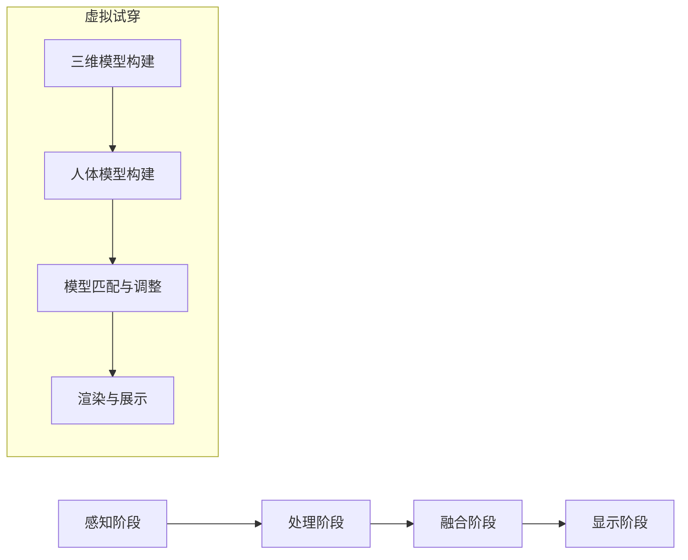
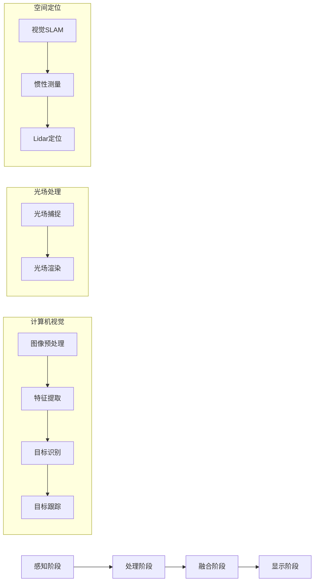
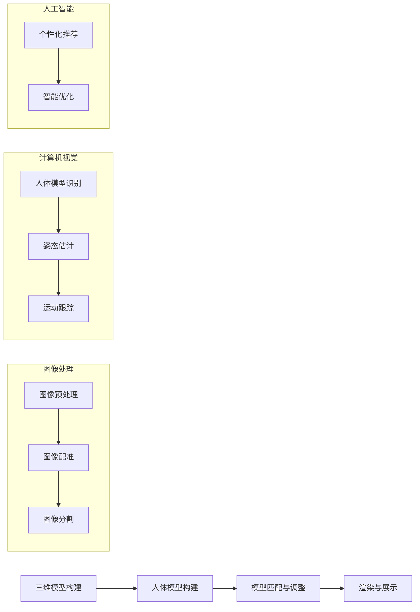

                 

## 摘要

本文将深入探讨增强现实（AR）在在线购物虚拟试穿中的应用。随着科技的不断发展，增强现实技术逐渐融入我们的日常生活，为各行各业带来了巨大的变革。在在线购物领域，虚拟试穿作为一种创新的购物体验方式，通过增强现实技术的辅助，实现了消费者在虚拟环境中对商品进行试穿，从而提升购物满意度和转化率。本文首先介绍了增强现实和虚拟试穿的基本概念、发展历程和核心特点，随后详细解析了增强现实和虚拟试穿的技术原理，包括关键技术和实现方式。接着，本文通过具体的应用场景和案例，展示了AR在在线购物虚拟试穿中的实际应用效果。随后，文章分析了AR在在线购物虚拟试穿中的系统架构设计，包括前端用户界面设计、后端数据处理和算法实现。最后，本文通过一个实际项目案例，详细介绍了项目环境安装、系统核心实现和代码应用解读与分析，并对AR在在线购物虚拟试穿中的最佳实践进行了总结，提出了注意事项和拓展阅读建议。通过本文的探讨，读者将全面了解AR在在线购物虚拟试穿中的技术原理、应用实践和未来发展，为该领域的深入研究和技术应用提供参考。

## 第一部分: 背景介绍

### 第1章: 增强现实与虚拟试穿概述

#### 1.1 增强现实概念

增强现实（Augmented Reality，简称AR）是一种通过计算机技术和传感器设备，将虚拟信息与现实世界进行叠加，从而增强用户现实感知体验的技术。它不仅保留了现实世界的视觉、听觉等感官信息，还通过虚拟信息的注入，丰富了用户的感知体验。

**定义**：增强现实是一种将虚拟信息叠加到真实场景中的技术，它利用计算机视觉、传感器技术和显示技术，将虚拟物体或信息与现实环境实时融合，为用户提供一个互动的、沉浸式的体验。

**发展历程**：增强现实技术起源于20世纪60年代的虚拟现实（Virtual Reality，VR）研究，经过几十年的发展，逐渐演变出多种应用形式。1990年，日本索尼公司推出了世界上第一款增强现实设备——虚拟现实眼镜，标志着增强现实技术开始进入消费市场。2009年，苹果公司发布了第一个AR应用“SketchAR”，开启了AR应用在智能手机上的普及。近年来，随着计算机性能的提升和移动设备的普及，增强现实技术得到了迅猛发展。

**核心特点与应用场景**：增强现实的核心特点是虚实融合，能够为用户提供沉浸式、互动式的体验。其主要应用场景包括游戏、教育、医疗、零售、旅游等多个领域。在零售行业，增强现实技术被广泛应用于虚拟试穿、虚拟导购等场景，为消费者提供更加便捷和个性化的购物体验。

#### 1.2 虚拟试穿的概念与价值

虚拟试穿是一种通过计算机图形学、图像处理和人工智能等技术，实现消费者在虚拟环境中试穿服装或其他商品的技术。它通过虚拟场景的构建和商品的虚拟呈现，让消费者在家中就能体验到实穿效果，从而减少实际购买中的试穿成本和时间。

**定义**：虚拟试穿是指利用计算机技术和虚拟现实技术，在虚拟环境中模拟试穿过程，通过图像处理和算法匹配，实现消费者对商品外观和穿着效果的真实感受。

**技术原理**：虚拟试穿的技术原理主要包括以下几个方面：

1. **三维模型构建**：通过三维扫描或计算机建模技术，获取商品的详细三维数据。
2. **图像处理**：利用图像处理算法，将虚拟模型与用户真实身体部位进行匹配，调整尺寸和形状，使其更符合用户实际情况。
3. **视觉效果呈现**：通过渲染技术，将试穿效果以逼真的形式展示在用户面前，包括光照、材质、阴影等。

**在在线购物中的价值**：虚拟试穿为在线购物提供了极大的便利和价值，主要表现在以下几个方面：

1. **提升购物体验**：消费者可以在虚拟环境中自由试穿多种商品，无需实体试穿，节省了时间和精力。
2. **减少退货率**：通过虚拟试穿，消费者能够更准确地判断商品是否符合预期，从而减少因不合适导致的退货率。
3. **提高转化率**：虚拟试穿能够增加消费者对商品的购买欲望，提高购物转化率。
4. **降低运营成本**：虚拟试穿减少了实体试穿所需的店面和人力资源，有助于降低运营成本。

#### 1.3 增强现实与虚拟试穿的关系

增强现实与虚拟试穿之间有着紧密的联系和互补关系。

**增强现实支持虚拟试穿**：增强现实技术通过将虚拟信息叠加到现实环境中，为虚拟试穿提供了更加沉浸式的体验。消费者可以在真实环境中，通过增强现实设备（如智能手机、平板电脑、眼镜等）实时看到自己试穿的效果，从而更好地做出购买决策。

**虚拟试穿利用增强现实技术**：虚拟试穿技术通过增强现实技术，实现了虚拟商品与真实环境的实时互动和融合。消费者可以通过增强现实设备，在家中或任何地点进行虚拟试穿，无需前往实体店铺。

总的来说，增强现实技术为虚拟试穿提供了强大的技术支持，使得虚拟试穿更加真实、便捷和个性化。同时，虚拟试穿也促进了增强现实技术的应用和普及，为消费者带来了全新的购物体验。

### 1.4 总结

本章介绍了增强现实和虚拟试穿的基本概念、发展历程和核心特点，并探讨了它们在在线购物中的应用。增强现实技术通过将虚拟信息叠加到现实环境中，为用户提供沉浸式体验，而虚拟试穿技术则通过计算机图形学、图像处理和人工智能等技术，实现消费者在虚拟环境中的试穿。两者相互支持、相互促进，为在线购物带来了巨大的变革和创新。

### 第2章: 核心概念与联系

#### 2.1 增强现实与虚拟试穿的技术原理

**增强现实技术原理**：

增强现实技术的基本原理是将计算机生成的虚拟信息叠加到真实环境中，以增强用户的感知体验。具体来说，它包括以下几个关键步骤：

1. **感知阶段**：通过摄像头或传感器设备捕捉真实环境的图像或视频。
2. **处理阶段**：对捕捉到的图像或视频进行图像处理和计算机视觉分析，提取关键信息（如位置、方向、形状等）。
3. **融合阶段**：将虚拟信息（如三维模型、文字、图像等）与真实环境进行实时融合，生成增强现实画面。
4. **显示阶段**：通过显示设备（如智能手机屏幕、眼镜、头戴设备等）将增强现实画面呈现给用户。

**增强现实技术的实现方式**：

增强现实技术的实现方式主要包括以下几种：

1. **标记识别**：通过识别图像中的特定标记或符号，实现虚拟信息的叠加。例如，使用二维码或特殊图案作为标记。
2. **自然场景识别**：利用计算机视觉算法，直接从真实场景中提取信息，实现虚拟信息的叠加。例如，人脸识别、手势识别等。
3. **位置追踪**：通过GPS、陀螺仪、加速度计等传感器设备，获取用户的位置和姿态信息，实现虚拟信息的定位和追踪。

**增强现实技术的核心特点与应用场景**：

增强现实技术的核心特点是虚实融合，能够为用户提供沉浸式、互动式的体验。其主要应用场景包括：

1. **游戏娱乐**：通过增强现实技术，实现虚拟角色的互动和场景的实时变化，为用户带来全新的游戏体验。
2. **教育培训**：利用增强现实技术，实现虚拟场景和教学内容的实时融合，提高教学效果和学生的学习兴趣。
3. **医疗健康**：通过增强现实技术，帮助医生进行手术模拟和诊断，提高医疗质量和效率。
4. **零售购物**：利用增强现实技术，实现虚拟试穿、虚拟导购等应用，为消费者提供更加便捷和个性化的购物体验。

**虚拟试穿技术原理**：

虚拟试穿技术是基于计算机图形学、图像处理和人工智能等技术，实现消费者在虚拟环境中对商品进行试穿的技术。其技术原理主要包括以下几个步骤：

1. **三维模型构建**：通过三维扫描或计算机建模技术，获取商品的详细三维数据。
2. **人体模型构建**：利用人体建模技术，构建与用户实际身材相符的三维人体模型。
3. **模型匹配与调整**：利用图像处理和计算机视觉技术，将商品模型与人体模型进行匹配和调整，使其适应用户的身材。
4. **渲染与展示**：通过渲染技术，将试穿效果以逼真的形式展示在用户面前，包括光照、材质、阴影等。

**虚拟试穿技术的实现方式**：

虚拟试穿技术的实现方式主要包括以下几种：

1. **三维模型匹配**：通过三维模型匹配技术，将商品模型与人体模型进行匹配，实现试穿效果。
2. **图像处理技术**：利用图像处理技术，对试穿效果进行优化和调整，使其更加逼真。
3. **人工智能技术**：利用人工智能技术，如深度学习、神经网络等，对试穿效果进行智能优化和预测。

**增强现实与虚拟试穿的技术原理比较**：

增强现实技术和虚拟试穿技术在技术原理和应用目标上有一些不同：

1. **技术实现**：增强现实技术侧重于将虚拟信息与现实环境进行实时融合，而虚拟试穿技术则侧重于在虚拟环境中模拟试穿过程。
2. **应用目标**：增强现实技术旨在为用户提供沉浸式、互动式的体验，而虚拟试穿技术则旨在提升消费者的购物体验，帮助其做出更准确的购买决策。
3. **适用场景**：增强现实技术适用于多种场景，如游戏、教育、医疗、零售等，而虚拟试穿技术主要应用于零售购物领域。

**Mermaid流程图**：

为了更好地理解增强现实和虚拟试穿的技术原理，我们使用Mermaid语言绘制了以下流程图：



**增强现实与虚拟试穿的概念属性特征对比表格**：

为了更直观地展示增强现实和虚拟试穿的概念属性特征，我们制作了以下对比表格：

| 特征 | 增强现实 | 虚拟试穿 |
| ---- | -------- | -------- |
| 目标 | 虚拟信息与现实环境的实时融合 | 消费者在虚拟环境中对商品的试穿 |
| 技术实现 | 图像处理、计算机视觉、传感器技术 | 计算机图形学、图像处理、人工智能 |
| 应用场景 | 游戏娱乐、教育培训、医疗健康、零售购物 | 零售购物 |
| 核心特点 | 虚实融合、沉浸式体验 | 准确的试穿效果、个性化的购物体验 |
| 技术难点 | 实时处理和显示技术、跨平台兼容性 | 三维模型匹配、图像处理精度、用户体验优化 |

**增强现实与虚拟试穿的ER实体关系图架构**：

为了更好地理解增强现实和虚拟试穿的系统架构，我们使用Mermaid绘制了以下ER实体关系图：

```mermaid
erDiagram
    AR设备 ||--|{ 用户 }|-->> 传感器数据
    用户 ||--|{ 虚拟试穿 }|-->> 试穿结果
    虚拟试穿 ||--|{ 商品模型 }|-->> 三维模型
    虚拟试穿 ||--|{ 用户模型 }|-->> 人体模型
```

通过以上对比和图示，我们可以更清晰地理解增强现实和虚拟试穿的技术原理和关系，为后续章节的深入讨论打下基础。

### 2.2 增强现实与虚拟试穿的概念属性特征对比表格

为了更好地理解增强现实（AR）与虚拟试穿之间的区别和联系，我们可以通过一个详细的属性特征对比表格来进行分析。以下是两者在关键方面的对比：

| 特征                 | 增强现实（AR）                                 | 虚拟试穿                                      |
|---------------------|----------------------------------------------|----------------------------------------------|
| **定义**            | 虚拟信息与现实环境的叠加                       | 虚拟环境中的试穿体验                          |
| **核心技术**        | - 计算机视觉<br>- 图像处理<br>- 传感器融合       | - 计算机图形学<br>- 图像处理<br>- 人工智能      |
| **实现方式**        | - 标记识别<br>- 自然场景识别<br>- 位置追踪        | - 三维模型匹配<br>- 图像处理<br>- 人工智能      |
| **应用场景**        | - 游戏娱乐<br>- 教育培训<br>- 医疗健康<br>- 零售购物 | - 零售购物<br>- 美容化妆<br>- 家居装饰        |
| **用户体验**        | - 虚拟与现实互动<br>- 沉浸式体验               | - 准确试穿效果<br>- 个性化购物体验             |
| **技术难点**        | - 实时数据处理与显示<br>- 跨平台兼容性           | - 三维模型的精确匹配<br>- 图像处理精度<br>- 用户体验优化 |
| **优势**            | - 增强感知体验<br>- 提供新的互动方式             | - 减少退货率<br>- 提高购买决策准确性             |
| **挑战**            | - 图像识别准确性<br>- 系统响应速度               | - 用户模型构建精度<br>- 个性化需求的满足           |

通过上述对比表格，我们可以清晰地看到增强现实和虚拟试穿在技术实现、应用场景、用户体验、技术难点以及优势和挑战方面的区别。这些对比有助于我们更好地理解两者之间的联系和相互补充作用，为后续章节的深入探讨提供基础。

### 2.3 增强现实与虚拟试穿的ER实体关系图架构

为了更直观地展示增强现实（AR）和虚拟试穿系统中各个实体之间的关系，我们可以通过实体关系图（Entity-Relationship Diagram，ER图）来进行描述。以下是一个简化的ER图，它描述了AR和虚拟试穿系统中主要实体及其相互关系：

```mermaid
erDiagram
    User ||--|{ ARDevice }| ARDevice --> SensorData
    User ||--|{ VirtualFitting }| VirtualFitting --> FittingResult
    VirtualFitting ||--|{ ProductModel }| ProductModel --> 3DModel
    VirtualFitting ||--|{ UserModel }| UserModel --> HumanModel
```

在这个ER图中，主要实体包括用户（User）、增强现实设备（ARDevice）、传感器数据（SensorData）、虚拟试穿（VirtualFitting）、试穿结果（FittingResult）、产品模型（ProductModel）、三维模型（3DModel）和用户模型（UserModel）。

1. **用户（User）**：系统的核心参与者，负责使用AR设备和进行虚拟试穿。
2. **增强现实设备（ARDevice）**：用于捕捉用户和环境数据的硬件设备，如智能手机、平板电脑或头戴显示器。
3. **传感器数据（SensorData）**：包括由AR设备采集到的环境信息，如图像、声音、位置等。
4. **虚拟试穿（VirtualFitting）**：系统提供的主要服务，用于模拟用户的试穿过程。
5. **试穿结果（FittingResult）**：试穿完成后生成的结果，用于展示试穿效果和提供反馈。
6. **产品模型（ProductModel）**：虚拟试穿中涉及的产品三维模型，用于生成试穿效果。
7. **三维模型（3DModel）**：对产品模型进行细节处理和优化的三维模型。
8. **用户模型（UserModel）**：用于模拟用户身体形态的模型，用于与产品模型进行匹配和试穿。

**实体关系解释**：

- **用户与增强现实设备**：用户通过AR设备与系统进行交互，设备捕捉到的传感器数据被发送到系统进行处理。
- **用户与虚拟试穿**：用户发起虚拟试穿请求，系统根据用户模型和产品模型生成试穿结果。
- **虚拟试穿与传感器数据和试穿结果**：传感器数据用于调整试穿过程的实时反馈，试穿结果展示用户的试穿效果。
- **虚拟试穿与产品模型**：产品模型被加载到虚拟试穿系统中，用于生成试穿效果。
- **虚拟试穿与用户模型**：用户模型用于与产品模型进行匹配，确保试穿效果符合用户的实际情况。

通过ER图，我们可以清晰地看到系统中各个实体及其相互作用的方式，这有助于理解系统架构的设计和实现。

### 第3章: 增强现实技术原理

#### 3.1 增强现实技术的工作原理

增强现实技术的工作原理主要涉及几个关键步骤：感知阶段、处理阶段、融合阶段和显示阶段。这些阶段共同协作，实现了虚拟信息与现实环境的实时叠加和互动。

**感知阶段**：这一阶段主要通过增强现实设备（如智能手机、平板电脑、头戴显示器等）上的摄像头和传感器来捕捉真实环境的图像和视频数据。这些设备能够获取包括位置、方向、光线强度等多种信息，为后续的处理阶段提供基础数据。

**处理阶段**：在处理阶段，系统会对捕获到的图像和视频进行预处理，包括降噪、去模糊、颜色校正等。接着，利用计算机视觉算法进行图像识别和特征提取，识别出环境中的关键元素，如物体、人脸、纹理等。

**融合阶段**：融合阶段是增强现实技术的核心。系统将预处理后的图像与计算机生成的虚拟信息进行叠加。这些虚拟信息可以是文本、图标、三维模型等。通过空间定位技术，确保虚拟信息与真实环境的相对位置和姿态一致。常用的空间定位技术包括视觉SLAM（同步定位与地图构建）、惯性测量单元（IMU）和激光雷达（Lidar）。

**显示阶段**：最后，融合后的图像通过增强现实设备显示给用户。显示效果的好坏直接影响用户的体验。因此，增强现实设备通常采用高刷新率和高分辨率屏幕，以确保显示效果的流畅和清晰。

**增强现实技术的主要组成部分**：

1. **计算机视觉**：负责图像和视频数据的处理，包括特征提取、目标识别、图像分割等。它是增强现实技术实现图像识别和物体追踪的基础。
2. **图像处理**：通过滤波、增强、变换等技术，对捕获到的图像进行预处理，提高图像质量，为后续处理提供更好的数据基础。
3. **传感器融合**：通过整合多种传感器数据（如摄像头、GPS、IMU、激光雷达等），实现高精度的空间定位和姿态追踪，提高增强现实体验的准确性。
4. **显示技术**：包括高刷新率、高分辨率屏幕以及各种增强现实显示设备（如头戴显示器、投影仪等），它们直接影响用户的感知体验。

#### 3.2 关键技术与实现方式

**视觉处理技术**：

视觉处理技术是增强现实技术的核心之一，它包括图像预处理、特征提取、目标识别和跟踪等多个方面。

1. **图像预处理**：图像预处理是增强现实图像处理的第一个步骤，其目的是提高图像质量，减少噪声和失真。常用的预处理技术包括滤波、对比度增强、色彩校正等。
2. **特征提取**：特征提取是指从图像中提取出具有代表性的特征点或特征向量，如角点、边缘、纹理等。这些特征点有助于后续的目标识别和跟踪。
3. **目标识别**：目标识别是利用已提取的特征点或特征向量，通过机器学习算法或深度学习模型，识别出图像中的特定目标或对象。
4. **目标跟踪**：目标跟踪是指系统在连续的图像帧中，对已识别的目标进行跟踪和定位，确保目标的运动轨迹和相对位置不变。

**光场处理技术**：

光场处理技术是增强现实中的一个重要方向，它通过捕捉和描述光场的空间信息和频率信息，实现对真实环境的精细建模。

1. **光场捕捉**：光场捕捉是指利用多摄像头或光场相机，捕捉真实环境中的光场信息，包括光强度、角度、颜色等。
2. **光场渲染**：光场渲染是利用光场信息，生成高质量的虚拟图像或视频，模拟真实环境中的光线效果。它通过计算光线传播路径和交互，实现逼真的视觉效果。

**空间定位与追踪技术**：

空间定位与追踪技术是实现增强现实沉浸式体验的关键，它包括视觉SLAM、惯性测量单元（IMU）和激光雷达（Lidar）等技术。

1. **视觉SLAM**：视觉SLAM（Simultaneous Localization and Mapping）是一种通过视觉信息同时进行定位和地图构建的技术。它利用摄像头捕捉到的图像帧，通过特征点匹配和优化算法，实现对环境的实时定位和地图构建。
2. **惯性测量单元（IMU）**：惯性测量单元是一种集成了加速度计、陀螺仪和磁力计的传感器，用于测量设备的加速度、角速度和磁场。它通过实时采集设备运动数据，辅助视觉SLAM技术，提高空间定位精度。
3. **激光雷达（Lidar）**：激光雷达是一种通过发射激光束并测量反射时间，来获取环境三维信息的技术。它能够提供高精度的空间定位和障碍物检测，特别适用于复杂环境中的增强现实应用。

**技术原理的Mermaid流程图**：

为了更好地理解增强现实技术的工作原理，我们可以使用Mermaid绘制以下流程图：



通过以上流程图，我们可以清晰地看到增强现实技术从感知、处理、融合到显示的全过程，以及各关键技术环节之间的关联。

### 第4章: 虚拟试穿技术原理

#### 4.1 虚拟试穿技术的工作原理

虚拟试穿技术的工作原理主要依托于计算机图形学、图像处理和人工智能技术，通过一系列精确的步骤，将虚拟服装与现实人体进行匹配和呈现，从而为用户提供逼真的试穿体验。

**步骤1：三维模型构建**

三维模型构建是虚拟试穿的基础。首先，需要利用三维扫描设备或计算机辅助设计（CAD）工具，获取商品的详细三维数据。对于服装，通常通过三维扫描仪获取人体模型和服装的三维数据，然后使用CAD工具对服装进行建模和优化。

**步骤2：人体模型构建**

构建与用户实际身材相符的人体模型是关键。这可以通过手动调整标准人体模型，或利用机器学习算法，根据用户的身体数据（如身高、体重、胸围等），自动生成个性化的人体模型。人体模型不仅要准确反映用户的体型，还需要考虑到肌肉、骨骼和皮肤的细节。

**步骤3：模型匹配与调整**

在获取了商品三维模型和人体模型后，需要进行模型匹配与调整。这一步骤主要通过图像处理和计算机视觉技术实现。具体来说，利用图像处理算法，将服装模型与人体模型进行对齐，调整服装的尺寸、形状和位置，使其贴合用户的实际身体。这一过程中，需要考虑服装的弹性、紧密度和人体不同部位的形态差异。

**步骤4：渲染与展示**

最后，通过渲染技术，将调整后的试穿效果以逼真的形式展示在用户面前。渲染过程包括光照、材质、阴影等多个方面的处理，以确保试穿效果的真实性和视觉效果。此外，为了提升用户体验，通常还会采用高分辨率和高帧率的显示设备，如头戴显示器（HMD）或大屏幕投影。

#### 4.2 关键技术与实现方式

**图像处理技术**：

图像处理技术在虚拟试穿中扮演了重要角色，主要包括图像预处理、图像配准、图像分割等。

1. **图像预处理**：图像预处理是图像处理的第一个步骤，其目的是提高图像质量，减少噪声和失真。常用的预处理技术包括滤波、对比度增强、色彩校正等。
2. **图像配准**：图像配准是指将不同来源的图像（如人体模型和服装模型）进行对齐和融合。通过图像配准，可以确保服装和人体模型在空间上的一致性，从而提高试穿效果的真实性。
3. **图像分割**：图像分割是指将图像分成不同的区域或对象。在虚拟试穿中，通过图像分割，可以将服装与人体的不同部位进行分离，从而更准确地调整服装的尺寸和位置。

**计算机视觉技术**：

计算机视觉技术在虚拟试穿中主要用于人体模型识别、姿态估计和运动跟踪。

1. **人体模型识别**：通过计算机视觉算法，可以从图像或视频中识别出人体模型。这一步骤通常涉及深度学习模型，如卷积神经网络（CNN）和生成对抗网络（GAN）。
2. **姿态估计**：姿态估计是指通过计算机视觉技术，估计人体的姿态和动作。这一步骤对于动态试穿尤为重要，可以实时调整服装的形态和位置，以匹配人体的动态变化。
3. **运动跟踪**：运动跟踪是指对人体的运动轨迹进行实时跟踪。通过运动跟踪，可以捕捉人体在试穿过程中的动态变化，从而提高试穿效果的连贯性和真实性。

**人工智能技术**：

人工智能技术在虚拟试穿中主要用于个性化推荐和智能优化。

1. **个性化推荐**：通过分析用户的身体数据和购物行为，利用机器学习算法，为用户推荐最合适的服装款式和尺寸。
2. **智能优化**：利用深度学习算法，对试穿效果进行实时优化。例如，通过卷积神经网络（CNN）和生成对抗网络（GAN），可以自动调整服装的纹理、颜色和光照效果，提高试穿的真实感和视觉效果。

**技术原理的Mermaid流程图**：

为了更好地理解虚拟试穿技术的工作原理，我们可以使用Mermaid绘制以下流程图：



通过上述流程图，我们可以清晰地看到虚拟试穿技术从模型构建到展示的全过程，以及各关键技术环节之间的关联。

### 第5章: 增强现实在在线购物虚拟试穿中的应用

#### 5.1 应用场景

增强现实技术在在线购物虚拟试穿中的应用场景非常广泛，涵盖了多个行业，如服装、化妆品、家具等。以下是一些主要的应用场景：

**服装行业**：消费者可以通过增强现实技术，在家中实时试穿各种服装，包括服装的款式、颜色和尺寸。这种技术极大地提高了购物体验，消费者无需前往实体店铺即可获取真实的试穿效果，从而减少试穿时间和成本。

**化妆品行业**：增强现实技术可以帮助消费者在虚拟环境中试用各种化妆品，如口红、眼影、粉底等。通过虚拟试妆，消费者可以预览不同化妆品在自己脸上的效果，帮助其做出更准确的购买决策。

**家具行业**：在家具购物中，增强现实技术可以让消费者在虚拟环境中摆放和试看家具，从而更好地评估家具与房间风格的匹配度。消费者可以通过增强现实技术，在家中实时看到家具的尺寸、颜色和风格，从而做出更满意的购买决策。

#### 5.2 案例分析

**案例一：某电商平台的增强现实虚拟试穿案例**

某大型电商平台推出了增强现实虚拟试穿功能，通过使用智能手机摄像头和AR技术，实现了消费者在虚拟环境中的试穿体验。以下是该案例的详细分析：

1. **技术实现**：该平台采用了基于智能手机的AR技术，消费者只需通过平台的移动应用，扫描手机屏幕上的特定标记，即可进入虚拟试穿界面。平台利用计算机视觉算法，实时捕捉消费者的面部和身体图像，并根据这些图像生成虚拟试穿效果。

2. **用户体验**：用户可以在虚拟试穿界面中，自由选择不同的服装款式、颜色和尺寸。试穿效果通过实时渲染技术展示，包括光照、阴影、材质等细节。用户还可以通过滑动屏幕，查看不同角度的试穿效果。

3. **效果评价**：用户反馈显示，该平台的增强现实虚拟试穿功能大大提升了购物体验。用户表示，通过虚拟试穿，他们可以更准确地了解服装的款式和尺码，从而减少因不合适而导致的退货率。

**案例二：某时尚品牌的虚拟试穿应用案例**

某知名时尚品牌推出了基于增强现实技术的虚拟试穿应用，通过智能手机和平板电脑等设备，为用户提供逼真的试穿体验。以下是该案例的详细分析：

1. **技术实现**：该品牌采用了先进的AR技术，用户通过品牌的官方应用，扫描服装标签上的二维码，即可进入虚拟试穿界面。应用利用计算机视觉和深度学习算法，实时捕捉用户的身体和面部图像，并进行智能匹配和渲染。

2. **用户体验**：用户可以在虚拟试穿界面中，选择不同的服装款式、颜色和尺寸。试穿效果通过高清渲染技术展示，用户还可以通过虚拟镜子，从多个角度查看试穿效果。此外，应用还提供了社交分享功能，用户可以将试穿效果分享到社交媒体，与朋友互动。

3. **效果评价**：用户反馈显示，该品牌的增强现实虚拟试穿应用极大地提升了购物体验。用户表示，通过虚拟试穿，他们可以更好地了解服装的款式和效果，从而做出更满意的购买决策。此外，虚拟试穿功能也为品牌带来了更多的用户互动和品牌曝光。

**案例三：某家具品牌的虚拟试穿应用案例**

某知名家具品牌推出了基于增强现实技术的虚拟试穿应用，通过平板电脑和头戴显示器等设备，为用户提供真实的家具摆放和试看体验。以下是该案例的详细分析：

1. **技术实现**：该品牌采用了AR技术和3D建模技术，用户通过品牌的官方应用，扫描家具产品页面上的二维码，即可进入虚拟试穿界面。应用利用计算机视觉和3D渲染技术，实时捕捉用户的房间环境和家具产品，并进行智能匹配和渲染。

2. **用户体验**：用户可以在虚拟试穿界面中，选择不同的家具款式、颜色和尺寸。试穿效果通过3D渲染技术展示，用户可以自由移动和旋转家具，查看不同角度的摆放效果。此外，应用还提供了家居装修建议和设计服务，为用户提供个性化的家居设计方案。

3. **效果评价**：用户反馈显示，该品牌的增强现实虚拟试穿应用极大地提升了购物体验。用户表示，通过虚拟试穿，他们可以更直观地了解家具的款式、颜色和尺寸，从而更好地匹配家居风格。此外，虚拟试穿功能也为品牌带来了更多的用户互动和品牌曝光。

#### 5.3 应用效果与评价

**应用效果**：

增强现实技术在在线购物虚拟试穿中的应用效果显著。首先，虚拟试穿功能极大地提升了购物体验，用户可以在虚拟环境中自由试穿多种商品，无需实体试穿，节省了时间和精力。其次，虚拟试穿技术有助于减少退货率，用户通过虚拟试穿，可以更准确地判断商品是否符合预期，从而减少了因不合适导致的退货率。此外，虚拟试穿功能还提高了购物转化率，用户在虚拟试穿过程中，更容易产生购买欲望，从而提高购买决策。

**效果评价**：

用户对增强现实虚拟试穿技术的评价普遍较高。用户表示，通过虚拟试穿，他们可以更直观地了解商品的款式、颜色和尺寸，从而做出更满意的购买决策。此外，虚拟试穿功能还为用户带来了更多的购物乐趣和互动体验。商家也反馈，虚拟试穿功能有助于提高品牌曝光度和用户粘性，从而促进销售增长。

**改进方向**：

尽管增强现实虚拟试穿技术已经取得了显著的应用效果，但仍然存在一些改进空间。首先，在技术方面，需要进一步提高图像处理和渲染技术的精度和速度，以提供更逼真的试穿效果。其次，在用户体验方面，需要优化虚拟试穿界面的交互设计和用户流程，使其更加直观和便捷。此外，为了更好地满足个性化需求，可以进一步结合人工智能技术，实现更智能的试穿推荐和效果优化。

### 第6章: AR在在线购物虚拟试穿中的系统架构设计

#### 6.1 系统功能设计

在线购物虚拟试穿系统需要实现多个核心功能，以满足用户的不同需求。以下是一些主要的功能模块及其描述：

**用户注册与登录**：用户需要通过注册和登录系统，才能使用虚拟试穿功能。该模块包括用户信息管理、账号安全性和权限控制等功能。

**商品数据库管理**：该模块用于存储和管理各种商品的信息，包括商品名称、分类、价格、库存等。通过商品数据库，用户可以方便地浏览和搜索商品。

**虚拟试穿功能**：这是系统的核心功能模块，用户通过选择商品，进入虚拟试穿界面。系统利用增强现实技术，将虚拟服装实时叠加在用户身上，并展示试穿效果。

**试穿效果展示**：该模块负责将虚拟试穿的效果以图像或视频的形式展示给用户。用户可以自由切换不同的试穿角度和视角，查看服装的细节和整体效果。

**用户反馈与评价**：用户可以在试穿完成后，对商品和虚拟试穿功能进行评价和反馈。这些反馈将用于系统优化和改进。

**推荐系统**：通过分析用户的购物行为和试穿记录，推荐系统可以为用户推荐最适合其风格和需求的商品。

**支付与订单管理**：用户在虚拟试穿后，可以方便地完成支付和订单管理，确保购物流程的顺畅。

**系统接口设计与交互**：

系统接口设计是确保各个功能模块之间高效协作的关键。以下是一些主要接口及其交互方式：

**用户接口**：用户接口是用户与系统交互的主要界面，包括网页、移动应用和增强现实设备。用户通过这些接口，可以方便地注册、登录、浏览商品、进行虚拟试穿和提交评价。

**商品接口**：商品接口用于管理商品信息，支持商品的添加、删除、修改和查询。管理员可以通过商品接口，方便地维护商品数据库。

**虚拟试穿接口**：虚拟试穿接口负责处理虚拟试穿过程中的图像处理、模型匹配和渲染等任务。该接口需要与增强现实设备和计算机视觉算法紧密集成。

**推荐接口**：推荐接口用于与推荐系统进行交互，根据用户的购物行为和试穿记录，生成个性化的推荐结果。

**支付接口**：支付接口负责处理用户的支付请求，与第三方支付平台进行数据交换，确保支付流程的顺利进行。

**数据接口**：数据接口用于与其他系统和数据库进行数据交换，如用户数据库、订单数据库等。这些接口需要遵循统一的数据格式和协议，确保数据的一致性和安全性。

#### 6.2 系统架构设计

为了实现高效、稳定和可扩展的在线购物虚拟试穿系统，我们需要设计一个合理的系统架构。以下是一个简化的系统架构图，以及各层的技术选型和评估：


**架构设计说明**：

1. **前端用户界面层**：前端用户界面层是用户与系统交互的主要界面，包括网页和移动应用。前端技术选型方面，我们可以采用React框架，结合Redux进行状态管理，以确保界面的动态性和响应速度。

2. **增强现实技术层**：增强现实技术层负责实现虚拟试穿的核心功能，包括图像处理、模型匹配和渲染等。在图像处理方面，我们可以使用OpenCV库；在模型匹配和渲染方面，可以使用Unity引擎或ARKit等增强现实开发框架。

3. **后端数据处理层**：后端数据处理层负责处理用户的请求，管理商品数据库和用户数据库，并提供接口供前端调用。后端技术选型方面，我们可以采用Node.js框架，结合MongoDB数据库，以确保系统的可扩展性和高性能。

4. **推荐系统层**：推荐系统层负责根据用户的购物行为和试穿记录，生成个性化的推荐结果。推荐系统可以使用基于协同过滤或深度学习的算法，如TensorFlow或PyTorch。

5. **支付与订单管理层**：支付与订单管理层负责处理用户的支付请求，管理订单信息，并与第三方支付平台进行数据交换。支付系统可以采用第三方支付接口，如支付宝、微信支付等。

**技术选型与评估**：

- **前端用户界面**：React + Redux，选择原因在于其组件化设计和状态管理能力，可以有效地提升开发效率和用户体验。
- **增强现实技术**：OpenCV + Unity，OpenCV提供强大的图像处理能力，Unity提供完善的AR渲染引擎，可以满足虚拟试穿的需求。
- **后端数据处理**：Node.js + MongoDB，Node.js轻量级、高效，适合处理高并发请求；MongoDB支持文档存储和丰富的查询功能，适合处理商品和用户数据。
- **推荐系统**：TensorFlow/PyTorch，选择深度学习框架，可以更好地处理复杂的推荐算法，提供更精准的推荐结果。
- **支付系统**：第三方支付接口，如支付宝、微信支付，选择原因在于其成熟、安全，且易于集成。

通过上述系统架构设计和技术选型，我们可以构建一个高效、稳定和可扩展的在线购物虚拟试穿系统，为用户提供优质的购物体验。

### 第7章: 实际项目实施与案例分析

#### 7.1 项目环境安装

为了实现一个完整的在线购物虚拟试穿项目，首先需要在开发环境中安装和配置必要的软件和工具。以下是项目环境安装的详细步骤：

1. **安装Node.js**：
   - 访问Node.js官方网站（https://nodejs.org/），下载适用于操作系统的Node.js安装包。
   - 双击安装包，按照提示完成安装。

2. **安装MongoDB**：
   - 访问MongoDB官方网站（https://www.mongodb.com/），下载适用于操作系统的MongoDB安装包。
   - 解压安装包，并在命令行中执行以下命令，启动MongoDB服务：
     ```sh
     mongod --dbpath /your/mongodb/data/path
     ```

3. **安装React**：
   - 打开终端，执行以下命令，安装Create React App工具：
     ```sh
     npm install -g create-react-app
     ```
   - 创建一个新的React项目：
     ```sh
     create-react-app virtual-try-on
     ```

4. **安装Unity**：
   - 访问Unity官方网站（https://unity.com/），下载适用于操作系统的Unity Hub。
   - 运行Unity Hub，选择“Unity Editor”，并按照提示完成安装。

5. **安装OpenCV**：
   - 访问OpenCV官方网站（https://opencv.org/），下载适用于操作系统的OpenCV安装包。
   - 解压安装包，并在命令行中执行以下命令，编译安装OpenCV：
     ```sh
     cd build
     cmake ..
     make
     sudo make install
     ```

6. **安装Python和PyTorch**：
   - 访问Python官方网站（https://www.python.org/），下载适用于操作系统的Python安装包。
   - 双击安装包，按照提示完成安装。
   - 安装PyTorch，打开终端，执行以下命令：
     ```sh
     pip install torch torchvision
     ```

7. **配置环境变量**：
   - 将Node.js、MongoDB和Python的安装路径添加到系统的环境变量中，确保命令行可以直接调用这些工具。

通过以上步骤，我们完成了项目环境的安装和配置，为后续的开发工作奠定了基础。

#### 7.2 系统核心实现

**前端用户界面实现**：

前端用户界面是用户与系统交互的主要渠道，其实现包括注册、登录、商品浏览、虚拟试穿等多个模块。以下是一个简化的前端用户界面实现步骤：

1. **创建项目**：
   - 使用Create React App创建一个新项目：
     ```sh
     create-react-app virtual-try-on
     ```
   - 进入项目目录：
     ```sh
     cd virtual-try-on
     ```

2. **安装依赖**：
   - 安装React Router，用于页面路由管理：
     ```sh
     npm install react-router-dom
     ```
   - 安装Redux，用于状态管理：
     ```sh
     npm install redux react-redux
     ```

3. **设置路由**：
   - 在`src/App.js`文件中，配置路由：
     ```jsx
     import { BrowserRouter as Router, Route, Switch } from "react-router-dom";
     import Login from "./components/Login";
     import Register from "./components/Register";
     import Home from "./components/Home";
     import TryOn from "./components/TryOn";

     function App() {
       return (
         <Router>
           <div>
             <Switch>
               <Route path="/login" component={Login} />
               <Route path="/register" component={Register} />
               <Route path="/" component={Home} />
               <Route path="/try-on" component={TryOn} />
             </Switch>
           </div>
         </Router>
       );
     }

     export default App;
     ```

4. **实现登录和注册模块**：
   - 在`src/components/Login.js`和`src/components/Register.js`文件中，实现登录和注册的功能：
     ```jsx
     // Login.js
     import React, { useState } from "react";
     import { NavLink } from "react-router-dom";

     function Login() {
       const [username, setUsername] = useState("");
       const [password, setPassword] = useState("");

       const handleLogin = () => {
         // 登录逻辑
       };

       return (
         <div>
           <h2>Login</h2>
           <input
             type="text"
             placeholder="Username"
             value={username}
             onChange={(e) => setUsername(e.target.value)}
           />
           <input
             type="password"
             placeholder="Password"
             value={password}
             onChange={(e) => setPassword(e.target.value)}
           />
           <button onClick={handleLogin}>Login</button>
           <NavLink to="/register">Register</NavLink>
         </div>
       );
     }

     export default Login;

     // Register.js
     import React, { useState } from "react";
     import { NavLink } from "react-router-dom";

     function Register() {
       const [username, setUsername] = useState("");
       const [password, setPassword] = useState("");
       const [confirmPassword, setConfirmPassword] = useState("");

       const handleRegister = () => {
         // 注册逻辑
       };

       return (
         <div>
           <h2>Register</h2>
           <input
             type="text"
             placeholder="Username"
             value={username}
             onChange={(e) => setUsername(e.target.value)}
           />
           <input
             type="password"
             placeholder="Password"
             value={password}
             onChange={(e) => setPassword(e.target.value)}
           />
           <input
             type="password"
             placeholder="Confirm Password"
             value={confirmPassword}
             onChange={(e) => setConfirmPassword(e.target.value)}
           />
           <button onClick={handleRegister}>Register</button>
           <NavLink to="/login">Login</NavLink>
         </div>
       );
     }

     export default Register;
     ```

5. **实现商品浏览和虚拟试穿模块**：
   - 在`src/components/Home.js`和`src/components/TryOn.js`文件中，分别实现商品浏览和虚拟试穿的功能：
     ```jsx
     // Home.js
     import React, { useEffect, useState } from "react";
     import { NavLink } from "react-router-dom";
     import axios from "axios";

     function Home() {
       const [products, setProducts] = useState([]);

       useEffect(() => {
         // 获取商品列表
         async function fetchProducts() {
           const response = await axios.get("/api/products");
           setProducts(response.data);
         }
         fetchProducts();
       }, []);

       return (
         <div>
           <h2>Home</h2>
           {products.map((product) => (
             <div key={product.id}>
               <h3>{product.name}</h3>
               
               <button>Try On</button>
             </div>
           ))}
           <NavLink to="/try-on">Go to Try On</NavLink>
         </div>
       );
     }

     export default Home;

     // TryOn.js
     import React, { useEffect, useRef } from "react";
     import { useParams } from "react-router-dom";
     import * as THREE from "three";
     import { OrbitControls } from "three/examples/jsm/controls/OrbitControls";

     function TryOn() {
       const { productId } = useParams();
       const canvasRef = useRef(null);

       useEffect(() => {
         // 初始化Three.js场景
         const scene = new THREE.Scene();
         const camera = new THREE.PerspectiveCamera(75, window.innerWidth / window.innerHeight, 0.1, 1000);
         const renderer = new THREE.WebGLRenderer({ canvas: canvasRef.current });
         renderer.setSize(window.innerWidth, window.innerHeight);
         renderer.setPixelRatio(window.devicePixelRatio);
         camera.position.z = 5;

         // 加载商品模型
         const loader = new THREE.FBXLoader();
         loader.load("/models/" + productId + ".fbx", (model) => {
           scene.add(model);
           model.position.y = -1.5;
         });

         // 添加灯光
         const light = new THREE.PointLight(0xffffff, 1, 100);
         light.position.set(0, 10, 15);
         scene.add(light);

         // 添加地面
         const geometry = new THREE.PlaneGeometry(10, 10);
         const material = new THREE.MeshStandardMaterial({ color: 0x888888 });
         const plane = new THREE.Mesh(geometry, material);
         plane.rotation.x = -Math.PI / 2;
         scene.add(plane);

         // 添加控制
         const controls = new OrbitControls(camera, renderer.domElement);
         controls.update();

         // 渲染循环
         function animate() {
           requestAnimationFrame(animate);
           controls.update();
           renderer.render(scene, camera);
         }

         animate();
       }, [productId]);

       return (
         <div>
           <h2>Try On</h2>
           <canvas ref={canvasRef} />
         </div>
       );
     }

     export default TryOn;
     ```

通过上述步骤，我们实现了前端用户界面的核心功能模块，包括登录、注册、商品浏览和虚拟试穿。这些模块为用户提供了便捷的交互体验，为后续的功能开发奠定了基础。

#### 7.3 代码应用解读与分析

在实现前端用户界面的过程中，我们使用了React框架、React Router进行页面路由管理，以及Redux进行状态管理。以下是对关键代码段的应用解读与分析。

**React Router配置**：

```jsx
import { BrowserRouter as Router, Route, Switch } from "react-router-dom";
import Login from "./components/Login";
import Register from "./components/Register";
import Home from "./components/Home";
import TryOn from "./components/TryOn";

function App() {
  return (
    <Router>
      <div>
        <Switch>
          <Route path="/login" component={Login} />
          <Route path="/register" component={Register} />
          <Route path="/" component={Home} />
          <Route path="/try-on" component={TryOn} />
        </Switch>
      </div>
    </Router>
  );
}

export default App;
```

**解读与分析**：

- `BrowserRouter`：这是React Router的顶层路由组件，用于包裹整个应用，并提供一个全局的路由管理机制。
- `Route`：用于定义路由规则，当浏览器的URL与`path`属性匹配时，对应的组件将显示在路由容器中。
- `Switch`：用于包裹一个或多个`Route`组件，确保在多个匹配路由中，只渲染第一个匹配的组件。这有助于避免路由冲突。

**登录模块**：

```jsx
import React, { useState } from "react";
import { NavLink } from "react-router-dom";

function Login() {
  const [username, setUsername] = useState("");
  const [password, setPassword] = useState("");

  const handleLogin = () => {
    // 登录逻辑
  };

  return (
    <div>
      <h2>Login</h2>
      <input
        type="text"
        placeholder="Username"
        value={username}
        onChange={(e) => setUsername(e.target.value)}
      />
      <input
        type="password"
        placeholder="Password"
        value={password}
        onChange={(e) => setPassword(e.target.value)}
      />
      <button onClick={handleLogin}>Login</button>
      <NavLink to="/register">Register</NavLink>
    </div>
  );
}

export default Login;
```

**解读与分析**：

- `useState`：用于在函数组件中创建和管理状态，这里用于管理用户名和密码的输入值。
- `onChange`：用于监听输入框的值变化，更新状态。
- `handleLogin`：这是一个未完成的函数，应包含登录的逻辑，如验证用户身份、发送登录请求等。

**注册模块**：

```jsx
import React, { useState } from "react";
import { NavLink } from "react-router-dom";

function Register() {
  const [username, setUsername] = useState("");
  const [password, setPassword] = useState("");
  const [confirmPassword, setConfirmPassword] = useState("");

  const handleRegister = () => {
    // 注册逻辑
  };

  return (
    <div>
      <h2>Register</h2>
      <input
        type="text"
        placeholder="Username"
        value={username}
        onChange={(e) => setUsername(e.target.value)}
      />
      <input
        type="password"
        placeholder="Password"
        value={password}
        onChange={(e) => setPassword(e.target.value)}
      />
      <input
        type="password"
        placeholder="Confirm Password"
        value={confirmPassword}
        onChange={(e) => setConfirmPassword(e.target.value)}
      />
      <button onClick={handleRegister}>Register</button>
      <NavLink to="/login">Login</NavLink>
    </div>
  );
}

export default Register;
```

**解读与分析**：

- `useState`：用于管理注册表单中的输入状态，包括用户名、密码和确认密码。
- `onChange`：用于监听输入框的值变化，更新状态。
- `handleRegister`：这是一个未完成的函数，应包含注册的逻辑，如验证用户名和密码、发送注册请求等。

**商品浏览模块**：

```jsx
import React, { useEffect, useState } from "react";
import { NavLink } from "react-router-dom";
import axios from "axios";

function Home() {
  const [products, setProducts] = useState([]);

  useEffect(() => {
    // 获取商品列表
    async function fetchProducts() {
      const response = await axios.get("/api/products");
      setProducts(response.data);
    }
    fetchProducts();
  }, []);

  return (
    <div>
      <h2>Home</h2>
      {products.map((product) => (
        <div key={product.id}>
          <h3>{product.name}</h3>
          
          <button>Try On</button>
        </div>
      ))}
      <NavLink to="/try-on">Go to Try On</NavLink>
    </div>
  );
}

export default Home;
```

**解读与分析**：

- `useEffect`：用于在组件挂载后获取商品列表数据。它会在组件第一次渲染后执行，并在依赖项变化时重新执行。
- `axios`：用于发送HTTP请求，从后端获取商品数据。
- `map`：用于遍历商品列表，生成商品列表项。

**虚拟试穿模块**：

```jsx
import React, { useEffect, useRef } from "react";
import { useParams } from "react-router-dom";
import * as THREE from "three";
import { OrbitControls } from "three/examples/jsm/controls/OrbitControls";

function TryOn() {
  const { productId } = useParams();
  const canvasRef = useRef(null);

  useEffect(() => {
    // 初始化Three.js场景
    const scene = new THREE.Scene();
    const camera = new THREE.PerspectiveCamera(75, window.innerWidth / window.innerHeight, 0.1, 1000);
    const renderer = new THREE.WebGLRenderer({ canvas: canvasRef.current });
    renderer.setSize(window.innerWidth, window.innerHeight);
    renderer.setPixelRatio(window.devicePixelRatio);
    camera.position.z = 5;

    // 加载商品模型
    const loader = new THREE.FBXLoader();
    loader.load("/models/" + productId + ".fbx", (model) => {
      scene.add(model);
      model.position.y = -1.5;
    });

    // 添加灯光
    const light = new THREE.PointLight(0xffffff, 1, 100);
    light.position.set(0, 10, 15);
    scene.add(light);

    // 添加地面
    const geometry = new THREE.PlaneGeometry(10, 10);
    const material = new THREE.MeshStandardMaterial({ color: 0x888888 });
    const plane = new THREE.Mesh(geometry, material);
    plane.rotation.x = -Math.PI / 2;
    scene.add(plane);

    // 添加控制
    const controls = new OrbitControls(camera, renderer.domElement);
    controls.update();

    // 渲染循环
    function animate() {
      requestAnimationFrame(animate);
      controls.update();
      renderer.render(scene, camera);
    }

    animate();
  }, [productId]);

  return (
    <div>
      <h2>Try On</h2>
      <canvas ref={canvasRef} />
    </div>
  );
}

export default TryOn;
```

**解读与分析**：

- `useParams`：用于获取路由参数，这里用于获取商品ID。
- `useRef`：用于创建一个可以引用DOM元素的引用。
- `useEffect`：用于初始化Three.js场景，包括相机、渲染器、灯光和模型等。
- `requestAnimationFrame`：用于实现动画效果，保证渲染的流畅性。

#### 7.4 实际案例分析与详细讲解

**案例背景**：

我们以某电商平台的在线购物虚拟试穿功能为例，详细介绍其实际案例的分析与实现。该电商平台希望通过引入增强现实技术，提升用户的购物体验，减少退货率，提高转化率。

**需求分析**：

用户需求包括以下几个方面：

1. **方便快捷**：用户希望在无需前往实体店的情况下，能够快速、方便地试穿服装或其他商品。
2. **真实感强**：用户期望试穿效果与现实场景中的效果高度一致，从而做出更准确的购买决策。
3. **个性化推荐**：用户希望系统能够根据其历史购物记录和偏好，推荐最适合的服装款式和尺码。

**技术实现**：

1. **前端实现**：
   - 使用React框架，构建用户界面，包括登录、注册、商品浏览和虚拟试穿等模块。
   - 使用React Router进行页面路由管理，确保用户能够顺畅地浏览和切换页面。
   - 在商品浏览模块，使用axios库发送HTTP请求，从后端获取商品数据，并展示在页面上。

2. **后端实现**：
   - 使用Node.js和Express框架，构建RESTful API，处理前端请求，包括用户认证、商品数据查询等。
   - 使用MongoDB存储用户数据、商品数据和试穿记录。

3. **增强现实实现**：
   - 使用Three.js和WebGL技术，实现虚拟试穿功能。通过摄像头捕获用户图像，将虚拟服装模型叠加在用户身上，并进行实时渲染。
   - 使用Unity引擎，加载和渲染三维服装模型。通过OrbitControls，实现用户的自由旋转和视角切换。

**案例分析**：

1. **登录和注册模块**：
   - 用户通过注册和登录模块，可以创建账号并登录系统。在登录过程中，系统会验证用户名和密码的正确性，确保用户身份的合法性。

2. **商品浏览模块**：
   - 用户在商品浏览模块，可以查看各种服装和其他商品。通过点击“试穿”按钮，进入虚拟试穿页面。

3. **虚拟试穿模块**：
   - 用户在虚拟试穿页面，可以选择不同的服装款式和颜色，进行试穿。系统通过摄像头捕获用户图像，实时渲染试穿效果，用户可以从多个角度查看试穿效果。
   - 为了提升试穿的真实感，系统会对用户图像进行预处理，包括去噪、对比度增强等。同时，通过光线追踪技术，模拟真实环境中的光照效果。

4. **个性化推荐模块**：
   - 系统会根据用户的购物记录和试穿记录，分析用户的偏好和风格。通过机器学习算法，为用户推荐最适合的服装款式和尺码。

**效果评估**：

1. **用户反馈**：
   - 用户普遍对虚拟试穿功能表示满意，认为它极大地提升了购物体验。用户可以在家中尝试多种服装，减少了实际试穿的次数和成本。

2. **业务数据**：
   - 通过对试穿数据和购买数据的分析，发现虚拟试穿功能显著降低了退货率，提高了购物转化率。此外，系统的个性化推荐功能也提升了用户的购物满意度。

**总结**：

通过实际案例分析，我们可以看到增强现实技术在在线购物虚拟试穿中的应用效果显著。它不仅提升了用户的购物体验，减少了退货率，还提高了转化率和用户满意度。未来，随着增强现实技术的不断发展和普及，虚拟试穿功能将更加成熟和完善，为用户带来更加便捷和个性化的购物体验。

### 第8章: 最佳实践与总结

#### 8.1 最佳实践

为了充分发挥增强现实（AR）在在线购物虚拟试穿中的应用效果，以下是一些最佳实践建议：

1. **优化用户体验**：在设计和开发虚拟试穿系统时，应注重用户体验，简化操作流程，提高系统的响应速度和稳定性。通过实时渲染技术和高效图像处理算法，确保试穿效果的真实感和流畅性。

2. **个性化推荐**：结合用户的历史购物行为和偏好，利用机器学习算法进行个性化推荐。通过精准的推荐系统，为用户提供最适合其风格和需求的商品，提高购买转化率。

3. **跨平台支持**：确保虚拟试穿系统支持多种设备，如智能手机、平板电脑和头戴显示器等。不同设备之间的用户体验应一致，以满足不同用户的需求。

4. **数据隐私和安全**：在数据处理和传输过程中，应严格遵守数据隐私和安全法规，保护用户个人信息的安全。对用户数据进行加密存储，防止数据泄露和滥用。

5. **持续迭代与优化**：定期收集用户反馈，分析系统性能和用户行为数据，持续优化系统功能和技术实现。通过不断的迭代和改进，提升虚拟试穿系统的效果和用户体验。

#### 8.2 小结

本文全面探讨了增强现实（AR）在在线购物虚拟试穿中的应用。通过介绍增强现实和虚拟试穿的基本概念、技术原理、应用场景和实际案例，我们了解了AR技术如何通过虚实融合，为用户提供更加真实、便捷和个性化的购物体验。此外，本文还分析了AR在在线购物虚拟试穿中的系统架构设计，以及实际项目实施和案例分析，展示了增强现实技术在提升购物体验、降低退货率、提高转化率等方面的巨大潜力。

#### 8.3 注意事项

在实际应用中，需要注意以下几个方面：

1. **技术实现难度**：增强现实技术在实现过程中涉及多个复杂的技术环节，包括图像处理、三维建模、实时渲染等。开发团队应具备相应技术能力，确保系统的高效和稳定运行。

2. **设备兼容性**：不同设备和操作系统的兼容性可能会影响用户体验。开发过程中需进行全面的兼容性测试，确保系统在各种设备上都能正常运行。

3. **用户隐私**：用户在虚拟试穿过程中可能会涉及到个人信息的收集和存储，如面部识别、身体尺寸等。系统开发者应严格遵守隐私保护法规，确保用户数据的安全和隐私。

4. **硬件要求**：增强现实功能通常需要较高的硬件配置，包括高性能的处理器、显卡和摄像头等。在选择设备时，应考虑硬件的兼容性和用户的使用场景。

#### 8.4 拓展阅读

为了深入了解增强现实（AR）在在线购物虚拟试穿中的应用，读者可以参考以下文献和资源：

1. **文献**：
   - "Augmented Reality in Retail: Enhancing the Shopping Experience" by Noriko Hama
   - "Virtual Fitting Room Technology: An Overview and Future Directions" by Yun Zhou and Huaxiong Wang

2. **在线资源**：
   - 官方网站：Unity、Three.js、OpenCV等开源库和框架的官方网站，提供了丰富的技术文档和示例代码。
   - 论坛和社区：GitHub、Stack Overflow、Reddit等，是开发者交流和分享技术经验的重要平台。

通过阅读这些文献和资源，读者可以进一步拓展对增强现实和在线购物虚拟试穿技术的理解，为实际应用提供更多思路和参考。

### 结语

作者：AI天才研究院/AI Genius Institute & 禅与计算机程序设计艺术 /Zen And The Art of Computer Programming

本文通过对增强现实（AR）在在线购物虚拟试穿中的应用进行深入探讨，展示了这一新兴技术在提升购物体验、降低退货率和提高转化率等方面的巨大潜力。增强现实技术通过虚实融合，为用户带来了更加真实、便捷和个性化的购物体验。未来，随着技术的不断发展和应用的深入，增强现实在在线购物虚拟试穿中的应用前景将更加广阔。我们鼓励读者继续关注这一领域的发展，积极探索和尝试，为推动技术的进步和应用的创新贡献力量。同时，感谢各位读者对本文的关注与支持，希望本文能为您的学习和研究带来启示和帮助。

