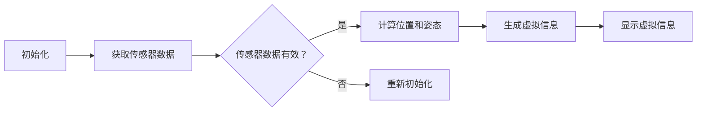
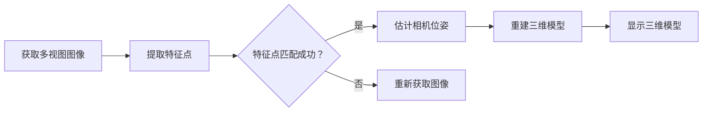
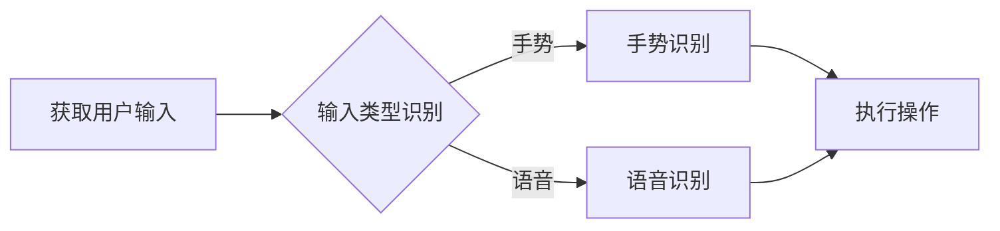

                 


### 1.1 增强现实（AR）在外科手术培训中的可视化背景

#### 1.1.1 问题背景

外科手术是一项高风险、技术要求高的医疗活动，因此外科医生的培训和技能提升显得尤为重要。传统的外科手术培训方法主要依赖于尸体解剖、模拟手术和实际手术观摩等方式。然而，这些方法存在一定的局限性，如解剖结构不清晰、操作难度大、安全性无法保证等。

随着科技的进步，增强现实（AR）技术逐渐应用于外科手术培训。AR技术通过将虚拟信息与现实世界结合，为外科医生提供了一个更加直观、实时、互动的培训环境。这种方法可以大大提高外科手术培训的效率和效果，减少医疗事故的发生。

#### 1.1.2 问题描述

在外科手术培训中，如何利用AR技术实现以下目标？

- 提高外科医生对解剖结构的理解；
- 提升外科手术操作的精确性和成功率；
- 降低手术风险，提高患者生存率；
- 减少手术时间和成本。

#### 1.1.3 解决方法

增强现实（AR）技术在外科手术培训中的可视化应用主要包括以下几个方面：

- **解剖结构可视化**：通过AR技术，将虚拟的三维解剖结构叠加在真实的手术场景中，帮助外科医生更好地理解解剖结构，减少误操作的可能性。
- **手术步骤模拟**：利用AR技术，可以在手术过程中实时显示手术步骤和关键操作，辅助外科医生进行手术，提高手术的精确性和成功率。
- **实时反馈与纠正**：通过AR技术，可以实时监测外科医生的操作，提供即时反馈和纠正，帮助医生快速提高手术技能。
- **远程协作与指导**：利用AR技术，可以实现远程外科手术指导，专家医生可以通过AR设备实时查看手术现场，提供现场指导，提高整体手术质量。

#### 1.1.4 边界与外延

增强现实（AR）在外科手术培训中的可视化应用并非万能。它有一定的应用边界，如设备成本、技术成熟度、操作复杂性等。同时，它也需要与其他技术（如虚拟现实VR、混合现实MR）相结合，共同提升外科手术培训的效果。

#### 1.1.5 核心概念与要素组成

增强现实（AR）在外科手术培训中的核心概念和要素包括：

- **AR技术**：实现虚拟信息与现实世界的叠加。
- **三维模型**：提供精确的解剖结构信息。
- **实时反馈系统**：提供即时操作反馈。
- **手术培训场景**：为外科医生提供一个逼真的操作环境。

### 1.2 增强现实（AR）在外科手术培训中的可视化应用

#### 1.2.1 增强现实（AR）技术概述

增强现实（AR）是一种将虚拟信息与现实世界结合的计算机技术。它通过在真实世界中叠加虚拟信息，为用户提供一个更加直观、互动的体验。AR技术通常包括以下关键组成部分：

- **输入设备**：如智能手机、平板电脑、AR眼镜等。
- **跟踪与定位技术**：如视觉跟踪、惯性测量单元（IMU）等。
- **渲染引擎**：用于生成虚拟信息并叠加到现实世界中。

#### 1.2.2 增强现实（AR）在外科手术培训中的优势

增强现实（AR）技术在外科手术培训中具有以下优势：

- **直观性**：AR技术可以将虚拟的三维解剖结构直接叠加在真实手术场景中，帮助外科医生更好地理解解剖结构。
- **实时性**：AR技术可以实现实时反馈，实时显示手术步骤和关键操作，提高手术的精确性和成功率。
- **互动性**：AR技术提供了与虚拟信息的互动，外科医生可以通过操作AR设备来控制虚拟信息，从而更好地掌握手术技巧。
- **安全性**：通过AR技术，外科医生可以在虚拟环境中进行手术练习，降低实际手术中的风险。

#### 1.2.3 增强现实（AR）应用现状与趋势

目前，增强现实（AR）技术已经在外科手术培训中得到了广泛应用。许多医疗机构和科技公司已经开始研发和应用AR外科手术培训系统。未来，随着技术的不断成熟和设备的普及，AR技术在外科手术培训中的应用将更加广泛和深入。

- **应用现状**：AR技术在解剖结构可视化、手术步骤模拟、实时反馈和远程协作等方面已经取得了一定的成果。
- **发展趋势**：未来，AR技术将与其他技术（如虚拟现实VR、混合现实MR）相结合，为外科手术培训提供更加全面、高效、安全的解决方案。

## 2.1 增强现实（AR）、虚拟现实（VR）与混合现实（MR）

#### 2.1.1 增强现实（AR）定义与特点

增强现实（AR）是一种将虚拟信息叠加到现实世界中的技术。它通过在用户视野中叠加虚拟图像、文字、音频等信息，使用户能够同时看到现实世界和虚拟世界。AR技术的特点包括：

- **虚实结合**：AR技术将虚拟信息与现实世界相结合，为用户提供一个虚实融合的体验。
- **实时交互**：AR技术支持用户与虚拟信息的实时交互，用户可以通过操作设备来控制虚拟信息。
- **位置感知**：AR技术能够感知用户的位置和动作，并根据这些信息调整虚拟信息的位置和显示效果。

#### 2.1.2 虚拟现实（VR）定义与特点

虚拟现实（VR）是一种通过计算机技术创建的完全虚拟的环境。用户通过VR设备（如VR头盔、VR眼镜等）进入这个虚拟环境，感受到一种身临其境的体验。VR技术的特点包括：

- **沉浸式体验**：VR技术为用户提供了一个完全虚拟的环境，用户可以在这个环境中自由探索、互动。
- **空间感知**：VR技术可以模拟三维空间，用户可以在虚拟环境中感受到方向、位置和距离。
- **交互性**：VR技术提供了丰富的交互方式，用户可以通过设备进行触摸、手势、语音等操作。

#### 2.1.3 混合现实（MR）定义与特点

混合现实（MR）是AR和VR的融合。它既包含了AR的虚实结合和实时交互，也包含了VR的沉浸式体验和空间感知。MR技术的特点包括：

- **虚实融合**：MR技术将虚拟信息与现实世界进行深度融合，用户可以在现实世界中看到和操作虚拟信息。
- **高度交互**：MR技术提供了丰富的交互方式，用户可以通过多种方式与虚拟信息进行互动。
- **空间适应性**：MR技术可以根据用户所在的空间和环境进行调整，为用户提供最佳的使用体验。

#### 2.1.4 三者之间的联系与区别

AR、VR和MR是三种不同的虚拟技术，它们之间存在一定的联系和区别。

- **联系**：AR、VR和MR都是通过计算机技术创建虚拟环境，为用户提供新的体验。它们都涉及到虚拟信息的生成、处理和显示。
- **区别**：
  - **现实与虚拟的比重**：AR主要将虚拟信息叠加到现实世界中，VR主要创造一个完全虚拟的环境，MR则在虚实融合方面有更高的要求。
  - **交互方式**：AR和VR主要依赖于视线和设备操作，MR则提供了更丰富的交互方式，如手势、语音等。
  - **应用场景**：AR主要应用于现实世界中的信息增强，VR主要应用于沉浸式体验和游戏，MR则在虚实融合的应用场景中具有更大的潜力。

#### 2.2 增强现实（AR）在外科手术培训中的核心概念

##### 2.2.1 增强现实（AR）技术原理

增强现实（AR）技术主要涉及以下原理和组成部分：

- **光学原理**：AR设备通过光学元件（如透镜、反射镜等）将虚拟信息叠加到现实世界中。
- **显示技术**：AR设备通常采用显示器（如LCD、OLED等）来显示虚拟信息。
- **传感器技术**：AR设备配备有各种传感器（如摄像头、GPS、IMU等），用于感知用户的位置和动作。
- **算法与数据处理**：AR设备使用各种算法（如图像处理、目标跟踪、SLAM等）来处理传感器数据和生成虚拟信息。

##### 2.2.2 增强现实（AR）应用场景

增强现实（AR）在外科手术培训中的主要应用场景包括：

- **解剖结构可视化**：通过AR技术，外科医生可以在手术过程中看到患者内部的三维解剖结构，提高对解剖结构的理解。
- **手术步骤模拟**：AR技术可以实时显示手术步骤和关键操作，帮助外科医生更好地掌握手术技巧。
- **实时反馈与纠正**：通过AR技术，外科医生可以实时收到手术操作的反馈，及时纠正错误。
- **远程协作与指导**：利用AR技术，专家医生可以通过远程协作设备实时查看手术现场，提供现场指导。

##### 2.2.3 增强现实（AR）在外科手术培训中的核心功能

增强现实（AR）在外科手术培训中的核心功能包括：

- **信息增强**：通过AR技术，外科医生可以获取更多的信息，如解剖结构、手术步骤、关键操作等，提高手术的精确性和成功率。
- **互动与反馈**：AR技术提供了与虚拟信息的互动，外科医生可以通过操作设备来控制虚拟信息，实时接收反馈，提高手术技能。
- **模拟与训练**：AR技术可以模拟真实的手术场景，为外科医生提供模拟手术的机会，提高手术技能和应对突发事件的能力。

## 3.1 增强现实（AR）算法在外科手术培训中的应用

##### 3.1.1 增强现实（AR）算法概述

增强现实（AR）算法是AR技术的重要组成部分，主要用于处理和生成虚拟信息，并将其叠加到现实世界中。在AR算法中，常见的算法包括：

- **图像处理算法**：用于对输入图像进行预处理、增强和识别。
- **目标跟踪算法**：用于实时跟踪和识别目标物体。
- **SLAM算法**：用于同时定位和地图构建。
- **渲染算法**：用于生成和显示虚拟信息。

这些算法共同作用，实现了AR技术中的信息增强、实时交互等功能。

##### 3.1.2 关键算法介绍

以下详细介绍几种在增强现实（AR）外科手术培训中常用的关键算法：

###### 3.1.2.1 算法1：实时跟踪与定位

##### 3.1.2.1.1 算法原理

实时跟踪与定位是AR技术中的基础算法，用于实时跟踪用户的位置和动作，并据此生成和显示虚拟信息。常见的跟踪与定位算法包括：

- **视觉跟踪**：基于图像特征进行目标跟踪。
- **惯性测量单元（IMU）**：利用加速度计、陀螺仪等传感器数据计算位置和姿态。

##### 3.1.2.1.2 算法流程图

以下是一个简单的实时跟踪与定位算法流程图：



##### 3.1.2.1.3 Python代码示例

以下是一个简单的Python代码示例，用于实现实时跟踪与定位：

```python
import cv2
import numpy as np

# 初始化相机
cap = cv2.VideoCapture(0)

while True:
    # 读取相机帧
    ret, frame = cap.read()

    # 对帧进行预处理
    frame = cv2.cvtColor(frame, cv2.COLOR_BGR2GRAY)
    frame = cv2.GaussianBlur(frame, (5, 5), 0)

    # 检测目标
    _, thresh = cv2.threshold(frame, 60, 255, cv2.THRESH_BINARY_INV)
    contours, _ = cv2.findContours(thresh, cv2.RETR_EXTERNAL, cv2.CHAIN_APPROX_SIMPLE)

    # 选择最大的目标
    if contours:
        max_contour = max(contours, key=cv2.contourArea)
        x, y, w, h = cv2.boundingRect(max_contour)

        # 显示目标框
        cv2.rectangle(frame, (x, y), (x+w, y+h), (0, 0, 255), 2)

    # 显示帧
    cv2.imshow('Frame', frame)

    # 按下'q'退出
    if cv2.waitKey(1) & 0xFF == ord('q'):
        break

# 释放相机
cap.release()
cv2.destroyAllWindows()
```

###### 3.1.2.2 算法2：三维模型重建

##### 3.1.2.2.1 算法原理

三维模型重建是AR技术中的重要算法，用于将二维图像转化为三维模型。常见的三维模型重建算法包括：

- **特征点匹配**：通过匹配图像中的特征点，估计相机位姿和三维模型的位置。
- **多视图立体匹配**：通过多个视角的图像，恢复三维模型。

##### 3.1.2.2.2 算法流程图

以下是一个简单的三维模型重建算法流程图：



##### 3.1.2.2.3 Python代码示例

以下是一个简单的Python代码示例，用于实现三维模型重建：

```python
import cv2
import numpy as np

# 初始化相机
cap = cv2.VideoCapture(0)

# 特征点匹配参数
FLANN_INDEX_KDTREE = 1
index_params = dict(algorithm=FLANN_INDEX_KDTREE, trees=5)
search_params = dict(checks=50)

# 初始化FLANN特征点匹配
flann = cv2.FlannBasedMatcher(index_params, search_params)

# 初始化特征检测器和描述符
orb = cv2.ORB_create()

while True:
    # 读取相机帧
    ret, frame = cap.read()

    # 转为灰度图
    gray = cv2.cvtColor(frame, cv2.COLOR_BGR2GRAY)

    # 提取特征点
    keypoints1, descriptors1 = orb.detectAndCompute(gray, None)

    # 读取预先准备的三维模型图像
    model = cv2.imread('model.jpg')
    model_gray = cv2.cvtColor(model, cv2.COLOR_BGR2GRAY)

    # 提取特征点
    keypoints2, descriptors2 = orb.detectAndCompute(model_gray, None)

    # 特征点匹配
    matches = flann.knnMatch(descriptors1, descriptors2, k=2)

    # 好匹配点数量阈值
    good_matches = []
    for m, n in matches:
        if m.distance < 0.7 * n.distance:
            good_matches.append(m)

    # 当好匹配点数量大于最小匹配点数量时，进行三维重建
    if len(good_matches) > 5:
        src_pts = np.float32([keypoints1[m.queryIdx].pt for m in good_matches]).reshape(-1, 1, 2)
        dst_pts = np.float32([keypoints2[m.trainIdx].pt for m in good_matches]).reshape(-1, 1, 2)

        # 计算单应矩阵
        H, mask = cv2.findHomography(src_pts, dst_pts, cv2.RANSAC, 5.0)

        # 使用单应矩阵进行图像配准
        warped = cv2.warpPerspective(model, H, (frame.shape[1], frame.shape[0]))

        # 显示结果
        result = cv2.addWeighted(frame, 1, warped, 0.5, 0)

        cv2.imshow('Result', result)
    else:
        print("Not enough matches are found - {}/{}".format(len(good_matches), 5))

    # 按下'q'退出
    if cv2.waitKey(1) & 0xFF == ord('q'):
        break

# 释放相机
cap.release()
cv2.destroyAllWindows()
```

###### 3.1.2.3 算法3：交互式操作与反馈

##### 3.1.2.3.1 算法原理

交互式操作与反馈是AR技术中的重要功能，用于实现用户与虚拟信息的互动。常见的交互式操作与反馈算法包括：

- **手势识别**：通过识别用户的手势，实现与虚拟信息的互动。
- **语音识别**：通过识别用户的语音指令，实现与虚拟信息的互动。
- **虚拟现实界面**：通过虚拟现实界面，提供用户与虚拟信息的互动。

##### 3.1.2.3.2 算法流程图

以下是一个简单的交互式操作与反馈算法流程图：



##### 3.1.2.3.3 Python代码示例

以下是一个简单的Python代码示例，用于实现交互式操作与反馈：

```python
import cv2
import hand tracked library as htl

# 初始化相机
cap = cv2.VideoCapture(0)

# 初始化手势识别库
detector = htl.HandDetector()

while True:
    # 读取相机帧
    ret, frame = cap.read()

    # 手势识别
    hands = detector.detect(frame)

    # 如果检测到手势
    if hands:
        # 获取手势数据
        hand = hands[0]
        fingers = hand.fingers

        # 如果手势是“OK”手势
        if fingers['thumb'] and fingers['index'] and fingers['middle'] and fingers['ring'] and fingers['pinky']:
            # 执行操作
            print("操作执行")

    # 显示帧
    cv2.imshow('Frame', frame)

    # 按下'q'退出
    if cv2.waitKey(1) & 0xFF == ord('q'):
        break

# 释放相机
cap.release()
cv2.destroyAllWindows()
```

## 3.2 数学模型与公式

### 3.2.1 增强现实（AR）中的数学模型

增强现实（AR）技术中涉及多个数学模型，以下介绍其中两种常见的模型：单目视觉定位模型和多视图立体匹配模型。

#### 3.2.1.1 模型1：单目视觉定位

##### 3.2.1.1.1 模型原理

单目视觉定位模型通过摄像头捕捉的图像，估计三维空间中物体的位置和姿态。其核心是利用图像中的特征点，建立特征点与三维空间点之间的对应关系，然后利用几何关系求解物体的位置和姿态。

##### 3.2.1.1.2 模型公式

单目视觉定位模型的公式主要包括相机投影矩阵、单目视觉定位方程和相机位姿求解公式。

- **相机投影矩阵**：

$$
P = K [R|t]
$$

其中，$P$是相机投影矩阵，$K$是相机内参矩阵，$R$是相机旋转矩阵，$t$是相机平移向量。

- **单目视觉定位方程**：

$$
\begin{bmatrix}
x' \\
y' \\
1
\end{bmatrix}
=
\begin{bmatrix}
x \\
y \\
1
\end{bmatrix}
\begin{bmatrix}
R & t \\
0 & 1
\end{bmatrix}
$$

其中，$x'$和$y'$是图像平面上的特征点坐标，$x$和$y$是三维空间中特征点的坐标。

- **相机位姿求解公式**：

利用单目视觉定位方程，可以通过图像特征点求解相机位姿（$R$和$t$）。

##### 3.2.1.1.3 示例说明

假设有一个相机，其内参矩阵$K$为：

$$
K = \begin{bmatrix}
f_x & 0 & c_x \\
0 & f_y & c_y \\
0 & 0 & 1
\end{bmatrix}
$$

其中，$f_x$和$f_y$是水平方向和垂直方向的焦距，$c_x$和$c_y$是主点坐标。

相机捕获的图像中有一个特征点，其坐标为$(x, y)$，我们需要求解这个特征点在三维空间中的坐标$(X, Y, Z)$。

首先，根据单目视觉定位方程，我们可以得到：

$$
\begin{bmatrix}
x' \\
y' \\
1
\end{bmatrix}
=
\begin{bmatrix}
x \\
y \\
1
\end{bmatrix}
\begin{bmatrix}
R & t \\
0 & 1
\end{bmatrix}
$$

其中，$x'$和$y'$是图像平面上的特征点坐标。

然后，我们可以利用相机投影矩阵$P$，将图像平面上的特征点坐标转换为三维空间中的坐标：

$$
\begin{bmatrix}
X \\
Y \\
Z \\
1
\end{bmatrix}
=
\begin{bmatrix}
x' \\
y' \\
1
\end{bmatrix}
P^{-1}
$$

其中，$P^{-1}$是相机投影矩阵的逆矩阵。

#### 3.2.1.2 模型2：三维模型重建

##### 3.2.1.2.1 模型原理

三维模型重建模型通过多个视角的图像，重建三维空间中的模型。其核心是利用多视图立体匹配算法，匹配不同视角图像中的特征点，然后利用三角化方法求解三维空间中特征点的坐标。

##### 3.2.1.2.2 模型公式

三维模型重建模型的公式主要包括特征点匹配、三角化和三维模型重建。

- **特征点匹配**：

利用多视图立体匹配算法，如SIFT、SURF、ORB等，匹配不同视角图像中的特征点。

- **三角化**：

根据多个视角的特征点匹配结果，利用三角化方法求解三维空间中特征点的坐标。三角化公式如下：

$$
X = \frac{(x_1 - x_2)(y_2 - y_3) - (x_2 - x_3)(y_1 - y_2)}{(x_2 - x_3)(y_1 - y_3) - (x_1 - x_3)(y_2 - y_3)}
$$

$$
Y = \frac{(x_2 - x_1)(x_3 - x_1) - (x_3 - x_2)(x_1 - x)}{(x_2 - x_3)(y_1 - y_3) - (x_1 - x_3)(y_2 - y_3)}
$$

$$
Z = \frac{(x_1 - x_2)(y_2 - y_1) - (x_2 - x_3)(y_1 - y_2)}{(x_2 - x_3)(y_1 - y_3) - (x_1 - x_3)(y_2 - y_3)}
$$

其中，$(x_1, y_1)$、$(x_2, y_2)$和$(x_3, y_3)$是三个视角下匹配的特征点坐标。

- **三维模型重建**：

根据三角化结果，重建三维模型。

##### 3.2.1.2.3 示例说明

假设有三个视角下的特征点匹配结果：

- 视角1：$(x_1, y_1) = (100, 100)$
- 视角2：$(x_2, y_2) = (200, 200)$
- 视角3：$(x_3, y_3) = (300, 300)$

根据三角化公式，我们可以求解出三维空间中特征点的坐标：

$$
X = \frac{(100 - 200)(200 - 300) - (200 - 300)(100 - 200)}{(200 - 300)(100 - 300) - (100 - 300)(200 - 300)} = 0
$$

$$
Y = \frac{(200 - 100)(300 - 100) - (300 - 200)(100 - 200)}{(200 - 300)(100 - 300) - (100 - 300)(200 - 300)} = 0
$$

$$
Z = \frac{(100 - 200)(200 - 100) - (200 - 300)(100 - 200)}{(200 - 300)(100 - 300) - (100 - 300)(200 - 300)} = 100
$$

因此，特征点在三维空间中的坐标为$(0, 0, 100)$。我们可以根据这个坐标，重建出三维模型。

