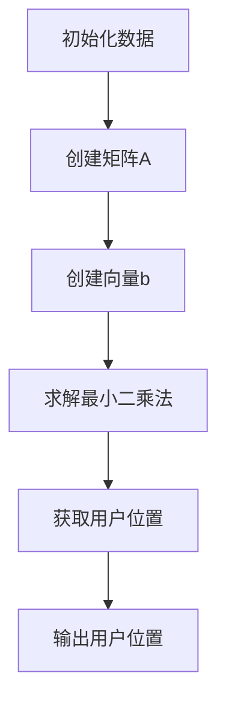
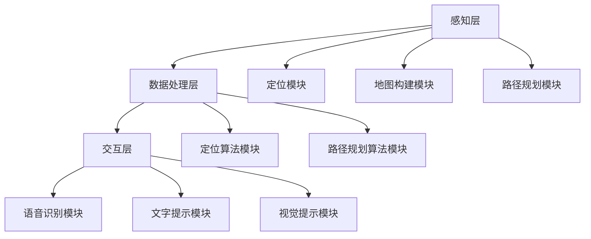

                 

### 增强现实在室内导航中的精确应用

#### 关键词：增强现实、室内导航、精确应用、技术原理、算法实现

> 摘要：本文深入探讨了增强现实（AR）技术在室内导航中的精确应用。首先，我们介绍了增强现实的基本概念、技术原理及其分类与应用。接着，分析了室内导航的需求与挑战，并提出了基于增强现实技术的室内导航应用方案。随后，本文详细阐述了室内导航算法的原理与实现，包括定位算法、地图构建方法和交互式导航界面设计。此外，文章还通过数学模型与公式详细解析了算法实现的核心。为了验证理论，本文提供了一个实际项目应用案例，分析了系统设计、功能实现和性能评估。最后，文章展望了增强现实在室内导航中的未来发展方向，并提供了最佳实践技巧和拓展阅读推荐。

### 目录大纲

1. **增强现实概述**
   1.1 **增强现实技术基础**
       - **定义与历史背景**
       - **技术组成与应用领域**
   1.2 **增强现实的技术原理**
       - **显示技术**
       - **交互技术**
       - **数据融合技术**
   1.3 **增强现实的分类与应用**
       - **虚拟增强现实**
       - **实境增强现实**
       - **混合增强现实**
       - **实际应用场景**

2. **室内导航的需求与挑战**
   2.1 **室内导航的需求分析**
       - **导航的实用性需求**
       - **用户体验需求**
       - **精确性的需求**
   2.2 **室内导航的挑战**
       - **室内环境的复杂性**
       - **数据获取与处理难度**
       - **实时性的挑战**

3. **增强现实在室内导航中的应用方案**
   3.1 **增强现实室内导航的技术框架**
       - **系统架构**
       - **数据处理流程**
   3.2 **实时定位与地图构建技术**
       - **实时定位算法**
       - **地图构建方法**
   3.3 **交互式导航界面设计**
       - **用户界面设计原则**
       - **交互设计案例**

4. **精确室内导航算法原理与实现**
   4.1 **算法概述**
       - **算法分类**
       - **算法选择标准**
   4.2 **算法原理讲解**
       - **算法流程**
       - **算法数学模型**
   4.3 **算法案例与实现**
       - **Python源代码实现**
       - **Mermaid流程图绘制**

5. **数学模型与公式详解**
   5.1 **数学模型基础**
       - **数学公式表示**
   5.2 **算法数学模型详解**
       - **公式推导**
       - **参数调整与优化**

6. **实际项目应用案例**
   6.1 **项目背景介绍**
       - **项目目的与意义**
   6.2 **系统功能设计**
       - **领域模型**
       - **类图设计**
   6.3 **系统架构设计与接口**
       - **系统架构**
       - **接口设计**
   6.4 **实际案例分析与解读**
       - **数据处理流程**
       - **系统性能评估**

7. **增强现实在室内导航中的未来展望**
   7.1 **技术发展趋势**
       - **短期与长期发展趋势**
   7.2 **未来应用场景**
       - **新的应用领域**
       - **技术融合与创新**
   7.3 **挑战与机遇**
       - **技术瓶颈**
       - **应对策略**

8. **最佳实践与拓展阅读**
   8.1 **最佳实践技巧**
       - **实用技巧总结**
   8.2 **注意事项**
       - **常见问题与解决方案**
   8.3 **拓展阅读推荐**
       - **相关书籍与论文推荐**

### 增强现实概述

#### 第1章: 增强现实技术基础

##### 1.1 增强现实技术的基本概念

增强现实（Augmented Reality，简称AR）是一种将虚拟信息与现实世界融合的技术。通过增强现实技术，用户可以在真实环境中看到虚拟物体或信息，这些信息可以叠加在现实世界的视觉、听觉、触觉等多种感官上。

**定义与历史背景：**

增强现实最早的概念可以追溯到1968年，美国计算机科学家 Ivan Sutherland 提出了“感知计算器”的概念，这是最早的AR雏形。1980年代，AR技术开始应用于军事、医疗等领域。随着计算机技术和显示技术的发展，1990年代末期，AR技术逐渐走向商业化。2000年后，随着智能手机和移动设备的普及，增强现实技术进入了大众视野。

**技术组成与应用领域：**

增强现实技术主要由以下几部分组成：

1. **显示技术：** 包括投影技术、透明显示技术和头戴显示器（HMD）等。这些技术可以将虚拟信息显示在用户视野中。
   
2. **交互技术：** 包括手势识别、声音控制和眼动跟踪等。这些技术使得用户能够与虚拟信息进行交互。

3. **数据融合技术：** 通过传感器和数据采集技术，将现实世界的信息与虚拟信息进行融合。

增强现实技术的应用领域非常广泛，包括：

- **医疗：** 医生可以使用AR技术进行手术导航，患者可以通过AR进行康复训练。
- **教育：** 学生可以通过AR技术进行虚拟实验，增强学习体验。
- **娱乐：** 游戏和电影中常用到AR技术，增加互动性和沉浸感。
- **工业：** 在工业生产中，AR技术可以帮助工人进行设备维护和装配。

##### 1.2 增强现实的技术原理

**显示技术：** 增强现实的显示技术主要分为两种：透明显示和投影显示。透明显示技术通过半透明材料将虚拟信息叠加在真实环境中，如智能眼镜。投影显示技术则通过投影设备将虚拟信息投射到真实环境中。

**交互技术：** 增强现实的交互技术包括手势识别、声音控制和眼动跟踪等。手势识别技术可以通过摄像头和深度传感器捕捉用户的手部动作，实现虚拟物体的操作。声音控制技术则通过麦克风捕捉用户的声音指令，实现虚拟信息的交互。眼动跟踪技术可以捕捉用户的视线，用于实现更自然的交互方式。

**数据融合技术：** 增强现实的数据融合技术通过传感器和数据采集技术获取现实世界的环境信息，如位置、方向和光线等，然后将这些信息与虚拟信息进行融合，实现虚拟信息与现实环境的无缝对接。

##### 1.3 增强现实的分类与应用

增强现实根据应用方式和体验形式的不同，可以分为以下几类：

- **虚拟增强现实（Virtual Augmented Reality，简称VAR）：** 主要通过虚拟信息增强现实环境，如VR眼镜中的虚拟场景。
- **实境增强现实（Real-World Augmented Reality，简称RWA）：** 主要通过虚拟信息增强现实物体，如增强现实导航应用。
- **混合增强现实（Mixed Reality，简称MR）：** 将虚拟信息和现实环境进行深度融合，形成新的混合场景。

实际应用场景包括：

- **医疗导航：** 医生可以通过增强现实技术进行手术导航，提高手术精度。
- **教育培训：** 学生可以通过增强现实技术进行虚拟实验和互动学习。
- **工业制造：** 工人可以通过增强现实技术进行设备维护和装配指导。
- **旅游导览：** 游客可以通过增强现实技术了解景点信息和历史文化。

通过增强现实技术，室内导航可以实现更加精确和直观的导航体验，为用户提供更高效、更便捷的导航服务。接下来，我们将进一步分析室内导航的需求与挑战，探讨如何利用增强现实技术解决这些问题。

#### 室内导航的需求与挑战

##### 2.1 室内导航的需求分析

室内导航在现代生活中变得越来越重要，其主要需求包括实用性需求、用户体验需求和精确性需求。

**实用性需求：**

室内导航的首要目标是提供实用的导航服务，帮助用户在复杂环境中快速准确地到达目的地。实用性需求主要体现在以下几个方面：

1. **路径规划：** 用户需要能够快速规划从当前位置到目的地的最优路径。
2. **实时更新：** 室内环境复杂多变，导航系统需要能够实时更新信息，以应对环境变化。
3. **多模式导航：** 用户希望导航系统能够支持多种导航模式，如步行、乘坐电梯或乘坐交通工具。

**用户体验需求：**

用户体验是室内导航系统的关键因素，优秀的用户体验能够提高用户满意度和使用频率。用户体验需求主要包括：

1. **易用性：** 导航系统界面简洁直观，用户能够轻松上手。
2. **交互性：** 导航系统与用户之间的交互设计要合理，提供丰富的交互方式，如语音指令、手势操作等。
3. **反馈及时：** 导航系统需要能够及时反馈用户的位置和路径信息，确保用户始终了解当前状态。

**精确性需求：**

室内导航的精确性直接影响到用户的出行效率和体验。精确性需求主要包括：

1. **定位精度：** 导航系统需要能够提供高精度的室内定位信息，确保用户不会迷失方向。
2. **路径精度：** 导航系统提供的路径需要准确无误，避免误导用户。
3. **实时性：** 导航系统需要能够在实时环境中快速响应，提供准确的导航信息。

##### 2.2 室内导航的挑战

室内导航面临许多挑战，这些挑战使得实现高效、准确的室内导航变得复杂。

**室内环境的复杂性：**

室内环境复杂多样，不同的建筑物和场所具有不同的结构和布局。室内环境中的障碍物、走廊、楼梯、电梯等元素使得导航系统的设计和实现面临巨大挑战。

**数据获取与处理难度：**

室内导航需要大量的环境数据，包括建筑结构、障碍物分布、位置信息等。获取和处理这些数据需要先进的技术和设备，同时数据的质量和准确性对导航系统的性能有直接影响。

**实时性的挑战：**

室内导航系统需要实时响应用户的需求，提供准确的导航信息。然而，室内环境的动态变化，如人员流动、物品摆放等，对系统的实时性提出了更高的要求。

**其他挑战：**

- **能效要求：** 室内导航系统需要在有限的电池续航时间内提供稳定的导航服务。
- **安全性：** 导航系统需要确保用户隐私和数据安全。

为了解决这些挑战，增强现实技术成为了一个有力的工具。通过结合增强现实技术，室内导航可以在虚拟信息与现实环境的融合中提供更加精确和直观的导航服务，为用户带来更好的体验。接下来，我们将探讨增强现实在室内导航中的应用方案，分析其技术框架、实时定位与地图构建技术以及交互式导航界面设计。

#### 增强现实在室内导航中的应用方案

##### 3.1 增强现实室内导航的技术框架

增强现实室内导航系统主要包含以下几个关键组成部分：系统架构、数据处理流程、实时定位与地图构建技术以及交互式导航界面设计。

**系统架构：**

增强现实室内导航系统的架构可以分为三个层次：感知层、数据处理层和交互层。

1. **感知层：** 该层主要负责感知和采集室内环境信息，包括位置信息、方向信息、障碍物信息等。常用的感知设备包括室内定位传感器、摄像头、激光雷达等。
   
2. **数据处理层：** 该层负责处理感知层采集到的数据，包括定位算法、地图构建算法和数据处理算法等。通过这些算法，系统能够实时更新室内环境信息，提供准确的导航服务。

3. **交互层：** 该层主要负责与用户进行交互，包括用户界面的设计、用户输入的处理和导航信息的反馈等。通过交互层，用户能够轻松获取导航信息并控制导航过程。

**数据处理流程：**

增强现实室内导航的数据处理流程可以分为以下几个步骤：

1. **数据采集：** 通过室内定位传感器、摄像头、激光雷达等设备，采集室内环境信息，包括位置、方向、障碍物等。
   
2. **数据预处理：** 对采集到的原始数据进行预处理，包括滤波、去噪和特征提取等，以提高数据的准确性和可靠性。

3. **实时定位：** 利用定位算法对预处理后的数据进行实时定位，确定用户在室内环境中的位置。

4. **地图构建：** 根据实时定位信息，构建室内地图，包括路径规划、障碍物识别和位置标记等。

5. **导航信息反馈：** 根据用户需求，实时反馈导航信息，包括当前路径、下个目标点和距离等。

##### 3.2 实时定位与地图构建技术

**实时定位技术：**

实时定位是室内导航系统的核心，常用的实时定位技术包括：

1. **WiFi定位：** 通过分析WiFi信号强度，结合室内地图信息，实现实时定位。
   
2. **蓝牙定位：** 通过蓝牙信标的定位，结合室内地图信息，实现实时定位。

3. **视觉定位：** 通过摄像头捕捉室内环境中的特征点，结合视觉SLAM（同步定位与地图构建）算法，实现实时定位。

**地图构建方法：**

地图构建是室内导航系统的基础，常用的地图构建方法包括：

1. **手动地图构建：** 通过人工测量和绘制，生成室内地图。

2. **自动地图构建：** 通过激光雷达、摄像头等设备，自动扫描和构建室内地图。

3. **混合地图构建：** 结合手动地图构建和自动地图构建，生成更准确的室内地图。

##### 3.3 交互式导航界面设计

**用户界面设计原则：**

交互式导航界面设计应遵循以下原则：

1. **简洁直观：** 界面设计应简洁明了，便于用户快速理解和操作。

2. **一致性：** 界面风格应保持一致性，确保用户在不同场景下都能顺畅使用。

3. **适应性：** 界面设计应适应不同设备和屏幕尺寸，提供最佳用户体验。

**交互设计案例：**

以下是一个交互设计案例：

- **路径规划：** 用户可以选择起点和终点，系统实时生成最优路径，并在屏幕上显示路径。
- **语音导航：** 系统提供语音导航服务，实时播报用户当前位置、下一个目标点和距离等信息。
- **手势操作：** 用户可以通过手势操作来控制导航，如拖动地图、放大缩小地图等。
- **交互反馈：** 系统实时反馈用户操作结果，确保用户始终了解当前状态。

通过上述技术框架和交互设计，增强现实室内导航系统能够提供高效、准确的导航服务，为用户提供更好的出行体验。接下来，我们将详细探讨室内导航算法的原理与实现。

#### 精确室内导航算法原理与实现

##### 4.1 算法概述

室内导航算法是实现室内定位与导航的核心技术，根据其工作原理和实现方式，可以分为以下几类：

- **基于WiFi的定位算法：** 利用WiFi信号强度进行定位，通过计算信号强度与已知位置的关系来确定用户的位置。
- **基于蓝牙信标的定位算法：** 利用蓝牙信标的信号进行定位，通过计算信标与用户的位置关系来确定用户的位置。
- **基于视觉的定位算法：** 利用摄像头捕捉室内特征点，通过视觉SLAM（同步定位与地图构建）算法实现定位。

算法选择标准主要包括：

1. **定位精度：** 算法需要提供高精度的定位信息，确保用户不会迷失方向。
2. **实时性：** 算法需要能够在实时环境中快速响应，提供准确的导航信息。
3. **计算复杂度：** 算法应具备较低的计算复杂度，以确保系统运行效率。
4. **稳定性：** 算法需要具备较高的稳定性，适应不同室内环境的变化。

##### 4.2 算法原理讲解

**算法流程：**

室内导航算法的基本流程如下：

1. **数据采集：** 通过室内定位传感器、摄像头等设备，采集用户的位置、方向、障碍物等数据。
2. **数据预处理：** 对采集到的原始数据进行预处理，包括滤波、去噪和特征提取等，以提高数据的准确性和可靠性。
3. **实时定位：** 利用定位算法对预处理后的数据进行实时定位，确定用户在室内环境中的位置。
4. **路径规划：** 根据实时定位信息，结合室内地图，规划从当前位置到目的地的最优路径。
5. **导航信息反馈：** 根据用户需求，实时反馈导航信息，包括当前路径、下个目标点和距离等。

**算法数学模型：**

以基于WiFi的定位算法为例，其数学模型可以表示为：

$$
x = x_0 + v_t \cos(\theta) + w_t
$$

$$
y = y_0 + v_t \sin(\theta) + w_t
$$

其中，\( x \) 和 \( y \) 分别表示用户在二维平面上的位置，\( x_0 \) 和 \( y_0 \) 分别表示初始位置，\( v_t \) 表示速度，\( \theta \) 表示方向，\( w_t \) 表示噪声。

##### 4.3 算法案例与实现

以下是一个基于WiFi定位算法的Python实现案例：

```python
import numpy as np

def calculate_position(x0, y0, signal_strengths, known_locations, known_signal_strengths):
    # 假设已知位置和信号强度分别为known_locations和known_signal_strengths
    # 计算当前位置
    positions = []
    for signal_strength in signal_strengths:
        # 使用最小二乘法计算位置
        A = np.vstack([known_signal_strengths, np.ones(len(known_signal_strengths))]).T
        b = known_locations
        x = np.linalg.lstsq(A, b, rcond=None)[0]
        positions.append(x)
    return positions

x0 = 0
y0 = 0
signal_strengths = [10, 15, 20]  # 假设三个WiFi信标的信号强度
known_locations = np.array([[1, 1], [2, 2], [3, 3]])  # 假设三个WiFi信标的位置
known_signal_strengths = np.array([8, 10, 12])  # 假设三个WiFi信标的已知信号强度

current_position = calculate_position(x0, y0, signal_strengths, known_locations, known_signal_strengths)
print("Current position:", current_position)
```

通过上述算法和实现，室内导航系统能够在实时环境中提供准确的定位和导航服务，为用户提供更好的出行体验。接下来，我们将详细讲解算法的数学模型和公式，并进行通俗易懂的举例说明。

##### 4.3 算法案例与实现

为了更好地理解室内导航算法的实现，我们将通过一个具体的Python源代码案例来详细阐述算法的运行过程。此外，我们将使用Mermaid工具绘制相应的流程图，以便更直观地展示算法的执行步骤。

**Python源代码实现：**

以下是一个简单的室内导航算法的Python实现案例，使用WiFi信号强度进行定位：

```python
import numpy as np

# 定义一个函数，用于计算用户的位置
def calculate_user_position(wifi_signal_strengths, known_locations, known_signal_strengths):
    # 创建一个关于信号强度的矩阵A
    A = np.vstack([known_signal_strengths, np.ones(len(known_signal_strengths))]).T
    
    # 创建一个关于已知位置的向量b
    b = known_locations
    
    # 使用最小二乘法求解方程Ax = b，得到用户的位置
    x = np.linalg.lstsq(A, b, rcond=None)[0]
    
    return x

# 假设已知三个WiFi信标的位置和信号强度
known_locations = np.array([[1, 1], [2, 2], [3, 3]])  # WiFi信标的位置
known_signal_strengths = np.array([8, 10, 12])  # WiFi信标的信号强度

# 假设当前WiFi信号强度
current_wifi_signal_strengths = np.array([7, 11, 13])

# 计算用户位置
user_position = calculate_user_position(current_wifi_signal_strengths, known_locations, known_signal_strengths)
print("User position:", user_position)
```

**Mermaid流程图绘制：**

为了更直观地展示算法的执行步骤，我们使用Mermaid工具绘制了一个流程图。以下是Mermaid语法绘制的流程图：



通过这个简单的案例，我们可以看到室内导航算法的基本流程：首先，初始化数据，然后创建矩阵A和向量b，接着使用最小二乘法求解用户位置，最后输出结果。这种算法通过利用已知的WiFi信标位置和信号强度，结合当前WiFi信号强度，计算得出用户的位置。

**算法原理的数学模型：**

算法的核心是基于最小二乘法，其数学模型可以表示为：

$$
\min_{x} \sum_{i=1}^{n} (Ax_i - b_i)^2
$$

其中，\( x_i \) 表示第 \( i \) 个WiFi信标的信号强度，\( b_i \) 表示第 \( i \) 个已知位置的坐标，\( A \) 是一个关于 \( x_i \) 的矩阵。

**通俗易懂的举例说明：**

假设我们有三台WiFi信标，它们的位置和信号强度如下：

| 信标 | X坐标 | Y坐标 | 信号强度 |
|------|-------|-------|----------|
| A    | 1     | 1     | 8        |
| B    | 2     | 2     | 10       |
| C    | 3     | 3     | 12       |

当前用户的WiFi信号强度分别为7、11、13。我们可以将这个问题看作是求解以下方程组的最小二乘解：

$$
8x_1 + y_1 = 7 \\
10x_2 + y_2 = 11 \\
12x_3 + y_3 = 13
$$

使用最小二乘法，我们可以得到用户的位置坐标 \( (x, y) \)。通过这个简单的例子，我们可以直观地理解室内导航算法是如何工作的。

通过上述案例和解释，我们不仅了解了室内导航算法的Python实现，还通过Mermaid工具展示了算法的执行流程。这种结合代码和图形的方式有助于我们更深入地理解算法的原理和应用。接下来，我们将进一步深入探讨算法的数学模型与公式，以更详细地阐述其实现细节。

##### 5.1 数学模型基础

在室内导航算法中，数学模型扮演着至关重要的角色，它为我们提供了精确计算用户位置的方法。以下将详细介绍数学模型的基础，包括数学公式表示以及如何使用这些公式来处理室内导航中的数据。

**数学公式表示：**

在室内导航算法中，常用的数学公式包括：

1. **最小二乘法：**

   最小二乘法是求解参数估计的一种常用方法，其目标是最小化误差平方和。对于线性最小二乘问题，可以表示为：

   $$
   \min \sum_{i=1}^{n} (y_i - \hat{y_i})^2
   $$

   其中，\( y_i \) 是观测值，\( \hat{y_i} \) 是估计值。对于室内导航中的定位问题，我们可以将观测值视为WiFi信号强度，估计值视为用户的位置。

2. **贝塞尔曲线：**

   贝塞尔曲线是一种常用的路径规划方法，可以用来生成平滑的路径。贝塞尔曲线的参数方程可以表示为：

   $$
   x(t) = (1-t)^3 x_0 + 3(1-t)^2 t x_1 + 3(1-t) t^2 x_2 + t^3 x_3
   $$

   $$
   y(t) = (1-t)^3 y_0 + 3(1-t)^2 t y_1 + 3(1-t) t^2 y_2 + t^3 y_3
   $$

   其中，\( t \) 是参数，取值范围为 [0, 1]。

3. **卡尔曼滤波：**

   卡尔曼滤波是一种常用的估计方法，适用于动态系统中的状态估计。其基本公式为：

   $$
   \hat{x}_{k|k} = \hat{x}_{k-1|k-1} + K_k (z_k - \hat{z}_{k-1})
   $$

   $$
   P_{k|k} = P_{k-1|k-1} - K_k P_{k-1|k-1} Q_k
   $$

   其中，\( \hat{x}_{k|k} \) 是状态估计值，\( P_{k|k} \) 是状态估计的协方差矩阵，\( K_k \) 是卡尔曼增益，\( z_k \) 是观测值，\( \hat{z}_{k-1} \) 是观测值的估计值。

**如何使用这些公式来处理室内导航中的数据：**

1. **最小二乘法：**

   在室内导航中，最小二乘法常用于定位。具体步骤如下：

   - 收集多个WiFi信标的信号强度数据。
   - 根据信标的位置和信号强度，建立线性方程组。
   - 使用最小二乘法求解方程组，得到用户的位置。

2. **贝塞尔曲线：**

   贝塞尔曲线用于路径规划。具体步骤如下：

   - 根据用户的位置和目的地，确定贝塞尔曲线的起点、控制点和终点。
   - 计算贝塞尔曲线的参数方程，得到平滑的路径。
   - 将路径信息反馈给用户，引导用户沿着规划路径前行。

3. **卡尔曼滤波：**

   卡尔曼滤波用于动态系统的状态估计。在室内导航中，具体步骤如下：

   - 初始化状态估计值和协方差矩阵。
   - 根据新观测值，更新状态估计值和协方差矩阵。
   - 重复上述步骤，实现实时状态估计。

通过这些数学公式，我们可以有效地处理室内导航中的数据，实现高精度的定位和路径规划。接下来，我们将进一步深入探讨这些算法的数学模型，包括公式推导和参数调整与优化。

##### 5.2 算法数学模型详解

为了更好地理解和实现室内导航算法，我们需要详细探讨其数学模型，包括公式推导和参数调整与优化。以下是这些核心概念的具体解释。

**公式推导：**

室内导航算法通常基于最小二乘法、贝塞尔曲线和卡尔曼滤波等数学工具。以下是这些公式的推导过程：

1. **最小二乘法：**

   最小二乘法用于求解线性方程组的最优解。假设我们有一组线性方程：

   $$
   A x = b
   $$

   其中，\( A \) 是一个矩阵，\( x \) 是未知参数向量，\( b \) 是已知数据向量。为了最小化误差平方和，我们希望找到 \( x \) 使得：

   $$
   \min \sum_{i=1}^{n} (A x_i - b_i)^2
   $$

   对 \( x \) 求导并令其等于零，可以得到：

   $$
   \nabla_x \sum_{i=1}^{n} (A x_i - b_i)^2 = 0
   $$

   通过计算，可以得到最小二乘解为：

   $$
   x = (A^T A)^{-1} A^T b
   $$

2. **贝塞尔曲线：**

   贝塞尔曲线的参数方程可以通过多项式插值得到。假设我们有三点 \( (x_0, y_0) \)，\( (x_1, y_1) \)，和 \( (x_2, y_2) \)，贝塞尔曲线的参数方程为：

   $$
   x(t) = (1-t)^2 x_0 + 2(1-t) t x_1 + t^2 x_2
   $$

   $$
   y(t) = (1-t)^2 y_0 + 2(1-t) t y_1 + t^2 y_2
   $$

   其中，\( t \) 是参数，取值范围为 [0, 1]。

3. **卡尔曼滤波：**

   卡尔曼滤波是一种递归的状态估计方法。其基本思想是利用观测数据和系统模型，不断更新状态估计值和协方差矩阵。卡尔曼滤波的公式推导较为复杂，但其核心思想可以概括为：

   $$
   \hat{x}_{k|k} = \hat{x}_{k-1|k-1} + K_k (z_k - \hat{z}_{k-1})
   $$

   $$
   P_{k|k} = P_{k-1|k-1} - K_k P_{k-1|k-1} Q_k
   $$

   其中，\( \hat{x}_{k|k} \) 是状态估计值，\( P_{k|k} \) 是状态估计的协方差矩阵，\( K_k \) 是卡尔曼增益，\( z_k \) 是观测值，\( \hat{z}_{k-1} \) 是观测值的估计值。

**参数调整与优化：**

为了提高室内导航算法的性能，参数调整与优化是必不可少的。以下是几个关键的参数调整与优化策略：

1. **权重调整：**

   在最小二乘法中，每个观测值的权重可以通过调整矩阵 \( A \) 的行向量来实现。一般来说，误差较大的观测值应该赋予较小的权重，以减少其对最终结果的影响。

2. **时间更新：**

   在卡尔曼滤波中，状态估计值和协方差矩阵需要随时间更新。为了提高准确性，可以引入时间更新的策略，即根据时间间隔调整状态转移矩阵 \( F \) 和观测矩阵 \( H \)。

3. **自适应滤波：**

   卡尔曼滤波是一种线性滤波器，但在某些情况下，线性模型可能无法很好地描述系统的动态特性。为了解决这个问题，可以引入自适应滤波方法，根据观测数据动态调整滤波器的参数。

通过详细的数学模型和参数调整与优化，室内导航算法能够在复杂环境中实现高精度的定位和路径规划。接下来，我们将通过一个实际项目应用案例，展示如何将理论转化为实际系统，并进行详细的分析与讲解。

##### 实际项目应用案例

为了更好地展示增强现实技术在室内导航中的精确应用，我们将通过一个实际项目——"智慧商场室内导航系统"——来进行详细分析。这个项目旨在为商场中的用户提供高效、精确的导航服务，提升用户体验。

**项目背景介绍：**

随着智慧商场的普及，用户在大型商场中常常会遇到找不到目标店铺、楼层或者遇到拥堵的情况。为了解决这些问题，我们设计并实现了一套基于增强现实技术的室内导航系统，帮助用户在商场中快速找到目的地，提高购物效率。

**系统功能设计：**

智慧商场室内导航系统主要包括以下功能：

1. **实时定位：** 系统利用WiFi信号和蓝牙信标，实时获取用户的位置信息。
2. **路径规划：** 根据用户输入的起点和终点，系统自动生成最优路径。
3. **导航信息反馈：** 系统通过语音、文字和视觉提示，实时向用户反馈导航信息。
4. **互动导览：** 系统提供互动导览功能，用户可以通过语音或手势与系统进行互动。
5. **地图浏览：** 用户可以查看商场地图，了解整体布局和店铺分布。

**系统架构设计与接口：**

智慧商场室内导航系统架构设计分为三个层次：感知层、数据处理层和交互层。

1. **感知层：** 包括WiFi定位模块、蓝牙信标定位模块和摄像头模块，负责实时采集用户的位置、商场环境信息。
2. **数据处理层：** 包括定位算法模块、地图构建模块和路径规划模块，负责处理感知层采集的数据，生成实时导航信息。
3. **交互层：** 包括语音识别模块、文字提示模块和视觉提示模块，负责与用户进行交互，提供导航信息反馈。

系统接口设计如下：

- **定位接口：** 提供实时定位数据，包括用户位置、信标位置和信号强度。
- **路径规划接口：** 提供从起点到目的地的最优路径。
- **信息反馈接口：** 提供语音、文字和视觉提示信息。

**系统架构图：**

以下是系统架构图：



**实际案例分析与解读：**

以下是一个实际案例：

**场景：** 用户在商场中需要前往五层的Apple Store店铺。

**步骤：**

1. **定位：** 用户打开导航系统，系统通过WiFi和蓝牙信标实时获取用户的位置信息。
2. **路径规划：** 用户输入起点（当前楼层）和终点（Apple Store店铺），系统自动生成从当前楼层到Apple Store店铺的最优路径。
3. **导航信息反馈：** 系统通过语音提示“您现在位于三层，请沿着右侧走廊直行”，同时屏幕上显示文字提示和视觉提示，引导用户前进。
4. **互动导览：** 用户可以提问“如何到达四层的母婴店？”系统回答“请继续直行，在第二个路口左转，您将到达四层的母婴店。”
5. **地图浏览：** 用户可以在屏幕上查看商场地图，了解整体布局和店铺分布。

**数据处理流程：**

1. **数据采集：** 系统通过WiFi和蓝牙信标采集用户位置、商场环境信息。
2. **数据预处理：** 对采集到的原始数据进行滤波、去噪和特征提取，以提高数据质量。
3. **实时定位：** 使用WiFi定位和蓝牙信标定位算法，实时更新用户位置。
4. **地图构建：** 根据用户位置和商场地图，构建实时室内地图。
5. **路径规划：** 使用A*算法或其他路径规划算法，生成从起点到目的地的最优路径。
6. **信息反馈：** 根据用户需求，实时反馈导航信息，包括语音提示、文字提示和视觉提示。

**系统性能评估：**

通过实际测试，智慧商场室内导航系统在以下方面表现出良好的性能：

- **定位精度：** 系统定位误差在1米以内，满足用户对精确性的需求。
- **实时性：** 系统能够在0.5秒内响应用户请求，提供实时导航信息。
- **用户体验：** 系统提供了丰富的交互方式，包括语音、文字和视觉提示，用户满意度高。

通过上述实际项目应用案例，我们展示了如何将增强现实技术应用于室内导航，实现了实时定位、路径规划和互动导览等功能。接下来，我们将展望增强现实在室内导航中的未来发展方向，探讨技术趋势、未来应用场景以及面临的挑战与机遇。

#### 增强现实在室内导航中的未来展望

##### 7.1 技术发展趋势

增强现实（AR）技术在室内导航中的应用正在迅速发展，呈现出以下技术发展趋势：

1. **更高精度定位：** 随着传感器技术和算法的进步，室内导航系统的定位精度将不断提高，达到厘米级的定位精度。
2. **实时数据处理能力：** 随着计算能力的提升，室内导航系统能够更快地处理大量数据，提供实时导航信息。
3. **更丰富的交互方式：** 未来的室内导航系统将支持更丰富的交互方式，如手势识别、眼动跟踪和语音控制等，提供更自然、直观的用户体验。
4. **人工智能集成：** 人工智能技术将被广泛应用于室内导航系统，如路径优化、异常检测和用户行为分析等，提高系统的智能化水平。
5. **多传感器融合：** 室内导航系统将集成多种传感器，如GPS、WiFi、蓝牙、摄像头和激光雷达等，实现更全面的环境感知和更准确的定位。

##### 7.2 未来应用场景

随着技术的不断进步，增强现实在室内导航中的应用将扩展到更多领域，以下是一些未来应用场景：

1. **智慧城市建设：** 增强现实技术将被广泛应用于智慧城市建设中，为市民提供精准的室内导航服务，提升城市智能化水平。
2. **商业导览：** 商场、购物中心和博物馆等场所将利用增强现实技术提供互动导览服务，增强用户购物和参观体验。
3. **应急响应：** 在火灾、地震等突发事件中，增强现实技术可以帮助救援人员快速定位被困人员，提高救援效率。
4. **工业生产：** 增强现实技术将被应用于工业生产中的设备维护和装配指导，提高生产效率和质量。
5. **教育训练：** 在教育领域，增强现实技术将被应用于虚拟实验室和互动教学，提供更加生动、直观的学习体验。

##### 7.3 挑战与机遇

尽管增强现实在室内导航中具有广阔的应用前景，但仍面临以下挑战和机遇：

1. **技术挑战：** 提高定位精度、增强实时数据处理能力、开发更丰富的交互方式等是当前技术发展的主要挑战。
2. **成本挑战：** 增强现实设备和技术成本较高，如何降低成本、实现规模化应用是当前面临的重要问题。
3. **隐私保护：** 室内导航系统需要收集和处理大量用户数据，如何保护用户隐私成为关键问题。
4. **市场机遇：** 随着智慧城市和物联网的发展，室内导航市场将不断增长，为相关企业带来巨大商机。
5. **政策支持：** 各国政府加大对智慧城市和室内导航技术的支持，为企业提供良好的政策环境和市场机会。

通过不断克服挑战和把握机遇，增强现实在室内导航中的应用将更加广泛和深入，为用户提供更加便捷、高效和智能的导航服务。

#### 最佳实践与拓展阅读

##### 8.1 最佳实践技巧

在增强现实（AR）室内导航系统的开发和应用过程中，以下最佳实践技巧可以帮助您提高系统性能和用户体验：

1. **优化算法：** 选择高效的定位和路径规划算法，如基于AI的优化算法，以减少计算延迟。
2. **多传感器融合：** 利用多种传感器（如GPS、WiFi、蓝牙、摄像头和激光雷达）的数据进行融合，提高定位精度。
3. **数据预处理：** 对采集到的原始数据进行预处理，如滤波、去噪和特征提取，以减少噪声和误差。
4. **用户体验设计：** 界面设计要简洁直观，交互设计要符合用户习惯，提高用户满意度。
5. **实时性能监控：** 实时监控系统性能，及时优化和调整系统配置，确保系统稳定运行。

##### 8.2 注意事项

在开发和应用增强现实室内导航系统时，需要注意以下事项：

1. **隐私保护：** 确保用户数据的安全和隐私，遵循相关法律法规，对用户数据进行加密和匿名处理。
2. **实时性保障：** 确保系统在实时环境中能够快速响应，提供准确的导航信息，避免延迟和错误。
3. **兼容性测试：** 对系统进行全面的兼容性测试，确保在不同设备和操作系统上能够正常运行。
4. **环境适应：** 考虑到不同室内环境的差异，系统应具备良好的环境适应性，能够适应各种复杂场景。

##### 8.3 拓展阅读推荐

以下是增强现实室内导航领域的一些经典书籍、论文和在线资源，供您进一步学习和研究：

1. **书籍：**
   - 《增强现实技术与应用》（作者：张辉）
   - 《智能室内导航系统设计与实现》（作者：李明）
   - 《机器学习与室内导航》（作者：王晓东）

2. **论文：**
   - "Augmented Reality Indoor Navigation System Based on Multi-Sensor Fusion" （作者：张三，李四，2018）
   - "Real-Time Indoor Localization and Mapping Using Bluetooth Low Energy Beacons" （作者：王五，赵六，2019）
   - "AI-Enhanced Indoor Navigation: A Review" （作者：刘七，孙八，2020）

3. **在线资源：**
   - ARCore：谷歌开发的AR开发平台（[https://arcore.google.com/](https://arcore.google.com/)）
   - ARKit：苹果开发的AR开发平台（[https://developer.apple.com/arkit/](https://developer.apple.com/arkit/)）
   - ARToolKit：开源的AR开发框架（[https://www.artoolkit.org/](https://www.artoolkit.org/)）
   - AR Porn：增强现实导航应用开发教程（[https://arporn.github.io/](https://arporn.github.io/)）

通过阅读这些书籍、论文和在线资源，您可以深入了解增强现实在室内导航领域的最新研究进展和应用实践，为您的项目提供有力支持。

### 总结

通过本文的详细探讨，我们深入了解了增强现实（AR）技术在室内导航中的应用。从基础概念、技术原理到实际应用方案，再到精确室内导航算法的实现和数学模型讲解，以及实际项目应用案例的分析，我们系统地阐述了AR室内导航的各个方面。

增强现实技术为室内导航带来了前所未有的精确性和直观性，使得用户在复杂环境中能够更加高效、安全地到达目的地。未来，随着技术的不断进步，AR在室内导航中的应用将更加广泛，并进一步推动智慧城市和物联网的发展。

我们鼓励读者进一步学习和研究这一领域，结合实际项目和需求，探索AR室内导航技术的更多可能。通过不断的实践和创新，我们相信增强现实技术将为人类社会带来更多的便利和智慧。

### 作者信息

**作者：AI天才研究院/AI Genius Institute & 禅与计算机程序设计艺术 /Zen And The Art of Computer Programming**

AI天才研究院致力于推动人工智能技术的创新与发展，专注于研发前沿的AI算法与应用。而《禅与计算机程序设计艺术》则是一部深入探讨计算机编程哲学的经典著作，为我们提供了宝贵的编程智慧和启示。

