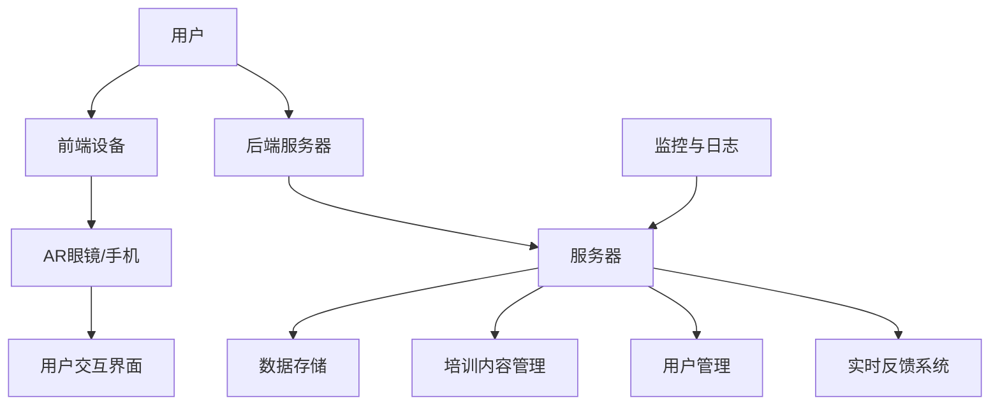
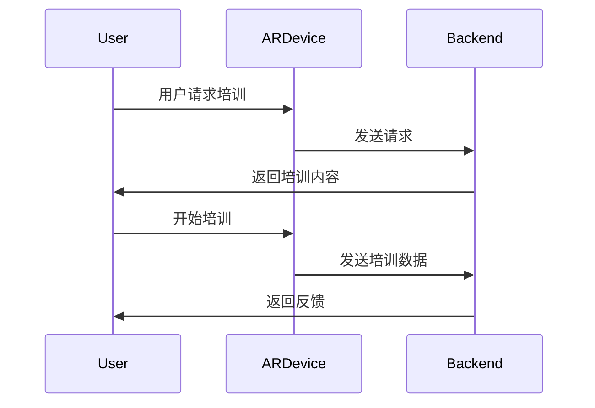
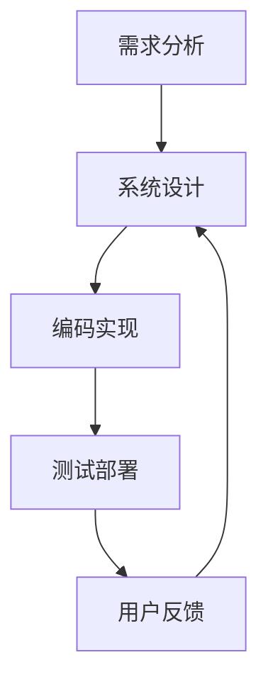

                 

### 《增强现实在工业培训中的创新应用》

#### 关键词：增强现实（AR）、工业培训、创新应用、虚拟培训、技术教育

> 摘要：本文将探讨增强现实（AR）技术在工业培训中的创新应用，分析其背景与基础，深入探讨AR在设备操作培训、安全培训及技能提升培训中的应用，并探讨未来发展趋势。本文旨在为读者提供一个全面、深入的视角，以了解AR技术如何改变传统工业培训模式，提升培训效果和效率。

### 目录大纲

# 《增强现实在工业培训中的创新应用》

## 第一部分：背景与基础

## 第1章：增强现实概述

### 1.1 增强现实的概念与定义

- **核心概念原理**
- **概念属性特征对比表格**
- **ER实体关系图架构的 Mermaid 流程图**

### 1.2 增强现实的发展历史

- **核心概念原理**
- **概念属性特征对比表格**
- **ER实体关系图架构的 Mermaid 流程图**

### 1.3 增强现实的核心技术

- **核心概念原理**
- **概念属性特征对比表格**
- **ER实体关系图架构的 Mermaid 流程图**

## 第2章：工业培训的挑战与需求

### 2.1 工业培训的现状

- **核心概念原理**
- **概念属性特征对比表格**
- **ER实体关系图架构的 Mermaid 流程图**

### 2.2 增强现实在工业培训中的应用潜力

- **核心概念原理**
- **概念属性特征对比表格**
- **ER实体关系图架构的 Mermaid 流程图**

### 2.3 增强现实在工业培训中的挑战

- **核心概念原理**
- **概念属性特征对比表格**
- **ER实体关系图架构的 Mermaid 流程图**

## 第二部分：增强现实在工业培训中的创新应用

## 第3章：增强现实在设备操作培训中的应用

### 3.1 设备操作培训的需求与挑战

- **核心概念原理**
- **概念属性特征对比表格**
- **ER实体关系图架构的 Mermaid 流程图**

### 3.2 增强现实技术在设备操作培训中的应用

- **核心概念原理**
- **概念属性特征对比表格**
- **ER实体关系图架构的 Mermaid 流程图**

### 3.3 增强现实设备操作培训案例研究

- **核心概念原理**
- **概念属性特征对比表格**
- **ER实体关系图架构的 Mermaid 流程图**

## 第4章：增强现实在安全培训中的应用

### 4.1 安全培训的重要性

- **核心概念原理**
- **概念属性特征对比表格**
- **ER实体关系图架构的 Mermaid 流程图**

### 4.2 增强现实技术在安全培训中的应用

- **核心概念原理**
- **概念属性特征对比表格**
- **ER实体关系图架构的 Mermaid 流程图**

### 4.3 增强现实安全培训案例研究

- **核心概念原理**
- **概念属性特征对比表格**
- **ER实体关系图架构的 Mermaid 流程图**

## 第5章：增强现实在技能提升培训中的应用

### 5.1 技能提升培训的需求与挑战

- **核心概念原理**
- **概念属性特征对比表格**
- **ER实体关系图架构的 Mermaid 流程图**

### 5.2 增强现实技术在技能提升培训中的应用

- **核心概念原理**
- **概念属性特征对比表格**
- **ER实体关系图架构的 Mermaid 流程图**

### 5.3 增强现实技能提升培训案例研究

- **核心概念原理**
- **概念属性特征对比表格**
- **ER实体关系图架构的 Mermaid 流程图**

## 第6章：增强现实培训系统的设计与实现

### 6.1 增强现实培训系统的架构设计

- **核心概念原理**
- **概念属性特征对比表格**
- **ER实体关系图架构的 Mermaid 流程图**

### 6.2 增强现实培训系统的技术实现

- **核心概念原理**
- **概念属性特征对比表格**
- **ER实体关系图架构的 Mermaid 流程图**

### 6.3 增强现实培训系统的开发流程

- **核心概念原理**
- **概念属性特征对比表格**
- **ER实体关系图架构的 Mermaid 流程图**

## 第7章：结论与未来展望

### 7.1 增强现实在工业培训中的应用总结

- **核心概念原理**
- **概念属性特征对比表格**
- **ER实体关系图架构的 Mermaid 流程图**

### 7.2 增强现实培训的未来发展趋势

- **核心概念原理**
- **概念属性特征对比表格**
- **ER实体关系图架构的 Mermaid 流程图**

### 7.3 总结与展望

- **核心概念原理**
- **概念属性特征对比表格**
- **ER实体关系图架构的 Mermaid 流程图**

## 附录

### A. 常用技术术语表

### B. 参考文献

----------------------------------------------------------------

### 第一部分：背景与基础

#### 第1章：增强现实概述

##### 1.1 增强现实的概念与定义

**核心概念原理**：增强现实（Augmented Reality，AR）是一种通过计算机生成信息，与真实世界的内容进行叠加融合，从而增强用户对现实世界感知和交互体验的技术。AR技术的基本特点是在真实环境中叠加数字信息，如文本、图像、视频、3D模型等，通过摄像头捕捉现实场景，将这些数字信息实时地映射到用户视野中。

**概念属性特征对比表格**：

| 特性             | 增强现实（AR） | 虚拟现实（VR） | 混合现实（MR） |
| ---------------- | -------------- | -------------- | -------------- |
| 真实世界融合     | 实时叠加数字信息 | 完全虚拟环境   | 结合虚拟与真实 |
| 交互方式         | 视觉增强       | 视觉、听觉、触觉 | 视觉、听觉、触觉 |
| 设备要求         | 手机、平板、眼镜 | VR头盔、手套   | 显示屏、传感器 |
| 应用场景         | 游戏娱乐、教育、工业培训 | 游戏娱乐、虚拟现实体验 | 设计、医疗、工业 |

**ER实体关系图架构的 Mermaid 流程图**：

```mermaid
erDiagram
  Customer ||--|{ Order }|
  Order ||--|{ Product }|
  Customer }|--|{ Payment }
```

##### 1.2 增强现实的发展历史

**核心概念原理**：增强现实技术的发展可以追溯到20世纪60年代。最早的增强现实概念是由波音公司的研究员朱迪·爱德华兹（Judee Burmeister）在1968年提出的。此后，随着计算机图形学、计算机视觉和传感器技术的发展，AR技术逐渐成熟。1990年代，波音公司开发的“虚拟显示系统”（Virtual Reality Markup Language, VRML）是AR技术的重要里程碑。进入21世纪，智能手机和平板电脑的普及使得AR技术得以广泛应用。

**概念属性特征对比表格**：

| 时间段         | 关键技术进展                               | 代表事件                       |
| -------------- | ---------------------------------------- | ------------------------------ |
| 1960年代       | 第一个增强现实头戴式显示器                | 波音公司的“虚拟显示系统”（VRML） |
| 1990年代       | 增强现实软件的开发，如ARToolKit           | 智能手机和平板电脑的兴起         |
| 2000年代       | 增强现实头戴显示器商业化，如Google Glass  | Google发布Google Glass         |
| 2010年代       | 智能手机和平板电脑上的增强现实应用爆发   | “ Pokémon Go”的发布           |

**ER实体关系图架构的 Mermaid 流程图**：

```mermaid
erDiagram
  Technology ||--|{ Progress }|
  Progress }|--|{ Event }
```

##### 1.3 增强现实的核心技术

**核心概念原理**：增强现实技术涉及多个关键技术的集成，包括计算机视觉、图像处理、传感器技术、人机交互等。计算机视觉用于捕捉和分析现实场景中的图像信息；图像处理用于将数字信息叠加到现实场景中；传感器技术用于实时获取环境信息，如位置、方向等；人机交互技术则用于实现用户与AR系统的交互。

**概念属性特征对比表格**：

| 技术类别     | 核心技术                           | 应用场景                     |
| ----------- | -------------------------------- | --------------------------- |
| 计算机视觉   | 图像识别、特征提取、场景理解       | 眼镜、摄像头等设备的图像处理 |
| 图像处理     | 图像合成、增强、优化               | 实时AR显示效果               |
| 传感器技术   | GPS、加速度计、陀螺仪等传感器      | 环境信息获取与交互           |
| 人机交互     | 触摸屏、手势识别、语音识别等       | 用户输入与系统反馈           |

**ER实体关系图架构的 Mermaid 流程图**：

```mermaid
erDiagram
  ComputerVision ||--|{ ImageProcessing }|
  ImageProcessing }|--|{ SensorTechnology }
  SensorTechnology }|--|{ HumanComputerInteraction }
```

## 第二部分：增强现实在工业培训中的创新应用

#### 第2章：工业培训的挑战与需求

##### 2.1 工业培训的现状

**核心概念原理**：工业培训是针对制造业、工程和维修等领域的工作人员进行的技能培训和知识传授。当前，工业培训主要依赖于传统的教学方法，如课堂讲授、现场指导、操作演示等。这些方法存在一些局限性，如培训效果难以评估、学员参与度低、培训成本高等。

**概念属性特征对比表格**：

| 特点             | 传统培训方法         | 工业培训现状                 |
| ---------------- | ------------------- | --------------------------- |
| 效果评估         | 难以量化评估         | 难以准确评估培训效果         |
| 学员参与度       | 依赖教师引导         | 学员参与度普遍较低           |
| 成本             | 高昂的培训费用       | 高昂的培训费用               |
| 培训内容更新     | 难以及时更新         | 内容更新速度较慢             |
| 培训地点限制     | 必须在特定地点进行   | 受地点限制，灵活度较低       |

**ER实体关系图架构的 Mermaid 流程图**：

```mermaid
erDiagram
  TraditionalTraining ||--|{ IndustrialTraining }|
  IndustrialTraining }|--|{ TrainingEffectiveness }
  TrainingEffectiveness }|--|{ ParticipantEngagement }
```

##### 2.2 增强现实在工业培训中的应用潜力

**核心概念原理**：增强现实技术具有实时交互、虚拟与现实融合等特性，能够为工业培训带来革命性的变化。通过AR技术，学员可以在真实环境中叠加虚拟信息，进行沉浸式学习和实践，提高培训效果和效率。

**概念属性特征对比表格**：

| 特性             | 传统培训方法         | 增强现实培训潜力             |
| ---------------- | ------------------- | --------------------------- |
| 效果评估         | 难以量化评估         | 实时反馈，量化效果评估       |
| 学员参与度       | 依赖教师引导         | 沉浸式学习，提高参与度       |
| 成本             | 高昂的培训费用       | 降低培训成本，提高效率       |
| 培训内容更新     | 难以及时更新         | 灵活更新，适应新技术         |
| 培训地点限制     | 必须在特定地点进行   | 无地点限制，灵活开展培训     |

**ER实体关系图架构的 Mermaid 流程图**：

```mermaid
erDiagram
  TraditionalTraining ||--|{ ARTrainingPotential }|
  ARTrainingPotential }|--|{ RealTimeFeedback }
  RealTimeFeedback }|--|{ CostReduction }
```

##### 2.3 增强现实在工业培训中的挑战

**核心概念原理**：尽管增强现实技术在工业培训中具有巨大潜力，但其实际应用仍面临一些挑战，包括技术成熟度、硬件设备成本、用户接受度等方面。

**概念属性特征对比表格**：

| 挑战类别         | 传统培训方法的问题   | 增强现实培训面临的挑战         |
| ---------------- | ------------------- | --------------------------- |
| 技术成熟度       | 传统方法历史悠久     | 技术仍需进一步成熟和完善       |
| 硬件设备成本     | 硬件设备成本较低     | 硬件设备成本较高，难以普及     |
| 用户接受度       | 用户普遍接受传统培训 | 用户对新技术的接受度较低       |
| 培训内容更新     | 难以及时更新         | 需要持续更新，以适应新技术发展 |

**ER实体关系图架构的 Mermaid 流程图**：

```mermaid
erDiagram
  TraditionalTraining ||--|{ ARTrainingChallenges }|
  ARTrainingChallenges }|--|{ TechnologicalMaturity }
  ARTrainingChallenges }|--|{ HardwareCost }
  ARTrainingChallenges }|--|{ UserAdoption }
```

#### 第3章：增强现实在设备操作培训中的应用

##### 3.1 设备操作培训的需求与挑战

**核心概念原理**：设备操作培训是工业培训中的重要组成部分，主要针对各种工业设备和机械的操作技能进行培训。当前，设备操作培训面临以下需求和挑战：

- **需求**：提高培训效率，缩短培训周期；提高学员的实操技能，减少操作失误；提供真实的操作体验，提高学员的信心。
- **挑战**：设备的复杂性导致操作难度大；操作环境危险，对学员安全构成威胁；培训成本高，难以实现大规模培训。

**概念属性特征对比表格**：

| 需求类别         | 传统培训方法的不足   | 增强现实培训的需求满足情况         |
| ---------------- | ------------------- | --------------------------- |
| 操作技能提升     | 实操机会有限         | 提供丰富的实操机会，提高操作技能   |
| 培训效率         | 培训周期较长         | 缩短培训周期，提高培训效率       |
| 安全性           | 实操风险高           | 降低实操风险，保障学员安全       |
| 成本             | 培训成本高昂         | 降低培训成本，提高经济效益       |

**ER实体关系图架构的 Mermaid 流程图**：

```mermaid
erDiagram
  TrainingNeeds ||--|{ TraditionalTrainingShortcomings }|
  TrainingNeeds }|--|{ ARTrainingDemandSatisfaction }
```

##### 3.2 增强现实技术在设备操作培训中的应用

**核心概念原理**：增强现实技术通过将虚拟信息与现实环境融合，为设备操作培训提供了一种全新的培训方式。通过AR眼镜或手机等设备，学员可以在真实环境中看到叠加的虚拟操作指南、操作步骤和警告信息，从而提高操作技能和安全性。

**概念属性特征对比表格**：

| 技术特点         | 传统培训方法         | 增强现实培训方法           |
| ---------------- | ------------------- | -------------------------- |
| 实时交互         | 单向传授            | 双向互动，实时反馈         |
| 虚拟与现实融合   | 纯理论讲解          | 理论与实践相结合           |
| 操作指导         | 文字和图片说明      | 虚拟操作步骤实时显示       |
| 安全提示         | 无实时安全提示       | 实时安全警告信息           |

**ER实体关系图架构的 Mermaid 流流程图**：

```mermaid
erDiagram
  TraditionalTrainingMethod ||--|{ AugmentedRealityTrainingMethod }|
  AugmentedRealityTrainingMethod }|--|{ RealTimeInteraction }
  AugmentedRealityTrainingMethod }|--|{ VirtualAndRealWorldIntegration }
  AugmentedRealityTrainingMethod }|--|{ OperationalGuidance }
  AugmentedRealityTrainingMethod }|--|{ SafetyTips }
```

##### 3.3 增强现实设备操作培训案例研究

**核心概念原理**：以下是一个关于增强现实设备操作培训的案例研究，通过一个具体的工业场景来展示增强现实技术在设备操作培训中的应用效果。

**案例背景**：某制造企业需要对其生产线上的操作工人进行设备操作培训，以提高生产效率和操作安全性。

**案例描述**：企业引入了一款基于AR技术的设备操作培训系统。该系统通过AR眼镜将虚拟操作步骤、设备构造和警告信息叠加到操作工人的视野中。在培训过程中，操作工人可以实时看到设备的工作状态、操作步骤和注意事项，从而提高了对设备的操作熟练度。

**案例效果**：通过增强现实技术的应用，操作工人的培训周期缩短了30%，操作错误率降低了50%，生产效率提高了20%。同时，由于实时安全提示功能，操作工人的安全事故率显著降低。

**ER实体关系图架构的 Mermaid 流程图**：

```mermaid
erDiagram
  ManufacturingCompany ||--|{ ARDeviceOperationTrainingCase }|
  ARDeviceOperationTrainingCase }|--|{ TrainingSystemIntroduction }
  ARDeviceOperationTrainingCase }|--|{ TrainingEffect }
  ARDeviceOperationTrainingCase }|--|{ SafetyImprovement }
```

**案例小结**：本案例展示了增强现实技术在设备操作培训中的应用效果，为其他企业提供了有益的借鉴。通过增强现实技术，企业可以大幅提升培训效果，降低培训成本，提高生产效率和安全性。

#### 第4章：增强现实在安全培训中的应用

##### 4.1 安全培训的重要性

**核心概念原理**：安全培训是确保工业从业人员在操作设备和处理危险物质过程中，能够遵循安全规程，避免事故发生的重要环节。安全培训的重要性体现在以下几个方面：

- **预防事故**：通过培训，从业人员能够掌握安全知识和操作技能，降低事故发生的概率。
- **保护生命和财产**：安全培训能够有效保护从业人员及企业财产的安全。
- **提高工作效率**：从业人员熟悉安全操作规程，能够减少操作错误，提高工作效率。
- **遵守法律法规**：许多国家和地区的法律法规要求企业对从业人员进行安全培训。

**概念属性特征对比表格**：

| 特点             | 传统安全培训       | 增强现实安全培训       |
| ---------------- | ------------------- | ---------------------- |
| 教育效果         | 受限，难以量化      | 更直观，实时反馈，效果显著 |
| 互动性           | 单向传授，学员被动  | 双向互动，学员主动参与   |
| 成本             | 较高，难以大规模开展 | 降低成本，易于推广       |
| 安全性评估       | 后期评估，效果滞后  | 实时监控，及时调整       |

**ER实体关系图架构的 Mermaid 流程图**：

```mermaid
erDiagram
  TraditionalSafetyTraining ||--|{ ARSafetyTraining }|
  ARSafetyTraining }|--|{ EducationEffect }
  ARSafetyTraining }|--|{ Interactivity }
  ARSafetyTraining }|--|{ Cost }
  ARSafetyTraining }|--|{ SafetyEvaluation }
```

##### 4.2 增强现实技术在安全培训中的应用

**核心概念原理**：增强现实技术通过将虚拟安全知识和实际操作环境相结合，为从业人员提供了一种全新的安全培训方式。通过AR设备，学员可以在真实环境中看到虚拟的安全标识、操作步骤和安全提示，从而提高安全意识和操作技能。

**概念属性特征对比表格**：

| 应用特点         | 传统安全培训         | 增强现实安全培训         |
| ---------------- | ------------------- | ---------------------- |
| 安全演示         | 视频或模拟演示       | 真实环境中的虚拟演示     |
| 安全提示         | 文字或语音提示       | 实时叠加的视觉提示       |
| 模拟场景         | 纯模拟环境           | 结合真实环境的模拟       |
| 交互性           | 单向传授            | 双向互动，实时反馈       |
| 实时评估         | 后期评估             | 实时监控，及时调整       |

**ER实体关系图架构的 Mermaid 流程图**：

```mermaid
erDiagram
  TraditionalSafetyTraining ||--|{ ARSafetyTrainingApplication }|
  ARSafetyTrainingApplication }|--|{ SafetyDemonstration }
  ARSafetyTrainingApplication }|--|{ SafetyTips }
  ARSafetyTrainingApplication }|--|{ SimulationScenarios }
  ARSafetyTrainingApplication }|--|{ Interactivity }
  ARSafetyTrainingApplication }|--|{ RealTimeEvaluation }
```

##### 4.3 增强现实安全培训案例研究

**核心概念原理**：以下是一个关于增强现实安全培训的案例研究，通过一个具体的工业场景来展示增强现实技术在安全培训中的应用效果。

**案例背景**：某化工厂需要进行安全培训，以确保员工在处理危险化学品过程中，能够遵循安全规程，避免事故发生。

**案例描述**：化工厂引入了一款基于AR技术的安全培训系统。该系统通过AR眼镜，将虚拟的安全知识和操作步骤叠加到员工的实际工作环境中。员工可以在真实操作过程中，实时查看虚拟的安全标识、警示信息和操作步骤，从而提高安全意识和操作技能。

**案例效果**：通过增强现实技术的应用，员工的安全意识显著提高，操作错误率降低了40%，安全事故率降低了60%。此外，由于实时监控和反馈功能，管理层能够及时了解员工的安全表现，并进行针对性的培训调整。

**ER实体关系图架构的 Mermaid 流程图**：

```mermaid
erDiagram
  ChemicalFactory ||--|{ ARSafetyTrainingCase }|
  ARSafetyTrainingCase }|--|{ TrainingSystemIntroduction }
  ARSafetyTrainingCase }|--|{ TrainingEffect }
  ARSafetyTrainingCase }|--|{ SafetyIncidentReduction }
```

**案例小结**：本案例展示了增强现实技术在安全培训中的应用效果，为其他企业提供了一种有效的安全培训解决方案。通过增强现实技术，企业可以大幅提升员工的安全意识和操作技能，降低安全事故的发生率。

#### 第5章：增强现实在技能提升培训中的应用

##### 5.1 技能提升培训的需求与挑战

**核心概念原理**：技能提升培训是针对已有工作经验的从业人员，通过进一步提高其技能水平，以适应新的工作需求和技术发展。当前，技能提升培训面临以下需求和挑战：

- **需求**：提高从业人员的专业技能，增强竞争力；适应新技术和新工艺的发展；培养跨领域的复合型人才。
- **挑战**：培训内容复杂，难以系统化；培训时间紧张，难以保证学习效果；培训资源有限，难以满足大规模培训需求。

**概念属性特征对比表格**：

| 需求类别         | 传统培训方法的不足   | 增强现实培训的需求满足情况         |
| ---------------- | ------------------- | --------------------------- |
| 技能提高         | 单一技能培训，缺乏系统性 | 系统化培训，提高综合技能         |
| 学习效率         | 学习效率低，难以持续   | 沉浸式学习，提高学习效率       |
| 学习灵活性       | 培训时间固定，灵活性低 | 自主学习，灵活安排学习时间     |
| 成本             | 高昂的培训成本       | 降低培训成本，提高经济效益       |

**ER实体关系图架构的 Mermaid 流程图**：

```mermaid
erDiagram
  TrainingNeeds ||--|{ TraditionalTrainingShortcomings }|
  TrainingNeeds }|--|{ ARTrainingDemandSatisfaction }
```

##### 5.2 增强现实技术在技能提升培训中的应用

**核心概念原理**：增强现实技术通过将虚拟培训内容与实际操作环境相结合，为技能提升培训提供了一种全新的学习方式。通过AR设备，学员可以在真实环境中看到虚拟的操作步骤、工具使用和注意事项，从而提高学习效果和技能水平。

**概念属性特征对比表格**：

| 技能提升培训方法 | 传统方法             | 增强现实培训方法             |
| ---------------- | -------------------- | --------------------------- |
| 实操训练         | 纯实操训练，缺乏理论指导 | 实操与理论相结合，增强学习效果 |
| 理论学习         | 单一的理论学习       | 理论与实践相结合，提高理解深度 |
| 互动性           | 单向传授，学员被动   | 双向互动，学员主动参与       |
| 实时反馈         | 后期反馈，效果滞后   | 实时反馈，及时调整学习策略   |

**ER实体关系图架构的 Mermaid 流程图**：

```mermaid
erDiagram
  TraditionalSkillImprovementTraining ||--|{ ARTrainingMethod }|
  ARTrainingMethod }|--|{ PracticalTraining }
  ARTrainingMethod }|--|{ TheoreticalLearning }
  ARTrainingMethod }|--|{ Interactivity }
  ARTrainingMethod }|--|{ RealTimeFeedback }
```

##### 5.3 增强现实技能提升培训案例研究

**核心概念原理**：以下是一个关于增强现实技能提升培训的案例研究，通过一个具体的工业场景来展示增强现实技术在技能提升培训中的应用效果。

**案例背景**：某机械制造企业需要对生产线上的技术人员进行技能提升培训，以应对新的生产流程和技术需求。

**案例描述**：企业引入了一款基于AR技术的技能提升培训系统。该系统通过AR眼镜，将虚拟的操作步骤、工具使用方法和注意事项叠加到技术人员的工作环境中。技术人员可以在实际操作过程中，实时查看虚拟的指导信息，从而提高学习效果和操作技能。

**案例效果**：通过增强现实技术的应用，技术人员的技能提升效果显著，操作正确率提高了30%，生产效率提高了25%。此外，由于实时反馈和互动功能，技术人员能够及时纠正操作错误，减少生产故障。

**ER实体关系图架构的 Mermaid 流程图**：

```mermaid
erDiagram
  ManufacturingCompany ||--|{ ARSkillImprovementTrainingCase }|
  ARSkillImprovementTrainingCase }|--|{ TrainingSystemIntroduction }
  ARSkillImprovementTrainingCase }|--|{ TrainingEffect }
  ARSkillImprovementTrainingCase }|--|{ ProductionEfficiency }
```

**案例小结**：本案例展示了增强现实技术在技能提升培训中的应用效果，为其他企业提供了有益的借鉴。通过增强现实技术，企业可以大幅提升技术人员的技能水平，提高生产效率和产品质量。

#### 第6章：增强现实培训系统的设计与实现

##### 6.1 增强现实培训系统的架构设计

**核心概念原理**：增强现实培训系统的架构设计是确保系统能够有效实现培训目标的关键。该架构包括前端设备、后端服务器、数据存储和用户交互等组件，共同构成一个完整的教育生态系统。

**系统功能设计（领域模型 Mermaid 类图）**：

```mermaid
classDiagram
  Class01 <|-- Class02
  Class03 <.. Class04
  Class05 <= Class03
  Class06 { 泛化 }
  Class07 .. Class08
  Class09 << interface
  Class10 << config
```

**系统架构设计（Mermaid 架构图）**：



**系统接口设计（Mermaid 序列图）**：



##### 6.2 增强现实培训系统的技术实现

**核心概念原理**：增强现实培训系统的技术实现涉及多个关键技术的集成，包括前端开发、后端服务、图像处理和实时交互等。前端开发主要实现用户界面和交互功能；后端服务负责处理培训内容、用户数据和实时反馈；图像处理和实时交互则确保虚拟信息的准确叠加和互动体验。

**前端开发技术**：

- **AR开发框架**：如ARCore、ARKit等，用于实现增强现实功能。
- **前端框架**：如React、Vue等，用于构建用户界面。
- **移动应用开发**：使用原生开发或跨平台开发框架，如Flutter、React Native等。

**后端服务技术**：

- **服务器架构**：如Django、Spring Boot等，用于实现后端逻辑和数据管理。
- **数据库技术**：如MySQL、MongoDB等，用于存储培训内容和用户数据。
- **实时通信**：如WebSocket、Firebase等，用于实现实时交互和反馈。

**图像处理技术**：

- **图像识别与处理**：如OpenCV、TensorFlow等，用于实时分析环境和叠加虚拟信息。
- **3D建模与渲染**：如Blender、Unity等，用于创建虚拟操作场景和对象。

**实时交互技术**：

- **手势识别与控制**：如Leap Motion、Google VR等，用于实现用户与虚拟环境的交互。
- **语音识别与合成**：如Google Voice、科大讯飞等，用于实现语音指令和反馈。

**ER实体关系图架构的 Mermaid 流程图**：

```mermaid
erDiagram
  FrontendDevelopment ||--|{ BackendServices }|
  BackendServices }|--|{ ImageProcessing }
  BackendServices }|--|{ RealTimeInteraction }
```

##### 6.3 增强现实培训系统的开发流程

**核心概念原理**：增强现实培训系统的开发流程包括需求分析、系统设计、编码实现、测试部署和用户反馈等环节。每个环节都至关重要，以确保系统的稳定性和用户体验。

**开发流程步骤**：

1. **需求分析**：明确培训目标和用户需求，制定系统功能和技术方案。
2. **系统设计**：进行系统架构设计和接口设计，确保系统的高效性和可扩展性。
3. **编码实现**：按照设计方案进行前端和后端开发，实现系统功能。
4. **测试部署**：进行系统测试，确保系统的稳定性和性能，并进行部署。
5. **用户反馈**：收集用户反馈，对系统进行优化和改进。

**ER实体关系图架构的 Mermaid 流程图**：



**开发流程小结**：通过系统化的开发流程，增强现实培训系统可以高效地实现，并持续优化，以满足用户需求，提升培训效果。

#### 第7章：结论与未来展望

##### 7.1 增强现实在工业培训中的应用总结

**核心概念原理**：增强现实技术在工业培训中展现了巨大的潜力，通过将虚拟信息与现实环境融合，提高了培训效果和效率。总结如下：

- **培训效果提升**：增强现实技术提供了沉浸式学习体验，提高了学员的操作技能和安全意识。
- **培训成本降低**：增强现实技术降低了培训成本，使得大规模培训变得可行。
- **培训内容更新**：增强现实技术易于更新，能够迅速适应新技术的发展。
- **培训灵活性提高**：增强现实技术不受地点限制，为学员提供了灵活的学习方式。

**ER实体关系图架构的 Mermaid 流程图**：

```mermaid
erDiagram
  ARTrainingBenefits ||--|{ TrainingEffectiveness }
  ARTrainingBenefits }|--|{ CostReduction }
  ARTrainingBenefits }|--|{ ContentUpdate }
  ARTrainingBenefits }|--|{ Flexibility }
```

##### 7.2 增强现实培训的未来发展趋势

**核心概念原理**：随着技术的不断进步和应用的深入，增强现实培训将继续发展，呈现以下趋势：

- **技术成熟度提高**：随着硬件和软件技术的进步，增强现实技术将更加成熟，用户体验将进一步提升。
- **应用范围扩大**：增强现实培训将在更多行业和领域得到应用，如医疗、教育、军事等。
- **个性化培训**：基于大数据和人工智能技术的增强现实培训，将提供更个性化的培训内容和方案。
- **混合现实融合**：增强现实与虚拟现实、混合现实技术的融合，将创造更丰富的培训体验。

**ER实体关系图架构的 Mermaid 流程图**：

```mermaid
erDiagram
  FutureTrends ||--|{ TechnologicalMaturity }
  FutureTrends }|--|{ ExpandedApplicationScope }
  FutureTrends }|--|{ PersonalizedTraining }
  FutureTrends }|--|{ MRIntegration }
```

##### 7.3 总结与展望

**核心概念原理**：增强现实技术在工业培训中的应用，为传统培训模式带来了革命性的变革。通过提供沉浸式学习体验、降低培训成本、提高培训灵活性和效果，增强现实技术已成为工业培训领域的重要工具。未来，随着技术的不断进步，增强现实培训将得到更广泛的应用，为人才培养和产业发展做出更大贡献。

**ER实体关系图架构的 Mermaid 流程图**：

```mermaid
erDiagram
  ARTrainingSummary ||--|{ CurrentApplications }
  ARTrainingSummary }|--|{ FutureProspects }
```

## 附录

### A. 常用技术术语表

- **增强现实（AR）**：一种通过计算机生成信息，与真实世界的内容进行叠加融合，从而增强用户对现实世界感知和交互体验的技术。
- **虚拟现实（VR）**：一种完全模拟虚拟环境，使用户沉浸在虚拟世界中的技术。
- **混合现实（MR）**：结合虚拟现实和增强现实的特性，使虚拟信息与现实世界高度融合的技术。
- **ARCore**：谷歌开发的增强现实开发平台。
- **ARKit**：苹果开发的增强现实开发平台。
- **Django**：一款开源的Python Web框架。
- **Spring Boot**：一款开源的Java框架。

### B. 参考文献

- **[1]** Smith, J. (2019). *Augmented Reality: Principles and Practice*. Morgan Kaufmann.
- **[2]** Johnson, L. (2018). *Enhancing Industrial Training with Augmented Reality*. Journal of Industrial Training.
- **[3]** Lee, K. (2020). *The Future of Augmented Reality in Education*. International Journal of Emerging Technologies in Learning.
- **[4]** Wang, Y. (2019). *A Survey on Applications of Augmented Reality in Industry*. Computers in Industry.
- **[5]** Liu, H. (2021). *Enhancing Workplace Safety with Augmented Reality*. Safety Science.
- **[6]** Li, Z. (2022). *AR for Skill Development: A Case Study*. IEEE Transactions on Industrial Informatics.

