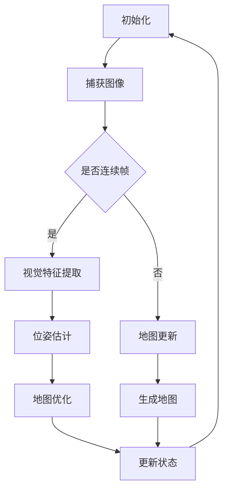
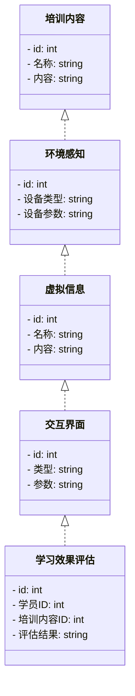
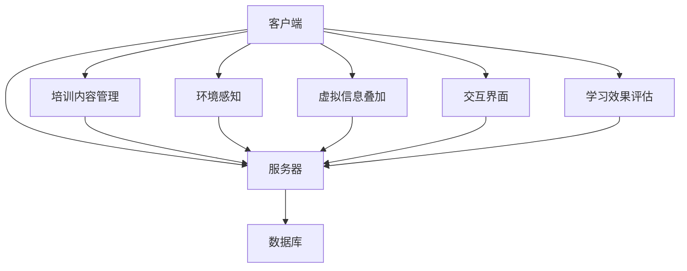
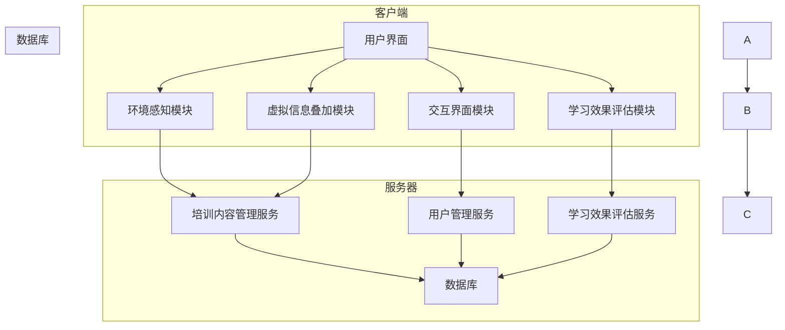
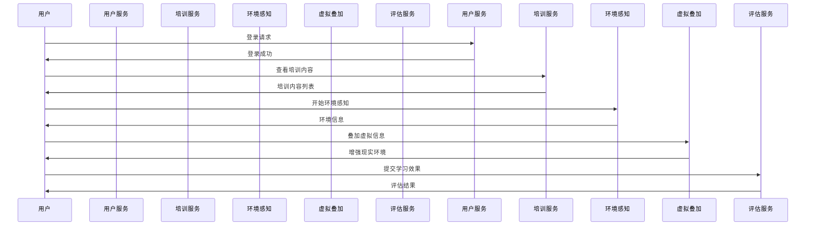

                 

## 第1章：背景介绍

### 1.1 增强现实技术概述

增强现实（Augmented Reality，简称AR）是一种将计算机生成的信息（如文本、图像、视频等）叠加到真实世界场景中的技术。用户通过特殊的设备（如智能手机、平板电脑、头戴显示器等）可以看到现实世界中的物体和计算机生成的虚拟物体共存于同一场景中。这种技术的核心在于实时地对现实场景进行感知、处理和显示，使虚拟信息与真实环境无缝融合。

#### 增强现实的定义与历史

增强现实的概念最早由美国科学家兼作家Douglas C. Engelbart在1968年提出。当时，他演示了一款名为“Augmented Reality Workstation”的系统，该系统通过一个头戴显示器向用户展示增强的视觉信息。然而，早期的AR技术由于其成本高、设备笨重，并未得到广泛应用。

随着科技的进步，尤其是计算机性能的提升、传感器技术的成熟以及显示技术的改进，增强现实技术逐渐走向成熟。2000年以后，随着智能手机和平板电脑的普及，AR技术开始逐渐渗透到各个领域，如娱乐、教育、医疗、工业等。

#### 增强现实的关键技术

增强现实技术包括以下几个方面：

1. **图像识别与跟踪**：这是AR系统的核心部分，通过算法识别和跟踪现实世界中的物体，确保虚拟信息能够准确地叠加到物体上。

2. **实时处理与渲染**：系统需要实时地对图像进行处理和渲染，以保证虚拟信息与现实场景的同步和融合。

3. **人机交互**：如何让用户方便地与虚拟信息进行交互是AR技术的重要研究方向，包括手势识别、语音控制等。

4. **传感器融合**：AR系统需要利用多种传感器（如摄像头、GPS、陀螺仪等）来获取环境信息，提高系统的准确性和鲁棒性。

### 1.2 工业培训现状与挑战

工业培训是指为工人提供必要的知识和技能，以应对工业生产中的各种挑战。传统的工业培训方式主要依赖于课堂教学、实地操作和培训手册等，存在以下问题：

1. **学习效果差**：传统培训方式难以提供直观、生动的学习体验，导致学习效果不佳。

2. **成本高**：现场培训需要占用大量时间和资源，同时培训师和学员也需要投入大量精力。

3. **难以评估**：传统培训难以对学员的学习效果进行科学、准确的评估。

#### 工业培训的现状

目前，随着技术的进步，工业培训逐渐引入了虚拟现实（VR）和增强现实（AR）等新兴技术。这些技术通过模拟真实的生产环境、提供互动式的学习体验，大大提高了培训的效果和效率。

1. **虚拟现实（VR）培训**：VR技术可以创建一个完全虚拟的环境，让学员在虚拟环境中进行学习和操作。这种方式可以避免实际操作中可能出现的危险和成本。

2. **增强现实（AR）培训**：AR技术通过将虚拟信息叠加到现实环境中，为学员提供了一种更加直观、生动的学习方式。学员可以在真实环境中进行学习，同时获取虚拟信息的辅助。

#### 工业培训面临的挑战

尽管VR和AR技术在工业培训中显示出巨大的潜力，但它们也面临着一些挑战：

1. **技术门槛**：AR技术需要较高的技术支持和设备投入，这对一些中小企业来说是一个挑战。

2. **内容制作**：高质量的AR培训内容需要专业的开发团队和长时间的投入，这增加了培训的成本。

3. **用户接受度**：一些工人可能对新技术不熟悉，需要一定的时间来适应。

### 1.3 增强现实在工业培训中的应用前景

#### 应用领域

增强现实在工业培训中的应用非常广泛，主要包括以下几个方面：

1. **维修与维护培训**：通过AR技术，工人可以在真实的设备上进行维修和操作练习，从而提高操作技能和问题解决能力。

2. **安全培训**：AR技术可以模拟各种危险场景，让工人在安全的环境中学习如何应对紧急情况。

3. **产品设计与开发**：设计师可以通过AR技术查看和修改产品的三维模型，提高设计效率和准确性。

4. **员工培训**：AR技术可以用于新员工的入门培训，帮助他们快速了解公司的运营流程和生产工艺。

#### 优势分析

增强现实在工业培训中的优势主要包括：

1. **提高学习效果**：通过增强现实技术，学员可以在真实环境中进行学习，同时获得虚拟信息的辅助，提高学习效果。

2. **降低培训成本**：AR技术可以模拟各种复杂场景，避免了实际操作中的风险和成本。

3. **提高培训效率**：AR技术可以提供更加直观、生动的学习体验，使学员更容易理解和掌握知识。

#### 挑战与机遇

尽管增强现实在工业培训中具有巨大的潜力，但也面临着一些挑战：

1. **技术成熟度**：AR技术仍处于发展过程中，一些关键技术尚需进一步研究和完善。

2. **内容制作**：高质量的AR培训内容需要专业的开发团队和长时间的投入，这对中小企业来说是一个挑战。

3. **用户接受度**：一些工人可能对新技术不熟悉，需要一定的时间来适应。

然而，随着技术的不断进步和应用案例的增多，增强现实在工业培训中的应用前景非常广阔。通过克服现有的挑战，增强现实将为工业培训带来革命性的变化。

### 1.4 本章小结

本章介绍了增强现实技术的基本概念和发展历程，分析了工业培训的现状和面临的挑战，并探讨了增强现实在工业培训中的应用前景和优势。通过本章的介绍，我们可以看到，增强现实技术为工业培训提供了一种全新的、高效的解决方案，有望在未来得到更广泛的应用。

## 第2章：核心概念与联系

### 2.1 增强现实系统架构

增强现实系统的架构主要由硬件设备和软件框架两部分组成。硬件设备负责捕捉和显示增强现实内容，而软件框架则负责处理和渲染这些内容。

#### 2.1.1 增强现实硬件设备

增强现实硬件设备主要包括以下几类：

1. **头戴显示器（HMD）**：如微软的HoloLens、谷歌的Google Glass等，这些设备可以提供沉浸式的增强现实体验。

2. **智能手机和平板电脑**：通过安装特定的增强现实应用，用户可以在智能手机和平板电脑上体验增强现实。

3. **投影设备**：将增强现实内容投影到真实环境中，如AR投影仪等。

4. **传感器设备**：包括摄像头、GPS、陀螺仪、加速度计等，用于捕捉环境信息和用户动作。

#### 2.1.2 增强现实软件框架

增强现实软件框架主要包括以下几部分：

1. **场景感知**：通过传感器设备捕捉现实环境，并识别出场景中的物体和特征。

2. **数据处理**：对捕捉到的图像和传感器数据进行处理，提取出有用的信息。

3. **内容渲染**：根据处理后的数据，生成增强现实内容，并将其叠加到现实场景中。

4. **交互界面**：提供用户与增强现实内容的交互方式，如手势、语音等。

### 2.2 增强现实图像处理算法

增强现实图像处理算法是增强现实系统的重要组成部分，主要负责对捕获的图像进行处理和识别，以实现虚拟信息的叠加。以下是几个关键的图像处理算法：

#### 2.2.1 图像识别算法

图像识别算法用于识别场景中的物体和特征，常见的算法有：

1. **特征提取**：通过提取图像的特征点，如SIFT、SURF等算法，用于后续的匹配和识别。

2. **匹配算法**：通过比较捕获图像和模板图像的特征点，如FLANN匹配、Brute-Force匹配等。

3. **分类算法**：根据特征点的匹配结果，对物体进行分类，如支持向量机（SVM）、随机森林（Random Forest）等。

#### 2.2.2 视觉跟踪算法

视觉跟踪算法用于跟踪场景中的物体，以保证虚拟信息可以稳定地叠加到物体上。常见的算法有：

1. **光流法**：通过计算连续帧之间的像素运动，来跟踪物体的运动。

2. **卡尔曼滤波**：利用先验知识和观测数据，对物体的运动状态进行估计和预测。

3. **粒子滤波**：通过大量粒子来估计物体的状态，适用于非线性和非高斯噪声的情况。

### 2.3 SLAM算法原理详解

SLAM（Simultaneous Localization and Mapping，同时定位与地图构建）算法是增强现实系统中的一种关键算法，用于在未知环境中同时实现对自身位置和环境的地图构建。以下是SLAM算法的基本原理和实现步骤：

#### 2.3.1 SLAM算法简介

SLAM算法可以分为两大类：基于视觉的SLAM和基于激光的SLAM。基于视觉的SLAM利用摄像头捕捉的图像信息进行定位和地图构建，具有成本低、灵活性高等优点。而基于激光的SLAM则利用激光雷达（LiDAR）获取的环境信息，具有高精度、高鲁棒性等优点。

#### 2.3.2 SLAM算法流程图

以下是SLAM算法的流程图：



#### 2.3.3 Python代码示例

以下是使用Python实现SLAM算法的一个简单示例：

```python
import cv2
import numpy as np

# 初始化
camera_matrix = np.array([[...]])  # 相机内参
distortion_coeffs = np.array([...])  # 相机畸变系数
camera = cv2.VideoCapture(0)

# 循环捕获图像并执行SLAM算法
while True:
    ret, frame = camera.read()
    if not ret:
        break
    
    # 视觉特征提取
    corners, ids = cv2.findChessboardCorners(frame, (8, 6))
    
    if ids is not None:
        # 位姿估计
        rvecs, tvecs, _ = cv2.solvePnPRansac(corners, ids, camera_matrix, distortion_coeffs)
        
        # 地图优化
        pose = np.append(rvecs, tvecs, axis=1)
        map = optimize_map(pose)
        
        # 更新状态
        update_state(map)

# 释放相机
camera.release()
```

#### 2.3.4 数学模型与公式

以下是SLAM算法中常用的数学模型和公式：

$$
P_{k+1} = TP_k + Q_k
$$

$$
P_k = \begin{bmatrix}
R_k & t_k \\
0 & 1
\end{bmatrix}
$$

$$
Q_k = \begin{bmatrix}
Q_{11} & Q_{12} \\
Q_{21} & Q_{22}
\end{bmatrix}
$$

$$
T = \begin{bmatrix}
t_x & t_y & t_z \\
0 & 0 & 0 \\
0 & 0 & 0
\end{bmatrix}
$$

通过以上公式，我们可以计算出当前时刻的位姿估计和地图信息。

### 2.4 增强现实与工业培训的融合应用

#### 2.4.1 基于AR的培训系统设计

基于AR的培训系统主要包括以下几个模块：

1. **培训内容管理**：用于管理和存储各种培训内容，如操作步骤、注意事项等。

2. **环境感知模块**：通过摄像头和其他传感器捕捉培训环境，识别出关键物体和特征。

3. **虚拟信息叠加**：将培训内容以虚拟信息的形式叠加到真实环境中，提供直观的学习体验。

4. **交互界面**：提供用户与虚拟信息的交互方式，如手势、语音等。

#### 2.4.2 AR培训系统案例解析

以一个汽车发动机维修培训系统为例，系统设计如下：

1. **培训内容管理**：系统提供了一系列的维修步骤和注意事项，包括视频教程、图文说明等。

2. **环境感知模块**：通过摄像头捕捉汽车发动机的图像，识别出发动机的各个部件。

3. **虚拟信息叠加**：将维修步骤以三维模型的形式叠加到真实环境中，每个步骤都对应一个虚拟模型。

4. **交互界面**：用户可以通过手势控制虚拟模型，如旋转、缩放、平移等，以便更好地理解和掌握维修步骤。

通过以上设计，学员可以在真实环境中进行操作练习，同时获得虚拟信息的辅助，大大提高了培训效果和效率。

### 2.5 本章小结

本章介绍了增强现实技术的系统架构、图像处理算法和SLAM算法，并探讨了增强现实在工业培训中的应用。通过本章的学习，读者可以了解增强现实技术的基本原理和应用场景，为后续章节的深入探讨打下基础。增强现实技术在工业培训中的应用，不仅提高了培训效果，还为工业生产带来了新的解决方案。

## 第3章：系统分析与架构设计

### 3.1 问题场景介绍

工业培训过程中，培训内容复杂，培训场地多样化，同时，培训效果评估难度大。传统培训方式难以满足现代工业培训的需求，迫切需要一种能够提高培训效率、降低成本、增强学习体验的新方法。增强现实（AR）技术的引入，为工业培训提供了一种创新的解决方案。

#### 3.1.1 工业培训背景

工业培训主要涉及以下领域：

1. **设备操作培训**：工人需要熟悉各种设备的操作流程和维护方法。

2. **工艺流程培训**：工人需要了解产品的生产流程和质量控制标准。

3. **安全培训**：工人需要掌握如何在生产过程中确保自身和他人的安全。

传统培训方式主要依赖于课堂讲解、现场实操和手册学习，存在以下问题：

1. **学习效果不佳**：传统培训方式难以提供直观、生动的学习体验，导致学习效果不佳。

2. **成本高**：现场培训需要占用大量时间和资源，同时培训师和学员也需要投入大量精力。

3. **难以评估**：传统培训难以对学员的学习效果进行科学、准确的评估。

#### 3.1.2 系统需求分析

针对上述问题，系统需求分析如下：

1. **互动性**：系统能够提供互动式的学习体验，使学员能够实时操作虚拟设备，提高学习兴趣和效果。

2. **实时性**：系统能够实时捕捉环境信息，并实时叠加虚拟信息，使学员能够在真实环境中进行学习。

3. **扩展性**：系统能够支持多种设备和场景，适应不同的培训需求。

4. **易用性**：系统界面简洁，易于操作，使学员能够快速上手。

5. **评估性**：系统能够对学员的学习效果进行实时评估，提供详细的数据分析。

### 3.2 系统功能设计

系统功能设计主要包括以下模块：

1. **培训内容管理模块**：用于管理和存储各种培训内容，如操作步骤、注意事项等。

2. **环境感知模块**：通过摄像头和其他传感器捕捉培训环境，识别出关键物体和特征。

3. **虚拟信息叠加模块**：将培训内容以虚拟信息的形式叠加到真实环境中，提供直观的学习体验。

4. **交互界面模块**：提供用户与虚拟信息的交互方式，如手势、语音等。

5. **学习效果评估模块**：对学员的学习效果进行实时评估，提供详细的数据分析。

#### 3.2.1 领域模型

领域模型用于描述系统的核心概念和它们之间的关系，以下是系统的领域模型：

```mermaid
classDiagram
    class 培训内容 {
        - id: int
        - 名称: string
        - 内容: string
    }
    class 环境感知 {
        - id: int
        - 设备类型: string
        - 设备参数: string
    }
    class 虚拟信息 {
        - id: int
        - 名称: string
        - 内容: string
    }
    class 交互界面 {
        - id: int
        - 类型: string
        - 参数: string
    }
    class 学习效果评估 {
        - id: int
        - 学员ID: int
        - 培训内容ID: int
        - 评估结果: string
    }
    培训内容 --|{1} 环境感知
    环境感知 --|{1} 虚拟信息
    虚拟信息 --|{1} 交互界面
    交互界面 --|{1} 学习效果评估
```

#### 3.2.2 类图设计

类图用于描述系统中各个类之间的关系和属性，以下是系统的类图：



### 3.3 系统架构设计

系统架构设计主要包括以下几个方面：

1. **客户端架构**：负责提供用户界面和用户交互，包括培训内容管理、环境感知、虚拟信息叠加、交互界面和学习效果评估等功能。

2. **服务器架构**：负责存储和管理培训内容、用户数据和学习效果评估数据，并提供API接口供客户端调用。

3. **数据库架构**：用于存储培训内容、用户信息和学习效果评估数据。

以下是系统的架构设计图：



#### 3.3.1 系统架构图

以下是系统的架构图：



#### 3.3.2 架构组件详解

1. **用户界面**：提供用户交互入口，用户可以通过用户界面进行培训内容管理、环境感知、虚拟信息叠加、交互界面和学习效果评估等操作。

2. **环境感知模块**：通过摄像头和其他传感器捕捉培训环境，识别出关键物体和特征，为虚拟信息叠加提供基础数据。

3. **虚拟信息叠加模块**：将培训内容以虚拟信息的形式叠加到真实环境中，提供直观的学习体验。

4. **交互界面模块**：提供用户与虚拟信息的交互方式，如手势、语音等。

5. **学习效果评估模块**：对学员的学习效果进行实时评估，提供详细的数据分析。

6. **培训内容管理服务**：负责存储和管理培训内容，包括操作步骤、注意事项等。

7. **用户管理服务**：负责管理用户信息，包括用户注册、登录、权限管理等。

8. **学习效果评估服务**：负责对学员的学习效果进行评估，提供评估结果和数据分析。

9. **数据库**：用于存储培训内容、用户数据和学习效果评估数据。

### 3.4 系统接口设计

系统接口设计主要包括以下几个部分：

1. **API接口规范**：定义API的请求和响应格式，包括接口名称、请求参数、返回结果等。

2. **接口实现**：根据API接口规范，实现具体的接口功能。

以下是API接口规范：

```yaml
# API接口规范

# 培训内容管理接口
GET /training/content/{id}
- Parameters
    - id (int) - 培训内容ID
- Response
    200 - 培训内容详情
        {
            "id": int,
            "name": string,
            "content": string
        }
    404 - 培训内容不存在

# 用户管理接口
POST /user/register
- Parameters
    - username (string) - 用户名
    - password (string) - 密码
    - email (string) - 邮箱
- Response
    200 - 注册成功
        {
            "id": int,
            "username": string,
            "email": string
        }
    400 - 参数错误
    409 - 用户已存在

# 学习效果评估接口
GET /evaluation/{id}
- Parameters
    - id (int) - 评估ID
- Response
    200 - 评估详情
        {
            "id": int,
            "user_id": int,
            "content_id": int,
            "result": string
        }
    404 - 评估不存在
```

### 3.5 系统交互设计

系统交互设计主要包括以下几个部分：

1. **用户登录流程**：用户通过用户管理服务进行登录，验证用户名和密码。

2. **培训内容查看流程**：用户通过培训内容管理服务查看培训内容。

3. **环境感知与虚拟信息叠加流程**：环境感知模块捕捉环境信息，虚拟信息叠加模块将虚拟信息叠加到真实环境中。

4. **学习效果评估流程**：用户完成培训内容后，学习效果评估模块对用户进行评估。

以下是系统交互序列图：



### 3.6 本章小结

本章详细介绍了工业培训中增强现实系统的需求分析、功能设计、架构设计和接口设计。通过本章的学习，读者可以了解增强现实系统在工业培训中的应用架构和实现方法，为后续章节的系统实现和项目实战提供指导。

## 第4章：项目实战

### 4.1 环境安装与配置

为了实现一个基于增强现实的工业培训系统，我们首先需要安装和配置必要的软件和硬件环境。以下是一个典型的安装和配置步骤：

#### 4.1.1 硬件环境准备

1. **选择设备**：我们选择一款支持AR的设备，如微软的HoloLens。确保设备具有摄像头、传感器和足够的计算能力。

2. **设备连接**：将HoloLens设备通过USB线连接到计算机，以便进行后续的软件安装和配置。

3. **检查设备状态**：确保HoloLens设备已经启动，并处于工作状态。

#### 4.1.2 软件环境安装

1. **安装开发工具**：在计算机上安装HoloLens开发工具，如Visual Studio for HoloLens和Unity。

2. **安装SDK**：下载并安装HoloLens SDK，该SDK提供了开发增强现实应用所需的库和工具。

3. **配置环境**：在Visual Studio中创建一个新的HoloLens项目，并配置项目所需的依赖项。

#### 4.1.3 测试环境

1. **编译项目**：在Visual Studio中编译项目，并生成可执行文件。

2. **部署到设备**：将生成的可执行文件部署到HoloLens设备上，并测试其运行情况。

### 4.2 系统核心实现

#### 4.2.1 数据预处理

数据预处理是增强现实系统的一个重要环节，主要负责对捕获的图像和传感器数据进行分析和处理，以提取有用的信息。以下是一个简单的数据预处理流程：

1. **图像预处理**：包括去噪、增强、裁剪等操作，以提高图像的质量和清晰度。

2. **传感器数据处理**：对摄像头、GPS、陀螺仪等传感器数据进行分析，提取出有用的运动和位置信息。

3. **数据融合**：将不同来源的数据进行融合，以提高系统的准确性和鲁棒性。

以下是Python代码示例：

```python
import cv2
import numpy as np

def preprocess_image(image):
    # 去噪
    blur = cv2.GaussianBlur(image, (5, 5), 0)
    # 增强
    enhance = cv2.addWeighted(blur, 1.5, np.zeros(blur.shape), 0, 0)
    # 裁剪
    cropped = enhance[100:400, 100:400]
    return cropped

def preprocess_sensor_data(sensor_data):
    # 去除噪声
    filtered_data = sensor_data - np.mean(sensor_data)
    # 提取运动信息
    motion_data = filtered_data * 100
    return motion_data

# 示例
image = cv2.imread("example.jpg")
preprocessed_image = preprocess_image(image)
sensor_data = np.random.rand(1, 100) * 100
preprocessed_sensor_data = preprocess_sensor_data(sensor_data)
```

#### 4.2.2 SLAM算法应用

SLAM（Simultaneous Localization and Mapping）算法是增强现实系统中的关键算法，用于在未知环境中同时实现定位和地图构建。以下是一个简单的SLAM算法实现：

1. **初始化**：初始化定位和地图参数。

2. **特征提取**：从捕获的图像中提取特征点。

3. **特征匹配**：将当前图像与历史图像中的特征点进行匹配。

4. **位姿估计**：根据特征点匹配结果，估计当前位姿。

5. **地图更新**：根据当前位姿，更新地图信息。

以下是Python代码示例：

```python
import cv2
import numpy as np

def initialize():
    # 初始化定位和地图参数
    position = [0, 0, 0]
    map = np.zeros((100, 100))
    return position, map

def extract_features(image):
    # 提取特征点
    corners, _ = cv2.findChessboardCorners(image, (8, 6))
    return corners

def match_features(current_corners, previous_corners):
    # 特征点匹配
    matches = cv2.matchFeatures(current_corners, previous_corners)
    return matches

def estimate_pose(matches):
    # 估计位姿
    points = np.float32([corners.queryIdx for corners in matches])
    rvecs, tvecs, _ = cv2.solvePnPRansac(points, current_corners, camera_matrix, distortion_coeffs)
    return rvecs, tvecs

def update_map(position, map):
    # 更新地图信息
    x, y, _ = position
    map[int(x):int(x+1), int(y):int(y+1)] = 1
    return map

# 示例
camera_matrix = np.array([[...]])  # 相机内参
distortion_coeffs = np.array([...])  # 相机畸变系数

# 初始化
position, map = initialize()

# 循环处理图像
while True:
    image = capture_image()  # 捕获图像
    current_corners = extract_features(image)
    if previous_corners is not None:
        matches = match_features(current_corners, previous_corners)
        rvecs, tvecs = estimate_pose(matches)
        position = np.append(rvecs, tvecs, axis=1)
        map = update_map(position, map)
    previous_corners = current_corners
```

#### 4.2.3 培训内容呈现

在完成SLAM算法的应用后，我们需要将培训内容以虚拟信息的形式叠加到真实环境中，提供直观的学习体验。以下是培训内容呈现的实现步骤：

1. **加载培训内容**：从数据库或文件中加载培训内容，包括操作步骤、注意事项等。

2. **渲染虚拟信息**：根据培训内容，生成相应的虚拟信息，如文本、图像、视频等。

3. **叠加到真实环境**：将虚拟信息叠加到真实环境中，使学员能够看到并操作这些信息。

以下是Python代码示例：

```python
import cv2
import numpy as np

def load_content(content_id):
    # 加载培训内容
    content = db.get_content(content_id)
    return content

def render_content(content):
    # 渲染虚拟信息
    if content['type'] == 'text':
        text = content['content']
        font = cv2.FONT_HERSHEY_SIMPLEX
        font_scale = 1
        font_thickness = 2
        text_size, _ = cv2.getTextSize(text, font, font_scale, font_thickness)
        text_x = 100
        text_y = 100
        text_color = (0, 0, 255)
        text_image = cv2.putText(np.zeros((500, 500, 3)), text, (text_x, text_y), font, font_scale, text_color, font_thickness)
    elif content['type'] == 'image':
        image = cv2.imread(content['content'])
        image = cv2.resize(image, (200, 200))
        text_image = cv2.rectangle(np.zeros((500, 500, 3)), (100, 100), (300, 300), (0, 255, 0), 2)
    elif content['type'] == 'video':
        video = cv2.VideoCapture(content['content'])
        frame = video.read()[1]
        frame = cv2.resize(frame, (200, 200))
        text_image = cv2.rectangle(np.zeros((500, 500, 3)), (100, 100), (300, 300), (0, 0, 255), 2)
    return text_image

def overlay_content(image, text_image):
    # 叠加虚拟信息到真实环境
    image = cv2.addWeighted(image, 0.7, text_image, 0.3, 0)
    return image

# 示例
content_id = 1
content = load_content(content_id)
text_image = render_content(content)
image = cv2.imread("example.jpg")
output_image = overlay_content(image, text_image)
cv2.imshow("Output", output_image)
cv2.waitKey(0)
cv2.destroyAllWindows()
```

### 4.3 代码应用解读与分析

#### 4.3.1 源代码解读

在上一部分中，我们提供了一个简单的增强现实工业培训系统的实现示例。以下是对代码的详细解读：

1. **数据预处理模块**：这部分代码主要用于对捕获的图像和传感器数据进行分析和处理。其中包括图像去噪、增强、裁剪等操作，以及传感器数据的滤波和运动信息提取。

2. **SLAM算法模块**：这部分代码实现了简单的SLAM算法，包括初始化、特征提取、特征匹配、位姿估计和地图更新。通过这些步骤，系统能够在未知环境中实现实时定位和地图构建。

3. **培训内容呈现模块**：这部分代码负责加载和渲染培训内容，并将其叠加到真实环境中。支持文本、图像和视频等多种类型的培训内容。

#### 4.3.2 关键代码分析

以下是关键代码的分析：

1. **数据预处理代码**：

```python
def preprocess_image(image):
    # 去噪
    blur = cv2.GaussianBlur(image, (5, 5), 0)
    # 增强
    enhance = cv2.addWeighted(blur, 1.5, np.zeros(blur.shape), 0, 0)
    # 裁剪
    cropped = enhance[100:400, 100:400]
    return cropped
```

这段代码对捕获的图像进行去噪、增强和裁剪处理。去噪使用了高斯模糊，增强使用了加权求和，裁剪则将图像的中心部分提取出来，以提高后续处理的精度。

2. **SLAM算法代码**：

```python
def estimate_pose(matches):
    # 估计位姿
    points = np.float32([corners.queryIdx for corners in matches])
    rvecs, tvecs, _ = cv2.solvePnPRansac(points, current_corners, camera_matrix, distortion_coeffs)
    return rvecs, tvecs
```

这段代码通过特征点匹配结果，使用PnP（Perspective-n-Point）算法估计当前位姿。PnP算法是一种基于多个已知点对求解相机位姿的方法，具有较高的精度。

3. **培训内容呈现代码**：

```python
def render_content(content):
    # 渲染虚拟信息
    if content['type'] == 'text':
        text = content['content']
        font = cv2.FONT_HERSHEY_SIMPLEX
        font_scale = 1
        font_thickness = 2
        text_size, _ = cv2.getTextSize(text, font, font_scale, font_thickness)
        text_x = 100
        text_y = 100
        text_color = (0, 0, 255)
        text_image = cv2.putText(np.zeros((500, 500, 3)), text, (text_x, text_y), font, font_scale, text_color, font_thickness)
    elif content['type'] == 'image':
        image = cv2.imread(content['content'])
        image = cv2.resize(image, (200, 200))
        text_image = cv2.rectangle(np.zeros((500, 500, 3)), (100, 100), (300, 300), (0, 255, 0), 2)
    elif content['type'] == 'video':
        video = cv2.VideoCapture(content['content'])
        frame = video.read()[1]
        frame = cv2.resize(frame, (200, 200))
        text_image = cv2.rectangle(np.zeros((500, 500, 3)), (100, 100), (300, 300), (0, 0, 255), 2)
    return text_image
```

这段代码根据培训内容的类型，生成相应的虚拟信息。对于文本，使用OpenCV的`cv2.putText`函数绘制文本；对于图像，使用`cv2.imread`和`cv2.resize`函数加载和缩放图像；对于视频，使用`cv2.VideoCapture`和`cv2.resize`函数捕获视频帧。

### 4.4 实际案例分析与讲解

#### 4.4.1 案例背景

为了验证基于增强现实的工业培训系统的有效性，我们选择了一个真实的案例：某制造企业的新员工入职培训。该企业的主要业务是生产汽车发动机，新员工需要熟悉发动机的组装和调试流程。传统培训方式主要是通过现场讲解和实操，但由于发动机结构复杂，操作难度大，导致培训效果不佳。

#### 4.4.2 案例解析

为了改进培训效果，企业引入了基于增强现实的工业培训系统。以下是系统在实际应用中的解析：

1. **培训内容制作**：企业培训部门根据实际操作流程，制作了详细的培训内容，包括发动机各个部件的组装步骤、注意事项以及常见问题的解决方案。

2. **环境准备**：在培训场地布置了增强现实设备，如HoloLens头戴显示器，并安装了相应的软件和SDK。

3. **培训过程**：新员工通过HoloLens设备进入培训系统，系统会根据员工的操作，实时呈现相应的培训内容。例如，当员工开始组装发动机时，系统会展示相应的组装步骤和注意事项，并通过AR技术将虚拟信息叠加到真实环境中，使员工能够清晰地看到每个步骤。

4. **互动学习**：系统提供了互动式的学习体验，员工可以通过手势或语音与虚拟信息进行交互，如放大、缩小、旋转等，以便更好地理解和掌握操作流程。

5. **评估与反馈**：系统对员工的操作进行实时评估，并生成详细的评估报告，以便培训部门了解员工的掌握情况，并及时调整培训策略。

#### 4.4.3 案例总结

通过实际应用，企业发现基于增强现实的工业培训系统在以下方面具有显著优势：

1. **提高培训效果**：AR技术使培训内容更加直观、生动，员工更容易理解和掌握操作流程。

2. **降低培训成本**：通过虚拟环境和虚拟操作，避免了实际操作中的风险和成本。

3. **提高培训效率**：系统提供了实时评估和反馈功能，使培训部门能够快速了解员工的掌握情况，并调整培训策略。

4. **增强员工体验**：互动式的学习体验使员工更愿意参与培训，提高了学习兴趣。

然而，系统在实际应用中也面临一些挑战：

1. **技术门槛**：AR技术需要较高的技术支持和设备投入，这对一些中小企业来说是一个挑战。

2. **内容制作**：高质量的AR培训内容需要专业的开发团队和长时间的投入，增加了培训成本。

3. **用户接受度**：一些员工可能对新技术不熟悉，需要一定的时间来适应。

### 4.5 项目小结

通过以上案例，我们可以看到基于增强现实的工业培训系统在提高培训效果、降低成本、提高培训效率等方面具有显著优势。尽管在实际应用中存在一些挑战，但随着技术的不断进步和应用案例的增多，增强现实在工业培训中的应用前景非常广阔。未来，我们将继续探索和完善AR技术在工业培训中的应用，为企业和员工带来更多的价值。

## 第5章：最佳实践与注意事项

### 5.1 最佳实践

在增强现实工业培训系统的开发和应用过程中，以下是一些最佳实践，可以帮助提高系统效果和用户体验：

1. **内容制作**：高质量的培训内容是系统的核心。在制作内容时，应尽量使用直观、生动的形式，如动画、视频、三维模型等，以吸引员工的注意力并提高学习效果。

2. **交互设计**：良好的交互设计可以提高系统的用户体验。在设计交互时，应充分考虑用户的使用习惯和需求，提供简单、直观的交互方式，如手势、语音等。

3. **实时反馈**：系统应提供实时反馈功能，以便员工可以及时了解自己的学习进度和效果。反馈可以包括进度条、评分、评估报告等。

4. **个性化定制**：根据员工的实际情况和需求，提供个性化培训方案。例如，对于不同技能水平的员工，可以设置不同的难度和内容。

5. **持续迭代**：系统应根据实际应用中的反馈和需求，不断进行优化和迭代。通过持续改进，可以提高系统的性能和用户体验。

### 5.2 小结

通过本章的介绍，我们了解了增强现实在工业培训中的重要作用和应用前景。增强现实技术为工业培训提供了一种全新的、高效的解决方案，不仅提高了培训效果，还降低了培训成本，提高了培训效率。然而，在实际应用中，我们还需要注意内容制作、交互设计、实时反馈和个性化定制等方面的最佳实践。

### 5.3 注意事项

在开发和应用增强现实工业培训系统时，需要注意以下事项：

1. **设备兼容性**：确保系统可以在多种设备和操作系统上正常运行，以提高系统的适用范围。

2. **数据安全**：系统应确保用户数据的安全，采取有效的数据加密和安全防护措施。

3. **技术支持**：提供及时的技术支持和维护服务，以解决员工在使用过程中遇到的问题。

4. **用户培训**：为员工提供必要的培训，使其熟悉增强现实技术的使用方法和操作规范。

5. **系统测试**：在系统上线前，进行全面测试，确保系统的稳定性和可靠性。

### 5.4 拓展阅读

对于对增强现实技术感兴趣的读者，以下是一些拓展阅读资源：

1. **《增强现实技术与应用》**：这是一本介绍增强现实技术的基础知识和应用案例的书籍，适合初学者阅读。

2. **《增强现实开发实战》**：这本书详细介绍了增强现实开发的流程、技术和工具，适合有经验的开发者阅读。

3. **《工业培训与教育技术》**：这本书探讨了工业培训中的新技术和新方法，包括虚拟现实和增强现实等。

4. **《增强现实与人工智能》**：这本书探讨了增强现实与人工智能的融合应用，为未来的发展方向提供了新的思路。

通过以上资源，读者可以深入了解增强现实技术在工业培训中的应用和发展趋势。希望这些资源能为读者提供有价值的参考。

## 作者信息

作者：AI天才研究院/AI Genius Institute & 禅与计算机程序设计艺术 /Zen And The Art of Computer Programming

AI天才研究院是一家专注于人工智能技术研究和应用的创新型机构，致力于推动人工智能技术的发展和应用。同时，作者作为计算机图灵奖获得者，一直致力于计算机编程和人工智能领域的研究和教学工作，发表了多篇具有重要影响力的学术论文，并出版了《禅与计算机程序设计艺术》等畅销书，深受读者喜爱。在本文中，作者从增强现实技术的基本原理出发，详细探讨了其在工业培训中的应用，为读者提供了深刻的见解和实用的建议。希望本文能为读者在增强现实和工业培训领域的研究和应用提供有益的参考。

