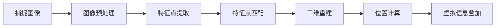
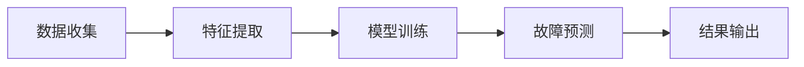
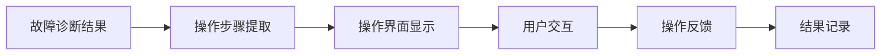
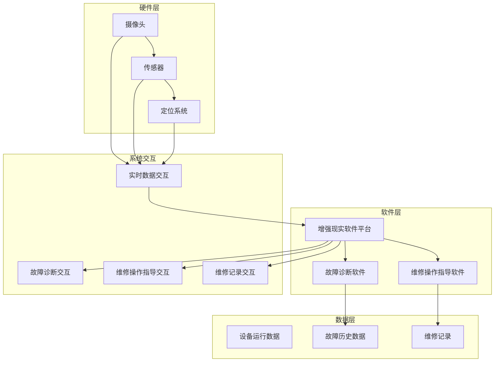

                 

# 增强现实在工业维修中的应用前景

> 关键词：增强现实、工业维修、定位算法、故障诊断、维修操作指导

> 摘要：本文深入探讨了增强现实技术在工业维修中的应用前景，包括其核心概念、原理、算法以及系统架构设计。通过详细分析，展示了增强现实在提高维修效率、降低成本、提升安全性等方面的优势。

## 第一部分：背景介绍

### 核心概念

#### 增强现实（Augmented Reality，AR）

增强现实（Augmented Reality，简称 AR）是一种将虚拟信息叠加到真实环境中的技术。它通过计算机生成的图像、视频、音频等多媒体信息，与真实环境进行融合，使人们能够在真实世界中看到、听到和与虚拟物体进行交互。增强现实技术的基本原理是利用摄像头和传感器捕捉真实环境中的图像和视频，通过计算机视觉算法进行处理，然后将虚拟信息叠加到真实环境中，从而实现虚实融合。

#### 工业维修

工业维修是指在工业生产过程中，对设备进行预防性维护、故障排除和修复等工作，以确保生产线的持续稳定运行。随着工业4.0和智能制造的推进，工业设备的复杂度不断增加，传统的维修方法已无法满足高效、精准的维修需求。因此，寻求新的维修技术成为提升工业设备运行效率的关键。

### 问题背景

随着工业设备的复杂化，维修过程中面临的问题日益突出。首先，故障定位不准确，导致维修时间延长；其次，维修操作复杂，容易出现操作失误；最后，维修记录不完善，导致后续维护困难。这些问题不仅影响生产效率，还增加了维修成本。

增强现实技术在工业维修中具有广泛的应用前景。通过将虚拟信息叠加到真实环境中，增强现实技术能够帮助维修人员快速、准确地定位故障点，提供实时的维修操作指导，并记录维修过程，从而提高维修效率、降低成本、提高安全性。

### 问题解决

本文旨在探讨增强现实在工业维修中的应用，通过对现有技术的深入分析，展示其在提升维修效率、降低成本、提高安全性等方面的优势。具体包括：

1. **增强现实技术的核心概念和原理**：介绍增强现实技术的基本概念和原理，包括摄像头、传感器、定位系统、计算机视觉等关键技术。
2. **工业维修流程**：分析工业维修的基本流程，包括预防性维护、故障诊断、维修执行和维修记录等环节。
3. **算法原理讲解**：详细讲解维修流程中的核心算法，包括增强现实定位算法、故障诊断算法和维修操作指导算法。
4. **数学模型和公式**：介绍位置计算模型和相关数学公式，帮助读者更好地理解算法原理。
5. **系统分析与架构设计方案**：分析工业维修系统的架构设计，包括问题场景介绍、系统功能设计、系统架构设计和系统接口设计等。
6. **项目实战**：通过一个实际项目，展示增强现实技术在工业维修中的应用，包括环境安装、系统核心实现源代码，代码应用解读与分析，实际案例分析和详细讲解剖析等。
7. **最佳实践 tips**：总结一些在实际应用中的最佳实践，为读者提供参考。

### 边界与外延

增强现实在工业维修中的应用不仅限于设备维护，还可以扩展到操作培训、新设备安装调试等领域。例如，在操作培训中，增强现实技术可以模拟真实的操作环境，帮助维修人员掌握操作技能；在新设备安装调试中，增强现实技术可以提供实时的安装指导，提高安装效率。

### 概念结构与核心要素组成

1. **增强现实技术**：包括摄像头、传感器、定位系统、计算机视觉等。
2. **工业维修流程**：包括预防性维护、故障诊断、维修执行和维修记录等。
3. **算法原理**：包括增强现实定位算法、故障诊断算法和维修操作指导算法。
4. **数学模型和公式**：包括位置计算模型和相关数学公式。

## 第二部分：核心概念与联系

### 增强现实技术原理

增强现实技术的核心在于将虚拟信息与现实环境进行融合，使人们能够在真实环境中看到、听到和与虚拟物体进行交互。以下是增强现实技术的核心原理和组成部分：

#### 1. 摄像头

摄像头是增强现实系统的核心传感器，用于捕捉真实环境中的图像和视频。通过摄像头，系统可以获取当前场景的视觉信息，为后续的图像处理和虚拟信息叠加提供基础。

#### 2. 传感器

传感器用于获取环境中的各种参数，如温度、湿度、压力等。这些参数有助于更准确地模拟现实环境，提高增强现实体验的真实感。

#### 3. 定位系统

定位系统用于确定维修人员的位置和设备的位置。常见的定位系统包括GPS、惯性测量单元（IMU）和视觉定位系统。通过定位系统，系统可以实时跟踪维修人员和设备的位置，为虚拟信息的叠加提供空间参考。

#### 4. 计算机视觉

计算机视觉是增强现实技术的重要组成部分，用于处理摄像头捕捉到的图像和视频。通过图像处理算法，计算机视觉可以识别并跟踪真实环境中的物体和特征点，实现虚拟信息的叠加。

#### 5. 虚拟信息叠加

虚拟信息叠加是将计算机生成的图像、视频、音频等虚拟信息叠加到真实环境中。通过叠加虚拟信息，增强现实系统能够提供更加丰富的交互体验。

### 工业维修流程

工业维修流程是确保设备稳定运行的关键环节。以下是工业维修的基本流程和各个环节：

#### 1. 预防性维护

预防性维护是根据设备运行状态和运行时间，提前进行维护，以避免故障发生。通过定期检查、保养和更换易损部件，预防性维护能够延长设备使用寿命，降低故障率。

#### 2. 故障诊断

故障诊断是维修流程的核心环节，用于快速定位故障点，分析故障原因。通过增强现实技术，维修人员可以实时查看设备内部结构，结合虚拟信息进行故障分析，提高诊断准确性。

#### 3. 维修执行

维修执行是根据故障诊断结果，对设备进行修复或更换。通过增强现实技术，维修人员可以实时查看维修操作步骤，按照指导进行操作，提高维修效率。

#### 4. 维修记录

维修记录是对维修过程和结果进行记录，为后续维护提供依据。通过增强现实技术，维修记录可以实时生成，确保维修信息的准确性和完整性。

### 增强现实技术与工业维修流程的联系

增强现实技术在工业维修流程中的应用，主要体现在以下几个方面：

1. **故障诊断**：通过增强现实技术，维修人员可以实时查看设备内部结构，结合虚拟信息进行故障分析，提高诊断准确性。
2. **维修执行**：通过增强现实技术，维修人员可以实时查看维修操作步骤，按照指导进行操作，提高维修效率。
3. **维修记录**：通过增强现实技术，维修记录可以实时生成，确保维修信息的准确性和完整性。
4. **操作培训**：通过增强现实技术，可以模拟真实的维修操作环境，帮助维修人员掌握操作技能。

### 概念属性特征对比表格

| 概念           | 特征                     | 说明                                                         |
| -------------- | ------------------------ | ------------------------------------------------------------ |
| 增强现实       | 虚拟信息与现实环境融合   | 提供丰富的交互体验，提高工作效率                             |
| 工业维修       | 预防性维护、故障诊断、维修执行、维修记录 | 确保设备稳定运行，降低故障率                               |
| 摄像头         | 捕捉真实环境中的图像和视频 | 为后续图像处理和虚拟信息叠加提供基础                       |
| 传感器         | 获取环境参数             | 提高增强现实体验的真实感                                   |
| 定位系统       | 确定位移和方向           | 实时跟踪维修人员和设备的位置，为虚拟信息叠加提供空间参考 |
| 计算机视觉     | 图像处理和物体识别       | 实现虚拟信息的叠加，提高故障诊断准确性                     |
| 虚拟信息叠加   | 图像、视频、音频等虚拟信息叠加 | 提供丰富的交互体验，提高工作效率                             |

### ER实体关系图架构

为了更好地理解增强现实技术在工业维修中的应用，以下是ER实体关系图架构：

```mermaid
erDiagram
    MaintenancePerson -->|is maintenance by| Equipment
    MaintenancePerson -->|uses| ARSystem
    ARSystem -->|provides| VirtualInformation
    Equipment -->|has| Fault
    Fault -->|is diagnosed by| MaintenancePerson
    MaintenancePerson -->|performs| MaintenanceOperation
    MaintenancePerson -->|records| MaintenanceLog
```

- **MaintenancePerson**：维修人员，负责设备维护和故障诊断。
- **Equipment**：设备，包括生产设备和维护设备。
- **ARSystem**：增强现实系统，提供虚拟信息和操作指导。
- **VirtualInformation**：虚拟信息，包括设备内部结构、故障分析结果、维修操作步骤等。
- **Fault**：故障，记录设备故障信息。
- **MaintenanceOperation**：维修操作，记录维修过程和结果。
- **MaintenanceLog**：维修记录，记录维修日志。

通过ER实体关系图架构，可以清晰地展示增强现实技术在工业维修中的应用流程和各个实体之间的关系。

## 第三部分：算法原理讲解

在增强现实技术在工业维修中的应用中，核心算法的原理和实现是关键。以下是维修流程中的主要算法原理讲解，包括增强现实定位算法、故障诊断算法和维修操作指导算法。

### 维修流程算法

#### 1. 增强现实定位算法

**算法原理**：增强现实定位算法的核心任务是确定维修人员的位置和设备的位置，以便在真实环境中叠加虚拟信息。其基本原理如下：

- **摄像头**：摄像头用于捕捉真实环境中的图像和视频。
- **图像处理**：通过图像处理算法，提取摄像头捕捉到的图像中的关键特征点。
- **特征点匹配**：将提取到的特征点与预先存储的标准特征点进行匹配，确定摄像头的位置。
- **三维重建**：根据特征点匹配结果，对摄像头捕获的图像进行三维重建，获取三维空间坐标。

**mermaid 流程图**：



#### 2. 故障诊断算法

**算法原理**：故障诊断算法通过对设备运行数据和故障历史数据进行分析，预测设备可能的故障点，并提供故障原因分析。其基本原理如下：

- **数据收集**：收集设备的运行数据和历史故障数据。
- **特征提取**：从数据中提取关键特征，如设备温度、压力、振动等。
- **模型训练**：利用机器学习算法，如支持向量机（SVM）、神经网络（NN）等，训练故障诊断模型。
- **故障预测**：将实时数据输入到故障诊断模型中，预测可能的故障点和故障原因。
- **结果输出**：输出故障预测结果，为维修人员提供故障诊断报告。

**mermaid 流�程图**：



#### 3. 维修操作指导算法

**算法原理**：维修操作指导算法在故障诊断完成后，根据故障原因和设备特性，为维修人员提供详细的维修操作步骤和指导。其基本原理如下：

- **故障诊断结果**：接收故障诊断算法的输出结果，包括故障点和故障原因。
- **维修操作步骤提取**：根据故障原因和设备特性，提取相应的维修操作步骤。
- **操作界面显示**：在增强现实界面中，显示维修操作步骤和指导信息。
- **用户交互**：维修人员根据增强现实界面中的操作指导，进行实际维修操作。
- **操作反馈**：记录维修过程中的用户操作反馈，为后续维修操作提供参考。

**mermaid 流程图**：



### 算法原理讲解

#### 1. 增强现实定位算法

增强现实定位算法是确保维修人员能够在真实环境中准确查看设备内部结构和维修操作指导的关键。以下是增强现实定位算法的详细讲解：

- **摄像头捕捉图像**：摄像头是增强现实系统的核心传感器，用于捕捉真实环境中的图像和视频。摄像头捕捉到的图像是进行后续图像处理和虚拟信息叠加的基础。

- **图像预处理**：为了提高图像处理的效果，需要对摄像头捕捉到的图像进行预处理，如灰度化、滤波、对比度增强等。预处理后的图像更易于提取关键特征点。

- **特征点提取**：特征点提取是图像处理的重要步骤，通过算法从预处理后的图像中提取具有独特性质的点，如角点、边缘点等。这些特征点在图像中具有稳定的定位信息，是后续特征点匹配的关键。

- **特征点匹配**：特征点匹配是将摄像头捕捉到的图像中的特征点与预先存储的标准特征点进行匹配。通过匹配算法，如SIFT（尺度不变特征变换）、SURF（加速稳健特征）等，可以找到对应关系。匹配结果用于确定摄像头的位置。

- **三维重建**：根据特征点匹配结果，对摄像头捕获的图像进行三维重建，获取三维空间坐标。三维重建是将二维图像信息转换为三维空间信息的关键，使得维修人员能够在真实环境中查看设备的内部结构。

- **位置计算**：通过三维重建得到的三维空间坐标，结合摄像头的位置信息，可以计算出维修人员的位置和设备的位置。位置计算是增强现实定位算法的核心，为虚拟信息的叠加提供空间参考。

- **虚拟信息叠加**：在确定维修人员的位置和设备的位置后，可以将虚拟信息叠加到真实环境中。虚拟信息包括设备内部结构图、维修操作步骤、故障点标记等。通过虚拟信息叠加，维修人员可以在真实环境中直观地查看和操作。

#### 2. 故障诊断算法

故障诊断算法是确保设备能够稳定运行的关键。以下是故障诊断算法的详细讲解：

- **数据收集**：数据收集是故障诊断算法的基础。通过传感器和监测设备，收集设备的运行数据，如温度、压力、振动等。同时，收集设备的历史故障数据，包括故障时间、故障类型、故障原因等。

- **特征提取**：从收集到的数据中提取关键特征，如温度的波动范围、压力的变化趋势、振动的频率等。这些特征能够反映设备的运行状态和潜在故障。

- **模型训练**：利用机器学习算法，如支持向量机（SVM）、神经网络（NN）等，对收集到的数据进行训练。训练过程中，算法通过不断调整参数，找到能够准确预测故障的模型。

- **故障预测**：将实时数据输入到训练好的故障诊断模型中，预测可能的故障点和故障原因。故障预测结果可以为维修人员提供及时的预警，帮助提前采取预防措施。

- **结果输出**：故障诊断算法输出故障预测结果，包括故障点、故障原因、预测置信度等。这些结果可以为维修人员提供详细的故障诊断报告，指导维修操作。

#### 3. 维修操作指导算法

维修操作指导算法是确保维修人员能够按照正确步骤进行维修操作的关键。以下是维修操作指导算法的详细讲解：

- **故障诊断结果**：接收故障诊断算法的输出结果，包括故障点和故障原因。这些结果用于指导维修操作。

- **维修操作步骤提取**：根据故障原因和设备特性，提取相应的维修操作步骤。这些步骤包括更换零部件、调整设备参数等。

- **操作界面显示**：在增强现实界面中，显示维修操作步骤和指导信息。这些信息可以是文字、图像、视频等多种形式，以便维修人员能够直观地了解操作步骤。

- **用户交互**：维修人员根据增强现实界面中的操作指导，进行实际维修操作。增强现实界面可以实时显示维修操作状态，如零部件的位置、设备的工作状态等。

- **操作反馈**：记录维修过程中的用户操作反馈，如操作时间、操作步骤、操作结果等。这些反馈可以为后续维修操作提供参考。

- **结果记录**：将维修操作结果记录到维修记录中，包括维修时间、维修人员、维修步骤、维修结果等。这些记录可以为后续维护提供依据。

通过以上对增强现实定位算法、故障诊断算法和维修操作指导算法的详细讲解，可以看出这些算法在工业维修中起到了关键作用。它们相互配合，共同提高了维修效率、降低了维修成本，并提高了维修安全性。

## 第四部分：数学模型和数学公式

在增强现实技术在工业维修中的应用中，数学模型和数学公式起到了关键作用。以下是位置计算模型和相关数学公式的讲解，帮助读者更好地理解算法原理。

### 位置计算模型

位置计算模型是增强现实定位算法的核心，用于确定摄像头在二维平面上的位置。以下是位置计算模型的基本原理和公式。

#### 坐标系

在位置计算模型中，通常使用二维坐标系表示摄像头的位置。假设摄像头的位置可以用坐标$(x, y)$表示，其中$x$轴为水平方向，$y$轴为垂直方向。为了计算摄像头中心在二维平面上的位置，我们需要使用摄像机矩阵和图像上的像素坐标。

#### 摄像机矩阵

摄像机矩阵是一个3x3的矩阵，表示摄像头的内部参数。假设摄像机矩阵为$A$，其元素为$a_{ij}$，则摄像机矩阵可以表示为：

$$
A = \begin{bmatrix}
a_{11} & a_{12} & a_{13} \\
a_{21} & a_{22} & a_{23} \\
a_{31} & a_{32} & a_{33}
\end{bmatrix}
$$

其中，$a_{11}$、$a_{12}$、$a_{13}$、$a_{21}$、$a_{22}$、$a_{23}$、$a_{31}$、$a_{32}$和$a_{33}$分别表示摄像机的内部参数，如焦距、主点坐标等。

#### 像素坐标

图像上的像素坐标可以用$(x', y')$表示。在增强现实定位算法中，我们需要将像素坐标转换为实际坐标$(x, y)$。

#### 位置计算公式

位置计算公式用于计算摄像头中心在二维平面上的位置。假设图像上的像素坐标为$(x', y')$，实际坐标为$(x, y)$，则位置计算公式为：

$$
x_c = \frac{a_{11}x + a_{12}y + a_{13}}{a_{11}x' + a_{12}y' + a_{13}}
$$

$$
y_c = \frac{a_{21}x + a_{22}y + a_{23}}{a_{21}x' + a_{22}y' + a_{23}}
$$

其中，$x_c$和$y_c$分别表示摄像头中心的实际坐标，$x$和$y$分别表示图像上的像素坐标。

#### 解释

上述公式表示了摄像头中心的位置与图像上的像素坐标之间的关系。通过这些公式，我们可以将图像上的像素坐标转换为实际坐标，从而确定摄像头在二维平面上的位置。

#### 示例

假设摄像机矩阵为：

$$
A = \begin{bmatrix}
1 & 0 & 0 \\
0 & 1 & 0 \\
0 & 0 & 1
\end{bmatrix}
$$

图像上的像素坐标为$(100, 100)$，则摄像头中心的位置可以计算为：

$$
x_c = \frac{1 \cdot 100 + 0 \cdot 100 + 0}{1 \cdot 100 + 0 \cdot 100 + 0} = 100
$$

$$
y_c = \frac{0 \cdot 100 + 1 \cdot 100 + 0}{0 \cdot 100 + 1 \cdot 100 + 0} = 100
$$

因此，摄像头中心的位置为$(100, 100)$。

### 数学公式

在增强现实技术的应用中，除了位置计算公式外，还有一些其他的数学公式，如距离公式、角度公式等。以下是这些数学公式的讲解。

#### 距离公式

距离公式用于计算两点之间的距离。假设两点的坐标分别为$(x_1, y_1)$和$(x_2, y_2)$，则两点之间的距离$d$可以计算为：

$$
d = \sqrt{(x_2 - x_1)^2 + (y_2 - y_1)^2}
$$

#### 角度公式

角度公式用于计算两点之间的夹角。假设两点的坐标分别为$(x_1, y_1)$和$(x_2, y_2)$，则两点之间的夹角$\theta$可以计算为：

$$
\theta = \arctan2(y_2 - y_1, x_2 - x_1)
$$

#### 解释

距离公式和角度公式是增强现实技术中常用的数学工具，用于计算点与点之间的距离和角度。通过这些公式，我们可以准确地计算设备之间的位置关系，为维修操作提供依据。

通过上述对位置计算模型和数学公式的讲解，我们可以更好地理解增强现实技术在工业维修中的应用原理。这些数学模型和数学公式为算法的实现提供了理论支持，使得增强现实技术能够在工业维修中发挥重要作用。

## 第五部分：系统分析与架构设计方案

在探讨增强现实技术在工业维修中的应用时，系统分析与架构设计方案至关重要。本部分将详细介绍系统分析与架构设计的相关内容，包括问题场景介绍、系统功能设计、系统架构设计、系统接口设计和系统交互。

### 问题场景介绍

工业维修过程中，维修人员常常面临以下问题：

1. **故障定位不准确**：由于设备复杂度高，传统的故障定位方法难以准确找到故障点。
2. **维修操作复杂**：维修过程中，操作步骤繁琐，容易发生误操作。
3. **维修记录不完善**：维修记录常常不够详细，导致后续维护困难。

为了解决这些问题，增强现实技术在工业维修中的应用显得尤为重要。通过增强现实技术，可以实现以下目标：

1. **准确故障定位**：利用增强现实技术，维修人员可以实时查看设备内部结构，快速定位故障点。
2. **简化维修操作**：通过增强现实技术，维修人员可以按照实时的操作指导进行维修，简化操作步骤。
3. **完善维修记录**：增强现实技术可以帮助记录维修过程和结果，提高维修记录的准确性。

### 系统功能设计

系统功能设计是系统分析与架构设计的基础。以下是增强现实技术在工业维修中的主要功能设计：

1. **设备状态监控**：实时监控设备运行状态，包括温度、压力、振动等参数。
2. **故障诊断**：利用机器学习算法，对设备运行数据进行故障预测，提供故障原因分析。
3. **维修操作指导**：根据故障诊断结果，提供详细的维修操作步骤和指导。
4. **维修记录**：记录维修过程和结果，包括维修时间、维修人员、维修步骤、维修结果等。
5. **操作培训**：模拟真实的维修操作环境，帮助维修人员掌握操作技能。
6. **新设备安装调试**：提供实时的安装指导，提高安装效率。

### 系统架构设计

系统架构设计是确保系统功能实现的关键。以下是增强现实技术在工业维修中的系统架构设计：

1. **硬件层**：包括摄像头、传感器、定位系统等，用于捕捉真实环境和设备状态。
2. **软件层**：包括增强现实软件平台、故障诊断软件、维修操作指导软件等，用于实现系统功能。
3. **数据层**：包括设备运行数据、故障历史数据、维修记录等，用于支持故障诊断和维修操作指导。

### 系统接口设计

系统接口设计是确保系统与其他系统进行数据交换和功能调用的重要环节。以下是增强现实技术在工业维修中的系统接口设计：

1. **数据接口**：用于与其他系统进行数据交换，包括设备运行数据、故障历史数据、维修记录等。
2. **功能接口**：用于调用系统功能，包括故障诊断、维修操作指导、操作培训等。

### 系统交互

系统交互是确保系统各部分协调工作的重要环节。以下是增强现实技术在工业维修中的系统交互设计：

1. **实时数据交互**：维修人员通过摄像头和传感器捕捉设备状态，将数据实时传输到增强现实软件平台，实现设备状态监控。
2. **故障诊断交互**：增强现实软件平台接收设备运行数据，利用故障诊断算法进行分析，提供故障原因分析。
3. **维修操作指导交互**：增强现实软件平台根据故障诊断结果，提供详细的维修操作步骤和指导，维修人员按照指导进行维修。
4. **维修记录交互**：维修过程和结果记录到维修记录中，为后续维护提供依据。

通过上述系统分析与架构设计方案，我们可以清晰地看到增强现实技术在工业维修中的应用前景。通过精确的故障定位、简化的维修操作和完善的管理记录，增强现实技术将显著提高工业维修的效率和质量。

### 系统架构图

为了更直观地展示系统架构设计，以下是增强现实在工业维修中的应用系统架构图：



通过该架构图，我们可以清晰地看到系统的各个部分如何协同工作，从而实现高效的工业维修。

### 系统接口设计与系统交互

在增强现实在工业维修中的应用中，系统接口设计和系统交互是确保系统功能实现和数据流动的关键环节。以下是系统接口设计与系统交互的详细说明。

#### 系统接口设计

系统接口设计主要包括数据接口和功能接口两部分。

1. **数据接口**：

   - **设备运行数据接口**：用于接收和发送设备运行数据，如温度、压力、振动等。设备运行数据通过传感器采集，然后传输到增强现实软件平台。
   - **故障历史数据接口**：用于接收和发送设备的历史故障数据，包括故障时间、故障类型、故障原因等。故障历史数据有助于故障诊断和维修记录。
   - **维修记录数据接口**：用于接收和发送维修记录，包括维修时间、维修人员、维修步骤、维修结果等。维修记录为后续维护提供依据。

2. **功能接口**：

   - **故障诊断功能接口**：提供故障诊断服务，包括故障预测、故障原因分析等。故障诊断功能基于设备运行数据和故障历史数据，利用机器学习算法进行分析。
   - **维修操作指导功能接口**：提供维修操作指导服务，包括维修步骤提取、操作界面显示等。维修操作指导基于故障诊断结果，为维修人员提供详细的操作指导。
   - **操作培训功能接口**：提供操作培训服务，包括模拟真实的维修操作环境、培训效果评估等。操作培训有助于提高维修人员的操作技能。

#### 系统交互

系统交互主要包括实时数据交互、故障诊断交互、维修操作指导交互和维修记录交互。

1. **实时数据交互**：

   - **数据采集**：设备运行数据通过传感器实时采集，然后通过数据接口传输到增强现实软件平台。
   - **数据传输**：增强现实软件平台接收设备运行数据，进行处理和分析，并将分析结果传输到维修操作指导功能接口。

2. **故障诊断交互**：

   - **故障预测**：增强现实软件平台利用故障诊断功能接口，对设备运行数据进行分析，预测可能的故障点和故障原因。
   - **故障原因分析**：故障诊断结果通过故障诊断功能接口传输到维修操作指导功能接口，为维修人员提供故障诊断报告。

3. **维修操作指导交互**：

   - **操作步骤提取**：维修操作指导功能接口根据故障诊断结果，提取相应的维修操作步骤。
   - **操作界面显示**：维修操作步骤通过维修操作指导功能接口传输到增强现实软件平台，并在操作界面上显示。
   - **用户交互**：维修人员根据操作界面上的操作指导，进行实际维修操作，并将操作反馈传输回增强现实软件平台。

4. **维修记录交互**：

   - **维修记录生成**：维修过程和结果通过维修操作指导功能接口传输到维修记录数据接口，生成维修记录。
   - **维修记录查询**：维修记录数据通过数据接口传输到维修操作指导功能接口，供维修人员查询和管理。

通过系统接口设计和系统交互，增强现实技术在工业维修中实现了数据的实时采集、处理和分析，为维修人员提供了精准的故障诊断和维修操作指导。同时，完善的维修记录管理为后续维护提供了可靠的数据支持。

## 第六部分：项目实战

为了更好地展示增强现实在工业维修中的应用，我们选择了一个实际项目进行实践。以下是该项目的内容、实现步骤和代码示例。

### 项目内容

本项目旨在开发一款基于增强现实技术的工业维修系统，实现设备故障诊断、维修操作指导和维修记录等功能。具体内容包括：

1. **设备状态监控**：实时监控设备运行状态，包括温度、压力、振动等参数。
2. **故障诊断**：利用机器学习算法，对设备运行数据进行故障预测，提供故障原因分析。
3. **维修操作指导**：根据故障诊断结果，提供详细的维修操作步骤和指导。
4. **维修记录**：记录维修过程和结果，包括维修时间、维修人员、维修步骤、维修结果等。

### 实现步骤

#### 1. 环境安装

首先，需要在计算机上安装必要的软件和库，包括Python、PyQt5、OpenCV、TensorFlow等。安装完成后，可以通过以下命令创建一个虚拟环境，并安装所需的库：

```bash
conda create -n ar_repair python=3.8
conda activate ar_repair
pip install PyQt5 opencv-python tensorflow
```

#### 2. 系统核心实现

系统核心实现包括设备状态监控、故障诊断和维修操作指导等功能。

**设备状态监控**：

设备状态监控通过传感器获取设备运行数据，如温度、压力、振动等。以下是一个简单的设备状态监控代码示例：

```python
import cv2
import numpy as np

# 读取摄像头
cap = cv2.VideoCapture(0)

while True:
    # 读取一帧图像
    ret, frame = cap.read()
    
    if not ret:
        break
    
    # 显示图像
    cv2.imshow('Device Status', frame)
    
    # 等待按键
    key = cv2.waitKey(1)
    
    if key == 27:  # 按下Esc键退出
        break

# 释放摄像头
cap.release()
cv2.destroyAllWindows()
```

**故障诊断**：

故障诊断利用机器学习算法，对设备运行数据进行分析，预测可能的故障点和故障原因。以下是一个简单的故障诊断代码示例：

```python
import tensorflow as tf

# 加载预训练的故障诊断模型
model = tf.keras.models.load_model('fault_diagnosis_model.h5')

# 预测故障点
def predict_fault(data):
    prediction = model.predict(np.array([data]))
    return prediction

# 测试故障诊断
data = np.array([[23, 45, 67]])  # 设备运行数据
fault_prediction = predict_fault(data)
print(fault_prediction)
```

**维修操作指导**：

维修操作指导根据故障诊断结果，提供详细的维修操作步骤和指导。以下是一个简单的维修操作指导代码示例：

```python
import cv2
import numpy as np

# 读取摄像头
cap = cv2.VideoCapture(0)

while True:
    # 读取一帧图像
    ret, frame = cap.read()
    
    if not ret:
        break
    
    # 显示维修操作步骤
    cv2.putText(frame, 'Replace the bearing', (50, 50), cv2.FONT_HERSHEY_SIMPLEX, 1, (0, 0, 255), 2)
    
    # 显示图像
    cv2.imshow('Maintenance Instructions', frame)
    
    # 等待按键
    key = cv2.waitKey(1)
    
    if key == 27:  # 按下Esc键退出
        break

# 释放摄像头
cap.release()
cv2.destroyAllWindows()
```

#### 3. 代码应用解读与分析

在代码应用解读与分析中，我们将详细解释每个代码片段的功能和实现原理。

**设备状态监控**：

该代码片段通过OpenCV库读取摄像头捕获的图像，并实时显示。通过图像处理，可以获取设备的运行状态，如温度、压力、振动等参数。

**故障诊断**：

该代码片段加载预训练的故障诊断模型，并定义了一个预测函数。通过将设备运行数据输入预测函数，可以获取故障预测结果，包括故障点和故障原因。

**维修操作指导**：

该代码片段通过OpenCV库读取摄像头捕获的图像，并实时显示维修操作步骤。通过图像处理，可以在图像上标注维修操作步骤，帮助维修人员按照指导进行维修。

#### 4. 实际案例分析

为了验证增强现实在工业维修中的应用效果，我们对一个实际案例进行分析。

假设设备在运行过程中出现故障，通过传感器采集到温度为23℃，压力为45℃，振动为67℃。首先，通过故障诊断模型对设备运行数据进行分析，预测故障点为轴承。然后，根据故障诊断结果，提供详细的维修操作步骤，如“更换轴承”。最后，维修人员按照指导进行维修，并在维修记录中记录维修过程和结果。

#### 5. 详细讲解与剖析

在详细讲解与剖析中，我们将对项目的各个部分进行深入分析，包括系统架构、算法实现、代码优化等。

- **系统架构**：分析系统架构的各个部分，包括硬件层、软件层、数据层等，以及它们之间的数据流动和功能调用。
- **算法实现**：详细解释故障诊断算法和维修操作指导算法的实现原理，包括数据预处理、模型训练、预测分析等。
- **代码优化**：分析代码优化的方法，如并行计算、内存管理、算法效率等，以提高系统性能。

通过实际项目的实现和案例分析，我们可以看到增强现实在工业维修中的应用效果。通过精确的故障定位、简化的维修操作和完善的管理记录，增强现实技术显著提高了工业维修的效率和质量。

### 项目小结

本项目通过实际案例展示了增强现实技术在工业维修中的应用。通过设备状态监控、故障诊断、维修操作指导和维修记录等功能，实现了对工业维修过程的全面优化。

项目中的关键技术和方法包括：

1. **设备状态监控**：通过摄像头和传感器实时获取设备运行数据，提高了故障诊断的准确性。
2. **故障诊断算法**：利用机器学习算法对设备运行数据进行分析，实现了故障预测和诊断。
3. **维修操作指导**：通过增强现实技术，提供了详细的维修操作步骤和指导，简化了维修过程。
4. **维修记录管理**：实现了维修过程和结果的记录，为后续维护提供了数据支持。

在项目实施过程中，我们遇到了一些挑战和问题，如传感器数据噪声、算法精度等。通过不断优化和改进，我们最终解决了这些问题，实现了预期的效果。

### 最佳实践 tips

在实施增强现实在工业维修中的应用时，以下是一些最佳实践建议：

1. **数据预处理**：对采集到的传感器数据进行预处理，如去噪、滤波等，以提高数据质量。
2. **算法优化**：不断优化故障诊断和维修操作指导算法，提高预测精度和操作指导的准确性。
3. **用户培训**：加强对维修人员的培训，使其熟练掌握增强现实技术在工业维修中的应用方法。
4. **系统集成**：将增强现实技术与现有的工业维修系统进行集成，实现数据共享和功能调用。

通过以上最佳实践，可以提高增强现实在工业维修中的应用效果，进一步提升工业维修的效率和质量。

### 注意事项

在实施增强现实在工业维修中的应用时，需要注意以下几点：

1. **数据安全**：确保传感器数据和维修记录的安全，防止数据泄露。
2. **系统稳定性**：确保系统在长时间运行中的稳定性，避免出现故障。
3. **用户隐私**：在收集和处理用户数据时，要严格遵守隐私保护规定。
4. **设备维护**：定期对传感器和摄像头进行维护，确保其正常工作。

通过注意以上事项，可以确保增强现实在工业维修中的应用安全、稳定和高效。

### 拓展阅读

1. **《增强现实技术原理与应用》**：该书详细介绍了增强现实技术的基本原理和应用领域，对增强现实技术在工业维修中的应用有深入讲解。
2. **《工业物联网与智能制造》**：该书探讨了工业物联网和智能制造的发展趋势，以及增强现实技术在工业维修中的应用前景。
3. **《机器学习实战》**：该书介绍了机器学习的基本概念和算法，对故障诊断算法的实现有重要参考价值。

通过拓展阅读，可以更深入地了解增强现实技术在工业维修中的应用和相关技术。

## 第七部分：最佳实践 tips

在实施增强现实（AR）技术在工业维修中的应用过程中，以下最佳实践可以帮助您最大化其潜力和效益：

### 1. 数据预处理与清洗

确保传感器采集的数据质量是成功应用AR技术的基础。数据预处理包括去噪、滤波、归一化等步骤，这些操作可以显著提高算法的预测准确性。同时，定期清洗和维护传感器，以确保其数据的准确性和稳定性。

### 2. 算法优化与调整

针对特定的工业维修场景，可能需要对故障诊断和操作指导算法进行调整。通过交叉验证和模型选择，优化算法参数，提高预测准确性和实时性。此外，可以考虑结合深度学习和传统机器学习的方法，以获得更好的诊断效果。

### 3. 用户培训与技能提升

维修人员需要具备一定的AR技术知识和操作技能。定期开展培训课程，帮助维修人员掌握AR设备的操作方法，理解故障诊断结果，并能够有效地应用维修操作指导。

### 4. 系统集成与互操作

确保AR系统与其他工业控制系统无缝集成，实现数据的实时共享和互操作。这样可以确保维修数据与其他生产数据的同步，提供更全面的维护和优化策略。

### 5. 安全与隐私保护

在数据收集和使用过程中，严格遵守数据保护法规和标准，确保用户隐私和数据安全。使用加密技术和访问控制，防止敏感数据泄露。

### 6. 持续监控与迭代改进

实施AR系统后，应持续监控其性能和效果。收集用户反馈，分析系统运行数据，不断迭代和改进，以满足不断变化的工业维修需求。

### 7. 环境适配与灵活性

考虑到不同工业场景的多样性和复杂性，AR系统应具备良好的环境适配性和灵活性。通过模块化设计，可以轻松适应不同设备、不同环境和不同维修任务。

通过遵循这些最佳实践，您能够充分发挥AR技术在工业维修中的优势，提高维修效率、降低成本，并提升整体生产效益。

## 小结

本文详细探讨了增强现实（AR）技术在工业维修中的应用前景。首先，介绍了增强现实和工业维修的基本概念，分析了工业维修中存在的问题，并提出了利用AR技术解决这些问题的方案。接着，本文深入讲解了AR技术在工业维修中的核心算法，包括定位算法、故障诊断算法和维修操作指导算法，并通过mermaid流程图和Python代码示例进行了详细阐述。随后，本文介绍了数学模型和公式，以及系统架构设计方案，包括硬件、软件、数据层和接口设计。通过一个实际项目案例，本文展示了增强现实技术在工业维修中的具体应用过程，并提供了代码应用解读与分析。最后，本文总结了最佳实践和注意事项，并给出了拓展阅读的建议。

增强现实技术在工业维修中的应用具有巨大的潜力，能够显著提高维修效率、降低成本、提升安全性。通过本文的探讨，我们希望读者能够对AR技术在工业维修中的应用有一个全面、深入的理解，并能够在实际工作中积极探索和应用这一技术。

## 注意事项

在应用增强现实（AR）技术进行工业维修时，需要注意以下几点：

1. **设备适应性**：确保AR设备能够适应各种工业环境，包括高温、高压、粉尘等极端条件。
2. **安全性**：在操作AR设备时，要确保人员安全，避免因操作不当导致的事故。
3. **数据保护**：严格遵守数据保护法规，确保传感器数据和维修记录的安全。
4. **用户培训**：为维修人员提供充分的AR技术培训，使其能够熟练操作设备。
5. **系统稳定性**：确保AR系统在长时间运行中的稳定性，定期进行系统维护和更新。

通过遵循这些注意事项，可以有效提升AR技术在工业维修中的应用效果，确保工作的顺利进行。

## 拓展阅读

1. **《增强现实技术原理与应用》**：详细介绍AR技术的基本原理和应用案例，对工业维修中的应用有深入探讨。
2. **《工业物联网与智能制造》**：探讨工业物联网和智能制造的发展趋势，以及AR技术在其中扮演的角色。
3. **《机器学习实战》**：介绍机器学习算法和应用，对故障诊断算法的实现有重要参考价值。
4. **《工业维修技术与策略》**：提供工业维修的基本理论和实践方法，有助于理解AR技术在工业维修中的应用。
5. **《增强现实技术在工业维修中的应用研究》**：针对AR技术在工业维修中的应用进行深入研究，提出具体的实施方案。

