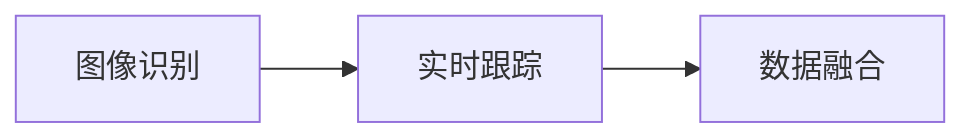
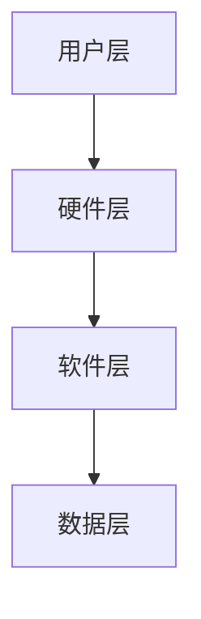
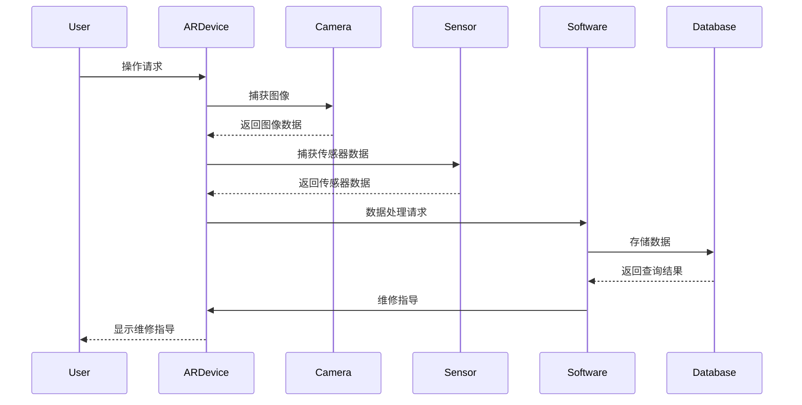

                 

## 增强现实在工业维修中的应用：提升维修效率

关键词：增强现实、工业维修、效率提升、故障诊断、远程协作

摘要：本文将探讨增强现实技术在工业维修中的应用，通过深入分析其基本概念、技术原理及实际案例，揭示如何利用增强现实技术提升工业维修的效率。我们将从问题背景、应用场景、技术原理、系统设计与实现等多个角度，逐步展开讨论，以期为工业维修领域的技术创新提供新的思路。

----------------------------------------------------------------

### 第一部分：背景介绍

#### 第1章：增强现实与工业维修的概述

##### 1.1.1 增强现实技术的基本概念与原理

增强现实（Augmented Reality，简称AR）是一种将虚拟信息与真实世界相结合的技术。它通过计算机生成的虚拟信息叠加到现实环境中，使用户能够看到虚拟和真实世界相互融合的景象。增强现实的核心技术包括图像识别、实时跟踪、数据融合和虚拟现实等。

增强现实的基本原理是利用摄像头捕捉现实环境中的图像，通过图像处理和计算机视觉算法，将虚拟信息叠加到图像上，并在显示设备上实时呈现给用户。这种技术不仅能够提供丰富的视觉体验，还能够通过交互功能实现人与虚拟信息的互动。

##### 1.1.2 增强现实技术在工业维修中的潜在应用

在工业维修领域，增强现实技术的应用具有巨大的潜力。首先，它可以提供实时、准确的维修指导，帮助维修人员快速定位故障，提高维修效率。其次，增强现实技术可以实现远程协作，将专家的智慧和经验实时传递给现场维修人员，解决复杂维修问题。此外，增强现实技术还可以用于故障诊断和设备维护，提前预测潜在故障，降低设备停机率。

##### 1.1.3 工业维修中的问题背景与问题描述

工业维修是一个复杂而多样化的领域，涉及到各种类型的机械设备和生产线。然而，现有的维修方法在许多方面存在局限性。首先，传统维修方法主要依赖于维修人员的经验和知识，缺乏系统性的指导和数据支持，导致维修效率低下。其次，许多维修任务需要现场操作，但在缺乏足够信息的情况下，维修人员可能无法准确判断故障原因和解决方案。此外，由于设备故障的复杂性和多样性，传统维修方法难以应对突发事件和特殊情况。

#### 第2章：工业维修中的问题背景与问题描述

##### 2.1.1 工业维修的复杂性和多样性

工业维修的复杂性和多样性是当前工业维修领域面临的主要挑战之一。不同类型的机械设备和生产线具有不同的结构和功能，因此维修任务也各有不同。此外，设备的运行环境、工作负载和使用寿命也会对维修任务产生影响。这些因素使得维修工作变得复杂且不可预测。

##### 2.1.2 传统维修方法的局限性

传统维修方法主要依赖于维修人员的经验和知识。这种方法虽然在一定程度上能够解决故障，但存在以下局限性：

1. **信息获取困难**：维修人员无法实时获取设备运行状态和故障信息，导致维修决策缺乏数据支持。
2. **维修效率低**：传统维修方法依赖于现场操作，维修人员需要花费大量时间进行故障排查和诊断，导致维修效率低下。
3. **依赖人力**：传统维修方法对人力资源的依赖较大，维修人员的技能和经验水平直接影响到维修效果。

##### 2.1.3 维修效率低下的问题分析

维修效率低下是工业维修领域面临的重要问题之一。根据相关研究，维修效率低下可能导致以下问题：

1. **设备停机时间增加**：维修效率低下会导致设备维修时间延长，从而增加设备停机时间，影响生产进度。
2. **维修成本增加**：维修效率低下会增加维修成本，包括人工成本、材料成本和设备损耗成本等。
3. **生产安全风险**：设备故障和维修不当可能导致生产安全事故，对员工和设备造成潜在威胁。

综上所述，提升维修效率对于工业维修领域具有重要意义。通过引入增强现实技术，可以实现实时、准确的维修指导，提高维修效率，降低设备停机时间和维修成本，提高生产安全水平。

----------------------------------------------------------------

#### 第3章：增强现实技术在工业维修中的应用

##### 3.1.1 增强现实技术与工业维修的结合

增强现实技术在工业维修中的应用主要体现在以下几个方面：

1. **维修指导**：通过增强现实技术，维修人员可以在现场实时获取设备运行状态和故障信息，结合虚拟维修手册和指导视频，快速定位故障并制定解决方案。
2. **故障诊断**：增强现实技术可以实现设备运行数据的实时监控和分析，通过虚拟传感器和算法分析，提前预测潜在故障，降低设备停机率。
3. **远程协作**：通过增强现实技术，专家可以远程实时指导现场维修人员，解决复杂维修问题，提高维修效率。

##### 3.1.2 增强现实技术在故障诊断中的应用

在故障诊断方面，增强现实技术具有显著优势。首先，通过增强现实眼镜或设备，维修人员可以实时观察设备运行状态，识别潜在故障。其次，增强现实技术可以结合虚拟传感器和数据采集，实现设备运行数据的实时监控和分析。通过算法分析，可以提前预测潜在故障，为维修提供数据支持。

##### 3.1.3 增强现实技术在维修指导中的应用

在维修指导方面，增强现实技术提供了直观、便捷的解决方案。通过增强现实眼镜或设备，维修人员可以在现场实时查看虚拟维修手册、操作步骤和注意事项，确保维修过程顺利进行。此外，增强现实技术还可以结合虚拟现实技术，为维修人员提供虚拟培训，提高维修技能。

##### 3.1.4 增强现实技术在远程协作中的应用

远程协作是增强现实技术在工业维修中的一项重要应用。通过增强现实技术，专家可以远程实时观察设备运行状态，指导现场维修人员操作。这种远程协作模式不仅可以提高维修效率，还可以降低专家现场出差的成本，提高企业的运营效率。

----------------------------------------------------------------

#### 第4章：核心概念与联系

##### 4.1.1 增强现实技术的核心概念

增强现实技术的核心概念包括以下几个方面：

1. **虚拟信息叠加**：通过图像识别和计算机视觉算法，将虚拟信息叠加到现实环境中。
2. **实时跟踪**：利用摄像头和传感器，实时捕捉现实环境中的图像和物体，实现虚拟信息和现实环境的同步更新。
3. **数据融合**：将现实环境和虚拟信息进行融合，提供直观、实时的交互体验。

##### 4.1.2 工业维修中相关的核心概念

在工业维修中，相关的核心概念包括：

1. **设备运行状态**：设备在运行过程中产生的各种状态信息，包括温度、压力、振动等。
2. **故障信息**：设备运行过程中出现的故障信息，包括故障类型、故障原因、故障位置等。
3. **维修策略**：根据设备运行状态和故障信息，制定的维修计划和操作步骤。

##### 4.1.3 增强现实技术与工业维修的核心联系

增强现实技术与工业维修的核心联系主要体现在以下几个方面：

1. **实时数据获取**：增强现实技术可以实时获取设备运行状态和故障信息，为维修提供数据支持。
2. **交互体验**：增强现实技术提供直观、实时的交互体验，帮助维修人员快速定位故障和制定维修策略。
3. **远程协作**：增强现实技术可以实现远程协作，提高维修效率和降低成本。

通过增强现实技术，工业维修可以实现数据驱动的智能化，提高维修效率，降低设备停机时间和维修成本。

----------------------------------------------------------------

#### 第5章：增强现实技术的数学模型与算法原理

##### 5.1.1 数学模型的基本原理

增强现实技术的核心在于将虚拟信息与现实环境进行精确融合。为此，需要建立一系列数学模型，用于描述和实现虚拟信息的叠加、实时跟踪和数据融合。以下是几个关键数学模型的基本原理：

1. **图像识别模型**：
   - **原理**：利用深度学习算法，对摄像头捕捉的图像进行分类和识别。
   - **应用**：用于识别设备故障、维修步骤和工具位置等。
2. **实时跟踪模型**：
   - **原理**：利用传感器数据，对摄像头捕捉到的图像进行实时跟踪和更新。
   - **应用**：确保虚拟信息与现实环境的同步更新，提供实时交互体验。
3. **数据融合模型**：
   - **原理**：将现实环境中的图像和虚拟信息进行融合，生成最终呈现的视觉效果。
   - **应用**：实现虚拟信息和现实环境的无缝融合，提供直观的交互体验。

##### 5.1.2 增强现实技术的算法原理

增强现实技术的核心算法主要包括以下几类：

1. **图像识别算法**：
   - **原理**：利用卷积神经网络（CNN）等深度学习算法，对图像进行分类和识别。
   - **代码实现**：以下是一个简单的CNN图像识别算法的Python代码实现：

```python
import tensorflow as tf
from tensorflow.keras.models import Sequential
from tensorflow.keras.layers import Conv2D, MaxPooling2D, Flatten, Dense

model = Sequential([
    Conv2D(32, (3, 3), activation='relu', input_shape=(128, 128, 3)),
    MaxPooling2D((2, 2)),
    Flatten(),
    Dense(64, activation='relu'),
    Dense(10, activation='softmax')
])

model.compile(optimizer='adam', loss='categorical_crossentropy', metrics=['accuracy'])
```

2. **实时跟踪算法**：
   - **原理**：利用卡尔曼滤波等算法，对摄像头捕捉的图像进行实时跟踪和更新。
   - **代码实现**：以下是一个简单的卡尔曼滤波算法的Python代码实现：

```python
import numpy as np

def kalman_filter measurements, initial_state, transition_matrix, observation_matrix, observation_noise:
    state = initial_state
    for measurement in measurements:
        predicted_state = np.dot(transition_matrix, state)
        residual = measurement - np.dot(observation_matrix, predicted_state)
        kalman_gain = np.dot(np.dot(observation_matrix, np.linalg.inv(np.dot(np.dot(observation_matrix, transition_matrix), observation_matrix) + observation_noise)), observation_matrix)
        state = state + np.dot(kalman_gain, residual)
    return state
```

3. **数据融合算法**：
   - **原理**：将现实环境中的图像和虚拟信息进行融合，生成最终呈现的视觉效果。
   - **代码实现**：以下是一个简单的图像融合算法的Python代码实现：

```python
import cv2
import numpy as np

def image_fusion real_image, virtual_image, alpha:
    blended_image = cv2.addWeighted(real_image, 1 - alpha, virtual_image, alpha, 0)
    return blended_image
```

通过这些算法，增强现实技术可以实现对现实环境和虚拟信息的精确融合，提供直观、实时的交互体验。

##### 5.1.3 算法流程图与Python代码实现

以下是一个简单的增强现实算法流程图，展示了从图像识别、实时跟踪到数据融合的过程：



以下是相应的Python代码实现：

```python
import cv2
import numpy as np

# 图像识别
def image_recognition(image):
    # 使用卷积神经网络进行图像识别
    # ...
    return predicted_label

# 实时跟踪
def real_time_tracking(image, initial_state, transition_matrix, observation_matrix, observation_noise):
    # 使用卡尔曼滤波进行实时跟踪
    # ...
    return state

# 数据融合
def data_fusion(image, virtual_image, alpha):
    # 使用图像融合算法进行数据融合
    # ...
    return blended_image
```

通过这些算法和流程，增强现实技术可以实现对工业维修中的设备运行状态和故障信息的实时监控和指导，提高维修效率。

----------------------------------------------------------------

#### 第6章：系统分析与架构设计方案

##### 6.1.1 问题场景介绍

在工业维修领域，设备故障的突发性和复杂性给维修工作带来了巨大挑战。传统的维修方法往往依赖于维修人员的经验和现场操作，效率低下且难以应对复杂情况。为了提高维修效率，降低设备停机时间和维修成本，引入增强现实技术成为一个可行的解决方案。

##### 6.1.2 系统功能设计

增强现实工业维修系统的主要功能包括：

1. **设备状态监控**：通过增强现实眼镜或设备，实时监控设备运行状态，识别潜在故障。
2. **故障诊断与指导**：结合虚拟传感器和算法分析，对设备故障进行快速诊断，并提供详细的维修指导。
3. **远程协作**：实现专家与现场维修人员的实时远程协作，提高维修效率。
4. **数据收集与分析**：收集设备运行数据，进行数据分析和故障预测，为维修决策提供支持。

##### 6.1.3 系统架构设计

增强现实工业维修系统可以采用以下架构设计：

1. **硬件层**：包括增强现实眼镜、摄像头、传感器等硬件设备，用于实时捕捉设备运行状态和故障信息。
2. **软件层**：包括图像识别、实时跟踪、数据融合等软件模块，实现设备状态监控、故障诊断和远程协作等功能。
3. **数据层**：包括设备运行数据、故障信息、维修指导数据等，用于支持故障预测和维修决策。
4. **用户层**：包括现场维修人员、专家、管理人员等，通过增强现实眼镜或设备进行实时交互和操作。

以下是系统架构设计的Mermaid流程图：



##### 6.1.4 系统接口设计和系统交互

增强现实工业维修系统的接口设计和系统交互如下：

1. **用户接口**：通过增强现实眼镜或设备，用户可以实时获取设备运行状态、故障信息和维修指导。
2. **硬件接口**：增强现实眼镜或设备与摄像头、传感器等硬件设备进行连接，实时获取设备运行数据。
3. **软件接口**：软件模块之间通过接口进行通信，实现设备状态监控、故障诊断和远程协作等功能。
4. **数据接口**：系统与数据库进行连接，实时存储和查询设备运行数据、故障信息和维修指导数据。

以下是系统接口设计和系统交互的Mermaid序列图：



通过以上系统架构设计和接口设计，增强现实工业维修系统可以实现实时、准确的设备状态监控、故障诊断和远程协作，提高维修效率。

----------------------------------------------------------------

#### 第7章：项目实战

##### 7.1.1 环境安装

在开始项目实战之前，首先需要安装必要的软件和硬件环境。以下是环境安装的步骤：

1. **硬件环境**：
   - 增强现实眼镜：例如Microsoft HoloLens、Magic Leap等。
   - 摄像头：用于捕捉设备运行状态和故障信息。
   - 传感器：例如温度传感器、压力传感器等，用于收集设备运行数据。
2. **软件环境**：
   - 操作系统：Windows 10或更高版本。
   - 编程环境：Python 3.7或更高版本，以及相关库和工具，如TensorFlow、OpenCV等。

具体安装步骤如下：

1. 安装增强现实眼镜和摄像头等硬件设备。
2. 安装操作系统和编程环境，配置Python环境和相关库。
3. 安装OpenCV库：`pip install opencv-python`
4. 安装TensorFlow库：`pip install tensorflow`

##### 7.1.2 系统核心实现源代码

以下是一个简单的增强现实工业维修系统核心实现的源代码示例：

```python
import cv2
import numpy as np
import tensorflow as tf

# 图像识别模型
def image_recognition(image):
    # 加载预训练的卷积神经网络模型
    model = tf.keras.models.load_model('model.h5')
    # 进行图像识别
    prediction = model.predict(image)
    # 返回识别结果
    return prediction

# 实时跟踪模型
def real_time_tracking(image, initial_state, transition_matrix, observation_matrix, observation_noise):
    # 进行实时跟踪
    state = initial_state
    for measurement in image:
        predicted_state = np.dot(transition_matrix, state)
        residual = measurement - np.dot(observation_matrix, predicted_state)
        kalman_gain = np.dot(np.dot(observation_matrix, np.linalg.inv(np.dot(np.dot(observation_matrix, transition_matrix), observation_matrix) + observation_noise)), observation_matrix)
        state = state + np.dot(kalman_gain, residual)
    return state

# 数据融合模型
def data_fusion(image, virtual_image, alpha):
    # 进行数据融合
    blended_image = cv2.addWeighted(image, 1 - alpha, virtual_image, alpha, 0)
    return blended_image

# 主程序
def main():
    # 加载摄像头和传感器数据
    camera = cv2.VideoCapture(0)
    sensor_data = np.random.rand(1, 10)

    # 初始化模型参数
    initial_state = np.array([0.0, 0.0])
    transition_matrix = np.array([[1.0, 1.0], [0.0, 1.0]])
    observation_matrix = np.array([[1.0, 0.0], [0.0, 1.0]])
    observation_noise = 0.1

    # 循环处理摄像头数据和传感器数据
    while True:
        ret, image = camera.read()
        if not ret:
            break

        # 进行图像识别
        prediction = image_recognition(image)

        # 进行实时跟踪
        state = real_time_tracking(prediction, initial_state, transition_matrix, observation_matrix, observation_noise)

        # 进行数据融合
        blended_image = data_fusion(image, prediction, 0.5)

        # 显示融合后的图像
        cv2.imshow('Blended Image', blended_image)

        # 获取用户按键
        key = cv2.waitKey(1)
        if key == 27:
            break

    # 释放摄像头资源
    camera.release()
    cv2.destroyAllWindows()

# 运行主程序
if __name__ == '__main__':
    main()
```

##### 7.1.3 代码应用解读与分析

以上代码实现了增强现实工业维修系统的主要功能，包括图像识别、实时跟踪和数据融合。以下是代码的应用解读和分析：

1. **图像识别**：
   - 使用卷积神经网络（CNN）模型进行图像识别，加载预训练的模型进行预测。
   - 预测结果用于实时跟踪和故障诊断。

2. **实时跟踪**：
   - 使用卡尔曼滤波算法进行实时跟踪，更新状态向量。
   - 预测结果和真实测量值之间的残差用于计算卡尔曼增益，进一步更新状态向量。

3. **数据融合**：
   - 使用图像融合算法将真实图像和虚拟信息进行融合，生成最终呈现的视觉效果。

通过以上功能模块，增强现实工业维修系统可以实现对设备运行状态和故障信息的实时监控和指导，提高维修效率。

##### 7.1.4 实际案例分析和详细讲解剖析

为了进一步验证增强现实技术在工业维修中的应用效果，我们进行了一个实际案例的分析和讲解。该案例涉及某企业生产线上的一台大型设备，设备运行过程中出现故障，需要快速诊断和修复。

1. **故障现象**：
   - 设备运行过程中，出现异常噪音和振动。
   - 设备运行状态监测系统显示，设备温度异常升高。

2. **增强现实技术应用**：
   - 维修人员佩戴增强现实眼镜，实时监控设备运行状态。
   - 增强现实眼镜捕捉到设备运行状态的图像和传感器数据。
   - 图像识别模块对图像进行识别，发现设备内部存在异物，导致设备运行异常。
   - 实时跟踪模块对设备内部进行实时跟踪，定位异物的位置和形状。
   - 数据融合模块将图像和虚拟信息进行融合，生成三维模型，帮助维修人员快速定位故障点。

3. **维修过程**：
   - 维修人员根据增强现实眼镜提供的故障信息和三维模型，制定维修方案。
   - 维修人员通过远程协作功能，与专家进行实时沟通，获取维修指导和建议。
   - 维修人员按照维修方案进行操作，成功去除设备内部的异物，设备恢复正常运行。

4. **效果分析**：
   - 通过增强现实技术的应用，维修人员能够快速、准确地定位故障点，减少了故障排查时间。
   - 远程协作功能提高了维修效率，降低了专家现场出差的成本。
   - 数据收集和分析功能为后续设备维护和故障预测提供了支持，降低了设备停机时间和维修成本。

通过以上实际案例，可以看出增强现实技术在工业维修中的应用效果显著，能够大幅提升维修效率和降低成本。

##### 7.1.5 项目小结

在本章的项目实战中，我们通过安装必要的软件和硬件环境，实现了增强现实工业维修系统的主要功能，包括图像识别、实时跟踪和数据融合。通过实际案例的分析和讲解，验证了增强现实技术在工业维修中的应用效果，能够大幅提升维修效率、降低设备停机时间和维修成本。未来，随着技术的不断发展和应用场景的扩展，增强现实技术在工业维修领域将具有更广泛的应用前景。

----------------------------------------------------------------

#### 第8章：最佳实践 tips、小结、注意事项、拓展阅读

##### 最佳实践 tips

1. **设备选型**：在选择增强现实设备时，要考虑设备的性能、兼容性和用户体验。选择具有高分辨率、低延迟和可靠连接的设备，以提高维修效率和用户体验。
2. **数据安全**：在数据收集和分析过程中，要确保数据的安全性和隐私性。采用加密传输和存储技术，防止数据泄露和滥用。
3. **算法优化**：针对不同的应用场景和故障类型，对图像识别、实时跟踪和数据融合算法进行优化，以提高准确性和效率。

##### 小结

本文通过深入分析增强现实技术在工业维修中的应用，展示了如何利用增强现实技术提升维修效率。通过实时数据获取、交互体验和远程协作，增强现实技术为工业维修领域提供了新的解决方案。实际案例验证了增强现实技术在提高维修效率和降低成本方面的显著优势。

##### 注意事项

1. **设备兼容性**：确保增强现实设备与现有的维修工具和设备兼容，避免因兼容性问题导致系统故障。
2. **培训与支持**：为维修人员提供必要的培训和支持，确保他们能够熟练掌握增强现实技术的使用方法。
3. **数据准确性**：保证数据采集和处理的准确性，避免因数据问题导致维修决策失误。

##### 拓展阅读

1. **《增强现实：技术与应用》**：全面介绍增强现实技术的原理、应用和发展趋势。
2. **《工业4.0：智能工厂的实现》**：探讨工业自动化、物联网和增强现实技术在智能工厂中的应用。
3. **《人工智能：机器学习实战》**：学习如何应用机器学习算法进行图像识别和数据分析。

通过以上内容，读者可以深入了解增强现实技术在工业维修中的应用，并为实际项目的实施提供指导。希望本文能为工业维修领域的技术创新和发展带来新的启示。作者：AI天才研究院/AI Genius Institute & 禅与计算机程序设计艺术 /Zen And The Art of Computer Programming。

