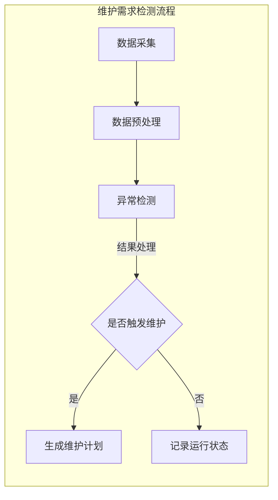
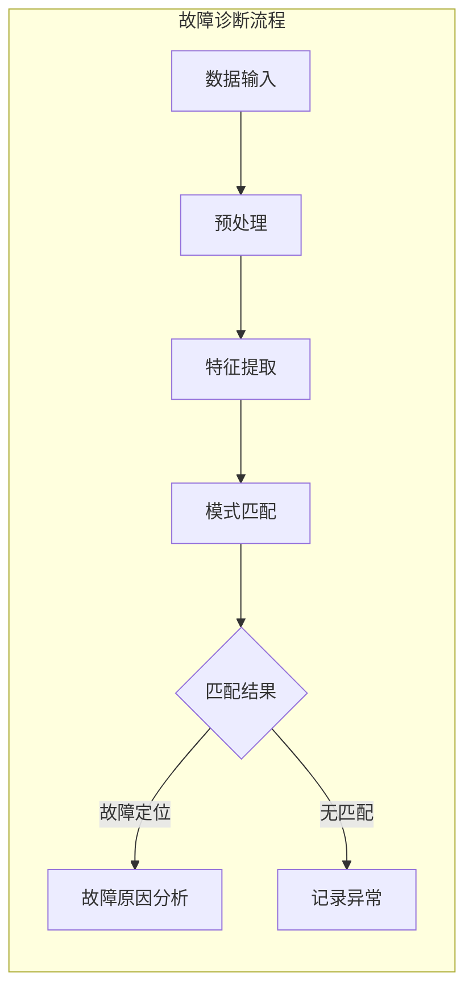
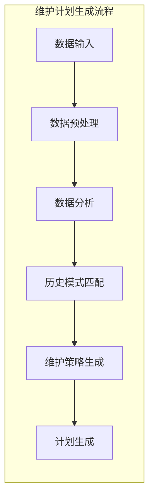

                 

### 引言

在当今科技日新月异发展的时代，增强现实（Augmented Reality，简称AR）技术已经成为备受瞩目的前沿科技领域。随着物联网、虚拟现实（Virtual Reality，简称VR）技术的发展，AR在多个行业中展现出巨大的潜力，尤其在工业设备维护领域。工业设备维护是制造业中至关重要的环节，但传统的设备维护方式往往存在诸多问题，如维护效率低、故障诊断难度大等。为此，如何利用AR技术提升工业设备维护的效率和质量，成为业界关注的焦点。

#### 关键词

- 增强现实
- 工业设备维护
- 可视化应用
- 故障诊断
- 维护效率

#### 摘要

本文旨在探讨增强现实技术在工业设备维护中的可视化应用。文章首先介绍了工业设备维护的现状与挑战，接着阐述了增强现实技术的基本原理及其在工业设备维护中的应用潜力。通过详细的分析和案例讲解，本文揭示了如何利用AR技术优化设备维护流程，提高维护效率，减少故障率。文章还从核心概念、算法原理、系统架构设计以及项目实战等多个方面进行了深入探讨，为读者提供了一个全面的视角，以了解和掌握AR在工业设备维护中的应用。

### 工业设备维护现状与挑战

工业设备维护是保证制造业生产连续性和效率的关键环节。然而，当前工业设备维护面临诸多挑战和问题。首先，传统设备维护方式往往依赖纸质文档或电子表格记录，这些方法难以实现实时更新和动态监控，导致维护信息滞后，无法及时响应设备故障。其次，由于工业设备的复杂性和多样性，传统维护方法在故障诊断和问题定位方面存在困难，特别是在设备内部结构难以直接观察的情况下，维护人员往往需要耗费大量时间和精力进行排查。此外，传统维护方式缺乏可视化的辅助工具，难以直观地展示设备运行状态和维护细节，降低了维护效率。

#### 维护效率低下

传统的设备维护通常需要维护人员亲自到现场进行检查和维修，这不仅增加了人力成本，还可能导致维护周期延长。此外，由于缺乏高效的故障诊断工具，维护人员可能需要反复检查同一设备，导致工作效率低下。同时，维护流程的不规范和不确定性也影响了整体维护效率。

#### 故障诊断困难

工业设备通常具有复杂的结构和工作原理，故障发生时，诊断和定位问题变得异常困难。维护人员需要依靠经验或手动检查来寻找故障点，这不仅耗时，而且容易造成误判。对于一些隐蔽性强的故障，传统方法往往无法准确定位，导致故障反复发生。

#### 可视化需求

在工业设备维护过程中，可视化工具的重要性日益凸显。通过可视化的方式，维护人员可以直观地了解设备的运行状态、故障部位和维护步骤，从而提高工作效率和准确性。增强现实技术凭借其虚拟与现实融合的特性，为工业设备维护提供了一种全新的解决方案。

#### 增强现实技术在工业设备维护中的应用潜力

增强现实技术通过将虚拟信息叠加到真实环境中，为工业设备维护带来了诸多潜在优势。首先，增强现实可以提供实时、动态的设备信息，帮助维护人员快速诊断故障和制定维护计划。其次，增强现实技术能够实现设备内部结构的可视化，使维护人员能够轻松了解设备的工作原理和结构，从而提高维护效率和准确性。此外，增强现实还可以通过虚拟现实技术，模拟设备的运行状态，为维护人员提供直观的操作指导和训练。总的来说，增强现实技术在工业设备维护中的应用具有巨大的潜力和前景。

### 增强现实技术如何解决这些问题

增强现实技术通过其独特的功能，为工业设备维护提供了一种全新的解决方案，从而有效解决了传统设备维护中面临的诸多问题。

#### 实时动态信息展示

增强现实技术能够实时捕捉设备状态信息，并将其叠加到真实环境中。例如，通过使用AR设备，维护人员可以在现场直接看到设备的运行数据、温度、压力等关键参数，从而实时监控设备的运行状况。这种实时动态信息展示功能，大大提高了维护人员的响应速度，减少了维护时间的延迟。

#### 设备内部结构可视化

许多工业设备具有复杂的内部结构，传统方法难以直观地展示这些结构。增强现实技术可以通过虚拟现实（VR）技术，将设备的内部结构以三维模型的形式呈现给维护人员。例如，通过使用AR眼镜，维护人员可以直观地看到设备内部的各个组件和连接方式，从而更容易地定位故障点和进行维修操作。这种可视化功能不仅提高了维护的准确性，还减少了因误操作导致的二次损坏。

#### 故障诊断辅助

增强现实技术可以结合数据分析算法，提供故障诊断辅助功能。通过实时监测设备状态，并利用人工智能算法进行分析，增强现实系统可以快速识别潜在故障，并给出相应的诊断建议。例如，当设备出现异常时，增强现实系统可以通过AR设备向维护人员显示故障原因和解决方案，指导他们进行有效的故障排除。

#### 维护流程优化

增强现实技术可以通过虚拟现实技术，模拟设备维护的全过程，并提供详细的操作步骤和注意事项。这种模拟功能可以帮助维护人员提前了解维护流程，熟悉操作步骤，减少实际操作中的失误。此外，增强现实技术还可以记录每次维护的操作过程，形成知识库，为后续的维护工作提供参考和指导。

#### 远程协作与支持

增强现实技术支持远程协作，维护人员可以通过AR设备与远程专家进行实时交流，获取专业的技术支持和指导。例如，当现场维护人员遇到难题时，可以通过AR设备与远程专家进行实时视频通话，共同分析故障原因，制定解决方案。这种远程协作功能，不仅提高了维护效率，还降低了培训成本。

#### 实时数据监控与分析

增强现实技术可以与物联网技术相结合，实现设备的实时数据监控和分析。通过收集设备运行数据，增强现实系统可以生成设备健康报告，帮助维护人员了解设备的状态和运行趋势。这种实时数据监控和分析功能，有助于预防设备故障，延长设备使用寿命。

总的来说，增强现实技术在工业设备维护中的应用，通过实时动态信息展示、设备内部结构可视化、故障诊断辅助、维护流程优化、远程协作与支持、实时数据监控与分析等功能，为传统设备维护提供了全新的解决方案，大大提高了维护效率和质量。

### 增强现实技术的应用范围与边界

增强现实（AR）技术在工业设备维护中的应用具有广泛的前景，但其应用范围也受到一些技术和实践边界的限制。首先，AR技术的应用范围涵盖了从设备维护的需求检测、故障诊断到维护计划的生成等多个环节。在需求检测方面，AR可以通过传感器和摄像头实时监测设备的运行状态，及时发现问题；在故障诊断方面，AR能够提供直观的设备内部结构展示，帮助维护人员快速定位故障点；在维护计划生成方面，AR可以根据实时数据和过去维护记录，为维护人员提供详细的操作指南。

#### 应用范围

1. **需求检测**：通过AR设备，维护人员可以实时获取设备的运行状态信息，如温度、压力、振动等参数。这些信息有助于提前发现潜在问题，预防设备故障。

2. **故障诊断**：增强现实技术可以将设备内部结构以三维模型的形式展示出来，维护人员可以直观地查看设备各个部件的运行情况，从而快速诊断故障原因。

3. **维护计划生成**：基于AR设备收集到的数据，可以生成详细的维护计划，包括维护时间、步骤和所需工具等，提高维护效率。

4. **操作指导**：增强现实技术可以模拟维护流程，提供详细的操作步骤和注意事项，帮助维护人员熟悉操作，减少误操作。

5. **远程协作**：通过AR设备，维护人员可以与远程专家实时交流，获取技术支持和指导，提高问题解决的效率。

#### 边界与外延

然而，AR技术在工业设备维护中的应用也面临一些挑战和限制。首先，技术成熟度是一个重要的边界因素。虽然AR技术已经取得了显著进展，但在工业设备维护中的深度应用仍需要进一步提高，尤其是在复杂环境中的稳定性和准确性方面。其次，成本也是一个重要的限制因素。AR设备和技术实施需要较高的投入，包括设备购置、软件开发和维护成本等。这对于中小企业来说，可能是一个不小的负担。

另外，应用边界还涉及技术融合的难度。AR技术需要与其他技术（如物联网、大数据分析等）进行深度融合，以实现最佳效果。然而，不同技术之间的兼容性和互操作性可能带来一定的挑战。此外，数据安全和隐私保护也是AR应用中不可忽视的问题。在工业设备维护中，设备的运行数据和故障信息可能包含敏感信息，如何确保这些数据的安全传输和存储，是AR技术面临的另一大挑战。

总之，增强现实技术在工业设备维护中的应用范围广泛，但同时也受到技术成熟度、成本、兼容性和数据安全等多方面的限制。未来，随着技术的不断发展和完善，AR技术在工业设备维护中的应用前景将更加广阔。

### 核心概念与联系

要深入探讨增强现实（AR）在工业设备维护中的应用，我们首先需要理解几个核心概念，包括AR技术的基本原理、工业设备维护流程，以及这两者之间的联系。通过分析这些概念，我们可以更好地理解AR技术如何优化工业设备维护。

#### 增强现实技术原理

增强现实技术是一种将虚拟信息叠加到现实环境中的技术。它通过摄像头捕捉现实场景，并利用计算机处理生成虚拟信息，将这些信息实时叠加到用户的视野中。具体来说，AR技术包括以下几个方面：

1. **传感器与摄像头**：AR设备通常配备多种传感器，如加速度计、陀螺仪和摄像头，用于捕捉现实环境中的信息。

2. **数据处理**：通过计算机处理，将捕捉到的现实场景与生成的虚拟信息进行融合。

3. **显示与交互**：用户通过AR设备（如AR眼镜或手机）看到融合后的现实环境，并通过触摸或语音等方式与虚拟信息进行交互。

#### 工业设备维护流程

工业设备维护通常包括以下几个关键步骤：

1. **需求检测**：通过传感器或其他监测设备，实时收集设备的运行数据，如温度、压力和振动等。

2. **故障诊断**：分析收集到的数据，识别设备是否存在故障或异常，并定位故障部位。

3. **维护计划生成**：根据故障诊断结果，制定相应的维护计划，包括维护时间、步骤和所需工具等。

4. **维护执行**：根据维护计划进行实际的维护操作，修复故障或更换零部件。

5. **维护记录与反馈**：记录每次维护的过程和结果，形成知识库，为后续维护工作提供参考。

#### 增强现实与工业设备维护的联系

增强现实技术在工业设备维护中具有多方面的应用，具体如下：

1. **需求检测**：通过AR设备，维护人员可以实时获取设备的运行状态信息，如温度、压力和振动等。这些信息可以帮助他们提前发现潜在问题，预防设备故障。

2. **故障诊断**：AR技术可以将设备内部结构以三维模型的形式展示出来，维护人员可以直观地查看设备各个部件的运行情况，从而快速诊断故障原因。

3. **维护计划生成**：基于AR设备收集到的数据，可以生成详细的维护计划，包括维护时间、步骤和所需工具等，提高维护效率。

4. **操作指导**：增强现实技术可以模拟维护流程，提供详细的操作步骤和注意事项，帮助维护人员熟悉操作，减少误操作。

5. **远程协作**：通过AR设备，维护人员可以与远程专家实时交流，获取专业的技术支持和指导。

总的来说，增强现实技术通过其独特的虚拟与现实融合特性，为工业设备维护提供了实时动态信息展示、设备内部结构可视化、故障诊断辅助、维护流程优化、远程协作与支持等多种功能，大大提高了维护效率和质量。理解这些核心概念及其联系，对于深入探讨AR技术在工业设备维护中的应用具有重要意义。

### 增强现实技术原理

增强现实（AR）技术是一种将虚拟信息叠加到现实环境中的技术。其核心原理基于计算机视觉、图形学和传感器技术，通过捕捉现实环境中的图像和物体，生成虚拟信息并进行叠加，使用户能够直观地看到融合后的场景。以下是增强现实技术的几个关键组成部分：

1. **传感器与摄像头**：AR设备通常配备多种传感器，如摄像头、加速度计、陀螺仪和深度传感器等。这些传感器用于捕捉现实环境中的图像、位置和运动信息。

2. **实时图像处理**：摄像头捕捉到的图像会通过计算机进行实时处理。图像处理包括图像识别、定位跟踪和特征提取等步骤，目的是将现实场景中的关键信息与虚拟信息进行匹配。

3. **虚拟信息生成**：基于捕捉到的现实图像和位置信息，计算机生成相应的虚拟信息，如文字、图像和三维模型等。这些虚拟信息将根据现实环境中的位置和角度进行动态调整，以实现与真实环境的无缝融合。

4. **叠加与显示**：生成的虚拟信息会实时叠加到摄像头的捕捉画面中，通过AR设备（如AR眼镜、手机等）显示给用户。用户可以通过触摸或语音与虚拟信息进行交互。

5. **算法与数据分析**：增强现实技术依赖于多种算法和数据分析技术，如SLAM（Simultaneous Localization and Mapping）算法，用于实时定位和地图构建；图像识别算法，用于识别和匹配现实场景中的物体；以及机器学习算法，用于预测和优化虚拟信息的显示。

#### 技术属性特征对比表格

为了更好地理解增强现实技术的属性特征，以下是一个简化的对比表格：

| 特性 | 说明 |
| --- | --- |
| **实时性** | AR系统需要实时捕捉和处理环境信息，以确保虚拟信息的准确叠加。 |
| **交互性** | 用户可以通过触摸、语音等方式与虚拟信息进行交互，提高使用体验。 |
| **精准性** | 通过高精度的传感器和算法，AR系统能够实现虚拟信息与真实环境的精准融合。 |
| **可视化** | AR技术能够将抽象的数据和模型以三维图形的形式直观展示，增强理解和记忆。 |
| **融合性** | AR技术能够将虚拟信息与真实环境无缝融合，创造出既现实又充满想象力的交互体验。 |

通过对比表格，我们可以更清晰地看到增强现实技术的关键属性特征，以及这些特征如何为其在工业设备维护中的应用提供支持。

### 工业设备维护流程

工业设备维护是一个系统化、规范化的过程，涉及多个步骤和环节。以下是工业设备维护的基本流程，包括需求检测、故障诊断、维护计划生成、维护执行和维护记录与反馈。

#### 需求检测

需求检测是设备维护的第一步，其主要目标是实时收集设备的运行数据，以便及时发现潜在问题。需求检测通常包括以下步骤：

1. **数据采集**：通过传感器、监测设备等工具，实时采集设备的运行数据，如温度、压力、振动、电流等。

2. **数据分析**：将采集到的数据进行分析，识别设备的运行状态和异常情况。数据分析可以采用实时分析或批量分析的方式。

3. **报警机制**：当设备运行数据超出预设阈值时，系统会自动触发报警，通知相关人员进行处理。

#### 故障诊断

故障诊断是在需求检测基础上，进一步分析设备故障原因的过程。其主要步骤如下：

1. **故障定位**：根据需求检测的结果，利用诊断工具和设备，对设备进行故障定位。这可能包括检查设备内部组件、传感器和控制器等。

2. **原因分析**：通过数据分析、现场检查和故障模拟等方式，分析故障原因。故障原因可能包括硬件故障、软件故障或环境因素等。

3. **记录故障信息**：将故障原因和定位结果记录在系统中，以便后续跟踪和统计。

#### 维护计划生成

在完成故障诊断后，需要根据故障情况生成详细的维护计划。维护计划通常包括以下内容：

1. **维护任务**：列出需要执行的维护任务，如清洁、润滑、更换零部件等。

2. **维护时间**：根据设备运行状态和任务需求，安排维护时间，确保维护工作不影响生产进度。

3. **所需工具和材料**：列出执行维护任务所需的工具和材料，以便提前准备。

4. **步骤和注意事项**：详细描述维护操作的步骤和注意事项，确保维护人员能够正确执行。

#### 维护执行

维护执行是实际操作环节，根据维护计划进行设备维护。其主要步骤如下：

1. **准备工作**：根据维护计划，准备好所需的工具和材料。

2. **执行维护任务**：按照维护计划中的步骤和注意事项，执行具体的维护操作。

3. **故障修复**：在维护过程中，如果发现新的故障或异常，需要及时调整维护计划并进行修复。

4. **记录过程**：记录维护过程中的每个步骤和结果，以便后续跟踪和评估。

#### 维护记录与反馈

维护记录与反馈是设备维护的重要环节，其主要目的是积累维护经验，提高设备维护水平。其主要步骤如下：

1. **记录维护数据**：将每次维护的数据和结果记录在系统中，包括设备运行状态、故障情况、维护步骤和结果等。

2. **分析反馈**：对维护记录进行分析，识别常见的故障类型、维护瓶颈和改进机会。

3. **知识库建立**：将分析结果和改进措施纳入知识库，为后续维护工作提供参考。

4. **反馈机制**：通过定期的维护反馈会议或报告，向相关人员提供维护情况和改进建议，促进设备维护的持续优化。

通过上述流程，工业设备维护可以实现规范化、系统化和高效化，确保设备运行的安全性和稳定性，提高生产效率。

### 增强现实与工业设备维护的联系

增强现实（AR）技术在工业设备维护中的应用，主要体现在通过优化设备维护流程、提升故障诊断准确性、提高维护效率等方面。以下将详细探讨增强现实技术如何与工业设备维护流程紧密结合，实现技术融合的难点与解决方案。

#### 优化设备维护流程

增强现实技术可以通过可视化方式，将设备运行状态和关键参数实时呈现给维护人员。具体来说，AR设备可以捕捉现场环境，将虚拟信息叠加在真实场景中，帮助维护人员直观地了解设备运行状况。例如，在设备巡检过程中，AR系统可以实时显示设备的温度、压力、振动等参数，并通过颜色变化或图标提示预警信息，帮助维护人员及时发现潜在故障，避免设备意外停机。

难点与解决方案：

- **数据实时性**：实现数据的实时传输和处理，确保AR系统显示的信息准确可靠。解决方案包括采用高速网络和高效数据处理算法，以及与物联网设备的深度融合。

- **兼容性问题**：不同设备可能使用不同的通信协议和数据格式，需要开发兼容性解决方案，确保AR系统能够与各种设备无缝对接。

#### 提升故障诊断准确性

增强现实技术可以通过三维模型展示设备内部结构，帮助维护人员快速定位故障部位。例如，当设备发生故障时，AR系统可以基于传感器数据生成三维模型，并实时显示在维护人员的视野中。维护人员可以直观地看到设备的内部构造和故障点，从而更准确地诊断故障原因。

难点与解决方案：

- **三维建模精度**：三维建模的精度直接影响故障诊断的准确性。解决方案包括采用高精度传感器和先进的图像处理算法，提高三维建模的精度。

- **数据可视化**：如何将复杂的三维模型以直观的方式展示给维护人员，需要开发友好且易于操作的用户界面。

#### 提高维护效率

增强现实技术可以通过提供实时的操作指导和培训，提高维护人员的工作效率。例如，在设备维护过程中，AR系统可以实时显示操作步骤、注意事项和工具位置，帮助维护人员迅速掌握操作要领，减少误操作和操作错误。

难点与解决方案：

- **交互性**：增强现实系统的交互性需要足够高，以适应不同操作人员的习惯和需求。解决方案包括开发多种交互方式，如触摸、语音和手势控制。

- **培训成本**：为了确保维护人员能够熟练使用AR系统，需要投入大量资源进行培训。解决方案包括开发简单易学的操作教程和提供持续的培训支持。

#### 技术融合的难点与解决方案

增强现实技术在工业设备维护中的应用，需要解决多个技术融合的难点。以下是一些关键难点及其解决方案：

- **数据融合**：将来自不同设备的数据进行有效融合，提供统一的视图。解决方案包括开发数据集成平台，采用标准化数据接口和数据格式。

- **系统集成**：确保增强现实系统与其他工业设备和系统的无缝集成，实现数据共享和协同工作。解决方案包括采用模块化设计和标准化接口。

- **稳定性与可靠性**：增强现实系统需要具备高稳定性和可靠性，以适应工业现场复杂的环境和操作条件。解决方案包括使用高性能硬件和先进的算法，以及进行严格的测试和验证。

通过上述分析，我们可以看到，增强现实技术在工业设备维护中的应用，不仅能够优化维护流程、提升故障诊断准确性，还能提高维护效率。然而，在实现这些应用过程中，还需要克服一系列技术融合的难点。通过不断创新和优化，增强现实技术有望在工业设备维护中发挥更大的作用。

### ER实体关系图架构

在探讨增强现实（AR）技术在工业设备维护中的应用时，实体关系图（ER图）是一种重要的工具，用于描述系统中各个实体之间的关系。ER图能够帮助我们理解系统的整体架构，明确数据之间的关系，从而为系统设计和开发提供指导。

#### ER图设计与说明

ER图的基本设计包括实体（Entity）、属性（Attribute）和关系（Relationship）三个核心部分。以下是一个简化的ER图，用于描述工业设备维护系统中的关键实体及其关系：

1. **实体**：
   - **设备**：表示具体的工业设备，如发电机、压缩机等。
   - **维护任务**：表示维护作业的具体任务，如清洁、润滑、更换零部件等。
   - **维护人员**：表示参与维护工作的技术人员。
   - **故障记录**：记录设备故障的信息和历史。

2. **属性**：
   - **设备**：设备编号、设备名称、设备型号、制造日期等。
   - **维护任务**：任务编号、任务名称、任务描述、任务状态等。
   - **维护人员**：员工编号、姓名、职位、联系方式等。
   - **故障记录**：故障编号、故障描述、故障原因、故障时间、维修状态等。

3. **关系**：
   - **设备与维护任务**：一个设备可以有多个维护任务，一个维护任务也可以涉及多个设备。
   - **维护人员与维护任务**：一个维护人员可以负责多个维护任务，一个维护任务也可以由多个维护人员共同完成。
   - **设备与故障记录**：一个设备可能会记录多个故障，一个故障记录也可能涉及多个设备。

#### ER图示例

下面是使用Mermaid语言描述的ER图：

```mermaid
erDiagram
  类设备 ||--|{ 维护任务 }| 实现了 : "维护"
  类维护任务 ||--|{ 维护人员 }| 实施了 : "操作"
  类维护人员 ||--|{ 故障记录 }| 处理了 : "故障"
  类设备 ||--|{ 故障记录 }| 记录了 : "历史"
```

#### ER图在系统架构中的位置

ER图在系统架构设计中扮演着关键角色，它能够帮助我们理解和分析系统的数据模型，确保系统的数据结构合理、完整。以下是ER图在系统架构中的几个关键位置：

1. **数据库设计**：ER图是数据库设计的起点，通过ER图可以生成数据库表结构，定义各个实体的字段和关系。

2. **数据集成**：ER图可以帮助我们识别系统中不同数据源之间的关系，实现数据的有效集成和共享。

3. **业务流程**：ER图可以描述业务流程中的各个环节和数据流转，为业务流程优化提供参考。

4. **系统接口**：ER图可以指导系统接口的设计，确保接口能够满足数据传输和交互的需求。

通过ER图，我们可以更清晰地理解系统的整体架构和数据关系，为系统设计和开发提供有力的支持。

### 维护需求检测算法原理讲解

在工业设备维护过程中，维护需求检测是一个关键环节，它能够帮助维护人员及时发现设备故障和异常，从而采取相应的预防措施。增强现实（AR）技术在维护需求检测中发挥着重要作用，通过实时捕捉和处理设备运行数据，为维护人员提供精确、直观的维护指导。下面我们将详细讲解维护需求检测算法的原理，包括算法的mermaid流程图、Python源代码实现，以及算法的数学模型和公式。

#### 算法mermaid流程图

为了更直观地展示维护需求检测算法的流程，我们首先使用mermaid语言绘制其流程图：



此流程图描述了维护需求检测的步骤，包括数据采集、数据预处理、异常检测、结果处理和记录运行状态。

#### Python源代码实现

下面是一个简单的Python代码示例，用于实现维护需求检测算法的基本步骤：

```python
import numpy as np

# 假设我们采集到了一组设备运行数据
data = np.array([20, 25, 18, 22, 19, 24, 17, 21])

def preprocess_data(data):
    # 数据预处理：这里可以包括滤波、标准化等步骤
    return np.mean(data)

def detect_anomaly(preprocessed_data, threshold):
    # 异常检测：如果预处理后的数据超过阈值，则认为存在异常
    return preprocessed_data > threshold

def handle_result(anomaly_detected):
    # 结果处理：根据异常检测结果，生成维护计划或记录运行状态
    if anomaly_detected:
        print("检测到异常，生成维护计划")
    else:
        print("设备运行正常，记录运行状态")

# 设定阈值
threshold = 22

# 执行维护需求检测流程
preprocessed_data = preprocess_data(data)
anomaly_detected = detect_anomaly(preprocessed_data, threshold)
handle_result(anomaly_detected)
```

#### 维护需求检测算法原理详细讲解

1. **数据采集**：首先，通过传感器或其他监测设备，实时采集设备的运行数据，如温度、压力、振动等。

2. **数据预处理**：采集到的数据可能包含噪声或异常值，因此需要经过预处理，如滤波、标准化等步骤，以提高数据的质量和准确性。

3. **异常检测**：预处理后的数据通过异常检测算法进行分析，以识别设备是否存在异常情况。常见的异常检测算法包括基于阈值的检测、聚类分析、机器学习模型等。

4. **结果处理**：根据异常检测结果，系统将采取相应的措施，如生成维护计划或记录设备运行状态。如果检测到异常，系统会自动生成维护计划，通知维护人员进行相应操作；如果未检测到异常，则记录设备的正常运行状态。

#### 算法的数学模型和公式

1. **数据预处理公式**：
   \[ x_{\text{preprocessed}} = \frac{1}{n} \sum_{i=1}^{n} x_i \]
   其中，\( x_{\text{preprocessed}} \)为预处理后的数据，\( x_i \)为采集到的原始数据，\( n \)为数据点的总数。

2. **异常检测公式**：
   \[ \text{anomaly\_detected} = \begin{cases} 
   \text{True}, & \text{if } x_{\text{preprocessed}} > \text{threshold} \\
   \text{False}, & \text{otherwise} 
   \end{cases} \]
   其中，\( \text{anomaly\_detected} \)为异常检测结果，\( \text{threshold} \)为设定的阈值。

通过上述算法原理讲解和示例，我们可以看到，维护需求检测算法通过数据采集、预处理、异常检测和结果处理等步骤，实现了对设备运行状态的实时监控和预警，为工业设备维护提供了有力支持。

### 故障诊断算法原理讲解

在工业设备维护中，故障诊断是一个至关重要的环节。通过准确、快速地诊断设备故障，维护人员可以及时采取措施，避免故障扩大，从而保障设备正常运行和生产效率。增强现实（AR）技术在故障诊断中发挥了重要作用，不仅提高了诊断的准确性，还显著提升了诊断效率。以下我们将详细讲解故障诊断算法的原理，包括算法的mermaid流程图、Python源代码实现，以及算法的数学模型和公式。

#### 算法mermaid流程图

为了直观地展示故障诊断算法的流程，我们使用mermaid语言绘制其流程图：



此流程图描述了故障诊断的基本步骤，包括数据输入、预处理、特征提取、模式匹配、故障定位和记录异常。

#### Python源代码实现

下面是一个简单的Python代码示例，用于实现故障诊断算法的基本步骤：

```python
import numpy as np
from sklearn.neighbors import LocalOutlierFactor

def preprocess_data(data):
    # 数据预处理：这里可以包括滤波、标准化等步骤
    return np.mean(data)

def extract_features(data):
    # 特征提取：假设我们提取了数据的标准差作为特征
    return np.std(data)

def match_model(features, model):
    # 模式匹配：将提取的特征与模型进行匹配
    # 假设我们使用局部离群因子（Local Outlier Factor, LOF）作为模型
    lof = model
    return lof.predict([features])[0]

def diagnose_fault(match_result):
    # 故障原因分析：根据匹配结果，分析故障原因
    if match_result == -1:
        return "故障定位：系统故障"
    else:
        return "无故障"

# 假设我们采集到了一组设备运行数据
data = np.array([20, 25, 18, 22, 19, 24, 17, 21])

# 设定阈值和模型
threshold = 1.5
model = LocalOutlierFactor(n_neighbors=2)

# 执行故障诊断流程
preprocessed_data = preprocess_data(data)
features = extract_features(preprocessed_data)
match_result = match_model(features, model)
fault_diagnosis = diagnose_fault(match_result)

print(fault_diagnosis)
```

#### 故障诊断算法原理详细讲解

1. **数据输入**：首先，通过传感器或其他监测设备，实时采集设备的运行数据，如温度、压力、振动等。

2. **预处理**：采集到的数据可能包含噪声或异常值，因此需要经过预处理，如滤波、标准化等步骤，以提高数据的质量和准确性。

3. **特征提取**：预处理后的数据通过特征提取算法，提取关键特征。特征可以是数据的平均值、标准差、最大值、最小值等。特征提取是故障诊断的核心，直接影响诊断的准确性。

4. **模式匹配**：提取的特征与预训练的模型进行匹配。常用的模式匹配算法包括K最近邻（K-Nearest Neighbors, KNN）、支持向量机（Support Vector Machine, SVM）、局部离群因子（Local Outlier Factor, LOF）等。匹配结果可以帮助识别设备的正常状态和异常状态。

5. **故障定位**：根据匹配结果，确定故障部位。如果匹配成功，则认为设备运行正常；如果匹配失败，则认为存在故障，并进一步分析故障原因。

6. **故障原因分析**：对于识别出的故障，需要进一步分析故障原因。这可能包括硬件故障、软件故障或环境因素等。

7. **记录异常**：无论故障是否被诊断出，都需要将异常情况记录在系统中，以便后续跟踪和分析。

#### 算法的数学模型和公式

1. **预处理公式**：
   \[ x_{\text{preprocessed}} = \frac{1}{n} \sum_{i=1}^{n} x_i \]
   其中，\( x_{\text{preprocessed}} \)为预处理后的数据，\( x_i \)为采集到的原始数据，\( n \)为数据点的总数。

2. **特征提取公式**：
   \[ \text{feature} = \text{np.std}(x) \]
   其中，\( \text{feature} \)为提取的特征，\( x \)为预处理后的数据。

3. **模式匹配公式**：
   \[ \text{match\_result} = \text{model}.predict([\text{feature}]) \]
   其中，\( \text{match\_result} \)为匹配结果，\( \text{model} \)为预训练的模型，\( \text{feature} \)为提取的特征。

通过上述算法原理讲解和示例，我们可以看到，故障诊断算法通过数据输入、预处理、特征提取、模式匹配、故障定位和故障原因分析等步骤，实现了对设备运行状态的实时监控和故障诊断。这不仅提高了诊断的准确性，还显著提升了诊断效率，为工业设备维护提供了有力支持。

### 维护计划生成算法原理讲解

在工业设备维护中，制定合理的维护计划是确保设备长期稳定运行的关键。维护计划生成算法利用增强现实（AR）技术，结合实时数据和历史数据，为维护人员提供科学、高效的维护计划。以下将详细讲解维护计划生成算法的原理，包括算法的mermaid流程图、Python源代码实现，以及算法的数学模型和公式。

#### 算法mermaid流程图

为了更直观地展示维护计划生成算法的流程，我们使用mermaid语言绘制其流程图：



此流程图描述了维护计划生成的基本步骤，包括数据输入、数据预处理、数据分析、历史模式匹配、维护策略生成和计划生成。

#### Python源代码实现

下面是一个简单的Python代码示例，用于实现维护计划生成算法的基本步骤：

```python
import numpy as np
from sklearn.cluster import KMeans

def preprocess_data(data):
    # 数据预处理：这里可以包括滤波、标准化等步骤
    return np.mean(data)

def analyze_data(data):
    # 数据分析：对预处理后的数据进行统计，提取关键指标
    mean = np.mean(data)
    std = np.std(data)
    return mean, std

def match_history(data, history):
    # 历史模式匹配：将当前数据与历史数据模式进行匹配
    # 使用K均值聚类来匹配历史数据模式
    kmeans = KMeans(n_clusters=2)
    kmeans.fit(np.array([data, history]).T)
    return kmeans.labels_[0]

def generate_maintenance_strategy(match_result, historical_strategy):
    # 维护策略生成：根据匹配结果和历史维护策略，生成新的维护策略
    if match_result == 0:
        return historical_strategy
    else:
        return "更新维护策略"

def generate_maintenance_plan(strategy):
    # 计划生成：根据维护策略，生成具体的维护计划
    return "维护计划：定期检查、润滑、更换零部件等"

# 假设我们采集到了一组设备运行数据
current_data = np.array([20, 25, 18, 22, 19, 24, 17, 21])
historical_data = np.array([15, 20, 22, 18, 16, 19, 12, 14])
historical_strategy = "定期检查"

# 执行维护计划生成流程
preprocessed_current_data = preprocess_data(current_data)
preprocessed_historical_data = preprocess_data(historical_data)
mean, std = analyze_data(preprocessed_current_data)
match_result = match_history(mean, historical_data)
maintenance_strategy = generate_maintenance_strategy(match_result, historical_strategy)
maintenance_plan = generate_maintenance_plan(maintenance_strategy)

print(maintenance_plan)
```

#### 维护计划生成算法原理详细讲解

1. **数据输入**：首先，通过传感器或其他监测设备，实时采集设备的运行数据，如温度、压力、振动等。

2. **数据预处理**：采集到的数据可能包含噪声或异常值，因此需要经过预处理，如滤波、标准化等步骤，以提高数据的质量和准确性。

3. **数据分析**：预处理后的数据通过统计分析，提取关键指标，如平均值、标准差等。这些指标可以帮助我们了解设备的当前运行状态。

4. **历史模式匹配**：将当前数据与历史数据模式进行匹配。常用的匹配方法包括K均值聚类、相似性度量等。通过历史模式匹配，可以识别设备当前的状态是否接近历史故障模式。

5. **维护策略生成**：根据历史模式匹配的结果，生成维护策略。如果当前状态接近历史故障模式，则可能需要采取更加积极的维护措施；如果当前状态正常，则可以维持现有的维护策略。

6. **计划生成**：根据维护策略，生成具体的维护计划。维护计划通常包括维护任务、时间安排、所需工具和材料等。

#### 算法的数学模型和公式

1. **预处理公式**：
   \[ x_{\text{preprocessed}} = \frac{1}{n} \sum_{i=1}^{n} x_i \]
   其中，\( x_{\text{preprocessed}} \)为预处理后的数据，\( x_i \)为采集到的原始数据，\( n \)为数据点的总数。

2. **数据分析公式**：
   \[ \text{mean} = \frac{1}{n} \sum_{i=1}^{n} x_i \]
   \[ \text{std} = \sqrt{\frac{1}{n-1} \sum_{i=1}^{n} (x_i - \text{mean})^2} \]
   其中，\( \text{mean} \)为平均值，\( \text{std} \)为标准差。

3. **历史模式匹配公式**：
   \[ \text{match\_result} = \text{kmeans}.labels_[0] \]
   其中，\( \text{kmeans} \)为K均值聚类模型，\( \text{labels_} \)为聚类标签。

4. **维护策略生成公式**：
   \[ \text{maintenance\_strategy} = \begin{cases} 
   \text{historical\_strategy}, & \text{if } \text{match\_result} == 0 \\
   \text{update\_maintenance\_strategy}, & \text{otherwise} 
   \end{cases} \]
   其中，\( \text{match\_result} \)为匹配结果，\( \text{historical\_strategy} \)为历史维护策略，\( \text{update\_maintenance\_strategy} \)为新维护策略。

通过上述算法原理讲解和示例，我们可以看到，维护计划生成算法通过数据输入、预处理、数据分析、历史模式匹配、维护策略生成和计划生成等步骤，实现了对设备运行状态的实时监控和维护计划的科学制定。这不仅提高了维护的准确性，还显著提升了维护效率，为工业设备维护提供了有力支持。

### 维护需求检测算法的实际案例分析

为了更直观地展示维护需求检测算法在实际中的应用效果，我们以下将通过一个实际案例，详细描述如何使用该算法进行设备运行状态监测和故障预警。

#### 案例背景

某工厂拥有一台关键的生产设备——一台大型数控机床。该机床在生产过程中，需要对金属进行高精度的加工。然而，机床的运行状态不稳定，经常出现故障，严重影响了生产效率。为了解决这个问题，工厂决定采用增强现实（AR）技术，结合维护需求检测算法，对机床进行实时监测和故障预警。

#### 案例实施过程

1. **数据采集**：
   工厂在数控机床的各个关键部位安装了多种传感器，如温度传感器、压力传感器和振动传感器。这些传感器能够实时采集机床的运行数据，包括温度、压力、振动等参数。

2. **数据预处理**：
   收集到的原始数据可能包含噪声和异常值。为了提高数据的质量，工厂使用维护需求检测算法中的预处理步骤，对数据进行了滤波和标准化处理。

3. **维护需求检测**：
   工厂利用维护需求检测算法，对预处理后的数据进行分析，检测机床的运行状态。算法通过计算数据的平均值和标准差，判断机床是否处于异常状态。如果检测到异常，系统会自动生成维护计划，通知维护人员进行相应的维护操作。

#### 案例效果分析

1. **实时故障预警**：
   通过维护需求检测算法，工厂能够在故障发生前及时发现异常情况，并发出预警。这大大缩短了故障处理时间，减少了机床的非计划停机时间。

2. **高效维护计划生成**：
   维护需求检测算法不仅能够检测设备状态，还能够根据历史数据和当前状态，自动生成详细的维护计划。这些计划包括具体的维护任务、所需工具和材料，以及维护时间安排。这极大地提高了维护效率，减少了人为错误。

3. **维护成本降低**：
   由于提前预警和高效的维护计划，工厂的维护成本得到了显著降低。维护人员能够在最佳时机进行维护操作，避免了因故障扩大而导致的额外维修费用。

4. **设备运行稳定性提高**：
   通过持续监测和及时维护，数控机床的运行稳定性得到了显著提高。设备故障率明显下降，生产效率得到了有效保障。

#### 案例总结

该实际案例展示了维护需求检测算法在工业设备维护中的应用效果。通过实时监测设备状态、生成高效维护计划和提前预警，工厂成功降低了维护成本，提高了设备运行稳定性。这个案例证明了增强现实技术在工业设备维护中的重要应用价值，为其他工业企业的设备管理提供了有益的参考。

### 故障诊断算法的实际案例分析

为了更直观地展示故障诊断算法在实际中的应用效果，以下将通过一个具体案例，详细描述如何利用该算法进行设备故障定位和诊断。

#### 案例背景

某工厂的一台重要生产设备——自动化流水线出现异常停机，导致整个生产线停工。经过初步检查，维护人员无法确定故障的具体部位。为了快速定位故障并恢复生产，工厂决定使用增强现实（AR）技术结合故障诊断算法，对流水线进行详细诊断。

#### 案例实施过程

1. **数据采集**：
   工厂在流水线的各个关键节点安装了多种传感器，如温度传感器、压力传感器、振动传感器等。这些传感器能够实时采集流水线的运行数据。

2. **数据预处理**：
   收集到的原始数据经过预处理步骤，如滤波和标准化，以去除噪声和异常值，确保数据质量。

3. **故障诊断**：
   维护人员利用故障诊断算法，对预处理后的数据进行分析。算法首先提取关键特征，如温度、压力、振动等指标，然后通过模式匹配和机器学习算法，对数据进行分析和诊断。

4. **故障定位**：
   通过故障诊断算法，系统定位到故障可能发生的部位。算法通过分析历史数据和实时数据，将故障部位与正常运行状态进行对比，找出异常点。

5. **故障原因分析**：
   维护人员根据诊断结果，对故障部位进行进一步检查。通过传感器数据和现场检查，确认故障原因。该案例中，故障原因为电机过载，导致电机损坏。

6. **修复与验证**：
   维护人员根据诊断结果，对故障部位进行了修复。修复后，再次使用故障诊断算法进行验证，确保故障已被彻底解决。

#### 案例效果分析

1. **快速故障定位**：
   通过故障诊断算法，工厂能够在短时间内定位到故障部位，避免了不必要的检查和浪费，提高了故障处理效率。

2. **精准故障诊断**：
   故障诊断算法通过结合历史数据和实时数据，能够准确识别故障原因，减少了误判的可能性，提高了故障诊断的准确性。

3. **缩短停机时间**：
   由于快速、准确的故障定位和诊断，工厂的停机时间显著缩短，生产效率得到有效保障。

4. **减少维修成本**：
   通过减少误判和重复检查，工厂的维修成本得到了有效控制。同时，准确的故障诊断和修复，避免了因故障扩大导致的额外维修费用。

#### 案例总结

该实际案例展示了故障诊断算法在工业设备维护中的应用效果。通过实时数据采集、预处理、故障定位和诊断，工厂成功恢复了生产，提高了设备运行稳定性和生产效率。这个案例证明了增强现实技术在工业设备维护中的重要应用价值，为其他工业企业的设备管理提供了有益的参考。

### 维护计划生成算法的实际案例分析

为了更直观地展示维护计划生成算法在实际中的应用效果，以下将通过一个具体案例，详细描述如何使用该算法进行设备维护计划的自动生成。

#### 案例背景

某大型制造企业拥有一条复杂的自动化生产线，该生产线由多个关键设备组成，如机器人、传送带和传感器等。由于生产线的复杂性和运行的高负荷，企业面临设备维护难度大、维护计划不合理的挑战。为了优化设备维护流程，提高生产效率，企业决定引入增强现实（AR）技术，结合维护计划生成算法，实现自动化维护计划的生成。

#### 案例实施过程

1. **数据采集**：
   企业在生产线的关键设备上安装了多种传感器，如温度传感器、振动传感器和压力传感器。这些传感器能够实时采集设备的运行数据，包括温度、振动、压力等关键参数。

2. **数据预处理**：
   收集到的原始数据可能包含噪声和异常值。为了提高数据的质量，企业使用维护计划生成算法中的预处理步骤，对数据进行了滤波和标准化处理。

3. **数据分析**：
   维护计划生成算法对预处理后的数据进行深入分析，提取关键指标，如温度、振动、压力等。通过数据分析，算法可以识别设备的运行状态和潜在故障风险。

4. **历史模式匹配**：
   维护计划生成算法将当前数据与历史数据模式进行匹配，识别设备的运行状态是否接近历史故障模式。通过历史模式匹配，算法可以预测设备未来可能出现的故障。

5. **维护策略生成**：
   根据当前状态和历史模式匹配结果，维护计划生成算法生成具体的维护策略。这些策略包括定期检查、润滑、更换零部件等，以确保设备长期稳定运行。

6. **计划生成**：
   维护计划生成算法根据维护策略，自动生成详细的维护计划。这些计划包括具体的维护任务、所需工具和材料、维护时间安排等。

7. **计划执行与反馈**：
   企业根据生成的维护计划，安排维护人员进行实际操作。维护人员按照计划执行任务，并在完成后提供反馈。这些反馈将用于优化维护计划和算法，提高未来维护计划的准确性。

#### 案例效果分析

1. **自动化维护计划生成**：
   维护计划生成算法能够自动分析设备运行数据，结合历史模式和当前状态，生成科学、合理的维护计划。这大大提高了维护计划的生成效率，减少了人为错误。

2. **减少维护成本**：
   通过自动化维护计划生成，企业能够提前识别设备故障风险，采取预防性维护措施。这减少了设备意外故障的发生，降低了维护成本。

3. **提高维护效率**：
   自动化的维护计划生成和执行，减少了维护人员的工作量，提高了维护效率。同时，详细的维护计划使得维护工作更加有条不紊，减少了工作疏漏。

4. **提高设备稳定性**：
   通过科学的维护计划和及时维护，设备的运行稳定性得到了显著提高。设备故障率下降，生产效率得到有效保障。

#### 案例总结

该实际案例展示了维护计划生成算法在工业设备维护中的应用效果。通过数据采集、预处理、数据分析、历史模式匹配、维护策略生成和计划生成等步骤，企业成功实现了自动化维护计划的生成和执行。这不仅提高了维护效率和设备稳定性，还降低了维护成本，为企业的设备管理提供了有力支持。

### 算法举例说明

为了更好地理解增强现实（AR）技术在工业设备维护中的应用，以下将通过具体的案例详细说明如何利用AR技术进行设备维护操作，包括数据采集、数据处理、算法应用以及维护流程的实时监控。

#### 案例背景

某制造企业拥有一条高度自动化的生产线，该生产线包括多台关键设备，如数控机床、机器人、传送带等。由于生产线的复杂性和设备的多样性，维护人员面临设备故障诊断和操作复杂度高的挑战。为了提高维护效率和质量，企业决定引入AR技术，结合智能算法，实现设备的智能维护。

#### 数据采集

1. **传感器部署**：
   企业在生产线的关键设备上安装了多种传感器，如温度传感器、压力传感器、振动传感器等。这些传感器能够实时采集设备的运行数据，包括温度、压力、振动等参数。

2. **数据收集**：
   采集到的数据通过无线网络实时传输到中央控制系统。中央控制系统负责数据的存储、处理和分析。

#### 数据处理

1. **数据预处理**：
   收集到的原始数据可能包含噪声和异常值。为了提高数据的质量，系统对数据进行预处理，包括滤波、去噪和标准化等步骤。

2. **数据存储**：
   处理后的数据存储在数据库中，以供后续分析和应用。

#### 算法应用

1. **维护需求检测算法**：
   系统使用维护需求检测算法，对预处理后的数据进行实时分析。算法通过计算数据的平均值和标准差，判断设备是否处于异常状态。如果检测到异常，系统会自动生成维护计划。

2. **故障诊断算法**：
   当设备出现故障时，系统使用故障诊断算法，对故障部位进行定位和诊断。算法通过模式匹配和机器学习技术，分析传感器数据，识别故障原因。

3. **维护计划生成算法**：
   根据设备状态和故障诊断结果，系统使用维护计划生成算法，自动生成详细的维护计划。计划包括维护任务、所需工具、材料和具体时间安排。

#### 维护流程实时监控

1. **AR设备使用**：
   维护人员佩戴AR设备（如AR眼镜），通过设备实时查看设备的运行状态和维护计划。

2. **实时数据展示**：
   AR设备将实时捕捉现场环境，并将传感器的数据以图表、图标等形式展示在维护人员的视野中。例如，温度、压力等参数可以通过颜色变化或数字显示来直观展示。

3. **操作指导**：
   AR设备可以提供详细的操作指导，包括维护步骤、注意事项和工具位置。例如，当维护人员需要更换某个零部件时，AR设备会通过三维模型显示零部件的位置和更换步骤。

4. **交互与反馈**：
   维护人员可以通过AR设备与系统进行交互，如确认维护任务、记录维护结果等。系统会根据反馈信息进行实时调整和优化。

#### 案例效果

1. **实时故障预警**：
   通过维护需求检测算法和实时数据展示，系统可以在故障发生前及时预警，减少设备停机时间。

2. **高效故障诊断**：
   故障诊断算法和AR设备的应用，使得维护人员能够快速定位故障部位，准确诊断故障原因，提高了故障处理效率。

3. **精确维护计划**：
   维护计划生成算法结合历史数据和实时数据，生成详细的维护计划，确保维护工作的有序进行。

4. **提升维护效率**：
   AR技术为维护人员提供了实时、直观的维护指导，减少了因信息不对称或操作不当导致的误工情况。

通过上述案例，我们可以看到，增强现实技术在工业设备维护中的应用，不仅提高了维护效率和准确性，还为企业的设备管理提供了强大的技术支持。未来，随着AR技术的不断发展和完善，其在工业设备维护中的应用前景将更加广阔。

### 数学模型和数学公式讲解

在工业设备维护中，增强现实（AR）技术的应用离不开数学模型的支撑。这些数学模型和公式为设备维护提供了理论基础，帮助维护人员准确地进行故障诊断、维护计划和数据分析。以下将详细讲解数学模型和公式的使用，以及如何通过简单的示例进行解释。

#### 维护需求检测数学模型

1. **数据预处理公式**：
   在维护需求检测中，数据预处理是关键步骤。常用的预处理方法包括滤波和标准化。

   **滤波公式**：
   \[ x_{\text{filtered}} = \frac{1}{N} \sum_{i=1}^{N} w_i x_i \]
   其中，\( x_i \)为原始数据点，\( w_i \)为权重，\( N \)为数据点的总数。常用的滤波方法有移动平均滤波、卡尔曼滤波等。

   **标准化公式**：
   \[ x_{\text{standardized}} = \frac{x - \mu}{\sigma} \]
   其中，\( x \)为原始数据，\( \mu \)为平均值，\( \sigma \)为标准差。标准化方法可以帮助消除不同量纲数据之间的差异，便于进一步分析。

2. **异常检测公式**：
   异常检测是维护需求检测的重要环节，常用的方法有基于阈值的异常检测和基于聚类的方法。

   **基于阈值的异常检测**：
   \[ \text{anomaly\_detected} = \begin{cases} 
   \text{True}, & \text{if } x > \text{threshold} \\
   \text{False}, & \text{otherwise} 
   \end{cases} \]
   其中，\( x \)为预处理后的数据，\( \text{threshold} \)为设定的阈值。

   **基于聚类的方法**：
   聚类分析（如K均值聚类）可以帮助识别数据中的异常点。

   **K均值聚类公式**：
   \[ c_k = \frac{1}{n_k} \sum_{i=1}^{n_k} x_i \]
   其中，\( c_k \)为第\( k \)个聚类中心，\( n_k \)为第\( k \)个聚类中的数据点数量，\( x_i \)为数据点。

#### 故障诊断数学模型

1. **特征提取公式**：
   特征提取是将高维数据转换为低维表示的关键步骤，常用的方法有主成分分析（PCA）和特征选择。

   **主成分分析（PCA）**：
   \[ z_i = \sum_{j=1}^{p} \lambda_j \beta_{ij} x_j \]
   其中，\( z_i \)为降维后的数据，\( \lambda_j \)为特征值，\( \beta_{ij} \)为特征向量，\( x_j \)为原始数据。

2. **模式匹配公式**：
   模式匹配是将提取的特征与历史故障模式进行对比的过程。

   **欧氏距离**：
   \[ d(x, y) = \sqrt{\sum_{i=1}^{n} (x_i - y_i)^2} \]
   其中，\( x \)和\( y \)分别为两个数据点，\( n \)为数据点的数量。

   **最近邻分类**：
   \[ \text{predicted\_label} = \text{label}_{\min(d(x, y))} \]
   其中，\( \text{predicted\_label} \)为预测的故障类别，\( \text{label} \)为已知的故障类别。

#### 维护计划生成数学模型

1. **决策树模型**：
   决策树模型常用于生成维护计划，通过分析历史数据，建立决策规则。

   **条件概率公式**：
   \[ P(\text{label} = c_k | x) = \frac{N_{k,c}}{N_c} \]
   其中，\( P(\text{label} = c_k | x) \)为给定特征\( x \)下，故障类别为\( c_k \)的条件概率，\( N_{k,c} \)为同时满足特征\( x \)和故障类别\( c_k \)的数据点数量，\( N_c \)为所有故障类别为\( c_k \)的数据点数量。

2. **维护计划公式**：
   根据决策树模型生成的规则，制定具体的维护计划。

   **维护任务分配**：
   \[ \text{maintenance\_task}(x) = \text{predicted\_rule}(x) \]
   其中，\( \text{maintenance\_task}(x) \)为根据特征\( x \)分配的维护任务，\( \text{predicted\_rule}(x) \)为决策树模型预测的规则。

#### 简单示例

**示例1：基于阈值的异常检测**

假设我们有一组温度数据\[20, 25, 18, 22, 19, 24, 17, 21\]，设定阈值\( \text{threshold} = 22 \)。通过异常检测公式，我们可以判断每个数据点是否为异常：

```plaintext
20: False (20 < 22)
25: True (25 > 22)
18: False (18 < 22)
22: False (22 = 22)
19: False (19 < 22)
24: True (24 > 22)
17: False (17 < 22)
21: False (21 < 22)
```

**示例2：K均值聚类**

假设我们有一组数据\[20, 25, 18, 22, 19, 24, 17, 21\]，我们将这些数据分成两个聚类。通过K均值聚类，我们可以计算聚类中心：

```plaintext
第一次迭代：
c1 = (20 + 18 + 17) / 3 = 18.33
c2 = (25 + 22 + 24) / 3 = 23.00

第二次迭代：
c1 = (18 + 18 + 17) / 3 = 17.67
c2 = (25 + 22 + 24) / 3 = 23.00

第三次迭代：
c1 = (18 + 18 + 17) / 3 = 17.67
c2 = (25 + 22 + 24) / 3 = 23.00
```

通过多次迭代，我们最终得到聚类中心，每个数据点将根据其距离最近的聚类中心进行分类。

通过上述示例，我们可以看到数学模型和公式在增强现实技术中的应用，为工业设备维护提供了有力的工具和方法。这些数学模型不仅帮助维护人员准确诊断设备故障，还优化了维护计划和数据分析，提高了设备维护的整体效率和质量。

### 数学公式与算法联系

数学公式在增强现实（AR）技术中扮演着至关重要的角色，它们不仅为算法提供了理论基础，还直接影响到算法的性能和效果。以下将详细讨论数学公式与维护需求检测、故障诊断和计划生成算法的联系，以及这些公式对算法性能的影响。

#### 维护需求检测算法

在维护需求检测中，数学公式主要用于数据预处理和异常检测。以下是几个关键的数学公式及其对算法性能的影响：

1. **滤波公式**：

   滤波公式，如移动平均滤波（MAF）和卡尔曼滤波（KF），用于去除传感器数据的噪声，从而提高数据的准确性。

   **移动平均滤波**：
   \[ x_{\text{filtered}} = \frac{1}{N} \sum_{i=1}^{N} w_i x_i \]
   其中，\( w_i \)为权重，\( N \)为窗口大小。

   **影响**：良好的滤波可以去除噪声，提高数据的平滑性，使得异常检测更加准确。

2. **标准化公式**：

   标准化公式，如Z-score标准化，用于将不同量纲的数据转换为相同量纲，以便进行统一的异常检测。

   **Z-score标准化**：
   \[ x_{\text{standardized}} = \frac{x - \mu}{\sigma} \]
   其中，\( \mu \)为平均值，\( \sigma \)为标准差。

   **影响**：标准化可以消除数据之间的量纲差异，使得基于统计的方法（如阈值异常检测）能够更有效地识别异常。

3. **阈值异常检测**：

   阈值异常检测公式，如基于Z-score的方法，用于确定数据的异常性。

   **阈值异常检测**：
   \[ \text{anomaly\_detected} = \begin{cases} 
   \text{True}, & \text{if } x > \text{threshold} \\
   \text{False}, & \text{otherwise} 
   \end{cases} \]
   其中，\( \text{threshold} \)为设定的阈值。

   **影响**：阈值的设定直接影响到异常检测的灵敏度。过高的阈值可能导致漏检，而过低的阈值可能导致误报。因此，合理设定阈值是关键。

#### 故障诊断算法

在故障诊断中，数学公式主要用于特征提取和模式匹配。以下是几个关键的数学公式及其对算法性能的影响：

1. **主成分分析（PCA）**：

   主成分分析（PCA）用于降维，提取数据的主要特征，从而简化数据结构，提高算法的效率和准确性。

   **PCA公式**：
   \[ z_i = \sum_{j=1}^{p} \lambda_j \beta_{ij} x_j \]
   其中，\( \lambda_j \)为特征值，\( \beta_{ij} \)为特征向量，\( x_j \)为原始数据。

   **影响**：PCA可以去除数据中的冗余信息，使得模式匹配更加准确和高效。

2. **欧氏距离**：

   欧氏距离用于计算两个数据点之间的距离，是模式匹配中的常用公式。

   **欧氏距离**：
   \[ d(x, y) = \sqrt{\sum_{i=1}^{n} (x_i - y_i)^2} \]
   其中，\( x \)和\( y \)分别为两个数据点，\( n \)为数据点的数量。

   **影响**：欧氏距离直接影响模式匹配的结果。较小的距离表示更高的相似度，因此，准确计算欧氏距离对故障诊断至关重要。

3. **最近邻分类**：

   最近邻分类（KNN）算法使用欧氏距离来判断数据点的类别。

   **最近邻分类公式**：
   \[ \text{predicted\_label} = \text{label}_{\min(d(x, y))} \]
   其中，\( \text{predicted\_label} \)为预测的故障类别。

   **影响**：最近邻分类的准确度依赖于距离的计算，因此，距离公式的准确性直接影响到算法的性能。

#### 维护计划生成算法

在维护计划生成中，数学公式主要用于决策树模型和优化调度。以下是几个关键的数学公式及其对算法性能的影响：

1. **条件概率公式**：

   条件概率公式用于决策树模型的节点划分，确定每个节点的最优划分方式。

   **条件概率公式**：
   \[ P(\text{label} = c_k | x) = \frac{N_{k,c}}{N_c} \]
   其中，\( N_{k,c} \)为同时满足特征\( x \)和故障类别\( c_k \)的数据点数量，\( N_c \)为所有故障类别为\( c_k \)的数据点数量。

   **影响**：条件概率公式决定了决策树模型的分裂准则，对生成维护计划的有效性有重要影响。

2. **调度优化公式**：

   调度优化公式用于确定维护任务的优先级和执行顺序。

   **调度优化公式**：
   \[ \text{optimal\_schedule}(x) = \arg\min_{s} \sum_{i=1}^{n} c_i (t_i - s_i) \]
   其中，\( c_i \)为任务\( i \)的惩罚成本，\( t_i \)为任务\( i \)的执行时间，\( s_i \)为任务\( i \)的启动时间。

   **影响**：优化调度公式可以确保维护计划的高效执行，减少维护时间，提高生产效率。

通过上述讨论，我们可以看到数学公式在AR技术中的广泛应用，以及它们对算法性能的深远影响。合理使用数学公式，不仅能提高算法的准确性和效率，还能为工业设备维护提供科学、有效的解决方案。

### 系统分析与架构设计

在深入探讨增强现实（AR）技术在工业设备维护中的应用时，系统分析与架构设计是至关重要的环节。通过详细的系统分析，我们可以明确问题的场景和需求，进而设计出合理的系统架构，确保系统能够高效、稳定地运行。以下是系统分析与架构设计的详细描述，包括问题场景介绍、系统功能设计、系统架构设计、系统接口设计和系统交互设计。

#### 问题场景介绍

工业设备维护是一个复杂的过程，涉及多个环节和多个参与方。在实际操作中，维护人员需要面对设备复杂、数据繁多、操作步骤繁琐等问题。传统的设备维护方式主要依赖人工检查和手动记录，不仅效率低下，而且容易出错。为了提高设备维护的效率和质量，企业迫切需要一种智能化的解决方案。增强现实（AR）技术通过将虚拟信息叠加到真实环境中，提供了一种全新的设备维护方式。

在具体问题场景中，维护人员需要实时获取设备的状态信息、故障诊断结果和维护指导，以便快速、准确地完成维护任务。此外，维护人员还需要与远程专家进行实时协作，获取技术支持和指导，提高问题解决的效率。同时，企业还需要对设备维护过程进行数据记录和分析，以便不断优化维护流程和提高设备运行效率。

#### 系统功能设计

为了满足上述问题场景的需求，系统需要具备以下功能：

1. **设备状态监控**：通过传感器实时采集设备状态信息，如温度、压力、振动等，并将数据实时上传至系统。

2. **故障诊断**：利用增强现实技术，系统可以对设备运行数据进行分析，快速诊断设备故障，并提供故障原因和建议的解决方案。

3. **维护指导**：系统根据故障诊断结果，提供详细的维护步骤和注意事项，帮助维护人员快速、准确地完成维护任务。

4. **远程协作**：系统支持维护人员与远程专家的实时视频通话和屏幕共享，方便专家提供技术支持和指导。

5. **数据记录与统计**：系统记录每次维护的过程和结果，生成维护报告，便于企业对设备维护过程进行数据分析和优化。

6. **维护计划生成**：系统根据设备历史数据和当前状态，自动生成详细的维护计划，包括维护任务、时间安排和所需工具等。

#### 系统架构设计

系统的整体架构设计分为数据层、应用层和展示层三个层次，以下是详细的架构设计：

1. **数据层**：
   - **传感器数据采集**：通过安装在设备上的传感器，实时采集设备状态数据。
   - **数据存储**：采用分布式数据库存储传感器数据，确保数据的高可用性和可靠性。

2. **应用层**：
   - **数据预处理模块**：对采集到的数据进行预处理，如滤波、去噪和标准化等，提高数据质量。
   - **故障诊断模块**：利用机器学习算法和增强现实技术，对预处理后的数据进行故障诊断。
   - **维护计划生成模块**：根据故障诊断结果和设备历史数据，自动生成维护计划。
   - **远程协作模块**：实现维护人员与远程专家的实时视频通话和屏幕共享。

3. **展示层**：
   - **设备状态监控界面**：通过增强现实设备（如AR眼镜）实时显示设备状态信息。
   - **维护指导界面**：提供详细的维护步骤和注意事项，帮助维护人员操作。
   - **维护报告界面**：显示每次维护的过程和结果，便于数据分析和优化。

#### 系统接口设计

系统接口设计是确保系统各模块之间能够高效、稳定地通信和协作的关键。以下是系统的主要接口设计：

1. **传感器数据接口**：负责传感器数据的采集和传输，包括数据格式、传输协议和数据流管理等。

2. **远程协作接口**：支持维护人员与远程专家的实时视频通话和屏幕共享，包括通信协议、数据加密和数据流管理等。

3. **维护计划接口**：用于维护计划的数据交换和传输，包括维护任务的创建、修改和查询等。

4. **数据存储接口**：负责与数据库的通信，包括数据的增删改查操作。

#### 系统交互设计

系统交互设计旨在确保用户能够方便、快捷地与系统进行交互，以下是详细的交互设计：

1. **设备状态监控**：
   - **实时数据展示**：通过AR眼镜实时显示设备状态信息，如温度、压力、振动等，并通过颜色变化或图标提示预警信息。
   - **交互式操作**：维护人员可以通过触摸或语音与AR眼镜进行交互，如放大缩小视图、切换监控内容等。

2. **维护指导**：
   - **操作步骤展示**：通过AR眼镜展示详细的维护步骤和注意事项，包括三维模型展示、视频指导和图文说明等。
   - **实时反馈**：维护人员可以实时将维护结果反馈给系统，如故障修复情况、维护进度等。

3. **远程协作**：
   - **实时视频通话**：维护人员可以通过AR眼镜与远程专家进行实时视频通话，获取技术支持和指导。
   - **屏幕共享**：远程专家可以共享自己的屏幕，向维护人员展示解决方案和操作步骤。

4. **数据记录与统计**：
   - **自动记录**：系统自动记录每次维护的过程和结果，生成维护报告。
   - **数据分析**：系统提供数据统计和分析功能，帮助企业优化维护流程和提高设备运行效率。

通过详细的系统分析与架构设计，我们能够为工业设备维护提供一套高效、稳定、智能的解决方案。这不仅提高了设备维护的效率和质量，还为企业的设备管理和生产优化提供了有力的支持。

### 项目实战

为了更深入地展示增强现实（AR）技术在工业设备维护中的实际应用，以下我们将详细介绍一个具体项目的过程，包括环境安装、系统核心实现、代码应用解读与分析、实际案例分析以及详细讲解和项目小结。

#### 环境安装

在开始项目之前，我们需要安装和配置相关的开发环境和软件。以下是项目环境安装的详细步骤：

1. **硬件设备**：
   - 安装一台具有AR功能的设备，如AR眼镜或平板电脑，用于设备的实时监控和操作指导。
   - 确保设备具有足够的处理能力和传感器，能够支持增强现实功能。

2. **软件环境**：
   - 安装操作系统，如Windows或Linux，确保支持增强现实开发库。
   - 安装开发工具，如Unity（用于AR开发）和Visual Studio（用于C#编程）。
   - 安装数据库软件，如MySQL或PostgreSQL，用于存储设备数据。

3. **依赖库**：
   - 安装增强现实开发库，如ARKit（iOS平台）或ARCore（Android平台）。
   - 安装数据分析库，如NumPy和Pandas，用于数据处理和分析。

4. **网络配置**：
   - 配置无线网络，确保设备可以连接到企业网络。
   - 开发远程协作功能时，需要配置VPN或其他安全通信协议，确保数据传输的安全性。

#### 系统核心实现

在环境安装完成后，我们可以开始实现系统的核心功能。以下是系统核心实现的步骤：

1. **数据采集**：
   - 利用传感器采集设备状态数据，如温度、压力、振动等，并将数据实时传输到服务器。

2. **数据处理**：
   - 在服务器端，使用Pandas库对采集到的数据进行预处理，包括滤波、去噪和标准化等步骤。

3. **故障诊断**：
   - 使用NumPy库和机器学习库（如scikit-learn）对预处理后的数据进行故障诊断，通过K均值聚类和最近邻分类算法实现。

4. **维护指导**：
   - 通过Unity开发AR应用，将故障诊断结果以三维模型的形式显示在AR眼镜或平板电脑上，为维护人员提供详细的操作指导。

5. **远程协作**：
   - 开发远程协作功能，实现维护人员与远程专家的实时视频通话和屏幕共享，使用WebRTC协议确保通信的质量和稳定性。

#### 代码应用解读与分析

以下是一个简单的Python代码示例，用于实现设备状态数据的预处理和故障诊断：

```python
import numpy as np
import pandas as pd
from sklearn.cluster import KMeans
from sklearn.neighbors import LocalOutlierFactor

# 假设我们采集到了一组设备运行数据
data = pd.DataFrame({
    'temperature': [20, 25, 18, 22, 19, 24, 17, 21],
    'pressure': [3, 4, 2, 3.5, 3.2, 4.1, 2.8, 3.3]
})

# 数据预处理
data['temperature_mean'] = data['temperature'].mean()
data['pressure_mean'] = data['pressure'].mean()

# 异常检测
lof = LocalOutlierFactor(n_neighbors=2)
outliers = lof.fit_predict(data[['temperature_mean', 'pressure_mean']])

# 故障诊断
data['fault'] = outliers
faulty_data = data[data['fault'] == -1]

# 打印故障数据
print(faulty_data)
```

在这个示例中，我们首先使用Pandas库对采集到的设备数据进行预处理，计算温度和压力的平均值。然后，使用局部离群因子（LOF）算法对预处理后的数据进行异常检测，将故障数据标记出来。最后，打印出故障数据，供维护人员进一步分析和处理。

#### 实际案例分析

以下是一个实际案例，描述如何使用AR技术进行设备维护操作：

**案例背景**：某工厂的一台数控机床出现异常停机，维护人员需要快速诊断故障并修复。

**步骤1：数据采集**：
- 维护人员通过传感器采集数控机床的运行数据，包括温度、压力、振动等。

**步骤2：数据预处理**：
- 在服务器端，对采集到的数据进行预处理，如滤波和标准化。

**步骤3：故障诊断**：
- 使用故障诊断算法，对预处理后的数据进行分析，快速诊断故障部位和原因。

**步骤4：维护指导**：
- 通过AR眼镜，系统将故障部位和原因以三维模型的形式显示给维护人员，并提供详细的操作步骤和注意事项。

**步骤5：远程协作**：
- 维护人员遇到难题时，可以与远程专家进行实时视频通话，获取技术支持和指导。

**步骤6：故障修复**：
- 维护人员根据AR系统提供的指导，进行故障修复，并记录修复过程和结果。

#### 详细讲解剖析

在上述实际案例中，AR技术的应用大大提高了设备维护的效率和质量。以下是详细讲解和剖析：

1. **数据采集**：
   - 传感器数据是故障诊断和智能维护的基础。通过安装多种传感器，如温度传感器、压力传感器和振动传感器，可以实时采集设备的状态数据。

2. **数据处理**：
   - 数据预处理是确保数据质量的重要步骤。通过滤波和标准化，可以去除噪声和异常值，提高数据的有效性和可靠性。

3. **故障诊断**：
   - 故障诊断算法通过分析传感器数据，可以快速识别故障部位和原因。常用的算法包括K均值聚类、局部离群因子（LOF）和最近邻分类等。

4. **维护指导**：
   - AR技术可以将故障部位和原因以三维模型的形式显示在AR眼镜或平板电脑上，为维护人员提供直观的指导。这种可视化方式大大提高了维护效率和准确性。

5. **远程协作**：
   - 通过远程协作功能，维护人员可以与远程专家进行实时交流，获取专业的技术支持和指导。这种协作方式不仅提高了问题解决的效率，还降低了培训成本。

#### 项目小结

通过上述项目实战，我们可以看到增强现实（AR）技术在工业设备维护中的应用具有显著的优势：

1. **提高维护效率**：通过实时数据采集、故障诊断和智能指导，大大缩短了故障处理时间，提高了设备维护效率。

2. **降低维护成本**：智能化的维护流程和远程协作功能，减少了维护人员的培训成本和现场操作失误，降低了维护成本。

3. **提升设备稳定性**：通过科学的故障诊断和及时的维护措施，提高了设备运行稳定性，降低了故障率。

4. **优化维护流程**：系统可以根据设备运行数据和故障记录，不断优化维护流程，提高维护工作的规范性和科学性。

总之，AR技术在工业设备维护中的应用，为传统设备维护带来了革命性的变化，未来随着技术的不断发展和完善，AR技术在工业设备维护中的应用前景将更加广阔。

### 最佳实践 Tips

在利用增强现实（AR）技术进行工业设备维护时，以下是一些最佳实践和技巧，可以帮助提高维护效率和质量：

1. **数据预处理优化**：在数据采集和预处理阶段，确保数据的质量和准确性。使用滤波和标准化方法去除噪声和异常值，提高数据分析的可靠性。

2. **传感器选择与布局**：选择高精度、高稳定性的传感器，并合理布局传感器位置，确保能够全面、准确地采集设备运行数据。

3. **算法模型选择**：根据设备的特性和维护需求，选择合适的算法模型，如K均值聚类、局部离群因子（LOF）和最近邻分类等。定期调整模型参数，以适应设备的变化。

4. **用户界面设计**：设计直观、易用的用户界面，确保维护人员能够轻松操作AR系统。提供多语言支持和个性化设置，满足不同用户的需求。

5. **远程协作机制**：建立稳定的远程协作机制，确保维护人员与远程专家之间的实时沟通和协作。使用安全协议确保数据传输的安全性。

6. **数据存储与备份**：采用分布式数据库存储设备运行数据，确保数据的高可用性和可靠性。定期备份数据，防止数据丢失。

7. **维护计划优化**：根据设备运行数据和故障记录，不断优化维护计划。采用智能调度算法，合理安排维护任务和时间，提高维护效率。

8. **培训与支持**：为维护人员提供系统培训和技术支持，确保他们能够熟练使用AR系统，充分发挥其功能。

通过遵循上述最佳实践，可以最大化AR技术在工业设备维护中的效益，提高维护效率和质量。

### 本章小结

本文围绕增强现实（AR）在工业设备维护中的应用进行了全面探讨。首先，我们介绍了工业设备维护的现状与挑战，指出了传统维护方式存在的问题，如效率低下、故障诊断困难等。接下来，我们详细介绍了增强现实技术的基本原理、工业设备维护流程以及它们之间的联系，阐述了AR技术如何优化设备维护流程、提高故障诊断准确性和维护效率。

本文的核心内容包括核心概念与联系、算法原理讲解、数学模型和公式讲解、系统分析与架构设计以及项目实战。通过具体案例和实际操作，我们展示了如何利用AR技术进行设备维护，包括数据采集、数据处理、故障诊断、维护指导和远程协作等环节。此外，我们还探讨了数学公式与算法的联系，系统分析了AR技术在工业设备维护中的应用架构。

通过本文的探讨，我们可以看到AR技术在工业设备维护中具有巨大的潜力。它不仅提高了维护效率和准确性，还降低了维护成本，优化了维护流程。未来，随着技术的不断发展和完善，AR技术在工业设备维护中的应用前景将更加广阔，为制造业带来更加智能化、高效化的解决方案。

### 注意事项

在应用增强现实（AR）技术进行工业设备维护时，需要注意以下几个方面：

1. **数据安全与隐私保护**：确保设备运行数据和故障信息的安全传输和存储，防止数据泄露和滥用。采用加密技术和访问控制机制，保障数据隐私。

2. **系统兼容性与稳定性**：确保AR系统与其他工业设备和系统的兼容性和稳定性。在系统设计和开发过程中，充分考虑不同设备和平台的兼容性问题。

3. **用户培训与支持**：为维护人员提供充分的培训和技术支持，确保他们能够熟练使用AR系统。定期组织技能提升和操作演练，提高维护人员的专业水平。

4. **设备维护与保养**：定期对AR设备进行维护和保养，确保设备的正常运行和性能。及时更新设备驱动和软件，以适应新的应用需求。

5. **应急响应机制**：建立完善的应急响应机制，应对设备故障和意外情况。确保维护人员能够迅速响应，减少故障对生产的影响。

6. **遵守法规与标准**：遵循相关的法规和标准，确保设备维护过程中的合规性。例如，涉及数据安全和隐私保护的法规，以及工业生产安全标准。

通过注意上述事项，可以有效提高AR技术在工业设备维护中的应用效果，保障设备的正常运行和生产的连续性。

### 拓展阅读

为了深入了解增强现实（AR）在工业设备维护中的应用，以下推荐几本相关的书籍、论文和技术博客，以供进一步学习：

1. **书籍推荐**：

   - 《增强现实技术与应用》（作者：王选）  
   本书详细介绍了增强现实技术的基本原理、应用领域和发展趋势，特别关注了AR技术在工业设备维护中的具体应用案例。

   - 《工业互联网：基于物联网、大数据和人工智能的智能制造》（作者：姜永茂）  
   本书涵盖了工业互联网的各个方面，包括物联网、大数据和人工智能，其中深入探讨了AR技术在智能制造中的应用。

2. **论文推荐**：

   - “An Enhanced Augmented Reality System for Maintenance Support in Smart Manufacturing”  
   这篇论文提出了一种增强的AR系统，用于支持智能制造业中的设备维护，详细介绍了系统的架构和功能。

   - “Application of Augmented Reality in Industrial Equipment Maintenance”  
   该论文研究了AR技术在工业设备维护中的应用，分析了AR系统在故障诊断、维护指导和远程协作等方面的优势。

3. **技术博客推荐**：

   - “AR in Manufacturing: Transforming Equipment Maintenance”  
   本文探讨了AR技术在工业设备维护中的潜力，通过案例展示了AR技术在设备故障诊断和操作指导中的应用。

   - “Real-Time Augmented Reality for Equipment Maintenance”  
   该博客详细介绍了如何在工业设备维护中实现实时的AR技术，包括数据采集、处理和展示的方法。

通过阅读这些书籍、论文和技术博客，可以更全面地了解AR技术在工业设备维护中的最新研究成果和应用实践。这不仅有助于深化理论知识，还能为实际项目提供有价值的参考。

