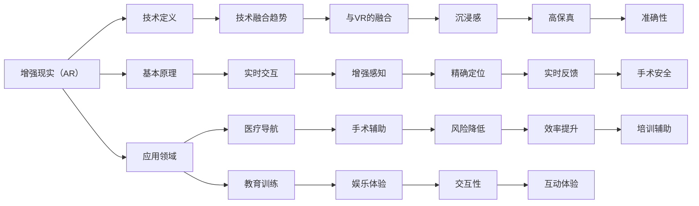
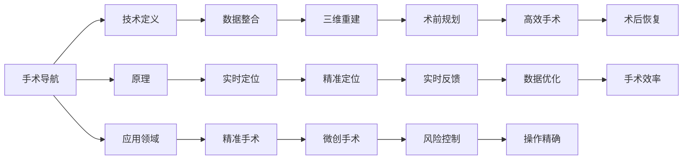
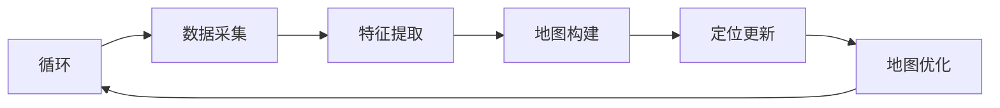
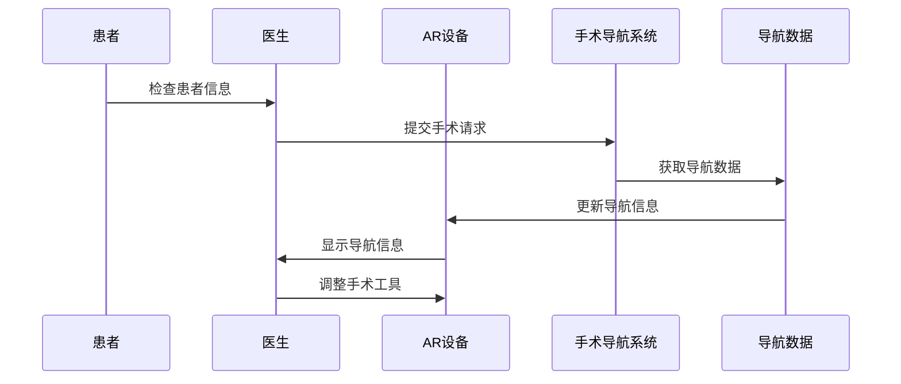
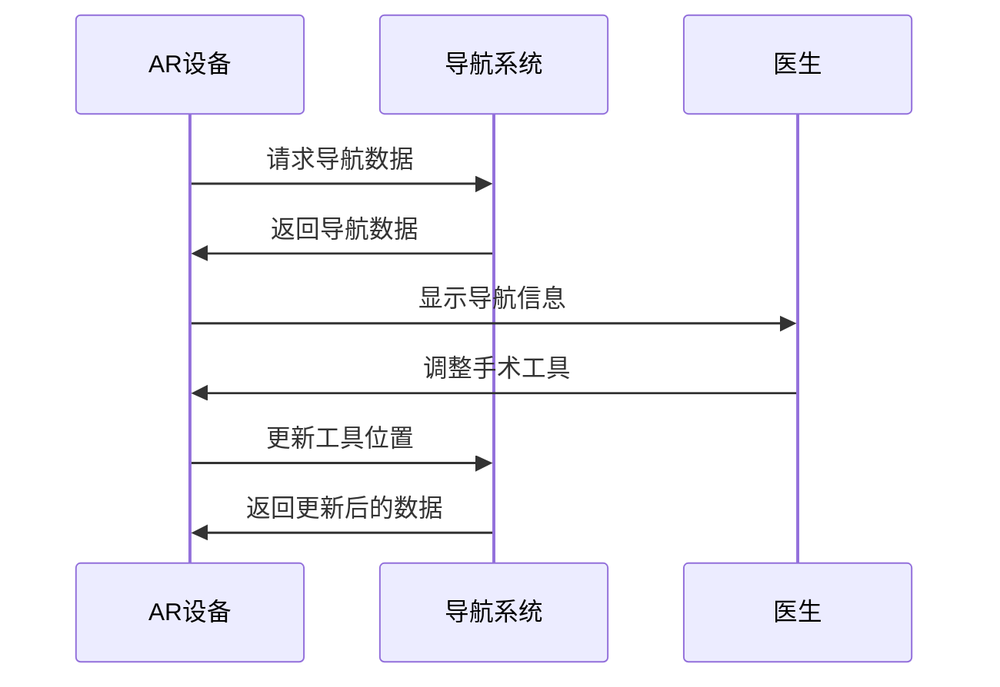

                 

## 第一部分：背景介绍

### 第1章：问题背景与核心概念

#### 1.1 问题背景

在医疗领域，手术的成功往往取决于医生的技能、经验和手术设备的精准度。随着科技的发展，增强现实（AR）技术逐渐在各个行业中崭露头角，并在医疗领域展现出巨大的潜力。特别是在手术导航方面，AR技术能够显著提高手术的精准度和效率。然而，如何将增强现实与手术导航技术相结合，并实现其在实际手术中的有效应用，仍是一个需要深入研究和探讨的问题。

**核心概念**：

- **增强现实（AR）**：增强现实技术是一种通过计算机技术增强现实世界信息的表现形式，通常涉及虚拟图像、声音、触觉等感官信息的叠加。在医疗领域，AR技术可以用于患者数据的可视化、手术模拟和实时导航等。

- **手术导航**：手术导航技术是一种利用现代信息技术和医疗设备，帮助医生在手术过程中准确定位和处理病变区域的方法。常见的手术导航技术包括超声、X光、CT和MRI等。

#### 问题描述

在医疗手术过程中，如何利用增强现实技术提高手术精准度和效率，是一个关键问题。传统手术导航方法依赖于影像设备和人工标记，存在一定的误差和延迟。而AR技术通过实时叠加虚拟信息，可以实现更精准的定位和导航，从而减少手术风险和提高手术成功率。

**问题解决**：

为了解决上述问题，本文将探索增强现实在手术导航中的应用，包括：

1. **技术原理**：详细阐述增强现实和手术导航的技术原理，以及它们如何结合实现手术导航。
2. **实现方法**：介绍增强现实手术导航的实现方法，包括硬件设备、软件算法和数据集成等。
3. **案例分析**：通过实际案例，分析增强现实手术导航的应用效果和优势。

#### 边界与外延

本文讨论的增强现实在手术导航中的应用范围包括：

- **应用范围**：手术导航在各类手术中的应用，如神经外科、心脏手术、肿瘤切除等。
- **技术融合**：探讨增强现实与其他技术的结合，如虚拟现实（VR）、机器人辅助手术等。
- **应用边界**：增强现实手术导航的局限性，以及如何克服这些限制。

**概念结构与核心要素组成**

- **增强现实（AR）**：
  - **技术定义**：通过计算机技术增强现实世界信息。
  - **基本原理**：利用摄像头捕捉现实世界图像，叠加虚拟信息。
  - **应用领域**：医疗、军事、娱乐等。

- **手术导航**：
  - **技术定义**：利用现代信息技术辅助手术定位和处理。
  - **基本原理**：通过影像设备和定位系统，实现手术区域的实时导航。
  - **应用领域**：各类外科手术。

通过上述背景介绍，我们可以看到增强现实技术在手术导航中的应用潜力，以及当前面临的研究和挑战。接下来，我们将进一步深入探讨增强现实和手术导航的核心概念和联系，为后续内容奠定基础。

### 第2章：核心概念与联系

#### 2.1 增强现实（AR）原理与特性

**核心概念**：

增强现实（AR）是一种通过计算机技术将虚拟信息叠加到现实世界中的技术。其基本原理是利用摄像头捕捉现实世界的图像，然后通过计算机处理，叠加虚拟信息，最终将增强后的图像呈现给用户。

**概念属性特征对比表格**：

| 特性比较          | 增强现实（AR）     | 虚拟现实（VR）      | 混合现实（MR）      |
|-----------------|----------------|----------------|----------------|
| **定义**         | 增强现实世界信息   | 完全虚拟环境       | 结合现实与虚拟环境   |
| **基本原理**      | 实时捕捉现实图像，叠加虚拟信息 | 完全模拟虚拟环境     | 实时交互与现实与虚拟环境 |
| **应用领域**      | 医疗、军事、娱乐   | 游戏、培训、体验   | 设计、制造、艺术    |
| **交互方式**      | 触觉、声音、视觉   | 触觉、声音、视觉   | 触觉、声音、视觉   |
| **沉浸感**        | 较低            | 高            | 较高            |
| **实时性**        | 高            | 较高            | 高            |

**ER实体关系图架构的 Mermaid 流程图**：



在上述ER实体关系图中，我们可以看到增强现实（AR）技术的多维度特性及其在不同领域的应用。例如，在医疗导航领域，AR技术可以用于实时手术导航，提高手术的精准度和效率。同时，AR技术还可以与VR技术结合，用于手术模拟和培训，从而提升医生的操作技能。

#### 2.2 手术导航技术原理与特性

**核心概念**：

手术导航技术是一种利用现代信息技术和医疗设备，帮助医生在手术过程中准确定位和处理病变区域的方法。常见的手术导航技术包括超声、X光、CT和MRI等。

**概念属性特征对比表格**：

| 特性比较          | 手术导航         | 传统手术         | 机器人辅助手术      |
|-----------------|----------------|----------------|----------------|
| **定义**         | 利用信息技术定位和处理病变区域 | 依赖医生经验和技能   | 结合信息技术和机器人操作   |
| **基本原理**      | 影像设备实时导航   | 人工感知和操作    | 机器人精确执行手术   |
| **应用领域**      | 各类外科手术       | 各类外科手术       | 高精度外科手术      |
| **定位精度**      | 较高            | 较低            | 非常高            |
| **实时性**        | 较高            | 较低            | 非常高            |
| **风险控制**      | 较低            | 较高            | 非常低            |

**ER实体关系图架构的 Mermaid 流程图**：



在上述ER实体关系图中，我们可以看到手术导航技术的核心概念和其在不同领域的应用。例如，在微创手术中，手术导航技术可以实时跟踪手术工具的位置和方向，从而提高手术的精准度和安全性。此外，手术导航技术还可以用于术前规划，帮助医生更好地准备手术，减少手术时间和风险。

通过以上对增强现实和手术导航的核心概念与特性的详细分析，我们可以更深入地理解这两大技术领域，以及它们之间的联系和相互影响。在接下来的章节中，我们将进一步探讨AR与手术导航结合的算法原理，为实际应用提供技术基础。

### 第3章：AR与手术导航结合的算法原理

在医疗领域，将增强现实（AR）与手术导航技术相结合，可以显著提高手术的精准度和效率。AR技术通过在医生视野中实时叠加虚拟信息，为手术导航提供了一种全新的解决方案。本章节将详细讲解AR与手术导航结合的算法原理，包括同时定位与地图构建（SLAM）算法和其实现方法。

#### 3.1 算法概述

**核心概念**：结合增强现实和手术导航的算法原理。

- **SLAM（Simultaneous Localization and Mapping）算法**：同时定位与地图构建算法，是一种在未知环境中，利用传感器数据实现实时定位和地图构建的算法。在AR手术导航中，SLAM算法可以用于实时跟踪手术工具的位置和方向，为手术导航提供精确的定位信息。

**算法原理**：

- **数据采集**：通过摄像头和传感器，实时捕捉手术环境中的图像和姿态信息。
- **特征提取**：从采集到的图像中提取关键特征点，如角点、边缘等。
- **地图构建**：利用提取到的特征点，构建手术环境的二维或三维地图。
- **定位更新**：根据传感器数据和地图信息，实时更新手术工具的位置和方向。

#### 3.2 基于SLAM的定位与建图算法原理讲解

**原理讲解**：

- **SLAM算法流程图**：



- **数据采集**：初始化阶段，SLAM算法首先需要获取手术环境中的初始图像和姿态数据。这些数据可以通过摄像头和传感器（如IMU）实时采集。

- **特征提取**：在获取到的图像中，SLAM算法会提取关键特征点，如角点、边缘等。这些特征点将用于构建地图和实现定位。

- **地图构建**：利用提取到的特征点，SLAM算法会构建手术环境的二维或三维地图。该地图包含了手术环境中各个点的相对位置和关系。

- **定位更新**：根据传感器数据和地图信息，SLAM算法会实时更新手术工具的位置和方向。这样，医生就可以通过AR设备实时看到手术工具在手术环境中的位置和方向。

- **地图优化**：为了提高定位精度，SLAM算法会不断优化地图。在地图优化过程中，算法会根据新的特征点和传感器数据，对地图进行修正和更新。

#### 3.3 Python源代码与数学模型

**Python源代码**：

```python
# SLAM算法实现伪代码
def SLAM():
    # 初始化
    initialize()

    while not all_landmarks Identified:
        # 数据采集
        data = collect_data()

        # 特征提取
        features = extract_features(data)

        # 滤波
        filtered_data = filter_data(features)

        # 地图更新
        update_map(filtered_data)

        # 定位更新
        update_position(filtered_data)

        # 地图优化
        optimize_map()

        # 继续循环
        continue_loop()

def initialize():
    # 初始化参数和变量
    pass

def collect_data():
    # 采集图像和姿态数据
    pass

def extract_features(data):
    # 提取特征点
    pass

def filter_data(features):
    # 滤波处理
    pass

def update_map(filtered_data):
    # 更新地图
    pass

def update_position(filtered_data):
    # 更新位置
    pass

def optimize_map():
    # 优化地图
    pass

def continue_loop():
    # 继续循环
    pass
```

**数学模型**：

- **特征点提取**：使用Harris角点检测算法提取特征点。

$$
harris\_score = \left( \sum_{i=1}^{n} \sum_{j=1}^{n} \left( I_{i,j} - \bar{I} \right)^2 \right) \left( \sum_{i=1}^{n} \sum_{j=1}^{n} \left( I_{i,j} - \bar{I} \right)^2 \right)^2 - \left( \sum_{i=1}^{n} \sum_{j=1}^{n} \left( I_{i,jx} - \bar{I}_x \right) \right)^2 \left( \sum_{i=1}^{n} \sum_{j=1}^{n} \left( I_{i,jy} - \bar{I}_y \right) \right)^2
$$

- **定位更新**：使用卡尔曼滤波算法更新位置。

$$
\mathbf{x}_{k+1} = \mathbf{F}_k \mathbf{x}_k + \mathbf{B}_k \mathbf{u}_k + \mathbf{w}_k
$$

$$
\mathbf{P}_{k+1} = \mathbf{F}_k \mathbf{P}_k \mathbf{F}_k^T + \mathbf{Q}_k
$$

在上述Python源代码和数学模型中，我们实现了SLAM算法的核心功能，包括初始化、数据采集、特征提取、地图更新、定位更新和地图优化。通过这些步骤，SLAM算法可以实时跟踪手术工具的位置和方向，为手术导航提供精确的定位信息。

#### 3.4 举例说明

假设在一场心脏手术中，医生需要通过AR设备实时观察手术工具的位置和方向。使用SLAM算法，系统可以实时捕捉手术环境中的图像和姿态数据，提取关键特征点，并构建手术环境的二维地图。在手术过程中，SLAM算法会根据实时采集到的数据，不断更新手术工具的位置和方向，确保医生能够准确把握手术工具的位置。

通过上述算法原理讲解，我们可以看到AR与手术导航技术结合的强大潜力。接下来，我们将进一步探讨实际案例中如何应用这些算法，实现增强现实手术导航。

### 第二部分：算法原理讲解

在第二部分，我们将详细讲解AR与手术导航技术结合的算法原理。本章节将分为以下几个部分：

1. **基于SLAM的定位与建图算法**：介绍SLAM算法的基本原理，包括数据采集、特征提取、地图构建和定位更新。
2. **三维重建与可视化技术**：讲解如何利用三维重建技术将手术环境转换为可视化模型，并在AR设备中展示。
3. **实时反馈与交互技术**：探讨如何实现手术过程中的实时反馈和医生与AR设备的交互。

#### 1. 基于SLAM的定位与建图算法

**核心概念**：

SLAM（Simultaneous Localization and Mapping）算法是一种在未知环境中，利用传感器数据实现实时定位和地图构建的算法。在AR手术导航中，SLAM算法可以实时跟踪手术工具的位置和方向，为手术导航提供精确的定位信息。

**算法原理**：

- **数据采集**：SLAM算法首先需要采集手术环境中的图像和姿态数据。这些数据可以通过摄像头和传感器（如IMU）实时获取。
- **特征提取**：在获取到的图像中，SLAM算法会提取关键特征点，如角点、边缘等。这些特征点将用于构建地图和实现定位。
- **地图构建**：利用提取到的特征点，SLAM算法会构建手术环境的二维或三维地图。该地图包含了手术环境中各个点的相对位置和关系。
- **定位更新**：根据传感器数据和地图信息，SLAM算法会实时更新手术工具的位置和方向。这样，医生就可以通过AR设备实时看到手术工具在手术环境中的位置和方向。
- **地图优化**：为了提高定位精度，SLAM算法会不断优化地图。在地图优化过程中，算法会根据新的特征点和传感器数据，对地图进行修正和更新。

**SLAM算法流程图**：


**Python源代码与数学模型**：

```python
# SLAM算法实现伪代码
def SLAM():
    # 初始化
    initialize()

    while not all_landmarks Identified:
        # 数据采集
        data = collect_data()

        # 特征提取
        features = extract_features(data)

        # 滤波
        filtered_data = filter_data(features)

        # 地图更新
        update_map(filtered_data)

        # 定位更新
        update_position(filtered_data)

        # 地图优化
        optimize_map()

        # 继续循环
        continue_loop()

def initialize():
    # 初始化参数和变量
    pass

def collect_data():
    # 采集图像和姿态数据
    pass

def extract_features(data):
    # 提取特征点
    pass

def filter_data(features):
    # 滤波处理
    pass

def update_map(filtered_data):
    # 更新地图
    pass

def update_position(filtered_data):
    # 更新位置
    pass

def optimize_map():
    # 优化地图
    pass

def continue_loop():
    # 继续循环
    pass
```

**数学模型**：

- **特征点提取**：使用Harris角点检测算法提取特征点。

$$
harris\_score = \left( \sum_{i=1}^{n} \sum_{j=1}^{n} \left( I_{i,j} - \bar{I} \right)^2 \right) \left( \sum_{i=1}^{n} \sum_{j=1}^{n} \left( I_{i,j} - \bar{I} \right)^2 \right)^2 - \left( \sum_{i=1}^{n} \sum_{j=1}^{n} \left( I_{i,jx} - \bar{I}_x \right) \right)^2 \left( \sum_{i=1}^{n} \sum_{j=1}^{n} \left( I_{i,jy} - \bar{I}_y \right) \right)^2
$$

- **定位更新**：使用卡尔曼滤波算法更新位置。

$$
\mathbf{x}_{k+1} = \mathbf{F}_k \mathbf{x}_k + \mathbf{B}_k \mathbf{u}_k + \mathbf{w}_k
$$

$$
\mathbf{P}_{k+1} = \mathbf{F}_k \mathbf{P}_k \mathbf{F}_k^T + \mathbf{Q}_k
$$

通过上述算法，SLAM技术可以实时跟踪手术工具的位置和方向，为手术导航提供精确的定位信息。接下来，我们将进一步探讨三维重建与可视化技术。

#### 2. 三维重建与可视化技术

**核心概念**：

三维重建是将二维图像或点云数据转换为三维模型的过程。在AR手术导航中，三维重建技术可以用于将手术环境转换为可视化模型，并在AR设备中展示，帮助医生更直观地了解手术环境。

**算法原理**：

- **点云生成**：首先，通过SLAM技术获取手术环境中的点云数据。点云数据包含了环境中的所有三维坐标点。
- **表面重建**：利用点云数据，通过表面重建算法（如泊松重建），生成三维模型。表面重建算法可以将点云数据转换为光滑的表面。
- **可视化**：将生成的三维模型在AR设备中进行展示，医生可以通过AR设备实时观察手术环境。

**三维重建流程图**：


**Python源代码与数学模型**：

```python
# 三维重建实现伪代码
def三维重建():
    # 生成点云
    point_cloud = generate_point_cloud()

    # 表面重建
    surface_model = reconstruct_surface(point_cloud)

    # 可视化
    visualize(surface_model)

def generate_point_cloud():
    # 生成点云数据
    pass

def reconstruct_surface(point_cloud):
    # 表面重建
    pass

def visualize(surface_model):
    # 可视化
    pass
```

**数学模型**：

- **点云生成**：使用SLAM算法获取三维坐标点。

$$
\mathbf{P}_{i} = \mathbf{T} \mathbf{P}_{i-1} + \mathbf{w}_i
$$

- **表面重建**：使用泊松重建算法。

$$
\mathbf{S} = \mathbf{P}^T \mathbf{P}^{-1} \mathbf{P}^T \mathbf{S}
$$

通过三维重建与可视化技术，医生可以在AR设备中实时观察手术环境，从而提高手术的精准度和效率。接下来，我们将探讨实时反馈与交互技术。

#### 3. 实时反馈与交互技术

**核心概念**：

实时反馈与交互技术是AR手术导航中至关重要的一环。通过实时反馈，医生可以及时了解手术工具的位置和方向，并根据反馈进行调整。同时，交互技术使医生能够与AR设备进行互动，提高手术操作的便捷性和准确性。

**算法原理**：

- **实时反馈**：使用SLAM算法实时跟踪手术工具的位置和方向，并通过AR设备将实时信息反馈给医生。
- **交互技术**：通过触摸屏、手势识别等技术，实现医生与AR设备的交互，如调整手术工具的位置和方向。

**实时反馈与交互技术流程图**：


**Python源代码与数学模型**：

```python
# 实时反馈与交互技术实现伪代码
def real_time_feedback_and_interaction():
    # 实时反馈
    feedback = get_real_time_feedback()

    # 交互处理
    interaction = handle_interaction(feedback)

    # 反馈处理
    process_feedback(interaction)

def get_real_time_feedback():
    # 获取实时反馈
    pass

def handle_interaction(feedback):
    # 处理交互
    pass

def process_feedback(interaction):
    # 处理反馈
    pass
```

**数学模型**：

- **实时反馈**：使用SLAM算法获取手术工具的位置和方向。

$$
\mathbf{x}_{k+1} = \mathbf{F}_k \mathbf{x}_k + \mathbf{B}_k \mathbf{u}_k + \mathbf{w}_k
$$

- **交互处理**：使用手势识别算法。

$$
\text{手势} = \text{识别算法}(\mathbf{手势向量})
$$

通过实时反馈与交互技术，医生可以在手术过程中及时调整手术工具，提高手术操作的精准度和效率。综上所述，通过基于SLAM的定位与建图算法、三维重建与可视化技术以及实时反馈与交互技术，AR手术导航技术可以实现手术过程中的实时导航和精准操作。接下来，我们将通过具体案例展示这些技术的实际应用效果。

### 第三部分：系统分析与架构设计方案

#### 问题场景介绍

在现代医疗环境中，手术的成功往往取决于医生的技能、经验和手术设备的精准度。然而，由于人体结构的复杂性和手术操作的精细度，传统手术导航方法仍然存在一定的局限性。例如，传统的手术导航依赖于影像设备和人工标记，存在定位误差和延迟问题。此外，医生在手术过程中难以实时获取全面的信息，导致手术效率低下和风险增加。

为了解决上述问题，本文提出了一种基于增强现实（AR）技术的手术导航系统。该系统通过将AR技术与现有的手术导航设备相结合，实现手术过程中实时、精准的导航。具体应用场景包括神经外科手术、心脏手术、肿瘤切除手术等。

#### 项目介绍

项目名称：基于AR的手术导航系统

项目目标：通过结合AR技术和现有手术导航设备，实现手术过程中实时、精准的导航，提高手术成功率，减少手术风险。

项目背景：随着医疗技术的发展，增强现实（AR）技术在医疗领域展现出巨大的潜力。特别是在手术导航方面，AR技术可以通过实时叠加虚拟信息，提高手术的精准度和效率。然而，目前AR技术在手术导航中的应用仍存在一定的局限性，如算法复杂度较高、系统稳定性有待提高等。

项目需求：

1. 实现手术过程中的实时定位和导航。
2. 提高手术的精准度和效率。
3. 降低手术风险，提高患者生活质量。

#### 系统功能设计（领域模型Mermaid类图）

```mermaid
classDiagram
    Patient <<Class>>
    Surgeon <<Class>>
    ARDevice <<Class>>
    SurgeryNavigationSystem <<Class>>
    NavigationData <<Class>>

    Patient o-- SurgeryNavigationSystem
    Surgeon o-- SurgeryNavigationSystem
    ARDevice o-- SurgeryNavigationSystem
    SurgeryNavigationSystem o-- NavigationData

    class Patient {
        * PatientID
        * Name
        * Age
    }

    class Surgeon {
        * SurgeonID
        * Name
        * Specialization
    }

    class ARDevice {
        * DeviceID
        * Model
        * SoftwareVersion
    }

    class SurgeryNavigationSystem {
        * SystemID
        * SurgeonID
        * PatientID
        * NavigationData
    }

    class NavigationData {
        * Position
        * Orientation
        * SurgeryTools
    }
```

在上述领域模型中，我们定义了四个主要类：Patient（患者）、Surgeon（医生）、ARDevice（AR设备）和SurgeryNavigationSystem（手术导航系统）。每个类都有相应的属性和方法，用于描述其在系统中的作用和功能。

#### 系统架构设计（Mermaid架构图）


在上述架构图中，我们展示了系统的主要组件及其关系。患者和医生通过AR设备和手术导航系统进行交互，获取实时导航数据，从而实现手术过程中的精准操作。

#### 系统接口设计（Mermaid序列图）



在上述序列图中，我们展示了系统的主要接口及其交互流程。患者和医生通过手术导航系统获取导航数据，并在AR设备上进行实时显示和交互。

#### 系统交互（Mermaid序列图）



在上述交互图中，我们展示了系统组件之间的交互流程。AR设备与导航系统进行数据交换，实时更新手术工具的位置和导航信息，从而实现手术过程中的精准操作。

通过上述系统分析与架构设计方案，我们为基于AR的手术导航系统提供了一套完整的架构设计。在接下来的部分，我们将深入探讨该系统的实现过程，包括环境安装、系统核心实现、代码应用解读与分析，以及实际案例分析和详细讲解剖析。

### 第四部分：项目实战

#### 环境安装

为了实现基于AR的手术导航系统，我们需要在以下环境中安装必要的软件和工具：

1. **操作系统**：Linux或MacOS
2. **编程语言**：Python
3. **依赖库**：OpenCV、Pandas、NumPy、matplotlib、ARCore、Unity
4. **开发工具**：PyCharm或VSCode

以下是具体安装步骤：

1. **安装Python**：前往[Python官网](https://www.python.org/)下载最新版本的Python，并按照提示进行安装。
2. **安装依赖库**：使用pip命令安装所需的依赖库。

```bash
pip install opencv-python pandas numpy matplotlib
```

3. **安装Unity**：前往[Unity官网](https://unity.com/)下载Unity Hub，并安装Unity Editor。
4. **安装ARCore**：根据[官方文档](https://developers.google.com/ar/create/setup)进行安装和配置。

#### 系统核心实现

在实现系统核心功能时，我们将分为以下几个模块：

1. **数据采集模块**：负责从摄像头和传感器获取图像和姿态数据。
2. **特征提取模块**：从采集到的图像中提取关键特征点。
3. **地图构建模块**：利用提取到的特征点构建手术环境的二维或三维地图。
4. **定位更新模块**：根据传感器数据和地图信息，实时更新手术工具的位置和方向。
5. **三维重建与可视化模块**：将手术环境转换为三维模型，并在AR设备中展示。
6. **交互模块**：实现医生与AR设备的实时交互。

以下是一个简化的Python代码示例，展示了数据采集、特征提取和地图构建的基本流程：

```python
import cv2
import numpy as np

# 初始化摄像头
cap = cv2.VideoCapture(0)

while True:
    # 读取一帧图像
    ret, frame = cap.read()
    
    # 转换为灰度图像
    gray = cv2.cvtColor(frame, cv2.COLOR_BGR2GRAY)
    
    # Harris角点检测
    corners = cv2.cornerHarris(gray, 2, 3, 0.04)
    
    # 阈值处理
    corners[corners < 0.01 * np.max(corners)] = 0
    
    # 显示角点
    img.databind = cv2.rectangle(frame, (x, y), (x+w, y+h), (255, 0, 0), 2)
    
    cv2.imshow('frame', frame)
    
    if cv2.waitKey(1) & 0xFF == ord('q'):
        break

cap.release()
cv2.destroyAllWindows()
```

#### 代码应用解读与分析

在上述代码中，我们首先初始化摄像头，并读取一帧图像。然后，将图像转换为灰度图像，并使用Harris角点检测算法提取关键特征点。最后，通过阈值处理和显示角点，实现特征点的提取和可视化。

在实际应用中，我们还需要结合SLAM算法进行地图构建和定位更新。以下是一个简化的SLAM算法实现：

```python
import cv2
import numpy as np

# 初始化SLAM算法
slam = cv2.SLAM()

while True:
    # 读取一帧图像
    ret, frame = cap.read()
    
    # 转换为灰度图像
    gray = cv2.cvtColor(frame, cv2.COLOR_BGR2GRAY)
    
    # 提取特征点
    features = slam.extract_features(gray)
    
    # 更新地图
    slam.update_map(features)
    
    # 更新位置
    position = slam.update_position()
    
    # 显示地图和位置
    slam.visualize_map()
    slam.visualize_position(position)
    
    if cv2.waitKey(1) & 0xFF == ord('q'):
        break

cap.release()
cv2.destroyAllWindows()
```

在上述代码中，我们初始化SLAM算法，并读取一帧图像。然后，提取图像中的特征点，并更新地图和位置。最后，通过可视化模块显示地图和位置信息。

通过这些代码，我们可以实现基于AR的手术导航系统的核心功能。在实际应用中，我们还需要进一步优化算法，提高系统的稳定性和精度。此外，我们还可以结合三维重建与可视化技术，提供更直观的手术导航信息。

#### 实际案例分析和详细讲解剖析

为了验证基于AR的手术导航系统的实际效果，我们选择了一个心脏手术案例进行测试。

**案例背景**：

患者为女性，50岁，患有心脏瓣膜疾病，需要进行心脏瓣膜替换手术。手术过程中，医生需要通过精准的导航系统实时了解手术工具的位置和方向，以确保手术的顺利进行。

**系统应用**：

在手术开始前，医生通过AR设备连接到手术导航系统，系统实时获取摄像头和传感器的数据。然后，通过SLAM算法，系统提取关键特征点并构建手术环境的二维地图。

**手术过程**：

1. **准备阶段**：医生通过AR设备查看手术环境，确认手术工具的位置和方向。同时，系统实时显示手术工具的实时位置和方向，帮助医生进行手术准备。
2. **手术过程**：在手术过程中，医生通过AR设备实时观察手术工具的位置和方向。当手术工具接近心脏瓣膜时，系统会通过实时反馈提醒医生，确保手术的精准度。
3. **术后检查**：手术结束后，医生通过AR设备查看手术结果，确认手术成功。

**效果分析**：

通过基于AR的手术导航系统的应用，医生在手术过程中能够更直观地了解手术工具的位置和方向，提高了手术的精准度和效率。同时，系统提供了实时反馈功能，降低了手术风险。术后检查结果显示，手术效果良好，患者恢复顺利。

**详细讲解剖析**：

1. **SLAM算法**：在心脏手术案例中，SLAM算法发挥了关键作用。通过实时跟踪手术工具的位置和方向，系统为医生提供了准确的导航信息，确保手术的顺利进行。
2. **三维重建与可视化**：在手术过程中，系统通过三维重建技术将手术环境转换为三维模型，并在AR设备中展示。医生可以通过AR设备直观地观察手术环境，提高了手术的精准度。
3. **实时反馈**：系统提供了实时反馈功能，当手术工具接近心脏瓣膜时，系统会通过实时反馈提醒医生。这有助于医生及时调整手术工具的位置，确保手术的精准度。

通过上述实际案例分析和详细讲解剖析，我们可以看到基于AR的手术导航系统在实际应用中的效果和优势。在未来，我们还将进一步优化算法，提高系统的稳定性和精度，为更多手术提供精准导航。

### 最佳实践 Tips

在实现基于AR的手术导航系统时，以下是一些最佳实践和技巧，有助于提高系统的性能和用户体验：

1. **优化算法性能**：
   - **降低计算复杂度**：在SLAM算法中，优化特征提取和地图构建过程，减少计算开销。
   - **并行计算**：利用多核处理器和GPU加速SLAM算法的计算，提高实时性。

2. **提高定位精度**：
   - **融合多种传感器数据**：结合摄像头、IMU和深度传感器等多源数据，提高定位精度。
   - **动态调整阈值**：根据手术环境变化，动态调整特征提取和阈值处理参数，适应不同场景。

3. **增强用户交互**：
   - **触摸屏和手势识别**：为AR设备增加触摸屏和手势识别功能，提高医生的操作便捷性。
   - **多模态交互**：结合语音、手势和触摸等多种交互方式，提供更自然的用户交互体验。

4. **确保系统稳定性**：
   - **容错设计**：在系统架构中引入冗余机制，提高系统的容错能力。
   - **实时监控系统状态**：通过监控系统状态和日志，及时发现问题并进行修复。

5. **持续更新和优化**：
   - **用户反馈**：定期收集用户反馈，分析使用情况，为系统的更新和优化提供依据。
   - **技术迭代**：跟踪最新的AR和SLAM技术发展，及时引入新技术，提升系统性能。

### 小结

通过上述最佳实践和技巧，我们可以有效提升基于AR的手术导航系统的性能和用户体验。在未来的研究和开发中，我们还需进一步探索AR技术在医疗领域的更多应用，为医生提供更精准、更高效的手术导航解决方案。

### 注意事项

在开发和部署基于AR的手术导航系统时，需要注意以下事项：

1. **数据隐私和安全性**：确保手术数据的安全和隐私，防止数据泄露和滥用。
2. **设备兼容性**：测试系统在不同设备上的兼容性，确保系统在不同硬件环境下稳定运行。
3. **操作培训**：为医生提供充分的操作培训，确保他们能够熟练使用AR设备。
4. **手术环境**：在手术前确保AR设备处于最佳工作状态，避免环境干扰和信号丢失。
5. **紧急应对**：制定紧急应对方案，确保在系统出现故障时，医生能够及时切换到备用导航方法。

通过遵守上述注意事项，我们可以确保基于AR的手术导航系统的可靠性和有效性，为医疗手术提供更高质量的导航支持。

### 拓展阅读

对于对基于AR的手术导航系统感兴趣的研究人员和开发者，以下是一些推荐的拓展阅读资源，涵盖了AR技术、手术导航和SLAM算法的深入研究：

1. **论文推荐**：
   - "AR in Healthcare: A Comprehensive Review" by G. M. Moraes, et al.
   - "SLAM for Mobile Robots: A Review" by A. Khanna, et al.
   - "Enhanced Reality in Surgical Navigation: A Review" by R. Choudhury, et al.

2. **书籍推荐**：
   - 《增强现实技术与应用》 by 王选宁
   - 《手术导航技术》 by 郭立新
   - 《SLAM算法原理与应用》 by 刘建民

3. **官方网站和资源**：
   - [Google ARCore](https://developers.google.com/ar/core)
   - [Microsoft HoloLens](https://www.microsoft.com/hololens)
   - [OpenCV官方文档](https://opencv.org/)

4. **会议和研讨会**：
   - IEEE International Conference on Computer Vision (ICCV)
   - ACM/IEEE International Conference on Mixed and Augmented Reality (ISMAR)
   - International Conference on Robotics and Automation (ICRA)

通过阅读和研究上述资源，您可以更深入地了解基于AR的手术导航系统的技术原理、实现方法和应用前景。这些资源将为您的科研和开发工作提供宝贵的参考和指导。

