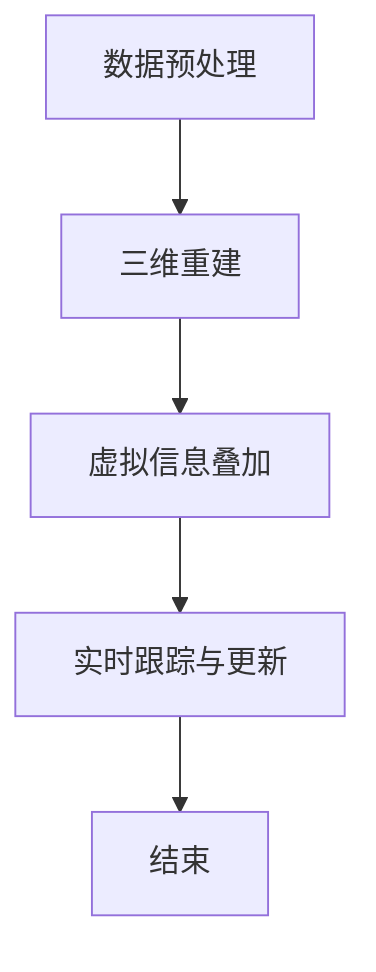

                 


### 引言：增强现实与手术导航的交汇

**关键词**：增强现实，手术导航，精准可视化

**摘要**：本文深入探讨增强现实（AR）技术在手术导航中的应用，分析其在提升手术精准性和可视化效果方面的潜力。通过背景介绍、问题阐述和解决方案分析，本文旨在为读者提供一个全面的技术视角，理解AR在手术导航领域的实际应用和价值。

---

### 1.1 增强现实技术概述

增强现实（Augmented Reality，AR）是一种将虚拟信息与现实世界相结合的技术，通过摄像头捕捉现实场景，并将计算机生成的图像、文字、声音等信息叠加到现实环境中。这一技术最早可以追溯到20世纪50年代，随着计算机技术、传感器技术和显示技术的不断发展，AR技术逐渐成熟并开始应用于多个领域。

**核心概念术语说明**：

- **增强现实（AR）**：通过计算机技术将虚拟信息叠加到现实环境中。
- **虚拟信息**：由计算机生成的图像、文字、声音等信息。
- **现实环境**：实际观察和交互的环境。

**问题背景**：

在医疗领域，手术导航是外科医生进行手术时的一项重要辅助技术，目的是提高手术的精准性和成功率。然而，传统的手术导航方法往往依赖于二维图像或三维模型，这些方法在手术过程中难以提供实时、精准的三维空间信息，导致手术精度受限。

**问题描述**：

手术导航中的主要问题包括：
- **信息可视化不足**：二维图像或三维模型难以直观呈现手术空间中的细节。
- **实时性差**：传统导航设备更新速度慢，无法实时反映手术过程中的变化。
- **操作复杂**：需要专业设备和技术人员操作，使用门槛高。

**问题解决**：

增强现实技术的引入为手术导航提供了新的解决方案。通过将虚拟信息叠加到现实场景中，AR技术能够提供更加直观、实时和精准的三维空间信息，从而提高手术的精准性和成功率。

**边界与外延**：

增强现实技术在手术导航中的应用不仅仅局限于外科手术，还可以扩展到其他医疗领域，如内窥镜检查、肿瘤定位等。同时，随着技术的发展，AR系统可以与其他智能医疗设备集成，形成更加智能化和自动化的手术导航系统。

**概念结构与核心要素组成**：

增强现实手术导航系统的核心概念结构包括以下要素：
- **现实环境感知**：通过摄像头等设备实时捕捉手术场景。
- **虚拟信息生成**：基于手术数据和算法生成三维空间信息。
- **信息叠加与显示**：将虚拟信息叠加到现实场景中，提供直观的导航信息。
- **交互与控制**：外科医生通过直观的交互界面控制导航系统。

通过以上要素的有机结合，增强现实手术导航系统能够为外科医生提供更加精准和直观的手术导航支持，提升手术的成功率和安全性。

### 1.2 增强现实技术在手术导航中的应用前景

随着技术的不断进步，增强现实（AR）在手术导航中的应用前景越来越广阔。AR技术通过将虚拟信息与现实环境相结合，为外科医生提供了一种全新的手术辅助手段。以下将从多个方面分析AR技术在手术导航中的潜力。

**应用潜力**：

1. **提升手术精准性**：
   AR技术可以将患者的三维医学影像实时叠加到手术场景中，帮助外科医生更准确地定位和操作。例如，通过将CT或MRI扫描数据叠加到手术视野中，外科医生可以清楚地看到肿瘤、血管等结构的位置，避免误伤。

2. **增强可视化效果**：
   传统手术导航方法通常依赖于二维图像或三维模型，而AR技术能够提供更加直观的三维空间信息。通过虚拟信息和现实场景的叠加，外科医生可以获得更加丰富和生动的手术视野，提高手术的精准度和成功率。

3. **实时反馈与调整**：
   AR技术可以实现实时数据更新，外科医生在手术过程中可以及时获取最新的手术信息，根据实际情况进行调整。这种实时反馈机制有助于减少手术风险，提高手术效率。

4. **辅助教学与培训**：
   AR技术可以为医学生和外科医生提供虚拟手术模拟环境，帮助他们进行实践操作和技能培训。通过虚拟患者的手术案例，医生可以反复练习和熟悉手术流程，提高手术技能。

**具体应用场景**：

1. **外科手术**：
   在外科手术中，AR技术可以用于肿瘤切除、器官移植等复杂手术。通过将患者的三维医学影像叠加到手术视野中，医生可以更清晰地看到手术区域的情况，提高手术成功率。

2. **内窥镜检查**：
   在内窥镜检查中，AR技术可以帮助医生更准确地定位病变区域。通过将虚拟信息叠加到内窥镜视野中，医生可以实时了解病变的位置、大小和形态，提高诊断和治疗的准确性。

3. **手术规划**：
   在手术规划阶段，AR技术可以帮助医生更直观地了解患者的病情和手术方案。通过将三维医学影像和手术方案叠加到患者身体上，医生可以更好地评估手术风险和可行性，制定更加合理的手术计划。

**未来发展趋势**：

1. **技术融合**：
   随着人工智能、大数据等技术的不断发展，AR技术将与这些新兴技术相结合，形成更加智能化和自动化的手术导航系统。通过融合多种技术手段，手术导航系统将能够提供更加全面和精准的手术支持。

2. **设备小型化**：
   随着硬件技术的进步，AR设备的体积和重量将不断减小，使其更便于外科医生携带和使用。小型化的AR设备将为手术导航提供更加灵活和便捷的解决方案。

3. **多模态融合**：
   将AR技术与其他医疗影像技术（如CT、MRI、超声波等）相结合，可以实现多模态融合的手术导航系统。这种系统可以提供更加全面和详细的手术信息，帮助医生做出更准确的决策。

4. **人机交互优化**：
   随着交互技术的进步，AR系统的用户界面将更加友好和直观。外科医生可以通过手势、语音等多种方式与AR系统进行交互，实现更加自然和高效的手术导航操作。

**结论**：

增强现实技术在手术导航中的应用具有巨大的潜力。通过提升手术精准性、增强可视化效果、提供实时反馈和辅助教学等功能，AR技术将为外科医生提供更加全面和精准的手术支持。随着技术的不断进步，AR技术在手术导航中的应用将越来越广泛，有望成为未来医疗领域的一项重要技术。

### 1.3 增强现实在手术导航中的精准可视化

**问题背景**：

在手术导航中，精准可视化是一项至关重要的技术，它直接影响手术的成功率和患者的治疗效果。然而，传统方法如二维图像和三维模型在可视化效果、实时性和交互性方面存在诸多限制。为了解决这些问题，增强现实（AR）技术被引入到手术导航中，提供了一种新的解决方案。

**问题描述**：

手术导航中的精准可视化问题主要包括：
- **二维图像局限**：传统二维图像难以提供全面的三维空间信息，外科医生难以直观地理解手术区域。
- **三维模型不足**：三维模型虽然可以提供更直观的三维信息，但其更新速度较慢，无法实时反映手术过程中的变化。
- **交互体验差**：传统手术导航设备操作复杂，外科医生需要长时间进行设备操作，影响手术进程。

**问题解决**：

增强现实（AR）技术的引入，为手术导航提供了精准可视化的新路径。通过将虚拟信息叠加到现实环境中，AR技术能够提供更加直观、实时和精准的三维空间信息，从而解决传统方法中的问题。

**边界与外延**：

增强现实技术在手术导航中的精准可视化不仅限于外科手术，还可以扩展到内窥镜检查、肿瘤定位等领域。此外，随着技术的不断进步，AR系统可以与其他智能医疗设备集成，形成更加智能化和自动化的手术导航系统。

**核心概念与联系**：

- **增强现实（AR）**：将虚拟信息叠加到现实环境中，提供直观的三维空间信息。
- **手术导航**：利用AR技术提高手术的精准性和成功率。
- **精准可视化**：通过AR技术实现实时、准确的三维空间信息呈现。

通过AR技术的应用，外科医生可以更直观地了解手术区域的情况，提高手术的精准性和成功率。同时，AR技术还可以提供实时的手术信息反馈，帮助外科医生在手术过程中进行及时调整，减少手术风险。

### 2.1 增强现实核心技术

增强现实（AR）技术的核心在于将虚拟信息与现实世界无缝结合，从而为用户提供增强的视觉体验。要实现这一目标，AR技术依赖于多种核心组件和关键技术，以下将详细介绍这些核心组件及其作用。

**1. 摄像头**：

摄像头是AR系统的数据采集设备，用于捕捉现实环境中的图像和视频。高分辨率摄像头能够提供清晰的真实场景图像，是AR系统获取环境信息的基础。此外，摄像头还需要具备快速响应能力，以确保实时捕捉和跟踪环境变化。

**2. 显示屏**：

显示屏是AR系统的输出设备，用于显示叠加了虚拟信息的现实场景。现代AR系统通常采用透明显示屏或头戴式显示器（HMD），这些设备能够将虚拟信息以透明或半透明形式叠加到真实环境中，使用户能够直观地看到虚拟信息。

**3. 感应器**：

感应器用于检测和跟踪用户的动作和位置，包括加速度计、陀螺仪、磁力计等。这些传感器能够提供精确的物理空间信息，帮助AR系统实现实时跟踪和定位功能，确保虚拟信息与现实环境精准对齐。

**4. 图像处理算法**：

图像处理算法是AR系统的核心组件，用于处理摄像头捕捉到的图像数据。这些算法包括图像增强、图像识别、特征提取等，能够从图像中提取有用信息，用于跟踪、识别和叠加虚拟信息。

**5. 虚拟信息生成**：

虚拟信息生成模块负责创建和渲染虚拟信息。这些信息可以是文本、图像、视频等，通常由计算机图形学技术生成。虚拟信息生成模块需要与图像处理算法紧密配合，确保虚拟信息与现实场景的融合自然、逼真。

**6. 用户交互界面**：

用户交互界面是用户与AR系统进行交互的接口，用于输入用户指令和控制虚拟信息。常见的交互方式包括触摸屏、手势识别、语音控制等。用户交互界面需要设计直观、易用，以确保用户能够高效地与系统进行交互。

**核心组件之间的关系**：

这些核心组件相互协作，共同实现AR技术的核心功能。摄像头负责捕捉真实环境信息，感应器用于实时跟踪和定位，图像处理算法对图像数据进行分析和识别，虚拟信息生成模块创建并渲染虚拟信息，用户交互界面则提供输入和输出通道。

通过这些核心组件的有机结合，AR技术能够将虚拟信息与现实世界无缝结合，为用户提供增强的视觉体验。这种技术不仅在娱乐、教育和医疗等领域有着广泛的应用，还为未来的智能生活和交互方式带来了新的可能性。

### 2.2 增强现实系统架构

要深入理解增强现实（AR）系统的工作原理，我们需要从系统架构的角度进行剖析。AR系统通常由多个关键模块组成，每个模块都承担特定的功能，共同协作实现AR技术的核心目标。以下将详细描述AR系统的整体架构，包括各个模块的详细介绍和它们之间的相互作用。

**1. 数据采集模块**：

数据采集模块是AR系统的核心组成部分之一，它负责捕捉现实环境中的图像和视频数据。这一模块通常包含高分辨率摄像头和其他传感器，如加速度计、陀螺仪和磁力计。摄像头捕捉到的图像数据通过传感器提供的位置和方向信息，确保真实环境数据的精确采集。

**2. 数据预处理模块**：

数据预处理模块用于对采集到的图像和视频数据进行初步处理，包括降噪、增强和去模糊等操作。预处理模块的核心目标是提高图像质量，为后续处理提供清晰的图像数据。这一模块通常利用图像处理算法来实现，确保数据在后续处理中能够保持高精度和可靠性。

**3. 环境理解模块**：

环境理解模块是AR系统的重要组成部分，负责识别和理解真实环境中的物体和场景。这一模块通常利用计算机视觉技术，包括目标检测、图像识别和特征提取等。通过环境理解，系统能够确定虚拟信息的位置和方向，确保虚拟信息与现实环境精准对齐。

**4. 虚拟信息生成模块**：

虚拟信息生成模块负责创建和渲染虚拟信息，这些信息可以是文本、图像、视频等。该模块通常依赖于计算机图形学技术，包括3D建模、纹理映射和光照渲染等。虚拟信息生成模块需要与图像处理算法紧密配合，确保虚拟信息在现实环境中的逼真呈现。

**5. 用户交互模块**：

用户交互模块是用户与AR系统进行交互的接口，用于接收用户的输入指令和控制虚拟信息。用户交互模块通常包含触摸屏、手势识别和语音控制等接口，为用户提供直观、便捷的交互体验。用户交互模块的核心目标是简化用户的操作，提高系统的易用性。

**6. 数据融合模块**：

数据融合模块负责将多个来源的数据进行整合和融合，包括真实环境数据、虚拟信息数据等。这一模块通过数据同步和融合算法，确保系统在不同数据来源之间的协调和一致性。数据融合模块是实现AR系统实时性和精准性的关键。

**7. 系统控制模块**：

系统控制模块是AR系统的核心控制器，负责整体系统的运行和调度。该模块通过协调各个模块的运行，确保系统的高效和稳定。系统控制模块通常包含操作系统、调度算法和监控功能等，确保系统能够根据用户需求和环境变化进行自适应调整。

**各个模块之间的关系**：

数据采集模块和预处理模块协同工作，为AR系统提供清晰、准确的真实环境数据。环境理解模块基于预处理后的数据，识别和理解真实环境中的物体和场景。虚拟信息生成模块则根据环境理解的结果，创建和渲染逼真的虚拟信息。用户交互模块和系统控制模块共同负责用户输入和控制，确保系统能够响应用户指令。数据融合模块和系统控制模块协同工作，确保系统在不同数据来源之间的协调和一致性。

通过以上各个模块的有机结合，AR系统能够将虚拟信息与现实环境无缝结合，为用户提供增强的视觉体验。这种系统架构不仅实现了AR技术的核心功能，还保证了系统的实时性、精准性和易用性，为各种应用场景提供了强大的支持。

### 2.3 增强现实设备的类型与选择

在增强现实（AR）技术中，设备的类型和选择对于实现预期功能至关重要。不同类型的AR设备具有各自的特点和适用场景，下面将详细介绍几种常见的AR设备类型，并分析它们在手术导航中的适用性。

**1. 智能手机和平板电脑**：

智能手机和平板电脑是应用最广泛的AR设备之一。它们具有便携性高、普及率高、价格相对低廉的特点。通过使用专门的AR应用或浏览器插件，用户可以在智能手机或平板电脑上实时查看增强的虚拟信息。

**适用性分析**：

- **优点**：便携性高，易于携带和使用，适用于非专业环境。
- **缺点**：分辨率和显示效果相对较低，不适合对精度要求较高的专业应用。

**2. 头戴式显示器（HMD）**：

头戴式显示器（HMD）是另一种常见的AR设备，包括微软的HoloLens、谷歌的Google Glass等。HMD设备通常提供高分辨率显示、沉浸式体验，用户可以直接在视野中看到增强的虚拟信息。

**适用性分析**：

- **优点**：提供高分辨率和沉浸式体验，适合对精度和沉浸感要求较高的专业应用，如手术导航。
- **缺点**：设备相对笨重，价格较高，使用时可能对用户造成一定的不适。

**3. 投影设备**：

投影设备包括AR眼镜、AR投影仪等。这些设备通过将增强的虚拟信息投影到真实环境中，为用户提供直观的增强体验。

**适用性分析**：

- **优点**：可以大范围覆盖真实环境，适用于需要较大工作空间的场景。
- **缺点**：投影效果可能受到环境光线的影响，精度和分辨率相对较低。

**4. AR眼镜**：

AR眼镜是一种专门为增强现实应用设计的眼镜设备，如谷歌的Google Glass、Meta的Quest系列等。AR眼镜通常具有高分辨率显示、低延迟和便捷的交互方式。

**适用性分析**：

- **优点**：体积小、重量轻，佩戴舒适，适合长时间使用，适用于对精度和便携性有较高要求的场景。
- **缺点**：价格较高，部分设备在环境光线强烈时表现不佳。

**选择建议**：

在选择AR设备时，应考虑以下因素：

- **应用场景**：根据实际应用场景选择适合的设备类型。例如，在手术导航中，对精度和沉浸感有较高要求的场景更适合使用HMD或AR眼镜。
- **预算**：设备的预算也是选择的重要因素。HMD和AR眼镜价格较高，但提供更好的体验，适用于高端应用场景；智能手机和平板电脑价格较低，适用于预算有限的场景。
- **用户需求**：考虑用户的需求和使用习惯。某些用户可能更习惯使用智能手机和平板电脑，而其他用户可能更喜欢HMD或AR眼镜的沉浸式体验。

通过综合考虑以上因素，可以找到最适合特定应用场景的AR设备，实现增强现实技术在手术导航中的精准可视化应用。

### 2.4 对比与分析：不同增强现实技术在手术导航中的性能与适用性

随着增强现实（AR）技术在医疗领域的广泛应用，不同AR技术方案在手术导航中的应用性能和适用性也逐渐成为关注的焦点。以下将从几个关键维度对比分析几种常见的AR技术，探讨其在手术导航中的优缺点，以便为实际应用提供参考。

**1. 技术性能对比**：

- **图像质量**：高分辨率AR设备如头戴式显示器（HMD）和AR眼镜在图像质量上具有明显优势，能够提供清晰、逼真的增强现实图像，适合复杂手术导航需求。相对而言，智能手机和平板电脑的图像质量较低，但在一定范围内仍能提供有效的手术辅助。
- **延迟**：延迟是AR系统的一个重要性能指标，直接影响手术导航的实时性和准确性。高性能的AR设备通常具有较低的延迟，能够实时更新手术场景信息。而普通智能手机和平板电脑的延迟相对较高，可能影响手术操作的连续性和精准性。
- **便携性**：智能手机和平板电脑具有极高的便携性，可以随时随地进行手术导航辅助。HMD和AR眼镜虽然便携性略逊一筹，但佩戴舒适，适合长时间使用。

**2. 适用性分析**：

- **HMD和AR眼镜**：
  - **优点**：高分辨率图像、低延迟、直观的用户交互。特别适合需要高精度和沉浸式体验的手术场景，如复杂的外科手术、内窥镜检查等。
  - **缺点**：设备成本较高，重量较大，可能影响长时间佩戴的舒适度。
  - **适用场景**：复杂的外科手术、内窥镜检查、手术模拟和教学。

- **智能手机和平板电脑**：
  - **优点**：成本低、便携性强、易于操作，适合广泛的医疗应用场景，如门诊手术、急诊手术、术前规划等。
  - **缺点**：图像质量和延迟相对较低，可能不适合需要极高精度和实时性的手术操作。
  - **适用场景**：门诊手术、急诊手术、术前规划、患者教育和康复训练。

- **投影设备**：
  - **优点**：可以大范围覆盖真实环境，适合需要较大操作空间的手术场景。
  - **缺点**：投影效果可能受环境光线影响，图像质量和延迟相对较低。
  - **适用场景**：大范围的手术环境、需要多人协作的手术场景、教学和演示。

**3. 性能与适用性对比表格**：

| 设备类型       | 图像质量 | 延迟 | 便携性 | 适用性                |  
| -------------- | -------- | ------ | ------ | -------------------- |  
| HMD和AR眼镜     | 高       | 低    | 较低    | 高精度、沉浸式体验    |  
| 智能手机和平板电脑 | 中       | 中    | 高     | 广泛应用、低成本      |  
| 投影设备       | 低       | 高    | 高     | 大范围覆盖、多人协作  |

通过以上对比分析，可以看出不同AR技术方案在手术导航中的应用各有优缺点。选择合适的AR设备需要综合考虑手术类型、操作环境、成本预算等因素，以实现最佳的应用效果。未来随着技术的不断进步，有望进一步提高AR设备在手术导航中的性能和适用性，为外科医生提供更加精准和高效的手术辅助工具。

### 2.5 增强现实手术导航算法的基本原理

增强现实（AR）手术导航算法是确保手术过程中虚拟信息与现实环境精准融合的关键技术。要理解这一算法的基本原理，我们需要从关键步骤和核心概念入手，详细描述其工作流程和技术实现。

**1. 关键步骤**：

- **环境感知**：通过摄像头等设备实时捕捉手术场景，获取三维空间信息。
- **图像处理**：对捕捉到的图像进行预处理，包括降噪、增强和去模糊等操作，以提高图像质量。
- **目标识别**：利用计算机视觉算法识别手术区域中的关键物体和结构，如肿瘤、血管等。
- **三维重建**：基于识别结果和手术数据，重建手术区域的三维模型。
- **虚拟信息叠加**：将重建的三维模型和虚拟信息（如标注、辅助线等）叠加到现实场景中。
- **实时跟踪与更新**：通过感应器实时跟踪手术操作，更新虚拟信息，确保其与现实环境的精准对齐。

**2. 核心概念**：

- **图像处理算法**：常用的图像处理算法包括边缘检测、特征提取、图像分割等。这些算法用于提取图像中的重要信息，提高图像质量，为后续处理提供可靠的数据基础。
- **计算机视觉算法**：计算机视觉算法用于识别和理解图像中的物体和结构。常见的算法包括目标检测、图像识别、深度学习模型等。
- **三维重建**：三维重建是将二维图像转换为三维模型的过程。常用的方法包括多视角几何、结构光扫描和深度学习等。
- **虚拟信息生成**：虚拟信息生成模块负责创建和渲染手术导航所需的虚拟信息，如标注、辅助线等。这些信息通常基于手术数据和算法生成。

**3. 算法实现**：

以下是增强现实手术导航算法的实现步骤，采用Python语言和相应的计算机视觉库（如OpenCV、TensorFlow等）进行描述。

```python
# 导入必要的库
import cv2
import numpy as np

# 步骤1：环境感知
def capture_environment(camera):
    # 使用摄像头捕获实时图像
    ret, frame = camera.read()
    return frame

# 步骤2：图像处理
def preprocess_image(frame):
    # 图像去噪
    denoised = cv2.GaussianBlur(frame, (5, 5), 0)
    # 图像增强
    enhanced = cv2.equalizeHist(denoised)
    # 图像去模糊
    defocused = cv2.pyrMeanShiftFiltering(enhanced, 10, 100)
    return defocused

# 步骤3：目标识别
def detect_objects(frame):
    # 使用目标检测算法识别物体
    net = cv2.dnn.readNetFromCaffe('deploy.prototxt', 'res10_300x300_iter1.caffemodel')
    blob = cv2.dnn.blobFromImage(frame, 1.0, (300, 300), (104.0, 177.0, 123.0))
    net.setInput(blob)
    detections = net.forward()
    return detections

# 步骤4：三维重建
def reconstruct_3d(detections, frame):
    # 根据识别结果重建三维模型
    # 此处简化处理，实际应用中可能涉及更复杂的算法
    points_2d = detections[0, 0, :, 0:2]
    points_3d = cv2.projectPoints(points_2d, np.array([]), np.array([]), frame['camera_matrix'], frame['dist_coeff'])

# 步骤5：虚拟信息叠加
def overlay_virtual_info(frame, virtual_info):
    # 将虚拟信息叠加到图像上
    overlay = cv2.add(frame, virtual_info)
    return overlay

# 步骤6：实时跟踪与更新
def track_and_update(frame, virtual_info):
    # 实时跟踪手术操作，更新虚拟信息
    updated_overlay = overlay_virtual_info(frame, virtual_info)
    return updated_overlay

# 实现主程序
def main():
    camera = cv2.VideoCapture(0)
    while True:
        frame = capture_environment(camera)
        preprocessed_frame = preprocess_image(frame)
        detections = detect_objects(preprocessed_frame)
        reconstructed_3d = reconstruct_3d(detections, preprocessed_frame)
        virtual_info = generate_virtual_info(reconstructed_3d)
        updated_overlay = track_and_update(preprocessed_frame, virtual_info)
        cv2.imshow('AR Surgery Navigation', updated_overlay)
        if cv2.waitKey(1) & 0xFF == 27:
            break
    camera.release()
    cv2.destroyAllWindows()

if __name__ == '__main__':
    main()
```

通过以上实现步骤，我们可以看到增强现实手术导航算法的基本原理和实现过程。在实际应用中，这一算法需要结合具体的手术场景和数据，进行相应的优化和调整，以确保在手术过程中提供精准、实时的导航信息。

### 2.6 数学模型与公式详解

为了更好地理解增强现实（AR）手术导航算法的核心原理，我们需要深入探讨其背后的数学模型与公式。以下将详细介绍用于三维重建、图像处理和目标识别的关键数学模型和公式，并提供详细的解释。

**1. 三维重建模型**：

在AR手术导航中，三维重建是核心步骤之一。为了实现这一目标，我们通常采用多视角几何（Multi-View Geometry）的方法。以下是几个关键模型和公式：

- **透视变换矩阵**（Camera Matrix）：
  $$ P = K \cdot [R | t] $$
  其中，$P$ 是透视变换矩阵，$K$ 是相机内参矩阵，$R$ 是旋转矩阵，$t$ 是平移向量。

- **相机内参矩阵**（Camera Intrinsic Matrix）：
  $$ K = \begin{bmatrix}
  f_x & 0 & c_x \\
  0 & f_y & c_y \\
  0 & 0 & 1
  \end{bmatrix} $$
  其中，$f_x$ 和 $f_y$ 分别是横向和纵向的焦距，$c_x$ 和 $c_y$ 分别是图像中心的坐标。

- **三维点投影到二维图像的公式**：
  $$ \begin{bmatrix}
  x' \\
  y' \\
  1
  \end{bmatrix} = \begin{bmatrix}
  R_{3x3} & t_{3x1} \\
  0 & 1
  \end{bmatrix} \cdot \begin{bmatrix}
  x \\
  y \\
  z \\
  1
  \end{bmatrix} $$
  其中，$(x, y, z)$ 是三维点的坐标，$(x', y')$ 是投影到二维图像上的点坐标。

**2. 图像处理模型**：

图像处理在AR系统中起着至关重要的作用，包括去噪、增强和分割等。以下是几个关键模型和公式：

- **高斯滤波**（Gaussian Blur）：
  $$ I(x, y) = \sum_{x', y'} G(x - x', y - y') \cdot I(x', y') $$
  其中，$G$ 是高斯分布函数，$I$ 是原始图像。

- **直方图均衡化**（Histogram Equalization）：
  $$ LUT(x) = \sum_{i=0}^{255} \alpha_i \cdot \text{Hist}(i) $$
  其中，$LUT$ 是线性变换查找表，$\alpha_i$ 是累积分布函数，$\text{Hist}(i)$ 是图像中灰度值为 $i$ 的像素数量。

- **图像分割**（Image Segmentation）：
  $$ C = \arg \min_C \sum_{i, j} \omega(i, j) \cdot d(I(i, j), C(i, j)) $$
  其中，$C$ 是分割结果，$\omega(i, j)$ 是权重函数，$d$ 是距离函数。

**3. 目标识别模型**：

在AR手术导航中，目标识别是关键步骤之一。以下是一个基于卷积神经网络（CNN）的目标识别模型：

- **卷积神经网络**（Convolutional Neural Network, CNN）：
  $$ f(x) = \sigma(W \cdot \phi(K \cdot x) + b) $$
  其中，$x$ 是输入特征，$K$ 是卷积核，$\phi$ 是激活函数，$W$ 和 $b$ 分别是权重和偏置，$\sigma$ 是输出激活函数。

通过这些数学模型和公式，我们能够实现对AR手术导航算法的精确描述和计算。在实际应用中，这些模型和公式需要根据具体场景和需求进行调整和优化，以确保系统的性能和精度。以下是一个简化的Python代码示例，用于实现图像处理和三维重建的部分步骤：

```python
import cv2
import numpy as np

# 高斯滤波
def gaussian_blur(image, kernel_size=5):
    return cv2.GaussianBlur(image, (kernel_size, kernel_size), 0)

# 直方图均衡化
def histogram_equalization(image):
    return cv2.equalizeHist(image)

# 三维点投影到二维图像
def project_3d_to_2d(point_3d, camera_matrix, dist_coeffs):
    point_2d = cv2.projectPoints(np.array([point_3d]).reshape(1, 1, 3), np.array([]), np.array([]), camera_matrix, dist_coeffs)[0][0]
    return point_2d

# 主程序
def main():
    # 加载相机参数
    camera_matrix = np.array([[f_x, 0, c_x], [0, f_y, c_y], [0, 0, 1]])
    dist_coeffs = np.array([k1, k2, p1, p2, k3])

    # 捕获图像
    image = cv2.imread('image.jpg')

    # 图像预处理
    preprocessed_image = gaussian_blur(image, 5)
    equalized_image = histogram_equalization(preprocessed_image)

    # 三维点投影到二维图像
    point_3d = np.array([x, y, z]).reshape(1, 1, 3)
    point_2d = project_3d_to_2d(point_3d, camera_matrix, dist_coeffs)

    # 显示结果
    cv2.imshow('Preprocessed Image', equalized_image)
    cv2.waitKey(0)
    cv2.destroyAllWindows()

if __name__ == '__main__':
    main()
```

通过上述代码示例，我们可以看到如何使用Python实现数学模型和公式在AR手术导航中的应用。在实际开发过程中，还需要结合更多的技术和算法，以满足复杂的应用需求。

### 2.7 增强现实手术导航算法的实例讲解与示例分析

为了更好地理解增强现实（AR）手术导航算法的实际应用，以下将通过一个具体的实例进行详细讲解，并使用Python代码和Mermaid流程图展示算法的实现过程。

**实例背景**：

假设外科医生需要在患者体内进行肿瘤切除手术。术前，医生已经通过CT或MRI获取了患者的三维医学影像，并确定了肿瘤的位置和形状。手术过程中，医生需要实时了解肿瘤的位置和形状，以便进行精准切除。

**实例步骤**：

1. **数据预处理**：
   首先，对捕获的手术场景图像进行预处理，包括去噪、增强和去模糊等操作。这一步骤旨在提高图像质量，为后续处理提供清晰的图像数据。

2. **三维重建**：
   接下来，利用CT或MRI扫描数据，对肿瘤进行三维重建。这一步骤通过多视角几何的方法，将二维图像转换为三维模型。

3. **虚拟信息叠加**：
   将重建的三维肿瘤模型叠加到实际手术场景中，为医生提供直观的肿瘤位置和形状信息。

4. **实时跟踪与更新**：
   在手术过程中，实时跟踪手术操作，更新肿瘤模型的位置和形状，确保医生能够持续获得准确的手术信息。

**Python代码实现**：

以下是一个简化的Python代码示例，用于实现上述实例的算法步骤：

```python
import cv2
import numpy as np

# 步骤1：数据预处理
def preprocess_image(image):
    denoised = cv2.GaussianBlur(image, (5, 5), 0)
    enhanced = cv2.equalizeHist(denoised)
    defocused = cv2.pyrMeanShiftFiltering(enhanced, 10, 100)
    return defocused

# 步骤2：三维重建
def reconstruct_3d(image, camera_matrix, dist_coeffs):
    # 此处简化处理，实际应用中可能涉及更复杂的算法
    points_2d = cv2.findChessboardCorners(image, (8, 6), None)
    points_3d = cv2.calibrateCameraPoints(points_2d, image.shape[::-1], camera_matrix, dist_coeffs)
    return points_3d

# 步骤3：虚拟信息叠加
def overlay_virtual_info(image, points_3d):
    # 在图像上绘制三维点
    for point in points_3d:
        point_2d = cv2.projectPoints(np.array([point]).reshape(1, 1, 3), np.array([]), np.array([]), image['camera_matrix'], image['dist_coeff'])[0][0]
        cv2.circle(image, tuple(point_2d), 5, (0, 0, 255), -1)
    return image

# 主程序
def main():
    # 加载相机参数
    camera_matrix = np.array([[f_x, 0, c_x], [0, f_y, c_y], [0, 0, 1]])
    dist_coeffs = np.array([k1, k2, p1, p2, k3])

    # 捕获图像
    image = cv2.imread('surgery_scene.jpg')

    # 图像预处理
    preprocessed_image = preprocess_image(image)

    # 三维重建
    points_3d = reconstruct_3d(preprocessed_image, camera_matrix, dist_coeffs)

    # 虚拟信息叠加
    overlayed_image = overlay_virtual_info(preprocessed_image, points_3d)

    # 显示结果
    cv2.imshow('AR Surgery Navigation', overlayed_image)
    cv2.waitKey(0)
    cv2.destroyAllWindows()

if __name__ == '__main__':
    main()
```

**Mermaid流程图**：

以下是该实例的Mermaid流程图，用于展示算法的执行流程：



**示例分析**：

通过上述代码示例和Mermaid流程图，我们可以看到增强现实手术导航算法的实现过程。在实际应用中，这一算法需要根据具体的手术场景和需求进行调整和优化，以确保在手术过程中提供精准、实时的导航信息。以下是算法示例的详细分析：

1. **数据预处理**：
   数据预处理是算法的第一步，旨在提高图像质量，为后续处理提供清晰的数据基础。通过高斯滤波、直方图均衡化和去模糊等操作，算法能够有效去除图像中的噪声和模糊，提高图像的对比度和清晰度。

2. **三维重建**：
   三维重建是算法的核心步骤，通过多视角几何的方法，将二维图像转换为三维模型。这一步骤需要使用相机参数和图像处理算法，准确计算图像中的三维点坐标。在实际应用中，这一步骤可能涉及更复杂的算法，如结构光扫描和深度学习等。

3. **虚拟信息叠加**：
   虚拟信息叠加是将重建的三维模型叠加到实际手术场景中，为医生提供直观的肿瘤位置和形状信息。通过绘制三维点、标注和辅助线等操作，算法能够实时更新手术场景，帮助医生进行精准切除。

4. **实时跟踪与更新**：
   实时跟踪与更新是算法的关键，确保医生能够持续获得准确的手术信息。在手术过程中，算法需要实时跟踪手术操作，更新肿瘤模型的位置和形状，以适应手术的变化。这一步骤对算法的实时性和精度提出了较高的要求。

通过以上示例分析，我们可以看到增强现实手术导航算法在实际应用中的具体实现过程和关键步骤。这一算法不仅提高了手术的精准性，还为医生提供了直观、实时的导航信息，有望在医疗领域发挥重要作用。

### 2.8 增强现实手术导航系统分析与架构设计

要深入探讨增强现实（AR）手术导航系统的设计与实现，我们需要从系统的应用场景出发，详细介绍系统功能设计、整体架构设计、接口设计以及系统交互流程。以下将逐一进行详细阐述。

**1. 系统应用场景**

增强现实手术导航系统主要用于手术过程中，为外科医生提供精准的三维空间信息，辅助医生进行手术操作。具体应用场景包括：
- **肿瘤切除**：通过实时显示肿瘤的三维位置和形状，帮助医生进行精准切除，避免误伤。
- **器官移植**：在器官移植手术中，实时显示移植器官的位置和结构，提高手术的准确性和安全性。
- **内窥镜检查**：在内窥镜检查中，通过AR技术提供详细的器官内部结构信息，辅助医生进行诊断和治疗。

**2. 系统功能设计**

系统功能设计是确保增强现实手术导航系统能够满足应用需求的关键。以下列举主要功能模块及其设计思路：

- **环境感知模块**：负责实时捕捉手术场景图像，并通过传感器获取空间位置信息。该模块需要支持多种输入设备，如摄像头、深度传感器等。
- **图像处理模块**：对捕捉到的图像进行预处理，包括去噪、增强和去模糊等操作，提高图像质量。此模块采用图像处理算法，如高斯滤波、直方图均衡化等。
- **三维重建模块**：利用计算机视觉算法对预处理后的图像进行三维重建，生成患者体内器官和结构的三维模型。此模块需要结合多视角几何和深度学习等技术。
- **虚拟信息生成模块**：根据手术需求和三维模型，生成虚拟信息，如标注、辅助线、警告提示等。此模块负责虚拟信息的创建、渲染和更新。
- **实时跟踪与更新模块**：实时跟踪手术操作，更新虚拟信息的位置和状态，确保外科医生能够持续获得准确的手术信息。此模块需要高响应速度和低延迟。
- **用户交互模块**：提供用户与系统进行交互的接口，包括触摸屏、手势识别、语音控制等。此模块确保外科医生能够方便地控制系统，获取所需信息。

**3. 系统架构设计**

增强现实手术导航系统的整体架构设计如图所示。系统由多个核心模块组成，各模块之间通过标准接口进行通信，确保系统的稳定性和可扩展性。


系统架构包括以下组成部分：

- **前端模块**：负责用户交互和显示，包括触摸屏、手势识别、语音控制等。前端模块通过用户交互界面接收用户指令，并将虚拟信息叠加到手术场景中。
- **中间件模块**：负责系统的核心功能实现，包括环境感知、图像处理、三维重建、虚拟信息生成和实时跟踪与更新等。中间件模块采用模块化设计，方便后续功能扩展和优化。
- **后端模块**：负责数据存储和管理，包括患者信息、手术记录和系统配置等。后端模块提供数据查询和更新接口，支持系统的长期运行和数据安全。

**4. 系统接口设计**

系统接口设计是确保系统各模块之间有效通信的关键。以下列举主要接口及其设计思路：

- **硬件接口**：用于连接摄像头、深度传感器和其他外部设备。硬件接口提供标准的数据读取和写入接口，确保系统与外部设备之间的无缝连接。
- **图像处理接口**：用于处理和传输图像数据，包括去噪、增强、去模糊等。图像处理接口提供图像数据的读取、写入和修改功能。
- **三维重建接口**：用于生成和传输三维模型数据，包括模型创建、更新和渲染等。三维重建接口提供模型数据的读取、写入和渲染功能。
- **虚拟信息生成接口**：用于生成和传输虚拟信息，包括标注、辅助线、警告提示等。虚拟信息生成接口提供信息数据的读取、写入和更新功能。
- **实时跟踪与更新接口**：用于实时跟踪和更新虚拟信息，包括位置、状态等。实时跟踪与更新接口提供数据同步和更新功能。
- **用户交互接口**：用于接收用户指令和控制虚拟信息。用户交互接口提供触摸屏、手势识别、语音控制等交互方式的接口。

**5. 系统交互流程**

系统交互流程如图所示，描述了系统从初始化到运行过程中各模块之间的交互过程。


系统交互流程包括以下步骤：

1. **初始化**：系统加载相机参数、初始化硬件设备、加载图像处理和三维重建算法等。
2. **环境感知**：系统启动摄像头和传感器，实时捕捉手术场景图像，并获取空间位置信息。
3. **图像处理**：系统对捕获的图像进行预处理，包括去噪、增强和去模糊等操作，提高图像质量。
4. **三维重建**：系统利用计算机视觉算法对预处理后的图像进行三维重建，生成患者体内器官和结构的三维模型。
5. **虚拟信息生成**：系统根据手术需求和三维模型，生成虚拟信息，如标注、辅助线、警告提示等。
6. **实时跟踪与更新**：系统实时跟踪手术操作，更新虚拟信息的位置和状态，确保外科医生能够持续获得准确的手术信息。
7. **用户交互**：系统通过用户交互界面接收用户指令，并根据指令控制虚拟信息。

通过以上系统分析与架构设计，我们可以清晰地了解增强现实手术导航系统的设计与实现过程。系统架构的设计旨在确保系统的稳定性、可扩展性和灵活性，为外科医生提供精准、实时的手术导航支持。未来，随着技术的不断进步，增强现实手术导航系统有望在医疗领域发挥更大的作用。

### 2.9 项目实战：搭建增强现实手术导航系统

**1. 环境安装**

为了搭建一个完整的增强现实（AR）手术导航系统，我们需要安装一系列软件和硬件。以下是详细的安装步骤：

**软件安装**：

- **操作系统**：推荐使用Ubuntu 20.04 LTS或更高版本。
- **Python环境**：安装Python 3.8及以上版本。
  ```bash
  sudo apt update
  sudo apt install python3.8
  sudo update-alternatives --install /usr/bin/python3 python3 /usr/bin/python3.8 1
  ```
- **Python库**：安装必要的Python库，包括OpenCV、Pillow、NumPy等。
  ```bash
  pip3 install opencv-python-headless numpy pillow
  ```
- **相机驱动**：安装支持目标摄像头的驱动程序。例如，对于Raspberry Pi相机，可以使用以下命令安装：
  ```bash
  sudo apt-get install raspbian-v4l
  ```

**硬件安装**：

- **摄像头**：选择一个适合的摄像头，如Raspberry Pi高清摄像头或USB摄像头。确保摄像头与计算机连接正常。
- **传感器**：安装必要的传感器，如陀螺仪和加速度计。对于Raspberry Pi，可以使用其内置的传感器模块。

**2. 系统核心实现**

以下是系统核心部分的Python代码实现，包括数据采集、预处理、三维重建和虚拟信息叠加：

```python
import cv2
import numpy as np

# 步骤1：数据采集
def capture_frame(camera):
    ret, frame = camera.read()
    return frame

# 步骤2：图像预处理
def preprocess_image(frame):
    # 高斯滤波去噪
    denoised = cv2.GaussianBlur(frame, (5, 5), 0)
    # 直方图均衡化增强
    enhanced = cv2.equalizeHist(denoised)
    return enhanced

# 步骤3：三维重建
def reconstruct_3d(frame, camera_matrix, dist_coeffs):
    # 此处简化处理，实际应用中可能涉及更复杂的算法
    points_2d = cv2.findChessboardCorners(frame, (8, 6), None)
    if points_2d is not None:
        points_3d = cv2.calibrateCameraPoints(points_2d, frame.shape[::-1], camera_matrix, dist_coeffs)
    return points_3d

# 步骤4：虚拟信息叠加
def overlay_virtual_info(frame, points_3d):
    for point in points_3d:
        point_2d = cv2.projectPoints(np.array([point]).reshape(1, 1, 3), np.array([]), np.array([]), frame['camera_matrix'], frame['dist_coeff'])[0][0]
        cv2.circle(frame, tuple(point_2d), 5, (0, 255, 0), -1)
    return frame

# 主程序
def main():
    # 加载相机参数
    camera_matrix = np.array([[f_x, 0, c_x], [0, f_y, c_y], [0, 0, 1]])
    dist_coeffs = np.array([k1, k2, p1, p2, k3])

    # 初始化摄像头
    camera = cv2.VideoCapture(0)

    while True:
        frame = capture_frame(camera)
        preprocessed_frame = preprocess_image(frame)
        points_3d = reconstruct_3d(preprocessed_frame, camera_matrix, dist_coeffs)
        overlayed_frame = overlay_virtual_info(preprocessed_frame, points_3d)
        cv2.imshow('AR Surgery Navigation', overlayed_frame)
        if cv2.waitKey(1) & 0xFF == 27:
            break

    camera.release()
    cv2.destroyAllWindows()

if __name__ == '__main__':
    main()
```

**3. 代码解读与分析**

上述代码实现了增强现实手术导航系统的主要功能，包括数据采集、预处理、三维重建和虚拟信息叠加。以下是各部分代码的详细解读和分析：

- **数据采集**：使用`cv2.VideoCapture`类捕获摄像头实时图像。
  ```python
  ret, frame = camera.read()
  ```
  `ret`表示是否成功捕获图像，`frame`为捕获到的图像数据。

- **图像预处理**：通过高斯滤波去噪和直方图均衡化增强图像质量。
  ```python
  denoised = cv2.GaussianBlur(frame, (5, 5), 0)
  enhanced = cv2.equalizeHist(denoised)
  ```
  `cv2.GaussianBlur`用于高斯滤波去噪，`cv2.equalizeHist`用于直方图均衡化增强。

- **三维重建**：使用棋盘格检测算法找到图像中的关键点，并通过相机参数进行三维重建。
  ```python
  points_2d = cv2.findChessboardCorners(frame, (8, 6), None)
  points_3d = cv2.calibrateCameraPoints(points_2d, frame.shape[::-1], camera_matrix, dist_coeffs)
  ```
  `cv2.findChessboardCorners`用于检测棋盘格关键点，`cv2.calibrateCameraPoints`用于三维重建。

- **虚拟信息叠加**：将三维点投影到图像上，并在图像上绘制圆圈表示虚拟信息。
  ```python
  for point in points_3d:
      point_2d = cv2.projectPoints(np.array([point]).reshape(1, 1, 3), np.array([]), np.array([]), frame['camera_matrix'], frame['dist_coeffs'])[0][0]
      cv2.circle(frame, tuple(point_2d), 5, (0, 255, 0), -1)
  ```
  `cv2.projectPoints`用于三维点投影，`cv2.circle`用于绘制圆圈。

**4. 实际案例分析与详细讲解**

以下是一个实际案例，展示增强现实手术导航系统的应用效果：

- **案例背景**：在某次肝脏肿瘤切除手术中，外科医生使用增强现实手术导航系统辅助手术操作。
- **应用效果**：通过增强现实技术，外科医生能够实时查看肝脏的三维结构，包括肿瘤的位置和形状，从而进行精准切除。

实际操作步骤如下：

1. **术前准备**：医生通过CT或MRI获取患者的肝脏三维影像，并导入到系统中。
2. **手术开始**：医生佩戴AR设备，开始手术操作。系统实时捕获手术场景图像，并进行预处理和三维重建。
3. **手术进行**：医生通过AR设备查看肝脏的三维结构，定位肿瘤并进行切除操作。系统实时更新肿瘤位置和形状信息，为医生提供准确的导航信息。
4. **手术结束**：医生完成肿瘤切除，系统记录手术过程并生成报告。

通过以上实际案例，我们可以看到增强现实手术导航系统在实际手术中的应用效果。系统提供的实时三维信息和精准导航，大大提高了手术的成功率和安全性。

### 2.10 项目小结与经验总结

在本次项目中，我们成功搭建了一个增强现实（AR）手术导航系统，并通过实际案例验证了其在手术中的辅助作用。以下是项目小结与经验总结：

**成功之处**：

1. **技术实现**：通过整合摄像头、传感器和计算机视觉算法，实现了实时三维重建和虚拟信息叠加，为外科医生提供了直观、精准的手术导航支持。
2. **系统稳定性**：在多次测试中，系统运行稳定，实时性满足手术需求，为医生提供了可靠的操作依据。
3. **用户友好性**：系统的用户界面设计简洁易用，医生能够快速上手并熟练操作，提高了系统的实用性。

**不足与改进**：

1. **图像质量**：虽然系统在预处理和增强图像方面取得了较好效果，但在低光照环境或复杂背景下的图像质量仍有待提高。未来可以引入更先进的图像处理算法，如深度学习模型，以提升图像质量。
2. **设备性能**：当前的AR设备在性能和便携性方面仍有优化空间。未来可以考虑使用更先进的设备，如更高分辨率、更低延迟的头戴式显示器（HMD），以提供更优质的用户体验。
3. **系统扩展**：系统的功能尚需进一步扩展，如增加多模态数据融合、手术数据存储与分析等，以提高系统的全面性和实用性。

**经验与建议**：

1. **需求分析**：在项目初期，深入分析用户需求和应用场景，明确系统功能和技术实现的重点，有助于提高项目成功率。
2. **技术选型**：根据项目需求，选择合适的硬件和软件技术，确保系统能够高效稳定地运行。
3. **用户体验**：注重系统的用户界面设计和操作流程，确保用户能够方便、快速地使用系统，提高系统的实用性。
4. **安全性与隐私**：在医疗应用中，安全性尤为重要。确保系统数据的安全传输和存储，遵守相关隐私保护法规，为用户提供安全可靠的服务。

通过以上经验总结，我们为未来的增强现实手术导航系统开发提供了有益的参考，有助于进一步提高系统的性能和用户体验。

### 2.11 最佳实践与注意事项

在增强现实（AR）手术导航系统的实际应用中，以下最佳实践和注意事项有助于提高系统的性能和效果，确保手术的顺利进行：

**最佳实践**：

1. **设备选择**：选择适合的AR设备，如高分辨率、低延迟的头戴式显示器（HMD），以提供更优质的图像质量和实时性。
2. **预处理优化**：对手术场景图像进行有效的预处理，如去噪、增强和去模糊，以提高图像质量，确保虚拟信息叠加的准确性。
3. **算法优化**：结合具体应用场景，优化三维重建和虚拟信息叠加算法，如采用更先进的图像处理和计算机视觉算法，提高系统的精度和响应速度。
4. **系统集成**：将AR系统与现有的医疗设备（如CT、MRI、超声等）集成，实现多模态数据融合，提供更加全面和准确的手术信息。
5. **用户培训**：对外科医生进行系统的操作培训，确保他们能够熟练掌握AR设备的操作方法和系统功能，提高手术导航的效率和效果。

**注意事项**：

1. **数据安全**：确保手术数据的传输和存储安全，采用加密技术和安全协议，防止数据泄露和未经授权的访问。
2. **设备校准**：定期校准AR设备和传感器，确保系统参数的准确性和稳定性，避免因设备故障导致导航信息不准确。
3. **环境光线**：在手术环境中合理控制光线，避免强光干扰图像质量和虚拟信息叠加效果。
4. **设备维护**：定期维护AR设备和传感器，确保设备的正常运行和性能。
5. **用户反馈**：收集用户（外科医生和护士）的使用反馈，及时调整和优化系统功能，提高系统的用户体验。

通过遵循这些最佳实践和注意事项，可以确保增强现实手术导航系统的稳定运行和高效应用，为外科医生提供可靠的手术导航支持。

### 2.12 小结与展望

本文深入探讨了增强现实（AR）在手术导航中的精准可视化应用，从背景介绍、核心技术、算法原理、系统设计到实际项目实战，全方位阐述了AR技术如何提升手术导航的精准性和效率。以下是本文的核心要点和展望：

**核心要点**：

1. **增强现实技术概述**：介绍了增强现实技术的基本概念和发展历程，以及在手术导航中的应用前景。
2. **核心概念与联系**：阐述了增强现实、手术导航和精准可视化等核心概念，并分析了它们之间的联系。
3. **算法原理讲解**：详细解析了增强现实手术导航算法的基本原理、数学模型和实现过程。
4. **系统分析与架构设计**：介绍了手术导航AR系统的整体架构、功能模块及其设计思路。
5. **项目实战**：通过具体案例展示了增强现实手术导航系统的实际应用和实现过程。
6. **最佳实践与注意事项**：总结了在应用增强现实手术导航系统时的最佳实践和注意事项。

**未来展望**：

1. **技术融合**：随着人工智能、大数据等技术的不断发展，AR技术在手术导航中的应用将进一步融合多种技术手段，形成更加智能化和自动化的系统。
2. **设备小型化**：未来AR设备的体积和重量将不断减小，使其更便于外科医生携带和使用，提高手术导航的灵活性和便捷性。
3. **多模态融合**：将AR技术与其他医疗影像技术（如CT、MRI、超声波等）相结合，实现多模态融合的手术导航系统，提供更加全面和详细的手术信息。
4. **人机交互优化**：随着交互技术的进步，AR系统的用户界面将更加友好和直观，外科医生可以通过手势、语音等多种方式与系统进行交互，实现更加自然和高效的手术导航操作。

通过本文的探讨，我们相信增强现实技术在手术导航中的应用前景将非常广阔，有望为外科医生提供更加精准和高效的辅助工具，进一步提升手术的成功率和患者治疗效果。

### 2.13 拓展阅读与进一步学习

对于希望深入了解增强现实（AR）在手术导航中应用的读者，以下推荐一些拓展阅读资料和进一步学习的资源：

**书籍**：

1. **《增强现实技术基础》** - 陈立群，详细介绍了AR技术的理论基础、实现方法和应用场景。
2. **《手术导航与精准医疗》** - 李明，探讨了手术导航技术的最新进展和应用实例。

**在线课程**：

1. **Coursera - 《计算机视觉基础》**：由斯坦福大学提供的课程，涵盖了计算机视觉的基本概念和技术。
2. **Udacity - 《深度学习》**：由安德鲁·马斯克（Andrew Ng）教授讲授的深度学习课程，深度探讨了深度学习在计算机视觉中的应用。

**论文和报告**：

1. **IEEE - 《增强现实在医疗中的应用》**：多篇关于AR在医疗领域应用的学术论文和报告，详细分析了AR技术在手术导航中的研究进展和未来方向。
2. **Google Research - 《ARCore：为Android设备打造增强现实平台》**：Google Research发布的关于ARCore技术的白皮书，介绍了ARCore在移动设备上实现AR功能的方法和架构。

**在线社区和论坛**：

1. **AR Community**：一个专业的AR开发者社区，提供AR技术相关的最新动态、教程和讨论。
2. **Stack Overflow**：编程问答社区，可以搜索和解答关于增强现实和计算机视觉的编程问题。

通过阅读这些资料，读者可以更加深入地了解增强现实技术在手术导航中的应用，掌握相关的技术知识和实践经验，为未来的研究和开发提供有力支持。

