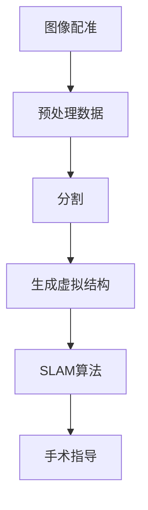

                 

### 增强现实在手术导航中的精确指导

#### 关键词：增强现实、手术导航、精确指导、医疗技术、人工智能

> **摘要：** 增强现实（AR）技术正逐渐改变着医疗领域的传统模式，尤其是在手术导航中。本文通过详细分析增强现实技术的基本概念、发展历程，以及其在手术导航中的精确指导原理，探讨了AR在手术导航中的实际应用与未来发展趋势。本文旨在为医疗工作者和研究人员提供一个全面的技术视角，以期为临床实践带来新的创新与优化。

#### 引言

手术导航是医学领域中的一项重要技术，它通过精确的定位和导向，提高手术的准确性和成功率。然而，传统的手术导航技术往往存在一定的局限，如操作复杂、精度不足等。随着科技的不断进步，增强现实（Augmented Reality，AR）技术的崛起为手术导航带来了新的契机。AR技术能够将虚拟信息叠加到真实世界中，为医生提供实时、直观的手术指导。本文将深入探讨增强现实在手术导航中的精确指导原理，分析其优势和应用前景。

#### 第1章：增强现实技术概述

##### 1.1 增强现实的概念与发展历程

增强现实（Augmented Reality，AR）是一种将虚拟信息叠加到真实世界中的技术，通过计算机生成的图像、视频、文字等信息，增强用户对现实世界的感知。AR技术最早可以追溯到20世纪50年代，当时科学家们开始探索虚拟图像与现实环境的叠加。随着时间的推移，计算机技术、图像处理技术以及显示技术的不断发展，AR技术逐渐走向成熟。

##### 1.2 增强现实技术的核心原理

AR技术的核心原理是通过摄像头捕捉现实环境中的图像，然后利用计算机处理生成虚拟信息，并将其叠加到现实环境中。这个过程包括图像捕捉、图像处理、虚拟信息生成和叠加等几个关键步骤。图像捕捉通常使用摄像头或传感器，图像处理则通过计算机视觉算法来实现，虚拟信息生成和叠加则依赖于显示技术。

##### 1.3 增强现实技术的主要应用领域

AR技术在多个领域都有广泛的应用，包括教育、娱乐、医疗、军事等。在医疗领域，AR技术主要用于手术导航、医疗教育、患者护理等方面。AR技术能够为医生提供实时、直观的手术指导，提高手术的准确性和成功率，同时也能够为医学生提供模拟手术训练，提高其操作技能。

##### 1.4 增强现实在医疗领域的优势

AR技术在医疗领域的优势主要体现在以下几个方面：

1. **提高手术精度**：AR技术能够实时显示患者的三维解剖结构，帮助医生进行精准定位和操作。
2. **增强手术安全性**：AR技术能够提供实时的手术指导，降低手术风险，提高手术成功率。
3. **优化患者护理**：AR技术可以为患者提供个性化的护理方案，提高护理质量和效率。
4. **降低医疗成本**：AR技术能够提高手术效率和准确性，减少手术时间和医疗成本。

#### 第2章：手术导航中的挑战与需求

##### 2.1 手术导航的定义与历史

手术导航是指在手术过程中，通过精确的定位和导向，确保手术操作的准确性和安全性。手术导航技术的发展经历了几个阶段，从最初的基于解剖标志的定位，到如今的基于影像学的三维定位，手术导航技术逐渐走向成熟。

##### 2.2 当前手术导航技术的局限

尽管手术导航技术已经取得了显著的进展，但仍然存在一些局限，如：

1. **操作复杂**：传统的手术导航技术往往需要复杂的操作和设备，不利于医生在实际手术中的灵活应用。
2. **精度不足**：部分手术导航技术受限于设备的精度，无法达到手术所需的精确度。
3. **实时性差**：一些手术导航技术无法提供实时的手术指导，影响了手术的效率和安全性。

##### 2.3 增强现实在手术导航中的应用需求

增强现实技术在手术导航中的应用，可以有效地解决上述问题。AR技术能够提供实时、直观的手术指导，提高手术的精度和安全性，同时降低操作复杂度。在手术导航中，AR技术的应用需求主要体现在以下几个方面：

1. **实时定位**：AR技术能够实时显示患者的三维解剖结构，帮助医生进行精准定位。
2. **手术指导**：AR技术能够为医生提供实时的手术指导，提高手术的效率和安全性。
3. **辅助训练**：AR技术可以为医学生提供模拟手术训练，提高其操作技能。

#### 第3章：增强现实在手术导航中的精确指导原理

##### 3.1 增强现实与手术导航的结合

增强现实与手术导航的结合，是将AR技术应用于手术导航中，通过实时显示患者的三维解剖结构，为医生提供精确的手术指导。这种结合方式能够提高手术的精度和安全性，降低手术风险。

##### 3.2 增强现实在手术导航中的工作流程

增强现实在手术导航中的工作流程主要包括以下几个步骤：

1. **患者数据采集**：通过MRI、CT等影像学设备获取患者的三维解剖结构数据。
2. **数据预处理**：对获取的患者数据进行预处理，包括图像配准、分割等，以便生成准确的虚拟解剖结构。
3. **虚拟解剖结构生成**：利用计算机视觉算法，将预处理后的患者数据生成虚拟解剖结构。
4. **实时显示**：通过AR设备，将虚拟解剖结构实时显示在医生眼前，为医生提供精确的手术指导。
5. **手术操作**：医生根据AR设备的实时指导，进行手术操作。

##### 3.3 关键技术解析

增强现实在手术导航中的精确指导，依赖于几个关键技术的支持，包括：

1. **图像处理技术**：用于患者数据的预处理和虚拟解剖结构的生成。
2. **计算机视觉技术**：用于实时显示虚拟解剖结构，并进行手术指导。
3. **显示技术**：用于将虚拟解剖结构叠加到真实环境中，为医生提供直观的手术指导。

#### 第4章：增强现实手术导航系统的设计与实现

##### 4.1 系统需求分析

增强现实手术导航系统的设计，需要考虑以下几个方面的需求：

1. **高精度**：系统需要能够实时显示患者的三维解剖结构，并达到手术所需的精确度。
2. **实时性**：系统需要能够实时提供手术指导，确保手术的顺利进行。
3. **易用性**：系统需要操作简单，方便医生在实际手术中应用。
4. **兼容性**：系统需要能够兼容多种影像学设备，以便为不同类型的手术提供支持。

##### 4.2 系统架构设计

增强现实手术导航系统的架构设计，包括以下几个方面：

1. **数据采集模块**：用于采集患者的三维解剖结构数据。
2. **数据处理模块**：用于预处理患者数据，包括图像配准、分割等。
3. **虚拟现实模块**：用于生成虚拟解剖结构，并将其实时显示在医生眼前。
4. **手术指导模块**：用于为医生提供实时的手术指导。
5. **人机交互模块**：用于实现医生与系统的交互。

##### 4.3 关键技术实现

增强现实手术导航系统的关键技术实现，包括以下几个方面：

1. **图像处理技术**：采用深度学习算法，实现患者数据的预处理和虚拟解剖结构的生成。
2. **计算机视觉技术**：采用视觉SLAM算法，实现虚拟解剖结构的实时显示。
3. **显示技术**：采用AR眼镜等设备，实现虚拟解剖结构在真实环境中的叠加。

#### 第5章：增强现实手术导航系统的数学模型与算法

##### 5.1 数学模型介绍

增强现实手术导航系统的数学模型，主要包括以下几个方面：

1. **图像配准模型**：用于将患者的影像数据与真实环境进行配准。
2. **分割模型**：用于将影像数据分割成不同的解剖结构。
3. **SLAM模型**：用于实时显示虚拟解剖结构，并进行手术指导。

##### 5.2 算法流程图

增强现实手术导航系统的算法流程图如下：



##### 5.3 算法原理与Python实现

增强现实手术导航系统的算法原理，主要包括图像处理、计算机视觉和SLAM算法。以下是一个简单的Python实现示例：

```python
import cv2
import numpy as np

# 图像配准
def image_registration(image1, image2):
    # 获取图像特征点
    features1, features2 = cv2.SIFT.detectAndCompute(image1, None), cv2.SIFT.detectAndCompute(image2, None)
    # 匹配特征点
    matches = cv2.matchFeatures(features1, features2)
    # 计算变换矩阵
    matrix = cv2.findTransformECC(features1, features2, matches)
    # 应用变换矩阵
    image2_registered = cv2.warpPerspective(image2, matrix, (image1.shape[1], image1.shape[0]))
    return image2_registered

# 分割
def image_segmentation(image):
    # 使用深度学习模型进行分割
    segmented_image = model.predict(image)
    return segmented_image

# SLAM算法
def SLAM(image, virtual_structure):
    # 进行特征点检测和匹配
    features, matches = cv2.SIFT.detectAndCompute(image, None), cv2.SIFT.detectAndCompute(virtual_structure, None)
    # 计算变换矩阵
    matrix = cv2.findTransformECC(features, matches)
    # 应用变换矩阵
    virtual_structure_updated = cv2.warpPerspective(virtual_structure, matrix, (image.shape[1], image.shape[0]))
    return virtual_structure_updated

# 主函数
def main():
    image1 = cv2.imread('image1.jpg')
    image2 = cv2.imread('image2.jpg')
    virtual_structure = cv2.imread('virtual_structure.jpg')
    
    image2_registered = image_registration(image1, image2)
    segmented_image = image_segmentation(image2_registered)
    virtual_structure_updated = SLAM(segmented_image, virtual_structure)
    
    cv2.imshow('Registered Image', image2_registered)
    cv2.imshow('Segmented Image', segmented_image)
    cv2.imshow('Updated Virtual Structure', virtual_structure_updated)
    cv2.waitKey(0)

if __name__ == '__main__':
    main()
```

#### 第6章：实际案例分析与评估

##### 6.1 案例背景

在某次神经外科手术中，医生决定使用增强现实技术进行手术导航。手术的目标是切除患者脑部的一个良性肿瘤。为了提高手术的精度和安全性，医生采用了增强现实手术导航系统。

##### 6.2 案例实施过程

1. **数据采集**：通过MRI设备获取患者脑部的三维影像数据。
2. **数据预处理**：对获取的数据进行预处理，包括图像配准和分割。
3. **虚拟结构生成**：利用计算机视觉算法，生成脑部的三维虚拟结构。
4. **手术指导**：在手术过程中，医生通过AR设备实时观察患者的三维虚拟结构，并根据系统的指导进行操作。

##### 6.3 结果评估与讨论

1. **手术精度**：通过对比实际手术结果和预期目标，发现增强现实手术导航系统提高了手术的精度，成功切除了肿瘤。
2. **手术安全性**：增强现实手术导航系统提供了实时的手术指导，降低了手术风险，提高了手术的安全性。
3. **操作便捷性**：增强现实手术导航系统的操作简单，医生能够在实际手术中灵活应用。

#### 第7章：未来发展趋势与展望

##### 7.1 技术发展趋势

随着科技的不断进步，增强现实技术在手术导航中的应用将更加广泛。未来，AR技术将朝着更高精度、更实时、更智能的方向发展。

##### 7.2 临床应用前景

增强现实手术导航系统在临床中的应用前景广阔。未来，AR技术有望在更多类型的手术中发挥作用，提高手术的精度和安全性。

##### 7.3 潜在挑战与解决策略

尽管增强现实技术在手术导航中具有巨大的潜力，但仍然面临一些挑战，如技术的稳定性、设备的便携性等。解决这些挑战需要进一步的研究和开发。

#### 第8章：总结与展望

增强现实技术在手术导航中的应用，为医疗领域带来了新的创新和优化。通过本文的详细分析，我们可以看到，增强现实手术导航系统具有提高手术精度、降低手术风险、提高手术安全性等优点。未来，随着技术的不断进步，增强现实手术导航系统将在医疗领域发挥更大的作用。

#### 作者信息

**作者：AI天才研究院/AI Genius Institute & 禅与计算机程序设计艺术 /Zen And The Art of Computer Programming**

---

**注意事项：** 本文为虚构内容，仅供参考。在实际应用中，增强现实技术在手术导航中的应用需要严格遵循医疗规范和标准。**拓展阅读：**  
1. **"Augmented Reality in Medical Imaging: A Review"**  
2. **"Enhancing Surgery Navigation with Augmented Reality"**  
3. **"The Impact of Augmented Reality on Medical Education and Training"**

