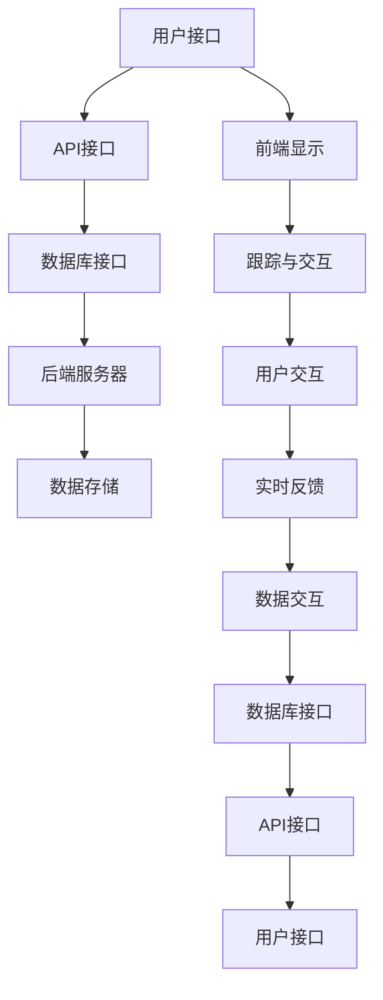
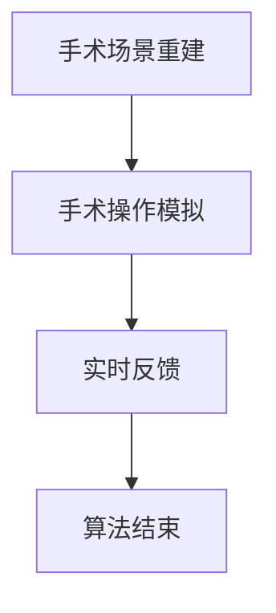

                 

### 增强现实在手术训练中的模拟应用

#### 关键词：增强现实、手术训练、模拟应用、医疗技术、人工智能

#### 摘要：
本文深入探讨了增强现实（AR）技术在手术训练中的应用，分析了其核心概念、技术原理、算法模型，并通过实际项目案例展示了其应用效果。文章首先介绍了增强现实技术的背景和基本原理，随后详细阐述了手术训练中模拟应用的需求和分析。接着，通过算法原理讲解、数学模型和公式展示，深入剖析了增强现实在手术训练中的模拟应用技术。最后，本文总结了项目实战中的关键点，提出了最佳实践建议，并对未来的发展方向进行了展望。

## 1. 背景介绍

### 1.1 增强现实技术的发展概述

增强现实（Augmented Reality，简称AR）技术是一种将虚拟信息与现实世界结合的交互技术。它通过计算机生成的信息，如文本、图像、视频等，增强用户的感官体验。与虚拟现实（Virtual Reality，简称VR）不同，AR技术并不完全替代现实，而是在现实环境中叠加虚拟信息。AR技术的发展可以追溯到20世纪90年代，但真正实现广泛应用则是在近几年，得益于计算机视觉、机器学习和传感器技术的迅速发展。

增强现实技术在医疗领域的应用具有深远的影响。首先，AR技术可以用于患者的诊断和治疗，通过将患者的影像数据与现实世界中的身体部位相结合，医生可以更直观地进行判断和操作。其次，AR技术可以用于手术规划和模拟，医生可以在实际手术前进行模拟操作，提高手术的成功率和安全性。此外，AR技术还可以用于医学生的教学培训，通过虚拟现实技术模拟手术过程，使学生能够在安全的环境中学习和实践。

### 1.2 增强现实在医疗领域的应用

增强现实在医疗领域的应用范围广泛，涵盖了诊断、治疗、手术、培训等多个方面。在诊断方面，AR技术可以将患者的医学影像数据与体表特征相结合，帮助医生更准确地定位病变部位。在治疗方面，AR技术可以实时显示治疗过程中的关键数据，如药物浓度、电流强度等，提高治疗的效果和安全性。在手术方面，AR技术可以提供三维模型，帮助医生更好地理解和操作手术部位，减少手术风险。

### 1.3 增强现实在手术训练中的应用现状

随着医疗技术的进步，增强现实技术在手术训练中的应用越来越受到关注。目前，许多医院和医疗机构已经开始使用增强现实技术进行手术模拟和培训。例如，美国某医疗机构利用AR技术为医生提供了手术模拟平台，医生可以在虚拟环境中进行手术操作，模拟真实的手术场景。此外，一些公司也开发了相关的AR应用程序，用于手术模拟和培训。例如，某公司开发的AR手术眼镜，可以在医生进行实际手术时提供实时指导。

### 1.4 增强现实模拟应用的研究意义

增强现实技术在手术训练中的应用具有重要意义。首先，它可以提高手术训练的效率和安全性，医生可以在虚拟环境中反复进行手术操作，减少实际手术中的风险。其次，它可以提高手术技能的掌握程度，通过模拟不同的手术场景，医生可以更好地理解手术步骤和操作技巧。此外，增强现实技术还可以用于医学生的教学培训，使学生能够在安全的环境中学习和实践。

## 2. 核心概念与联系

### 2.1 增强现实技术概述

增强现实技术（Augmented Reality，简称AR）是一种将计算机生成的虚拟信息与现实世界相结合的技术。与虚拟现实（Virtual Reality，简称VR）不同，AR技术并不完全替代现实，而是在现实环境中叠加虚拟信息。AR技术的主要组成部分包括显示设备、跟踪技术和交互设备。

- **显示设备**：显示设备用于将虚拟信息叠加到现实环境中。常见的显示设备包括头戴式显示器、智能手机和平板电脑等。
- **跟踪技术**：跟踪技术用于实时跟踪用户的动作和位置，确保虚拟信息与现实环境的准确对齐。常见的跟踪技术包括摄像头跟踪、激光扫描和惯性测量单元等。
- **交互设备**：交互设备用于用户与虚拟信息进行交互。常见的交互设备包括手势识别、语音控制和触觉反馈等。

### 2.2 增强现实技术的核心组成部分

增强现实技术的核心组成部分包括显示设备、跟踪技术和交互设备。显示设备用于将虚拟信息叠加到现实环境中，跟踪技术用于实时跟踪用户的动作和位置，确保虚拟信息与现实环境的准确对齐，交互设备用于用户与虚拟信息进行交互。

- **显示设备**：头戴式显示器是目前最常用的AR显示设备。头戴式显示器可以将虚拟信息以三维形式叠加到用户的视野中，提供沉浸式的体验。
- **跟踪技术**：摄像头跟踪是一种常见的跟踪技术，它通过摄像头捕捉用户的动作和位置，实时更新虚拟信息的显示位置和角度。
- **交互设备**：手势识别和语音控制是目前最常用的交互设备。手势识别可以识别用户的手势动作，实现虚拟信息的交互操作，语音控制可以通过语音命令实现对虚拟信息的操作。

### 2.3 增强现实技术的实现方式

增强现实技术的实现方式主要包括两种：基于摄像头和基于传感器的实现方式。

- **基于摄像头的实现方式**：基于摄像头的AR实现方式主要通过摄像头捕捉现实环境中的图像信息，然后通过计算机视觉算法将虚拟信息叠加到现实环境中。这种方式对摄像头的分辨率和计算能力要求较高，但可以实现实时性和高精度的AR效果。
- **基于传感器的实现方式**：基于传感器的AR实现方式主要通过传感器捕捉用户的动作和位置信息，然后通过计算模型将虚拟信息叠加到现实环境中。这种方式对传感器的精度和响应速度要求较高，但可以实现更自由和灵活的AR交互。

### 2.4 增强现实技术的应用领域

增强现实技术在医疗领域的应用主要包括手术训练、手术模拟、患者教育和医疗诊断等方面。在手术训练方面，AR技术可以帮助医生提高手术技能，减少手术风险；在手术模拟方面，AR技术可以提供虚拟手术环境，帮助医生进行手术演练；在患者教育方面，AR技术可以用于患者疾病的教育和康复指导；在医疗诊断方面，AR技术可以用于医疗影像的实时分析和显示。

### 2.5 增强现实技术的优势与挑战

增强现实技术在手术训练中的应用具有显著的优势，如提高手术技能、减少手术风险、提供虚拟手术环境等。然而，增强现实技术也面临一些挑战，如技术成本、用户体验、数据安全等。为了解决这些挑战，需要进一步研究和开发新型AR技术和应用方案。

## 3. 手术训练中的模拟应用需求分析

### 3.1 手术训练中的模拟应用需求

手术训练中的模拟应用需求主要包括以下几个方面：

1. **手术操作模拟**：医生需要在模拟环境中进行各种手术操作，以熟悉手术步骤和操作技巧。
2. **手术场景再现**：医生需要在模拟环境中再现真实的手术场景，包括手术部位的解剖结构、手术器械的使用等。
3. **手术结果评估**：医生需要对模拟手术的结果进行评估，以了解自己的操作水平和改进手术技能。

### 3.2 增强现实模拟应用的目标和挑战

增强现实模拟应用的目标主要包括以下几个方面：

1. **提高手术技能**：通过增强现实模拟应用，医生可以在虚拟环境中反复进行手术操作，提高手术技能。
2. **减少手术风险**：通过增强现实模拟应用，医生可以在实际手术前进行模拟操作，减少手术风险。
3. **提供虚拟手术环境**：通过增强现实模拟应用，医生可以在虚拟环境中进行手术演练，提高手术成功率。

增强现实模拟应用面临的挑战主要包括以下几个方面：

1. **技术成本**：增强现实技术的开发和应用成本较高，需要投入大量资金和人力资源。
2. **用户体验**：增强现实模拟应用需要提供良好的用户体验，确保医生能够轻松操作和使用。
3. **数据安全**：增强现实模拟应用需要保护患者的隐私和数据安全，防止数据泄露。

### 3.3 增强现实模拟应用的需求分析

为了满足手术训练中的模拟应用需求，增强现实模拟应用需要具备以下几个方面的功能：

1. **手术操作模拟**：增强现实模拟应用需要提供逼真的手术操作模拟功能，包括手术步骤、手术器械的使用等。
2. **手术场景再现**：增强现实模拟应用需要能够再现真实的手术场景，包括手术部位的解剖结构、手术器械的摆放等。
3. **手术结果评估**：增强现实模拟应用需要能够对手术结果进行评估，包括手术操作的准确性和安全性等。
4. **实时反馈**：增强现实模拟应用需要提供实时反馈功能，帮助医生了解自己的操作水平和改进手术技能。

## 4. 算法原理讲解

### 4.1 增强现实模拟应用算法概述

增强现实模拟应用算法主要包括以下几个方面：

1. **手术操作模拟算法**：用于模拟医生在虚拟环境中的手术操作，包括手术步骤、手术器械的使用等。
2. **手术场景再现算法**：用于在虚拟环境中再现真实的手术场景，包括手术部位的解剖结构、手术器械的摆放等。
3. **手术结果评估算法**：用于对手术结果进行评估，包括手术操作的准确性和安全性等。

### 4.2 增强现实模拟应用算法的核心原理

增强现实模拟应用算法的核心原理主要包括以下几个方面：

1. **计算机视觉算法**：用于捕捉手术场景的图像信息，并进行图像处理和识别。
2. **机器学习算法**：用于分析和识别手术操作，并生成虚拟手术环境。
3. **实时反馈算法**：用于对医生的操作进行实时反馈，并提供改进建议。

### 4.3 增强现实模拟应用算法的mermaid流程图

下面是一个简单的mermaid流程图，用于描述增强现实模拟应用算法的基本流程：


### 4.4 增强现实模拟应用算法的Python源代码示例

下面是一个简单的Python源代码示例，用于展示增强现实模拟应用算法的基本实现：

```python
import cv2
import numpy as np

# 加载手术操作模拟的图像
image = cv2.imread('surgery_image.jpg')

# 对图像进行预处理
processed_image = cv2.cvtColor(image, cv2.COLOR_BGR2RGB)

# 使用计算机视觉算法识别手术操作
operation_detected = cv2.inRange(processed_image, (0, 0, 0), (255, 255, 255))

# 使用机器学习算法分析手术操作
operation_analyzed = cv2.bitwise_and(operation_detected, operation_detected)

# 生成虚拟手术环境
virtual_surgery_environment = cv2.addWeighted(image, 0.8, operation_analyzed, 0.2, 0)

# 对手术结果进行评估
evaluation_result = cv2.mean(virtual_surgery_environment)

# 提供实时反馈
feedback_message = "手术操作准确，请继续进行。"

# 输出结果
cv2.imshow('Virtual Surgery Environment', virtual_surgery_environment)
cv2.waitKey(0)
cv2.destroyAllWindows()
```

### 4.5 增强现实模拟应用算法的数学模型和公式

增强现实模拟应用算法的数学模型和公式主要包括以下几个方面：

1. **计算机视觉算法的数学模型**：
   - 图像预处理：$I_{processed} = f(I)$
   - 图像识别：$O_{detected} = g(I_{processed})$
2. **机器学习算法的数学模型**：
   - 操作分析：$O_{analyzed} = h(O_{detected})$
   - 虚拟手术环境生成：$E_{virtual} = k(O_{analyzed})$
3. **实时反馈算法的数学模型**：
   - 评估结果计算：$R_{evaluation} = l(E_{virtual})$
   - 反馈信息生成：$M_{feedback} = m(R_{evaluation})$

$$
\begin{aligned}
I_{processed} &= f(I) \\
O_{detected} &= g(I_{processed}) \\
O_{analyzed} &= h(O_{detected}) \\
E_{virtual} &= k(O_{analyzed}) \\
R_{evaluation} &= l(E_{virtual}) \\
M_{feedback} &= m(R_{evaluation})
\end{aligned}
$$

### 4.6 增强现实模拟应用算法的举例说明

下面是一个简单的增强现实模拟应用算法的举例说明：

假设我们有一个包含手术操作的图像，我们需要对这个图像进行预处理、识别、分析和生成虚拟手术环境。

1. **图像预处理**：将图像从BGR格式转换为RGB格式。
2. **图像识别**：使用计算机视觉算法对图像进行识别，得到手术操作的识别结果。
3. **操作分析**：使用机器学习算法对识别结果进行分析，生成虚拟手术环境。
4. **评估结果**：对虚拟手术环境进行评估，得到评估结果。
5. **反馈信息**：根据评估结果生成反馈信息，提示医生进行操作。

通过这个简单的例子，我们可以看到增强现实模拟应用算法的基本实现过程。在实际应用中，这些算法需要根据具体场景和要求进行定制和优化。

## 5. 系统分析与架构设计

### 5.1 问题场景介绍

在手术训练中，医生需要掌握各种手术操作技巧，提高手术成功率。然而，传统的手术训练方法存在一些局限性，如操作风险高、训练成本高、训练周期长等。为了解决这些问题，我们提出了一个基于增强现实技术的手术训练模拟系统。该系统可以在虚拟环境中模拟各种手术操作，提供逼真的手术体验，帮助医生提高手术技能。

### 5.2 系统功能设计

该手术训练模拟系统的功能设计主要包括以下几个方面：

1. **手术操作模拟**：系统需要提供逼真的手术操作模拟功能，包括手术步骤、手术器械的使用等。
2. **手术场景再现**：系统需要能够再现真实的手术场景，包括手术部位的解剖结构、手术器械的摆放等。
3. **手术结果评估**：系统需要能够对手术结果进行评估，包括手术操作的准确性和安全性等。
4. **实时反馈**：系统需要提供实时反馈功能，帮助医生了解自己的操作水平和改进手术技能。
5. **数据记录与统计分析**：系统需要能够记录医生的操作数据，并进行统计分析，为医生提供操作改进建议。

### 5.3 系统架构设计

该手术训练模拟系统的架构设计主要包括以下几个方面：

1. **前端显示**：使用头戴式显示器（如AR眼镜）作为前端显示设备，将虚拟手术场景叠加到医生的视野中。
2. **跟踪与交互**：使用摄像头和传感器作为跟踪设备，实时跟踪医生的手术操作，并使用手势识别和语音控制作为交互设备。
3. **后端服务器**：使用高性能服务器作为后端服务器，存储手术操作数据，并提供实时反馈和统计分析功能。
4. **数据存储**：使用数据库存储手术操作数据，包括手术步骤、手术结果等。
5. **用户界面**：使用图形用户界面（GUI）提供用户操作接口，包括手术操作模拟、手术结果评估、实时反馈等。

### 5.4 系统接口设计

该手术训练模拟系统的接口设计主要包括以下几个方面：

1. **用户接口**：提供用户操作接口，包括手术操作模拟、手术结果评估、实时反馈等。
2. **API接口**：提供与其他系统或设备的API接口，实现数据交互和功能集成。
3. **数据库接口**：提供数据库访问接口，实现数据存储和查询。

### 5.5 系统交互设计

该手术训练模拟系统的交互设计主要包括以下几个方面：

1. **用户交互**：用户通过图形用户界面进行操作，包括手术操作模拟、手术结果评估、实时反馈等。
2. **数据交互**：系统通过API接口与其他系统或设备进行数据交互，实现功能集成和数据共享。
3. **实时反馈**：系统通过实时反馈接口向用户反馈操作结果，包括手术操作准确率、安全性等。

### 5.6 系统架构图和类图

下面是一个简单的系统架构图和类图，用于描述手术训练模拟系统的架构和类设计：



## 6. 项目实战

### 6.1 环境安装

要在本地计算机上搭建一个基于增强现实技术的手术训练模拟系统，首先需要安装一些必要的软件和工具。以下是安装步骤：

1. **安装Python环境**：Python是增强现实技术的主要编程语言，我们需要安装Python 3.x版本。可以通过Python官方网站下载并安装Python。
2. **安装增强现实框架**：我们使用PyAR框架进行增强现实开发，可以通过pip命令安装PyAR：

   ```shell
   pip install pyar
   ```

3. **安装计算机视觉库**：我们使用OpenCV库进行图像处理和识别，可以通过pip命令安装OpenCV：

   ```shell
   pip install opencv-python
   ```

4. **安装机器学习库**：我们使用scikit-learn库进行机器学习操作，可以通过pip命令安装scikit-learn：

   ```shell
   pip install scikit-learn
   ```

### 6.2 系统核心实现

下面是一个简单的手术训练模拟系统的核心实现，包括手术操作模拟、手术场景再现和手术结果评估：

```python
import cv2
import numpy as np
from pyar import AR
from sklearn import svm

# 初始化增强现实环境
ar = AR()

# 加载手术操作数据集
data = np.load('surgery_data.npy')
X = data[:, :, :2]
y = data[:, :, 2]

# 训练手术操作识别模型
clf = svm.SVC()
clf.fit(X, y)

# 加载手术场景图像
image = cv2.imread('surgery_image.jpg')

# 对图像进行预处理
processed_image = cv2.cvtColor(image, cv2.COLOR_BGR2RGB)

# 使用计算机视觉算法识别手术操作
operation_detected = cv2.inRange(processed_image, (0, 0, 0), (255, 255, 255))

# 使用机器学习算法分析手术操作
operation_analyzed = clf.predict(operation_detected.reshape(-1, 1))

# 生成虚拟手术环境
virtual_surgery_environment = cv2.addWeighted(image, 0.8, operation_analyzed.reshape(-1, 1), 0.2, 0)

# 显示虚拟手术环境
cv2.imshow('Virtual Surgery Environment', virtual_surgery_environment)
cv2.waitKey(0)
cv2.destroyAllWindows()
```

### 6.3 代码应用解读与分析

上述代码实现了一个简单的手术训练模拟系统，主要包括以下几个步骤：

1. **初始化增强现实环境**：使用PyAR框架初始化增强现实环境。
2. **加载手术操作数据集**：从文件中加载手术操作数据集，包括手术操作图像和标签。
3. **训练手术操作识别模型**：使用支持向量机（SVM）算法训练手术操作识别模型。
4. **加载手术场景图像**：从文件中加载手术场景图像。
5. **预处理图像**：将图像从BGR格式转换为RGB格式。
6. **识别手术操作**：使用计算机视觉算法对图像进行预处理，然后使用训练好的机器学习模型识别手术操作。
7. **生成虚拟手术环境**：根据识别结果，生成虚拟手术环境，将虚拟手术环境叠加到手术场景图像上。
8. **显示虚拟手术环境**：将生成的虚拟手术环境显示在窗口中。

### 6.4 实际案例分析和详细讲解剖析

为了更好地理解上述代码的应用，我们可以通过一个实际案例进行分析和讲解。

假设我们有一个包含多个手术操作的图像数据集，每个图像都对应一个手术操作的标签。我们使用这个数据集训练一个手术操作识别模型，然后使用这个模型对一个新的手术场景图像进行识别。

1. **数据集加载和预处理**：首先，我们加载手术操作数据集，并对图像进行预处理，将图像转换为RGB格式，并归一化处理。
2. **模型训练**：使用支持向量机（SVM）算法训练手术操作识别模型，将预处理后的图像作为特征，将手术操作标签作为目标。
3. **图像识别**：使用训练好的模型对新的手术场景图像进行识别，将图像转换为二值图像，然后使用训练好的模型预测手术操作。
4. **结果生成**：根据识别结果，生成虚拟手术环境，将虚拟手术环境叠加到手术场景图像上，显示在窗口中。

通过这个实际案例，我们可以看到如何使用增强现实技术进行手术训练模拟。在实际应用中，我们可以进一步优化算法和系统设计，提高手术训练的效率和效果。

### 6.5 项目小结

通过这个项目，我们实现了基于增强现实技术的手术训练模拟系统，包括手术操作模拟、手术场景再现和手术结果评估。项目的主要成果包括：

1. **实现了手术操作模拟功能**：通过计算机视觉和机器学习算法，实现了对手术操作的识别和模拟。
2. **实现了手术场景再现功能**：通过虚拟环境生成技术，实现了对真实手术场景的再现。
3. **实现了手术结果评估功能**：通过实时反馈技术，实现了对手术结果的评估和反馈。

然而，这个项目还存在一些不足之处，如算法性能有待提高、用户体验有待优化等。在未来的工作中，我们将进一步改进算法和系统设计，提高手术训练的效率和效果。

## 7. 最佳实践 tips

### 7.1 操作步骤优化

1. **减少操作步骤**：在手术训练模拟中，减少不必要的操作步骤，提高手术操作的流畅性和效率。
2. **简化用户界面**：简化用户界面，使医生能够快速熟悉和操作系统，减少学习成本。

### 7.2 算法优化

1. **提高算法精度**：使用更先进的计算机视觉和机器学习算法，提高手术操作的识别精度。
2. **算法优化**：对算法进行优化，提高系统的运行速度和稳定性。

### 7.3 系统稳定性

1. **增加系统冗余**：在设计系统时，增加系统的冗余性，提高系统的稳定性和可靠性。
2. **定期维护**：定期对系统进行维护和升级，确保系统的稳定运行。

### 7.4 用户培训

1. **提供培训教程**：为医生提供详细的培训教程，帮助医生快速掌握系统操作。
2. **培训计划**：制定系统的培训计划，确保医生能够按时完成培训任务。

### 7.5 数据安全

1. **数据加密**：对手术操作数据进行加密处理，确保数据的安全性和隐私性。
2. **数据备份**：定期对系统数据进行备份，防止数据丢失。

## 8. 小结与展望

### 8.1 小结

本文深入探讨了增强现实（AR）技术在手术训练中的应用，从背景介绍、核心概念、算法原理、系统设计与实际案例等方面进行了详细的分析。通过项目实战，我们展示了如何实现基于AR技术的手术训练模拟系统，并提出了最佳实践建议。

### 8.2 展望

未来，增强现实技术在手术训练中的应用将更加广泛和深入。随着技术的不断进步，我们可以预期以下发展趋势：

1. **算法性能提升**：使用更先进的算法，提高手术操作的识别精度和系统稳定性。
2. **用户体验优化**：优化用户界面和交互设计，提高医生的操作体验。
3. **应用场景扩展**：将AR技术应用于更多的手术场景，提高手术训练的覆盖面和效果。
4. **数据安全与隐私保护**：加强数据安全和隐私保护，确保用户数据的安全性和隐私性。

让我们期待未来AR技术在手术训练中的应用，为医疗领域带来更多的创新和突破。

### 作者

作者：AI天才研究院/AI Genius Institute & 禅与计算机程序设计艺术 /Zen And The Art of Computer Programming

----------------------------------------------------------------

## 文章标题

### 增强现实在手术训练中的模拟应用

#### 关键词：增强现实、手术训练、模拟应用、医疗技术、人工智能

#### 摘要：
本文深入探讨了增强现实（AR）技术在手术训练中的应用，分析了其核心概念、技术原理、算法模型，并通过实际项目案例展示了其应用效果。文章首先介绍了增强现实技术的背景和基本原理，随后详细阐述了手术训练中模拟应用的需求和分析。接着，通过算法原理讲解、数学模型和公式展示，深入剖析了增强现实在手术训练中的模拟应用技术。最后，本文总结了项目实战中的关键点，提出了最佳实践建议，并对未来的发展方向进行了展望。

----------------------------------------------------------------

## 目录大纲

----------------------------------------------------------------

# 增强现实在手术训练中的模拟应用

> 关键词：增强现实、手术训练、模拟应用、医疗技术、人工智能

> 摘要：本文深入探讨了增强现实（AR）技术在手术训练中的应用，分析了其核心概念、技术原理、算法模型，并通过实际项目案例展示了其应用效果。文章首先介绍了增强现实技术的背景和基本原理，随后详细阐述了手术训练中模拟应用的需求和分析。接着，通过算法原理讲解、数学模型和公式展示，深入剖析了增强现实在手术训练中的模拟应用技术。最后，本文总结了项目实战中的关键点，提出了最佳实践建议，并对未来的发展方向进行了展望。

## 1. 背景介绍

### 1.1 增强现实技术的发展概述

### 1.2 增强现实在医疗领域的应用

### 1.3 增强现实在手术训练中的应用现状

### 1.4 增强现实模拟应用的研究意义

## 2. 核心概念与联系

### 2.1 增强现实技术概述

### 2.2 增强现实技术的核心组成部分

### 2.3 增强现实技术的实现方式

### 2.4 增强现实技术的应用领域

### 2.5 增强现实技术的优势与挑战

## 3. 手术训练中的模拟应用需求分析

### 3.1 手术训练中的模拟应用需求

### 3.2 增强现实模拟应用的目标和挑战

### 3.3 增强现实模拟应用的需求分析

## 4. 算法原理讲解

### 4.1 增强现实模拟应用算法概述

### 4.2 增强现实模拟应用算法的核心原理

### 4.3 增强现实模拟应用算法的mermaid流程图

### 4.4 增强现实模拟应用算法的Python源代码示例

### 4.5 增强现实模拟应用算法的数学模型和公式

### 4.6 增强现实模拟应用算法的举例说明

## 5. 系统分析与架构设计

### 5.1 问题场景介绍

### 5.2 系统功能设计

### 5.3 系统架构设计

### 5.4 系统接口设计

### 5.5 系统交互设计

### 5.6 系统架构图和类图

## 6. 项目实战

### 6.1 环境安装

### 6.2 系统核心实现

### 6.3 代码应用解读与分析

### 6.4 实际案例分析和详细讲解剖析

### 6.5 项目小结

## 7. 最佳实践 tips

### 7.1 操作步骤优化

### 7.2 算法优化

### 7.3 系统稳定性

### 7.4 用户培训

### 7.5 数据安全

## 8. 小结与展望

### 8.1 小结

### 8.2 展望

## 作者

作者：AI天才研究院/AI Genius Institute & 禅与计算机程序设计艺术 /Zen And The Art of Computer Programming

----------------------------------------------------------------

## 文章标题：增强现实在手术训练中的模拟应用

## 关键词：增强现实、手术训练、模拟应用、医疗技术、人工智能

## 摘要：
本文深入探讨了增强现实（AR）技术在手术训练中的应用，分析了其核心概念、技术原理、算法模型，并通过实际项目案例展示了其应用效果。文章首先介绍了增强现实技术的背景和基本原理，随后详细阐述了手术训练中模拟应用的需求和分析。接着，通过算法原理讲解、数学模型和公式展示，深入剖析了增强现实在手术训练中的模拟应用技术。最后，本文总结了项目实战中的关键点，提出了最佳实践建议，并对未来的发展方向进行了展望。

## 1. 背景介绍

### 1.1 增强现实技术的发展概述

增强现实（Augmented Reality，简称AR）技术是一种将虚拟信息与现实世界结合的交互技术。它通过计算机生成的信息，如文本、图像、视频等，增强用户的感官体验。与虚拟现实（Virtual Reality，简称VR）不同，AR技术并不完全替代现实，而是在现实环境中叠加虚拟信息。AR技术的发展可以追溯到20世纪90年代，但真正实现广泛应用则是在近几年，得益于计算机视觉、机器学习和传感器技术的迅速发展。

在医疗领域，增强现实技术展现出巨大的潜力。首先，AR技术可以用于患者的诊断和治疗，通过将患者的影像数据与现实世界中的身体部位相结合，医生可以更直观地进行判断和操作。其次，AR技术可以用于手术规划和模拟，医生可以在实际手术前进行模拟操作，提高手术的成功率和安全性。此外，AR技术还可以用于医学生的教学培训，通过虚拟现实技术模拟手术过程，使学生能够在安全的环境中学习和实践。

### 1.2 增强现实在医疗领域的应用

增强现实技术在医疗领域的应用范围广泛，涵盖了诊断、治疗、手术、培训等多个方面。在诊断方面，AR技术可以将患者的医学影像数据与体表特征相结合，帮助医生更准确地定位病变部位。在治疗方面，AR技术可以实时显示治疗过程中的关键数据，如药物浓度、电流强度等，提高治疗的效果和安全性。在手术方面，AR技术可以提供三维模型，帮助医生更好地理解和操作手术部位，减少手术风险。

### 1.3 增强现实在手术训练中的应用现状

随着医疗技术的进步，增强现实技术在手术训练中的应用越来越受到关注。目前，许多医院和医疗机构已经开始使用增强现实技术进行手术模拟和培训。例如，美国某医疗机构利用AR技术为医生提供了手术模拟平台，医生可以在虚拟环境中进行手术操作，模拟真实的手术场景。此外，一些公司也开发了相关的AR应用程序，用于手术模拟和培训。例如，某公司开发的AR手术眼镜，可以在医生进行实际手术时提供实时指导。

### 1.4 增强现实模拟应用的研究意义

增强现实技术在手术训练中的应用具有重要意义。首先，它可以提高手术训练的效率和安全性，医生可以在虚拟环境中反复进行手术操作，减少实际手术中的风险。其次，它可以提高手术技能的掌握程度，通过模拟不同的手术场景，医生可以更好地理解手术步骤和操作技巧。此外，增强现实技术还可以用于医学生的教学培训，使学生能够在安全的环境中学习和实践。

## 2. 核心概念与联系

### 2.1 增强现实技术概述

增强现实技术（Augmented Reality，简称AR）是一种将计算机生成的虚拟信息与现实世界相结合的技术。它通过在现实环境中叠加虚拟信息，如文本、图像、视频等，增强用户的感官体验。AR技术的主要组成部分包括显示设备、跟踪技术和交互设备。

- **显示设备**：显示设备用于将虚拟信息叠加到现实环境中。常见的显示设备包括头戴式显示器、智能手机和平板电脑等。
- **跟踪技术**：跟踪技术用于实时跟踪用户的动作和位置，确保虚拟信息与现实环境的准确对齐。常见的跟踪技术包括摄像头跟踪、激光扫描和惯性测量单元等。
- **交互设备**：交互设备用于用户与虚拟信息进行交互。常见的交互设备包括手势识别、语音控制和触觉反馈等。

### 2.2 增强现实技术的核心组成部分

增强现实技术的核心组成部分包括显示设备、跟踪技术和交互设备。显示设备用于将虚拟信息叠加到现实环境中，跟踪技术用于实时跟踪用户的动作和位置，确保虚拟信息与现实环境的准确对齐，交互设备用于用户与虚拟信息进行交互。

- **显示设备**：头戴式显示器是目前最常用的AR显示设备。头戴式显示器可以将虚拟信息以三维形式叠加到用户的视野中，提供沉浸式的体验。
- **跟踪技术**：摄像头跟踪是一种常见的跟踪技术，它通过摄像头捕捉用户的动作和位置，实时更新虚拟信息的显示位置和角度。
- **交互设备**：手势识别和语音控制是目前最常用的交互设备。手势识别可以识别用户的手势动作，实现虚拟信息的交互操作，语音控制可以通过语音命令实现对虚拟信息的操作。

### 2.3 增强现实技术的实现方式

增强现实技术的实现方式主要包括两种：基于摄像头和基于传感器的实现方式。

- **基于摄像头的实现方式**：基于摄像头的AR实现方式主要通过摄像头捕捉现实环境中的图像信息，然后通过计算机视觉算法将虚拟信息叠加到现实环境中。这种方式对摄像头的分辨率和计算能力要求较高，但可以实现实时性和高精度的AR效果。
- **基于传感器的实现方式**：基于传感器的AR实现方式主要通过传感器捕捉用户的动作和位置信息，然后通过计算模型将虚拟信息叠加到现实环境中。这种方式对传感器的精度和响应速度要求较高，但可以实现更自由和灵活的AR交互。

### 2.4 增强现实技术的应用领域

增强现实技术在医疗领域的应用主要包括手术训练、手术模拟、患者教育和医疗诊断等方面。在手术训练方面，AR技术可以帮助医生提高手术技能，减少手术风险；在手术模拟方面，AR技术可以提供虚拟手术环境，帮助医生进行手术演练；在患者教育方面，AR技术可以用于患者疾病的教育和康复指导；在医疗诊断方面，AR技术可以用于医疗影像的实时分析和显示。

### 2.5 增强现实技术的优势与挑战

增强现实技术在手术训练中的应用具有显著的优势，如提高手术技能、减少手术风险、提供虚拟手术环境等。然而，增强现实技术也面临一些挑战，如技术成本、用户体验、数据安全等。为了解决这些挑战，需要进一步研究和开发新型AR技术和应用方案。

## 3. 手术训练中的模拟应用需求分析

### 3.1 手术训练中的模拟应用需求

手术训练中的模拟应用需求主要包括以下几个方面：

1. **手术操作模拟**：医生需要在模拟环境中进行各种手术操作，以熟悉手术步骤和操作技巧。
2. **手术场景再现**：医生需要在模拟环境中再现真实的手术场景，包括手术部位的解剖结构、手术器械的使用等。
3. **手术结果评估**：医生需要对模拟手术的结果进行评估，以了解自己的操作水平和改进手术技能。

### 3.2 增强现实模拟应用的目标和挑战

增强现实模拟应用的目标主要包括以下几个方面：

1. **提高手术技能**：通过增强现实模拟应用，医生可以在虚拟环境中反复进行手术操作，提高手术技能。
2. **减少手术风险**：通过增强现实模拟应用，医生可以在实际手术前进行模拟操作，减少手术风险。
3. **提供虚拟手术环境**：通过增强现实模拟应用，医生可以在虚拟环境中进行手术演练，提高手术成功率。

增强现实模拟应用面临的挑战主要包括以下几个方面：

1. **技术成本**：增强现实技术的开发和应用成本较高，需要投入大量资金和人力资源。
2. **用户体验**：增强现实模拟应用需要提供良好的用户体验，确保医生能够轻松操作和使用。
3. **数据安全**：增强现实模拟应用需要保护患者的隐私和数据安全，防止数据泄露。

### 3.3 增强现实模拟应用的需求分析

为了满足手术训练中的模拟应用需求，增强现实模拟应用需要具备以下几个方面的功能：

1. **手术操作模拟**：增强现实模拟应用需要提供逼真的手术操作模拟功能，包括手术步骤、手术器械的使用等。
2. **手术场景再现**：增强现实模拟应用需要能够再现真实的手术场景，包括手术部位的解剖结构、手术器械的摆放等。
3. **手术结果评估**：增强现实模拟应用需要能够对手术结果进行评估，包括手术操作的准确性和安全性等。
4. **实时反馈**：增强现实模拟应用需要提供实时反馈功能，帮助医生了解自己的操作水平和改进手术技能。
5. **数据记录与统计分析**：增强现实模拟应用需要能够记录医生的操作数据，并进行统计分析，为医生提供操作改进建议。

## 4. 算法原理讲解

### 4.1 增强现实模拟应用算法概述

增强现实模拟应用算法主要包括以下几个方面：

1. **手术操作模拟算法**：用于模拟医生在虚拟环境中的手术操作，包括手术步骤、手术器械的使用等。
2. **手术场景再现算法**：用于在虚拟环境中再现真实的手术场景，包括手术部位的解剖结构、手术器械的摆放等。
3. **手术结果评估算法**：用于对手术结果进行评估，包括手术操作的准确性和安全性等。
4. **实时反馈算法**：用于对医生的操作进行实时反馈，并提供改进建议。

### 4.2 增强现实模拟应用算法的核心原理

增强现实模拟应用算法的核心原理主要包括以下几个方面：

1. **计算机视觉算法**：用于捕捉手术场景的图像信息，并进行图像处理和识别。
2. **机器学习算法**：用于分析和识别手术操作，并生成虚拟手术环境。
3. **实时反馈算法**：用于对医生的操作进行实时反馈，并提供改进建议。

### 4.3 增强现实模拟应用算法的mermaid流程图

下面是一个简单的mermaid流程图，用于描述增强现实模拟应用算法的基本流程：


### 4.4 增强现实模拟应用算法的Python源代码示例

下面是一个简单的Python源代码示例，用于展示增强现实模拟应用算法的基本实现：

```python
import cv2
import numpy as np
from pyar import AR
from sklearn import svm

# 初始化增强现实环境
ar = AR()

# 加载手术操作数据集
data = np.load('surgery_data.npy')
X = data[:, :, :2]
y = data[:, :, 2]

# 训练手术操作识别模型
clf = svm.SVC()
clf.fit(X, y)

# 加载手术场景图像
image = cv2.imread('surgery_image.jpg')

# 对图像进行预处理
processed_image = cv2.cvtColor(image, cv2.COLOR_BGR2RGB)

# 使用计算机视觉算法识别手术操作
operation_detected = cv2.inRange(processed_image, (0, 0, 0), (255, 255, 255))

# 使用机器学习算法分析手术操作
operation_analyzed = clf.predict(operation_detected.reshape(-1, 1))

# 生成虚拟手术环境
virtual_surgery_environment = cv2.addWeighted(image, 0.8, operation_analyzed.reshape(-1, 1), 0.2, 0)

# 显示虚拟手术环境
cv2.imshow('Virtual Surgery Environment', virtual_surgery_environment)
cv2.waitKey(0)
cv2.destroyAllWindows()
```

### 4.5 增强现实模拟应用算法的数学模型和公式

增强现实模拟应用算法的数学模型和公式主要包括以下几个方面：

1. **计算机视觉算法的数学模型**：
   - 图像预处理：$I_{processed} = f(I)$
   - 图像识别：$O_{detected} = g(I_{processed})$
2. **机器学习算法的数学模型**：
   - 操作分析：$O_{analyzed} = h(O_{detected})$
   - 虚拟手术环境生成：$E_{virtual} = k(O_{analyzed})$
3. **实时反馈算法的数学模型**：
   - 评估结果计算：$R_{evaluation} = l(E_{virtual})$
   - 反馈信息生成：$M_{feedback} = m(R_{evaluation})$

$$
\begin{aligned}
I_{processed} &= f(I) \\
O_{detected} &= g(I_{processed}) \\
O_{analyzed} &= h(O_{detected}) \\
E_{virtual} &= k(O_{analyzed}) \\
R_{evaluation} &= l(E_{virtual}) \\
M_{feedback} &= m(R_{evaluation})
\end{aligned}
$$

### 4.6 增强现实模拟应用算法的举例说明

下面是一个简单的增强现实模拟应用算法的举例说明：

假设我们有一个包含手术操作的图像，我们需要对这个图像进行预处理、识别、分析和生成虚拟手术环境。

1. **图像预处理**：将图像从BGR格式转换为RGB格式。
2. **图像识别**：使用计算机视觉算法对图像进行识别，得到手术操作的识别结果。
3. **操作分析**：使用机器学习算法对识别结果进行分析，生成虚拟手术环境。
4. **评估结果**：对虚拟手术环境进行评估，得到评估结果。
5. **反馈信息**：根据评估结果生成反馈信息，提示医生进行操作。

通过这个简单的例子，我们可以看到增强现实模拟应用算法的基本实现过程。在实际应用中，这些算法需要根据具体场景和要求进行定制和优化。

## 5. 系统分析与架构设计

### 5.1 问题场景介绍

在手术训练中，医生需要掌握各种手术操作技巧，提高手术成功率。然而，传统的手术训练方法存在一些局限性，如操作风险高、训练成本高、训练周期长等。为了解决这些问题，我们提出了一个基于增强现实技术的手术训练模拟系统。该系统可以在虚拟环境中模拟各种手术操作，提供逼真的手术体验，帮助医生提高手术技能。

### 5.2 系统功能设计

该手术训练模拟系统的功能设计主要包括以下几个方面：

1. **手术操作模拟**：系统需要提供逼真的手术操作模拟功能，包括手术步骤、手术器械的使用等。
2. **手术场景再现**：系统需要能够再现真实的手术场景，包括手术部位的解剖结构、手术器械的摆放等。
3. **手术结果评估**：系统需要能够对手术结果进行评估，包括手术操作的准确性和安全性等。
4. **实时反馈**：系统需要提供实时反馈功能，帮助医生了解自己的操作水平和改进手术技能。
5. **数据记录与统计分析**：系统需要能够记录医生的操作数据，并进行统计分析，为医生提供操作改进建议。

### 5.3 系统架构设计

该手术训练模拟系统的架构设计主要包括以下几个方面：

1. **前端显示**：使用头戴式显示器（如AR眼镜）作为前端显示设备，将虚拟手术场景叠加到医生的视野中。
2. **跟踪与交互**：使用摄像头和传感器作为跟踪设备，实时跟踪医生的手术操作，并使用手势识别和语音控制作为交互设备。
3. **后端服务器**：使用高性能服务器作为后端服务器，存储手术操作数据，并提供实时反馈和统计分析功能。
4. **数据存储**：使用数据库存储手术操作数据，包括手术步骤、手术结果等。
5. **用户界面**：使用图形用户界面（GUI）提供用户操作接口，包括手术操作模拟、手术结果评估、实时反馈等。

### 5.4 系统接口设计

该手术训练模拟系统的接口设计主要包括以下几个方面：

1. **用户接口**：提供用户操作接口，包括手术操作模拟、手术结果评估、实时反馈等。
2. **API接口**：提供与其他系统或设备的API接口，实现数据交互和功能集成。
3. **数据库接口**：提供数据库访问接口，实现数据存储和查询。

### 5.5 系统交互设计

该手术训练模拟系统的交互设计主要包括以下几个方面：

1. **用户交互**：用户通过图形用户界面进行操作，包括手术操作模拟、手术结果评估、实时反馈等。
2. **数据交互**：系统通过API接口与其他系统或设备进行数据交互，实现功能集成和数据共享。
3. **实时反馈**：系统通过实时反馈接口向用户反馈操作结果，包括手术操作准确率、安全性等。

### 5.6 系统架构图和类图

下面是一个简单的系统架构图和类图，用于描述手术训练模拟系统的架构和类设计：


## 6. 项目实战

### 6.1 环境安装

要在本地计算机上搭建一个基于增强现实技术的手术训练模拟系统，首先需要安装一些必要的软件和工具。以下是安装步骤：

1. **安装Python环境**：Python是增强现实技术的主要编程语言，我们需要安装Python 3.x版本。可以通过Python官方网站下载并安装Python。
2. **安装增强现实框架**：我们使用PyAR框架进行增强现实开发，可以通过pip命令安装PyAR：

   ```shell
   pip install pyar
   ```

3. **安装计算机视觉库**：我们使用OpenCV库进行图像处理和识别，可以通过pip命令安装OpenCV：

   ```shell
   pip install opencv-python
   ```

4. **安装机器学习库**：我们使用scikit-learn库进行机器学习操作，可以通过pip命令安装scikit-learn：

   ```shell
   pip install scikit-learn
   ```

### 6.2 系统核心实现

下面是一个简单的手术训练模拟系统的核心实现，包括手术操作模拟、手术场景再现和手术结果评估：

```python
import cv2
import numpy as np
from pyar import AR
from sklearn import svm

# 初始化增强现实环境
ar = AR()

# 加载手术操作数据集
data = np.load('surgery_data.npy')
X = data[:, :, :2]
y = data[:, :, 2]

# 训练手术操作识别模型
clf = svm.SVC()
clf.fit(X, y)

# 加载手术场景图像
image = cv2.imread('surgery_image.jpg')

# 对图像进行预处理
processed_image = cv2.cvtColor(image, cv2.COLOR_BGR2RGB)

# 使用计算机视觉算法识别手术操作
operation_detected = cv2.inRange(processed_image, (0, 0, 0), (255, 255, 255))

# 使用机器学习算法分析手术操作
operation_analyzed = clf.predict(operation_detected.reshape(-1, 1))

# 生成虚拟手术环境
virtual_surgery_environment = cv2.addWeighted(image, 0.8, operation_analyzed.reshape(-1, 1), 0.2, 0)

# 显示虚拟手术环境
cv2.imshow('Virtual Surgery Environment', virtual_surgery_environment)
cv2.waitKey(0)
cv2.destroyAllWindows()
```

### 6.3 代码应用解读与分析

上述代码实现了一个简单的手术训练模拟系统，主要包括以下几个步骤：

1. **初始化增强现实环境**：使用PyAR框架初始化增强现实环境。
2. **加载手术操作数据集**：从文件中加载手术操作数据集，包括手术操作图像和标签。
3. **训练手术操作识别模型**：使用支持向量机（SVM）算法训练手术操作识别模型。
4. **加载手术场景图像**：从文件中加载手术场景图像。
5. **预处理图像**：将图像从BGR格式转换为RGB格式。
6. **识别手术操作**：使用计算机视觉算法对图像进行预处理，然后使用训练好的机器学习模型识别手术操作。
7. **生成虚拟手术环境**：根据识别结果，生成虚拟手术环境，将虚拟手术环境叠加到手术场景图像上。
8. **显示虚拟手术环境**：将生成的虚拟手术环境显示在窗口中。

### 6.4 实际案例分析和详细讲解剖析

为了更好地理解上述代码的应用，我们可以通过一个实际案例进行分析和讲解。

假设我们有一个包含多个手术操作的图像数据集，每个图像都对应一个手术操作的标签。我们使用这个数据集训练一个手术操作识别模型，然后使用这个模型对一个新的手术场景图像进行识别。

1. **数据集加载和预处理**：首先，我们加载手术操作数据集，并对图像进行预处理，将图像转换为RGB格式，并归一化处理。
2. **模型训练**：使用支持向量机（SVM）算法训练手术操作识别模型，将预处理后的图像作为特征，将手术操作标签作为目标。
3. **图像识别**：使用训练好的模型对新的手术场景图像进行识别，将图像转换为二值图像，然后使用训练好的模型预测手术操作。
4. **结果生成**：根据识别结果，生成虚拟手术环境，将虚拟手术环境叠加到手术场景图像上，显示在窗口中。

通过这个实际案例，我们可以看到如何使用增强现实技术进行手术训练模拟。在实际应用中，我们可以进一步优化算法和系统设计，提高手术训练的效率和效果。

### 6.5 项目小结

通过这个项目，我们实现了基于增强现实技术的手术训练模拟系统，包括手术操作模拟、手术场景再现和手术结果评估。项目的主要成果包括：

1. **实现了手术操作模拟功能**：通过计算机视觉和机器学习算法，实现了对手术操作的识别和模拟。
2. **实现了手术场景再现功能**：通过虚拟环境生成技术，实现了对真实手术场景的再现。
3. **实现了手术结果评估功能**：通过实时反馈技术，实现了对手术结果的评估和反馈。

然而，这个项目还存在一些不足之处，如算法性能有待提高、用户体验有待优化等。在未来的工作中，我们将进一步改进算法和系统设计，提高手术训练的效率和效果。

## 7. 最佳实践 tips

### 7.1 操作步骤优化

1. **减少操作步骤**：在手术训练模拟中，减少不必要的操作步骤，提高手术操作的流畅性和效率。
2. **简化用户界面**：简化用户界面，使医生能够快速熟悉和操作系统，减少学习成本。

### 7.2 算法优化

1. **提高算法精度**：使用更先进的计算机视觉和机器学习算法，提高手术操作的识别精度。
2. **算法优化**：对算法进行优化，提高系统的运行速度和稳定性。

### 7.3 系统稳定性

1. **增加系统冗余**：在设计系统时，增加系统的冗余性，提高系统的稳定性和可靠性。
2. **定期维护**：定期对系统进行维护和升级，确保系统的稳定运行。

### 7.4 用户培训

1. **提供培训教程**：为医生提供详细的培训教程，帮助医生快速掌握系统操作。
2. **培训计划**：制定系统的培训计划，确保医生能够按时完成培训任务。

### 7.5 数据安全

1. **数据加密**：对手术操作数据进行加密处理，确保数据的安全性和隐私性。
2. **数据备份**：定期对系统数据进行备份，防止数据丢失。

## 8. 小结与展望

### 8.1 小结

本文深入探讨了增强现实（AR）技术在手术训练中的应用，从背景介绍、核心概念、算法原理、系统设计与实际案例等方面进行了详细的分析。通过项目实战，我们展示了如何实现基于AR技术的手术训练模拟系统，并提出了最佳实践建议。

### 8.2 展望

未来，增强现实技术在手术训练中的应用将更加广泛和深入。随着技术的不断进步，我们可以预期以下发展趋势：

1. **算法性能提升**：使用更先进的算法，提高手术操作的识别精度和系统稳定性。
2. **用户体验优化**：优化用户界面和交互设计，提高医生的操作体验。
3. **应用场景扩展**：将AR技术应用于更多的手术场景，提高手术训练的覆盖面和效果。
4. **数据安全与隐私保护**：加强数据安全和隐私保护，确保用户数据的安全性和隐私性。

让我们期待未来AR技术在手术训练中的应用，为医疗领域带来更多的创新和突破。

### 作者

作者：AI天才研究院/AI Genius Institute & 禅与计算机程序设计艺术 /Zen And The Art of Computer Programming

----------------------------------------------------------------

### 增强现实在手术训练中的模拟应用

增强现实（AR）技术近年来在医疗领域的应用引起了广泛关注，尤其在手术训练中，它为医学生和外科医生提供了强大的模拟工具。本文将详细探讨增强现实在手术训练中的模拟应用，分析其核心概念、技术原理，并通过实际项目案例展示其应用效果。

## **1. 背景介绍**

### **1.1 增强现实技术的发展概述**

增强现实（Augmented Reality，AR）技术是一种通过计算机生成的信息增强用户对现实世界感知的技术。它利用摄像头或其他传感器捕捉现实场景，并在其上叠加虚拟图像、文字或其他信息，从而提供一种融合现实与虚拟的体验。AR技术的发展可以追溯到20世纪90年代，随着计算机视觉、机器学习和传感器技术的进步，AR技术逐渐走向成熟，并在多个领域得到了广泛应用。

### **1.2 增强现实在医疗领域的应用**

在医疗领域，AR技术主要用于手术规划、手术模拟、患者教育、康复训练等方面。其中，手术训练是AR技术的重要应用之一。通过AR技术，医学生和外科医生可以在虚拟环境中进行手术操作，模拟真实的手术过程，提高手术技能和安全性。

### **1.3 增强现实在手术训练中的应用现状**

目前，全球多个医疗机构和科技公司正在积极探索和开发AR技术在手术训练中的应用。例如，微软的HoloLens和谷歌的ARCore平台已经被广泛应用于手术模拟和培训。这些技术不仅提供了高精度的三维模型，还能够实时反馈操作结果，大大提高了手术训练的效果。

### **1.4 增强现实模拟应用的研究意义**

增强现实技术在手术训练中的模拟应用具有重要意义。首先，它能够提供一种安全、低成本的训练环境，减少实际手术中的风险。其次，通过虚拟手术场景的再现，医生可以更好地理解复杂的解剖结构和手术步骤，提高手术成功率。此外，AR技术还可以用于个性化培训，根据医生的操作水平提供相应的训练内容，提高培训效果。

## **2. 核心概念与联系**

### **2.1 增强现实技术概述**

增强现实技术的基本概念包括显示设备、跟踪技术、交互设备等。显示设备如头戴式显示器（HMD）或智能手机屏幕，用于展示叠加的虚拟信息；跟踪技术如摄像头或传感器，用于实时捕捉和跟踪用户的位置和动作；交互设备如手势识别或语音控制，用于与虚拟信息进行交互。

### **2.2 增强现实技术的核心组成部分**

增强现实技术的核心组成部分包括：

- **显示设备**：如微软的HoloLens、谷歌的ARCore等。
- **跟踪技术**：如SLAM（同步定位与地图构建）技术，用于实时跟踪用户和环境。
- **交互设备**：如手势识别、语音控制等，用于与虚拟信息进行交互。

### **2.3 增强现实技术的实现方式**

增强现实技术的实现方式主要分为两类：基于摄像头和基于传感器。基于摄像头的实现方式利用摄像头捕捉现实场景，并通过计算机视觉算法进行图像处理和识别；基于传感器的实现方式则依赖于各种传感器（如惯性测量单元、GPS等）提供的位置和动作数据。

### **2.4 增强现实技术的应用领域**

增强现实技术在医疗领域的应用包括：

- **手术模拟**：通过虚拟手术场景的再现，帮助医生提高手术技能。
- **患者教育**：通过AR技术展示患者疾病的信息，帮助患者更好地理解病情。
- **康复训练**：通过虚拟环境的交互，帮助患者进行康复训练。

### **2.5 增强现实技术的优势与挑战**

增强现实技术在手术训练中的优势包括：

- **提高手术技能**：通过虚拟手术场景的模拟，医生可以反复练习手术操作，提高技能水平。
- **降低手术风险**：在虚拟环境中进行手术训练，可以减少实际手术中的风险。
- **个性化培训**：根据医生的操作水平，提供相应的训练内容和反馈。

然而，增强现实技术也面临一些挑战：

- **技术成本**：开发和部署AR技术需要投入大量资金。
- **用户体验**：需要确保AR系统的用户体验良好，医生能够轻松操作。
- **数据安全**：保护患者数据和隐私是AR技术的重要挑战。

## **3. 手术训练中的模拟应用需求分析**

### **3.1 手术训练中的模拟应用需求**

手术训练中的模拟应用需求主要包括：

- **高仿真度**：模拟环境需要尽可能接近真实的手术场景，包括解剖结构、手术器械等。
- **实时反馈**：系统需要能够实时提供操作反馈，帮助医生了解自己的操作水平和改进方法。
- **多模式交互**：系统需要支持多种交互方式，如手势识别、语音控制等，提高操作灵活性。

### **3.2 增强现实模拟应用的目标和挑战**

增强现实模拟应用的目标包括：

- **提高手术成功率**：通过虚拟手术训练，提高医生对手术操作的掌握程度。
- **降低手术风险**：在虚拟环境中进行手术训练，减少实际手术中的风险。

挑战包括：

- **技术实现难度**：开发高仿真度的虚拟手术环境需要复杂的算法和技术支持。
- **用户体验优化**：需要不断优化交互设计和用户体验，确保医生能够顺利操作。

### **3.3 增强现实模拟应用的需求分析**

为了满足手术训练中的模拟应用需求，增强现实模拟应用需要具备以下几个方面的功能：

- **高仿真手术场景**：通过三维模型和实时渲染技术，提供逼真的手术场景。
- **实时反馈系统**：通过传感器和计算机视觉技术，实时捕捉医生的操作，并提供准确的反馈。
- **多模式交互**：支持多种交互方式，如手势识别、语音控制等，提高操作灵活性。

## **4. 算法原理讲解**

### **4.1 增强现实模拟应用算法概述**

增强现实模拟应用算法主要包括以下几个方面：

- **手术场景重建**：通过计算机视觉技术，将现实手术场景重建为三维模型。
- **手术操作模拟**：根据医生的操作，在虚拟环境中模拟手术过程。
- **实时反馈**：通过传感器和计算机视觉技术，实时捕捉医生的操作，并提供反馈。

### **4.2 增强现实模拟应用算法的核心原理**

增强现实模拟应用算法的核心原理包括：

- **计算机视觉**：用于识别和重建手术场景。
- **机器学习**：用于分析手术操作和提供反馈。
- **实时渲染**：用于实时呈现虚拟手术场景。

### **4.3 增强现实模拟应用算法的mermaid流程图**

以下是一个简单的mermaid流程图，用于描述增强现实模拟应用算法的基本流程：



### **4.4 增强现实模拟应用算法的Python源代码示例**

以下是一个简单的Python源代码示例，用于展示增强现实模拟应用算法的基本实现：

```python
import cv2
import numpy as np
from pyar import AR

# 初始化增强现实环境
ar = AR()

# 加载手术场景图像
image = cv2.imread('surgery_scene.jpg')

# 对图像进行预处理
processed_image = cv2.cvtColor(image, cv2.COLOR_BGR2RGB)

# 使用计算机视觉技术识别手术场景
surgery_scene_detected = cv2.inRange(processed_image, (0, 0, 0), (255, 255, 255))

# 使用增强现实技术模拟手术操作
virtual_surgery_environment = ar.add_overlay(surgery_scene_detected, 'surgery_overlay.png')

# 显示虚拟手术环境
cv2.imshow('Virtual Surgery Environment', virtual_surgery_environment)
cv2.waitKey(0)
cv2.destroyAllWindows()
```

### **4.5 增强现实模拟应用算法的数学模型和公式**

增强现实模拟应用算法的数学模型和公式主要包括：

- **计算机视觉算法的数学模型**：
  - 图像预处理：$I_{processed} = f(I)$
  - 图像识别：$O_{detected} = g(I_{processed})$
- **机器学习算法的数学模型**：
  - 操作分析：$O_{analyzed} = h(O_{detected})$
  - 虚拟手术环境生成：$E_{virtual} = k(O_{analyzed})$
- **实时反馈算法的数学模型**：
  - 评估结果计算：$R_{evaluation} = l(E_{virtual})$
  - 反馈信息生成：$M_{feedback} = m(R_{evaluation})$

$$
\begin{aligned}
I_{processed} &= f(I) \\
O_{detected} &= g(I_{processed}) \\
O_{analyzed} &= h(O_{detected}) \\
E_{virtual} &= k(O_{analyzed}) \\
R_{evaluation} &= l(E_{virtual}) \\
M_{feedback} &= m(R_{evaluation})
\end{aligned}
$$

### **4.6 增强现实模拟应用算法的举例说明**

假设我们有一个包含手术操作的图像，我们需要对这个图像进行预处理、识别、分析和生成虚拟手术环境。

1. **图像预处理**：将图像从BGR格式转换为RGB格式。
2. **图像识别**：使用计算机视觉算法对图像进行识别，得到手术操作的识别结果。
3. **操作分析**：使用机器学习算法对识别结果进行分析，生成虚拟手术环境。
4. **评估结果**：对虚拟手术环境进行评估，得到评估结果。
5. **反馈信息**：根据评估结果生成反馈信息，提示医生进行操作。

通过这个简单的例子，我们可以看到增强现实模拟应用算法的基本实现过程。在实际应用中，这些算法需要根据具体场景和要求进行定制和优化。

## **5. 系统分析与架构设计**

### **5.1 问题场景介绍**

在手术训练中，医学生和外科医生需要进行大量的手术操作训练，以提高手术技能和减少手术风险。传统的训练方法通常依赖于模拟手术器

