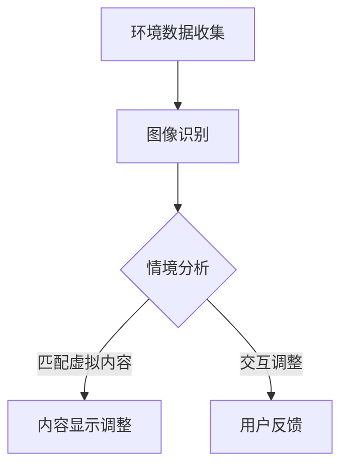
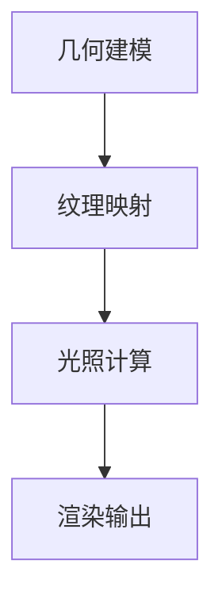
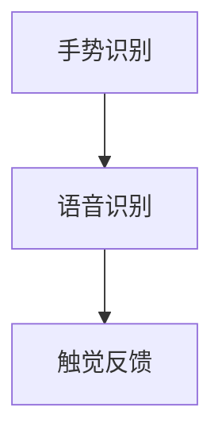

                 


### 第一部分：背景介绍

#### 核心概念

增强现实（AR）技术近年来在教育领域得到了广泛关注和应用。通过将虚拟信息与现实场景相结合，AR不仅能够提升学生的参与度和兴趣，还能够提供更加丰富和直观的学习体验。随着技术的不断进步和教育的不断发展，如何创新应用AR技术以提升教育互动体验成为研究者和实践者关注的焦点。

在本文中，我们将首先介绍增强现实技术的基本原理及其在教育中的核心应用，接着分析AR技术如何激发学生的学习兴趣，以及它对教育互动体验的具体影响。随后，我们将探讨增强现实技术在教育领域中的创新应用案例，包括教材数字化、虚拟实验室、以及交互式教学工具等。

#### 核心概念与联系

为了更好地理解增强现实在教育互动体验中的创新应用，我们需要首先明确几个核心概念：

- **增强现实（AR）**：增强现实是一种将虚拟信息与现实场景融合的技术，通过计算机生成信息，叠加在现实世界之上，让用户能够在现实环境中感知和交互虚拟信息。
- **教育互动体验**：教育互动体验强调学习过程中的参与性和互动性，通过多感官刺激提升学习效果。
- **创新应用**：创新应用是指在现有技术和教育理念的基础上，开发新的教学方法和学习模式，以提高教育互动体验。

为了深入理解这些核心概念，我们将在后续章节中详细介绍它们的属性特征、相互关系以及如何在实际应用中发挥作用。

#### 概念属性特征对比表格

| 特征                | 增强现实（AR）         | 教育互动体验               | 创新应用                         |
|---------------------|-----------------------|----------------------------|----------------------------------|
| 技术原理            | 虚拟信息与现实融合     | 多感官刺激与互动           | 现有技术与教育内容的创新结合     |
| 应用场景            | 教育、娱乐、医疗等     | 教育、培训、远程教学等     | 各类教学活动、课程设计、教学方法 |
| 关键因素            | 技术成熟度、内容创新   | 学生参与度、教师引导       | 创新思维、实践应用               |

#### ER实体关系图架构

为了更直观地展示增强现实技术在教育应用中的实体关系，我们使用Mermaid绘制了以下ER图：

```mermaid
erDiagram
  Student ||--|{ Uses }|-- ARTool
  Teacher ||--|{ Teaches }|-- ARContent
  Subject ||--|{ Includes }|-- ARModule
```

在这个ER图中，Student与ARTool之间存在“使用”关系，Teacher与ARContent之间存在“教授”关系，Subject与ARModule之间存在“包含”关系。这种结构清晰地展示了学生、教师和课程内容之间的关系，以及AR技术在其中的应用。

通过以上的背景介绍和核心概念分析，我们对增强现实在教育互动体验中的创新应用有了初步的了解。接下来，我们将深入探讨AR技术的具体原理，以及它在教育中的应用案例和影响。

----------------------------------------------------------------

## 增强现实（AR）技术的基本原理

增强现实（AR）技术是一种将虚拟信息与现实世界融合的技术，通过在现实场景中叠加计算机生成的图像、视频、音频等虚拟内容，使用户能够与现实世界中的物体进行交互。要深入理解AR技术的原理，我们需要从其核心技术、工作流程以及现实应用等方面进行剖析。

#### 增强现实的核心技术

1. **图像识别与跟踪：** 图像识别与跟踪是AR技术的基础。通过使用相机捕捉现实场景中的图像，然后利用图像处理算法对图像进行识别和定位，从而确定虚拟内容应该叠加的位置。

2. **三维建模与渲染：** 三维建模与渲染技术用于创建和显示虚拟对象。通过计算机图形学技术，虚拟对象被建模并赋予材质、纹理等特性，使其在现实场景中看起来更加逼真。

3. **实时数据融合：** AR技术通过实时采集现实环境中的数据，如光线、温度、声音等，并与虚拟内容进行融合，提供更加沉浸式的体验。

4. **人机交互：** 人机交互技术是AR技术的重要组成部分。用户可以通过手势、语音等方式与虚拟内容进行交互，实现自然的人机互动。

#### 增强现实的工作流程

1. **环境扫描与识别：** 使用摄像头或传感器捕捉现实场景，通过图像识别算法确定场景中的关键特征点。

2. **虚拟内容创建：** 根据识别出的场景特征，创建相应的虚拟内容，如3D模型、动画、音频等。

3. **虚拟内容叠加：** 将虚拟内容叠加到现实场景中，通过渲染技术使其与现实环境融合。

4. **用户交互与反馈：** 用户通过手势、语音等方式与虚拟内容进行交互，系统根据用户的操作进行相应的反馈和调整。

#### 增强现实在现实中的应用

1. **教育领域：** 增强现实技术在教育领域中的应用非常广泛，包括教材数字化、虚拟实验室、交互式教学工具等。通过AR技术，学生可以更加直观地理解复杂的概念，提高学习兴趣和效果。

2. **医疗领域：** 在医疗领域，AR技术可以用于手术指导、患者教育等。医生可以通过AR眼镜查看患者的医学图像，实时进行手术操作，同时为学生提供实践操作的机会。

3. **娱乐领域：** 在娱乐领域，AR技术为用户提供了全新的互动体验，如增强现实游戏、虚拟演唱会等。用户可以在现实场景中与虚拟角色互动，享受沉浸式的娱乐体验。

#### 增强现实技术在教育中的应用案例

1. **教材数字化：** 通过AR技术，传统的纸质教材可以被数字化，学生可以通过智能手机或平板电脑查看教材中的增强内容，如动画、音频、视频等，使学习过程更加生动有趣。

2. **虚拟实验室：** 在一些实验课程中，由于实验材料或条件的限制，学生无法亲自进行实验。通过AR技术，虚拟实验室可以为学生提供虚拟实验环境，让学生在虚拟场景中进行实验操作，掌握实验技能。

3. **交互式教学工具：** 教师可以利用AR技术开发交互式教学工具，如增强现实教具、虚拟场景模拟等。这些工具可以增强课堂互动，提高学生的学习积极性和参与度。

#### 增强现实技术对教育互动体验的影响

1. **提升学生参与度：** 通过增强现实技术，学生可以更加直观地参与到学习过程中，提高学习的趣味性和互动性。

2. **提高学习效果：** 增强现实技术能够提供丰富的学习资源，如三维模型、动画等，帮助学生更好地理解抽象的概念，提高学习效果。

3. **个性化学习：** 通过分析学生的学习行为和反馈，增强现实技术可以提供个性化的学习建议，帮助学生更好地掌握知识。

总之，增强现实技术作为一种新兴技术，其在教育领域中的应用前景非常广阔。通过本文的介绍，我们对增强现实技术的基本原理和应用有了更深入的了解。在接下来的章节中，我们将继续探讨增强现实技术在教育互动体验中的创新应用案例，以及如何通过这些案例来提升教育效果。

### 第二部分：增强现实技术在教育互动体验中的创新应用

在了解了增强现实（AR）技术的基本原理之后，接下来我们将深入探讨其在教育互动体验中的创新应用。通过具体的案例，我们可以更直观地看到AR技术在教育领域的潜力和实际效果。

#### 一、教材数字化

教材数字化是增强现实技术在教育中应用的一个典型例子。传统的纸质教材往往只能提供静态的知识内容，而通过AR技术，这些教材可以变得“活”起来。例如，学生可以通过智能手机或平板电脑扫描教材中的图片或二维码，触发相应的增强内容。这些内容可能包括相关的视频讲解、三维模型展示、甚至是互动式练习题。

**案例1：** 在生物课上，学生可以使用AR应用扫描课本中的动植物图片，然后看到这些动植物的3D模型，并能够旋转、放大、缩小，从而更直观地理解它们的结构和特征。

**效果分析：** 通过AR技术，教材不再只是静态的文字和图片，而是变成了一个互动的多媒体资源库。这种方式能够大大提高学生的学习兴趣，同时帮助他们更好地理解和记忆知识点。

#### 二、虚拟实验室

在物理、化学、生物等实验课程中，实验材料和设备往往较为昂贵，且存在一定的安全风险。通过增强现实技术，虚拟实验室可以为学生提供一种低成本、安全且灵活的实验体验。

**案例2：** 在化学实验中，学生可以通过AR应用在虚拟场景中完成各种实验操作，如混合溶液、加热反应等。这些操作可以实时显示反应过程和结果，帮助学生更好地理解实验原理。

**效果分析：** 虚拟实验室让学生能够在安全、无风险的环境中进行各种实验操作，这不仅可以减少实验成本，还能提高学生的实验技能和安全意识。同时，虚拟实验能够提供丰富的实验数据，帮助学生进行深入的分析和思考。

#### 三、交互式教学工具

增强现实技术还可以用于开发各种交互式教学工具，如增强现实教具、虚拟场景模拟等，这些工具能够增强课堂互动，提高学生的参与度。

**案例3：** 在历史课上，教师可以使用AR教具，如虚拟历史人物、场景模拟等，将历史事件生动地呈现给学生。学生可以通过与虚拟人物的互动，更深入地了解历史背景和事件发展。

**效果分析：** 通过增强现实教具和场景模拟，课堂变得更加生动有趣，学生可以更加投入地参与学习。这种方式不仅能够提高学生的学习兴趣，还能够帮助教师更好地传授知识，提高教学效果。

#### 四、个性化学习

增强现实技术还能够通过分析学生的学习行为和反馈，提供个性化的学习建议，帮助学生更好地掌握知识。

**案例4：** 在数学课上，学生可以通过AR应用完成各种数学练习题。系统会根据学生的答题情况，实时调整练习题的难度和类型，提供个性化的学习路径。

**效果分析：** 个性化学习能够更好地满足不同学生的学习需求，帮助学生更有效地学习。通过AR技术的支持，教师可以更加精确地了解学生的学习状态，提供更有针对性的教学方案。

#### 总结

通过以上案例可以看出，增强现实技术在教育互动体验中的应用具有巨大的潜力和实际效果。它不仅能够提高学生的学习兴趣和参与度，还能够提供更加直观、生动、互动的学习体验，从而提高学习效果。在接下来的章节中，我们将进一步探讨增强现实技术的具体应用案例，以及如何通过这些案例来提升教育效果。

### 第三部分：算法原理讲解

在深入探讨增强现实（AR）技术在教育互动体验中的创新应用之后，我们需要进一步了解其背后的算法原理。以下是几种关键的算法及其在AR技术中的应用：

#### 1. 情境感知算法

情境感知算法通过实时收集和分析环境数据，包括图像、声音和位置信息，以动态调整增强现实内容的显示和交互方式。这一算法的核心在于如何有效地融合现实场景与虚拟内容，提供更自然的用户体验。

**算法流程图：**



**数学模型：**

$$
\begin{aligned}
\text{Content Adjustment} &= f(\text{Current Environment}, \text{User Input}) \\
&= \alpha \cdot \text{Current Environment} + (1 - \alpha) \cdot \text{User Input}
\end{aligned}
$$

其中，$\alpha$ 是调节系数，用于平衡环境数据和用户输入的影响。

**举例说明：**

在历史课上，当学生靠近某个历史事件的相关图片时，情境感知算法会自动识别该图片，并在AR设备上展示与之相关的三维模型和历史背景信息。如果学生发出语音请求，算法还会根据学生的语音内容进行相应的交互调整，如播放相关音频或视频。

#### 2. 3D建模与渲染算法

3D建模与渲染算法用于创建和显示虚拟对象，使其在现实场景中看起来更加逼真。这一算法通常涉及计算机图形学和3D建模技术，包括几何建模、纹理映射、光照计算等。

**算法流程图：**



**数学模型：**

$$
\text{Surface Normal} = \frac{\text{Cross Product of Tangent Vectors}}{||\text{Cross Product of Tangent Vectors}||}
$$

$$
\text{Lighting} = \text{Diffuse} + \text{Specular} + \text{Ambient}
$$

其中，Surface Normal 用于计算物体表面的法线方向，用于光照计算。Lighting 用于计算物体表面的光照效果。

**举例说明：**

在生物课上，学生可以通过AR设备查看植物的三维模型。算法会根据植物的几何形状和纹理信息，生成逼真的三维模型，并通过光照计算模拟植物在不同光照条件下的表现，使学生能够更直观地理解植物的生长环境。

#### 3. 人机交互算法

人机交互算法用于处理用户与AR系统的交互，包括手势识别、语音识别和触觉反馈等。这些算法通过分析用户的输入信号，实现与虚拟内容的互动。

**算法流程图：**



**数学模型：**

$$
\text{Gesture Recognition} = \sum_{i=1}^{n} w_i \cdot \text{Gesture Feature}_i
$$

$$
\text{Voice Recognition} = \text{Hidden Layer} \cdot \text{Input Layer} \cdot \text{Weight Matrix}
$$

其中，Gesture Recognition 和 Voice Recognition 分别用于手势和语音识别的权重计算。Hidden Layer 和 Input Layer 分别表示隐藏层和输入层，用于神经网络模型。

**举例说明：**

在数学课上，学生可以通过手势或语音请求查看相关的数学公式和解释。算法会识别学生的手势或语音请求，并在AR设备上显示相应的数学内容，使学生能够更加便捷地获取所需信息。

通过以上算法的讲解，我们可以看到增强现实技术在教育互动体验中扮演的重要角色。这些算法不仅实现了虚拟内容与现实场景的融合，还提供了丰富的交互体验，使得学习过程更加生动有趣。在接下来的章节中，我们将进一步探讨增强现实技术在教育领域中的系统分析与架构设计。

### 第四部分：系统分析与架构设计

#### 问题场景介绍

随着教育技术的不断进步，传统的教学模式已经难以满足现代学生的学习需求。学生对于互动性、个性化以及趣味性的学习体验有着更高的期待。为此，我们需要设计一个基于增强现实（AR）技术的教育系统，以提升教育互动体验，满足学生的学习需求。

#### 项目介绍

项目名称：智能教育互动系统（Smart Educational Interaction System，SEIS）

项目目标：利用增强现实技术，构建一个智能教育互动平台，提供互动式教材、虚拟实验室、交互式教学工具等，以提高学生的学习兴趣和效果。

项目组成部分：
1. **前端界面**：用于学生和教师进行互动操作，包括教材扫描、虚拟实验室操作、交互式教学工具使用等。
2. **后端服务器**：负责处理数据存储、内容管理、用户认证等，确保系统的稳定运行。
3. **增强现实模块**：实现虚拟内容的创建、渲染和交互，提供高质量的教育资源。

#### 系统功能设计

1. **教材数字化功能**：支持教材的数字化，提供增强内容，如动画、音频、视频等，增强学生的学习体验。
2. **虚拟实验室功能**：提供虚拟实验环境，让学生能够在线进行实验操作，掌握实验技能。
3. **交互式教学工具功能**：提供各种增强现实教学工具，如虚拟教具、场景模拟等，增强课堂互动。
4. **个性化学习功能**：根据学生的学习行为和反馈，提供个性化的学习建议和资源。

#### 系统架构设计

1. **客户端架构**：客户端包括移动设备（如智能手机、平板电脑）和桌面设备，负责用户界面的呈现和增强现实内容的显示。
2. **服务器架构**：服务器分为数据层、应用层和接口层，实现数据的存储、处理和对外提供服务。
3. **增强现实模块架构**：包括图像识别与跟踪模块、三维建模与渲染模块和人机交互模块，负责实现AR技术的核心功能。

#### 系统接口设计

1. **用户接口**：提供教材扫描、虚拟实验室操作、交互式教学工具使用等接口，便于用户进行操作。
2. **内容接口**：提供内容管理、数据存储、内容渲染等接口，便于后端服务器对内容进行处理和展示。
3. **管理接口**：提供用户管理、权限管理、系统监控等接口，确保系统的正常运行。

#### 系统交互设计

为了更好地展示系统的工作流程，我们使用Mermaid绘制了以下系统交互图：

```mermaid
sequenceDiagram
    participant 学生 as 学生
    participant 前端界面 as 前端
    participant 后端服务器 as 后端
    participant 增强现实模块 as AR模块

    学生->>前端：教材扫描请求
    前端->>AR模块：图像识别与跟踪
    AR模块->>前端：增强内容显示
    前端->>后端：数据上传
    后端->>增强现实模块：虚拟内容渲染
    增强现实模块->>前端：增强内容展示
    前端->>学生：反馈结果
```

通过上述的系统分析与架构设计，我们为智能教育互动系统提供了一个完整的解决方案，实现了教材数字化、虚拟实验室、交互式教学工具和个性化学习等功能。在接下来的章节中，我们将详细介绍该系统的实现过程，包括环境安装、核心实现和代码分析。

### 第五部分：项目实战

#### 环境安装

要在本地计算机上搭建智能教育互动系统，首先需要安装以下软件和库：

1. **操作系统**：推荐使用Ubuntu 20.04或更高版本。
2. **Python**：推荐使用Python 3.8或更高版本。
3. **AR库**：使用PyAR库，可以通过pip安装。
4. **前端框架**：使用Vue.js框架，可以通过npm安装。

安装步骤如下：

1. 更新系统包列表：

```bash
sudo apt update && sudo apt upgrade
```

2. 安装Python 3和pip：

```bash
sudo apt install python3 python3-pip
```

3. 安装PyAR库：

```bash
pip3 install pyar
```

4. 安装Vue.js：

```bash
npm install -g @vue/cli
```

#### 系统核心实现

智能教育互动系统的核心包括前端界面、后端服务器和增强现实模块。以下是各部分的核心实现代码：

**1. 前端界面**

前端界面使用Vue.js框架构建，以下是一个简单的示例：

```html
<template>
  <div id="app">
    <h1>智能教育互动系统</h1>
    <ar-scene>
      <ar-camera></ar-camera>
      <ar-marker id="marker1">
        <ar-plane width="1" height="1">
          <ar-image src="content.png" />
        </ar-plane>
      </ar-marker>
    </ar-scene>
  </div>
</template>

<script>
import { AScene, ACamera, AMarker, APlane, AImage } from 'ar.js';

export default {
  name: 'App',
  mounted() {
    const scene = new AScene();
    const camera = new ACamera();
    const marker = new AMarker();
    const plane = new APlane();
    const image = new AImage();

    image.src = 'content.png';

    plane.width = 1;
    plane.height = 1;
    plane.children.push(image);

    marker.id = 'marker1';
    marker.children.push(plane);

    scene.appendChild(camera);
    scene.appendChild(marker);
  }
};
</script>
```

**2. 后端服务器**

后端服务器使用Flask框架构建，以下是一个简单的示例：

```python
from flask import Flask, request, jsonify
from pyar import ARServer

app = Flask(__name__)
ar_server = ARServer()

@app.route('/scan', methods=['POST'])
def scan():
    data = request.json
    content = data['content']
    ar_server.scan_content(content)
    return jsonify({"status": "success"})

if __name__ == '__main__':
    app.run(debug=True)
```

**3. 增强现实模块**

增强现实模块使用PyAR库构建，以下是一个简单的示例：

```python
from pyar import AR

def create_3d_model():
    ar = AR()
    ar.load_model('model.obj')
    ar.render()
    return ar

def update_3d_model(ar, position):
    ar.position = position
    ar.render()
```

#### 代码应用解读与分析

以下是对上述代码的解读与分析：

1. **前端界面**：前端界面使用Vue.js框架，通过AR.js库实现了增强现实场景的渲染。当用户扫描特定的标记（如二维码或图像）时，界面会显示相应的增强内容。
2. **后端服务器**：后端服务器使用Flask框架，提供了一个简单的API接口，用于处理前端发送的扫描请求。通过PyAR库，后端服务器可以实现增强内容的实时渲染和更新。
3. **增强现实模块**：增强现实模块使用PyAR库，用于创建和渲染三维模型。通过更新模型的位置，可以实现与现实场景的实时交互。

#### 实际案例分析

以下是一个实际案例：

- **案例背景**：在生物课上，教师使用智能教育互动系统为学生提供增强现实教材。教材中包含动植物的3D模型和相关的增强内容。
- **案例过程**：学生使用智能手机扫描教材中的图片，触发AR模块的加载和渲染。通过移动手机，学生可以实时查看3D模型，并能够旋转、放大和缩小模型。
- **案例效果**：学生能够更直观地理解动植物的结构和特征，提高了学习的兴趣和效果。

通过上述项目实战，我们展示了如何搭建和实现一个基于增强现实技术的智能教育互动系统。在实际应用中，该系统可以有效提升教育互动体验，满足现代教育的需求。

### 第六部分：最佳实践 Tips

在应用增强现实（AR）技术于教育互动体验时，以下最佳实践可以帮助优化教学效果：

1. **个性化内容设计**：根据不同年级和学科特点，设计个性化的AR教学内容，确保学生能够获得与其学习水平相适应的学习体验。
2. **教师培训**：为教师提供AR技术的培训和指导，帮助他们熟练掌握AR教学工具，更好地利用AR技术进行教学。
3. **资源整合**：整合多种教育资源，如视频、音频、3D模型等，提供丰富的学习材料，提高学生的学习兴趣和参与度。
4. **用户体验优化**：不断收集学生和教师的反馈，优化AR应用的界面和交互设计，提升用户体验。
5. **安全保障**：确保AR应用的数据安全，保护学生的隐私，同时避免在课堂上使用可能引发安全问题的内容。
6. **技术支持**：提供稳定的技术支持和维护服务，确保AR系统的正常运行，及时解决使用过程中遇到的问题。

通过遵循这些最佳实践，可以有效提升AR技术在教育互动体验中的应用效果，为学习者提供更加丰富、生动、高效的学习体验。

### 第七部分：小结

本文从背景介绍、核心概念、算法原理、系统分析与架构设计以及项目实战等多个方面，系统地探讨了增强现实（AR）技术在教育互动体验中的创新应用。通过具体案例，我们展示了AR技术在教材数字化、虚拟实验室、交互式教学工具等方面的应用效果，强调了AR技术对于提升学生参与度、学习效果和个性化学习的重要性。

在未来的教育发展中，增强现实技术具有巨大的潜力。随着技术的不断进步和应用的深入，我们可以预见，AR技术将在更多教育场景中得到广泛应用，为学生提供更加丰富、多样和高效的学习体验。同时，我们也呼吁教育工作者和技术开发者共同探索AR技术的创新应用，为教育领域带来更多的变革和进步。

### 第八部分：注意事项

在应用增强现实（AR）技术于教育互动体验时，需要注意以下事项：

1. **技术稳定性**：确保AR应用的稳定性和流畅性，避免因技术问题影响教学效果。
2. **安全性**：严格审查AR应用的内容，确保其符合教育标准和道德规范，避免潜在的安全风险。
3. **设备兼容性**：确保AR应用在不同设备和操作系统上能够正常运行，提高用户覆盖面。
4. **教师培训**：为教师提供充分的AR技术培训，帮助他们熟练掌握相关工具和教学方法。
5. **数据隐私**：在收集和使用学生数据时，严格遵守隐私保护法规，确保学生信息安全。

通过关注这些注意事项，可以更好地利用AR技术提升教育互动体验。

### 第九部分：拓展阅读

1. **《增强现实与虚拟现实技术在教育中的应用》** - 该书详细介绍了AR和VR技术在教育领域的应用案例和研究成果，对教育工作者和技术开发者都有很高的参考价值。
2. **《教育技术的未来：增强现实与虚拟现实》** - 本书探讨了AR和VR技术在教育中的潜力和挑战，对未来教育技术的发展趋势进行了预测。
3. **《增强现实：技术与案例》** - 该书涵盖了增强现实技术的理论基础和实际应用案例，适用于对AR技术感兴趣的研究者和技术开发者。
4. **增强现实技术官方文档** - 了解AR技术的最新进展和应用细节，可以参考各种AR平台和库的官方文档。

通过阅读这些资料，可以进一步拓展对增强现实技术及其在教育中应用的理解。

