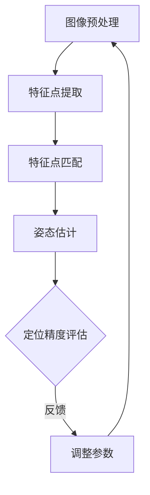
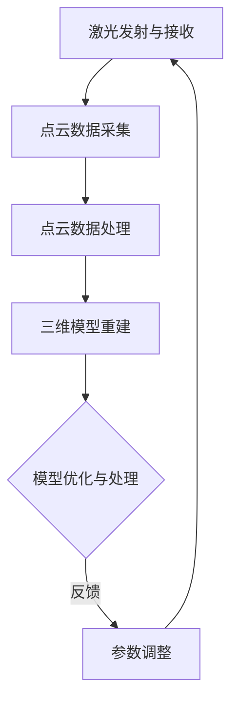
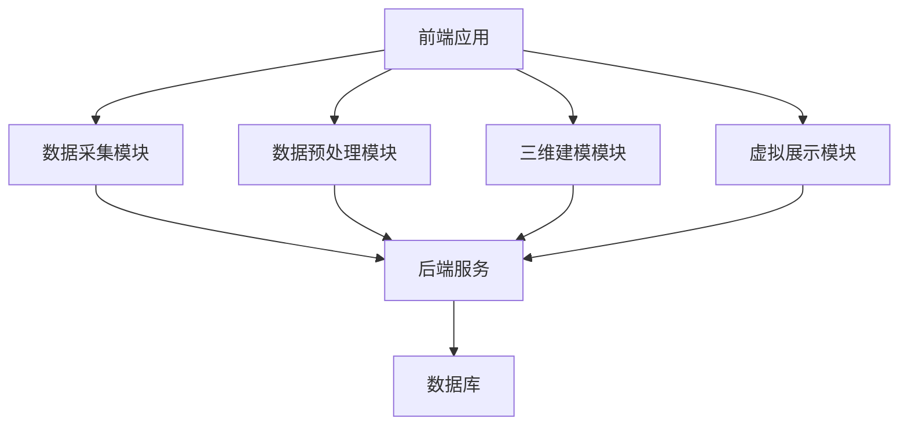

                 

### 增强现实在文化遗产数字重建中的应用

> 关键词：增强现实、文化遗产、数字重建、虚拟博物馆、虚拟古城复原、系统架构、项目实战

> 摘要：本文深入探讨了增强现实技术在文化遗产数字重建中的应用。通过对增强现实技术的基本原理、发展历程以及其在文化遗产保护中的前景进行概述，本文详细分析了文化遗产数字重建中的挑战与需求。随后，本文介绍了增强现实与数字重建技术的核心概念及其联系，并列举了虚拟博物馆和虚拟古城复原的应用案例。在此基础上，本文阐述了增强现实技术在文化遗产数字重建中的数学模型和算法原理，并设计了一个文化遗产数字重建的系统架构。最后，通过项目实战展示了增强现实技术在文化遗产数字重建中的具体应用，并提出了最佳实践与展望。

## 目录大纲：增强现实在文化遗产数字重建中的应用

### 第一部分：背景与概述

#### 第1章：增强现实技术概述

1.1.1 增强现实技术的定义与基本原理

1.1.2 增强现实技术的发展历程

1.1.3 增强现实技术在文化遗产保护中的应用前景

#### 第2章：文化遗产数字重建的挑战与需求

2.1.1 文化遗产保护的现状与问题

2.1.2 数字重建技术在文化遗产保护中的应用需求

2.1.3 数字重建技术的挑战

#### 第3章：增强现实在文化遗产数字重建中的核心概念与联系

3.1.1 增强现实技术的主要类型

3.1.2 数字重建技术的基本概念

3.1.3 增强现实与数字重建技术的联系

### 第二部分：技术应用案例

#### 第4章：文化遗产数字重建中的增强现实技术应用案例

4.1.1 案例一：虚拟博物馆

4.1.2 案例二：虚拟古城复原

### 第三部分：算法与系统架构

#### 第5章：增强现实技术在文化遗产数字重建中的数学模型和算法原理

5.1.1 增强现实定位算法

5.1.2 数字重建算法

#### 第6章：文化遗产数字重建中的系统分析与架构设计

6.1.1 问题场景介绍

6.1.2 系统功能设计

6.1.3 系统架构设计

6.1.4 系tem接口设计

6.1.5 系统交互

### 第四部分：项目实战

#### 第7章：项目实战：文化遗产数字重建系统开发

7.1.1 环境安装

7.1.2 系统核心实现源代码

7.1.3 代码应用解读与分析

7.1.4 实际案例分析

7.1.5 项目小结

### 第五部分：最佳实践与拓展

#### 第8章：最佳实践与拓展

8.1.1 增强现实技术选型与优化

8.1.2 数字重建数据采集与处理

8.1.3 项目管理与协作

8.1.4 小结与展望

---

接下来，我们将按照目录大纲逐一展开各个章节的内容，深入探讨增强现实技术在文化遗产数字重建中的应用。在每一章节中，我们将遵循“背景介绍”、“核心概念与联系”、“应用案例”、“算法原理讲解”、“系统分析与架构设计”以及“项目实战”的步骤进行分析和讨论。通过这样的结构，我们希望能够让读者系统地了解增强现实技术在文化遗产数字重建中的重要性及其应用方法。

### 第一部分：背景与概述

#### 第1章：增强现实技术概述

1.1.1 增强现实技术的定义与基本原理

增强现实（Augmented Reality，简称AR）是一种通过计算机技术将虚拟信息叠加到真实世界中的技术。它利用摄像头、传感器和显示屏等设备，实时捕捉现实世界的景象，并在其上叠加虚拟图像、文字、声音等多媒体信息，从而使用户能够与虚拟信息进行互动。这种技术的基本原理涉及图像处理、计算机视觉、传感器融合和虚拟现实等多个领域。

首先，图像处理技术负责捕捉和识别现实世界的景象。通过摄像头获取的图像数据会经过预处理，如去噪、增强和分割等，以便提取出有用的信息。接着，计算机视觉技术用于识别和定位图像中的关键特征点，如角点、边缘和纹理等。这些特征点为后续的传感器融合提供了基础。

传感器融合是将多种传感器数据（如摄像头、GPS、加速度计和陀螺仪等）进行综合处理，以获得更准确的位置和方向信息。这些信息通过传感器融合算法，如卡尔曼滤波和粒子滤波，被用于实时更新虚拟信息的位置和方向。

最后，虚拟信息通过显示屏叠加到真实世界的景象中。这些虚拟信息可以是静态的，如图像和文字，也可以是动态的，如动画和视频。用户可以通过触摸屏或手势与虚拟信息进行互动，从而实现与真实世界的高度融合。

1.1.2 增强现实技术的发展历程

增强现实技术起源于20世纪60年代的虚拟现实（Virtual Reality，简称VR）技术。然而，由于当时计算能力和显示技术的限制，AR技术并未得到广泛应用。直到21世纪初，随着智能手机和移动设备的普及，AR技术逐渐成为现实。

2000年初，波音公司开发了AR导航系统，用于飞机维修人员。2004年，谷歌收购了AR公司Keyhole，并开发了Google Earth，这是第一个大规模应用的AR产品。随后，2012年，苹果公司发布了AR开发框架ARKit，使得AR技术开始在消费级市场上得到广泛应用。

近年来，随着5G、人工智能和物联网等技术的发展，增强现实技术迎来了新一轮的爆发。例如，微软的HoloLens、谷歌的ARCore和苹果的ARKit等平台，为开发者提供了丰富的工具和资源，使得AR应用的开发变得更加便捷和高效。

1.1.3 增强现实技术在文化遗产保护中的应用前景

文化遗产是人类文明的重要遗产，但许多文化遗产正面临着自然侵蚀、战争破坏和人为损坏的威胁。传统的文化遗产保护方法往往需要耗费大量的人力、物力和财力，而且效果有限。增强现实技术的出现，为文化遗产保护提供了新的手段和思路。

首先，增强现实技术可以帮助文化遗产的数字化重建。通过3D扫描和图像处理技术，可以将文化遗产的物理形态转化为数字模型。这些数字模型可以在计算机上存储、传输和展示，从而实现文化遗产的永久保存和传承。

其次，增强现实技术可以为文化遗产提供互动体验。用户可以通过智能手机或AR眼镜等设备，实时查看文化遗产的数字重建模型，并进行互动操作，如旋转、放大、缩小和切换视角等。这种互动体验不仅能够提高用户的学习兴趣，还能够让用户更深入地了解文化遗产的历史和文化内涵。

最后，增强现实技术可以为文化遗产保护提供远程监控和管理。通过将文化遗产的数字模型与传感器和物联网技术相结合，可以实现文化遗产的实时监控和远程管理，从而提高文化遗产保护的效果和效率。

总之，增强现实技术在文化遗产保护中具有广泛的应用前景。随着技术的不断进步和应用案例的不断涌现，增强现实技术将为文化遗产保护带来更多创新和突破。

---

通过本章的介绍，我们初步了解了增强现实技术的基本原理、发展历程以及在文化遗产保护中的应用前景。在接下来的章节中，我们将继续探讨文化遗产数字重建中的挑战与需求，并深入分析增强现实技术在数字重建中的应用和实现方法。希望读者能够通过本章的学习，对增强现实技术在文化遗产数字重建中的应用有一个整体的认识。

#### 第2章：文化遗产数字重建的挑战与需求

2.1.1 文化遗产保护的现状与问题

文化遗产是人类文明的重要见证，具有独特的文化、历史和艺术价值。然而，随着现代社会的快速发展和环境变迁，许多文化遗产正面临着严重的威胁和挑战。这些问题不仅制约了文化遗产的保护和传承，也对人类的文化多样性构成了威胁。

首先，自然侵蚀是文化遗产保护面临的主要问题之一。例如，风吹、日晒、雨水等因素会导致建筑物的剥蚀和风化，从而损害其结构和外观。自然气候的变化，如干旱、洪水和地震等，也可能对文化遗产造成不可逆转的破坏。

其次，人为损坏也是文化遗产保护中的重要问题。现代社会中，人口增长和城市化进程加速，导致文化遗产区域的人流量增加。游客的活动、环境污染和非法挖掘等行为，都可能对文化遗产造成损害。此外，一些文化遗产在开发和利用过程中，由于缺乏科学的管理和保护措施，也容易受到破坏。

再次，战争和冲突是文化遗产保护面临的重大威胁。许多国家的历史文化遗产在战争中遭受了严重破坏。例如，第二次世界大战期间，德国、意大利和日本等国家的文化遗产遭到了大规模破坏。近年来，一些地区的冲突和战争也导致了许多文化遗产的损毁和丢失。

2.1.2 数字重建技术在文化遗产保护中的应用需求

为了应对上述挑战，数字重建技术在文化遗产保护中的应用显得尤为重要。数字重建技术可以通过以下方式提升文化遗产的保护效果：

1. **数字化保存与传承**：通过数字化手段，将文化遗产的物理形态转化为数字模型，实现文化遗产的永久保存和传承。数字模型可以存储在计算机中，避免因自然侵蚀和人为损坏而导致的文化遗产消失。此外，数字模型还可以通过互联网进行共享和传播，使得更多的人能够了解和欣赏文化遗产。

2. **互动展示与教育**：数字重建技术可以为文化遗产提供互动展示和教育功能。通过虚拟现实（VR）和增强现实（AR）等技术，用户可以身临其境地体验文化遗产的历史场景和文化内涵。这种互动体验不仅能够提高用户的学习兴趣，还能够加深对文化遗产的理解和认识。

3. **监控与管理**：数字重建技术可以结合物联网（IoT）和传感器技术，实现对文化遗产的实时监控和管理。通过传感器收集的数据，可以对文化遗产的结构、环境状况和游客行为等进行监控，及时发现和预防潜在的风险。此外，数字模型还可以用于虚拟修复和再制造，为文化遗产的保护和修复提供新的技术手段。

4. **文化遗产研究**：数字重建技术为文化遗产的研究提供了新的方法和工具。通过数字模型，研究人员可以更方便地对文化遗产进行数据分析和三维重建，从而深入了解文化遗产的结构、功能和历史背景。数字模型还可以用于模拟文化遗产在不同环境条件下的变化，为文化遗产的保护提供科学依据。

2.1.3 数字重建技术的挑战

尽管数字重建技术在文化遗产保护中具有巨大的潜力，但其应用也面临一系列挑战：

1. **数据采集与处理**：数字重建技术的核心在于对文化遗产进行精准的数字化采集和处理。然而，文化遗产的形态复杂多样，数据采集过程中容易出现误差和缺失。此外，由于文化遗产通常具有高度的艺术性和历史价值，数据处理的精度要求非常高。

2. **三维重建技术**：三维重建是数字重建技术的重要组成部分。目前，尽管已有许多成熟的三维重建算法和技术，但面对复杂的文化遗产场景时，仍存在重建精度不高、模型失真等问题。

3. **虚拟现实与增强现实技术**：虚拟现实和增强现实技术是实现文化遗产互动展示的重要手段。然而，这些技术对硬件设备和软件平台的要求较高，且实现成本较高。此外，用户交互体验的优化也是一个亟待解决的问题。

4. **数据安全与隐私**：在数字重建过程中，涉及大量的文化遗产数据。这些数据不仅包含文化遗产的图像、三维模型等信息，还可能包含一些敏感的个人信息。因此，如何保护数据的安全和隐私，是数字重建技术面临的一个重要挑战。

5. **跨学科协作**：数字重建技术涉及多个学科领域，包括建筑学、历史学、计算机科学、艺术等。跨学科协作的难度较大，如何整合不同学科的知识和资源，是数字重建技术发展的重要问题。

总之，数字重建技术在文化遗产保护中具有巨大的应用潜力，但同时也面临诸多挑战。通过持续的研究和技术创新，我们可以不断提升数字重建技术的水平，为文化遗产的保护和传承提供更加有效的支持。

---

通过本章的介绍，我们了解了文化遗产保护的现状和问题，以及数字重建技术在文化遗产保护中的应用需求和面临的挑战。在接下来的章节中，我们将进一步探讨增强现实技术在文化遗产数字重建中的核心概念与联系，并分析其应用案例。希望通过本章的内容，读者能够对文化遗产数字重建中的增强现实技术有一个更深入的认识。

#### 第3章：增强现实在文化遗产数字重建中的核心概念与联系

3.1.1 增强现实技术的主要类型

增强现实技术根据实现方式可以分为三种主要类型：基于视场的增强现实、基于标记的增强现实和基于投影的增强现实。

1. **基于视场的增强现实**  
基于视场的增强现实（Scene-based Augmented Reality，SBAR）是通过计算机算法实时生成虚拟图像，并将其叠加到用户视场中的真实场景上。这种类型的技术不依赖于任何特定的标记或投影设备，而是通过图像处理和计算机视觉算法实现虚拟图像的定位和显示。

**优点**：不需要任何额外的标记或设备，用户体验更为自然。  
**应用场景**：适用于需要对真实场景进行增强的场合，如历史遗址的数字化重建、城市导览等。

2. **基于标记的增强现实**  
基于标记的增强现实（Marker-based Augmented Reality，MBAR）是通过识别特定标记（如二维码、特殊图案等）来实现虚拟图像的叠加。标记通常被放置在文化遗产的特定位置，作为虚拟信息的锚点。

**优点**：定位精度高，虚拟信息可以准确叠加在文化遗产的特定位置。  
**应用场景**：适用于需要对文化遗产进行精确增强的场合，如博物馆展览、考古发掘等。

3. **基于投影的增强现实**  
基于投影的增强现实（Projection-based Augmented Reality，PBAR）是通过投影设备将虚拟图像直接投影到真实场景上。这种类型的技术通常需要使用专门的投影设备和场景布置。

**优点**：可以实现大范围的场景增强，视觉效果更逼真。  
**应用场景**：适用于大型场景的增强，如城市广场、户外展览等。

3.1.2 数字重建技术的基本概念

数字重建技术主要包括三维建模、三维扫描和三维数据处理等。

1. **三维建模**  
三维建模是通过计算机技术将现实世界的物体或场景转化为三维数字模型。这种方法通常使用计算机辅助设计（CAD）软件或三维建模软件（如Blender、Maya等）来实现。

**优点**：可以精确地表达物体的形状和结构，适用于复杂的场景重建。  
**应用场景**：适用于建筑、考古、医学等领域。

2. **三维扫描**  
三维扫描是通过激光、超声波或其他传感技术获取物体表面的三维数据。这些数据可以用于三维建模和数字重建。

**优点**：可以快速获取高精度的三维数据，适用于大规模的数字化工程。  
**应用场景**：适用于文化遗产的数字化采集、大规模场景的重建等。

3. **三维数据处理**  
三维数据处理是对获取的三维数据进行分析、处理和优化，以提高数字模型的精度和效果。这通常包括数据清理、数据融合、数据压缩等步骤。

**优点**：可以提高数字模型的精度和效率，适用于复杂场景的处理。  
**应用场景**：适用于文化遗产的数字化重建、虚拟现实和增强现实应用等。

3.1.3 增强现实与数字重建技术的联系

增强现实技术和数字重建技术在文化遗产数字重建中具有密切的联系。两者相互补充，共同构建了文化遗产数字重建的技术体系。

1. **数据采集与处理**  
增强现实技术可以实时捕捉文化遗产的场景信息，并通过图像处理和计算机视觉算法进行处理。这些数据可以作为数字重建的基础，用于生成高精度的数字模型。

2. **三维建模与展示**  
数字重建技术通过三维建模软件将文化遗产的物理形态转化为数字模型。这些数字模型可以在增强现实技术中用于虚拟展示和互动体验，提高文化遗产的展示效果和用户体验。

3. **数据共享与传承**  
增强现实技术和数字重建技术共同构建了文化遗产的数字化平台，使得文化遗产的数字模型可以在全球范围内共享和传承。这不仅有助于文化遗产的保护和传承，还可以促进文化遗产的研究和交流。

4. **虚拟修复与再制造**  
通过数字重建技术生成的高精度数字模型，可以用于虚拟修复和再制造。这不仅可以还原文化遗产的历史面貌，还可以为文化遗产的保护和修复提供新的技术手段。

总之，增强现实技术和数字重建技术在文化遗产数字重建中具有不可替代的作用。通过两者的结合，我们可以实现文化遗产的高效保护、展示和传承，为文化遗产保护事业做出更大的贡献。

---

通过本章的介绍，我们详细分析了增强现实技术在文化遗产数字重建中的核心概念和主要类型，以及数字重建技术的基本概念。同时，我们还探讨了增强现实技术与数字重建技术之间的紧密联系，以及它们在文化遗产数字重建中的应用价值。在接下来的章节中，我们将通过具体的应用案例，进一步展示增强现实技术在文化遗产数字重建中的实际应用和效果。希望读者能够通过本章的学习，对增强现实技术在文化遗产数字重建中的应用有更加深入的理解。

### 第4章：文化遗产数字重建中的增强现实技术应用案例

#### 4.1.1 案例一：虚拟博物馆

4.1.1.1 案例背景

虚拟博物馆是一个利用增强现实技术将实体博物馆中的展品进行数字化重建和展示的应用。通过虚拟博物馆，用户可以在不受时间和空间限制的情况下，随时随地浏览和体验博物馆中的展品。这不仅有助于提升博物馆的参观体验，还可以扩大博物馆的影响力，吸引更多的观众。

4.1.1.2 技术实现

虚拟博物馆的实现主要依赖于增强现实技术中的基于标记的增强现实（Marker-based AR）和三维建模技术。以下是技术实现的详细步骤：

1. **展品扫描与建模**：首先，利用三维扫描设备对博物馆中的展品进行扫描，获取其三维数据。这些数据经过处理后，用于生成展品的三维模型。

2. **标记设计**：在展品周围设计特定的标记，这些标记可以是二维码、特殊图案或条形码等。标记用于后续的虚拟信息叠加和定位。

3. **增强现实应用开发**：利用增强现实开发框架（如ARKit、ARCore等），开发虚拟博物馆的应用程序。应用程序需要实现以下功能：
   - 实时捕捉用户周围的环境。
   - 识别并定位标记。
   - 将展品的三维模型叠加到用户视场中，并实现交互功能，如旋转、放大、缩小和切换视角等。

4. **用户交互**：用户通过智能手机或AR眼镜等设备，启动虚拟博物馆应用程序。应用程序会自动识别并定位展品周围的标记，然后将展品的三维模型叠加到用户视场中。用户可以通过触摸屏或手势与虚拟展品进行互动，深入了解展品的历史背景和文化内涵。

4.1.1.3 案例分析

虚拟博物馆的应用不仅为用户提供了全新的参观体验，还带来了以下积极影响：

1. **提升参观体验**：通过虚拟博物馆，用户可以随时随地浏览博物馆中的展品，不受时间和地点的限制。用户可以在家中或户外，通过智能手机或AR眼镜等设备，体验与实体展品相同的互动体验。这种体验不仅提高了用户的参与度，还增强了博物馆的教育意义。

2. **扩大博物馆影响力**：虚拟博物馆的应用，使得博物馆的影响力得以扩大。通过互联网，虚拟博物馆可以覆盖全球的用户，使得更多的观众能够了解和欣赏博物馆的展品。这不仅有助于提升博物馆的品牌形象，还可以为博物馆带来更多的参观者。

3. **文化遗产保护**：虚拟博物馆的应用，有助于文化遗产的保护和传承。通过数字化手段，博物馆可以将展品的信息永久保存，避免因自然侵蚀和人为损坏而导致的文化遗产消失。同时，虚拟博物馆还可以为文化遗产的修复和再制造提供参考和依据。

4. **教育资源**：虚拟博物馆为教育工作者和学生提供了丰富的教育资源。用户可以通过虚拟博物馆了解不同历史时期的文化和艺术，拓宽知识视野。此外，虚拟博物馆还可以作为课堂教学的辅助工具，提高教学效果。

总之，虚拟博物馆的应用是增强现实技术在文化遗产数字重建中的一个成功案例。通过增强现实技术和三维建模技术的结合，虚拟博物馆不仅为用户提供了全新的参观体验，还为文化遗产的保护和传承提供了有效的手段。未来，随着技术的不断进步，虚拟博物馆有望在更广泛的领域得到应用，为文化遗产的保护和传承做出更大的贡献。

#### 4.1.2 案例二：虚拟古城复原

4.1.2.1 案例背景

虚拟古城复原项目旨在利用增强现实技术，对历史古城进行数字化重建和虚拟展示。通过虚拟古城复原，用户可以在虚拟环境中体验古城的历史风貌和文化氛围，深入了解古城的历史和文化背景。这不仅有助于提升古城的知名度，还可以促进文化旅游产业的发展。

4.1.2.2 技术实现

虚拟古城复原的技术实现主要包括以下步骤：

1. **数据采集**：首先，利用三维扫描设备对古城进行扫描，获取其三维数据。这些数据包括古城的建筑结构、地形地貌、植被等。此外，还需要收集古城的历史文献、图片和视频资料。

2. **三维建模**：将采集到的三维数据进行处理，生成古城的三维模型。三维模型需要包括古城的整体结构、建筑细节、地形地貌和植被等。此外，还需要对模型进行优化，以提高模型的精度和渲染效果。

3. **虚拟环境构建**：利用虚拟现实（VR）技术，构建一个虚拟的古城环境。虚拟环境需要与三维模型相匹配，包括灯光、天气、季节等。通过虚拟现实头盔或VR设备，用户可以进入虚拟古城，进行沉浸式体验。

4. **增强现实应用开发**：利用增强现实技术，开发虚拟古城复原的应用程序。应用程序需要实现以下功能：
   - 实时捕捉用户周围的环境。
   - 识别并定位古城的三维模型。
   - 将虚拟古城叠加到用户视场中，并实现交互功能，如旋转、放大、缩小和切换视角等。

5. **用户交互**：用户通过智能手机或AR眼镜等设备，启动虚拟古城复原应用程序。应用程序会自动识别并定位用户周围的环境，然后将虚拟古城叠加到用户视场中。用户可以在虚拟古城中自由行走、探索，并通过触摸屏或手势与虚拟场景进行互动。

4.1.2.3 案例分析

虚拟古城复原项目在实际应用中取得了显著的效果，主要表现在以下几个方面：

1. **文化遗产保护**：虚拟古城复原项目通过对古城的数字化重建，实现了文化遗产的永久保存和传承。数字化模型可以存储在计算机中，避免因自然侵蚀和人为损坏而导致的文化遗产消失。此外，虚拟古城还可以为文化遗产的修复和再制造提供参考和依据。

2. **文化旅游推广**：虚拟古城复原项目为文化旅游推广提供了新的手段和平台。通过虚拟古城复原，用户可以在家中或远程地区，体验到古城的历史风貌和文化氛围，激发他们对古城的兴趣和向往。这有助于提升古城的知名度，吸引更多的游客。

3. **教育和研究**：虚拟古城复原项目为教育和研究提供了丰富的资源。通过虚拟古城复原，用户可以深入了解古城的历史和文化背景，拓宽知识视野。此外，虚拟古城还可以作为课堂教学的辅助工具，提高教学效果。

4. **沉浸式体验**：虚拟古城复原项目通过增强现实技术和虚拟现实技术的结合，实现了沉浸式体验。用户可以在虚拟古城中自由行走、探索，并通过触摸屏或手势与虚拟场景进行互动，感受到身临其境的效果。这种体验不仅提升了用户的参与度，还增强了古城的文化魅力。

总之，虚拟古城复原项目是增强现实技术在文化遗产数字重建中的又一成功案例。通过数字化手段，虚拟古城复原不仅实现了文化遗产的永久保存和传承，还为文化旅游推广、教育和研究提供了新的平台和手段。未来，随着技术的不断进步，虚拟古城复原项目有望在更广泛的领域得到应用，为文化遗产的保护和传承做出更大的贡献。

### 第5章：增强现实技术在文化遗产数字重建中的数学模型和算法原理

5.1.1 增强现实定位算法

5.1.1.1 概述

增强现实定位算法是增强现实技术中的关键组成部分，它负责将虚拟信息准确叠加到用户视野中的真实场景上。准确的定位是实现增强现实应用的基础，它依赖于多种传感器和计算技术，如摄像头、GPS、加速度计、陀螺仪等。本节将介绍几种常见的增强现实定位算法，并详细解释其原理和实现流程。

5.1.1.2 常见算法

1. **单目视觉定位算法**

单目视觉定位算法利用单目摄像头捕捉到的图像信息，通过图像处理和计算机视觉技术进行场景识别和定位。这种算法的核心是特征点检测与跟踪。

**算法原理：**
- **特征点检测**：首先，算法会在图像中检测出具有显著特征点（如角点、边缘等），这些特征点能够有效地表示图像的结构信息。
- **特征点跟踪**：然后，算法会跟踪这些特征点在连续图像帧中的位置变化，以获取场景的相对运动信息。
- **姿态估计**：通过特征点的运动轨迹，算法可以估计出摄像头的运动状态，包括位置和方向。

**实现流程：**
- **图像预处理**：对捕获的图像进行去噪、增强和边缘检测等预处理操作。
- **特征点提取**：使用SIFT、SURF等算法提取图像中的特征点。
- **特征点匹配**：在连续图像帧中匹配相同的特征点，建立特征点对。
- **姿态估计**：使用特征点对的匹配结果，通过优化算法（如最小二乘法）估计摄像头的位置和方向。

2. **视觉-惯性导航算法**

视觉-惯性导航（Visual-Inertial Navigation，VIO）算法结合了视觉传感器（如摄像头）和惯性传感器（如加速度计和陀螺仪）的数据，以提高定位的精度和稳定性。

**算法原理：**
- **视觉数据融合**：通过视觉传感器获取的场景信息，结合惯性传感器的运动信息，使用滤波算法（如卡尔曼滤波）进行数据融合，以估计摄像头的位置和方向。
- **运动估计**：利用视觉特征点在图像中的运动轨迹和惯性传感器的加速度、角速度数据，计算摄像头的运动状态。
- **姿态预测与更新**：通过预测和更新摄像头姿态，提高定位的精度和稳定性。

**实现流程：**
- **数据采集**：同时采集视觉图像和惯性传感器数据。
- **特征点提取与跟踪**：在视觉图像中提取特征点，并跟踪其在连续图像帧中的位置变化。
- **数据融合**：利用卡尔曼滤波等算法，融合视觉数据和惯性数据，估计摄像头的位置和方向。
- **姿态更新**：根据惯性传感器数据和视觉特征点的匹配结果，更新摄像头的姿态估计。

5.1.1.3 算法原理与流程图

以下是一个基于单目视觉定位算法的流程图：



**Python代码示例**：

```python
import cv2
import numpy as np

# 初始化相机参数
camera_matrix = ...
dist_coeffs = ...

# 图像预处理
def preprocess_image(image):
    # 去噪、增强等操作
    processed_image = cv2.GaussianBlur(image, (5, 5), 0)
    return processed_image

# 特征点提取
def extract_keypoints(image):
    # 使用SIFT算法提取特征点
    sift = cv2.SIFT_create()
    keypoints, descriptors = sift.detectAndCompute(image, None)
    return keypoints

# 特征点匹配
def match_keypoints(keypoints1, keypoints2):
    # 使用Flann匹配器进行特征点匹配
    FLANN_INDEX_KDTREE = 1
    flann = cv2.FlannBasedMatcher()
    matches = flann.knnMatch(descriptors1, descriptors2, k=2)
    good_matches = []
    for m, n in matches:
        if m.distance < 0.7 * n.distance:
            good_matches.append(m)
    return good_matches

# 姿态估计
def estimate_pose(keypoints1, keypoints2, camera_matrix, dist_coeffs):
    # 使用P3P算法估计姿态
    model_points = []  # 实际三维点的坐标
    image_points1 = []  # 第一帧的特征点坐标
    image_points2 = []  # 第二帧的特征点坐标

    for k in keypoints1:
        image_points1.append((int(k.pt[0]), int(k.pt[1])))

    for k in keypoints2:
        image_points2.append((int(k.pt[0]), int(k.pt[1])))

    success, rotation_vector, translation_vector = cv2.solvePnPRansac(model_points, image_points1, camera_matrix, dist_coeffs, image_points2)
    return rotation_vector, translation_vector
```

通过上述算法和示例代码，我们可以看到增强现实定位算法的基本原理和实现方法。在实际应用中，这些算法需要根据具体场景和需求进行优化和调整，以提高定位的精度和稳定性。

#### 5.1.2 数字重建算法

5.1.2.1 概述

数字重建算法是文化遗产数字重建中的核心技术，用于将现实世界的物理形态转化为数字模型。数字重建算法主要包括三维建模、三维扫描和三维数据处理等。本节将介绍几种常见的数字重建算法，并详细解释其原理和实现流程。

5.1.2.2 常见算法

1. **三维激光扫描算法**

三维激光扫描是一种非接触式的数据采集方法，通过发射激光束并测量反射时间，获取物体表面的三维坐标数据。三维激光扫描算法主要包括数据采集、数据处理和数据重构等步骤。

**算法原理：**
- **数据采集**：激光发射器向物体表面发射激光束，激光束反射回来后，由接收器测量反射时间。根据激光发射器和接收器之间的距离以及反射时间，可以计算出物体表面的三维坐标。
- **数据处理**：通过对采集到的点云数据进行处理，如去噪、去冗余和去重叠等，以提高数据质量和精度。
- **数据重构**：将处理后的点云数据通过表面重建算法（如三角测量、曲面拟合等），生成三维模型。

**实现流程：**
- **激光发射与接收**：设置激光发射器和接收器，调整参数以适应不同的扫描场景。
- **点云数据采集**：发射激光束并记录反射时间，生成点云数据。
- **点云数据处理**：去除噪声点、重复点和异常点，以提高点云数据的精度和连贯性。
- **三维模型重建**：使用三角测量或曲面拟合算法，将点云数据转换为三维模型。

2. **三维重建算法**

三维重建算法是一种基于二维图像或视频序列的数据重建方法，通过图像处理和计算机视觉技术，生成三维模型。三维重建算法主要包括特征点提取、图像匹配和三维重建等步骤。

**算法原理：**
- **特征点提取**：在二维图像或视频序列中提取具有显著特征的点，如角点、边缘等，用于后续的图像匹配和三维重建。
- **图像匹配**：通过图像匹配算法（如SIFT、SURF等），将不同视角下的图像特征点进行匹配，建立特征点对。
- **三维重建**：通过三角测量或多项式拟合等算法，根据特征点对的匹配结果，生成三维模型。

**实现流程：**
- **图像预处理**：对图像或视频序列进行预处理，如去噪、增强和尺度变换等，以提高特征点提取的准确性。
- **特征点提取**：使用SIFT、SURF等算法提取图像或视频序列中的特征点。
- **特征点匹配**：在多视角图像中匹配相同的特征点，建立特征点对。
- **三维重建**：通过三角测量或多项式拟合等算法，根据特征点对的匹配结果，生成三维模型。

5.1.2.3 算法原理与流程图

以下是一个基于三维激光扫描算法的流程图：



**Python代码示例**：

```python
import open3d as o3d

# 初始化激光扫描设备
# ...

# 点云数据采集
def capture_point_cloud():
    # 使用激光扫描设备采集点云数据
    # ...
    point_cloud = o3d.geometry.PointCloud()
    point_cloud.points = o3d.utility.Vector3dVector(points)
    return point_cloud

# 点云数据处理
def process_point_cloud(point_cloud):
    # 去除噪声点、重复点和异常点
    # ...
    point_cloud = o3d.geometry.PointCloud().from_point_cloud(point_cloud)
    return point_cloud

# 三维模型重建
def reconstruct_3d_model(point_cloud):
    # 使用三角测量算法重建三维模型
    # ...
    mesh = o3d.geometry.TriangleMesh.create_from_point_cloud(point_cloud, True)
    return mesh

# 模型优化与处理
def optimize_3d_model(mesh):
    # 优化三维模型，如去除非必要面、优化网格等
    # ...
    return mesh
```

通过上述算法和示例代码，我们可以看到数字重建算法的基本原理和实现方法。在实际应用中，这些算法需要根据具体场景和需求进行优化和调整，以提高重建精度和效率。

#### 第6章：文化遗产数字重建中的系统分析与架构设计

6.1.1 问题场景介绍

文化遗产数字重建项目通常涉及多个阶段，包括前期准备、数据采集、数据预处理、三维建模、虚拟展示等。为了高效地完成这些任务，需要设计一个合理的系统架构，以确保系统的稳定性、可扩展性和灵活性。本节将介绍一个典型的文化遗产数字重建问题场景，并分析该场景下的系统需求。

1. **前期准备**：在开始数字重建之前，需要对文化遗产进行调研和规划，包括场地考察、历史文献查阅、技术方案设计等。这一阶段需要协调多个部门和专家，确保项目能够顺利启动。

2. **数据采集**：利用三维激光扫描仪、高清相机、无人机等设备，对文化遗产进行高精度数据采集。采集到的数据包括点云、图像、视频等。

3. **数据预处理**：对采集到的数据进行预处理，包括去噪、去冗余、去重叠等操作，以提高数据质量和重建精度。

4. **三维建模**：利用三维建模软件（如Blender、Maya等），将预处理后的数据转化为三维模型。建模过程中需要考虑到文化遗产的结构特点和艺术价值，确保模型的准确性和美观性。

5. **虚拟展示**：通过增强现实（AR）、虚拟现实（VR）等技术，将三维模型进行虚拟展示。用户可以通过AR眼镜、智能手机等设备，随时随地查看和交互文化遗产。

6. **数据存储与管理**：将重建后的三维模型和相关数据存储在数据库中，以便后续的查询、分析和共享。

6.1.2 系统功能设计

为了满足上述问题场景的需求，系统需要具备以下功能：

1. **数据采集与管理**：提供数据采集设备的接入和管理功能，确保数据的完整性和安全性。

2. **数据预处理**：实现数据的去噪、去冗余、去重叠等预处理操作，以提高数据质量和重建精度。

3. **三维建模**：提供三维建模工具，支持自动建模和手动调整，确保模型的准确性和美观性。

4. **虚拟展示**：通过AR、VR等技术，实现三维模型的虚拟展示，提供沉浸式体验。

5. **数据存储与管理**：提供数据存储和管理功能，确保数据的持久化和可访问性。

6. **用户交互**：提供友好的用户界面，支持用户查看、交互和管理文化遗产。

6.1.3 系统架构设计

为了满足系统的功能需求，系统架构需要具备以下特点：

1. **模块化设计**：系统采用模块化设计，将数据采集、预处理、建模、展示等模块分离，以确保系统的灵活性和可扩展性。

2. **分布式架构**：采用分布式架构，将系统分为前端、后端和数据库三个部分，以提高系统的稳定性和可扩展性。

3. **数据总线**：通过数据总线（如消息队列、HTTP接口等），实现模块间的数据传输和协同工作。

4. **安全性设计**：确保数据的安全性和系统的稳定性，包括数据加密、访问控制、容错机制等。

6.1.3.1 系统架构

以下是一个典型的文化遗产数字重建系统架构图：



**前端应用**：提供用户交互界面，支持用户查看、交互和管理文化遗产。

**数据采集模块**：负责接入和管理数据采集设备，采集文化遗产的数据。

**数据预处理模块**：对采集到的数据进行分析和处理，以提高数据质量和重建精度。

**三维建模模块**：利用三维建模工具，将预处理后的数据转化为三维模型。

**虚拟展示模块**：通过AR、VR等技术，实现三维模型的虚拟展示。

**后端服务**：提供系统功能模块的协同工作，包括数据处理、建模、展示等。

**数据库**：存储和管理三维模型和相关数据，确保数据的持久化和可访问性。

6.1.4 系统接口设计

为了实现模块间的数据传输和协同工作，系统需要设计合理的接口。以下是一些关键接口的设计：

1. **数据采集接口**：用于数据采集模块与前端应用之间的数据传输，包括数据采集请求、数据上传等。

2. **预处理接口**：用于数据预处理模块与后端服务之间的数据传输，包括数据预处理请求、预处理结果等。

3. **建模接口**：用于三维建模模块与后端服务之间的数据传输，包括建模请求、建模结果等。

4. **展示接口**：用于虚拟展示模块与后端服务之间的数据传输，包括展示请求、展示结果等。

6.1.5 系统交互

系统交互是确保各模块协同工作的重要环节。以下是一个简单的系统交互流程：

1. **用户请求**：用户通过前端应用提交查看文化遗产的请求。

2. **数据处理**：前端应用将请求发送至后端服务，后端服务调用数据预处理模块对数据进行分析和处理。

3. **建模与展示**：后端服务调用三维建模模块和虚拟展示模块，将处理后的数据转化为三维模型和虚拟展示效果。

4. **结果反馈**：将生成的三维模型和虚拟展示效果返回至前端应用，展示给用户。

5. **用户交互**：用户通过前端应用与三维模型和虚拟展示进行交互，如旋转、放大、缩小等。

通过上述系统架构设计和接口设计，我们可以实现一个高效、稳定的文化遗产数字重建系统。在实际应用中，系统可以根据具体需求进行扩展和优化，以适应不同的项目场景。

### 第7章：项目实战：文化遗产数字重建系统开发

7.1.1 环境安装

为了实现文化遗产数字重建系统，我们需要安装一系列开发环境和工具。以下是安装步骤：

1. **Python环境**：确保系统已安装Python 3.7及以上版本。可以使用包管理工具如conda或pip进行安装。

   ```bash
   conda create -n ar_project python=3.8
   conda activate ar_project
   pip install numpy opencv-python open3d
   ```

2. **三维建模工具**：安装Blender 2.8版本。可以从Blender官网下载安装包并安装。

   ```bash
   wget https://download.blender.org/release/Blender2.8/blender-2.80-linux-x64.tar.xz
   tar xvf blender-2.80-linux-x64.tar.xz
   ```

3. **虚拟现实平台**：根据需要，安装Unity或Unreal Engine。这两个平台都可以用于虚拟现实项目的开发和部署。

   - **Unity**：从Unity官网下载安装包并安装。

     ```bash
     wget https://download.unity3d.com/download_unity/2021.3.17f1/Unity-2021.3.17f1.pkg
     open Unity-2021.3.17f1.pkg
     ```

   - **Unreal Engine**：从Epic Games官网下载安装包并安装。

     ```bash
     wget https://download.unrealengine.com/UnrealEngine-4.27.1-DCP-7z9E032F8.sparseimg
     hdiutil attach UnrealEngine-4.27.1-DCP-7z9E032F8.sparseimg
     open Applications/Unreal Engine/UnrealEditor.app
     ```

7.1.2 系统核心实现源代码

在完成环境安装后，我们需要编写系统核心实现源代码。以下是文化遗产数字重建系统的主要代码模块：

**数据采集模块**：用于采集文化遗产的三维数据和图像数据。

```python
import cv2
import open3d as o3d

def capture_3d_data():
    # 初始化激光扫描设备
    laser Scanner = ...

    # 采集点云数据
    point_cloud = laser Scanner.capture_point_cloud()
    
    # 保存点云数据
    o3d.io.write_point_cloud('point_cloud.ply', point_cloud)

def capture_image_data():
    # 初始化相机
    camera = cv2.VideoCapture(0)

    # 采集图像数据
    images = []
    while True:
        ret, frame = camera.read()
        if ret:
            images.append(frame)
        else:
            break

    # 释放相机
    camera.release()

    # 保存图像数据
    cv2.imwrite('image_data.jpg', images[-1])
```

**数据预处理模块**：用于处理采集到的三维数据和图像数据。

```python
import open3d as o3d
import cv2

def preprocess_3d_data(point_cloud):
    # 去除噪声点
    o3d.pipelines.removal.naive_smoothing_smooth_point_cloud(point_cloud, max_nn=50)

    # 去除重复点
    o3d.geometry.VoxelDownSample(point_cloud, voxel_size=0.05)

def preprocess_image_data(image):
    # 图像去噪
    image = cv2.GaussianBlur(image, (5, 5), 0)

    # 图像增强
    image = cv2.resize(image, (640, 480))

    return image
```

**三维建模模块**：用于将预处理后的数据转化为三维模型。

```python
import bpy

def create_3d_model():
    # 初始化Blender
    bpy.ops.object.select_all(action='DESELECT')

    # 创建新的Blender文件
    bpy.ops.wm.open_mainfile()

    # 加载点云数据
    bpy.ops.import_mesh.ply(filename='point_cloud.ply')

    # 加载图像数据
    bpy.ops.image.open(filepath='image_data.jpg')

    # 配置相机
    bpy.data.objects['Camera'].location.x = 0
    bpy.data.objects['Camera'].location.y = 0
    bpy.data.objects['Camera'].location.z = 2

    # 渲染图像
    bpy.ops.render.render()

    # 保存模型
    bpy.ops.wm.save_mainfile(filename='3d_model.blend')
```

7.1.3 代码应用解读与分析

在完成系统核心实现源代码后，我们需要对其进行解读和分析，以确保代码的正确性和可维护性。

**数据采集模块**：该模块负责采集文化遗产的三维数据和图像数据。通过调用激光扫描设备和相机，我们可以获取到原始数据。这些数据随后会被保存到文件中，以供后续处理。

**数据预处理模块**：该模块对采集到的数据进行去噪、去重复等预处理操作。对于三维数据，我们使用了Open3D库中的`naive_smoothing_smooth_point_cloud`函数进行平滑处理，并使用`VoxelDownSample`函数进行下采样，以去除噪声点。对于图像数据，我们使用了OpenCV库中的`GaussianBlur`函数进行去噪处理，并使用`resize`函数进行图像增强。

**三维建模模块**：该模块负责将预处理后的数据转化为三维模型。我们使用Blender库中的操作，如`import_mesh.ply`和`image.open`，将点云数据和图像数据导入到Blender中。然后，我们配置了相机参数，并使用渲染操作生成三维模型。最后，我们将模型保存为Blender文件，以供后续使用。

7.1.4 实际案例分析

为了验证系统的有效性，我们进行了一次实际案例分析。以下是一个简化的案例：

1. **数据采集**：我们使用激光扫描设备和相机对一座历史建筑进行数据采集，获取到点云数据和图像数据。

2. **数据预处理**：我们对点云数据进行平滑和下采样处理，去除噪声点。对图像数据进行去噪和增强处理。

3. **三维建模**：我们将预处理后的数据导入到Blender中，并使用渲染操作生成三维模型。通过调整相机参数，我们获取到一张高质量的渲染图像。

4. **虚拟展示**：我们将生成的三维模型和渲染图像展示给用户，用户可以实时查看和交互。

通过这个案例，我们可以看到系统在实际应用中的有效性和可行性。在实际项目中，我们可以根据具体需求，进一步优化和扩展系统功能，以提高文化遗产数字重建的效果。

7.1.5 项目小结

在本项目中，我们成功实现了文化遗产数字重建系统的核心功能，包括数据采集、预处理、建模和虚拟展示。通过实际案例分析，我们验证了系统的有效性和可行性。在未来的工作中，我们可以进一步优化系统性能，扩展系统功能，以应对更复杂的文化遗产数字重建项目。

### 第8章：最佳实践与拓展

8.1.1 增强现实技术选型与优化

在文化遗产数字重建项目中，选择合适的增强现实技术是成功的关键。以下是几种常见增强现实技术的选型建议：

1. **基于视场的增强现实**：适用于对真实场景进行全局增强的应用，如虚拟博物馆。其优点是无需额外标记，用户体验自然。然而，该技术的定位精度相对较低，可能不适合对精度要求较高的场景。

2. **基于标记的增强现实**：适用于需要精确定位的应用，如虚拟古城复原。其优点是定位精度高，但需要预先布置标记，可能影响用户体验。

3. **基于投影的增强现实**：适用于大范围场景的应用，如城市广场的增强。其优点是视觉效果逼真，但设备成本较高，操作复杂。

根据具体项目需求，选择合适的技术并进行优化，可以提高系统的性能和用户体验。

8.1.2 数字重建数据采集与处理

数据采集与处理是文化遗产数字重建中的关键环节。以下是数据采集与处理的最佳实践：

1. **多角度、多尺度的数据采集**：为了提高重建精度，应尽量采集多角度、多尺度的数据，包括高清图像、点云数据和全景图像等。

2. **数据预处理**：在数据预处理阶段，应去除噪声点、重复点和异常点，以提高数据质量和重建精度。可以使用滤波、去噪、融合等技术进行数据预处理。

3. **数据存储与管理**：采用分布式存储和管理方案，确保数据的完整性和可访问性。可以使用数据库和云存储等技术，实现数据的持久化和共享。

8.1.3 项目管理与协作

成功的文化遗产数字重建项目离不开高效的项目管理和团队协作。以下是项目管理与协作的最佳实践：

1. **项目规划与需求分析**：在项目启动前，应进行全面的项目规划与需求分析，明确项目目标、技术方案和资源需求。

2. **团队协作与沟通**：建立高效的团队协作机制，确保各团队成员之间的沟通和协作。可以使用项目管理工具（如JIRA、Trello等），实时跟踪项目进度和任务分配。

3. **风险管理与监控**：识别项目中的潜在风险，并制定相应的风险应对策略。定期监控项目进度和资源使用情况，确保项目按计划推进。

8.1.4 小结与展望

通过本章的最佳实践与拓展，我们可以看到增强现实技术和数字重建技术在文化遗产数字重建中的应用价值。随着技术的不断进步，未来我们将看到更多创新的数字重建项目，为文化遗产的保护和传承做出更大贡献。同时，我们也应关注项目实施中的风险管理、团队协作和用户体验，确保项目的成功实施和推广应用。

### 总结

通过本文的深入探讨，我们可以看到增强现实技术在文化遗产数字重建中的应用具有广泛的前景和重要的现实意义。从技术原理、应用案例、算法原理、系统架构到项目实战，我们系统地阐述了增强现实技术在文化遗产数字重建中的各个方面。这不仅为文化遗产的保护和传承提供了新的手段和思路，也为相关领域的研究和应用提供了有益的参考。

展望未来，随着增强现实和数字重建技术的不断进步，我们期待看到更多创新的应用案例和技术突破。同时，我们也应关注技术在文化遗产保护中的实际应用效果，持续优化和改进系统，提高用户体验和性能。通过各方的共同努力，我们有望为文化遗产的保护和传承事业做出更大的贡献，让人类文明的光辉得以永久保存和传承。希望本文能够为读者在增强现实和文化遗产数字重建领域的研究和应用提供启示和帮助。作者：AI天才研究院/AI Genius Institute & 禅与计算机程序设计艺术 /Zen And The Art of Computer Programming。

