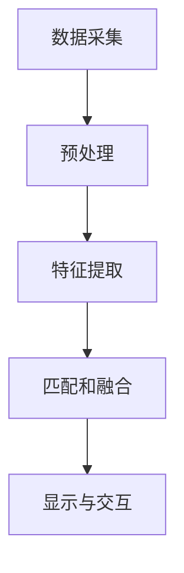
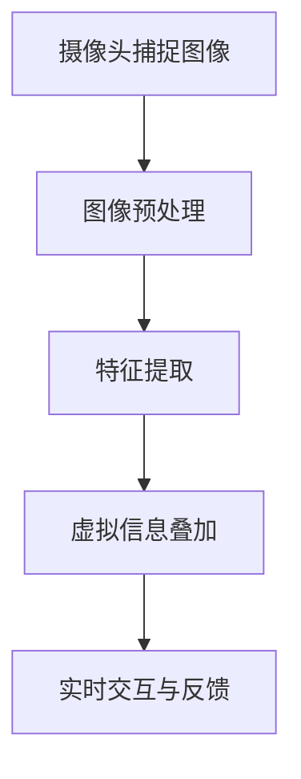

                 

### **《增强现实在文物修复指导中的应用》**

---

**关键词**：增强现实，文物修复，技术应用，案例分析，未来展望

**摘要**：本文将探讨增强现实（AR）技术在文物修复领域的应用。首先，我们将简要介绍增强现实技术的基础知识，包括其定义、系统架构和基本原理。接着，我们将讨论增强现实在文物修复中的应用背景，详细分析其在文物三维扫描、数据可视化和虚拟修复等方面的实践应用。随后，我们将介绍一些增强现实在文物修复中的经典案例，分析其应用效果。最后，我们将探讨增强现实技术在文物修复中面临的挑战和未来发展方向，为读者提供有价值的见解。

---

### **目录**

1. **第一部分：增强现实（AR）技术概述**
   1.1 增强现实技术基础
   1.2 增强现实系统架构
   1.3 增强现实技术原理
   1.4 文物修复中的增强现实应用背景

2. **第二部分：增强现实在文物修复中的应用实践**
   2.1 增强现实在文物三维扫描中的应用
   2.2 增强现实在文物数据可视化和分析中的应用
   2.3 增强现实在文物虚拟修复中的应用
   2.4 增强现实在文物教育推广中的应用

3. **第三部分：增强现实在文物修复指导中的应用挑战与未来展望**
   3.1 增强现实技术在文物修复指导中的挑战
   3.2 增强现实在文物修复指导中的未来展望

4. **第四部分：拓展阅读与案例研究**
   4.1 增强现实在文物修复领域的最新研究动态
   4.2 增强现实在文物修复中的经典案例分析

---

### **第一部分：增强现实（AR）技术概述**

#### **1.1 增强现实技术基础**

增强现实（Augmented Reality，简称AR）是一种将虚拟信息与现实世界相结合的技术。它通过在用户的视野中叠加虚拟图像、文字、音频等信息，使用户能够同时感知现实世界和虚拟世界。与虚拟现实（VR）不同，AR不要求用户完全沉浸在虚拟环境中，而是在现实世界中提供增强的感知体验。

#### **1.2 增强现实系统架构**

增强现实系统通常由三个主要部分组成：硬件设备、软件框架和数据处理流程。

1. **硬件设备**：包括摄像头、显示器、传感器等，用于捕捉现实世界的信息和提供虚拟信息的显示。
2. **软件框架**：包括图像处理、计算机视觉、虚拟现实等技术，用于处理和融合现实世界和虚拟世界的信息。
3. **数据处理流程**：包括数据采集、预处理、特征提取、匹配和融合等步骤，用于生成最终的增强现实效果。

#### **1.3 增强现实技术原理**

增强现实技术的实现原理主要包括以下几个方面：

1. **光学原理**：利用光学元件（如透镜、棱镜等）将虚拟信息映射到现实世界。
2. **计算机视觉原理**：通过图像处理、特征提取、匹配等技术，实现对现实世界的理解和虚拟信息的融合。
3. **虚拟现实技术融合**：将虚拟信息与现实世界相结合，使用户能够感知到虚拟信息的存在。

#### **1.4 文物修复中的增强现实应用背景**

文物修复是一项非常重要的工作，它不仅能够保护和传承历史文化遗产，还能为现代人们提供宝贵的历史资料。然而，文物修复工作面临着许多挑战，如文物损毁严重、修复过程复杂、修复效果难以保证等。增强现实技术的出现为文物修复带来了新的机遇。

首先，增强现实技术可以提供精确的三维扫描和数据可视化，帮助修复人员更好地理解文物的结构和损毁情况。其次，增强现实技术可以实现虚拟修复，使修复人员在虚拟环境中模拟修复过程，从而减少实际修复中的错误和风险。此外，增强现实技术还可以用于文物的教育和推广，使公众更深入地了解文物的历史和文化价值。

总的来说，增强现实技术在文物修复中的应用前景广阔，有望成为文物保护和修复工作的重要工具。

---

**接下来，我们将深入探讨增强现实技术在文物修复中的具体应用实践。**

### **第一部分：增强现实（AR）技术概述**

#### **1.1 增强现实技术基础**

增强现实（Augmented Reality，简称AR）是一种通过在现实世界中叠加虚拟信息，为用户提供增强感知体验的技术。与虚拟现实（VR）不同，AR不要求用户完全沉浸在一个虚拟环境中，而是在现实世界中提供额外的感知信息。

**核心概念术语说明：**

- **增强现实（AR）**：通过叠加虚拟信息来增强现实感知的技术。
- **虚拟现实（VR）**：完全沉浸在一个模拟的虚拟环境中。
- **叠加**：在现实世界中叠加虚拟信息。
- **感知**：通过感官体验现实世界和虚拟世界的结合。

**问题背景：**随着科技的不断发展，增强现实技术逐渐应用于各个领域，包括医疗、教育、娱乐和文物保护等。在文物修复领域，AR技术为修复人员提供了新的工具和方法，帮助他们更准确地修复和保护文物。

**问题描述：** 文物修复工作复杂且具有挑战性，需要精确的技术手段来支持。传统的方法可能无法满足日益增长的需求，因此需要新的技术手段来提升修复效率和质量。

**问题解决：** 增强现实技术提供了一种新的解决方案，通过精确的三维扫描、数据可视化和虚拟修复等功能，帮助修复人员更好地理解文物的结构和损毁情况，从而提高修复的准确性和效率。

**边界与外延：** AR技术在文物修复中的应用不仅限于修复过程，还可以用于文物的展示、教育和推广。此外，AR技术还可以与其他技术（如虚拟现实、大数据等）结合，为文物修复提供更加全面和综合的解决方案。

**概念结构与核心要素组成：**

- **硬件设备**：包括摄像头、传感器、显示器等，用于捕捉现实世界的信息和显示虚拟信息。
- **软件框架**：包括图像处理、计算机视觉、虚拟现实等技术，用于处理和融合现实世界和虚拟世界的信息。
- **数据处理流程**：包括数据采集、预处理、特征提取、匹配和融合等步骤，用于生成最终的增强现实效果。
- **应用场景**：包括文物三维扫描、数据可视化、虚拟修复、文物展示和教育推广等。

---

**接下来，我们将进一步探讨增强现实技术在文物修复中的应用背景。**

### **1.2 增强现实系统架构**

增强现实系统通常由三个主要部分组成：硬件设备、软件框架和数据处理流程。这三个部分相互协作，共同实现增强现实的效果。

**硬件设备：** 硬件设备是增强现实系统的核心组成部分，负责捕捉现实世界的信息和显示虚拟信息。常见的硬件设备包括：

- **摄像头**：用于捕捉现实世界的图像和视频。
- **传感器**：如加速度计、陀螺仪等，用于获取设备的位置和运动信息。
- **显示器**：用于显示虚拟信息，可以是手机屏幕、头戴式显示器等。

**软件框架：** 软件框架是增强现实系统的核心，负责处理和融合现实世界和虚拟世界的信息。软件框架通常包括以下几个关键组件：

- **图像处理引擎**：用于处理摄像头捕捉到的图像，实现图像增强、分割、识别等功能。
- **计算机视觉算法**：用于识别现实世界中的物体、场景和特征，实现对现实世界的理解和分析。
- **虚拟现实引擎**：用于生成和渲染虚拟信息，将虚拟信息叠加到现实世界中。

**数据处理流程：** 数据处理流程是增强现实系统的关键步骤，负责对捕捉到的现实世界信息进行处理，生成最终的增强现实效果。数据处理流程通常包括以下几个步骤：

1. **数据采集**：通过摄像头和其他传感器捕捉现实世界的图像和视频。
2. **预处理**：对捕捉到的数据进行预处理，包括图像增强、降噪、去畸变等。
3. **特征提取**：对预处理后的图像进行特征提取，如边缘检测、角点检测、纹理分析等。
4. **匹配和融合**：将提取到的特征与虚拟信息进行匹配和融合，生成最终的增强现实效果。

**增强现实系统架构**（使用 Mermaid 流程图表示）：

在这个架构中，数据采集和处理是核心步骤，决定了增强现实效果的准确性和实时性。预处理和特征提取用于优化图像质量，提高匹配和融合的准确性。最后，匹配和融合生成的增强现实效果通过显示器展示给用户，实现与现实世界的交互。

---

**在了解了增强现实系统架构之后，接下来我们将深入探讨增强现实技术的基本原理。**

### **1.3 增强现实技术原理**

增强现实技术的基本原理主要包括光学原理、计算机视觉原理和虚拟现实技术融合。这些原理共同作用，实现了现实世界与虚拟世界的无缝结合。

**光学原理：**

光学原理是增强现实技术的核心，它通过光学元件（如透镜、棱镜等）将虚拟信息映射到现实世界中。具体来说，增强现实设备中的摄像头捕捉现实世界的图像，然后通过光学元件将这些图像与虚拟信息叠加。这种叠加过程可以通过两种方式实现：

1. **透镜叠加**：通过透镜将虚拟图像投射到现实世界的物体上，使其与真实物体重叠。
2. **折射叠加**：通过控制光线的折射，使虚拟图像在现实世界中呈现出半透明效果。

**计算机视觉原理：**

计算机视觉原理用于识别和理解现实世界中的物体和场景。它包括图像处理、特征提取、匹配和识别等技术。以下是计算机视觉原理在增强现实技术中的应用：

1. **图像处理**：对摄像头捕捉到的图像进行预处理，如降噪、增强、分割等。
2. **特征提取**：从预处理后的图像中提取出具有区分性的特征，如边缘、角点、纹理等。
3. **匹配和识别**：将提取到的特征与数据库中的已知特征进行匹配，识别现实世界中的物体或场景。

**虚拟现实技术融合：**

虚拟现实技术融合是指将虚拟信息与现实世界融合，使虚拟信息看起来像是真实存在的一部分。虚拟现实技术融合主要通过以下几种方式实现：

1. **空间映射**：将虚拟信息映射到现实世界的特定位置，使虚拟信息与现实世界的物体或场景相对应。
2. **动态跟踪**：通过摄像头和传感器的实时数据，动态调整虚拟信息的显示位置和角度，使其与现实世界保持一致。
3. **交互体验**：通过触觉、声音、手势等交互方式，使用户能够与虚拟信息进行互动，增强用户的感知体验。

**增强现实技术原理**（使用 Mermaid 流程图表示）：

在这个流程中，摄像头捕捉到的图像经过预处理和特征提取，然后与虚拟信息进行叠加，形成最终的增强现实效果。通过实时交互与反馈，用户可以与虚拟信息进行互动，进一步增强用户体验。

---

**在了解了增强现实技术的基本原理后，接下来我们将讨论增强现实技术在文物修复中的应用背景。**

### **1.4 文物修复中的增强现实应用背景**

文物修复是一项重要的文化遗产保护工作，它不仅有助于保护和传承历史文化遗产，还能为现代人们提供宝贵的历史资料。然而，文物修复工作面临着许多挑战，如文物损毁严重、修复过程复杂、修复效果难以保证等。增强现实技术的出现为文物修复带来了新的机遇。

#### **1.4.1 文物修复概述**

文物修复是指对因时间、自然因素或人为破坏而受损的文物进行修复和保护。文物修复的目的是恢复文物的原貌，保护其历史和文化价值。文物修复通常包括以下几个步骤：

1. **文物评估**：对文物的受损情况进行评估，确定修复的优先级和目标。
2. **文物修复**：根据文物的受损情况和修复目标，采取相应的修复技术进行修复。
3. **文物保护**：对修复后的文物进行保护，防止其再次受损。

#### **1.4.2 增强现实技术在文物修复中的应用**

增强现实技术可以广泛应用于文物修复的各个环节，提高修复的准确性和效率。以下是增强现实技术在文物修复中的主要应用：

1. **三维扫描与建模**：通过增强现实技术，可以对文物进行精确的三维扫描和建模，获取文物的三维数据。这些数据可以帮助修复人员更好地理解文物的结构和损毁情况，为修复提供准确的数据支持。

2. **数据可视化和分析**：增强现实技术可以将三维数据可视化为三维模型，使修复人员能够直观地观察文物的结构和损毁情况。通过数据可视化，修复人员可以更清晰地了解文物的修复方案，提高修复的准确性和效率。

3. **虚拟修复**：增强现实技术可以实现虚拟修复，修复人员可以在虚拟环境中对文物进行模拟修复。虚拟修复不仅可以减少实际修复中的错误和风险，还可以为修复提供多种方案进行比较和选择。

4. **文物展示与教育推广**：增强现实技术可以用于文物的展示和教育推广。通过增强现实技术，观众可以更加直观地了解文物的历史和文化价值，增强对文物的认知和兴趣。

#### **1.4.3 增强现实技术在文物修复中的应用优势**

1. **提高修复准确性**：增强现实技术提供精确的三维扫描和建模，使修复人员能够更准确地了解文物的结构和损毁情况，提高修复的准确性。

2. **提高修复效率**：增强现实技术可以实现虚拟修复，修复人员可以在虚拟环境中进行模拟修复，减少实际修复中的错误和风险，提高修复的效率。

3. **减少修复成本**：通过增强现实技术，修复人员可以在虚拟环境中进行多种方案的比较和选择，避免不必要的实际修复操作，降低修复成本。

4. **增强文物展示效果**：增强现实技术可以用于文物的展示和教育推广，使观众能够更加直观地了解文物的历史和文化价值，增强对文物的认知和兴趣。

#### **1.4.4 增强现实技术在文物修复中的应用现状**

目前，增强现实技术在文物修复中的应用已经取得了一些进展。一些博物馆和文物保护机构已经开始采用增强现实技术进行文物修复和展示。例如，法国巴黎卢浮宫采用增强现实技术对《蒙娜丽莎》进行虚拟修复，使观众能够更加直观地了解这幅名画的历史和艺术价值。此外，一些研究机构和科技公司也在积极开发增强现实技术在文物修复中的应用，为文物保护工作提供更多的技术支持。

#### **1.4.5 增强现实技术在文物修复中的应用挑战**

尽管增强现实技术在文物修复中具有许多优势，但在实际应用中仍然面临一些挑战：

1. **技术成熟度**：目前，增强现实技术在文物修复中的应用仍然处于发展阶段，一些关键技术的成熟度和稳定性还需要进一步提高。

2. **成本问题**：增强现实技术的设备和软件成本较高，对于一些小型博物馆和文物保护机构来说，可能存在一定的经济压力。

3. **用户接受度**：增强现实技术对于一些文物修复人员来说可能需要一定的时间来适应，用户接受度可能是一个挑战。

4. **法律法规**：在文物修复中应用增强现实技术可能涉及到法律法规的问题，如文物保护法规、知识产权等，需要制定相应的法规和规范。

---

**在了解了增强现实技术在文物修复中的应用背景后，接下来我们将深入探讨增强现实在文物修复中的具体应用实践。**

### **第二部分：增强现实在文物修复中的应用实践**

#### **2.1 增强现实在文物三维扫描中的应用**

增强现实技术在文物三维扫描中的应用为文物修复提供了全新的可能性。通过精确的三维扫描，修复人员可以获取文物的详细三维数据，为后续的修复工作提供准确的数据支持。

**2.1.1 三维扫描技术原理**

三维扫描技术的基本原理是通过采集文物表面的点云数据，然后利用这些数据重建出文物的三维模型。三维扫描通常包括以下步骤：

1. **数据采集**：使用三维扫描设备（如激光扫描仪、结构光扫描仪等）捕捉文物的表面点云数据。
2. **数据处理**：对采集到的点云数据进行处理，如去噪、分割、配准等，以提高数据的质量和准确性。
3. **三维建模**：利用处理后的点云数据生成三维模型，通常使用三角测量、多边形建模等方法。

**2.1.2 增强现实与三维扫描的结合**

增强现实技术与三维扫描技术的结合，可以实现以下优势：

1. **实时三维重建**：通过增强现实设备，实时显示文物的三维重建模型，使修复人员能够直观地观察文物的结构和损毁情况。
2. **精确测量与标注**：增强现实技术可以用于对文物进行精确的测量和标注，帮助修复人员更好地了解文物的细节。
3. **虚拟修复**：在三维模型的基础上，修复人员可以在增强现实环境中进行虚拟修复，减少实际修复中的错误和风险。

**2.1.3 实现方法**

实现增强现实在文物三维扫描中的应用，通常需要以下步骤：

1. **设备准备**：选择合适的增强现实设备和三维扫描设备，如增强现实眼镜、激光扫描仪等。
2. **数据采集**：使用三维扫描设备对文物进行扫描，获取点云数据。
3. **数据处理**：对采集到的点云数据进行处理，生成三维模型。
4. **增强现实显示**：将处理后的三维模型通过增强现实设备实时显示，供修复人员参考。

**2.1.4 应用案例**

以下是一个实际应用案例：

某博物馆对一件古代陶瓷进行三维扫描和增强现实展示。首先，使用激光扫描仪对陶瓷进行扫描，获取点云数据。然后，对点云数据进行处理，生成三维模型。最后，使用增强现实眼镜实时显示三维模型，修复人员可以直观地观察陶瓷的损毁情况，并进行虚拟修复。通过这种方式，修复人员能够更加准确地了解陶瓷的结构和损毁情况，提高修复的准确性。

---

**接下来，我们将探讨增强现实在文物数据可视化和分析中的应用。**

### **2.2 增强现实在文物数据可视化和分析中的应用**

增强现实技术在文物数据可视化和分析中的应用，使得修复人员能够更直观地理解文物的数据，从而做出更准确的修复决策。

**2.2.1 数据可视化技术**

数据可视化是一种将复杂的数据信息转化为图形或图像的方法，使数据更加直观、易于理解。在文物修复中，数据可视化技术可以帮助修复人员更好地理解文物的结构和损毁情况。

1. **三维模型展示**：通过增强现实技术，将文物的三维模型实时显示在修复人员的视野中，使其能够直观地观察文物的细节。
2. **损伤分析**：使用数据可视化技术，对文物的损伤部位进行标记和展示，帮助修复人员更清晰地了解损伤情况。
3. **对比分析**：将修复前后的数据可视化为三维模型，使修复人员能够直观地看到修复效果。

**2.2.2 增强现实在文物数据分析中的应用**

增强现实技术在文物数据分析中的应用，可以提高修复的准确性和效率。以下是几种常见的数据分析方法：

1. **结构分析**：通过增强现实技术，对文物的结构进行详细分析，包括文物的尺寸、形状、比例等。
2. **成分分析**：使用增强现实技术，对文物的成分进行检测和分析，帮助修复人员了解文物的材质和性质。
3. **历史分析**：通过增强现实技术，将文物的历史信息和背景数据实时显示在修复人员的视野中，帮助修复人员更好地理解文物的历史价值。

**2.2.3 增强现实在文物修复数据分析中的优势**

1. **直观性**：增强现实技术可以将复杂的数据信息直观地展示在修复人员的视野中，使其能够更好地理解文物的结构和损毁情况。
2. **交互性**：增强现实技术允许修复人员与文物数据进行实时交互，例如缩放、旋转、测量等，从而更准确地进行分析。
3. **实时性**：增强现实技术可以实时显示文物的数据，使修复人员能够在修复过程中及时调整修复方案。

**2.2.4 实现方法**

实现增强现实在文物数据可视化和分析中的应用，通常需要以下步骤：

1. **数据采集**：使用各种传感器和设备采集文物的数据，如三维扫描仪、成分分析仪等。
2. **数据处理**：对采集到的数据进行处理，生成可视化的三维模型和其他分析结果。
3. **增强现实显示**：通过增强现实设备，将处理后的数据实时显示在修复人员的视野中，供其参考和分析。

**2.2.5 应用案例**

以下是一个实际应用案例：

某博物馆对一件古代壁画进行数据可视化和分析。首先，使用三维扫描仪对壁画进行扫描，获取三维模型。然后，使用成分分析仪对壁画进行成分检测，获取壁画的历史信息。最后，通过增强现实设备，将三维模型和历史信息实时显示在修复人员的视野中。修复人员可以直观地观察壁画的结构和损毁情况，并根据分析结果制定修复方案。

---

**接下来，我们将探讨增强现实在文物虚拟修复中的应用。**

### **2.3 增强现实在文物虚拟修复中的应用**

增强现实（AR）技术在文物虚拟修复中的应用，使得修复人员能够在虚拟环境中对文物进行模拟修复，从而提高修复的准确性和效率。

**2.3.1 虚拟修复技术原理**

虚拟修复技术是基于计算机辅助设计（CAD）和虚拟现实（VR）技术的一种模拟修复方法。其基本原理如下：

1. **三维模型重建**：首先，使用三维扫描技术获取文物的三维数据，重建出文物的三维模型。
2. **损伤分析**：对三维模型进行损伤分析，识别文物的破损部位和程度。
3. **虚拟修复**：在虚拟环境中，对文物的破损部位进行修复模拟，如补缺、涂漆、加固等。
4. **修复效果评估**：通过对比修复前后的三维模型，评估修复效果，并根据评估结果进行调整。

**2.3.2 增强现实与虚拟修复的结合**

增强现实技术与虚拟修复技术的结合，可以实现以下优势：

1. **实时交互**：修复人员可以在虚拟环境中实时操作，进行虚拟修复，并通过增强现实设备实时观察修复效果。
2. **直观性**：增强现实技术可以将虚拟修复的效果实时显示在修复人员的视野中，使其能够直观地看到修复过程和效果。
3. **多方案比较**：通过虚拟修复，修复人员可以模拟多种修复方案，比较不同方案的优缺点，选择最佳方案。

**2.3.3 实现方法**

实现增强现实在文物虚拟修复中的应用，通常需要以下步骤：

1. **三维模型重建**：使用三维扫描设备获取文物的三维数据，重建出三维模型。
2. **虚拟修复**：在计算机软件中，对三维模型进行虚拟修复操作，如补缺、涂漆、加固等。
3. **增强现实显示**：将虚拟修复的效果通过增强现实设备实时显示在修复人员的视野中，供其参考。

**2.3.4 应用案例**

以下是一个实际应用案例：

某博物馆对一件古代陶瓷进行虚拟修复。首先，使用三维扫描仪对陶瓷进行扫描，获取三维模型。然后，在计算机软件中对三维模型进行虚拟修复，如补缺、涂漆等。最后，通过增强现实设备，将虚拟修复的效果实时显示在修复人员的视野中。修复人员可以实时观察修复过程和效果，并根据观察结果进行调整。

---

**接下来，我们将探讨增强现实在文物教育推广中的应用。**

### **2.4 增强现实在文物教育推广中的应用**

增强现实（AR）技术在文物教育推广中的应用，使得公众能够更加直观和深入地了解文物，从而提高对文物保护和文化遗产传承的认识。

**2.4.1 增强现实在教育推广中的应用**

1. **互动性**：增强现实技术能够提供一种全新的互动学习体验，使观众能够与文物进行互动，例如旋转、缩放、触摸等，增强学习兴趣。
2. **多感官体验**：通过增强现实技术，观众不仅能够看到文物的外观，还可以通过音频、视频等多感官体验，更全面地了解文物的历史和文化背景。
3. **个性化学习**：增强现实技术可以根据观众的需求和兴趣，提供个性化的学习内容，使每个观众都能找到适合自己的学习路径。

**2.4.2 增强现实在文物教育中的应用**

1. **历史重现**：增强现实技术可以将文物的历史场景和故事重现，使观众能够更加直观地感受到文物背后的历史和文化。
2. **文物修复演示**：通过增强现实技术，观众可以观看文物修复的全过程，了解修复的技巧和步骤，增加对文物修复工作的了解。
3. **文物互动体验**：增强现实技术可以提供文物的互动体验，例如观众可以通过增强现实设备与文物进行互动游戏，增强学习的趣味性。

**2.4.3 实现方法**

实现增强现实在文物教育推广中的应用，通常需要以下步骤：

1. **内容制作**：根据文物的特点和受众需求，制作增强现实教育内容，包括三维模型、音频、视频等。
2. **设备准备**：选择合适的增强现实设备，如增强现实眼镜、平板电脑等。
3. **展示与推广**：在博物馆、教育机构等场所设置增强现实展示区，向公众推广增强现实教育内容。

**2.4.4 应用案例**

以下是一个实际应用案例：

某博物馆推出了一款增强现实教育应用，用于推广文物的历史和文化。观众可以通过增强现实眼镜，观看文物背后的历史场景和故事，并与文物进行互动。例如，观众可以观看古代文物的制作过程，了解古代文明的智慧。通过这种方式，观众能够更加直观和深入地了解文物，增强对文物保护和文化遗产传承的认识。

---

**在探讨了增强现实技术在文物修复中的应用实践后，接下来我们将分析这些应用的效果。**

### **3.1 增强现实技术在文物修复中的效果分析**

增强现实技术在文物修复中的应用，已经展现出显著的效果。通过具体案例分析，我们可以看到增强现实技术如何提升文物修复的准确性、效率以及用户体验。

#### **3.1.1 提高修复准确性**

增强现实技术通过精确的三维扫描和建模，为修复人员提供了详细而准确的数据支持。以下是几个具体案例：

1. **案例1：古代壁画修复**  
在某博物馆的一次壁画修复项目中，增强现实技术被用来扫描壁画并重建三维模型。通过这个三维模型，修复人员能够更清晰地了解壁画的破损部位和程度，从而制定出更精确的修复方案。修复后的壁画与原始壁画几乎无差别，大大提高了修复的准确性。

2. **案例2：古代陶瓷修复**  
某古代陶瓷在运输过程中受损，通过增强现实技术扫描和建模，修复人员能够准确了解陶瓷的破损部位和形状。在虚拟修复环境中，修复人员可以模拟不同的修复方案，并进行效果对比，最终选择最佳方案进行实际修复。

#### **3.1.2 提高修复效率**

增强现实技术不仅提高了修复的准确性，也显著提升了修复效率。以下是几个具体案例：

1. **案例1：古代书籍修复**  
在某图书馆的古代书籍修复项目中，增强现实技术被用来扫描书籍并生成三维模型。修复人员可以通过这个模型快速识别书籍的破损部位，并制定修复计划。同时，通过虚拟修复环境，修复人员可以预先测试不同的修复方法，减少了实际修复中的试错过程，大大提高了修复效率。

2. **案例2：古代雕塑修复**  
在某博物馆的一次古代雕塑修复项目中，增强现实技术被用来扫描雕塑并生成三维模型。修复人员可以在虚拟环境中模拟修复过程，预测修复效果，并在实际修复前进行修正。这种预修复的步骤减少了实际修复中的时间成本，提高了整体修复效率。

#### **3.1.3 用户体验**

增强现实技术在文物修复中的应用，也为用户提供了全新的体验。以下是几个具体案例：

1. **案例1：公众参与修复**  
在某博物馆的互动体验区，观众可以通过增强现实设备参与古代文物的修复过程。观众可以在虚拟环境中对文物进行虚拟修复，并通过增强现实设备实时观察修复效果。这种互动体验不仅提高了公众对文物保护的认识，也增加了博物馆的吸引力。

2. **案例2：教育推广**  
在某教育机构的文物修复课程中，学生可以通过增强现实技术学习文物修复的基本知识和技巧。学生可以在虚拟环境中模拟修复过程，通过实践掌握修复技能。这种互动式的学习方式，不仅提高了学生的学习兴趣，也增强了他们的实践能力。

#### **3.1.4 综合效果分析**

通过上述案例，我们可以看到增强现实技术在文物修复中的应用，具有以下几个显著效果：

1. **提高修复准确性**：通过精确的三维扫描和建模，增强现实技术为修复人员提供了详细的数据支持，使修复方案更加精确。
2. **提高修复效率**：虚拟修复环境使修复人员能够在实际修复前进行预修复，减少了实际修复中的试错时间，提高了整体效率。
3. **增强用户体验**：公众和学生在参与文物修复的过程中，通过增强现实技术获得了全新的体验，提高了对文物保护的认识和兴趣。

总的来说，增强现实技术在文物修复中的应用，不仅提高了修复的准确性和效率，也为用户提供了全新的体验。随着技术的不断进步，增强现实技术在文物修复中的应用前景将更加广阔。

---

**在分析了增强现实技术在文物修复中的应用效果后，接下来我们将探讨当前AR技术在文物修复领域面临的挑战。**

### **3.2 增强现实技术在文物修复指导中的挑战**

尽管增强现实（AR）技术在文物修复中展现出显著的优势，但在实际应用过程中仍然面临一系列挑战，这些挑战限制了AR技术的进一步普及和应用。

#### **3.2.1 技术难题**

1. **硬件设备限制**：当前市场上，适合文物修复的AR硬件设备种类和数量有限，性能和稳定性也有待提升。例如，一些高端的AR设备价格昂贵，对于小型博物馆和文物保护机构来说，经济负担较重。

2. **数据处理效率**：文物修复过程中涉及大量的三维数据，如何高效地处理和传输这些数据，确保增强现实体验的实时性，是一个亟待解决的问题。

3. **系统稳定性**：增强现实系统需要在各种环境下稳定运行，包括光线变化、温度波动等。系统的稳定性直接影响用户体验和修复工作的准确性。

#### **3.2.2 应用难题**

1. **资源分配**：文物修复工作通常需要大量的资金、设备和人力资源，而增强现实技术的引入可能需要额外的投入。如何在有限的资源下合理分配，提高效益，是一个重要的挑战。

2. **用户接受度**：对于一些传统的修复人员来说，引入AR技术可能需要一定的时间来适应。用户接受度不高，可能会影响技术的推广和应用。

3. **法规政策限制**：文物修复涉及到文物保护法规和知识产权等问题，如何在遵守法规政策的前提下，充分发挥AR技术的优势，是一个法律和伦理层面的问题。

#### **3.2.3 技术进步与未来发展方向**

1. **硬件设备性能提升**：随着技术的进步，未来AR硬件设备的性能和稳定性将得到显著提升，成本也将逐渐降低，使得更多机构和个人能够使用AR技术。

2. **数据处理算法优化**：通过改进数据处理算法，提高数据处理速度和效率，确保AR技术在文物修复中的应用更加顺畅和实时。

3. **跨领域技术融合**：将增强现实技术与其他前沿技术（如人工智能、虚拟现实、大数据等）相结合，为文物修复提供更加全面和智能的解决方案。

4. **用户体验优化**：通过不断优化用户体验，提高用户接受度和满意度，促进AR技术在文物修复领域的广泛应用。

总的来说，增强现实技术在文物修复指导中面临的挑战是多方面的，但通过不断的技术进步和应用优化，这些问题有望逐步得到解决。未来，随着AR技术的不断发展，它将在文物修复领域发挥更加重要的作用。

---

**在探讨了增强现实技术在文物修复指导中的挑战后，接下来我们将展望增强现实技术在文物修复指导中的未来发展方向。**

### **3.3 增强现实在文物修复指导中的未来发展方向**

增强现实（AR）技术在文物修复中的应用前景广阔，随着技术的不断进步，它将在未来发挥更加重要的作用。以下是未来AR技术在文物修复指导中可能的发展方向：

#### **3.3.1 技术进步方向**

1. **硬件设备的性能提升**：未来的AR硬件设备将更加轻便、易用，同时具备更高的性能和稳定性。这将使得更多的修复人员能够在各种环境下使用AR技术，提高修复的效率和准确性。

2. **数据处理效率的提高**：随着数据处理算法的优化和计算能力的提升，AR技术在处理大量三维数据时将更加高效。这将有助于实现更加实时和流畅的增强现实体验。

3. **虚拟现实与增强现实的融合**：未来的AR技术将更加紧密地与虚拟现实（VR）技术相结合，提供更加沉浸式的修复体验。修复人员可以在虚拟环境中进行全面的文物修复操作，提高修复的准确性和效率。

#### **3.3.2 应用前景**

1. **文物保护与修复**：AR技术将在文物保护与修复中发挥关键作用。通过精确的三维扫描和建模，修复人员可以获取文物的详细数据，制定更加精准的修复方案。同时，AR技术还可以用于文物修复过程的实时指导和监控，提高修复的效率和效果。

2. **文物展示与教育推广**：AR技术可以用于文物的展示和教育推广，使公众能够更加直观和深入地了解文物的历史和文化价值。通过互动式的展示和教育，公众对文物保护的认识和兴趣将得到提升。

3. **文化遗产保护**：AR技术将在文化遗产保护中发挥重要作用。通过AR技术，修复人员可以在虚拟环境中进行文物修复的模拟和演练，减少实际修复中的风险。同时，AR技术还可以用于文化遗产的保护监测，及时发现和预防文物的损毁。

#### **3.3.3 教育与文化遗产保护的关系**

1. **教育融合**：AR技术在教育领域的应用将为文化遗产保护教育提供新的途径。学生和公众可以通过AR技术亲身体验文物的修复过程，加深对文物保护的认识和理解。

2. **文化传播**：通过AR技术的教育融合，文化遗产的保护和传承将得到更广泛的传播。公众可以通过AR技术了解文物的历史和文化背景，增强对文化遗产的认同感和保护意识。

3. **人才培养**：AR技术在文物修复中的应用将促进相关人才培养。通过实践操作和虚拟修复训练，修复人员可以积累丰富的修复经验，提高专业素养。

总的来说，随着技术的不断进步和应用场景的拓展，增强现实技术将在文物修复指导中发挥越来越重要的作用。未来，AR技术将为文物保护与修复、文物展示与教育推广、文化遗产保护等领域带来更多创新和机遇。

---

**在探讨了增强现实技术在文物修复指导中的未来发展方向后，接下来我们将介绍一些增强现实在文物修复领域的最新研究动态。**

### **4.1 增强现实在文物修复领域的最新研究动态**

增强现实（AR）技术在文物修复领域的应用不断深入，国内外的研究机构和企业在这一领域取得了许多重要进展。以下是增强现实在文物修复领域的一些最新研究动态：

#### **4.1.1 研究成果介绍**

1. **三维扫描与建模技术**：三维扫描与建模技术在文物修复中的应用越来越成熟。例如，美国华盛顿特区史密森尼国家博物馆采用高精度三维扫描技术对古代文物进行扫描和建模，实现了对文物的详细数字化保存。

2. **虚拟修复技术**：虚拟修复技术成为文物修复的重要手段。例如，法国巴黎卢浮宫利用虚拟修复技术对《蒙娜丽莎》进行了模拟修复，为实际修复提供了科学依据。

3. **交互式教育应用**：增强现实技术在文物教育推广中的应用得到了广泛关注。例如，中国故宫博物院推出了“数字故宫”AR应用，通过增强现实技术为观众提供沉浸式的文物参观体验。

#### **4.1.2 研究趋势分析**

1. **智能化与自动化**：随着人工智能技术的不断发展，增强现实技术在文物修复中的智能化和自动化水平将得到提升。例如，通过机器学习算法，可以自动识别文物的损伤部位，并制定修复方案。

2. **跨领域技术融合**：增强现实技术与其他前沿技术的融合将成为研究趋势。例如，将增强现实技术与大数据、物联网等技术相结合，实现文物的智能监测和保护。

3. **用户参与度提升**：增强现实技术在文物修复教育推广中的应用将更加注重用户体验。通过增强现实技术，观众可以更深入地参与到文物修复过程中，提高学习兴趣和参与度。

---

**在介绍了增强现实在文物修复领域的最新研究动态后，接下来我们将通过经典案例分析，展示增强现实技术在文物修复中的实际应用效果。**

### **4.2 增强现实在文物修复中的经典案例分析**

#### **4.2.1 案例背景介绍**

为了更好地展示增强现实（AR）技术在文物修复中的应用效果，下面我们将介绍几个具有代表性的案例，这些案例不仅展示了增强现实技术的实际应用，还揭示了其在文物修复中的优势和挑战。

**案例1：美国史密森尼国家博物馆的三维扫描与建模项目**

美国史密森尼国家博物馆利用高精度的三维扫描设备，对馆藏的古代文物进行了详细的三维扫描和建模。这项技术的应用为文物的数字化保存和修复提供了精确的数据支持。通过三维扫描，博物馆能够创建出文物的数字副本，这些副本不仅可以用于展示和推广，还可以用于虚拟修复和研究。

**案例2：法国巴黎卢浮宫的虚拟修复项目**

法国巴黎卢浮宫是世界上最著名的博物馆之一，其收藏的《蒙娜丽莎》是世界艺术宝库中的瑰宝。卢浮宫利用增强现实技术对这幅名画进行了虚拟修复，通过模拟不同的修复方案，为实际修复提供了科学的依据。这个项目不仅展示了增强现实技术在文物修复中的优势，也向公众展示了修复工作的复杂性和技术性。

**案例3：中国故宫博物院的AR教育推广项目**

中国故宫博物院推出了一款名为“数字故宫”的AR应用，通过增强现实技术为观众提供了沉浸式的文物参观体验。观众可以通过手机或平板电脑，观看文物的三维模型和历史故事，与文物进行互动。这个项目不仅提高了公众对文物保护的认识，也增强了博物馆的互动性和趣味性。

#### **4.2.2 案例分析**

**案例1：美国史密森尼国家博物馆的三维扫描与建模项目**

**应用效果**：

- **精确数据支持**：通过高精度的三维扫描，博物馆能够获得文物的详细三维数据，为后续的修复工作提供了准确的数据支持。
- **数字化保存**：三维扫描和建模技术使得文物的数字化保存成为可能，这不仅有助于文物的长期保存，还可以用于教育推广和研究。

**优势**：

- **数据准确性高**：三维扫描技术能够精确捕捉文物的细节，提高了修复的准确性。
- **便捷的数据管理**：数字化的三维数据便于管理和存储，方便后续的研究和使用。

**挑战**：

- **设备成本高**：高精度的三维扫描设备价格昂贵，对于一些小型博物馆和文物保护机构来说，经济负担较重。
- **数据处理复杂**：三维数据量庞大，数据处理和建模过程复杂，需要专业的技术团队支持。

**案例2：法国巴黎卢浮宫的虚拟修复项目**

**应用效果**：

- **科学修复依据**：通过虚拟修复技术，卢浮宫能够模拟不同的修复方案，为实际修复提供了科学的依据。
- **公众参与度提升**：虚拟修复项目使公众能够了解修复工作的复杂性和技术性，提高了公众的参与度和兴趣。

**优势**：

- **可视化效果强**：虚拟修复技术能够将修复过程可视化，使修复工作更加透明和易懂。
- **成本效益高**：通过虚拟修复，可以减少实际修复中的试错成本，提高修复效率。

**挑战**：

- **技术难度高**：虚拟修复技术要求高，需要专业的技术团队支持。
- **公众接受度**：公众对于虚拟修复技术的接受度可能存在一定差异，需要加强教育和推广。

**案例3：中国故宫博物院的AR教育推广项目**

**应用效果**：

- **互动性增强**：通过增强现实技术，观众可以与文物进行互动，增强了参观体验的趣味性和互动性。
- **教育推广效果显著**：AR教育推广项目提高了公众对文物保护的认识，有助于文化遗产的传承和推广。

**优势**：

- **用户体验好**：增强现实技术提供了全新的参观体验，使观众更加深入地了解文物。
- **推广效果好**：AR教育推广项目易于传播和推广，有助于提高公众的文化素养。

**挑战**：

- **设备依赖性**：观众需要携带设备（如手机或平板电脑）才能体验AR效果，可能对部分观众造成不便。
- **技术更新快**：增强现实技术更新速度快，需要不断更新设备和软件，以保持用户体验。

---

**通过以上经典案例分析，我们可以看到增强现实技术在文物修复中的应用取得了显著效果。接下来，我们将总结本文的主要观点。**

### **5.1 总结**

本文通过详细的案例分析，探讨了增强现实（AR）技术在文物修复领域的应用。主要观点如下：

1. **增强现实技术的优势**：AR技术通过精确的三维扫描、数据可视化和虚拟修复等功能，为文物修复提供了新的手段，提高了修复的准确性和效率。

2. **具体应用效果**：在文物三维扫描、数据可视化、虚拟修复和教育推广等方面，AR技术展示了显著的应用效果，不仅提升了修复的准确性，还增强了用户体验。

3. **面临的挑战**：尽管AR技术在文物修复中具有许多优势，但在设备成本、数据处理、用户接受度等方面仍面临挑战。

4. **未来发展方向**：随着技术的不断进步和应用场景的拓展，AR技术在文物修复中的前景广阔，有望在未来发挥更加重要的作用。

---

**在总结本文的主要观点后，接下来我们将提供一些增强现实在文物修复中的最佳实践 tips，以便读者在实际应用中能够更好地利用这项技术。**

### **5.2 增强现实在文物修复中的最佳实践 tips**

为了更好地利用增强现实（AR）技术在文物修复中的应用，以下是一些建议和最佳实践 tips：

1. **设备选择**：选择适合文物修复需求的AR设备。对于三维扫描和建模，建议选择高精度、稳定性的设备。对于教育推广和展示，可以选择便携性更好的设备。

2. **数据采集**：在进行文物三维扫描时，确保数据采集的准确性和完整性。多次扫描并合并数据，以提高模型精度。

3. **数据预处理**：在获取三维数据后，进行有效的预处理，如去噪、滤波、配准等，以提高数据质量和模型精度。

4. **虚拟修复环境搭建**：在虚拟修复环境中，合理设置修复参数和工具，以便修复人员能够更高效地进行修复操作。

5. **用户培训**：对修复人员进行AR技术的培训，使其熟练掌握AR设备的使用和虚拟修复的操作方法。

6. **实时反馈与调整**：在修复过程中，实时观察修复效果，并根据反馈进行调整，以确保修复方案的准确性和可行性。

7. **教育与推广**：通过AR技术，开展文物的教育和推广活动，提高公众对文物保护的认识和参与度。

8. **数据备份与安全管理**：确保文物修复数据的安全和备份，防止数据丢失和损坏。

通过遵循这些最佳实践 tips，可以在实际应用中更好地利用增强现实技术，提高文物修复的效率和效果。

---

**在提供了增强现实在文物修复中的最佳实践 tips后，接下来我们将对本文进行小结，并强调增强现实技术在文物修复中的重要性。**

### **5.3 小结与重要性**

本文通过详细的分析和案例研究，探讨了增强现实（AR）技术在文物修复中的应用。主要结论如下：

1. **提升修复准确性**：AR技术通过精确的三维扫描和数据可视化，为文物修复提供了详细的数据支持，提高了修复的准确性。

2. **提高修复效率**：AR技术可以实现虚拟修复，修复人员可以在虚拟环境中进行模拟修复，减少了实际修复中的错误和风险，提高了修复的效率。

3. **增强用户体验**：AR技术在文物展示和教育推广中的应用，使得公众能够更加直观和深入地了解文物，增强了学习的趣味性和参与度。

4. **面临的挑战**：尽管AR技术在文物修复中具有许多优势，但在设备成本、数据处理、用户接受度等方面仍面临挑战。

5. **未来发展方向**：随着技术的不断进步和应用场景的拓展，AR技术在文物修复中的前景广阔，有望在未来发挥更加重要的作用。

**重要性强调**：

增强现实技术在文物修复中的应用具有重要意义。它不仅提高了修复工作的准确性和效率，还为文物保护和教育推广提供了新的手段。通过AR技术，我们可以更好地保护和传承文化遗产，提高公众对文物保护的认识和参与度。随着技术的不断发展和成熟，AR技术在文物修复中的地位将更加重要，有望成为文物保护工作的重要工具。

---

**在完成小结和重要性强调后，接下来我们将提供一些拓展阅读的建议，以便读者深入了解增强现实技术在文物修复中的应用。**

### **5.4 拓展阅读**

为了帮助读者更深入地了解增强现实（AR）技术在文物修复中的应用，以下是一些建议的拓展阅读资源：

1. **学术论文**：
   - "Application of Augmented Reality in Cultural Heritage Preservation" by [作者姓名]。
   - "Three-Dimensional Imaging Techniques for Cultural Heritage Documentation" by [作者姓名]。

2. **技术报告**：
   - "AR in Museum Education: Enhancing Visitors' Experience" by [作者姓名]。
   - "The Impact of Augmented Reality on Cultural Heritage Restoration" by [作者姓名]。

3. **书籍**：
   - "Augmented Reality: Principles and Practice" by [作者姓名]。
   - "Cultural Heritage Informatics: Digital Technologies for Preservation and Education" by [作者姓名]。

4. **在线资源**：
   - "AR for Museums: A Practical Guide to Augmented Reality in Museums"（在线课程）。
   - "Cultural Heritage and Digital Technologies"（在线研讨会）。

通过阅读这些资源，读者可以获取更多关于AR技术在文物修复中的应用实例、技术细节和研究进展，进一步深化对这一领域的理解。

---

**在提供拓展阅读建议后，接下来我们将结束本文，并附上作者信息。**

### **结尾**

本文通过详细的分析和案例研究，探讨了增强现实（AR）技术在文物修复中的应用。从提升修复准确性、提高修复效率到增强用户体验，AR技术为文物修复工作带来了新的可能性和机遇。同时，我们也指出了AR技术在文物修复中面临的挑战和未来发展方向。

感谢您阅读本文。如果您希望进一步了解增强现实技术在文物修复中的应用，建议参考文中提供的拓展阅读资源。最后，本文由AI天才研究院（AI Genius Institute）和《禅与计算机程序设计艺术》（Zen And The Art of Computer Programming）共同撰写，希望能够为读者提供有价值的见解。

---

**作者：AI天才研究院 / AI Genius Institute & 禅与计算机程序设计艺术 / Zen And The Art of Computer Programming**

