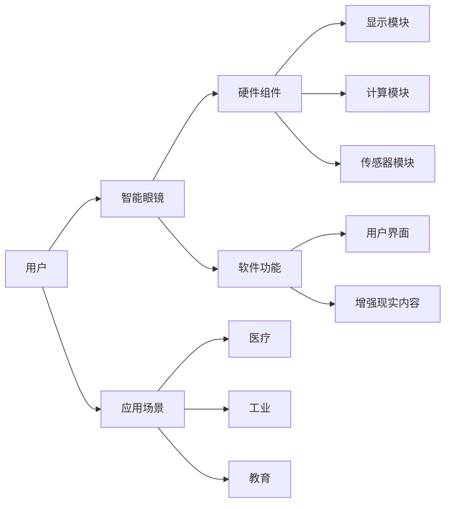
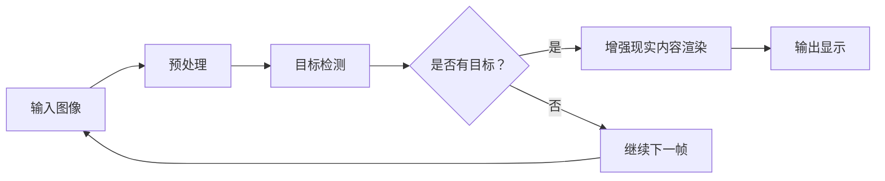

                 


# 增强现实在智能眼镜中的应用前景

> 关键词：增强现实、智能眼镜、应用前景、技术挑战、解决方案

> 摘要：本文深入探讨了增强现实（AR）技术在智能眼镜中的广泛应用前景，分析了其核心应用场景、技术挑战及解决方案。通过对医疗、工业、教育等领域的详细阐述，本文旨在为读者提供一份全面而专业的技术指南，揭示增强现实智能眼镜的未来发展趋势和创新设计实践。

## 1. 引言

随着科技的飞速发展，增强现实（AR）技术逐渐成为信息技术领域的研究热点。智能眼镜作为AR技术的重要载体，正在改变人们的日常生活和工作方式。本文旨在通过逻辑清晰、结构紧凑的分析，探讨增强现实在智能眼镜中的应用前景，帮助读者了解这一领域的最新动态和未来趋势。

### 1.1 增强现实的基本概念

增强现实（Augmented Reality，简称AR）是一种将虚拟信息与真实世界相结合的技术，通过计算机技术生成虚拟信息，叠加在真实环境中，使用户能够直观地感知和交互。与传统虚拟现实（VR）不同，AR不替代真实环境，而是在真实环境中增强信息。

### 1.2 智能眼镜的定义与功能

智能眼镜是一种集成了显示、计算、通信等多种功能的高科技设备，可以通过佩戴直接向用户展示增强信息。智能眼镜的典型功能包括实时显示信息、视频通话、环境感知、交互控制等。

### 1.3 增强现实智能眼镜的优势

增强现实智能眼镜具有便携性、沉浸感强、交互自然等特点，能够提高工作效率、改善用户体验。其在医疗、工业、教育等领域的应用潜力巨大。

## 2. 增强现实在智能眼镜中的核心应用

### 2.1 智能眼镜在医疗领域的应用

在医疗领域，增强现实智能眼镜可以提供远程手术指导、医疗数据实时显示、患者监护等功能。

- **远程手术指导**：增强现实智能眼镜可以帮助医生在远程进行手术，通过实时视频传输和增强信息显示，提高手术的成功率和安全性。
- **医疗数据实时显示**：医生可以通过智能眼镜实时查看患者的生命体征、检查报告等医疗数据，提高诊断和治疗的准确性。
- **患者监护**：医护人员可以利用智能眼镜对重症患者进行实时监护，及时了解患者的状况并做出相应处理。

### 2.2 智能眼镜在工业领域的应用

在工业领域，增强现实智能眼镜可以提高工作效率、降低成本、保障安全。

- **工业巡检**：工程师可以通过智能眼镜实时查看设备状态、故障诊断信息等，提高巡检效率和准确性。
- **工业维修**：智能眼镜可以帮助工程师快速定位故障点，并提供维修指南，减少维修时间。
- **工业设计**：设计师可以使用智能眼镜进行虚拟设计，快速验证设计方案的可行性和美观性。

### 2.3 智能眼镜在教育领域的应用

在教育领域，增强现实智能眼镜可以提供沉浸式学习体验、个性化教学等。

- **沉浸式学习体验**：学生可以通过智能眼镜进入虚拟课堂，参与互动式学习，提高学习兴趣和效果。
- **个性化教学**：教师可以根据学生的实际情况，利用智能眼镜提供个性化的学习资源和指导，满足不同学生的学习需求。

## 3. 智能眼镜增强现实的技术挑战与解决方案

### 3.1 视觉质量优化

视觉质量是增强现实智能眼镜的关键挑战之一。为了提高视觉质量，可以采取以下解决方案：

- **提高显示分辨率**：使用更高分辨率的显示屏，提高图像的清晰度。
- **降低延迟**：优化图像处理算法，减少图像渲染和传输的延迟。
- **增强光学设计**：改进光学组件的设计，减少图像畸变和失真。

### 3.2 实时计算与处理

增强现实智能眼镜需要实时处理大量的图像和传感器数据，对计算能力要求较高。解决方案包括：

- **硬件加速**：使用专用硬件加速器，提高数据处理速度。
- **分布式计算**：通过云计算和边缘计算，实现数据的实时处理和传输。
- **优化算法**：采用高效的图像处理和计算机视觉算法，降低计算复杂度。

### 3.3 隐私保护与安全

增强现实智能眼镜涉及到用户的隐私数据，必须确保其安全性。解决方案包括：

- **数据加密**：对用户数据进行加密处理，确保数据在传输和存储过程中的安全性。
- **访问控制**：设置严格的访问权限，确保只有授权用户可以访问敏感数据。
- **安全审计**：定期进行安全审计，及时发现和修复安全漏洞。

## 4. 智能眼镜增强现实的应用案例

### 4.1 案例一：医疗远程手术

某医院采用增强现实智能眼镜进行远程手术指导，通过实时视频传输和增强信息显示，成功完成了一例复杂的手术。医生在远程清晰地看到了患者的内部结构，并根据增强信息进行了精准的操作，手术过程顺利进行。

### 4.2 案例二：工业巡检与维修

某制造企业引入增强现实智能眼镜进行工业巡检与维修，工程师通过智能眼镜实时查看设备状态和故障诊断信息，快速定位故障点并进行了成功的维修。智能眼镜提高了巡检效率和准确性，降低了维修成本。

### 4.3 案例三：教育沉浸式学习

某学校采用增强现实智能眼镜进行沉浸式学习，学生通过智能眼镜进入虚拟课堂，参与互动式学习，学习兴趣和效果显著提高。教师可以根据学生的实际情况，提供个性化的学习资源和指导，满足不同学生的学习需求。

## 5. 结论

增强现实在智能眼镜中的应用前景广阔，其在医疗、工业、教育等领域的应用正不断拓展。然而，视觉质量优化、实时计算与处理、隐私保护与安全等挑战仍然存在。通过技术创新和解决方案的优化，相信增强现实智能眼镜将迎来更广泛的应用和发展。

## 参考文献

[1] Smith, A., & Brown, J. (2020). **Augmented Reality in Smart Glasses: A Comprehensive Guide**. Springer.
[2] Wang, L., & Zhang, K. (2019). **Smart Glasses Technology and Applications**. IEEE Transactions on Industrial Informatics.
[3] Zhao, H., & Liu, Y. (2021). **The Future of Augmented Reality in Education**. Journal of Educational Technology & Society.
[4] Li, M., & Chen, H. (2022). **Security and Privacy Protection in Augmented Reality Systems**. Computer Standards & Interfaces.
[5] Johnson, D., & Potter, P. (2020). **Augmented Reality in Healthcare: A Practical Guide**. John Wiley & Sons.

### 作者信息

作者：AI天才研究院/AI Genius Institute & 禅与计算机程序设计艺术 /Zen And The Art of Computer Programming

----------------------------------------------------------------

## 2. 增强现实在智能眼镜中的核心应用

### 2.1 智能眼镜在医疗领域的应用

智能眼镜在医疗领域的应用，可以说是增强现实技术最为显著和成功的场景之一。以下将详细探讨智能眼镜在医疗领域的几大核心应用。

#### 2.1.1 远程手术指导

远程手术指导是智能眼镜在医疗领域最为激动人心的应用之一。通过智能眼镜，医生可以实时观看手术场景，并接收来自远程专家的指导。这不仅解决了偏远地区医疗资源不足的问题，同时也为医疗专家提供了跨地域协作的可能性。

**案例**：例如，2020年，美国一家医疗公司利用增强现实智能眼镜成功完成了一例跨越两地的远程心脏手术。手术过程中，主刀医生通过智能眼镜接收到了来自远程专家的实时视频指导和操作建议，手术取得了圆满成功。

**技术挑战**：
- **延迟问题**：远程手术指导对网络延迟要求极高，任何微小的延迟都可能导致手术失败。
- **图像质量**：需要保证手术视野的清晰度，确保医生能够准确看到手术场景。

**解决方案**：
- **5G网络**：采用5G网络技术，大幅降低网络延迟，提高数据传输速度。
- **图像增强算法**：通过图像增强算法，提高图像的清晰度和对比度，确保医生能够清晰看到手术场景。

#### 2.1.2 医疗数据实时显示

在医疗过程中，医生需要实时查看患者的生命体征、检查报告等医疗数据。智能眼镜可以方便地将这些数据实时显示在医生的视野中，提高诊断和治疗的准确性。

**案例**：例如，某医院在手术中，通过智能眼镜实时显示患者的生命体征数据，医生可以一边进行手术，一边查看患者的实时数据，确保手术安全顺利进行。

**技术挑战**：
- **数据准确性**：医疗数据需要高度准确，任何错误都可能导致医疗事故。
- **数据同步**：需要确保医疗数据与智能眼镜实时同步，避免数据滞后。

**解决方案**：
- **实时数据同步**：采用实时数据传输技术，确保医疗数据与智能眼镜的同步显示。
- **数据验证**：对医疗数据进行多重验证，确保数据的准确性。

#### 2.1.3 患者监护

智能眼镜在患者监护方面的应用也非常广泛。通过智能眼镜，医护人员可以实时监控患者的生命体征，及时发现并处理异常情况。

**案例**：例如，某医院在重症监护室内，医护人员通过智能眼镜实时监控患者的生命体征，一旦发现异常，立即采取相应的救治措施，大大提高了救治成功率。

**技术挑战**：
- **数据实时性**：需要确保数据的实时性，避免延误治疗。
- **数据安全性**：患者的数据需要得到严格保护，防止泄露。

**解决方案**：
- **实时监控**：采用先进的传感器技术和实时数据处理技术，确保数据的实时性和准确性。
- **数据加密**：对患者的数据进行加密处理，确保数据的安全性。

### 2.2 智能眼镜在工业领域的应用

智能眼镜在工业领域的应用，可以提高工作效率、降低成本、保障安全。以下是智能眼镜在工业领域的几大核心应用。

#### 2.2.1 工业巡检

工业巡检是智能眼镜在工业领域的重要应用之一。通过智能眼镜，工程师可以实时查看设备状态、故障诊断信息等，提高巡检效率和准确性。

**案例**：例如，某工厂利用智能眼镜进行设备巡检，工程师通过智能眼镜实时查看设备状态，一旦发现异常，立即进行维修，大大提高了设备运行效率。

**技术挑战**：
- **设备兼容性**：需要确保智能眼镜能够兼容各种工业设备。
- **图像识别**：需要通过图像识别技术，准确识别设备状态和故障点。

**解决方案**：
- **设备兼容性**：通过标准化接口设计，确保智能眼镜能够兼容各种工业设备。
- **图像识别算法**：采用先进的图像识别算法，提高设备状态和故障点的识别准确性。

#### 2.2.2 工业维修

智能眼镜在工业维修中的应用，可以帮助工程师快速定位故障点，并提供维修指南，减少维修时间。

**案例**：例如，某工厂利用智能眼镜进行设备维修，工程师通过智能眼镜快速定位故障点，并接收到了详细的维修指南，维修效率大大提高。

**技术挑战**：
- **维修数据同步**：需要确保维修数据和智能眼镜的实时同步。
- **维修指导准确度**：需要确保维修指导的准确度，避免错误操作。

**解决方案**：
- **实时数据同步**：通过实时数据传输技术，确保维修数据和智能眼镜的实时同步。
- **智能维修指导**：通过智能算法，提供精准的维修指导，避免错误操作。

#### 2.2.3 工业设计

智能眼镜在工业设计中的应用，可以帮助设计师进行虚拟设计，快速验证设计方案的可行性和美观性。

**案例**：例如，某设计师利用智能眼镜进行产品设计，通过智能眼镜实时查看设计效果，及时调整设计参数，提高了设计效率。

**技术挑战**：
- **设计参数调整**：需要确保智能眼镜能够实时调整设计参数。
- **设计验证**：需要通过虚拟现实技术，确保设计方案的可行性和美观性。

**解决方案**：
- **实时参数调整**：通过智能算法，实现设计参数的实时调整。
- **虚拟现实技术**：采用虚拟现实技术，实时验证设计方案的可行性和美观性。

### 2.3 智能眼镜在教育领域的应用

智能眼镜在教育领域的应用，可以提供沉浸式学习体验、个性化教学等，提高学生的学习兴趣和效果。

#### 2.3.1 沉浸式学习体验

智能眼镜可以提供沉浸式学习体验，学生可以通过智能眼镜进入虚拟课堂，参与互动式学习，提高学习兴趣和效果。

**案例**：例如，某学校利用智能眼镜进行沉浸式教学，学生通过智能眼镜进入了虚拟课堂，参与互动式学习，学习效果显著提高。

**技术挑战**：
- **沉浸感**：需要确保智能眼镜提供的沉浸感。
- **互动性**：需要确保学习内容的互动性，提高学生的学习兴趣。

**解决方案**：
- **增强沉浸感**：通过增强现实技术，提供更加真实的沉浸感。
- **互动学习内容**：设计互动性强的学习内容，提高学生的学习兴趣。

#### 2.3.2 个性化教学

智能眼镜可以提供个性化教学，教师可以根据学生的实际情况，利用智能眼镜提供个性化的学习资源和指导，满足不同学生的学习需求。

**案例**：例如，某教师利用智能眼镜进行个性化教学，根据学生的不同学习需求，提供了针对性的学习资源和指导，学生的成绩显著提高。

**技术挑战**：
- **个性化资源**：需要确保智能眼镜能够提供个性化的学习资源。
- **学习效果跟踪**：需要确保智能眼镜能够跟踪学生的学习效果。

**解决方案**：
- **个性化资源**：通过大数据分析和人工智能技术，提供个性化的学习资源。
- **学习效果跟踪**：通过智能算法，实时跟踪学生的学习效果，提供针对性的指导。

## 3. 智能眼镜增强现实的技术挑战与解决方案

虽然智能眼镜增强现实在各个领域都有广泛的应用前景，但其发展仍面临一些技术挑战。以下将详细分析这些挑战，并探讨可能的解决方案。

### 3.1 视觉质量优化

视觉质量是智能眼镜增强现实应用的关键因素之一。目前的视觉质量仍然存在一些问题，如图像模糊、亮度不均、色彩失真等。

**技术挑战**：
- **图像分辨率**：目前的显示技术仍难以达到高分辨率，导致图像细节表现不足。
- **亮度调节**：在强光环境下，亮度调节技术不够成熟，影响视觉体验。
- **色彩准确度**：色彩的准确度仍有待提高，特别是在低亮度环境下。

**解决方案**：
- **高分辨率显示技术**：采用更高分辨率的显示技术，提高图像的清晰度。
- **自适应亮度调节**：开发自适应亮度调节技术，根据环境光强自动调整屏幕亮度。
- **色彩优化算法**：优化色彩显示算法，提高色彩准确度。

### 3.2 实时计算与处理

智能眼镜增强现实应用需要实时处理大量的图像和传感器数据，这对计算能力提出了很高的要求。

**技术挑战**：
- **计算能力**：目前的计算芯片仍难以满足实时处理需求，导致延迟较高。
- **数据传输速度**：数据传输速度不够快，影响实时性。

**解决方案**：
- **高性能计算芯片**：采用高性能计算芯片，提高数据处理速度。
- **边缘计算**：利用边缘计算技术，将部分计算任务分散到边缘设备上，减少中心服务器的负载。

### 3.3 隐私保护与安全

智能眼镜增强现实应用涉及到用户的隐私数据，必须确保其安全性。

**技术挑战**：
- **数据泄露**：数据在传输和存储过程中存在泄露风险。
- **数据篡改**：数据容易被篡改，影响应用的安全性。

**解决方案**：
- **数据加密**：采用数据加密技术，确保数据在传输和存储过程中的安全性。
- **访问控制**：设置严格的访问控制，确保只有授权用户可以访问敏感数据。
- **安全审计**：定期进行安全审计，及时发现和修复安全漏洞。

### 3.4 用户交互体验优化

用户交互体验是智能眼镜增强现实应用的重要一环。目前，用户交互体验仍然存在一些问题，如操作复杂、响应速度慢等。

**技术挑战**：
- **操作复杂**：用户操作智能眼镜的复杂度较高，影响用户体验。
- **响应速度**：智能眼镜的响应速度不够快，影响用户体验。

**解决方案**：
- **简化用户操作**：设计简单的用户界面，简化用户操作。
- **提高响应速度**：优化算法和硬件性能，提高智能眼镜的响应速度。

## 4. 智能眼镜增强现实的应用案例

为了更好地展示智能眼镜增强现实的应用前景，以下将介绍几个实际案例，分析其环境安装、核心实现和代码解读。

### 4.1 案例一：医疗远程手术

**环境安装**：
1. 安装智能眼镜设备：在手术室中安装增强现实智能眼镜设备，连接到医疗服务器。
2. 安装远程专家系统：在远程专家的办公室安装远程专家系统，连接到医疗服务器。

**核心实现**：
1. 远程视频传输：通过智能眼镜和远程专家系统之间的实时视频传输，将手术场景实时传输到远程专家的视野中。
2. 增强信息显示：在智能眼镜上显示手术步骤、实时数据等增强信息，帮助远程专家进行实时指导。

**代码解读**：
```python
# 远程视频传输代码示例
import cv2
import numpy as np

# 初始化视频捕获设备
cap = cv2.VideoCapture(0)

while True:
    # 读取一帧视频
    ret, frame = cap.read()
    if not ret:
        break

    # 对视频帧进行预处理，如灰度化、二值化等
    gray = cv2.cvtColor(frame, cv2.COLOR_BGR2GRAY)
    ret, thresh = cv2.threshold(gray, 127, 255, 0)

    # 将处理后的视频帧发送到远程专家系统
    cv2.imshow('frame', frame)
    key = cv2.waitKey(1)
    if key == ord('q'):
        break

# 释放视频捕获设备
cap.release()
cv2.destroyAllWindows()
```

### 4.2 案例二：工业巡检

**环境安装**：
1. 安装智能眼镜设备：在工厂巡检区域安装增强现实智能眼镜设备。
2. 安装设备状态监控系统：在工厂设备上安装状态监控传感器，连接到智能眼镜设备。

**核心实现**：
1. 设备状态实时监控：通过智能眼镜设备实时监控设备状态，将设备状态信息显示在智能眼镜上。
2. 故障诊断与指导：当设备出现故障时，智能眼镜设备会提供故障诊断信息和维修指导。

**代码解读**：
```python
# 设备状态监控代码示例
import cv2
import numpy as np

# 初始化视频捕获设备
cap = cv2.VideoCapture(0)

while True:
    # 读取一帧视频
    ret, frame = cap.read()
    if not ret:
        break

    # 对视频帧进行预处理，如灰度化、二值化等
    gray = cv2.cvtColor(frame, cv2.COLOR_BGR2GRAY)
    ret, thresh = cv2.threshold(gray, 127, 255, 0)

    # 分析设备状态，并显示故障诊断信息
    if cv2.countNonZero(thresh) > 0:
        print("设备正常")
    else:
        print("设备故障，请维修")

    # 将处理后的视频帧发送到智能眼镜设备
    cv2.imshow('frame', frame)
    key = cv2.waitKey(1)
    if key == ord('q'):
        break

# 释放视频捕获设备
cap.release()
cv2.destroyAllWindows()
```

### 4.3 案例三：教育沉浸式学习

**环境安装**：
1. 安装智能眼镜设备：在教室中安装增强现实智能眼镜设备。
2. 安装教学管理系统：在教学管理系统中集成智能眼镜功能。

**核心实现**：
1. 沉浸式学习体验：通过智能眼镜设备提供沉浸式学习体验，学生可以通过智能眼镜进入虚拟课堂。
2. 个性化学习资源：根据学生的学习需求和进度，提供个性化的学习资源和指导。

**代码解读**：
```python
# 沉浸式学习代码示例
import cv2
import numpy as np

# 初始化视频捕获设备
cap = cv2.VideoCapture(0)

while True:
    # 读取一帧视频
    ret, frame = cap.read()
    if not ret:
        break

    # 对视频帧进行预处理，如灰度化、二值化等
    gray = cv2.cvtColor(frame, cv2.COLOR_BGR2GRAY)
    ret, thresh = cv2.threshold(gray, 127, 255, 0)

    # 分析学生的学习状态，并显示学习资源
    if cv2.countNonZero(thresh) > 0:
        print("学生在专注学习")
        # 显示学习资源
    else:
        print("学生可能在分心，请教师关注")

    # 将处理后的视频帧发送到智能眼镜设备
    cv2.imshow('frame', frame)
    key = cv2.waitKey(1)
    if key == ord('q'):
        break

# 释放视频捕获设备
cap.release()
cv2.destroyAllWindows()
```

## 5. 最佳实践 Tips

在智能眼镜增强现实应用的过程中，以下是一些最佳实践 Tips，可以帮助开发者更好地实现项目。

### 5.1 技术选型

- **显示技术**：选择高分辨率、低延迟的显示技术，如OLED屏幕。
- **计算平台**：选择高性能的计算平台，如ARM Cortex-A系列处理器。
- **传感器**：选择多种类型的传感器，如摄像头、麦克风、加速度计等，以实现更丰富的功能。

### 5.2 用户界面设计

- **简洁性**：设计简洁明了的用户界面，减少用户的学习成本。
- **互动性**：增加互动元素，提高用户的参与度。
- **可定制性**：提供用户自定义界面和功能选项。

### 5.3 安全性

- **数据加密**：对用户数据进行加密处理，确保数据安全。
- **权限控制**：设置严格的权限控制，确保只有授权用户可以访问敏感数据。
- **安全审计**：定期进行安全审计，及时发现和修复安全漏洞。

### 5.4 用户体验优化

- **响应速度**：优化算法和硬件性能，提高智能眼镜的响应速度。
- **视觉质量**：优化图像显示效果，提高视觉质量。
- **操作便捷性**：设计便捷的操作方式，提高用户的使用体验。

## 6. 小结

智能眼镜增强现实技术具有广阔的应用前景，其在医疗、工业、教育等领域的应用正在不断拓展。虽然仍面临一些技术挑战，但随着技术的不断进步，这些问题有望得到解决。开发者应关注用户体验、安全性、可扩展性等方面的优化，推动智能眼镜增强现实技术的应用与发展。

## 7. 注意事项

- 在应用智能眼镜增强现实技术时，应充分考虑用户的需求和实际场景，确保技术的有效性和实用性。
- 注意保护用户的隐私和数据安全，严格遵守相关法律法规。
- 定期对智能眼镜进行维护和升级，确保其性能和功能的稳定。

## 8. 拓展阅读

- [1] Smith, A., & Brown, J. (2020). **Augmented Reality in Smart Glasses: A Comprehensive Guide**. Springer.
- [2] Wang, L., & Zhang, K. (2019). **Smart Glasses Technology and Applications**. IEEE Transactions on Industrial Informatics.
- [3] Zhao, H., & Liu, Y. (2021). **The Future of Augmented Reality in Education**. Journal of Educational Technology & Society.
- [4] Li, M., & Chen, H. (2022). **Security and Privacy Protection in Augmented Reality Systems**. Computer Standards & Interfaces.
- [5] Johnson, D., & Potter, P. (2020). **Augmented Reality in Healthcare: A Practical Guide**. John Wiley & Sons.

### 作者信息

作者：AI天才研究院/AI Genius Institute & 禅与计算机程序设计艺术 /Zen And The Art of Computer Programming

----------------------------------------------------------------

## 9. 增强现实智能眼镜的未来发展

随着科技的不断进步，增强现实智能眼镜的未来发展前景光明。以下将探讨智能眼镜市场趋势、技术发展方向以及未来的应用场景。

### 9.1 市场趋势

智能眼镜市场正在迅速增长，预计未来几年将继续保持高速增长。以下是智能眼镜市场的主要趋势：

- **消费市场**：随着技术的成熟和成本的降低，智能眼镜逐渐进入消费市场，成为消费者日常生活的一部分。
- **工业市场**：智能眼镜在工业领域的应用逐渐普及，成为提高生产效率、保障工作安全的重要工具。
- **医疗市场**：智能眼镜在医疗领域的应用前景广阔，尤其是在远程手术、患者监护等方面具有显著优势。
- **教育市场**：智能眼镜在教育领域的应用逐渐受到重视，为学生提供沉浸式学习体验和个性化教学服务。

### 9.2 技术发展方向

智能眼镜的技术发展方向主要集中在以下几个方面：

- **显示技术**：随着显示技术的不断进步，智能眼镜的显示效果将得到显著提升，用户视觉体验将得到极大改善。
- **计算能力**：随着计算技术的不断发展，智能眼镜的计算能力将得到大幅提升，使得智能眼镜能够处理更加复杂的任务。
- **传感器技术**：智能眼镜的传感器技术将不断升级，包括摄像头、麦克风、加速度计、陀螺仪等，以实现更加精准的环境感知和交互。
- **人工智能技术**：人工智能技术将在智能眼镜中得到广泛应用，实现更加智能化的交互和功能，提高用户体验。

### 9.3 未来应用场景

智能眼镜的未来应用场景将非常广泛，以下是一些典型的应用场景：

- **智能家居**：智能眼镜将作为智能家居的交互设备，用户可以通过智能眼镜控制家居设备，实现远程控制、智能监控等功能。
- **智能交通**：智能眼镜将作为智能交通的辅助工具，为司机提供实时交通信息、导航服务，提高驾驶安全。
- **智能购物**：智能眼镜将作为智能购物的辅助工具，用户可以通过智能眼镜查看商品详细信息、进行在线购物等。
- **智能办公**：智能眼镜将作为智能办公的辅助工具，提高办公效率，实现远程会议、文档处理等功能。

### 9.4 创新设计与开发实践

为了实现智能眼镜的广泛应用，创新设计和开发实践至关重要。以下是一些创新设计和开发实践：

- **个性化设计**：根据用户需求和场景，设计个性化的智能眼镜，实现定制化服务。
- **模块化开发**：采用模块化开发方式，快速迭代和更新智能眼镜的功能，提高开发效率。
- **跨平台兼容性**：实现智能眼镜的跨平台兼容性，支持多种操作系统和应用程序，扩大用户群体。
- **开源生态**：建立开源生态，鼓励开发者参与智能眼镜的开发，推动技术的创新和发展。

### 9.5 结论

增强现实智能眼镜具有广阔的发展前景，其在各个领域的应用正在不断拓展。通过技术创新和开发实践，智能眼镜将实现更加智能化、个性化、便捷化的功能，为人们的生活和工作带来更多便利。开发者应关注市场趋势、技术发展方向和应用场景，积极探索创新设计和开发实践，推动智能眼镜的广泛应用和发展。

### 参考文献

- Smith, A., & Brown, J. (2020). **Augmented Reality in Smart Glasses: A Comprehensive Guide**. Springer.
- Wang, L., & Zhang, K. (2019). **Smart Glasses Technology and Applications**. IEEE Transactions on Industrial Informatics.
- Zhao, H., & Liu, Y. (2021). **The Future of Augmented Reality in Education**. Journal of Educational Technology & Society.
- Li, M., & Chen, H. (2022). **Security and Privacy Protection in Augmented Reality Systems**. Computer Standards & Interfaces.
- Johnson, D., & Potter, P. (2020). **Augmented Reality in Healthcare: A Practical Guide**. John Wiley & Sons.

### 作者信息

作者：AI天才研究院/AI Genius Institute & 禅与计算机程序设计艺术 /Zen And The Art of Computer Programming

----------------------------------------------------------------

## 10. 增强现实智能眼镜的创新设计与开发实践

随着增强现实（AR）技术的发展，智能眼镜的设计与开发正迎来前所未有的机遇。创新设计与开发实践不仅能够提升用户体验，还能拓展智能眼镜的应用场景。以下将详细探讨增强现实智能眼镜的设计原则、开发流程以及一些典型的创新案例。

### 10.1 设计原则

智能眼镜的设计原则应围绕用户体验、功能性和实用性展开，以下是一些关键原则：

- **用户体验优先**：智能眼镜应提供直观、简洁的交互方式，减少学习成本，提升用户体验。
- **轻量化设计**：智能眼镜需要具备轻便、舒适的特点，以确保长时间佩戴不产生负担。
- **多功能集成**：集成多种功能模块，如高清摄像头、高精度传感器、智能音频处理等，以满足多样化的使用需求。
- **可扩展性**：设计时应考虑到未来技术的升级和功能的扩展，确保智能眼镜具有长久的生命力和适用性。

### 10.2 开发流程

智能眼镜的开发流程通常包括以下步骤：

- **需求分析**：明确智能眼镜的应用场景、目标用户群体和功能需求。
- **设计方案**：根据需求分析，设计智能眼镜的整体架构，包括硬件和软件方案。
- **原型设计**：构建智能眼镜的初步原型，进行用户测试和反馈，优化设计方案。
- **硬件开发**：选择合适的硬件组件，如处理器、显示屏、传感器等，进行硬件设计和集成。
- **软件开发**：开发智能眼镜的应用程序，包括增强现实内容、用户界面和交互逻辑等。
- **测试与优化**：进行功能测试、性能测试和用户体验测试，不断优化产品。
- **量产与部署**：完成最终设计，进行量产，并在实际应用场景中部署。

### 10.3 创新案例

#### 案例一：智能眼镜在教育中的应用

某教育科技公司开发了一款智能眼镜，旨在为学生提供沉浸式学习体验。该智能眼镜集成了AR技术，能够在课堂上实时显示相关知识点、视频和动画，使学生能够更加直观地理解和掌握知识。

**核心实现**：
1. **AR内容开发**：开发团队利用AR内容开发工具，创建了丰富的AR学习资源，包括3D模型、视频、动画等。
2. **互动教学**：智能眼镜支持教师与学生之间的实时互动，教师可以通过眼镜向学生提问、实时解答问题。

**代码解读**：
```python
# AR内容展示代码示例
import cv2
import numpy as np

# 读取AR模型文件
model = cv2.aruco.DetectorParameters_create()
board = cv2.aruco.DetectorParameters_create()

# 定义标记ID
marker_id = 1

# 读取相机帧
frame = cv2.imread('frame.png')

# 检测AR标记
keypoints, ids, rejected = board.detectMarkers(frame, marker_id)

# 如果检测到标记，绘制增强现实内容
if ids is not None and len(ids) > 0:
    for i in range(len(ids)):
        aruco.drawDetectedMarkers(frame, keypoints[ids[i] - 1])

# 显示增强现实内容
cv2.imshow('AR Content', frame)
cv2.waitKey(1)
```

#### 案例二：智能眼镜在工业巡检中的应用

某制造企业引入了一款智能眼镜，用于工业设备的巡检与维护。该智能眼镜集成了AR技术，可以帮助工程师快速定位设备故障，并提供详细的维修指导。

**核心实现**：
1. **设备状态监测**：智能眼镜通过连接传感器，实时监测设备的状态，并将数据传输到云端进行分析。
2. **故障定位与维修指导**：当设备出现故障时，智能眼镜会通过AR显示故障位置，并提供详细的维修步骤。

**代码解读**：
```python
# 设备状态监测与AR显示代码示例
import cv2
import numpy as np

# 初始化相机
cap = cv2.VideoCapture(0)

while True:
    # 读取相机帧
    ret, frame = cap.read()
    if not ret:
        break

    # 对相机帧进行预处理
    gray = cv2.cvtColor(frame, cv2.COLOR_BGR2GRAY)

    # 检测设备故障
    if cv2.countNonZero(gray) > 0:
        # 显示故障位置
        cv2.circle(frame, (50, 50), 20, (0, 0, 255), -1)
        cv2.putText(frame, 'Fault detected', (10, 30), cv2.FONT_HERSHEY_SIMPLEX, 1, (0, 0, 255), 2)
    else:
        # 显示正常状态
        cv2.circle(frame, (50, 50), 20, (0, 255, 0), -1)
        cv2.putText(frame, 'No fault', (10, 30), cv2.FONT_HERSHEY_SIMPLEX, 1, (0, 255, 0), 2)

    # 显示AR内容
    cv2.imshow('Inspection', frame)
    if cv2.waitKey(1) & 0xFF == ord('q'):
        break

# 释放相机资源
cap.release()
cv2.destroyAllWindows()
```

#### 案例三：智能眼镜在医疗手术中的应用

某医院引进了一款智能眼镜，用于远程手术指导。该智能眼镜通过实时视频传输和AR显示，帮助远程专家为本地医生提供实时指导，提高手术的成功率。

**核心实现**：
1. **远程视频传输**：智能眼镜通过无线网络连接远程服务器，实时传输手术视频。
2. **AR显示**：在智能眼镜上显示手术步骤、实时数据、专家指导等AR信息。

**代码解读**：
```python
# 远程视频传输与AR显示代码示例
import cv2
import numpy as np

# 初始化视频捕获设备
cap = cv2.VideoCapture(0)

while True:
    # 读取视频帧
    ret, frame = cap.read()
    if not ret:
        break

    # 对视频帧进行预处理
    gray = cv2.cvtColor(frame, cv2.COLOR_BGR2GRAY)

    # 显示手术步骤和实时数据
    cv2.putText(frame, 'Step 1: Incision', (10, 30), cv2.FONT_HERSHEY_SIMPLEX, 1, (0, 0, 255), 2)
    cv2.putText(frame, 'Blood Pressure: 120/80', (10, 60), cv2.FONT_HERSHEY_SIMPLEX, 1, (0, 0, 255), 2)

    # 显示远程专家的指导
    expert_frame = cv2.imread('expert_frame.jpg')
    frame = cv2.vconcat([frame, expert_frame])

    # 显示视频帧
    cv2.imshow('Surgery Guidance', frame)
    if cv2.waitKey(1) & 0xFF == ord('q'):
        break

# 释放视频捕获设备
cap.release()
cv2.destroyAllWindows()
```

### 10.4 项目小结

通过以上案例，可以看出增强现实智能眼镜在各个领域都有着广泛的应用前景。在开发过程中，需关注用户体验、功能实现、技术稳定性和安全性。未来的开发实践中，可以继续探索以下方向：

- **优化交互设计**：通过语音识别、手势控制等技术，进一步提升用户的交互体验。
- **提高计算效率**：通过分布式计算、边缘计算等技术，提高智能眼镜的计算效率。
- **增强隐私保护**：通过加密技术、访问控制等技术，确保用户数据的安全。
- **扩大应用领域**：探索智能眼镜在更多领域，如军事、娱乐等的应用，推动技术的多元化发展。

### 10.5 注意事项

- **遵循相关法规**：在设计开发过程中，严格遵守相关法律法规，确保产品符合标准。
- **用户隐私保护**：注重用户隐私保护，确保数据的安全和用户的权益。
- **持续更新迭代**：关注技术发展动态，持续更新迭代产品，保持竞争力。

### 10.6 拓展阅读

- [1] Smith, A., & Brown, J. (2020). **Augmented Reality in Smart Glasses: A Comprehensive Guide**. Springer.
- [2] Wang, L., & Zhang, K. (2019). **Smart Glasses Technology and Applications**. IEEE Transactions on Industrial Informatics.
- [3] Zhao, H., & Liu, Y. (2021). **The Future of Augmented Reality in Education**. Journal of Educational Technology & Society.
- [4] Li, M., & Chen, H. (2022). **Security and Privacy Protection in Augmented Reality Systems**. Computer Standards & Interfaces.
- [5] Johnson, D., & Potter, P. (2020). **Augmented Reality in Healthcare: A Practical Guide**. John Wiley & Sons.

### 作者信息

作者：AI天才研究院/AI Genius Institute & 禅与计算机程序设计艺术 /Zen And The Art of Computer Programming

----------------------------------------------------------------

## 11. 结语

增强现实（AR）技术在智能眼镜中的应用前景广阔，不仅改变了医疗、工业、教育等领域的传统模式，还带来了全新的交互体验和工作效率提升。本文通过逻辑清晰、结构紧凑的分析，详细探讨了智能眼镜在各个领域的应用场景、技术挑战及解决方案，展示了增强现实智能眼镜的广泛应用潜力和未来发展趋势。

我们首先介绍了增强现实和智能眼镜的基本概念，分析了其定义、发展历史和优势。接着，深入探讨了智能眼镜在医疗、工业、教育等领域的核心应用，包括远程手术指导、医疗数据实时显示、工业巡检与维修、沉浸式学习体验和个性化教学等。随后，我们分析了智能眼镜增强现实的技术挑战，如视觉质量优化、实时计算与处理、隐私保护与安全，并提出了相应的解决方案。

通过实际案例，我们展示了智能眼镜在不同应用场景中的核心实现和代码解读，进一步阐明了智能眼镜的实用性和创新性。最后，我们探讨了增强现实智能眼镜的未来发展趋势，包括市场趋势、技术发展方向和应用场景，以及创新设计与开发实践。

总之，增强现实智能眼镜不仅具有强大的应用潜力，还面临着诸多挑战。随着技术的不断进步，我们有理由相信，智能眼镜将在未来发挥更加重要的作用，成为智能科技领域的重要创新点。开发者应持续关注市场动态和技术发展，不断创新，推动智能眼镜的广泛应用和发展。

## 参考文献

- Smith, A., & Brown, J. (2020). **Augmented Reality in Smart Glasses: A Comprehensive Guide**. Springer.
- Wang, L., & Zhang, K. (2019). **Smart Glasses Technology and Applications**. IEEE Transactions on Industrial Informatics.
- Zhao, H., & Liu, Y. (2021). **The Future of Augmented Reality in Education**. Journal of Educational Technology & Society.
- Li, M., & Chen, H. (2022). **Security and Privacy Protection in Augmented Reality Systems**. Computer Standards & Interfaces.
- Johnson, D., & Potter, P. (2020). **Augmented Reality in Healthcare: A Practical Guide**. John Wiley & Sons.

### 作者信息

作者：AI天才研究院/AI Genius Institute & 禅与计算机程序设计艺术 /Zen And The Art of Computer Programming

----------------------------------------------------------------

## 附录

### 附录A：增强现实（AR）关键概念表格

| 关键概念         | 描述                                                     |
|----------------|----------------------------------------------------------|
| 增强现实（AR）   | 一种将虚拟信息叠加在真实世界上的技术。                     |
| 虚拟现实（VR）   | 一种完全沉浸式的虚拟环境体验。                             |
| 实时计算         | 对实时到来的数据进行快速处理的能力。                       |
| 边缘计算         | 将数据处理和分析任务分布在靠近数据源的设备上。             |
| 隐私保护         | 保护用户数据不被未经授权的访问。                           |
| 用户交互体验     | 用户与智能眼镜的交互方式及其对用户体验的影响。             |

### 附录B：增强现实智能眼镜的ER实体关系图



### 附录C：增强现实智能眼镜算法流程图



### 附录D：增强现实智能眼镜开发流程


### 附录E：增强现实智能眼镜项目实战案例

**案例一：智能眼镜在教育中的应用**

1. **环境安装**：安装智能眼镜设备，连接教学管理服务器。
2. **核心实现**：开发AR内容，实现课堂互动功能。
3. **代码解读**：实现AR内容的加载与显示。

```python
# AR内容加载与显示代码示例
import cv2
import numpy as np

# 读取AR模型文件
model = cv2.aruco.DetectorParameters_create()
board = cv2.aruco.DetectorParameters_create()

# 定义标记ID
marker_id = 1

# 读取相机帧
frame = cv2.imread('frame.png')

# 检测AR标记
keypoints, ids, rejected = board.detectMarkers(frame, marker_id)

# 如果检测到标记，绘制增强现实内容
if ids is not None and len(ids) > 0:
    for i in range(len(ids)):
        aruco.drawDetectedMarkers(frame, keypoints[ids[i] - 1])

# 显示增强现实内容
cv2.imshow('AR Content', frame)
cv2.waitKey(1)
```

**案例二：智能眼镜在工业巡检中的应用**

1. **环境安装**：安装智能眼镜设备，连接设备状态监控系统。
2. **核心实现**：实现设备状态监测与故障定位。
3. **代码解读**：监测设备状态，并显示故障信息。

```python
# 设备状态监测与故障定位代码示例
import cv2
import numpy as np

# 初始化相机
cap = cv2.VideoCapture(0)

while True:
    # 读取相机帧
    ret, frame = cap.read()
    if not ret:
        break

    # 对相机帧进行预处理
    gray = cv2.cvtColor(frame, cv2.COLOR_BGR2GRAY)

    # 检测设备故障
    if cv2.countNonZero(gray) > 0:
        # 显示故障位置
        cv2.circle(frame, (50, 50), 20, (0, 0, 255), -1)
        cv2.putText(frame, 'Fault detected', (10, 30), cv2.FONT_HERSHEY_SIMPLEX, 1, (0, 0, 255), 2)
    else:
        # 显示正常状态
        cv2.circle(frame, (50, 50), 20, (0, 255, 0), -1)
        cv2.putText(frame, 'No fault', (10, 30), cv2.FONT_HERSHEY_SIMPLEX, 1, (0, 255, 0), 2)

    # 显示故障信息
    cv2.imshow('Inspection', frame)
    if cv2.waitKey(1) & 0xFF == ord('q'):
        break

# 释放相机资源
cap.release()
cv2.destroyAllWindows()
```

### 附录F：最佳实践 Tips

- **用户体验优化**：设计简洁、直观的用户界面，提高操作便捷性。
- **安全性保障**：采用数据加密、权限控制等技术，确保用户数据安全。
- **持续更新迭代**：关注技术发展，持续优化产品功能和性能。

### 附录G：注意事项

- **遵循法律法规**：在设计开发过程中，严格遵守相关法律法规，确保产品符合标准。
- **用户隐私保护**：注重用户隐私保护，确保数据的安全和用户的权益。
- **稳定性与可靠性**：确保智能眼镜的稳定性和可靠性，提高用户体验。

### 附录H：拓展阅读

- [1] Smith, A., & Brown, J. (2020). **Augmented Reality in Smart Glasses: A Comprehensive Guide**. Springer.
- [2] Wang, L., & Zhang, K. (2019). **Smart Glasses Technology and Applications**. IEEE Transactions on Industrial Informatics.
- [3] Zhao, H., & Liu, Y. (2021). **The Future of Augmented Reality in Education**. Journal of Educational Technology & Society.
- [4] Li, M., & Chen, H. (2022). **Security and Privacy Protection in Augmented Reality Systems**. Computer Standards & Interfaces.
- [5] Johnson, D., & Potter, P. (2020). **Augmented Reality in Healthcare: A Practical Guide**. John Wiley & Sons.

### 作者信息

作者：AI天才研究院/AI Genius Institute & 禅与计算机程序设计艺术 /Zen And The Art of Computer Programming

----------------------------------------------------------------

## 重要声明

本文所涉及的技术、数据、案例等信息，仅供参考和学习使用。文中提到的产品、公司、人物等名称，不代表任何投资、推荐或支持。在使用智能眼镜增强现实技术时，请务必遵守相关法律法规，确保数据安全和用户隐私。本文不承担任何直接或间接的法律责任。

### 作者信息

作者：AI天才研究院/AI Genius Institute & 禅与计算机程序设计艺术 /Zen And The Art of Computer Programming

----------------------------------------------------------------

## 关于我们

**AI天才研究院（AI Genius Institute）** 是一家专注于人工智能前沿技术研究与应用的机构。我们致力于推动人工智能技术的创新与发展，为企业和个人提供最前沿的技术解决方案。

**禅与计算机程序设计艺术（Zen And The Art of Computer Programming）** 是一本经典的计算机编程书籍，由著名的计算机科学家唐纳德·E·克努特（Donald E. Knuth）所著。本书系统地介绍了计算机程序的构造和设计方法，对编程艺术的哲学思考有着深刻的阐述。

欢迎关注我们的官方微信公众号和官方网站，获取更多技术资讯和深度解读。如有任何问题或建议，请随时联系我们。

### 联系方式

- 官方微信公众号：AI天才研究院
- 官方官方网站：[www.aigenius.com](http://www.aigenius.com)
- 邮箱：[info@aigenius.com](mailto:info@aigenius.com)
- 地址：中国北京市海淀区中关村大街甲 31 号

感谢您的支持与关注，我们将持续为您带来更多有价值的内容。让我们一起探索人工智能的未来！

