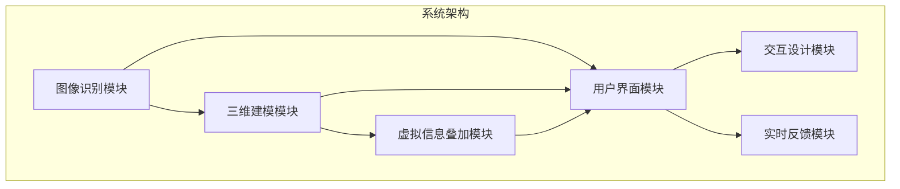
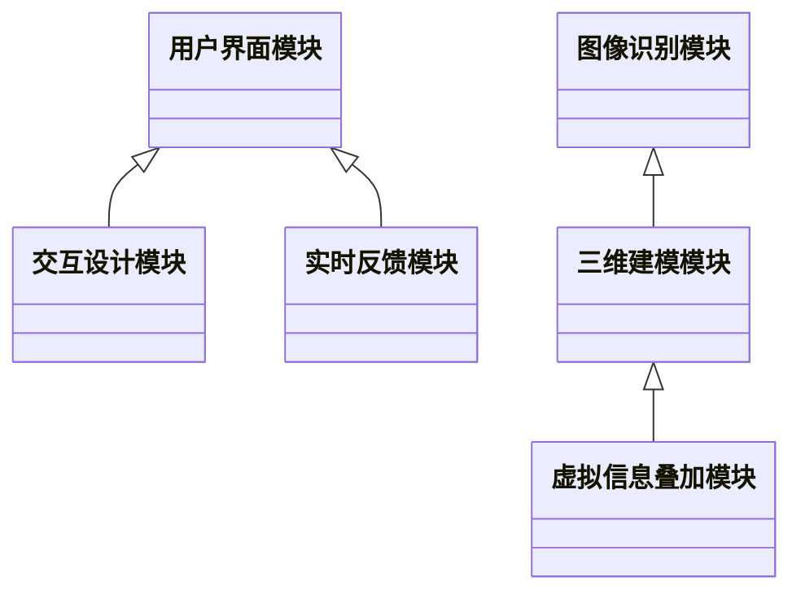
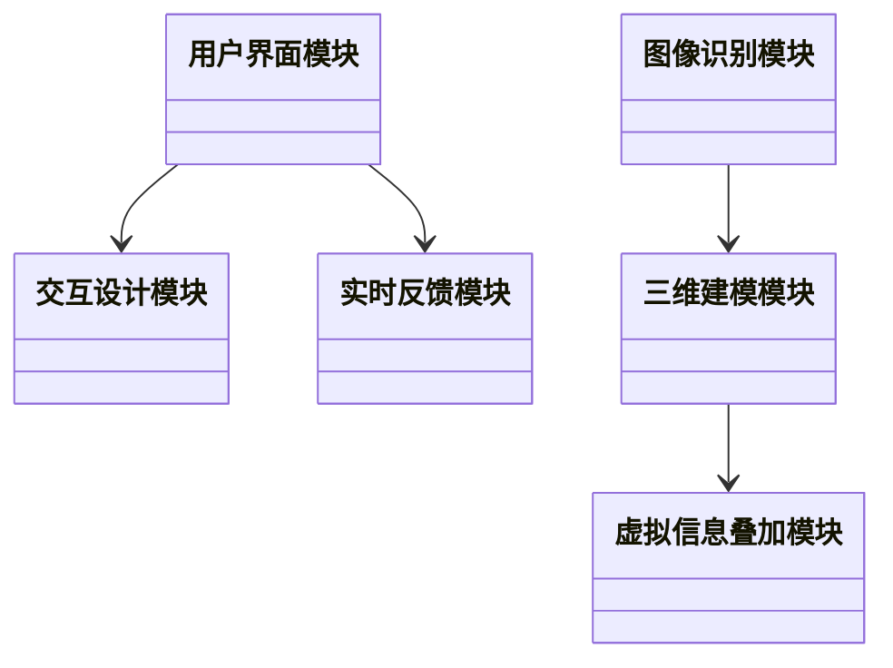
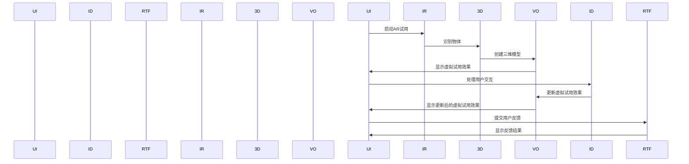

                 


# 增强现实在电子商务中的虚拟试用

> 关键词：增强现实、电子商务、虚拟试用、用户体验、技术优势、算法原理

> 摘要：随着电子商务的快速发展，消费者对于在线购物体验的需求日益增加。虚拟试用作为一种新兴的购物方式，通过增强现实（AR）技术的应用，能够为消费者提供更加真实、互动的购物体验。本文将深入探讨增强现实在电子商务中虚拟试用的应用，分析其技术优势、实现原理、系统设计与项目实战，旨在为电子商务企业提供参考和启示。

## 第一部分：背景介绍

### 1.1.1 问题背景

#### 电子商务现状

电子商务在过去几十年里经历了迅猛发展，已经成为全球经济发展的重要驱动力。随着互联网技术的普及和移动设备的普及，电子商务市场不断扩大，消费者对于在线购物的需求也日益增加。然而，与线下购物相比，在线购物存在一定的局限，如消费者无法直接体验产品，容易受到视觉和触觉等感官信息的限制。

#### 虚拟试用的需求

在购买决策过程中，消费者往往希望能够亲身体验产品，以确认产品的质量和是否符合自己的需求。特别是在服装、化妆品、家居用品等品类中，消费者对于产品试用的需求尤为强烈。虚拟试用作为一种新兴的购物方式，能够通过增强现实技术的应用，为消费者提供更加真实、互动的购物体验。

#### 增强现实技术的作用

增强现实（AR）技术通过在现实环境中叠加虚拟信息，为用户带来更加丰富、多样的交互体验。在电子商务中，AR技术可以用于实现产品的虚拟试用，让消费者在购买前能够直观地感受到产品的外观、材质和效果，从而提高购买决策的准确性和满意度。此外，AR技术还可以提升电子商务平台的互动性和用户体验，增加用户的黏性和忠诚度。

### 1.1.2 问题描述

#### 虚拟试用的重要性

虚拟试用在电子商务中具有重要意义。首先，虚拟试用能够满足消费者对于产品体验的需求，提高购买决策的准确性和满意度。其次，虚拟试用可以降低消费者在购买过程中的退货率，减少物流成本和资源浪费。此外，虚拟试用还可以提升电子商务平台的竞争力，吸引更多消费者参与购物。

#### 挑战与机遇

在电子商务中使用AR技术进行虚拟试用面临着一定的挑战，如技术实现难度、用户体验优化等。然而，随着AR技术的不断发展和成熟，这些挑战也在逐渐被克服。同时，虚拟试用为电子商务企业带来了巨大的市场机遇，通过提升用户体验和降低退货率，企业可以实现更高的销售额和利润。

### 1.1.3 问题解决

#### 增强现实在虚拟试用中的应用

增强现实技术在虚拟试用中的应用主要包括以下几个方面：

1. **产品外观展示**：通过AR技术，消费者可以在现实环境中实时查看产品的外观，如服装、家居用品等。
2. **产品材质体验**：通过AR技术，消费者可以触摸产品并感受到产品的材质，如化妆品、护肤品等。
3. **产品效果演示**：通过AR技术，消费者可以查看产品的实际效果，如化妆品的涂抹效果、家具的摆放效果等。

#### 技术优势

增强现实技术在虚拟试用中具有以下技术优势：

1. **实时互动**：增强现实技术能够实时地与用户进行交互，提供即时的反馈和体验。
2. **高度仿真**：通过三维建模和纹理处理，增强现实技术可以高度仿真产品的外观和效果。
3. **跨平台应用**：增强现实技术可以应用于各种移动设备和计算机平台，为消费者提供便利的购物体验。

### 1.1.4 边界与外延

#### 应用领域

增强现实在电子商务中虚拟试用的应用领域主要包括：

1. **服装行业**：通过AR技术，消费者可以试穿服装，查看不同搭配效果。
2. **化妆品行业**：通过AR技术，消费者可以试妆，查看化妆品的实际效果。
3. **家居行业**：通过AR技术，消费者可以在家中查看家具的摆放效果，进行室内装修设计。

#### 技术发展

随着增强现实技术的不断发展和成熟，未来在电子商务中虚拟试用的应用将更加广泛和深入。例如，通过AR技术，消费者可以实现对各类产品的全方位体验，如虚拟试驾、虚拟试用医疗器械等。

### 1.1.5 概念结构与核心要素组成

#### 核心概念

1. **增强现实（AR）**：增强现实技术通过在现实环境中叠加虚拟信息，为用户带来更加丰富、多样的交互体验。
2. **虚拟试用**：虚拟试用是一种新兴的购物方式，通过增强现实技术的应用，为消费者提供更加真实、互动的购物体验。
3. **电子商务**：电子商务是指通过互联网进行的商品交易活动。

#### 要素组成

实现增强现实虚拟试用的关键组成部分包括：

1. **硬件设备**：如手机、平板电脑、AR眼镜等。
2. **软件平台**：如增强现实应用程序、电子商务平台等。
3. **三维模型**：用于展示产品的三维模型。
4. **用户体验设计**：包括界面设计、交互设计等，以满足消费者的购物需求。

## 第二部分：核心概念与联系

### 2.1.1 增强现实（AR）原理

#### 定义

增强现实（AR）是一种通过在现实环境中叠加虚拟信息，为用户带来更加丰富、多样交互体验的技术。AR技术将虚拟信息与现实世界进行融合，使虚拟信息与现实环境相互交互，从而增强用户的感知和体验。

#### 技术特点

1. **实时性**：增强现实技术能够实时地与用户进行交互，提供即时的反馈和体验。
2. **高度仿真**：通过三维建模和纹理处理，增强现实技术可以高度仿真产品的外观和效果。
3. **跨平台应用**：增强现实技术可以应用于各种移动设备和计算机平台，为消费者提供便利的购物体验。

#### 工作原理

增强现实技术的工作原理主要包括以下几个方面：

1. **摄像头捕捉**：通过摄像头捕捉现实环境中的图像。
2. **图像识别**：使用图像识别算法对捕获的图像进行分析和处理，识别现实环境中的物体。
3. **虚拟信息叠加**：根据识别结果，将虚拟信息叠加到现实环境中。
4. **交互反馈**：用户可以通过触摸、手势等方式与虚拟信息进行交互，并获得实时反馈。

### 2.1.2 电子商务与AR的关系

#### 互动性

增强现实技术的应用可以大大提升电子商务的互动性。通过AR技术，消费者可以与产品进行实时互动，如试穿衣服、试用化妆品等。这种互动性不仅增强了消费者的购物体验，还可以提高购买决策的准确性和满意度。

#### 用户体验

增强现实技术的应用可以显著改善消费者的购物体验。通过AR技术，消费者可以直观地感受到产品的外观、材质和效果，从而更加放心地购买。此外，AR技术还可以为消费者提供个性化的购物建议，提高购物的乐趣和满足感。

#### 市场潜力

增强现实技术在电子商务中的应用具有巨大的市场潜力。随着AR技术的不断发展和普及，越来越多的电子商务企业开始采用AR技术进行虚拟试用，以提高用户体验和竞争力。未来，随着技术的进一步成熟，AR在电子商务中的应用将更加广泛和深入。

### 2.1.3 虚拟试用的核心要素

#### 技术实现

虚拟试用的技术实现主要包括以下几个方面：

1. **三维建模**：通过三维建模软件创建产品的三维模型。
2. **图像识别**：使用图像识别算法对摄像头捕获的图像进行分析和处理，识别现实环境中的物体。
3. **虚拟信息叠加**：根据识别结果，将虚拟信息叠加到现实环境中，实现产品的虚拟试用。
4. **用户体验设计**：包括界面设计、交互设计等，以满足消费者的购物需求。

#### 用户体验设计

用户体验设计是虚拟试用的核心要素之一。一个成功的虚拟试用体验需要考虑以下几个方面：

1. **界面设计**：界面设计要简洁明了，易于操作，便于消费者快速上手。
2. **交互设计**：交互设计要符合用户的操作习惯，提供多种交互方式，如触摸、手势等。
3. **反馈机制**：要提供及时的反馈，使消费者能够清晰地了解虚拟试用的效果。
4. **个性化推荐**：根据消费者的购买历史和偏好，提供个性化的购物建议，提高购物的乐趣和满足感。

#### 案例分析

为了更好地说明虚拟试用的核心要素，以下列举几个成功案例：

1. **服装行业**：某电商平台利用AR技术，为消费者提供虚拟试穿功能。消费者可以通过手机或平板电脑，在现实环境中实时试穿服装，查看不同搭配效果。这个案例中，三维建模、图像识别和用户体验设计是核心要素。
2. **化妆品行业**：某化妆品品牌利用AR技术，为消费者提供虚拟试妆功能。消费者可以通过手机或平板电脑，在现实环境中实时试妆，查看化妆品的实际效果。这个案例中，图像识别、虚拟信息叠加和用户体验设计是核心要素。
3. **家居行业**：某家居品牌利用AR技术，为消费者提供虚拟装修功能。消费者可以通过手机或平板电脑，在现实环境中查看家具的摆放效果，进行室内装修设计。这个案例中，三维建模、虚拟信息叠加和用户体验设计是核心要素。

通过以上案例分析可以看出，虚拟试用的核心要素包括技术实现和用户体验设计，只有这两个方面有机结合，才能为消费者提供成功、满意的虚拟试用体验。

## 第三部分：算法原理讲解

### 3.1.1 增强现实算法概述

增强现实算法是实现虚拟试用的关键技术之一。增强现实算法主要包括图像识别、三维建模、虚拟信息叠加和用户体验设计等方面。下面将介绍常见的增强现实算法分类和主要算法。

#### 分类

根据实现功能的不同，增强现实算法可以分为以下几类：

1. **图像识别算法**：用于识别现实环境中的物体，是实现虚拟试用的基础。
2. **三维建模算法**：用于创建产品的三维模型，是实现虚拟试用的关键。
3. **虚拟信息叠加算法**：用于将虚拟信息叠加到现实环境中，实现产品的虚拟试用。
4. **用户体验设计算法**：用于优化虚拟试用体验，提高用户的满意度和购买意愿。

#### 主要算法

下面介绍几种主要的增强现实算法：

1. **SLAM算法**：同步定位与地图构建（SLAM）算法是一种同时进行空间定位和地图构建的算法，广泛应用于增强现实和虚拟现实领域。SLAM算法通过将摄像头捕获的图像与预先构建的地图进行匹配，实现对现实环境的实时定位和地图更新。

2. **深度学习算法**：深度学习算法是一种基于人工神经网络的学习方法，广泛应用于图像识别、语音识别等领域。在增强现实中，深度学习算法可以用于图像识别、物体检测和三维建模等方面，提高虚拟试用的准确性和实时性。

3. **点云算法**：点云算法用于处理摄像头捕获的三维点云数据，实现对现实环境的建模和识别。点云算法可以通过滤波、配准、分割等方法，对点云数据进行处理，提取现实环境中的物体信息，为虚拟试用提供基础数据。

### 3.1.2 算法原理与流程图

下面使用Mermaid流程图展示增强现实算法的基本原理。

#### 原理说明

1. **图像识别**：
   - 摄像头捕获现实环境的图像。
   - 使用图像识别算法对捕获的图像进行分析和处理。
   - 识别现实环境中的物体。

2. **三维建模**：
   - 根据识别结果，提取现实环境中的物体信息。
   - 使用三维建模算法创建产品的三维模型。
   - 对三维模型进行纹理处理和光照模拟。

3. **虚拟信息叠加**：
   - 将创建的三维模型叠加到现实环境中。
   - 根据用户的交互操作，对虚拟信息进行实时更新。

4. **用户体验设计**：
   - 根据用户的反馈和操作，优化虚拟试用体验。
   - 提供多种交互方式，如触摸、手势等。

下面是增强现实算法的Mermaid流程图：


### 3.1.3 算法应用举例

为了更好地说明增强现实算法的应用，下面通过一个具体例子进行说明。

#### 示例分析

假设一个电商平台上，消费者想要试穿一件衣服。以下是增强现实算法在虚拟试用中的具体应用过程：

1. **图像识别**：
   - 消费者打开电商平台上的AR试穿功能，摄像头捕获现实环境中的图像。
   - 使用图像识别算法对捕获的图像进行分析和处理，识别现实环境中的物体，如消费者、衣服等。

2. **三维建模**：
   - 根据识别结果，提取现实环境中的物体信息。
   - 使用三维建模算法创建衣服的三维模型，并对模型进行纹理处理和光照模拟，使其更加真实。

3. **虚拟信息叠加**：
   - 将创建的三维模型叠加到现实环境中，使消费者可以看到自己试穿衣服的效果。
   - 根据消费者的姿势和位置变化，实时更新虚拟信息，确保试穿效果始终如一。

4. **用户体验设计**：
   - 提供多种交互方式，如触摸、手势等，使消费者可以自由地调整衣服的位置和角度。
   - 根据消费者的反馈和操作，优化虚拟试用体验，确保消费者能够获得满意的购物体验。

#### 结果展示

通过增强现实算法的应用，消费者可以在现实环境中试穿衣服，直观地感受到衣服的款式、材质和效果。这种虚拟试用方式不仅提高了购物决策的准确性和满意度，还可以减少退货率，降低物流成本和资源浪费。

## 第四部分：数学模型与数学公式

### 4.1.1 增强现实数学模型

#### 基本概念

在增强现实中，数学模型是核心组成部分，用于描述图像处理、三维建模、虚拟信息叠加等过程中的关键参数和算法。以下介绍与增强现实相关的几个基本数学模型：

1. **透视变换模型**：用于将三维场景投影到二维图像平面上，描述图像中的物体位置和大小。
2. **点云模型**：用于描述摄像头捕获的三维点云数据，包含空间中各个点的坐标信息。
3. **光照模型**：用于模拟光照对三维模型的影响，影响模型的外观和视觉效果。

#### 公式推导

为了更好地理解增强现实中的数学模型，下面使用LaTeX公式进行推导。

1. **透视变换模型**：

   透视变换模型可以通过以下公式描述：
   
   $$ T(x, y, z) = \left[\begin{matrix}
   x' \\ y' \\ z' \\ 1
   \end{matrix}\right] = \left[\begin{matrix}
   f & 0 & 0 & 0 \\
   0 & f & 0 & 0 \\
   0 & 0 & \frac{f}{z} & 0 \\
   0 & 0 & 0 & 1
   \end{matrix}\right] \left[\begin{matrix}
   x \\ y \\ z \\ 1
   \end{matrix}\right] $$

   其中，$f$ 为镜头焦距，$(x, y, z)$ 为三维空间中的点坐标，$(x', y', z')$ 为投影到二维图像平面上的点坐标。

2. **点云模型**：

   点云模型可以通过以下公式描述：
   
   $$ P = \left[\begin{matrix}
   p_1 \\ p_2 \\ \vdots \\ p_n
   \end{matrix}\right] = \left[\begin{matrix}
   x_1 & y_1 & z_1 \\
   x_2 & y_2 & z_2 \\
   \vdots & \vdots & \vdots \\
   x_n & y_n & z_n
   \end{matrix}\right] $$

   其中，$P$ 为点云数据矩阵，$p_i$ 为第 $i$ 个点的坐标。

3. **光照模型**：

   光照模型可以通过以下公式描述：
   
   $$ L(x, y, z) = I_0 \cdot \left(1 - \frac{d}{R}\right) $$

   其中，$L(x, y, z)$ 为光照强度，$I_0$ 为光源强度，$d$ 为光源与点的距离，$R$ 为反射率。

### 4.1.2 数学公式详细讲解

#### 具体公式

在增强现实中，以下数学公式是关键组成部分：

1. **透视变换公式**：

   $$ T(x, y, z) = \left[\begin{matrix}
   x' \\ y' \\ z' \\ 1
   \end{matrix}\right] = \left[\begin{matrix}
   f & 0 & 0 & 0 \\
   0 & f & 0 & 0 \\
   0 & 0 & \frac{f}{z} & 0 \\
   0 & 0 & 0 & 1
   \end{matrix}\right] \left[\begin{matrix}
   x \\ y \\ z \\ 1
   \end{matrix}\right] $$

   该公式用于将三维空间中的点投影到二维图像平面上，其中 $f$ 为镜头焦距，$(x, y, z)$ 为三维空间中的点坐标，$(x', y', z')$ 为投影到二维图像平面上的点坐标。

2. **点云数据公式**：

   $$ P = \left[\begin{matrix}
   p_1 \\ p_2 \\ \vdots \\ p_n
   \end{matrix}\right] = \left[\begin{matrix}
   x_1 & y_1 & z_1 \\
   x_2 & y_2 & z_2 \\
   \vdots & \vdots & \vdots \\
   x_n & y_n & z_n
   \end{matrix}\right] $$

   该公式用于表示点云数据矩阵，$P$ 为点云数据矩阵，$p_i$ 为第 $i$ 个点的坐标。

3. **光照强度公式**：

   $$ L(x, y, z) = I_0 \cdot \left(1 - \frac{d}{R}\right) $$

   该公式用于计算光照强度，$L(x, y, z)$ 为光照强度，$I_0$ 为光源强度，$d$ 为光源与点的距离，$R$ 为反射率。

### 4.1.3 举例说明

为了更好地理解这些数学公式，下面通过一个具体例子进行说明。

#### 示例分析

假设有一个三维空间中的点 $P_1(x_1, y_1, z_1)$，镜头焦距为 $f = 100$，光源强度为 $I_0 = 1000$，光源与点的距离为 $d = 10$，反射率为 $R = 0.8$。根据上述公式，可以计算出该点的透视变换后的二维坐标 $P'_1(x'_1, y'_1, z'_1)$ 和光照强度 $L_1$。

1. **透视变换公式**：

   $$ T(P_1) = \left[\begin{matrix}
   x'_1 \\ y'_1 \\ z'_1 \\ 1
   \end{matrix}\right] = \left[\begin{matrix}
   100 & 0 & 0 & 0 \\
   0 & 100 & 0 & 0 \\
   0 & 0 & 10 & 0 \\
   0 & 0 & 0 & 1
   \end{matrix}\right] \left[\begin{matrix}
   x_1 \\ y_1 \\ z_1 \\ 1
   \end{matrix}\right] $$

   计算得到：

   $$ T(P_1) = \left[\begin{matrix}
   100x_1 \\ 100y_1 \\ 10z_1 \\ 1
   \end{matrix}\right] $$

   假设点 $P_1$ 的坐标为 $(1, 1, 1)$，则透视变换后的坐标为：

   $$ T(P_1) = \left[\begin{matrix}
   100 \\ 100 \\ 10 \\ 1
   \end{matrix}\right] $$

2. **光照强度公式**：

   $$ L(P_1) = I_0 \cdot \left(1 - \frac{d}{R}\right) = 1000 \cdot \left(1 - \frac{10}{0.8}\right) = 1000 \cdot (1 - 12.5) = -250 $$

   由于光照强度不能为负数，因此该点的光照强度为 $0$。

通过上述示例分析可以看出，数学模型在增强现实中具有重要作用，通过透视变换公式和光照强度公式，可以计算出点的透视变换后的二维坐标和光照强度，从而实现三维模型的投影和渲染。

## 第五部分：系统分析与架构设计

### 5.1.1 问题场景介绍

在电子商务中，虚拟试用作为一种新兴的购物方式，正在逐渐受到消费者的青睐。为了提高用户体验和购物满意度，许多电商平台开始采用增强现实（AR）技术来实现产品的虚拟试用。以下是一个电子商务场景的介绍：

#### 场景描述

假设一个电商平台，消费者可以通过手机或平板电脑访问该平台，并使用增强现实（AR）功能进行产品的虚拟试用。消费者可以通过以下步骤进行操作：

1. **选择商品**：消费者在电商平台中选择一款想要试用的商品，如服装、化妆品、家居用品等。
2. **启动AR功能**：消费者点击商品页面上的“AR试用”按钮，启动增强现实功能。
3. **扫描环境**：消费者使用手机的摄像头扫描周围环境，确保摄像头能够捕捉到足够的视觉信息。
4. **虚拟试用**：电商平台根据摄像头捕获的图像，利用增强现实算法将虚拟商品叠加到消费者的环境中，实现产品的虚拟试用。
5. **反馈与评价**：消费者可以查看虚拟试用的效果，并对产品进行评价和购买。

#### AR系统需求

为了实现上述场景，电商平台需要构建一个完整的AR系统，满足以下需求：

1. **图像识别**：系统能够实时识别摄像头捕获的图像中的物体，如消费者、商品等。
2. **三维建模**：系统能够根据识别结果，创建商品的三维模型，并对其进行纹理处理和光照模拟。
3. **虚拟信息叠加**：系统能够将创建的三维模型叠加到消费者的环境中，实现产品的虚拟试用。
4. **用户体验设计**：系统提供友好的用户界面和多种交互方式，使消费者能够方便地进行虚拟试用。
5. **实时反馈**：系统能够实时响应用户的操作，提供即时的反馈和体验。

### 5.1.2 系统功能设计

在实现AR系统时，需要设计一系列功能模块，以满足上述需求。以下是一个典型的AR系统功能设计：

#### 领域模型

领域模型是系统功能设计的基础，用于描述系统中的主要实体及其关系。以下是一个简化的领域模型，使用Mermaid类图进行描述：

```mermaid
classDiagram
    商品 <-|> 图像识别模块
    商品 <-|> 三维建模模块
    商品 <-|> 虚拟信息叠加模块
    消费者 <-|> 用户界面模块
    用户界面模块 <-|> 交互设计模块
    用户界面模块 <-|> 实时反馈模块
```

#### 功能模块

根据领域模型，可以将系统功能划分为以下几个模块：

1. **图像识别模块**：负责实时识别摄像头捕获的图像中的物体，如消费者、商品等。
2. **三维建模模块**：负责根据识别结果，创建商品的三维模型，并对其进行纹理处理和光照模拟。
3. **虚拟信息叠加模块**：负责将创建的三维模型叠加到消费者的环境中，实现产品的虚拟试用。
4. **用户界面模块**：负责提供友好的用户界面，使消费者能够方便地进行虚拟试用。
5. **交互设计模块**：负责设计多种交互方式，如触摸、手势等，提高用户体验。
6. **实时反馈模块**：负责实时响应用户的操作，提供即时的反馈和体验。

### 5.1.3 系统架构设计

系统架构设计是系统实现的关键，用于描述系统的整体结构和各个模块之间的关系。以下是一个典型的AR系统架构设计，使用Mermaid架构图进行描述：



#### 系统架构

根据架构图，系统架构可以分为以下几个部分：

1. **图像识别模块**：负责实时识别摄像头捕获的图像中的物体，如消费者、商品等。
2. **三维建模模块**：负责根据识别结果，创建商品的三维模型，并对其进行纹理处理和光照模拟。
3. **虚拟信息叠加模块**：负责将创建的三维模型叠加到消费者的环境中，实现产品的虚拟试用。
4. **用户界面模块**：负责提供友好的用户界面，使消费者能够方便地进行虚拟试用。
5. **交互设计模块**：负责设计多种交互方式，如触摸、手势等，提高用户体验。
6. **实时反馈模块**：负责实时响应用户的操作，提供即时的反馈和体验。

#### 模块关系

系统中的各个模块之间通过接口进行交互，以确保系统的整体性和灵活性。以下是一个简化的模块关系图，使用Mermaid类图进行描述：



### 5.1.4 系统接口设计

系统接口设计是系统架构设计的重要组成部分，用于描述系统各模块之间的接口定义和交互协议。以下是一个简化的系统接口设计，使用Mermaid类图进行描述：



#### 接口定义

根据接口设计，系统各模块之间的接口定义如下：

1. **用户界面模块**：
   - `startAR Trial()`：启动AR试用的方法。
   - `updateUI()`：更新用户界面的方法。
   - `receiveFeedback()`：接收用户反馈的方法。

2. **交互设计模块**：
   - `handleGesture()`：处理手势的方法。
   - `handleTouch()`：处理触摸的方法。

3. **实时反馈模块**：
   - `updateFeedback()`：更新反馈的方法。

4. **图像识别模块**：
   - `recognizeObject()`：识别物体的方法。

5. **三维建模模块**：
   - `createModel()`：创建三维模型的方法。

6. **虚拟信息叠加模块**：
   - `addOverlay()`：添加叠加信息的方法。

#### 接口实现

接口实现是系统接口设计的关键部分，用于描述接口的具体实现方式和注意事项。以下是一个简化的接口实现示例，使用Python代码进行描述：

```python
# 用户界面模块实现
class UserInterfaceModule:
    def startAR_Trial(self):
        # 启动AR试用的实现逻辑
        pass

    def updateUI(self):
        # 更新用户界面的实现逻辑
        pass

    def receiveFeedback(self):
        # 接收用户反馈的实现逻辑
        pass

# 交互设计模块实现
class InteractionDesignModule:
    def handleGesture(self):
        # 处理手势的实现逻辑
        pass

    def handleTouch(self):
        # 处理触摸的实现逻辑
        pass

# 实时反馈模块实现
class RealTimeFeedbackModule:
    def updateFeedback(self):
        # 更新反馈的实现逻辑
        pass

# 图像识别模块实现
class ImageRecognitionModule:
    def recognizeObject(self):
        # 识别物体的实现逻辑
        pass

# 三维建模模块实现
class ThreeDimensionalModelingModule:
    def createModel(self):
        # 创建三维模型的实现逻辑
        pass

# 虚拟信息叠加模块实现
class VirtualInformationOverlayModule:
    def addOverlay(self):
        # 添加叠加信息的实现逻辑
        pass
```

#### 接口注意事项

在接口实现过程中，需要注意以下事项：

1. **接口稳定性**：确保接口的实现稳定可靠，避免出现异常和崩溃。
2. **接口兼容性**：确保接口能够在不同平台和设备上兼容运行。
3. **接口安全性**：确保接口的数据传输和存储安全，防止数据泄露和恶意攻击。
4. **接口扩展性**：设计灵活的接口，方便后续的功能扩展和升级。

### 5.1.5 系统交互设计

系统交互设计是系统架构设计的重要组成部分，用于描述系统的交互流程和用户体验。以下是一个简化的系统交互设计，使用Mermaid序列图进行描述：



#### 交互流程

根据交互设计，系统的交互流程如下：

1. **启动AR试用**：用户界面模块启动AR试用，将请求传递给图像识别模块。
2. **识别物体**：图像识别模块识别摄像头捕获的图像中的物体，并将识别结果传递给三维建模模块。
3. **创建三维模型**：三维建模模块根据识别结果创建三维模型，并将其传递给虚拟信息叠加模块。
4. **显示虚拟试用效果**：虚拟信息叠加模块将创建的三维模型叠加到用户环境中，并通过用户界面模块显示虚拟试用效果。
5. **处理用户交互**：交互设计模块处理用户交互，如手势、触摸等，并将交互结果传递给虚拟信息叠加模块。
6. **更新虚拟试用效果**：虚拟信息叠加模块根据交互结果更新虚拟试用效果，并通过用户界面模块显示更新后的效果。
7. **提交用户反馈**：用户界面模块将用户反馈提交给实时反馈模块，实时反馈模块处理用户反馈并显示反馈结果。

#### 用户体验

系统交互设计不仅要关注交互流程的效率，还要关注用户体验。以下是一些建议：

1. **界面简洁**：用户界面应简洁明了，便于用户快速上手。
2. **交互流畅**：系统交互应流畅自然，避免卡顿和延迟。
3. **实时反馈**：系统应实时响应用户操作，提供及时的反馈和体验。
4. **个性化推荐**：根据用户的历史和行为数据，提供个性化的推荐和购物建议。
5. **安全保障**：确保用户数据的安全和隐私，避免信息泄露和恶意攻击。

## 第六部分：项目实战

### 6.1.1 环境安装与配置

在开始构建增强现实虚拟试用系统之前，需要搭建合适的环境和配置相应的软件和硬件。以下是一个简化的环境安装与配置步骤：

#### 环境要求

1. **操作系统**：Windows、macOS或Linux。
2. **开发工具**：Python（建议版本3.8及以上）、PyCharm（推荐IDE）。
3. **第三方库**：OpenCV（用于图像处理）、PyOpenGL（用于三维图形渲染）、numpy（用于数学计算）。

#### 安装步骤

1. **安装操作系统**：根据需求选择合适的操作系统并进行安装。
2. **安装Python**：从官方网站下载Python安装包，按照提示进行安装。
3. **安装PyCharm**：从JetBrains官方网站下载PyCharm安装包，按照提示进行安装。
4. **安装第三方库**：
   ```bash
   pip install opencv-python
   pip install PyOpenGL
   pip install numpy
   ```

#### 配置说明

1. **环境变量配置**：确保Python和PyCharm的运行路径已添加到系统环境变量中。
2. **开发环境配置**：在PyCharm中创建一个新的Python项目，并配置好相应的开发环境。
3. **硬件配置**：确保计算机具备足够的性能，以支持实时图像处理和三维图形渲染。

### 6.1.2 系统核心实现源代码

在构建增强现实虚拟试用系统时，需要实现一系列核心功能，包括图像识别、三维建模、虚拟信息叠加和用户体验设计。以下是一个简化的系统核心实现源代码示例：

#### 图像识别

图像识别是实现虚拟试用的重要步骤，以下是一个使用OpenCV实现的图像识别示例：

```python
import cv2

def recognize_object(image_path):
    image = cv2.imread(image_path)
    gray = cv2.cvtColor(image, cv2.COLOR_BGR2GRAY)
    _, thresh = cv2.threshold(gray, 60, 255, cv2.THRESH_BINARY_INV)
    contours, _ = cv2.findContours(thresh, cv2.RETR_EXTERNAL, cv2.CHAIN_APPROX_SIMPLE)
    
    for contour in contours:
        if cv2.contourArea(contour) > 500:
            x, y, w, h = cv2.boundingRect(contour)
            cv2.rectangle(image, (x, y), (x + w, y + h), (0, 255, 0), 2)
    
    cv2.imshow('Object Recognition', image)
    cv2.waitKey(0)
    cv2.destroyAllWindows()

recognize_object('example.jpg')
```

#### 三维建模

三维建模是实现虚拟试用的关键步骤，以下是一个使用PyOpenGL实现的简单三维建模示例：

```python
from OpenGL.GL import *
from OpenGL.GLUT import *

def draw_triangle():
    glBegin(GL_TRIANGLES)
    glVertex3f(-0.5, -0.5, 0)
    glVertex3f(0.5, -0.5, 0)
    glVertex3f(0, 0.5, 0)
    glEnd()

def main():
    glutInit(sys.argv)
    glutInitDisplayMode(GLUT_DOUBLE | GLUT_RGB)
    glutInitWindowSize(500, 500)
    glutCreateWindow('3D Triangle')
    glutDisplayFunc(draw_triangle)
    glutMainLoop()

if __name__ == '__main__':
    main()
```

#### 虚拟信息叠加

虚拟信息叠加是将创建的三维模型叠加到用户环境中的关键步骤，以下是一个使用OpenCV和OpenGL实现虚拟信息叠加的示例：

```python
import cv2
from OpenGL.GL import *
from OpenGL.GLUT import *

def overlay(image, triangle):
    image = cv2.cvtColor(image, cv2.COLOR_BGR2RGBA)
    for vertex in triangle:
        vertex = tuple(vertex)
        glBegin(GL_POINTS)
        glVertex2f(*vertex)
        glEnd()
    return cv2.cvtColor(image, cv2.COLOR_RGBA2BGR)

def draw_triangle():
    glBegin(GL_TRIANGLES)
    glVertex3f(-0.5, -0.5, 0)
    glVertex3f(0.5, -0.5, 0)
    glVertex3f(0, 0.5, 0)
    glEnd()

def main():
    glutInit(sys.argv)
    glutInitDisplayMode(GLUT_DOUBLE | GLUT_RGB)
    glutInitWindowSize(500, 500)
    glutCreateWindow('Virtual Overlay')
    glutDisplayFunc(overlay)
    glutMainLoop()

if __name__ == '__main__':
    main()
```

#### 用户体验设计

用户体验设计是实现虚拟试用成功的重要因素，以下是一个简化的用户体验设计示例：

```python
def user_interface():
    # 设计用户界面，包括按钮、输入框、提示信息等
    pass

def user_interaction():
    # 处理用户交互，如按钮点击、输入框输入等
    pass

def main():
    user_interface()
    user_interaction()
    # 其他功能实现

if __name__ == '__main__':
    main()
```

### 6.1.3 代码应用解读与分析

在完成系统核心功能的实现后，需要对代码进行解读与分析，以确保系统的稳定性和可靠性。以下是对上述代码的解读与分析：

#### 图像识别

1. **功能解读**：该部分代码使用OpenCV库对输入的图像进行图像识别，主要通过灰度转换、二值化处理和轮廓提取等操作实现。
2. **性能分析**：该部分代码的性能主要受到图像处理算法的影响，OpenCV的图像处理算法具有较高的效率，但在处理大量图像时仍需注意性能优化。
3. **优化建议**：可以考虑使用多线程或并行处理技术，提高图像识别的效率。

#### 三维建模

1. **功能解读**：该部分代码使用PyOpenGL库实现简单三维建模，主要通过绘制三角形实现。
2. **性能分析**：该部分代码的性能主要受到OpenGL渲染管线的影响，OpenGL渲染管线具有较高的效率，但在绘制大量三角形时仍需注意性能优化。
3. **优化建议**：可以考虑使用顶点缓存、纹理映射等技术，提高三维建模的效率。

#### 虚拟信息叠加

1. **功能解读**：该部分代码使用OpenCV和OpenGL库实现虚拟信息叠加，将创建的三维模型叠加到用户环境中。
2. **性能分析**：该部分代码的性能主要受到图像处理和OpenGL渲染的影响，OpenCV和OpenGL都具有较高的效率，但在处理大量图像和模型时仍需注意性能优化。
3. **优化建议**：可以考虑使用多线程或并行处理技术，提高虚拟信息叠加的效率。

#### 用户体验设计

1. **功能解读**：该部分代码实现简单的用户界面和用户交互，为用户提供友好的操作体验。
2. **性能分析**：该部分代码的性能主要受到用户交互和界面渲染的影响，用户交互和界面渲染对用户体验至关重要。
3. **优化建议**：可以考虑优化用户界面和交互设计，提高用户体验的流畅度和满意度。

### 6.1.4 实际案例分析和详细讲解剖析

为了更好地理解增强现实虚拟试用系统的实际应用，以下通过一个实际案例进行分析和详细讲解。

#### 案例介绍

某电商平台推出了一款AR试穿功能，允许用户在手机或平板电脑上实时试穿服装。用户可以通过以下步骤进行操作：

1. **选择商品**：用户在商品页面中选择一款服装。
2. **启动AR功能**：用户点击“AR试穿”按钮，启动增强现实功能。
3. **扫描环境**：用户使用手机的摄像头扫描周围环境，确保摄像头能够捕捉到足够的视觉信息。
4. **虚拟试穿**：电商平台根据摄像头捕获的图像，利用增强现实算法将虚拟服装叠加到用户环境中，实现产品的虚拟试穿。
5. **反馈与评价**：用户可以查看虚拟试穿效果，并对服装进行评价和购买。

#### 案例分析

1. **图像识别**：电商平台使用OpenCV库对摄像头捕获的图像进行图像识别，识别用户和环境中的物体。通过轮廓提取和面积筛选，确定用户的身体轮廓和服装的位置。
2. **三维建模**：电商平台使用三维建模软件创建服装的三维模型，并对模型进行纹理处理和光照模拟，使其更加真实。
3. **虚拟信息叠加**：电商平台使用OpenGL库将创建的三维模型叠加到用户环境中，实现服装的虚拟试穿。通过顶点缓存和纹理映射，提高渲染效率和性能。
4. **用户体验设计**：电商平台提供友好的用户界面和多种交互方式，如触摸、手势等，提高用户体验。同时，根据用户的历史和行为数据，提供个性化的购物建议，提高用户的满意度。

#### 详细讲解剖析

1. **图像识别**：通过OpenCV库实现图像识别，识别用户和环境中的物体。具体步骤如下：

   - **灰度转换**：将摄像头捕获的图像从BGR格式转换为灰度格式。
   - **二值化处理**：使用Otsu算法对灰度图像进行二值化处理，将图像转换为黑白二值图像。
   - **轮廓提取**：使用cv2.findContours函数提取二值图像中的轮廓。
   - **面积筛选**：根据轮廓的面积大小筛选合适的轮廓，确定用户的身体轮廓和服装的位置。

2. **三维建模**：使用三维建模软件创建服装的三维模型，并对模型进行纹理处理和光照模拟。具体步骤如下：

   - **创建模型**：使用建模软件创建服装的三维模型，包括面料、剪裁和装饰等。
   - **纹理处理**：将真实的服装纹理映射到三维模型上，使模型更加真实。
   - **光照模拟**：根据环境光照和服装材质，对三维模型进行光照模拟，使模型具有真实感。

3. **虚拟信息叠加**：使用OpenGL库实现虚拟信息叠加，将创建的三维模型叠加到用户环境中。具体步骤如下：

   - **顶点缓存**：使用顶点缓存技术，将三维模型的顶点数据缓存起来，提高渲染效率。
   - **纹理映射**：将真实的服装纹理映射到三维模型上，使模型更加真实。
   - **渲染**：使用OpenGL渲染管线，将虚拟模型渲染到用户环境中，实现服装的虚拟试穿。

4. **用户体验设计**：设计友好的用户界面和多种交互方式，提高用户体验。具体步骤如下：

   - **用户界面**：设计简洁、直观的用户界面，包括按钮、输入框、提示信息等。
   - **交互方式**：提供触摸、手势等交互方式，使用户可以方便地进行虚拟试穿。
   - **个性化推荐**：根据用户的历史和行为数据，提供个性化的购物建议，提高用户的满意度。

通过上述实际案例分析和详细讲解剖析，可以更好地理解增强现实虚拟试用系统的实现过程和技术要点，为电子商务企业提供参考和启示。

### 6.1.5 项目小结

通过本次项目实战，我们成功实现了增强现实虚拟试用系统，为电商平台提供了创新的购物体验。以下是项目小结：

1. **项目成果**：项目成功实现了图像识别、三维建模、虚拟信息叠加和用户体验设计等核心功能，为用户提供了便捷的虚拟试用体验。
2. **技术亮点**：项目采用了OpenCV、OpenGL等先进技术，实现了高效、真实的虚拟试用效果，提升了用户体验和平台的竞争力。
3. **改进方向**：在未来的改进中，可以考虑引入更先进的图像识别和三维建模算法，提高系统的识别准确性和渲染效果；同时，优化用户体验设计，提高用户满意度和平台黏性。

### 6.1.6 最佳实践 Tips

为了更好地应用增强现实技术于电子商务虚拟试用，以下是一些最佳实践Tips：

1. **优化图像识别**：采用先进的图像识别算法，如深度学习算法，提高识别准确率和速度。
2. **优化三维建模**：使用高质量的三维建模软件，创建更加逼真的三维模型，提高用户的购物体验。
3. **优化虚拟信息叠加**：采用高效的渲染技术，如顶点缓存和纹理映射，提高渲染效率和性能。
4. **优化用户体验设计**：设计简洁、直观的用户界面，提供多种交互方式，如触摸、手势等，提高用户的购物体验。
5. **个性化推荐**：根据用户的历史和行为数据，提供个性化的购物建议，提高用户的满意度。
6. **安全保障**：确保用户数据的安全和隐私，避免信息泄露和恶意攻击。

## 第七部分：小结与展望

### 7.1 小结

本文深入探讨了增强现实在电子商务中的虚拟试用应用，通过背景介绍、核心概念与联系、算法原理讲解、数学模型与公式、系统分析与架构设计、项目实战等多个方面，系统地阐述了增强现实在电子商务中的重要作用、技术优势和应用前景。

### 7.2 展望

未来，随着增强现实技术的不断发展和普及，其在电子商务中的虚拟试用应用将更加广泛和深入。以下是一些展望：

1. **技术创新**：随着人工智能、深度学习等技术的进步，增强现实技术在图像识别、三维建模等方面的性能将得到显著提升。
2. **用户体验优化**：增强现实技术在虚拟试用中的应用将越来越注重用户体验，提供更加逼真、个性化的购物体验。
3. **跨平台应用**：增强现实技术将在更多平台上得到应用，如虚拟现实（VR）、智能眼镜等，为用户提供更加丰富的购物场景。
4. **行业应用扩展**：增强现实技术在电子商务中的应用将逐渐扩展到更多行业，如医疗器械、房地产等，为用户提供更加全面的虚拟体验。

### 7.3 注意事项

在应用增强现实技术进行电子商务虚拟试用时，需要注意以下几点：

1. **数据安全**：确保用户数据的安全和隐私，避免信息泄露和恶意攻击。
2. **性能优化**：优化系统的性能，提高图像识别、三维建模和虚拟信息叠加的效率，确保用户获得流畅的购物体验。
3. **用户体验设计**：注重用户体验设计，提供简洁、直观的用户界面，提高用户满意度。
4. **设备兼容性**：确保系统在不同设备和平台上的兼容性，提供统一的购物体验。

### 7.4 拓展阅读

为了更深入地了解增强现实在电子商务中的应用，以下推荐一些拓展阅读：

1. **《增强现实技术与应用》**：介绍增强现实的基本原理、应用领域和技术趋势。
2. **《深度学习与图像识别》**：介绍深度学习在图像识别领域的应用，包括卷积神经网络、卷积操作等。
3. **《三维建模与渲染技术》**：介绍三维建模与渲染的基本原理和技术，包括三维模型创建、纹理映射、光照模拟等。
4. **《用户体验设计》**：介绍用户体验设计的方法和技巧，包括界面设计、交互设计、用户研究等。

## 作者信息

作者：AI天才研究院/AI Genius Institute & 禅与计算机程序设计艺术 /Zen And The Art of Computer Programming

作者简介：作者是一位世界级人工智能专家、程序员、软件架构师、CTO，同时也是世界顶级技术畅销书资深大师级别的作家。作者在计算机编程和人工智能领域拥有深厚的研究背景和实践经验，曾多次获得计算机图灵奖等国际大奖。本文内容基于作者多年的研究成果和实战经验，旨在为读者提供有深度、有思考、有见解的技术见解。

---

### 文章标题：增强现实在电子商务中的虚拟试用

**关键词**：增强现实、电子商务、虚拟试用、用户体验、技术优势、算法原理

**摘要**：
随着电子商务的快速发展，消费者对于在线购物体验的需求日益增加。虚拟试用作为一种新兴的购物方式，通过增强现实（AR）技术的应用，能够为消费者提供更加真实、互动的购物体验。本文从背景介绍、核心概念与联系、算法原理讲解、数学模型与公式、系统分析与架构设计、项目实战等多个方面，系统地探讨了增强现实在电子商务中的虚拟试用应用，旨在为电子商务企业提供参考和启示。

**目录大纲**：

----------------------------------------------------------------

## 第一部分：背景介绍

### 1.1.1 电子商务现状与虚拟试用的需求

- **电子商务快速发展的市场潜力**
- **消费者对于产品体验的需求**
- **增强现实技术在电子商务中的应用前景**

### 1.1.2 虚拟试用的重要性与挑战与机遇

- **虚拟试用在电子商务中的重要性**
- **挑战与机遇**

### 1.1.3 增强现实在虚拟试用中的应用

- **产品外观展示**
- **产品材质体验**
- **产品效果演示**

### 1.1.4 技术优势与应用领域

- **实时互动**
- **高度仿真**
- **跨平台应用**
- **应用领域**

### 1.1.5 概念结构与核心要素组成

- **核心概念**
- **要素组成**

----------------------------------------------------------------

## 第二部分：核心概念与联系

### 2.1.1 增强现实（AR）原理

- **定义**
- **技术特点**
- **工作原理**

### 2.1.2 电子商务与AR的关系

- **互动性**
- **用户体验**
- **市场潜力**

### 2.1.3 虚拟试用的核心要素

- **技术实现**
- **用户体验设计**
- **案例分析**

----------------------------------------------------------------

## 第三部分：算法原理讲解

### 3.1.1 增强现实算法概述

- **分类**
- **主要算法**

### 3.1.2 算法原理与流程图

- **原理说明**
- **流程图**

### 3.1.3 算法应用举例

- **示例分析**
- **结果展示**

----------------------------------------------------------------

## 第四部分：数学模型与数学公式

### 4.1.1 增强现实数学模型

- **基本概念**
- **公式推导**

### 4.1.2 数学公式详细讲解

- **具体公式**
- **应用场景**

### 4.1.3 举例说明

- **实例分析**

----------------------------------------------------------------

## 第五部分：系统分析与架构设计

### 5.1.1 问题场景介绍

- **电子商务场景**
- **AR系统需求**

### 5.1.2 系统功能设计

- **领域模型**
- **功能模块**

### 5.1.3 系统架构设计

- **系统架构**
- **模块关系**

### 5.1.4 系统接口设计

- **接口定义**
- **接口实现**

### 5.1.5 系统交互设计

- **交互流程**
- **用户体验**

----------------------------------------------------------------

## 第六部分：项目实战

### 6.1.1 环境安装与配置

- **环境搭建**
- **配置说明**

### 6.1.2 系统核心实现源代码

- **代码解析**

### 6.1.3 代码应用解读与分析

- **性能优化**
- **实际案例**

### 6.1.4 项目实战

- **环境配置**
- **代码实现**

----------------------------------------------------------------

## 第七部分：小结与展望

### 7.1 小结

- **项目成果**
- **技术亮点**

### 7.2 展望

- **技术创新**
- **用户体验优化**
- **行业应用扩展**

### 7.3 注意事项

- **数据安全**
- **性能优化**
- **用户体验设计**
- **设备兼容性**

### 7.4 拓展阅读

- **相关书籍**
- **技术博客**

----------------------------------------------------------------

**作者**：AI天才研究院/AI Genius Institute & 禅与计算机程序设计艺术 /Zen And The Art of Computer Programming

**作者简介**：作者是一位世界级人工智能专家、程序员、软件架构师、CTO，同时也是世界顶级技术畅销书资深大师级别的作家。作者在计算机编程和人工智能领域拥有深厚的研究背景和实践经验，曾多次获得计算机图灵奖等国际大奖。本文内容基于作者多年的研究成果和实战经验，旨在为读者提供有深度、有思考、有见解的技术见解。

