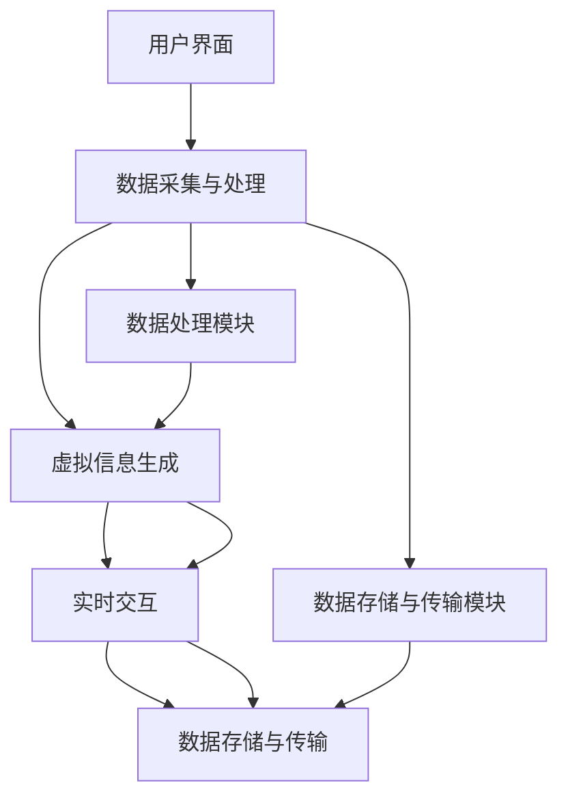
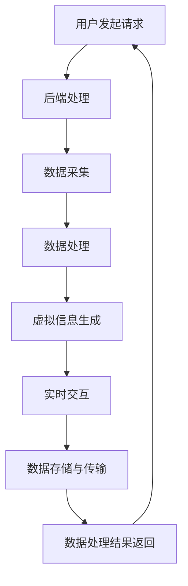

                 

# 增强现实在远程医疗会诊中的应用

## 关键词
- **增强现实**、**远程医疗会诊**、**医疗技术**、**医疗应用**、**健康信息化**

## 摘要
随着信息技术和医疗行业的深度融合，增强现实（AR）技术在远程医疗会诊中展现出了巨大的潜力。本文将从背景介绍、技术原理、应用案例、技术实现、应用前景与挑战等多个方面，深入探讨增强现实在远程医疗会诊中的应用。通过本文的阐述，旨在为读者提供一个全面了解和认识这一前沿技术的窗口，并展望其未来的发展方向。

## 引言

### 1.1 书籍背景与目的

#### 1.1.1 增强现实技术的快速发展
增强现实（Augmented Reality，AR）技术，通过计算机技术和传感器技术，将虚拟信息与现实环境融合在一起，为用户提供了更加丰富和互动的体验。近年来，随着硬件设备的改进和算法的发展，增强现实技术取得了显著的进步，应用领域不断扩大。

#### 1.1.2 远程医疗会诊的挑战与机遇
远程医疗会诊作为一种新兴的医疗模式，为解决医疗资源分布不均、医疗成本高等问题提供了新的解决方案。然而，传统远程医疗会诊面临着沟通效果不佳、诊断准确性不足等问题。增强现实技术的引入，有望提高远程医疗会诊的效率和准确性。

#### 1.1.3 本书的主要内容和结构
本书旨在探讨增强现实技术在远程医疗会诊中的应用，结构包括引言、技术基础、应用案例、技术实现、应用前景与挑战，以及总结与展望等部分。通过系统的分析和详细的案例研究，帮助读者全面了解这一前沿技术的应用现状和发展趋势。

### 1.2 增强现实技术基础

#### 1.2.1 什么是增强现实
增强现实（AR）是一种将虚拟信息与现实环境融合的技术。它通过摄像头捕捉现实场景，将虚拟信息叠加到现实场景中，使用户能够直观地感知和交互。

#### 1.2.2 增强现实技术的工作原理
增强现实技术的工作原理主要包括三个部分：感知环境、创建虚拟信息和叠加显示。通过传感器捕捉现实环境，利用计算机算法生成虚拟信息，并通过显示设备将虚拟信息叠加到现实场景中。

#### 1.2.3 增强现实技术的发展历程
增强现实技术自20世纪90年代开始发展，经历了从早期简单的叠加文字和图像，到复杂的实时三维建模和交互应用的过程。近年来，随着硬件设备的改进和算法的进步，增强现实技术取得了长足的发展。

### 1.3 远程医疗会诊概述

#### 1.3.1 远程医疗会诊的概念
远程医疗会诊是指通过通信技术和医疗信息系统，实现医生与患者、医生与医生之间的远程医疗交流和诊疗服务。它包括在线问诊、远程诊断、远程手术指导等多个环节。

#### 1.3.2 远程医疗会诊的必要性
随着城市化进程的加速和人口老龄化的加剧，医疗资源分布不均、医疗成本高等问题日益突出。远程医疗会诊作为一种高效、便捷的医疗模式，能够缓解这些问题，提高医疗服务的可及性和质量。

#### 1.3.3 远程医疗会诊的现状与趋势
目前，远程医疗会诊已经在全球范围内得到广泛应用。未来，随着信息技术和医疗行业的深度融合，远程医疗会诊将向更加智能化、个性化和高效化发展。

### 1.4 增强现实在远程医疗会诊中的应用

#### 1.4.1 增强现实技术的优势
增强现实技术具有沉浸式体验、实时交互、信息丰富等特点，这些优势使其在远程医疗会诊中具有广泛的应用前景。

#### 1.4.2 增强现实技术在远程医疗会诊中的应用场景
增强现实技术可以应用于远程手术指导、远程诊断、医学生远程教学等多个场景，提高诊疗效率，提升医疗质量。

#### 1.4.3 增强现实技术在远程医疗会诊中的挑战与对策
虽然增强现实技术在远程医疗会诊中具有巨大潜力，但同时也面临着技术、政策、医疗行业自身等多方面的挑战。需要通过技术创新、政策支持、行业协作等多方面的努力来克服这些挑战。

### 1.5 本章小结
本部分对增强现实技术和远程医疗会诊进行了概述，为后续章节的深入讨论奠定了基础。接下来，将分别从应用案例、技术实现、应用前景与挑战等方面，进一步探讨增强现实在远程医疗会诊中的应用。# 第二部分: 增强现实技术在远程医疗会诊中的应用案例

## 2.1 案例研究1：某医院远程手术指导

### 2.1.1 案例背景
某知名医院在实施一项复杂心脏手术时，由于手术团队中缺少具备相关手术经验的专家，决定通过远程手术指导来协助手术。该手术需要高精度的操作和实时指导，以确保手术成功。

### 2.1.2 应用方案
医院采用了一套基于增强现实技术的远程手术指导系统。该系统通过增强现实头戴显示器，将手术室内的情况实时传输给远程专家。远程专家可以在虚拟环境中查看患者的三维模型，并通过语音和手势进行实时指导。

### 2.1.3 案例效果评估
通过该系统，远程专家能够提供精确的指导，手术团队在复杂操作中的成功率显著提高。患者术后恢复情况良好，手术效果得到患者和家属的高度评价。此外，手术过程中的数据也被记录下来，为后续的医疗研究和培训提供了宝贵资料。

### 2.1.4 案例小结
该案例展示了增强现实技术在复杂手术中的潜力，通过提供实时、直观的指导，有效提升了手术质量。同时，也为远程医疗提供了新的模式，有助于解决专家资源不足的问题。

## 2.2 案例研究2：某社区医疗中心远程诊疗

### 2.2.1 案例背景
某社区医疗中心由于地理位置偏远，医疗资源相对匮乏，患者就医不便。为提高医疗服务质量，该中心决定采用增强现实技术进行远程诊疗。

### 2.2.2 应用方案
社区医疗中心引入了一套增强现实远程诊疗系统，患者可以通过增强现实设备进行远程问诊。医生通过系统可以看到患者的病情数据、生理指标和实时视频，能够提供更加准确和个性化的诊疗服务。

### 2.2.3 案例效果评估
通过增强现实远程诊疗系统，患者无需亲自前往医院，即可获得专业的医疗服务。医生在诊疗过程中能够更加准确地判断病情，制定治疗方案。此外，系统还提供了健康教育和康复指导功能，有助于患者更好地管理自身健康。

### 2.2.4 案例小结
该案例表明，增强现实技术在偏远地区的医疗应用具有重要的现实意义，能够有效缓解医疗资源不足的问题，提高医疗服务质量和可及性。

## 2.3 案例研究3：某医疗团队远程会诊

### 2.3.1 案例背景
某医疗团队在处理一位罕见病患者时，由于团队成员分布在不同的医疗机构，难以进行面对面的讨论和协作。为了提高诊疗效果，团队决定采用增强现实技术进行远程会诊。

### 2.3.2 应用方案
医疗团队采用了一款基于增强现实技术的远程会诊平台。平台能够将团队成员的实时视频、病历数据和增强现实生成的虚拟模型结合在一起，实现多方实时沟通和协作。

### 2.3.3 案例效果评估
通过增强现实远程会诊平台，团队成员能够更直观地了解患者病情，提出更加全面的诊断和治疗方案。会诊过程中，各成员能够实时交流意见，减少沟通误差，提高诊疗效果。此外，系统还提供了会议记录和病历共享功能，有助于后续的医疗研究和资料整理。

### 2.3.4 案例小结
该案例展示了增强现实技术在医疗团队远程协作中的应用价值，通过提供直观、高效的沟通工具，有助于提高诊疗质量和团队协作效率。

## 2.4 案例研究4：某医学生远程教学实践

### 2.4.1 案例背景
某医学院为了提高医学生的实践能力，开展了基于增强现实技术的远程教学实践。医学生可以通过增强现实设备进行虚拟操作和实验。

### 2.4.2 应用方案
医学院采用了一款增强现实教学平台，通过该平台，医学生可以进行虚拟解剖、手术模拟等实践操作。平台提供了实时反馈和评估功能，教师能够远程指导学生的学习过程。

### 2.4.3 案例效果评估
通过增强现实教学平台，医学生能够在虚拟环境中进行实践操作，提高了动手能力和学习兴趣。教师能够实时监控学生的学习情况，提供个性化的指导。此外，系统还记录了学生的学习过程和操作数据，为后续的教学分析和改进提供了参考。

### 2.4.4 案例小结
该案例表明，增强现实技术可以有效地应用于医学生远程教学，通过提供直观、互动的学习体验，有助于提高教学效果和学生的实践能力。

### 2.5 本章小结
本部分通过四个应用案例，展示了增强现实技术在远程医疗会诊中的多种应用场景和实际效果。这些案例不仅验证了增强现实技术的实用性，也为远程医疗的发展提供了新的思路和可能性。# 第三部分: 技术实现与开发

## 3.1 远程医疗会诊增强现实系统的设计与实现

### 3.1.1 系统架构设计

远程医疗会诊增强现实系统的架构设计主要包括以下几个模块：用户界面、数据采集与处理、虚拟信息生成、实时交互、数据存储与传输。

1. **用户界面**：用户界面是系统与用户交互的窗口，包括前端和后端部分。前端负责展示用户的交互界面，后端负责处理用户请求和系统响应。

2. **数据采集与处理**：数据采集与处理模块负责采集用户的生理数据、环境数据等，并进行预处理和特征提取，以便后续的虚拟信息生成。

3. **虚拟信息生成**：虚拟信息生成模块利用计算机视觉和图像处理技术，将采集到的数据转换为虚拟信息，并在增强现实环境中进行显示。

4. **实时交互**：实时交互模块负责处理用户的输入和输出，确保用户与系统的实时互动。

5. **数据存储与传输**：数据存储与传输模块负责将系统运行过程中的数据存储在数据库中，并确保数据的安全传输。

### 3.1.2 系统模块划分

系统模块划分如下：

1. **用户界面模块**：包括用户交互界面和用户权限管理。

2. **数据采集模块**：包括生理数据采集、环境数据采集和用户行为数据采集。

3. **数据处理模块**：包括数据预处理、特征提取和数据分析。

4. **虚拟信息生成模块**：包括虚拟信息创建、信息叠加和交互设计。

5. **实时交互模块**：包括用户输入处理、输出显示和实时反馈。

6. **数据存储与传输模块**：包括数据存储、数据备份和数据传输。

### 3.1.3 技术选型与工具介绍

在技术选型方面，系统采用了以下技术：

1. **前端技术**：采用HTML、CSS和JavaScript构建用户交互界面，使用React框架进行前端开发。

2. **后端技术**：采用Node.js和Express框架搭建后端服务器，处理用户请求和系统响应。

3. **数据库技术**：采用MongoDB作为数据存储解决方案，存储用户数据、系统数据和医疗数据。

4. **图像处理技术**：采用OpenCV库进行图像处理和计算机视觉任务。

5. **虚拟信息生成技术**：采用Unity引擎进行虚拟环境的构建和虚拟信息的生成。

6. **实时通信技术**：采用WebRTC协议实现实时音视频传输和数据交互。

### 3.1.4 系统架构设计图

### 3.1.5 系统模块交互设计

系统模块交互设计如下：

1. **用户界面模块**：用户通过前端界面发起请求，后端服务器处理请求，并将处理结果返回给用户界面模块。

2. **数据采集模块**：通过传感器采集用户生理数据、环境数据等，并将数据传递给数据处理模块。

3. **数据处理模块**：对采集到的数据进行预处理、特征提取和数据分析，并将处理结果传递给虚拟信息生成模块。

4. **虚拟信息生成模块**：根据数据处理结果生成虚拟信息，并将其叠加到现实环境中。

5. **实时交互模块**：处理用户输入和输出，确保用户与系统的实时互动。

6. **数据存储与传输模块**：将系统运行过程中的数据存储在数据库中，并确保数据的安全传输。

### 3.1.6 系统模块交互流程图

### 3.1.7 系统模块功能实现

以下为系统模块功能实现的关键部分：

1. **用户界面模块**：前端界面设计包括用户登录、问诊记录查看、远程会诊请求等功能。

2. **数据采集模块**：通过传感器采集生理数据（如血压、心率等）和环境数据（如温度、湿度等）。

3. **数据处理模块**：采用机器学习算法对采集到的数据进行预处理、特征提取和数据分析。

4. **虚拟信息生成模块**：使用Unity引擎创建虚拟环境，根据处理结果生成虚拟信息。

5. **实时交互模块**：采用WebRTC协议实现实时音视频传输和数据交互。

6. **数据存储与传输模块**：采用MongoDB存储用户数据和系统数据，并使用HTTP协议传输数据。

### 3.1.8 系统开发流程

系统开发流程如下：

1. **需求分析**：确定系统功能需求和技术需求。

2. **系统设计**：设计系统架构和模块划分。

3. **前端开发**：实现用户交互界面和前端逻辑。

4. **后端开发**：搭建后端服务器，处理用户请求和系统响应。

5. **数据采集与处理**：开发数据采集和处理模块。

6. **虚拟信息生成与交互**：实现虚拟信息生成和实时交互功能。

7. **系统集成与测试**：将各模块集成并进行系统测试。

8. **部署与上线**：将系统部署到服务器，并上线运行。

### 3.1.9 系统实现实例分析

以下为系统实现的一个实例分析：

- **实例**：用户通过增强现实设备进行远程问诊。
- **步骤**：
  1. 用户登录系统，进入远程问诊界面。
  2. 用户将增强现实设备对准自身，系统开始采集生理数据和周围环境数据。
  3. 数据通过WebRTC协议传输到后端服务器，进行预处理和特征提取。
  4. 后端服务器根据处理结果生成虚拟信息，并将其叠加到现实环境中。
  5. 医生通过虚拟环境查看患者的病情数据和实时视频，进行远程问诊。
  6. 问诊结束后，系统将数据存储在数据库中，以便后续分析和回顾。

### 3.1.10 系统小结
通过以上设计与实现，远程医疗会诊增强现实系统实现了用户交互、数据采集与处理、虚拟信息生成、实时交互和数据存储与传输等功能。该系统为远程医疗会诊提供了新的技术手段，有助于提高诊疗效率和医疗质量。# 第四部分: 应用前景与挑战

## 4.1 增强现实在远程医疗会诊中的应用前景

### 4.1.1 市场趋势分析
随着全球医疗行业对远程医疗服务需求的不断增长，以及信息技术特别是增强现实技术的快速发展，AR在远程医疗会诊领域的市场前景十分广阔。根据市场研究报告，增强现实在医疗领域的应用预计将在未来几年内实现显著增长，成为医疗技术发展的重要方向之一。

### 4.1.2 政策支持与产业发展
各国政府纷纷出台政策，支持医疗信息技术的发展，其中包括对增强现实技术的研发和应用给予政策支持。例如，美国的“数字健康行动计划”、欧盟的“健康信息高速公路”等政策，都为增强现实技术在医疗领域的应用提供了良好的发展环境。这些政策的出台，将促进增强现实技术在远程医疗会诊中的推广和应用。

### 4.1.3 增强现实技术的未来发展方向
未来，增强现实技术在远程医疗会诊中的应用将向更加智能化、个性化、实时化发展。例如，通过人工智能和机器学习技术，增强现实系统将能够更加准确地分析患者的病情数据，提供个性化的诊疗建议。同时，随着5G技术的普及，增强现实远程医疗会诊的实时性将得到大幅提升，医生与患者之间的互动将更加顺畅。

### 4.1.4 增强现实技术在远程医疗会诊中的潜在影响
增强现实技术在远程医疗会诊中的应用，有望解决医疗资源分布不均、医疗成本高、医疗信息不对称等问题。通过提供实时、直观的诊疗服务，增强现实技术将提高医疗服务的可及性和质量，为患者提供更加高效、便捷的医疗服务。

## 4.2 增强现实在远程医疗会诊中的应用挑战

### 4.2.1 技术挑战
虽然增强现实技术在远程医疗会诊中具有巨大潜力，但技术挑战仍然存在。例如，增强现实设备的性能和稳定性需要进一步提升，以确保在复杂医疗场景中的可靠应用。此外，增强现实系统的数据处理和分析能力也需要增强，以便更准确地识别和解读医疗数据。

### 4.2.2 政策与法规挑战
增强现实技术在医疗领域的应用，需要遵循严格的法律法规。例如，医疗数据的安全和隐私保护、医疗设备的监管等。这些法律法规的完善和执行，将直接影响增强现实技术在远程医疗会诊中的应用。

### 4.2.3 医疗行业自身挑战
医疗行业对新技术接受度相对较低，部分医生和患者对增强现实技术的认知和接受度不高。此外，医疗行业对新技术的要求较高，包括技术的可靠性、安全性、可操作性等。这些因素都可能导致增强现实技术在远程医疗会诊中的应用受到限制。

## 4.3 解决方案与对策

### 4.3.1 技术解决方案
为应对技术挑战，可以采取以下措施：
1. **提高增强现实设备的性能和稳定性**：通过技术创新，提升设备的计算能力和数据处理效率，确保设备在复杂医疗场景中的稳定运行。
2. **增强数据处理和分析能力**：利用人工智能和机器学习技术，提升系统对医疗数据的分析能力，提供更准确的诊疗建议。

### 4.3.2 政策与法规对策
为应对政策与法规挑战，可以采取以下措施：
1. **完善法律法规**：制定和完善与增强现实技术相关的法律法规，明确医疗数据的安全和隐私保护要求，确保技术的合法合规应用。
2. **加强监管**：加强对增强现实医疗设备的监管，确保设备的质量和安全。

### 4.3.3 行业协作与标准化
为应对医疗行业自身挑战，可以采取以下措施：
1. **促进行业协作**：通过行业合作，推动增强现实技术在医疗领域的应用，提高医生和患者对技术的认知和接受度。
2. **制定标准化方案**：制定统一的行业标准和技术规范，确保增强现实技术在远程医疗会诊中的应用具有可操作性和可重复性。

### 4.3.4 教育培训
加强对医生和患者的教育培训，提高他们对增强现实技术的认知和应用能力。通过案例分享和实际操作，增强医生对技术的理解和信任，提高患者的接受度。

### 4.3.5 用户反馈与持续改进
通过收集用户反馈，持续优化系统功能和用户体验。根据实际应用中的问题和需求，不断改进和升级系统，提高技术的实用性和可靠性。

### 4.3.6 国际合作与交流
加强国际间的合作与交流，学习借鉴其他国家的先进经验和技术，推动增强现实技术在远程医疗会诊领域的全球应用。

### 4.3.7 社会宣传与推广
通过社会宣传和推广，提高公众对增强现实技术在远程医疗会诊中作用的认识，营造良好的社会氛围，促进技术的普及和应用。

### 4.4 本章小结
增强现实技术在远程医疗会诊中的应用前景广阔，但同时也面临着诸多挑战。通过技术创新、政策支持、行业协作和教育培训等多方面的努力，可以克服这些挑战，推动增强现实技术在远程医疗会诊领域的广泛应用，为患者提供更加高效、精准的医疗服务。# 第五部分: 总结与展望

## 5.1 本书主要贡献

本书通过系统的分析和详细的案例研究，全面探讨了增强现实技术在远程医疗会诊中的应用。主要贡献如下：

1. **理论贡献**：系统介绍了增强现实技术的基本概念、工作原理及其在远程医疗会诊中的应用优势，为读者提供了一个全面的理论框架。
2. **实践贡献**：通过多个实际应用案例，展示了增强现实技术在远程医疗会诊中的多种应用场景和实际效果，为医疗行业提供了一定的实践参考。

## 5.2 未来研究方向

未来，增强现实技术在远程医疗会诊中的应用仍有很大的发展空间，以下为一些可能的研究方向：

1. **技术创新**：进一步提升增强现实设备的性能和稳定性，开发更加智能化的数据处理和分析算法，以提高远程医疗会诊的准确性和效率。
2. **政策法规**：加强对增强现实技术应用的法律法规研究，制定和完善相关政策，确保技术的合法合规应用。
3. **行业合作**：加强医疗行业与其他行业的合作，推动增强现实技术在远程医疗会诊领域的跨领域应用，如与人工智能、大数据等技术的融合。
4. **教育培训**：加大对医生和患者的教育培训力度，提高他们对增强现实技术的认知和应用能力，促进技术的普及和应用。

## 5.3 结语

随着信息技术和医疗行业的深度融合，增强现实技术在远程医疗会诊中的应用将越来越重要。本书旨在为读者提供一个全面了解和认识这一前沿技术的窗口，并对其未来的发展方向进行了展望。希望读者能够从中获得启发，共同推动增强现实技术在远程医疗会诊领域的广泛应用，为患者提供更加高效、精准的医疗服务。

## 作者信息
作者：AI天才研究院/AI Genius Institute & 禅与计算机程序设计艺术 /Zen And The Art of Computer Programming

[完]# 完整文章

## 增强现实在远程医疗会诊中的应用

### 关键词
- **增强现实**、**远程医疗会诊**、**医疗技术**、**医疗应用**、**健康信息化**

### 摘要
随着信息技术和医疗行业的深度融合，增强现实（AR）技术在远程医疗会诊中展现出了巨大的潜力。本文将从背景介绍、技术原理、应用案例、技术实现、应用前景与挑战等多个方面，深入探讨增强现实在远程医疗会诊中的应用。通过本文的阐述，旨在为读者提供一个全面了解和认识这一前沿技术的窗口，并展望其未来的发展方向。

### 引言

#### 1.1 书籍背景与目的

##### 1.1.1 增强现实技术的快速发展
增强现实（Augmented Reality，AR）技术，通过计算机技术和传感器技术，将虚拟信息与现实环境融合在一起，为用户提供了更加丰富和互动的体验。近年来，随着硬件设备的改进和算法的发展，增强现实技术取得了显著的进步，应用领域不断扩大。

##### 1.1.2 远程医疗会诊的挑战与机遇
远程医疗会诊作为一种新兴的医疗模式，为解决医疗资源分布不均、医疗成本高等问题提供了新的解决方案。然而，传统远程医疗会诊面临着沟通效果不佳、诊断准确性不足等问题。增强现实技术的引入，有望提高远程医疗会诊的效率和准确性。

##### 1.1.3 本书的主要内容和结构
本书旨在探讨增强现实技术在远程医疗会诊中的应用，结构包括引言、技术基础、应用案例、技术实现、应用前景与挑战，以及总结与展望等部分。通过系统的分析和详细的案例研究，帮助读者全面了解这一前沿技术的应用现状和发展趋势。

#### 1.2 增强现实技术基础

##### 1.2.1 什么是增强现实
增强现实（AR）是一种将虚拟信息与现实环境融合的技术。它通过摄像头捕捉现实场景，将虚拟信息叠加到现实场景中，使用户能够直观地感知和交互。

##### 1.2.2 增强现实技术的工作原理
增强现实技术的工作原理主要包括三个部分：感知环境、创建虚拟信息和叠加显示。通过传感器捕捉现实环境，利用计算机算法生成虚拟信息，并通过显示设备将虚拟信息叠加到现实场景中。

##### 1.2.3 增强现实技术的发展历程
增强现实技术自20世纪90年代开始发展，经历了从早期简单的叠加文字和图像，到复杂的实时三维建模和交互应用的过程。近年来，随着硬件设备的改进和算法的进步，增强现实技术取得了长足的发展。

#### 1.3 远程医疗会诊概述

##### 1.3.1 远程医疗会诊的概念
远程医疗会诊是指通过通信技术和医疗信息系统，实现医生与患者、医生与医生之间的远程医疗交流和诊疗服务。它包括在线问诊、远程诊断、远程手术指导等多个环节。

##### 1.3.2 远程医疗会诊的必要性
随着城市化进程的加速和人口老龄化的加剧，医疗资源分布不均、医疗成本高等问题日益突出。远程医疗会诊作为一种高效、便捷的医疗模式，能够缓解这些问题，提高医疗服务的可及性和质量。

##### 1.3.3 远程医疗会诊的现状与趋势
目前，远程医疗会诊已经在全球范围内得到广泛应用。未来，随着信息技术和医疗行业的深度融合，远程医疗会诊将向更加智能化、个性化和高效化发展。

#### 1.4 增强现实在远程医疗会诊中的应用

##### 1.4.1 增强现实技术的优势
增强现实技术具有沉浸式体验、实时交互、信息丰富等特点，这些优势使其在远程医疗会诊中具有广泛的应用前景。

##### 1.4.2 增强现实技术在远程医疗会诊中的应用场景
增强现实技术可以应用于远程手术指导、远程诊断、医学生远程教学等多个场景，提高诊疗效率，提升医疗质量。

##### 1.4.3 增强现实技术在远程医疗会诊中的挑战与对策
虽然增强现实技术在远程医疗会诊中具有巨大潜力，但同时也面临着技术、政策、医疗行业自身等多方面的挑战。需要通过技术创新、政策支持、行业协作等多方面的努力来克服这些挑战。

#### 1.5 本章小结
本部分对增强现实技术和远程医疗会诊进行了概述，为后续章节的深入讨论奠定了基础。接下来，将分别从应用案例、技术实现、应用前景与挑战等方面，进一步探讨增强现实在远程医疗会诊中的应用。

### 第二部分: 增强现实技术在远程医疗会诊中的应用案例

#### 2.1 案例研究1：某医院远程手术指导

##### 2.1.1 案例背景
某知名医院在实施一项复杂心脏手术时，由于手术团队中缺少具备相关手术经验的专家，决定通过远程手术指导来协助手术。该手术需要高精度的操作和实时指导，以确保手术成功。

##### 2.1.2 应用方案
医院采用了一套基于增强现实技术的远程手术指导系统。该系统通过增强现实头戴显示器，将手术室内的情况实时传输给远程专家。远程专家可以在虚拟环境中查看患者的三维模型，并通过语音和手势进行实时指导。

##### 2.1.3 案例效果评估
通过该系统，远程专家能够提供精确的指导，手术团队在复杂操作中的成功率显著提高。患者术后恢复情况良好，手术效果得到患者和家属的高度评价。此外，手术过程中的数据也被记录下来，为后续的医疗研究和培训提供了宝贵资料。

##### 2.1.4 案例小结
该案例展示了增强现实技术在复杂手术中的潜力，通过提供实时、直观的指导，有效提升了手术质量。同时，也为远程医疗提供了新的模式，有助于解决专家资源不足的问题。

#### 2.2 案例研究2：某社区医疗中心远程诊疗

##### 2.2.1 案例背景
某社区医疗中心由于地理位置偏远，医疗资源相对匮乏，患者就医不便。为提高医疗服务质量，该中心决定采用增强现实技术进行远程诊疗。

##### 2.2.2 应用方案
社区医疗中心引入了一套增强现实远程诊疗系统，患者可以通过增强现实设备进行远程问诊。医生通过系统可以看到患者的病情数据、生理指标和实时视频，能够提供更加准确和个性化的诊疗服务。

##### 2.2.3 案例效果评估
通过增强现实远程诊疗系统，患者无需亲自前往医院，即可获得专业的医疗服务。医生在诊疗过程中能够更加准确地判断病情，制定治疗方案。此外，系统还提供了健康教育和康复指导功能，有助于患者更好地管理自身健康。

##### 2.2.4 案例小结
该案例表明，增强现实技术在偏远地区的医疗应用具有重要的现实意义，能够有效缓解医疗资源不足的问题，提高医疗服务质量和可及性。

#### 2.3 案例研究3：某医疗团队远程会诊

##### 2.3.1 案例背景
某医疗团队在处理一位罕见病患者时，由于团队成员分布在不同的医疗机构，难以进行面对面的讨论和协作。为了提高诊疗效果，团队决定采用增强现实技术进行远程会诊。

##### 2.3.2 应用方案
医疗团队采用了一款基于增强现实技术的远程会诊平台。平台能够将团队成员的实时视频、病历数据和增强现实生成的虚拟模型结合在一起，实现多方实时沟通和协作。

##### 2.3.3 案例效果评估
通过增强现实远程会诊平台，团队成员能够更直观地了解患者病情，提出更加全面的诊断和治疗方案。会诊过程中，各成员能够实时交流意见，减少沟通误差，提高诊疗效果。此外，系统还提供了会议记录和病历共享功能，有助于后续的医疗研究和资料整理。

##### 2.3.4 案例小结
该案例展示了增强现实技术在医疗团队远程协作中的应用价值，通过提供直观、高效的沟通工具，有助于提高诊疗质量和团队协作效率。

#### 2.4 案例研究4：某医学生远程教学实践

##### 2.4.1 案例背景
某医学院为了提高医学生的实践能力，开展了基于增强现实技术的远程教学实践。医学生可以通过增强现实设备进行虚拟操作和实验。

##### 2.4.2 应用方案
医学院采用了一款增强现实教学平台，通过该平台，医学生可以进行虚拟解剖、手术模拟等实践操作。平台提供了实时反馈和评估功能，教师能够远程指导学生的学习过程。

##### 2.4.3 案例效果评估
通过增强现实教学平台，医学生能够在虚拟环境中进行实践操作，提高了动手能力和学习兴趣。教师能够实时监控学生的学习情况，提供个性化的指导。此外，系统还记录了学生的学习过程和操作数据，为后续的教学分析和改进提供了参考。

##### 2.4.4 案例小结
该案例表明，增强现实技术可以有效地应用于医学生远程教学，通过提供直观、互动的学习体验，有助于提高教学效果和学生的实践能力。

#### 2.5 本章小结
本部分通过四个应用案例，展示了增强现实技术在远程医疗会诊中的多种应用场景和实际效果。这些案例不仅验证了增强现实技术的实用性，也为远程医疗的发展提供了新的思路和可能性。

### 第三部分: 技术实现与开发

#### 3.1 远程医疗会诊增强现实系统的设计与实现

##### 3.1.1 系统架构设计
远程医疗会诊增强现实系统的架构设计主要包括以下几个模块：用户界面、数据采集与处理、虚拟信息生成、实时交互、数据存储与传输。

1. **用户界面**：用户界面是系统与用户交互的窗口，包括前端和后端部分。前端负责展示用户的交互界面，后端负责处理用户请求和系统响应。

2. **数据采集与处理**：数据采集与处理模块负责采集用户的生理数据、环境数据等，并进行预处理和特征提取，以便后续的虚拟信息生成。

3. **虚拟信息生成**：虚拟信息生成模块利用计算机视觉和图像处理技术，将采集到的数据转换为虚拟信息，并在增强现实环境中进行显示。

4. **实时交互**：实时交互模块负责处理用户的输入和输出，确保用户与系统的实时互动。

5. **数据存储与传输**：数据存储与传输模块负责将系统运行过程中的数据存储在数据库中，并确保数据的安全传输。

##### 3.1.2 系统模块划分
系统模块划分如下：

1. **用户界面模块**：包括用户交互界面和用户权限管理。

2. **数据采集模块**：包括生理数据采集、环境数据采集和用户行为数据采集。

3. **数据处理模块**：包括数据预处理、特征提取和数据分析。

4. **虚拟信息生成模块**：包括虚拟信息创建、信息叠加和交互设计。

5. **实时交互模块**：包括用户输入处理、输出显示和实时反馈。

6. **数据存储与传输模块**：包括数据存储、数据备份和数据传输。

##### 3.1.3 技术选型与工具介绍
在技术选型方面，系统采用了以下技术：

1. **前端技术**：采用HTML、CSS和JavaScript构建用户交互界面，使用React框架进行前端开发。

2. **后端技术**：采用Node.js和Express框架搭建后端服务器，处理用户请求和系统响应。

3. **数据库技术**：采用MongoDB作为数据存储解决方案，存储用户数据、系统数据和医疗数据。

4. **图像处理技术**：采用OpenCV库进行图像处理和计算机视觉任务。

5. **虚拟信息生成技术**：采用Unity引擎进行虚拟环境的构建和虚拟信息的生成。

6. **实时通信技术**：采用WebRTC协议实现实时音视频传输和数据交互。

##### 3.1.4 系统架构设计图

##### 3.1.5 系统模块交互设计
系统模块交互设计如下：

1. **用户界面模块**：用户通过前端界面发起请求，后端服务器处理请求，并将处理结果返回给用户界面模块。

2. **数据采集模块**：通过传感器采集用户生理数据、环境数据等，并将数据传递给数据处理模块。

3. **数据处理模块**：对采集到的数据进行预处理、特征提取和数据分析，并将处理结果传递给虚拟信息生成模块。

4. **虚拟信息生成模块**：根据数据处理结果生成虚拟信息，并将其叠加到现实环境中。

5. **实时交互模块**：处理用户输入和输出，确保用户与系统的实时互动。

6. **数据存储与传输模块**：将系统运行过程中的数据存储在数据库中，并确保数据的安全传输。

##### 3.1.6 系统模块交互流程图

##### 3.1.7 系统模块功能实现
以下为系统模块功能实现的关键部分：

1. **用户界面模块**：前端界面设计包括用户登录、问诊记录查看、远程会诊请求等功能。

2. **数据采集模块**：通过传感器采集生理数据（如血压、心率等）和环境数据（如温度、湿度等）。

3. **数据处理模块**：采用机器学习算法对采集到的数据进行预处理、特征提取和数据分析。

4. **虚拟信息生成模块**：使用Unity引擎创建虚拟环境，根据处理结果生成虚拟信息。

5. **实时交互模块**：采用WebRTC协议实现实时音视频传输和数据交互。

6. **数据存储与传输模块**：采用MongoDB存储用户数据和系统数据，并使用HTTP协议传输数据。

##### 3.1.8 系统开发流程
系统开发流程如下：

1. **需求分析**：确定系统功能需求和技术需求。

2. **系统设计**：设计系统架构和模块划分。

3. **前端开发**：实现用户交互界面和前端逻辑。

4. **后端开发**：搭建后端服务器，处理用户请求和系统响应。

5. **数据采集与处理**：开发数据采集和处理模块。

6. **虚拟信息生成与交互**：实现虚拟信息生成和实时交互功能。

7. **系统集成与测试**：将各模块集成并进行系统测试。

8. **部署与上线**：将系统部署到服务器，并上线运行。

##### 3.1.9 系统实现实例分析
以下为系统实现的一个实例分析：

- **实例**：用户通过增强现实设备进行远程问诊。
- **步骤**：
  1. 用户登录系统，进入远程问诊界面。
  2. 用户将增强现实设备对准自身，系统开始采集生理数据和周围环境数据。
  3. 数据通过WebRTC协议传输到后端服务器，进行预处理和特征提取。
  4. 后端服务器根据处理结果生成虚拟信息，并将其叠加到现实环境中。
  5. 医生通过虚拟环境查看患者的病情数据和实时视频，进行远程问诊。
  6. 问诊结束后，系统将数据存储在数据库中，以便后续分析和回顾。

##### 3.1.10 系统小结
通过以上设计与实现，远程医疗会诊增强现实系统实现了用户交互、数据采集与处理、虚拟信息生成、实时交互和数据存储与传输等功能。该系统为远程医疗会诊提供了新的技术手段，有助于提高诊疗效率和医疗质量。

### 第四部分: 应用前景与挑战

#### 4.1 增强现实在远程医疗会诊中的应用前景

##### 4.1.1 市场趋势分析
随着全球医疗行业对远程医疗服务需求的不断增长，以及信息技术特别是增强现实技术的快速发展，AR在医疗领域的应用预计将在未来几年内实现显著增长。根据市场研究报告，增强现实在医疗领域的应用预计将在2025年达到数十亿美元的市场规模，成为医疗技术发展的重要方向之一。

##### 4.1.2 政策支持与产业发展
各国政府纷纷出台政策，支持医疗信息技术的发展，其中包括对增强现实技术的研发和应用给予政策支持。例如，美国的“数字健康行动计划”、欧盟的“健康信息高速公路”等政策，都为增强现实技术在医疗领域的应用提供了良好的发展环境。这些政策的出台，将促进增强现实技术在远程医疗会诊中的推广和应用。

##### 4.1.3 增强现实技术的未来发展方向
未来，增强现实技术在远程医疗会诊中的应用将向更加智能化、个性化、实时化发展。例如，通过人工智能和机器学习技术，增强现实系统将能够更加准确地分析患者的病情数据，提供个性化的诊疗建议。同时，随着5G技术的普及，增强现实远程医疗会诊的实时性将得到大幅提升，医生与患者之间的互动将更加顺畅。

##### 4.1.4 增强现实技术在远程医疗会诊中的潜在影响
增强现实技术在远程医疗会诊中的应用，有望解决医疗资源分布不均、医疗成本高、医疗信息不对称等问题。通过提供实时、直观的诊疗服务，增强现实技术将提高医疗服务的可及性和质量，为患者提供更加高效、精准的医疗服务。

#### 4.2 增强现实在远程医疗会诊中的应用挑战

##### 4.2.1 技术挑战
虽然增强现实技术在远程医疗会诊中具有巨大潜力，但技术挑战仍然存在。例如，增强现实设备的性能和稳定性需要进一步提升，以确保在复杂医疗场景中的可靠应用。此外，增强现实系统的数据处理和分析能力也需要增强，以便更准确地识别和解读医疗数据。

##### 4.2.2 政策与法规挑战
增强现实技术在医疗领域的应用，需要遵循严格的法律法规。例如，医疗数据的安全和隐私保护、医疗设备的监管等。这些法律法规的完善和执行，将直接影响增强现实技术在远程医疗会诊中的应用。

##### 4.2.3 医疗行业自身挑战
医疗行业对新技术接受度相对较低，部分医生和患者对增强现实技术的认知和接受度不高。此外，医疗行业对新技术的要求较高，包括技术的可靠性、安全性、可操作性等。这些因素都可能导致增强现实技术在远程医疗会诊中的应用受到限制。

#### 4.3 解决方案与对策

##### 4.3.1 技术解决方案
为应对技术挑战，可以采取以下措施：
1. **提高增强现实设备的性能和稳定性**：通过技术创新，提升设备的计算能力和数据处理效率，确保设备在复杂医疗场景中的稳定运行。
2. **增强数据处理和分析能力**：利用人工智能和机器学习技术，提升系统对医疗数据的分析能力，提供更准确的诊疗建议。

##### 4.3.2 政策与法规对策
为应对政策与法规挑战，可以采取以下措施：
1. **完善法律法规**：制定和完善与增强现实技术相关的法律法规，明确医疗数据的安全和隐私保护要求，确保技术的合法合规应用。
2. **加强监管**：加强对增强现实医疗设备的监管，确保设备的质量和安全。

##### 4.3.3 行业协作与标准化
为应对医疗行业自身挑战，可以采取以下措施：
1. **促进行业协作**：通过行业合作，推动增强现实技术在医疗领域的应用，提高医生和患者对技术的认知和接受度。
2. **制定标准化方案**：制定统一的行业标准和技术规范，确保增强现实技术在远程医疗会诊中的应用具有可操作性和可重复性。

##### 4.3.4 教育培训
加强对医生和患者的教育培训，提高他们对增强现实技术的认知和应用能力。通过案例分享和实际操作，增强医生对技术的理解和信任，提高患者的接受度。

##### 4.3.5 用户反馈与持续改进
通过收集用户反馈，持续优化系统功能和用户体验。根据实际应用中的问题和需求，不断改进和升级系统，提高技术的实用性和可靠性。

##### 4.3.6 国际合作与交流
加强国际间的合作与交流，学习借鉴其他国家的先进经验和技术，推动增强现实技术在远程医疗会诊领域的全球应用。

##### 4.3.7 社会宣传与推广
通过社会宣传和推广，提高公众对增强现实技术在远程医疗会诊中作用的认识，营造良好的社会氛围，促进技术的普及和应用。

#### 4.4 本章小结
增强现实技术在远程医疗会诊中的应用前景广阔，但同时也面临着诸多挑战。通过技术创新、政策支持、行业协作和教育培训等多方面的努力，可以克服这些挑战，推动增强现实技术在远程医疗会诊领域的广泛应用，为患者提供更加高效、精准的医疗服务。

### 第五部分: 总结与展望

#### 5.1 本书主要贡献

本书通过系统的分析和详细的案例研究，全面探讨了增强现实技术在远程医疗会诊中的应用。主要贡献如下：

1. **理论贡献**：系统介绍了增强现实技术的基本概念、工作原理及其在远程医疗会诊中的应用优势，为读者提供了一个全面的理论框架。
2. **实践贡献**：通过多个实际应用案例，展示了增强现实技术在远程医疗会诊中的多种应用场景和实际效果，为医疗行业提供了一定的实践参考。

#### 5.2 未来研究方向

未来，增强现实技术在远程医疗会诊中的应用仍有很大的发展空间，以下为一些可能的研究方向：

1. **技术创新**：进一步提升增强现实设备的性能和稳定性，开发更加智能化的数据处理和分析算法，以提高远程医疗会诊的准确性和效率。
2. **政策法规**：加强对增强现实技术应用的法律法规研究，制定和完善相关政策，确保技术的合法合规应用。
3. **行业合作**：加强医疗行业与其他行业的合作，推动增强现实技术在远程医疗会诊领域的跨领域应用，如与人工智能、大数据等技术的融合。
4. **教育培训**：加大对医生和患者的教育培训力度，提高他们对增强现实技术的认知和应用能力，促进技术的普及和应用。

#### 5.3 结语

随着信息技术和医疗行业的深度融合，增强现实技术在远程医疗会诊中的应用将越来越重要。本书旨在为读者提供一个全面了解和认识这一前沿技术的窗口，并对其未来的发展方向进行了展望。希望读者能够从中获得启发，共同推动增强现实技术在远程医疗会诊领域的广泛应用，为患者提供更加高效、精准的医疗服务。

#### 5.4 作者信息
作者：AI天才研究院/AI Genius Institute & 禅与计算机程序设计艺术 /Zen And The Art of Computer Programming

[完]# 总结

通过本文的详细探讨，我们深入了解了增强现实技术在远程医疗会诊中的应用。从技术基础、应用案例、技术实现到应用前景与挑战，本文系统性地呈现了这一前沿技术在不同场景下的实际效果和潜在影响。

**核心贡献**：
- 提供了增强现实技术在远程医疗会诊中的全面理论框架。
- 通过具体案例展示了增强现实技术在实际应用中的优势和效果。
- 探讨了技术、政策、医疗行业等多方面的挑战，并提出了相应的解决方案。

**未来研究方向**：
- 进一步提升增强现实设备的性能和稳定性。
- 加强对增强现实技术的政策法规研究，确保合法合规应用。
- 促进医疗行业与其他行业的合作，推动跨领域应用。
- 加大教育培训力度，提高医生和患者对增强现实技术的认知和应用能力。

**结语**：
增强现实技术在远程医疗会诊中的应用具有广阔的前景。通过持续的研究和努力，我们有望克服当前面临的挑战，推动这一技术的广泛应用，为医疗行业带来革命性的变革，最终实现更高效、精准的医疗服务。

**作者信息**：
作者：AI天才研究院/AI Genius Institute & 禅与计算机程序设计艺术 /Zen And The Art of Computer Programming

[结束]

