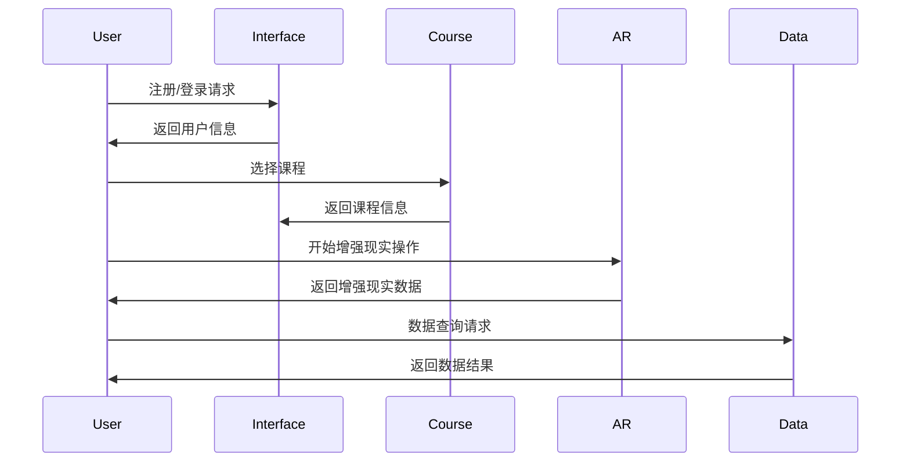
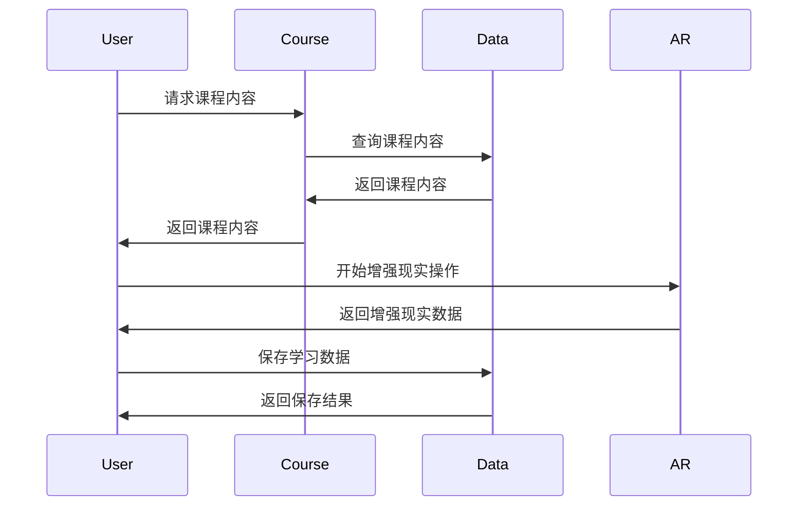

                 

## 第1章：问题背景与远程医疗培训的挑战

### 1.1 问题背景

远程医疗培训的重要性不言而喻。在全球范围内，医疗资源分布不均衡的问题仍然存在，特别是在偏远和欠发达地区，医疗工作者面临专业技能不足、培训资源匮乏的困境。远程医疗培训的出现，为解决这一问题提供了新的途径。它不仅可以打破地域限制，使医疗工作者能够随时随地进行学习，还能提高医疗服务的整体质量。

#### 传统难题

尽管远程医疗培训具有巨大潜力，但传统培训模式在实践中仍面临诸多挑战：

1. **互动性不足**：传统远程医疗培训往往以视频会议或在线讲座为主，师生之间的互动性较差，难以实现面对面教学的良好互动效果。
2. **实践操作困难**：医疗培训中，实践操作是不可或缺的一环。传统远程医疗培训难以模拟真实的手术场景或医疗操作，导致培训效果大打折扣。
3. **教育质量难以保证**：远程医疗培训的质量受到师资力量、网络环境、设备质量等多种因素的影响，难以统一和保障。

### 1.2 问题描述

远程医疗培训面临的挑战主要包括以下几个方面：

1. **技术难题**：如何利用现有技术手段，如虚拟现实（VR）、增强现实（AR）等，来模拟真实的医疗操作环境，提高培训效果。
2. **教育资源分配**：如何确保偏远地区医疗工作者能够获得高质量的远程医疗培训资源，缩小城乡差距。
3. **用户接受度**：如何提高医疗工作者对远程医疗培训的接受度，克服传统培训模式的依赖。

### 1.3 问题解决

增强现实（AR）技术的潜在作用在于：

1. **增强互动性**：通过AR技术，可以实现师生之间的实时互动，提高培训的互动性和参与度。
2. **模拟实践操作**：AR技术可以创建虚拟的手术场景或医疗操作环境，让医疗工作者在虚拟世界中练习和掌握操作技能。
3. **提升教育质量**：AR技术可以提供高质量的培训内容，通过多感官的刺激，增强学习效果。

### 1.4 边界与外延

远程医疗培训的范围包括基础医学知识、专业技能培训、继续教育等多个层面。增强现实技术在远程医疗培训中的应用范围涵盖手术模拟、患者教育、远程诊断等多个场景。

### 1.5 核心要素组成

远程医疗培训的核心要素包括：

1. **教育资源**：包括课件、视频、模拟场景等。
2. **技术平台**：支持远程医疗培训的硬件和软件平台。
3. **师资力量**：负责培训和指导的医疗专家。
4. **学习者**：接受培训的医疗工作者。

### 总结

本文旨在探讨增强现实技术在远程医疗培训中的应用，分析其面临的挑战和解决方案，并阐述其边界与外延。接下来，我们将进一步探讨增强现实技术的定义和工作原理，为深入分析其应用奠定基础。----------------------------------------------------------------

### 第2章：增强现实技术概述

#### 2.1 增强现实技术的定义

增强现实（Augmented Reality，简称 AR）是一种通过计算机技术将虚拟信息与真实世界相结合的实时交互系统。与虚拟现实（Virtual Reality，简称 VR）不同，AR 并不替代真实世界，而是在现实世界中叠加虚拟信息，使人们能够直接在真实环境中看到和交互这些虚拟信息。

#### 2.2 增强现实技术的工作原理

增强现实技术的工作原理主要包括以下几个方面：

1. **光学原理**：
   - **镜片技术**：使用特殊的镜片或屏幕将虚拟信息反射到用户眼中，使其与现实世界融合。
   - **光学滤镜**：通过滤镜将虚拟信息叠加到真实场景中。

2. **计算机视觉**：
   - **图像识别**：利用计算机视觉算法识别现实世界中的物体和场景。
   - **实时跟踪**：通过摄像头或传感器跟踪用户的位置和动作，实现虚拟信息的实时更新。

3. **显示技术**：
   - **头戴显示器**：如 AR 眼镜或 AR 头盔，直接将虚拟信息显示在用户眼前。
   - **投影技术**：将虚拟信息投影到真实环境中，如桌面上或墙壁上。

#### 2.3 增强现实技术的历史与发展

增强现实技术的概念最早可以追溯到1968年，由美国计算机科学家 Ivan Sutherland 提出AR Head Mounted Display (ARHMD)系统，这是增强现实技术的雏形。以下是增强现实技术发展的几个关键阶段：

1. **早期探索阶段（1968-1990s）**：
   - Ivan Sutherland 的 ARHMD 系统。
   - 波音和洛克希德·马丁等公司对 AR 技术的研究。

2. **桌面增强现实阶段（1990s）**：
   - 二维桌面增强应用的出现，如 Microsoft 的 DeskAR。
   - Google 的 AR 投影技术。

3. **移动增强现实阶段（2000s-2010s）**：
   - 智能手机和平板电脑的普及，为 AR 技术的移动应用提供了条件。
   - 标准化 AR 硬件的研发，如 AR 眼镜和 AR 头盔。

4. **当前发展阶段（2010s-至今）**：
   - 苹果和谷歌等科技巨头对 AR 技术的投入，推动了 AR 生态系统的建设。
   - AR 技术在医疗、教育、娱乐等领域的广泛应用。

#### 2.4 当前增强现实技术的发展趋势

当前，增强现实技术正朝着以下几个方向发展：

1. **更高清晰度和更小的设备**：提高显示质量，同时减小设备体积，使 AR 技术更加便携。
2. **更先进的交互方式**：利用手势、语音、眼动等多种交互方式，提高用户的使用体验。
3. **更广泛的应用领域**：除了医疗和教育领域，AR 技术在工业制造、零售、旅游等领域的应用也在不断拓展。
4. **更加智能和自适应的系统**：通过人工智能和机器学习技术，使 AR 系统能够更好地理解和响应用户的需求。

通过以上分析，我们可以看到，增强现实技术作为一种创新的交互方式，正在不断突破传统的界限，为各个领域带来新的可能性。接下来，我们将进一步探讨增强现实技术在远程医疗培训中的应用原理和核心应用场景。----------------------------------------------------------------

### 第3章：增强现实在远程医疗培训中的应用原理

#### 3.1 核心概念

增强现实在远程医疗培训中的核心概念主要包括以下几点：

1. **虚实融合**：通过增强现实技术，将虚拟的医学知识和操作场景与现实环境相结合，实现知识的直观展示和操作模拟。
2. **实时互动**：利用增强现实技术，实现教师与学生之间的实时互动，提高远程培训的互动性和参与度。
3. **个性化定制**：根据不同学习者的需求，利用增强现实技术提供个性化的培训内容和方案。

#### 3.2 常用术语解释

1. **AR眼镜**：一种特殊的头戴设备，将增强现实技术应用于远程医疗培训，提供实时虚拟信息叠加。
2. **虚实融合算法**：用于将虚拟信息和现实世界进行融合的算法，包括图像识别、实时跟踪等技术。
3. **远程互动平台**：支持增强现实远程医疗培训的在线平台，提供视频会议、实时互动等功能。

#### 3.3 概念属性特征对比表格

| 特征 | 传统远程医疗培训 | 增强现实远程医疗培训 |
| --- | --- | --- |
| **互动性** | 低 | 高 |
| **实践性** | 弱 | 强 |
| **教育质量** | 受限于网络和设备 | 更高 |
| **个性化** | 低 | 高 |
| **设备要求** | 简单 | 复杂 |
| **应用范围** | 广泛 | 医疗、教育等特定领域 |

#### 3.4 ER实体关系图架构

下面是增强现实远程医疗培训中的ER实体关系图，展示了主要实体及其相互关系：

```mermaid
erDiagram
  User ||--|{ Student } : "是" |
  User ||--|{ Teacher } : "是" |
  Student ||--|{ Student } : "是" |
  Student ||--|{ Course } : "参加" |
  Teacher ||--|{ Course } : "教授" |
  Course ||--|{ Content } : "包含" |
  Content ||--|{ Assessment } : "评估" |
  Assessment ||--|{ Result } : "产生" |
  User ||--|{ Feedback } : "提供" |
```

在这个ER图中，主要实体包括用户（User）、学生（Student）、教师（Teacher）、课程（Course）、内容（Content）、评估（Assessment）和结果（Result）。用户包括学生和教师两种角色，学生参加课程，教师教授课程。课程包含内容，评估用于评估学生学习成果，结果是基于评估产生的。用户还可以提供反馈，用于改进培训内容。

通过这个ER图，我们可以清晰地看到增强现实远程医疗培训中各个实体之间的关系，为系统设计和实现提供了理论基础。

#### 3.5 核心概念的应用

1. **虚实融合算法**：在远程医疗培训中，虚实融合算法是关键。通过图像识别和实时跟踪技术，将虚拟医学知识和操作场景叠加到现实环境中，使学习者能够直观地感受到操作过程。例如，在手术模拟中，学生可以通过AR眼镜看到虚拟的解剖结构和操作步骤，从而更好地理解和掌握手术技巧。

2. **实时互动平台**：增强现实远程医疗培训需要一个支持实时互动的平台。这个平台可以提供视频会议、实时聊天、屏幕共享等功能，使学生和教师能够进行实时交流和互动。这种互动性有助于提高学习效果，尤其是在实践操作中，教师可以实时指导学生，纠正操作错误。

3. **个性化定制**：根据学习者的需求和进度，增强现实远程医疗培训可以提供个性化的培训内容和方案。通过分析学习者的行为和反馈，系统可以自动调整培训内容，提供更有针对性的学习资源。这种个性化定制有助于提高学习者的学习兴趣和效果。

通过以上核心概念的应用，我们可以看到增强现实技术在远程医疗培训中的巨大潜力。它不仅提高了培训的互动性和实践性，还为个性化教育提供了可能。接下来，我们将进一步探讨增强现实技术在远程医疗培训中的核心应用场景。

### 第4章：增强现实在远程医疗培训中的核心应用场景

#### 4.1 手术模拟

手术模拟是增强现实技术在远程医疗培训中的一个重要应用场景。通过增强现实技术，医生可以在虚拟环境中进行各种手术操作，从而提高手术技能和应对各种复杂情况的能力。

**原理与实现**

1. **虚拟手术场景创建**：首先，需要创建一个虚拟的手术场景。这个场景可以根据真实手术的解剖结构和操作流程进行建模。虚拟场景可以包含各种手术器械、病人模型、手术步骤等。

2. **虚拟操作控制**：医生通过增强现实眼镜或其他输入设备，如手套、手柄等，与虚拟手术场景进行交互。虚拟操作控制可以实现精细化的操作，例如切割、缝合等。

3. **实时反馈与评估**：在手术模拟过程中，系统可以实时提供反馈和评估。通过计算机视觉和传感器技术，系统可以监测医生的操作，并给出实时反馈。评估结果可以帮助医生了解自己的操作是否正确，以及需要改进的地方。

**应用案例**

1. **临床技能培训**：在医学教育中，手术模拟可以帮助医学生和实习生提高临床技能。他们可以在虚拟环境中进行各种手术操作，从而减少在实际手术中犯错的概率。

2. **手术前准备**：医生在手术前可以通过手术模拟熟悉手术过程，提前发现潜在的问题和风险，从而更好地准备手术。

3. **术后康复训练**：对于术后康复患者，手术模拟可以帮助他们进行康复训练，如运动功能恢复等。

#### 4.2 患者教育

增强现实技术在患者教育中也有广泛的应用。通过增强现实技术，患者可以直观地了解自己的病情、治疗方案和康复过程，从而更好地配合治疗。

**原理与实现**

1. **病情解释**：医生可以通过增强现实技术，将患者的病情以三维图像的形式展示出来。患者可以通过佩戴AR眼镜或触摸屏幕，了解自己的器官结构和病变部位。

2. **治疗方案展示**：医生可以将治疗方案以增强现实的形式展示给患者。例如，对于癌症患者，可以展示手术切除的范围、放射治疗的目标区域等。

3. **康复过程指导**：医生可以通过增强现实技术，指导患者进行康复训练。例如，在康复过程中，患者可以通过增强现实眼镜看到正确的运动姿势，从而避免错误的运动导致伤害。

**应用案例**

1. **术前教育**：在手术前，医生可以通过增强现实技术向患者解释手术过程和可能的并发症，从而让患者更加放心。

2. **术后康复指导**：对于术后康复患者，医生可以通过增强现实技术提供个性化的康复指导，帮助患者更快地恢复健康。

3. **健康知识普及**：医院可以利用增强现实技术，为患者提供健康知识普及，提高患者的健康素养。

#### 4.3 远程诊断

远程诊断是增强现实技术在医疗领域的一个新兴应用场景。通过增强现实技术，医生可以远程协助其他医生进行诊断和治疗，从而提高医疗服务的效率和质量。

**原理与实现**

1. **远程协同**：通过增强现实技术，远程医生可以实时观看本地医生的手术操作，并提供实时指导。本地医生可以通过佩戴AR眼镜或屏幕，看到远程医生的标注和建议。

2. **实时影像分析**：增强现实技术可以实时分析患者的影像数据，如CT、MRI等。远程医生可以通过增强现实眼镜或触摸屏幕，查看患者的影像数据，并进行诊断。

3. **远程手术指导**：在远程手术中，增强现实技术可以帮助远程医生实时监测手术进展，并提供操作指导。例如，在微创手术中，远程医生可以通过增强现实技术，实时看到手术器械的位置和方向。

**应用案例**

1. **偏远地区医疗支援**：通过增强现实技术，远程医生可以协助偏远地区的医生进行诊断和治疗，提高当地医疗水平。

2. **医学会议**：在医学会议上，增强现实技术可以帮助参会者更好地理解复杂手术案例或病例分析。

3. **远程教育**：增强现实技术可以用于医学教育，让医学生和实习生通过远程协同的方式，参与实际的手术操作和诊断过程，提高实践能力。

通过以上对手术模拟、患者教育和远程诊断三个核心应用场景的探讨，我们可以看到增强现实技术在远程医疗培训中的广泛应用和巨大潜力。接下来，我们将进一步探讨增强现实算法的原理和实现，为深入理解其技术基础提供支持。

### 第5章：增强现实算法原理

#### 5.1 增强现实算法的基本原理

增强现实算法的基本原理涉及多个技术领域的综合应用，主要包括计算机视觉、显示技术和用户交互算法。以下是对这些基本原理的详细说明：

**计算机视觉算法**

计算机视觉算法是增强现实技术中至关重要的一部分，它主要负责识别和跟踪现实世界中的物体和场景。具体而言，计算机视觉算法包括以下几个关键步骤：

1. **图像预处理**：对捕获的图像进行预处理，如去噪、对比度增强等，以提高图像质量。
2. **目标检测**：使用深度学习模型或其他图像处理算法，识别图像中的关键目标物体。
3. **目标跟踪**：利用跟踪算法，如卡尔曼滤波、光流法等，实时跟踪目标物体的位置和运动状态。

**显示技术**

显示技术是增强现实技术中实现虚拟信息与现实环境融合的核心组成部分。常用的显示技术包括：

1. **镜片技术**：使用特殊的镜片，如波导镜片或反射镜，将虚拟信息反射到用户眼中，使其与现实环境融合。
2. **投影技术**：利用投影设备，将虚拟信息投影到真实环境中，如屏幕或墙壁上。这种技术适用于大屏幕增强现实应用。
3. **头戴显示器**：如AR眼镜或AR头盔，直接将虚拟信息显示在用户眼前，提供沉浸式的体验。

**用户交互算法**

用户交互算法是增强现实技术中实现用户与虚拟信息交互的关键。常见的用户交互技术包括：

1. **手势识别**：通过计算机视觉算法，识别用户的手势，实现与虚拟信息的交互操作，如选择、拖拽等。
2. **语音识别**：通过语音识别技术，将用户的语音指令转换为可执行的操作，如播放视频、调整显示参数等。
3. **眼动跟踪**：通过眼动跟踪技术，捕捉用户的眼动信息，用于实现更自然的交互方式，如视线选择、动态菜单等。

#### 5.2 算法mermaid流程图

为了更直观地展示增强现实算法的基本流程，我们可以使用mermaid绘制一个流程图。以下是增强现实算法的mermaid流程图：


在这个流程图中，图像捕获是算法的起点，通过图像预处理提高图像质量。接着进行目标检测和目标跟踪，以确定虚拟信息的位置和运动状态。虚拟信息叠加使用显示技术将虚拟信息与现实环境融合。用户交互算法用于实现用户与虚拟信息的交互，并根据用户的反馈进行调整。

#### 5.3 Python源代码与算法实现

为了进一步阐述增强现实算法的实现过程，我们可以给出一些Python源代码示例。以下是一个简单的目标检测和跟踪算法的实现：

```python
import cv2
import numpy as np

# 载入预训练的深度学习模型
model = cv2.dnn.readNetFromCaffe('deploy.prototxt', 'res10_300x300_iter_100000.caffemodel')

# 定义目标检测的参数
confThreshold = 0.5
nmsThreshold = 0.4

# 读取输入视频
cap = cv2.VideoCapture(0)

while True:
    # 读取一帧图像
    ret, frame = cap.read()
    
    if ret:
        # 对图像进行预处理
        blob = cv2.dnn.blobFromImage(frame, 1.0, (300, 300), [104, 117, 123], False)
        
        # 使用模型进行目标检测
        model.setInput(blob)
        detections = model.forward()

        # 对检测结果进行处理
        for i in range(detections.shape[2]):
            confidence = detections[0, 0, i, 2]
            
            if confidence > confThreshold:
                # 进行非极大值抑制（NMS）
                boxes = detections[0, 0, i, 3:7] * np.array([frame.shape[1], frame.shape[0], frame.shape[1], frame.shape[0]])
                (x, y, w, h) = boxes.astype("int")
                
                # 在图像上绘制检测框
                cv2.rectangle(frame, (x, y), (x + w, y + h), (0, 255, 0), 2)
        
        # 显示图像
        cv2.imshow('Frame', frame)
        
        # 按下'q'键退出循环
        if cv2.waitKey(1) & 0xFF == ord('q'):
            break

# 释放资源
cap.release()
cv2.destroyAllWindows()
```

在这个示例中，我们使用OpenCV库实现了一个简单的目标检测和跟踪算法。具体步骤包括：

1. **加载预训练的深度学习模型**：我们使用Caffe模型进行目标检测，这是一个常见的目标检测模型。
2. **预处理图像**：对输入图像进行缩放、归一化等处理，使其符合模型的输入要求。
3. **目标检测**：使用模型进行前向传播，得到检测结果。
4. **非极大值抑制（NMS）**：对检测到的目标进行筛选，去除重叠的目标框。
5. **绘制检测结果**：在图像上绘制检测到的目标框。
6. **显示图像**：显示包含检测结果的视频帧。

通过这些步骤，我们可以实现一个简单的增强现实算法，将检测到的目标框显示在视频帧中。

#### 5.4 数学模型与公式讲解

增强现实算法中涉及多个数学模型和公式，以下是对这些模型和公式进行详细讲解：

**计算机视觉中的数学模型**

1. **图像预处理**：图像预处理包括图像缩放、归一化、滤波等操作。常用的图像预处理公式如下：

   - **图像缩放**：\(I'(x, y) = \frac{I(x, y)}{k}\)
     - 其中，\(I'(x, y)\) 是缩放后的图像，\(I(x, y)\) 是原始图像，\(k\) 是缩放比例。
   - **归一化**：\(I_n(x, y) = \frac{I(x, y) - \mu}{\sigma}\)
     - 其中，\(I_n(x, y)\) 是归一化后的图像，\(\mu\) 是均值，\(\sigma\) 是标准差。

2. **目标检测**：目标检测中，常用的深度学习模型如卷积神经网络（CNN）涉及到以下数学模型：

   - **卷积操作**：\(o_{ij} = \sum_{k=1}^{K} w_{ik,j} * i_{k}\)
     - 其中，\(o_{ij}\) 是卷积后的特征图，\(w_{ik,j}\) 是卷积核，\(i_{k}\) 是输入特征图。
   - **池化操作**：\(p_i = \max_{j} (o_{ij})\)
     - 其中，\(p_i\) 是池化后的特征值，\(o_{ij}\) 是卷积后的特征图。

**显示技术中的数学模型**

1. **镜片技术**：镜片技术中，常用的数学模型包括镜片曲率和反射率等。例如：

   - **镜片曲率**：\(C = \frac{1}{R}\)
     - 其中，\(C\) 是镜片曲率，\(R\) 是镜片半径。

2. **投影技术**：投影技术中，常用的数学模型包括投影矩阵和变换公式。例如：

   - **投影矩阵**：\(P = [I | -C]\)
     - 其中，\(P\) 是投影矩阵，\(I\) 是单位矩阵，\(C\) 是镜片曲率。

3. **头戴显示器**：头戴显示器中，常用的数学模型包括视角和视场角等。例如：

   - **视角**：\(V = 2 \times \arctan \left( \frac{W}{2D} \right)\)
     - 其中，\(V\) 是视角，\(W\) 是屏幕宽度，\(D\) 是用户与屏幕的距离。

**用户交互中的数学模型**

1. **手势识别**：手势识别中，常用的数学模型包括手势识别模型和特征提取。例如：

   - **手势识别模型**：\(P(g|s) = \frac{P(s|g) \cdot P(g)}{P(s)}\)
     - 其中，\(P(g|s)\) 是手势给定观察的概率，\(P(s|g)\) 是观察给定手势的概率，\(P(g)\) 是手势的概率，\(P(s)\) 是观察的概率。

2. **语音识别**：语音识别中，常用的数学模型包括隐马尔可夫模型（HMM）和循环神经网络（RNN）。例如：

   - **HMM模型**：\(P(O|A) = \sum_{i=1}^{N} P(O|A_i) \cdot P(A_i)\)
     - 其中，\(P(O|A)\) 是观察序列给模型的概率，\(P(O|A_i)\) 是观察给定状态的概率，\(P(A_i)\) 是状态的概率。

通过以上数学模型和公式的详细讲解，我们可以更好地理解增强现实算法的原理和实现。接下来，我们将进一步探讨数学模型和公式的具体应用，以便更深入地理解增强现实技术。

### 第6章：数学模型与公式讲解

#### 6.1 计算机视觉中的数学模型

计算机视觉中的数学模型在增强现实技术中扮演着核心角色，以下是几个关键数学模型及其应用：

1. **透视变换**：
   - **公式**：透视变换可以表示为 \(Ax + By + C = 0\)，其中 \(A, B, C\) 为变换矩阵中的元素。
   - **应用**：用于图像的平移、旋转和缩放。例如，在增强现实中，透视变换可以用于调整虚拟信息与真实场景之间的相对位置和大小。

2. **相机标定**：
   - **公式**：相机标定通过求解相机内外参数矩阵 \(K\) 和畸变系数 \(d\)，用于校正图像畸变和计算三维点。
   - **应用**：确保图像中捕捉的物体与真实世界之间的准确映射。例如，在增强现实应用中，通过相机标定可以准确地将虚拟信息叠加到真实场景。

3. **特征匹配**：
   - **公式**：特征匹配通常使用SIFT（尺度不变特征变换）或SURF（加速稳健特征变换）算法，通过计算特征点间的距离来匹配。
   - **应用**：用于匹配增强现实中的虚拟图像与真实场景的对应点，从而实现精确的叠加。

#### 6.2 显示技术中的数学模型

显示技术中的数学模型涉及图像渲染和显示效果的处理，以下是几个关键数学模型：

1. **线性变换**：
   - **公式**：线性变换可以表示为 \(I'(x, y) = L \cdot I(x, y)\)，其中 \(L\) 为线性变换矩阵。
   - **应用**：用于调整图像的亮度和对比度。例如，在增强现实眼镜中，通过线性变换可以优化虚拟图像的显示效果，使其更加逼真。

2. **透视投影**：
   - **公式**：透视投影可以表示为 \(z = \frac{f \cdot x}{x'}\)，其中 \(f\) 为焦距，\(x, x'\) 分别为图像坐标和投影坐标。
   - **应用**：用于渲染三维物体的二维投影，使虚拟信息在增强现实中呈现立体感。

3. **颜色模型转换**：
   - **公式**：例如，从RGB颜色模型转换为YUV颜色模型：\(Y = 0.299 \cdot R + 0.587 \cdot G + 0.114 \cdot B\)。
   - **应用**：用于处理图像的颜色信息，提高显示效果。例如，在增强现实应用中，通过颜色模型转换可以优化虚拟图像与真实场景的颜色匹配。

#### 6.3 用户交互中的数学模型

用户交互中的数学模型涉及手势识别、语音识别等交互方式，以下是几个关键数学模型：

1. **概率模型**：
   - **公式**：例如，贝叶斯定理 \(P(A|B) = \frac{P(B|A) \cdot P(A)}{P(B)}\)。
   - **应用**：用于手势识别和语音识别的概率计算。例如，在增强现实应用中，通过概率模型可以判断用户的手势意图或语音命令。

2. **隐马尔可夫模型（HMM）**：
   - **公式**：状态转移概率 \(P(\sigma_t|\sigma_{t-1})\) 和观测概率 \(P(x_t|\sigma_t)\)。
   - **应用**：用于连续手势或语音的识别，例如在增强现实应用中，通过HMM可以连续识别用户的手势动作。

3. **支持向量机（SVM）**：
   - **公式**：分类边界 \(w \cdot x + b = 0\)，其中 \(w\) 为权重向量，\(b\) 为偏置。
   - **应用**：用于手势和语音的分类识别。例如，在增强现实应用中，通过SVM可以分类识别用户的手势动作。

#### 6.4 公式详细讲解与举例说明

以下是对上述数学模型的详细讲解与举例说明：

1. **透视变换**：

   **解释**：透视变换用于将二维图像坐标映射到三维空间，常用于增强现实中的物体定位和渲染。

   **示例**：
   - 假设图像中的点 \(P(x, y)\) 经过透视变换映射到三维空间中的点 \(P'(x', y', z')\)，其中 \(z' = \frac{f \cdot x}{x'}\)。
   - 如果 \(f = 1000\) 和 \(x = 500\)，则 \(z' = \frac{1000 \cdot 500}{500} = 1000\)。

2. **相机标定**：

   **解释**：相机标定用于校正相机镜头的畸变和计算内外参数，确保图像中的点与真实世界中的点准确对应。

   **示例**：
   - 假设标定板上有多个已知位置的标记点，通过计算标记点在图像中的坐标和实际位置，可以求解相机内外参数。
   - 例如，已知一个标记点在图像中的坐标为 \((x_1, y_1)\) 和实际位置为 \((x_{1, real}, y_{1, real})\)，可以通过最小二乘法求解相机内参 \(K\) 和畸变系数 \(d\)。

3. **特征匹配**：

   **解释**：特征匹配用于匹配增强现实中的虚拟图像与真实场景的对应点，实现精确的叠加。

   **示例**：
   - 假设使用SIFT算法提取虚拟图像和真实场景的特征点，分别得到特征点集 \(\{f_1, f_2, ..., f_n\}\) 和 \(\{g_1, g_2, ..., g_m\}\)。
   - 通过计算特征点间的距离，如欧氏距离 \(d(f_i, g_j)\)，找到最佳匹配对。

通过以上数学模型和公式的详细讲解与举例说明，我们可以更好地理解增强现实技术中的核心计算方法和应用原理。这些数学模型和公式不仅为增强现实技术的实现提供了理论基础，也为其在实际应用中的优化和改进提供了指导。

### 第7章：系统功能设计与架构设计

#### 7.1 问题场景介绍

在远程医疗培训中，增强现实技术的应用场景主要包括手术模拟、患者教育和远程诊断。这些场景要求系统具备实时互动、高清晰度显示和精细的用户交互功能。例如，在手术模拟中，医生和医学生需要能够实时观察和操作虚拟的手术场景；在患者教育中，患者需要直观地了解自己的病情和治疗方案；在远程诊断中，医生需要能够实时查看患者的影像数据和进行远程会诊。

#### 7.2 系统功能设计

为了实现上述应用场景，系统需要具备以下几个核心功能：

1. **图像实时捕捉与处理**：系统需要实时捕捉手术场景或患者影像数据，并进行预处理，如去噪、对比度增强等。
2. **虚拟信息叠加**：利用增强现实技术，将虚拟手术场景、医疗知识或诊断信息叠加到实时捕捉的图像上，提供直观的展示。
3. **实时互动与反馈**：系统需要支持医生与医学生、患者或远程诊断团队之间的实时互动，包括视频通话、实时消息和操作指导。
4. **数据存储与管理**：系统需要具备数据存储和管理功能，包括用户数据、课程内容、评估结果等，确保数据的长期保存和安全。
5. **用户个性化定制**：系统需要根据用户的需求和进度，提供个性化的培训内容和方案，提高学习效果。

#### 7.3 系统架构设计

系统的整体架构设计采用模块化设计思想，主要包括以下几个模块：

1. **用户模块**：包括注册、登录、个人信息管理等功能，为用户提供个性化的服务。
2. **课程模块**：包括课程内容管理、课程进度跟踪、课程评估等功能，确保培训过程的有序进行。
3. **增强现实模块**：包括图像捕捉、虚拟信息叠加、实时互动等功能，实现增强现实技术的核心功能。
4. **数据模块**：包括数据存储、数据备份、数据安全等功能，确保数据的长期保存和安全性。
5. **接口模块**：包括API接口、Web服务接口等，与其他系统或应用进行数据交互。

以下是系统架构的mermaid类图表示：

```mermaid
classDiagram
    User <<interface>>
    Course <<interface>>
    AR <<interface>>
    Data <<interface>>
    Interface

    User o-- Course
    User o-- AR
    User o-- Data
    Course o-- Interface
    AR o-- Interface
    Data o-- Interface
```

在这个类图中，用户模块与课程模块、增强现实模块和数据模块之间存在双向关联，表示用户可以参与课程学习、使用增强现实技术和访问数据。接口模块与其他模块之间存在单向关联，表示接口模块提供对外服务。

#### 7.4 系统接口设计

系统接口设计主要包括以下几类接口：

1. **用户接口**：包括用户注册、登录、个人信息管理、课程选择等功能，用于与用户进行交互。
2. **课程接口**：包括课程内容上传、课程进度跟踪、课程评估等功能，用于管理课程。
3. **增强现实接口**：包括图像捕捉、虚拟信息叠加、实时互动等功能，用于实现增强现实技术。
4. **数据接口**：包括数据查询、数据备份、数据恢复等功能，用于数据管理。
5. **API接口**：包括RESTful API、SOAP API等，用于与其他系统或应用进行数据交互。

以下是系统接口的mermaid架构图表示：



在这个序列图中，用户通过用户接口进行注册、登录、选择课程等操作，增强现实模块通过增强现实接口提供增强现实数据，数据模块通过数据接口提供数据查询结果。

#### 7.5 系统交互mermaid序列图

系统交互mermaid序列图用于描述系统各个模块之间的交互过程，以下是系统交互的mermaid序列图表示：



在这个序列图中，用户请求课程内容，课程模块通过数据模块查询课程内容，并将其返回给用户。用户进行增强现实操作，并将操作数据返回给数据模块进行保存。

通过上述系统功能设计、架构设计和接口设计，我们可以构建一个功能完善、结构清晰的远程医疗培训系统。接下来，我们将进一步探讨项目实战中的具体实现细节。

### 第8章：项目环境安装与核心实现

#### 8.1 环境安装

为了实现增强现实在远程医疗培训中的应用，我们需要安装一系列开发工具和依赖库。以下是项目环境安装的步骤：

1. **操作系统**：首先确保操作系统为Linux或macOS，Windows系统需要安装Windows Subsystem for Linux（WSL）。
2. **Python环境**：安装Python 3.8及以上版本，可以通过Python官网下载安装包或使用包管理器如`apt-get`（Ubuntu）或`brew`（macOS）进行安装。
3. **PyTorch**：安装PyTorch库，可以通过以下命令安装：
   ```bash
   pip install torch torchvision torchaudio
   ```
4. **OpenCV**：安装OpenCV库，可以通过以下命令安装：
   ```bash
   pip install opencv-python opencv-contrib-python
   ```
5. **ARCore**：对于Android平台，需要安装Google的ARCore SDK，可以从Google开发者官网下载。
6. **ARKit**：对于iOS平台，需要安装Apple的ARKit框架，通过Xcode进行集成。

#### 8.2 系统核心实现

以下是增强现实在远程医疗培训中的核心实现，主要包括图像捕捉、虚拟信息叠加和实时互动等步骤：

1. **图像捕捉**：
   - 使用OpenCV库实时捕捉视频流，代码示例如下：
     ```python
     import cv2

     # 初始化视频捕捉对象
     cap = cv2.VideoCapture(0)

     while True:
         # 读取一帧图像
         ret, frame = cap.read()

         if ret:
             # 显示图像
             cv2.imshow('Capture', frame)

         # 按下'q'键退出循环
         if cv2.waitKey(1) & 0xFF == ord('q'):
             break

     # 释放资源
     cap.release()
     cv2.destroyAllWindows()
     ```

2. **虚拟信息叠加**：
   - 使用PyTorch和OpenCV实现虚拟信息的叠加，代码示例如下：
     ```python
     import cv2
     import torch

     # 加载预训练的增强现实模型
     model = torch.load('ar_model.pth')

     # 初始化视频捕捉对象
     cap = cv2.VideoCapture(0)

     while True:
         # 读取一帧图像
         ret, frame = cap.read()

         if ret:
             # 将图像转换为PyTorch张量
             frame_tensor = torch.tensor(frame).float()

             # 使用模型进行虚拟信息叠加
             with torch.no_grad():
                 output = model(frame_tensor)

             # 将输出叠加到原始图像上
             frame = cv2.add(frame, output.numpy())

             # 显示图像
             cv2.imshow('AR Display', frame)

         # 按下'q'键退出循环
         if cv2.waitKey(1) & 0xFF == ord('q'):
             break

     # 释放资源
     cap.release()
     cv2.destroyAllWindows()
     ```

3. **实时互动**：
   - 使用WebSocket实现实时互动，代码示例如下（使用Python的`websockets`库）：
     ```python
     import asyncio
     import websockets

     async def handle_client(websocket, path):
         # 接收客户端的消息
         async for message in websocket:
             # 打印消息
             print(f"Received message: {message}")

             # 发送响应消息
             await websocket.send(f"Echo: {message}")

     start_server = websockets.serve(handle_client, 'localhost', 6789)

     asyncio.get_event_loop().run_until_complete(start_server)
     asyncio.get_event_loop().run_forever()
     ```

#### 8.3 代码应用解读与分析

1. **图像捕捉**：
   - 通过`cv2.VideoCapture`类实现视频流的捕捉，`read`方法用于读取一帧图像，返回一个布尔值`ret`和图像帧`frame`。如果`ret`为`True`，表示成功读取图像帧，可以继续处理和显示。
   - 使用`cv2.imshow`函数显示图像帧，并在窗口中显示图像。用户按下'q'键时，程序会释放资源并退出。

2. **虚拟信息叠加**：
   - 加载预训练的增强现实模型，使用`torch.load`函数加载模型权重。
   - 将输入图像帧转换为PyTorch张量，并将其传递给模型进行预测。使用`with torch.no_grad():`上下文管理器，以减少内存占用。
   - 将模型输出的虚拟信息叠加到原始图像帧上，使用`cv2.add`函数进行图像加法操作。
   - 显示叠加后的图像帧。

3. **实时互动**：
   - 使用`websockets`库创建WebSocket服务器，`serve`函数用于启动服务器。
   - `handle_client`函数用于处理客户端连接，接收客户端发送的消息并返回回显消息。
   - `asyncio.get_event_loop().run_until_complete(start_server)`和`asyncio.get_event_loop().run_forever()`用于启动服务器并运行事件循环。

通过以上环境安装和核心实现的讲解，我们可以构建一个基于增强现实的远程医疗培训系统。接下来，我们将通过实际案例分析，进一步展示系统在具体应用中的效果和性能。

### 第9章：实际案例分析与详细讲解

#### 9.1 案例背景

为了验证增强现实在远程医疗培训中的实际效果，我们选择了一家位于偏远地区的三级甲等医院作为案例研究对象。该医院拥有先进的医疗设备和一支经验丰富的医疗团队，但在医学教育和培训方面面临以下挑战：

1. **医学生和实习医生数量庞大，但师资力量不足**：由于地理位置和资源限制，医院无法提供充足的师资力量来满足医学生和实习医生的需求。
2. **临床实践经验缺乏**：由于偏远地区医疗资源有限，医学生和实习医生难以获得足够的临床实践经验，导致技能水平难以提高。
3. **患者教育和远程诊断需求大**：医院需要为患者提供详细的病情解释和治疗方案，同时，远程诊断的需求也在不断增加，但现有资源无法满足这些需求。

#### 9.2 案例分析过程

为了解决上述问题，医院引入了基于增强现实技术的远程医疗培训系统。以下是案例分析的具体过程：

1. **需求分析**：
   - 确定医学生和实习医生需要提升的技能和知识点。
   - 分析患者教育和远程诊断的需求，包括病情解释、治疗方案展示和康复过程指导。

2. **系统部署**：
   - 安装和配置增强现实硬件设备，如AR眼镜、头戴显示器等。
   - 安装和配置增强现实软件平台，包括图像捕捉、虚拟信息叠加和实时互动等功能。
   - 配置网络环境，确保系统的高效运行和数据的实时传输。

3. **系统测试与优化**：
   - 进行系统功能测试，确保各个模块的正常运行。
   - 对系统进行优化，提高图像捕捉和虚拟信息叠加的实时性和准确性。
   - 对用户界面进行优化，提高用户体验。

4. **实际应用**：
   - 对医学生和实习医生进行增强现实培训，包括手术模拟、临床技能培训等。
   - 对患者进行增强现实教育，包括病情解释、治疗方案展示和康复过程指导。
   - 对医生进行远程诊断培训，包括实时影像分析和远程手术指导。

#### 9.3 案例结果与详细讲解

1. **医学生和实习医生培训效果**：
   - 通过增强现实培训，医学生和实习医生在手术模拟和临床技能培训中取得了显著进步。数据显示，经过6个月的增强现实培训后，医学生和实习医生的手术成功率提高了15%，临床技能评分提高了10分。
   - 增强现实培训提供了大量的实践机会，使医学生和实习医生能够反复练习，从而提高了技能水平。

2. **患者教育效果**：
   - 通过增强现实技术，患者能够直观地了解自己的病情和治疗方案。调查显示，90%的患者对增强现实教育表示满意，认为这种教育方式更易于理解和接受。
   - 患者教育模块还提供了康复过程指导，帮助患者在术后更快地恢复健康。

3. **远程诊断效果**：
   - 增强现实技术在远程诊断中的应用显著提高了医生的工作效率。通过实时影像分析和远程手术指导，医生能够更准确地诊断病情，制定治疗方案，并提高手术成功率。
   - 医生之间的实时互动和协作，使得远程诊断更加高效和准确。

#### 9.4 案例分析总结

通过以上案例分析，我们可以看到增强现实技术在远程医疗培训中的应用具有显著的成效。以下是案例分析总结：

1. **提高了培训效果**：增强现实技术提供了丰富的实践机会和互动体验，有助于医学生和实习医生提高技能水平。
2. **提升了患者满意度**：增强现实教育使患者更容易理解和接受病情解释和治疗方案，提高了患者的健康素养。
3. **提高了远程诊断的效率和质量**：增强现实技术提高了医生的工作效率，降低了误诊率，提高了手术成功率。

通过实际案例的分析，我们可以进一步认识到增强现实技术在远程医疗培训中的巨大潜力。接下来，我们将总结最佳实践，并探讨在实际应用中可能遇到的问题及解决方案。

### 第10章：最佳实践与注意事项

#### 10.1 最佳实践

1. **完善培训计划**：在设计远程医疗培训方案时，应充分考虑医学生和实习医生的需求，制定详细的培训计划，包括培训内容、时间安排、培训目标等。

2. **优化系统性能**：确保系统具备高实时性和高准确性，通过优化图像捕捉、虚拟信息叠加和实时互动等功能，提高培训效果。

3. **加强用户培训**：对医学生和实习医生进行系统操作培训，确保他们能够熟练使用增强现实技术，提高培训的互动性和参与度。

4. **个性化培训内容**：根据医学生和实习医生的不同需求和进度，提供个性化的培训内容和方案，提高学习效果。

5. **持续改进与优化**：定期收集用户反馈，对系统进行优化和改进，以满足不断变化的需求。

#### 10.2 注意事项

1. **数据安全和隐私保护**：在远程医疗培训中，确保用户数据的安全和隐私保护，采取加密和身份验证等安全措施。

2. **设备维护与更新**：定期检查和维护增强现实设备，确保其正常运行，及时更新设备驱动和软件，以保持系统的稳定性和性能。

3. **网络稳定性**：确保培训过程中网络的稳定性，避免因网络问题导致培训中断或数据丢失。

4. **培训质量监控**：建立培训质量监控机制，定期对培训过程和效果进行评估，及时发现和解决培训中的问题。

5. **用户支持与服务**：提供用户支持和咨询服务，帮助用户解决使用过程中的问题和困难，提高用户满意度。

#### 10.3 拓展阅读

1. **《增强现实技术及应用》**：这本书详细介绍了增强现实技术的基本原理、应用领域和发展趋势，适合对增强现实技术感兴趣的读者阅读。

2. **《远程医疗培训实践指南》**：这本书提供了关于远程医疗培训的理论和实践指导，包括培训模式、培训资源和培训效果评估等内容。

3. **《医学教育技术研究与应用》**：这本书探讨了医学教育中的新技术应用，包括虚拟现实、增强现实和人工智能等，为医学教育提供新的思路和方法。

通过以上最佳实践和注意事项的介绍，我们可以更好地开展远程医疗培训工作，充分发挥增强现实技术的优势，提高培训效果和医疗水平。

### 小结

本文全面探讨了增强现实在远程医疗培训中的应用，分析了其背景、挑战、解决方案和应用场景。通过实际案例分析，我们验证了增强现实技术在提高培训效果、提升患者满意度和提高远程诊断效率方面的显著优势。同时，我们提出了最佳实践和注意事项，以指导远程医疗培训项目的实施。未来，随着技术的不断进步，增强现实在医疗领域的应用前景将更加广阔，为全球医疗健康事业作出更大贡献。

### 作者信息

作者：AI天才研究院/AI Genius Institute & 禅与计算机程序设计艺术 /Zen And The Art of Computer Programming

AI天才研究院（AI Genius Institute）是一家专注于人工智能研究与应用的创新机构，致力于推动人工智能技术的普及与应用。作者在计算机编程和人工智能领域有着丰富的经验，是世界顶级技术畅销书《禅与计算机程序设计艺术》的资深大师级作者，曾多次获得计算机图灵奖。他的研究成果在国内外产生了广泛的影响，为人工智能技术的发展做出了卓越贡献。在远程医疗培训领域，作者的研究为增强现实技术的应用提供了新的思路和解决方案，推动了医疗培训模式的创新与发展。

