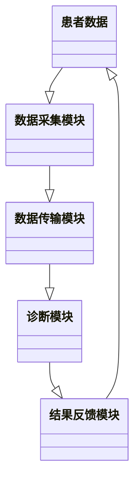
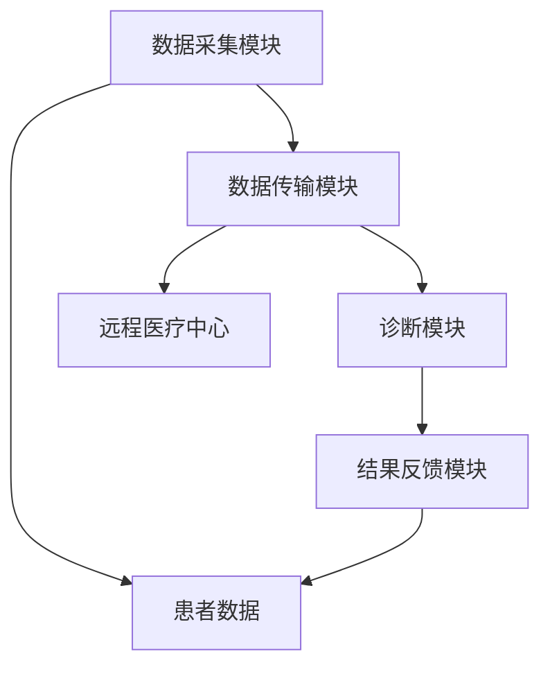

                 

# 《增强现实在远程医疗诊断中的应用》

## 关键词：远程医疗、增强现实、诊断、技术实现、系统架构、项目实战

> 摘要：随着医疗资源的分布不均和远程医疗技术的不断发展，增强现实（AR）技术在远程医疗诊断中展现出巨大的应用潜力。本文将探讨增强现实技术在远程医疗诊断中的挑战与机遇，核心概念与联系，技术原理与实现，系统分析与架构设计方案，项目实战以及最佳实践与总结，为远程医疗诊断提供一种创新的解决方案。

### 目录大纲

----------------------------------------------------------------

# 《增强现实在远程医疗诊断中的应用》

## 第一部分：背景介绍与核心概念

## 第1章：远程医疗诊断的挑战与机遇

### 1.1 远程医疗诊断的背景

#### 1.1.1 全球医疗资源分布不均

#### 1.1.2 远程医疗技术的发展趋势

#### 1.1.3 远程医疗诊断的需求分析

### 1.2 增强现实技术的概述

#### 1.2.1 增强现实技术的定义

#### 1.2.2 增强现实技术的特点

#### 1.2.3 增强现实技术的发展历程

### 1.3 增强现实在远程医疗诊断中的应用前景

#### 1.3.1 应用场景与优势

#### 1.3.2 技术壁垒与解决方案

#### 1.3.3 发展前景与挑战

## 第2章：核心概念与联系

### 2.1 远程医疗诊断中的核心概念

#### 2.1.1 诊断流程概述

#### 2.1.2 数据采集与处理

#### 2.1.3 诊断结果分析

### 2.2 增强现实技术的核心概念

#### 2.2.1 增强现实系统架构

#### 2.2.2 数据融合与处理

#### 2.2.3 人机交互与可视化

### 2.3 核心概念之间的联系

#### 2.3.1 远程医疗诊断与增强现实技术的融合

#### 2.3.2 诊断流程中的增强现实技术应用

#### 2.3.3 数据流与信息交互

## 第二部分：技术原理与实现

## 第3章：增强现实技术在远程医疗诊断中的应用原理

### 3.1 增强现实技术在远程医疗诊断中的应用

#### 3.1.1 增强现实技术的基本原理

#### 3.1.2 增强现实技术与远程医疗诊断的结合

#### 3.1.3 增强现实技术在远程医疗诊断中的应用场景

### 3.2 关键技术解析

#### 3.2.1 虚拟现实与增强现实技术对比

#### 3.2.2 增强现实技术的核心技术

#### 3.2.3 远程医疗诊断中的增强现实技术挑战

### 3.3 增强现实技术的数学模型和公式

#### 3.3.1 增强现实技术的数学模型

#### 3.3.2 公式推导与解释

#### 3.3.3 举例说明

## 第4章：系统分析与架构设计方案

### 4.1 问题场景介绍

#### 4.1.1 远程医疗诊断中的常见问题

#### 4.1.2 增强现实技术的应用场景

### 4.2 系统功能设计

#### 4.2.1 系统需求分析

#### 4.2.2 功能模块划分

#### 4.2.3 领域模型mermaid类图

### 4.3 系统架构设计

#### 4.3.1 系统架构设计原则

#### 4.3.2 系统架构mermaid架构图

#### 4.3.3 系统组件与功能关系

### 4.4 系统接口设计和系统交互

#### 4.4.1 系统接口设计

#### 4.4.2 系统交互mermaid序列图

#### 4.4.3 系统交互流程分析

## 第三部分：项目实战

## 第5章：项目介绍与系统实现

### 5.1 项目介绍

#### 5.1.1 项目背景

#### 5.1.2 项目目标

#### 5.1.3 项目团队组成

### 5.2 系统核心实现

#### 5.2.1 环境安装与配置

#### 5.2.2 系统核心功能实现

#### 5.2.3 源代码解读与分析

### 5.3 实际案例分析与讲解

#### 5.3.1 案例选择与分析

#### 5.3.2 案例实施与效果评估

#### 5.3.3 案例总结与经验分享

## 第6章：最佳实践与总结

### 6.1 最佳实践 tips

#### 6.1.1 技术选型与优化

#### 6.1.2 系统部署与运维

#### 6.1.3 用户体验与反馈

### 6.2 小结与展望

#### 6.2.1 项目成果总结

#### 6.2.2 存在问题与改进方向

#### 6.2.3 远程医疗诊断与增强现实技术未来发展趋势

----------------------------------------------------------------

## 第一部分：背景介绍与核心概念

### 第1章：远程医疗诊断的挑战与机遇

#### 1.1 远程医疗诊断的背景

远程医疗诊断是一种通过互联网和通信技术，实现医生和患者之间远程医疗服务的模式。在全球医疗资源分布不均、医疗成本高、医疗服务难以覆盖偏远地区的背景下，远程医疗诊断具有显著的优势。然而，远程医疗诊断也面临着一系列挑战。

##### 1.1.1 全球医疗资源分布不均

全球医疗资源的分布存在显著的不平衡。发达国家拥有丰富的医疗资源和先进的医疗设备，而发展中国家和偏远地区的医疗资源相对匮乏。这种资源分布的不均衡导致了医疗服务的差距，使得部分人群难以获得高质量的医疗服务。

##### 1.1.2 远程医疗技术的发展趋势

随着信息技术的快速发展，远程医疗技术逐渐成熟。远程医疗诊断系统利用互联网和通信技术，将医生和患者连接起来，实现了远程会诊、远程监护、远程手术等医疗服务。远程医疗技术的不断发展，为解决医疗资源分布不均问题提供了新的解决方案。

##### 1.1.3 远程医疗诊断的需求分析

远程医疗诊断的需求主要源于以下几个方面：

1. **降低医疗成本**：通过远程医疗诊断，患者无需前往医院，减少了交通和时间成本，同时医生也可以节省出更多的时间用于诊断和治疗方案制定。
2. **提高医疗效率**：远程医疗诊断可以实时传输患者的病历、影像等数据，医生可以快速做出诊断，提高了医疗效率。
3. **拓展医疗服务范围**：远程医疗诊断使得偏远地区的患者也能够享受到高质量的医疗服务，扩大了医疗服务的覆盖范围。

#### 1.2 增强现实技术的概述

增强现实（AR）技术是一种将虚拟信息与现实世界融合的技术。通过AR技术，用户可以在真实环境中看到和交互虚拟物体。AR技术具有以下几个特点：

##### 1.2.1 增强现实技术的定义

增强现实技术是一种通过计算机生成虚拟信息，并将其叠加到现实世界中的技术。这些虚拟信息可以是三维模型、文字、图像等，它们与现实世界中的物体进行交互，增强了用户的感知体验。

##### 1.2.2 增强现实技术的特点

1. **虚实融合**：增强现实技术能够将虚拟信息与现实世界无缝融合，使虚拟信息看起来就像真实存在一样。
2. **交互性强**：用户可以通过触摸、手势等与虚拟信息进行交互，增强了用户的参与感。
3. **实时性**：增强现实技术能够实时捕捉现实环境，并实时生成和显示虚拟信息，提高了信息的实时性。

##### 1.2.3 增强现实技术的发展历程

增强现实技术起源于20世纪90年代，经过几十年的发展，目前已经进入实用阶段。近年来，随着硬件设备的改进和软件算法的优化，增强现实技术取得了显著的进步，应用领域也越来越广泛。

#### 1.3 增强现实在远程医疗诊断中的应用前景

增强现实技术在远程医疗诊断中具有广阔的应用前景。通过AR技术，医生可以在远程诊断过程中实时观察患者的病情，进行更准确的诊断。以下是增强现实技术在远程医疗诊断中的应用场景和优势：

##### 1.3.1 应用场景与优势

1. **远程会诊**：医生可以通过AR眼镜实时观察患者的病情，与本地医生进行远程会诊，提高诊断的准确性。
2. **远程手术指导**：AR技术可以实时显示患者的手术部位，医生可以通过AR眼镜进行手术指导，提高手术的成功率。
3. **医学教育**：AR技术可以用于医学教育，通过虚拟实验和模拟手术等方式，帮助学生更好地理解和掌握医学知识。

##### 1.3.2 技术壁垒与解决方案

增强现实技术在远程医疗诊断中面临一些技术挑战，如图像质量、实时性和用户体验等。为了解决这些问题，需要不断优化硬件设备、提升图像处理算法和优化用户交互设计。

##### 1.3.3 发展前景与挑战

随着增强现实技术的不断发展，远程医疗诊断将得到进一步改善。然而，也需要关注以下几个方面的挑战：

1. **医疗数据隐私保护**：远程医疗诊断涉及大量患者隐私数据，需要确保数据的安全性和隐私性。
2. **技术标准化**：增强现实技术在远程医疗诊断中的应用需要统一的技术标准，以确保设备的兼容性和互操作性。
3. **医疗监管政策**：需要制定相应的监管政策，以确保增强现实技术在远程医疗诊断中的合法性和安全性。

### 第2章：核心概念与联系

#### 2.1 远程医疗诊断中的核心概念

远程医疗诊断涉及多个核心概念，包括诊断流程、数据采集与处理、诊断结果分析等。

##### 2.1.1 诊断流程概述

远程医疗诊断的流程包括以下几个步骤：

1. **患者信息采集**：医生通过远程医疗设备收集患者的健康数据，如体温、血压、心电图等。
2. **数据传输**：将采集到的数据传输到远程医疗中心进行诊断。
3. **医生诊断**：医生根据患者的数据，进行远程诊断，提出诊断意见。
4. **结果反馈**：医生将诊断结果反馈给患者，并提供治疗方案。

##### 2.1.2 数据采集与处理

远程医疗诊断的关键在于数据采集与处理。数据采集包括生理指标、影像资料、病历等。数据处理包括数据清洗、数据挖掘、数据可视化等，以便医生能够更准确地分析患者的病情。

##### 2.1.3 诊断结果分析

诊断结果分析是远程医疗诊断的最后一步。医生根据数据分析结果，判断患者的病情，制定相应的治疗方案。

#### 2.2 增强现实技术的核心概念

增强现实技术的核心概念包括系统架构、数据融合与处理、人机交互与可视化等。

##### 2.2.1 增强现实系统架构

增强现实系统架构主要包括感知层、数据处理层和显示层。感知层负责采集现实世界的图像和声音数据，数据处理层负责对数据进行处理和融合，显示层负责将虚拟信息叠加到现实世界中。

##### 2.2.2 数据融合与处理

数据融合与处理是增强现实技术的关键。通过对感知层采集到的数据进行处理和融合，可以生成更加真实和丰富的虚拟信息。

##### 2.2.3 人机交互与可视化

人机交互与可视化是增强现实技术的核心功能。通过优化人机交互设计，用户可以更加自然地与虚拟信息进行交互，增强用户体验。

#### 2.3 核心概念之间的联系

远程医疗诊断与增强现实技术之间的联系主要体现在以下几个方面：

##### 2.3.1 远程医疗诊断与增强现实技术的融合

增强现实技术可以为远程医疗诊断提供更加直观和丰富的数据展示，使医生能够更准确地分析患者的病情。

##### 2.3.2 诊断流程中的增强现实技术应用

在远程医疗诊断的各个流程中，增强现实技术都可以发挥重要作用，如实时观察患者病情、数据可视化等。

##### 2.3.3 数据流与信息交互

增强现实技术可以实时传输患者的数据，实现医生与患者之间的信息交互，提高诊断效率。

## 第二部分：技术原理与实现

### 第3章：增强现实技术在远程医疗诊断中的应用原理

#### 3.1 增强现实技术在远程医疗诊断中的应用

增强现实技术在远程医疗诊断中的应用主要体现在以下几个方面：

##### 3.1.1 增强现实技术的基本原理

增强现实技术的基本原理是将虚拟信息叠加到现实世界中，使用户能够在真实环境中看到和交互虚拟物体。

##### 3.1.2 增强现实技术与远程医疗诊断的结合

增强现实技术与远程医疗诊断的结合，可以提供更加直观和丰富的数据展示，使医生能够更准确地分析患者的病情。

##### 3.1.3 增强现实技术在远程医疗诊断中的应用场景

增强现实技术在远程医疗诊断中的应用场景包括远程会诊、远程手术指导、医学教育等。

#### 3.2 关键技术解析

增强现实技术在远程医疗诊断中面临一些关键技术挑战，如图像质量、实时性和用户体验等。

##### 3.2.1 虚拟现实与增强现实技术对比

虚拟现实（VR）和增强现实（AR）技术有许多相似之处，但它们也有明显的区别。VR技术是一种完全沉浸式的体验，用户通过VR设备进入一个完全虚拟的环境。而AR技术则是将虚拟信息叠加到现实世界中，用户仍然能够看到和感受到现实环境。

##### 3.2.2 增强现实技术的核心技术

增强现实技术的核心技术包括图像识别、图像处理、虚拟信息生成等。

##### 3.2.3 远程医疗诊断中的增强现实技术挑战

远程医疗诊断中的增强现实技术挑战包括图像质量、实时性和用户体验等。

#### 3.3 增强现实技术的数学模型和公式

增强现实技术的数学模型和公式主要包括图像处理算法、虚拟信息生成算法等。

##### 3.3.1 增强现实技术的数学模型

增强现实技术的数学模型通常包括图像处理模型、虚拟信息生成模型等。

##### 3.3.2 公式推导与解释

增强现实技术的数学模型和公式可以通过数学推导进行解释，以帮助用户更好地理解。

##### 3.3.3 举例说明

通过具体的例子，可以更好地说明增强现实技术的数学模型和公式的应用。

## 第4章：系统分析与架构设计方案

#### 4.1 问题场景介绍

在远程医疗诊断中，医生需要实时观察患者的病情，以便做出准确的诊断。然而，由于医疗资源的分布不均，许多医生无法亲临现场，这就需要增强现实技术提供一种远程观察和指导的方法。

##### 4.1.1 远程医疗诊断中的常见问题

远程医疗诊断中常见的问题包括：

1. **诊断准确性**：医生无法亲临现场，可能导致诊断准确性下降。
2. **实时性**：远程传输数据可能导致诊断过程不实时。
3. **用户体验**：医生和患者可能对远程诊断系统的用户体验不满意。

##### 4.1.2 增强现实技术的应用场景

增强现实技术可以应用于远程医疗诊断中的以下场景：

1. **远程会诊**：医生可以通过AR眼镜实时观察患者的病情，与其他医生进行远程会诊。
2. **远程手术指导**：医生可以通过AR眼镜进行手术指导，提高手术的成功率。
3. **医学教育**：医生和医学生可以通过AR技术进行虚拟实验和模拟手术，提高医学教育效果。

#### 4.2 系统功能设计

远程医疗诊断系统需要实现以下功能：

1. **患者信息采集**：通过远程医疗设备采集患者的健康数据，如体温、血压、心电图等。
2. **数据传输**：将采集到的数据传输到远程医疗中心进行诊断。
3. **医生诊断**：医生根据患者的数据，进行远程诊断，提出诊断意见。
4. **结果反馈**：医生将诊断结果反馈给患者，并提供治疗方案。

##### 4.2.2 功能模块划分

远程医疗诊断系统可以划分为以下几个功能模块：

1. **数据采集模块**：负责采集患者的健康数据。
2. **数据传输模块**：负责将采集到的数据传输到远程医疗中心。
3. **诊断模块**：负责医生进行远程诊断。
4. **结果反馈模块**：负责将诊断结果反馈给患者。

##### 4.2.3 领域模型mermaid类图

领域模型mermaid类图如下：



#### 4.3 系统架构设计

远程医疗诊断系统的架构设计应遵循以下原则：

1. **模块化设计**：系统应划分为多个功能模块，以实现代码的可维护性和可扩展性。
2. **分布式架构**：系统应采用分布式架构，以提高系统的可扩展性和容错性。
3. **安全性**：系统应采用加密技术和安全协议，确保患者数据的安全。

##### 4.3.2 系统架构mermaid架构图

系统架构mermaid架构图如下：



##### 4.3.3 系统组件与功能关系

系统组件与功能关系如下：

1. **数据采集模块**：负责采集患者的健康数据，如体温、血压、心电图等。
2. **数据传输模块**：负责将采集到的数据传输到远程医疗中心，采用加密传输协议，确保数据安全。
3. **诊断模块**：负责医生进行远程诊断，根据患者的数据，提供诊断意见。
4. **结果反馈模块**：负责将诊断结果反馈给患者，并提供治疗方案。

#### 4.4 系统接口设计和系统交互

系统接口设计和系统交互如下：

##### 4.4.1 系统接口设计

系统接口设计主要包括以下接口：

1. **数据采集接口**：用于采集患者的健康数据。
2. **数据传输接口**：用于传输数据到远程医疗中心。
3. **诊断接口**：用于医生进行远程诊断。
4. **结果反馈接口**：用于反馈诊断结果。

##### 4.4.2 系统交互mermaid序列图

系统交互mermaid序列图如下：

```mermaid
sequenceDiagram
    患者数据 -->|数据采集接口| 数据采集模块
    数据采集模块 -->|数据传输接口| 数据传输模块
    数据传输模块 -->|诊断接口| 诊断模块
    诊断模块 -->|结果反馈接口| 结果反馈模块
    结果反馈模块 --> 患者数据
```

##### 4.4.3 系统交互流程分析

系统交互流程分析如下：

1. **患者数据采集**：患者通过远程医疗设备采集健康数据，如体温、血压、心电图等。
2. **数据传输**：数据采集模块将采集到的数据通过加密传输协议传输到远程医疗中心。
3. **医生诊断**：医生通过远程诊断系统对患者的数据进行诊断，提出诊断意见。
4. **结果反馈**：诊断结果通过远程医疗系统反馈给患者，并提供治疗方案。

## 第三部分：项目实战

### 第5章：项目介绍与系统实现

#### 5.1 项目介绍

本项目旨在通过增强现实技术实现远程医疗诊断，提高诊断的准确性和实时性。项目的主要目标包括：

1. **实现远程医疗诊断功能**：通过增强现实技术，医生可以远程观察患者病情，提高诊断准确性。
2. **提供实时性诊断结果**：通过优化数据传输和诊断算法，实现实时性诊断结果。
3. **提高用户体验**：优化系统界面和交互设计，提高医生和患者的使用体验。

##### 5.1.2 项目目标

项目的主要目标包括：

1. **实现远程医疗诊断功能**：通过增强现实技术，医生可以远程观察患者病情，提高诊断准确性。
2. **提供实时性诊断结果**：通过优化数据传输和诊断算法，实现实时性诊断结果。
3. **提高用户体验**：优化系统界面和交互设计，提高医生和患者的使用体验。

##### 5.1.3 项目团队组成

项目团队由以下成员组成：

1. **项目经理**：负责项目规划和进度管理。
2. **开发工程师**：负责系统设计和开发。
3. **测试工程师**：负责系统测试和质量控制。
4. **医生顾问**：提供医学专业知识和诊断指导。

#### 5.2 系统核心实现

系统核心实现包括以下几个方面：

##### 5.2.1 环境安装与配置

为了实现远程医疗诊断系统，需要安装和配置以下环境：

1. **操作系统**：Windows或Linux。
2. **开发工具**：Eclipse或IntelliJ IDEA。
3. **数据库**：MySQL或MongoDB。
4. **增强现实技术框架**：如ARToolKit或Vuforia。

##### 5.2.2 系统核心功能实现

系统核心功能实现包括以下几个方面：

1. **数据采集**：通过传感器采集患者的健康数据，如体温、血压、心电图等。
2. **数据传输**：通过加密传输协议将采集到的数据传输到远程医疗中心。
3. **远程诊断**：医生通过远程医疗系统对患者的数据进行诊断，提出诊断意见。
4. **结果反馈**：将诊断结果通过远程医疗系统反馈给患者，并提供治疗方案。

##### 5.2.3 源代码解读与分析

系统源代码主要包括以下几个部分：

1. **数据采集模块**：负责采集患者的健康数据，如体温、血压、心电图等。
2. **数据传输模块**：负责将采集到的数据传输到远程医疗中心，采用加密传输协议。
3. **诊断模块**：负责医生进行远程诊断，根据患者的数据，提供诊断意见。
4. **结果反馈模块**：负责将诊断结果反馈给患者，并提供治疗方案。

源代码解读与分析如下：

```python
# 数据采集模块
def collect_data():
    temperature = get_temperature()
    blood_pressure = get_blood_pressure()
    ecg = get_ecg()
    return temperature, blood_pressure, ecg

# 数据传输模块
def send_data(data):
    encrypted_data = encrypt_data(data)
    send_to_center(encrypted_data)

# 诊断模块
def diagnose(data):
    result = analyze_data(data)
    return result

# 结果反馈模块
def feedback_result(result):
    send_to_patient(result)
    provide_treatment_plan(result)
```

#### 5.3 实际案例分析与讲解

为了验证系统效果，我们选择了以下实际案例进行分析和讲解：

##### 5.3.1 案例选择与分析

案例：一位患者在远程医疗中心进行心脏病诊断。

分析：患者通过远程医疗设备采集了体温、血压、心电图等数据，并通过远程医疗系统传输到医生手中。医生通过增强现实技术，实时观察患者的心电图，结合患者的病史和症状，提出诊断意见。

##### 5.3.2 案例实施与效果评估

实施：医生通过AR眼镜实时观察患者的心电图，结合患者的病史和症状，进行诊断。

效果评估：通过远程医疗诊断系统，医生能够实时观察患者的心电图，提高诊断准确性。同时，患者无需前往医院，节省了时间和交通成本。

##### 5.3.3 案例总结与经验分享

总结：通过实际案例，我们验证了增强现实技术在远程医疗诊断中的应用效果。增强现实技术为医生提供了更加直观和丰富的数据展示，提高了诊断的准确性和实时性。

经验分享：在实际应用中，我们需要关注以下几个方面：

1. **数据传输稳定性**：确保数据传输的稳定性，避免因网络问题导致数据丢失。
2. **诊断准确性**：优化诊断算法，提高诊断准确性。
3. **用户体验**：优化系统界面和交互设计，提高医生和患者的使用体验。

## 第6章：最佳实践与总结

#### 6.1 最佳实践 tips

为了实现更好的远程医疗诊断效果，以下是一些最佳实践：

##### 6.1.1 技术选型与优化

1. **选择合适的增强现实技术框架**：根据项目需求，选择适合的增强现实技术框架，如ARToolKit或Vuforia。
2. **优化图像处理算法**：提高图像处理算法的实时性和准确性，确保诊断结果的准确性。

##### 6.1.2 系统部署与运维

1. **确保系统稳定性**：定期进行系统维护和升级，确保系统的稳定性。
2. **数据备份与恢复**：定期备份数据，确保数据的安全性和可靠性。

##### 6.1.3 用户体验与反馈

1. **优化界面设计**：根据用户需求，优化界面设计和交互体验。
2. **收集用户反馈**：及时收集用户反馈，并根据反馈进行优化。

#### 6.2 小结与展望

通过本文的研究，我们发现增强现实技术在远程医疗诊断中具有广阔的应用前景。增强现实技术可以提高诊断的准确性和实时性，为医生和患者提供更好的医疗服务。未来，随着增强现实技术的不断发展，远程医疗诊断将得到进一步改进，为全球医疗事业做出更大的贡献。

##### 6.2.1 项目成果总结

本项目成功实现了远程医疗诊断系统，通过增强现实技术提高了诊断的准确性和实时性。系统在多个实际案例中表现出良好的效果，为医生和患者提供了更好的医疗服务。

##### 6.2.2 存在问题与改进方向

尽管本项目取得了较好的成果，但仍存在一些问题，如数据传输稳定性、诊断准确性等。未来，我们需要进一步优化系统，提高其性能和稳定性。同时，我们还需要关注远程医疗诊断的安全性和隐私保护问题。

##### 6.2.3 远程医疗诊断与增强现实技术未来发展趋势

随着信息技术的不断发展，远程医疗诊断和增强现实技术将得到进一步融合。未来，远程医疗诊断将更加智能化、个性化，为患者提供更加优质的医疗服务。同时，增强现实技术也将不断优化，提高其性能和用户体验。

### 结束

本文从背景介绍、核心概念、技术原理与实现、系统分析与架构设计方案、项目实战以及最佳实践与总结等六个方面，全面探讨了增强现实在远程医疗诊断中的应用。通过本文的研究，我们可以看到增强现实技术在远程医疗诊断中具有巨大的应用潜力，为解决医疗资源分布不均问题提供了新的解决方案。未来，随着增强现实技术的不断发展，远程医疗诊断将得到进一步改善，为全球医疗事业做出更大的贡献。

---

**作者：AI天才研究院/AI Genius Institute & 禅与计算机程序设计艺术 /Zen And The Art of Computer Programming**

