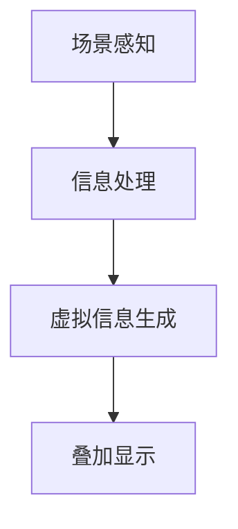
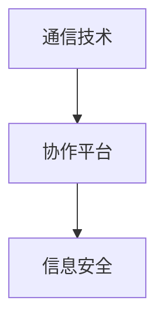
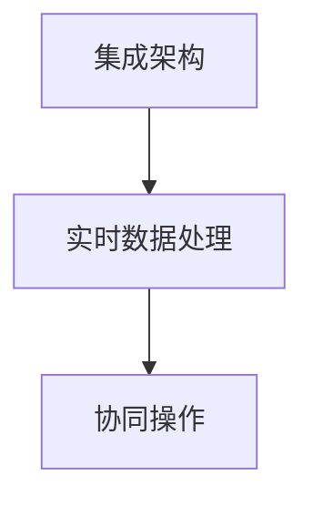
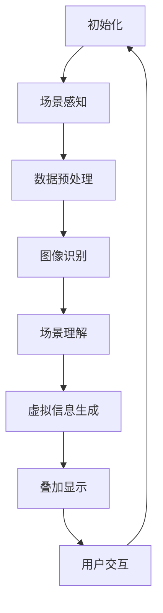
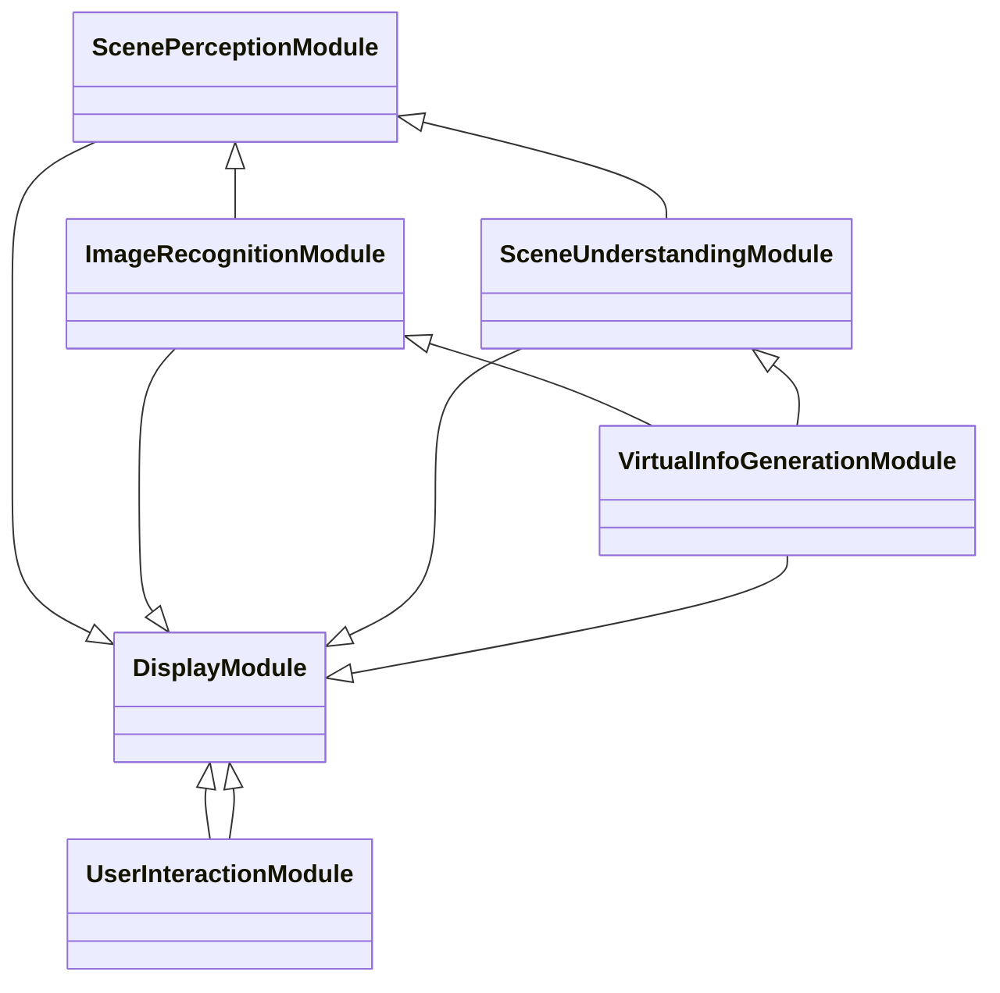
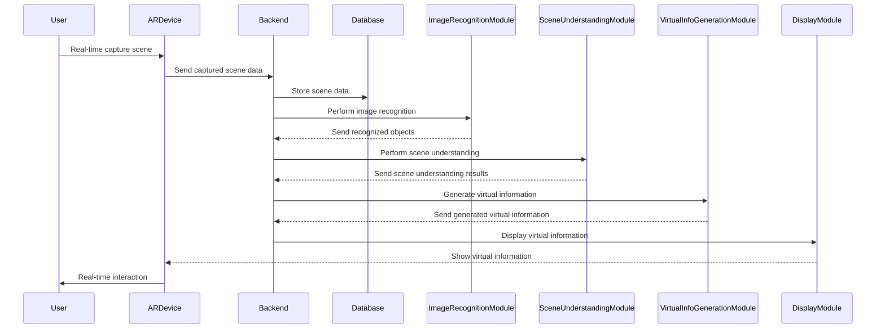
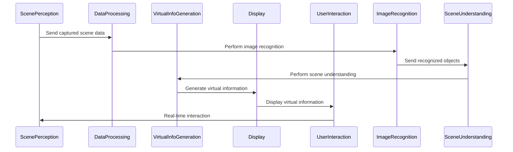

                 

### 增强现实在远程协作中的实时应用

关键词：增强现实，远程协作，实时应用，技术，案例

摘要：随着互联网和信息技术的发展，远程协作已成为企业、教育和个人生活中不可或缺的一部分。增强现实（AR）技术的兴起，为远程协作提供了全新的交互体验和丰富的可视化手段。本文将从增强现实和远程协作的基本概念入手，分析增强现实在远程协作中的实时应用场景，探讨其技术实现方案，并结合实际案例进行详细剖析，总结出增强现实在远程协作中的最佳实践。

### 背景介绍

#### 增强现实的概念与发展历史

增强现实（Augmented Reality，简称AR）是一种将虚拟信息与现实世界相结合的技术。它通过计算机生成的图像、视频、音频等虚拟信息，叠加到真实环境中，使人们能够更加直观地感知和交互。AR技术最早可以追溯到20世纪50年代的虚拟现实技术，但直到21世纪初，随着计算机图形学、传感器技术和移动设备的快速发展，AR技术才开始进入大众视野。

近年来，增强现实技术在医疗、教育、娱乐等领域取得了显著的应用成果。特别是在远程协作方面，AR技术提供了远程参与者之间的实时互动和协同操作，突破了空间和时间的限制，提高了协作效率。

#### 远程协作的概念与需求分析

远程协作指的是在物理空间上分散的个体或团队，通过互联网和其他通信技术实现协作的过程。随着全球化的发展和远程工作的普及，远程协作需求日益增长。远程协作的优势在于节省了差旅成本，提高了工作效率，同时也为灵活就业和创业提供了新的机遇。

然而，远程协作也面临一些挑战，如沟通障碍、协作效率低下、信息安全等问题。这些挑战促使人们不断寻求新的技术手段来优化远程协作体验，提高协作效率。

#### 增强现实在远程协作中的实时应用前景

增强现实在远程协作中的应用，为解决远程协作中的沟通障碍和协作效率问题提供了新的思路。通过AR技术，远程参与者可以直观地看到对方的位置、动作和表情，实现面对面的交流。此外，AR技术还可以提供丰富的虚拟信息，如3D模型、图表和数据，帮助参与者更好地理解和分析协作内容。

随着AR技术的不断成熟和普及，增强现实在远程协作中的实时应用前景十分广阔。未来，AR技术有望在远程会议、远程教育、远程医疗等领域发挥重要作用，为人们带来更加高效、便捷的协作体验。

### 核心概念与联系

#### 增强现实技术原理

增强现实技术的核心在于将虚拟信息与现实世界进行叠加。这一过程通常包括以下几个步骤：

1. **场景感知**：通过传感器（如摄像头、麦克风、GPS等）捕捉真实环境的信息。
2. **信息处理**：对捕捉到的信息进行处理，如识别物体、场景理解等。
3. **虚拟信息生成**：根据处理结果生成虚拟信息，如3D模型、文字、图表等。
4. **叠加显示**：将虚拟信息叠加到真实环境中，通过显示设备（如AR眼镜、手机屏幕等）呈现给用户。

以下是增强现实技术原理的Mermaid流程图：



#### 远程协作技术原理

远程协作技术主要包括以下几个方面：

1. **通信技术**：如互联网、电话、视频会议等，实现远程参与者之间的信息传递。
2. **协作平台**：如企业内部网、远程办公平台、在线教育平台等，提供协作工具和资源。
3. **信息安全**：确保远程协作过程中数据的安全性和隐私性。

以下是远程协作技术原理的Mermaid流程图：



#### 增强现实与远程协作的实时应用技术原理

增强现实与远程协作的实时应用技术原理可以概括为：

1. **集成架构**：将增强现实技术与远程协作平台进行集成，实现实时交互和信息共享。
2. **实时数据处理**：对实时采集的数据进行处理，如图像识别、场景理解等。
3. **协同操作**：远程参与者通过增强现实设备进行实时协同操作。

以下是增强现实与远程协作的实时应用技术原理的Mermaid流程图：



### 算法原理讲解

为了实现增强现实在远程协作中的实时应用，我们需要使用一系列算法和技术。以下是一个简单的算法流程图，以及相应的Python源代码和数学模型讲解：

#### 算法流程图



#### Python源代码

```python
import cv2
import numpy as np

# 场景感知
def capture_scene():
    cap = cv2.VideoCapture(0)
    while True:
        ret, frame = cap.read()
        if not ret:
            break
        # 数据预处理
        processed_frame = preprocess_frame(frame)
        # 图像识别
        objects_detected = image_recognition(processed_frame)
        # 场景理解
        scene_understanding = understand_scene(objects_detected)
        # 虚拟信息生成
        virtual_info = generate_virtual_info(scene_understanding)
        # 叠加显示
        display叠加 = display叠加信息(virtual_info, frame)
        cv2.imshow('AR Display', display叠加)
        if cv2.waitKey(1) & 0xFF == ord('q'):
            break
    cap.release()
    cv2.destroyAllWindows()

# 数据预处理
def preprocess_frame(frame):
    # 这里可以添加预处理操作，如缩放、滤波等
    return frame

# 图像识别
def image_recognition(frame):
    # 这里可以添加图像识别算法，如目标检测、图像分类等
    return []

# 场景理解
def understand_scene(objects_detected):
    # 这里可以添加场景理解算法，如场景分割、物体识别等
    return []

# 虚拟信息生成
def generate_virtual_info(scene_understanding):
    # 这里可以添加虚拟信息生成算法，如3D模型渲染、文字生成等
    return []

# 叠加显示
def display叠加信息(virtual_info, frame):
    # 这里可以添加叠加显示操作，如叠加虚拟信息到真实环境中
    return frame
```

#### 数学模型讲解

1. **图像识别**：使用卷积神经网络（CNN）进行图像识别。CNN的核心在于通过多个卷积层、池化层和全连接层来提取图像特征，最后通过分类层进行图像分类。其数学模型可以表示为：

   $$ f(x) = \text{ReLU}(\text{W}^{L-1} \cdot \text{激活函数}(\text{W}^{L-2} \cdot \text{激活函数}(\ldots \text{W}^{2} \cdot \text{激活函数}(\text{W}^{1} \cdot x + b^{1}) + b^{L-2}) + b^{L-1}) $$
   
2. **场景理解**：使用递归神经网络（RNN）进行场景理解。RNN的核心在于通过循环结构处理序列数据，从而捕捉数据之间的时序关系。其数学模型可以表示为：

   $$ h_t = \text{激活函数}(\text{W}^{L-1} \cdot \text{激活函数}(\text{W}^{L-2} \cdot \ldots \text{W}^{2} \cdot \text{激活函数}(\text{W}^{1} \cdot h_{t-1} + b^{1}) + b^{L-2}) + b^{L-1}) $$

3. **虚拟信息生成**：使用生成对抗网络（GAN）进行虚拟信息生成。GAN由生成器和判别器组成，生成器生成虚拟信息，判别器判断虚拟信息是否真实。其数学模型可以表示为：

   $$ G(x) = \text{激活函数}(\text{W}^{G} \cdot x + b^{G}) $$
   $$ D(x) = \text{激活函数}(\text{W}^{D} \cdot x + b^{D}) $$
   $$ \min_G \max_D V(D, G) = \mathbb{E}_{x \sim p_{\text{data}}}[D(x)] - \mathbb{E}_{z \sim p_{\text{z}}}[D(G(z))] $$

### 系统分析与架构设计方案

#### 问题场景介绍

随着远程协作的普及，企业、教育机构和个人用户对远程协作的需求不断增加。然而，传统的远程协作方式往往存在沟通不畅、协作效率低下等问题。为了提高远程协作的效率，增强现实技术的引入为远程协作提供了一种全新的解决方案。

#### 项目介绍

本项目旨在利用增强现实技术，实现远程协作中的实时互动和协同操作。项目主要包括以下模块：

1. **场景感知模块**：通过摄像头等传感器实时捕捉真实环境信息。
2. **数据处理模块**：对捕捉到的信息进行处理，如图像识别、场景理解等。
3. **虚拟信息生成模块**：根据处理结果生成虚拟信息，如3D模型、文字、图表等。
4. **显示模块**：将虚拟信息叠加到真实环境中，通过增强现实设备呈现给用户。
5. **用户交互模块**：实现用户与系统之间的实时交互。

#### 系统功能设计

根据项目需求，系统功能设计主要包括以下方面：

1. **实时场景感知**：通过摄像头等传感器实时捕捉真实环境信息，包括图像、音频、位置等信息。
2. **图像识别与场景理解**：对捕捉到的图像进行识别，提取关键信息，如物体识别、场景分割等。
3. **虚拟信息生成**：根据图像识别和场景理解结果，生成相应的虚拟信息，如3D模型、文字、图表等。
4. **虚拟信息叠加与显示**：将生成的虚拟信息叠加到真实环境中，通过增强现实设备呈现给用户。
5. **用户交互**：实现用户与系统之间的实时交互，如手势控制、语音控制等。

以下是系统功能设计的Mermaid类图：



#### 系统架构设计

根据项目需求和功能设计，系统架构设计主要包括以下方面：

1. **前端架构**：包括增强现实设备和用户交互界面。
2. **后端架构**：包括数据处理模块、虚拟信息生成模块和显示模块。
3. **网络架构**：包括远程协作平台和服务器。

以下是系统架构设计的Mermaid架构图：



#### 系统接口设计

根据系统架构设计，系统接口设计主要包括以下方面：

1. **场景感知接口**：用于实时捕捉真实环境信息。
2. **数据处理接口**：用于处理图像识别和场景理解结果。
3. **虚拟信息生成接口**：用于生成虚拟信息。
4. **显示接口**：用于显示虚拟信息。
5. **用户交互接口**：用于实现用户与系统之间的实时交互。

以下是系统接口设计的Mermaid序列图：



### 项目实战

#### 环境安装

在进行项目实战之前，我们需要安装以下软件和工具：

1. **Python**：安装Python 3.8及以上版本。
2. **PyTorch**：安装PyTorch 1.8及以上版本。
3. **OpenCV**：安装OpenCV 4.5及以上版本。
4. **ARToolKit**：安装ARToolKit 5.3及以上版本。

#### 系统核心实现源代码

以下是一个简单的系统核心实现源代码示例：

```python
import cv2
import numpy as np

# 场景感知
def capture_scene():
    cap = cv2.VideoCapture(0)
    while True:
        ret, frame = cap.read()
        if not ret:
            break
        # 数据预处理
        processed_frame = preprocess_frame(frame)
        # 图像识别
        objects_detected = image_recognition(processed_frame)
        # 场景理解
        scene_understanding = understand_scene(objects_detected)
        # 虚拟信息生成
        virtual_info = generate_virtual_info(scene_understanding)
        # 叠加显示
        display叠加 = display叠加信息(virtual_info, frame)
        cv2.imshow('AR Display', display叠加)
        if cv2.waitKey(1) & 0xFF == ord('q'):
            break
    cap.release()
    cv2.destroyAllWindows()

# 数据预处理
def preprocess_frame(frame):
    # 这里可以添加预处理操作，如缩放、滤波等
    return frame

# 图像识别
def image_recognition(frame):
    # 这里可以添加图像识别算法，如目标检测、图像分类等
    return []

# 场景理解
def understand_scene(objects_detected):
    # 这里可以添加场景理解算法，如场景分割、物体识别等
    return []

# 虚拟信息生成
def generate_virtual_info(scene_understanding):
    # 这里可以添加虚拟信息生成算法，如3D模型渲染、文字生成等
    return []

# 叠加显示
def display叠加信息(virtual_info, frame):
    # 这里可以添加叠加显示操作，如叠加虚拟信息到真实环境中
    return frame
```

#### 代码应用解读与分析

上述代码是一个简单的增强现实系统核心实现示例。它主要包括以下几个部分：

1. **场景感知**：通过摄像头实时捕捉真实环境信息。
2. **数据预处理**：对捕捉到的图像进行预处理，如缩放、滤波等。
3. **图像识别**：对预处理后的图像进行图像识别，如目标检测、图像分类等。
4. **场景理解**：对图像识别结果进行场景理解，如场景分割、物体识别等。
5. **虚拟信息生成**：根据场景理解结果生成虚拟信息，如3D模型、文字、图表等。
6. **叠加显示**：将生成的虚拟信息叠加到真实环境中，通过增强现实设备呈现给用户。

在实际应用中，我们需要根据具体场景和需求，选择合适的图像识别算法、场景理解算法和虚拟信息生成算法。以下是一个简单的图像识别算法示例，使用OpenCV库实现：

```python
def image_recognition(frame):
    # 加载预训练的图像识别模型
    model = cv2.face_LBPHFaceRecognizer.create()
    model.read('trainer.yml')

    # 将图像转换为灰度图像
    gray_frame = cv2.cvtColor(frame, cv2.COLOR_BGR2GRAY)

    # 进行人脸检测
    faces = detector.detectMultiScale(gray_frame, scaleFactor=1.1, minNeighbors=5, minSize=(30, 30))

    # 对每个人脸进行识别
    for (x, y, w, h) in faces:
        # 提取人脸区域
        face_region = gray_frame[y:y+h, x:x+w]

        # 进行人脸识别
        label, confidence = model.predict(face_region)

        # 绘制识别结果
        cv2.rectangle(frame, (x, y), (x+w, y+h), (0, 255, 0), 2)
        cv2.putText(frame, f'Person {label}', (x, y-10), cv2.FONT_HERSHEY_SIMPLEX, 0.9, (0, 0, 255), 2)

    return frame
```

#### 实际案例分析和详细讲解剖析

为了更好地理解增强现实在远程协作中的实时应用，我们来看一个实际案例——虚拟会议增强现实应用。

#### 案例背景

某公司需要定期举行虚拟会议，但由于团队成员分布在不同的城市，传统的远程会议方式（如视频会议）效果不佳，沟通不畅，协作效率低下。为了解决这一问题，公司决定采用增强现实技术，实现虚拟会议中的实时互动和协同操作。

#### 案例实现

1. **场景感知**：通过摄像头和麦克风实时捕捉会议室内的场景和声音。
2. **数据预处理**：对捕捉到的图像和声音进行预处理，如降噪、图像增强等。
3. **图像识别**：使用人脸识别算法识别会议室内的参会人员。
4. **场景理解**：根据人脸识别结果，将参会人员的位置信息转换为三维坐标。
5. **虚拟信息生成**：根据场景理解结果，生成虚拟角色和虚拟道具。
6. **叠加显示**：将虚拟角色和虚拟道具叠加到真实环境中，通过增强现实设备呈现给参会人员。
7. **用户交互**：实现参会人员与虚拟角色和虚拟道具的实时交互。

#### 案例分析和详细讲解

1. **场景感知**：通过摄像头和麦克风实时捕捉会议室内的场景和声音，为后续处理提供原始数据。

2. **数据预处理**：对捕捉到的图像和声音进行预处理，如降噪、图像增强等，以提高图像和声音的质量，为图像识别和场景理解提供更好的数据支持。

3. **图像识别**：使用人脸识别算法识别会议室内的参会人员。这里我们使用OpenCV库中的人脸检测和识别功能。

4. **场景理解**：根据人脸识别结果，将参会人员的位置信息转换为三维坐标。这一步骤是增强现实技术中的关键，通过三维坐标可以确定虚拟角色和虚拟道具的位置，实现与现实环境的叠加。

5. **虚拟信息生成**：根据场景理解结果，生成虚拟角色和虚拟道具。虚拟角色可以是参会人员的3D模型，虚拟道具可以是会议所需的工具和设备。

6. **叠加显示**：将虚拟角色和虚拟道具叠加到真实环境中，通过增强现实设备呈现给参会人员。这一步骤使用了ARToolKit库，将虚拟信息叠加到摄像头捕捉的真实场景中。

7. **用户交互**：实现参会人员与虚拟角色和虚拟道具的实时交互。参会人员可以通过手势和语音控制虚拟角色和虚拟道具，实现协同操作。

#### 项目小结

通过上述实际案例，我们可以看到增强现实在远程协作中的应用为解决沟通不畅、协作效率低下等问题提供了新的思路。在实际项目中，我们需要根据具体场景和需求，选择合适的图像识别算法、场景理解算法和虚拟信息生成算法，并实现实时交互功能。同时，为了确保项目的成功，我们还需要关注数据处理效率、系统稳定性和用户体验等方面。

### 最佳实践 tips

1. **场景选择**：选择适合增强现实技术的场景，如虚拟会议、远程教育、远程医疗等，可以更好地发挥AR技术的作用。
2. **算法优化**：根据实际应用需求，对图像识别、场景理解、虚拟信息生成等算法进行优化，提高系统性能和稳定性。
3. **用户交互**：设计简单直观的用户交互界面，提高用户的操作效率和满意度。
4. **数据安全**：确保远程协作过程中的数据安全，采取加密和身份认证等措施，防止数据泄露和恶意攻击。

### 小结

本文从增强现实和远程协作的基本概念入手，分析了增强现实在远程协作中的实时应用场景，探讨了其技术实现方案，并结合实际案例进行了详细剖析。通过本文的讨论，我们可以看到增强现实技术在远程协作中的应用前景广阔，未来有望在多个领域发挥重要作用，为人们带来更加高效、便捷的协作体验。

### 注意事项

1. **技术成熟度**：增强现实技术在远程协作中的应用仍处于发展阶段，部分技术可能尚未成熟，需要持续关注和改进。
2. **数据隐私**：在远程协作中，需要特别关注数据隐私问题，采取有效的数据加密和隐私保护措施，确保用户数据的隐私和安全。
3. **用户培训**：为了充分发挥增强现实技术的作用，需要对用户进行适当的培训，提高他们的使用技能和效率。

### 拓展阅读

1. **增强现实技术基础**：
   - 《增强现实：原理与应用》
   - 《增强现实技术：理论与实践》

2. **远程协作技术**：
   - 《远程协作：技术与实践》
   - 《远程工作：策略与技巧》

3. **实际案例研究**：
   - 《增强现实在远程教育中的应用案例研究》
   - 《增强现实在远程医疗中的应用案例研究》

作者：AI天才研究院/AI Genius Institute & 禅与计算机程序设计艺术 /Zen And The Art of Computer Programming

本文旨在分享增强现实在远程协作中的实时应用技术和实践，希望对读者有所启发和帮助。如需进一步讨论或合作，请随时联系作者。谢谢！

