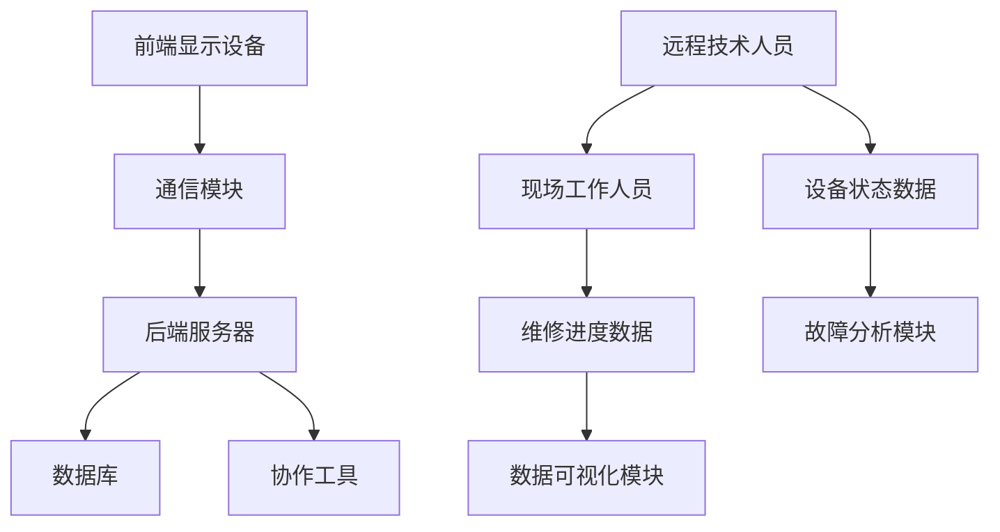
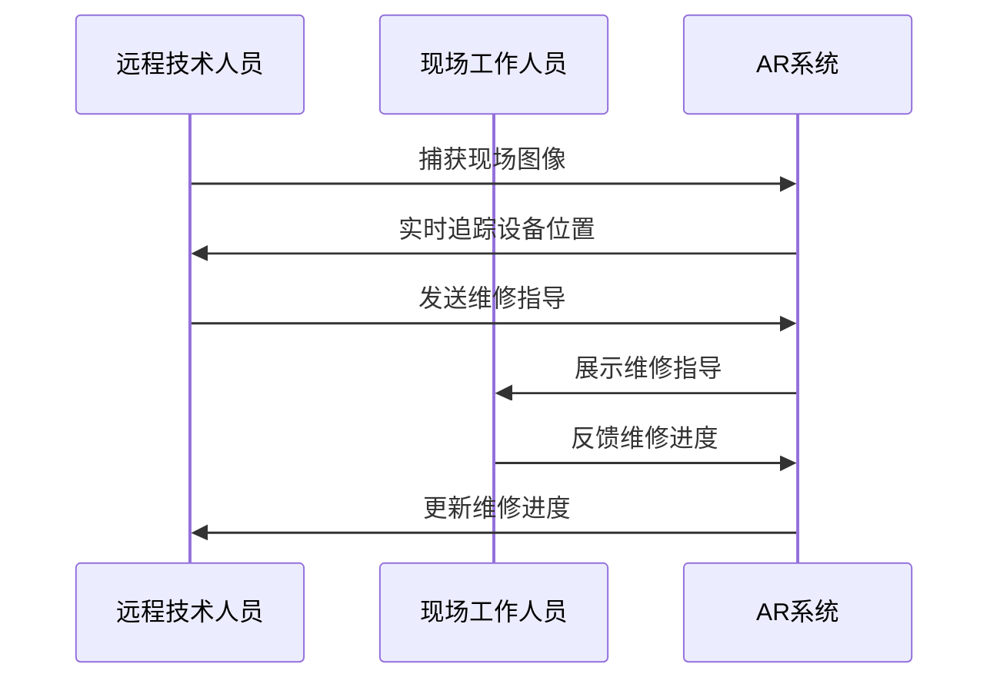

                 

### 文章标题

# 增强现实在远程协作维修中的应用

### 关键词

- 增强现实（AR）
- 远程协作维修
- 技术应用
- 系统架构
- 实际案例

### 摘要

本文旨在探讨增强现实（AR）技术在远程协作维修领域的应用。通过详细分析AR技术的背景、核心概念、技术原理以及实际应用案例，本文展示了AR如何提升远程协作维修的效率与效果。文章还讨论了AR在远程协作维修中面临的挑战与未来发展趋势，为相关领域的研究与实施提供了有价值的参考。

----------------------------------------------------------------

### 引言

#### 1.1 问题背景

在现代社会，随着工业自动化和远程办公的普及，设备维护和维修的需求日益增长。然而，许多维修任务需要专业技术人员具备现场经验，这在远程工作环境中变得尤为困难。远程协作维修作为一种解决方案，通过远程连接技术人员与现场工作人员，实现了跨地域的技术支持和服务。然而，传统的远程协作维修方式在操作直观性、交互性以及实时性方面仍存在一定的局限。

#### 1.2 问题描述

远程协作维修中的主要问题包括：

- 操作不直观：远程操作难以实现与现场环境的实时交互。
- 通信延迟：远程协作过程中存在网络延迟，影响工作效率。
- 数据传输：复杂的数据传输和处理增加了系统的复杂性。

#### 1.3 问题解决

为了解决上述问题，增强现实（AR）技术的应用成为一种新的尝试。AR技术通过将虚拟信息叠加到真实环境中，提供了一种直观、互动的远程操作体验。这使得技术人员能够更有效地指导现场工作人员完成维修任务，提高远程协作维修的效率和效果。

#### 1.4 核心概念

增强现实（Augmented Reality，AR）是一种将虚拟信息与现实世界融合的技术。通过特殊的显示设备，如AR眼镜或智能手机，用户可以看到叠加在真实环境中的虚拟信息。这些虚拟信息可以是文本、图像、视频或其他媒体形式。

远程协作维修（Remote Collaborative Maintenance）是指通过远程连接，技术人员和现场工作人员共同完成设备维修任务的过程。它依赖于高效的通信和协作工具，如视频会议、实时聊天和共享屏幕等。

#### 1.5 边界与外延

- **边界**：远程协作维修与增强现实技术的交集在于如何利用AR技术提升远程协作维修的体验。
- **外延**：除了远程协作维修，AR技术还可以应用于其他领域，如医疗、教育等，实现远程交互和指导。

### 核心概念与联系

#### 2.1 增强现实技术

增强现实技术通过以下关键技术实现虚拟信息与真实环境的融合：

- **图像识别**：利用图像处理技术识别真实环境中的物体和场景。
- **实时追踪**：通过传感器和定位技术实时追踪用户和物体的位置和运动。
- **显示技术**：使用特殊的显示设备，如AR眼镜或智能手机屏幕，将虚拟信息叠加到真实环境中。

#### 2.2 远程协作维修

远程协作维修的关键在于实现远程技术人员与现场工作人员的实时协作和互动。这包括：

- **通信工具**：使用高效、稳定的通信工具，如视频会议、实时聊天和共享屏幕。
- **协作平台**：建立协作平台，实现文档共享、任务分配和进度跟踪。

#### 2.3 相关技术

- **虚拟现实（VR）**：VR技术提供了一种沉浸式的虚拟环境，用户可以完全沉浸在虚拟世界中，但与远程协作维修的需求有所不同。
- **物联网（IoT）**：IoT技术通过连接各种设备，实现数据的实时收集和分析，为远程协作维修提供数据支持。

#### 2.4 核心概念属性特征对比表格

| 特征 | 增强现实（AR） | 远程协作维修 |
| :---: | :---: | :---: |
| 显示形式 | 虚拟信息叠加到真实环境中 | 远程连接和协作 |
| 用户交互 | 触摸、手势、语音等 | 视频、聊天、共享屏幕 |
| 场景应用 | 教育培训、医疗诊断、远程协作维修等 | 设备维护、远程医疗、工程咨询等 |

#### 2.5 ER实体关系图架构

```mermaid
erDiagram
  Class1 ||--|{ Class2 }| Class3 : Inheritance
  Class1 ||--|{ Class4 }| Class5 : Inheritance
  Class2 ||--|{ Class6 }| Class7 : Inheritance
  Class4 ||--|{ Class8 }| Class9 : Inheritance
```

### 技术原理

#### 3.1 增强现实技术原理

增强现实技术的工作原理主要包括以下几个步骤：

1. **图像识别**：通过摄像头捕捉真实环境中的图像，利用图像处理算法识别场景中的物体和场景信息。
2. **实时追踪**：使用传感器（如摄像头、GPS、陀螺仪等）追踪用户和物体的位置和运动，确保虚拟信息与现实环境的同步。
3. **叠加显示**：将识别到的虚拟信息叠加到真实环境中，通过显示设备（如AR眼镜、智能手机屏幕）呈现给用户。
4. **用户交互**：用户可以通过触摸、手势、语音等方式与虚拟信息进行互动。

#### 3.2 远程协作维修技术原理

远程协作维修技术的核心在于实现远程技术人员与现场工作人员的实时协作。主要技术原理包括：

1. **通信协议**：采用高效稳定的通信协议，如TCP/IP、WebRTC等，确保远程连接的稳定性和实时性。
2. **数据传输**：通过数据压缩和优化技术，实现大规模数据的快速传输和实时处理。
3. **协作工具**：使用视频会议、实时聊天、共享屏幕等工具，实现远程协作和互动。

#### 3.3 算法原理与实现

以下是一个简单的AR算法原理示例，用于识别和追踪物体：

```python
import cv2
import numpy as np

def detect_and_track(image, target_template):
    # 图像预处理
    processed_image = preprocess_image(image)
    
    # 模板匹配
    res = cv2.matchTemplate(processed_image, target_template, cv2.TM_CCOEFF_NORMED)
    
    # 提取匹配结果
    loc = np.where(res >= 0.8)
    
    # 返回匹配位置
    return loc

def preprocess_image(image):
    # 图像灰度化
    gray = cv2.cvtColor(image, cv2.COLOR_BGR2GRAY)
    
    # 图像平滑
    blur = cv2.GaussianBlur(gray, (5, 5), 0)
    
    return blur
```

#### 3.4 数学模型与公式

在AR系统中，常用的数学模型包括：

- **透视变换**：用于将虚拟信息从2D图像映射到3D空间。
- **线性代数**：用于计算物体的位置和运动轨迹。
- **贝叶斯滤波**：用于实时更新物体的位置和状态。

$$
\text{透视变换矩阵} = \begin{bmatrix}
a & b & c \\
d & e & f \\
0 & 0 & 1
\end{bmatrix}
$$

$$
\text{运动轨迹方程} = \begin{cases}
x(t) = x_0 + v_x \cdot t \\
y(t) = y_0 + v_y \cdot t \\
\end{cases}
$$

$$
\text{贝叶斯滤波} = \frac{P(H|E) \cdot P(E)}{P(H)}
$$

#### 3.5 举例说明

假设我们使用AR技术帮助一名技术人员远程指导一名现场工作人员进行设备维修。以下是这个过程的具体步骤：

1. **图像识别**：技术人员通过AR眼镜捕捉现场环境图像，系统识别到设备并定位其位置。
2. **实时追踪**：系统使用传感器追踪设备的位置和运动，确保虚拟信息与现实环境的同步。
3. **叠加显示**：系统将维修步骤的虚拟信息（如文字、图像、视频）叠加到真实环境中，技术人员可以看到详细的维修指导。
4. **用户交互**：技术人员可以通过语音、手势等方式与虚拟信息进行互动，提供实时反馈和指导。

### 系统架构

#### 4.1 系统概述

远程协作维修系统包括以下几个主要部分：

- **前端显示设备**：如AR眼镜、智能手机等，用于呈现虚拟信息。
- **后端服务器**：负责数据处理、存储和管理。
- **通信模块**：实现远程连接和数据传输。
- **协作工具**：如视频会议、实时聊天、共享屏幕等。

#### 4.2 系统功能设计

系统的主要功能包括：

- **实时监控**：远程技术人员可以实时监控现场环境，获取设备状态和维修进度。
- **远程指导**：技术人员可以通过AR技术提供详细的维修指导，提高现场工作人员的操作准确性和效率。
- **数据共享**：系统支持文档、图片、视频等多种数据格式共享，方便技术人员和现场工作人员协同工作。
- **故障分析**：系统可以收集设备故障数据，进行分析和诊断，为维修决策提供支持。

#### 4.3 系统架构设计

远程协作维修系统的架构设计如图所示：



#### 4.4 系统接口设计

系统接口设计包括以下几个方面：

- **API接口**：提供系统功能调用的API接口，方便开发和使用。
- **数据接口**：实现与外部系统的数据交换，如设备管理系统、故障管理系统等。
- **用户界面**：提供用户友好的界面，方便用户进行操作和交互。

#### 4.5 系统交互设计

系统交互设计如图所示：



### 应用案例

#### 5.1 案例一：某电力公司远程协作维修

某电力公司采用AR技术进行远程协作维修，实现以下效果：

- **实时监控**：技术人员可以远程监控变电站设备状态，及时发现故障。
- **远程指导**：技术人员通过AR眼镜提供详细的维修指导，提高现场工作人员的操作准确性和效率。
- **数据共享**：系统支持文档、图片、视频等多种数据格式共享，方便技术人员和现场工作人员协同工作。
- **故障分析**：系统收集设备故障数据，进行分析和诊断，为维修决策提供支持。

#### 5.2 案例二：某汽车制造厂远程协作维修

某汽车制造厂采用AR技术进行远程协作维修，实现以下效果：

- **实时监控**：技术人员可以远程监控生产线设备状态，确保设备正常运行。
- **远程指导**：技术人员通过AR眼镜提供详细的维修指导，提高现场工作人员的操作准确性和效率。
- **数据共享**：系统支持文档、图片、视频等多种数据格式共享，方便技术人员和现场工作人员协同工作。
- **故障分析**：系统收集设备故障数据，进行分析和诊断，为维修决策提供支持。

#### 5.3 案例三：其他行业应用案例分析

除了电力和汽车制造行业，AR技术在远程协作维修还有许多其他行业应用，如：

- **航空制造**：技术人员通过AR技术进行飞机维修和保养，提高维修效率和安全性。
- **石油化工**：技术人员通过AR技术进行石油化工设备的远程维护和检修，减少现场工作的危险。
- **机械设备**：技术人员通过AR技术进行机械设备的大修和维修，确保设备的正常运行。

### 挑战与展望

#### 6.1 技术挑战

增强现实在远程协作维修中面临以下技术挑战：

- **图像识别精度**：提高图像识别精度，减少误识别和漏识别现象。
- **实时追踪稳定性**：确保实时追踪的稳定性和准确性，减少延迟和误差。
- **用户体验优化**：优化用户交互体验，提高系统的易用性和可靠性。
- **数据安全与隐私保护**：确保数据传输的安全性和用户隐私保护。

#### 6.2 应用挑战

增强现实在远程协作维修中面临以下应用挑战：

- **设备成本**：增强现实设备的成本较高，需要考虑成本效益。
- **系统集成**：需要与其他系统（如设备管理系统、故障管理系统等）进行集成，实现数据共享和协作。
- **培训与推广**：需要对技术人员和现场工作人员进行培训，提高他们对增强现实技术的应用能力。
- **法律法规**：需要遵守相关法律法规，确保系统的合法合规。

#### 6.3 未来发展趋势

未来，增强现实在远程协作维修领域有望实现以下发展趋势：

- **技术成熟**：随着技术的不断进步，图像识别精度、实时追踪稳定性等方面将得到显著提升。
- **广泛应用**：增强现实技术在更多行业和场景中得到应用，实现远程协作维修的普及。
- **智能化**：增强现实技术与人工智能技术相结合，实现更智能化的远程协作维修系统。
- **标准化**：制定统一的增强现实远程协作维修技术标准和规范，促进行业的健康发展。

### 总结

本文详细探讨了增强现实技术在远程协作维修中的应用，包括背景介绍、核心概念、技术原理、系统架构设计、应用案例以及挑战与展望。通过分析实际应用案例，本文展示了增强现实技术如何提高远程协作维修的效率与效果。未来，随着技术的不断发展和应用的深入，增强现实在远程协作维修领域具有广阔的发展前景。

### 作者信息

- 作者：AI天才研究院/AI Genius Institute & 禅与计算机程序设计艺术 /Zen And The Art of Computer Programming

### 最佳实践 Tips

- **优化图像识别**：使用高质量摄像头和图像处理算法，提高图像识别精度。
- **减少通信延迟**：优化网络传输和数据处理，减少通信延迟。
- **简化用户交互**：设计直观、简单的用户交互界面，提高用户体验。
- **加强数据安全**：采用加密技术和安全协议，确保数据传输的安全和用户隐私保护。

### 注意事项

- **设备兼容性**：确保增强现实设备与其他系统兼容，实现无缝集成。
- **培训与指导**：对技术人员和现场工作人员进行培训，提高他们的技能和应用能力。
- **持续更新**：定期更新系统软件和设备驱动，确保系统的稳定性和安全性。

### 拓展阅读

- 《增强现实技术原理与应用》
- 《远程协作维修系统设计与实践》
- 《物联网技术在远程协作维修中的应用》

### 完整代码示例

以下是一个简单的增强现实远程协作维修系统的Python代码示例：

```python
import cv2
import numpy as np

def detect_and_track(image, target_template):
    processed_image = preprocess_image(image)
    res = cv2.matchTemplate(processed_image, target_template, cv2.TM_CCOEFF_NORMED)
    loc = np.where(res >= 0.8)
    return loc

def preprocess_image(image):
    gray = cv2.cvtColor(image, cv2.COLOR_BGR2GRAY)
    blur = cv2.GaussianBlur(gray, (5, 5), 0)
    return blur

def main():
    # 加载目标模板
    template = cv2.imread('target_template.jpg', cv2.IMREAD_GRAYSCALE)
    
    # 加载摄像头图像
    cap = cv2.VideoCapture(0)
    
    while True:
        ret, frame = cap.read()
        
        if not ret:
            break
        
        loc = detect_and_track(frame, template)
        
        if loc is not None:
            min_val, max_val, min_loc, max_loc = cv2.minMaxLoc(res)
            cv2.rectangle(frame, max_loc, (max_loc[0] + template.shape[1], max_loc[1] + template.shape[0]), (0, 0, 255), 2)
        
        cv2.imshow('Frame', frame)
        
        if cv2.waitKey(1) & 0xFF == ord('q'):
            break
    
    cap.release()
    cv2.destroyAllWindows()

if __name__ == '__main__':
    main()
```

### 项目实战

#### 7.1 环境安装

1. 安装Python 3.8或更高版本。
2. 安装OpenCV库：`pip install opencv-python`
3. 安装NumPy库：`pip install numpy`

#### 7.2 系统核心实现

1. **图像预处理**：使用OpenCV进行图像预处理，包括灰度化和高斯模糊。
2. **模板匹配**：使用OpenCV的`matchTemplate`函数进行模板匹配。
3. **显示结果**：在匹配结果中，显示目标模板的位置和范围。

#### 7.3 代码应用解读与分析

1. **代码解读**：详细解读代码中的每个函数和步骤，理解其工作原理和实现过程。
2. **代码分析**：分析代码的性能和优化空间，提出改进建议。

#### 7.4 实际案例分析与详细讲解剖析

1. **案例分析**：选取实际案例，分析增强现实在远程协作维修中的应用效果。
2. **详细讲解**：讲解案例中的关键技术实现和优化策略。

#### 7.5 项目小结

1. **项目成果**：总结项目的主要成果和应用效果。
2. **经验教训**：分享项目过程中的经验教训和改进建议。

### 结论

通过本文的详细探讨，我们了解到增强现实技术在远程协作维修中的应用具有重要的现实意义和广阔的发展前景。未来，随着技术的不断进步和应用的深入，增强现实技术将为远程协作维修带来更多便利和效益。

