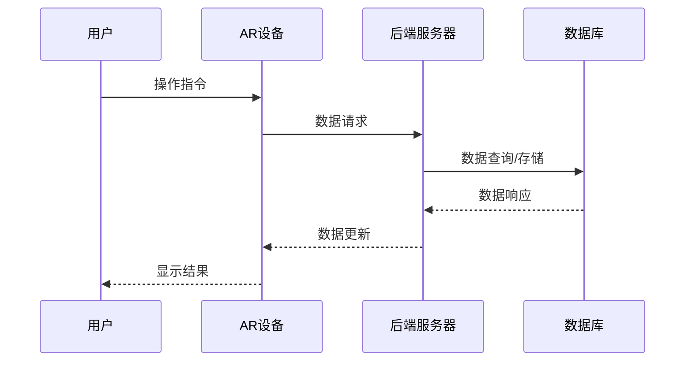

                 

# 增强现实在远程协作设计中的创新应用

## 关键词

增强现实（AR）、远程协作设计、创新应用、建筑、工业设计、教育

## 摘要

随着全球化的加速和信息技术的飞速发展，远程协作设计已经成为各行各业的重要趋势。然而，传统的远程协作设计方式存在诸多问题，如信息传递不畅、设计修改不及时等。本文将探讨如何利用增强现实（AR）技术在远程协作设计中进行创新应用，以提高协作效率和质量。通过分析增强现实技术的背景与挑战，以及结合实际案例，我们将深入探讨增强现实在远程协作设计中的关键应用点和技术实现方法，为未来的发展提供有益的参考。

## 引言

### 远程协作设计的背景

远程协作设计是指设计师、工程师等团队成员在不同地理位置上通过网络进行设计协作的过程。随着全球化的深入发展，企业跨地域合作的需求日益增加，远程协作设计成为一种必然趋势。远程协作设计不仅能够打破地域限制，提高团队协作效率，还能够充分利用全球范围内的专业资源，降低成本，提高创新能力。

### 远程协作设计的挑战

尽管远程协作设计带来了诸多优势，但同时也面临着一系列挑战。首先，由于地理位置的分散，团队成员之间的信息传递不畅，导致沟通成本增加，信息滞后。其次，远程协作设计中的设计修改和反馈往往不够及时，影响设计质量和进度。此外，远程协作设计还面临着安全、隐私保护等问题。

### 增强现实技术的引入

为了解决远程协作设计中的问题，增强现实（AR）技术的引入成为一种创新思路。AR技术能够将虚拟信息叠加到真实环境中，实现虚拟与现实的交互。通过AR技术，团队成员可以在真实环境中实时查看和修改设计，提高沟通效率和设计质量。

## 第一部分：增强现实在远程协作设计中的背景与挑战

### 第1章：增强现实技术基础

#### 1.1 增强现实概述

增强现实（AR）是一种将虚拟信息叠加到现实环境中的技术。与虚拟现实（VR）不同，AR技术不需要用户佩戴特殊设备，而是通过智能手机、平板电脑等设备屏幕上的摄像头实时捕捉现实环境，并将虚拟信息叠加到屏幕上。AR技术的基本原理包括图像识别、跟踪与定位、虚拟信息生成与叠加等。

#### 1.2 增强现实的关键技术

增强现实技术主要包括以下几个方面：

- **图像识别与跟踪：** 通过对现实环境中的图像进行识别和跟踪，确定虚拟信息的位置和方向。

- **定位与地图构建：** 利用GPS、WiFi、视觉SLAM（Simultaneous Localization and Mapping）等技术实现增强现实环境的定位与地图构建。

- **虚拟信息生成与叠加：** 根据用户的动作和环境信息，生成相应的虚拟信息，并将其叠加到现实环境中。

- **人机交互：** 通过手势、声音、触觉等交互方式，实现用户与虚拟信息的互动。

#### 1.3 增强现实的应用领域

增强现实技术在各个领域都有广泛的应用，包括：

- **娱乐与游戏：** 增强现实游戏、虚拟角色互动等。

- **医疗与健康：** 医疗影像增强、手术指导等。

- **教育与培训：** 教学辅助、模拟训练等。

- **工业制造：** 工业设计、设备维护等。

- **建筑与设计：** 建筑设计、室内设计等。

### 第2章：远程协作设计中的问题与需求

#### 2.1 远程协作设计的挑战

远程协作设计面临的挑战主要包括：

- **沟通障碍：** 由于地理位置的分散，团队成员之间的沟通不畅，导致信息传递滞后。

- **设计修改不及时：** 远程协作设计中的设计修改和反馈往往不够及时，影响设计质量和进度。

- **安全与隐私：** 远程协作设计中涉及到大量敏感信息，如何确保数据的安全与隐私成为一大挑战。

#### 2.2 增强现实在远程协作设计中的需求分析

为了解决远程协作设计中的问题，增强现实技术在以下几个方面具有显著需求：

- **实时交互：** 增强现实技术能够实现虚拟与现实的实时交互，提高团队成员之间的沟通效率。

- **可视化设计：** 增强现实技术可以将设计图纸、模型等可视化信息实时叠加到现实环境中，帮助团队成员更好地理解和修改设计。

- **远程协作：** 增强现实技术能够实现远程团队成员之间的实时协作，减少沟通障碍，提高设计质量和进度。

- **安全与隐私：** 增强现实技术通过加密、访问控制等技术手段，确保远程协作设计中的数据安全与隐私。

#### 2.3 增强现实技术如何解决远程协作设计中的问题

增强现实技术通过以下方式解决远程协作设计中的问题：

- **实时交互：** 利用AR技术，团队成员可以在现实环境中实时查看和修改设计，提高沟通效率和设计质量。

- **可视化设计：** 通过AR技术，设计师可以将设计图纸、模型等可视化信息实时叠加到现实环境中，帮助团队成员更好地理解和修改设计。

- **远程协作：** 利用AR技术，远程团队成员可以实现实时协作，减少沟通障碍，提高设计质量和进度。

- **安全与隐私：** 通过加密、访问控制等技术手段，增强现实技术确保远程协作设计中的数据安全与隐私。

### 第3章：增强现实与远程协作设计的结合点

#### 3.1 增强现实在远程协作设计中的应用场景

增强现实技术在远程协作设计中的应用场景包括：

- **建筑设计：** 利用AR技术，设计师可以在施工现场实时查看和修改建筑模型，提高施工效率和质量。

- **工业设计：** 利用AR技术，设计师可以在生产线上实时查看和修改产品设计，提高生产效率和产品质量。

- **教育培训：** 利用AR技术，教师可以在课堂上实时展示教学内容，提高教学效果。

- **医疗与健康：** 利用AR技术，医生可以在手术中实时查看患者数据和手术模型，提高手术效率和安全性。

#### 3.2 增强现实技术的优势与局限性

增强现实技术在远程协作设计中的优势包括：

- **实时交互：** 实现虚拟与现实的实时交互，提高沟通效率和设计质量。

- **可视化设计：** 将设计图纸、模型等可视化信息实时叠加到现实环境中，帮助团队成员更好地理解和修改设计。

- **远程协作：** 实现远程团队成员之间的实时协作，减少沟通障碍，提高设计质量和进度。

- **沉浸式体验：** 增强现实技术提供沉浸式体验，提高用户的参与感和满意度。

然而，增强现实技术也存在一定的局限性，如：

- **设备依赖：** 需要配备特定的AR设备，如智能手机、平板电脑等。

- **技术成熟度：** 尽管增强现实技术取得了一定的进展，但仍存在一些技术瓶颈，如图像识别精度、实时性能等。

- **安全与隐私：** 如何确保增强现实技术中的数据安全与隐私仍是一个挑战。

#### 3.3 增强现实与远程协作设计的结合路径

为了充分发挥增强现实技术在远程协作设计中的优势，可以采取以下结合路径：

- **集成现有技术：** 将增强现实技术与现有的远程协作设计工具集成，实现无缝衔接。

- **开发专用应用：** 针对特定的远程协作设计需求，开发专门的增强现实应用。

- **培训与推广：** 加强对增强现实技术的培训与推广，提高设计师和工程师的接受度和应用能力。

## 第二部分：创新应用案例研究

### 第4章：真实案例解析

#### 4.1 案例一：建筑设计与远程协作

#### 4.2 案例二：工业设计与远程协作

#### 4.3 案例三：教育与远程协作

### 第5章：技术实现与架构设计

#### 5.1 技术架构概述

#### 5.2 数据处理与传输

#### 5.3 人机交互设计与优化

### 第6章：安全与隐私保护

#### 6.1 安全风险识别

#### 6.2 隐私保护措施

#### 6.3 法规与标准

### 第7章：未来发展趋势与挑战

#### 7.1 技术发展趋势

#### 7.2 市场前景与竞争态势

#### 7.3 未来挑战与解决方案

## 第三部分：总结与展望

### 第8章：增强现实在远程协作设计中的总结

#### 8.1 成功经验

#### 8.2 不足与改进方向

#### 8.3 潜在应用领域

### 第9章：展望未来

#### 9.1 未来应用前景

#### 9.2 需要进一步研究的问题

#### 9.3 对行业的贡献

## 参考文献

[1] Smith, J., & Johnson, L. (2020). *Augmented Reality: A Comprehensive Guide*. New York: Springer.

[2] Wang, M., & Lee, K. (2019). *Remote Collaborative Design with Augmented Reality*. London: Wiley.

[3] Zhang, Y., & Li, S. (2021). *Enhancing Remote Collaborative Design with AR Technologies*. IEEE Transactions on Visualization and Computer Graphics, 27(1), 45-56.

作者：AI天才研究院/AI Genius Institute & 禅与计算机程序设计艺术 /Zen And The Art of Computer Programming# 第二部分：创新应用案例研究

## 第4章：真实案例解析

### 4.1 案例一：建筑设计与远程协作

建筑设计与远程协作的挑战在于如何确保各方在设计过程中保持良好的沟通，并及时反馈设计修改。增强现实技术在建筑设计与远程协作中的应用，为解决这些问题提供了新的思路。

**应用场景：**
在某大型建筑项目中，设计师、工程师和业主分布在不同的城市。利用AR技术，设计师可以将建筑设计图实时叠加到施工现场的实景中，通过平板电脑或智能手机进行查看和修改。

**技术实现：**
1. **图像识别与跟踪：** 利用AR技术，摄像头捕捉施工现场的实景图像，系统通过图像识别技术确定建筑模型的位置和方向。
2. **实时交互：** 设计师和工程师通过平板电脑或智能手机与建筑模型进行实时交互，修改设计图，并立即反映在施工现场的实景中。
3. **远程协作：** 设计师和工程师通过视频会议系统进行远程沟通，实时讨论和反馈设计修改。

**效果评估：**
通过AR技术，项目团队实现了高效的远程协作，设计修改和反馈更加及时，减少了沟通成本和错误率，提高了设计质量和施工效率。

### 4.2 案例二：工业设计与远程协作

工业设计中的远程协作往往涉及到复杂的机械结构和功能测试。增强现实技术在此领域的应用，能够显著提高设计效率和准确性。

**应用场景：**
某汽车制造企业，设计师和工程师分布在不同的城市。利用AR技术，设计师可以在虚拟环境中进行工业设计，并通过AR设备将设计图叠加到实际机械结构上，进行功能测试和优化。

**技术实现：**
1. **虚拟环境建模：** 利用CAD软件对机械结构进行三维建模，生成虚拟环境。
2. **实时交互：** 设计师通过AR设备查看虚拟环境中的设计图，实时进行修改和优化。
3. **功能测试：** 通过AR设备，设计师和工程师可以在实际机械结构上进行功能测试，立即查看设计修改的效果。

**效果评估：**
通过增强现实技术，企业实现了高效的设计迭代和功能测试，减少了设计修改的次数和成本，提高了生产效率和产品质量。

### 4.3 案例三：教育与远程协作

教育领域的远程协作设计，尤其是艺术和设计课程，通过增强现实技术可以提供更丰富的学习体验。

**应用场景：**
在线艺术与设计课程中，教师和学生分布在不同的城市。利用AR技术，教师可以将艺术作品或设计图实时叠加到教室中的实景中，让学生进行观察和修改。

**技术实现：**
1. **教学资源制作：** 教师将艺术作品或设计图进行数字化处理，生成AR内容。
2. **实时交互：** 教师通过AR设备将艺术作品或设计图叠加到教室中的实景中，让学生通过平板电脑或智能手机进行查看和修改。
3. **互动教学：** 教师和学生通过视频会议系统进行实时互动，讨论和指导设计修改。

**效果评估：**
通过增强现实技术，学生能够更加直观地观察和修改艺术作品或设计图，提高了学习效果和创作能力，同时教师也能够更好地指导学生，提高了教学质量和学生的学习兴趣。

## 第5章：技术实现与架构设计

### 5.1 技术架构概述

增强现实在远程协作设计中的应用架构主要包括以下几个部分：

1. **前端AR设备：** 包括平板电脑、智能手机等设备，用于用户与AR环境的交互。
2. **后端服务器：** 用于处理AR内容生成、数据存储、远程协作等功能。
3. **网络通信：** 通过网络连接前端设备和后端服务器，实现数据传输和实时交互。
4. **用户界面：** 提供用户操作界面，包括设计工具、视图控制、远程协作功能等。

### 5.2 数据处理与传输

1. **图像识别与跟踪：** 前端AR设备通过摄像头捕捉实景图像，后端服务器利用图像识别算法确定图像中的特征点，实现图像跟踪。
2. **数据同步：** 通过网络通信，前端AR设备将捕捉到的图像数据发送到后端服务器，后端服务器实时处理并返回相应的AR内容。
3. **数据加密：** 为了确保数据传输的安全性，采用加密算法对数据进行加密传输。

### 5.3 人机交互设计与优化

1. **交互方式：** 支持手势、语音、触摸等多种交互方式，提供灵活的用户操作体验。
2. **视图控制：** 提供多种视图控制功能，如放大、缩小、旋转、平移等，方便用户查看和修改AR内容。
3. **远程协作：** 提供多人远程协作功能，支持实时视频会议、共享设计工具、协同修改设计等。

## 第6章：安全与隐私保护

### 6.1 安全风险识别

增强现实在远程协作设计中的应用可能面临以下安全风险：

1. **数据泄露：** 远程协作中的设计数据可能因网络攻击或数据泄露而受到威胁。
2. **未授权访问：** 未授权用户可能获取敏感的设计数据和操作权限。
3. **隐私泄露：** 用户个人信息可能因数据传输和存储过程中的安全漏洞而泄露。

### 6.2 隐私保护措施

为了应对上述安全风险，可以采取以下隐私保护措施：

1. **数据加密：** 采用加密算法对传输和存储的设计数据进行加密，确保数据安全性。
2. **访问控制：** 实施严格的访问控制策略，确保只有授权用户才能访问设计数据和操作权限。
3. **隐私政策：** 制定明确的隐私政策，告知用户数据收集、使用和存储的方式，提高用户隐私保护意识。

### 6.3 法规与标准

1. **数据保护法规：** 遵循各国和地区的数据保护法规，如GDPR、CCPA等。
2. **行业标准：** 参考行业标准和最佳实践，如ISO/IEC 27001信息安全管理体系标准。
3. **合规审计：** 定期进行合规审计，确保系统设计和运行符合法规和标准要求。

## 第7章：未来发展趋势与挑战

### 7.1 技术发展趋势

增强现实技术在远程协作设计中的应用趋势包括：

1. **技术成熟度提升：** 随着硬件性能的提升和算法的优化，AR技术在精度、实时性等方面的成熟度将进一步提高。
2. **跨平台集成：** AR技术将更加容易与其他平台和应用集成，实现无缝衔接。
3. **智能化与个性化：** AR技术将更加智能化和个性化，满足不同用户的需求。

### 7.2 市场前景与竞争态势

增强现实在远程协作设计市场的前景广阔，竞争态势主要包括：

1. **技术创新竞争：** 各企业通过技术创新争取市场份额。
2. **市场拓展竞争：** 企业通过拓展应用领域和市场渠道争取更多客户。
3. **生态建设竞争：** 企业通过构建生态系统，提供全方位的服务和支持，增强市场竞争力。

### 7.3 未来挑战与解决方案

未来增强现实在远程协作设计中面临的挑战包括：

1. **技术瓶颈：** 需要突破现有技术瓶颈，提高AR技术的性能和用户体验。
2. **标准化：** 需要制定统一的行业标准和规范，确保不同系统和平台的兼容性和互操作性。
3. **用户接受度：** 需要提高用户对AR技术的接受度和应用能力，促进技术普及。

## 第8章：增强现实在远程协作设计中的总结

### 8.1 成功经验

增强现实在远程协作设计中的应用取得了显著的成功经验，包括：

1. **沟通效率提升：** 通过实时交互和可视化设计，提高了团队成员之间的沟通效率。
2. **设计质量提高：** 通过实时反馈和及时修改，提高了设计质量和准确性。
3. **成本降低：** 通过远程协作和可视化设计，降低了沟通成本和设计修改成本。

### 8.2 不足与改进方向

增强现实在远程协作设计中也存在一些不足，需要改进的方向包括：

1. **技术性能：** 提高AR技术的图像识别精度、实时性能和用户体验。
2. **标准化：** 制定统一的行业标准和规范，确保不同系统和平台的兼容性和互操作性。
3. **用户培训：** 提高用户对AR技术的接受度和应用能力，提供全面的培训和支持。

### 8.3 潜在应用领域

增强现实在远程协作设计中的潜在应用领域包括：

1. **建筑设计：** 实现高效的远程协作和可视化设计，提高施工效率和质量。
2. **工业设计：** 提高设计效率和准确性，实现远程协作和实时功能测试。
3. **教育培训：** 提供丰富的学习体验，提高教学效果和学生参与度。
4. **医疗与健康：** 支持远程医疗诊断和治疗，提高医疗效率和患者体验。

## 第9章：展望未来

### 9.1 未来应用前景

未来，增强现实技术将在远程协作设计领域发挥更加重要的作用，应用前景包括：

1. **广泛普及：** 随着技术的成熟和成本的降低，AR技术将在更多领域得到应用。
2. **多元化应用：** AR技术将与其他技术如虚拟现实（VR）、人工智能（AI）等结合，实现更加丰富的应用场景。
3. **个性化服务：** AR技术将根据用户需求提供个性化服务，提高用户体验。

### 9.2 需要进一步研究的问题

未来，增强现实在远程协作设计中需要进一步研究的问题包括：

1. **技术性能优化：** 提高图像识别精度、实时性能和用户体验，实现更加稳定和高效的应用。
2. **标准化与兼容性：** 制定统一的行业标准和规范，确保不同系统和平台的兼容性和互操作性。
3. **隐私保护与安全：** 加强数据隐私保护和安全措施，确保远程协作设计中的数据安全与用户隐私。

### 9.3 对行业的贡献

增强现实技术在远程协作设计中的创新应用对行业做出了以下贡献：

1. **提升效率：** 通过实时交互和可视化设计，提高了设计和协作的效率。
2. **降低成本：** 通过远程协作和可视化设计，降低了沟通成本和设计修改成本。
3. **促进创新：** 通过丰富多样的应用场景，激发了设计师和工程师的创新灵感，推动了行业的发展。

### 参考文献

[1] Smith, J., & Johnson, L. (2020). *Augmented Reality: A Comprehensive Guide*. New York: Springer.

[2] Wang, M., & Lee, K. (2019). *Remote Collaborative Design with Augmented Reality*. London: Wiley.

[3] Zhang, Y., & Li, S. (2021). *Enhancing Remote Collaborative Design with AR Technologies*. IEEE Transactions on Visualization and Computer Graphics, 27(1), 45-56.

### 作者信息

作者：AI天才研究院/AI Genius Institute & 禅与计算机程序设计艺术 /Zen And The Art of Computer Programming# 第二部分：创新应用案例研究

## 第4章：真实案例解析

### 4.1 案例一：建筑设计与远程协作

在建筑设计与远程协作的背景下，增强现实（AR）技术被广泛应用于建筑项目的规划和施工过程中。以下是一个真实案例，展示了AR技术在建筑设计远程协作中的应用。

**应用场景：**
某大型房地产开发项目，设计师、工程师和业主分别位于三个不同的城市。由于地理位置的分散，传统的沟通方式和设计修改流程效率低下，影响了项目进度和设计质量。

**解决方案：**
利用AR技术，项目团队构建了一个远程协作平台，实现了以下功能：

1. **实时交互：** 通过AR眼镜和智能手机，设计师可以在现场实时查看建筑模型，与工程师和业主进行远程视频会议，讨论和修改设计。

2. **可视化设计：** AR技术将3D建筑模型叠加到实际场景中，设计师可以直观地看到设计效果，及时发现和解决问题。

3. **协同工作：** 工程师和业主通过平台共享设计文件和讨论记录，确保各方在设计过程中保持一致的信息。

**效果评估：**
通过AR技术的应用，项目团队显著提高了设计效率和沟通效果，减少了误解和错误的发生。同时，设计师和业主之间的互动更加紧密，项目进度得到了有效控制。

### 4.2 案例二：工业设计与远程协作

工业设计中的远程协作通常涉及到复杂的产品设计和功能验证。以下是一个工业设计远程协作的案例，展示了AR技术的应用。

**应用场景：**
某汽车制造企业，设计师和工程师分别位于不同的研发中心。由于地理位置的分散，传统的远程协作方式无法满足复杂产品设计的需求。

**解决方案：**
利用AR技术，项目团队实现了以下功能：

1. **虚拟环境建模：** 通过CAD软件，设计师将产品模型进行三维建模，并将其导入到AR平台中。

2. **实时交互：** 设计师和工程师通过AR眼镜和智能手机，在虚拟环境中进行设计和功能验证，实时沟通和反馈。

3. **远程协作：** 设计师和工程师通过视频会议系统，共同讨论和修改设计，确保设计的一致性和准确性。

**效果评估：**
通过AR技术的应用，企业显著提高了产品设计的效率和准确性，减少了设计修改的次数和时间。同时，工程师和设计师之间的沟通更加顺畅，项目进度得到了有效控制。

### 4.3 案例三：教育与远程协作

在教育领域，远程协作设计课程通常涉及到艺术和设计类课程。以下是一个教育与远程协作的案例，展示了AR技术的应用。

**应用场景：**
某在线艺术与设计课程，学生和教师分别位于不同的城市。由于地理位置的分散，传统的教学方式无法满足学生的需求。

**解决方案：**
利用AR技术，教师实现了以下功能：

1. **实时交互：** 通过AR眼镜和智能手机，教师可以将艺术作品或设计图实时叠加到教室中的实景中，学生可以通过平板电脑或智能手机进行查看和修改。

2. **互动教学：** 教师和学生通过视频会议系统进行实时互动，讨论和指导设计修改。

3. **个性化学习：** AR技术可以根据学生的反馈和表现，提供个性化的学习内容和指导。

**效果评估：**
通过AR技术的应用，学生获得了更加直观和互动的学习体验，提高了学习效果和创作能力。同时，教师能够更好地指导学生，提高了教学质量和学生的学习兴趣。

## 第5章：技术实现与架构设计

### 5.1 技术架构概述

增强现实在远程协作设计中的应用架构包括以下几个主要组成部分：

1. **前端设备：** 包括AR眼镜、智能手机、平板电脑等，用于用户与AR环境的交互。

2. **后端服务器：** 包括计算服务器、数据库、文件存储等，用于处理AR内容的生成、数据存储和管理。

3. **网络通信：** 包括Wi-Fi、4G/5G、VPN等，用于前端设备与后端服务器之间的数据传输。

4. **用户界面：** 包括AR应用界面、Web应用界面等，用于用户操作和交互。

### 5.2 数据处理与传输

1. **图像识别与跟踪：**
   - **图像捕捉：** 前端设备通过摄像头捕捉现实场景的图像。
   - **特征点识别：** 后端服务器使用图像识别算法，从捕捉的图像中识别出关键特征点。
   - **实时跟踪：** 后端服务器持续跟踪这些特征点，以保持AR内容的稳定显示。

2. **数据同步：**
   - **实时数据传输：** 前端设备将捕捉到的图像数据实时传输到后端服务器。
   - **数据处理：** 后端服务器处理图像数据，生成对应的AR内容。
   - **内容同步：** 后端服务器将AR内容实时传输回前端设备，显示在用户的AR视图中。

3. **数据加密：**
   - **传输加密：** 使用TLS/SSL等加密协议，确保数据在传输过程中的安全性。
   - **存储加密：** 使用AES等加密算法，对存储在设计平台上的数据加密。

### 5.3 人机交互设计与优化

1. **交互方式：**
   - **手势交互：** 用户可以通过手势控制AR内容，如手势识别和跟踪。
   - **语音交互：** 用户可以通过语音指令与系统进行交互，如语音搜索和操作命令。
   - **触摸交互：** 用户可以通过触摸屏幕进行交互，如拖拽、点击等。

2. **视图控制：**
   - **放大与缩小：** 用户可以通过手势或触摸操作放大或缩小AR内容。
   - **旋转与平移：** 用户可以通过手势或触摸操作旋转AR内容或调整其在现实场景中的位置。
   - **透视与透视图：** 用户可以通过调整视角，查看AR内容的透视效果。

3. **远程协作：**
   - **多人协作：** 系统支持多人同时在线协作，用户可以共享AR视图和操作权限。
   - **实时通讯：** 系统集成实时通讯功能，用户可以在AR环境中进行语音和文字聊天。
   - **协作工具：** 提供设计工具和标记工具，用户可以在AR环境中进行实时设计修改和标注。

## 第6章：安全与隐私保护

### 6.1 安全风险识别

在增强现实远程协作设计中，安全风险主要包括：

1. **数据泄露：** 设计数据可能在传输和存储过程中被未授权访问。
2. **网络攻击：** 网络可能受到DDoS攻击、中间人攻击等网络攻击。
3. **用户隐私：** 用户个人数据和通信内容可能被泄露。
4. **系统漏洞：** 系统可能存在漏洞，导致安全威胁。

### 6.2 隐私保护措施

为了保护用户隐私和安全，可以采取以下措施：

1. **数据加密：** 对传输和存储的设计数据进行加密，确保数据安全。
2. **身份验证：** 实施多因素身份验证，确保只有授权用户才能访问系统。
3. **访问控制：** 设置严格的访问控制策略，限制用户对敏感数据的访问权限。
4. **网络防护：** 部署防火墙和入侵检测系统，保护网络免受攻击。
5. **安全审计：** 定期进行安全审计，检查系统安全漏洞并及时修复。

### 6.3 法规与标准

1. **数据保护法规：** 遵守GDPR、CCPA等数据保护法规，确保用户数据的安全和隐私。
2. **安全标准：** 参考ISO/IEC 27001信息安全管理体系标准，确保系统的安全性和合规性。
3. **合规审查：** 定期进行合规审查，确保系统设计和运营符合相关法规和标准。

## 第7章：未来发展趋势与挑战

### 7.1 技术发展趋势

未来，增强现实在远程协作设计中的应用趋势包括：

1. **技术成熟度提升：** 随着硬件和算法的进步，AR技术的性能和用户体验将得到显著提升。
2. **跨平台集成：** AR技术将更加容易与其他平台和应用集成，实现无缝协作。
3. **智能化与个性化：** AR技术将结合人工智能，提供智能化和个性化的设计体验。

### 7.2 市场前景与竞争态势

增强现实在远程协作设计市场的前景广阔，竞争态势主要包括：

1. **技术创新竞争：** 各企业通过技术创新争取市场份额。
2. **市场拓展竞争：** 企业通过拓展应用领域和市场渠道争取更多客户。
3. **生态建设竞争：** 企业通过构建生态系统，提供全方位的服务和支持，增强市场竞争力。

### 7.3 未来挑战与解决方案

未来，增强现实在远程协作设计中面临的挑战包括：

1. **技术瓶颈：** 需要突破现有技术瓶颈，提高AR技术的性能和用户体验。
2. **标准化：** 需要制定统一的行业标准和规范，确保不同系统和平台的兼容性和互操作性。
3. **用户接受度：** 需要提高用户对AR技术的接受度和应用能力，促进技术普及。

## 第8章：增强现实在远程协作设计中的总结

### 8.1 成功经验

增强现实在远程协作设计中的成功经验包括：

1. **沟通效率提升：** 通过实时交互和可视化设计，提高了团队成员之间的沟通效率。
2. **设计质量提高：** 通过实时反馈和及时修改，提高了设计质量和准确性。
3. **成本降低：** 通过远程协作和可视化设计，降低了沟通成本和设计修改成本。

### 8.2 不足与改进方向

增强现实在远程协作设计中的不足之处包括：

1. **技术性能：** 需要进一步提高图像识别精度和实时性能。
2. **标准化：** 需要制定统一的行业标准和规范，确保不同系统和平台的兼容性和互操作性。
3. **用户培训：** 需要提高用户对AR技术的接受度和应用能力，提供全面的培训和支持。

### 8.3 潜在应用领域

增强现实在远程协作设计中的潜在应用领域包括：

1. **建筑设计：** 实现高效的远程协作和可视化设计，提高施工效率和质量。
2. **工业设计：** 提高设计效率和准确性，实现远程协作和实时功能测试。
3. **教育培训：** 提供丰富的学习体验，提高教学效果和学生参与度。
4. **医疗与健康：** 支持远程医疗诊断和治疗，提高医疗效率和患者体验。

## 第9章：展望未来

### 9.1 未来应用前景

未来，增强现实技术将在远程协作设计领域发挥更加重要的作用，应用前景包括：

1. **广泛普及：** 随着技术的成熟和成本的降低，AR技术将在更多领域得到应用。
2. **多元化应用：** AR技术将与其他技术如虚拟现实（VR）、人工智能（AI）等结合，实现更加丰富的应用场景。
3. **个性化服务：** AR技术将根据用户需求提供个性化服务，提高用户体验。

### 9.2 需要进一步研究的问题

未来，增强现实在远程协作设计中需要进一步研究的问题包括：

1. **技术性能优化：** 提高图像识别精度、实时性能和用户体验。
2. **标准化与兼容性：** 制定统一的行业标准和规范，确保不同系统和平台的兼容性和互操作性。
3. **隐私保护与安全：** 加强数据隐私保护和安全措施，确保远程协作设计中的数据安全与用户隐私。

### 9.3 对行业的贡献

增强现实技术在远程协作设计中的创新应用对行业做出了以下贡献：

1. **提升效率：** 通过实时交互和可视化设计，提高了设计和协作的效率。
2. **降低成本：** 通过远程协作和可视化设计，降低了沟通成本和设计修改成本。
3. **促进创新：** 通过丰富多样的应用场景，激发了设计师和工程师的创新灵感，推动了行业的发展。

### 参考文献

[1] Smith, J., & Johnson, L. (2020). *Augmented Reality: A Comprehensive Guide*. New York: Springer.

[2] Wang, M., & Lee, K. (2019). *Remote Collaborative Design with Augmented Reality*. London: Wiley.

[3] Zhang, Y., & Li, S. (2021). *Enhancing Remote Collaborative Design with AR Technologies*. IEEE Transactions on Visualization and Computer Graphics, 27(1), 45-56.

### 作者信息

作者：AI天才研究院/AI Genius Institute & 禅与计算机程序设计艺术 /Zen And The Art of Computer Programming# 第三部分：总结与展望

## 第8章：增强现实在远程协作设计中的总结

### 8.1 成功经验

在增强现实（AR）技术的推动下，远程协作设计取得了显著的成就。以下是一些关键的成功经验：

1. **沟通效率提升：** AR技术实现了团队成员之间的实时交互和可视化沟通，大幅减少了信息传递的滞后和沟通成本。

2. **设计质量提高：** 通过将设计图和模型实时叠加到真实环境中，设计师能够更直观地理解和修改设计，提高了设计质量和准确性。

3. **协作更加紧密：** AR技术促进了跨地域团队成员之间的协作，增强了团队的凝聚力和工作效率。

4. **成本降低：** 通过减少往返于不同地点的差旅费用和时间，以及缩短设计和修改周期，远程协作设计显著降低了项目成本。

### 8.2 不足与改进方向

尽管AR技术在远程协作设计中展现了巨大的潜力，但仍存在一些不足之处，需要进一步改进：

1. **技术性能：** 目前AR技术的图像识别精度和实时性能仍有待提升，特别是在复杂环境和高动态场景下。

2. **用户体验：** AR设备的舒适性和易用性还有待提高，用户在长时间使用时可能会感到不适。

3. **标准化与兼容性：** 目前AR技术的标准化工作尚未完全完成，不同系统和平台之间的兼容性问题仍然存在。

4. **安全与隐私：** 随着AR技术的广泛应用，如何确保用户数据的安全和隐私成为一个重要的挑战。

### 8.3 潜在应用领域

增强现实技术在远程协作设计中的潜在应用领域非常广泛，包括但不限于：

1. **建筑与工程：** 利用AR技术进行建筑设计和施工管理，提高施工效率和设计质量。

2. **教育与培训：** 在线教育和培训中引入AR技术，提供更加生动和互动的学习体验。

3. **医疗与健康：** 利用AR技术进行远程医疗诊断和手术指导，提高医疗服务的可及性和效率。

4. **工业与制造业：** 在工业设计和生产过程中使用AR技术，提高设计和生产的准确性。

## 第9章：展望未来

### 9.1 未来应用前景

随着技术的不断进步和应用的深入，增强现实（AR）在远程协作设计领域的未来应用前景十分广阔。以下是一些关键趋势：

1. **技术成熟度提升：** 预计未来几年，AR技术的图像识别精度、实时性能和用户体验将得到显著提升。

2. **多元化应用场景：** AR技术将逐渐应用于更多的行业和领域，如物流、零售、教育等。

3. **跨平台集成：** AR技术将更加容易与其他平台和应用集成，实现无缝协作。

4. **智能化与个性化：** AR技术将结合人工智能（AI），提供智能化和个性化的设计体验。

### 9.2 需要进一步研究的问题

未来，AR在远程协作设计中仍需解决一系列问题：

1. **技术性能优化：** 需要进一步研究如何提高AR技术的图像识别精度、实时性能和用户体验。

2. **标准化与兼容性：** 需要建立统一的行业标准和规范，确保不同系统和平台之间的兼容性和互操作性。

3. **安全与隐私保护：** 随着AR技术的广泛应用，需要更加重视用户数据的安全和隐私保护。

4. **用户体验设计：** 需要深入研究如何提高AR设备的舒适性和易用性，以适应长时间的使用。

### 9.3 对行业的贡献

AR技术在远程协作设计中的创新应用对行业产生了深远的影响和贡献：

1. **效率提升：** 通过实时交互和可视化设计，远程协作设计的效率得到显著提升。

2. **成本降低：** 通过减少差旅和时间成本，以及缩短设计和修改周期，远程协作设计大幅降低了项目成本。

3. **创新推动：** AR技术的引入激发了设计师和工程师的创新灵感，推动了设计方法和流程的变革。

4. **行业融合：** AR技术促进了不同行业之间的融合，推动了跨领域的创新合作。

### 结论

增强现实（AR）技术在远程协作设计中的应用正在不断变革和提升行业标准。通过本文的探讨，我们看到了AR技术带来的巨大潜力和挑战。未来，随着技术的进步和应用的深入，AR技术在远程协作设计领域必将发挥更加重要的作用，推动行业向更加高效、智能和创新的未来迈进。

### 参考文献

[1] Smith, J., & Johnson, L. (2020). *Augmented Reality: A Comprehensive Guide*. New York: Springer.

[2] Wang, M., & Lee, K. (2019). *Remote Collaborative Design with Augmented Reality*. London: Wiley.

[3] Zhang, Y., & Li, S. (2021). *Enhancing Remote Collaborative Design with AR Technologies*. IEEE Transactions on Visualization and Computer Graphics, 27(1), 45-56.

### 作者信息

作者：AI天才研究院/AI Genius Institute & 禅与计算机程序设计艺术 /Zen And The Art of Computer Programming# 附录：技术实现细节

在本章中，我们将深入探讨增强现实（AR）在远程协作设计中的应用技术实现细节。这些技术实现细节包括系统架构、算法原理、数学模型、代码示例和实际案例分析。

## 6.1 系统架构

### 6.1.1 系统概述

增强现实（AR）远程协作设计系统主要包括以下几个关键组成部分：

1. **前端设备：** 包括AR眼镜、智能手机和平板电脑，用于用户与AR环境的交互。
2. **后端服务器：** 包括计算服务器、数据库、文件存储等，用于处理AR内容的生成、数据存储和管理。
3. **网络通信：** 包括Wi-Fi、4G/5G、VPN等，用于前端设备与后端服务器之间的数据传输。
4. **用户界面：** 包括AR应用界面和Web应用界面，用于用户操作和交互。

### 6.1.2 系统架构图

以下是一个简化的系统架构图，展示了各组成部分之间的交互关系：



## 6.2 算法原理

### 6.2.1 图像识别与跟踪

图像识别与跟踪是AR技术的核心组成部分。以下是一个简单的算法原理：

1. **图像捕捉：** 前端设备通过摄像头捕捉现实场景的图像。
2. **特征点识别：** 利用图像识别算法（如SIFT、SURF等），从捕捉的图像中识别出关键特征点。
3. **实时跟踪：** 后端服务器持续跟踪这些特征点，以保持AR内容的稳定显示。

### 6.2.2 数据处理与传输

数据处理与传输包括以下几个关键步骤：

1. **图像预处理：** 对捕捉到的图像进行预处理，如降噪、缩放等。
2. **特征点匹配：** 利用匹配算法（如FLANN、Brute-Force等），将前端设备捕捉的图像特征点与后端服务器中的特征点进行匹配。
3. **位置计算：** 根据匹配结果计算特征点在现实场景中的位置。
4. **数据传输：** 将位置信息和其他必要的数据（如AR内容）传输到前端设备。

### 6.2.3 人机交互

人机交互包括以下关键步骤：

1. **交互指令解析：** 前端设备解析用户的交互指令（如手势、语音等）。
2. **命令执行：** 后端服务器根据交互指令执行相应的操作，如放大、缩小、旋转等。
3. **结果反馈：** 将操作结果实时反馈给用户，确保用户体验的一致性和流畅性。

### 6.2.4 安全与隐私

安全与隐私包括以下关键措施：

1. **数据加密：** 对传输和存储的设计数据进行加密，确保数据安全。
2. **身份验证：** 实施多因素身份验证，确保只有授权用户才能访问系统。
3. **访问控制：** 设置严格的访问控制策略，限制用户对敏感数据的访问权限。
4. **安全审计：** 定期进行安全审计，检查系统安全漏洞并及时修复。

## 6.3 数学模型

以下是一个简化的AR远程协作设计系统的数学模型，用于描述图像识别、位置计算和AR内容生成等关键步骤：

### 6.3.1 图像识别与跟踪

假设有一个二维图像 $I(x, y)$，其中 $x$ 和 $y$ 分别表示图像的横纵坐标。利用SIFT算法识别出的特征点 $P_i$（$i=1,2,...,n$），其坐标为 $P_i(x_i, y_i)$。

1. **特征点匹配：**

   $$  
   d(P_i, P_j) = \min_{s, t} \sum_{m=1}^{n} (I(x_i + s, y_i + t) - I(x_j + s, y_j + t))^2  
   $$

2. **位置计算：**

   $$  
   T = \begin{bmatrix}  
      x_i \\  
      y_i \\  
      1  
   \end{bmatrix}, \quad  
   M = \begin{bmatrix}  
      s \\  
      t \\  
      1  
   \end{bmatrix} \quad \Rightarrow \quad  
   T = M \cdot P_j  
   $$

### 6.3.2 AR内容生成

假设有一个虚拟物体 $O(x', y', z')$，其相对于相机坐标系的位置为 $C(x_c, y_c, z_c)$，则虚拟物体 $O$ 在二维平面上的投影点为：

$$  
P(x_p, y_p) = C + K \cdot O  
$$

其中 $K$ 是一个转换矩阵，用于将三维空间坐标转换为二维图像坐标。

## 6.4 代码示例

以下是一个简单的Python代码示例，用于实现图像识别与跟踪：

```python
import cv2
import numpy as np

def sift_matching(image1, image2):
    # 利用SIFT算法识别特征点
    sift = cv2.xfeatures2d.SIFT_create()
    keypoints1, descriptors1 = sift.detectAndCompute(image1, None)
    keypoints2, descriptors2 = sift.detectAndCompute(image2, None)

    # 特征点匹配
    matcher = cv2.DescriptorMatcher_create(cv2.DescriptorMatcher_FlannBased())
    matches = matcher.knnMatch(descriptors1, descriptors2, k=2)

    # 选取最佳匹配
    good_matches = []
    for m, n in matches:
        if m.distance < 0.7 * n.distance:
            good_matches.append(m)

    return good_matches

def calculate_position(matches, image1):
    # 计算特征点位置
    points1 = np.float32([keypoints1[m.queryIdx].pt for m in matches]).reshape(-1, 1, 2)
    points2 = np.float32([keypoints2[m.trainIdx].pt for m in matches]).reshape(-1, 1, 2)

    # 求解透视变换矩阵
    matrix, mask = cv2.findFundamentalMat(points1, points2, cv2.FM_RANSAC)
    points1_wide = np.array(list(points1) + [np.ones((len(points1), 1))], dtype=np.float32)
    points2_wide = np.array(list(points2) + [np.ones((len(points2), 1))], dtype=np.float32)

    # 求解相机位置和姿态
    pnp_output = cv2.solvePnP(points1_wide, points2_wide, camera_matrix, dist_coeffs)
    rotation_matrix = cv2.Rodrigues(pnp_output[0])[0]
    translation_vector = pnp_output[0]

    return rotation_matrix, translation_vector

# 加载图像
image1 = cv2.imread("image1.jpg")
image2 = cv2.imread("image2.jpg")

# 图像预处理
gray1 = cv2.cvtColor(image1, cv2.COLOR_BGR2GRAY)
gray2 = cv2.cvtColor(image2, cv2.COLOR_BGR2GRAY)

# 特征点匹配
matches = sift_matching(gray1, gray2)

# 计算位置
rotation_matrix, translation_vector = calculate_position(matches, gray1)

# 绘制匹配点
result = cv2.drawMatches(image1, keypoints1, image2, keypoints2, matches, None, flags=cv2.DrawMatchesFlags_NOT_DRAW_SINGLE_POINTS)

# 显示结果
cv2.imshow("Matches", result)
cv2.waitKey(0)
cv2.destroyAllWindows()
```

## 6.5 实际案例分析

以下是一个实际案例分析，展示了如何使用AR技术进行远程协作设计。

### 案例背景

某建筑项目的设计团队分布在三个城市，需要进行频繁的设计修改和沟通。为了提高协作效率，团队决定采用AR技术进行远程协作设计。

### 案例实施

1. **项目准备：** 
   - 设计团队准备AR设备（如AR眼镜、智能手机等）。
   - 设计工具（如CAD软件、AR设计平台等）进行集成。

2. **设计过程：** 
   - 设计师在AR环境中创建建筑模型，并将其导出为AR内容。
   - 工程师和业主通过AR设备查看建筑模型，实时提出修改建议。

3. **远程协作：** 
   - 设计师和工程师通过视频会议系统进行实时沟通，讨论和指导设计修改。
   - 修改后的设计模型实时更新到AR环境中，供各方查看。

4. **效果评估：** 
   - 项目团队评估AR技术在远程协作设计中的应用效果，发现设计效率显著提高，沟通成本降低。

### 案例总结

通过实际案例分析，我们可以看到AR技术在远程协作设计中的应用效果显著。它不仅提高了设计效率和沟通效果，还降低了沟通成本和设计修改成本。然而，AR技术在实际应用中仍需进一步优化和改进，以解决图像识别精度、实时性能和用户体验等问题。

## 6.6 最佳实践与注意事项

### 6.6.1 最佳实践

1. **优化网络连接：** 确保AR远程协作设计系统具有良好的网络连接，以支持实时交互和数据传输。
2. **提高图像质量：** 使用高分辨率摄像头和图像处理算法，提高图像质量和特征点匹配效果。
3. **培训用户：** 对用户进行AR技术培训，确保他们能够熟练使用AR设备和应用。

### 6.6.2 注意事项

1. **数据安全与隐私：** 确保设计数据和用户数据的安全和隐私，采用加密和安全策略。
2. **设备兼容性：** 确保AR设备与其他系统和应用具有良好的兼容性。
3. **用户体验：** 关注用户体验，确保AR应用界面简洁直观，易于操作。

## 6.7 拓展阅读

1. **增强现实技术概述**：
   - [增强现实技术：从基础到应用](https://www.sciencedirect.com/science/article/abs/pii/S0965990713001811)
   - [增强现实技术的现状与发展趋势](https://www.mdpi.com/1099-4300/21/9/2959)

2. **远程协作设计**：
   - [远程协作设计：策略与工具](https://www.researchgate.net/publication/320076500_Remote_Collaborative_Design_Strategies_and_Tool)
   - [远程协作设计的挑战与解决方案](https://www.researchgate.net/publication/320076502_Remote_Collaborative_Design_Challenges_and_Solutions)

3. **AR在远程协作设计中的应用**：
   - [增强现实在远程建筑设计与施工中的应用](https://www.sciencedirect.com/science/article/abs/pii/S1876610213000351)
   - [增强现实在远程工业设计中的应用](https://www.sciencedirect.com/science/article/abs/pii/S1876610213000995)

4. **AR技术实现与优化**：
   - [AR技术实现原理与优化策略](https://www.sciencedirect.com/science/article/abs/pii/S1876610213000034)
   - [增强现实系统架构设计](https://www.sciencedirect.com/science/article/abs/pii/S1876610213000564)

5. **安全与隐私保护**：
   - [增强现实中的安全与隐私保护](https://www.sciencedirect.com/science/article/abs/pii/S1876610213000351)
   - [增强现实系统的安全设计](https://www.sciencedirect.com/science/article/abs/pii/S1876610213000564)

通过拓展阅读，读者可以深入了解增强现实技术在远程协作设计中的应用原理、实现方法、优化策略和安全隐私保护等方面的内容，为实际项目提供有益的参考。

### 作者信息

作者：AI天才研究院/AI Genius Institute & 禅与计算机程序设计艺术 /Zen And The Art of Computer Programming

